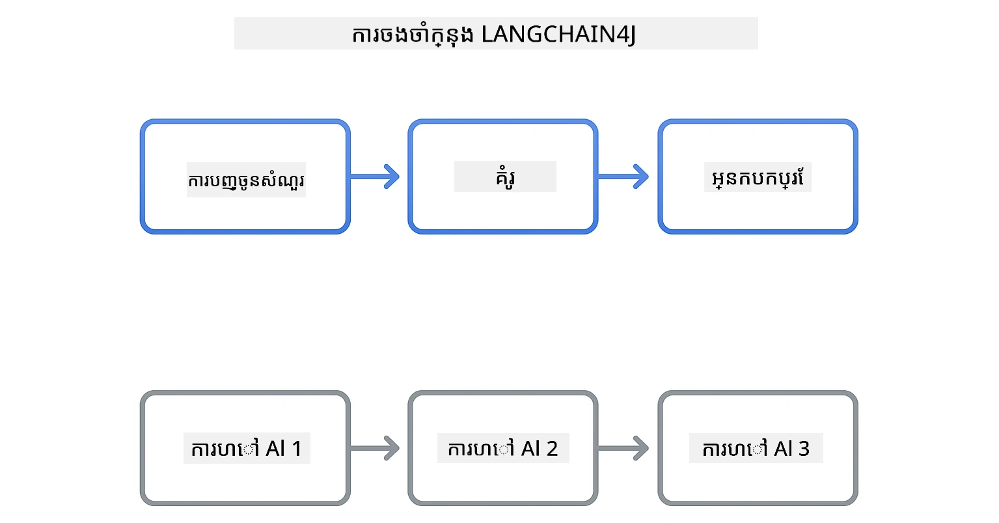
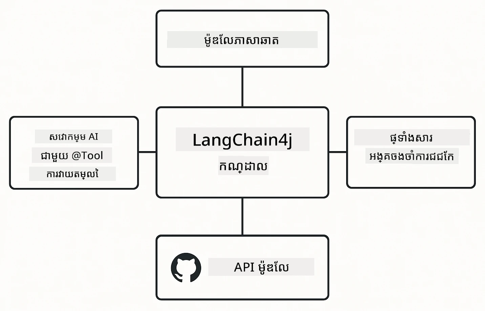

# ម៉ូឌុល 00: ចាប់ផ្តើមរហ័ស

## តារាងមាតិកា

- [ការណែនាំ](#ការណែនាំ)
- [LangChain4j ជាអ្វី?](#langchain4j-ជាអ្វី)
- [ការពឹងផ្អែក LangChain4j](#ការពឹងផ្អែក-langchain4j)
- [លក្ខខណ្ឌមុន](#លក្ខខណ្ឌមុន)
- [ការតំឡើង](#ការតំឡើង)
  - [1. ទទួលបាន Token GitHub របស់អ្នក](#1-ទទួលបាន-token-github-របស់អ្នក)
  - [2. កំណត់ Token របស់អ្នក](#2-កំណត់-token-របស់អ្នក)
- [រត់ឧទាហរណ៍](#រត់ឧទាហរណ៍)
  - [1. ជជែកមូលដ្ឋាន](#1-ជជែកមូលដ្ឋាន)
  - [2. គំរូ Prompt](#2-គំរូ-prompt)
  - [3. ការហៅមុខងារ](#3-ការហៅមុខងារ)
  - [4. សំណួរ-ចម្លើយឯកសារ (Easy RAG)](#4-សំណួរ-ចម្លើយឯកសារ-easy-rag)
  - [5. ដំណើរការយ៉ាងទទួលខុសត្រូវ](#5-ដំណើរការយ៉ាងទទួលខុសត្រូវ)
- [អ្វីដែលឧទាហរណ៍នីមួយៗបង្ហាញ](#អ្វីដែលឧទាហរណ៍នីមួយៗបង្ហាញ)
- [ជំហានបន្ទាប់](#ជំហានបន្ទាប់)
- [ដំណោះស្រាយបញ្ហា](#ដំណោះស្រាយបញ្ហា)

## ការណែនាំ

ការចាប់ផ្តើមរហ័សនេះមានគោលបំណងឲ្យអ្នកអាចប្រើ LangChain4j បានឆាប់រហ័សបំផុត។ វាមានប៉ុណ្ណោះជាផ្នែកមូលដ្ឋាននៃការលាយបញ្ចូលកម្មវិធី AI ជាមួយ LangChain4j និង GitHub Models។ នៅក្នុងម៉ូឌុលបន្ទាប់ អ្នកនឹងប្ដូរទៅ Azure OpenAI និង GPT-5.2 ហើយជ្រៀតជ្រែកជ្រៅជាងនីមួយៗ។

## LangChain4j ជាអ្វី?

LangChain4j គឺជាបណ្ណាល័យ Java ដែលធ្វើឲ្យការសាងសង់កម្មវិធីដែលផ្គត់ផ្គង់ដោយ AI កាន់តែងាយស្រួល។ ជំនួសការដោះស្រាយអតិថិជន HTTP និងការបកស្រាយ JSON អ្នកបម្រើជាមួយ API Java ស្អាតៗ។

"ខ្សែ" ក្នុង LangChain មានន័យថាការចងខ្សែរភ្ជាប់គ្នារវាងសមាសភាពជាច្រើន — អ្នកអាចចង prompt ទៅម៉ូឌែល ទៅ parser ឬចងកិច្ចហៅ AI ជាច្រើនរួមគ្នា ដែលលទ្ធផលមួយផ្គត់ផ្គង់ជា input បន្ទាប់។ ការចាប់ផ្តើមរហ័សនេះផ្តោតលើមូលដ្ឋានមុនពេលស្វែងយល់ខ្សែស្មុគស្មាញជាងនេះ។



*ការចងខ្សែសមាសភាពក្នុង LangChain4j - ឧបករណ៍សង់ភាគហ៊ុនដែលភ្ជាប់គ្នាដើម្បីបង្កើតដំណើរការងារចំណី AI មានអំណាច*

យើងនឹងប្រើរូបមន្តចម្បងបី៖

**ChatModel** - វិភាគសម្រាប់ការប្រាស្រ័យទាក់ទងជាមួយម៉ូឌែល AI។ ហៅ `model.chat("prompt")` ហើយទទួលបានខ្សែប្រែតប។ យើងប្រើ `OpenAiOfficialChatModel` ដែលដំណើរការជាមួយចំណុចបញ្ចូល OpenAI-compatible ដូចជា GitHub Models។

**AiServices** - បង្កើតចំណុចបម្រើ AI ផ្ទាល់ខ្លួន។ កំណត់វិធីសាស្រ្ត ដាក់ស្លាកជាមួយ `@Tool` ហើយ LangChain4j នឹងដោះស្រាយការរៀបចំអនុវត្តរបស់វា។ AI នឹងហៅវិធីសាស្រ្ត Java របស់អ្នកដោយស្វ័យប្រវត្តិពេលចាំបាច់។

**MessageWindowChatMemory** - រក្សាទុកប្រវត្តិជជែក។ ប្រសិនមិនមានវា សំណើរៀងរាល់សំណុំឯកសារតាំងឡាយដោយឯករាជ្យ។ មានវា AI នឹងចងចាំសារប្រកាសមុនៗ និងរក្សាបរិបទក្នុងច្រើនសកម្មភាពជន្ទល់។



*ស្ថាបត្យកម្ម LangChain4j - សមាសភាពស្នូលដំណើរការជាមួយគ្នាដើម្បីផ្គត់ផ្គង់កម្មវិធី AI របស់អ្នក*

## ការពឹងផ្អែក LangChain4j

ការចាប់ផ្តើមរហ័សនេះប្រើការពឹងផ្អែក Maven បីមុខក្នុង [`pom.xml`](../../../00-quick-start/pom.xml):

```xml
<!-- Core LangChain4j library -->
<dependency>
    <groupId>dev.langchain4j</groupId>
    <artifactId>langchain4j</artifactId> <!-- Inherited from BOM in root pom.xml -->
</dependency>

<!-- OpenAI integration (works with GitHub Models) -->
<dependency>
    <groupId>dev.langchain4j</groupId>
    <artifactId>langchain4j-open-ai-official</artifactId> <!-- Inherited from BOM in root pom.xml -->
</dependency>

<!-- Easy RAG: automatic splitting, embedding, and retrieval -->
<dependency>
    <groupId>dev.langchain4j</groupId>
    <artifactId>langchain4j-easy-rag</artifactId> <!-- Inherited from BOM in root pom.xml -->
</dependency>
```

ម៉ូឌុល `langchain4j-open-ai-official` ផ្គូផ្គងថ្នាក់ `OpenAiOfficialChatModel` ដែលភ្ជាប់ទៅ API មានលក្ខណៈ OpenAI-compatible។ GitHub Models ប្រើទ្រង់ទ្រាយ API ដូចគ្នា ដូច្នេះមិនចាំបាច់មាន adapter ពិសេសទេ — គ្រាន់តែបង្ហាញ URL មូលដ្ឋានទៅ `https://models.github.ai/inference` ។

ម៉ូឌុល `langchain4j-easy-rag` ផ្ដល់ជូនការបំបែកឯកសារដោយស្វ័យប្រវត្តិ ការបញ្ចូល embedding និងការដកយក retrieval ដូច្នេះអ្នកអាចសង់កម្មវិធី RAG បានដោយមិនត្រូវកំណត់ដៃរាល់ជំហានទេ។

## លក្ខខណ្ឌមុន

**ប្រើ Dev Container?** Java និង Maven បានតំឡើងរួចជាស្រេច។ អ្នកត្រូវតែមានតែ Token Personal Access GitHub màng។

**ការអភិវឌ្ឍន៍ក្នុងតំបន់**៖
- Java 21+, Maven 3.9+
- Token Personal Access GitHub (សេចក្ដីណែនាំខាងក្រោម)

> **សម្គាល់:** ម៉ូឌុលនេះប្រើ `gpt-4.1-nano` ពី GitHub Models។ កុំផ្លាស់ប្ដូរឈ្មោះម៉ូឌែលក្នុងកូដ - វាត្រូវបានកំណត់ជាស្រេចដើម្បីដំណើរការជាមួយម៉ូឌែលដែលមានក្នុង GitHub ។

## ការតំឡើង

### 1. ទទួលបាន Token GitHub របស់អ្នក

1. ទៅកាន់ [GitHub Settings → Personal Access Tokens](https://github.com/settings/personal-access-tokens)
2. ចុច "Generate new token"
3. កំណត់ឈ្មោះពណ៌នា (ឧ. "LangChain4j Demo")
4. កំណត់កំណត់ថ្ងៃផុតកំណត់ (មូលដ្ឋាន 7ថ្ងៃ)
5. នៅក្រោម "Account permissions" រក "Models" និងកំណត់ទៅ "Read-only"
6. ចុច "Generate token"
7. ចម្លង និងរក្សាទុក token របស់អ្នក — វានឹងមិនបង្ហាញឡើងវិញទេ

### 2. កំណត់ Token របស់អ្នក

**ជម្រើស 1: ប្រើ VS Code (យកអនុសាសន៍)**

បើអ្នកប្រើ VS Code បន្ថែម token របស់អ្នកទៅក្នុងឯកសារ `.env` នៅជម្រកគម្រោង៖

បើឯកសារ `.env` មិនមានទេ ចម្លង `.env.example` ទៅ `.env` ឬបង្កើតឯកសារ `.env` ថ្មីនៅជម្រកគម្រោង។

**ឧទាហរណ៍ឯកសារ `.env`:**
```bash
# នៅក្នុង /workspaces/LangChain4j-for-Beginners/.env
GITHUB_TOKEN=your_token_here
```

បន្ទាប់មកអ្នកអាចចុចស្ដាំលើឯកសារបង្ហាញ (ឧ. `BasicChatDemo.java`) នៅក្នុង Explorer ហើយជ្រើស **"Run Java"** ឬប្រើការកំណត់ការចាប់ផ្តើមពីផ្នែក Run and Debug។

**ជម្រើស 2: ប្រើ Terminal**

កំណត់ token ជាអថេរស្ថានបរិយាកាស៖

**Bash:**
```bash
export GITHUB_TOKEN=your_token_here
```

**PowerShell:**
```powershell
$env:GITHUB_TOKEN=your_token_here
```

## រត់ឧទាហរណ៍

**ប្រើ VS Code:** គ្រាន់តែចុចស្ដាំលើឯកសារបង្ហាញណាមួយនៅក្នុង Explorer ហើយជ្រើស **"Run Java"**, ឬប្រើកំណត់ចាប់ផ្តើមពីផ្នែក Run and Debug (ប្រាកដថាអ្នកបានបន្ថែម token ទៅឯកសារ `.env` មុននេះ)។

**ប្រើ Maven:** ជម្រើសផ្សេង៖ អ្នកអាចដំណើរការពីបន្ទាត់បញ្ជា៖

### 1. ជជែកមូលដ្ឋាន

**Bash:**
```bash
mvn compile exec:java -Dexec.mainClass=com.example.langchain4j.quickstart.BasicChatDemo
```

**PowerShell:**
```powershell
mvn --% compile exec:java -Dexec.mainClass=com.example.langchain4j.quickstart.BasicChatDemo
```

### 2. គំរូ Prompt

**Bash:**
```bash
mvn compile exec:java -Dexec.mainClass=com.example.langchain4j.quickstart.PromptEngineeringDemo
```

**PowerShell:**
```powershell
mvn --% compile exec:java -Dexec.mainClass=com.example.langchain4j.quickstart.PromptEngineeringDemo
```

បង្ហាញ zero-shot, few-shot, chain-of-thought, និង role-based prompting។

### 3. ការហៅមុខងារ

**Bash:**
```bash
mvn compile exec:java -Dexec.mainClass=com.example.langchain4j.quickstart.ToolIntegrationDemo
```

**PowerShell:**
```powershell
mvn --% compile exec:java -Dexec.mainClass=com.example.langchain4j.quickstart.ToolIntegrationDemo
```

AI នឹងហៅវិធីសាស្រ្ត Java របស់អ្នកដោយស្វ័យប្រវត្តិពេលត្រូវការ។

### 4. សំណួរ-ចម្លើយឯកសារ (Easy RAG)

**Bash:**
```bash
mvn compile exec:java -Dexec.mainClass=com.example.langchain4j.quickstart.SimpleReaderDemo
```

**PowerShell:**
```powershell
mvn --% compile exec:java -Dexec.mainClass=com.example.langchain4j.quickstart.SimpleReaderDemo
```

សួរពីឯកសាររបស់អ្នកដោយប្រើ Easy RAG ជាមួយការបញ្ចូល embedding និង retrieval ដោយស្វ័យប្រវត្តិ។

### 5. ដំណើរការយ៉ាងទទួលខុសត្រូវ

**Bash:**
```bash
mvn compile exec:java -Dexec.mainClass=com.example.langchain4j.quickstart.ResponsibleAIDemo
```

**PowerShell:**
```powershell
mvn --% compile exec:java -Dexec.mainClass=com.example.langchain4j.quickstart.ResponsibleAIDemo
```

មើលវិធានការសុវត្ថិភាព AI ដែលបិទខ្លឹមសារមិនប្រក្រតី។

## អ្វីដែលឧទាហរណ៍នីមួយៗបង្ហាញ

**ជជែកមូលដ្ឋាន** - [BasicChatDemo.java](../../../00-quick-start/src/main/java/com/example/langchain4j/quickstart/BasicChatDemo.java)

ចាប់ផ្តើមនៅទីនេះ ដើម្បីមើល LangChain4j ក្នុងរូបមន្តដ៏សាមញ្ញបំផុត។ អ្នកនឹងបង្កើត `OpenAiOfficialChatModel`, ផ្ញើ prompt ជាមួយ `.chat()`, ហើយទទួលការឆ្លើយតប។ នេះបង្ហាញមូលដ្ឋាន៖ របៀបចាប់ផ្តើមម៉ូឌែលជាមួយចំណុចបញ្ចូល និង API keys។ ពេលអ្នកយល់របៀបនេះ ប្រសិនបើអ្វីផ្សេងៗទៀតសំណង់លើវា។

```java
OpenAiOfficialChatModel model = OpenAiOfficialChatModel.builder()
    .baseUrl("https://models.github.ai/inference")
    .apiKey(System.getenv("GITHUB_TOKEN"))
    .modelName("gpt-4.1-nano")
    .build();

String response = model.chat("What is LangChain4j?");
System.out.println(response);
```

> **🤖 សាកល្បងជាមួយ [GitHub Copilot](https://github.com/features/copilot) Chat:** បើក [`BasicChatDemo.java`](../../../00-quick-start/src/main/java/com/example/langchain4j/quickstart/BasicChatDemo.java) ហើយសួរ៖
> - "តើខ្ញុំធ្វើដូចម្តេចប្ដូរពី GitHub Models ទៅ Azure OpenAI ក្នុងកូដនេះ?"
> - "តើមានប៉ារ៉ាម៉ែត្រាអ្វីផ្សេងទៀតដែលខ្ញុំអាចកំណត់ក្នុង OpenAiOfficialChatModel.builder()?"
> - "តើធ្វើដូចម្តេចដើម្បីបន្ថែម streaming responses រឿយៗ មិនបន្តរហូតទាល់តែបានចម្លើយពេញ?"

**ការបង្កើត Prompt** - [PromptEngineeringDemo.java](../../../00-quick-start/src/main/java/com/example/langchain4j/quickstart/PromptEngineeringDemo.java)

ឥឡូវនេះដែលអ្នកបានដឹងរបៀបនិយាយទៅម៉ូឌែល ចាំមើលអ្វីដែលអ្នកនិយាយទៅវា។ ឧទាហរណ៍នេះប្រើវិធីសាស្រ្តម៉ូឌែលដដែល បង្ហាញគំរូ prompting ប្រាំផ្សេងគ្នា។ សាកល្បង zero-shot prompts សម្រាប់ការណែនាំផ្ទាល់, few-shot prompts ដែលរៀនពីគំរូ, chain-of-thought prompts ដែលបង្ហាញដំណាក់កាលគិត, និង role-based prompts ដែលកំណត់បរិបទ។ អ្នកនឹងឃើញម៉ូឌែលដដែលផ្ដល់លទ្ធផលខុសគ្នាយ៉ាងខ្លាំងផ្អែកលើរបៀបអ្នកកំណត់សំណើ។

ឧទាហរណ៍នេះក៏បង្ហាញសាច់រឿង prompt templates ដែលជាវិធីខ្លាំងមួយក្នុងការបង្កើត prompts ប្រើបានឡើងវិញជាមួយអថេរ។
ឧទាហរណ៍ខាងក្រោមបង្ហាញ prompt ប្រើ `PromptTemplate` នៃ LangChain4j ដើម្បីបញ្ចូលអថេរ។ AI នឹងឆ្លើយតបផ្អែកលើចំណុចផ្នែក និងសកម្មភាពដែលបានផ្ដល់។

```java
PromptTemplate template = PromptTemplate.from(
    "What's the best time to visit {{destination}} for {{activity}}?"
);

Prompt prompt = template.apply(Map.of(
    "destination", "Paris",
    "activity", "sightseeing"
));

String response = model.chat(prompt.text());
```

> **🤖 សាកល្បងជាមួយ [GitHub Copilot](https://github.com/features/copilot) Chat:** បើក [`PromptEngineeringDemo.java`](../../../00-quick-start/src/main/java/com/example/langchain4j/quickstart/PromptEngineeringDemo.java) ហើយសួរ៖
> - "តើមានភាពខុសគ្នាអ្វីខ្លះរវាង zero-shot និង few-shot prompting ហើយពេលណាខ្ញុំគួរប្រើមួយ?"
> - "តើប៉ារ៉ាម៉ែត្រា temperature មានឥទ្ធិពលយ៉ាងដូចម្តេចលើយន្តការឆ្លើយតបរបស់ម៉ូឌែល?"
> - "តើមានវិធីសាស្រ្តអ្វីខ្លះដើម្បីទប់ស្កាត់ការវាយលុក prompt injection នៅក្នុងផលិតផល?"
> - "តើធ្វើដូចម្តេចដើម្បីបង្កើតអវត្តមាន PromptTemplate ដែលប្រើឡើងវិញសម្រាប់គំរូទូទៅ?"

**ការតភ្ជាប់ឧបករណ៍** - [ToolIntegrationDemo.java](../../../00-quick-start/src/main/java/com/example/langchain4j/quickstart/ToolIntegrationDemo.java)

នេះជាកន្លែងដែល LangChain4j មានអំណាចខ្លាំង។ អ្នកនឹងប្រើ `AiServices` ដើម្បីបង្កើតជំនួយការមាន AI អាចហៅវិធីសាស្រ្ត Java របស់អ្នក។ គ្រាន់តែដាក់ស្លាកវិធីសាស្រ្តជាមួយ `@Tool("ពិពណ៌នា")` ហើយ LangChain4j នឹងដោះស្រាយអ្វីៗទាំងអស់ – AI ដឹងដោយស្វ័យប្រវត្តិពេលណាគួរប្រើឧបករណ៍មួយៗ ដោយផ្អែកលើយុទ្ធសាស្រ្តដែលអ្នកសុំ។ វាបង្ហាញការហៅមុខងារ ដែលជាវិធីសាស្រ្តសំខាន់សម្រាប់សាងសង់ AI ដែលអាចធ្វើសកម្មភាព មិនមែនត្រឹមតែឆ្លើយសំណួរទេ។

```java
@Tool("Performs addition of two numeric values")
public double add(double a, double b) {
    return a + b;
}

MathAssistant assistant = AiServices.builder(MathAssistant.class)
    .chatModel(model)
    .tools(new Calculator())
    .chatMemory(MessageWindowChatMemory.withMaxMessages(10))
    .build();
String response = assistant.chat("What is 25 plus 17?");
```

> **🤖 សាកល្បងជាមួយ [GitHub Copilot](https://github.com/features/copilot) Chat:** បើក [`ToolIntegrationDemo.java`](../../../00-quick-start/src/main/java/com/example/langchain4j/quickstart/ToolIntegrationDemo.java) ហើយសួរ៖
> - "តើស្លាក @Tool ធ្វើការ​យ៉ាងដូចម្តេច ហើយ LangChain4j ធ្វើអ្វីជាមួយវានៅក្រោយដេគ័រ?"
> - "តើ AI អាចហៅឧបករណ៍ជាច្រើនជាទំរង់លំដាប់ដើម្បីដោះស្រាយបញ្ហាស្មុគស្មាញបានទេ?"
> - "តើមានអ្វីកើតឡើងបើឧបករណ៍បោះបង់ករណីកំហុស — តើខ្ញុំគួរដោះស្រាយកំហុសយ៉ាងដូចម្តេច?"
> - "តើធ្វើដូចម្តេចដើម្បីភ្ជាប់ API ពិតប្រាកដជំនួសឧទាហរណ៍ calculator នេះ?"

**សំណួរ-ចម្លើយឯកសារ (Easy RAG)** - [SimpleReaderDemo.java](../../../00-quick-start/src/main/java/com/example/langchain4j/quickstart/SimpleReaderDemo.java)

នៅទីនេះ អ្នកនឹងឃើញ RAG (retrieval-augmented generation) ប្រើវិធីសាស្រ្ត "Easy RAG" របស់ LangChain4j។ ឯកសារត្រូវបានផ្ទុក ស្វ័យប្រវត្តិក្នុងការបំបែក និងបញ្ចូល embedding ទៅក្នុងឃ្លាំងក្នុងចិត្ត ហើយអ្នកប្រើ content retriever ផ្ដល់ផ្នែកទាក់ទងទៅ AI ពេលសួរ។ AI ឆ្លើយតបផ្អែកលើឯកសាររបស់អ្នក មិនមែនជាលទ្ធផលទូទៅសម្រាប់ចំណេះដឹងទេ។

```java
Document document = loadDocument(Paths.get("document.txt"));

InMemoryEmbeddingStore<TextSegment> embeddingStore = new InMemoryEmbeddingStore<>();
EmbeddingStoreIngestor.ingest(List.of(document), embeddingStore);

Assistant assistant = AiServices.builder(Assistant.class)
        .chatModel(chatModel)
        .chatMemory(MessageWindowChatMemory.withMaxMessages(10))
        .contentRetriever(EmbeddingStoreContentRetriever.from(embeddingStore))
        .build();

String answer = assistant.chat("What is the main topic?");
```

> **🤖 សាកល្បងជាមួយ [GitHub Copilot](https://github.com/features/copilot) Chat:** បើក [`SimpleReaderDemo.java`](../../../00-quick-start/src/main/java/com/example/langchain4j/quickstart/SimpleReaderDemo.java) ហើយសួរ៖
> - "តើ RAG ធ្វើដូចម្តេចដើម្បីទប់ស្កាត់ការត្រលប់មិនពិតរបស់ AI ប្រសិនបើប្រៀបធៀបនឹងប្រើទិន្នន័យបណ្ដុះបណ្ដាលរបស់ម៉ូឌែល?"
> - "តើភាពខុសគ្នាអ្វីខ្លះរវាងវិធីសាស្រ្តងាយៗនេះ និងបាញ់ RAG ផ្ទាល់ខ្លួន?"
> - "តើធ្វើដូចម្តេចដើម្បីពង្រីកវាដើម្បីគ្រប់គ្រងឯកសារច្រើន ឬមូលដ្ឋានចំណេះដឹងធំ?"

**ដំណើរការយ៉ាងទទួលខុសត្រូវ** - [ResponsibleAIDemo.java](../../../00-quick-start/src/main/java/com/example/langchain4j/quickstart/ResponsibleAIDemo.java)

សាងសង់សុវត្ថិភាព AI ជាមួយការពារផ្នែកជាច្រើន។ ឧទាហរណ៍នេះបង្ហាញពីការការពារមានស្រទាប់ពីរដោយដំណើរការជាមួយគ្នា៖

**ផ្នែកទី 1: LangChain4j Input Guardrails** - បិទសារ prompt ដែលធ្វើអាក្រក់មុនពួកវាចូលដល់ LLM។ បង្កើត guardrails ផ្ទាល់ខ្លួនដែលត្រួតពិនិត្យពាក្យគន្លឹះ ឬគំរូហាមឃាត់។ វាត្រូវបានរត់ក្នុងកូដរបស់អ្នក ដូច្នេះវារហ័ស និងឥតគិតថ្លៃ។

```java
class DangerousContentGuardrail implements InputGuardrail {
    @Override
    public InputGuardrailResult validate(UserMessage userMessage) {
        String text = userMessage.singleText().toLowerCase();
        if (text.contains("explosives")) {
            return fatal("Blocked: contains prohibited keyword");
        }
        return success();
    }
}
```

**ផ្នែកទី 2: Provider Safety Filters** - GitHub Models មានថ្នាក់រាំងខ្ទប់ដែលចាប់អ្វីដែល guardrails របស់អ្នកអាចខកខាន។ អ្នកនឹងឃើញការរាំងខ្ទប់តឹង (កំហុស HTTP 400) សម្រាប់ការរាំងខ្ទប់ធ្ងន់ធ្ងរ និងការល៉ែងបំលែងដោយទោសដែល AI រំលងដោយសុភាព។

> **🤖 សាកល្បងជាមួយ [GitHub Copilot](https://github.com/features/copilot) Chat:** បើក [`ResponsibleAIDemo.java`](../../../00-quick-start/src/main/java/com/example/langchain4j/quickstart/ResponsibleAIDemo.java) ហើយសួរ៖
> - "InputGuardrail ជាអ្វី ហើយធ្វើដូចម្តេចដើម្បីបង្កើតរបស់ខ្លួន?"
> - "ភាពខុសគ្នារវាងការរាំងខ្ទបតឹង និងការលោតត្រឡប់ ស្ថិតនៅណា?"
> - "ហេតុអ្វីបានជាប្រើ guardrails និង filters រួមគ្នា?"

## ជំហានបន្ទាប់

**ម៉ូឌុលបន្ទាប់៖** [01-introduction - Getting Started with LangChain4j](../01-introduction/README.md)

---

**ការរុករក៖** [← ត្រឡប់ទៅមុខចម្បង](../README.md) | [បន្ទាប់៖ ម៉ូឌុល 01 - ការណែនាំ →](../01-introduction/README.md)

---

## ដំណោះស្រាយបញ្ហា

### សំណុំ Maven ដំបូង

**បញ្ហា**: `mvn clean compile` ឬ `mvn package` ដំបូងចំណាយពេលយូរ (១០-១៥ នាទី)

**មូលហេតុ**: Maven ត្រូវការទាញទាញការពឹងផ្អែកគ្រប់យ៉ាង (Spring Boot, បណ្ណាល័យ LangChain4j, Azure SDKs, ល) នៅលើសំណុំដំបូង។

**ដំណោះស្រាយ**: នេះគឺជា​ជំនួសធម្មតា។ ការស្នើរសុំបន្ទាប់នឹងរហ័សជាង ចំពោះសារព័ត៌មានដែលបានរក្សាទុកក្នុងតំបន់។ ពេលទាញយកអាស្រ័យលើល្បឿនបណ្ដាញរបស់អ្នក។

### ពាក្យបញ្ជា Maven របស់ PowerShell

**បញ្ហា**: ពាក្យបញ្ជា Maven បរាជ័យជាមួយកំហុស `Unknown lifecycle phase ".mainClass=..."`
**មូលហេតុ**: PowerShell ពិចារណាពាក្យ `=` ជាអ្នកប្រតិបត្តិការចាត់ចែងអថេរ ដែលបំបែកវាក្យសម្ព័ន្ធគុណលក្ខណៈ Maven

**ដំណោះស្រាយ**: ប្រើតួអក្សរស្រើបចាប់ parsing `--%` មុនពាក្យបញ្ជា Maven៖

**PowerShell:**
```powershell
mvn --% compile exec:java -Dexec.mainClass=com.example.langchain4j.quickstart.BasicChatDemo
```

**Bash:**
```bash
mvn compile exec:java -Dexec.mainClass=com.example.langchain4j.quickstart.BasicChatDemo
```

តួអក្សរ `--%` ប្រាប់ PowerShell អោយបញ្ជូនអាគុយម៉ង់ដែលនៅសល់ទាំងអស់ទៅ Maven ដោយផ្ទាល់ដោយគ្មានការបកស្រាយ។

### ការបង្ហាញអេម៉ូជី Windows PowerShell

**បញ្ហា**: ការឆ្លើយតបទៅ AI បង្ហាញអක្សរច្រាសចរ (ឧ. `????` ឬ `â??`) ជំនួសអេម៉ូជីនៅ PowerShell

**មូលហេតុ**: ការអ៊ិនកូដលំនាំដើមរបស់ PowerShell មិនគាំទ្រអេម៉ូជី UTF-8 ទេ

**ដំណោះស្រាយ**: រត់ពាក្យបញ្ជានេះមុនពេលបញ្ចូលកម្មវិធី Java:
```cmd
chcp 65001
```

នេះបង្ខំអោយមានការអ៊ិនកូដ UTF-8 នៅក្នុងទ терминាល់។ ជាជម្រើស វាអាចប្រើ Windows Terminal ដែលមានការគាំទ្រអក្សរយូនីកូដល្អជាង។

### ការបញ្ឆិត API Calls

**បញ្ហា**: កំហុសការផ្ទៀងផ្ទាត់ អត្រាកំណត់ ឬការឆ្លើយតបមិនរំពឹងទុកពីម៉ូដែល AI

**ដំណោះស្រាយ**: ឧទាហរណ៍មាន `.logRequests(true)` និង `.logResponses(true)` ដើម្បីបង្ហាញការហៅ API នៅ console។ វាជួយក្នុងការបញ្ឆិតកំហុសផ្ទៀងផ្ទាត់ អត្រាកំណត់ ឬការឆ្លើយតបមិនរំពឹងទុក។ ដកចេញប៊្លាស់ទាំងនេះនៅពេលផលិតកម្មដើម្បីកាត់បន្ថយសំឡេងកំណត់ហេតុ។

---

<!-- CO-OP TRANSLATOR DISCLAIMER START -->
**ការបដិសេធ**៖
ឯកសារនេះត្រូវបានបកប្រែដោយប្រើសេវាបកប្រែកម្មវិធី AI [Co-op Translator](https://github.com/Azure/co-op-translator)។ ទាំងដែលយើងខិតខំសំរាប់ភាពត្រឹមត្រូវ សូមយល់ឱ្យបានថាការបកប្រែកម្មវិធីដោយស្វ័យប្រវត្តិអាចមានកំហុស ឬភាពមិនត្រឹមត្រូវ។ ឯកសារដើមនៅក្នុងភាសាតំបន់របស់ខ្លួនគួរត្រូវបានឱ្យភាពមានសុពលភាពជាផ្លូវការបំផុត។ សម្រាប់ព័ត៌មានសំខាន់ៗ សំណូមពរបកប្រែដោយអ្នកជំនាញដែលមានជំនាញមនុស្សត្រូវបានណែនាំ។ យើងមិនទទួលខុសត្រូវចំពោះការយល់ច្រឡំ ឬការប្រែប្រាស់យ៉ាងមិនត្រឹមត្រូវណាមួយដែលកើតឡើងពីការប្រើប្រាស់ការបកប្រែនេះឡើយ។
<!-- CO-OP TRANSLATOR DISCLAIMER END -->