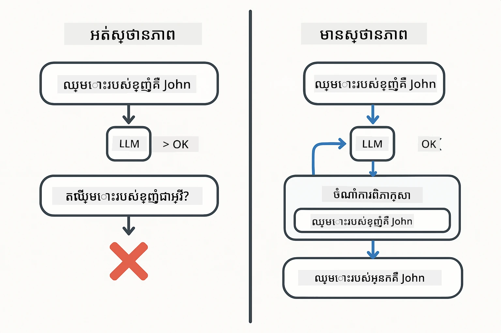
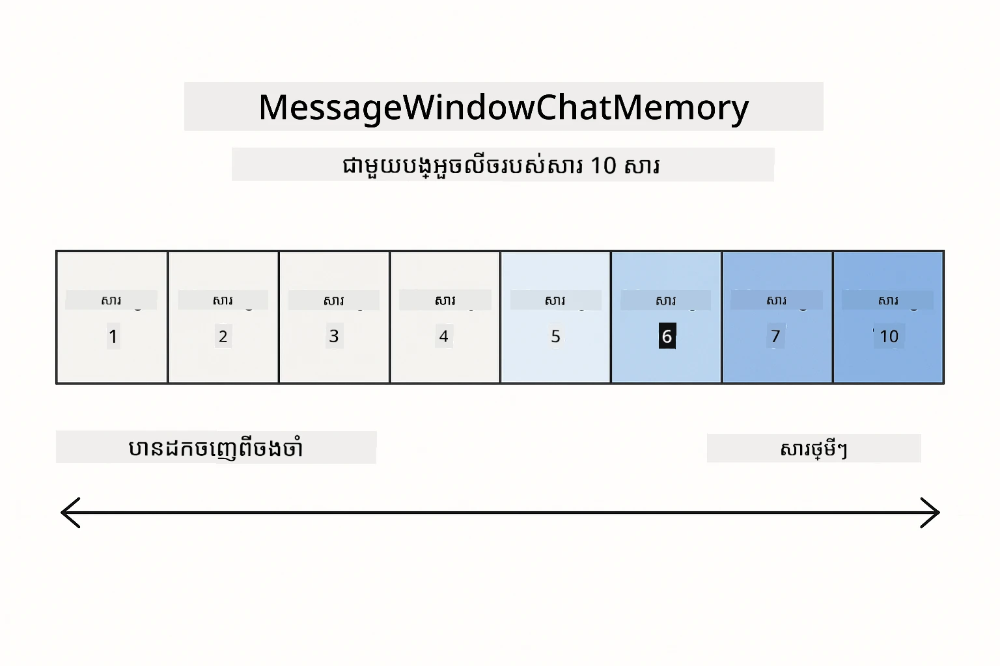
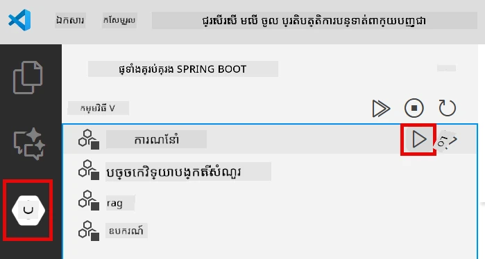
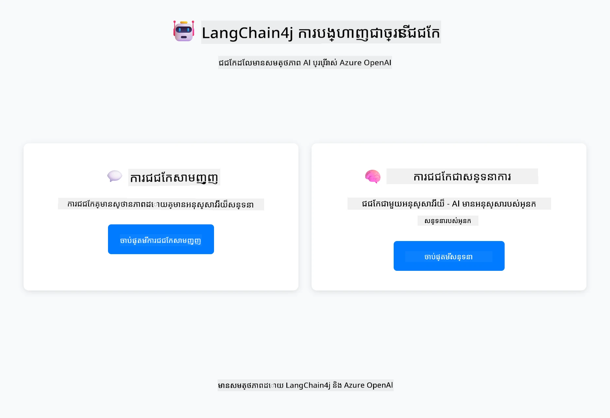
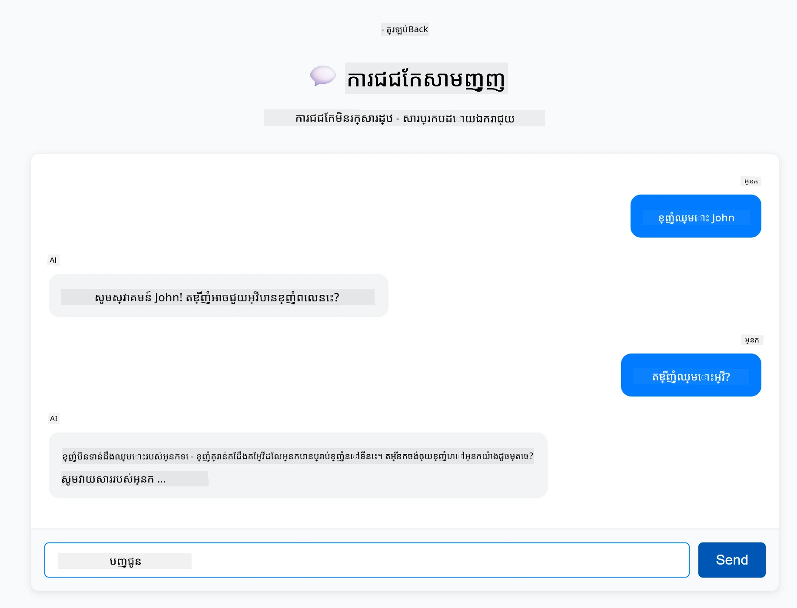
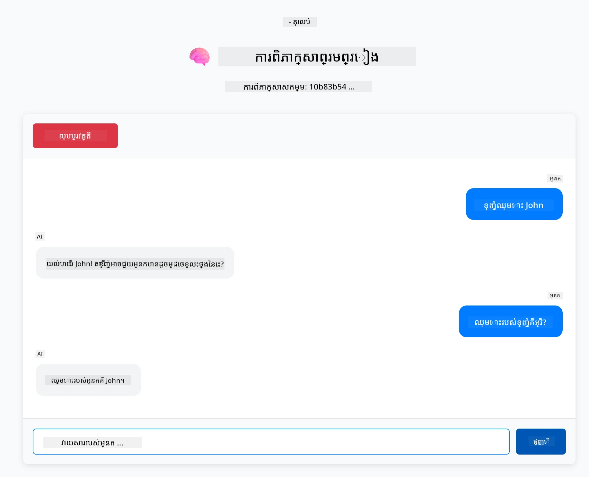

# មេឌុល ០១៖ ការចាប់ផ្តើមជាមួយ LangChain4j

## តារាងមាតិការណ៍

- [វីដេអូបង្ហាញ](#វីដេអូបង្ហាញ)
- [អ្វីដែលអ្នកនឹងរៀន](#អ្វីដែលអ្នកនឹងរៀន)
- [លក្ខខណ្ឌមុន](#លក្ខខណ្ឌមុន)
- [ការយល់ដឹងអំពីបញ្ហាគ្រឹះ](#ការយល់ដឹងអំពីបញ្ហាគ្រឹះ)
- [ការយល់ដឹងអំពីសញ្ញាសំគាល់](#ការយល់ដឹងអំពីសញ្ញាសំគាល់)
- [របៀបដំណើរការមេមឺរី](#របៀបដំណើរការមេមឺរី)
- [របៀបដែលនេះប្រើ LangChain4j](#របៀបដែលនេះប្រើ-langchain4j)
- [ចាត់ចែង និងដាក់បញ្ចូលហេដ្ឋារចនាសម្ព័ន្ធ Azure OpenAI](#ចាត់ចែង-និងដាក់បញ្ចូលហេដ្ឋារចនាសម្ព័ន្ធ-azure-openai)
- [បើកដំណើរការ​កម្មវិធី​នៅ​តំបន់មូលដ្ឋាន](#បើកដំណើរការ​កម្មវិធី​នៅ​តំបន់មូលដ្ឋាន)
- [ការប្រើកម្មវិធី](#ការប្រើកម្មវិធី)
  - [ជជែកមិនមានស្ថានភាព (ផ្នែកឆ្វេង)](#ជជែកមិនមានស្ថានភាព-ផ្នែកឆ្វេង)
  - [ជជែកមានស្ថានភាព (ផ្នែកស្តាំ)](#ជជែកមានស្ថានភាព-ផ្នែកស្តាំ)
- [ជំហានបន្ទាប់](#ជំហានបន្ទាប់)

## វីដេអូបង្ហាញ

មើលសម័យផ្សាយបន្តផ្ទាល់នេះ ដែលពន្យល់ពីរបៀបចាប់ផ្តើមជាមួយមេឌុលនេះ៖

<a href="https://www.youtube.com/live/nl_troDm8rQ?si=6b85S8xGjWnT2fX9"></a>

## អ្វីដែលអ្នកនឹងរៀន

ក្នុងការចាប់ផ្ដើមលឿន អ្នកបានប្រើម៉ូឌែល GitHub ដើម្បីផ្ញើសំណើរ ហៅឧបករណ៍ បង្កើតផ្លូវ RAG និងសាកល្បងការការពារ។ បង្ហាញទាំងនោះបង្ហាញអ្វីដែលអាចធ្វើបាន — ឥលូវយើងប្រែទៅប្រើ Azure OpenAI និង GPT-5.2 ហើយចាប់ផ្តើមបង្កើតកម្មវិធីស្ទីលផលិតកម្ម។ មេឌុលនេះផ្ដោតលើ AI សន្ទនាដែលចងចាំ context និងរក្សាស្ថានភាព — គំនិតដែលបង្ហាញក្នុងសម័យចាប់ផ្តើមលឿន ប៉ុន្តែមិនបានពន្យល់។

យើងនឹងប្រើ GPT-5.2 របស់ Azure OpenAI ជារយៈពេលដឹកនាំនេះ ព្រោះសមត្ថភាពសំរាប់គំនិតៈចំលែកកម្រិតខ្ពស់បន្ថែមធ្វើអោយអាកប្បបរមាផ្គួបគ្នានៅលើរចនាប័ទ្មផ្សេងៗច្បាស់លាស់ជាងមុន។ ពេលអ្នកបន្ថែមមេមឺរី អ្នកនឹងឃើញភាពខុសគ្នាច្បាស់។ វាធ្វើអោយយល់យ៉ាងងាយស្រួលថាផ្នែកណាមួយនាំមកអ្វីដល់កម្មវិធីរបស់អ្នក។

អ្នកនឹងបង្កើតកម្មវិធីមួយដែលបង្ហាញរចនាប័ទ្មទាំងពីរ៖

**ជជែកមិនមានស្ថានភាព** - ការសំណើរ​ស្ទើរក្នុងមួយសំណើគឺឯករាជ្យ។ ម៉ូឌែលមិនមានមេមឺរីនៃសារមុនៗទេ។ នេះគឺជារចនាប័ទ្មដែលបានប្រើនៅក្នុងការចាប់ផ្តើមលឿន។

**ជជែកមានស្ថានភាព** - ការសំណើរ​មួយរួមមានប្រវត្តិការសន្ទនា។ ម៉ូឌែលរក្សាស្ថានភាព context រយៈពេលជាច្រើនជំនួស។ នេះគឺជាចាំបាច់សម្រាប់កម្មវិធីផលិតកម្ម។

## លក្ខខណ្ឌមុន

- អនុញ្ញាត Azure ដែលមានចូលប្រើ Azure OpenAI
- Java 21, Maven 3.9+
- Azure CLI (https://learn.microsoft.com/en-us/cli/azure/install-azure-cli)
- Azure Developer CLI (azd) (https://learn.microsoft.com/en-us/azure/developer/azure-developer-cli/install-azd)

> **សម្គាល់៖** Java, Maven, Azure CLI និង Azure Developer CLI (azd) ត្រូវបានដំឡើងរួចជាមុននៅក្នុង devcontainer ដែលបានផ្ដល់។

> **សម្គាល់៖** មេឌុលនេះប្រើ GPT-5.2 នៅលើ Azure OpenAI។ ការចាត់ចែងត្រូវបានកំណត់ដោយស្វ័យប្រវត្តិតាម `azd up` — សូមកុំផ្លាស់ប្តូរឈ្មោះម៉ូឌែលនៅក្នុងកូដ។

## ការយល់ដឹងអំពីបញ្ហាគ្រឹះ

ម៉ូឌែលភាសាគឺមិនមានស្ថានភាពទេ។ ការហៅ API មួយៗជា​ឯករាជ្យ។ ប្រសិនបើអ្នកផ្ញើ "ឈ្មោះខ្ញុំគឺ John" ហើយបន្ទាប់មកសួរ "ឈ្មោះខ្ញុំអ្វី?" ម៉ូឌែលមិនមានគំនិតថា អ្នកទើបជំរាបខ្លួនទេ។ វាប្រព្រឹត្តទៅនូវការសំណើរ​រាល់យ៉ាងដូចជាដើមជជែកដំបូងពិតប្រាកដរបស់អ្នក។

នេះល្អសម្រាប់ Q&A ងាយៗ ប៉ុន្តាមិនប្រយោជន៍សម្រាប់កម្មវិធីពិតប្រាកដទេ។ យន្តហោះបម្រើអតិថិជនត្រូវការចងចាំអ្វីដែលអ្នកបានប្រាប់។ ជំនួយករការផ្ទាល់ខ្លួនត្រូវការចំណេះដឹង context។ ជជែកច្រើនជំហានត្រូវការមេមឺរី។

តារាងខាងក្រោមបង្ហាញការប្រៀបធៀបច្រើនរបស់របៀបទាំងពីរ — ផ្នែកឆ្វេង ជាការហៅមិនមានស្ថានភាពដែលភ្លេចឈ្មោះអ្នក; ផ្នែកស្តាំ ជាការហៅមានស្ថានភាពដែលមាន ChatMemory ដែលចងចាំវា។



*ភាពខុសគ្នារវាងជជែកមិនមានស្ថានភាព (ហៅឯករាជ្យ) និងជជែកមានស្ថានភាព (យល់ context)*

## ការយល់ដឹងអំពីសញ្ញាសំគាល់

មុនចូលក្នុងជជែក វាជារឿងសំខាន់ក្នុងការយល់សញ្ញាសំគាល់ - ឯកតាគោលនៃអត្ថបទដែលម៉ូឌែលភាសាដំណើរការ៖


*ឧទាហរណ៍របៀបអត្ថបទបែកជាសញ្ញាសំគាល់ - "I love AI!" ក្លាយទៅជា ៤ ឯកតា ដំណើរការបំបែក*

សញ្ញាសំគាល់គឺជារបៀបដែលម៉ូឌែល AI វាស់ និងដំណើរការ​អត្ថបទ។ ពាក្យ វាយនភាព និងចន្លោះអាចជាសញ្ញាសំគាល់ផងដែរ។ ម៉ូឌែលរបស់អ្នកមានកំណត់ពីមួយដល់ប៉ុន្មានសញ្ញាសំគាល់វាអាចដំណើរការបានក្នុងមួយពេល (៤០០,០០០ សម្រាប់ GPT-5.2, ជាមួយបញ្ចូលរហូតដល់ ២៧២,០០០ និងបញ្ចេញរហូតដល់ ១២៨,០០០ សញ្ញាសំគាល់)។ ការយល់សញ្ញាសំគាល់ជួយអ្នកគ្រប់គ្រងប្រវែងជជែក និងចំណាយ។

## របៀបដំណើរការមេមឺរី

មេមឺរីជជែកដោះស្រាយបញ្ហាមិនមានស្ថានភាពដោយរក្សាប្រវត្តិជជែក។ មុនផ្ញើសំណើទៅម៉ូឌែល ស៊េវាកម្មនឹងបញ្ចូលសារមុនៗដែលពាក់ព័ន្ធ។ ពេលអ្នកសួរ "ឈ្មោះខ្ញុំអ្វី?" ប្រព័ន្ធពិតប្រាកដផ្ញើប្រវត្តិជជែកទាំងមូល ឱ្យម៉ូឌែលឮថា អ្នកបាននិយាយថា "ឈ្មោះខ្ញុំគឺ John" មុនហើយ។

LangChain4j ផ្ដល់នូវការអនុញ្ញាតមេមឺរីដែលគ្រប់គ្រងស្វ័យប្រវត្តិនេះ។ អ្នកជ្រើសរើសចំនួនសារដែលចង់រក្សា ហើយ framework គ្រប់គ្រង context window។ តារាងខាងក្រោមបង្ហាញរបៀប MessageWindowChatMemory រក្សានូវបង្អួចរអិលនៃសារថ្មីៗ។



*MessageWindowChatMemory រក្សាបង្អួចរអិលនៃសារថ្មីៗ ដោយស្វ័យប្រវត្តិ drop សារចាស់ៗ*

## របៀបដែលនេះប្រើ LangChain4j

មេឌុលនេះបន្ថែមការចាប់ផ្តើមលឿនដោយរួមបញ្ចូល Spring Boot និងបន្ថែមមេមឺរីជជែក។ នេះជារបៀបដែលផ្នែកជាប់គ្នា៖

**ឧបករណ៍ដែលទាមទារ** - បន្ថែមបណ្ណាល័យ LangChain4j ពីរយ៉ាង៖

```xml
<dependency>
    <groupId>dev.langchain4j</groupId>
    <artifactId>langchain4j</artifactId> <!-- Inherited from BOM in root pom.xml -->
</dependency>
<dependency>
    <groupId>dev.langchain4j</groupId>
    <artifactId>langchain4j-open-ai-official</artifactId> <!-- Inherited from BOM in root pom.xml -->
</dependency>
```
  
**ម៉ូឌែលជជែក** - កំណត់ Azure OpenAI ជា Spring bean ([LangChainConfig.java](../../../01-introduction/src/main/java/com/example/langchain4j/config/LangChainConfig.java))៖

```java
@Bean
public OpenAiOfficialChatModel openAiOfficialChatModel() {
    return OpenAiOfficialChatModel.builder()
            .baseUrl(azureEndpoint)
            .apiKey(azureApiKey)
            .modelName(deploymentName)
            .timeout(Duration.ofMinutes(5))
            .maxRetries(3)
            .build();
}
```
  
កម្មវិធីបង្កើតអានសញ្ញាប័ត្រពី environment variables ដែលកំណត់ដោយ `azd up`។ ការកំណត់ `baseUrl` ទៅចំណុចបញ្ចូល Azure របស់អ្នកធ្វើអោយ client OpenAI ធ្វើការ​ជាមួយ Azure OpenAI ។

**មេមឺរីជជែក** - តាមដានប្រវត្តិជជែកជាមួយ MessageWindowChatMemory ([ConversationService.java](../../../01-introduction/src/main/java/com/example/langchain4j/service/ConversationService.java))៖

```java
ChatMemory memory = MessageWindowChatMemory.withMaxMessages(10);

memory.add(UserMessage.from("My name is John"));
memory.add(AiMessage.from("Nice to meet you, John!"));

memory.add(UserMessage.from("What's my name?"));
AiMessage aiMessage = chatModel.chat(memory.messages()).aiMessage();
memory.add(aiMessage);
```
  
បង្កើតមេមឺរីជាមួយ `withMaxMessages(10)` ដើម្បីរក្សាសារចុងក្រោយ ១០ ។ បន្ថែមសារអ្នកប្រើ និង AI ជាមួយអ្នកបន្ទាត់ typed: `UserMessage.from(text)` និង `AiMessage.from(text)`។ ទាញយកប្រវត្តិជាមួយ `memory.messages()` ហើយផ្ញើទៅម៉ូឌែល។ សេវាកម្មរក្សាទុក instance មេមឺរីបំបែកតាម conversation ID, អនុញ្ញាតឱ្យអ្នកប្រើច្រើនជជែកក្នុងពេលតែមួយ។

> **🤖 សាកល្បងជាមួយ [GitHub Copilot](https://github.com/features/copilot) Chat :** បើក [`ConversationService.java`](../../../01-introduction/src/main/java/com/example/langchain4j/service/ConversationService.java) ហើយសួរ៖   
> - "MessageWindowChatMemory បញ្ចេញសារណាដែលពេលបង្អួចពេញដូចម្តេច?"   
> - "តើខ្ញុំអាចអនុវត្តការផ្ទុកមេមឺរីផ្ទាល់ខ្លួនជាមួយមូលដ្ឋានទិន្នន័យផ្ទាន់នឹងមេមឺរីក្នុងចិត្តបានទេ?"   
> - "តើខ្ញុំនឹងបន្ថែមសរុបមាត្រសំរាប់បង្ហាប់ប្រវត្តិជជែកចាស់ៗយ៉ាងដូចម្តេច?"  

ចំណុចចូលជជែកមិនមានស្ថានភាពមិនឆែកមេមឺរីទេ - គ្រាន់តែ `chatModel.chat(prompt)` ដូចការចាប់ផ្តើមលឿន។ ចំណុចចូលមានស្ថានភាពបន្ថែមសារទៅមេមឺរី ទាញប្រវត្តិហើយបញ្ចូល context ជាមួយសំណើរ។ ការកំណត់ម៉ូឌែលដូចគ្នា តែរចនាប័ទ្មផ្សេងគ្នា។

## ចាត់ចែង និងដាក់បញ្ចូលហេដ្ឋារចនាសម្ព័ន្ធ Azure OpenAI

**Bash:**  
```bash
cd 01-introduction
azd up  # ជ្រើសរើសការជាវ និងទីតាំង (ត្រូវបានណែនាំ eastus2)
```
  
**PowerShell:**  
```powershell
cd 01-introduction
azd up  # ជ្រើសរើសការជាវ និងទីតាំង (ច្បាប់ណែនាំ eastus2)
```
  
> **សម្គាល់៖** ប្រសិនបើបង្ហាញកំហុស timeout (`RequestConflict: Cannot modify resource ... provisioning state is not terminal`), សូមរត់ `azd up` ម្តងទៀត។ ធនធាន Azure ប្រហែលនៅក្នុងដំណើរការពេលក្រោយ ហើយការព្យាយាមម្ដងទៀតអនុញ្ញាតឱ្យការចាត់ចែងបញ្ចប់ពេលធនធានទៅស្ថានភាពចុងក្រោយ។

នេះនឹង៖  
1. ចាត់ចែងធនធាន Azure OpenAI ជាមួយម៉ូឌែល GPT-5.2 និង text-embedding-3-small  
2. បង្កើតឯកសារ `.env` ដោយស្វ័យប្រវត្តិក្នុងដើមគម្រោង ជាមួយសញ្ញាប័ត្រ  
3. កំណត់អថេរ environment ទាំងអស់ដែលត្រូវការ  

**មានបញ្ហាចាត់ចែង?**មើល [README ហេដ្ឋារចនាសម្ព័ន្ធ](infra/README.md) សម្រាប់ដំណោះស្រាយលម្អិតរួមទាំងបញ្ហាឈ្មោះស៊ឹបដែន បច្ចេកទេសដាក់ផ្សាយដៃ Azure Portal និងមគ្គុទេសក៍កំណត់ម៉ូឌែល។

**ធ្វើការត្រួតពិនិត្យថានៅក្នុងការចាត់ចែងបានជោគជ័យ៖**

**Bash:**  
```bash
cat ../.env  # ត្រូវបង្ហាញ AZURE_OPENAI_ENDPOINT, API_KEY, ល។
```
  
**PowerShell:**  
```powershell
Get-Content ..\.env  # គួរតែបង្ហាញ AZURE_OPENAI_ENDPOINT, API_KEY, ល។
```
  
> **សម្គាល់៖** ពាក្យបញ្ជា `azd up` បង្កើតឯកសារ `.env` ដោយស្វ័យប្រវត្តិ។ ប្រសិនបើអ្នកចង់ធ្វើបច្ចុប្បន្នភាព វាអាចកែតម្រូវឯកសារ `.env` ដោយដៃ ឬបង្កើតឡើងវិញដោយរត់៖  
>  
> **Bash:**  
> ```bash
> cd ..
> bash .azd-env.sh
> ```
  
> **PowerShell:**  
> ```powershell
> cd ..
> .\.azd-env.ps1
> ```
  

## បើកដំណើរការ​កម្មវិធី​នៅ​តំបន់មូលដ្ឋាន

**ធ្វើការត្រួតពិនិត្យការចាត់ចែង៖**

ធ្វើឲ្យប្រាកដថា ឯកសារ `.env` មាននៅក្នុងថតដើម ជាមួយសញ្ញាប័ត្ររបស់ Azure។ រត់ពាក្យបញ្ជានេះពីថតមេឌុល (`01-introduction/`)៖

**Bash:**  
```bash
cat ../.env  # គួរតែបង្ហាញ AZURE_OPENAI_ENDPOINT, API_KEY, DEPLOYMENT
```
  
**PowerShell:**  
```powershell
Get-Content ..\.env  # ត្រូវបង្ហាញ AZURE_OPENAI_ENDPOINT, API_KEY, DEPLOYMENT
```
  
**ចាប់ផ្តើមកម្មវិធី៖**

**ជម្រើស ១៖ ប្រើ Spring Boot Dashboard (ផ្ដល់អនុសាសន៍សម្រាប់អ្នកប្រើ VS Code)**

Dev container រួមបញ្ចូលផ្នែកបន្ថែម Spring Boot Dashboard ដែលផ្ដល់ចំណុចប្រទាក់ដ៏ទាក់ទាញសម្រាប់គ្រប់គ្រងកម្មវិធី Spring Boot ទាំងអស់។ អ្នកអាចរកឃើញវានៅ Activity Bar ភាគខាងឆ្វេង នៃ VS Code (សូមសង្កេតសញ្ញារបស់ Spring Boot)។

ពី Spring Boot Dashboard អ្នកអាច៖  
- មើលកម្មវិធី Spring Boot ទាំងអស់ក្នុងworkspace  
- ចាប់ផ្តើម/បញ្ឈប់កម្មវិធីដោយចុចតែមួយ  
- មើលកំណត់ហេតុកម្មវិធីក្នុងពេលពិត  
- ត្រួតពិនិត្យស្ថានភាពកម្មវិធី  

គ្រាន់តែចុចប៊ូតុងលេងនៅចំហៀង "introduction" ដើម្បីចាប់ផ្តើមមេឌុលនេះ ឬចាប់ផ្តើមមេឌុលទាំងអស់ក្នុងពេលតែមួយ។



*ផ្ទាំង Spring Boot Dashboard ក្នុង VS Code — ចាប់ផ្តើម បញ្ឈប់ និងត្រួតពិនិត្យមេឌុលទាំងអស់ពីកន្លែងតែមួយ*

**ជម្រើស ២៖ ប្រើស្គ្រីប shell**

ចាប់ផ្តើមកម្មវិធីគេហទំព័រទាំងអស់ (មេឌុល ០១-០៤):

**Bash:**  
```bash
cd ..  # ពីថតគោល
./start-all.sh
```
  
**PowerShell:**  
```powershell
cd ..  # ពីថតដើម
.\start-all.ps1
```
  
ឬចាប់ផ្តើមតែម្ដងមេឌុលនេះ៖

**Bash:**  
```bash
cd 01-introduction
./start.sh
```
  
**PowerShell:**  
```powershell
cd 01-introduction
.\start.ps1
```
  
ស្គ្រីបទាំងពីរទាំងអស់បញ្ចូលអថេរ environment ពីឯកសារ `.env` ដើម និងនឹងបន្ថែមការសង់ JAR ប្រសិនបើវាមិនមាន។

> **សម្គាល់៖** ប្រសិនបើអ្នកចង់សង់មេឌុលទាំងអស់ដោយដៃមុនចាប់ផ្តើម៖  
>  
> **Bash:**  
> ```bash
> cd ..  # Go to root directory
> mvn clean package -DskipTests
> ```
  
> **PowerShell:**  
> ```powershell
> cd ..  # Go to root directory
> mvn clean package -DskipTests
> ```
  
បើក http://localhost:8080 នៅក្នុងកម្មវិធីរុករករបស់អ្នក។

**ដើម្បីបញ្ឈប់៖**

**Bash:**  
```bash
./stop.sh  # ម៉ូឌុលនេះតែប៉ុណ្ណោះ
# ឬ
cd .. && ./stop-all.sh  # ម៉ូឌុលទាំងអស់
```
  
**PowerShell:**  
```powershell
.\stop.ps1  # ម៉ូឌុលនេះតែប៉ុណ្ណោះ
# រឺ
cd ..; .\stop-all.ps1  # ម៉ូឌុលទាំងអស់
```
  

## ការប្រើកម្មវិធី

កម្មវិធីផ្ដល់ចំណុចប្រទាក់វេបដែលមានការអនុវត្តជជែកពីរពីរេក្ដៅជាប់គ្នា។



*ផ្ទាំងបង្ហាញជម្រើសទាំងពីរនៃជជែកសាមញ្ញ (មិនមានស្ថានភាព) និងជជែកពិភាក្សា (មានស្ថានភាព)*

### ជជែកមិនមានស្ថានភាព (ផ្នែកឆ្វេង)

សាកល្បងនេះជាមុន។ សួរ "ឈ្មោះខ្ញុំគឺ John" ហើយភ្លាមៗសួរ "ឈ្មោះខ្ញុំអ្វី?" ម៉ូឌែលមិនចងចាំទេ ពីព្រោះសារនិមួយៗឯករាជ្យ។ នេះបង្ហាញបញ្ហាគ្រឹះនៃការចងក្រងម៉ូឌែលភាសាថ្មីៗ - គ្មាន context ជជែក។



*AI មិនចងចាំឈ្មោះរបស់អ្នកពីសារ​មុន​ទេ*

### ជជែកមានស្ថានភាព (ផ្នែកស្តាំ)

ឥឡូវសាកល្បងលំដាប់ដូចគ្នានៅទីនេះ។ សួរ "ឈ្មោះខ្ញុំគឺ John" ហើយបន្ទាប់មក "ឈ្មោះខ្ញុំអ្វី?" ម្តងនេះវាចងចាំ។ ភាពខុសគ្នាគឺ MessageWindowChatMemory — វារក្សាប្រវត្តិជជែក និងរួមបញ្ចូល context ជាមួយសំណើរ។ នេះជារបៀបដែល AI ជជែកផលិតកម្មដំណើរការ។



*AI ចងចាំឈ្មោះរបស់អ្នកពីមុនក្នុងជជែក*

ផ្នែកទាំងពីរប្រើម៉ូឌែល GPT-5.2 ដូចគ្នា។ ភាពខុសគ្នាអាស្រ័យលើមេមឺរី។ វាធ្វើអោយយល់ច្បាស់ថាមេមឺរីនាំមកនូវអ្វីទៅកម្មវិធីរបស់អ្នក និងហេតុអ្វីវាជាកត្តាចាំបាច់សម្រាប់ករណីប្រើប្រាស់ពិតប្រាកដ។

## ជំហានបន្ទាប់

**មេឌុលបន្ទាប់៖** [02-prompt-engineering - វិជ្ជាជីវ Prompt ជាមួយ GPT-5.2](../02-prompt-engineering/README.md)

---

**ការជូនដំណឹងៈ** [← មុន៖ មេឌុល ០០ - ចាប់ផ្តើមលឿន](../00-quick-start/README.md) | [ត្រឡប់ទៅទំព័រដើម](../README.md) | [បន្ទាប់៖ មេឌុល ០២ - Prompt Engineering →](../02-prompt-engineering/README.md)

---

<!-- CO-OP TRANSLATOR DISCLAIMER START -->
**ការបដិសេធ**៖  
ឯកសារនេះត្រូវបានបកប្រែដោយប្រើសេវាកម្មបកប្រែ AI [Co-op Translator](https://github.com/Azure/co-op-translator)។ ក្នុងនាមជាក្រុមហ៊ុនយើងខ្ញុំខិតខំប្រឹងប្រែងដើម្បីបានភាពត្រឹមត្រូវ សូមយល់ឲ្យបានថាការបកប្រែដោយស្វ័យប្រវត្តិនេះអាចមានកំហុស ឬការមិនត្រឹមត្រូវខ្លះ។ ឯកសារដើមជាភាសាមូលដ្ឋានគួរត្រូវបានគិតថាជាលក្ខណៈប្រភពផ្លូវការជាអាទិភាព។ សម្រាប់ព័ត៌មានដែលមានសារៈសំខាន់ណាស់ គួរប្រើការបកប្រែមនុស្សជំនាញជាផ្លូវការ។ យើងមិនទទួលខុសត្រូវចំពោះការយល់ច្រឡំ ឬការបកស្រាយខុសពីការប្រើប្រាស់ការបកប្រែនេះឡើយ។
<!-- CO-OP TRANSLATOR DISCLAIMER END -->