# Module 02: វិស្វកម្មបញ្ចូលសេចក្តីបញ្ជា​ជាមួយ GPT-5.2

## តារាងមាតិកា

- [វីដេអូបង្ហាញ](#វីដេអូបង្ហាញ)
- [អ្វីដែលអ្នកនឹងរៀន](#អ្វីដែលអ្នកនឹងរៀន)
- [លក្ខខណ្ឌមូលដ្ឋាន](#លក្ខខណ្ឌមូលដ្ឋាន)
- [ការយល់ដឹងអំពីវិស្វកម្មបញ្ចូលសេចក្តីបញ្ជា](#ការយល់ដឹងអំពីវិស្វកម្មបញ្ចូលសេចក្តីបញ្ជា)
- [មូលដ្ឋានវិស្វកម្មបញ្ចូលសេចក្តីបញ្ជា](#មូលដ្ឋានវិស្វកម្មបញ្ចូលសេចក្តីបញ្ជា)
  - [បញ្ចូលសេចក្តីបញ្ជា​ពីគ្មានឧទាហរណ៍](#បញ្ចូលសេចក្តីបញ្ជា​ពីគ្មានឧទាហរណ៍)
  - [បញ្ចូលសេចក្តីបញ្ជា​ពីមានឧទាហរណ៍少数](#បញ្ចូលសេចក្តីបញ្ជា​ពីមានឧទាហរណ៍少数)
  - [ខ្សែសង្វាក់គំនិត](#ខ្សែសង្វាក់គំនិត)
  - [បញ្ចូលសេចក្តីបញ្ជាចូលតួ](#បញ្ចូលសេចក្តីបញ្ជាចូលតួ)
  - [គំរូបញ្ចូលសេចក្តីបញ្ជា](#គំរូបញ្ចូលសេចក្តីបញ្ជា)
- [រចនាប័ទ្មជាប់កម្រិតខ្ពស់](#រចនាប័ទ្មជាប់កម្រិតខ្ពស់)
- [រត់កម្មវិធី](#បើកដំណើរការ​-application)
- [រូបថតអេក្រង់កម្មវិធី](#រូបភាពនៃកម្មវិធី)
- [ស្ទូចស្ទង់រចនាប័ទ្ម](#ស្វែងយល់អំពីលំនាំបួន)
  - [ទំនិញទាប និងខ្ពស់នៃការខិតខំ](#លំនាំបួន-low-vs-high-eagerness)
  - [ការអនុវត្តភារកិច្ច (បញ្ជីឧបករណ៍)](#ការប្រតិបត្តិភារកិច្ច-ការពន្យល់-tool)
  - [កូដដែលអាចធ្វើចិត្តខ្លួនឯង](#កូដបញ្ញ្រពិចារណាដោយខ្លួនឯង)
  - [ការវិភាគរចនាសម្ព័ន្ធ](#វិភាគរចនាសម្ព័ន្ធ)
  - [ការជជែកចល័តច្រើនជុំ](#ការសន្ទនាច្រើនជំរើស)
  - [ការយល់ដឹងជំហានមួយៗ](#ការពិចារណាជាដំណាក់កាល)
  - [លទ្ធផលដែលមានការកំណត់](#ការបញ្ចេញលទ្ធផលដែលមានកំណត់)
- [អ្វីដែលអ្នកពិតជាកំពុងរៀន](#អ្វីដែលអ្នកកំពុងរៀនពិតប្រាកដ)
- [ជំហានបន្ទាប់](#ជំហានបន្ទាប់)

## វីដេអូបង្ហាញ

មើលវគ្គផ្សាយបន្តផ្ទាល់នេះដែលពន្យល់ពីរបៀបចាប់ផ្តើមជាមួយម៉ូឌុលនេះ៖

<a href="https://www.youtube.com/live/PJ6aBaE6bog?si=LDshyBrTRodP-wke"></a>

## អ្វីដែលអ្នកនឹងរៀន

ខ្សែភាពយន្តខាងក្រោមផ្តល់ជាទិដ្ឋភាពទូលំទូលាយអំពីប្រធានបទនិងជំនាញសំខាន់ដែលអ្នកនឹងអwickាឡើងនៅក្នុងម៉ូឌុលនេះ — ចាប់ពីបច្ចេកវិទ្យាកែលំអបញ្ចូលសេចក្តីបញ្ជាទៅដល់លំនាំដំណើរការជំហានមួយៗដែលអ្នកនឹងអនុវត្ត។

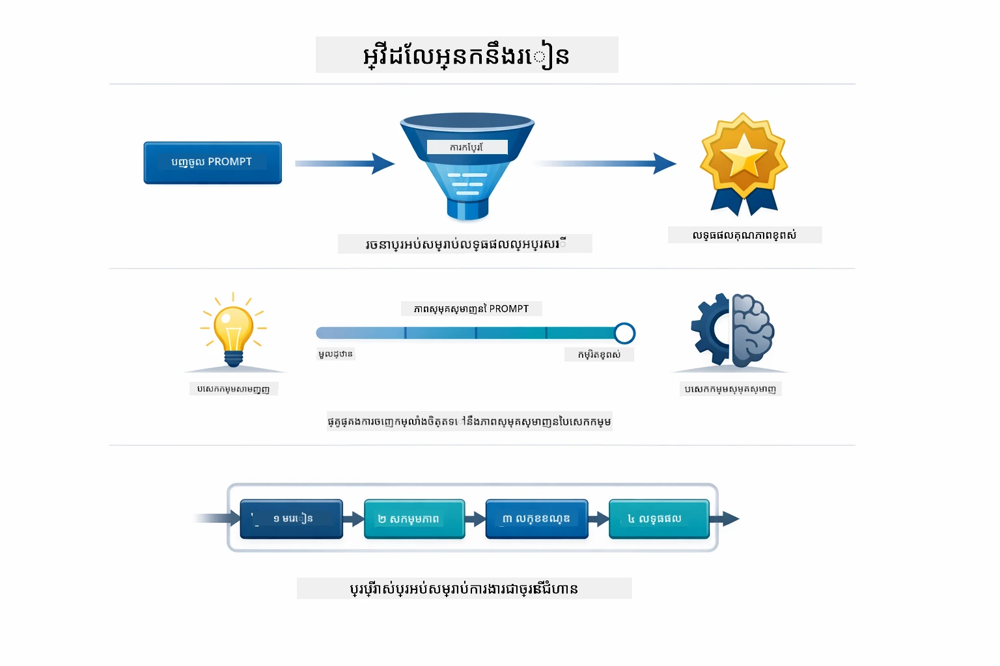

នៅក្នុងម៉ូឌុលមុនៗ អ្នកបានស្វែងយល់អំពីប្រតិកម្មទម្រង់LangChain4j ជាមួយម៉ូឌែល GitHub ហើយបានឃើញពីរបៀបដែលអង្គចងចាំអនុញ្ញាតឱ្យជជែកជាមួយ AI ជាមួយ Azure OpenAI។ ពេលនេះពួកយើងនឹងផ្តោតលើរបៀបដែលអ្នកសួរសំនួរ — គឺបញ្ចូលសេចក្តីបញ្ជាផ្ទាល់ — ដោយប្រើប្រាស់ GPT-5.2 របស់ Azure OpenAI។ របៀបដែលអ្នករៀបចំព័ត៌មានបញ្ចូលសេចក្តីបញ្ជាអា្នកប៉ះពាល់យ៉ាងខ្លាំងដល់គុណភាពនៃចម្លើយដែលអ្នកទទួលបាន។ យើងចាប់ផ្តើមពីការពិនិត្យវិធីសាស្រ្តបញ្ចូលសេចក្តីបញ្ជាមូលដ្ឋាន ហើយបន្ទាប់មកទៅរចនាប័ទ្ម​ជាប់កម្រិតខ្ពស់ប្រាំបួន ដែលប្រើអត្ថប្រយោជន៍ពេញលេញនៃសមត្ថភាព GPT-5.2។

យើងនឹងប្រើ GPT-5.2 ព្រោះវានាំមកនូវការត្រួតពិនិត្យឃ្លានគំនិត — អ្នកអាចប្រាប់ម៉ូឌែលពីចំនួនការគិតដែលគួរធ្វើមុនពេលឆ្លើយ។ នេះធ្វើឱ្យយុទ្ធសាស្រ្ដបញ្ចូលសេចក្តីបញ្ជាភ្លាត់ៗជាងមុន និងជួយអ្នកយល់ថាតើពេលណាត្រូវប្រើវិធីណាមួយ។ អ្នកនឹងទទួលបានអត្ថប្រយោជន៍ពីកំណត់ត្រាគប់ Azure តិចជាងសម្រាប់ GPT-5.2 ប្រក្រោះម៉ូឌែល GitHub។

## លក្ខខណ្ឌមូលដ្ឋាន

- បានបញ្ចប់ Module 01 (ធនធាន Azure OpenAI បានដាក់ចេញ)
- ឯកសារ `.env` នៅថតឫសជាមួយព័ត៌មានសម្ភារៈ Azure (បានបង្កើតដោយ `azd up` ក្នុង Module 01)

> **សម្គាល់៖** ប្រសិនបើអ្នកមិនទាន់បានបញ្ចប់ Module 01 សូមអនុវត្តការណែនាំដំណើរការដាក់ចេញនៅទីនោះជាមួយ។

## ការយល់ដឹងអំពីវិស្វកម្មបញ្ចូលសេចក្តីបញ្ជា

មូលដ្ឋាននៃវិស្វកម្មបញ្ចូលសេចក្តីបញ្ជាគឺខុសគ្នារវាងការណែនាំមិនច្បាស់លាស់និងការណែនាំច្បាស់លាស់ ដូចដែលការប្រៀបធៀបទីលើបានបង្ហាញ។

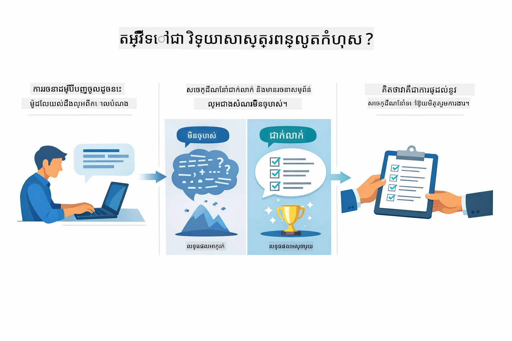

វិស្វកម្មបញ្ចូលសេចក្តីបញ្ជាគឺការរចនាអត្ថបទបញ្ចូលដែលបានលើកទឹកចិត្តឱ្យអ្នកទទួលបានលទ្ធផលដែលអ្នកត្រូវការ។ វាមិនមែនបញ្ចូលសំនួរតែប៉ុណ្ណោះទេ — វាគឺការរៀបចំការស្នើរក្នុងយ៉ាងដែលម៉ូឌែលនឹងយល់យ៉ាងច្បាស់ថាអ្នកចង់បានអ្វី និងវិធីសាស្រ្ដដឹកជញ្ជូន។

គិតថាវាដូចជាការផ្តល់ការណែនាំទៅក្រុមការងារម្នាក់មួយ។ "ជួសជុលកំហុស" គឺមិនច្បាស់។ "ជួសជុលកំហុស null pointer នៅ UserService.java ជួរលេខ 45 ដោយបន្ថែមការត្រួតពិនិត្យ null" គឺច្បាស់លាស់។ ម៉ូឌែលភាសាចេះធ្វើដូចគ្នា — ការបញ្ជាក់ និងរចនាសម្ព័ន្ធមានសារៈសំខាន់។

រូបភាពខាងក្រោមបង្ហាញពីរបៀបដែល LangChain4j បង្កើតការតភ្ជាប់ —ភ្ជាប់គំរូសំណង់របស់អ្នកទៅម៉ូឌែលតាមរយៈប្លុកសាររចនាដូចជា SystemMessage និង UserMessage។

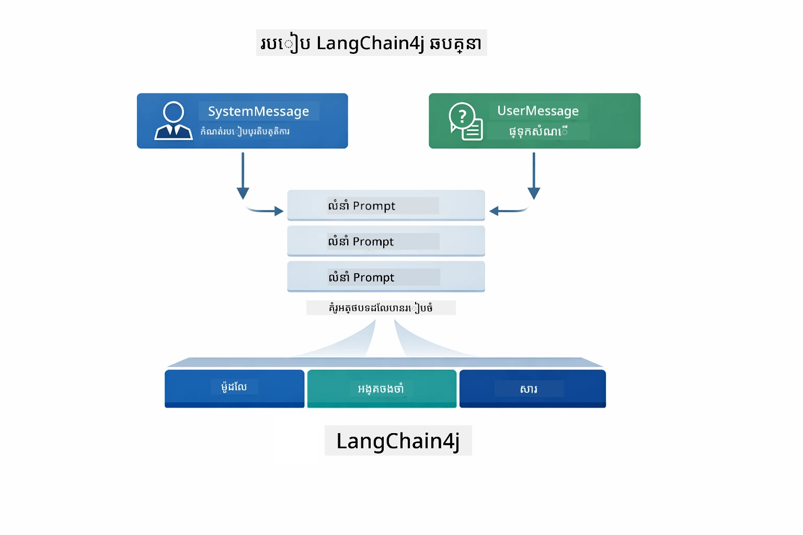

LangChain4j ផ្តល់អគ្គិសនីបច្ចេកវិទ្យា — ការតភ្ជាប់ម៉ូឌែល អង្គចងចាំ និងប្រភេទសារ — ខណៈពេលដែលរចនាប័ទ្មបញ្ចូលសេចក្តីបញ្ជាគឺអត្ថបទដែលបានរៀបចំយ៉ាងប្រុងប្រយ័ត្នដែលអ្នកផ្ញើតាមរយៈបច្ចេកវិទ្យានេះ។ ប្លុកសំខាន់គឺ `SystemMessage` (កំណត់អាកប្បកិរិយា និងតួរតំណាង AI) និង `UserMessage` (បញ្ចេញសំណើរពិតប្រាកដរបស់អ្នក)។

## មូលដ្ឋានវិស្វកម្មបញ្ចូលសេចក្តីបញ្ជា

បច្ចេកទេសចម្បងប្រាំខាងក្រោមបង្កើតមូលដ្ឋាននៃវិស្វកម្មបញ្ចូលសេចក្តីបញ្ជាដែលមានប្រសិទ្ធភាព។ មួយៗសំដៅលើផ្នែកផ្សេងគ្នានៃរបៀបដែលអ្នកទំនាក់ទំនងជាមួយម៉ូឌែលភាសា។

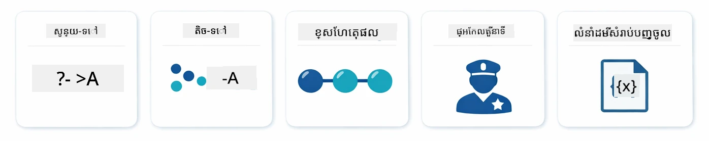

មុនចូលទៅកាន់រចនាប័ទ្មជាប់កម្រិតខ្ពស់ក្នុងម៉ូឌុលនេះ ខណៈពេលពិនិត្យវិធីសាស្រ្តបញ្ចូលសេចក្តីបញ្ជាមូលដ្ឋានប្រាំវា។ វាជាប្លុកសំបុត្រដែលអ្នកវិស្វកម្មបញ្ចូលសេចក្តីបញ្ជាគួរតែស្គាល់។ ប្រសិនបើអ្នកបានអនុវត្តពី [ម៉ូឌុលចាប់ផ្តើមរហ័ស](../00-quick-start/README.md#2-prompt-patterns) នោះអ្នកបានឃើញវាជាការអនុវត្ត — នេះគឺមូលដ្ឋានគំនិតតូចៗនៅពីក្រោយវា។

### បញ្ចូលសេចក្តីបញ្ជា​ពីគ្មានឧទាហរណ៍

វិធីសាមញ្ញបំផុត៖ ផ្តល់ពិធីការណែនាំផ្ទាល់ទៅម៉ូឌែលដោយគ្មានឧទាហរណ៍ណាមួយ។ ម៉ូឌែលពឹងផ្អែកលើការបណ្តុះបណ្តាលរបស់ខ្លួនទាំងមូលដើម្បីយល់ និងអនុវត្តភារកិច្ច។ វារក្សាបានល្អសម្រាប់ការស្នើសូចូលសាមញ្ញដែលអាកប្បកិរិយាដែលរំពឹងទុកគឺច្បាស់។

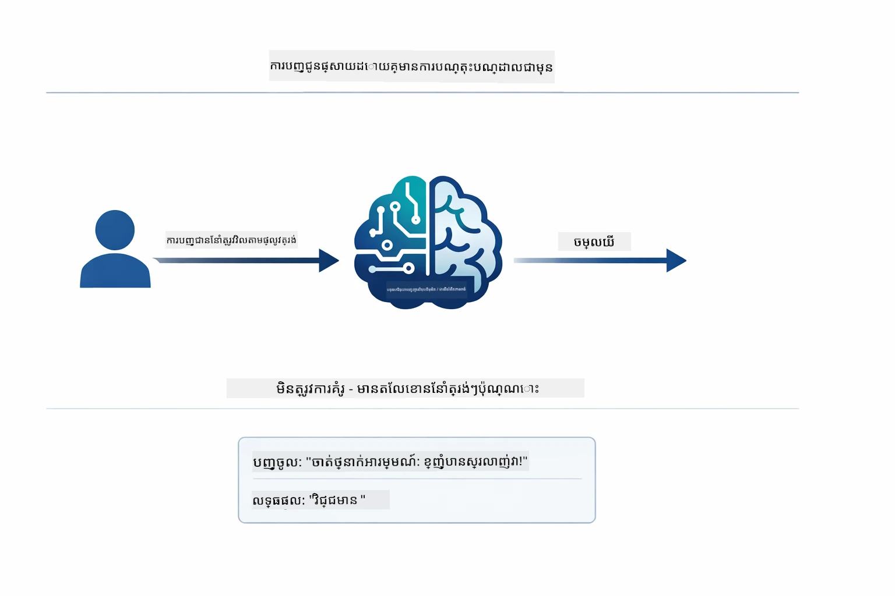

*ការណែនាំផ្ទាល់ដោយគ្មានឧទាហរណ៍ — ម៉ូឌែលយល់ពីភារកិច្ចពីការណែនាំតែប៉ុណ្ណោះ*

```java
String prompt = "Classify this sentiment: 'I absolutely loved the movie!'";
String response = model.chat(prompt);
// ចម្លើយ៖ "អវិជ្ជមាន"
```
  
**ពេលណាត្រូវប្រើ៖** ការបែងចែកសាមញ្ញ សំនួរផ្ទាល់ ការបកប្រែ ឬភារកិច្ចណាមួយដែលម៉ូឌែលអាចដំណើរការដោយគ្មានការណែនាំបន្ថែម។

### បញ្ចូលសេចក្តីបញ្ជា​ពីមានឧទាហរណ៍少数

ផ្តល់ឧទាហរណ៍ដែលបង្ហាញលំនាំដែលអ្នកចង់ឱ្យម៉ូឌែលអនុវត្ត។ ម៉ូឌែលរៀនពីទ្រង់ទ្រាយបញ្ចូល-លទ្ធផលដែលរំពឹងទុកពីឧទាហរណ៍របស់អ្នកហើយអនុវត្តទៅលើបញ្ចូលថ្មី។ វាជំនួយជាប់លាប់ខ្លាំងសម្រាប់ភារកិច្ចដែលទ្រង់ទ្រាយឬអាកប្បកិរិយាដែលមិនច្បាស់។

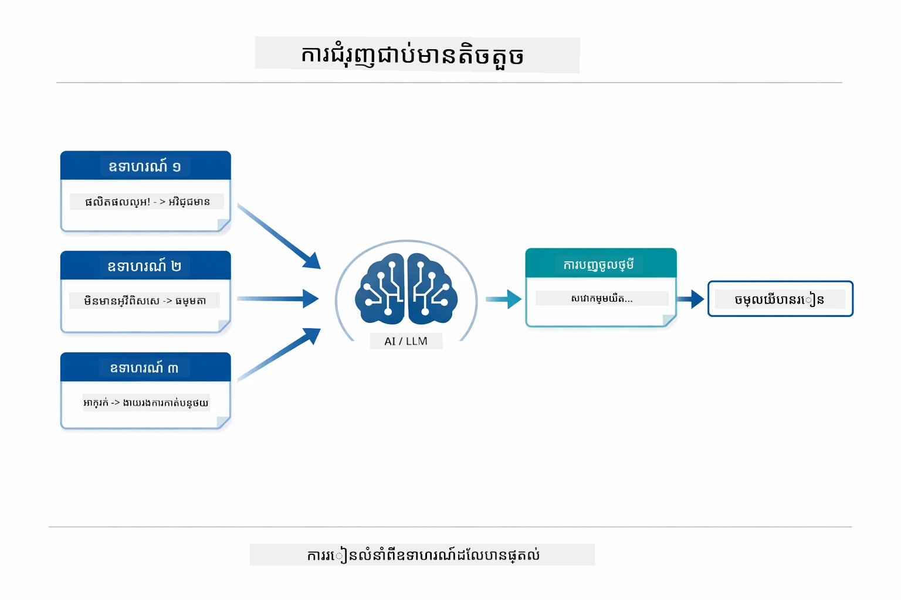

*រៀនពីឧទាហរណ៍ — ម៉ូឌែលស្គាល់លំនាំហើយអនុវត្តទៅលើបញ្ចូលថ្មី*

```java
String prompt = """
    Classify the sentiment as positive, negative, or neutral.
    
    Examples:
    Text: "This product exceeded my expectations!" → Positive
    Text: "It's okay, nothing special." → Neutral
    Text: "Waste of money, very disappointed." → Negative
    
    Now classify this:
    Text: "Best purchase I've made all year!"
    """;
String response = model.chat(prompt);
```
  
**ពេលណាត្រូវប្រើ៖** ការបែងចែកផ្ទាល់ខ្លួន ទ្រង់ទ្រាយឥតបំភាន់ ភារកិច្ចជាតិសាស្ត្រពិសេស ឬពេលលទ្ធផលគ្មានសុវត្ថិភាពក្នុង Zero-Shot។

### ខ្សែសង្វាក់គំនិត

ស្នើឱ្យម៉ូឌែលបង្ហាញការគិតរបស់ខ្លួនជាជំហានៗ។ ជំនួសការជាបន្ទាត់ឆ្លើយតបភ្លាមៗ ម៉ូឌែលបំបែកបញ្ហាក្នុងជំហានតូចៗនិងដំណើរការតាមជំហាន។ វាជួយកែលម្អភាពត្រឹមត្រូវលើគណិតវិទ្យា តក្ក្រុវិទ្យា និងការយល់ដឹងពហុជំហាន។

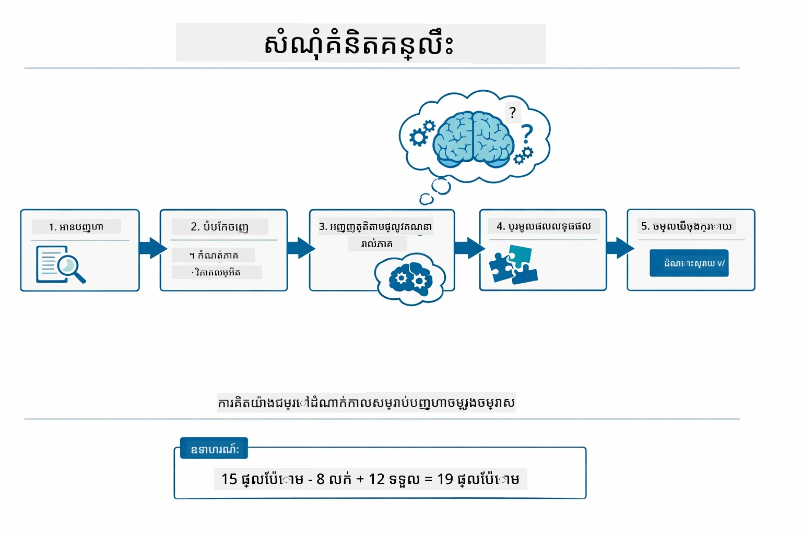

*ការគិតជាជំហានៗ — បំបែកបញ្ហាស្មុគស្មាញទៅជាជំហានត្រឹមត្រូវច្បាស់លាស់*

```java
String prompt = """
    Problem: A store has 15 apples. They sell 8 apples and then 
    receive a shipment of 12 more apples. How many apples do they have now?
    
    Let's solve this step-by-step:
    """;
String response = model.chat(prompt);
// ម៉ូដែលបង្ហាញថា៖ 15 - 8 = 7, បន្ទាប់មក 7 + 12 = 19 ផ្លែប៉ោម
```
  
**ពេលណាត្រូវប្រើ៖** បញ្ហាគណិតវិទ្យា ប្រដាប់ឡូហ្គិក ការកែលម្អកំហុស ឬភារកិច្ចណាមួយដែលបង្ហាញដំណើរការគិតជួយកែលម្អភាពត្រឹមត្រូវ និងទំនុកចិត្ត។

### បញ្ចូលសេចក្តីបញ្ជាចូលតួ

កំណត់តួឬបុគ្គលសម្រាប់ AI មុនពេលសួរសំណួរ។ វាផ្តល់បរិបទដែលរៀបចំសម្លេង ជម្រៅ និងមុខងារការតបសូម រៀបចំដូចជា "វិស្វករទូរគមនាគមន៍" ផ្តល់យោបល់ផ្សេងពី "អ្នកអភិវឌ្ឍន៍កម្រិតជប់លៀង" ឬ "អ្នកត្រួតពិនិត្យសុវត្ថិភាព"។

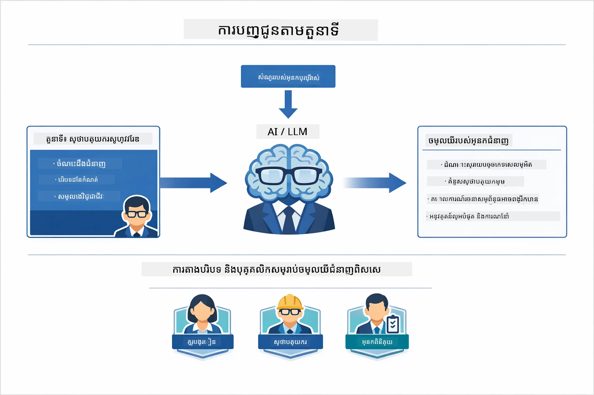

*កំណត់បរិបទ និងតួ — សំណួរដូចគ្នាបានចម្លើយខុសគ្នាដោយផ្អែកលើតួដែលបានផ្ដល់*

```java
String prompt = """
    You are an experienced software architect reviewing code.
    Provide a brief code review for this function:
    
    def calculate_total(items):
        total = 0
        for item in items:
            total = total + item['price']
        return total
    """;
String response = model.chat(prompt);
```
  
**ពេលណាត្រូវប្រើ៖** ពិនិត្យកូដ បង្រៀន វិភាគពិសេសដែន ឬពេលដែលអ្នកត្រូវការចម្លើយពិសេសសម្រាប់កម្រិតជំនាញ ឬទស្សនវិស័យជាក់លាក់មួយ។

### គំរូបញ្ចូលសេចក្តីបញ្ជា

បង្កើតបញ្ចូលសេចក្តីបញ្ជាដែលអាចប្រើជាថ្មីជាមួយចំណុចប្រែប្រាស់។ ជំនួសការសរសេរបញ្ចូលថ្មីរៀងរាល់ដង កំណត់គំរូមួយហើយបញ្ចូលតម្លៃផ្សេងៗ។ ថ្នាក់ `PromptTemplate` របស់ LangChain4j ធ្វើឱ្យវាងាយស្រួលជាមួយវចនាសាស្ត្រ `{{variable}}`។

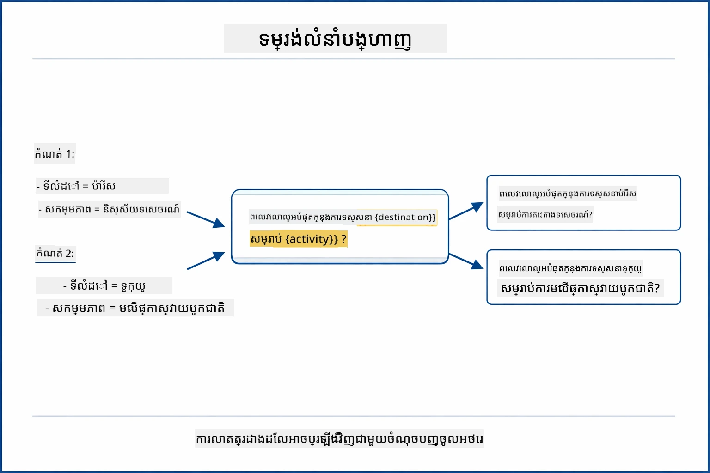

*បញ្ចូលដែលអាចប្រើឡើងវិញជាមួយចំណុចប្រែប្រាស់ — មួយគំរូ អ្នកប្រើជាច្រើនលក្ខណៈ*

```java
PromptTemplate template = PromptTemplate.from(
    "What's the best time to visit {{destination}} for {{activity}}?"
);

Prompt prompt = template.apply(Map.of(
    "destination", "Paris",
    "activity", "sightseeing"
));

String response = model.chat(prompt.text());
```
  
**ពេលណាត្រូវប្រើ៖** ការស្នើសុំពីរប់បៀបធ្វើផ្សេងៗ ការប្រមូលផ្តុំ ការបង្កើតដំណើរការជាមួយ AI ឬស្ថានការណ៍ណាមួយដែលរចនាសម្ព័ន្ធបញ្ចូលសេចក្តីបញ្ជានៅស្ថិតនៅតែមិនប្រែប្រួល ប៉ុន្តែទិន្នន័យប្តូរតាម។

---

បច្ចេកទេសបួននេះផ្តល់ឱ្យអ្នកនូវឧបករណ៍រឹងមាំសម្រាប់ភារកិច្ចភាគច្រើននៃការបញ្ចូលសេចក្តីបញ្ជា។ បំណែកនៅសល់នៃម៉ូឌុលនេះបង្កើតលើវាជាមួយ **រចនាប័ទ្មជាប់កម្រិតខ្ពស់ប្រាំបួន** ដែលប្រើប្រយោជន៍គ្រប់លក្ខណៈ reasoning control, ការវាយតម្លៃខ្លួនឯង និងសមត្ថភាពលទ្ធផលដែលមានរចនា។

## រចនាប័ទ្មជាប់កម្រិតខ្ពស់

ក្រោយពីគ្របដណ្តប់មូលដ្ឋានហើយ យើងទៅទស្សនារចនាប័ទ្មជាប់កម្រិតខ្ពស់ប្រាំបួនដែលធ្វើឱ្យម៉ូឌុលនេះមានផ្ទេរជាក់លាក់។ មិនមែនគ្រប់បញ្ហាក៏មានរបៀបដូចគ្នាទេ។ សំនួរក៏មានបែបផែនឆ្លើយតបលឿន ក៏មានដែលត្រូវការតំលៃលឹម។ ម្នាក់ទទួលបានការគិតបង្ហាញវាសំខាន់ ខណៈអ្នកផ្សេងទៀតត្រូវការលទ្ធផលត្រឹមតែឃើញ។ រចនាប័ទ្មក្នុងក្រោមនេះត្រូវបានបង្កើតសម្រាប់ស្ថានការណ៍ផ្សេងៗ — ហើយការគ្រប់គ្រងគំនិតរបស់ GPT-5.2 ជួយធ្វើឱ្យភាពខុសគ្នាស្របតាមន័យកាន់តែច្បាស់។

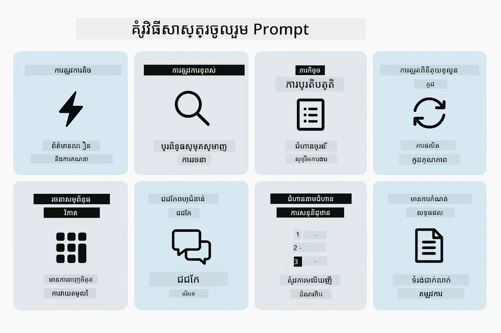

*ទិដ្ឋភាពទូលំទូលាយនៃរចនាប័ទ្មបញ្ចូលសេចក្តីបញ្ជាប្រាំបួននិងករណីប្រើ*

GPT-5.2 បន្ថែមវិមាត្រថ្មីមួយទៀតទៅរចនាប័ទ្មទាំងនេះ៖ *ការគ្រប់គ្រងគំនិត*។ ស្លាយខាងក្រោមបង្ហាញពីរបៀបដែលអ្នកអាចកំណត់កំរិតការគិតរបស់ម៉ូឌែល — ចាប់ពីចម្លើយលឿន ផ្ទាល់ ទៅការវិភាគជ្រៅ។

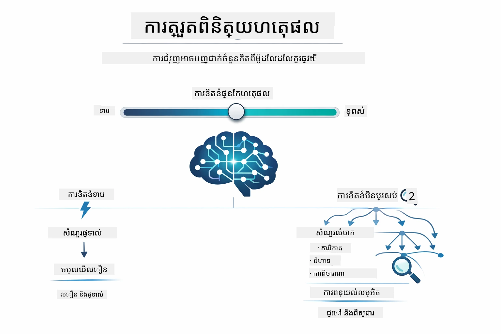

*ការគ្រប់គ្រងគំនិតរបស់ GPT-5.2 អនុញ្ញាតឱ្យអ្នកកំណត់ថា ម៉ូឌែលគួរគិតប៉ុន្មាន — ចាប់ពីចម្លើយផ្ទាល់លឿនទៅការស្រាវជ្រាវជ្រៅ*

**ទំនិញទាប (លឿននិងផ្តោតសំខាន់)** - សម្រាប់សំណួរសាមញ្ញដែលអ្នកចង់បានចម្លើយលឿនផ្ទាល់។ ម៉ូឌែលគិតតិចបំផុត - មិនលើសពី 2 ជំហាន។ ប្រើសម្រាប់គណនាចំនួន ស្វែងរក ឬសំនួរសាមញ្ញដោយផ្ទាល់។

```java
String prompt = """
    <context_gathering>
    - Search depth: very low
    - Bias strongly towards providing a correct answer as quickly as possible
    - Usually, this means an absolute maximum of 2 reasoning steps
    - If you think you need more time, state what you know and what's uncertain
    </context_gathering>
    
    Problem: What is 15% of 200?
    
    Provide your answer:
    """;

String response = chatModel.chat(prompt);
```
  
> 💡 **ស្វែងយល់ជាមួយ GitHub Copilot:** បើក [`Gpt5PromptService.java`](../../../02-prompt-engineering/src/main/java/com/example/langchain4j/prompts/service/Gpt5PromptService.java) ហើយសួរ៖
> - "តើភាពខុសគ្នារវាងទំនិញទាបនិងខ្ពស់ក្នុងរចនាប័ទ្មបញ្ចូលសេចក្តីបញ្ជាជា​បែបណា?"
> - "តើតែ XML ក្នុងបញ្ចូលសេចក្តីបញ្ជាជួយរៀបចំចម្លើយ AI យ៉ាងដូចម្តេច?"
> - "ពេលណាអ្នកគួរប្រើរចនាប័ទ្មដឹកនាំខ្លួនឯងប្រើប្រាស់ជំនួសវិធីសាស្រ្តផ្ទាល់?"

**ទំនិញខ្ពស់ (ជ្រៅនិងពេញលេញ)** - សម្រាប់បញ្ហាស្មុគស្មាញដែលអ្នកចង់បានការវិភាគពេញលេញ។ ម៉ូឌែលស្រាវជ្រាវយ៉ាងពេញលេញហើយបង្ហាញការគិតលម្អិត។ ប្រើសម្រាប់រចនាបระบบ ការសម្រេចចិត្តអាគារឬស្រាវជ្រាវស្មុគស្មាញ។

```java
String prompt = """
    Analyze this problem thoroughly and provide a comprehensive solution.
    Consider multiple approaches, trade-offs, and important details.
    Show your analysis and reasoning in your response.
    
    Problem: Design a caching strategy for a high-traffic REST API.
    """;

String response = chatModel.chat(prompt);
```
  
**ការអនុវត្តភារកិច្ច (ដំណើរការជំហានបន្តិចបន្តិច)** - សម្រាប់ដំណើរការជាច្រើនជំហាន។ ម៉ូឌែលផ្តល់ផែនការ ផ្សាយពាណិជ្ជកម្មជំហានៗហើយចុងក្រោយផ្តល់សេចក្តីសង្ខេប។ ប្រើសម្រាប់ការផ្លាស់ប្តូរ ការអនុវត្ត ឬដំណើរការជាច្រើនជំហានណាមួយ។

```java
String prompt = """
    <task_execution>
    1. First, briefly restate the user's goal in a friendly way
    
    2. Create a step-by-step plan:
       - List all steps needed
       - Identify potential challenges
       - Outline success criteria
    
    3. Execute each step:
       - Narrate what you're doing
       - Show progress clearly
       - Handle any issues that arise
    
    4. Summarize:
       - What was completed
       - Any important notes
       - Next steps if applicable
    </task_execution>
    
    <tool_preambles>
    - Always begin by rephrasing the user's goal clearly
    - Outline your plan before executing
    - Narrate each step as you go
    - Finish with a distinct summary
    </tool_preambles>
    
    Task: Create a REST endpoint for user registration
    
    Begin execution:
    """;

String response = chatModel.chat(prompt);
```
  
ការបញ្ចូលសេចក្តីបញ្ជារចនាប័ទ្ម Chain-of-Thought ស្នើម៉ូឌែលបង្ហាញដំណើរការគិតរបស់ខ្លួនយ៉ាងច្បាស់លាស់ កែលម្អភាពត្រឹមត្រូវសម្រាប់ភារកិច្ចស្មុគស្មាញ។ ការបំបែកជាជំហានជួយទាំងមនុស្ស និង AI យល់ពីលក្ខណ:ត្រឹមត្រូវ។

> **🤖 សាកល្បងជាមួយ [GitHub Copilot](https://github.com/features/copilot) Chat:** សួរអំពីរចនាប័ទ្មនេះ៖
> - "តើធ្វើដូចម្តេចដើម្បីឲ្យរចនាប័ទ្មអនុវត្តភារកិច្ចប្រកបដោយដំណើរការផ្លាស់ប្តូរជាប្រចាំ?"
> - "តើអ្វីទៅជាបំណងល្អបំផុតសម្រាប់ការរៀបចំការណែនាំឧបករណ៍ក្នុងកម្មវិធីផលិតកម្ម?"
> - "តើធ្វើដូចម្តេចដើម្បីចាប់យកនិងបង្ហាញការអាប់ដេតដំណោយកំណត់មធ្យមក្នុង UI?"

រូបភាពខាងក្រោមបង្ហាញដំណើរការ Plan → Execute → Summarize នេះ។

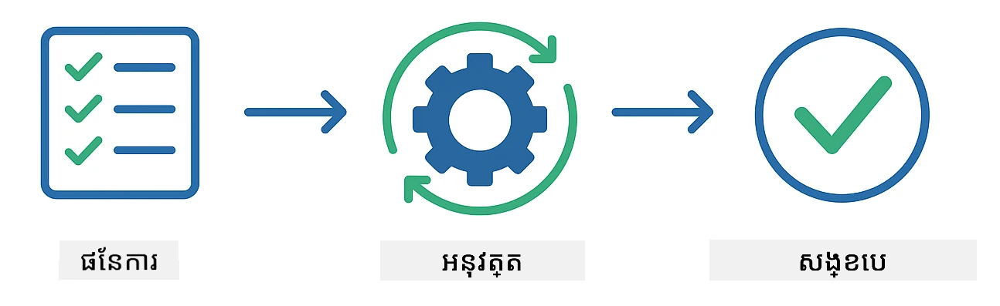

*ដំណើរការចាប់ផែនការ → អនុវត្ត → សង្ខេបសម្រាប់ភារកិច្ចជាច្រើនជំហាន*

**កូដដែលអាចធ្វើចិត្តខ្លួនឯង** - សម្រាប់បង្កើតកូដមានគុណភាពផលិតកម្ម។ ម៉ូឌែលបង្កើតកូដដែលគោរពស្តង់ដារផលិតកម្ម ជាមួយការគ្រប់គ្រងកំហុសត្រឹមត្រូវ។ ប្រើពេលបង្កើតមុខងារថ្មី ឬសេវាកម្ម។

```java
String prompt = """
    Generate Java code with production-quality standards: Create an email validation service
    Keep it simple and include basic error handling.
    """;

String response = chatModel.chat(prompt);
```
  
រូបភាពខាងក្រោមបង្ហាញវដ្តកែលម្អបន្តិចបន្តួចនេះ — បង្កើត វាយតម្លៃ សង្កេតហ្វាគសន៍ និងកែសម្រួលរហូតដល់កូដសម្របសម្រួលតាមស្តង់ដារផលិតកម្ម។

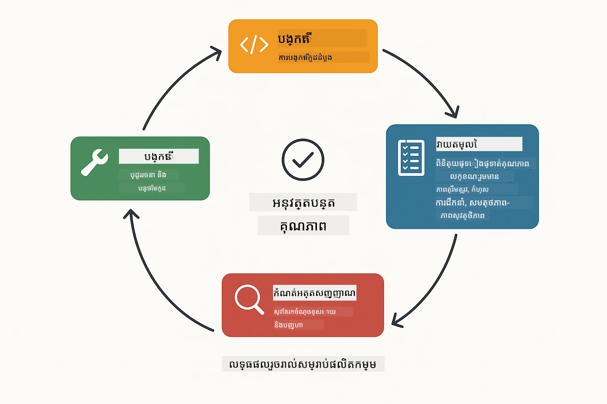

*វដ្តកែលម្អបន្តិចបន្តួច - បង្កើត, វាយតម្លៃ, សង្កេតហ្វាគសន៍, កែលម្អ, ធ្វើម្ដងទៀត*

**ការវិភាគរចនាសម្ព័ន្ធ** - សម្រាប់ការវាយតម្លៃមានរចនាសម្ព័ន្ធ។ ម៉ូឌែលពិនិត្យកូដដោយប្រើស៊ុមស្តង់ដារត្រឹមត្រូវ (ភាពត្រឹមត្រូវ, វិធានការ, សមត្ថភាព, សុវត្ថិភាព, តម្រូវបន្ថែមសមត្ថភាព)។ ប្រើសម្រាប់ការពិនិត្យកូដ ឬការវាយតម្លៃគុណភាព។

```java
String prompt = """
    <analysis_framework>
    You are an expert code reviewer. Analyze the code for:
    
    1. Correctness
       - Does it work as intended?
       - Are there logical errors?
    
    2. Best Practices
       - Follows language conventions?
       - Appropriate design patterns?
    
    3. Performance
       - Any inefficiencies?
       - Scalability concerns?
    
    4. Security
       - Potential vulnerabilities?
       - Input validation?
    
    5. Maintainability
       - Code clarity?
       - Documentation?
    
    <output_format>
    Provide your analysis in this structure:
    - Summary: One-sentence overall assessment
    - Strengths: 2-3 positive points
    - Issues: List any problems found with severity (High/Medium/Low)
    - Recommendations: Specific improvements
    </output_format>
    </analysis_framework>
    
    Code to analyze:
    ```
    public List getUsers() {
        return database.query("SELECT * FROM users");
    }
    ```
    Provide your structured analysis:
    """;

String response = chatModel.chat(prompt);
```
  
> **🤖 សាកល្បងជាមួយ [GitHub Copilot](https://github.com/features/copilot) Chat:** សួរអំពីការវិភាគរចនាសម្ព័ន្ធ៖
> - "តើធ្វើដូចម្តេចដើម្បីប្ដូរនីតិវិធីវិភាគសម្រាប់ប្រភេទនានាការពិនិត្យកូដ?"
> - "តើវិធីល្អបំផុតក្នុងការបំលែង និងអនុវត្តលទ្ធផលដែលមានរចនាសម្ព័ន្ធជាកម្មវិធី?"
> - "តើធ្វើដូចម្តេចដើម្បីធានាថាជំហិនភាពធ្ងន់ធ្ងរត្រូវបានគ្រប់គ្រាន់នៅក្នុងសម័យពិនិត្យខុសត្រូវ?"

រូបភាពខាងក្រោមបង្ហាញពីរបៀបដែលស៊ុមនេះរៀបចំការពិនិត្យកូដជាបណ្ដាប័ណ្ណដូចស៊ុមដែលមានជំហានធ្ងន់ធ្ងរជាប់បន្ត។

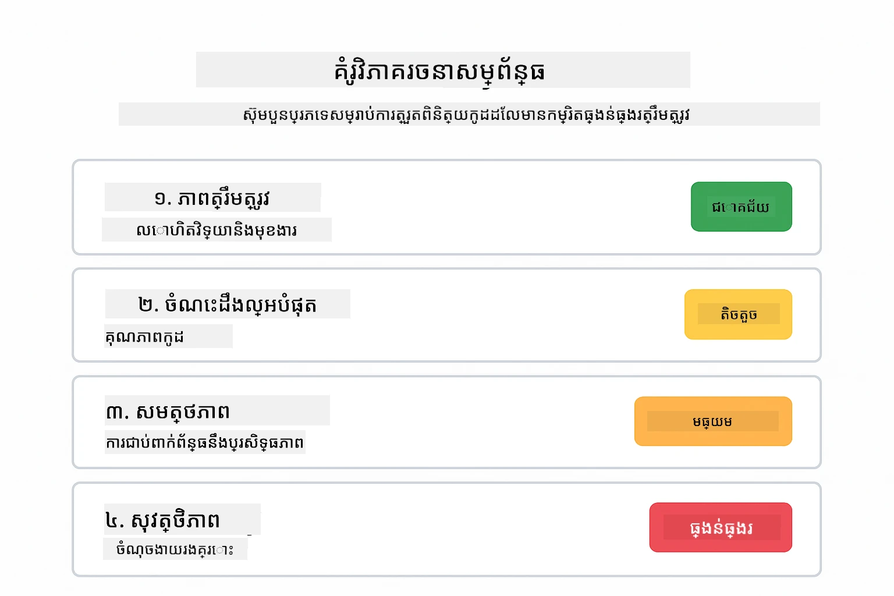

*ស៊ុមសម្រាប់ការពិនិត្យកូដជាប់លាប់មានជំហាន់ធ្ងន់ធ្ងរ*

**ជជែកចល័តច្រើនជុំ** - សម្រាប់ការជជែកដែលត្រូវការបរិបទ។ ម៉ូឌែលចងចាំសារមុនៗហើយសាងសង់លើវាទៀត។ ប្រើសម្រាប់ជំនួយផ្ទាល់ សម័យសំណួរឆ្លើយស្មុគស្មាញ។

```java
ChatMemory memory = MessageWindowChatMemory.withMaxMessages(10);

memory.add(UserMessage.from("What is Spring Boot?"));
AiMessage aiMessage1 = chatModel.chat(memory.messages()).aiMessage();
memory.add(aiMessage1);

memory.add(UserMessage.from("Show me an example"));
AiMessage aiMessage2 = chatModel.chat(memory.messages()).aiMessage();
memory.add(aiMessage2);
```
  
រូបភាពខាងក្រោមបង្ហាញពីរបៀបដែលបរិបទការជជែកជាប់ជាលំហូរនិងរបៀបដែលវាត្រូវបានចំនួន token របស់ម៉ូឌែល។

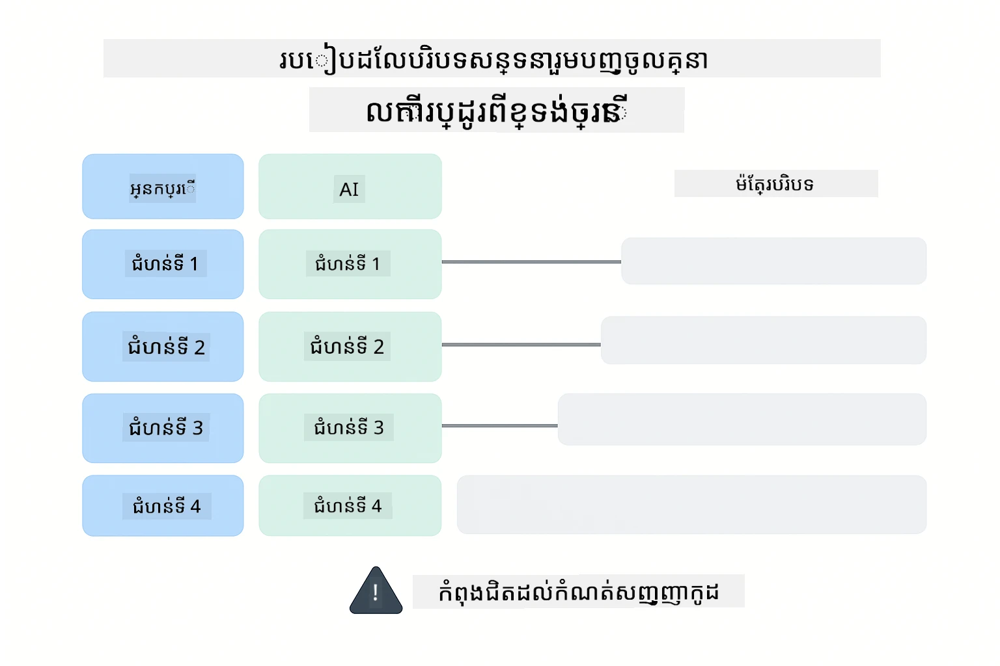

*របៀបដែលបរិបទជជែកបូកបន្ថែមនៅលើជុំជាដំណាក់កាលរហូតដល់ដល់កំណត់ token*
**ការពិចារណាជាដំណាក់កាល** - សម្រាប់បញ្ហាដែលត្រូវការតុល្យ្យវិចារ​ដែលមើលឃើញបាន។ ម៉ូដែលបង្ហាញការពិចារណាដែលច្បាស់លាស់សម្រាប់ជំហាននីមួយៗ។ ប្រើវាសម្រាប់បញ្ហាគណិតវិទ្យា បញ្ហាជាលំហាត់ ឬពេលដែលអ្នកត្រូវការយល់ដឹងពីដំណើរការគិត។

```java
String prompt = """
    <instruction>Show your reasoning step-by-step</instruction>
    
    If a train travels 120 km in 2 hours, then stops for 30 minutes,
    then travels another 90 km in 1.5 hours, what is the average speed
    for the entire journey including the stop?
    """;

String response = chatModel.chat(prompt);
```

រូបភាពខាងក្រោមបង្ហាញពីរបៀបដែលម៉ូដែលបំបែកបញ្ហាទៅជាជំហានតុល្យ្យវិចារតាមលំដាប់លេខយ៉ាងច្បាស់លាស់។

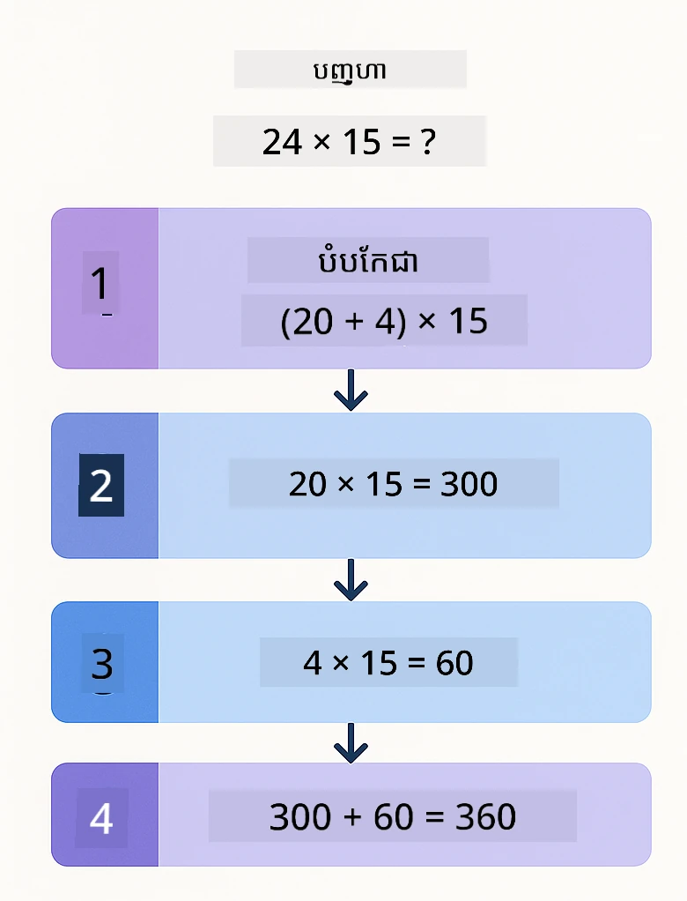

*ការបែងចែកបញ្ហាទៅជាជំហានតុល្យ្យវិចារច្បាស់លាស់*

**ការបញ្ចេញលទ្ធផលដែលមានកំណត់** - សម្រាប់ចម្លើយដែលមានតំរូវការរចនាសម្ព័ន្ធជាក់លាក់។ ម៉ូដែលអនុវត្តតាមច្បាប់រចនាសម្ព័ន្ធ និងប្រវែងយ៉ាងតឹងរ៉ឹង។ ប្រើវាសម្រាប់ជាអត្ថបទសង្ខេប ឬពេលដែលអ្នកត្រូវការរចនាសម្ព័ន្ធលទ្ធផលយ៉ាងត្រឹមត្រូវ។

```java
String prompt = """
    <constraints>
    - Exactly 100 words
    - Bullet point format
    - Technical terms only
    </constraints>
    
    Summarize the key concepts of machine learning.
    """;

String response = chatModel.chat(prompt);
```

រូបភាពខាងក្រោមបង្ហាញពីរបៀបដែលលក្ខខណ្ឌបញ្ជារម៉ូដែលឲ្យផលិតលទ្ធផលដែលគោរពតាមរចនាសម្ព័ន្ធ និងប្រវែងដោយតឹងរ៉ឹង។

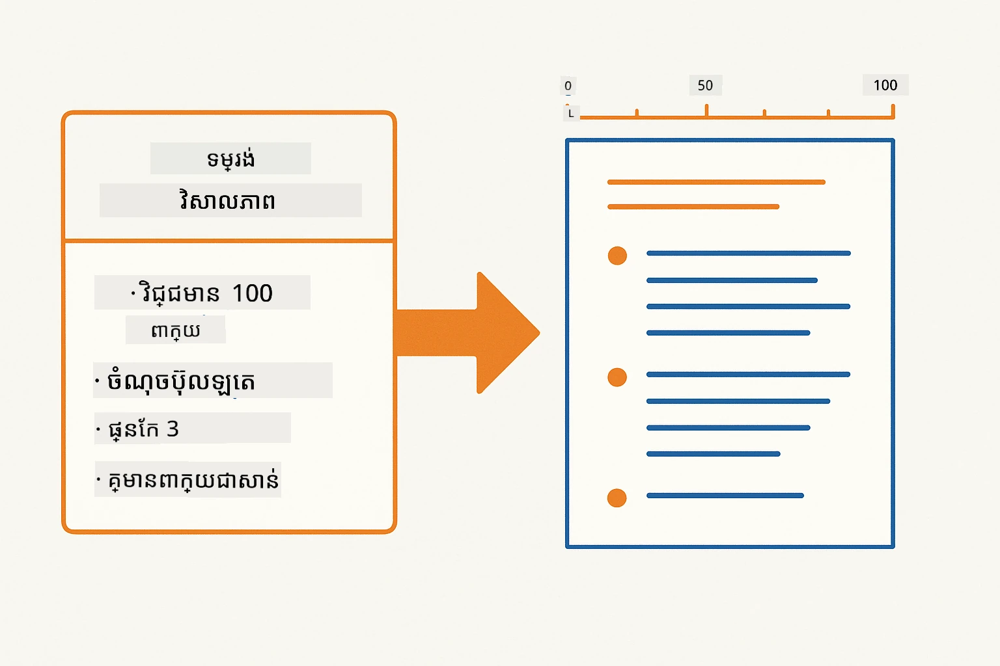

*ការជំរុញកំណត់រចនាសម្ព័ន្ធ ប្រវែង និងតំរូវការរចនាសម្ព័ន្ធ*

## បើកដំណើរការ​ Application

**ផ្ទៀងផ្ទាត់ការបញ្ចូលប្រព័ន្ធ៖**

ធានាថា​ឯកសារ `.env` មាននៅក្នុងថតមូលដ្ធានជាមួយឯកសារទទួលស្គាល់ Azure (បានបង្កើតនៅម៉ូឌុល 01)។ ប្រើពាក្យបញ្ជានេះពីថតម៉ូឌុល (`02-prompt-engineering/`)៖

**Bash:**
```bash
cat ../.env  # គួរតែបង្ហាញ AZURE_OPENAI_ENDPOINT, API_KEY, DEPLOYMENT
```

**PowerShell:**
```powershell
Get-Content ..\.env  # ត្រូវបង្ហាញ AZURE_OPENAI_ENDPOINT, API_KEY, DEPLOYMENT
```

**ចាប់ផ្តើមកម្មវិធី៖**

> **សម្គាល់៖** ប្រសិនបើអ្នកបានចាប់ផ្តើមកម្មវិធីទាំងអស់ដោយប្រើ `./start-all.sh` ពីថតមូលដ្ឋាន (ដូចបានពិពណ៌នារួចរាល់នៅម៉ូឌុល 01) ម៉ូឌុលនេះគឺកំពុងដំណើរការនៅលើរន្ធ 8083។ អ្នកអាចរំលងពាក្យបញ្ជាចាប់ផ្តើមខាងក្រោម ហើយទៅកាន់ http://localhost:8083 ត្រង់។

**ជម្រើសទី 1៖ ប្រើ Spring Boot Dashboard (ណែនាំសម្រាប់អ្នកប្រើ VS Code)**

dev container រួមបញ្ចូលផ្នែកពង្រីក Spring Boot Dashboard ដែលផ្តល់ឱ្យអ្នកនូវផ្ទៃមុខភ្ជាប់មើល ហើយគ្រប់គ្រងកម្មវិធី Spring Boot ទាំងអស់។ អ្នកអាចរកឃើញវានៅក្នុង Activity Bar ខាងឆ្វេងក្នុង VS Code (សូមស្វែងរករូបតំណាង Spring Boot)។

ពី Spring Boot Dashboard អ្នកអាច៖
- មើលកម្មវិធី Spring Boot ទាំងអូលដែលមាននៅក្នុងកន្លែងធ្វើការ
- ចាប់ផ្តើម/ផ្អាកកម្មវិធីដោយមួយចុច
- មើលកំណត់ហេតុកម្មវិធីដោយពេលវេលាពិត
- តាមដានស្ថានភាពកម្មវិធី

គ្រាន់តែនៅលើប៊ូតុងលេងជិត "prompt-engineering" ដើម្បីចាប់ផ្តើមម៉ូឌុលនេះ ឬចាប់ផ្តើមម៉ូឌុលទាំងអស់រៀងៗខ្លួន។

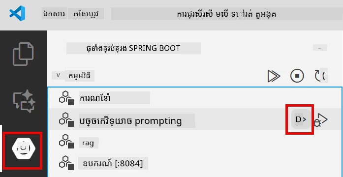

*Spring Boot Dashboard ក្នុង VS Code — ចាប់ផ្តើម បញ្ឈប់ និងតាមដានម៉ូឌុលទាំងអស់ពីកន្លែងតែមួយ*

**ជម្រើសទី 2៖ ប្រើ shell scripts**

ចាប់ផ្តើមកម្មវិធីបណ្តាញទាំងអស់ (ម៉ូឌុល 01-04):

**Bash:**
```bash
cd ..  # ពីថតដើម
./start-all.sh
```

**PowerShell:**
```powershell
cd ..  # ពីថតមូលដ្ឋាន
.\start-all.ps1
```

ឬចាប់ផ្តើមតែម៉ូឌុលនេះ៖

**Bash:**
```bash
cd 02-prompt-engineering
./start.sh
```

**PowerShell:**
```powershell
cd 02-prompt-engineering
.\start.ps1
```

ស្គ្រីបទាំងពីរនេះ ប្រើប្រាស់អថេរបរិស្ថានពីឯកសារ `.env` នៅថតមូលដ្ឋានដោយស្វ័យប្រវត្តិ និងនឹងសង់ JAR ប្រសិនបើវាមិនមានទេ។

> **សម្គាល់៖** ប្រសិនបើអ្នកចូលចិត្តសង់ម៉ូឌុលទាំងអស់ដោយដៃមុនចាប់ផ្តើម៖
>
> **Bash:**
> ```bash
> cd ..  # Go to root directory
> mvn clean package -DskipTests
> ```
>
> **PowerShell:**
> ```powershell
> cd ..  # Go to root directory
> mvn clean package -DskipTests
> ```

បើក http://localhost:8083 ក្នុងកម្មវិធីរុករករបស់អ្នក។

**ដើម្បីបញ្ឈប់៖**

**Bash:**
```bash
./stop.sh  # មុឌូលនេះតែប៉ុណ្ណោះ
# ឬ
cd .. && ./stop-all.sh  # មុឌូលទាំងអស់
```

**PowerShell:**
```powershell
.\stop.ps1  # ម៉ូឌុលនេះតែប៉ុណ្ណោះ
# ឬ
cd ..; .\stop-all.ps1  # ម៉ូឌុលទាំងអស់
```

## រូបភាពនៃកម្មវិធី

នេះជាបន្ទះផ្ទៃមុខសំខាន់នៃម៉ូឌុល prompt engineering ដែលអ្នកអាចសាកល្បងលេងជាមួយលំនាំប្រាំបួនជាប់គ្នា។

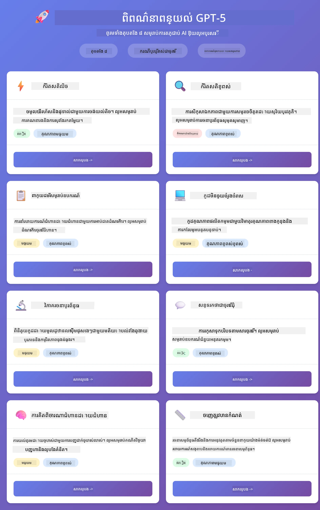

*បន្ទះផ្ទៃមុខសំខាន់បង្ហាញលំនាំបួននៃ prompt engineering ជាមួយលក្ខណៈនិងករណីប្រើប្រាស់របស់ពួកវា*

## ស្វែងយល់អំពីលំនាំបួន

ផ្ទៃមុខវេបសាយអនុញ្ញាតអ្នកសាកល្បងយុទ្ធសាស្រ្ត prompting ផ្សេងៗគ្នា។ លំនាំបួននីមួយៗដោះស្រាយបញ្ហាផ្សេងៗ - សាកល្បងវាដើម្បីមើលពេលណាលំនាំបួនណាមួយសំខាន់។

> **សម្គាល់៖ Streaming ទល់នឹង Non-Streaming** — ទំព័រលំនាំបួនជាមួយប៊ូតុងពីរដូចជា **🔴 Stream Response (Live)** និងជម្រើស **Non-streaming**។ Streaming ប្រើ Server-Sent Events (SSE) ដើម្បីបង្ហាញ token ដំណើរការពេលវេលាពិត ខណៈម៉ូដែលបង្កើតវា ដូច្នេះអ្នកឃើញការរីកចម្រើនភ្លាមៗ។ ជម្រើស non-streaming រង់ចាំចំលើយពេញលេញ មុនបង្ហាញវា។ សម្រាប់ prompt ដែលបង្កការគិតជ្រៅ (ឧ. High Eagerness, Self-Reflecting Code) ការហៅ non-streaming អាចពេលយូរ - មួយចំនួនជាទី ២០ - គ្មានមតិបង្ហាញទេ។ **ប្រើ streaming នៅពេលសាកល្បង prompt ស្មុគស្មាញ** ដូច្នេះអ្នកអាចឃើញម៉ូដែលដំណើរការនិងជៀសវាងការយល់ថា​សំណើត្រូវបានផុតកំណត់ពេល។
>
> **សម្គាល់៖ តំរូវការម៉ាស៊ីនរុករក** — លក្ខណៈ streaming ប្រើប្រាស់ Fetch Streams API (`response.body.getReader()`) ដែលត្រូវការ Browser ពេញលេញ (Chrome, Edge, Firefox, Safari)។ វាមិនដំណើរការនៅក្នុង Simple Browser របស់ VS Code ទេ ព្រោះ webview របស់វាមិនគាំទ្រ ReadableStream API។ ប្រសិនបើប្រើ Simple Browser ប៊ូតុង non-streaming នឹងធម្មតា ប៉ុន្តែប៊ូតុង streaming នឹងមិនដំណើរការ។ បើក http://localhost:8083 នៅក្នុងកម្មវិធីរុករកខាងក្រៅសម្រាប់បទពិសោធន៍ពេញលេញ។

### លំនាំបួន Low vs High Eagerness

សួរប្រសាសន៍ជាការងារងាយៗដូចជា "១០០% នៃ ២០០ គឺប៉ុន្មាន?" ដោយប្រើ Low Eagerness។ អ្នកនឹងទទួលបានចម្លើយភ្លាមៗ និងផ្ទាល់។ ឥឡូវសួរប្រសាសន៍ស្មុគស្មាញដូចជា "រចនាសម្ព័ន្ធ caching សម្រាប់ API ដែលមានចរាចរណ៍ច្រើន" ប្រើ High Eagerness។ ចុច **🔴 Stream Response (Live)** ហើយមើលការតុល្យវិចារលម្អិតតាម token មួយៗ។ ម៉ូដែលដូចគ្នា រចនាសម្ព័ន្ធសំណួរដូចគ្នា ប៉ុន្តែ prompt បញ្ជាកុលវិចារជម្រៅ។

### ការប្រតិបត្តិភារកិច្ច (ការពន្យល់ Tool)

ការធ្វើការជាច្រើនជំហានទទួលបានអត្ថប្រយោជន៍ពីការធ្វើផែនការ និងបង្រៀនដំណើរការជាជំហានៗ។ ម៉ូដែលនិយាយផែនការនឹងធ្វើ អ្នកនិយាយដំណើរការជំហាននីមួយៗ ហើយសង្ខេបលទ្ធផល។

### កូដបញ្ញ្រពិចារណាដោយខ្លួនឯង

សាកល្បង "បង្កើតសេវាកម្មផ្ទៀងផ្ទាត់អ៊ីមែល"។ មិនត្រឹមតែបង្កើតកូដហើយបញ្ឈប់ទេ ម៉ូដែលបង្កើត វាយតម្លៃតាមលក្ខណៈគុណភាព សម្គាល់កំរិតខ្សោយ ហើយធ្វើឲ្យប្រសើរឡើង។ អ្នកអាចមើលឃើញវាកែប្រែរហូតកូដសមរម្យសម្រាប់ផលិតកម្ម។

### វិភាគរចនាសម្ព័ន្ធ

ការពិនិត្យកូដតម្រូវការវិធីសាស្រ្តវាយតម្លៃជាប់លាប់។ ម៉ូដែលវាយតម្លៃកូដ ដោយប្រើប្រភេទដែលកំណត់ជាក់លាក់ (ភាពត្រឹមត្រូវ, បច្ចេកទេស, ប្រសិទ្ធភាព, សុវត្ថិភាព) ជាមួយកម្រិតធ្ងន់ធ្ងរ។

### ការសន្ទនាច្រើនជំរើស

សួរថា "Spring Boot ជាអ្វី?" បន្ទាប់មកភ្លាមៗបន្តដោយ "បង្ហាញគំរូមួយ"។ ម៉ូដែលចាំសំណួរដំបូងរបស់អ្នក ហើយផ្តល់ឧទាហរណ៍ Spring Boot ជាក់លាក់។ បើគ្មានកំណត់ចំណាំសំណួរទីពីរនោះនឹងស្ងាត់ពេក។

### ការពិចារណាជាដំណាក់កាល

ជ្រើសបញ្ហាគណិតវិទ្យា ហើយសាកល្បងជាមួយ Step-by-Step Reasoning និង Low Eagerness។ Low Eagerness ផ្តល់តែចម្លើយ-រហ័ស ប៉ុន្តែមិនបង្ហាញដំណើរការ។ Step-by-step បង្ហាញគ្រប់កំណត់គណនា និងសេចក្តីសម្រេច។

### ការបញ្ចេញលទ្ធផលដែលមានកំណត់

ពេលដែលអ្នកចាំបាច់ការរចនាសម្ព័ន្ធ ឬចំនួនពាក្យជាក់លាក់ រចនាសម្ព័ន្ធនេះអនុវត្តយ៉ាងតឹងរ៉ឹង។ សាកល្បងបង្កើតសង្ខេបជាមួយចំនួនពាក្យ precisely 100 នៅជារាងចំណុច។

## អ្វីដែលអ្នកកំពុងរៀនពិតប្រាកដ

**កិរិយាពិចារណាផ្លាស់ប្ដូរពីរបៀបគ្រប់យ៉ាង**

GPT-5.2 អនុញ្ញាតឲ្យអ្នកគ្រប់គ្រងកិរិយានៃកាកបរិច្ឆេទតាម prompt របស់អ្នក។ កិរិយាថយចុះមានន័យថាចម្លើយរហ័សដោយច្រើនតិចការស្វែងរក។ កិរិយាឡើងខ្ពស់មានន័យម៉ូដែលយកពេលគិតជម្រៅ។ អ្នកកំពុងរៀនឲ្យសន្ទស្សន៍កិរិយាសម្រាប់សម្ព្ទភាពភារកិច្ច - កុំសាយថយពេលលើសំណួរងាយៗ ប៉ុន្តែមិនត្រូវបង្ហោះលើសំណើរពិបាកផងដែរ។

**រចនាសម្ព័ន្ធណែនាំឲ្យមានកិរិយា**

សម្គាល់តុ XML នៅក្នុង prompt? វាមិនមែនតែក្រាសស្រវឹងទេ។ ម៉ូដែលអនុវត្តតាមការណែនាំមានរចនាសម្ព័ន្ធយ៉ាងទៀងទាត់ជាងអត្ថបទស្ទាតមួយ។ ពេលអ្នកចាំបាច់ដំណើរការជាច្រើនជំហាន ឬតុល្យវិចារស្មុគស្មាញ រចនាសម្ព័ន្ធជួយម៉ូដែលតាមដានទីតាំងនិងអ្វីដែលនឹងមកបន្ទាប់។ រូបភាពខាងក្រោមបង្ហាញចំណុចលម្អិតនៃ prompt ដែលមានកំណត់ជា `<system>`, `<instructions>`, `<context>`, `<user-input>`, និង `<constraints>` ដែលរៀបចំការណែនាំរបស់អ្នកជាផ្នែកច្បាស់លាស់។

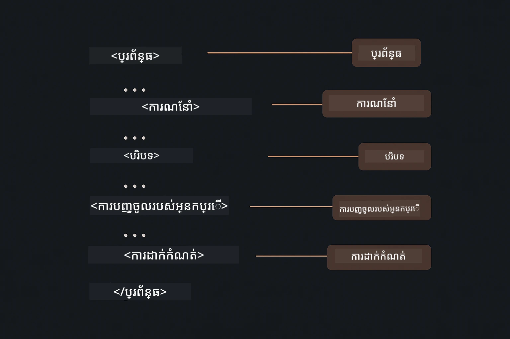

*រចនាសម្ព័ន្ធរបស់ prompt ទំាងមានផ្នែកច្បាស់និងរបៀបរៀបចំលក្ខណៈ XML*

**គុណភាពតាមរយៈការវាយតម្លៃដោយខ្លួនឯង**

លំនាំបញ្ញ្រពិចារណាដោយខ្លួនឯងដំណើរការដោយការបង្ហាញលក្ខណៈគុណភាពច្បាស់លាស់។ មិនត្រឹមតែសង្ឃឹមថាម៉ូដែល "ធ្វើបានត្រឹមត្រូវ" ទេ ប៉ុន្តែអ្នកប្រាប់វាត្រឹមត្រូវមានន័យថា៖ តុល្យ្យវិចារត្រឹមត្រូវ ការដោះស្រាយកំហុស ប្រសិទ្ធភាព និងសុវត្ថិភាព។ ម៉ូដែលអាចវាយតម្លៃលទ្ធផលខ្លួនឯង ហើយធ្វើឲ្យប្រសើរឡើង។ នេះបម្លែងកូដពីការចាប់សំណាងទៅជាដំណើរការត្រឹមត្រូវ។

**context គឺមានកំណត់**

ការសន្ទនាច្រើនជំរើសដំណើរការតាមរយៈការរួមបញ្ចូលប្រវត្តិសារ ជាមួយនឹងសំណើនីមួយៗ។ ប៉ុន្តែមានកំណត់ - ម៉ូដែលទាំងអស់មានកំណត់ token ទៅតែប៉ុន្មាន។ ពេលកាលបរិច្ឆេទកើនឡើង អ្នកត្រូវការយុទ្ធសាស្រ្តរក្សា context ដែលពាក់ព័ន្ធដោយមិនឲ្យលើសកម្រិតនោះ។ ម៉ូឌុលនេះបង្ហាញពីរបៀបដំណើរការចងចាំ; បន្ទាប់មកអ្នកនឹងរៀនពេលណាត្រូវសង្ខេប ពេលណាចាំបាច់ភ្លេច និងពេលណាដកយកវិញ។

## ជំហានបន្ទាប់

**ម៉ូឌុលបន្ទាប់៖** [03-rag - RAG (Retrieval-Augmented Generation)](../03-rag/README.md)

---

**ការរុករក៖** [← មុន៖ ម៉ូឌុល 01 - ទិដ្ឋភាពទូទៅ](../01-introduction/README.md) | [ត្រលប់ទៅមុខភាគ](../README.md) | [បន្ទាប់៖ ម៉ូឌុល 03 - RAG →](../03-rag/README.md)

---

<!-- CO-OP TRANSLATOR DISCLAIMER START -->
**ការបដិសេធ**៖  
ឯកសារនេះត្រូវបានបកប្រែដោយប្រើសេវាបកប្រែ AI [Co-op Translator](https://github.com/Azure/co-op-translator)។ ខណៈពេលដែលយើងខិតខំឡើងដល់ភាពត្រឹមត្រូវ សូមយល់ដឹងថាការបកប្រែដោយស្វ័យប្រវត្តិនេះអាចមានកំហុស ឬការខុសត្រូវខ្លះៗ។ ឯកសារដែលមានភាសាម្ដងកើតគួរត្រូវបានរក្សាជាជំនួយដើមដែលមានសុពលភាព។ សម្រាប់ព័ត៌មានដ៏សំខាន់ សូមណែនាំឲ្យប្រើការបកប្រែដោយមនុស្សដែលមានជំនាញ។ យើងមិនទទួលខុសត្រូវចំពោះការយល់ច្រឡំ ឬការបកប្រែខុសដែលកើតមានពីការប្រើប្រាស់ការបកប្រែនេះឡើយ។
<!-- CO-OP TRANSLATOR DISCLAIMER END -->