# ម៉ូឌុល ០៣៖ RAG (ការបង្កើតដោយបន្ថែមការស្វែងរក)

## តារាងខ្លឹមសារ

- [វីដេអូផ្លាស់ប្តូរ](#វីដេអូផ្លាស់ប្តូរ)
- [អ្វីដែលអ្នកនឹងរៀន](#អ្វីដែលអ្នកនឹងរៀន)
- [លក្ខខណ្ឌមុន](#លក្ខខណ្ឌមុន)
- [ការយល់ដឹងអំពី RAG](#ការយល់ដឹងអំពី-rag)
  - [ជម្រើស RAG តើមេរៀននេះប្រើអ្វី?](#ជម្រើស-rag-តើមេរៀននេះប្រើអ្វី)
- [របៀបដំណើរការ](#របៀបដំណើរការ)
  - [ការប្រព្រឹត្តទៅលើឯកសារ](#ការប្រព្រឹត្តទៅលើឯកសារ)
  - [ការបង្កើត embeddings](#ការបង្កើត-embeddings)
  - [ការស្វែងរកស្រដៀង](#ការស្វែងរកស្រដៀង)
  - [ការបង្កើតចម្លើយ](#ការផលិតចម្លើយ)
- [រត់កម្មវិធី](#រត់កម្មវិធី)
- [ការប្រើប្រាស់កម្មវិធី](#ការប្រើប្រាស់កម្មវិធី)
  - [អាប់ឡូដឯកសារ](#អាប់ឡូតឯកសារ)
  - [សួរប្រធានបទ](#សួរសំណួរ)
  - [ពិនិត្យប្រភពយោង](#ពិនិត្យយោងប្រភព)
  - [សាកល្បងជាមួយសំនួរ](#សាកល្បងសំណួរ)
- [គំនិតសំខាន់ៗ](#គំនិតសំខាន់ៗ)
  - [យុទ្ធសាស្ត្រកែក](#យុទ្ធសាស្ត្របំបែកចំណែក-chunking)
  - [ពិន្ទុស្រដៀង](#ពិន្ទុភាពស្រដៀងគ្នា-similarity-scores)
  - [ការផ្ទុកក្នុងចង្វាក់](#ឃ្លាំងទិន្នន័យក្នុងម៉េម៉ូរី)
  - [ការគ្រប់គ្រងបង្អួចបរិបទ](#ការគ្រប់គ្រងបរិវេណបរិបទ)
- [ពេលដែល RAG មានសារៈសំខាន់](#ពេលណាដែល-rag-មានសារៈសំខាន់)
- [ជំហានបន្ទាប់](#ជំហានបន្ទាប់)

## វីដេអូផ្លាស់ប្តូរ

ទស្សនាពិធីបន្តផ្ទាល់នេះដែលពណ៌នាអំពីរបៀបចាប់ផ្តើមជាមួយម៉ូឌុលនេះ៖

<a href="https://www.youtube.com/watch?v=_olq75ZH_eY"></a>

## អ្វីដែលអ្នកនឹងរៀន

ក្នុងម៉ូឌុលមុនៗ អ្នកបានរៀនរបៀបធ្វើការសន្ទនាជាមួយ AI និងរចនាសម្ព័ន្ធសំណួររបស់អ្នកយ៉ាងមានប្រសិទ្ធិភាព។ ប៉ុន្តែមានការជាប់កំណត់មួយសំខាន់៖ គំរូភាសាអាចដឹងតែអ្វីដែលពួកវាបានរៀនពេលហ្វឹកហាត់ប៉ុណ្ណោះ។ វាមិនអាចឆ្លើយសំណួរអំពីគោលការណ៍ក្រុមហ៊ុនរបស់អ្នក ឬឯកសារគម្រោងរបស់អ្នក ឬព័ត៌មានណាមួយដែលពួកវាមិនបានហ្វឹកហាត់ទេ។

RAG (Retrieval-Augmented Generation) ជួយដោះសោនេះ។ ជំនួសការព្យាយាមបង្រៀនគំរូដោយផ្ទាល់ (ដែលថ្លៃថ្នូរនិងមិនពេញចិត្ត) អ្នកអាចផ្ដល់សមត្ថភាពស្វែងរកឯកសាររបស់អ្នក។ នៅពេលដែលមាននរណាម្នាក់សួរបញ្ហា ប្រព័ន្ធនាំឱ្យឯកសារដែលពាក់ព័ន្ធមកជាប់ក្នុងសំណួរ។ គំរូនឹងឆ្លើយតបដោយផ្អែកលើបរិបទដែលបានយកមកនោះ។

គិតថា RAG ជាការផ្ដល់បណ្ណាល័យយោងឱ្យគំរូ។ នៅពេលអ្នកសួរបញ្ហា ប្រព័ន្ធ៖

1. **សំណួរអ្នកប្រើ** - អ្នកសួរ
2. **Embedding** - បម្លែងសំណួររបស់អ្នកទៅជាទ្រង់ទ្រាយវ៉ិចទ័រ
3. **ការស្វែងរកវ៉ិចទ័រ** - ស្វែងរកម្ជុលឯកសារដែលស្រដៀងគ្នា
4. **ការប្រមូលបរិបទ** - បន្ថែមម្ជុលពាក់ព័ន្ធទៅក្នុងសំណួរ
5. **ចម្លើយ** - គំរូជ GENERATE ចម្លើយផ្អែកលើបរិបទ

នេះធ្វើឱ្យចម្លើយរបស់គំរូស្ថិតនៅលើទិន្នន័យពិតជារបស់អ្នក មិនគួរឱ្យពឹងផ្អែកលើចំណេះដឹងហ្វឹកហាត់របស់វា ឬបង្កើតចម្លើយឡើងមក។

## លក្ខខណ្ឌមុន

- បានបញ្ចប់ [Module 00 - Quick Start](../00-quick-start/README.md) (សម្រាប់ឧទាហរណ៍ Easy RAG ដែលបានយោងនៅក្នុងម៉ូឌុលនេះ)
- បានបញ្ចប់ [Module 01 - Introduction](../01-introduction/README.md) (ធនធាន Azure OpenAI ត្រូវបានដំណើរការ រួមទាំងម៉ូឌុល embedding `text-embedding-3-small`)
- មានឯកសារ `.env` នៅថត root រួចជាមួយសេវាប្រតិបត្តិ Azure (បានបង្កើតដោយ `azd up` ក្នុង Module 01)

> **សម្គាល់៖** បើអ្នកមិនទាន់បានបញ្ចប់ Module 01 ទេ សូមអនុវត្តតាមការណែនាំដំណើរការនៅទីនោះជាមុន។ ពាក្យបញ្ជា `azd up` នឹងដំណើរការម៉ូឌុល GPT chat និងម៉ូឌុល embedding ដែលប្រើសម្រាប់ម៉ូឌុលនេះ។

## ការយល់ដឹងអំពី RAG

រូបភាពខាងក្រោមបង្ហាញពីគំនិតសំខាន់៖ ជំនួសការពឹងផ្អែកលើទិន្នន័យហ្វឹកហាត់របស់គំរូតែប៉ុណ្ណោះ RAG ផ្ដល់បណ្ណាល័យយោងឯកសាររបស់អ្នកសម្រាប់ពិនិត្យមុនពេលបង្កើតចម្លើយ។

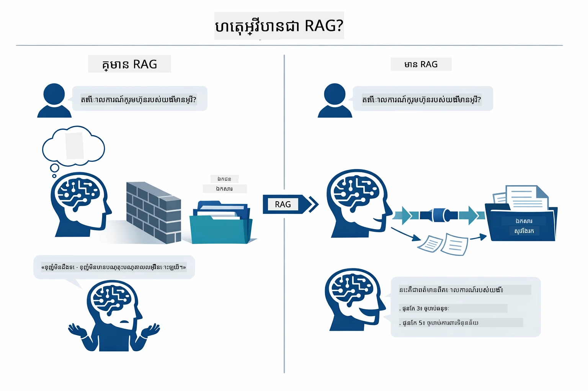

*រូបភាពនេះបង្ហាញពីភាពខុសគ្នារវាង LLM ទូទៅ (ដែលប៉ះសមាហរណ៍ពីទិន្នន័យហ្វឹកហាត់) និង LLM ដែលមានការបន្ថែម RAG (ដែលពិនិត្យឯកសាររបស់អ្នកជាមុន)*

នេះជារបៀបផ្នែកផ្សេងៗភ្ជាប់គ្នា។ សំណួរអ្នកប្រើឆ្លងកាត់ជាដំណាក់កាលបួន — embedding, ការស្វែងរកវ៉ិចទ័រ, ការប្រមូលបរិបទ និងការបង្កើតចម្លើយ — ដែលមានការរីកចម្រើនពីមួយទៅមួយ៖

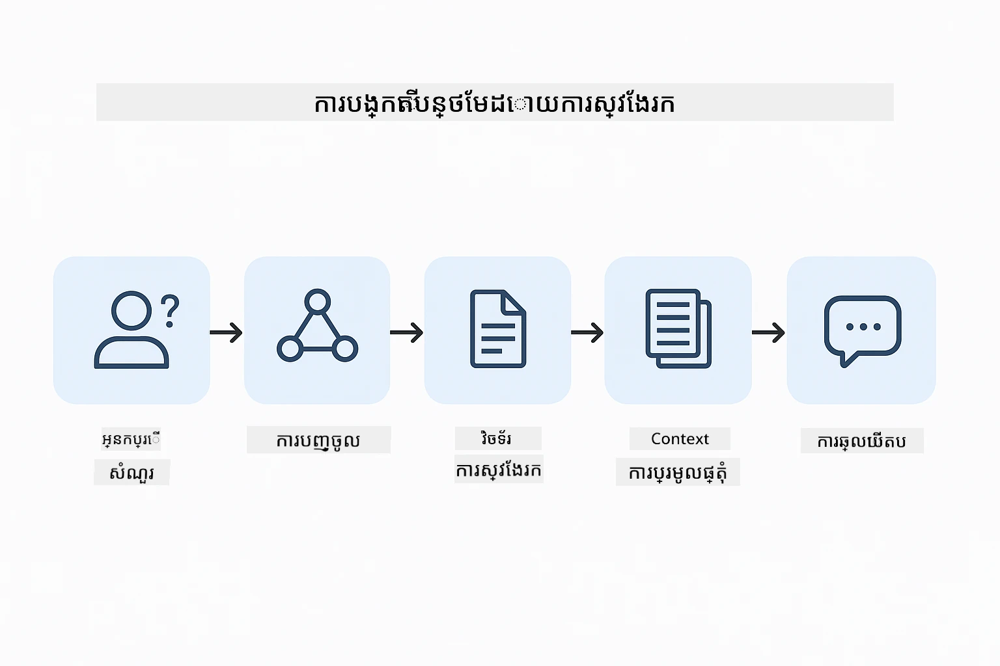

*រូបភាពនេះបង្ហាញពីផ្លូវភ្ជាប់ RAG ចាប់ពីដំណាក់កាល embedding, ស្វែងរកវ៉ិចទ័រ, ប្រមូលបរិបទ និងបង្កើតចម្លើយ។*

នៅសល់ម៉ូឌុលនេះនឹងពិពណ៌នាលម្អិតពីដំណាក់កាលទាំងអស់ ជាមួយកូដដែលអ្នកអាចរត់និងកែប្រែបាន។

### ជម្រើស RAG តើមេរៀននេះប្រើអ្វី?

LangChain4j ផ្តល់វិធីបីក្នុងការអនុវត្ត RAG ដែលមានកំរិត abstraction ខុសគ្នា។ រូបភាពខាងក្រោមប្រៀបធៀបវាចំនួនពីរសំរាប់មេរៀននេះ៖

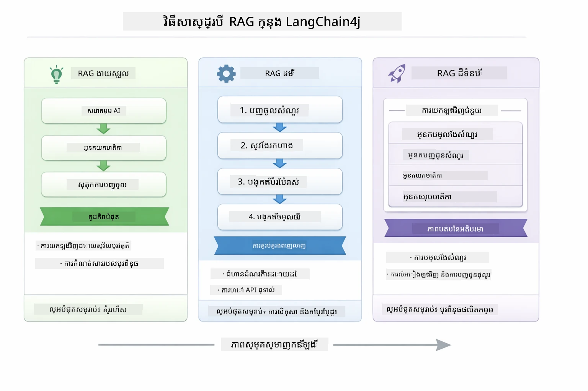

*រូបភាពប្រៀបធៀបវិធីបីរបស់ LangChain4j ក្នុង RAG — Easy, Native, និង Advanced — បង្ហាញគ្រឿងផ្សំនិងពេលប្រើបច្ចេកទេសនីមួយៗ។*

| វិធី | វាធ្វើអ្វី | ចំណាយជំនួស |
|---|---|---|
| **Easy RAG** | ភ្ជាប់បន្ទាប់បន្សំដោយស្វ័យប្រវត្តិតាម `AiServices` និង `ContentRetriever`។ អ្នកបញ្ចូល interface មួយ រួចភ្ជាប់ retriever ហើយ LangChain4j ត្រូវបានគ្រប់គ្រង embedding, ស្វែងរក, និងប្រមូល prompt ជាក្រោយ។ | កូដតិច ប៉ុន្តែនៅមិនមើលឃើញមុខងារនៅកម្រិតនីមួយៗ។ |
| **Native RAG** | អ្នកហៅម៉ូឌុល embedding, ស្វែងរកហាងទិន្នន័យ, បង្កើត prompt, និងសរសេរកូដចម្លើយផ្ទាល់ខ្លួន — តែរៀងលំដាប់។ | កូដច្រើន តែអាចមើលឃើញនិងកែប្រែក្នុងគ្រប់ដំណាក់កាលបាន។ |
| **Advanced RAG** | ប្រើស្រាសម៉ូឌុល `RetrievalAugmentor` ជាមួយនឹង transformers សំណួរ, routers, re-rankers, និង injectors សម្រាប់បណ្តាញផលិតកម្ម។ | មានភាពបត់បែនខ្ពស់បំផុត ប៉ុន្តែកាន់តែស្មុគស្មាញ។ |

**មេរៀននេះប្រើវិធី Native។** រៀងរាល់ដំណាក់កាលក្នុង RAG — embedding សំណួរ, ស្វែងរកក្នុងហាងវ៉ិចទ័រ, ប្រមូលបរិបទ, និងបង្កើតចម្លើយ — ត្រូវបានសរសេរជាផ្ទាល់ក្នុង [`RagService.java`](../../../03-rag/src/main/java/com/example/langchain4j/rag/service/RagService.java)។ នេះគ្រាន់តែជាផ្នែកការសិក្សា ដែលសំខាន់ជាងគេគឺអ្នកអាចមើលឃើញនិងយល់ដឹងពីរៀងរាល់ដំណាក់កាល ជំនួសការត្រូវបន្ថយកូដ។ បន្ទាប់ពីអ្នកស្គាល់វា អ្នកអាចទៅកាន់ Easy RAG សម្រាប់ម៉ូឌែលរហ័ស ឬ Advanced RAG សម្រាប់ប្រព័ន្ធផលិតកម្ម។

> **💡 បានឃើញ Easy RAG ដំណើរការហើយទេ?** ម៉ូឌុល [Quick Start](../00-quick-start/README.md) មានឧទាហរណ៍ Document Q&A ([`SimpleReaderDemo.java`](../../../00-quick-start/src/main/java/com/example/langchain4j/quickstart/SimpleReaderDemo.java)) ប្រើវិធី Easy RAG — LangChain4j គ្រប់គ្រង embedding, ស្វែងរក និងប្រមូល prompt ដោយស្វ័យប្រវត្តិ។ ម៉ូឌុលនេះធ្វើកំហាត់បន្ទាប់ ដោយបំបែកផ្លូវភ្ជាប់នេះដល់អ្នកដើម្បីអ្នកអាចមើលសភាពនិងគ្រប់គ្រងរៀងរាល់ដំណាក់កាលដោយផ្ទាល់។

រូបភាពខាងក្រោមបង្ហាញផ្លូវភ្ជាប់ Easy RAG ពីឧទាហរណ៍ Quick Start ។ សូមចំណាំរបៀបដែល `AiServices` និង `EmbeddingStoreContentRetriever` លាក់កម្រិតស្មុគស្មាញទាំងអស់ — អ្នកផ្ទុកឯកសារ ភ្ជាប់ retriever ហើយទទួលចម្លើយ។ វិធី Native ក្នុងម៉ូឌុលនេះបំបែកដំណាក់កាលទាំងនោះ៖

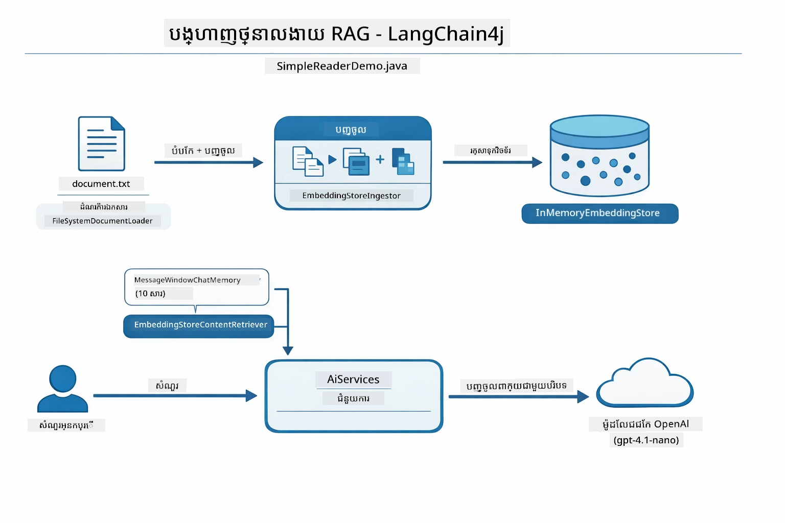

*រូបភាពនេះបង្ហាញផ្លូវភ្ជាប់ Easy RAG ពី `SimpleReaderDemo.java`។ ប្រៀបធៀបជាមួយវិធី Native ប្រើម៉ូឌុលនេះ៖ Easy RAG លាក់ embedding, ស្វែងរក និងប្រមូល prompt នៅក្រោយ `AiServices` និង `ContentRetriever` — អ្នកផ្ទុកឯកសារ ភ្ជាប់ retriever ហើយទទួលចម្លើយ។ វិធី Native ខាងម៉ូឌុលនេះបំបែកផ្លូវភ្ជាប់ដើម្បីអ្នកអាចហៅជាលម្អិត រៀងរាល់ដំណាក់កាល (embed, ស្វែងរក, ប្រមូលបរិបទ, បង្កើត) ដោយផ្ទាល់, ផ្តល់នូវទិដ្ឋភាពនិងការគ្រប់គ្រងពេញលេញ។*

## របៀបដំណើរការ

ផ្លូវភ្ជាប់ RAG ក្នុងម៉ូឌុលនេះបំបែកជាចំនួនបួនដំណាក់កាលដែលដំណើរការជាលំដាប់រៀងរាល់ពេលអ្នកប្រើសួរបញ្ហា។ ជាមុនសិនឯកសារដែលបានអាប់ឡូដនឹងត្រូវបាន **បកអាន និងកែក** ជាពកដុំតូចៗដែលអាចគ្រប់គ្រងបាន។ ដុំឯកសារនោះបន្ទាប់មកត្រូវបានបម្លែងទៅជារាងមួយនៅក្នុងវិស័យវ៉ិចទ័រសម្រាប់ឱ្យប្រៀបធៀបគ្នាយ៉ាងគណនាសាស្ត្រ។ នៅពេលមានសំណួរ ប្រព័ន្ធនឹងអនុវត្តការ **ស្វែងរកស្រដៀង** ដើម្បីរកដុំឯកសារដែលពាក់ព័ន្ធបំផុត ហើយបញ្ចូនជាបរិបទទៅ LLM ដើម្បីធ្វើ **ការបង្កើតចម្លើយ**។ ផ្នែកខាងក្រោមនឹងពិពណ៌នារបៀបដំណើរការរៀងរាល់ដំណាក់កាលជាមួយកូដនិងរូបភាព។ ចាប់ផ្តើមពីជំហានទីមួយ។

### ការប្រព្រឹត្តទៅលើឯកសារ

[DocumentService.java](../../../03-rag/src/main/java/com/example/langchain4j/rag/service/DocumentService.java)

ពេលអ្នកអាប់ឡូដឯកសារ ប្រព័ន្ធនឹងបកអានវា (PDF ឬអត្ថបទធម្មតា) ភ្ជាប់រូបមន្តដូចជា ឈ្មោះឯកសារ ហើយបំបែកវាទៅជាពកដុំតូចៗ — ដុំដែលមានទំហំសមរម្យសម្រាប់បញ្ចូលក្នុងបរិបទគំរូដោយងាយស្រួល។ ពកដុំទាំងនោះត្រូវបានធ្វើឲ្យទ្រង់ទ្រាយឆ្លាស់កាត់ខ្លះៗ ដើម្បីមិនបាត់បង់បរិបទនៅចំណុចចែក។

```java
// វាយតម្លៃឯកសារដែលបានផ្ទុកឡើងហើយប្តូរវាទៅជាឯកសារ LangChain4j Document
Document document = Document.from(content, metadata);

// បំបែកជា​​ចំណុច 300-តួអក្សរជាមួយការឆ្លងកាត់ 30-តួអក្សរ
DocumentSplitter splitter = DocumentSplitters
    .recursive(300, 30);

List<TextSegment> segments = splitter.split(document);
```

រូបភាពខាងក្រោមបង្ហាញរបៀបដែលវាដំណើរការដោយមើល៖ សូមចំណាំថាពកដុំនីមួយៗមានការចែករំលែកគ្នាក្នុងចំនួន ៣០ tokens ដើម្បីធានាមិនខកខានបរិបទសំខាន់នៅជិតប្រទាក់ដុំ៖

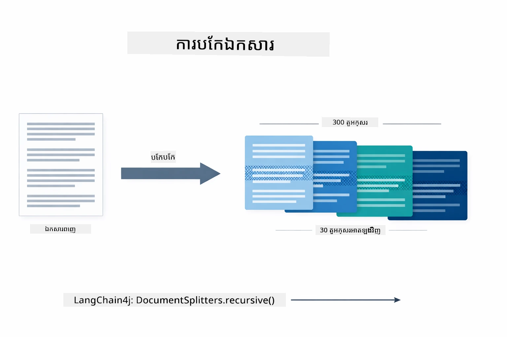

*រូបភាពនេះបង្ហាញឯកសារត្រូវបានបំបែកជាពកដុំ ៣០០ token មាន ៣០ token ឆ្លាស់កាត់ទ្រង់ទ្រាយ រក្សារបរិបទនៅប្រទាក់ពកដុំ។*

> **🤖 សាកល្បងជាមួយ [GitHub Copilot](https://github.com/features/copilot) Chat:** បើក [`DocumentService.java`](../../../03-rag/src/main/java/com/example/langchain4j/rag/service/DocumentService.java) ហើយសួរ៖
> - "LangChain4j បំបែកឯកសារជាពកដុំ និងហេតុអ្វីបានជាចំណុចឆ្លាស់កាត់បរិបទមានសារះសំខាន់?"
> - "តើទំហំពកដុំសាកសមបំផុតសម្រាប់ប្រភេទឯកសារផ្សេងៗជាអ្វី ហើយហេតុអ្វី?"
> - "តើធ្វើម៉េចដើម្បីដោះស្រាយឯកសារមានភាសាច្រើន ឬមានទ្រង់ទ្រាយពិសេស?"

### ការបង្កើត embeddings

[LangChainRagConfig.java](../../../03-rag/src/main/java/com/example/langchain4j/rag/config/LangChainRagConfig.java)

រាល់ពកដុំត្រូវបានបម្លែងទៅជា​តំណាងឲ្យជាលេខឈ្មោះ embedding — ជាការបម្លែងអត្ថន័យទៅលេខ។ ម៉ូឌុល embedding មិនមែនជាមនុស្សប្រាជ្ញា ដូចម៉ូឌុល chat ទេ; វាមិនអាចធ្វើតាមការណែនាំ ឬវាយនភាព ឬឆ្លើយសំណួរបានទេ។ វាអាចផ្ញើអត្ថបទទៅក្នុងវិស័យគណិតវិទ្យា ដែលមានអត្ថន័យស្រដៀងគ្នាវាស្ថិតជិតគ្នា — "ឡាន" ជិត "រថយន្ត," "គោលការណ៍សងប្រាក់" ជិត "បង្វិលប្រាក់ខ្ញុំ"។ គិតថាម៉ូឌុល chat គឺជាមនុស្សដែលអ្នកអាចនិយាយទៅ; ម៉ូឌុល embedding គឺជាប្រព័ន្ធថតស្ថិតិល្អឥតខ្ចោះ។

រូបភាពខាងក្រោមបង្ហាញចំណុចមួយនេះ — អត្ថបទចូល កំនត់វ៉ិចទ័រចេញ ហើយអត្ថន័យស្រដៀងគ្នានាំឱ្យវ៉ិចទ័រដំឡើងជិតគ្នា៖

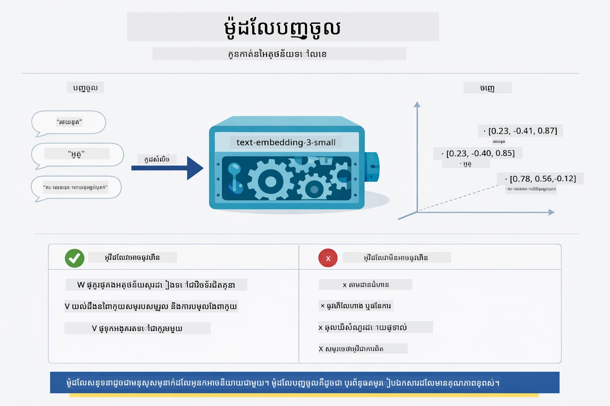

*រូបភាពនេះបង្ហាញថាម៉ូឌុល embedding បម្លែងអត្ថបទទៅវ៉ិចទ័រជាលេខ ដាក់អត្ថន័យស្រដៀងគ្នាចំណាត់ជិតគ្នា ក្នុងវិស័យវ៉ិចទ័រ។*

```java
@Bean
public EmbeddingModel embeddingModel() {
    return OpenAiOfficialEmbeddingModel.builder()
        .baseUrl(azureOpenAiEndpoint)
        .apiKey(azureOpenAiKey)
        .modelName(azureEmbeddingDeploymentName)
        .build();
}

EmbeddingStore<TextSegment> embeddingStore = 
    new InMemoryEmbeddingStore<>();
```

រូបភាពបង្ហាញពីសំណុំនៃចរន្តពីរ ក្នុងផ្លូវភ្ជាប់ RAG និងថ្នាក់ LangChain4j ដែលអនុវត្ត។ ការបញ្ចូលទិន្នន័យ (រត់ពេលអាប់ឡូដ) ពីរការបំបែកឯកសារ, embedding ពកដុំ, និងរក្សាទុកតាម `.addAll()`។ ចរន្តសំណួរ (រត់រាល់ពេលអ្នកសួរ) ដាក់ embedding សំណួរ, ស្វែងរកក្នុងហាងតាម `.search()`, និងផ្ញើបរិបទដែលបានជ្រើសទៅកាន់ម៉ូឌុល chat។ ចរន្តទាំងពីរនេះភ្ជាប់គ្នាតាម interface `EmbeddingStore<TextSegment>`៖

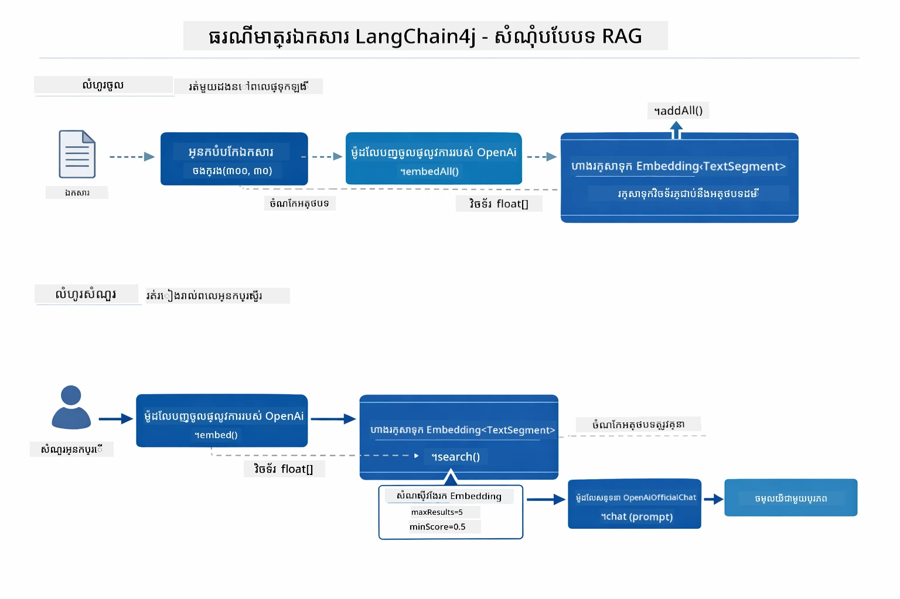

*រូបភាពនេះបង្ហាញពីចរន្តពីរក្នុងផ្លូវភ្ជាប់ RAG — ingestion និង query — និងរបៀបភ្ជាប់តាម EmbeddingStore រួមវាយ។*

ពេលដែល embeddings ត្រូវបានរក្សាទុក ខ្លឹមសារដែលស្រដៀងគ្នានឹងជំបូរជាក្រុមនៅក្នុងវិស័យវ៉ិចទ័រ។ រូបភាពខាងក្រោមបង្ហាញឯកសារដែលទាក់ទងគ្នាដាក់ជារូបមន្តនៅជិតគ្នា ដូចជា Technical Docs, Business Rules, និង FAQs ដែលបង្កើតជាក្រុមច្បាស់លាស់។

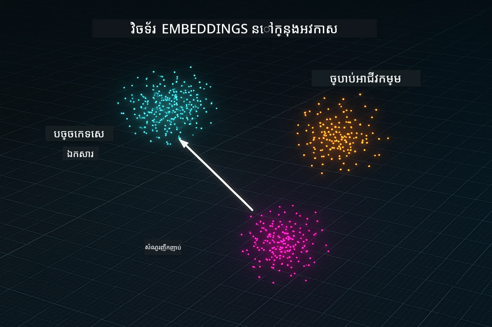

*រូបភាពនេះបង្ហាញពីការដាក់ក្រុមឯកសារតាមប្រធានបទក្នុងវិស័យវ៉ិចទ័រ 3D, ដែលផ្តល់ជាក្រុមច្បាស់លាស់ជាច្រើនប្រភេទ។*

ពេលអ្នកស្វែងរក ប្រព័ន្ធនឹងអនុវត្តជានូវជំហានបួន៖ embed ឯកសារ ម្តង, embed សំណួរ រាល់ពេលស្វែងរក, ប្រៀបធៀបវ៉ិចទ័រសំណួរជាមួយវ៉ិចទ័រទាំងអស់តាម cosine similarity, ហើយត្រឡប់ម្ជុលដែលមានពិន្ទុខ្ពស់ចំនួន top-K។ រូបភាពខាងក្រោមបង្ហាញជ្រុលជំហាននីមួយៗ និងថ្នាក់ LangChain4j ដែលពាក់ព័ន្ធ៖

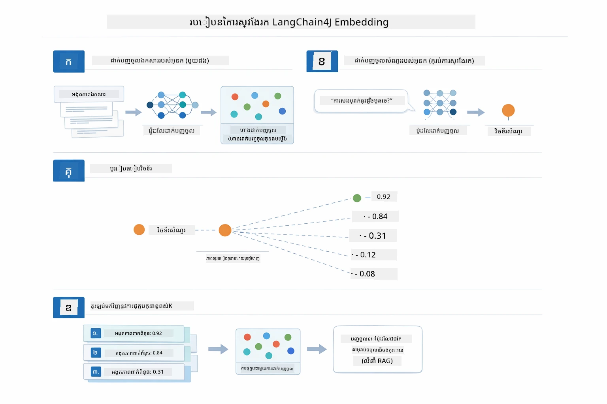

*រូបភាពនេះបង្ហាញដំណើរការស្វែងរកដោយ embedding បួនជំហាន៖ embed ឯកសារ, embed សំណួរ, ប្រៀបធៀវ៉ិចទ័រតាម cosine similarity, និងត្រឡប់លទ្ធផល top-K។*

### ការស្វែងរកស្រដៀង

[RagService.java](../../../03-rag/src/main/java/com/example/langchain4j/rag/service/RagService.java)

ពេលអ្នកសួរបញ្ហា សំណួរអ្នកក៏ត្រូវបានបម្លែងទៅជាវ៉ិចទ័រ embedding ផងដែរ។ ប្រព័ន្ធប្រៀបធៀប embedding នៃសំណួរអ្នកជាមួយ embedding នៃEach chunk of document។ វាស្វែងរកដុំដែលមានអត្ថន័យស្រដៀងគ្នាម៉ោង — មិនគ្រាន់តែស្វែងរកពាក្យគន្លឹះ ប៉ុន្តែស្វែងរកតាមអត្ថន័យពិតប្រាកដ។

```java
Embedding queryEmbedding = embeddingModel.embed(question).content();

EmbeddingSearchRequest searchRequest = EmbeddingSearchRequest.builder()
    .queryEmbedding(queryEmbedding)
    .maxResults(5)
    .minScore(0.5)
    .build();

EmbeddingSearchResult<TextSegment> searchResult = embeddingStore.search(searchRequest);
List<EmbeddingMatch<TextSegment>> matches = searchResult.matches();

for (EmbeddingMatch<TextSegment> match : matches) {
    String relevantText = match.embedded().text();
    double score = match.score();
}
```

រូបភាពខាងក្រោមប្រៀបធៀបស្វែងរកស្រដៀងនិងស្វែងរកពាក្យគន្លឹះបែបផ្ទាល់។ ការស្វែងរកពាក្យគន្លឹះ “យានយន្ត” បាត់ខ្លះពាក្យស្តីពី "ឡាន និងរថយន្ត" ប៉ុន្តែស្វែងរកស្រដៀងយល់ថាពួកវាមានន័យដូចគ្នា ហើយត្រឡប់ចម្លើយដែលមានពិន្ទុខ្ពស់មកវិញ៖

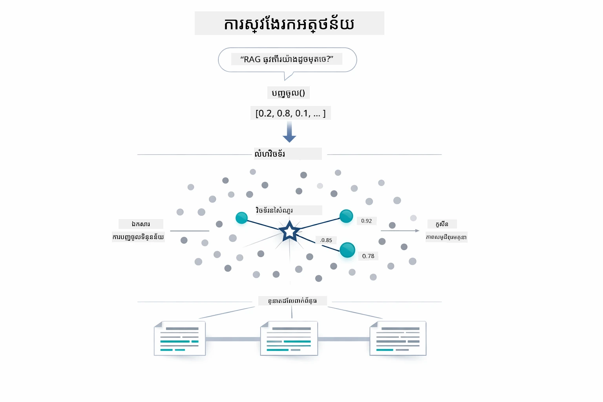

*រូបភាពនេះប្រៀបធៀបស្វែងរកផ្អែកលើពាក្យគន្លឹះជាមួយស្វែងរកស្រដៀង បង្ហាញពីរបៀបដែលស្វែងរកស្រដៀងយកមាតិកាដែលពាក់ព័ន្ធជាគំនិត ទោះបីពាក្យគន្លឹះខុសគ្នាក៏ដោយ។*
ក្រោមធ្នូ ហត្ថកម្មភាពស្រដៀងគ្នាត្រូវបានវាស់ដោយប្រើភាពស្រដៀងគ្នា cosine — ជាការស្នើសុំថា "តើ Arrow ទាំងពីរនេះកំពុងបញ្ជាក់ទិសដូចគ្នាទេ?" ផ្នែកពីរអាចប្រើពាក្យខុសគ្នារួចមក តែកាលបរិច្ឆេទហើយ ពួកវាមានន័យដូចគ្នា vector របស់ពួកវាបញ្ជាក់ទិសដូចគ្នា និងមានពិន្ទុជិត 1.0៖

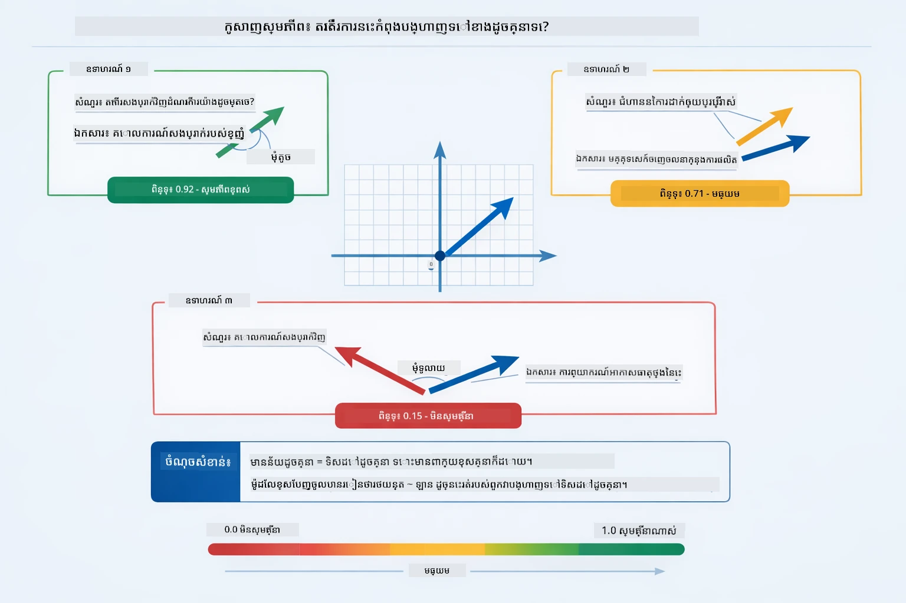

*រូបភាពនេះបង្ហាញពីភាពស្រដៀងគ្នា cosine ជាកំពស់ណែនกลางរវាងវេកទ័របញ្ចូល — វេកទ័រដែលស្របគ្នាច្បាស់មានពិន្ទុជិត 1.0 បង្ហាញពីភាពស្រដៀងគ្នាផ្នែកន័យខ្ពស់។*

> **🤖 សាកល្បងជាមួយ [GitHub Copilot](https://github.com/features/copilot) Chat:** បើក [`RagService.java`](../../../03-rag/src/main/java/com/example/langchain4j/rag/service/RagService.java) ហើយសួរ៖
> - "តើការស្វែងរកភាពស្រដៀងគ្នាធ្វើការបានយ៉ាងដូចម្តេចជាមួយការបញ្ចូល និងតើអ្វីកំណត់ពិន្ទុ?"
> - "តើខ្នងដែនភាពស្រដៀងគ្នាណាដែលគួរត្រូវបានប្រើ ហើយវា​ផ្លាស់ប្តូរវិញលទ្ធផលយ៉ាងដូចម្តេច?"
> - "តើខ្ញុំគ្រប់គ្រងករណីដែលមិនមានឯកសារសាកសមបានយ៉ាងដូចម្តេច?"

### ការផលិតចម្លើយ

[RagService.java](../../../03-rag/src/main/java/com/example/langchain4j/rag/service/RagService.java)

ផ្នែកដែលមានសារៈសំខាន់បំផុតត្រូវបានប្រមូលឡើងជាសំណុំសេចក្តីថ្លែងដែលមានការណែនាំច្បាស់លាស់ បរិបទដែលបានយកពីប្រតិបត្តិការ និងសំណួររបស់អ្នកប្រើ។ ម៉ូដែលអានផ្នែកជាក់លាក់នៃការបញ្ចូលនោះហើយឆ្លើយតបដោយផ្អែកលើព័ត៌មាននោះ — វាអាចប្រើតែអ្វីដែលមាននៅមុខវាប៉ុណ្ណោះ ដែលជួយទប់ស្កាត់ការស្រមៃខុស។

```java
String context = matches.stream()
    .map(match -> match.embedded().text())
    .collect(Collectors.joining("\n\n"));

String prompt = String.format("""
    Answer the question based on the following context.
    If the answer cannot be found in the context, say so.

    Context:
    %s

    Question: %s

    Answer:""", context, request.question());

String answer = chatModel.chat(prompt);
```

រូបភាពខាងក្រោមបង្ហាញពីការប្រមូលនេះក្នុងសកម្មភាព — ផ្នែកដែលមានពិន្ទុំួយបំផុតពីជំហានស្វែងរកត្រូវបានចាក់ចូលទៅក្នុងសំពាធរ_TEMPLATE_ ហើយ `OpenAiOfficialChatModel` បង្កើតចម្លើយស្ថាពរៈ

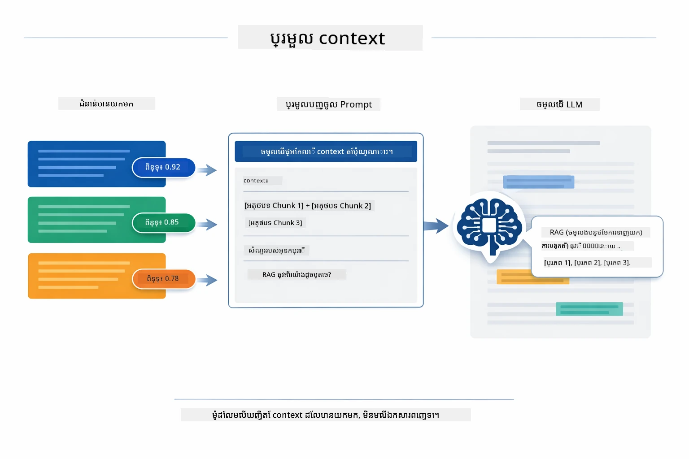

*រូបភាពនេះបង្ហាញពីរបៀបដែលផ្នែកដែលមានពិន្ទុខ្ពស់បំផុតត្រូវបានប្រមូលជាសំពាធរ​រចនាម៉ូដ បណ្តាលឲ្យម៉ូដែលអាចបង្កើតចម្លើយមានមូលដ្ឋានពីទិន្នន័យរបស់អ្នក។*

## រត់កម្មវិធី

**បញ្ជាក់ការតំឡើង៖**

ប្រាកដថាឯកសារ `.env` មាននៅក្នុងថតគោលជាមួយសញ្ញាប័ត្ររបស់ Azure (បានបង្កើតនៅពេល Module 01)។ ប្រតិបត្តិការនេះពីថត module (`03-rag/`):

**Bash:**
```bash
cat ../.env  # គួរតែបង្ហាញ AZURE_OPENAI_ENDPOINT, API_KEY, DEPLOYMENT
```

**PowerShell:**
```powershell
Get-Content ..\.env  # គួរតែបង្ហាញ AZURE_OPENAI_ENDPOINT, API_KEY, DEPLOYMENT
```

**ចាប់ផ្តើមកម្មវិធី៖**

> **កំណត់ចំណាំ៖** ប្រសិនបើអ្នកបានចាប់ផ្តើមកម្មវិធីទាំងអស់ដោយប្រើ `./start-all.sh` ពីថតគោល (ដូចដែលបានពិពណ៌នានៅ Module 01) ខ្នងនេះបានដំណើរការហើយនៅលើ port 8081 អ្នកអាចរំលងពាក្យបញ្ជាចាប់ផ្តើមខាងក្រោម ហើយចូលទៅកាន់ http://localhost:8081 ត្រង់។

**ជម្រើសទី 1: ប្រើ Spring Boot Dashboard (ណែនាំសម្រាប់អ្នកប្រើ VS Code)**

Dev container រួមបញ្ចូលអ៊ិចស្ទេនស្យុង Spring Boot Dashboard ដែលផ្ដល់ផ្ទាំងចង្អុលមួយសម្រាប់គ្រប់គ្រងកម្មវិធី Spring Boot ទាំងអស់។ អ្នកអាចរកឃើញវានៅក្នុង Activity Bar ផ្នែកខាងឆ្វេងនៃ VS Code (ស្វែងរករូបតំណាង Spring Boot)។

ពី Spring Boot Dashboard អ្នកអាច៖
- មើលកម្មវិធី Spring Boot ទាំងអស់ដែលមាននៅក្នុង workspace
- ចាប់ផ្តើម/បញ្ឈប់កម្មវិធីដោយចុចតែមួយ
- មើលកំណត់ហេតុកម្មវិធីបច្ចុប្បន្ន
- តាមដានស្ថានភាពកម្មវិធី

គ្រាន់តែចុចប៊ូតុងចាក់ហ្គេមនៅជាប់ "rag" ដើម្បីចាប់ផ្តើមខ្នងនេះ ឬចាប់ផ្តើមម៉ូឌុលទាំងអស់ក្នុងមួយពេល។

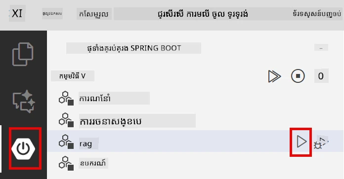

*រូបថតអេក្រង់នេះបង្ហាញ Spring Boot Dashboard ក្នុង VS Code ដែលអ្នកអាចចាប់ផ្តើម បញ្ឈប់ និងតាមដានកម្មវិធីដោយមានការបង្ហាញពីរូបភាពផ្ទាល់។*

**ជម្រើសទី 2: ប្រើ script shell**

ចាប់ផ្តើមកម្មវិធីវេបសាយទាំងអស់ (module 01-04):

**Bash:**
```bash
cd ..  # ពីថតឫស
./start-all.sh
```

**PowerShell:**
```powershell
cd ..  # ពីថតឫស
.\start-all.ps1
```

ឬចាប់ផ្តើមតែម៉ូឌុលនេះប៉ុណ្ណោះ៖

**Bash:**
```bash
cd 03-rag
./start.sh
```

**PowerShell:**
```powershell
cd 03-rag
.\start.ps1
```

Script ទាំងពីរបង្ហាប់បញ្ចូលអថេរបរិស្ថានពីឯកសារ `.env` នៅថតគោលដោយស្វ័យប្រវត្តិ ហើយនឹងបង្កើត JAR បើវាមិនមាន។

> **កំណត់ចំណាំ៖** ប្រសិនបើអ្នកចង់បង្កើតម៉ូឌុលទាំងអស់ដោយដៃ មុនចាប់ផ្តើម៖
>
> **Bash:**
> ```bash
> cd ..  # Go to root directory
> mvn clean package -DskipTests
> ```

> **PowerShell:**
> ```powershell
> cd ..  # Go to root directory
> mvn clean package -DskipTests
> ```

បើក http://localhost:8081 ក្នុងកម្មវិធីរុករករបស់អ្នក។

**ដើម្បីបញ្ឈប់៖**

**Bash:**
```bash
./stop.sh  # ម៉ូឌុលនេះតែប៉ុណ្ណោះ
# ឬ
cd .. && ./stop-all.sh  # ម៉ូឌុលទាំងអស់
```

**PowerShell:**
```powershell
.\stop.ps1  # ម៉ូឌូលនេះតែប៉ុណ្ណោះ
# ឬ
cd ..; .\stop-all.ps1  # ម៉ូឌូល​ទាំងអស់
```

## ការប្រើប្រាស់កម្មវិធី

កម្មវិធីផ្ដល់ផ្ទៃមុខវេបសម្រាប់អាប់ឡូតឯកសារនិងសួរសំណួរ។

<a href="images/rag-homepage.png">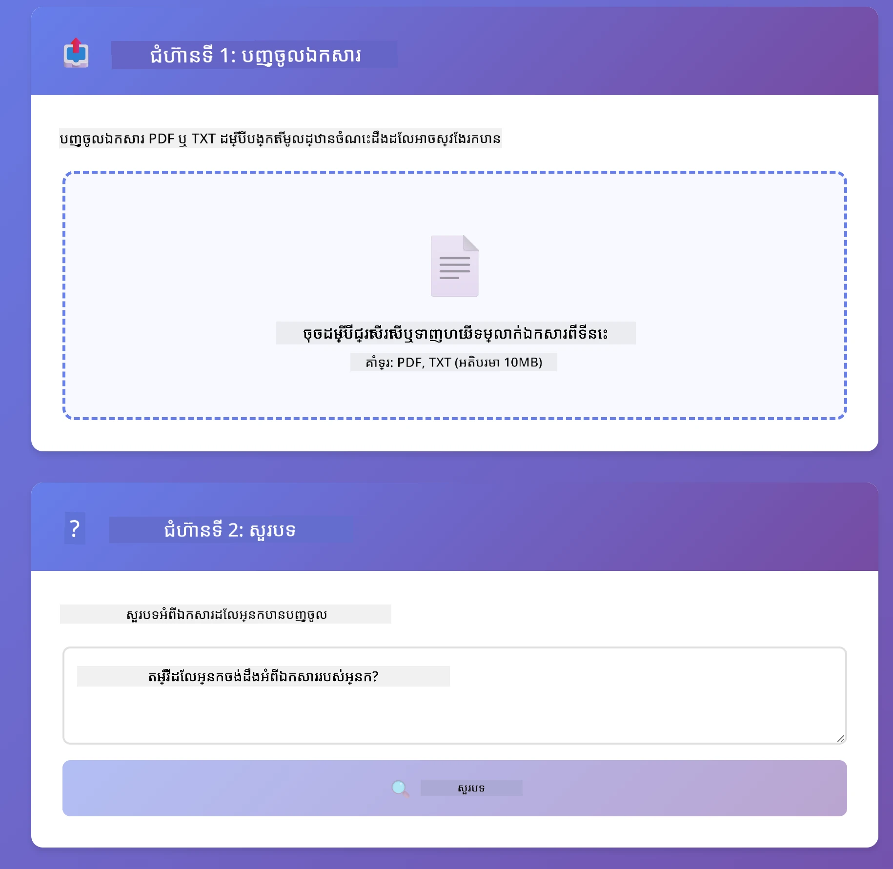</a>

*រូបថតអេក្រង់នេះបង្ហាញផ្ទៃមុខកម្មវិធី RAG ដែលអ្នកអាចអាប់ឡូតឯកសារ ហើយសួរសំណួរ។*

### អាប់ឡូតឯកសារ

ចាប់ផ្តើមដោយអាប់ឡូតឯកសារ - ថត TXT ធ្វើការល្អបំផុតសម្រាប់ការប្រលង។ មានឯកសារ `sample-document.txt` ផ្តល់នៅក្នុងថតនេះ ដែលមានព័ត៌មានអំពីមុខងារ LangChain4j, ការអនុវត្ត RAG និងរបៀបអនុវត្តល្អបំផុត - សមស្របសម្រាប់សាកល្បងប្រព័ន្ធ។

ប្រព័ន្ធដំណើរការឯកសាររបស់អ្នក បំបែកវាជាចំណែកៗ ហើយបង្កើត embeddings សម្រាប់ចំណែកនីមួយៗ។ នេះកើតឡើងដោយស្វ័យប្រវត្តិខណៈអ្នកអាប់ឡូត។

### សួរសំណួរ

ឥឡូវនេះសូមសួរសំណួរជាក់លាក់អំពីមាតិកាឯកសារ។ សាកល្បងនិយាយពីអ្វីដែលមានភាពជាក់លាក់នៅក្នុងឯកសារ។ ប្រព័ន្ធស្វែងរកចំណែកដែលពាក់ព័ន្ធ បញ្ចូលវាទៅក្នុងសំពាធរ និងបង្កើតចម្លើយ។

### ពិនិត្យយោងប្រភព

ចំណាំថាចម្លើយនីមួយៗមានយោងប្រភពជាមួយពិន្ទុភាពស្រដៀងគ្នា។ ពិន្ទុទាំងនេះ (ចាប់ពី 0 ដល់ 1) បង្ហាញពីភាពសាកសមរបស់ចំណែកនីមួយៗចំពោះសំណួររបស់អ្នក។ ពិន្ទុខ្ពស់មានន័យថាផ្សំគ្នាឡើងបានល្អ។ នេះអនុញ្ញាតឲ្យអ្នកផ្ទៀងផ្ទាត់ចម្លើយជាមួយវត្ថុធាតុដើម។

<a href="images/rag-query-results.png">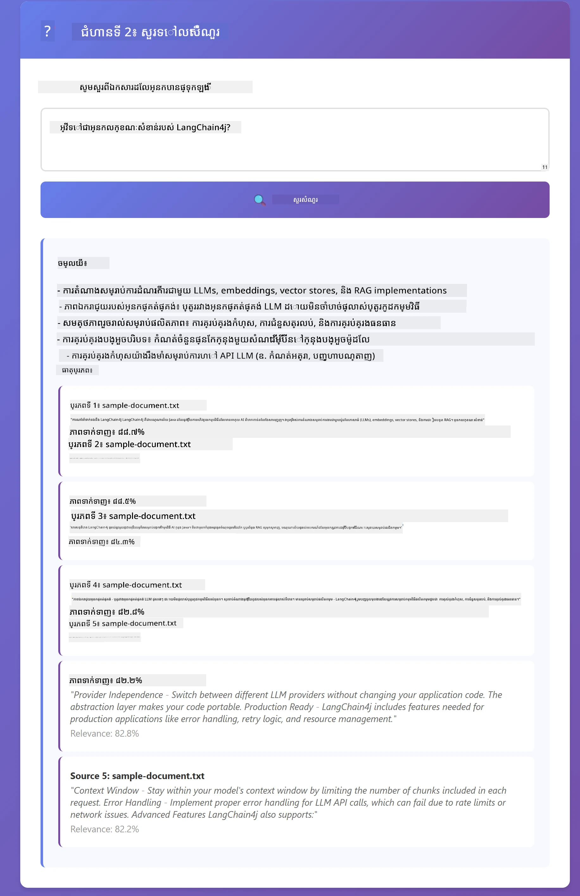</a>

*រូបថតអេក្រង់នេះបង្ហាញលទ្ធផលស្នើរសុំព្រមទាំងចម្លើយដែលបានបង្កើត, យោងប្រភព និងពិន្ទុភាពសមស្របសម្រាប់ចំណែកទាញយកនីមួយៗ។*

### សាកល្បងសំណួរ

សាកល្បងសំណួរប្រភេទផ្សេងៗ៖
- ព័ត៌មានជាក់លាក់៖ "ប្រធានបទចម្បងគឺអ្វី?"
- ការប្រៀបធៀប៖ "តើខុសគ្នារវាង X និង Y មានអ្វីខ្លះ?"
- សង្ខេប៖ "សង្ខេបចំណុចសំខាន់អំពី Z"

មើលមើលពិន្ទុសមស្របប្រែប្រួលដូចម្តេចដោយផ្អែកលើរបៀបដែលសំណួររបស់អ្នកត្រូវគ្នាជាមួយមាតិកាឯកសារ។

## គំនិតសំខាន់ៗ

### យុទ្ធសាស្ត្របំបែកចំណែក (Chunking)

ឯកសារត្រូវបានបំបែកជាចំណែក 300 តួអក្សរជាមួយ 30 តួអក្សរនៃការអូវចេញ។ ការតុល្យភាពនេះធ្វើឲ្យចំណែកនីមួយៗមានបរិបទគ្រប់គ្រាន់ដើម្បីមានអត្ថន័យ ខណៈពេលនៅតូចគ្រប់គ្រាល់ដើម្បីអាចដាក់ច្រើនចំណែកក្នុងសំពាធរ។

### ពិន្ទុភាពស្រដៀងគ្នា (Similarity Scores)

ចំណែករាល់ផ្នែកដែលចាប់យកបាន ជាមួយពិន្ទុភាពស្រដៀងគ្នារវាង 0 និង 1 បង្ហាញថាតើវាដូចដល់សំណួររបស់អ្នកយ៉ាងណា។ រូបភាពខាងក្រោមបង្ហាញជួរពិន្ទុ និងរបៀបដែលប្រព័ន្ធប្រើប្រាស់វាដើម្បីត្រងលទ្ធផល៖

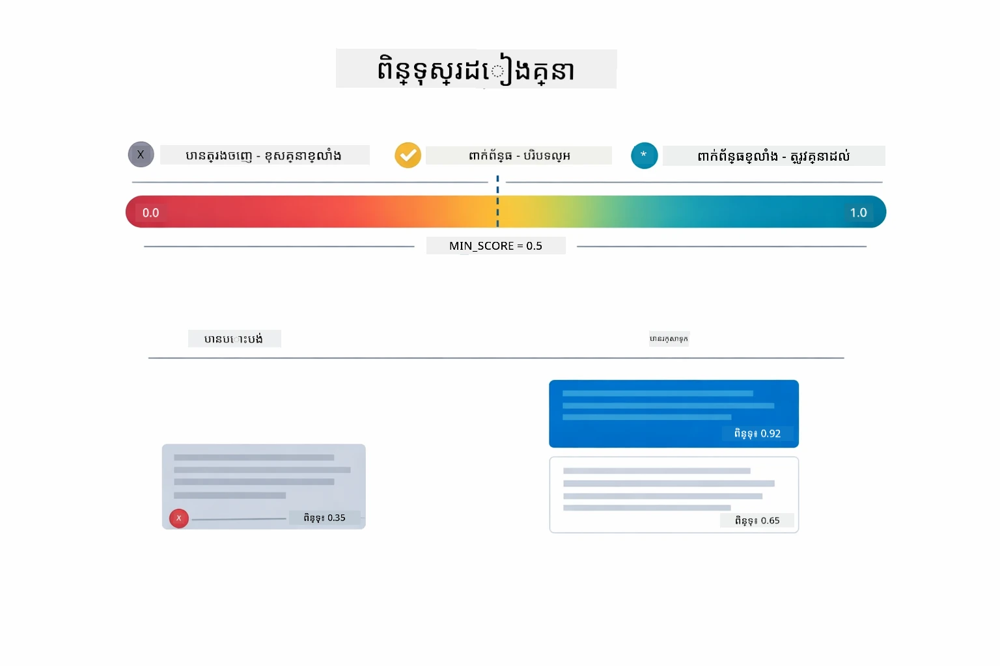

*រូបភាពនេះបង្ហាញពីជួរពិន្ទុចាប់ពី 0 ដល់ 1 ដែលមានខ្នងដែនគោល 0.5 ត្រៀមចំណែកដែលមិនពាក់ព័ន្ធកន្លែង។*

ពិន្ទុជួរពី 0 ដល់ 1៖
- 0.7-1.0៖ ពាក់ព័ន្ធខ្ពស់, ទំនាក់ទំនងជាក់លាក់
- 0.5-0.7៖ ពាក់ព័ន្ធ មាតិកាល្អ
- ต่ำกว่า 0.5៖ ត្រូវបានត្រះចេញ មិនសមរម្យ

ប្រព័ន្ធយកតែចំណែកដែលមានពិន្ទូលើសខ្នងដែនគោលប៉ុណ្ណោះ ដើម្បីធានាថាគុណភាពល្អ។

ការបញ្ចូលគ្នាដំណើរការល្អពេលមានការបែងចែកមាតិកាដែលច្បាស់លាស់ ប៉ុន្តែវាមានចំណុចខ្វើល។ រូបភាពខាងក្រោមបង្ហាញពីលក្ខខណ្ឌបរាជ័យធម្មតា — ចំណែកធំពេកបណ្តាលវេកទ័រល្មោភ, ចំណែកតូចពេកងាយខ្វះបរិបទ, លក្ខណៈមិនច្បាស់បង្ហាញទៅកាន់ចំណែករាប់ពីរ, និងការស្វែងរកម្ដងតែមួយ(IDs, ល.ឈ្មោះផ្នែក) មិនសមស្របជាមួយការបញ្ចូលគ្នាទេ៖

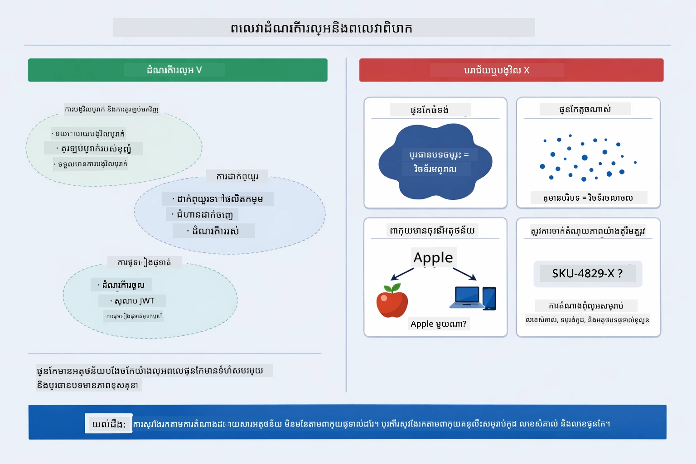

*រូបភាពនេះបង្ហាញពីលក្ខខណ្ឌបរាជ័យធម្មតាតាមការបញ្ចូល — ចំណែកធំ, ចំណែកតូច, លក្ខណៈមិនច្បាស់ដែលបង្ហាញចំណែកច្រើន, និងស្វែងរកត្រឹមត្រូវដូចជា ID។*

### ឃ្លាំងទិន្នន័យក្នុងម៉េម៉ូរី

ម៉ូឌុលនេះប្រើឃ្លាំងទិន្នន័យក្នុងម៉េម៉ូរីសម្រាប់ភាពសាមញ្ញ។ ប្រសិនបើអ្នកបើកកម្មវិធីឡើងវិញ ឯកសារដែលបានអាប់ឡូតនឹងបាត់បង់។ ប្រព័ន្ធផលិតកម្មប្រើប្រាស់មូលដ្ឋានទិន្នន័យវ៉ិចទ័រដែលជាប់ខ្ពស់ដូចជា Qdrant ឬ Azure AI Search។

### ការគ្រប់គ្រងបរិវេណបរិបទ

ម៉ូដែលនីមួយៗមានបរិវេណបរិបទអតិបរិមា។ អ្នកមិនអាចរួមបញ្ចូលចំណែកគ្រប់យ៉ាងពីឯកសារធំៗទាំងអស់បានទេ។ ប្រព័ន្ធនាំយកចំណែក N (លំនាំដើម 5) ដែលមានភាពពាក់ព័ន្ធខ្ពស់បំផុត ដើម្បីនៅក្នុងកំណត់ហេតុ និងផ្តល់បរិបទគ្រប់គ្រាន់សម្រាប់ចម្លើយត្រឹមត្រូវ។

## ពេលណាដែល RAG មានសារៈសំខាន់

RAG មិនមែនជាការជ្រើសរើសត្រឹមត្រូវគ្រប់ពេលទេ។ ជំនួយសំរាប់សម្រេចចិត្តខាងក្រោមជួយអ្នកកំណត់ពេលដែល RAG បន្ថែមតម្លៃ បើប្រៀបធៀបនឹងវិធីសាស្ត្រសាមញ្ញ — ដូចជាការរួមបញ្ចូលមាតិកាត្រូវក្នុងសំពាធរ ឬផ្អែកលើចំណេះដឹងដែលមានរបស់ម៉ូដែល — គឺគ្រប់គ្រាន់៖

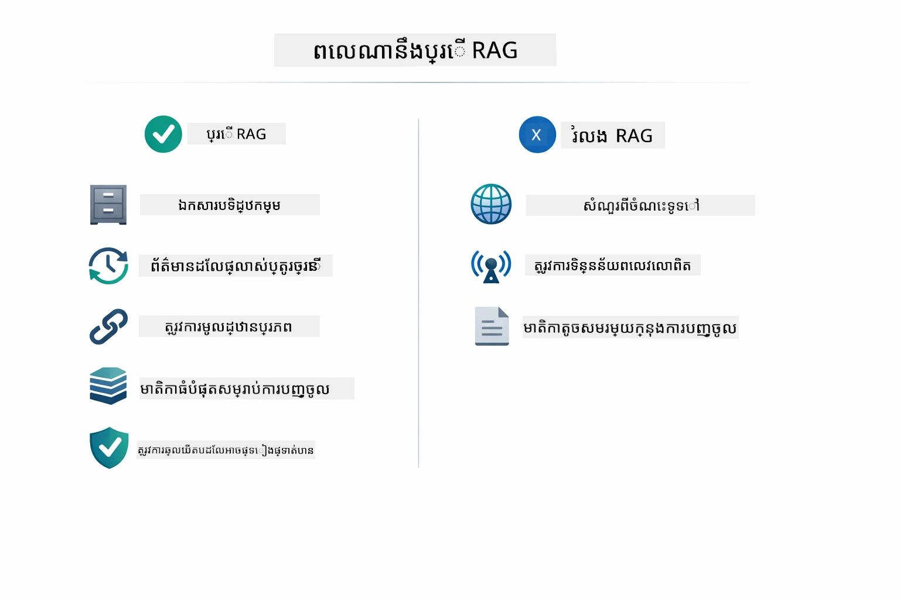

*រូបភាពនេះបង្ហាញឧបករណ៍សម្រេចចិត្តពេលណា RAG បន្ថែមតម្លៃ និងពេលណាវិធីសាមញ្ញគ្រប់គ្រាន់។*

## ជំហានបន្ទាប់

**ម៉ូឌុលបន្ទាប់៖** [04-tools - AI Agents with Tools](../04-tools/README.md)

---

**ការរុករក៖** [← សេចក្ដីមុន: Module 02 - Prompt Engineering](../02-prompt-engineering/README.md) | [ត្រឡប់ទៅផ្នែកមេ](../README.md) | [បន្ទាប់: Module 04 - Tools →](../04-tools/README.md)

---

<!-- CO-OP TRANSLATOR DISCLAIMER START -->
**ការបញ្ចេញការទទួលខុសត្រូវ**៖  
ឯកសារនេះត្រូវបានបកប្រែដោយប្រើសេវាកម្មបកប្រែ AI [Co-op Translator](https://github.com/Azure/co-op-translator)។ ខណៈពួកយើងខិតខំរកភាពត្រឹមត្រូវ សូមយល់ឲ្យបានថាការបកប្រែដោយស្វ័យប្រវត្តិអាចមានកំហុស ឬការមិនត្រឹមត្រូវ។ ឯកសារដើមក្នុងភាសាម្ចាស់របស់វាគួរត្រូវបានគិតថាជាមូលដ្ឋានសំខាន់។ សម្រាប់ព័ត៌មានសំខាន់ៗ ការបកប្រែដោយមនុស្សវិជ្ជាជីវៈត្រូវបានផ្ដល់អនុសាសន៍។ ពួកយើងមិនទទួលខុសត្រូវចំពោះការយល់ខុស ឬការបកស្រាយមិនត្រឹមត្រូវណាមួយដែលកើតឡើងពីការប្រើប្រាស់ការបកប្រែនេះ។
<!-- CO-OP TRANSLATOR DISCLAIMER END -->