# Module ០៤៖ មនុស្សប្រើប្រាស់ AI ជាមួយឧបករណ៍

## តារាងមាតិកា

- [ការតំណើរកម្មវីដេអូ](#ការតំណើរកម្មវីដេអូ)
- [អ្វីដែលអ្នកនឹងរៀន](#អ្វីដែលអ្នកនឹងរៀន)
- [លក្ខខណ្ឌមុន](#លក្ខខណ្ឌមុន)
- [ការយល់ដឹងអំពីមនុស្សប្រើ AI ជាមួយឧបករណ៍](#ការយល់ដឹងអំពីមនុស្សប្រើ-ai-ជាមួយឧបករណ៍)
- [របៀបដែលការហៅឧបករណ៍ធ្វើការ](#របៀបដែលការហៅឧបករណ៍ធ្វើការ)
  - [ការកំណត់ឧបករណ៍](#ការកំណត់ឧបករណ៍)
  - [ការធ្វើសេចក្ដីសម្រេច](#ការធ្វើសេចក្ដីសម្រេច)
  - [ការអនុវត្តន៍](#ការអនុវត្តន៍)
  - [ការបង្កើតចម្លើយ](#ការបង្កើតចម្លើយ)
  - [រចនាសម្ព័ន្ធ៖ ការតភ្ជាប់ Spring Boot យ៉ាងប្រពៃណី](#រចនាសម្ព័ន្ធ៖-ការតភ្ជាប់-spring-boot-យ៉ាងប្រពៃណី)
- [ការតភ្ជាប់ឧបករណ៍ជាសង្សា](#ការតភ្ជាប់ឧបករណ៍ជាសង្សា)
- [បើកមេរោគ](#បើកមេរោគ)
- [ការប្រើកម្មវិធី](#ការប្រើប្រាស់កម្មវិធី)
  - [សាកល្បងការប្រើឧបករណ៍សាមញ្ញ](#សាកល្បងការប្រើឧបករណ៍សាមញ្ញ)
  - [សាកល្បងការតភ្ជាប់ឧបករណ៍](#សាកល្បងការភ្ជាប់ឧបករណ៍)
  - [មើលទិដ្ឋភាពការសន្ទនា](#មើលដំណើរការជជែក)
  - [សាកល្បងជាមួយសំណើនានា](#សាកល្បងបញ្ចូលសំណើផ្សេងៗ)
- [មូលដ្ឋានគំនិត](#ទ្រឹស្តីសំខាន់ៗ)
  - [គំរូ ReAct (ការពិចារណា និងអនុវត្ត)](#លំនាំ-react-ការត្រួតពិនិត្យ-និងសកម្មភាព)
  - [ការពណ៌នាឧបករណ៍មានសារៈសំខាន់](#ការពិពណ៌នាឧបករណ៍មានសារៈសំខាន់)
  - [ការគ្រប់គ្រងសម័យសន្ទនា](#ការគ្រប់គ្រងសម័យប្រតិបត្តិការ)
  - [ការដោះស្រាយកំហុស](#ការគ្រប់គ្រងកំហុស)
- [ឧបករណ៍ដែលមាន](#ឧបករណ៍ដែលមានស្រាប់)
- [ពេលណាដែលត្រូវប្រើមនុស្សប្រើផ្អែកលើឧបករណ៍](#ពេលណានឹងប្រើភ្នាក់ងារដែលផ្អែកលើឧបករណ៍)
- [ឧបករណ៍ ប្រឆាំង RAG](#ឧបករណ៍-និង-rag)
- [ជំហានបន្ទាប់](#ជំហានបន្ទាប់)

## ការតំណើរកម្មវីដេអូ

មើលសម័យផ្សាយបន្តផ្ទាល់នេះដែលអោយពន្យល់ពីរបៀបចាប់ផ្ដើមជាមួយមេរោគនេះ៖

<a href="https://www.youtube.com/watch?v=O_J30kZc0rw"></a>

## អ្វីដែលអ្នកនឹងរៀន

មកដល់ពេលនេះ អ្នកបានរៀនពីរបៀបធ្វើសន្ទនាជាមួយ AI ដើម្បីរៀបចំការរំពឹងទុកយ៉ាងមានប្រសិទ្ធភាព ហើយយកចម្លើយឲ្យស្ថិតក្នុងឯកសាររបស់អ្នក។ ប៉ុន្តែមានកំណត់មូលដ្ឋានមួយ៖ គំរូភាសាអាចបង្កើតតែអត្ថបទតែប៉ុណ្ណោះ។ វាមិនអាចពិនិត្យស្ថានភាពអាកាសធាតុ គណនា ស្វែងរកក្នុងមូលដ្ឋានទិន្នន័យ ឬតាំងស្ថិតិជាមួយប្រព័ន្ធក្រៅបានទេ។

ឧបករណ៍បម្លែងសម្រាប់នេះ។ ដោយផ្តល់ឱ្យគំរូនូវមុខងារដែលវាអាចហៅបាន អ្នកបម្លែងវាពីអ្នកបង្កើតអត្ថបទជាមនុស្សប្រើដែលអាចអនុវត្តសកម្មភាព។ គំរូសម្រេចចិត្តពេលណាដែលវាទាមទារឧបករណ៍ ត្រូវប្រើឧបករណ៍ណា និងអ្វីជាអ៊ុតប៉ារ៉ាម៉ែត្រដើម្បីផ្តល់។ កូដរបស់អ្នកអនុវត្តមុខងារ ហើយត្រឡប់លទ្ធផលវិញ។ គំរូបញ្ចូលលទ្ធផលនោះទៅក្នុងចម្លើយរបស់វា។

## លក្ខខណ្ឌមុន

- បានបញ្ចប់ [មេរោគ ០១ - ការណែនាំ](../01-introduction/README.md) (ធនធាន Azure OpenAI បានដាក់តម្រូវ)
- បានបញ្ចប់មេរោគមុនៗដែលបានណែនាំ (មេរោគនេះយោងទៅលើ [មូលដ្ឋាន RAG ពីមេរោគ ០៣](../03-rag/README.md) ក្នុងការប្រៀបធៀបទៅឧបករណ៍ប្រឆាំង RAG)
- មានឯកសារ `.env` ក្នុងថតក្រឡាដំបូងជាមួយគណនី Azure (បង្កើតដោយ `azd up` នៅក្នុងមេរោគ ០១)

> **ចំណាំ៖** ប្រសិនបើអ្នកមិនទាន់បញ្ចប់មេរោគ ០១ កុំភ្លេចអនុវត្តតាមការណែនាំដាក់តម្រូវនៅទីនោះជាមុន។

## ការយល់ដឹងអំពីមនុស្សប្រើ AI ជាមួយឧបករណ៍

> **📝 ចំណាំ៖** ពាក្យ "agents" ក្នុងមេរោគនេះចង្អុលទៅកាន់ជំនួយការដែលមានសមត្ថភាពហៅឧបករណ៍ AI។ វាខុសគ្នាទៅពីគំរូ **Agentic AI** (មនុស្សប្រើអោយមានការធ្វើផែនការ ភ្លិចផ្លាស់ និងការពិចារណាច្រើនជំហាន) ដែលយើងនឹងរៀននៅ [មេរោគ ០៥: MCP](../05-mcp/README.md)។

ហើយគ្មានឧបករណ៍ អ្នកត្រូវបង្កើតអត្ថបទតែមួយតាមចំណេះដឹងហ្វូងហ្វឺនរបស់វា។ ប្រសិនបើអ្នកសួរអំពីអាកាសធាតុបច្ចុប្បន្ន វាចាំបាច់ត្រូវវាយតម្លៃមិនពិតមែន។ ប្រសិនបើអ្នកផ្តល់ឧបករណ៍ វាអាចហៅ API អាកាសធាតុ ប្រេនកាលគណនា ឬស្វែងរកមូលដ្ឋានទិន្នន័យ — ហើយបន្ថែមលទ្ធផលពិតទៅក្នុងចម្លើយរបស់វា។

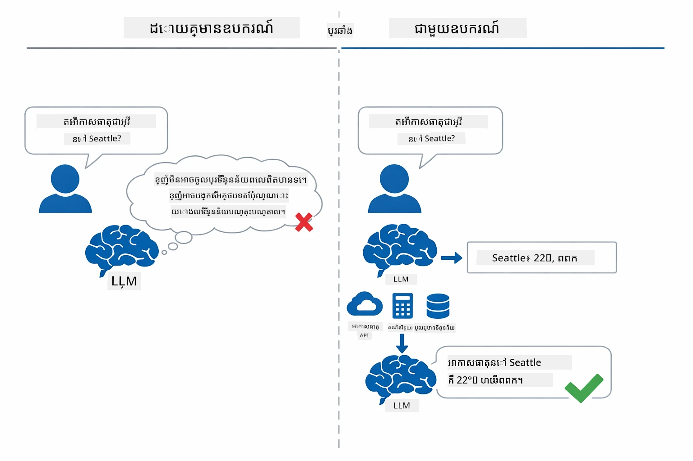

*គ្មានឧបករណ៍៖ គំរូត្រឹមតែទាយទ៉ៅ — មានឧបករណ៍៖ វាអាចហៅ API, ប្រតិបត្តិការ គណនា និងផ្តល់ទិន្នន័យពេលវេលាពិតបាន។*

មនុស្សប្រើ AI ជាមួយឧបករណ៍អនុវត្តគំរូ **Reasoning and Acting (ReAct)**។ គំរូមិនត្រឹមតែឆ្លើយតប — វានឹកឃើញអ្វីដែលវាទាមទារ អនុវត្តដោយហៅឧបករណ៍ អង្កេតលទ្ធផល ហើយសម្រេចថាត្រូវអនុវត្តបន្តឬផ្តល់ចម្លើយចុងក្រោយ៖

1. **ចិត្ដត្រូវ គិត** — មនុស្សប្រើវិភាគសំណួររបស់អ្នកប្រើ និងកំណត់ព័ត៌មានដែលត្រូវការ
2. **អនុវត្ត** — ជ្រើសឧបករណ៍ត្រឹមត្រូវ បង្កើតអ៊ុតប៉ារ៉ាម៉ែត្រត្រឹមត្រូវ ហើយហៅវា
3. **សង្កេត** — ទទួលយកលទ្ធផលឧបករណ៍ និងវាយតម្លៃលទ្ធផល
4. **ចម្លងឡើងវិញ ឬឆ្លើយតប** — បើត្រូវការទិន្នន័យបន្ថែម មនុស្សប្រើត្រឡប់ទៅជំហាន1 បើមិនដូច្នោះ វាបង្កើតចម្លើយភាសាធម្មជាតិ

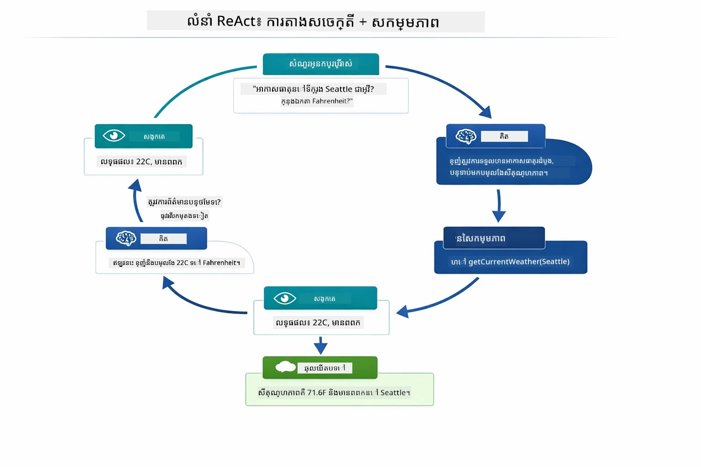

*ជំរៅវដ្ត ReAct — មនុស្សប្រើគិតអំពីអ្វីដែលត្រូវធ្វើ អនុវត្តដោយហៅឧបករណ៍ សង្កេតលទ្ធផល ហើយធ្វើវដ្តរហូតដល់អាចផ្តល់ចម្លើយចុងក្រោយបាន។*

រឿងនេះកើតឡើងដោយស្វ័យប្រវត្តិ។ អ្នកកំណត់ឧបករណ៍ និងការពណ៌នារបស់វា។ គំរូគ្រប់គ្រងការធ្វើសេចក្តីសម្រេចពេលណា និងរបៀបប្រើវា។

## របៀបដែលការហៅឧបករណ៍ធ្វើការ

### ការកំណត់ឧបករណ៍

[WeatherTool.java](../../../04-tools/src/main/java/com/example/langchain4j/agents/tools/WeatherTool.java) | [TemperatureTool.java](../../../04-tools/src/main/java/com/example/langchain4j/agents/tools/TemperatureTool.java)

អ្នកកំណត់មុខងារជាមួយការពណ៌នាសម្គាល់ច្បាស់លាស់ និងលក្ខណៈប៉ារ៉ាម៉ែត្របញ្ជាក់។ គំរូឃើញការពណ៌នាទាំងនេះក្នុងប្រអប់ប្រព័ន្ធរបស់វា ហើយយល់ពីអ្វីដែលឧបករណ៍នីមួយៗធ្វើ។

```java
@Component
public class WeatherTool {
    
    @Tool("Get the current weather for a location")
    public String getCurrentWeather(@P("Location name") String location) {
        // ការស្វែងរកអាកាសធាតុរបស់អ្នក
        return "Weather in " + location + ": 22°C, cloudy";
    }
}

@AiService
public interface Assistant {
    String chat(@MemoryId String sessionId, @UserMessage String message);
}

// ជំនួយការត្រូវបានភ្ជាប់ដោយស្វ័យប្រវត្តិដោយ Spring Boot ជាមួយៈ
// - ChatModel bean
// - វិធីសាស្រ្តទាំងអស់ @Tool ពីថ្នាក់ @Component
// - ChatMemoryProvider សម្រាប់ការគ្រប់គ្រងសម័យ​ប្រើប្រាស់
```

ផែនរូបមួយខាងក្រោមបំបែករាល់ស្លាក និងបង្ហាញអំពីរបៀបដែលមុខងារទាំងនេះជួយ AI យល់ពេលហៅឧបករណ៍ និងអ្វីជាអ៊ុតប៉ារ៉ាម៉ែត្រដែលវាត្រូវផ្ដល់៖

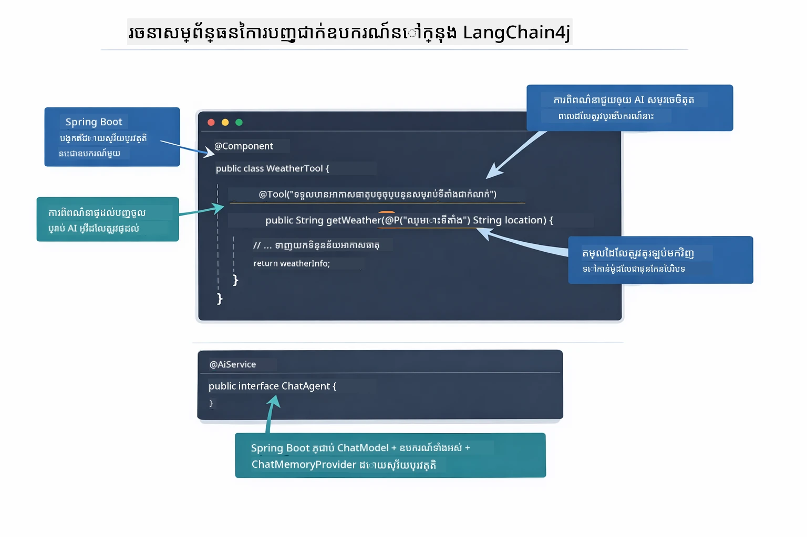

*រចនាសម្ព័ន្ធនៃការកំណត់ឧបករណ៍ — @Tool ប្រាប់ AI ពេលប្រើវា @P ពណ៌នាពីអ៊ុតប៉ារ៉ាម៉ែត្រនីមួយៗ និង @AiService ភ្ជាប់គ្រប់របស់នៅពេលចាប់ផ្ដើម។*

> **🤖 សាកល្បងជាមួយ [GitHub Copilot](https://github.com/features/copilot) Chat:** បើក [`WeatherTool.java`](../../../04-tools/src/main/java/com/example/langchain4j/agents/tools/WeatherTool.java) ហើយសួរ៖
> - "តើធ្វើដូចម្តេចដើម្បីភ្ជាប់ API អាកាសធាតុពិតដូចជា OpenWeatherMap ជំនួសទិន្នន័យគំរូ?"
> - "អ្វីដែលធ្វើឲ្យការពណ៌នាឧបករណ៏ល្អ ដែលជួយ AI ប្រើវាបានត្រឹមត្រូវ?"
> - "តើធ្វើដូចម្តេចដើម្បីដោះស្រាយកំហុស API និងកំណត់កម្រិតអត្រាក្នុងការអនុវត្តឧបករណ៍?"

### ការធ្វើសេចក្ដីសម្រេច

ពេលដែលអ្នកប្រើសួរ "អាកាសធាតុបច្ចុប្បន្ននៅ Seattle ជាអ្វី?" គំរូមិនបានជ្រើសឧបករណ៍មួយដោយចៃដន្យ។ វាប្រៀបធៀបបំណងអ្នកប្រើទៅនឹងការពណ៌នានៃឧបករណ៍ដែលវាមាន ប្រមានពិន្ទុរៀងរាល់ឧបករណ៍ ហើយជ្រើសឧបករណ៍ល្អបំផុត។ បន្ទាប់មកវាបង្កើតហៅមុខងារមានរចនាសម្ព័ន្ធជាមួយអ៊ុតប៉ារ៉ាម៉ែត្រដែលត្រឹមត្រូវ — ក្នុងករណីនេះ គឺកំណត់ `location` ទៅជា `"Seattle"`។

បើគ្មានឧបករណ៍ណាផ្គូផ្គងសំណើអ្នកប្រើ គំរូនឹងឆ្លើយតបពីចំណេះដឹងផ្ទាល់ខ្លួន។ ប្រសិនបើមានឧបករណ៍ជាច្រើនផ្គូផ្គង គំរូជ្រើសយកឧបករណ៍ដែលពិសេសបំផុត។

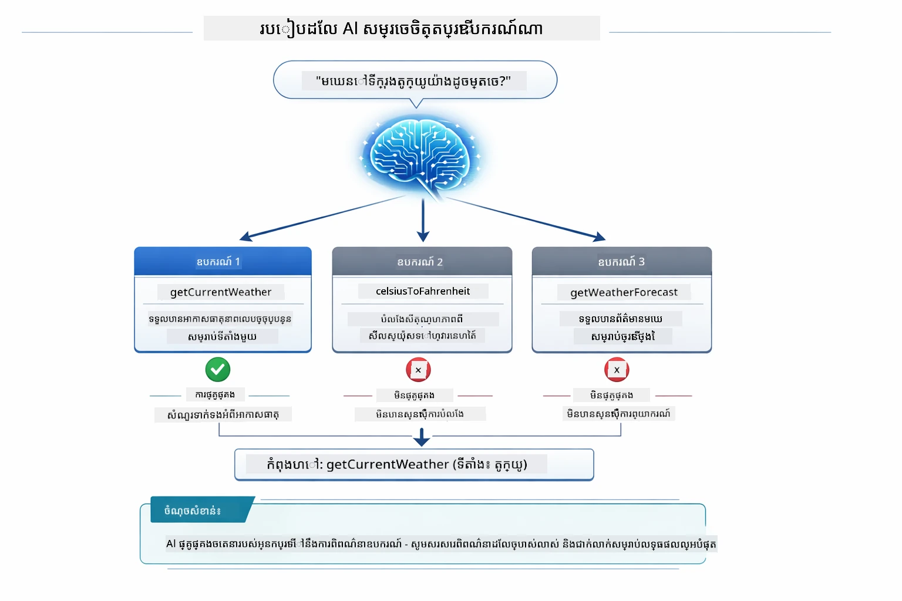

*គំរូវាយតម្លៃរាល់ឧបករណ៍ដែលអាចប្រើទៅនឹងបំណងអ្នកប្រើ ហើយជ្រើសឧបករណ៍ល្អបំផុត — ដូច្នេះហេតុអ្វីបានជាការសរសេរការពណ៌នាឧបករណ៍យ៉ាងច្បាស់ និងពិសេសមានសារៈសំខាន់។*

### ការអនុវត្តន៍

[AgentService.java](../../../04-tools/src/main/java/com/example/langchain4j/agents/service/AgentService.java)

Spring Boot តភ្ជាប់ដោយស្វ័យប្រវត្តិ `@AiService` ជាមួយឧបករណ៍ដែលបានចុះបញ្ជីទាំងអស់ ខណៈ LangChain4j អនុវត្តហៅឧបករណ៍យ៉ាងស្វ័យប្រវត្តិ។ នៅក្រោយមេឃ វដ្តហៅឧបករណ៍ពេញលេញឆ្លងកាត់ចំនួនប្រាំមួយជំហាន — ពីសំណួរភាសាធម្មជាតិរបស់អ្នកប្រើមកដល់ចម្លើយភាសាធម្មជាតិវិញ៖

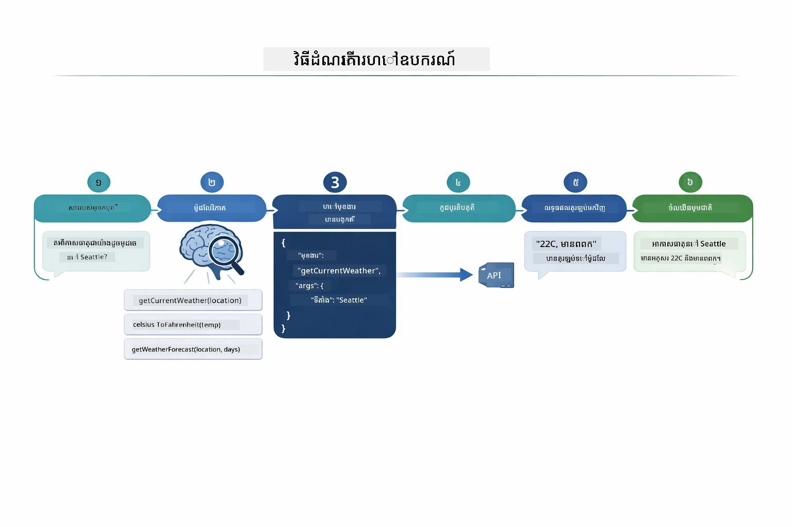

*ដំណើរការពេញលេញ៖ អ្នកប្រើសួរសំណួរ គំរូជ្រើសឧបករណ៍ LangChain4j អនុវត្តមុខងារ ហើយគំរូបញ្ចូលលទ្ធផលទៅក្នុងចម្លើយធម្មជាតិ។*

បើអ្នកបានរត់ [ToolIntegrationDemo](../../../00-quick-start/src/main/java/com/example/langchain4j/quickstart/ToolIntegrationDemo.java) នៅក្នុងមេរោគ ០០ អ្នកបានឃើញគំរូនេះក្នុងសកម្មភាពហើយ — ឧបករណ៍ `Calculator` ត្រូវបានហៅដូចគ្នា។ គំនូសម៉ូដលម្រោយខាងក្រោមបង្ហាញអ្វីដែលកើតឡើងនៅក្រោមម្ខាងបែបនេះ៖

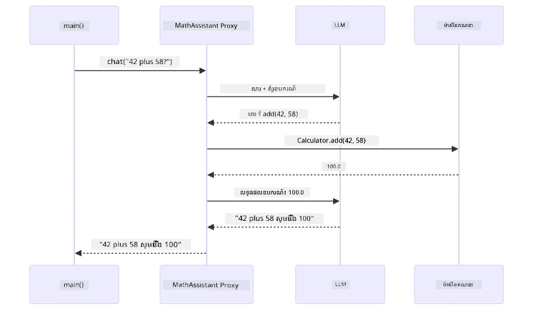

*វដ្តហៅឧបករណ៍ពីសំណួរ Quick Start — `AiServices` ផ្ញើសារ និងស_SCHEMA_ឧបករណ៍ទៅ LLM, LLM ឆ្លើយនៅជាមួយហៅមុខងារដូចជា `add(42, 58)`, LangChain4j ធ្វើវិធីសាស្រ្ត `Calculator` នៅក្នុងមូលដ្ឋាន និងដាក់ទិន្នន័យវិញសម្រាប់ចម្លើយចុងក្រោយ។*

> **🤖 សាកល្បងជាមួយ [GitHub Copilot](https://github.com/features/copilot) Chat:** បើក [`AgentService.java`](../../../04-tools/src/main/java/com/example/langchain4j/agents/service/AgentService.java) ហើយសួរ៖
> - "តើគំរូ ReAct ដំណើរការយ៉ាងដូចម្តេច និងហេតុអ្វីវាអាចមានប្រសិទ្ធភាពសម្រាប់មនុស្សប្រើ AI?"
> - "តើមនុស្សប្រើសម្រេចចិត្តប្រើឧបករណ៍ណា និងរៀបលំដាប់យ៉ាងដូចម្តេច?"
> - "តើមានអ្វីកើតឡើង បើការអនុវត្តឧបករណ៍មួយបរាជ័យ — តើត្រូវដោះស្រាយកំហុសយ៉ាងម៉េចឲ្យរឹងមាំ?"

### ការបង្កើតចម្លើយ

គំរូទទួលយកទិន្នន័យអាកាសធាតុ ហើយបំលែងវាទៅជាចម្លើយភាសាធម្មជាតិចំពោះអ្នកប្រើ។

### រចនាសម្ព័ន្ធ៖ ការតភ្ជាប់ Spring Boot យ៉ាងប្រពៃណី

មេរោគនេះប្រើការបញ្ចូល LangChain4j ជាមួយ Spring Boot រូបមន្ត `@AiService` ។ នៅពេលចាប់ផ្ដើម Spring Boot រកឃើញគ្រប់ `@Component` ដែលមានវិធីសាស្រ្ត `@Tool`, គ្រឿងចក្រ `ChatModel` និងអ្នកផ្គត់ផ្គង់ចងចាំ `ChatMemoryProvider` ហើយភ្ជាប់ទាំងអស់ទៅក្នុងរូបមន្ត `Assistant` ដោយគ្មានកូដច្រើន។

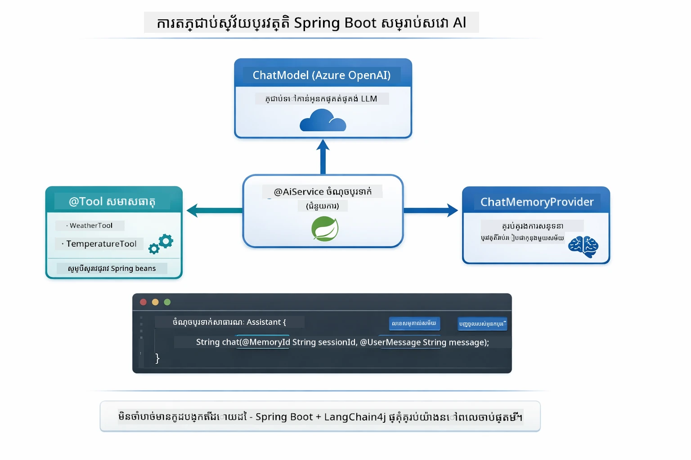

*រូបមន្ត @AiService ភ្ជាប់ ChatModel, ប្លកបន្ទះឧបករណ៍ និងអ្នកផ្គត់ផ្គង់ចងចាំ — Spring Boot គ្រប់គ្រងការតភ្ជាប់ពេញលេញដោយស្វ័យប្រវត្តិ។*

ខាងក្រោមគឺជាចំណុចអង្គការសំណើពេញលេញជាគំនូសម៉ូដល — ពីសំណើ HTTP ក្រោមកម្មវិធីគ្រប់គ្រង កម្មវិធីសេវា និងដំណាក់កាលភ្ជាប់ដោយស្វ័យប្រវត្តិ រហូតដល់ការអនុវត្តឧបករណ៍ និងត្រឡប់វិញ៖

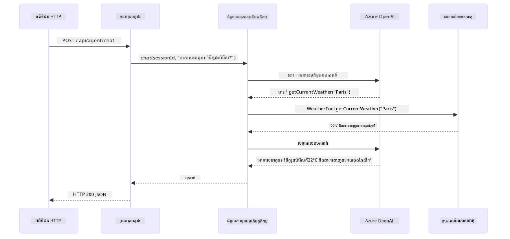

*ជីវិតវដ្តសំណើ Spring Boot ពេញលេញ — សំណើ HTTP ប្រតិបត្តិការតាមរយៈកម្មវិធីគ្រប់គ្រង និងសេវា ទៅអ្នក代理 Assistant ភ្ជាប់ដោយស្វ័យប្រវត្តិ ដែលគ្រប់គ្រង LLM និងហៅឧបករណ៍ដោយស្វ័យប្រវត្តិ។*

អត្ថប្រយោជន៍សំខាន់ៗនៃវិធីនេះ៖

- **Spring Boot auto-wiring** — ChatModel និងឧបករណ៍វាយដាក់ទៅដោយស្វ័យប្រវត្តិ
- **គំរូ @MemoryId** — ការគ្រប់គ្រងចងចាំក្នុងសម័យដោយស្វ័យប្រវត្តិ
- **ឯកតាតែមួយ** — បង្កើតឧបករណ៍ Assistant មួយលើក និងប្រើជាញឹកញាប់ ដើម្បីប្រសើរឡើង
- **ការអនុវត្តអោយជាប់ប្រភេទ** — វិធីសាស្រ្ត Java ត្រូវហៅដោយផ្ទាល់ ជាមួយការបំលែងប្រភេទ
- **ការគ្រប់គ្រងជាច្រើនជំហាន** — គ្រប់គ្រងរលូនការតភ្ជាប់ឧបករណ៍ដោយស្វ័យប្រវត្តិ
- **គ្មានកូដមួយជូន** — គ្មានការហៅដោយដៃ `AiServices.builder()` ឬ Map ចងចាំ HashMap

វិធីសាស្រ្តជំនួស (អនុវត្តដោយដៃ `AiServices.builder()`) ត្រូវការកូដច្រើនជាង និងខ្វះអត្ថប្រយោជន៍ Spring Boot។

## ការតភ្ជាប់ឧបករណ៍ជាសង្សា

**ការតភ្ជាប់ឧបករណ៍ជាសង្សា** — អំណាចពិតប្រាកដនៃមនុស្សប្រើផ្អែកលើឧបករណ៍ បង្ហាញពេលសំណួរតែមួយតម្រូវឲ្យប្រើឧបករណ៍មួយចំនួន។ សួរ "អាកាសធាតុបច្ចុប្បន្ននៅ Seattle ជា Fahrenheit យ៉ាងដូចម្តេច?" មនុស្សប្រើអូតូម៉ាទិកវត្ថុធាតុឧបករណ៍ពីរជញ្ជាំង៖ ជំហានដំបូងហៅ `getCurrentWeather` ដើម្បីទទួលសីតុណ្ហភាពជាសេลស្យុស រួចបញ្ជូនតម្លៃនោះទៅ `celsiusToFahrenheit` សម្រាប់បម្លែង — ទាំងអស់នៅក្នុងវដ្តសន្ទនាតែមួយ។

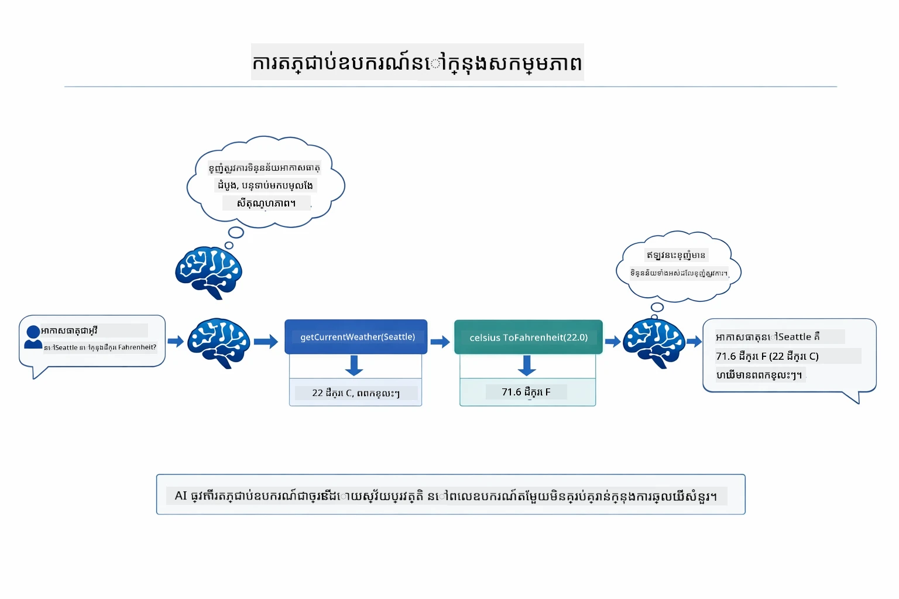

*ការតភ្ជាប់ឧបករណ៍ក្នុងសកម្មភាព — មនុស្សប្រើហៅ getCurrentWeather ជាជំហានដំបូង បន្ទាប់បញ្ចូលលទ្ធផលសេលស្យុសទៅជា celsiusToFahrenheit ហើយផ្តល់ចម្លើយរួមជាមួយគ្នា។*

**មិនបានជោគជ័យយ៉ាងស្រស់ស្អាត** — សួរអំពីអាកាសធាតុនៅទីក្រុងមួយដែលមិនមានក្នុងទិន្នន័យគំរូ។ ឧបករណ៍ត្រឡប់មកនូវសារ ខុស និង AI ពន្យល់ថាវាមិនអាចជួយបានជាងការបំបួលកម្មវិធី។ ឧបករណ៍បរាជ័យយ៉ាងសុវត្ថិភាព។ ផែនរូបខាងក្រោមបង្ហាញការប្រៀបធៀបរវាងពីរវិធី — ជាមួយការដោះស្រាយកំហុសត្រឹមត្រូវ មនុស្សប្រើចាប់ករណី និងឆ្លើយតបដោយជួយសម្រួល ខណៈគ្មានវា កម្មវិធីទាំងមូលបរាជ័យចុះ៖

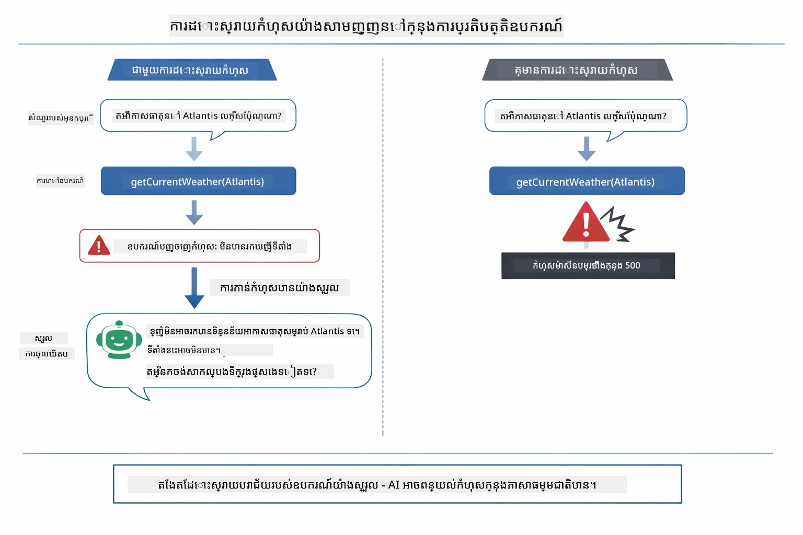

*ពេលដែលឧបករណ៍បរាជ័យ មនុស្សប្រើចាប់ករណីកំហុស និងឆ្លើយតបដោយជួយវិញ ជំនួសការបំបួលកម្មវិធី។*

រឿងនេះកើតឡើងក្នុងវដ្តសន្ទនាតែមួយ។ មនុស្សប្រើគ្រប់គ្រងហៅឧបករណ៍ជាច្រើនដោយស្វ័យប្រវត្តិ។

## បើកមេរោគ

**ផ្ទៀងផ្ទាត់ការដាក់តម្រូវ៖**

ធ្វើឲ្យប្រាកដថា មានឯកសារ `.env` ក្នុងថតក្រឡាដំបូង ជាមួយគណនី Azure (បានបង្កើតនៅក្នុងពេលមេរោគ ០១)។ រត់បញ្ជាលក់នេះពីថតមេរោគ (`04-tools/`)៖

**Bash:**
```bash
cat ../.env  # គួរតែបង្ហាញ AZURE_OPENAI_ENDPOINT, API_KEY, DEPLOYMENT
```

**PowerShell:**
```powershell
Get-Content ..\.env  # គួរតែបង្ហាញ AZURE_OPENAI_ENDPOINT, API_KEY, DEPLOYMENT
```

**ចាប់ផ្ដើមកម្មវិធី៖**

> **ចំណាំ៖** ប្រសិនបើអ្នកបានចាប់ផ្ដើមកម្មវិធីទាំងអស់ដោយ `./start-all.sh` ពីថតក្រឡាដំបូង (ដូចបានពិពណ៌នានៅមេរោគ ០១) មេរោគនេះមានដំណើរការលើកំពូល ៨០៨៤ រួចហើយ។ អ្នកអាចរំលងពាក្យបញ្ជារតាមខាងក្រោម និងចូលទៅ http://localhost:8084 តែម្តង។

**ជម្រើស ១៖ ប្រើ Spring Boot Dashboard (ណែនាំសម្រាប់អ្នកប្រើ VS Code)**

ថត dev មានបន្ថែម Spring Boot Dashboard ដែលផ្តល់ម៉ឺនុយឃើញបានច្បាស់ ដើម្បីគ្រប់គ្រងកម្មវិធី Spring Boot ទាំងអស់។ អ្នកអាចរកវាបាននៅក្នុងផ្ទាំងសកម្មភាពខាងឆ្វេងនៃ VS Code (ស្វែងរករូបតំណាង Spring Boot)។

ពី Spring Boot Dashboard អ្នកអាច៖
- មើលកម្មវិធី Spring Boot ទាំងអស់ដែលអាចប្រើបានក្នុងលំហ
- ចាប់ផ្ដើម/បញ្ឈប់កម្មវិធីដោយចុចមួយគត់
- មើលបន្ទាត់កំណត់ហេតុកម្មវិធីពេលវេលាពិត
- តាមដានស្ថានភាពកម្មវិធី
គ្រាន់តែចុចប៊ូតុងលេងនៅข้าง "tools" ដើម្បីចាប់ផ្តើមម៉ូឌុលនេះ ឬចាប់ផ្តើមម៉ូឌុលទាំងអស់ក្នុងពេលតែមួយ។

នេះជារូបរាងរបស់ Spring Boot Dashboard នៅក្នុង VS Code៖

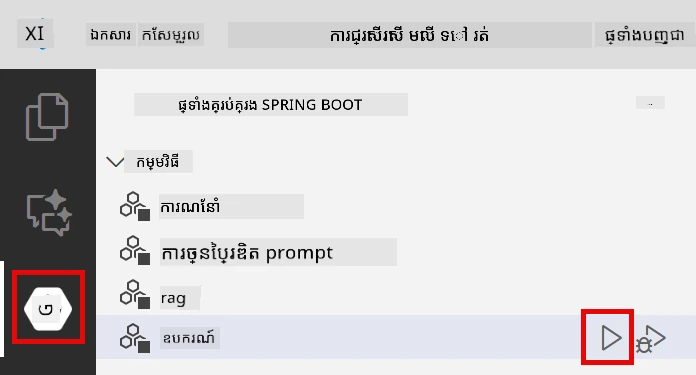

*Spring Boot Dashboard ក្នុង VS Code — ចាប់ផ្តើម បញ្ឈប់ និងតាមដានម៉ូឌុលទាំងអស់ពីកន្លែងតែមួយ*

**ជម្រើសទី 2៖ ប្រើស្គ្រីប shell**

ចាប់ផ្តើមកម្មវិធីបណ្ដាញទាំងអស់ (ម៉ូឌុល 01-04):

**Bash:**
```bash
cd ..  # ពីថតឫស
./start-all.sh
```

**PowerShell:**
```powershell
cd ..  # ពីថតមេ
.\start-all.ps1
```

ឬចាប់ផ្តើមតែម៉ូឌុលនេះប៉ុណ្ណោះ៖

**Bash:**
```bash
cd 04-tools
./start.sh
```

**PowerShell:**
```powershell
cd 04-tools
.\start.ps1
```

ស្គ្រីបទាំងពីរនេះត្រូវបញ្ចូលអថេរបរិស្ឋានពីឯកសារ `.env` នៅ root ដោយស្វ័យប្រវត្តិ ហើយនឹងកសាង JAR ប្រសិនបើវាមិនមានទេ។

> **ចំណាំ៖** ប្រសិនបើអ្នកចូលចិត្តកសាងម៉ូឌុលទាំងអស់ដោយដៃ មុនចាប់ផ្តើម៖
>
> **Bash:**
> ```bash
> cd ..  # Go to root directory
> mvn clean package -DskipTests
> ```
>
> **PowerShell:**
> ```powershell
> cd ..  # Go to root directory
> mvn clean package -DskipTests
> ```

បើក http://localhost:8084 នៅក្នុងកម្មវិធីរុករករបស់អ្នក។

**ដើម្បីបញ្ឈប់៖**

**Bash:**
```bash
./stop.sh  # ម៉ូឌុលនេះតែប៉ុណ្ណោះ
# ឬ
cd .. && ./stop-all.sh  # ម៉ូឌុលទាំងអស់
```

**PowerShell:**
```powershell
.\stop.ps1  # ម៉ូឌុលនេះតែប៉ុណ្ណោះ
# ឬ
cd ..; .\stop-all.ps1  # ម៉ូឌុលទាំងអស់
```

## ការប្រើប្រាស់កម្មវិធី

កម្មវិធីផ្ដល់នូវចំណុចចូលបណ្ដាញដែលអ្នកអាចបំពេញប្រតិបត្តិការជាមួយភ្នាក់ងារប្រព័ន្ធឆ្លាត ដែលមានការចូលប្រើទៅឧបករណ៍អាកាសធាតុនិងបំលែងសីតុណ្ហភាព។ នេះជារូបរាងចំណុចចូល — មានឧទាហរណ៍ចាប់ផ្តើមយ៉ាងឆាប់រហ័ស និងផ្ទាំងជជែកសម្រាប់ផ្ញើសំណើ:

<a href="images/tools-homepage.png">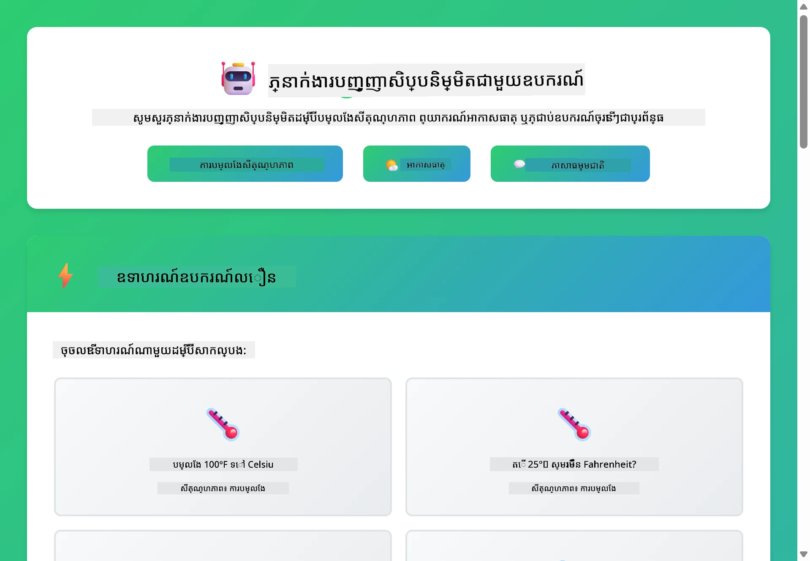</a>

*ចំណុចចូលឧបករណ៍ភ្នាក់ងារប្រព័ន្ធឆ្លាត - ឧទាហរណ៍ឆាប់ និងចំណុចចូលជជែកសម្រាប់ធ្វើប្រតិបត្តិការជាមួយឧបករណ៍*

### សាកល្បងការប្រើឧបករណ៍សាមញ្ញ

ចាប់ផ្តើមជាមួយសំណើធម្មតា៖ "បំលែង 100 ដឺក្រេ Fahrenheit ទៅ Celsius"។ ភ្នាក់ងារយល់ថាវាត្រូវការ ឧបករណ៍បំលែងសីតុណ្ហភាព មកហៅវាជាមួយប៉ារ៉ាម៉ែត្រយ៉ាងត្រឹមត្រូវ ហើយត្រឡប់លទ្ធផលវិញ។ សម្រួល ស្រាប់តែមានអារម្មណ៍ធម្មតា - អ្នកមិនចាក់បញ្ជាក់ថាត្រូវប្រើឧបករណ៍ណាឬរបៀបទំនាក់ទំនងយ៉ាងដូចម្តេចទេ។

### សាកល្បងការភ្ជាប់ឧបករណ៍

ឥឡូវនេះសាកល្បងអ្វីមួយស្មុគស្មាញ៖ "អាកាសធាតុ​នៅ Seattle ជាអ្វី ហើយបំលែងវាប្រែទៅ Fahrenheit?" មើលភ្នាក់ងារដំណើរការនៅជំហានៗ។ វាទទួលអាកាសធាតុ (ដែលត្រឡប់ Celsius) ជាលើកដំបូង ហើយយល់ថាត្រូវបំលែងទៅ Fahrenheit ហៅឧបករណ៍បំលែង ហើយបញ្ចូលលទ្ធផលទាំងពីរចូលជាសម្លៀកបំពាក់ឆ្លើយតបមួយ។

### មើលដំណើរការជជែក

ផ្ទាំងជជែករក្សាប្រវត្តិការជជែក ត្រូវបានអនុញ្ញាតឱ្យអ្នកមានអន្តរកម្មពហុដងជាមួយភ្នាក់ងារ។ អ្នកអាចមើលសំណួរនិងចម្លើយជាច្រើនបាន គ្រប់គ្រាន់សម្រាប់តាមដានសន្ទនា និងយល់ពីរបៀបដែលភ្នាក់ងារជំរុញបរិបទតាមការប្ដូរប្រក់ៗ។

<a href="images/tools-conversation-demo.png">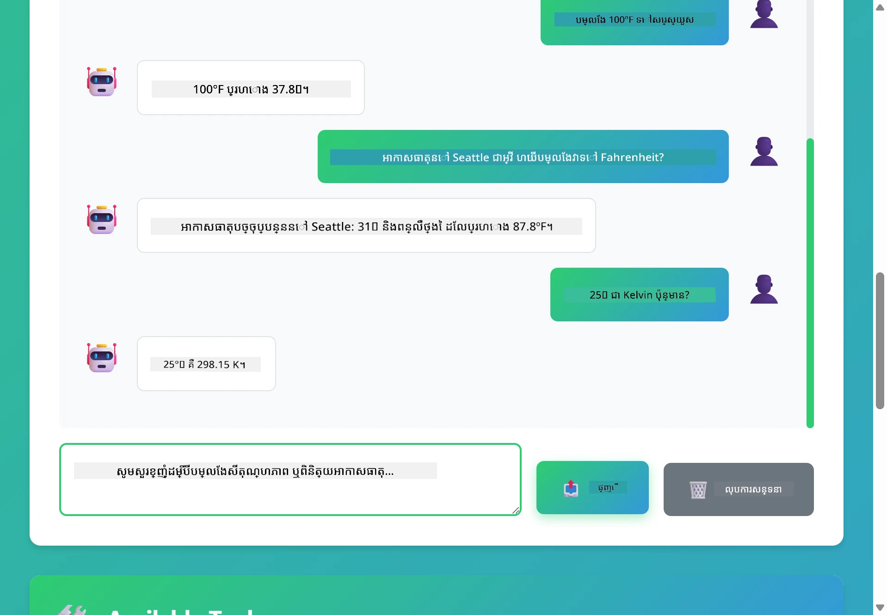</a>

*ការជជែកពហុដងបង្ហាញការបំលែងសាមញ្ញ ការស្វែងរកអាកាសធាតុ និងការភ្ជាប់ឧបករណ៍*

### សាកល្បងបញ្ចូលសំណើផ្សេងៗ

សាកល្បងបញ្ចូលផ្សំផ្សេងៗ៖
- ស្វែងរកអាកាសធាតុ៖ "អាកាសធាតុ​នៅ Tokyo ជាអ្វី?"
- បំលែងសីតុណ្ហភាព៖ "តើ 25°C ជា Kelvin ឬ?"
- សំណួរបញ្ចូល៖ "ពិនិត្យអាកាសធាតុ​នៅ Paris ហើយប្រាប់ខ្ញុំថាវាច្រើនជាង 20°C រឺទេ"

មើលថាភ្នាក់ងារពន្យល់ភាសាប្រកបដោយធម្មជាតិ ហើយផ្គូផ្គងវាជាមួយការហៅឧបករណ៍ត្រឹមត្រូវ។

## ទ្រឹស្តីសំខាន់ៗ

### លំនាំ ReAct (ការត្រួតពិនិត្យ និងសកម្មភាព)

ភ្នាក់ងារប្រែប្រួលគំនិត (សម្រេចចិត្តថាត្រូវធ្វើអ្វី) និងសកម្មភាព (ប្រើឧបករណ៍)។ លំនាំនេះអនុញ្ញាតឱ្យដោះស្រាយបញ្ហាដោយផ្ទាល់ខ្លួន មិនមែនតែឆ្លើយតបទៅតាមសេចក្តីណែនាំទេ។

### ការពិពណ៌នាឧបករណ៍មានសារៈសំខាន់

គុណភាពនៃការពិពណ៌នាឧបករណ៍របស់អ្នកប៉ះពាល់យ៉ាងខ្លាំងទៅលើរបៀបដែលភ្នាក់ងារប្រើប្រាស់វា។ ការពិពណ៌នាប្រកបដោយច្បាស់លាស់ និងជាក់លាក់ជួយឲ្យម៉ូដែលយល់ពេលណា ហើយធ្វើដូចម្តេចដើម្បីហៅឧបករណ៍នីមួយៗ។

### ការគ្រប់គ្រងសម័យប្រតិបត្តិការ

ម៉ាក `@MemoryId` អនុញ្ញាតការគ្រប់គ្រងចងចាំក្នុងសម័យប្រតិបត្តិការដោយស្វ័យប្រវត្តិ។ ពីរយៈសម័យទាំងអស់មាន `ChatMemory` ផ្ទាល់ខ្លួនដែលគ្រប់គ្រងដោយ bean `ChatMemoryProvider` ដូច្នេះអ្នកប្រើប្រាស់ជាច្រើនអាចមានអន្តរកម្មជាមួយភ្នាក់ងារហើយការសន្ទនារបស់ពួកគេមិនប៉ះពាល់គ្នាទេ។ រូបភាពខាងក្រោមបង្ហាញពីរបៀបដែលអ្នកប្រើប្រាស់ជាច្រើនត្រូវបានផ្ញើទៅឃ្លាំងចងចាំបំបែកដោយផ្អែកលើ ID សម័យរបស់ពួកគេ៖

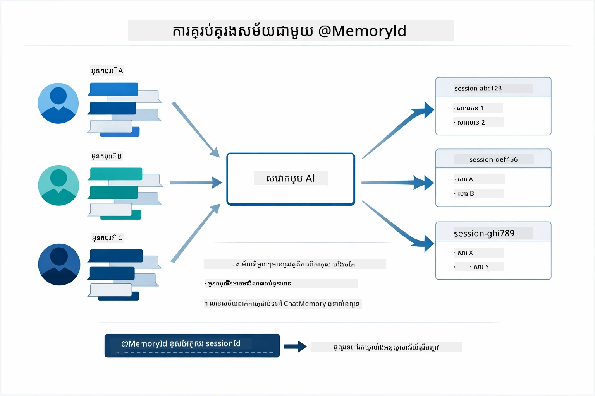

*រាល់ ID សម័យភ្ជាប់ទៅនឹងប្រវត្តិសន្ទនារដាច់ដោយឡែក — អ្នកប្រើប្រាស់មិនដែលមើលឃើញសារ​របស់គ្នាប៉ុន្មាននោះទេ។*

### ការគ្រប់គ្រងកំហុស

ឧបករណ៍អាចបរាជ័យ — API អាចពេលវេលាបញ្ចប់មុនពេលហៅរូច ប៉ារ៉ាម៉ែត្រអាចមិនត្រឹមត្រូវ សេវាកម្មខាងក្រៅអាចបិទ។ ភ្នាក់ងារក្នុងផលិតកម្មត្រូវការជំនួយគ្រប់គ្រងកំហុស ដើម្បីម៉ូដែលអាចពន្យល់បញ្ហា ឬសាកល្បងជម្រើសផ្សេងទៀត ជំនួសការបរាជ័យកម្មវិធីទាំងមូល។ ពេលឧបករណ៍ដាក់បញ្ហា LangChain4j នឹងចាប់កំហុសនោះ ហើយផ្ដល់សារកំហុសទៅម៉ូដែល ដែលអាចពន្យល់បញ្ហាក្នុងភាសាធម្មជាតិនោះបាន។

## ឧបករណ៍ដែលមានស្រាប់

រូបភាពខាងក្រោមបង្ហាញអេកូស៊ីស្ទីមធំទូលាយនៃឧបករណ៍ដែលអ្នកអាចបង្កើត។ ម៉ូឌុលនេះបង្ហាញឧបករណ៍អាកាសធាតុ និងបំលែងសីតុណ្ហភាព ប៉ុន្តាលំនាំ `@Tool` ដូចគ្នាអាចប្រើបានសម្រាប់មធ្យោបាយ Java ណាមួយទៀត — ពីសំណួរទិន្នន័យរហូតដល់ដំណើរការបង់ប្រាក់។

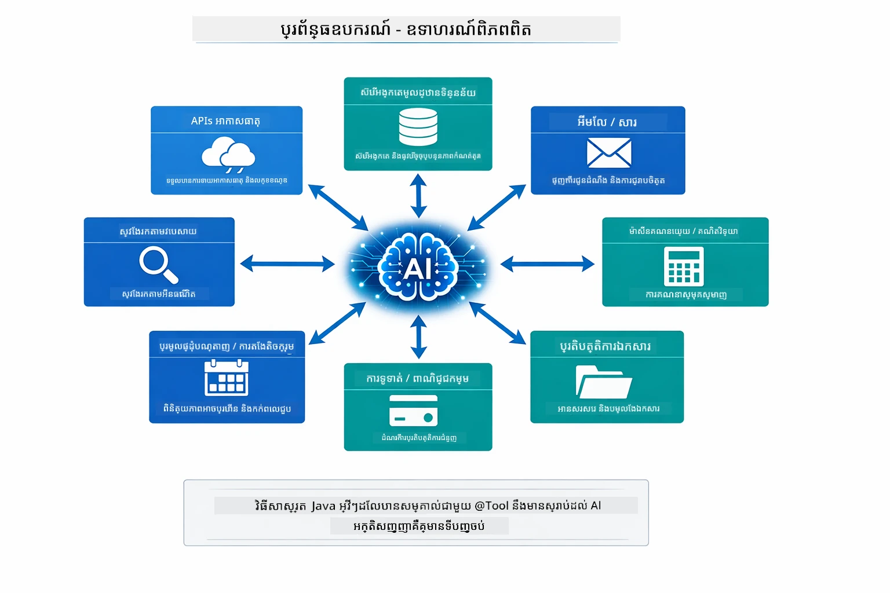

*មធ្យោបាយ Java ណាមួយដែលមានម៉ាក @Tool នឹងអាចប្រើជាមួយ AI បាន — លំនាំនេះពង្រីកទៅដល់មូលដ្ឋានទិន្នន័យ API អ៊ីមែល ប្រតិបត្តិការឯកសារ និងផ្សេងៗទៀត។*

## ពេលណានឹងប្រើភ្នាក់ងារដែលផ្អែកលើឧបករណ៍

មិនមែនសំណើរ គ្រប់ប្រភេទត្រូវការឧបករណ៍ទេ។ ការសម្រេចចិត្តមានលទ្ធភាពថា AI ត្រូវអន្តរកម្មជាមួយប្រព័ន្ធខាងក្រៅ ឬអាចឆ្លើយតបពីចំណេះដឹងផ្ទាល់ខ្លួន។ មតិណែនាំខាងក្រោមជាសង្ខេបពេលណា ឧបករណ៍កំពុងបន្ថែមតម្លៃ និងពេលណាដែលវាមិនចាំបាច់៖

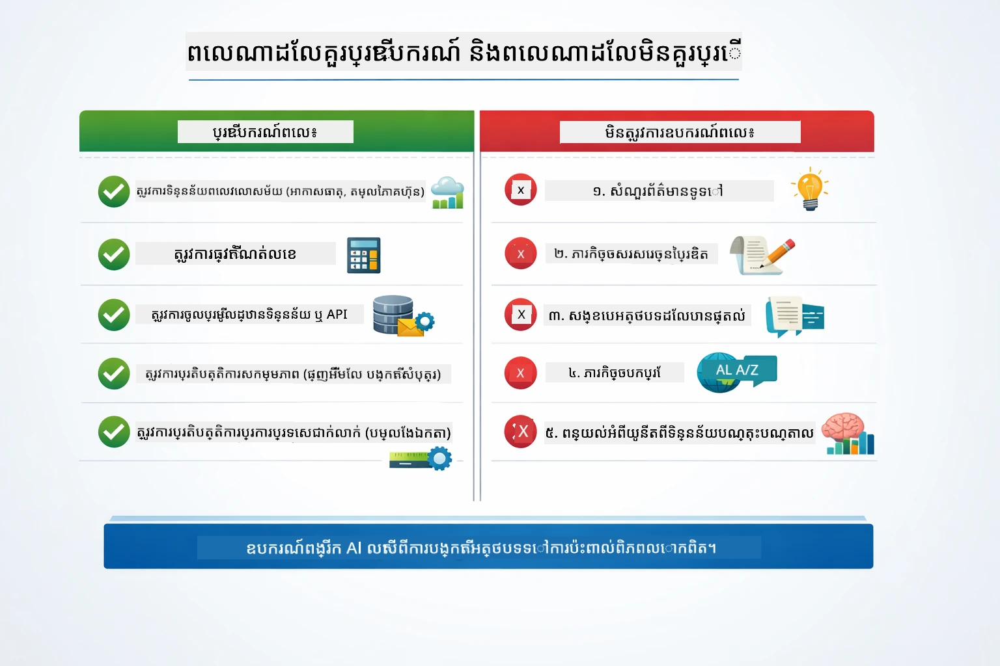

*មគ្គុទេសក៍សម្រេចចិត្តរហ័ស — ឧបករណ៍សម្រាប់ទិន្នន័យពេលវេលាពិត ការគណនា និងសកម្មភាព; ចំណេះដឹងទូទៅ និងការងារច្នៃប្រឌិតមិនចាំបាច់។*

## ឧបករណ៍ និង RAG

ម៉ូឌុល 03 និង 04 សងប៉ុន្មានអ្វីដែល AI អាចធ្វើបាន ប៉ុន្តែជារបៀបខុសគ្នាដាច់ដោយឡែក។ RAG ផ្ដល់សមត្ថភាពដើម្បីចូលដំណឹងក្នុងចំណេះដឹងដោយយកឯកសារជាវិស័យ។ ឧបករណ៍ផ្ដល់សមត្ថភាពអនុវត្តសកម្មភាពដោយហៅមុខងារ។ រូបភាពខាងក្រោមប្រៀបធៀបរបៀបទាំងពីរ នៅផ្នែកមុខទីពីរដូចគ្នា — ពីរបៀបដំណើរការប្រព័ន្ធ រហូតដល់ការផ្លាស់ប្តូរជាផ្នែកប្រយោជន៍៖

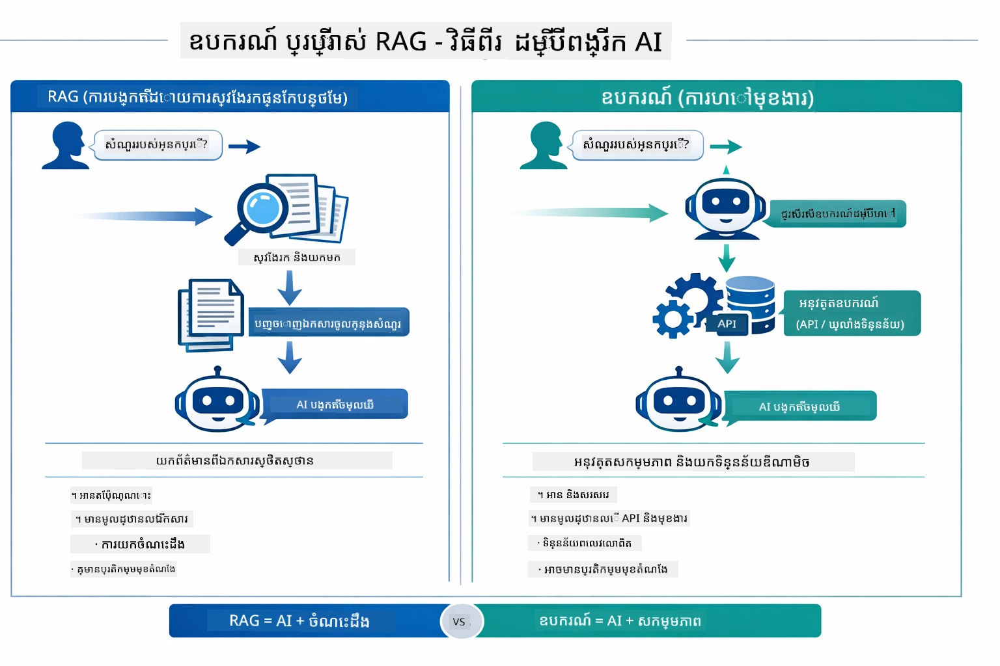

*RAG យកព័ត៌មានពីឯកសារមានរូបភាពស្តាទីកាល — ឧបករណ៍អនុវត្តសកម្មភាព និងយកទិន្នន័យពេលវេលាពិត។ ប្រព័ន្ធផលិតកម្មច្រើនភ្ជាប់រួមទាំងពីរ។*

ប្រាកដឡើង ប្រព័ន្ធផលិតកម្មជាច្រើនភ្ជាប់រួមពីរបៀបនេះ៖ RAG សម្រាប់ធានាថាចម្លើយមានមូលដ្ឋានពីឯកសាររបស់អ្នក និងឧបករណ៍សម្រាប់យកទិន្នន័យពេលវេលាពិត ឬអនុវត្តអនុសាសន៍។

## ជំហានបន្ទាប់

**ម៉ូឌុលបន្ទាប់៖** [05-mcp - Model Context Protocol (MCP)](../05-mcp/README.md)

---

**ការរុករក៖** [← មុន៖ ម៉ូឌុល 03 - RAG](../03-rag/README.md) | [ត្រឡប់ទៅបង្អួចផ្លូវចម្បង](../README.md) | [បន្ទាប់៖ ម៉ូឌុល 05 - MCP →](../05-mcp/README.md)

---

<!-- CO-OP TRANSLATOR DISCLAIMER START -->
**ការបដិសេធ**:  
ឯកសារនេះត្រូវបានបកប្រែដោយប្រើសេវាកម្មបកប្រែ AI [Co-op Translator](https://github.com/Azure/co-op-translator)។ ខណៈដែលយើងខិតខំប្រឹងប្រែងដើម្បីភាពត្រឹមត្រូវ សូមប្រយ័ត្នថាការបកប្រែដោយស្វ័យប្រវត្តិនេះអាចមានកំហុស ឬភាពមិនត្រឹមត្រូវ។ ឯកសារដើមនៅក្នុងភាសាម្ចាស់ដើមគួរត្រូវបានគិតថាជាធនធានដ៏សំខាន់។ សម្រាប់ព័ត៌មានសំខាន់ៗ ការបកប្រែដោយមនុស្សជំនាញជាមូលដ្ឋានគឺល្អបំផុត។ យើងមិនទទួលខុសត្រូវចំពោះការយល់ច្រឡំ ឬការបកប្រែខុសដែលកើតឡើងពីការប្រើប្រាស់ការបកប្រែនេះឡើយ។
<!-- CO-OP TRANSLATOR DISCLAIMER END -->