# Module 05: ប្រព័ន្ធ Model Context Protocol (MCP)

## តារាងខ័ណ្ឌ

- [វីដេអូបង្ហាញ](#វីដេអូបង្ហាញ)
- [អ្វីដែលអ្នកនឹងរៀន](#អ្វីដែលអ្នកនឹងរៀន)
- [MCP គឺជាអ្វី?](#mcp-គឺជាអ្វី)
- [របៀបដែល MCP ដំណើរការ](#របៀបដែល-mcp-ដំណើរការ)
- [ម៉ូឌុល Agentic](#ម៉ូឌុល-agentic)
- [ការរត់ឧទាហរណ៍](#ការរត់ឧទាហរណ៍)
  - [លក្ខខណ្ឌជាមុន](#លក្ខខណ្ឌជាមុន)
- [ចាប់ផ្តើមយ៉ាងរហ័ស](#ចាប់ផ្តើមយ៉ាងរហ័ស)
  - [ប្រតិបត្តិការឯកសារ (Stdio)](#ប្រតិបត្តិការឯកសារ-stdio)
  - [ភ្នាក់ងារអភិបាល](#ភ្នាក់ងារអភិបាល)
    - [ការរត់ការតាំងពិពណ៌នា](#ការរត់ការតាំងពិពណ៌នា)
    - [របៀបដែលអភិបាលដំណើរការ](#របៀបដែលអភិបាលដំណើរការ)
    - [របៀបដែល FileAgent រកឃើញឧបករណ៍ MCP នៅពេលរត់កម្មវិធី](#របៀបដែល-fileagent-រកឃើញឧបករណ៍-mcp-នៅពេលរត់កម្មវិធី)
    - [យុទ្ធសាស្រ្តនៃការឆ្លើយតប](#យុទ្ធសាស្រ្តឆ្លើយតប)
    - [ការយល់ដឹងពីលទ្ធផល](#រំលេចលទ្ធផល)
    - [ការពណ៌នាអំពីមុខងារ ម៉ូឌុល Agentic](#ពន្យល់អំពីលក្ខណៈពិសេសនៃម៉ូឌុល-agentic)
- [គំនិតសំខាន់ៗ](#គំនិតសំខាន់ៗ)
- [អបអរសាទរ!](#សូមអបអរសាទរ)
  - [មានអ្វីបន្ទាប់?](#អ្វីទៅជាដំណាក់កាលបន្ទាប់)

## វីដេអូបង្ហាញ

សូមមើលសម័យផ្សាយបន្តផ្ទាល់នេះដែលបង្ហាញពីរបៀបចាប់ផ្តើមជាមួយម៉ូឌុលនេះ៖

<a href="https://www.youtube.com/watch?v=O_J30kZc0rw"></a>

## អ្វីដែលអ្នកនឹងរៀន

អ្នកបានបង្កើត AI ផ្លាស់ប្តូរពាក្យ, អ្នកមានជំនាញក្នុងការប្រើ prompts, ផ្ដល់ចម្លើយផ្អែកលើឯកសារ, និងបង្កើតភ្នាក់ងារដែលមានឧបករណ៍គ្រប់យ៉ាង។ ប៉ុន្តែឧបករណ៍ទាំងនោះត្រូវបានបង្កើតផ្ទាល់សម្រាប់កម្មវិធីរបស់អ្នកប៉ុណ្ណោះ។ តើអ្នកអាចផ្តល់ឱ្យ AI របស់អ្នក មានការចូលដំណើរការក្នុងបណ្តាញឧបករណ៍ដែលមានស្តង់ដារជាធម្មតាដែលនរណាក៏អាចបង្កើត និងចែករំលែកបានដែរឬទេ? នៅក្នុងម៉ូឌុលនេះ អ្នកនឹងរៀនរបៀបធ្វើឱ្យបានដូច្នេះជាមួយលំនាំ Model Context Protocol (MCP) និងម៉ូឌុល agentic របស់ LangChain4j។ យើងចាប់ផ្តើមបង្ហាញអ្នកនូវកម្មវិធីអានឯកសារ MCP សាមញ្ញ ហើយបន្ទាប់មកបង្ហាញរបៀបដែលវាចូលបញ្ចូលបានយ៉ាងងាយស្រួលទៅក្នុងដំណើរការចល័ត agentic ខ្ពស់ដោយប្រើស្ទីលភ្នាក់ងារអភិបាល។

## MCP គឺជាអ្វី?

ប្រព័ន្ធ Model Context Protocol (MCP) ផ្តល់ជូននូវវិធីស្តង់ដារច្បាស់លាស់មួយសម្រាប់កម្មវិធី AI ដើម្បីរកឃើញ ហើយប្រើឧបករណ៍ខាងក្រៅ។ ជំនួសទីនឹងការសរសេរកូដបញ្ចូលមុខងារ (integrations) ផ្ទាល់សម្រាប់ប្រភពទិន្នន័យ ឬសេវាកម្មមួយមួយ អ្នកភ្ជាប់ទៅម៉ាស៊ីនមេ MCP ដែលបង្ហាញសមត្ថភាពរបស់ពួកវា ដោយរបៀបដែលមានមូលដ្ឋានស្ដង់ដារ។ ភ្នាក់ងារ AI របស់អ្នកអាចហើយស្វែងរក និងប្រើឧបករណ៍ទាំងនោះដោយស្វ័យកម្ម។

រូបភាពខាងក្រោមបង្ហាញពីភាពខុសគ្នា៖ ដោយគ្មាន MCP ការបញ្ចូលមុខងាររាល់យ៉ាងត្រូវការតភ្ជាប់តាមចំណុចទៅចំណុចបែបផ្ទាល់។ ដោយមាន MCP នោះ នេះជាពិធីការទំនាក់ទំនងតែមួយដែលភ្ជាប់កម្មវិធីរបស់អ្នកទៅឧបករណ៍ណាមួយក៏បាន៖

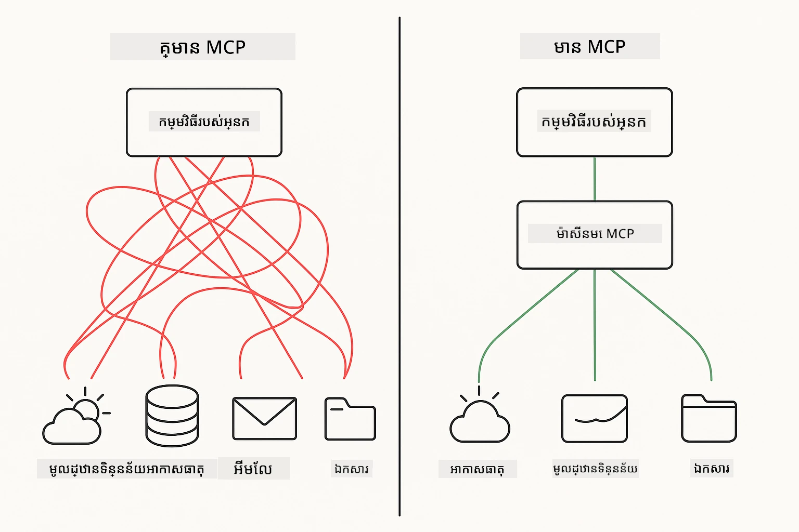

*មុន MCP៖ ការបញ្ចូលរវាងចំណុចស្មុគស្មាញ។ បន្ទាប់ពី MCP៖ ពិធីការតែមួយ មានជម្រើសគ្មានដែនកំណត់។*

MCP ដោះស្រាយបញ្ហាមូលដ្ឋានមួយក្នុងការអភិវឌ្ឍ AI: ការបញ្ចូលមុខងាររបស់រាល់កម្មវិធីគឺផ្ទាល់។ ចង់ចូលដំណើរការជាមួយ GitHub? កូដផ្ទាល់។ ចង់អានឯកសារ? កូដផ្ទាល់។ ចង់សួរទិន្នន័យពីមូលដ្ឋានទិន្នន័យ? កូដផ្ទាល់។ ហើយមិនមានការបញ្ចូលណាមួយ ដែលអាចដំណើរការជាមួយកម្មវិធី AI ផ្សេងៗទេ។

MCP បានផ្ដល់ស្តង់ដារ។ ម៉ាស៊ីនមេ MCP បង្ហាញឧបករណ៍ជាមួយការពិពណ៌នាច្បាស់លាស់ និង schemas។ អតិថិជន MCP អាចភ្ជាប់, ស្វែងរកឧបករណ៍ដែលមាន និងប្រើវា។ បង្កើតម្តងទៀត, ប្រើបានគ្រប់កន្លែង។

រូបភាពខាងក្រោមបង្ហាញពីរចនាសម្ព័ន្ធនេះ៖ អតិថិជន MCP តែមួយ (កម្មវិធី AI របស់អ្នក) ភ្ជាប់ទៅម៉ាស៊ីនមេ MCP ច្រើន ដែលរៀបចំឧបករណ៍របស់ពួកវាឡើងតាមពិធីការស្តង់ដារ៖

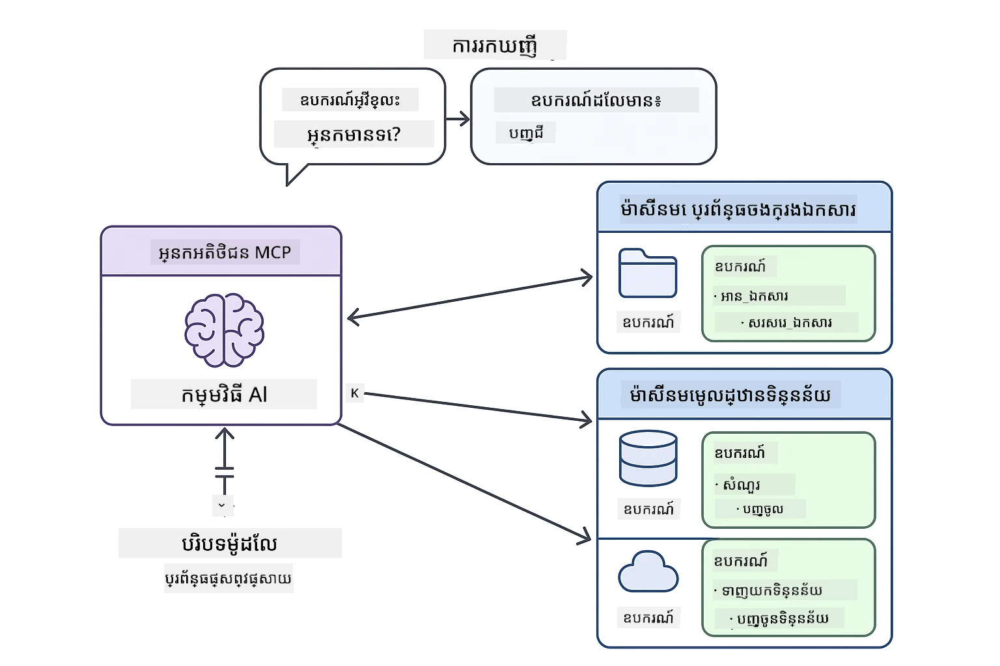

*រចនាសម្ព័ន្ធ Model Context Protocol - ការស្វែងរក និងអនុវត្តឧបករណ៍ស្តង់ដារ*

## របៀបដែល MCP ដំណើរការ

នៅជើងក្រោម MCP ប្រើរចនាសម្ព័ន្ធបួនជាន់។ កម្មវិធី Java របស់អ្នក (អតិថិជន MCP) ស្វែងរកឧបករណ៍ដែលមាន, បញ្ជូនសំណើ JSON-RPC តាមជាន់បញ្ជូន (Stdio ឬ HTTP), ហើយម៉ាស៊ីនមេ MCP អនុវត្តមុខងារ និងផ្តល់លទ្ធផល។ រូបផែនទីខាងក្រោមបំបែករាល់ជាន់នៃពិធីការនេះ៖

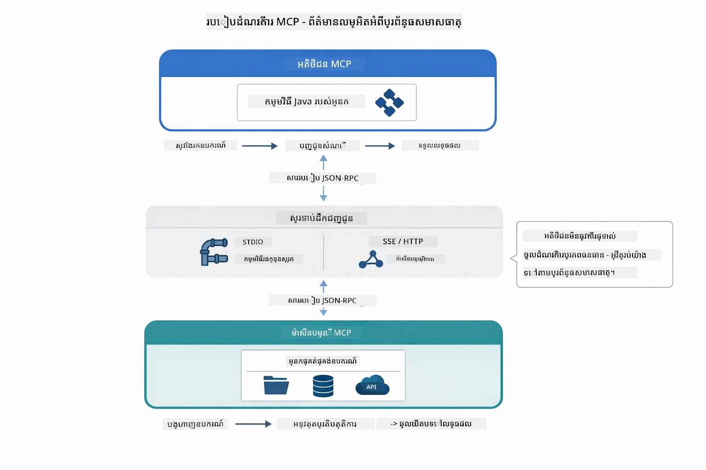

*របៀបដែល MCP ធ្វើការក្រោមជើង—អតិថិជនស្វែងរកឧបករណ៍, ផ្លាស់ប្តូរការប្រាស្រ័យ JSON-RPC, ហើយអនុវត្តមុខងារតាមជាន់បញ្ជូន។*

**រចនាសម្ព័ន្ធ ម៉ាស៊ីនមេ និង អតិថិជន**

MCP ប្រើម៉ូឌែលភ្នាក់ងារអតិថិជន-ម៉ាស៊ីនមេ។ ម៉ាស៊ីនមេផ្តល់ឧបករណ៍ - អានឯកសារ, សួរព័ត៌មានមូលដ្ឋានទិន្នន័យ, ហៅ APIs។ អតិថិជន (កម្មវិធី AI របស់អ្នក) ភ្ជាប់ទៅម៉ាស៊ីនមេ និងប្រើឧបករណ៍របស់ពួកវា។

ដើម្បីប្រើ MCP ជាមួយ LangChain4j សូមបន្ថែមការពឹងផ្អែក Maven នេះ៖

```xml
<dependency>
    <groupId>dev.langchain4j</groupId>
    <artifactId>langchain4j-mcp</artifactId>
    <version>${langchain4j.version}</version>
</dependency>
```

**ការស្វែងរកឧបករណ៍**

ពេលអតិថិជនរបស់អ្នកភ្ជាប់ទៅម៉ាស៊ីនមេ MCP វាសួរថា "អ្នកមានឧបករណ៍អ្វីខ្លះ?" ម៉ាស៊ីនមេឆ្លើយតបជាមួយបញ្ជីឧបករណ៍ដែលអាចប្រើបាន រាប់បញ្ចូលការពិពណ៌នានិង schemas ប៉ារ៉ាម៉ែត្រ។ ភ្នាក់ងារ AI របស់អ្នកហើយអាចសម្រេចចិត្តជ្រើសរើសឧបករណ៍ផ្អែកលើសំណើររបស់អ្នកប្រើ។ រូបភាពខាងក្រោមបង្ហាញពីការចែកចាយនេះ - អតិថិជនផ្ញើសំណើ `tools/list` ហើយម៉ាស៊ីនមេឆ្លើយតបជាមួយឧបករណ៍ដែលមានជាមួយការពិពណ៌នានិង schemas ប៉ារ៉ាម៉ែត្រ៖

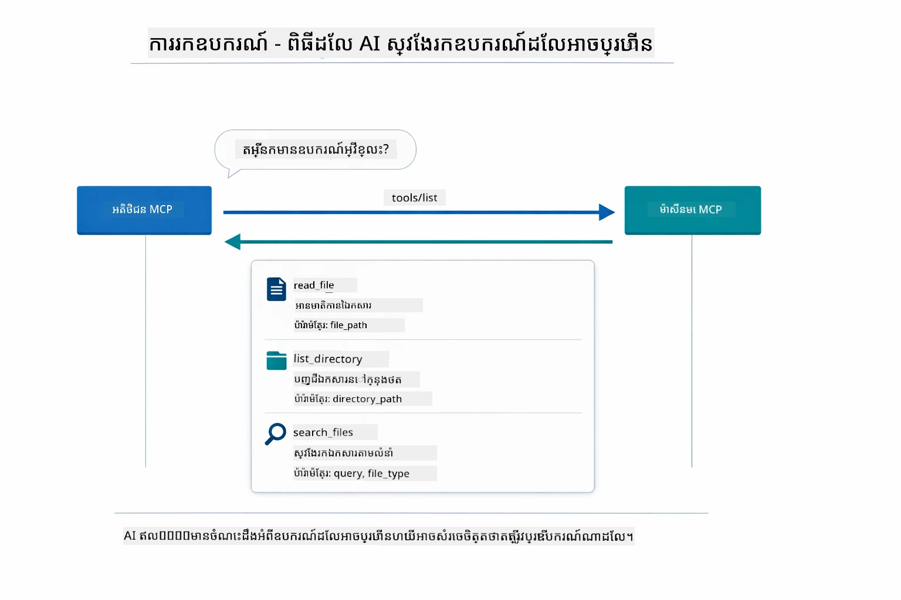

*AI ស្វែងរកឧបករណ៍ដែលអាចប្រើបាននៅពេលចាប់ផ្តើម - វាឥឡូវដឹងពីសមត្ថភាពដែលអាចប្រើបាន ហើយអាចសម្រេចចិត្តថាតើត្រូវប្រើឧបករណ៍ណា។*

**យន្តការបញ្ជូន**

MCP គាំទ្រយន្តការបញ្ជូនខុសៗគ្នា។ ជម្រើសពីរមាន Stdio (សម្រាប់ការប្រាស្រ័យក្នុងរដ្ធានជាបុគ្គល) និង Streamable HTTP (សម្រាប់ម៉ាស៊ីនមេចម្ងាយ)។ ម៉ូឌុលនេះបង្ហាញពីការបញ្ជូន Stdio៖

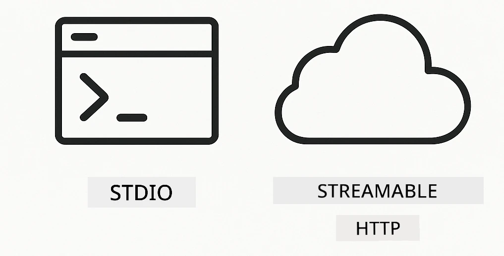

*យន្តការបញ្ជូន MCP៖ HTTP សម្រាប់ម៉ាស៊ីនមេចម្ងាយ, Stdio សម្រាប់ដំណើរការបុគ្គល*

**Stdio** - [StdioTransportDemo.java](../../../05-mcp/src/main/java/com/example/langchain4j/mcp/StdioTransportDemo.java)

សម្រាប់ដំណើរការបុគ្គល។ កម្មវិធីរបស់អ្នកបង្កើតម៉ាស៊ីនមេជាកម្មវិធីរង ហើយប្រាស្រ័យទាក់ទងតាមការបញ្ចូល/បញ្ចេញស្តង់ដារ។ មានប្រយោជន៍សម្រាប់ចូលដំណើរការផ្ទាំងឯកសារឬឧបករណ៍បញ្ជាលេខា។

```java
McpTransport stdioTransport = new StdioMcpTransport.Builder()
    .command(List.of(
        npmCmd, "exec",
        "@modelcontextprotocol/server-filesystem@2025.12.18",
        resourcesDir
    ))
    .logEvents(false)
    .build();
```

ម៉ាស៊ីនមេ `@modelcontextprotocol/server-filesystem` បង្ហាញឧបករណ៍ដូចខាងក្រោម ហើយទាំងអស់ត្រូវបានដាក់ក្នុងកន្លែងដែលអ្នកកំណត់៖

| ឧបករណ៍ | ពិពណ៌នា |
|------|-------------|
| `read_file` | អានមាតិកាឯកសារតែមួយ |
| `read_multiple_files` | អានឯកសារច្រើនក្នុងមួយការហៅ |
| `write_file` | បង្កើតឬលាយលុបឯកសារ |
| `edit_file` | ប្រើការស្វែងរក និងជំនួសកំណត់ខ្លួន |
| `list_directory` | បញ្ជីឯកសារនិងថតនៅក្នុងផ្លូវមួយ |
| `search_files` | ស្វែងរកឯកសារជាប្រមាណដោយក្ដាប់គ្នា |
| `get_file_info` | ទទួលបានព័ត៌មានម៉េតាអំពីឯកសារ (ទំហំ, ពេលវេលា, អាជ្ញាប័ណ្ណ) |
| `create_directory` | បង្កើតថត (រួមទាំងថតម្តាយ) |
| `move_file` | ផ្លាស់ទីឬប្ដូរឈ្មោះឯកសារ ឬថត |

រូបភាពខាងក្រោមបង្ហាញពីរបៀបដែលការបញ្ជូន Stdio ដំណើរការនៅពេលរត់កម្មវិធី - កម្មវិធី Java របស់អ្នកបង្កើតម៉ាស៊ីនមេ MCP ជាកម្មវិធីរង ហើយពួកវាប្រាស្រ័យដោយគំនិតតំណរចូល/ចេញ stdio ដោយគ្មានបណ្ដាញ ឬ HTTP ត្រូវបញ្ចូលរួច៖

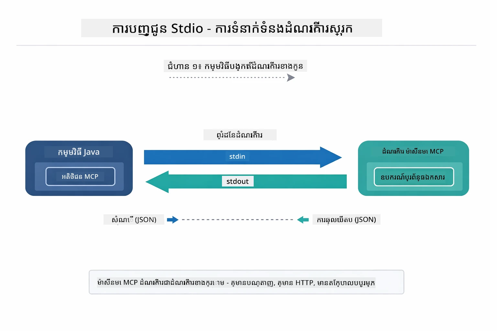

*ការបញ្ជូន Stdio លោតដំណើរការ—កម្មវិធីរបស់អ្នកបង្កើតម៉ាស៊ីនមេ MCP ជាកម្មវិធីរង ហើយប្រាស្រ័យតាមតំណរបញ្ចូល/ចេញ stdio។*

> **🤖 សាកល្បងជាមួយ [GitHub Copilot](https://github.com/features/copilot) Chat:** បើក [`StdioTransportDemo.java`](../../../05-mcp/src/main/java/com/example/langchain4j/mcp/StdioTransportDemo.java) ហើយសួរ៖
> - "របៀបដែលការបញ្ជូន Stdio ដំណើរការបានយ៉ាងដូចម្តេច ហើយតើពេលណាអ្នកគួរប្រើវាទៅប៉ុន្មានការប្រាស្រ័យ HTTP?"
> - "ធ្វើដូចម្តេចLangChain4j គ្រប់គ្រងវដ្តជីវិតនៃដំណើរការម៉ាស៊ីនមេ MCP ដែលបង្កើតឡើង?"
> - "ផលប៉ះពាល់សន្តិសុខមានអ្វីខ្លះនៅពេលផ្តល់អាជ្ញ_ACCESS ទៅប្រព័ន្ធឯកសារឈ្មោះAI?"

## ម៉ូឌុល Agentic

ខណៈពេល MCP ផ្តល់ឧបករណ៍ស្តង់ដារ LangChain4j **ម៉ូឌុល agentic** ផ្តល់វិធីសាស្ត្រផ្នែកបញ្ជាការដើម្បីបង្កើតភ្នាក់ងារដែលសម្របសម្រួលឧបករណ៍ទាំងនោះ។ ការផ្ដល់ស្លាក `@Agent` និង `AgenticServices` អនុញ្ញាតឱ្យអ្នកកំណត់ឧទ្ទេសនាមច្បាស់លាស់របស់ភ្នាក់ងារតាមរយៈច្បាប់ឡើងវិញជំនួញតែមិនមែនសរសេរកូដបញ្ជា។

ក្នុងម៉ូឌុលនេះ អ្នកនឹងស្វែងយល់ពីលំនាំ **Supervisor Agent** — វិធីសាស្ត្រ AI agentic ខ្ពស់ ដែលភ្នាក់ងារ "អភិបាល" សម្រេចចិត្តជាទីតាំង ឬជ្រើសរើសរូបភាពភ្នាក់ងារសំណាក់ទិន្នន័យតាមការស្នើរបស់អ្នកប្រើប្រាស់។ យើងបញ្ចូលទាំងពីរទ្រឹស្តីដោយផ្តល់សិទ្ធិឲ្យភ្នាក់ងាររងមួយទទួលបានសិទ្ធិចូលប្រើឯកសារយ៉ាងមានអំណាចដោយ MCP។

ដើម្បីប្រើម៉ូឌុល agentic សូមបន្ថែមការពឹងផ្អែក Maven នេះ៖

```xml
<dependency>
    <groupId>dev.langchain4j</groupId>
    <artifactId>langchain4j-agentic</artifactId>
    <version>${langchain4j.mcp.version}</version>
</dependency>
```
> **កំណត់សម្គាល់៖** ម៉ូឌុល `langchain4j-agentic` ប្រើលំនាំកំណែផ្សេង (`langchain4j.mcp.version`) ដោយសារតែវាត្រូវចេញផ្សាយក្នុងកាលវិភាគផ្សេងពីបណ្ណាល័យ core របស់ LangChain4j។

> **⚠️ សាកល្បង៖** ម៉ូឌុល `langchain4j-agentic` គឺជារឿង **កំពុងសាកល្បង** ហើយអាចមានបំលែង។ វិធីសាស្ត្រដែលថេរនៅឆ្ងាយក្នុងការបង្កើតជំនួយ AI នៅតែជាមួយ `langchain4j-core` រួមជាមួយឧបករណ៍ផ្ទាល់ខ្លួន (ម៉ូឌុល 04)។

## ការរត់ឧទាហរណ៍

### លក្ខខណ្ឌជាមុន

- បានបញ្ចប់ [ម៉ូឌុល 04 - ឧបករណ៍](../04-tools/README.md) (ម៉ូឌុលនេះបង្កើតលើគំនិតឧបករណ៍ផ្ទាល់ខ្លួន ហើយប្រៀបធៀបជាមួយឧបករណ៍ MCP)
- ឯកសារ `.env` នៅក្នុងថតដើមជាមួយសញ្ញាប័ណ្ណ Azure (បង្កើតដោយ `azd up` ក្នុងម៉ូឌុល 01)
- Java 21+, Maven 3.9+
- Node.js 16+ និង npm (សម្រាប់ម៉ាស៊ីនមេ MCP)

> **កំណត់សម្គាល់៖** ប្រសិនបើអ្នកមិនទាន់កំណត់អថេរបរិយាកាស (environment variables) ត្រឹមត្រូវទេ សូមមើល [ម៉ូឌុល 01 - ណែនាំ](../01-introduction/README.md) សម្រាប់ការណែនាំក្នុងការតម្លៃ (ត្រូវបើក `azd up` ដើម្បីបង្កើតឯកសារ `.env` ដោយស្វ័យប្រវត្តិ), ឬចម្លង `.env.example` ទៅ `.env` នៅថតដើម ហើយបំពេញតម្លៃរបស់អ្នក។

## ចាប់ផ្តើមយ៉ាងរហ័ស

**ប្រើ VS Code:** គ្រាន់តែក្លิกស្ដាំលើឯកសារតាំងពិពណ៌នាណាមួយក្នុង Explorer ហើយជ្រើស **"Run Java"** ឬប្រើការកំណត់ផ្សងព្រេង Launch configurations ពីផ្ទាំង Run and Debug (ប្រាកដថាឯកសារ `.env` របស់អ្នកមានការកំណត់ជាមួយសញ្ញាប័ណ្ណ Azure រួចជាមុន)។

**ប្រើ Maven:** ជAlternatives អ្នកអាចរត់ពី command line ជាមួយឧទាហរណ៍ខាងក្រោម។

### ប្រតិបត្តិការឯកសារ (Stdio)

នេះបង្ហាញពីឧបករណ៍ផ្អែកលើ subprocesss ដំណើរការផ្ទាល់។

**✅ មិនចាំបាច់មានលក្ខខណ្ឌជាមុន** - ម៉ាស៊ីនមេ MCP ត្រូវបានបង្កើតឡើងដោយស្វ័យប្រវត្តិ។

**ប្រើ Scripts ចាប់ផ្តើម (ណែនាំ):**

Scripts ចាប់ផ្តើមនេះបង្ហាញអថេរបរិយាកាសពីឯកសារ `.env` នៅថតដើម។

**Bash:**
```bash
cd 05-mcp
chmod +x start-stdio.sh
./start-stdio.sh
```

**PowerShell:**
```powershell
cd 05-mcp
.\start-stdio.ps1
```

**ប្រើ VS Code:** ក្លាយជាគ្រាន់តែក្លิกស្ដាំលើ `StdioTransportDemo.java` ហើយជ្រើស **"Run Java"** (ប្រាកដថាឯកសារ `.env` របស់អ្នកត្រូវបានកំណត់រួច)។

កម្មវិធីបង្កើតម៉ាស៊ីនមេចូលប្រព័ន្ធឯកសារពី MCP ដោយស្វ័យប្រវត្តិ ហើយអានឯកសារផ្ទាល់។ សូមចាប់អារម្មណ៍របៀបគ្រប់គ្រង subprocesss ។

**លទ្ធផលដែលរំពឹងទុក:**
```
Assistant response: The file provides an overview of LangChain4j, an open-source Java library
for integrating Large Language Models (LLMs) into Java applications...
```

### ភ្នាក់ងារអភិបាល

លំនាំ **Supervisor Agent** គឺជារបៀបមួយនៃ agentic AI ដែល **បត់បែនបាន**។ អភិបាលប្រើ LLM ដើម្បីសម្រេចចិត្តដោយស្វ័យកម្មថាតើភ្នាក់ងារណាដែលត្រូវហៅបញ្ជាដោយផ្អែកលើយុទ្ធសាស្ត្រអ្នកប្រើ។ នៅក្នុងឧទាហរណ៍បន្ទាប់ យើងបញ្ចូលការចូលប្រព័ន្ធឯកសារដោយ MCP ជាមួយភ្នាក់ងារ LLM ដើម្បីបង្កើតដំណើរការអានឯកសារ → រាយការណ៍ដែលបានគ្រប់គ្រង។

ក្នុងការតាំងពិពណ៌នា `FileAgent` អានឯកសារដោយប្រើឧបករណ៍ប្រព័ន្ធឯកសារ MCP ហើយ `ReportAgent` បង្កើតរបាយការណ៍មានរចនាសម្ព័ន្ធ ជាមួយសេចក្តីសង្ខេបប្រតិបត្តិការ (មួយប្រយោគ), ចំណុចសំខាន់ 3, និងមតិយោបល់។ អភិបាលគ្រប់គ្រងផ្លូវនេះដោយស្វ័យប្រវត្តិ៖

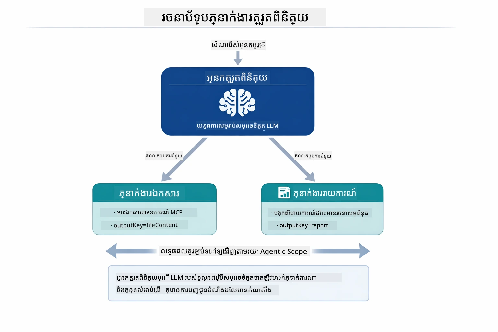

*អភិបាលប្រើ LLM របស់ខ្លួន សម្រេចចិត្តថាតើត្រូវហៅភ្នាក់ងារណា និងតាមលំដាប់ណា — មិនចាំបាច់សរសេរបញ្ជាទៅដោយផ្ទាល់។*

នេះគឺជាទិដ្ឋភាពធ្វើកិច្ចការ ពីផ្លូវឯកសារទៅរបាយការណ៍របស់យើង៖

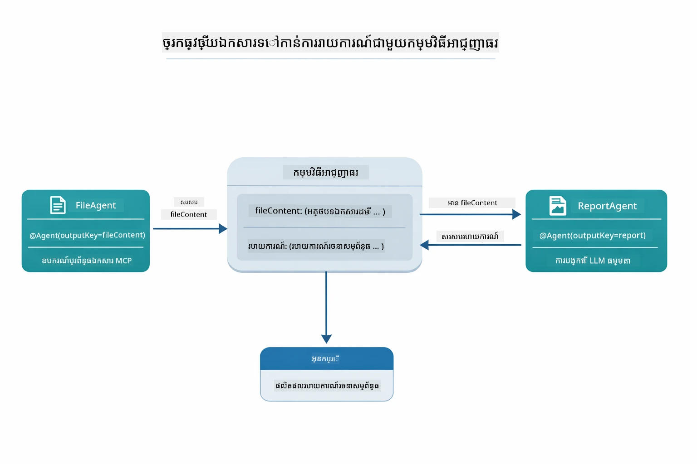

*FileAgent អានឯកសារដោយឧបករណ៍ MCP រួច ReportAgent បម្លែងមាតិកាដើមទៅជារបាយការណ៍ដែលមានរចនាសម្ព័ន្ធ។*

របៀបកំណត់លំដាប់ខាងក្រោមនេះបង្ហាញពីការគ្រប់គ្រងអភិបាលទាំងមូល — ពីការបង្កើតម៉ាស៊ីនមេ MCP, ដល់ការជ្រើសរើសភ្នាក់ងារដោយស្វ័យប្រវត្តិរបស់អភិបាល, ដល់ការហៅឧបករណ៍តាម stdio និងចុងក្រោយជារបាយការណ៍:

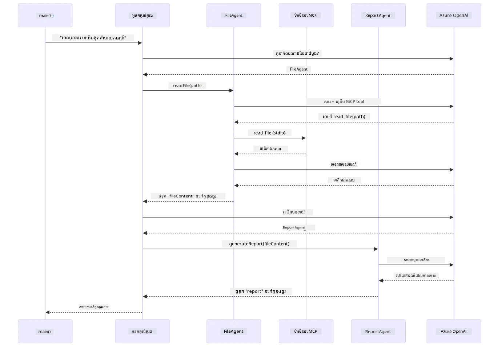

*អភិបាលហៅ FileAgent ដោយស្វ័យកម្ម (ដែលហៅម៉ាស៊ីនមេ MCP តាម stdio ដើម្បីអានឯកសារ), បន្ទាប់ហៅ ReportAgent ដើម្បីបង្កើតរបាយការណ៍ដែលមានរចនាសម្ព័ន្ធ — រាល់ភ្នាក់ងារផ្ទុកលទ្ធផលក្នុង Agentic Scope រួមគ្នា។*

រាល់ភ្នាក់ងារផ្ទុកលទ្ធផលរបស់វានៅក្នុង **Agentic Scope** (មិត្តភក្ដិចែករំលែកមνήរុំ), អនុញ្ញាតឲ្យភ្នាក់ងារទីក្រោយអាចចូលដល់លទ្ធផលមុនៗបាន។ នេះបង្ហាញថា​ឧបករណ៍ MCP មានការចូលរួមយ៉ាងត្រូវតាមក្នុងដំណើរការ agentic — អភិបាលមិនចាំបាច់ដឹង *របៀប* អានឯកសារ នោះទេ គ្រាន់តែដឹងថា `FileAgent` អាចធ្វើបាន។

#### ការរត់ការតាំងពិពណ៌នា

Scripts ចាប់ផ្តើមនេះបង្ហាញអថេរបរិយាកាសពីឯកសារ `.env` នៅថតដើម៖

**Bash:**
```bash
cd 05-mcp
chmod +x start-supervisor.sh
./start-supervisor.sh
```

**PowerShell:**
```powershell
cd 05-mcp
.\start-supervisor.ps1
```

**ប្រើ VS Code:** ក្លាយជាគ្រាន់តែក្លิกស្ដាំលើ `SupervisorAgentDemo.java` ហើយជ្រើស **"Run Java"** (ប្រាកដថាឯកសារ `.env` របស់អ្នកបានកំណត់រួច)។

#### របៀបដែលអភិបាលដំណើរការ

មុនពេលបង្កើតភ្នាក់ងារ អ្នកត្រូវភ្ជាប់ជនអតិថិជន MCP ទៅជាមួយការបញ្ជូន MCP ហើយរុំវាទៅជា `ToolProvider`។ នេះជារបៀបឲ្យឧបករណ៍ម៉ាស៊ីនមេ MCP របស់អ្នកអាចប្រើបានក្នុងភ្នាក់ងារ៖

```java
// បង្កើតអតិថិជន MCP ពីការដឹកជញ្ជូន
McpClient mcpClient = new DefaultMcpClient.Builder()
        .transport(stdioTransport)
        .build();

// ដេរអតិថិជនជាឧបករណ៍បម្រើ - នេះជាស្ពាន់ឧបករណ៍ MCP ទៅក្នុង LangChain4j
ToolProvider mcpToolProvider = McpToolProvider.builder()
        .mcpClients(List.of(mcpClient))
        .build();
```

ឥឡូវនេះ អ្នកអាចដាក់ចូល `mcpToolProvider` ទៅក្នុងភ្នាក់ងារណាមួយដែលត្រូវការឧបករណ៍ MCP៖

```java
// ជំហានទី ១៖ FileAgent អានឯកសារដោយប្រើឧបករណ៍ MCP
FileAgent fileAgent = AgenticServices.agentBuilder(FileAgent.class)
        .chatModel(model)
        .toolProvider(mcpToolProvider)  // មានឧបករណ៍ MCP សម្រាប់ប្រតិបត្តិការឯកសារ
        .build();

// ជំហានទី ២៖ ReportAgent បង្កើតរបាយការណ៍មានរចនាសម្ព័ន្ធ
ReportAgent reportAgent = AgenticServices.agentBuilder(ReportAgent.class)
        .chatModel(model)
        .build();

// អ្នកគ្រប់គ្រងរៀបចំលំនាំសកម្មភាពឯកសារ → របាយការណ៍
SupervisorAgent supervisor = AgenticServices.supervisorBuilder()
        .chatModel(model)
        .subAgents(fileAgent, reportAgent)
        .responseStrategy(SupervisorResponseStrategy.LAST)  // ត្រឡប់របាយការណ៍ចុងក្រោយ
        .build();

// អ្នកគ្រប់គ្រងសម្រេចចិត្តថាតើត្រូវហៅភ្នាក់ងារណាដែលផ្អែកលើការស្នើសុំ
String response = supervisor.invoke("Read the file at /path/file.txt and generate a report");
```

#### របៀបដែល FileAgent រកឃើញឧបករណ៍ MCP នៅពេលរត់កម្មវិធី

អ្នកប្រហែលជាចង់ដឹង៖ **តើ `FileAgent` ដឹងបានយ៉ាងដូចម្តេចថាត្រូវប្រើឧបករណ៍filesystem npm ដោយរបៀបណា?** ចម្លើយគឺវាមិនដឹងទេ — **LLM** ជួយសម្រេចចិត្តនៅពេលរត់កម្មវិធី តាមរយៈ schemas ឧបករណ៍។
ចំណុចប្រទាក់ `FileAgent` គឺគ្រាន់តែជា **និយាមកម្ពុជារបស់ prompt** ប៉ុណ្ណោះ។ វាមិនមានចំណេះដឹងដាក់កូដរឹងណាមួយអំពី `read_file`, `list_directory`, ឬឧបករណ៍ MCP ផ្សេងទៀតនោះទេ។ នេះគឺជារឿងដែលកើតឡើងពីដើមដល់ចុងៈ

1. **ម៉ាស៊ីនបម្រើចាប់ផ្ដើម៖** `StdioMcpTransport` បើកកញ្ចប់ npm `@modelcontextprotocol/server-filesystem` ជាដំណើរការកូន
2. **ការរកឧបករណ៍៖** `McpClient` ផ្ញើសំណើ JSON-RPC `tools/list` ទៅម៉ាស៊ីនបម្រើ ដែលបានឆ្លើយតបជាមួយឈ្មោះឧបករណ៍ ការពិពណ៌នា និងស្កីម៉ាផុតប៉ារ៉ាម៉ែត្រ (ឧ. `read_file` — *"អានទិន្នន័យពេញលេញនៃឯកសារ"* — `{ path: string }`)
3. **ការជ្រៀតចូលស្កីមា៖** `McpToolProvider` ប្រឡាក់ស្កីមាដែលរកឃើញទាំងនេះ ហើយធ្វើឲ្យវាអាចប្រើបានសម្រាប់ LangChain4j
4. **ការសម្រេចចិត្ត LLM៖** ប្រសិនបើហៅ `FileAgent.readFile(path)` LangChain4j នឹងផ្ញើសារប្រព័ន្ធ សារវាយកូន និង **បញ្ជីស្កីមាឧបករណ៍** ទៅ LLM។ LLM អានការពិពណ៌នាឧបករណ៍ ហើយបង្កើតការហៅឧបករណ៍ (ឧ. `read_file(path="/some/file.txt")`)
5. **ការប្រតិបត្តិការ៖** LangChain4j ចាប់ផ្ដើមការហៅឧបករណ៍ បញ្ជូនតាម MCP client វិញទៅ subprocess Node.js ទទួលលទ្ធផលវិញ ហើយផ្គត់ផ្គង់វិញទៅ LLM

នេះគឺជាបច្ចេកទេស [Tool Discovery](#tool-discovery) ដដែលដែលបានពិពណ៌នាខាងលើ ប៉ុន្តែបានអនុវត្តជាក់លាក់ទៅលើវត្តមានភ្នាក់ងារ។ ការបញ្ជាក់ `@SystemMessage` និង `@UserMessage` ជួយណែនាំអត្តចរិត LLM ខណៈដែល `ToolProvider` ដែលបានបញ្ចូលគ្នាថ្កោលទ្រព្យ **សមត្ថភាព** — LLM ជួរភ្ជាប់ពីរមុខនេះនៅពេលដំណើរការ។

> **🤖 សាកល្បងជាមួយ [GitHub Copilot](https://github.com/features/copilot) Chat:** បើក [`FileAgent.java`](../../../05-mcp/src/main/java/com/example/langchain4j/mcp/agents/FileAgent.java) ហើយសួរ៖
> - "តើភ្នាក់ងារនេះធ្វើដូចម្តេចដើម្បីដឹងថាឧបករណ៍ MCP មួយណាដែលត្រូវហៅ?"
> - "តើមានអ្វីកើតឡើងប្រសិនបើខ្ញុំយក ToolProvider ចេញពី agent builder?"
> - "តើស្កីមាឧបករណ៍ត្រូវបានផ្ញើទៅ LLM ដូចម្តេច?"

#### យុទ្ធសាស្រ្តឆ្លើយតប

ពេលអ្នកកំណត់ `SupervisorAgent` អ្នកកំណត់របៀបវាត្រូវបង្កើតចម្លើយចុងក្រោយទៅអ្នកប្រើបន្ទាប់ពីភ្នាក់ងារជាផ្នែកតូចទាំងអស់បញ្ចប់ភារកិច្ចរបស់ពួកគេ។ រូបភាពខាងក្រោមបង្ហាញពីយុទ្ធសាស្រ្តចំនួនបីដែលអាចប្រើបាន — LAST បង្រួបចម្លើយចុងក្រោយភ្នាក់ងារ, SUMMARY បិទសង្ខេបចេញពីលទ្ធផលទាំងអស់តាមរយៈ LLM, និង SCORED ជ្រើសលទ្ធផលដែលទទួលបានពិន្ទុនៅលើសំណើដើម៖

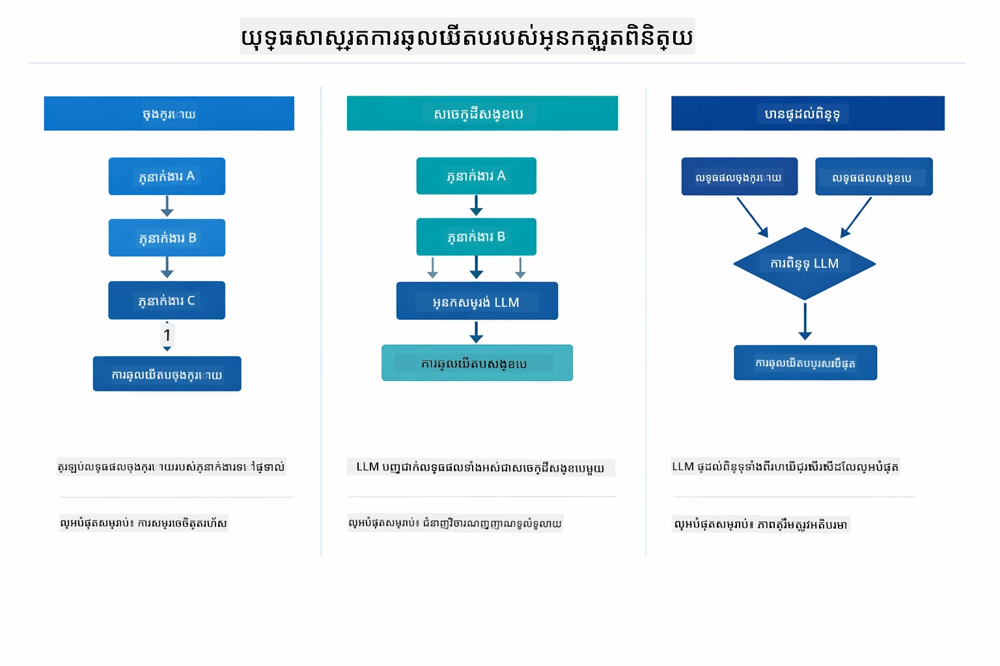

*យុទ្ធសាស្រ្តបីសម្រាប់របៀប Supervisor បង្កើតចម្លើយចុងក្រោយ — ជ្រើសរើសដោយផ្អែកលើថាតើអ្នកចង់បានលទ្ធផលចុងក្រោយ អត្ថាធិប្បាយត្រូវបានភ្ជាប់ចំណុច ឬជម្រើសពិន្ទុខ្ពស់បំផុត។*

យុទ្ធសាស្រ្តដែលមានគឺ៖

| យុទ្ធសាស្រ្ត | ការពិពណ៌នា |
|----------|-------------|
| **LAST** | អ្នកគ្រប់គ្រងត្រឡប់ចេញលទ្ធផលពីភ្នាក់ងារឬឧបករណ៍ចុងក្រោយដែលបានហៅ។ វាមានប្រយោជន៍នៅពេលភ្នាក់ងារចុងក្រោយនៅក្នុងប្រតិបត្តិការត្រូវបានរចនាឡើងយ៉ាងច្បាស់ដើម្បីផលិតចម្លើយចុងក្រោយពេញលេញ (ឧ. "Summary Agent" នៅក្នុងជម្រះស្រាវជ្រាវ)។ |
| **SUMMARY** | អ្នកគ្រប់គ្រងប្រើម៉ូដែលភាសា (LLM) របស់ខ្លួនដើម្បីបញ្ចូលចំណុចជុំវិញការប្រតិបត្តិការ និងលទ្ធផលអនុភាគរបស់ភ្នាក់ងារទាំងអស់ បន្ទាប់វិញត្រឡប់សេចក្ដីសង្ខេបនោះជាចម្លើយចុងក្រោយ។ វាផ្ដល់ជាចម្លើយស្អាត និងប្រមូលផ្ដុំទិន្នន័យទៅអ្នកប្រើ។ |
| **SCORED** | ប្រព័ន្ធប្រើ LLM ក្នុងខ្លួន ដើម្បីផ្ដល់ពិន្ទុទាំងចម្លើយ LAST និង SUMMARY នៃប្រតិកម្ម ទាញយកលទ្ធផលណាមួយដែលទទួលបានពិន្ទុខ្ពស់ជាង។ |

មើល [SupervisorAgentDemo.java](../../../05-mcp/src/main/java/com/example/langchain4j/mcp/SupervisorAgentDemo.java) សម្រាប់ការអនុវត្តពេញលេញ។

> **🤖 សាកល្បងជាមួយ [GitHub Copilot](https://github.com/features/copilot) Chat:** បើក [`SupervisorAgentDemo.java`](../../../05-mcp/src/main/java/com/example/langchain4j/mcp/SupervisorAgentDemo.java) ហើយសួរ៖
> - "តើ Supervisor តើធ្វើដូចម្តេចដើម្បីសម្រេចថានឹងហៅភ្នាក់ងារណាខ្លះ?"
> - "តើភាពខុសគ្នារវាង Supervisor និងលំនាំដំណើរការជាបន្ទាត់លំដាប់Sequential workflow patterns មានអ្វីខ្លះ?"
> - "តើធ្វើដូចម្តេចដើម្បីប្តូរអត្តចរិតផែនការ Supervisor?"

#### រំលេចលទ្ធផល

ពេលអ្នករត់ពិពណ៌នានេះ អ្នកនឹងឃើញដំណើរការដែលអង្គភាព Supervisor បញ្ជាពិភាគភ្នាក់ងារជាច្រើន។ ក្រោមនេះជាការពិពណ៌នាអំពីផ្នែកនីមួយៗ៖

```
======================================================================
  FILE → REPORT WORKFLOW DEMO
======================================================================

This demo shows a clear 2-step workflow: read a file, then generate a report.
The Supervisor orchestrates the agents automatically based on the request.
```
  
**ចំណងជើង** ណែនាំអំពីគម្រោង workflow៖ ស្ថាប័នដាក់ចំណុចផ្តោតពីការអានឯកសារដល់ការបង្កើតរបាយការណ៍។

```
--- WORKFLOW ---------------------------------------------------------
  ┌─────────────┐      ┌──────────────┐
  │  FileAgent  │ ───▶ │ ReportAgent  │
  │ (MCP tools) │      │  (pure LLM)  │
  └─────────────┘      └──────────────┘
   outputKey:           outputKey:
   'fileContent'        'report'

--- AVAILABLE AGENTS -------------------------------------------------
  [FILE]   FileAgent   - Reads files via MCP → stores in 'fileContent'
  [REPORT] ReportAgent - Generates structured report → stores in 'report'
```
  
**រូបភាព Workflow** បង្ហាញពីការហូរទិន្នន័យរវាងភ្នាក់ងារ។ ភ្នាក់ងារនីមួយៗមានតួនាទីជាក់លាក់៖  
- **FileAgent** អានឯកសារដោយប្រើឧបករណ៍ MCP ហើយរក្សាទុកខ្លឹមសារដើមក្នុង `fileContent`  
- **ReportAgent** ប្រើខ្លឹមសារនោះ ហើយបង្កើតរបាយការណ៍រួចឡើងដោយរចនាសម្ព័ន្ធក្នុង `report`

```
--- USER REQUEST -----------------------------------------------------
  "Read the file at .../file.txt and generate a report on its contents"
```
  
**សំណើអ្នកប្រើ** បង្ហាញកិច្ចការបាន។ Supervisor វិភាគអត្ថន័យ រួចសម្រេចហៅ FileAgent → ReportAgent។

```
--- SUPERVISOR ORCHESTRATION -----------------------------------------
  The Supervisor decides which agents to invoke and passes data between them...

  +-- STEP 1: Supervisor chose -> FileAgent (reading file via MCP)
  |
  |   Input: .../file.txt
  |
  |   Result: LangChain4j is an open-source, provider-agnostic Java framework for building LLM...
  +-- [OK] FileAgent (reading file via MCP) completed

  +-- STEP 2: Supervisor chose -> ReportAgent (generating structured report)
  |
  |   Input: LangChain4j is an open-source, provider-agnostic Java framew...
  |
  |   Result: Executive Summary...
  +-- [OK] ReportAgent (generating structured report) completed
```
  
**ការត្រួតពិនិត្យ Supervisor** បង្ហាញពីដំណើរដំណាក់ពីរជំហាន៖  
1. **FileAgent** អានឯកសារតាម MCP ហើយរក្សាទុកខ្លឹមសារ  
2. **ReportAgent** ទទួលខ្លឹមសារ ហើយបង្កើតរបាយការណ៍រចនាសម្ព័ន្ធ

Supervisor បានសម្រេចចិត្តទាំងនេះដោយ **ឯករាជ្យ** គិតតាមសំណើអ្នកប្រើ។

```
--- FINAL RESPONSE ---------------------------------------------------
Executive Summary
...

Key Points
...

Recommendations
...

--- AGENTIC SCOPE (Data Flow) ----------------------------------------
  Each agent stores its output for downstream agents to consume:
  * fileContent: LangChain4j is an open-source, provider-agnostic Java framework...
  * report: Executive Summary...
```
  
#### ពន្យល់អំពីលក្ខណៈពិសេសនៃម៉ូឌុល Agentic

ឧទាហរណ៍បង្ហាញពីលក្ខណៈពិសេសមួយចំនួនខ្ពស់នៃម៉ូឌុល agentic។ នេះជាការត្រួតពិនិត្យជិតស្និទ្ធលើ Agentic Scope និង Agent Listeners។

**Agentic Scope** បង្ហាញពីអង្គចងចាំរួម ដែលភ្នាក់ងាររក្សាផលប៉ះពាល់ដោយប្រើ `@Agent(outputKey="...")`។ វាអនុញ្ញាត៖  
- ភ្នាក់ងារថ្មីៗអាចចូលដំណើរការលទ្ធផលចាស់  
- Supervisor អាចបញ្ចូលចំណុចចុងក្រោយ  
- អ្នកអាចត្រួតពិនិត្យទិន្នន័យដែលភ្នាក់ងារបញ្ចេញ

រូបភាពខាងក្រោមបង្ហាញពីរបៀប Agentic Scope ធ្វើដូចជាអង្គចងចាំរួម ក្នុង workflow ពីឯកសារទៅរបាយការណ៍ — FileAgent យកលទ្ធផលស្តុកក្រោម `fileContent` ហើយ ReportAgent អានវា ហើយសរសេរលទ្ធផលក្រោម `report`៖

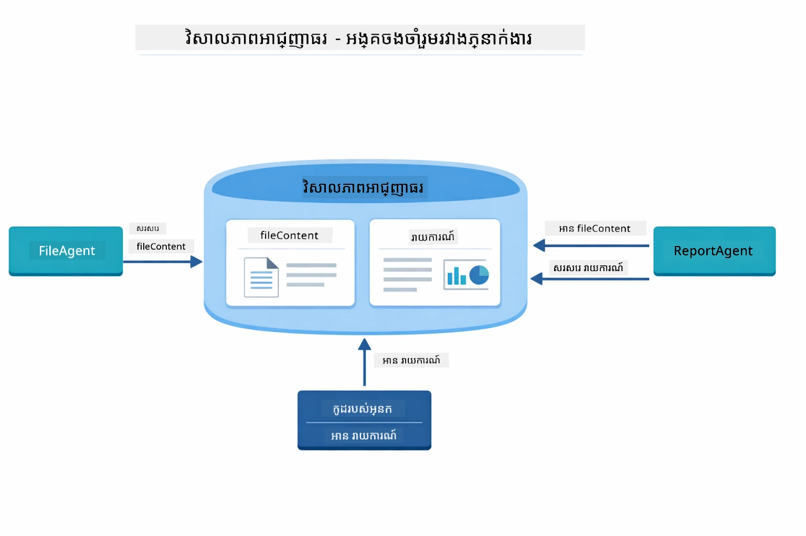

*Agentic Scope ធ្វើដូចជា អង្គចងចាំរួម — FileAgent សរសេរ `fileContent` , ReportAgent អានវា ហើយសរសេរ `report`, ហើយកូដរបស់អ្នកអានលទ្ធផលចុងក្រោយ។*

```java
ResultWithAgenticScope<String> result = supervisor.invokeWithAgenticScope(request);
AgenticScope scope = result.agenticScope();
String fileContent = scope.readState("fileContent");  // ទិន្នន័យឯកសារច្រកពី FileAgent
String report = scope.readState("report");            // របាយការណ៍ដំណើរការពី ReportAgent
```
  
**Agent Listeners** ធ្វើឲ្យអាចតាមដាន និងដោះស្រាយបញ្ហាក្នុងការប្រតិបត្តិភ្នាក់ងារ។ លទ្ធផលជាបន្ទាប់ៗដែលអ្នកឃើញក្នុងការបង្ហាញស្មើនឹង AgentListener ដែលភ្ជាប់តាមការហៅភ្នាក់ងារនីមួយៗ៖  
- **beforeAgentInvocation** - ត្រូវហៅពេល Supervisor ជ្រើសរើសភ្នាក់ងារ អនុញ្ញាតឱ្យអ្នកឃើញថាភ្នាក់ងារណាត្រូវបានជ្រើស និងមូលហេតុ  
- **afterAgentInvocation** - ត្រូវហៅពេលភ្នាក់ងារសម្រេចការងារ បង្ហាញលទ្ធផលរបស់វា  
- **inheritedBySubagents** - បើពិត អ្នកស្តាប់នឹងតាមដានភ្នាក់ងារទាំងអស់ក្នុងលំដាប់

រូបភាពខាងក្រោមបង្ហាញពីរឿងជីវិត Agent Listener ពេញលេញ រួមមានរបៀប `onError` ដោះស្រាយករណីបរាជ័យក្នុងការប្រតិបត្តិការភ្នាក់ងារ៖

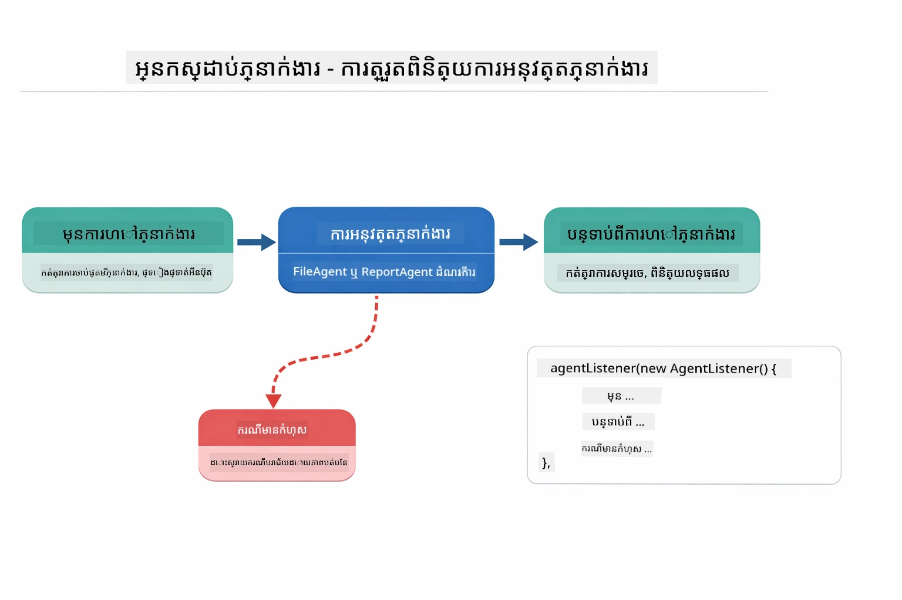

*Agent Listeners តភ្ជាប់ទៅកាន់រឿងជីវិតរបស់ការប្រតិបត្តិការ — តាមដានពេលភ្នាក់ងារចាប់ផ្ដើម បញ្ចប់ ឬមានកំហុស។*

```java
AgentListener monitor = new AgentListener() {
    private int step = 0;
    
    @Override
    public void beforeAgentInvocation(AgentRequest request) {
        step++;
        System.out.println("  +-- STEP " + step + ": " + request.agentName());
    }
    
    @Override
    public void afterAgentInvocation(AgentResponse response) {
        System.out.println("  +-- [OK] " + response.agentName() + " completed");
    }
    
    @Override
    public boolean inheritedBySubagents() {
        return true; // ផ្សព្វផ្សាយទៅអ្នកតំណាងរងទាំងអស់
    }
};
```
  
ក្រៅពីលំនាំ Supervisor, ម៉ូឌុល `langchain4j-agentic` ផ្ដល់លំនាំការងារតាមកម្មវិធីជាច្រើនដ៏មានអំណាច។ រូបភាពខាងក្រោមបង្ហាញពីលំនាំអំពីប្រាំប្រភេទ — ចាប់ពីបណ្តុំជាលំដាប់រហូតដល់ការត្រួតពិនិត្យរបស់មនុស្សក្នុង workflow៖

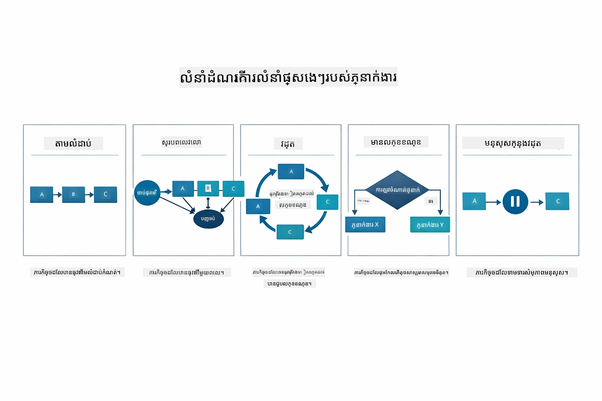

*ប្រាំលំនាំការងារសម្រាប់ត្រួតពិនិត្យភ្នាក់ងារជាលំដាប់ — ចាប់ពីខ្សែបណ្ដាញសាមញ្ញ រហូតដល់ការត្រួតពិនិត្យដោយមនុស្ស។*

| លំនាំ | ការពិពណ៌នា | ករណីប្រើ |
|---------|-------------|----------|
| **Sequential** | ប្រតិបត្តិភ្នាក់ងារតាមលំដាប់លំគោល ចេញលទ្ធផលទៅភ្នាក់ងារបន្ទាប់ | Pipeline: ស្រាវជ្រាវ → វិភាគ → របាយការណ៍ |
| **Parallel** | រត់ភ្នាក់ងារជាមួយគ្នាក្នុងពេលដដែល | ការងារឯករាជ្យ: អាកាសធាតុ + ព័ត៌មាន + ទុននិយម |
| **Loop** | បន្តបញ្ច្រាស់រហូតដល់លទ្ធផលសម្រេចលក្ខខណ្ឌ | វាយតម្លៃគុណភាព: បន្តកំណត់លក្ខណៈដល់ពិន្ទុ ≥ 0.8 |
| **Conditional** | ផ្លូវផ្លូវការតាមលក្ខខណ្ឌ | ចំណាត់ថ្នាក់ → ផ្ញើទៅភ្នាក់ងារបច្ចេកទេស |
| **Human-in-the-Loop** | បន្ថែមចំណុចពិនិត្យដោយមនុស្ស | Workflow អនុម័ត និងពិនិត្យមើលខ្លឹមសារ |

## គំនិតសំខាន់ៗ

ឥឡូវនេះអ្នកបានស្វែងយល់ពី MCP និងម៉ូឌុល agentic ក្នុងការអនុវត្ត, យើងសង្ខេបពីពេលដែលត្រូវប្រើវិធីណាមួយ។

អត្ថប្រយោជន៍ធំបំផុតរបស់ MCP គឺប្រព័ន្ធអេកូស៊ីស្ទែមដែលកំពុងធំឡើង។ រូបភាពខាងក្រោមបង្ហាញពីរបៀបនៃរូបមន្តសកលមួយភ្ជាប់កម្មវិធី AI របស់អ្នកទៅម៉ាស៊ីនបម្រើ MCP ជាច្រើន — ពីការចូលប្រើ filesystem និងdatabase រហូតដល់ GitHub, អ៊ីមែល, ទាញយកវេបសាយ និងផ្សេងៗទៀត៖

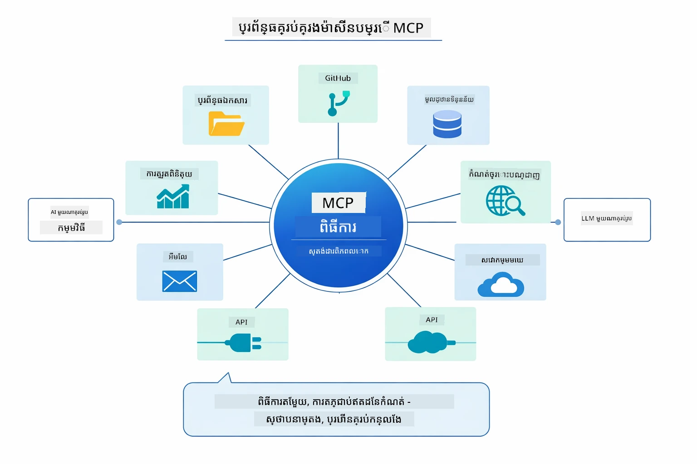

*MCP បង្កើតអេកូស៊ីស្ទែមនៃរូបមន្តសកល — ម៉ាស៊ីនបម្រើ MCP ដែលសមត្ថភាពត្រូវការនឹងបញ្ចូលបានជាមួយ client MCP, អាចចែករំលែកឧបករណ៍គ្នាទៅកម្មវិធីផ្សេងៗ។*

**MCP** ល្អបំផុតនៅពេលដែលអ្នកចង់ប្រើប្រាស់ប្រព័ន្ធឧបករណ៍មានស្រាប់ សាងសង់ឧបករណ៍ដែលកម្មវិធីជាច្រើនអាចចែករំលែក ប្រើសេវាកម្មភាគីទីបីជាមួយរូបមន្តស្ដង់ដារ ឬប្តូរអនុវត្តន៍ឧបករណ៍ដោយមិនប្ដូរកូដ។

**ម៉ូឌុល Agentic** អំណោយផលបំផុតនៅពេលដែលអ្នកចង់កំណត់ភ្នាក់ងារជាផ្លូវការ ជាមួយស្លាក `@Agent`, ត្រូវការត្រួតពិនិត្យព្រមទាំងគ្រប់គ្រង workflow (ជាលំដាប់ ចំរៀង ជាប្រព័ន្ធ), ចូលចិត្តនិយមន័យភ្នាក់ងារដោយចំណុចប្រទាក់ជំនួសឳ្យកូដបញ្ជា, ឬក៏ត្រូវភ្នាក់ងារជាច្រើនដែលចែករំលែកលទ្ធផលតាម `outputKey` ។

**លំនាំ Supervisor Agent** វិជ្ជាជីវៈនៅពេល workflow មិនអាចទាក់ទាញមុន ហើយអ្នកចង់អោយ LLM សម្រេច ក្រោមបរិបទមានភ្នាក់ងារពិសេសច្រើនដែលត្រូវត្រួតត្រារមវិធីធីវឌ្ឍនភាព ឬក៏អ្នកកំពុងតាំងមុខសួនសម្ភាសន៍ដែលផ្ញើទៅអ្នកមានសមត្ថភាពផ្សេងៗ, ឬត្រូវការអត្តចរិតភ្នាក់ងារដែលបត់បែនបំផុត។

ដើម្បីជួយអ្នកសម្រេចចិត្តរវាងវិធី `@Tool` ជារបៀបផ្ទាល់ពី Module 04 និងឧបករណ៍ MCP ពីម៉ូឌុលនេះ, ការប្រៀបធៀបទាំងក្រោមបង្ហាញពីអត្ថប្រយោជន៍សំខាន់ៗ — ឧបករណ៍ផ្ទាល់ខ្លួនផ្ដល់ការភ្ជាប់កាន់តែរឹងមាំ និងប្រើប្រការត្រឹមត្រូវសម្រាប់តុល្យភាព app ពិសេស ខណៈឧបករណ៍ MCP ផ្ដល់ការតភ្ជាប់ស្ដង់ដារចេញក្នុងកម្មវិធីជាច្រើនបាន:

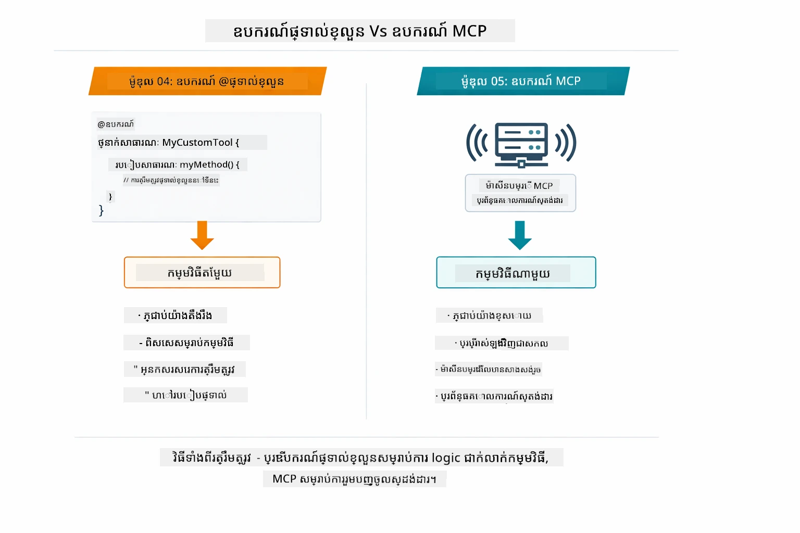

*ពេលណាគួរត្រួសាម @Tool ផ្ទាល់ខ្លួន បូកជាមួយ MCP tools — @Tool សម្រាប់តុល្យភាព app និស្សិតពេញលេញ ខណៈ MCP tools សម្រាប់ការតភ្ជាប់ស្ដង់ដារ ដែលអាចប្រើក្នុងកម្មវិធីជាច្រើន។*

## សូមអបអរសាទរ!

អ្នកបានបញ្ចប់មុខវិជ្ជារបស់ LangChain4j for Beginners ជាច្រើន module! នេះជាការមើលជាទូទៅនៅលើដំណើររៀនទាំងមូលដែលអ្នកបានធ្វើ — ចាប់ពី chat មូលដ្ឋាន រហូតដល់ប្រព័ន្ធ agentic ដំណើរការដោយ MCP៖

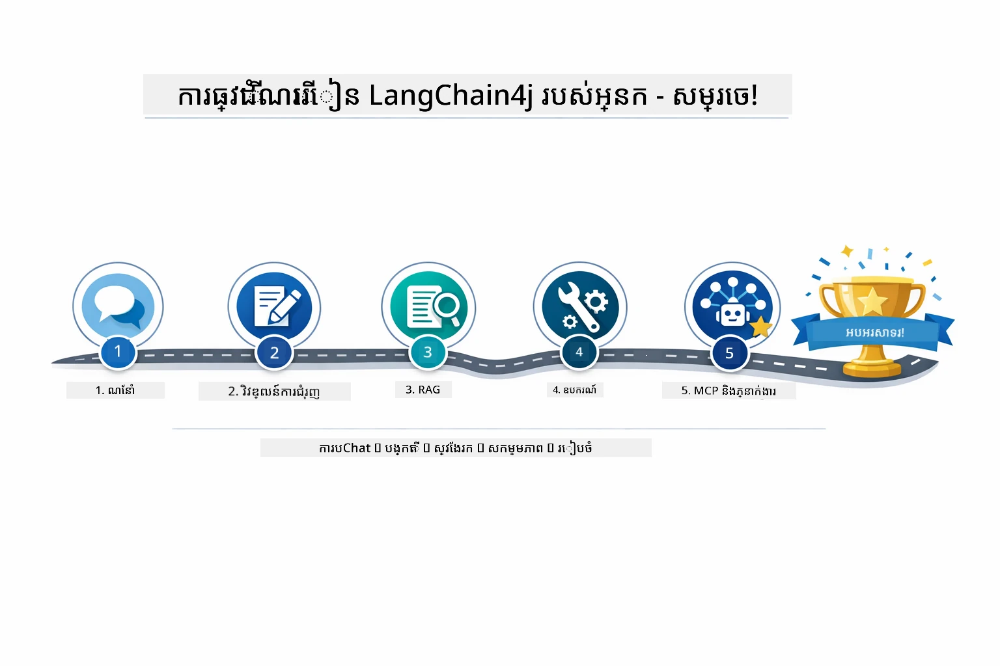

*ដំណើរការរៀនរបស់អ្នកតាម module ប្រាំទាំងមូល — ចាប់ពី chat មូលដ្ឋាន ដល់ប្រព័ន្ធ agentic ដំណើរការដោយ MCP។*

អ្នកបានបញ្ចប់មុខវិជ្ជា LangChain4j for Beginners។ អ្នកបានរៀន៖

- របៀបកសាង conversational AI ជាមួយអង្គចងចាំ (Module 01)
- លំនាំបង្កើត prompt សម្រាប់ភារកិច្ចផ្សេងៗ (Module 02)
- ការជៀសផ្ដោតចម្លើយទៅឯកសាររបស់អ្នកជាមួយ RAG (Module 03)
- បង្កើតភ្នាក់ងារមូលដ្ឋាន AI (ជាអ្នកជួយ) ជាមួយឧបករណ៍ផ្ទាល់ខ្លួន (Module 04)
- ინტეგრირებაზე სტანდარტიზებული ინსტრუმენტები LangChain4j MCP და Agentic modules-თან (Module 05)

### អ្វីទៅជាដំណាក់កាលបន្ទាប់?

បន្ទាប់ពីបញ្ចប់ module សូមស្វែងយល់ពី [Testing Guide](../docs/TESTING.md) ដើម្បីមើលមើលគំនិតការប្រឡង LangChain4j កំពុងដំណើរការ។

**ធនធានផ្លូវការជាផ្លូវការ៖**
- [LangChain4j Documentation](https://docs.langchain4j.dev/) - មគ្គុទ្ទេសក៍ និងយោង API ពេញលេញ
- [LangChain4j GitHub](https://github.com/langchain4j/langchain4j) - កូដប្រភព និងឧទាហរណ៍
- [LangChain4j Tutorials](https://docs.langchain4j.dev/tutorials/) - មេរៀនជាដំណាក់កាលសម្រាប់ករណីប្រើប្រាស់ផ្សេងៗ

អរគុណសម្រាប់ការបញ្ចប់វគ្គនេះ!

---

**ការត្រឡប់ទៅមុន៖** [← មុន៖ Module 04 - Tools](../04-tools/README.md) | [ត្រឡប់ទៅផ្ទៃកណ្តាល](../README.md)

---

<!-- CO-OP TRANSLATOR DISCLAIMER START -->
**ការបដិសេធ**៖  
ឯកសារនេះត្រូវបានបកប្រែក្នុងការប្រើប្រាស់សេវាកម្មបកប្រែ AI [Co-op Translator](https://github.com/Azure/co-op-translator)។ ខណៈពេលដែលយើងខំប្រឹងរកភាពត្រឹមត្រូវ សូមចំណាំថាការបកប្រែដោយស្វ័យប្រវត្តិអាចមានកំហុសឬភាពមិនត្រឹមត្រូវ។ ឯកសារដើមក្នុងភាសាមួយទាំងមូលគួរត្រូវបានចាត់ទុកថាជាដើមកំណត់ដែលមានសុពលភាព។ សម្រាប់ព័ត៌មានសំខាន់ៗ សំណើរប្រែដោយអ្នកជំនាញមនុស្សគឺសំរាប់ណែនាំ។ យើងមិនខ مسؤ យចំពោះការយល់ច្រឡំ ឬការបកស្រាយខុសណាមួយដែលកើតមានពីការប្រើប្រាស់ការបកប្រែនេះទេ។
<!-- CO-OP TRANSLATOR DISCLAIMER END -->