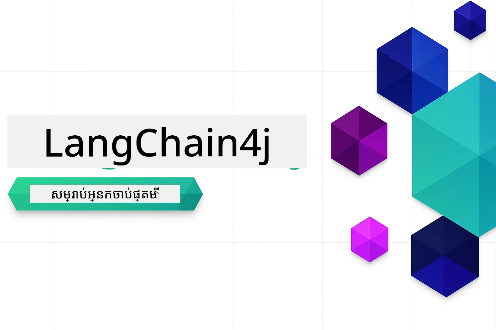

# LangChain4j សម្រាប់អ្នកចាប់ផ្ដើម

វគ្គសិក្សាមួយសម្រាប់បង្កើតកម្មវិធី AI ជាមួយ LangChain4j និង Azure OpenAI GPT-5.2 ចាប់ពីការជជែកមូលដ្ឋានដល់ភ្នាក់ងារ AI។

### 🌐 គាំទ្រភាសាម៉ុលធី

#### គាំទ្រដោយសកម្មភាព GitHub (ស្វ័យប្រវត្តិ និងតែងតែទាន់សម័យ)

<!-- CO-OP TRANSLATOR LANGUAGES TABLE START -->
[អារ៉ាប់](../ar/README.md) | [បង់ក្លា](../bn/README.md) | [ប៊ុលហ្គារី](../bg/README.md) | [មីយ៉ាន់ម៉ា (ភាសាប៊ឺម៉ាស)](../my/README.md) | [ចិន (សាមញ្ញ)](../zh-CN/README.md) | [ចិន (ប្រពៃណី, ហុងកុង)](../zh-HK/README.md) | [ចិន (ប្រពៃណី, ម៉ាកាវ)](../zh-MO/README.md) | [ចិន (ប្រពៃណី, តៃវ៉ាន់)](../zh-TW/README.md) | [ក្រូអាស៊ី](../hr/README.md) | [ខេហ្ស](../cs/README.md) | [ដាណាខ្ក](../da/README.md) | [ដាច](../nl/README.md) | [អេស្តូនីយ៉ា](../et/README.md) | [ហ្វិនឡង់](../fi/README.md) | [បារាំង](../fr/README.md) | [អាល្លឺម៉ង់](../de/README.md) | [ក្រិច](../el/README.md) | [ហេប៊ရွ](../he/README.md) | [ហិណ្ឌី](../hi/README.md) | [ហុងគ្រី](../hu/README.md) | [ឥណ្ឌូណេស៊ី](../id/README.md) | [អ៊ីតាលី](../it/README.md) | [ជប៉ុន](../ja/README.md) | [កណណាដា](../kn/README.md) | [ខ្មែរ](./README.md) | [កូរ៉េ](../ko/README.md) | [លីទុយអានី](../lt/README.md) | [ម៉ាឡៃ](../ms/README.md) | [ម៉ាឡាឡាយ៉ាលាំ](../ml/README.md) | [ម៉ារាថី](../mr/README.md) | [នេប៉ាល់](../ne/README.md) | [ភាសាគូគូហ្វីននី](../pcm/README.md) | [ន័រវែ](../no/README.md) | [ភាសាផេរូស (ហ្វា្ទស៊ី)](../fa/README.md) | [ប៉ូឡិន](../pl/README.md) | [ភាសាប៉ូរទុយហ្កាល់ (ប្រេស៊ីល)](../pt-BR/README.md) | [ភាសាប៉ូរទុយហ្កាល់ (ប៉ូរទុយហ្កាល់)](../pt-PT/README.md) | [ភាសាផុនជាប៊ី (គួរមូឃី)](../pa/README.md) | [រូម៉ានី](../ro/README.md) | [រុស្ស៊ី](../ru/README.md) | [សឺប៊ី (អក្សរអង់គ្លេស)](../sr/README.md) | [ស្លូវាគ](../sk/README.md) | [ស្លូវេនី](../sl/README.md) | [អេស្ប៉ាញ](../es/README.md) | [ស្វាហ៊ីលី](../sw/README.md) | [ស៊ុយអែ](../sv/README.md) | [តាឡាហ្គោ (ហ្វីលីពីន)](../tl/README.md) | [តាមីល](../ta/README.md) | [តេលូទូ](../te/README.md) | [ថៃ](../th/README.md) | [ទួរគី](../tr/README.md) | [អ៊ុយក្រែន](../uk/README.md) | [អ៊ឺឌូ](../ur/README.md) | [វៀតណាម](../vi/README.md)

> **ចង់ចម្លងនៅក្នុងកុំព្យូទ័រអ្នកទេ?**
>
> ឃ្លាំងនេះមានការប្រែភាសា ៥០+ ដែលបង្កើនទំហំទាញយកយ៉ាងច្រើន។ ដូច្នេះដើម្បីចម្លងដោយគ្មានភាសាប្រែ ប្រើ sparse checkout៖
>
> **Bash / macOS / Linux:**
> ```bash
> git clone --filter=blob:none --sparse https://github.com/microsoft/LangChain4j-for-Beginners.git
> cd LangChain4j-for-Beginners
> git sparse-checkout set --no-cone '/*' '!translations' '!translated_images'
> ```
>
> **CMD (Windows):**
> ```cmd
> git clone --filter=blob:none --sparse https://github.com/microsoft/LangChain4j-for-Beginners.git
> cd LangChain4j-for-Beginners
> git sparse-checkout set --no-cone "/*" "!translations" "!translated_images"
> ```
>
> វានឹងផ្គត់ផ្គង់អ្វីដែលអ្នកត្រូវការដើម្បីបញ្ចប់វគ្គសិក្សានេះដោយទាញយកលឿនជាងមុន។
<!-- CO-OP TRANSLATOR LANGUAGES TABLE END -->

## តារាងមាតិកា

1. [ចាប់ផ្ដើមយ៉ាងរហ័ស](00-quick-start/README.md) - ចាប់ផ្ដើមជាមួយ LangChain4j
2. [បង្ហាញសង្ខេប](01-introduction/README.md) - រៀនអំពីមូលដ្ឋាន LangChain4j
3. [បច្ចេកវិទ្យាគំនិតបញ្ចូល](02-prompt-engineering/README.md) - ធ្វើឲ្យចេះរចនាគំនិតឲ្យបានប្រសើរ
4. [RAG (ការបង្កើតដែលអភិវឌ្ឍដោយការយកតម្លៃបន្ថែម)](03-rag/README.md) - បង្កើតប្រព័ន្ធចំណេះដឹងវចនាធិប្បាយ
5. [ឧបករណ៍](04-tools/README.md) - បញ្ចូលឧបករណ៍ខាងក្រៅ និងជំនួយងាយៗ
6. [MCP (ប្រព័ន្ធបរិបទគំរូ)](05-mcp/README.md) - ធ្វើការជាមួយប្រព័ន្ធបរិបទគំរូ (MCP) និងមជ្ឈមណ្ឌលភ្នាក់ងារ

### សិក្សាតាមវីដេអូ

មូឌុលរាល់មួយមានវីដេអូផ្ញើផ្សាយផ្ទាល់ដែលយើងដើរឆ្ពោះតាមគំនិត និងកូដជំហានដោយជំហាន។

| មូឌុល | វីដេអូ |
|--------|---------|
| 01 - បង្ហាញសង្ខេប | [ចាប់ផ្ដើមជាមួយ LangChain4j](https://www.youtube.com/live/nl_troDm8rQ) |
| 02 - បច្ចេកវិទ្យាគំនិតបញ្ចូល | [បច្ចេកវិទ្យាគំនិតបញ្ចូលជាមួយ LangChain4j](https://www.youtube.com/live/PJ6aBaE6bog) |
| 03 - RAG | [RAG ជាមួយ LangChain4j](https://www.youtube.com/watch?v=_olq75ZH_eY) |
| 04 - ឧបករណ៍ និង 05 - MCP | [ភ្នាក់ងារ AI ជាមួយឧបករណ៍ និង MCP](https://www.youtube.com/watch?v=O_J30kZc0rw) |

---

## ផ្លូវការសិក្សា

**ថ្មីចំពោះ LangChain4j ទេ?** សូមពិនិត្យមើល [ពាក្យស្នូល](docs/GLOSSARY.md) សម្រាប់និយមន័យនៃពាក្យ និងគំនិតសំខាន់ៗ។

> **ចាប់ផ្ដើមយ៉ាងរហ័ស**

1. ខ្ចីឃ្លាំងនេះទៅគណនី GitHub របស់អ្នក
2. ចុច **Code** → តារាង **Codespaces** → **...** → **New with options...**
3. ប្រើលំនាំដើម – វានឹងជ្រើសគ្រប់គ្រងកុងតឺន័រអភិវឌ្ឍន៍ដែលបានបង្កើតសម្រាប់វគ្គសិក្សានេះ
4. ចុច **Create codespace**
5. ចាំរយៈពេល ៥-១០ នាទីរហូតដល់បរិវេណត្រៀមរួច
6. ឆ្លងតទៅកាន់ [ចាប់ផ្ដើមយ៉ាងរហ័ស](./00-quick-start/README.md) ដើម្បីចាប់ផ្ដើម!

បន្ទាប់ពីបញ្ចប់មូឌុលទាំងអស់ សូមស្វែងយល់ពី[មគ្គុទេសក៍សាកល្បង](docs/TESTING.md) ដើម្បីមើលមាតិកាចំណេះដឹង LangChain4j ក្នុងសកម្មភាព។

> **ចំណាំ:** វគ្គបណ្តុះបណ្តាលនេះប្រើទាំង GitHub Models និង Azure OpenAI។ មូឌុល [ចាប់ផ្ដើមយ៉ាងរហ័ស](00-quick-start/README.md) ប្រើ GitHub Models (មិនចាំបាច់មានជាវ Azure) ខណៈមូឌុលទី ១ ដល់ ៥ ប្រើ Azure OpenAI។ ចាប់ផ្ដើមជាមួយគណនី Azure [ឥតគិតថ្លៃ](https://aka.ms/azure-free-account) ប្រសិនបើអ្នកមិនមានទេ។

## រៀនជាមួយ GitHub Copilot

ដើម្បីចាប់ផ្ដើមកូដលឿន សូមបើកគម្រោងនេះនៅក្នុង GitHub Codespace ឬ IDE ក្នុងកុំព្យូទ័រមូលដ្ឋានរបស់អ្នកជាមួយ devcontainer ដែលបានផ្តល់ជូន។ devcontainer នៅក្នុងវគ្គសិក្សានេះបានកំណត់រួចជាមួយ GitHub Copilot សម្រាប់កម្មវិធីឆ្លើយតប AI រួមគ្នា។

ឧទាហរណ៍កូដនីមួយៗមានសំណួរដែលបានផ្តល់អោយអ្នកអាចសួរទៅ GitHub Copilot ដើម្បីពង្រឹងការយល់ដឹង។ ស្វែងរកសញ្ញា 💡/🤖 នៅក្នុង៖

- **ចំណងជើងឯកសារ Java** - សំណួរតាមលំដាប់ឧទាហរណ៍នីមួយៗ
- **មាតិកាមូឌុល** - សំណួរស្រាវជ្រាវបន្ទាប់ពីឧទាហរណ៍កូដ

**វិធីប្រើ៖** បើកឯកសារកូដណាមួយហើយសួរសំណួរដែលបានផ្តល់ជូនដោយ Copilot។ វាមានបរិបទពេញលេញនៃជំនួយទាំងមូល អាចពន្យល់ ពង្រីក និងផ្តល់ជម្រើសជាច្រើនបាន។

ចង់រៀនបន្ថែមទៀត? សូមពិនិត្យ [Copilot សម្រាប់កម្មវិធី AI រួមគ្នា](https://aka.ms/GitHubCopilotAI)។

## ធនធានបន្ថែម

<!-- CO-OP TRANSLATOR OTHER COURSES START -->
### LangChain
[](https://aka.ms/langchain4j-for-beginners)
[](https://aka.ms/langchainjs-for-beginners?WT.mc_id=m365-94501-dwahlin)
[](https://github.com/microsoft/langchain-for-beginners?WT.mc_id=m365-94501-dwahlin)
---

### Azure / Edge / MCP / អ្នកភ្នាក់ងារ
[](https://github.com/microsoft/AZD-for-beginners?WT.mc_id=academic-105485-koreyst)
[](https://github.com/microsoft/edgeai-for-beginners?WT.mc_id=academic-105485-koreyst)
[](https://github.com/microsoft/mcp-for-beginners?WT.mc_id=academic-105485-koreyst)
[](https://github.com/microsoft/ai-agents-for-beginners?WT.mc_id=academic-105485-koreyst)

---
 
### ស៊េរី AI បង្កើត
[](https://github.com/microsoft/generative-ai-for-beginners?WT.mc_id=academic-105485-koreyst)
[-9333EA?style=for-the-badge&labelColor=E5E7EB&color=9333EA)](https://github.com/microsoft/Generative-AI-for-beginners-dotnet?WT.mc_id=academic-105485-koreyst)
[-C084FC?style=for-the-badge&labelColor=E5E7EB&color=C084FC)](https://github.com/microsoft/generative-ai-for-beginners-java?WT.mc_id=academic-105485-koreyst)
[-E879F9?style=for-the-badge&labelColor=E5E7EB&color=E879F9)](https://github.com/microsoft/generative-ai-with-javascript?WT.mc_id=academic-105485-koreyst)

---
 
### ការសិក្សាគោល
[](https://aka.ms/ml-beginners?WT.mc_id=academic-105485-koreyst)
[](https://aka.ms/datascience-beginners?WT.mc_id=academic-105485-koreyst)
[](https://aka.ms/ai-beginners?WT.mc_id=academic-105485-koreyst)
[](https://github.com/microsoft/Security-101?WT.mc_id=academic-96948-sayoung)
[](https://aka.ms/webdev-beginners?WT.mc_id=academic-105485-koreyst)
[](https://aka.ms/iot-beginners?WT.mc_id=academic-105485-koreyst)
[](https://github.com/microsoft/xr-development-for-beginners?WT.mc_id=academic-105485-koreyst)

---

### ស៊េរី Copilot
[](https://aka.ms/GitHubCopilotAI?WT.mc_id=academic-105485-koreyst)
[](https://github.com/microsoft/mastering-github-copilot-for-dotnet-csharp-developers?WT.mc_id=academic-105485-koreyst)
[](https://github.com/microsoft/CopilotAdventures?WT.mc_id=academic-105485-koreyst)
<!-- CO-OP TRANSLATOR OTHER COURSES END -->

## សូមទទួលបានជំនួយ

ប្រសិនបើអ្នកមាន​បញ្ហា ឬ​មានសំណួរ​អំពី​ការស្ថាបនាបញ្ចូលកម្មវិធី AI សូមចូលរួម៖

[](https://aka.ms/foundry/discord)

ប្រសិនបើអ្នកមានមតិយោបល់ពីផលិតផល ឬកំហុសពេលកំពុងស្ថាបនាអ្នកអាចចូលទៅកាន់៖

[](https://aka.ms/foundry/forum)

## របៀបអនុញ្ញាត

បណ្ណៈកម្ម MIT - មើល [LICENSE](../../LICENSE) ឯកសារសម្រាប់ព័ត៌មានលម្អិត។

---

<!-- CO-OP TRANSLATOR DISCLAIMER START -->
**ព័ត៌មានបដិសេធ**៖  
ឯកសារនេះត្រូវបានបកប្រែដោយប្រើសេវាកម្មបកប្រែ AI [Co-op Translator](https://github.com/Azure/co-op-translator)។ ទោះយើងខ្ញុំមានការខំប្រឹងប្រែងសម្រាប់ភាពត្រឹមត្រូវ ក៏សូមយល់ឲ្យបានថា ការបកប្រែដោយស្វ័យប្រវត្តិនេះអាចមានកំហុសឬភាពមិនត្រឹមត្រូវ។ ឯកសារដើមនៅក្នុងភាសាទូទៅគួរត្រូវបានគេចាត់ទុកថាជាផ្នែកទិន្នផលផ្លូវការ។ សម្រាប់ព័ត៌មានសំខាន់ៗ ការបកប្រែដោយមនុស្សជំនាញគឺជាជម្រើសដែលបានណែនាំ។ យើងខ្ញុំមិនទទួលខុសត្រូវចំពោះការយល់ច្រឡំនិយម ឬការបកប្រែខុសដែលអាចកើតឡើងពីការប្រើប្រាស់ការបកប្រែនេះទេ។
<!-- CO-OP TRANSLATOR DISCLAIMER END -->