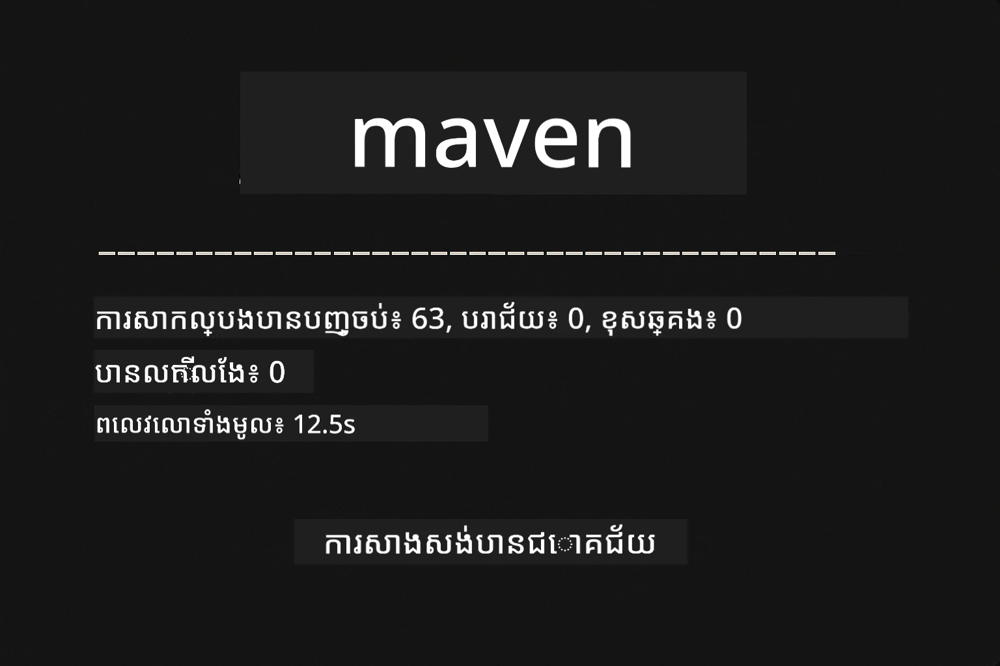
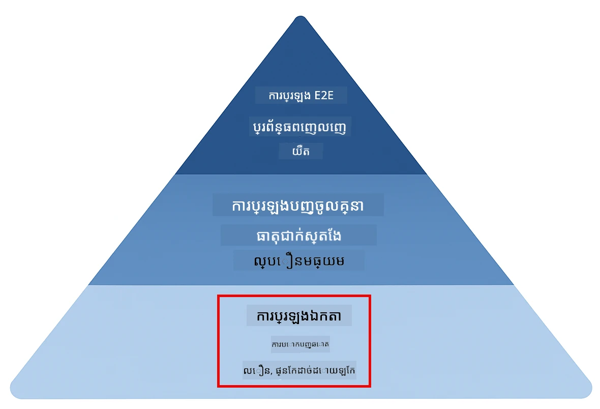
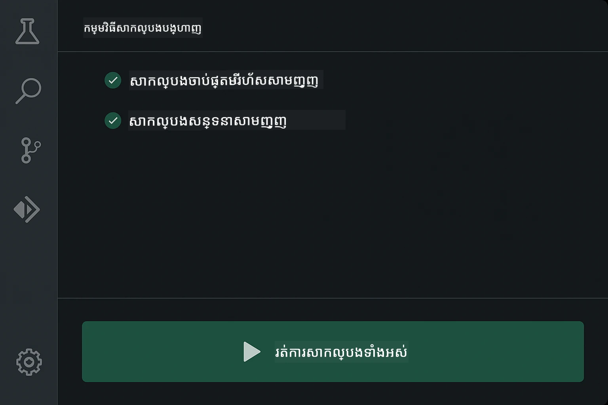
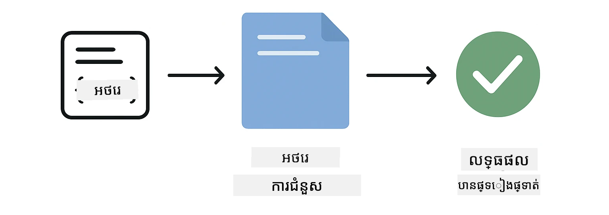
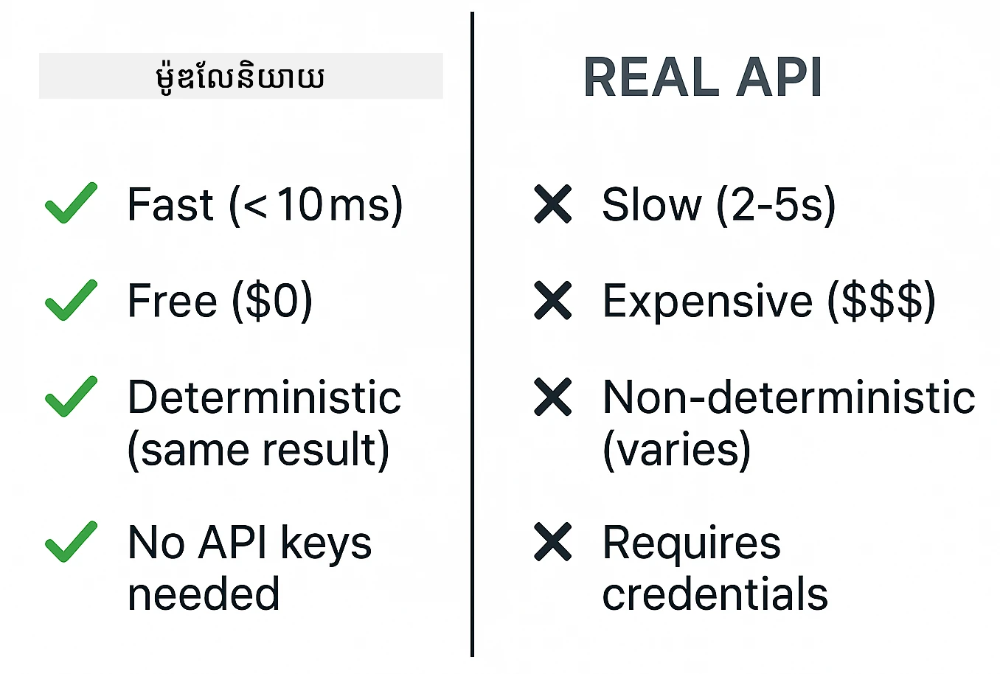
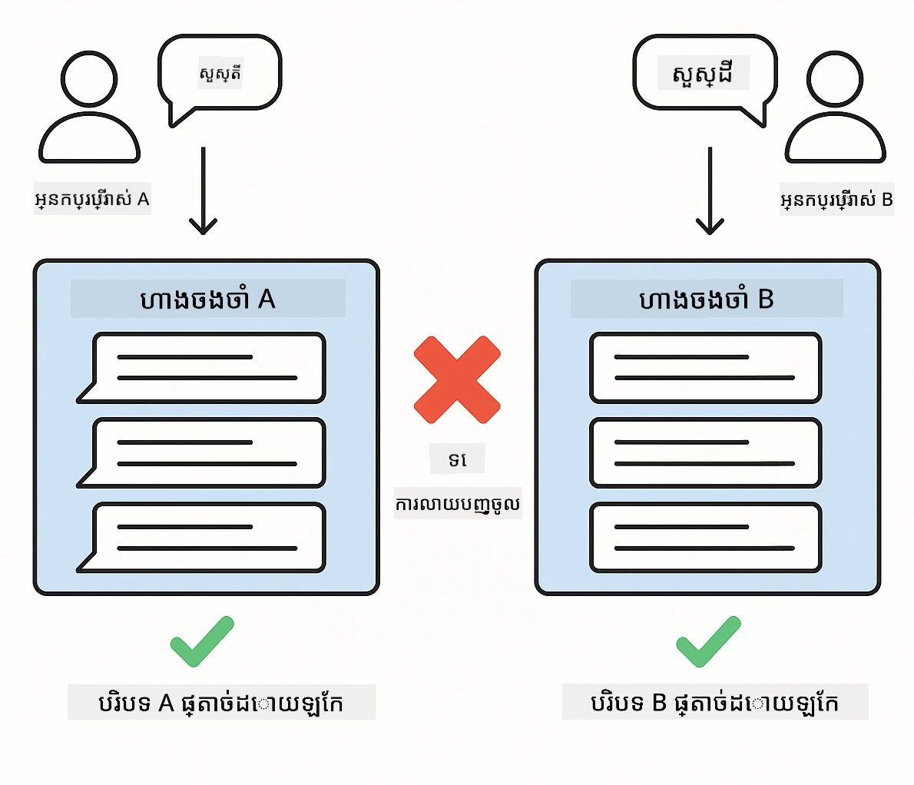
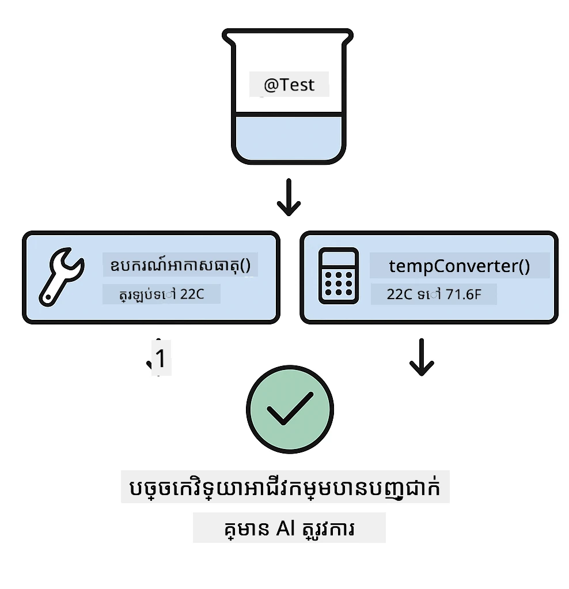
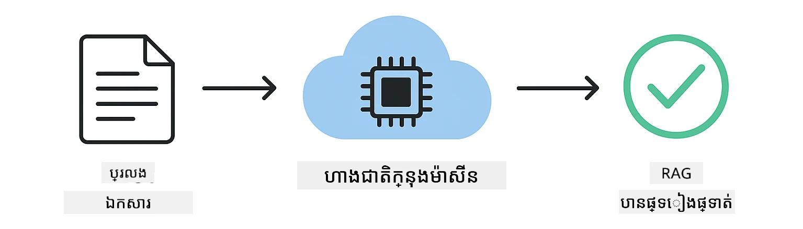

# ការធ្វើតេស្តកម្មវិធី LangChain4j

## ប្រធានបទ

- [ចាប់ផ្តើមយ៉ាងឆាប់រហ័ស](#ចាប់ផ្តើមយ៉ាងឆាប់រហ័ស)
- [អ្វីដែលការធ្វើតេស្តគ្របដណ្តប់](#អ្វីដែលការធ្វើតេស្តគ្របដណ្តប់)
- [ការបង្ហាញការធ្វើតេស្ត](#ការរត់ការធ្វើតេស្ត)
- [ការធ្វើតេស្តក្នុង VS Code](#ការរត់ការធ្វើតេស្តក្នុង-vs-code)
- [គំរូការធ្វើតេស្ត](#គំរូការធ្វើតេស្ត)
- [ទស្សនៈការធ្វើតេស្ត](#ទស្សនៈការធ្វើតេស្ត)
- [ជំហានបន្ទាប់](#ជំហានបន្ទាប់)

មគ្គុទេសក៍នេះនាំអ្នកឆ្លងកាត់ការធ្វើតេស្តដែលបង្ហាញពីរបៀបធ្វើតេស្តកម្មវិធី AI ដោយមិនត្រូវការទៅកាន់កូនសោ API ឬសេវាកម្មខាងក្រៅ។

## ចាប់ផ្តើមយ៉ាងឆាប់រហ័ស

រត់ការធ្វើតេស្តទាំងអស់ជាមួយពាក្យបញ្ជាពីរយៈពេលតែមួយ:

**Bash:**
```bash
mvn test
```

**PowerShell:**
```powershell
mvn --% test
```

ពេលដំណើរការតេស្តទាំងអស់ជាលទ្ធផលជោគជ័យ អ្នកគួរបង្ហាញចេញដូចក្នុងរូបថតអេក្រង់ខាងក្រោម — ការធ្វើតេស្តមិនមានកំហុស។



*ការបង្ហាញលទ្ធផលសម្រេចបានពោលពីការធ្វើតេស្តទាំងអស់ជោគជ័យដោយគ្មានកំហុសណាមួយ*

## អ្វីដែលការធ្វើតេស្តគ្របដណ្តប់

វគ្គនេះផ្តោតលើ **ការធ្វើតេស្តឯកតា** ដែលរត់នៅក្នុងស៊ើបការណ៍របស់អ្នក។ ការធ្វើតេស្តមួយៗបង្ហាញពីមូលដ្ឋានគំនិត LangChain4j ក្នុងលក្ខណៈឯកសារពីរ។ ប៉ុរក្សាទិកក្ខណៈមួយព្យាង្គខាងក្រោមបង្ហាញកន្លែងដែលការធ្វើតេស្តឯកតាវាយតម្លៃ — ពួកវាជាគ្រឹះរហ័ស ទុកចិត្តបាន ដែលយុទ្ធសាស្ត្រធ្វើតេស្តផ្សេងទៀតរបស់អ្នកអាចសាងសង់។



*ព្យាង្គការធ្វើតេស្តបង្ហាញពីតុល្យភាពរវាងការធ្វើតេស្តឯកតា (រហ័ស បែកប្រែកឯកត្តា), ការធ្វើតេស្តរួម (ធាតុពិត), និងការធ្វើតេស្តចុងក្រោយ។ ការបណ្តុះបណ្តាលនេះគ្របដណ្តប់ការធ្វើតេស្តឯកតា។*

| ម៉ូឌុល | ការធ្វើតេស្ត | ការផ្តោត | ឯកសារសំខាន់ៗ |
|--------|-------------|----------|------------------|
| **00 - ចាប់ផ្តើមយ៉ាងឆាប់រហ័ស** | 6 | គំរូផ្ទាំងបញ្ចូល និងការប្ដូរព័ត៌មានអថេរ | `SimpleQuickStartTest.java` |
| **01 - ការណែនាំ** | 8 | អនុស្សាវរីយ៍ជជែក និងការចាប់ផ្តើមជជែកមានស្ថានភាព | `SimpleConversationTest.java` |
| **02 - វិជ្ជាជីវៈផ្នែកផ្ទាំងបញ្ចូល** | 12 | គំរូ GPT-5.2, កម្រិតប្រាថ្នា, លទ្ធផលមានរចនាសម្ព័ន្ធ | `SimpleGpt5PromptTest.java` |
| **03 - RAG** | 10 | ការបញ្ចូលឯកសារ, embedding, ស្វែងរកស្រដៀង | `DocumentServiceTest.java` |
| **04 - ឧបករណ៍** | 12 | ការហៅមុខងារ និងច្រកឧបករណ៍ | `SimpleToolsTest.java` |
| **05 - MCP** | 8 | ព protocol Model Context ព្យាយាមជាមួយការបញ្ជូន stdio | `SimpleMcpTest.java` |

## ការរត់ការធ្វើតេស្ត

**រត់ការធ្វើតេស្តទាំងអស់ពីដើម:**

**Bash:**
```bash
mvn test
```

**PowerShell:**
```powershell
mvn --% test
```

**រត់ការធ្វើតេស្តសម្រាប់ម៉ូឌុលជាក់លាក់:**

**Bash:**
```bash
cd 01-introduction && mvn test
# ឬពីរ៉ូត
mvn test -pl 01-introduction
```

**PowerShell:**
```powershell
cd 01-introduction; mvn --% test
# ឬពី root
mvn --% test -pl 01-introduction
```

**រត់ថ្នាក់តេស្តតែមួយ:**

**Bash:**
```bash
mvn test -Dtest=SimpleConversationTest
```

**PowerShell:**
```powershell
mvn --% test -Dtest=SimpleConversationTest
```

**រត់វិធីសាស្ត្រធ្វើតេស្តជាក់លាក់:**

**Bash:**
```bash
mvn test -Dtest=SimpleConversationTest#ត្រូវរក្សាប្រវត្តិសន្ទស្សន៍ហេតុផល
```

**PowerShell:**
```powershell
mvn --% test -Dtest=SimpleConversationTest#គួរតែរក្សាប្រវត្តិការសន្ទនា
```

## ការរត់ការធ្វើតេស្តក្នុង VS Code

បើអ្នកកំពុងប្រើ Visual Studio Code, Test Explorer ផ្តល់ផ្ទាំងកំហាត់សម្រាប់រត់និងដាក់តំបន់ហាំខូចការធ្វើតេស្ត។



*VS Code Test Explorer បង្ហាញដើមឈើតេស្តជាមួយថ្នាក់ Java ទាំងអស់ និងវិធីសាស្ត្រធ្វើតេស្តឯកជន*

**ដើម្បីរត់ការធ្វើតេស្តក្នុង VS Code៖**

1. បើក Test Explorer ដោយចុចរូបតំណាងខាំប៊ើក នៅ Activity Bar
2. វែងឆ្ងាយដើមឈើទីតានឹងឃើញម៉ូឌុលនិងថ្នាក់ធ្វើតេស្តទាំងអស់
3. ចុចប៊ូតុងលេងពីជាប់ក្បែរ test ដើម្បីរត់វាឯកជន
4. ចុច "Run All Tests" ដើម្បីបំពេញការតេស្តទាំងមូល
5. ស្ដាំប៊ូតុង test មួយណាមួយ ហើយជ្រើស "Debug Test" ដើម្បីដាក់ចំណុចបំបែក និងដើរតាមកូដ

Test Explorer បង្ហាញសញ្ញាស្រីនែការពិនិត្យជោគជ័យនិងផ្ដល់សារ​ការខូចលក្ខណៈពិសេសពេលធ្វើតេស្តបរាជ័យ។

## គំរូការធ្វើតេស្ត

### គំរូទី 1៖ ការធ្វើតេស្តគំរូផ្ទាំងបញ្ចូល

គំរូសាមញ្ញបំផុតធ្វើតេស្តគំរូផ្ទាំងបញ្ចូលដោយមិនហៅម៉ូដែល AI ទាំងអស់ទេ។ អ្នកត្រួតពិនិត្យថាការប្តូរព័ត៌មានអថេរធ្វើការបំពេញបានត្រឹមត្រូវ និងគំរូមានទ្រង់ទ្រាយត្រឹមត្រូវ។



*ការធ្វើតេស្តគំរូផ្ទាំងបញ្ចូលបង្ហាញលំហូរការប្តូរព័ត៌មានអថេរ៖ គំរូជាមួយចន្លោះ → តម្លៃអនុវត្ត → លទ្ធផលគំរូបានបញ្ជាក់*

```java
@Test
@DisplayName("Should format prompt template with variables")
void testPromptTemplateFormatting() {
    PromptTemplate template = PromptTemplate.from(
        "Best time to visit {{destination}} for {{activity}}?"
    );
    
    Prompt prompt = template.apply(Map.of(
        "destination", "Paris",
        "activity", "sightseeing"
    ));
    
    assertThat(prompt.text()).isEqualTo("Best time to visit Paris for sightseeing?");
}
```

តេស្តនេះស្នាក់នៅក្នុង `00-quick-start/src/test/java/com/example/langchain4j/quickstart/SimpleQuickStartTest.java`។

**រត់វា:**

**Bash:**
```bash
cd 00-quick-start && mvn test -Dtest=SimpleQuickStartTest#ពិនិត្យមើលការរៀបចំទំរង់គំរូសំណួរ
```

**PowerShell:**
```powershell
cd 00-quick-start; mvn --% test -Dtest=SimpleQuickStartTest#ពិនិត្យមើលការចាក់ប្លង់ទំរង់Prompt
```

### គំរូទី 2៖ ការសម្ងោលម៉ូដែលភាសា

ពេលធ្វើតេស្តនូវលូដឹងជជែក ប្រើ Mockito ដើម្បីបង្កើតម៉ូដែលក្លែងបន្លំ ដែលត្រឡប់ចម្លើយបានកំណត់ជាមុន។ នេះធ្វើឲ្យការធ្វើតេស្តរហ័ស មិនគិតថ្លៃ និងមានលទ្ធផលកំណត់។



*ការប្រៀបធៀបបង្ហាញមូលហេតុដែលមូកគឺពេញចិត្តសម្រាប់ការធ្វើតេស្ត៖ វារហ័ស មិនគិតថ្លៃ កំណត់លទ្ធផល ហើយមិនត្រូវការកូនសោ API*

```java
@ExtendWith(MockitoExtension.class)
class SimpleConversationTest {
    
    private ConversationService conversationService;
    
    @Mock
    private OpenAiOfficialChatModel mockChatModel;
    
    @BeforeEach
    void setUp() {
        ChatResponse mockResponse = ChatResponse.builder()
            .aiMessage(AiMessage.from("This is a test response"))
            .build();
        when(mockChatModel.chat(anyList())).thenReturn(mockResponse);
        
        conversationService = new ConversationService(mockChatModel);
    }
    
    @Test
    void shouldMaintainConversationHistory() {
        String conversationId = conversationService.startConversation();
        
        ChatResponse mockResponse1 = ChatResponse.builder()
            .aiMessage(AiMessage.from("Response 1"))
            .build();
        ChatResponse mockResponse2 = ChatResponse.builder()
            .aiMessage(AiMessage.from("Response 2"))
            .build();
        ChatResponse mockResponse3 = ChatResponse.builder()
            .aiMessage(AiMessage.from("Response 3"))
            .build();
        
        when(mockChatModel.chat(anyList()))
            .thenReturn(mockResponse1)
            .thenReturn(mockResponse2)
            .thenReturn(mockResponse3);

        conversationService.chat(conversationId, "First message");
        conversationService.chat(conversationId, "Second message");
        conversationService.chat(conversationId, "Third message");

        List<ChatMessage> history = conversationService.getHistory(conversationId);
        assertThat(history).hasSize(6); // សារអ្នកប្រើ 3 សារ AI 3
    }
}
```

គំរូនេះវេចខ្ចប់នៅក្នុង `01-introduction/src/test/java/com/example/langchain4j/service/SimpleConversationTest.java`។ មូកធានាថាការជួញដូរចំណាំមានភាពជាប់លាប់ ដូច្នេះអ្នកអាចត្រួតពិនិត្យការគ្រប់គ្រងអនុស្សាវរីយ៍បានត្រឹមត្រូវ។

### គំរូទី 3៖ ការធ្វើតេស្តការរឹតបន្តឹងជជែក

អនុស្សាវរីយ៍ជជែកត្រូវរក្សាការបំបែកអ្នកប្រើប្រាស់ជាច្រើន។ តេស្តនេះបញ្ជាក់ថាជជែកមិនរួមបញ្ចូលបរិបទគ្នា។



*ការធ្វើតេស្តការរឹតបន្តឹងជជែកបង្ហាញផ្ទាំងចងចាំផ្ដាច់ពីរបស់អ្នកប្រើប្រាស់ផ្សេងៗ ដើម្បីការពារមិនអោយបរិបទរួមបញ្ចូលគ្នា*

```java
@Test
void shouldIsolateConversationsByid() {
    String conv1 = conversationService.startConversation();
    String conv2 = conversationService.startConversation();
    
    ChatResponse mockResponse = ChatResponse.builder()
        .aiMessage(AiMessage.from("Response"))
        .build();
    when(mockChatModel.chat(anyList())).thenReturn(mockResponse);

    conversationService.chat(conv1, "Message for conversation 1");
    conversationService.chat(conv2, "Message for conversation 2");

    List<ChatMessage> history1 = conversationService.getHistory(conv1);
    List<ChatMessage> history2 = conversationService.getHistory(conv2);
    
    assertThat(history1).hasSize(2);
    assertThat(history2).hasSize(2);
}
```

ជជែកនីមួយៗរក្សាប្រវត្តិសាស្ត្រឯកតាពិបាករបស់ខ្លួន។ នៅប្រព័ន្ធផលិតផល ការរឹតបន្តឹងនេះមានសារៈសំខាន់សម្រាប់កម្មវិធីមនុស្សច្រើន។

### គំរូទី 4៖ ការធ្វើតេស្តឧបករណ៍ដោយឯករាជ្យ

ឧបករណ៍គឺជាឧបករណ៍ដែល AI អាចហៅបាន។ ធ្វើតេស្តពួកវាត្រូវតែដូចជា វាធ្វើការងារពិតដោយមិនពឹងផ្អែកលើការសម្រេចចិត្ត AI។



*ការធ្វើតេស្តឧបករណ៍ដោយឯករាជ្យបង្ហាញពីការប្រតិបត្តិមូកឧបករណ៍ដោយគ្មានការហៅ AI ដើម្បីបញ្ជាក់លទ្ធផលអាជីវកម្ម*

```java
@Test
void shouldConvertCelsiusToFahrenheit() {
    TemperatureTool tempTool = new TemperatureTool();
    String result = tempTool.celsiusToFahrenheit(25.0);
    assertThat(result).containsPattern("77[.,]0°F");
}

@Test
void shouldDemonstrateToolChaining() {
    WeatherTool weatherTool = new WeatherTool();
    TemperatureTool tempTool = new TemperatureTool();

    String weatherResult = weatherTool.getCurrentWeather("Seattle");
    assertThat(weatherResult).containsPattern("\\d+°C");

    String conversionResult = tempTool.celsiusToFahrenheit(22.0);
    assertThat(conversionResult).containsPattern("71[.,]6°F");
}
```

ការធ្វើតេស្តទាំងនេះពី `04-tools/src/test/java/com/example/langchain4j/agents/tools/SimpleToolsTest.java` ផ្ទៀងផ្ទាត់ហេតុផលឧបករណ៍ដោយគ្មានការចូលរួមនៃ AI។ ឧទាហរណ៍ច្រកបង្ហាញរបៀបលទ្ធផលឧបករណ៍មួយចាក់ចូលក្នុងបញ្ចូលរបស់មួយផ្សេងទៀត។

### គំរូទី 5៖ ការធ្វើតេស្ត RAG ក្នុងអនុស្សា

ប្រព័ន្ធ RAG ផ្នែកតំណរភាពត្រូវការពិធីការទិន្នន័យហ្គេហ្វ និងសេវាកម្ម embedding។ គំរូអនុស្សាវរីយ៍បន្ថែមឲ្យអ្នកអាចធ្វើតេស្តសមាសភាគទាំងមូលដោយគ្មានការពឹងផ្អែកខាងក្រៅ។



*លំហូរការធ្វើតេស្ត RAG ក្នុងអនុស្សាវរីយ៍បង្ហាញការបំបែកឯកសារ, រក្សាទុក embedding និងស្វែងរកស្រដៀងដោយមិនចាំបាច់មុខម៉ូដែលទិន្នន័យ*

```java
@Test
void testProcessTextDocument() {
    String content = "This is a test document.\nIt has multiple lines.";
    InputStream inputStream = new ByteArrayInputStream(content.getBytes(StandardCharsets.UTF_8));
    
    DocumentService.ProcessedDocument result = 
        documentService.processDocument(inputStream, "test.txt");

    assertNotNull(result);
    assertTrue(result.segments().size() > 0);
    assertEquals("test.txt", result.segments().get(0).metadata().getString("filename"));
}
```

តេស្តនេះពី `03-rag/src/test/java/com/example/langchain4j/rag/service/DocumentServiceTest.java` បង្កើតឯកសារមួយក្នុងអនុស្សាវរីយ៍ ហើយផ្ទៀងផ្ទាត់ការបំបែក និងដំណើរការព័ត៌មាន metadata ។

### គំរូទី 6៖ ការធ្វើតេស្តការរួមបញ្ចូល MCP

ម៉ូឌុល MCP ធ្វើតេស្តការរួមបញ្ចូល Model Context Protocol ដោយប្រើការបញ្ជូន stdio។ តេស្តទាំងនេះធានាថាកម្មវិធីរបស់អ្នកអាចបង្កើត និងទំនាក់ទំនងជាមួយម៉ាស៊ីនបម្រើ MCP ក្នុងរូបភាព subprocess។

តេស្តនៅក្នុង `05-mcp/src/test/java/com/example/langchain4j/mcp/SimpleMcpTest.java` ផ្ទៀងផ្ទាត់ឥរិយាបថអតិថិជន MCP។

**រត់ពួកវា:**

**Bash:**
```bash
cd 05-mcp && mvn test
```

**PowerShell:**
```powershell
cd 05-mcp; mvn --% test
```

## ទស្សនៈការធ្វើតេស្ត

ធ្វើតេស្តកូដរបស់អ្នក មិនមែន AI ទេ។ ការធ្វើតេស្តរបស់អ្នកគួរតែផ្ទៀងផ្ទាត់កូដដែលអ្នកបានសរសេរ ដោយពិនិត្យថាគំរូត្រូវបានកសាងយ៉ាងដូចម្តេច, គ្រប់គ្រងអនុស្សាវរីយ៍យ៉ាងដូចម្តេច, និងរបៀបដែលឧបករណ៍ដំណើរការ។ ចម្លើយ AI ផ្លាស់ប្តូរហើយមិនគួរត្រូវបានប្រើក្នុងការបញ្ជាក់ការធ្វើតេស្តទេ។ សួរខ្លួនឯងថាគំរូផ្ទាំងបញ្ចូលរបស់អ្នកប្ដូរព័ត៌មានអថេរបានត្រឹមត្រូវឬអត់ មិនមែនថា AI ផ្តល់ចម្លើយត្រូវឬអត់។

ប្រើមូកសម្រាប់ម៉ូដែលភាសា។ ពួកវាជាឧបករណ៍ខាងក្រៅដែលយឺត, ថ្លៃថ្លា, និងមិនកំណត់លទ្ធផល។ ការសម្ងោលធ្វើឲ្យការធ្វើតេស្តរហ័សមានម៉ិលលីវិនាទីជំនួសវិនាទី, មិនគិតថ្លៃដោយគ្មានការចំណាយ API, និងកំណត់លទ្ធផលជាការងារ។

រក្សាឲ្យការធ្វើតេស្តឯករាជ្យ។ តេស្តនីមួយៗគួរតែបង្កើតទិន្នន័យរបស់ខ្លួន មិនពឹងផ្អែកលើតេស្តផ្សេងទៀត ហើយសម្អាតក្រោយខ្លួន។ តេស្តគួរតែជោគជ័យមិនគិតពីលំដាប់ដំណើរការ។

ធ្វើតេស្តករណីជិតមុខលំបាកក្រៅផ្លូវយ៉ាងសប្បាយ។ សាកល្បងការបញ្ចូលទទេ, ទំហំធំ, តួអក្សរពិសេស, ប៉ារ៉ាម៉ែត្រមិនត្រឹមត្រូវ, និងលក្ខខណ្ឌលំបាក។ ពួកវាញឹកញាប់បង្ហាញកំហុសដែលប្រើប្រាស់ធម្មតាមិនបង្ហាញទេ។

ប្រើឈ្មោះពិពណ៌នា។ ប្រៀបធៀប `shouldMaintainConversationHistoryAcrossMultipleMessages()` ជាមួយ `test1()`។ មួយដំបូងប្រាប់អ្នកយ៉ាងច្បាស់ថាអ្វីកំពុងត្រូវបានធ្វើតេស្ត បង្កើតការដោះសោតកំហុសកាន់តែងាយស្រួល។

## ជំហានបន្ទាប់

ឥឡូវលោកអ្នកយល់ពីគំរូការធ្វើតេស្ត បណ្តល់នូវការលើកទឹកចិត្តស្វែងយល់ជ្រាលជ្រៅទៀតនៅក្នុងម៉ូឌុលនីមួយៗ៖

- **[00 - ចាប់ផ្តើមយ៉ាងឆាប់រហ័ស](../00-quick-start/README.md)** - ចាប់ផ្តើមជាមួយគំរូផ្ទាំងបញ្ចូលមូលដ្ឋាន
- **[01 - ការណែនាំ](../01-introduction/README.md)** - រៀនការគ្រប់គ្រងអនុស្សាវរីយ៍ជជែក
- **[02 - វិជ្ជាជីវៈផ្នែកផ្ទាំងបញ្ចូល](../02-prompt-engineering/README.md)** - ជំនាញគំរូ GPT-5.2
- **[03 - RAG](../03-rag/README.md)** - កសាងប្រព័ន្ធបង្កើនការស្វែងរក
- **[04 - ឧបករណ៍](../04-tools/README.md)** - ដំណើរការហៅមុខងារនិងច្រកឧបករណ៍
- **[05 - MCP](../05-mcp/README.md)** - រួមបញ្ចូល Model Context Protocol

README របស់ម៉ូឌុលនីមួយៗផ្តល់នូវការពិពណ៌នាត្រឹមត្រូវពាក់ព័ន្ធនឹងកំណត់ការធ្វើតេស្តនៅទីនេះ។

---

**រុករក៖** [← ថយក្រោយទៅមុខ](../README.md)

---

<!-- CO-OP TRANSLATOR DISCLAIMER START -->
**ការជូនដំណឹង**៖  
ឯកសារនេះត្រូវបានបកប្រែក្នុងជំនួយសេវាកម្មបកប្រែ AI [Co-op Translator](https://github.com/Azure/co-op-translator)។ ខណៈពេលដែលយើងខិតខំបំពេញភាពត្រឹមត្រូវ សូមយល់ដឹងថាការបកប្រែដោយស្វ័យប្រវត្តិក្នុងខ្លះអាចមានកំហុស ឬភាពមិនត្រឹមត្រូវ។ ឯកសារដើមនៅភាសាទ្រព្យសម្បត្តិរបស់វាគួរត្រូវបានគេយកជាទិដ្ឋភាពផ្លូវការ។ សម្រាប់ព័ត៌មានចំបង ការបកប្រែដោយអ្នកជំនាញមនុស្សត្រូវបានផ្តល់អនុសាសន៍។ យើងមិនទទួលខុសត្រូវចំពោះការយល់ច្រឡំ ឬការបកប្រែខុសប្លែកណាមួយដែលកើតឡើងពីការប្រើប្រាស់ការបកប្រែនេះទេ។
<!-- CO-OP TRANSLATOR DISCLAIMER END -->