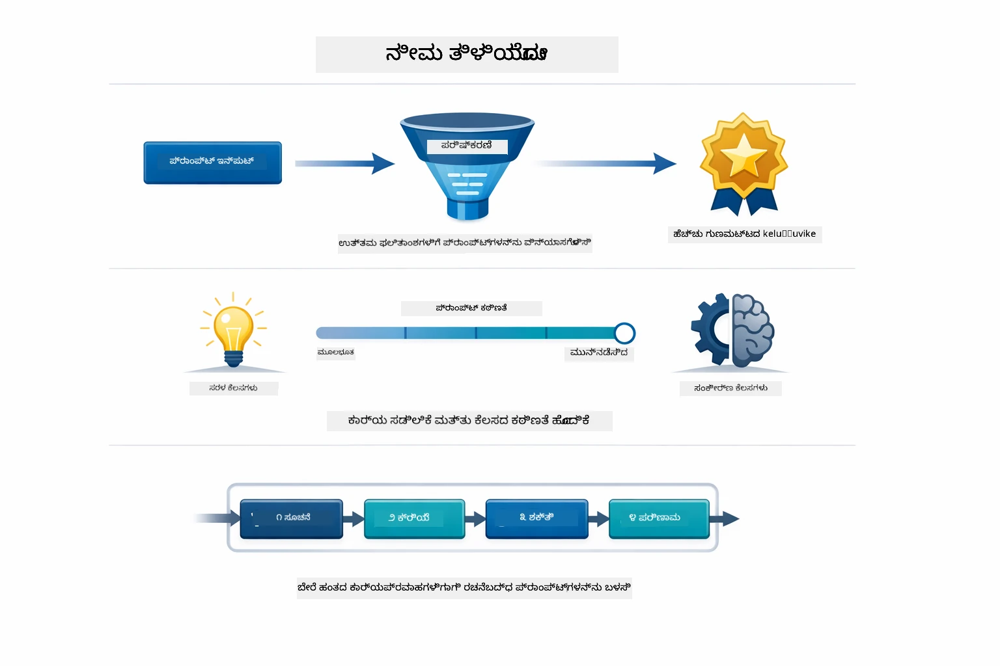
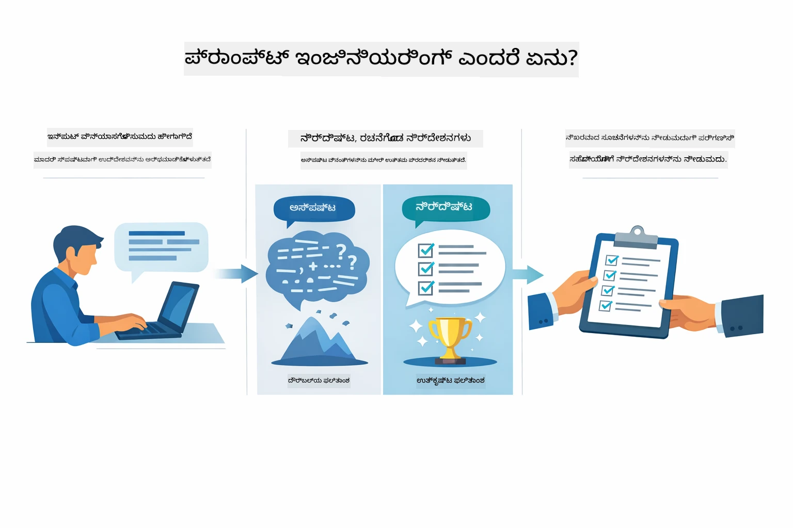
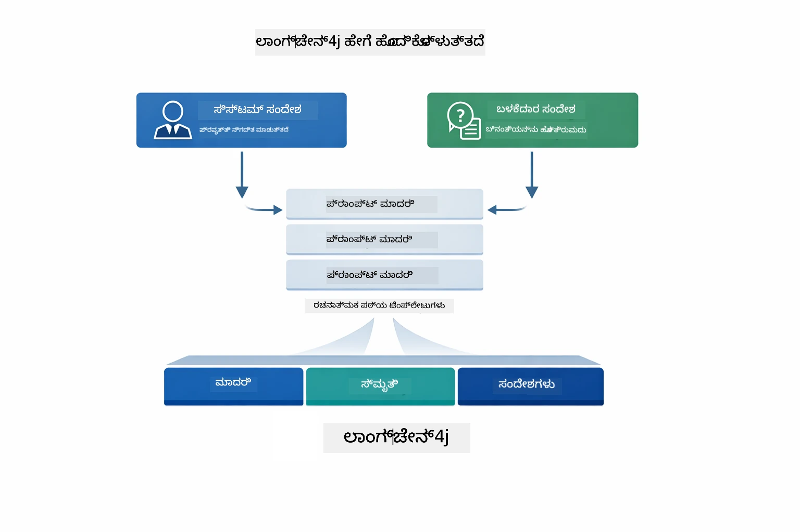
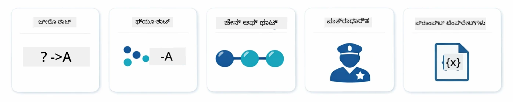
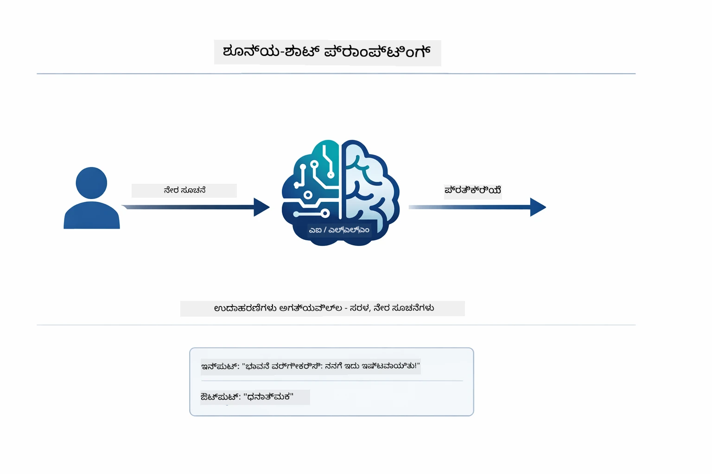
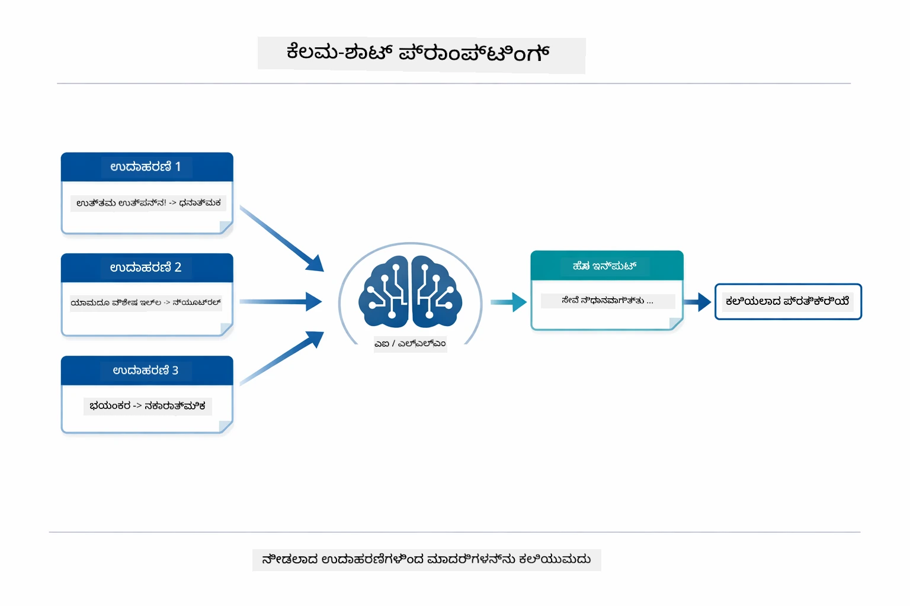
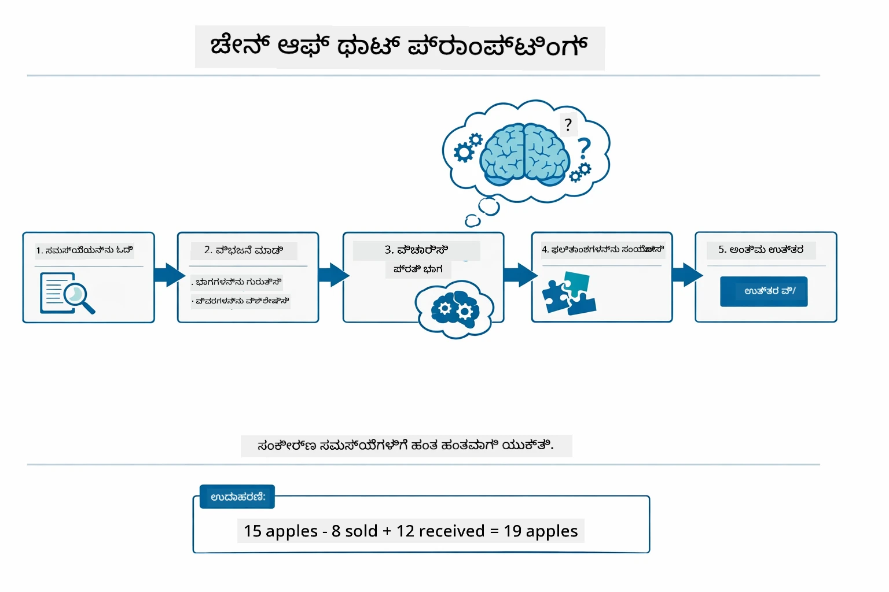
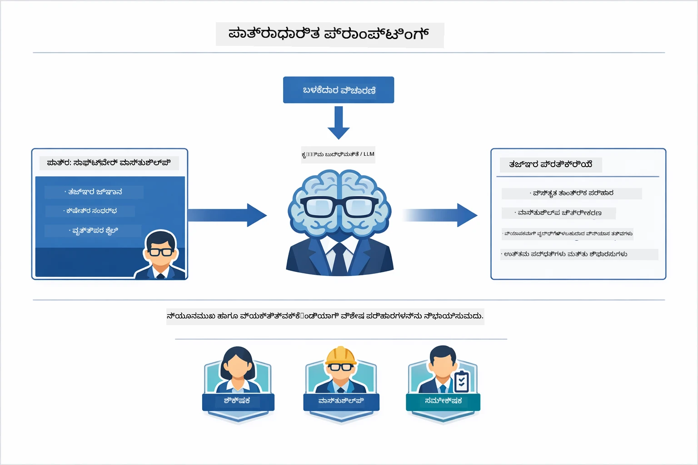
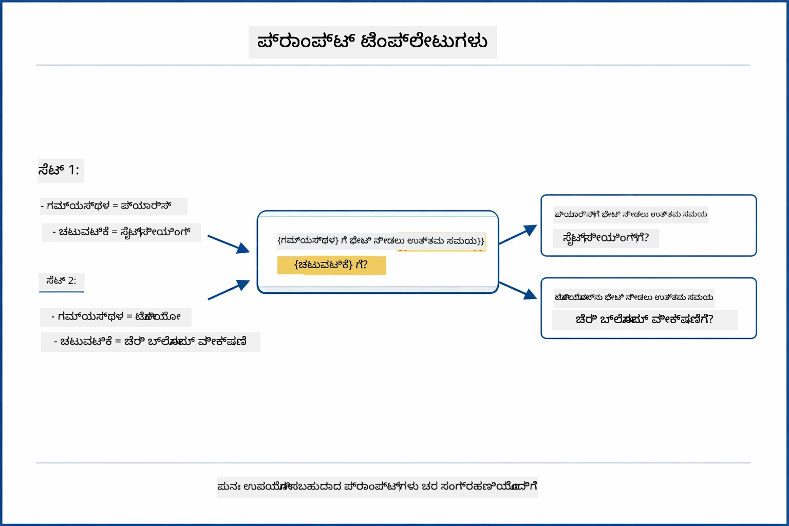
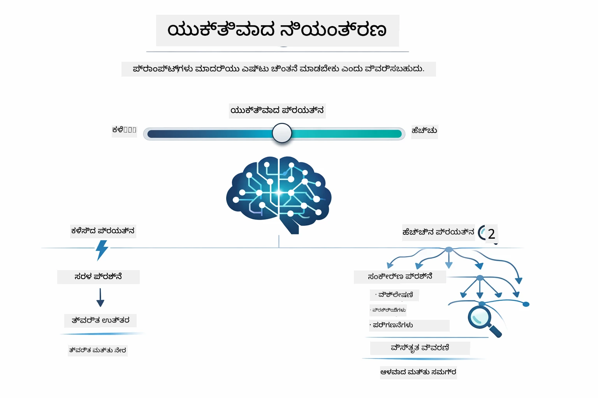

# Module 02: GPT-5.2 ಮೂಲಕ ಪ್ರಾಂಪ್ಟ್ ಎಂಜಿನಿಯರಿಂಗ್

## ವಿಷಯಸೂಚಿ

- [ವೀಡಿಯೊ ವಾಕ್‌ಥ್ರೂ](../../../02-prompt-engineering)
- [ನೀವು ಏನು ಕಲಿಯೋದು](../../../02-prompt-engineering)
- [ಪ್ರಕ್ರಿಯಾನಿರ್ದೇಶಗಳು](../../../02-prompt-engineering)
- [ಪ್ರಾಂಪ್ಟ್ ಎಂಜಿನಿಯರಿಂಗ್ ಅರ್ಥಮಾಡಿಕೊಳ್ಳುವುದು](../../../02-prompt-engineering)
- [ಪ್ರಾಂಪ್ಟ್ ಎಂಜಿನಿಯರಿಂಗ್ ಮೂಲಭೂತಗಳು](../../../02-prompt-engineering)
  - [ಝೀರೋ-ಶಾಟ್ ಪ್ರಾಂಪ್ಟಿಂಗ್](../../../02-prompt-engineering)
  - [ಫ್ಯೂ-ಶಾಟ್ ಪ್ರಾಂಪ್ಟಿಂಗ್](../../../02-prompt-engineering)
  - [ಚೈನ್ ಆಫ್ ಥಾಟ್](../../../02-prompt-engineering)
  - [ರೋಲ್-ಬೇಸ್‌ಡ್ ಪ್ರಾಂಪ್ಟಿಂಗ್](../../../02-prompt-engineering)
  - [ಪ್ರಾಂಪ್ಟ್ ಟೆಂಪ್ಲೇಟ್ಸ್](../../../02-prompt-engineering)
- [ಅಧಿಕ ಸುಧಾರಿತ ಮಾದರಿಗಳನ್ನು](../../../02-prompt-engineering)
- [ಇತ್ತೀಚಿನ Azure ಸಂಪನ್ಮೂಲಗಳನ್ನು ಬಳಸುವುದು](../../../02-prompt-engineering)
- [ಯೋಜನೆಗಳ स्क्रीनಶಾಟ್‌ಗಳು](../../../02-prompt-engineering)
- [ಮಾದರಿಗಳನ್ನು ಅನ್ವೇಷಿಸುವುದು](../../../02-prompt-engineering)
  - [ಕಡಿಮೆ ಮತ್ತು ಹೆಚ್ಚಿನ ಆಸಕ್ತಿ](../../../02-prompt-engineering)
  - [ಕಾರ್ಯ ನಿರ್ವಹಣೆ (ಟೂಲ್ ಪ್ರೀಅ್ಯಂಬಲ್ಸ್)](../../../02-prompt-engineering)
  - [ಸ್ವ-ಪ್ರತಿಬಿಂಬಿಸುವ ಕೋಡ್](../../../02-prompt-engineering)
  - [ಸಂರಚಿತ ವಿಶ್ಲೇಷಣೆ](../../../02-prompt-engineering)
  - [ಬಹು-ತಿರುವು ಸಂವಾದ](../../../02-prompt-engineering)
  - [ಹಂತ ಹಂತವಾಗಿ ತರ್ಕ](../../../02-prompt-engineering)
  - [ನಿಯಂತ್ರಿತ ಔಟ್‌ಪುಟ್](../../../02-prompt-engineering)
- [ನೀವು ನಿಜವಾಗಿಯೂ ಕಲಿಯೋದು](../../../02-prompt-engineering)
- [ಮುಂದಿನ ಹಂತಗಳು](../../../02-prompt-engineering)

## ವೀಡಿಯೊ ವಾಕ್‌ಥ್ರೂ

ಈ ಸಹಜ ಅಧಿವೇಶನವನ್ನು ವೀಕ್ಷಿಸಿ, ಇದು ಈ ಮಾಯೂಕಳನ್ನು ಪ್ರಾರಂಭಿಸುವ ವಿಧಾನವನ್ನು ವಿವರಿಸುತ್ತದೆ: [Prompt Engineering with LangChain4j - Live Session](https://www.youtube.com/live/PJ6aBaE6bog?si=LDshyBrTRodP-wke)

## ನೀವು ಏನು ಕಲಿಯೋದು



ಹಿಂದಿನ ಮಡ್ಯೂಲ್‌ನಲ್ಲಿ ನೀವು ಮೆಮೊರಿ ಹೇಗೆ ಸಂವಾದಾತ್ಮಕ AI ಗೆ ಶಕ್ತಿ ನೀಡುತ್ತದೆ ಎಂಬುದನ್ನು ನೋಡಿದ್ದೀರಿ ಮತ್ತು ಮೂಲ ಸಂವಹನಕ್ಕಾಗಿ GitHub ಮಾದರಿಗಳನ್ನು ಬಳಸಿದ್ದೀರಿ. ಈಗ ನಾವು ನೀವು ಯೋಚಿಸುತ್ತದೆ ಹೇಗೆ — ಪ್ರಾಂಪ್ಟ್‌ಗಳೇ — ಕುರಿತು ಗಮನಹರಿಸುತ್ತೇವೆ, Azure OpenAI ನ GPT-5.2 ಬಳಸಿ. ನೀವು ಪ್ರಾಂಪ್ಟ್‌ಗಳನ್ನು ರಚಿಸುವ ವಿಧಾನವು ಪ್ರತಿಕ್ರಿಯೆಗಳ ಗುಣಮಟ್ಟದ ಮೇಲೆ ಗಂಭೀರ ಪ್ರಭಾವ ಬೀರುತ್ತದೆ. ನಾವು ಮೂಲಭೂತ ಪ್ರಾಂಪ್ಟಿಂಗ್ ತಂತ್ರಗಳನ್ನು ಪರಿಶೀಲಿಸುವುದರಿಂದ ಪ್ರಾರಂಭಿಸಿ, ನಂತರ GPT-5.2 ಯ ಶಕ್ತಿಗಳನ್ನು ಸಂಪೂರ್ಣವಾಗಿ ಬಳಸುವ ಎಂಟು ಸುಧಾರಿತ ಮಾದರಿಗಳ ಕಡೆಗೆ ಸಾಗುತ್ತೇವೆ.

ನಾವು GPT-5.2 ಬಳಕೆ ಮಾಡಿಕೊಳ್ಳುತ್ತೇವೆ ಏಕೆಂದರೆ ಇದು ತರ್ಕ ನಿಯಂತ್ರಣವನ್ನು ಪರಿಚಯಿಸುತ್ತದೆ - ನೀವು ಮಾದರಿಗೆ ಉತ್ತರಿಸುವ ಮುಂಚೆ ಎಷ್ಟು ಚಿಂತನೆ ಮಾಡಬೇಕೆಂದು ಹೇಳಬಹುದು. ಇದು ವಿವಿಧ ಪ್ರಾಂಪ್ಟಿಂಗ್ ತಂತ್ರಗಳನ್ನು ಸ್ಪಷ್ಟಗೊಳಿಸುತ್ತದೆ ಮತ್ತು ಯಾವಾಗ ಯಾವ ವಿಧಾನ ಬಳಸುಬೇಕೆಂದು 이해ಸಲು ಸಹಾಯ ಮಾಡುತ್ತದೆ. GitHub ಮಾದರಿಗಳ ಹೋಲಿಕೆಯಲ್ಲಿ Azure ನ ಕಡಿಮೆ ದರ ಮಿತಿಗಳನ್ನು ಕೂಡ ನಾವು ಉಪಯೋಗಿಸುತ್ತೇವೆ.

## ಪ್ರಕ್ರಿಯಾನಿರ್ದೇಶಗಳು

- ಮಡ್ಯೂಲ್ 01 ಪೂರ್ಣಗೊಳಿಸಲಾಗಿದೆ (Azure OpenAI ಸಂಪನ್ಮೂಲಗಳು ನಿಯೋಜಿಸಲಾಗಿದೆ)
- ರೂಟ್ ಡೈರೆಕ್ಟರಿಯಲ್ಲಿ `.env` ಫೈಲ್ ಆಗಿದ್ದು, Azure ದೃಢೀಕರಣಗಳಿವೆ (`azd up` ಮೂಲಕ ನಿರ್ಮಿತವಾಗಿದೆ ಮಡ್ಯೂಲ್ 01 ನಲ್ಲಿ)

> **ಟಿಪ್ಪಣಿ:** ನೀವು ಮಡ್ಯೂಲ್ 01 ಪೂರ್ಣಗೊಳಿಸದಿದ್ದಲ್ಲಿ, ಮೊದಲಿಗೆ ಅಲ್ಲಿ ನೀಡಲಿರುವ ನಿಯೋಜನೆ ಸೂಚನೆಗಳನ್ನು ಅನುಸರಿಸಿ.

## ಪ್ರಾಂಪ್ಟ್ ಎಂಜಿನಿಯರಿಂಗ್ ಅರ್ಥಮಾಡಿಕೊಳ್ಳುವುದು



ಪ್ರಾಂಪ್ಟ್ ಎಂಜಿನಿಯರಿಂಗ್ ಎಂದರೆ ನೀವು ನಿರೀಕ್ಷಿಸುವ ಫಲಿತಾಂಶಗಳನ್ನು ಸ್ಥಿರವಾಗಿ ಪಡೆಯಲು ಬೇಕಾಗುವ ಇನ್‌ಪುಟ್ ಪಠ್ಯವನ್ನು ವಿನ್ಯಾಸಗೊಳಿಸುವುದಾಗಿದೆ. ಅದು ಕೇವಲ ಪ್ರಶ್ನೆಗಳನ್ನು ಕೇಳುವುದು ಮಾತ್ರವಲ್ಲ — ಮಾದರಿಗೆ ನೀವು ಏನು ಬೇಕೆಂದೂ ಅದು ಹೇಗೆ ಒದಗಿಸಬೇಕೆಂಬುದನ್ನು ಸ್ಪಷ್ಟವಾಗಿ ಅರ್ಥಮಾಡಿಕೊಳ್ಳಿಸುವ ರಚನೆ ಮಾಡುವುದು.

ನೀವು ಸಹೋದ್ಯೋಗಿಗೆ ಸೂಚನೆ ನೀಡುವುದನ್ನು ಯೋಚಿಸಿ. "ಬಗ್‌ಗೆ ಸರಿಪಡಿಸಿ" ಎನ್ನುವುದು ಅಸ್ಪಷ್ಟವಾಗಿದೆ. "UserService.java ಲೈನ್ 45 ರಲ್ಲಿ ನಲ್ ಪಾಯಿಂಟರ್‌ನ ತಪ್ಪು ತಿದ್ದಲು ನಲ್ ಚೆಕ್ ಸೇರಿಸಿ" ಎನ್ನುವುದು ನಿರ್ದಿಷ್ಟವಾಗಿದೆ. ಭಾಷಾ ಮಾದರಿಗಳು ಸಹ ಅದೇ ಗತಿಯಲ್ಲಿರುತ್ತವೆ — ವಿವರತೆ ಮತ್ತು ರಚನೆ ಮುಖ್ಯ.



LangChain4j ಮೂಲಸೌಕರ್ಯವನ್ನು ಒದಗಿಸುತ್ತದೆ — ಮಾದರಿ ಸಂಪರ್ಕಗಳು, ಮೆಮೊರಿ ಮತ್ತು ಸಂದೇಶ ಪ್ರಕಾರಗಳು — ಮತ್ತು ಪ್ರಾಂಪ್ಟ್ ಮಾದರಿಗಳು ಆ ಮೂಲಸೌಕರ್ಯ ಮೂಲಕ ನೀವು ಕಳುಹಿಸುವ ಗಮನಾರ್ಹವಾಗಿ ವಿನ್ಯಾಸಗೊಳಿಸಲ್ಪಟ್ಟ ಪಠ್ಯ ಮಾತ್ರ. ಪ್ರಮುಖ ಕಟ್ಟಡ ಘಟಕಗಳು `SystemMessage` (AI ನ ವರ್ತನೆ ಮತ್ತು ಪಾತ್ರವನ್ನು ಹೊಂದಿಸುತ್ತದೆ) ಮತ್ತು `UserMessage` (ನೀವು ವಾಸ್ತವವಾಗಿ ಕೇಳುವ ವಿನಂತಿಯನ್ನು ಹೊರುತ್ತದೆ) ಎಂಬುವುವು.

## ಪ್ರಾಂಪ್ಟ್ ಎಂಜಿನಿಯರಿಂಗ್ ಮೂಲಭೂತಗಳು



ಈ ಮಡ್ಯೂಲ್ ನ ಸುಧಾರಿತ ಮಾದರಿಗಳಲ್ಲಿ ತೊಡಗಿಸುವ ಮುನ್ನ, ಐದು ಮೂಲಭೂತ ಪ್ರಾಂಪ್ಟಿಂಗ್ ತಂತ್ರಗಳನ್ನು ಪರಿಶೀಲಿಸೋಣ. ಆವು ಪ್ರತಿ ಪ್ರಾಂಪ್ಟ್ ಎಂಜಿನಿಯರ್ ತಿಳಿದುಕೊಳ್ಳಬೇಕಾದ ಕಟ್ಟಡ ಘಟಕಗಳು. ನೀವು ಈಗಾಗಲೆ [Quick Start module](../00-quick-start/README.md#2-prompt-patterns) ನಿಂದ ಇವುಗಳನ್ನು ಅನುಭವಿಸಿದ್ದೀರಿ — ಇಲ್ಲಿ ಆ ಹಿಂದಿನ ಸ್ಥಾಪನೆಯ ಚಿಂತನೆಗಾರಿಕ ನೆಲೆಯಲ್ಲಿ ವಿವರಿಸಲಾಗಿದೆ.

### ಝೀರೋ-ಶಾಟ್ ಪ್ರಾಂಪ್ಟಿಂಗ್

ಸರಳ ದಿಸೆಗಳು: ಮಾದರಿಗೆ ಉದಾಹರಣೆ ಇಲ್ಲದೆ ನೇರ ಸೂಚನೆ ನೀಡಿ. ಮಾದರಿ ಸಂಪೂರ್ಣವಾಗಿ ತನ್ನ ತರಬೇತಿಯನ್ನ ಮೇಲೆ ಆಧರಿಸಿಕೊಂಡು ಕೆಲಸವನ್ನು ಅರ್ಥಮಾಡಿಕೊಳ್ಳಿ ಮತ್ತು ಕಾರ್ಯನಿರ್ವಹಿಸು ತ್ತದೆ. ನಿರೀಕ್ಷಿತ ವರ್ತನೆ ಸ್ಪಷ್ಟವಾದ ಪ್ರಯೋಜನಗಳಿಗೆ ಇದು ಬೇರೆಯಾಗುತ್ತದೆ.



*ಉದಾಹರಣೆವಿಲ್ಲದೆ ನೇರ ಸೂಚನೆ - ಮಾದರಿ ಸೂಚನೆಯಿಂದ ಕೆಲಸವನ್ನು ವಿಶ್ಲೇಷಿಸುತ್ತದೆ*

```java
String prompt = "Classify this sentiment: 'I absolutely loved the movie!'";
String response = model.chat(prompt);
// ಪ್ರತಿಕ್ರಿಯೆ: "ಧನಾತ್ಮಕ"
```

**ಬಳಸಲೇಬೇಕಾದ ಸಂದರ್ಭ:** ಸರಳ ವರ್ಗೀಕರಣಗಳು, ನೇರ ಪ್ರಶ್ನೆಗಳು, ಅನುವಾದಗಳು ಅಥವಾ ಯಾವುದೇ ಕಾರ್ಯ ಅದೇ ರೀತಿಯ ನಿರ್ವಹಣೆ ಅನಿವಾರ್ಯವಾಗಿರುವಾಗ.

### ಫ್ಯೂ-ಶಾಟ್ ಪ್ರಾಂಪ್ಟಿಂಗ್

ನೀವು ಮಾದರಿ ಅನುಸರಿಸಬೇಕಾದ ಮಾದರಿಯನ್ನು ತೋರಿಸುವ ಉದಾಹರಣೆಗಳನ್ನು ಒದಗಿಸಿ. ಮಾದರಿ ನಿಮ್ಮ ಉದಾಹರಣೆಗಳಿಂದ ನಿರೀಕ್ಷಿತ ಇನ್‌ಪುಟ್-ಔಟ್‌ಪುಟ್ ವಿನ್ಯಾಸವನ್ನು ಕಲಿಯೋದು ಮತ್ತು ಹೊಸ ಇನ್‌ಪುಟ್‌ಗಳಿಗೆ ಅದನ್ನು ಅನ್ವಯಿಸುತ್ತದೆ. ಇದು ನಿರೀಕ್ಷಿತ ಮಾದರಿ ಅಥವಾ ವರ್ತನೆ ಸ್ಪಷ್ಟವ್ಯವಹಾರ ಇಲ್ಲದ ಕಾರ್ಯಗಳಿಗೆ ಸ್ಥಿರತೆಯನ್ನು ಹೆಚ್ಚಿಸುತ್ತದೆ.



*ಉದಾಹರಣೆಗಳಿಂದ ಕಲಿಯುವದು — ಮಾದರಿ ಮಾದರಿಯನ್ನು ಗುರುತಿಸಿ ಹೊಸ ಇನ್‌ಪುಟ್‌ಗೆ ಅನ್ವಯಿಸುತ್ತದೆ*

```java
String prompt = """
    Classify the sentiment as positive, negative, or neutral.
    
    Examples:
    Text: "This product exceeded my expectations!" → Positive
    Text: "It's okay, nothing special." → Neutral
    Text: "Waste of money, very disappointed." → Negative
    
    Now classify this:
    Text: "Best purchase I've made all year!"
    """;
String response = model.chat(prompt);
```

**ಬಳಸಲೇಬೇಕಾದ ಸಂದರ್ಭ:** ಕಸ್ಟಮ್ ವರ್ಗೀಕರಣಗಳು, ಸ್ಥಿರ ಫಾರ್ಮ್ಯಾಟಿಂಗ್, ಕ್ಷೇತ್ರ-ನಿರ್ದಿಷ್ಟ ಕಾರ್ಯಗಳು ಅಥವಾ ಝೀರೋ-ಶಾಟ್ ಫಲಿತಾಂಶಗಳ ಆಮೇಳತೆ ಇದ್ದಾಗ.

### ಚೈನ್ ಆಫ್ ಥಾಟ್

ಮಾದರಿಗೆ ಹಂತ ಹಂತವಾಗಿ ತನ್ನ ತರ್ಕವನ್ನು ತೋರಿಸಲು ಕೇಳಿ. ನೇರ ಉತ್ತರಕ್ಕೆ ಹೋಗಬೇಕೆಂಬ ಬದಲು, ಮಾದರಿ ಸಮಸ್ಯೆಯನ್ನು ಭಾಗಗಳಾಗಿ ಒಡೆದು ಪ್ರತಿ ಭಾಗದಲ್ಲಿ ಸ್ಪಷ್ಟವಾಗಿ ಕೆಲಸ ಮಾಡುತ್ತದೆ. ಇದರಿಂದ ಗಣಿತ, ತರ್ಕ, ಮತ್ತು ಬಹು-ಹಂತ ತರ್ಕ ಕಾರ್ಯಗಳಲ್ಲಿ ಸರಾಸರಿ ಸುಧಾರನೆಗೆ ನೈಮಿತ್ಯ ಪಡೆಯುತ್ತದೆ.



*ಹಂತ ಹಂತವಾದ ತರ್ಕ — ಸಂಕೀರ್ಣ ಸಮಸ್ಯೆಗಳನ್ನು ಸ್ಪಷ್ಟ ಲಾಜಿಕ್ ಹಂತಗಳಾಗಿ ವಿಭಜಿಸುವುದು*

```java
String prompt = """
    Problem: A store has 15 apples. They sell 8 apples and then 
    receive a shipment of 12 more apples. How many apples do they have now?
    
    Let's solve this step-by-step:
    """;
String response = model.chat(prompt);
// ಮಾದರಿ ತೋರಿಸುತ್ತದೆ: 15 - 8 = 7, ನಂತರ 7 + 12 = 19 ಸೇಬುಗಳು
```

**ಬಳಸಲೇಬೇಕಾದ ಸಂದರ್ಭ:** ಗಣಿತ ಸಮಸ್ಯೆಗಳು, ತರ್ಕ ಪಜಲ್ಸ್, ಡೀಬಗ್ ಮಾಡುವಿಕೆ ಅಥವಾ ಯಾವುದಾದರೂ ಕಾರ್ಯದಲ್ಲಿ ತರ್ಕ ಪ್ರಕ್ರಿಯೆಯನ್ನು ತೋರಿಸುವುದು ನಿಖರತೆಯನ್ನು ಮತ್ತು ನಂಬಿಕೆಯನ್ನು ಸುಧಾರಿಸುತ್ತದೆ.

### ರೋಲ್-ಬೇಸ್‌ಡ್ ಪ್ರಾಂಪ್ಟಿಂಗ್

ನಿಮ್ಮ ಪ್ರಶ್ನೆ ಕೇಳುವುದಕ್ಕೆ ಮುಂಚೆ AI ಗೆ ಪಾತ್ರ ಅಥವಾ ವ್ಯಕ್ತಿತ್ವವನ್ನು ನೀಡಿರಿ. ಇದು ಪ್ರತಿಕ್ರಿಯೆಯ ಶೈಲಿ, ಆಳ ಮತ್ತು ಗಮನವನ್ನು ರೂಪಿಸುತ್ತದೆ. "ಸಾಫ್ಟ್‌ವೇರ್ معماري" "ಜೂನಿಯರ್ ಡೆವಲಪರ್" ಅಥವಾ "ಸುರಕ್ಷತಾ ನಿರೀಕ್ಷಕ" ಗಿಂತ ಬಿನ್ನಹವಾದ ಸಲಹೆಯನ್ನು ನೀಡುತ್ತದೆ.



*ಪರಿಸ್ಥಿತಿ ಮತ್ತು ವ್ಯಕ್ತಿತ್ವವನ್ನು ಹೊಂದಿಸುವುದು — ಅದೇ ಪ್ರಶ್ನೆಗೆ ನಿರ್ದಿಷ್ಟ ಪಾತ್ರ ತೊಡಗಿಸಿಕೊಂಡಿರುವುದು ಪ್ರತ್ಯೇಕ ಉತ್ತರವನ್ನು ನೀಡುತ್ತದೆ*

```java
String prompt = """
    You are an experienced software architect reviewing code.
    Provide a brief code review for this function:
    
    def calculate_total(items):
        total = 0
        for item in items:
            total = total + item['price']
        return total
    """;
String response = model.chat(prompt);
```

**ಬಳಸಲೇಬೇಕಾದ ಸಂದರ್ಭ:** ಕೋಡ್ ವಿಮರ್ಶೆ, ಟ್ಯೂಟೋರಿಂಗ್, ಕ್ಷೇತ್ರ-ನಿರ್ದಿಷ್ಟ ವಿಶ್ಲೇಷಣೆ ಅಥವಾ ನಿರ್ದಿಷ್ಟ ಪರಿಣತಿ ಮಟ್ಟ ಅಥವಾ ದೃಷ್ಟಿಕೋನಕ್ಕೆ ಹೊಂದಿಕೊಂಡ ಉತ್ತರ ಬೇಕಾದಾಗ.

### ಪ್ರಾಂಪ್ಟ್ ಟೆಂಪ್ಲೇಟ್ಸ್

ಬದಲಾಗುವ ಪ್ರದರ್ಶನಗಳೊಂದಿಗೆ ಪುನರಾಹರಿಸಬಹುದಾದ ಪ್ರಾಂಪ್ಟ್‌ಗಳನ್ನು ರಚಿಸಿ. ಪ್ರತಿದಿನ ಪ್ರಾಂಪ್ಟ್ ಬರೆದೇ ಬದಲು, ಒಂದು ಟೆಂಪ್ಲೇಟನ್ನು ಆವಿಷ್ಕರಿಸಿ ಮತ್ತು ಬದಲಾವಣೆಗೊಳ್ಳುವ ಮೌಲ್ಯಗಳನ್ನ ಹಾಕಿ. LangChain4j ನ `PromptTemplate` ತರಗತಿ ಇದನ್ನು '{{variable}}' ಸಿಂಟ್ಯಾಕ್ಸ್ ಮೂಲಕ ಸುಲಭಗೊಳಿಸುತ್ತದೆ.



*ಬದಲಾಗುವ ಪ್ರದರ್ಶನಗಳೊಂದಿಗೆ ಪುನರುಪಯೋಗಕ್ಕೆ ತಕ್ಕ ಪ್ರಾಂಪ್ಟ್‌ಗಳು — ಒಂದು ಟೆಂಪ್ಲೇಟ್, ಅನೇಕ ಬಳಕೆಗಳು*

```java
PromptTemplate template = PromptTemplate.from(
    "What's the best time to visit {{destination}} for {{activity}}?"
);

Prompt prompt = template.apply(Map.of(
    "destination", "Paris",
    "activity", "sightseeing"
));

String response = model.chat(prompt.text());
```

**ಬಳಸಲೇಬೇಕಾದ ಸಂದರ್ಭ:** ವಿಭಿನ್ನ ಇನ್‌ಪುಟ್‌ಗಳೊಂದಿಗೆ ಪುನರಾವರ್ತಿತ ಕ್ವೆರಿಗಳು, ಬ್ಯಾಚ್ ಪರಿಕ್ರೀಯೆ, ಪುನರುಪಯೋಗ ಉದ್ದೇಶಿತ AI ಕಾರ್ಯಪದ್ಧತಿಗಳು, ಅಥವಾ ಪ್ರಾಂಪ್ಟ್ ರಚನೆ ಸ್ಥಿರವಿದ್ದು ಡೇಟಾ ಬದಲಾಗುವ ಯಾವುದೇ ದೃಶ್ಯ.

---

ಈ ಐದು ಮೂಲಭೂತಗಳು ಬಹುತೇಕ ಪ್ರಾಂಪ್ಟಿಂಗ್ ಕಾರ್ಯಗಳಿಗೆ ಸಬಲ ಸಾಧನಸಾಧನವನ್ನು ಒದಗಿಸುತ್ತವೆ. ಉಳಿದ ಈ ಮಡ್ಯೂಲ್ ಅವುಗಳ ಮೇಲೆ **ಎಂಟು ಸುಧಾರಿತ ಮಾದರಿಗಳನ್ನು** ನಿರ್ಮಿಸುತ್ತದೆ, ಅವು GPT-5.2 ನ ತರ್ಕ ನಿಯಂತ್ರಣ, ಸ್ವ-ಮೌಲ್ಯಮಾಪನ ಮತ್ತು ಸಂರಚಿತ ಔಟ್‌ಪುಟ್ ಸಾಮರ್ಥ್ಯಗಳನ್ನು ಬಳಸಿಕೊಂಡಿವೆ.

## ಅಧಿಕ ಸುಧಾರಿತ ಮಾದರಿಗಳು

ಮೂಲಭೂತಗಳು ಒಳಗೊಂಡ ನಂತರ, ಈ ಮಡ್ಯೂಲ್ ಅನ್ನು ವಿಶೇಷಗೊಳಿಸುವ ಎಂಟು ಸುಧಾರಿತ ಮಾದರಿಗಳಿಗೆ ಹೋಗೋಣ. ಎಲ್ಲಾ ಸಮಸ್ಯೆಗಳಿಗೆ ಒಂದೇ ವಿಧಾನ ಬೇಕಾಗುವುದಿಲ್ಲ. ಕೆಲವು ಪ್ರಶ್ನೆಗಳು ವೇಗದ ಉತ್ತರಕ್ಕೆ ಅವಶ್ಯ, ಇತರವು ಆಳವಾದ ಚಿಂತನೆಗೆ. ಕೆಲವು ಸ್ಪಷ್ಟ ರೀತಿಯ ತರ್ಕವನ್ನು ಬೇಡುತ್ತಾರೆ, ಇತರೆ ಕೇವಲ ಫಲಿತಾಂಶಗಳನ್ನು ಬೇಕಾಗುತ್ತದೆ. ಕೆಳಗಿನ ಪ್ರತಿಯೊಂದು ಮಾದರಿಯೂ ಬೇರೆ ಸಂದರ್ಭಗಳಿಗೆ ಅನ್ವಯಿಸುತ್ತದೆ — ಮತ್ತು GPT-5.2 ನ ತರ್ಕ ನಿಯಂತ್ರಣವು ಈ ವ್ಯತ್ಯಾಸಗಳನ್ನು ಇನ್ನಷ್ಟು ಸ್ಪಷ್ಟಗೊಳಿಸುತ್ತದೆ.


*ಎಂಟು ಪ್ರಾಂಪ್ಟ್ ಎಂಜಿನಿಯರಿಂಗ್ ಮಾದರಿಗಳ ಮತ್ತು ಅವುಗಳ ಬಳಕೆ ಪ್ರಕರಣಗಳ ಅವಲೋಕನ*



*GPT-5.2 ನ ತರ್ಕ ನಿಯಂತ್ರಣ ನೀವು ಮಾದರಿಯು ಎಷ್ಟು ಚಿಂತನೆ ಮಾಡಬೇಕೆಂದೂ, ವೇಗದ ನೇರ ಉತ್ತರಗಳಿಂದ ಆಳವಾದ ಅನ್ವೇಷಣೆಯವರೆಗೆ ವಿವರವಾಗಿ ಸೂಚಿಸಲು ಅನುಮತಿಸುತ್ತದೆ*

**ಕಡಿಮೆ ಆಸಕ್ತಿ (ವೇಗವಾದ ಮತ್ತು ಕೇಂದ್ರೀಕೃತ)** - ಸರಳ ಪ್ರಶ್ನೆಗಳಿಗೆ ವೇಗದ, ನೇರ ಉತ್ತರ ಬೇಕಾದಾಗ. ಮಾದರಿ ಕಮ್ಮಿ ತರ್ಕ ಮಾಡುತ್ತದೆ - ಗರಿಷ್ಟ 2 ಹಂತ. ಗಣನೆ, ಹುಡುಕಾಟ ಅಥವಾ ಸರಳ ಪ್ರಶ್ನೆಗಳಿಗೆ ಇದನ್ನು ಬಳಸಿ.

```java
String prompt = """
    <context_gathering>
    - Search depth: very low
    - Bias strongly towards providing a correct answer as quickly as possible
    - Usually, this means an absolute maximum of 2 reasoning steps
    - If you think you need more time, state what you know and what's uncertain
    </context_gathering>
    
    Problem: What is 15% of 200?
    
    Provide your answer:
    """;

String response = chatModel.chat(prompt);
```

> 💡 **GitHub Copilot ಜೊತೆಗೆ ಅನ್ವೇಷಿಸಿ:** [`Gpt5PromptService.java`](../../../02-prompt-engineering/src/main/java/com/example/langchain4j/prompts/service/Gpt5PromptService.java) ಫೈಲ್ ತೆರೆಯಿರಿ ಮತ್ತು ಕೇಳಿ:
> - "ಕಡಿಮೆ ಆಸಕ್ತಿ ಮತ್ತು ಹೆಚ್ಚಿನ ಆಸಕ್ತಿ ಪ್ರಾಂಪ್ಟ್ ಮಾದರಿಗಳಲ್ಲಿ ಭೇದವೇನು?"
> - "ಪ್ರಾಂಪ್ಟ್‌ಗಳಲ್ಲಿ XML ಟ್ಯಾಗ್‌ಗಳು ಹೇಗೆ AI ಪ್ರತಿಕ್ರಿಯೆಯನ್ನು ರಚಿಸು ತ್ತವೆ?"
> - "ಸ್ವ-ಪ್ರತಿಬಿಂಬಿಸುವ ಮಾದರಿಗಳನ್ನು ಮತ್ತು ನೇರ ಸೂಚನೆಯನ್ನು ಯಾವಾಗ ಬಳಸಬೇಕು?"

**ಹೆಚ್ಚಿನ ಆಸಕ್ತಿ (ಆಳವಾದ ಮತ್ತು ಸಂಪೂರ್ಣ)** - ಸಂಕೀರ್ಣ ಸಮಸ್ಯೆಗಳಿಗೆ ಸಮಗ್ರ ವಿಶ್ಲೇಷಣೆ ಬೇಕಾದಾಗ. ಮಾದರಿ ತ часа, ತ ವಿವರವಾದ ತರ್ಕವನ್ನು ತೋರಿಸುತ್ತದೆ. ಸಿಸ್ಟಮ್ ವಿನ್ಯಾಸ, معماري ನಿರ್ಣಯಗಳು, ಅಥವಾ ಆಳವಾದ ಸಂಶೋಧನೆಗೆ ಇದನ್ನು ಬಳಸಿ.

```java
String prompt = """
    Analyze this problem thoroughly and provide a comprehensive solution.
    Consider multiple approaches, trade-offs, and important details.
    Show your analysis and reasoning in your response.
    
    Problem: Design a caching strategy for a high-traffic REST API.
    """;

String response = chatModel.chat(prompt);
```

**ಕಾರ್ಯ ನಿರ್ವಹಣೆ (ಹಂತ ಹಂತ ಪ್ರಗತಿ)** - ಬಹು ಹಂತ ಕಾರ್ಯಪ್ರವಾಹಗಳಿಗೆ. ಮಾದರಿ ಮುಂಚಿತ ಯೋಜನೆಯನ್ನು ಒದಗಿಸಿ, ಪ್ರತಿ ಹಂತವನ್ನು ಪ್ರಸ್ತಾಪಿಸಿ ಪಂಚಾಯ್ತಿ ಕೊಟ್ಟಿ ಸಮಾರೋಪ ನೀಡುತ್ತದೆ. ಸ್ಥಳಾಂತರಿಕೆ, ಜಾರಿಗೊಳಿಸುವಿಕೆ, ಅಥವಾ ಯಾವುದೇ ಬಹು ಹಂತ ಪ್ರಕ್ರಿಯೆಗೆ ಇದನ್ನು ಬಳಸಿ.

```java
String prompt = """
    <task_execution>
    1. First, briefly restate the user's goal in a friendly way
    
    2. Create a step-by-step plan:
       - List all steps needed
       - Identify potential challenges
       - Outline success criteria
    
    3. Execute each step:
       - Narrate what you're doing
       - Show progress clearly
       - Handle any issues that arise
    
    4. Summarize:
       - What was completed
       - Any important notes
       - Next steps if applicable
    </task_execution>
    
    <tool_preambles>
    - Always begin by rephrasing the user's goal clearly
    - Outline your plan before executing
    - Narrate each step as you go
    - Finish with a distinct summary
    </tool_preambles>
    
    Task: Create a REST endpoint for user registration
    
    Begin execution:
    """;

String response = chatModel.chat(prompt);
```

ಚೈನ್-ಆಫ್-ಥಾಟ್ ಪ್ರಾಂಪ್ಟಿಂಗ್ ಸ್ಪಷ್ಟವಾಗಿ ಮಾದರಿಯನ್ನು ತನ್ನ ತರ್ಕ ಕ್ರಮವನ್ನು ತೋರಿಸಲು ಕೇಳುತ್ತದೆ, ಸಂಕೀರ್ಣ ಕಾರ್ಯಗಳಿಗೆ ನಿಖರತೆಯನ್ನು ಸುಧಾರಿಸುತ್ತದೆ. ಹಂತ ನಿಜವಾಗಿಯೂ ವಿಭಜನೆ ಮಾನವರಿಗೂ ಮತ್ತು AI ಗೆ ಸಮಜ್ಜಾಗುವುದು ಸಹಾಯ ಮಾಡುತ್ತದೆ.

> **🤖 GitHub Copilot ಚಾಟ್ ಮೂಲಕ ಪ್ರಯತ್ನಿಸಿ:** ಈ ಮಾದರಿಯ ಬಗ್ಗೆ ಕೇಳಿ:
> - "ದೀರ್ಘಕಾಲದಿಂದ ನಡೆಯುವ ಕಾರ್ಯಗಳಿಗೆ ಕಾರ್ಯ ನಿರ್ವಹಣೆ ಮಾದರಿಯನ್ನು ಹೇಗೆ ಹೊಂದಿಸಬಹುದು?"
> - "ಉತ್ಪಾದನಾ ಆ್ಯಪ್ಲಿಕೇಷನ್‌ಗಳಲ್ಲಿ ಟೂಲ್ ಪ್ರೀಅಂಬಲ್ಸ್ ರಚನೆಗೆ ಉತ್ತಮ ಅಭ್ಯಾಸಗಳು ಯಾವುವು?"
> - "UI ನಲ್ಲಿ ಮಧ್ಯಂತರ ಪ್ರಗತಿ ನವೀಕರಣಗಳನ್ನು ಹೇಗೆ ಹಿಡಿದಿರಿಸಬಹುದು ಮತ್ತು ತೋರಿಸಬಹುದು?"


*ಗೋಪ್ಯ → ಕಾರ್ಯಗತ → ಸಮಾರೋಪ.workflow ಬಹು ಹಂತಗಳು*

**ಸ್ವ-ಪ್ರತಿಬಿಂಬಿಸುವ ಕೋಡ್** - ಉತ್ಪಾದನಾ-ಗುಣಮಟ್ಟದ ಕೋಡ್ ರಚನೆಗಾಗಿ. ಮಾದರಿ ಪ್ರಮಾಣಿತ ತೊಂದರೆ ನಿರ್ವಹಣೆ ಹೊಂದಿದ ಕೋಡ್ ಅನ್ನು ಸೃಷ್ಟಿಸುತ್ತದೆ. ಹೊಸ ವೈಶಿಷ್ಟ್ಯಗಳು ಅಥವಾ ಸೇವೆಗಳಿಗೆ ಇದನ್ನು ಬಳಸಿ.

```java
String prompt = """
    Generate Java code with production-quality standards: Create an email validation service
    Keep it simple and include basic error handling.
    """;

String response = chatModel.chat(prompt);
```


*ಪುನರಾವರ್ತಿತ ಸುಧಾರಣೆ ಚಕ್ರ - ರಚನೆ, ಮೌಲ್ಯಮಾಪನ, ಸಮಸ್ಯೆ ಗುರುತಿಸುವಿಕೆ, ಸುಧಾರಣೆ, ಪುನರಾವರ್ತನೆ*

**ಸಂರಚಿತ ವಿಶ್ಲೇಷಣೆ** - ಸ್ಥಿರ ಮೌಲ್ಯಮಾಪನಕ್ಕೆ. ಮಾದರಿ ನಿರ್ದಿಷ್ಟ ತಪಾಸಣಾ ರೂಪರೇಖೆ (ಸರಿಯಾಗಿರುವಿಕೆ, ಪರಿಕರ್ಷಣೆಗಳು, ಕಾರ್ಯಕ್ಷಮತೆ, ಭದ್ರತೆ, ನಿರ್ವಹಿಸಬಹುದಾದಿಕೆ) ಬಳಸಿ ಕೋಡ್ ವಿಮರ್ಶೆ ಮಾಡುತ್ತದೆ. ಕೋಡ್ ವಿಮರ್ಶೆ ಅಥವಾ ಗುಣಮಟ್ಟ ಮೌಲ್ಯಮಾಪನಕ್ಕೆ ಅದನ್ನು ಬಳಸಿ.

```java
String prompt = """
    <analysis_framework>
    You are an expert code reviewer. Analyze the code for:
    
    1. Correctness
       - Does it work as intended?
       - Are there logical errors?
    
    2. Best Practices
       - Follows language conventions?
       - Appropriate design patterns?
    
    3. Performance
       - Any inefficiencies?
       - Scalability concerns?
    
    4. Security
       - Potential vulnerabilities?
       - Input validation?
    
    5. Maintainability
       - Code clarity?
       - Documentation?
    
    <output_format>
    Provide your analysis in this structure:
    - Summary: One-sentence overall assessment
    - Strengths: 2-3 positive points
    - Issues: List any problems found with severity (High/Medium/Low)
    - Recommendations: Specific improvements
    </output_format>
    </analysis_framework>
    
    Code to analyze:
    ```
    public List getUsers() {
        return database.query("SELECT * FROM users");
    }
    ```
    Provide your structured analysis:
    """;

String response = chatModel.chat(prompt);
```

> **🤖 GitHub Copilot ಚಾಟ್ ಸಹಿತ ಪ್ರಯತ್ನಿಸಿ:** ಸಂರಚಿತ ವಿಶ್ಲೇಷಣೆ ಬಗ್ಗೆ ಕೇಳಿ:
> - "ವಿಭಿನ್ನ ಕೋಡ್ ವಿಮರ್ಶೆ ಪ್ರಕಾರಗಳಿಗೆ ವಿಶ್ಲೇಷಣಾ ರೂಪರೇಖೆನ್ನುವೇನು ಕಸ್ಟಮೈಸ್ ಮಾಡಬಹುದು?"
> - "ಸಂರಚಿತ ಔಟ್‌ಪುಟ್ ಅನ್ನು ಪ್ರೋಗ್ರಾಮ್ಯಾಟಿಕಾಗಿ ಹೇಗೆ ವಿಶ್ಲೇಷಿಸು ತ್ತೇವೆ ಮತ್ತು ಕ್ರಮ ಕೈಗೊಳ್ಳಬಹುದು?"
> - "ವಿಭಿನ್ನ ವಿಮರ್ಶಾ ಅಧಿವೇಶನಗಳಲ್ಲಿ ಸ್ಥಿರ ಗಂಭೀರತೆ ಮಟ್ಟಗಳನ್ನು ಏನು ಖಚಿತಪಡಿಸಿಕೊಳ್ಳುವುದು?"


*ಸ್ಥಿರ ಕೋಡ್ ವಿಮರ್ಶೆಗಾಗಿ ತಪಾಸಣಾ ರೂಪರೇಖೆ ಮತ್ತು ಗಂಭೀರತೆ ಮಟ್ಟಗಳು*

**ಬಹು-ತಿರುವು ಸಂವಾದ** - ಸಂಭಾಷಣೆಗಳಿಗೆ ಸಾಂದರ್ಭಿಕತೆಯ ಅಗತ್ಯವಿದ್ದಾಗ. ಮಾದರಿ ಹಿಂದಿನ ಸಂದೇಶಗಳನ್ನು ನೆನಪೊಳಗೊಳಿಸುತ್ತಾ ಹೊಸದಾಗಿ ಕಟ್ಟಿಕೊಳ್ಳುತ್ತದೆ. ಪರಸ್ಪರ ಸಹಾಯ ಅಧಿವೇಶನಗಳು ಅಥವಾ ಸಂಕೀರ್ಣ ಪ್ರಶ್ನೋತ್ತರಗಳಿಗೆ ಇದನ್ನು ಬಳಸಿ.

```java
ChatMemory memory = MessageWindowChatMemory.withMaxMessages(10);

memory.add(UserMessage.from("What is Spring Boot?"));
AiMessage aiMessage1 = chatModel.chat(memory.messages()).aiMessage();
memory.add(aiMessage1);

memory.add(UserMessage.from("Show me an example"));
AiMessage aiMessage2 = chatModel.chat(memory.messages()).aiMessage();
memory.add(aiMessage2);
```


*ಸಂವಾದ ಸಾಂದರ್ಭಿಕತೆ ಬಹು ತಿರುವುಗಳ ಮೂಲಕ ಸಂಗ್ರಹಿಸಿ ಟೋಕನ್ ಮಿತಿಗೆ ತಲುಪುತ್ತದೆ*

**ಹಂತ ಹಂತವಾಗಿ ತರ್ಕ** - ಗೋಚರಿಸುವ ತರ್ಕವು ಬೇಕಾದ ಸಮಸ್ಯೆಗಳಿಗೆ. ಮಾದರಿ ಪ್ರತಿ ಹಂತದ ಸ್ಪಷ್ಟ ತರ್ಕವನ್ನು ತೋರಿಸುತ್ತದೆ. ಗಣಿತ ಸಮಸ್ಯೆಗಳು, ತರ್ಕ ಪಜಲ್ಸ್ ಅಥವಾ ತರ್ಕ ಪ್ರಕ್ರಿಯೆಯನ್ನು ಅರಿಯಬೇಕಾದಾಗ ಇದನ್ನು ಬಳಸಿ.

```java
String prompt = """
    <instruction>Show your reasoning step-by-step</instruction>
    
    If a train travels 120 km in 2 hours, then stops for 30 minutes,
    then travels another 90 km in 1.5 hours, what is the average speed
    for the entire journey including the stop?
    """;

String response = chatModel.chat(prompt);
```


*ಸಮಸ್ಯೆಗಳನ್ನು ಸ್ಪಷ್ಟ ಲಾಜಿಕ್ ಹಂತಗಳಾಗಿ ವಿಭಾಗಿಸುವುದು*

**ನಿಯಂತ್ರಿತ ಔಟ್‌ಪುಟ್** - ನಿರ್ದಿಷ್ಟ ಫಾರ್ಮ್ಯಾಟ್ ಅಗತ್ಯವಿರುವ ಪ್ರತಿಕ್ರಿಯೆಗಳಿಗೆ. ಮಾದರಿ ಕಟ್ಟುನಿಟ್ಟಾಗಿ ಫಾರ್ಮ್ಯಾಟ್ ಮತ್ತು ಉದ್ದ ನಿಯಮಗಳನ್ನು ಅನುಸರಿಸುತ್ತದೆ. ಸಾರಾಂಶಗಳಿಗೆ ಅಥವಾ ನಿಖರ ಔಟ್‌ಪುಟ್ ರಚನೆ ಬೇಕಾದಾಗ ಇದನ್ನು ಬಳಸಿ.

```java
String prompt = """
    <constraints>
    - Exactly 100 words
    - Bullet point format
    - Technical terms only
    </constraints>
    
    Summarize the key concepts of machine learning.
    """;

String response = chatModel.chat(prompt);
```


*ನಿರ್ದಿಷ್ಟ ಫಾರ್ಮ್ಯಾಟ್, ಉದ್ದ ಮತ್ತು ರಚನೆ ನಿಯಮಗಳನ್ನು ಕಾಪಾಡುವುದು*

## ಇತ್ತೀಚಿನ Azure ಸಂಪನ್ಮೂಲಗಳನ್ನು ಬಳಸುವುದು

**ನಿಯೋಜನೆಯನ್ನು ಪರಿಶೀಲಿಸಿ:**

ರೂಟ್ ಡೈರೆಕ್ಟರಿಯಲ್ಲಿ `.env` ಫೈಲ್ ಆಗಿದ್ದು Azure ದೃಢೀಕರಣಗಳೊಂದಿಗೆ (ಮಡ್ಯೂಲ್ 01 ನಲ್ಲಿ ನಿರ್ಮಿತವಾಗಿತ್ತು) ಹೀಗಿದೆ ಎಂದು ಖಚಿತಪಡಿಸಿ:
```bash
cat ../.env  # AZURE_OPENAI_ENDPOINT, API_KEY, DEPLOYMENT ಅನ್ನು ತೋರಿಸಬೇಕು
```

**ಆಪ್ಲಿಕೇಶನ್ ಪ್ರಾರಂಭಿಸಿ:**

> **ಟಿಪ್ಪಣಿ:** ನೀವು ಈಗಾಗಲೆ Module 01 ನಿಂದ `./start-all.sh` ಮೂಲಕ ಎಲ್ಲಾ ಆಪ್ಲಿಕೇಶನ್‌ಗಳನ್ನು ಪ್ರಾರಂಭಿಸಿದ್ದರೆ, ಈ ಮಡ್ಯೂಲ್ 8083 ಪೋರ್ಟ್‌ನಲ್ಲಿ ಈಗಾಗಲೆ ಕಾರ್ಯನಿರ್ವಹಿಸುತ್ತಿದೆ. ಕೆಳಗಿನ ಪ್ರಾರಂಭ ಆಜ್ಞೆಗಳನ್ನು ತಪ್ಪಿಸಬಹುದು ಮತ್ತು ನೇರವಾಗಿ http://localhost:8083 ಗೆ ಹೋಗಬಹುದು.

**ಆಯ್ಕೆ 1: ಸ್ಪ್ರಿಂಗ್ ಬೂಟ್ ಡ್ಯಾಶ್‌ಬೋರ್ಡ್ ಅನ್ನು ಬಳಸುವುದು (VS Code ಬಳಕೆದಾರರಿಗೆ ಶಿಫಾರಸು ಮಾಡಲಾಗಿದೆ)**
ಡಿವ್ ಕಂಟೈನರ್ ಸ್ಪ್ರಿಂಗ್ ಬೂಟ್ ಡ್ಯಾಶ್‌ಬೋರ್ಡ್ ಎಕ್ಸ್ಟೆನ್ಶನ್ ಅನ್ನು ಒಳಗೊಂಡಿದ್ದು, ಇದು ಎಲ್ಲಾ ಸ್ಪ್ರಿಂಗ್ ಬೂಟ್ ಅಪ್ಲಿಕೇಶನ್‌ಗಳನ್ನು ನಿರ್ವಹಿಸಲು ದೃಶ್ಯಾತ್ಮಕ ಇಂಟರ್ಫೇಸ್ ಅನ್ನು ಒದಗಿಸುತ್ತದೆ. ನೀವು ಅದನ್ನು VS ಕೋಡ್‌ನ ಎಡಭಾಗದ ಆಕ್ಟಿವಿಟಿ ಬಾರ್‌ನಲ್ಲಿ (ಸ್ಪ್ರಿಂಗ್ ಬೂಟ್ ಐಕಾನ್ ಹುಡುಕು) ಕಾಣಬಹುದು.

ಸ್ಪ್ರಿಂಗ್ ಬೂಟ್ ಡ್ಯಾಶ್‌ಬೋರ್ಡ್‌ನಿಂದ ನೀವು:
- ಕಾರ್ಯಪ್ರದೇಶದಲ್ಲಿ ಲಭ್ಯವಿರುವ ಎಲ್ಲಾ ಸ್ಪ್ರಿಂಗ್ ಬೂಟ್ ಅಪ್ಲಿಕೇಶನ್‌ಗಳನ್ನು ನೋಡಬಹುದು
- ಅಪ್ಲಿಕೇಶನ್‌ಗಳನ್ನು ಒಂದು ಕ್ಲಿಕ್ಕಿನಿಂದ ಪ್ರಾರಂಭ/ನಿಲ್ಲಿಸಬಹುದು
- ಅಪ್ಲಿಕೇಶನ್ ಲಾಗ್‌ಗಳನ್ನು ರಿಯಲ್-ಟೈಮ್‌ನಲ್ಲಿ ವೀಕ್ಷಿಸಬಹುದು
- ಅಪ್ಲಿಕೇಶನ್ ಸ್ಥಿತಿಯನ್ನು ಮಾನಿಟರ್ ಮಾಡಬಹುದು

ಈ ಮಡ್ಯೂಲ್ ಅನ್ನು ಪ್ರಾರಂಭಿಸಲು "prompt-engineering" ಬಳಿ ಪ್ಲೇ ಬಟನ್ ಕ್ಲಿಕ್ ಮಾಡಿ ಅಥವಾ ಎಲ್ಲ ಮಡ್ಯೂಲ್‌ಗಳನ್ನು ಒಟ್ಟಿಗೆ ಪ್ರಾರಂಭಿಸಿ.


**ಆಪ್ಷನ್ 2: ಶೆಲ್ ಸ್ಕ್ರಿಪ್ಟ್‌ಗಳ ಬಳಕೆ**

ಎಲ್ಲಾ ವೆಬ್ ಅಪ್ಲಿಕೇಶನ್‌ಗಳನ್ನು ಪ್ರಾರಂಭಿಸಿ (ಮಡ್ಯೂಲ್‌ಗಳು 01-04):

**ಬಾಶ್:**
```bash
cd ..  # ರೂಟ್ ಡೈರೆಕ್ಟರಿಗೆಂದಿಂದ
./start-all.sh
```

**ಪವರ್‌ಶೆಲ್:**
```powershell
cd ..  # ಮೂಲ ಡೈರಕ್ಟರಿ ನಿಂದ
.\start-all.ps1
```

ಅಥವಾ ಕೇವಲ ಈ ಮಡ್ಯೂಲ್ ಅನ್ನು ಪ್ರಾರಂಭಿಸಿ:

**ಬಾಶ್:**
```bash
cd 02-prompt-engineering
./start.sh
```

**ಪವರ್‌ಶೆಲ್:**
```powershell
cd 02-prompt-engineering
.\start.ps1
```

ಇರೋ ಸ್ಕ್ರಿಪ್ಟ್‌ಗಳು ಸ್ವಯಂಚಾಲಿತವಾಗಿ ರೂಟ್ `.env` ಫೈಲ್‌ನಿಂದ ಪರಿಸರ ವೇರಿಯೆಬಲ್ಗಳನ್ನು ಲೋಡ್ ಮಾಡುತ್ತವೆ ಮತ್ತು JAR ಗಳು ಇಲ್ಲದಿದ್ದರೆ ಅವುಗಳನ್ನು ನಿರ್ಮಿಸುತ್ತವೆ.

> **ಗಮನಿಸಿ:** ಪ್ರಾರಂಭಿಸುವ ಮೊದಲು ನೀವು ಎಲ್ಲಾ ಮಡ್ಯೂಲ್‌ಗಳನ್ನು ಕೈಯಿಂದ ನಿರ್ಮಿಸಲು ಇಚ್ಛಿಸುವರೆಂದರೆ:
>
> **ಬಾಶ್:**
> ```bash
> cd ..  # Go to root directory
> mvn clean package -DskipTests
> ```
>
> **ಪವರ್‌ಶೆಲ್:**
> ```powershell
> cd ..  # Go to root directory
> mvn clean package -DskipTests
> ```

ನಿಮ್ಮ ಬ್ರೌಸರಿನಲ್ಲಿ http://localhost:8083 ತೆರೆದುಕೊಳ್ಳಿ.

**ನಿಲ್ಲಿಸಲು:**

**ಬಾಶ್:**
```bash
./stop.sh  # ಈ ಘಟಕ ಮಾತ್ರ
# ಅಥವಾ
cd .. && ./stop-all.sh  # ಎಲ್ಲ ಘಟಕಗಳು
```

**ಪವರ್‌ಶೆಲ್:**
```powershell
.\stop.ps1  # ಈ ವಿಭಾಗ ಮಾತ್ರ
# ಅಥವಾ
cd ..; .\stop-all.ps1  # ಎಲ್ಲಾ ವಿಭಾಗಗಳು
```

## ಅಪ್ಲಿಕೇಶನ್ ಸ್ಕ್ರೀನ್‌ಶಾಟ್‌ಗಳು


*ಎಲ್ಲಾ 8 ಪ್ರಾಂಪ್ಟ್ ಇಂಜೀನಿಯರಿಂಗ್ ಮಾದರಿಗಳ ಲಕ್ಷಣಗಳು ಮತ್ತು ಬಳಕೆ ಪ್ರಕರಣಗಳೊಂದಿಗೆ ಮುಖ್ಯ ಡ್ಯಾಶ್‌ಬೋರ್ಡ್ ಅನ್ನು ಪ್ರದರ್ಶಿಸುವುದು*

## ಮಾದರಿಗಳನ್ನು ಅನ್ವೇಷಿಸಲು

ವೆಬ್ ಇಂಟರ್ಫೇಸ್ ನಿಮಗೆ ವಿವಿಧ ಪ್ರಾಂಪ್ಟಿಂಗ್ ಕೌಶಲ್ಯಗಳನ್ನು ಪ್ರಯೋಗಿಸುವ ಅವಕಾಶವನ್ನು ನೀಡುತ್ತದೆ. ಪ್ರತಿ ಮಾದರಿ ಬೇರೆ ಬೇರೆ ಸಮಸ್ಯೆಗಳನ್ನು ಪರಿಹರಿಸುತ್ತದೆ - ಯಾವಾಗ ಯಾವ ವಿಧಾನ ಮೊದಲ ಬಾರಿಗೆ ನೆರವಾಗುತ್ತದೆ ಎಂದು ಪ್ರಯತ್ನಿಸಿ ನೋಡಿ.

> **ಗಮನಿಸಿ: ಸ್ಟ್ರೀಮಿಂಗ್ ಮತ್ತು ನಾನ್-ಸ್ಟ್ರೀಮಿಂಗ್** — ಪ್ರತಿ ಮಾದರಿ ಪುಟದಲ್ಲಿ ಎರಡು ಬಟನ್‌ಗಳಿವೆ: **🔴 ಸ್ಟ್ರೀಮ್ ಪ್ರತಿಕ್ರಿಯೆ (ಲೈವ್)** ಮತ್ತು **ನಾನ್-ಸ್ಟ್ರೀಮಿಂಗ್** ಆಯ್ಕೆ. ಸ್ಟ್ರೀಮಿಂಗ್ ಸರ್ವರ್-ಸೆಂಟ್ ಇವೆಂಟ್‌ಗಳು (SSE) ಮೂಲಕ ಮోడಲ್ ಟೋಕನ್ ಗಳನ್ನು ರಿಯಲ್-ಟೈಂ ನಲ್ಲಿ ತೋರಿಸುತ್ತದೆ, ಆದ್ದರಿಂದ ನೀವು ತಕ್ಷಣ ಪ್ರಗತಿಯನ್ನು ಕಾಣಬಹುದು. ನಾನ್-ಸ್ಟ್ರೀಮಿಂಗ್ ಆಯ್ಕೆ ಸಕಲ ಪ್ರತಿಕ್ರಿಯೆಯನ್ನು ತೋರಿಸುವ ಮೊದಲು ಕಾಯುತ್ತದೆ. ಗುಖ್ಯಾತಿಯ ಅಥವಾ ತೀವ್ರ ಮನೋಯೋಗವನ್ನು ಅಗತ್ಯವಿರುವ ಪ್ರಾಂಪ್ಟ್‌ಗಳಿಗಾಗಿ (ಹೈ ಇಗರ್‌ನೆಸ್, ಸೆಲ್ಫ್-ರಿಫ್ಲೆಕ್ಟಿಂಗ್ ಕೋಡ್ ಮುಂತಾದವು) ನಾನ್-ಸ್ಟ್ರೀಮಿಂಗ್ ಕಾ‍ಲ್ ಬಹಳ ಸಮಯ ತೆಗೆದುಕೊಳ್ಳಬಹುದು — ಕೆಲವು ವೇಳೆ ನಿಮಿಷಗಳಷ್ಟು — ಯಾವುದೇ ದೃಶ್ಯಾತ್ಮಕ ಪ್ರತಿಕ್ರಿಯೆಯಿಲ್ಲದೆ. **ಸಂಕೀರ್ಣ ಪ್ರಾಂಪ್ಟ್‌ಗಳೊಂದಿಗೆ ಪ್ರಯೋಗಿಸುವಾಗ ಸ್ಟ್ರೀಮಿಂಗ್ ಬಳಸಿ** ಇದರಿಂದ ನೀವು ಮోడಲ್ ಕೆಲಸ ಮಾಡುವುದನ್ನು ಕಾಣಬಹುದು ಮತ್ತು ವಿನಂತಿಯು ಸಮಯಾವಧಿ ಮುಗಿದಂತೆ ಕಾಣುವುದನ್ನು ತಡೆಯಬಹುದು. 
>
> **ಗಮನಿಸಿ: ಬ್ರೌಸರಿನ ಅಗತ್ಯತೆ** — ಸ್ಟ್ರೀಮಿಂಗ್ ವೈಶಿಷ್ಟ್ಯವು ಫೆಚ್ ಸ್ಟ್ರೀಮ್ಸ್ API (`response.body.getReader()`) ಅನ್ನು ಬಳಸುತ್ತದೆ, ಇದು ಪೂರ್ಣ ಬ್ರೌಸರ್ (ಕ್ರೋಮ್, ಎಡ್ಜ್, ಫೈರ್ಪಾಕ್ಸ್, ಸಫಾರಿ) ಅಗತ್ಯ. ಇದು VS ಕೋಡ್‌ನ ಒಳಗೊಂಡ/simple ಬ್ರೌસારಿನಲ್ಲಿ ಕಾರ್ಯನಿರ್ವಹಿಸುವುದಿಲ್ಲ, ಏಕೆಂದರೆ ಅದರ ವೆಬ್ ವ್ಯೂ ರೀಡಬಲ್ ಸ್ಟ್ರೀಮ್ API ಅನ್ನು ಬೆಂಬಲಿಸುವುದಿಲ್ಲ. ನೀವು simple ಬ್ರೌಸರ್ ಬಳತುದಾದರೆ, ನಾನ್-ಸ್ಟ್ರೀಮಿಂಗ್ ಬಟನ್‌ಗಳು ಸಹಜವಾಗಿ ಕಾರ್ಯನಿರ್ವಹಿಸುವವು — ಕೇವಲ ಸ್ಟ್ರೀಮಿಂಗ್ ಬಟನ್‌ಗಳಿಗೆ ಮಾತ್ರ ಪರಿಣಾಮ. ಪೂರ್ಣ ಅನುಭವಕ್ಕಾಗಿ `http://localhost:8083` ಅನ್ನು ಹೊರಗಿನ ಬ್ರೌಸರಿನಲ್ಲಿ ತೆರೆಯಿರಿ.

### ಕಡಿಮೆ ಮತ್ತು ಹೆಚ್ಚು ಇಗರ್‌ನೆಸ್

ಕಡಿಮೆ ಇಗರ್‌ನೆಸ್ ಬಳಸಿ "200 ರ 15% ಎಷ್ಟು?" ಎಂಬ ಸರಳ ಪ್ರಶ್ನೆ ಕೇಳಿ. ನೀವು ತಕ್ಷಣ ಮತ್ತು ನೇರ ಉತ್ತರವನ್ನು ಪಡೆಯುತ್ತೀರಿ. ಈಗ "ಹೆಚ್ಚು ಸಂಚಾರ ಇರುವ API ಗೆ ಕೇಶಿಂಗ್ ತಂತ್ರವನ್ನು ವಿನ್ಯಾಸಗೊಳಿಸಿ" ಎಂದು ಹೆಚ್ಚಿನ ಇಗರ್‌ನೆಸ್ ಪಡೆಯಲು ಕೇಳಿ. **🔴 ಸ್ಟ್ರೀಮ್ ಪ್ರತಿಕ್ರಿಯೆ (ಲೈವ್)** ಕ್ಲಿಕ್ ಮಾಡಿ ಮತ್ತು ಮmodelo ದು ಡಿ ಪ್ರತಿಯೊಂದು ಟೋಕನ್ ಮೂಲಕ ವಿವರಿತ ವಿವೇಚನೆಯನ್ನು ವೀಕ್ಷಿಸಿ. ಅದೇ ಮಾದರಿ, ಅದೇ ಪ್ರಶ್ನೆ ವಿನ್ಯಾಸ - ಆದರೆ ಪ್ರಾಂಪ್ಟ್ ಅದಕ್ಕೆ ಎಷ್ಟು ಆಲೋಚನೆ ಮಾಡಲು ಬೇಕು ಎಂದು ಹೇಳುತ್ತದೆ.

### ಕಾರ್ಯ ನಿರ್ವಹಣೆ (ಟೂಲ್ ಪ್ರೀಂಬಲ್ಸ್)

ಬಹು ಹಂತದ ಕೆಲಸಗಳಿಗಾಗಿ ಪೂರ್ವ ಯೋಜನೆ ಮತ್ತು ಪ್ರಗತಿ ವಿವರಣೆ ಸಹಾಯಕ. ಮಾದರಿ ಮಾಡಲಿದ್ದೆುದನ್ನು ವಿವರಿಸುತ್ತದೆ, ಪ್ರತಿಯೊಂದು ಹಂತವನ್ನು ವರ್ಣಿಸುತ್ತದೆ, ನಂತರ ಫಲಿತಾಂಶಗಳನ್ನು ಸಾರಾಂಶಗೊಳಿಸುತ್ತದೆ.

### ಸ್ವ-ಪರಿಶೀಲನೆಯ ಕೋಡ್

"ಇಮೇಲ್ ಮಾನ್ಯತೆ ಸೇವೆಯನ್ನು ರಚಿಸಿ" ಎಂದು ಪ್ರಯತ್ನಿಸಿ. ಕೇವಲ ಕೋಡ್ ರಚಿಸುವುದಿಲ್ಲ, ಅದರ ಗುಣಮಟ್ಟ ಮಾನದಂಡಗಳೊಂದಿಗೆ ಮೌಲ್ಯಾಂಕನ ಮಾಡಿ, ದುರ್ಬಲತೆಗಳು ಗುರುತಿಸಿ, ಮತ್ತು ಸುಧಾರಣೆ ಮಾಡುತ್ತದೆ. ನೀವು ಇದನ್ನು ಪೂರ್ಣಗೊಳಿಸಲಾಗುವವರೆಗೂ ಪುನರಾವರ್ತನೆ ಆಗುತ್ತೆ ಎಂದು ಕಾಣುತ್ತೀರಿ.

### ಸಂರಚಿತ ವಿಶ್ಲೇಷಣೆ

ಕೋಡ್ ವಿಮರ್ಶೆಗಳಿಗೆ ಸ್ಥಿರ ಮೌಲ್ಯಮಾಪನ ಚಟುವಟಿಕೆ ಬೇಕಾಗುತ್ತದೆ. ಮಾದರಿ ಕಡಗಳ ಸಂಖ್ಯೆ (ಸರಿಯಾಗಿರುವಿಕೆ, ಅಭ್ಯಾಸಗಳು, ಕಾರ್ಯಕ್ಷಮತೆ, ಭದ್ರತೆ) ಮತ್ತು ತೀವ್ರತಾಪಟ್ಟಿಗಳ ಅಂಗೀಕಾರದೊಂದಿಗೆ ವಿಶ್ಲೇಷಿಸುತ್ತದೆ.

### ಬಹು-ತಿರುವು ಸಂಭಾಷಣೆ

"ಸ್ಪ್ರಿಂಗ್ ಬೂಟ್ ಎಂದರೆ ಏನು?" ಎಂದು ಕೇಳಿ ನಂತರ ತಕ್ಷಣ "ಒಂದು ಉದಾಹರಣೆಯನ್ನು ತೋರಿಸಿ" ಎಂದು ಕೇಳಿ. ಮಾದರಿ ನಿಮ್ಮ ಮೊದಲ ಪ್ರಶ್ನೆಯನ್ನು ನೆನಸಿ ನಿರ್ದಿಷ್ಟವಾಗಿ ಸ್ಪ್ರಿಂಗ್ ಬೂಟ್ ಉದಾಹರಣೆಯನ್ನು ಕೊಡುತ್ತದೆ. ಮೆಮರಿ ಇಲ್ಲದೆ, ಎರಡನೇ ಪ್ರಶ್ನೆ ತುಂಬಾ ದುರ್ಬೋಧವಾಗಿರುತ್ತಿತ್ತು.

### ಹಂತ ಹಂತವಿನ ವಿವೇಚನೆ

ಯಾವೊ ಗಣಿತದ ಸಮಸ್ಯೆಯನ್ನು ಆರಿಸಿಕೊಂಡು ಹಂತ ಹಂತವಿನ ವಿವೇಚನೆ ಮತ್ತು ಕಡಿಮೆ ಇಗರ್‌ನೆಸ್ ಜೊತೆಗೆ ಪ್ರಯತ್ನಿಸಿ. ಕಡಿಮೆ ಇಗರ್‌ನೆಸ್ ಕೇವಲ ಶೀಘ್ರ ಉತ್ತರ ನೀಡುತ್ತದೆ - ವೇಗವಾಗಿರುವದ ರ ಅನಾದೃಶ್ಯ. ಹಂತ ಹಂತದ ವಿಧಾನವು ಪ್ರತಿಯೊಂದು ಲೆಕ್ಕಾಚಾರ ಮತ್ತು ನಿರ್ಧಾರವನ್ನು ತೋರಿಸುತ್ತದೆ.

### ನಿಯಂತ್ರಿತ ಮೌಲ್ಯಫಲ

ನೀವು ನಿಗದಿತ ಫಾರ್ಮ್ಯಾಟ್‌ಗಳು ಅಥವಾ ಪದಗಳ ಸಂಖ್ಯೆಯನ್ನು ಬೇಕಾದಾಗ, ಈ ಮಾದರಿ ಕಟ್ಟುನಿಟ್ಟಾದ ಪಾಲನೆ ಒತ್ತಾಯಿಸುತ್ತದೆ. 100 ಪದಗಳ ಸರಣಿ ರೂಪದಲ್ಲಿ ಸರಾಂಶವನ್ನು ರಚಿಸುವ ಪ್ರಯತ್ನಿಸಿ.

## ನೀವು ನಿಜವಾಗಿಯೂ ಕಲಿಯುತ್ತಿರುವುದು

**ವಿವೇಚನೆ ಶ್ರಮ ಎಲ್ಲಾ ಬದಲಿಸುತ್ತದೆ**

GPT-5.2 ಮೂಲಕ ನೀವು ನಿಮ್ಮ ಪ್ರಾಂಪ್ಟ್‌ಗಳ ಮೂಲಕ ಗಣನೆ ಶ್ರಮವನ್ನು ನಿಯಂತ್ರಿಸಬಹುದು. ಕಡಿಮೆ ಶ್ರಮಕ್ಕೆ ತ್ವರಿತ ಪ್ರತಿಕ್ರಿಯೆಗಳು, ಕನಿಷ್ಠ ಅನ್ವೇಷಣೆಯೊಂದಿಗೆ. ಹೆಚ್ಚಿನ ಶ್ರಮಕ್ಕಾಗಿ ಮಾದರಿ ಆಳವಾಗಿ ಚಿಂತಿಸುವುದಕ್ಕೆ ಸಮಯ ತೆಗೆದುಕೊಳ್ಳುತ್ತದೆ. ನೀವು ಹುಡುಕುತ್ತಿರುವ ಕಾರ್ಯಸಂಕೀರ್ಣತೆಯ ಪ್ರಕಾರ ಅನ್ವಯ ಗೊಳಿಸಲು ಕಲಿಯುತ್ತಿದ್ದೀರಿ - ಸರಳ ಪ್ರಶ್ನೆಗಳಿಗೆ ಸಮಯ ವ್ಯಯ ಮಾಡಬೇಡಿ, ಆದರೆ ಸಂಕೀರ್ಣ ನಿರ್ಧಾರಗಳನ್ನು ಕೂಡ ಮೊದಲು ಮಾಡಬೇಡಿ.

**ಸಂರಚನೆ ಕ್ರಿಯೆಯನ್ನು ಮಾರ್ಗದರ್ಶಿಸುತ್ತದೆ**

ಪ್ರಾಂಪ್ಟ್‌ಗಳಲ್ಲಿ XML ಟ್ಯಾಗ್‌ಗಳಿವೆ ಎಂದು ಗಮನಿಸಿ? ಅವು ಅಲಂಕಾರಿಕವಲ್ಲ. ಮಾದರಿ ವಿತರಿತ ಸೂಚನೆಗಳನ್ನು ಮುಕ್ತರೂಪ ಪಠ್ಯಕ್ಕಿಂತ ಹೆಚ್ಚು ನಂಬಿಕೊಳ್ಳುತ್ತದೆ. ನೀವು ಬಹು ಹಂತದ ಪ್ರಕ್ರಿಯೆಗಳ ಅಥವಾ ಸಂಕೀರ್ಣ ತರ್ಕ ಬಯಸಿದಾಗ, ರಚನೆ ಮಾದರಿಗೆ ಅದು ಎಲ್ಲಿದೆ ಮತ್ತು ಮುಂದೇನು ಎಂದು ಟ್ರ್ಯಾಕ್ ಮಾಡಲು ಸಹಾಯ ಮಾಡುತ್ತದೆ.


*ಸ್ಪಷ್ಟ ವಿಭಾಗಗಳು ಮತ್ತು XML ಶೈಲಿಯ ವ್ಯವಸ್ಥೆಯ ರಚನೆಯೊಂದಿಗೆ ಚೆನ್ನಾಗಿ ಸಂರಚಿತ ಪ್ರಾಂಪ್ಟ್‌ನ ಅಂಶ*

**ತಾನೇ ಮೌಲ್ಯಮಾಪನದ ಮೂಲಕ ಗುಣಮಟ್ಟ**

ಸ್ವ-ಪರಿಶೀಲನೆ ಮಾದರಿಗಳು ಗುಣಮಟ್ಟ ಮಾನದಂಡಗಳನ್ನು ಸ್ಪಷ್ಟಪಡಿಸುವ ಮೂಲಕ ಕಾರ್ಯನಿರ್ವಹಿಸುತ್ತವೆ. ಮಾದರಿ "ಸರಿಯಾಗಿ ಮಾಡುವುದಾಗಿ" ನಿರೀಕ್ಷಿಸುವ ಬದಲು ನೀವು ಸರಿಯಾದ ಅರ್ಥವನ್ನು ಹೇಳುತ್ತೀರಿ: ಸರಿಯಾದ ತರ್ಕ, ದೋಷ ನಿರ್ವಹಣೆ, ಕಾರ್ಯಕ್ಷಮತೆ, ಭದ್ರತೆ. ನಂತರ ಮಾದರಿ ತನ್ನ ಔಟ್‌ಪುಟ್ ಅನ್ನು ಮೌಲ್ಯಮಾಪನ ಮತ್ತು ಸುಧಾರಣೆ ಮಾಡಬಹುದು. ಇದು ಕೋಡ್ ಜನರೇಷನ್ ಅನ್ನು ಲಾಟರಿ ಆಡಿನಿಂದ ಪ್ರಕ್ರಿಯೆಯಾಗಿ ಪರರಿಮಾಡುತ್ತದೆ.

**ಸಂದರ್ಭ ಸೀಮಿತವಾಗಿದೆ**

ಬಹು ತಿರುವು ಸಂಭಾಷಣೆಗಳು ಪ್ರತಿಯೊಂದು ವಿನಂತಿಯೊಂದಿಗೆ ಸಂದೇಶ ಇತಿಹಾಸವನ್ನು ಒಳಗೊಂಡಿರುತ್ತವೆ. ಆದರೆ ಮಿತಿಯಿದೆ - ಪ್ರತಿಯೊಂದು ಮಾದರಿಗೂ ಗರಿಷ್ಠ ಟೋಕನ್ ಸಂಖ್ಯೆ ಇದೆ. ಸಂಭಾಷಣೆಗಳು ಹೆಚ್ಚಾದಂತೆ, ಸಂಬಂಧಿತ ವಿಷಯವನ್ನು ಉಳಿಸಲು ಮತ್ತು ಸೀಮೆಯನ್ನು ತಲುಪದೆ ಇರಿಸಲು ತಂತ್ರಗಳನ್ನು ಬಯಸುತ್ತೀರಿ. ಈ ಮಡ್ಯೂಲ್ ಮೇಮರಿಗೆ ಹೇಗೆ ಕಾರ್ಯನಿರ್ವಹಿಸುತ್ತದೆ ಎಂಬುದನ್ನು ತೋರಿಸುತ್ತದೆ; ನಂತರ ನೀವು ಯಾವಾಗ ಸಾರಾಂಶಗೊಳಿಸಬೇಕು, ಯಾವಾಗ ಮರೆಯಬೇಕು ಮತ್ತು ಯಾವಾಗ ಮರುಪಡೆದುಕೊಳ್ಳಬೇಕು ಎಂದು ಕಲಿಯುತ್ತೀರಿ.

## ಮುಂದಿನ ಹಂತಗಳು

**ಮುಂದಿನ ಮಡ್ಯೂಲ್:** [03-rag - RAG (Retrieval-Augmented Generation)](../03-rag/README.md)

---

**ನಾವಿಗೇಶನ್:** [← ಹಿಂದಿನ: ಮಡ್ಯೂಲ್ 01 - ಪರಿಚಯ](../01-introduction/README.md) | [ಪ್ರಮುಖಕ್ಕೆ ಹಿಂತೆಗೆದುಕೊಳ್ಳಿ](../README.md) | [ಮುಂದಿನ: ಮಡ್ಯೂಲ್ 03 - RAG →](../03-rag/README.md)

---

<!-- CO-OP TRANSLATOR DISCLAIMER START -->
**ಕ್ಷಣಿಕೆ**:  
ಈ ದಾಖಲೆ [Co-op Translator](https://github.com/Azure/co-op-translator) ಎಂಬ AI ಅನುವಾದ ಸೇವೆಯನ್ನು ಬಳಸಿ ಅನುವಾದಿಸಲಾಗಿದೆ. ನಾವು ತಕ್ಕಷ್ಟು ನಿಖರತೆಯನ್ನು ಸಾಧಿಸಲು ಪ್ರಯತ್ನಿಸಿದರೂ, ಸ್ವಯಂಚಾಲಿತ ಅನುವಾದಗಳಲ್ಲಿ ತಪ್ಪುಗಳು ಅಥವಾ ನಿಖರತೆಯ ಕೊರತೆ ಉಂಟಾಗುವ ಸಾಧ್ಯತೆ ಇದೆ ಎಂದು ಗಮನಿಸಿ. ಮೂಲ ಭಾಷೆಯಲ್ಲಿ ಇರುವ ಮೂಲ ದಾಖಲೆ ವೇದೆಮಾಪಕ ಮೂಲ ಎಂದು ಪರಿಗಣಿಸಬೇಕು. ಪ್ರಮುಖ ಮಾಹಿತಿಗಾಗಿ ವೃತ್ತಿಬದ್ಧ ಮಾನವ ಅನುವಾದವನ್ನು ಶಿಫಾರಸು ಮಾಡಲಾಗುತ್ತದೆ. ಈ ಅನುವಾದದ ಬಳಕೆಯಿಂದ ಉಂಟಾಗುವ ಯಾವುದೇ ಅರ್ಥಮಾಡಿಕೊಳ್ಳುವ ತಪ್ಪುಗಳು ಅಥವಾ ವ್ಯಾಖ್ಯಾನ ದೋಷಗಳಿಗೆ ನಾವು ಹೊಣೆಗಾರರಲ್ಲ.
<!-- CO-OP TRANSLATOR DISCLAIMER END -->