# Module 03: RAG (ಪುನರಾವರ್ತನೆ-ವೃದ್ಧಿಪಡಿಸಿದ ತಯಾರಿ)

## ವಿಷಯ ಸಂಗ್ರಹ

- [ವಿಡಿಯೋ ವಾಕ್ಥ್ರೂ](../../../03-rag)
- [ನೀವು ಕಲಿಯೋದು ಏನು](../../../03-rag)
- [ಮೂಲಾಗ್ರಹಣಗಳು](../../../03-rag)
- [RAG ನ ಅರಿವು](../../../03-rag)
  - [ಈ ಪಾಠವು ಯಾವ RAG ವಿಧಾನವನ್ನು ಬಳಕೆ ಮಾಡುತ್ತದೆ?](../../../03-rag)
- [ಎಲాగే ಇದು ಕಾರ್ಯನಿರ್ವಹಿಸುತ್ತದೆ](../../../03-rag)
  - [ಡಾಕ್ಯುಮೆಂಟ್ ಪ್ರಕ್ರಿಯೆ](../../../03-rag)
  - [ಎಂಬೆಡ್ಡಿಂಗ್ ರಚನೆ](../../../03-rag)
  - [ಅರ್ಥಪೂರ್ಣ ಶೋಧನೆ](../../../03-rag)
  - [ಉತ್ತರ ತಯಾರಿ](../../../03-rag)
- [ಅಪ್ಲಿಕೇಶನ್ ಚಲಾಯಿಸಿ](../../../03-rag)
- [ಅಪ್ಲಿಕೇಶನ್ ಬಳಕೆ](../../../03-rag)
  - [ಡಾಕ್ಯುಮೆಂಟ್ ಅಪ್ಲೋಡ್ ಮಾಡಿ](../../../03-rag)
  - [ಪ್ರಶ್ನೆಗಳ ಕೇಳಿ](../../../03-rag)
  - [ಮೂಲ ಉಲ್ಲೇಖಗಳನ್ನು ಪರಿಶೀಲಿಸಿ](../../../03-rag)
  - [ಪ್ರಶ್ನೆಗಳನ್ನು ಪ್ರಯೋಗಿಸಿ](../../../03-rag)
- [ಮುಖ್ಯ ತತ್ವಗಳು](../../../03-rag)
  - [ಚಂಕಿಂಗ್ ತಂತ್ರಜ್ಞಾನ](../../../03-rag)
  - [ಸಮಾನತೆ ಅಂಕೆಗಳು](../../../03-rag)
  - [ಇನ್-ಮೆಮೊರಿ ಸಂಗ್ರಹಣೆ](../../../03-rag)
  - [ಸಂದರ್ಭ ಕಿಟಕಿ ನಿರ್ವಹಣೆ](../../../03-rag)
- [RAG ಎಷ್ಟು ಮುಖ್ಯ?](../../../03-rag)
- [ಮುಂದಿನ ಹಂತಗಳು](../../../03-rag)

## ವಿಡಿಯೋ ವಾಕ್ಥ್ರೂ

ಈ ಚಲನಾವಳಿಯನ್ನು ವೀಕ್ಷಿಸಿ, ಇದು ಈ ಮೊಡ್ಯೂಲ್ ನೊಂದಿಗೆ ಹೇಗೆ ಪ್ರಾರಂಭಿಸಬೇಕು ಎಂಬುದನ್ನು ವಿವರಿಸುತ್ತದೆ:

<a href="https://www.youtube.com/watch?v=_olq75ZH_eY"></a>

## ನೀವು ಕಲಿಯೋದು ಏನು

ಹಿಂದಿನ ಮೊಡ್ಯೂಲ್‌ಗಳಲ್ಲಿ, ನೀವು AI ಜೊತೆ ಸಂಭಾಷಣೆ ಹೇಗೆ ಮಾಡಬೇಕು ಹಾಗೂ ನಿಮ್ಮ ಪ್ರಾಂಪ್ಟ್‌ಗಳನ್ನು ಪರಿಣಾಮಕಾರಿಯಾಗಿ ಹೇಗೆ ರಚಿಸಬೇಕು ಎಂಬುದನ್ನು ಕಲಿತಿರಿ. ಆದರೆ ಒಂದು ಮೂಲಭೂತ ಸೀಮಿತತೆ ಇದೆ: ಭಾಷಾ ಮಾದರಿಗಳು ಕೇವಲ ತರಬೇತಿ ಸಮಯದಲ್ಲಿ ಕಲಿತ ಮಾಹಿತಿಯನ್ನಷ್ಟೇ ಗೊತ್ತಿವೆ. ಅವು ನಿಮ್ಮ ಕಂಪನಿಯ سياಷ್ಟೆಗಳು, ನಿಮ್ಮ ಪ್ರಾಜೆಕ್ಟ್ ಡಾಕ್ಯುಮೆಂಟೇಶನ್ ಅಥವಾ ಅವು ತರಬೇತು ಪಡೆಯದ ಯಾವುದೇ ಮಾಹಿತಿಯನ್ನು ಉತ್ತರಿಸಲು ಸಾಧ್ಯವಿಲ್ಲ.

RAG (ಪುನರಾವರ್ತನೆ-ವೃದ್ಧಿಪಡಿಸಿದ ತಯಾರಿ) ಈ ಸಮಸ್ಯೆಯನ್ನು ಪರಿಹರಿಸುತ್ತದೆ. ಮಾದರಿಯನ್ನು ನಿಮ್ಮ ಮಾಹಿತಿಯನ್ನು ಕಲಿಸುವ ಬದಲು (ಅದು ದುಬಾರಿಯಾಗಿದ್ದು ಅಪ್ರಾಯೋಗಿಕವಲ್ಲ), ನೀವು ಅದಕ್ಕೆ ನಿಮ್ಮ ಡಾಕ್ಯುಮೆಂಟ್‌ಗಳನ್ನು ಪರಿಶೀಲಿಸುವ ಸಾಮರ್ಥ್ಯ ನೀಡುವಿರಿ. ಯಾರಾದರೂ ಪ್ರಶ್ನೆ ಕೇಳಿದಾಗ, ಸಿಸ್ಟಮ್ ಸಂಬಂಧಿತ ಮಾಹಿತಿಯನ್ನು ಹುಡುಕಿ ಅದನ್ನ ಪ್ರಾಂಪ್ಟ್‌ನೊಳಗೆ ಸೇರಿಸುತ್ತದೆ. ನಂತರ ಮಾದರಿ ಆ ಪಡೆದ ಸಂದರ್ಭದ ಆಧಾರದ ಮೇಲೆ ಉತ್ತರ ನೀಡುತ್ತದೆ.

RAG ಅನ್ನು ಮಾದರಿಗೆ ಉಲ್ಲೇಖ ಗ್ರಂಥಾಲಯವನ್ನು ನೀಡಿರುವಂತೆ ಕಳೆಯಿರಿ. ನೀವು ಪ್ರಶ್ನೆ ಕೇಳಿದಾಗ, ಸಿಸ್ಟಮ್:

1. **ಬಳಕೆದಾರ ಪ್ರಶ್ನೆ** - ನೀವು ಪ್ರಶ್ನೆ ಕೇಳುತ್ತೀರಿ
2. **ಎಂಬೆಡ್ಡಿಂಗ್** - ನಿಮ್ಮ ಪ್ರಶ್ನೆ ವಕ್ಟರಾಗಿ ಪರಿವರ್ತನೆ ಮಾಡಲ್ಪಡುತ್ತದೆ
3. **ವಕ್ಟರ್ ಶೋಧನೆ** - ಸನ್ನಿಹಿತ ಡಾಕ್ಯುಮೆಂಟ್ ಚಂಕ್‌ಗಳನ್ನು ಹುಡುಕುತ್ತದೆ
4. **ಸಂದರ್ಭ ಸಂಯೋಜನೆ** - ಸಂಬಂಧಿತ ಚಂಕ್‌ಗಳನ್ನು ಪ್ರಾಂಪ್ಟ್‌ಗೆ ಸೇರಿಸುತ್ತದೆ
5. **ಪ್ರತಿಕ್ರಿಯೆ** - LLM ಆ ಸಂದರ್ಭದ ಆಧಾರದ ಮೇಲೆ ಉತ್ತರ ಸೃಷ್ಟಿಸುತ್ತದೆ

ಇದು ಮಾದರಿಯ ಪ್ರತಿಕ್ರೀಯೆಗಳನ್ನು ಅದರ ತರಬೇತಿ ಜ್ಞಾನಗಿಂತಲೂ ನಿಮ್ಮ ವಾಸ್ತವಿಕ ಡೇಟಾದ ಆಧಾರದಲ್ಲಿ ನೆಲೆಸಲು ಸಹಾಯಮಾಡುತ್ತದೆ.

## ಮೂಲಾಗ್ರಹಣಗಳು

- ಪೂರ್ಣಗೊಂಡಿದೆ [Module 00 - ತ್ವರಿತ ಪ್ರಾರಂಭ](../00-quick-start/README.md) (ಈ ಮೊಡ್ಯೂಲ್‌ನ ನಂತರದ ಉದಾಹರಣೆಯಾಗಿ ರಿಯಾಯಿತ RAG)
- ಪೂರ್ಣಗೊಂಡಿದೆ [Module 01 - ಪರಿಚಯ](../01-introduction/README.md) (Azure OpenAI ಸಂಪನ್ಮೂಲಗಳು ಸ್ಥಾಪಿಸಲಾಗಿದೆ, `text-embedding-3-small` ಎಂಬ_embedding ಮಾದರಿ ಸೇರಿದಂತೆ)
- ಮೂಲಾಣ್ವಯ `.env` ಫೈಲ್‌ನಲ್ಲಿ Azure ದೃಢೀಕರಣಗಳೊಂದಿಗೆ (Module 01 ನಲ್ಲಿ `azd up` ಮೂಲಕ ಸೃಷ್ಟಿಸಲಾಗಿದೆ)

> **ಗುರುತಿಸು:** ನೀವು Module 01 ಪೂರ್ಣಗೊಳಿಸಿರಲಿಲ್ಲ ಏನಾದರೂ, ಮೊದಲಿಗೆ ಅಲ್ಲಿ ಡಿಪ್ಲಾಯ್ಮೆಂಟ್ ಸೂಚನೆಗಳನ್ನು ಅನುಸರಿಸಿ. `azd up` ಆಜ್ಞೆ GPT ಚಾಟ್ ಮಾದರಿಯನ್ನೂ ಮತ್ತು ಈ ಮೊಡ್ಯೂಲ್ ಬಳಕೆ ಮಾಡುವ ಎಂಬೆಡ್ಡಿಂಗ್ ಮಾದರಿಯನ್ನೂ ಡಿಪ್ಲಾಯ್ ಮಾಡುತ್ತದೆ.

## RAG ನ ಅರಿವು

ಕೆಳಗಿನ ಚಿತ್ರೀಕರಣವು ಮೂಲ ಕಲ್ಪನೆಯನ್ನು ಚಿತ್ರಿಸುತ್ತದೆ: ಮಾದರಿಯ ತರಬೇತಿ ಮಾಹಿತಿಯ ಮೇಲೆ ಮಾತ್ರ ಅವಲಂಬಿಸದಂತೆ, RAG ನಿಮ್ಮ ಡಾಕ್ಯುಮೆಂಟ್‌ಗಳ ಉಲ್ಲೇಖ ಗ್ರಂಥಾಲಯವನ್ನು ನೀಡುತ್ತದೆ ಪ್ರತಿಯೊಂದು ಉತ್ತರ ತಯಾರಿಸುವ ಮುನ್ನ ಅವುಗಳನ್ನು ಪರಿಶೀಲಿಸಲು.

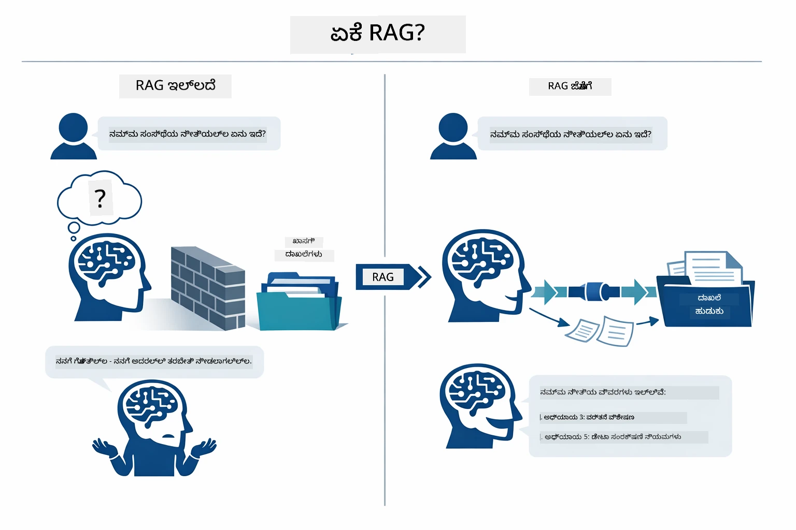

*ಈ ಚಿತ್ರಣವು ಸಾಂಪ್ರದಾಯಿಕ LLM (ತರಬೇತಿ ಡೇಟಾದಿಂದ ಅಂದಾಜು ಮಾಡುತ್ತದೆ) ಮತ್ತು RAG-ವೃದ್ಧಿತ LLM (ಮೊದಲು ನಿಮ್ಮ ಡಾಕ್ಯುಮೆಂಟ್‌ಗಳನ್ನು ಪರಿಶೀಲಿಸುತ್ತದೆ) ನಡುವಿನ ವ್ಯತ್ಯಾಸವನ್ನು ತೋರಿಸುತ್ತದೆ.*

ದಾಖಲೆಯ ಭಾಗಗಳು ಎಲೆ-ಎಲೆ ಓಟವನ್ನು ಹೇಗೆ ಸಂಪರ್ಕಿಸುತ್ತವೆ ಎಂದು ಇಲ್ಲಿ ಹೇಳಲಾಗಿದೆ. ಬಳಕೆದಾರನ ಪ್ರಶ್ನೆ ನಾಲ್ಕು ಹಂತಗಳಿಂದ (ಎಂಬೆಡ್ಡ್, ವಕ್ಟರ್ ಶೋಧನೆ, ಸಂದರ್ಭ ಸಂಯೋಜನೆ, ಉತ್ತರ ತಯಾರಿ) ಸಾಗುತ್ತದೆ — ಪ್ರತಿಯೊಂದು ಹಂತವು ಹಿಂದಿನದನ್ನು ಆಧರಿಸಿದೆ:


*ಈ ಚಿತ್ರಣವು RAG ಪೈಪ್ಲೈನ್‌ನ ಎಲೆ-ಎಲೆ ಕ್ರಮವನ್ನು ತೋರಿಸುತ್ತದೆ — ಬಳಕೆದಾರ ಪ್ರಶ್ನೆ ಎಂಬೆಡ್ಡಿಂಗ್, ವಕ್ಟರ್ ಶೋಧನೆ, ಸಂದರ್ಭ ಸಂಯೋಜನೆ, ಹಾಗೂ ಉತ್ತರ ನಿರ್ಮಾಣದ ಮೂಲಕ ಸಾಗುತ್ತದೆ.*

ಈ ಮೊಡ್ಯೂಲ್‌ನ ಉಳಿದ ಭಾಗವು ಪ್ರತಿಯೊಂದು ಹಂತವನ್ನು ವಿವರವಾಗಿ ಕೀನದಂತೆ ತೋರಿಸುತ್ತದೆ, ಜೊತೆಗೆ ನೀವು ಓಡಿಸಬಲ್ಲ ಹಾಗೂ ಬದಲಾಯಿಸಬಲ್ಲ ಕೋಡ್ ನೊಂದಿಗೆ.

### ಈ ಪಾಠದಲ್ಲಿ ಯಾವ RAG ವಿಧಾನ ಬಳಕೆ ಮಾಡಲಾಗಿದೆ?

LangChain4j ಮೂರು ರೀತಿಗಳಲ್ಲಿ RAG ಅನ್ನು ಅನುಷ್ಠಾನಗೊಳಿಸುತ್ತದೆ, ಪ್ರತಿ ಒಂದು ವಿಭಿನ್ನ ಮಟ್ಟದ ಅವಲೋಕನ ಹೊಂದಿದೆ. ಕೆಳಗಿನ ಚಿತ್ರಣದಲ್ಲಿ ಅವುಗಳನ್ನು ಸಮನಾಗಿ ಹೋಲಿಸಲಾಗಿದೆ:

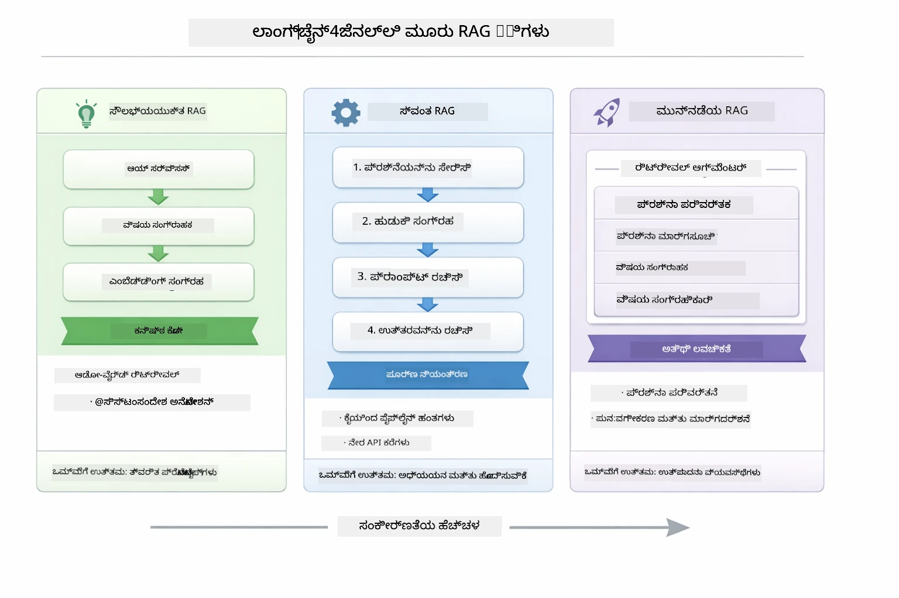

*ಈ ಚಿತ್ರಣವು LangChain4j ಯಲ್ಲಿರುವ ಮೂರು RAG ವಿಧಾನಗಳ — Easy, Native, ಮತ್ತು Advanced — ಪ್ರಮುಖ ಅಂಶಗಳನ್ನೂ ಮತ್ತು ಬಳಸುವ ಸಂದರ್ಭಗಳನ್ನೂ ತೋರಿಸುತ್ತದೆ.*

| ವಿಧಾನ | ಅದು ಏನು ಮಾಡುತ್ತದೆ | ವ್ಯಾಪ್ತಿಚೌಕಟ್ಟು |
|---|---|---|
| **ಸರಳ RAG** | `AiServices` ಮತ್ತು `ContentRetriever` ಮೂಲಕ ಎಲ್ಲವನ್ನೂ ಸ್ವಯಂಚಾಲಿತವಾಗಿ ಸಂಪರ್ಕಿಸುತ್ತದೆ. ನೀವು ಇಂಟರ್ಫೇಸ್ ಅನ್ನು ಸೂಚಿಸುತ್ತೀರಿ, ರಿಟ್ರಿವರ್ ಅನ್ನು ಲಗತ್ತಿಸುತ್ತೀರಿ, ಆಗ LangChain4j ಎಂಬೆಡ್ಡಿಂಗ್, ಶೋಧನೆ, ಹಾಗು ಪ್ರಾಂಪ್ಟ್ ಸಂಯೋಜನೆಗಳನ್ನು ಹಿಂದೆ ನಡಿಸುತ್ತದೆ. | ಅತ್ಯल्प ಕೋಡ್, ಆದರೆ ಪ್ರತಿಯೊಂದು ಹಂತದಲ್ಲಿಯೇ ಏನು ನಡೆಯುತ್ತಿದೆ ನೋಡಲು ಆಗದು. |
| **ನೈಟಿವ್ RAG** | ನೀವು ಎಂಬೆಡ್ಡಿಂಗ್ ಮಾದರಿಯನ್ನು ಕರೆದುಕೊಳ್ಳುತ್ತೀರಿ, ಸಂಗ್ರಹಸ್ಥಳವನ್ನು ಹುಡುಕುತ್ತೀರಿ, ಪ್ರಾಂಪ್ಟ್ ರಚಿಸುತ್ತೀರಿ, ಹಾಗೂ ನಿಮ್ಮಿಂದ ಉತ್ತರ ಸೃಷ್ಟಿಸುತ್ತೀರಿ — ಸ್ಪಷ್ಟವಾದ ಒಂದು ಹಂತ ಪ್ರತಿ ಸಮಯ. | ಹೆಚ್ಚು ಕೋಡ್, ಆದರೆ ಎಲ್ಲಾ ಹಂತಗಳನ್ನು ಕಣ್ತುಂಬಿಕೊಳ್ಳಬಹುದು ಮತ್ತು ಬದಲಾಯಿಸಬಹುದು. |
| **ಅಡ್ವಾನ್ಸ್ RAG** | `RetrievalAugmentor` ಫ್ರೇಮ್ವರ್ಕ್ ಅನ್ನು ಬಳಸಿ, ಕ್ವೆರೀ ಪರಿವರ್ತಕರು, ಮಾರ್ಗ ನಿರ್ದೇಶಕರು, ಪುನಃ ಅಂಕಿತಕಾರರು, ಮತ್ತು ವಿಷಯ ಸಂಯೋಜಕರೊಂದಿಗೆ ಉತ್ಪಾದನಾ ಮತ್ತು ಪ್ರಾಂಪ್ಟ್ ಗ್ರೇಡ್ ಪೈಪ್ಲೈನ್ಗಳಿಗೆ. | ಪರಮಲವಚನೀಯತೆ ಆದರೆ ಗಣನೀಯವಾಗಿ ಹೆಚ್ಚಿನ ಜಟಿಲತೆ. |

**ಈ ಪಾಠದಲ್ಲಿ ನೈಟಿವ್ ವಿಧಾನ ಬಳಸದಾಗಿದೆ.** RAG ಪೈಪ್ಲೈನಿನ ಪ್ರತಿಯೊಂದು ಹಂತವನ್ನು — ಕ್ವೆರಿಯನ್ನು ಎಂಬೆಡ್ಡ್ ಮಾಡುವುದು, ವಕ್ಟರ್ ಸ್ಟೋರ್ ಅನ್ನು ಶೋಧಿಸುವುದು, ಸಂದರ್ಭ ಸಂಯೋಜಿಸುವುದು, ಮತ್ತು ಉತ್ತರ ಸೃಷ್ಟಿಸುವುದು — [`RagService.java`](../../../03-rag/src/main/java/com/example/langchain4j/rag/service/RagService.java) ನಲ್ಲಿ ಸ್ಪಷ್ಟವಾಗಿ ಬರೆಯಲಾಗಿದೆ. ಇದು ಉದ್ದೇಶಿತವಾಗಿದೆ: ಅಧ್ಯಯನ ಸಂಪನ್ಮೂಲವಾಗಿ, ಪ್ರತಿಯೊಂದು ಹಂತವನ್ನು ನೀವು ಕಂಡು ಅರಿತುಕೊಳ್ಳುವುದು ಕೋಡ್ ಕಡಿಮೆ ಮಾಡಿಕೊಳ್ಳುವುದಕ್ಕಿಂತ ಹೆಚ್ಚು ಮಹತ್ವದಂತೆ. ನೀವು ಭಾಗಗಳು ಹೇಗೆ ಜೋಡಿಸುತ್ತವೆ ಎಂದು ಅರ್ಥಮಾಡಿಕೊಂಡ ನಂತರ, ತ್ವರಿತ ಪ್ರೋಟೋಟೈಪ್‌ಗಳಿಗೆ ಸರಳ RAG ಅಥವಾ ಉತ್ಪಾದನಾ ವ್ಯವಸ್ಥೆಗಳಿಗೆ ಉತ್ತಮ RAG ಕಡೆ ತಿರುಗಬಹುದು.

> **💡 ಸರಳ RAG ವನ್ನು ಈಗಾಗಲೇ ನೋಡಿದ್ದೀರಾ?** [ತ್ವರಿತ ಪ್ರಾರಂಭ ಮೊಡ್ಯೂಲ್](../00-quick-start/README.md) ಡಾಕ್ಯುಮೆಂಟ್ ಪ್ರಶ್ನೋತ್ತರ ಉದಾಹರಣೆ ([`SimpleReaderDemo.java`](../../../00-quick-start/src/main/java/com/example/langchain4j/quickstart/SimpleReaderDemo.java)) ಒಳಗೊಂಡಿದೆ, ಇದು ಸರಳ RAG ವಿಧಾನವನ್ನು ಬಳಸುತ್ತದೆ — LangChain4j ಎಂಬೆಡ್ಡಿಂಗ್, ಶೋಧನೆ ಮತ್ತು ಪ್ರಾಂಪ್ಟ್ ಸಂಯೋಜನೆಯನ್ನು ಸ್ವಯಂಚಾಲಿತವಾಗಿ ನಿರ್ವಹಿಸುತ್ತದೆ. ಈ ಮೊಡ್ಯೂಲ್ ಮುಂದಿನ ಹಂತವನ್ನು ತೆಗೆದು ಆ ಪೈಪ್ಲೈನ್ ಅನ್ನು ಮುರಿದು ಪ್ರತಿಯೊಂದು ಹಂತವನ್ನು ನೀವು ನೋಡಲು ಹಾಗೂ ನಿಯಂತ್ರಣ ಮಾಡಲು ಸಾಧ್ಯವಾಗಿಸುತ್ತದೆ.

ಕೆಳಗಿನ ಚಿತ್ರವು Easy RAG ಪೈಪ್ಲೈನ್ ಅನ್ನು ಆ ತ್ವರಿತ ಪ್ರಾರಂಭ ಉದಾಹರಣೆಯಿಂದ ತೋರಿಸುತ್ತದೆ. ಗಮನಿಸಿ ಹೇಗೆ `AiServices` ಮತ್ತು `EmbeddingStoreContentRetriever` ಎಲ್ಲಾ ಸಂಕೀರ್ಣತೆಯನ್ನು ಅಡಗಿಸುತ್ತವೆ — ನೀವು ಡಾಕ್ಯುಮೆಂಟ್ ಲೋಡ್ ಮಾಡುತ್ತೀರಿ, ರಿಟ್ರಿವರ್ ಅನ್ನು ಲಗತ್ತಿಸುತ್ತೀರಿ, ಹಾಗೂ ಉತ್ತರ ಪಡೆಯುತ್ತೀರಿ. ಈ ಮೊಡ್ಯೂಲ್‌ನ ನೈಟಿವ್ ವಿಧಾನ ಆ ಲುಪ್ಯಾಗಿರುವ ಹಂತಗಳನ್ನು ಮುರಿದು ಬಳಸುವವರಿಗೆ ಸ್ಪಷ್ಟತೆ ನೀಡುತ್ತದೆ:

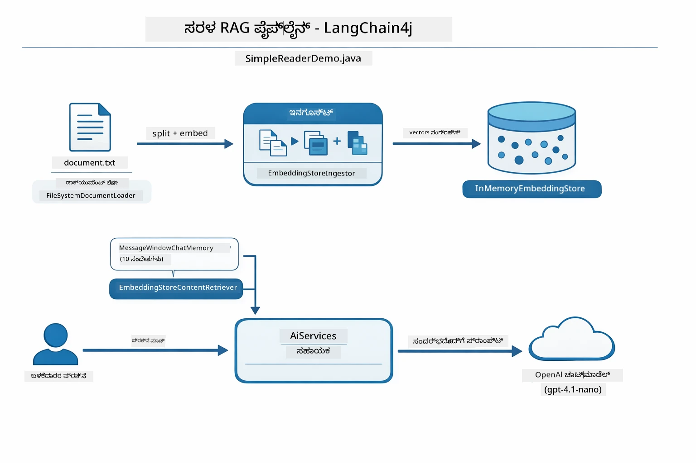

*ಈ ಚಿತ್ರವು `SimpleReaderDemo.java` ಯಿಂದ Easy RAG ಪೈಪ್ಲೈನನ್ನು ತೋರಿಸುತ್ತದೆ. ಈ ಮೊಡ್ಯೂಲ್‌ನ ನೈಟಿವ್ ವಿಧಾನವನ್ನು ಹೋಲಿಸಿ: Easy RAG ಎಂಬೆಡ್ಡಿಂಗ್, ರಿಟ್ರಿವಲ್ ಮತ್ತು ಪ್ರಾಂಪ್ಟ್ ಸಂಯೋಜನೆಯನ್ನು `AiServices` ಮತ್ತು `ContentRetriever` ಹಿಂದಿನಿಂದ ಸಡುದಿಸುತ್ತದೆ — ನೀವು ಡಾಕ್ಯುಮೆಂಟ್ ಲೋಡ್ ಮಾಡಿ, ರಿಟ್ರಿವರ್ ಅನ್ನು ಲಗತ್ತಿಸಿ, ಮತ್ತು ಉತ್ತರಗಳನ್ನ ಪಡೆಯುತ್ತೀರಿ. ನೈಟಿವ್ ವಿಧಾನವು ಆ ಪೈಪ್ಲೈನನ್ನು ಮುರಿದು ಪ್ರತಿಯೊಂದು ಹಂತವನ್ನು (ಎಂಬೆಡ್, ಶೋಧನೆ, ಸಂದರ್ಭ ಸಂಯೋಜನೆ, ಸೃಷ್ಟಿ) ನೀವು ಕರೆಯುವಂತೆ ಮಾಡುತ್ತದೆ, ಸಂಪೂರ್ಣ ದೃশ্যತೆಯನ್ನು ಮತ್ತು ನಿಯಂತ್ರಣವನ್ನು ಒದಗಿಸುತ್ತದೆ.*

## ಹೇಗಿದೆ ಇದರ ಕಾರ್ಯವೈಖರಿ

ಈ ಮೊಡ್ಯೂಲ್‌ನ RAG ಪೈಪ್ಲೈನ್ ಬಳಕೆದಾರನು ಪ್ರಶ್ನೆ ಕೇಳುವ ಪ್ರತೀ ಬಾರಿ ಸರಣಿಯಲ್ಲಿ ಚಾಲನೆಯಲ್ಲಿರುವ ನಾಲ್ಕು ಹಂತಗಳಾಗಿ ವಿಭಜಿಸಲಾಗಿದೆ. ಮೊದಲು, ಅಪ್ಲೋಡ್ ಮಾಡಿದ ಡಾಕ್ಯುಮೆಂಟ್ ಅನ್ನು **ಪಾರ್ಸ್ ಮತ್ತು ಚಂಕ್** ಮಾಡುತ್ತದೆ — ಸುಲಭವಾಗಿ ನಿರ್ವಹಿಸುವ ಸಾಧ್ಯವಾದಂತೆ ತುಂಡುಗಳಲ್ಲಿ. ಆ ಚাংಕ್‌ಗಳನ್ನು ನಂತರ **ವಕ್ಟರ್ ಎಂಬೆಡ್ಡಿಂಗ್** ಗಳಾಗಿ ಪರಿವರ್ತಿಸಿ ಸಂಗ್ರಹಿಸಬಹುದು — ಇದರಿಂದ ಅವು ಗಣಿತೀಯವಾಗಿ ಹೋಲಿಸಬಹುದು. ಪ್ರಶ್ನೆ ಬಂದಾಗ, ಸಿಸ್ಟಂ **ಅರ್ಥಪೂರ್ಣ ಶೋಧನೆಯನ್ನು** ಕಾರ್ಯಗತಗೊಳಿಸಿ ಅತ್ಯಂತ ಸಂಬಂಧಿತ ಚಂಕ್‌ಗಳನ್ನು ಹುಡುಕುತ್ತದೆ, ಮತ್ತು ಕೊನೆಯಲ್ಲಿ ಅವುಗಳನ್ನು ಮಾಹಿತಿ ಕಾರಣಿಕವಾಗಿ LLM ಗೆ **ಉತ್ತರ ತಯಾರಿಗೆ** ಪಾಸಾಗಿ ಒದಗಿಸುತ್ತದೆ. ಈ ಕೆಳಗಿನ ವಿಭಾಗಗಳು ಪ್ರತ್ಯೇಕ ಹಂತವನ್ನು ನಡೆಸುವ ಕೋಡ್ ಮತ್ತು ಚಿತ್ರಣಗಳೊಂದಿಗೆ ವಿವರಿಸುತ್ತವೆ. ಮೊದಲು ಹಂತವನ್ನು ನೋಡೋಣ.

### ಡಾಕ್ಯುಮೆಂಟ್ ಪ್ರಕ್ರಿಯೆ

[DocumentService.java](../../../03-rag/src/main/java/com/example/langchain4j/rag/service/DocumentService.java)

ನೀವು ಡಾಕ್ಯುಮೆಂಟ್ ಅಪ್ಲೋಡ್ ಮಾಡಿದಾಗ, ಸಿಸ್ಟಮ್ ಅದನ್ನು ಪಾರ್ಸ್ ಮಾಡುತ್ತದೆ (PDF ಅಥವಾ ಸಾದಾ ಪಠ್ಯ), ಫೈಲ್ ನಾಮ ಮತ್ತು ಇತರೆ ಮೆಟಾಡೇಟಾವನ್ನು ಲಗತ್ತಿಸುತ್ತದೆ, ನಂತರ ಅದನ್ನು ಚಂಕ್ ಗಳಾಗಿ ವಿಭಜಿಸುತ್ತದೆ — ಚಿಕ್ಕ ತುಂಡುಗಳು, ಹಾಗಾಗಿ ಮಾದರಿಯ ಸಂದರ್ಭ ಕಿಟಕಿಗೆ ಸರಿಯಾಗಿ ಹೊಂದಿಕೊಳ್ಳುತ್ತವೆ. ಈ ಚಂಕ್‌ಗಳಿಂದ ಕೆಲವು ಭಾಗಗಳು ನಿಗದಿ ಮಾಡಲಾಗುತ್ತದೆ ಇದು ಮಾರ್ಜಿನಲ್ಲಿರುವ ಸಂದರ್ಭ ಹಿಡಿದುಕೊಳ್ಳಲು.

```java
// ಅಪ್ಲೋಡ್ ಮಾಡಿದ ಫೈಲ್ ಅನ್ನು ವಿಶ್ಲೇಷಿಸಿ ಮತ್ತು ಅದನ್ನು LangChain4j ಡಾಕ್ಯುಮೆಂಟ್‌ನಲ್ಲಿ ಮೊರೆಹೆಚ್ಚು ಮಾಡಿ
Document document = Document.from(content, metadata);

// 300 ಟೋಕನ್ ತುಂಡುಗಳಾಗಿ ವಿಭಜಿಸಿ 30 ಟೋಕನ್ ಒಪ್ಪಿಗೆಯೊಂದಿಗೆ
DocumentSplitter splitter = DocumentSplitters
    .recursive(300, 30);

List<TextSegment> segments = splitter.split(document);
```

ಕೆಳಗಿನ ಚಿತ್ರಣದಲ್ಲಿ ಇದನ್ನು ದೃಶ್ಯತಃ ತೋರಿಸಲಾಗಿದೆ. ಪ್ರತಿಯೊಂದು ಚಂಕ್ ತನ್ನ ಬದಿವಾಳಗಳೊಂದಿಗೆ ಕೆಲವು ಟೋಕನ್‌ಗಳನ್ನು ಹಂಚಿಕೊಳ್ಳುತ್ತದೆ — 30-ಟೋಕನ್ ಓವರ್ ಲ್ಯಾಪ್ ಇದರಿಂದ ಯಾವುದೇ ಪ್ರಮುಖ ಸಂದರ್ಭದಲ್ಲಿ ಬಿಂದುಗಳಿಗೆ ಮೊರೆತುಹೋಗುವುದಿಲ್ಲ:

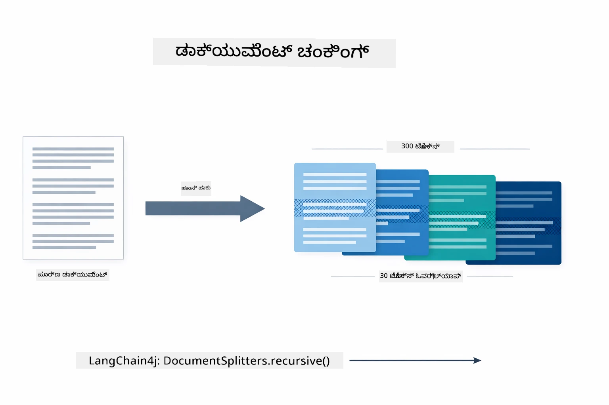

*ಈ ಚಿತ್ರಣವು 30-ಟೋಕನ್ ಓವರ್ ಲ್ಯಾಪ್ ಜೊತೆ 300-ಟೋಕನ್ ಚಂಕ್ಗಳಾಗಿ ಡಾಕ್ಯುಮೆಂಟ್ ಅನ್ನು ವಿಭಜಿಸುವುದನ್ನು ತೋರಿಸುತ್ತದೆ, ಚಂಕ್ ಗಡಿಯಾರಗಳಲ್ಲಿ ಸಂದರ್ಭದಲ್ಲಿ ಕಾಪಾಡಿಕೊಳ್ಳುತ್ತದೆ.*

> **🤖 [GitHub Copilot](https://github.com/features/copilot) ಚಾಟ್ ಜೊತೆ ಪ್ರಯತ್ನಿಸಿ:** [`DocumentService.java`](../../../03-rag/src/main/java/com/example/langchain4j/rag/service/DocumentService.java) ತೆರೆಯಿರಿ ಮತ್ತು ಕೇಳಿ:
> - "LangChain4j ಡಾಕ್ಯುಮೆಂಟ್‌ಗಳನ್ನು ಚಂಕ್‌ಗಳಲ್ಲಿ ಹೇಗೆ ಹಂಚುತ್ತದೆ ಮತ್ತು ಓವರ್ ಲ್ಯಾಪ್ ಬಹಳ ಮುಖ್ಯವೆಂದು ಯಾಕೆ?"
> - "ಬಗೆಯ ಡಾಕ್ಯುಮೆಂಟ್‌ಗಳಿಗೆ ಸೂಕ್ತ ಚಂಕ್ ಗಾತ್ರ ಏನು ಮತ್ತು ಯಾಕೆ?"
> - "ಹೆಚ್ಚು ಭಾಷೆಗಳಲ್ಲಿನ ಅಥವಾ ವಿಶೇಷ ಫಾರ್ಮ್ಯಾಟಿಂಗ್ ಹೊಂದಿರುವ ಡಾಕ್ಯುಮೆಂಟ್‌ಗಳನ್ನು ಹೇಗೆ ನಿರ್ವಹಿಸಲು?"

### ಎಂಬೆಡ್ಡಿಂಗ್ ರಚನೆ

[LangChainRagConfig.java](../../../03-rag/src/main/java/com/example/langchain4j/rag/config/LangChainRagConfig.java)

ಪ್ರತಿಯೋಂದು ಚಂಕ್ ಸಂಖ್ಯಾತದ ಪ್ರತಿನಿಧಿತ್ವಕ್ಕೆ (ಎಂಬೆಡ್ಡಿಂಗ್) ಮಾರ್ಪಡಿಸಲಾಗುತ್ತದೆ — ಅರ್ಥವನ್ನು ಸಂಖ್ಯೆಗಳ ರೂಪದಲ್ಲಿ ಪರಿವರ್ತಿಸುವ ಸಾಧನ. ಎಂಬೆಡ್ಡಿಂಗ್ ಮಾದರಿ ಚಾಟ್ ಮಾದರಿ ಇಂಥ 'ಗುಣವಂತಿಕೆ' ಹೊಂದಿರುವುದಿಲ್ಲ; ಇದು ಸೂಚನೆಗಳನ್ನು ಅನುಸರಿಸುವುದಿಲ್ಲ, ತರ್ಕ ಮಾಡುವುದಿಲ್ಲ, ಅಥವಾ ಪ್ರಶ್ನೆಗಳಿಗೆ ಉತ್ತರಿಸುವುದಿಲ್ಲ. ಇದು ಕೇವಲ ಪಠ್ಯವನ್ನು ಗಣಿತೀಯ ಸ್ಥಲಕ್ಕೆ ಮ್ಯಾಪ್ ಮಾಡುತ್ತದೆ, ಅಲ್ಲಿ ಸಾದೃಶ್ಯ ಅರ್ಥವು ಒಂದುರ್ ಪವಾಡಿ ಹತ್ತಿರ ಇರುತ್ತದೆ — ಉದಾ: "ಕಾರು" "ಆಟೋಮೊಬೈಲ್" ಹತ್ತಿರ, "ಹಣ ವಾಪಸ್ ನಿಯಮ" "ನನ್ನ ಹಣ ವಾಪಸ್" ಹತ್ತಿರ. ಚಾಟ್ ಮಾದರಿಯನ್ನು ನೀವು ಮಾತನಾಡಬಹುದಾದ ವ್ಯಕ್ತಿ ಎಂದು ಊಹಿಸಿ; ಎಂಬೆಡ್ಡಿಂಗ್ ಮಾದರಿ ಅತ್ಯುತ್ತಮ ದಾಖಲಾತಿ ವ್ಯವಸ್ಥೆಯಂತೆ.

ಕೆಳಗಿನ ಚಿತ್ರಣ ಈ ಕಲ್ಪನೆಯನ್ನು ದೃಶ್ಯಮಾಡುತ್ತದೆ — ಪಠ್ಯ ಒಳಗೆ ಹೋಗುತ್ತದೆ, ಸಂಖ್ಯಾತ ವಕ್ಟರ್ ಬರುವುದೋ, ಸಮಾನ ಅರ್ಥಗಳವು ಹತ್ತಿರ ನೆಲೆ ಮಾಡುತ್ತವೆ:

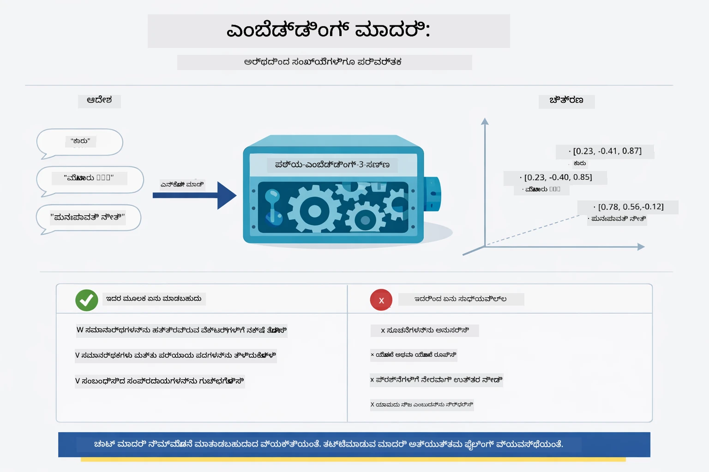

*ಈ ಚಿತ್ರಣವು ಪಠ್ಯವನ್ನು ಸಂಖ್ಯಾತ ವಕ್ಟರ್ಗಳಾಗಿ ಪರಿವರ್ತಿಸುವ ಎಂಬೆಡ್ಡಿಂಗ್ ಮಾದರಿಯನ್ನು ತೋರಿಸುತ್ತದೆ, ಸಮಾನ ಅರ್ಥಗಳು (ಉದಾಹರಣೆಗೆ "ಕಾರು" ಮತ್ತು "ಆಟೋಮೊಬೈಲ್") ವಕ್ಟರ್ ಸ್ಥಳದಲ್ಲಿ ಹತ್ತಿರ ಇರುತ್ತವೆ.*

```java
@Bean
public EmbeddingModel embeddingModel() {
    return OpenAiOfficialEmbeddingModel.builder()
        .baseUrl(azureOpenAiEndpoint)
        .apiKey(azureOpenAiKey)
        .modelName(azureEmbeddingDeploymentName)
        .build();
}

EmbeddingStore<TextSegment> embeddingStore = 
    new InMemoryEmbeddingStore<>();
```

ಕೆಳಗಿನ ವರ್ಗ ಚಿತ್ರವು RAG ಪೈಪ್ಲೈನ್‍ನಲ್ಲಿ ಎರಡು ಪ್ರತ್ಯೇಕ ಪ್ರವಾಹಗಳನ್ನು ಮತ್ತು ಅವುಗಳನ್ನು ಅನುಷ್ಠಾನಗೊಳಿಸುವ LangChain4j ವರ್ಗಗಳನ್ನು ತೋರಿಸುತ್ತದೆ. **ಅವಲೋಕನ ಪ್ರವಾಹ** (ಒಮ್ಮೆ ಅಪ್ಲೋಡ್ ಸಮಯದಲ್ಲಿ ನಡೆಯುತ್ತದೆ) ಡಾಕ್ಯುಮೆಂಟ್ ಅನ್ನು ವಿಭಜಿಸಿ, ಚಂಕ್ ಗಳನ್ನು ಎಂಬೆಡ್ಡ್ ಮಾಡಿ, ಮತ್ತು ಅವುಗಳನ್ನು `.addAll()` ಮೂಲಕ ಸಂಗ್ರಹಿಸುತ್ತದೆ. **ಪ್ರಶ್ನೆ ಪ್ರವಾಹ** (ಪ್ರತಿ ಬಾರಿ ಬಳಕೆದಾರನು ಕೇಳುವಾಗ) ಪ್ರಶ್ನೆಯನ್ನು ಎಂಬೆಡ್ಡ್ ಮಾಡಿ, `.search()` ಮೂಲಕ ಸಂಗ್ರಹವನ್ನು ಹುಡುಕುತ್ತದೆ, ಮತ್ತು ಹೊಂದಿದ ಸಂದರ್ಭವನ್ನು ಚಾಟ್ ಮಾದರಿಗೆ ಒದಗಿಸುತ್ತದೆ. ಎರಡೂ ಪ್ರವಾಹಗಳು ಹಂಚಲಾದ `EmbeddingStore<TextSegment>` ಇಂಟರ್‌ಫೇಸ್ನಲ್ಲಿ ಸೇರಿಕೊಳ್ಳುತ್ತವೆ:

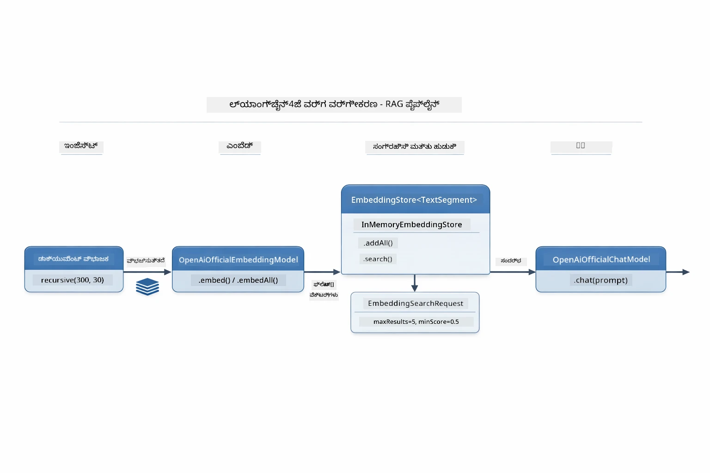

*ಈ ಚಿತ್ರಣವು RAG ಪೈಪ್ಲೈನಿನ ಎರಡು ಪ್ರವಾಹಗಳನ್ನು — ಅವಲೋಕನ ಮತ್ತು ಪ್ರಶ್ನೆ — ಮತ್ತು ಅವು ಹೇಗೆ ಹಂಚಲ್ಪಟ್ಟ EmbeddingStore ಮೂಲಕ ಸಂಪರ್ಕ ಹೊಂದಿರುವುದನ್ನು ತೋರಿಸುತ್ತದೆ.*

ಎಂಬೆಡ್ಡಿಂಗ್‌ಗಳು ಸಂಗ್ರಹವಾದ ಮೇಲೆ, ಸಂಬಂಧಿತ ವಿಷಯವು ಸಹಜವಾಗಿ ವಕ್ಟರ್ ಸ್ಥಳದಲ್ಲಿ ಗುಚ್ಛಗೆ ಸೇರಿಕೊಳ್ಳುತ್ತದೆ. ಕೆಳಗಿನ ದೃಶ್ಯವು ಸಂಬಂಧಿತ ವಿಷಯಗಳೊಡನೆ ಡಾಕ್ಯುಮೆಂಟ್‌ಗಳು ಹತ್ತಿರದ ಬಿಂದುಗಳಾಗಿ ಹೇಗೆ ನೆಲೆ ಮಾಡುತ್ತವೆ ಎಂಬುದನ್ನು ತೋರಿಸುತ್ತದೆ, ಇದು ಅರ್ಥಪೂರ್ಣ ಶೋಧನೆಯನ್ನು ಸಾಧ್ಯ ಮಾಡುತ್ತದೆ:


*ಈ ದೃಶ್ಯವು ತಾಂತ್ರಿಕ ಡಾಕ್ಯುಮೆಂಟ್‌ಗಳು, ವ್ಯವಹಾರ ನಿಯಮಗಳು, ಮತ್ತು FAQ ಸೇರಿದಂತೆ ವಿಷಯಗಳಾದವರು 3D ವಕ್ಟರ್ ಸ್ಥಳದಲ್ಲಿ ಹೇಗೆ ವಿಭಜಿತ ಗುಂಪುಗಳಾಗಿ ಸೇರುತ್ತವೆ ಎಂದು ತೋರಿಸುತ್ತದೆ.*

ಬಳಕೆದಾರನು ಹುಡುಕಲು ಹೋದಾಗ, ಸಿಸ್ಟಮ್ ನಾಲ್ಕು ಹಂತಗಳನ್ನು ಅನುಸರಿಸುತ್ತದೆ: ಡಾಕ್ಯುಮೆಂಟ್ ಅನ್ನು ಒಂದು ಬಾರಿ ಎಂಬೆಡ್ಡ್ ಮಾಡಿ, ಪ್ರತಿ ಹುಡುಕಾಟಕ್ಕೆ ಪ್ರಶ್ನೆಯನ್ನು ಎಂಬೆಡ್ಡ್ ಮಾಡಿ, ಪ್ರಶ್ನೆ ವಕ್ಟರ್ ಅನ್ನು ಎಲ್ಲಾ ಸಂಗ್ರಹಿತ ವಕ್ಟರ್‌ಗಳೊಂದಿಗೆ ಕಾಸೈನ್ ಸಾದೃಶ್ಯತೆ ಬಳಸಿ ಹೋಲಿಸಿ, ಮತ್ತು ಅತ್ಯುತ್ತಮ ತಲಾ-K ಅಂಕೆ ಪಡೆದ ಚಂಕ್‌ಗಳನ್ನು ಹಿಂತಿರುಗಿಸುತ್ತದೆ. ಕೆಳಗಿನ ಚಿತ್ರಣದಲ್ಲಿ ಪ್ರತಿ ಹಂತ ಮತ್ತು LangChain4j ವರ್ಗಗಳು ವಿವರಿಸಲಾಗಿದೆ:

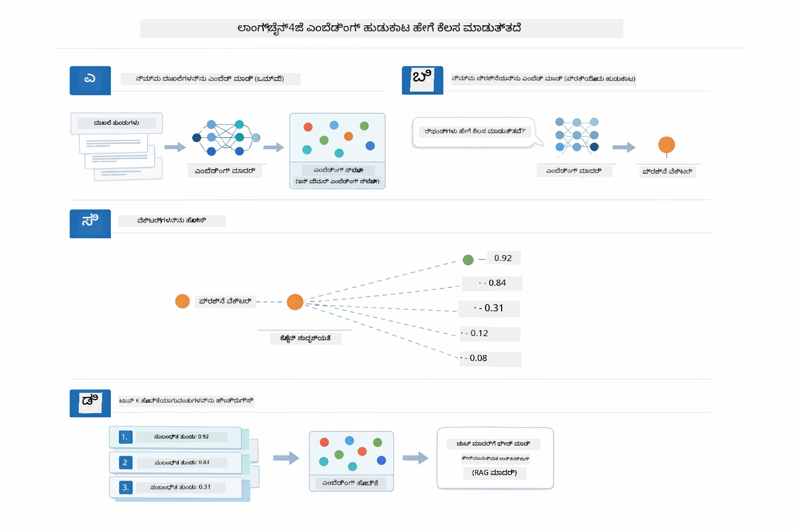

*ಈ ಚಿತ್ರಣವು ನಾಲ್ಕು ಹಂತಗಳಿರುವ ಎಂಬೆಡ್ಡಿಂಗ್ ಶೋಧನಾ ಪ್ರಕ್ರಿಯೆಯನ್ನು ತೋರಿಸುತ್ತದೆ: ಡಾಕ್ಯುಮೆಂಟ್ ಗಳನ್ನು ಎಂಬೆಡ್ಡ್ ಮಾಡುವುದು, ಶೋಧನಿಗೆ ಪ್ರಶ್ನೆಯನ್ನು ಎಂಬೆಡ್ಡ್ ಮಾಡುವುದು, ವಕ್ಟರ್‌ಗಳನ್ನ ಕಾಸೈನ್ ಸಾದೃಶ್ಯತೆ ಮೂಲಕ ಹೋಲಿಸಿ, ಮತ್ತು ಶ್ರೇಷ್ಠ-K ಫಲಿತಾಂಶಗಳನ್ನು ಹಿಂತಿರುಗಿಸುವುದು.*

### ಅರ್ಥಪೂರ್ಣ ಶೋಧನೆ

[RagService.java](../../../03-rag/src/main/java/com/example/langchain4j/rag/service/RagService.java)

ನೀವು ಪ್ರಶ್ನೆ ಕೇಳಿದಾಗ, ನೀವು ಕೇಳಿದ ಪ್ರಶ್ನೆಯೂ ಎಂಬೆಡ್ಡಿಂಗ್ ಆಗುತ್ತದೆ. ಸಿಸ್ಟಮ್ ನಿಮ್ಮ ಪ್ರಶ್ನೆಯ ಎಂಬೆಡ್ಡಿಂಗ್ ಅನ್ನು ಡಾಕ್ಯುಮೆಂಟ್‌ಗಳ ಪ್ರತಿಯೊಂದು ಚಂಕ್ ಎಂಬೆಡ್ಡಿಂಗ್‌ಗಳೊಂದಿಗೆ ಹೋಲಿಸುತ್ತದೆ. ಇದು ಅರ್ಥದಲ್ಲಿ ಸಮಾನವಾದ ಚಂಕ್‌ಗಳನ್ನು ಹುಡುಕುತ್ತದೆ - ಕೀವರ್ಡ್‌ಗಳು ಮಾತ್ರ ಅಲ್ಲ, ನಿಖರಾರ್ಥ ಸಾದೃಶ್ಯತೆ ಕೂಡ.

```java
Embedding queryEmbedding = embeddingModel.embed(question).content();

EmbeddingSearchRequest searchRequest = EmbeddingSearchRequest.builder()
    .queryEmbedding(queryEmbedding)
    .maxResults(5)
    .minScore(0.5)
    .build();

EmbeddingSearchResult<TextSegment> searchResult = embeddingStore.search(searchRequest);
List<EmbeddingMatch<TextSegment>> matches = searchResult.matches();

for (EmbeddingMatch<TextSegment> match : matches) {
    String relevantText = match.embedded().text();
    double score = match.score();
}
```

ಕೆಳಗಿನ ಚಿತ್ರಣವು ಕೀವರ್ಡ್ ಶೋಧನೆ ಮತ್ತು ಅರ್ಥಪೂರ್ಣ ಶೋಧನೆಯ ನಡುವೆ ವಿರುದ್ಧತೆ ತೋರಿಸುತ್ತದೆ. "ವಾಹನ" ಎಂಬ ಕೀವರ್ಡ್ ಹುಡುಕಾಟವು "ಕಾರುಗಳು ಮತ್ತು ಟ್ರಕ್‌ಗಳು" ಎಂಬ ಚಂಕ್ ಅನ್ನು ತಪ್ಪಿಸಿಬಿಡುತ್ತದೆ, ಆದರೆ ಅರ್ಥಪೂರ್ಣ ಶೋಧನೆ ಅರ್ಥವನ್ನು ಸರಿಯಾಗಿ ಗ್ರಹಿಸಿ ಅದನ್ನು ಉತ್ತಮ ಅಂಕೆ ಪಡೆಯುವ ಮುಖಾಂತರ ಹಿಂತಿರುಗಿಸುತ್ತದೆ:

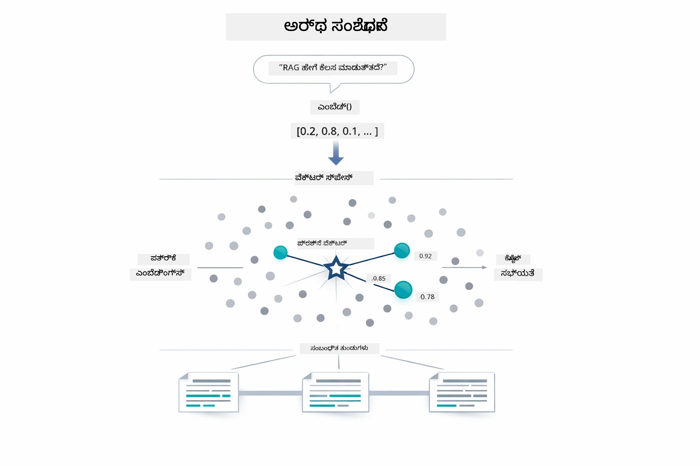

*ಈ ಚಿತ್ರಣವು ಕೀವರ್ಡ್ ಆಧಾರಿತ ಶೋಧನೆ ಮತ್ತು ಅರ್ಥಪೂರ್ಣ ಶೋಧನೆಯ ನಡುವಿನ ವ್ಯತ್ಯಾಸವನ್ನು ತೋರಿಸುತ್ತದೆ, ಸಮಾನಾರ್ಥದ ವಿಷಯಗಳನ್ನು ಮರಳುಕಂಪದ ಭಾಗಗಳಂತೆ ವಿವಿಧ ಶಬ್ದಗಳಿದ್ದರೂ ಕೂಡ ಅರಿತು ಹಿಂತಿರುಗಿಸುವುದನ್ನು.*
ಹುಡಿನಲ್ಲಿ, ಸಾದೃಶ್ಯವನ್ನು ಕೋಸೈನ್ ಸಾದೃಶ್ಯ ಬಳಸಿ ಅಳೆಯಲಾಗುತ್ತದೆ — ಮೂಲತಃ "ಈ ಎರಡು ಬಾಣಗಳು ಒಂದೇ ದಿಕ್ಕಿನಲ್ಲಿ ಸೂಚಿಸುತ್ತಿವೆಯೇ?" ಎಂದು ಕೇಳುವುದು. ಎರಡು ಚಂಕುಗಳು ಸಂಪೂರ್ಣವಾಗಿ ಬೇರೆಯಾದ ಪದಗಳನ್ನು ಬಳಸಬಹುದು, ಆದರೆ ಅವುಗಳ ಅರ್ಥ ಒಂದೇ ಆಗಿದ್ದರೆ ಅವುಗಳ ವೆಕ್ಟರ್‌ಗಳು ಅದೇ ದಿಕ್ಕಿನಲ್ಲಿ ಇರಿಸಿ ಸ್ಕೋರ್ 1.0ಕ್ಕೆ ಹತ್ತಿರವಾಗಿರುತ್ತವೆ:

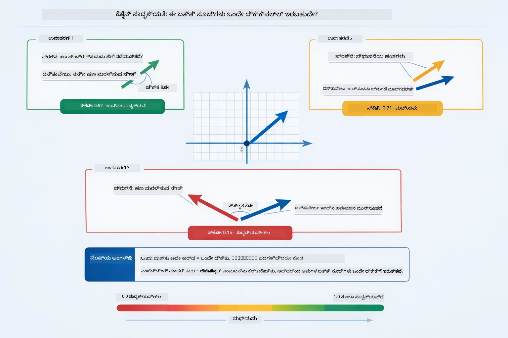

*ಈ ಚಿತ್ರಣವು ಕಾಸೈನ್ ಸಾದೃಶ್ಯವನ್ನು ಎಮ್ಬೆಡ್ಡಿಂಗ್ ವೆಕ್ಟರ್‌ಗಳ ನಡುವಿನ ಕೋನವಾಗಿ ವಿವರಿಸುತ್ತದೆ — ಹೆಚ್ಚು ಸರಿಹೊಂದಿದ ವೆಕ್ಟರ್‌ಗಳು 1.0ಕ್ಕೆ ಹತ್ತಿರ ಸ್ಕೋರ್ ನೀಡುತ್ತವೆ, ಇದು ಹೆಚ್ಚಿನ ಅರ್ಥಾತ್ಮಕ ಸಾದೃಶ್ಯವನ್ನು ಸೂಚಿಸುತ್ತದೆ.*

> **🤖 [GitHub Copilot](https://github.com/features/copilot) ಚಾಟ್ ಜೊತೆಗೆ ಪ್ರಯತ್ನಿಸಿ:** ತೆರೆಯಿರಿ [`RagService.java`](../../../03-rag/src/main/java/com/example/langchain4j/rag/service/RagService.java) ಮತ್ತು ಕೇಳಿ:
> - "ಎಂಬೆಡ್ಡಿಂಗ್‌ಗಳೊಂದಿಗೆ ಸಾದೃಶ್ಯ ಹುಡುಕಾಟ ಹೇಗೆ ಕಾರ್ಯನಿರ್ವಹಿಸುತ್ತದೆ ಮತ್ತು ಸ್ಕೋರ್ ಅನ್ನು ಏನು ನಿರ್ಧರಿಸುತ್ತದೆ?"
> - "ಎಷ್ಟು ಸಾದೃಶ್ಯದ ಗಡಿ ಬಳಸಬೇಕು ಮತ್ತು ಅದು ಫಲಿತಾಂಶಗಳಿಗೆ ಹೇಗೆ ಪ್ರಭಾವ ಬೀರುತ್ತದೆ?"
> - "ಸಂಬಂಧಿತ ದಾಖಲೆಗಳು ದೊರೆಯದ ಸಂದರ್ಭದಲ್ಲಿ ನಾನು ಹೇಗೆ ನಿರ್ವಹಿಸಬೇಕು?"

### ಉತ್ತರ ಉತ್ಪಾದನೆ

[RagService.java](../../../03-rag/src/main/java/com/example/langchain4j/rag/service/RagService.java)

ಅತ್ಯಂತ ಸಂಬಂಧಿತ ಚಂಕುಗಳನ್ನು ಗಟ್ಟಿಯಾದ ನಿರ্দেশನೆಗಳು, ತರಿಸಿಕೊಂಡ ಪೃಥ್ವಿ ಮತ್ತು ಬಳಕೆದಾರನ ಪ್ರಶ್ನೆಯನ್ನು ಒಳಗೊಂಡು ಸಂರಚಿತ ಪ್ರಾಂಪ್ಟಿನಲ್ಲಿ ಸಂಯೋಜಿಸಲಾಗುತ್ತದೆ. ಮಾದರಿ ಆ ನಿರ್ದಿಷ್ಟ ಚಂಕುಗಳನ್ನು ಓದಿ ಆ ಮಾಹಿತಿ ಆಧಾರಿತವಾಗಿ ಉತ್ತರಿಸುತ್ತದೆ — ಅದು ಮುಂದೆ ಇರುವ ದತ್ತಾಂಶವನ್ನು ಮಾತ್ರ ಬಳಸಬಹುದು, ಇದು ಕಲ್ಪನೆ ತಪ್ಪುವಲ್ಲಿ ತಡೆ ನೀಡುತ್ತದೆ.

```java
String context = matches.stream()
    .map(match -> match.embedded().text())
    .collect(Collectors.joining("\n\n"));

String prompt = String.format("""
    Answer the question based on the following context.
    If the answer cannot be found in the context, say so.

    Context:
    %s

    Question: %s

    Answer:""", context, request.question());

String answer = chatModel.chat(prompt);
```

ಕೆಳಗಿನ ಚಿತ್ರಣವು ಈ ಸಂಯೋಜನೆಯನ್ನು ಕ್ರಿಯಾಶೀಲವಾಗಿ ತೋರಿಸುತ್ತದೆ — ಹುಡುಕಾಟ ಹಂತದಿಂದ ಟಾಪ್-ಸ್ಕೋರ್ ಮಾಡಿದ ಚಂಕುಗಳನ್ನು ಪ್ರಾಂಪ್ಟ್ ಟೆಂಪ್ಲೇಟಿಗೆ ಬಳಸಲಾಗುತ್ತದೆ, ಮತ್ತು `OpenAiOfficialChatModel` ಆಧಾರದ ಮೇಲಿನ ಉತ್ತರವನ್ನು ರಚಿಸುತ್ತದೆ:

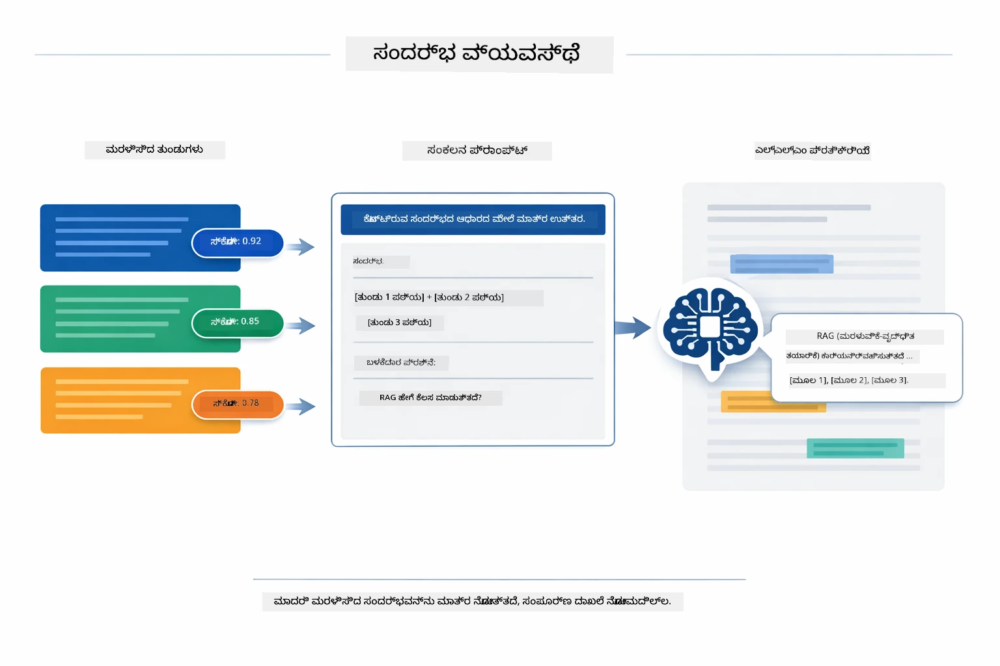

*ಈ ಚಿತ್ರಣವು ಟಾಪ್-ಸ್ಕೋರ್ ಮಾಡಿದ ಚಂಕುಗಳನ್ನು ಸಂಯೋಜಿತ ಪ್ರಾಂಪ್ಟ್ ಗೆ ಹೇಗೆ ಸೇರಿಸಲಾಗುತ್ತದೆ ಎಂದು ತೋರಿಸುತ್ತದೆ, ಇದರಿಂದ ಮಾದರಿಗೆ ನಿಮ್ಮ ಡೇಟಾದಿಂದ ಗಟ್ಟಿಯಾದ ಉತ್ತರ ಸೃಷ್ಟಿ ಸಾಧ್ಯವಾಗುತ್ತದೆ.*

## ಅಪ್ಲಿಕೇಶನ್ ಚಾಲನೆ

**ಪ್ರತಿಷ್ಠಾಪನೆ ಪರಿಶೀಲಿಸಿ:**

ಮೂಲ ಡೈರೆಕ್ಟರಿಯಲ್ಲಿ `.env` ಕಡತವಾದು ಅಜುರ್ ಕ್ರೆಡೆನ್ಶಿಯಲ್ಸ್ ಜೊತೆಗೆ ಇರುತ್ತದೆ (ಮಾಡ್ಯೂಲ್ 01 ರ ಸಮಯದಲ್ಲಿ ರಚಿಸಲಾಗಿತ್ತು). ಇದನ್ನು ಮಾಡ್ಯೂಲ್ ಡೈರೆಕ್ಟರಿಯಿಂದ (`03-rag/`) ಚಾಲನೆ ಮಾಡಿ:

**Bash:**
```bash
cat ../.env  # AZURE_OPENAI_ENDPOINT, API_KEY, DEPLOYMENT ಅನ್ನು ತೋರಿಸಬೇಕು
```

**PowerShell:**
```powershell
Get-Content ..\.env  # AZURE_OPENAI_ENDPOINT, API_KEY, DEPLOYMENT ಅನ್ನು ತೋರಿಸಬೇಕು
```

**ಅಪ್ಲಿಕೇಶನ್ ಪ್ರಾರಂಭಿಸಿ:**

> **ಗಮನಿಸಿ:** ನಿಮ್ಮು ಮೂಲ ಡೈರೆಕ್ಟರಿಯಿಂದ `./start-all.sh` ಬಳಸಿ ಎಲ್ಲಾ ಅಪ್ಲಿಕೇಶನ್‌ಗಳನ್ನು ಈಗಾಗಲೇ ಪ್ರಾರಂಭಿಸಿದ್ದರೆ (ಮಾಡ್ಯೂಲ್ 01 ಅನುಸಾರ), ಈ ಮಾಡ್ಯೂಲ್ ಈಗಾಗಲೆ 8081 ಪೋರ್ಟ್‌ನಲ್ಲಿ ಕಾರ್ಯನಿರ್ವಹಿಸುತ್ತಿದೆ. ಕೆಳಗಿನ ಪ್ರಾರಂಭ ಆಜ್ಞೆಗಳನ್ನು ನೀವು ಬಿಟ್ಟುಬಿಡಬಹುದು ಮತ್ತು ನೇರವಾಗಿ http://localhost:8081 ಗೆ ಹೋಗಬಹುದು.

**ಆಯ್ಕೆಯು 1: ಸ್ಪ್ರಿಂಗ್ ಬೂಟ್ ಡ್ಯಾಶ್‌ಬೋರ್ಡ್ ಬಳಸಿ (VS ಕೋಡ್ ಬಳಕೆದಾರರಿಗೆ ಶಿಫಾರಸು ಇದೆ)**

ಡೆವ್ ಕಂಟೈನರ್ ಸ್ಪ್ರಿಂಗ್ ಬೂಟ್ ಡ್ಯಾಶ್‌ಬೋರ್ಡ್ ವಿಸ್ತರಣೆ ಒಳಗೊಂಡಿದೆ, ಅದು ಎಲ್ಲಾ ಸ್ಪ್ರಿಂಗ್ ಬೂಟ್ ಅಪ್ಲಿಕೇಶನ್‌ಗಳನ್ನು ದೃಶ್ಯಾತ್ಮಕವಾಗಿ ನಿರ್ವಹಿಸಲು ಅವಕಾಶ ನೀಡುತ್ತದೆ. ನೀವು ಅದನ್ನು VS ಕೋಡ್‌ನಲ್ಲಿ ಎಕ್ಟಿವಿಟಿ ಬಾರ್‌ನ ಎಡಭಾಗದಲ್ಲಿ (ಸ್ಪ್ರಿಂಗ್ ಬೂಟ್ ಐಕಾನ್ ನೋಡಿರಿ) ಕಾಣಬಹುದು.

ಸ್ಪ್ರಿಂಗ್ ಬೂಟ್ ಡ್ಯಾಶ್‌ಬೋರ್ಡ್‌ನಿಂದ ನೀವು:
- ವೋರ್ಕ್‌ಸ್ಪೇಸ್‌ನ ಅಲೆಲ್ವತ್ತು ಸ್ಪ್ರಿಂಗ್ ಬೂಟ್ ಅಪ್ಲಿಕೇಶನ್‌ಗಳನ್ನು ನೋಡಬಹುದು
- ಒಂದೇ ಕ್ಲಿಕ್‌ನಲ್ಲಿ ಅಪ್ಲಿಕೇಶನ್‌ಗಳನ್ನು ಪ್ರಾರಂಭ/ನಿಲ್ಲಿಸಬಹುದು
- ಅಪ್ಲಿಕೇಶನ್ ಲಾಗ್‌ಗಳನ್ನು ನೈಜ ಸಮಯದಲ್ಲಿ ವೀಕ್ಷಿಸಬಹುದು
- ಅಪ್ಲಿಕೇಶನ್ ಸ್ಥಿತಿಯನ್ನು ಮೇಲ್ವಿಚಾರಣೆ ಮಾಡಬಹುದು

ಕೆಲಸ ಪ್ರಯೋಗಕ್ಕಾಗಿ "rag" ಬಳಗಿನ ಪ್ಲೇ ಬಟನ್ ಒತ್ತಿ ಈ ಮಾಡ್ಯೂಲ್ ಪ್ರಾರಂಭಿಸಿ ಅಥವಾ ಎಲ್ಲಾ ಮಾಡ್ಯೂಲ್‌ಗಳನ್ನು ಒಂದೇ ಸಮಯದಲ್ಲಿ ಪ್ರಾರಂಭಿಸಿ.


*ಈ ಸ್ಕ್ರೀನ್‌ಶಾಟ್‌ವು VS ಕೋಡ್‌ನ ಸ್ಪ್ರಿಂಗ್ ಬೂಟ್ ಡ್ಯಾಶ್‌ಬೋರ್ಡ್ ಅನ್ನು ತೋರಿಸುತ್ತದೆ, ಇಲ್ಲಿ ನೀವು ಅಪ್ಲಿಕೇಶನ್‌ಗಳನ್ನು ದೃಶ್ಯಾತ್ಮಕವಾಗಿ ಪ್ರಾರಂಭಿಸಲು, ನಿಲ್ಲಿಸಲು ಮತ್ತು ಮೇಲ್ವಿಚಾರಣೆ ಮಾಡಲು পারবেন.*

**ಆಯ್ಕೆಯು 2: ಶೆಲ್ ಸ್ಕ್ರಿಪ್ಟ್‌ಗಳು ಬಳಸಿ**

ಎಲ್ಲಾ ವೆಬ್ ಅಪ್ಲಿಕೇಶನ್‌ಗಳನ್ನು ಆರಂಭಿಸು (ಮಾಡ್ಯೂಲ್ 01-04):

**Bash:**
```bash
cd ..  # ಮೂಲ ಡೈರೆಕ್ಟರಿ ನಿಂದ
./start-all.sh
```

**PowerShell:**
```powershell
cd ..  # ಮೂಲ ಡೈರೆಕ್ಟರಿಯಿಂದ
.\start-all.ps1
```

ಅಥವಾ ಈ ಮಾಡ್ಯೂಲ್ ಮಾತ್ರ ಪ್ರಾರಂಭಿಸು:

**Bash:**
```bash
cd 03-rag
./start.sh
```

**PowerShell:**
```powershell
cd 03-rag
.\start.ps1
```

ಎರಡೂ ಸ್ಕ್ರಿಪ್ಟ್‌ಗಳು ಸ್ವಯಂಚಾಲಿತವಾಗಿ ಮೂಲ `.env` ಕಡತದಿಂದ ಪರಿಸರ ಚರಗಳನ್ನ ತುಂಬುತ್ತವೆ ಮತ್ತು JAR ಗಳು ಇಲ್ಲದಿದ್ದರೆ ನಿರ್ಮಿಸುತ್ತವೆ.

> **ಗಮನಿಸಿ:** ನೀವು ಪ್ರಾರಂಭಿಸುವ ಮುಂಚೆ ಎಲ್ಲಾ ಮಾಡ್ಯೂಲ್‌ಗಳನ್ನು ಕೈಯಿಂದ ನಿರ್ಮಿಸಲು ಇಚ್ಛಿಸಿದರೆ:
>
> **Bash:**
> ```bash
> cd ..  # Go to root directory
> mvn clean package -DskipTests
> ```

> **PowerShell:**
> ```powershell
> cd ..  # Go to root directory
> mvn clean package -DskipTests
> ```

ನಿಮ್ಮ ಬ್ರೌಸರ್‌ನಲ್ಲಿ http://localhost:8081 ತೆರೆಯಿರಿ.

**ನಿಲ್ಲಿಸಲು:**

**Bash:**
```bash
./stop.sh  # ಈ ಮೋಡ್ಯೂಲ್ ಮಾತ್ರ
# ಅಥವಾ
cd .. && ./stop-all.sh  # ಎಲ್ಲಾ ಮೋಡ್ಯೂಲ್‌ಗಳು
```

**PowerShell:**
```powershell
.\stop.ps1  # ಈ ಮೋಡ್ಯೂಲ್ ಮಾತ್ರ
# ಅಥವಾ
cd ..; .\stop-all.ps1  # ಎಲ್ಲಾ ಮೋಡ್ಯೂಲ್‌ಗಳು
```

## ಅಪ್ಲಿಕೇಶನ್ ಬಳಕೆ

ಅಪ್ಲಿಕೇಶನ್ ಡಾಕ್ಯುಮೆಂಟ್ ಅಪ್ಲೋಡ್ ಮತ್ತು ಪ್ರಶ್ನಿಸುವ ವೆಬ್ ಇಂಟರ್‌ಫೇಸ್ ಅನ್ನು ಒದಗಿಸುತ್ತದೆ.

<a href="images/rag-homepage.png"></a>

*ಈ ಸ್ಕ್ರೀನ್‌ಶಾಟ್‌ನಲ್ಲಿ RAG ಅಪ್ಲಿಕೇಶನ್ ಇಂಟರ್‌ಫೇಸ್ ಕಾಣಬಹುದು, ನೀವು ಡಾಕ್ಯುಮೆಂಟ್ ಅಪ್ಲೋಡ್ ಮಾಡಿ ಪ್ರಶ್ನೆಗಳನ್ನು ಕೇಳಬಹುದು.*

### ಡಾಕ್ಯುಮೆಂಟ್ ಅಪ್ಲೋಡ್ ಮಾಡಿ

ಮೂರು ಉಪವಿಭಾಗವಾಗಿ ಡಾಕ್ಯುಮೆಂಟ್ ಅಪ்லೋಡ್ ಮಾಡಿ ಪ್ರಾರಂಭಿಸಿ - ಟೆಕ್ಸ್ಟ್ ಫೈಲ್ಗಳು ಪರೀಕ್ಷೆಗೆ ಅತ್ಯುತ್ತಮ. ಈ ಡೈರೆಕ್ಟರಿಯಲ್ಲಿ LangChain4j ಫೀಚರ್ಸ್, RAG ಅನುಷ್ಠಾನ ಮತ್ತು ಉತ್ತಮ ಅಭ್ಯಾಸಗಳ ಕುರಿತು ಮಾಹಿತಿ ಹೊಂದಿರುವ `sample-document.txt` ಒದಗಿಸಲಾಗಿದೆ - ವ್ಯವಸ್ಥೆಯನ್ನು ಪರೀಕ್ಷಿಸಲು ಸೂಕ್ತ.

ವ್ಯವಸ್ಥೆ ನಿಮ್ಮ ಡಾಕ್ಯುಮೆಂಟ್ ಅನ್ನು ಪ್ರಕ್ರಿಯೆಗೊಳಿಸಿ, ಅದನ್ನು ಚಂಕುಗಳಾಗಿ ವಿಭಜಿಸಿ, ಪ್ರತಿ ಚಂಕಿಗೆ ಎಮ್ಬೆಡ್ಡಿಂಗ್ ಸೃಷ್ಟಿಸುತ್ತದೆ. ಇದು ನೀವು ಅಪ್ಲೋಡ್ ಮಾಡಿದಾಗ ಸ್ವಯಂಚಾಲಿತವಾಗಿ ಆಗುತ್ತದೆ.

### ಪ್ರಶ್ನೆಗಳನ್ನು ಕೇಳಿ

ಈಗ ಡಾಕ್ಯುಮೆಂಟ್ ವಿಷಯದ ಕುರಿತು ನಿರ್ದಿಷ್ಟವಾದ ಪ್ರಶ್ನೆಗಳನ್ನು ಕೇಳಿ. ಡಾಕ್ಯುಮೆಂಟ್‌ನಲ್ಲಿ ಸ್ಪಷ್ಟವಾಗಿ ನೀಡಲಾಗಿರುವ ಸತ್ಯದ ವಿಷಯವನ್ನು ಪ್ರಯತ್ನಿಸಿ. ವ್ಯವಸ್ಥೆ ಸಂಬಂಧಿತ ಚಂಕುಗಳನ್ನು ಹುಡುಕಿ, ಅವುಗಳನ್ನು ಪ್ರಾಂಪ್ಟ್‌ಗೆ ಸೇರಿಸಿ ಮತ್ತು ಉತ್ತರವನ್ನು ಉತ್ಪಾದಿಸುತ್ತದೆ.

### ಮೂಲ ಉಲ್ಲೇಖ ಪರಿಶೀಲಿಸಿ

ಪ್ರತಿ ಉತ್ತರವು ಸಾಮಾನ್ಯವಾಗಿ ಮೂಲ ಉಲ್ಲೇಖಗಳನ್ನು ಸಾದೃಶ್ಯ ಸ್ಕೋರ್‌ಗಳೊಂದಿಗೆ ನೀಡುತ್ತದೆ. ಈ ಸ್ಕೋರ್‌ಗಳು (0 ರಿಂದ 1) ಪ್ರತಿಯೊಂದು ಚಂಕು ನಿಮ್ಮ ಪ್ರಶ್ನೆಗೆ ಎಷ್ಟು ಸಂಬಂಧಿತವಾಗಿತ್ತು ಎಂಬುದನ್ನು ತೋರಿಸುತ್ತವೆ. ಹೆಚ್ಚಿನ ಸ್ಕೋರ್‌ಗಳು ಉತ್ತಮ ಹೊಂದಿಕೆಯನ್ನು ಸೂಚಿಸುತ್ತವೆ. ಇದರಿಂದ ನೀವು ಉತ್ತರವನ್ನು ಮೂಲ ವಸ್ತುವಿಗೆ ವಿರುದ್ಧ ಪರಿಶೀಲಿಸಬಹುದು.

<a href="images/rag-query-results.png"></a>

*ಈ ಸ್ಕ್ರೀನ್‌ಶಾಟ್‌ನಲ್ಲಿ ಉತ್ಪಾದಿತ ಉತ್ತರ, ಮೂಲ ಉಲ್ಲೇಖಗಳು ಮತ್ತು ಪ್ರತಿಯೊಂದು ಕಂಡುಬಂದ ಚಂಕಿನ ಪ್ರಸ್ತುತ ಸಾದೃಶ್ಯ ಸ್ಕೋರ್‌ಗಳೊಂದಿಗೆ ಪ್ರಶ್ನೆ ಫಲಿತಾಂಶಗಳನ್ನು ತೋರಿಸುತ್ತದೆ.*

### ಪ್ರಶ್ನೆಗಳೊಂದಿಗೆ ಪ್ರಯೋಗ ಮಾಡಿ

ವಿವಿಧ ವಿಧದ ಪ್ರಶ್ನೆಗಳನ್ನು ಪ್ರಯತ್ನಿಸಿ:
- ನಿರ್ದಿಷ್ಟ ವಾಸ್ತವಗಳು: "ಮುಖ್ಯ ವಿಷಯವೇನು?"
- ಹೋಲಿಕೆಗಳು: "X ಮತ್ತು Y ನಡುವಿನ ವ್ಯತ್ಯಾಸವೇನು?"
- ಸಾರಾಂಶಗಳು: "Z ಬಗ್ಗೆ ಮುಖ್ಯ ಅಂಶಗಳನ್ನು ಸಾರಾಂಶ ಮಾಡಿ"

ನಿಮ್ಮ ಪ್ರಶ್ನೆ ಎಷ್ಟೊಂದು ಚೆನ್ನಾಗಿ ಡಾಕ್ಯುಮೆಂಟ್ ವಿಷಯದೊಂದಿಗೆ ಹೊಂದಿದೆಯೋ ಅವುದರ ಮೇರೆಗೆ ಸಾದೃಶ್ಯ ಸ್ಕೋರ್‌ಗಳ ಬದಲಾವಣೆಯನ್ನು ಗಮನಿಸಿ.

## ಪ್ರಮುಖ ತತ್ವಗಳು

### ಚಂಕಿಂಗ್ ತಂತ್ರಜ್ಞಾನ

ಡಾಕ್ಯುಮೆಂಟ್‌ಗಳನ್ನು 300 ಟೋಕನ್‌ಗಳ ಚಂಕುಗಳಾಗಿ ಮತ್ತು 30 ಟೋಕನ್‌ಗಳ ಓವರ್‌ಲ್ಯಾಪ್‌ನೊಂದಿಗೆ ವಿಭಜಿಸಲಾಗುತ್ತದೆ. ಈ ಸಮತೋಲನದಿಂದ ಪ್ರತಿ ಚಂಕಿಗೆ ಅರ್ಥಬೋಧಕವಾಗಲು ಸಾಕಷ್ಟು ಪೃಥ್ವಿಯುಂಟಾಗುತ್ತದೆ ಮತ್ತು ಚಿಕ್ಕ ಗಾತ್ರದಲ್ಲೇ ಹಲವು ಚಂಕುಗಳನ್ನು ಪ್ರಾಂಪ್ಟ್‌ನಲ್ಲಿ ಸೇರಿಸಲು ಸಾಧ್ಯವಾಗುತ್ತದೆ.

### ಸಾದೃಶ್ಯ ಸ್ಕೋರ್‌ಗಳು

ಪ್ರತಿಯೊಂದು ಪೃಥ್ವಿಯಿಂದ ಪಡೆದ ಚಂಕುಗಳಿಗೆ ಬಳಕೆದಾರರ ಪ್ರಶ್ನೆಗೆ ಎಷ್ಟು ಹೊಂದಿದೆಯೋ ಮಾರ್ಕೆ ಮಾಡುವ 0ರಿಂದ 1ರೊಳಗಿನ ಸಾದೃಶ್ಯ ಸ್ಕೋರ್ ಇದೆ. ಕೆಳಗಿನ ಚಿತ್ರಣ ಸ್ಕೋರ್ ದೈರ್ಪ್ಯವನ್ನು ಮತ್ತು ವ್ಯವಸ್ಥೆ ಅವುಗಳನ್ನು ಹೇಗೆ ಫಲಿತಾಂಶಗಳನ್ನು ಶೋಧಿಸಲು ಬಳಸುತ್ತದೆಯೋ ತೋರಿಸುತ್ತದೆ:

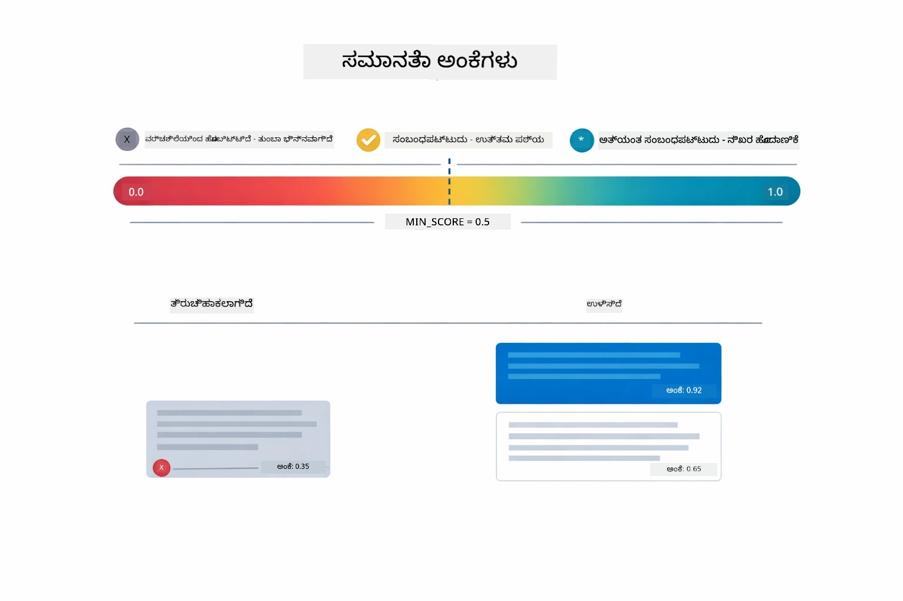

*ಈ ಚಿತ್ರಣವು 0ರಿಂದ 1ರವರೆಗೆ ಸ್ಕೋರ್ ವ್ಯಾಪ್ತಿಗಳನ್ನು ತೋರಿಸುತ್ತದೆ, ಅತಿತರ ಮೂಲ ಚಂಕುಗಳನ್ನು ಫಿಲ್ಟರ್ ಮಾಡಲು ಕನಿಷ್ಠ 0.5 ಗಡಿ ಹೊಂದಿದೆ.*

ಸ್ಕೋರ್ ವ್ಯಾಪ್ತಿಗಳು 0ರಿಂದ 1ರವರೆಗೆ:
- 0.7-1.0: ಅತ್ಯಂತ ಸಂಬಂಧಿತ, ನಿಖರ ಹೊಂದಿಕೆ
- 0.5-0.7: ಸಂಬಂಧಿತ, ಉತ್ತಮ ಪೃಥ್ವಿ
- 0.5 ಕ್ಕಿಂತ ಕೆಳಗೆ: ಫಿಲ್ಟರ್‌ಗೊಳಿಸಲ್ಪಟ್ಟ, ಬಹಳ ಅಸಂಬಂಧಿತ

ನಿರ್ದೇಶನದ ಗುಣಾತ್ಮಕತೆಗೆ ಖಚಿತತೆಗೆ ವ್ಯವಸ್ಥೆ ಕನಿಷ್ಠ ಗಡಿಯನ್ನು ಮೀರಿ వచ్చిన ಚಂಕುಗಳನ್ನು ಮಾತ್ರ ಪಡೆಯುತ್ತದೆ.

ಎಂಬೆಡ್ಡಿಂಗ್‌ಗಳು ಅರ್ಥ ಕ್ಲಸ್ಟರ್‌ಗಳು ಸ್ವಚ್ಛವಾಗಿದ್ದಾಗ ಉತ್ತಮ ಕಾರ್ಯನಿರ್ವಹಿಸುತ್ತವೆ, ಆದರೆ ಅವುಗಳಿಗೆ ಕೆಲ ಅಂಧಪ್ರದೇಶಗಳಿವೆ. ಕೆಳಗಿನ ಚಿತ್ರಣ ಸಾಮಾನ್ಯ ವೈಫಲ್ಯ ಮಾದರಿಗಳನ್ನು ತೋರಿಸುತ್ತದೆ — ಅತಿದೊಡ್ಡ ಚಂಕುಗಳು ಮಾಂಡ್ಯ ವೆಕ್ಟರ್‌ಗಳನ್ನು ಉತ್ಪತ್ತು ಮಾಡುತ್ತವೆ, ಅತ Litt ಲ ಚಂಕುಗಳು ಪೃಥ್ವಿಯ ಕೊರತೆ ಕಂಡುಬರುತ್ತದೆ, ಅನಂಬiguous ಪದಗಳು ಬಹು ಕ್ಲಸ್ಟರ್‌ಗಳಿಗೆ ಸೂಚಿಸುತ್ತವೆ, ಮತ್ತು ನಿಖರ ಹೊಂದಿಕೆಯ ಲುಕ್‌ಅಪ್‌ಗಳು (ಐಡಿಗಳು, ಭಾಗ ಸಂಖ್ಯೆಗಳು) ಎಂಬೆಡ್ಡಿಂಗ್‌ಗಳಿಗೆ ಕೆಲಸ ಮಾಡುವುದಿಲ್ಲ:

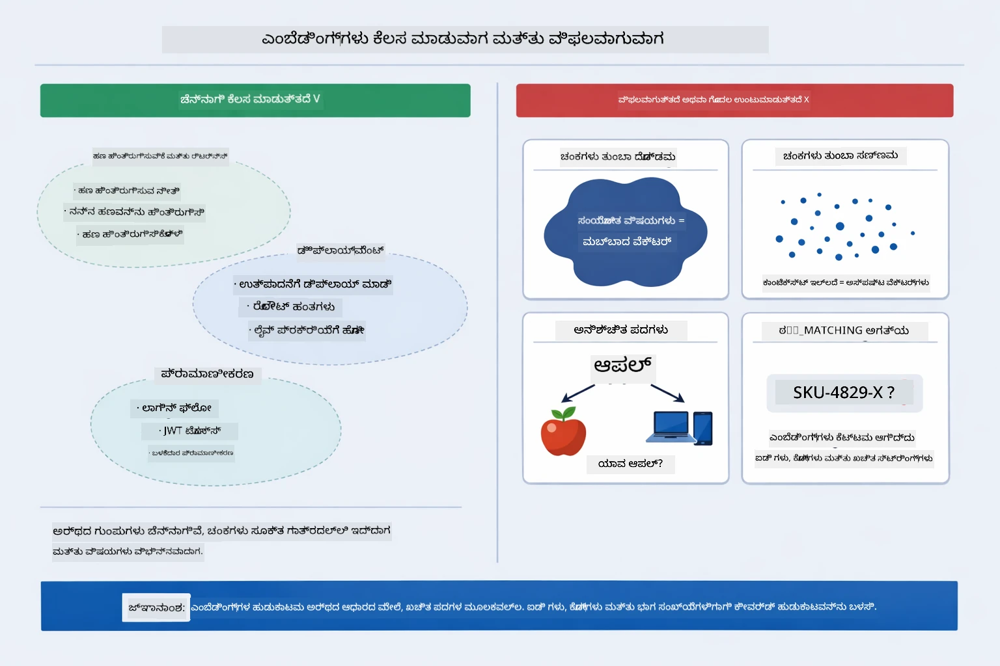

*ಈ ಚಿತ್ರಣದಲ್ಲಿ ಸಾಮಾನ್ಯ ಎಂಬೆಡ್ಡಿಂಗ್ ವಿಫಲತೆ ಮಾದರಿಗಳು ತೋರಿಸಲಾಗಿದೆ: ಚಂಕುಗಳು ತುಂಬಾ ದೊಡ್ಡದಾಗಿರೋದು, ಚಂಕುಗಳು ತುಂಬಾ ಸಣ್ಣದಾಗಿರೋದು, ಅನಂಬiguous ಪದಗಳು ಬಹು ಕ್ಲಸ್ಟರ್‌ಗಳಿಗೆ ಸೂಚಿಸುವುದು, ಮತ್ತು ನಿಖರ ಹೊಂದಿಕೆಯ ಲುಕ್‌ಅಪ್ಗಳಂತಹ ಐಡಿಗಳು.*

### ಇನ್-ಮೆಮರಿ ಸಂಗ್ರಹಣೆ

ಈ ಮಾಡ್ಯೂಲ್ ಸರಳತೆಗೆ ಇನ್-ಮೆಮರಿ ಸಂಗ್ರಹಣೆಯನ್ನು ಬಳಸುತ್ತದೆ. ನೀವು ಅಪ್ಲಿಕೇಶನ್ ಅನ್ನು ಮರುಪ್ರಾರಂಭಿಸಿದಾಗ ಅಪ್ಲೋಡ್ ಮಾಡಿದ ಡಾಕ್ಯುಮೆಂಟ್‌ಗಳು ನಷ್ಟವಾಗುತ್ತವೆ. ಉತ್ಪಾದನಾ ವ್ಯವಸ್ಥೆಗಳು Qdrant ಅಥವಾ ಅಜುರ್ AI ಸರ್ಚ್ ಇದ್ದಂತಹ ಸ್ಥಿರ ವೆಕ್ಟರ್ ಡೇಟಾಬೇಸ್‌ಗಳನ್ನು ಬಳಸುತ್ತವೆ.

### ಪೃಥ್ವಿ ವಿಂಡೋ ನಿರ್ವಹಣೆ

ಪ್ರತಿ ಮಾದರಿಯು ಗರಿಷ್ಠ ಪೃಥ್ವಿ ವಿಂಡೋ ಹೊಂದಿದೆ. ಬೃಹತ್ ಡಾಕ್ಯುಮೆಂಟ್‌ನ ಪ್ರತಿಯೊಂದು ಚಂಕುಗಳನ್ನು ಸೇರಿಸುವ ಸಾಧ್ಯತೆ ಇಲ್ಲ. ವ್ಯವಸ್ಥೆ ಮೆಚ್ಚಿನ ಟಾಪ್ N ಚಂಕುಗಳನ್ನು (ಡೀಫಾಲ್ಟ್ 5) ಪಡೆದು ಮಿತಿಗಳಿಗೆ ಒಳಗಿರುತ್ತಾ, ಸರಿಯಾದ ಉತ್ತರಕ್ಕೆ ಸಾಕಷ್ಟು ಪೃಥ್ವಿಯನ್ನು ಒದಗಿಸುತ್ತದೆ.

## RAG ಯಾರು ಮುಖ್ಯ

RAG ಸದಾ ಸರಿಯಾದ ವಿಧಾನವಲ್ಲ. ಕೆಳಗಿನ ನಿರ್ಣಯ ಮಾರ್ಗದರ್ಶಿ ನಿಮಗೆ RAG ನಲ್ಲಿ ಮೌಲ್ಯವಿದ್ದರೆ ಅಥವಾ ಸರಳ ವಿಧಾನಗಳು (ಪ್ರಾಂಪ್ಟ್‌ಗೆ ವಿಷಯವನ್ನು ನೇರ ಸೇರಿಸುವುದು ಅಥವಾ ಮಾದರಿಯ ಹೊರಗಿದ್ದ ಜ್ಞಾನವನ್ನು ನಂಬುವುದು) ಸಾಕಾಗುವುದನ್ನು ಹೇಗೆ ಗಡಿಯಿಡಬಹುದು ಎಂಬುದನ್ನು ಸಹಾಯ ಮಾಡುತ್ತದೆ:

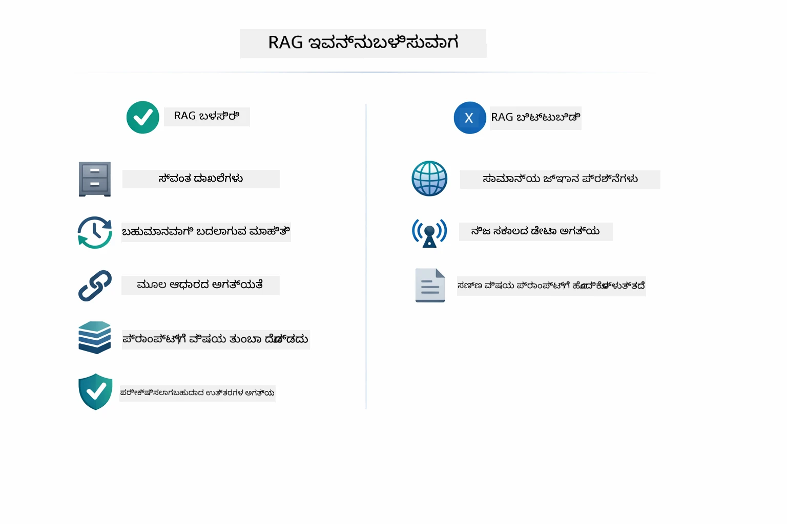

*ಈ ಚಿತ್ರಣವು RAG ಯಾಗು ಬೆಲೆ ಏರುತ್ತದೆ, ಹಾಗೂ ಎಷ್ಟಾಗಲೀ ಸರಳ ವಿಧಾನಗಳು ಸಾಕಾಗುವ ಸಂದರ್ಭವನ್ನು ತೋರಿಸುವ ನಿರ್ಣಯ ಮಾರ್ಗದರ್ಶಿಯನ್ನು ವಿವರಿಸುತ್ತದೆ.*

## ಮುಂದಿನ ಹಂತಗಳು

**ಮುಂದಿನ ಮಾಡ್ಯೂಲ್:** [04-tools - ಸಾಧನಗಳೊಂದಿಗೆ ಕೃತಕ ಬುದ್ಧಿಮತ್ತೆ ಏಜೆಂಟ್ಗಳು](../04-tools/README.md)

---

**ನಿರ್ದೇಶನ:** [← ಹಿಂದಿನ: ಮಾಡ್ಯೂಲ್ 02 - ಪ್ರಾಂಪ್ಟ್ ಎಂಜಿನಿಯರಿಂಗ್](../02-prompt-engineering/README.md) | [ಮೂಲಕ್ಕೆ ಹಿಂತಿರುಗಿ](../README.md) | [ಮುಂದಿನ: ಮಾಡ್ಯೂಲ್ 04 - ಸಾಧನಗಳು →](../04-tools/README.md)

---

<!-- CO-OP TRANSLATOR DISCLAIMER START -->
**ತಪ್ಪಿಸು ಸೂಚನೆ**:
ಈ ಡಾಕ್ಯುಮೆಂಟ್ ಅನ್ನು AI ಅನುವಾದ ಸೇವೆ [Co-op Translator](https://github.com/Azure/co-op-translator) ಬಳಸಿ ಅನುವಾದಿಸಲಾಗಿದೆ. ನಾವು ನಿಖರತೆಗೆ ಪ್ರಯತ್ನಿಸುವುದರಿಂದ, ಸ್ವಯಂಚಾಲಿತ ಅನುವಾದಗಳಲ್ಲಿ ತಪ್ಪುಗಳು ಅಥವಾ ಅವಿವೇಕತೆಗಳಿರುವ ಸಾಧ್ಯತೆಯಿದೆ ಎಂದು ದಯವಿಟ್ಟು ಗಮನಿಸಿ. ಮೂಲ ಡಾಕ್ಯುಮೆಂಟ್ ಅದರ ಮೂಲ ಭಾಷೆಯಲ್ಲಿ ಅಧಿಕೃತ ಮೂಲವಾಗಿರುತ್ತದೆ ಎಂದು ಪರಿಗಣಿಸಬೇಕು. ಪ್ರಮುಖ ಮಾಹಿತಿಗಾಗಿ, ವೃತ್ತಿಪರ ಮಾನವ ಅನುವಾದವನ್ನು ಶಿಫಾರಸು ಮಾಡಲಾಗಿದೆ. ಈ ಅನುವಾದ ಬಳಕೆಯಿಂದ ಸಂಭವಿಸುವ ಯಾವುದೇ ತಪ್ಪು ಗ್ರಹಿಕೆಗಳು ಅಥವಾ ತಪ್ಪು ಅರ್ಥಗಳನ್ನು ನಾವು ಹೊಣೆಗಾರರಾಗುವುದಿಲ್ಲ.
<!-- CO-OP TRANSLATOR DISCLAIMER END -->