# ಮೋಡ್ಯೂಲ್ 04: ಸಾಧನಗಳೊಂದಿಗೆ AI ಏಜೆಂಟ್ಗಳು

## ವಿಷಯದ ಪಟ್ಟಿ

- [ನೀವು ಕಲಿಯುವುದು ಏನು](../../../04-tools)
- [ಮುಂದಿನ ಅಗತ್ಯಗಳು](../../../04-tools)
- [ಸಾಧನಗಳೊಂದಿಗೆ AI ಏಜೆಂಟ್ಗಳನ್ನು ಅರ್ಥಮಾಡಿಕೊಳ್ಳುವುದು](../../../04-tools)
- [ಸಾಧನ ಕರೆ ಮಾಡುವುದೂ ಹೇಗೆ ಕಾರ್ಯನಿರ್ವಹಿಸುತ್ತದೆ](../../../04-tools)
  - [ಸಾಧನ ವ್ಯಾಖ್ಯಾನಗಳು](../../../04-tools)
  - [ನಿರ್ಧಾರಮಾಡುವುದು](../../../04-tools)
  - [ನಿರ್ವಹಣೆ](../../../04-tools)
  - [ಪ್ರতিক್ರಿಯಾ ಸೃಷ್ಟಿ](../../../04-tools)
  - [ವ್ಯವಸ್ಥಾಪನೆಯ ರಚನೆ: ಸ್ಪ್ರಿಂಗ್ ಬೂಟ್ ಆಟೋ-ವೈರಿಂಗ್](../../../04-tools)
- [ಸಾಧನ ಸರಪಳಿ](../../../04-tools)
- [ಅನ್ವಯಿಕೆಯನ್ನು ಚಾಲನೆಮಾಡಿ](../../../04-tools)
- [ಅನ್ವಯಿಕೆಯನ್ನು ಬಳಸುವುದು](../../../04-tools)
  - [ಸರಳ ಸಾಧನ ಬಳಕೆಯನ್ನು ಪ್ರಯತ್ನಿಸಿ](../../../04-tools)
  - [ಸಾಧನ ಸರಪಳಿಯನ್ನು ಪರೀಕ್ಷಿಸಿ](../../../04-tools)
  - [ಸಂಭಾಷಣೆ ಹರಿವನ್ನು ನೋಡಿ](../../../04-tools)
  - [ವಿಭಿನ್ನ ವಿನಂತಿಗಳೊಂದಿಗೆ ಪ್ರಯೋಗ ಮಾಡಿ](../../../04-tools)
- [ಪ್ರಮುಖ ಸಂಕಲ್ಪನೆಗಳು](../../../04-tools)
  - [ReAct ಮுறை (ಕಾರಣ ಮತ್ತು ಕ್ರಿಯೆ)](../../../04-tools)
  - [ಸಾಧನ ವಿವರಣೆಗಳು ಮಹತ್ವವಿದೆ](../../../04-tools)
  - [ಸತ್ರ ನಿರ್ವಹಣೆ](../../../04-tools)
  - [ದೋಷ ನಿರ್ವಹಣೆ](../../../04-tools)
- [ಲಭ್ಯವಿರುವ ಸಾಧನಗಳು](../../../04-tools)
- [ಯಾವಾಗ ಸಾಧನ ಆಧಾರಿತ ಏಜೆಂಟ್‌ಗಳನ್ನು ಬಳಸುವುದು](../../../04-tools)
- [ಸಾಧನಗಳು ಮತ್ತು RAG](../../../04-tools)
- [ಮುಂದಿನ ಹೆಜ್ಜೆಗಳು](../../../04-tools)

## ನೀವು ಕಲಿಯುವದು ಏನು

ಈ ತನಕ, ನೀವು AI ಜೊತೆ ಸಂಭಾಷಣೆ ಮಾಡುವುದು ಹೇಗೆ, ಪ್ರಾಂಪ್ಟ್‌ಗಳನ್ನು ಪರಿಣಾಮಕಾರಿಯಾಗಿ ರಚಿಸುವುದು ಹೇಗೆ, ಮತ್ತು ಪ್ರತಿಕ್ರಿಯೆಗಳನ್ನು ನಿಮ್ಮ ದಾಖಲೆಗಳಲ್ಲಿ ಆಧಾರಿತ ಮಾಡುವುದು ಹೇಗೆ ಎಂದು ಕಲಿತಿದ್ದೀರಿ. ಆದರೆ ಇನ್ನೂ ಒಂದು ಮೂಲಭೂತ ಮಿತಿ ಇದೆ: ಭಾಷಾ ಮಾದರಿಗಳು ಕೇವಲ ಪಠ್ಯವನ್ನು ರಚಿಸಬಹುದು. ಅವು ವಾತಾವರಣವನ್ನು ಪರಿಶೀಲಿಸಲು, ಗಣನೆಗಳನ್ನು ನಿರ್ವಹಿಸಲು, ಡೇಟಾಬೇಸ್‌ಗಳನ್ನು ಪ್ರಶ್ನಿಸಲು ಅಥವಾ ಹೊರಗಿನ ವ್ಯವಸ್ಥೆಗಳನ್ನು ಸಂಪರ್ಕಿಸಲು ಸಾಧ್ಯವಿಲ್ಲ.

ಸಾಧನಗಳು ಇದನ್ನು ಬದಲಿಸಿವೆ. ಮಾದರಿ ಕರೆ ಮಾಡಬಹುದಾದ ಕಾರ್ಯಗಳನ್ನು ಪಡೆಯುವುದರಿಂದ, ನೀವು ಅದನ್ನು ಪಠ್ಯ ಜನಕದಿಂದ	Action ತೆಗೆದುಕೊಳ್ಳುವ ಏಜೆಂಟ್ ಆಗಿ ಪರಿವರ್ತಿಸುತ್ತೀರಿ. ಮಾದರಿ ಯಾವಾಗ ಮತ್ತು ಯಾವ ಸಾಧನವನ್ನು ಬಳಸಬೇಕು ಮತ್ತು ಯಾವ ಪರಿಮಾಣಗಳನ್ನು ಪಾಸ್ ಮಾಡಬೇಕು ಎಂದು ನಿರ್ಧರಿಸುತ್ತದೆ. ನಿಮ್ಮ ಕೋಡ್ ಕಾರ್ಯವನ್ನು ನಿರ್ವಹಿಸಿ ಫಲಿತಾಂಶ ಹಿಂತಿರುಗಿಸುತ್ತದೆ. ಮಾದರಿ ಆ ಫಲಿತಾಂಶವನ್ನು ತನ್ನ ಪ್ರತಿಕ್ರಿಯೆಯಲ್ಲಿ ಸೇರಿಸುತ್ತದೆ.

## ಮುಂದಿನ ಅಗತ್ಯಗಳು

- [ಮೋಡ್ಯೂಲ್ 01 - ಪರಿಚಯ](../01-introduction/README.md) ಪೂರ್ಣಗೊಳಿಸಲಾಗಿದೆ (Azure OpenAI ಸಂಪನ್ಮೂಲಗಳು ನಿಯೋಜಿಸಲಾಗಿದೆ)
- ಮೊದಲುಗಿನ ಮೋಡ್ಯೂಲ್‌ಗಳನ್ನು ಪೂರ್ಣಗೊಳಿಸುವುದು ಶಿಫಾರಸು ಮಾಡಲಾಗಿದೆ (ಈ ಮೋಡ್ಯೂಲ್ [ಮೋಡ್ಯೂಲ್ 03 ರಿಂದ RAG ಗಣನೆಗಳನ್ನು](../03-rag/README.md) ಸಾಧನಗಳು ಮತ್ತು RAG ಹೋಲಿಕೆಯಲ್ಲಿ ಉಲ್ಲೇಖಿಸುತ್ತದೆ)
- ರೂಟ್ ഡയറಕ್ಟರಿಯಲ್ಲಿ `.env` ಫೈಲ್ ಇದೆ (ಮೋಡ್ಯೂಲ್ 01 ರಲ್ಲಿ `azd up` ಮೂಲಕ ಸೃಷ್ಟಿಸಲಾಗಿದೆ)

> **ಗಮನಿಸಿ:** ಮೊದಲು ಮೋಡ್ಯೂಲ್ 01 ಪೂರ್ಣಗೊಳಿಸದಿದ್ದರೆ, ಅಲ್ಲಿ ನೀಡಲಾದ ನಿಯೋಜನಾ ಸೂಚನೆಗಳನ್ನು ಮೊದಲು ಅನುಸರಿಸಿ.

## ಸಾಧನಗಳೊಂದಿಗೆ AI ಏಜೆಂಟ್ಗಳನ್ನು ಅರ್ಥಮಾಡಿಕೊಳ್ಳುವುದು

> **📝 ಸೂಚನೆ:** ಈ ಮೋಡ್ಯೂಲ್‌ನ "ಏಜೆಂಟ್ಗಳು" ಪದ ಬರೆದಿದೆ ಎಂದರೆ ಸಾಧನ ಕರೆ ಮಾಡುವ ಸಾಮರ್ಥ್ಯವನ್ನು ಹೊಂದಿರುವ AI ಸಹಾಯಕರು. ಇದು [ಮೋಡ್ಯೂಲ್ 05: MCP](../05-mcp/README.md) ನಲ್ಲಿ ಸೇರಿದ **Agentic AI** ಮಾದರಿಗಳು (ಸ್ವಯಂಚಾಲಿತ ಯೋಜನೆ, ಸ್ಮರಣೆ, ಮತ್ತು ಬಹು ಹಂತವಾದ ಯುಕ್ತಿ) ಗಳಿಂದ ವಿಭಿನ್ನವಾಗಿದೆ.

ಸಾಧನ ಇಲ್ಲದಿದ್ದರೆ, ಭಾಷಾ ಮಾದರಿ ತನ್ನ ತರಬೇತಿ ಡೇಟಾದಿಂದ ಮಾತ್ರ ಪಠ್ಯ ರಚಿಸಬಹುದು. ನೀವು ಈಗಿನ ವಾತಾವರಣ ಏನಿದೆ ಎಂದು ಕೇಳಿದರೆ, ಅದು ಅಭಿಪ್ರಾಯಿಸುತ್ತಾ ಉತ್ತರಿಸುತ್ತದೆ. ಸಾಧನಗಳನ್ನು ನೀಡಿದರೆ, ಅದು ವಾತಾವರಣ API ಅನ್ನು ಕರೆಮಾಡಬಹುದು, ಗಣನೆಗಳನ್ನು ನಿರ್ವಹಿಸಬಹುದು ಅಥವಾ ಡಾಟಾಬೇಸ್ ವಿಚಾರಿಸಬಹುದು — ಆ ನಿಜವಾದ ಫಲಿತಾಂಶಗಳನ್ನು ತನ್ನ ಪ್ರತಿಕ್ರಿಯೆಯಲ್ಲಿ ಜೋಡಿಸುತ್ತದೆ.

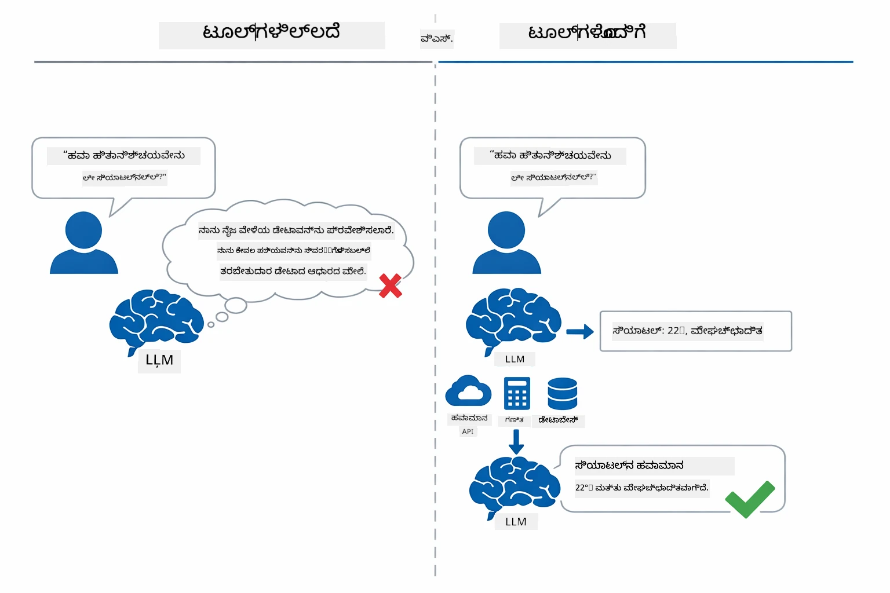

*ಸಾಧನಗಳಿಲ್ಲದಿದ್ದರೆ, ಮಾದರಿ ಕೇವಲ ಊಹೆ ಮಾಡುತ್ತದೆ - ಸಾಧನಗಳೊಂದಿಗೆ ಅದು APIಗಳು, ಗಣನೆಗಳು ಮತ್ತು ನೈಜ-ಕಾಲಿನ ಡೇಟಾ ಹಿಂತಿರುಗಿಸಬಹುದು.*

ಸಾಧನ ಹೊಂದಿರುವ AI ಏಜೆಂಟ್ **ಕಾರಣ ಮತ್ತು ಕ್ರಿಯೆ(ReAct)** ಮಾದರಿಯನ್ನು ಅನುಸರಿಸುತ್ತದೆ. ಮಾದರಿ ಕೇವಲ ಪ್ರತಿಕ್ರಿಯಿಸುವುದಿಲ್ಲ — ಅದು ತನ್ನ ಅಗತ್ಯಗಳನ್ನು ಯೋಚಿಸುತ್ತದೆ, ಸಾಧನವನ್ನು ಕರೆದು ಕ್ರಿಯೆಗೊಳ್ಳುತ್ತದೆ, ಫಲಿತಾಂಶವನ್ನು ಗಮನಿಸುತ್ತದೆ, ನಂತರ ಮತ್ತೆ ಕ್ರಿಯೆ ಮಾಡಬೇಕೆಂದು ಅಥವಾ ಅಂತಿಮ ಉತ್ತರ ನೀಡಬೇಕೆಂದು ನಿರ್ಧರಿಸುತ್ತದೆ:

1. **ಯೋಚನೆ** — ಬಳಕೆದಾರನ ಪ್ರಶ್ನೆಯನ್ನು ವಿಶ್ಲೇಷಿಸಿ ಯಾವ ಮಾಹಿತಿ ಬೇಕೆಂದು ನಿರ್ಧರಿಸುವುದು
2. **ಕ್ರೀಯೆ** — ಸೂಕ್ತ ಸಾಧನವನ್ನು ಆರಿಸಿ, ಸರಿಯಾದ ಪರಿಮಾಣಗಳನ್ನು ತಯಾರಿಸಿ ಮತ್ತು ಅದನ್ನು ಕರೆ ಮಾಡುವುದು
3. **ನೋಟ** — ಸಾಧನದ ಫಲಿತಾಂಶವನ್ನು ಸ್ವೀಕರಿಸಿ ಮೌಲ್ಯಾಂಕನ ಮಾಡುವುದು
4. **ಮರುಕಳುಹಿಸುವುದೇ ಅಥವಾ ಪ್ರತಿಕ್ರಿಯಿಸುವುದೇ** — ಹೆಚ್ಚಿನ ಡೇಟಾ ಬೇಕಾದರೆ ಅಥವಾ ಲೂಪ್ ಹಿಂತಿರುಗುವುದು; ಇಲ್ಲದಿದ್ದರೆ, ಸರ್ವಸ್ವಪ್ರಕೃತಿ ಭಾಷೆ ಉತ್ತರವನ್ನು ರಚಿಸುವುದು

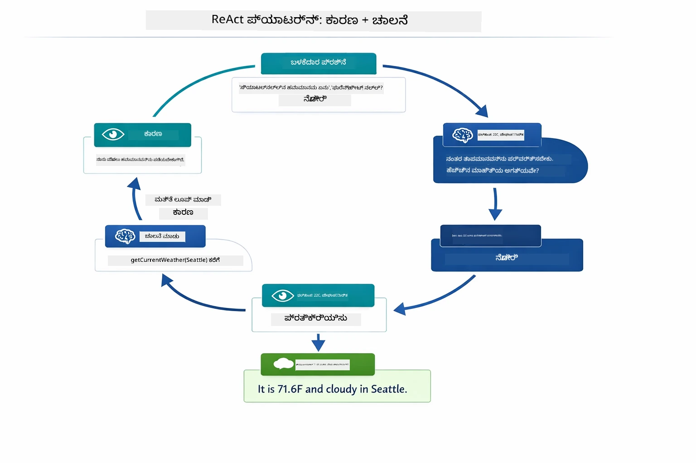

*ReAct ಚಕ್ರ — ಏಜೆಂಟ್ ಏನು ಮಾಡಬೇಕೆಂದು ಯೋಚಿಸುತ್ತಾನೆ, ಸಾಧನವನ್ನು ಕರೆದು ಕ್ರಿಯೆಗೊಳ್ಳುತ್ತಾನೆ, ಫಲಿತಾಂಶವನ್ನು ನೋಡುತ್ತಾನೆ ಮತ್ತು ಅಂತಿಮ ಉತ್ತರ ನೀಡುವವರೆಗೂ ಲೂಪ್ ಮಾಡುತ್ತಾನೆ.*

ಇದು ಸ್ವಯಂಚಾಲಿತವಾಗಿ ನಡೆಯುತ್ತದೆ. ನೀವು ಸಾಧನಗಳನ್ನು ಮತ್ತು ಅವುಗಳ ವಿವರಣೆಗಳನ್ನು ನಿರ್ಧರಿಸುತ್ತೀರಿ. ಮಾದರಿ ಅವುಗಳನ್ನು ಯಾವುದೇ ವೇಳೆ ಮತ್ತು ಹೇಗೆ ಬಳಸಬೇಕೆಂದು ನಿರ್ಧರಿಸುವುದನ್ನು ನಿಭಾಯಿಸುತ್ತದೆ.

## ಸಾಧನ ಕರೆ ಮಾಡುವುದೋ ಹೇಗೆ ಕಾರ್ಯನಿರ್ವಹಿಸುತ್ತದೆ

### ಸಾಧನ ವ್ಯಾಖ್ಯಾನಗಳು

[WeatherTool.java](../../../04-tools/src/main/java/com/example/langchain4j/agents/tools/WeatherTool.java) | [TemperatureTool.java](../../../04-tools/src/main/java/com/example/langchain4j/agents/tools/TemperatureTool.java)

ನೀವು ಸ್ಪಷ್ಟ ವಿವರಣೆಗಳೊಂದಿಗೆ ಮತ್ತು ಪರಿಮಾಣ ನಿರ್ದಿಷ್ಟೀಕರಣಗಳೊಂದಿಗೆ ಕಾರ್ಯಗಳನ್ನು ವ್ಯಾಖ್ಯಾನಿಸುತ್ತೀರಿ. ಮಾದರಿ ತನ್ನ ಸಿಸ್ಟಂ ಪ್ರಾಂಪ್ಟ್‌ನಲ್ಲಿ ಈ ವಿವರಣೆಗಳನ್ನು ನೋಡುವುದರಿಂದ, ಪ್ರತಿಯೊಂದು ಸಾಧನ ಏನು ಮಾಡುತ್ತದೆ ಎಂದು ತಿಳಿಯುತ್ತದೆ.

```java
@Component
public class WeatherTool {
    
    @Tool("Get the current weather for a location")
    public String getCurrentWeather(@P("Location name") String location) {
        // ನಿಮ್ಮ ಹವಾಮಾನ ಹುಡುಕುವ ಲಾಜಿಕ್
        return "Weather in " + location + ": 22°C, cloudy";
    }
}

@AiService
public interface Assistant {
    String chat(@MemoryId String sessionId, @UserMessage String message);
}

// ಸಹಾಯಕರು ස්ಪ್ರಿಂಗ್ ಬೂಟ್ ಮೂಲಕ ಸ್ವಯಂಚಾಲಿತವಾಗಿ ಸಂಪರ್ಕಿತರಾಗುತ್ತಾರೆ:
// - ಚಾಟ್ ಮಾದರಿ ಬೀನ್
// - @Component ವರ್ಗಗಳಿಂದ ಎಲ್ಲಾ @Tool ವಿಧಾನಗಳು
// - ಸೆಷನ್ ನಿರ್ವಹಣೆಗೆ ಚಾಟ್ ಮೆಮೊರಿ ಪ್ರೋವೈಡರ್
```

ಕೆಳಗಿನ ಚಿತ್ರಣವು ಪ್ರತಿ ಟ್ಯಾಗ್ ಅನ್ನು ಪೂರ್ತಿಯಾಗಿ ವಿವರಿಸುತ್ತದೆ ಮತ್ತು ಯಾವ ಭಾಗ AI ಗೆ ಸಾಧನವನ್ನು ಯಾವಾಗ ಕರೆಮಾಡಬೇಕು ಮತ್ತು ಯಾವ_ARGUMENTS_ಗಳನ್ನು ಪಾಸ್ ಮಾಡಬೇಕು ಎಂದು ತಿಳಿಸುವಲ್ಲಿ ಸಹಾಯ ಮಾಡುತ್ತದೆ:

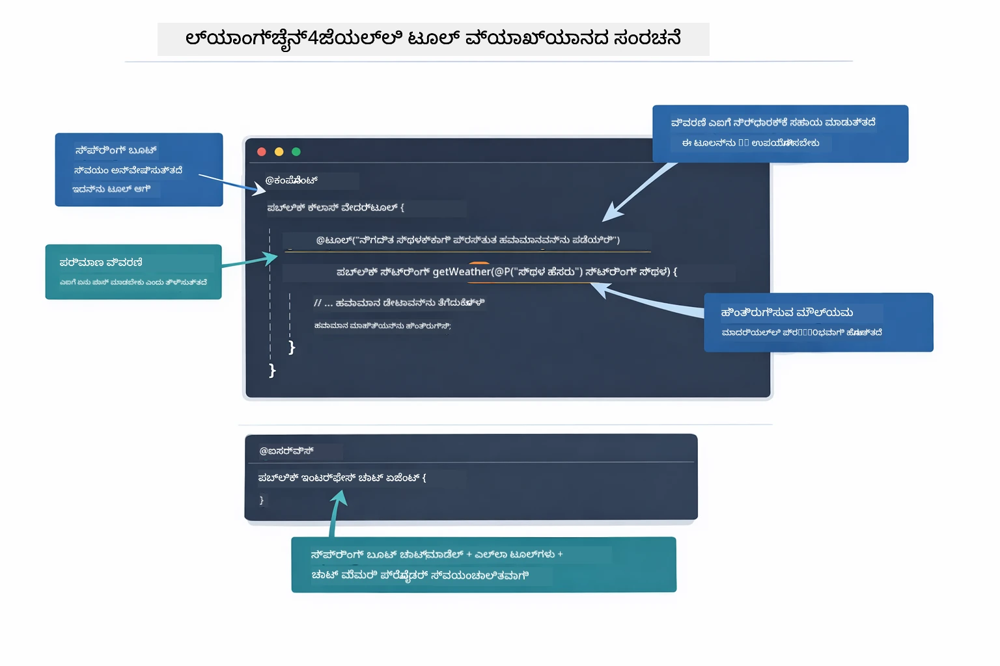

*ಸಾಧನ ವ್ಯಾಖ್ಯದ ಅಂಗಾಂಗಶಾಸ್ತ್ರ — @Tool AI ಗೆ ಅದನ್ನು ಯಾವಾಗ ಬಳಸಬೇಕು ಎಂದು ಹೇಳುತ್ತದೆ, @P ಪ್ರತಿ ಪರಿಮಾಣವನ್ನು ವಿವರಿಸುತ್ತದೆ, ಮತ್ತು @AiService ಎಲ್ಲಾ ಪ್ರಾರಂಭ時 ಪರಿಕಲ್ಪನೆಗಳನ್ನು ಜೋಡಿಸುತ್ತದೆ.*

> **🤖 [GitHub Copilot](https://github.com/features/copilot) ಚಾಟ್ ಮೂಲಕ ಪ್ರಯತ್ನಿಸಿ:** [`WeatherTool.java`](../../../04-tools/src/main/java/com/example/langchain4j/agents/tools/WeatherTool.java) ತೆರೆಯಿರಿ ಮತ್ತು ಕೇಳಿ:
> - "ನಿಜವಾದ ವಾತಾವರಣ API ಆಗಿ OpenWeatherMap ಅನ್ನು ಮೋಪ್ ಡೇಟಾ ಬದಲು ಹೇಗೆ ಏರ್ಪಡಿಸುತ್ತೇನೆ?"
> - "AI ನ್ನು ಸರಿಯಾಗಿ ಬಳಸಲು ಸಹಾಯ ಮಾಡುವ ಉತ್ತಮ ಸಾಧನ ವಿವರಣೆಗಳು ಯಾವುವು?"
> - "ಸಾಧನ ಜಾರಿಗೆ API ದೋಷಗಳು ಮತ್ತು ದರ ಮಿತಿ ಗಳನ್ನು ಹೇಗೆ ನಿರ್ವಹಿಸಬೇಕು?"

### ನಿರ್ಧಾರಮಾಡುವುದು

ಬಳಕೆದಾರರು "ಸಿಯಾಟಲ್ನಲ್ಲಿ ವಾತಾವರಣ ಏನು?" ಎಂದು ಕೇಳಿದಾಗ, ಮಾದರಿ ಯಾದೃಚ್ಛಿಕವಾಗಿ ಸಾಧನ ಆಯ್ಕೆ ಮಾಡುವುದು ಅಲ್ಲ. ಇದು ಬಳಕೆದಾರರ ಉದ್ದೇಶವನ್ನು ಹೊಂದಿರುವ ಎಲ್ಲ ಸಾಧನ ವಿವರಣೆಗಳ ವಿರುದ್ಧ ಹೋಲಿಸಿ, ಪ್ರಾಮುಖ್ಯತೆಗಾಗಿ ಪ್ರತಿಯೊಂದರ ಅಂಕೆಯನ್ನು ನೀಡುತ್ತದೆ ಮತ್ತು ಅತ್ಯುತ್ತಮ ಹೊಂದಿಕೆಯನ್ನು ಆರಿಸುತ್ತದೆ. ನಂತರ ಸರಿಯಾದ ಪರಿಮಾಣಗಳೊಂದಿಗೆ ರಚನಾತ್ಮಕ ಕಾರ್ಯ ಕರೆ ಅನ್ನು ರಚಿಸುತ್ತದೆ — ಈ ಸಂದರ್ಭದಲ್ಲಿ `location` ಅನ್ನು `"Seattle"` ಗೆ ಸೆಟ್ ಮಾಡುತ್ತದೆ.

ಬಳಕೆದಾರರ ವಿನಂತಿಗೆ ಯಾವುದೇ ಸಾಧನ ಹೊಂದದಿದ್ದರೆ, ಮಾದರಿ ತನ್ನ ಸ್ವಂತ ಜ್ಞಾನದಿಂದ ಉತ್ತರ ಕೊಡುತ್ತದೆ. ಬಹು ಸಾಧನಗಳು ಹೊಂದಿದ್ದರೆ, ಹೆಚ್ಚು ನಿಖರವಾದ ಸಾಧನವನ್ನು ಆರಿಸುತ್ತದೆ.

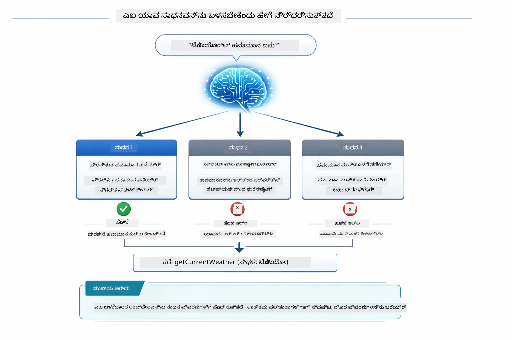

*ಮಾದರಿ ಬಳಕೆದಾರರ ಉದ್ದೇಶಕ್ಕಾಗಿ ಲಭ್ಯವಿರುವ ಪ್ರತಿಯೊಂದು ಸಾಧನವನ್ನು ಮೌಲ್ಯಮಾಪನ ಮಾಡಿ ಅತ್ಯುತ್ತಮ ಹೊಂದಿಕೆಯನ್ನು ಆರಿಸುತ್ತದೆ — ಏಕೆಂದರೆ ಸ್ಪಷ್ಟ, ನಿಖರ ಸಾಧನ ವಿವರಣೆಗಳನ್ನು ಬರೆಯುವುದು ಮಹತ್ವಪೂರ್ಣ.*

### ನಿರ್ಗಮನ

[AgentService.java](../../../04-tools/src/main/java/com/example/langchain4j/agents/service/AgentService.java)

ಸ್ಪ್ರಿಂಗ್ ಬೂಟ್ `@AiService` ಇಂಟರ್ಫೇಸ್ ಅನ್ನು ನೊಂದಾಯಿಸಿದ ಎಲ್ಲ ಸಾಧನಗಳೊಂದಿಗೆ ಆಟೋ-ವೈರ್ ಮಾಡುತ್ತದೆ, ಮತ್ತು LangChain4j ಸಾಧನ ಕರೆಗಳನ್ನು ಸ್ವಯಂಚಾಲಿತವಾಗಿ ಕಾರ್ಯಗತಗೊಳಿಸುತ್ತದೆ. ಬಳಕೆದಾರರ ಸರ್ವಸ್ವ ಭಾಷೆಯ ಪ್ರಶ್ನೆಯಿಂದ ಆಮದು ಹೋಗಿ ಪ್ರಕ್ರಿಯೆಯು ಆರು ಹಂತಗಳ ಮೂಲಕ ಪೂರ್ತಿಯಾಗುತ್ತದೆ:

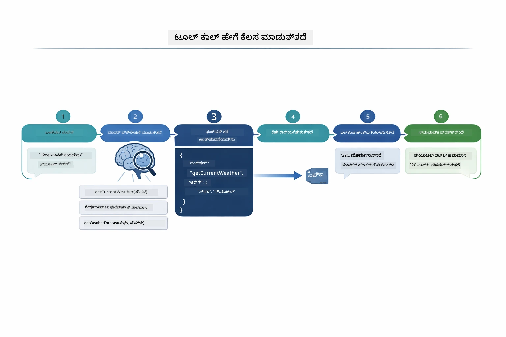

*ಅಂತಿಮ ಪ್ರಕ್ರಿಯೆ — ಬಳಕೆದಾರನು ಪ್ರಶ್ನೆ ಕೇಳುತ್ತಾನೆ, ಮಾದರಿ ಸಾಧನ ಆಯ್ಕೆ ಮಾಡುತ್ತದೆ, LangChain4j ಅದನ್ನು ಕಾರ್ಯಗತಗೊಳಿಸುತ್ತದೆ, ಮತ್ತು ಮಾದರಿ ಫಲಿತಾಂಶವನ್ನು ಚುರುಕಾದ ಪ್ರತಿಕ್ರಿಯೆಗೆ ಸೇರಿಸುತ್ತದೆ.*

ನೀವು ಮೊದಲು [ToolIntegrationDemo](../../../00-quick-start/src/main/java/com/example/langchain4j/quickstart/ToolIntegrationDemo.java) ಅನ್ನು ಚಾಲನೆ ಮಾಡಿದಿದ್ದರೆ, ಈ ಮಾದರಿಯನ್ನು ಈಗಾಗಲೇ ನೋಡಿದ್ದೀರಿ — `Calculator` ಸಾಧನಗಳು ಹೀಗೆ ಕರೆ ಮಾಡಲಾಗುತ್ತವೆ. ಕೆಳಗಿನ ಕ್ರಮ ಚಿತ್ರವು ಆ ಡೆಮೊ ಸಮಯದಲ್ಲಿ ಯಾವುದಾಗಿತ್ತು ಎಂಬುದನ್ನು ತೋರಿಸುತ್ತದೆ:

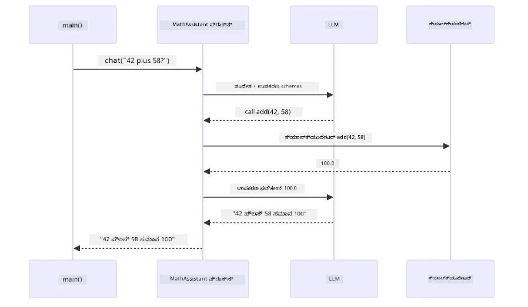

*ತ್ವರಿತ ಪ್ರಾರಂಭ ಡೆಮೊನಲ್ಲಿನ ಸಾಧನ-ಕರೆ ಲೂಪ್ — `AiServices` ನಿಮ್ಮ ಸಂದೇಶ ಮತ್ತು ಸಾಧನ ಸ್ಕೀಮಾಗಳನ್ನು LLM ಗೆ ಕಳುಹಿಸುತ್ತದೆ, LLM `add(42, 58)` ಹೀಗೆ ಕಾರ್ಯ ಕರೆ ಮರುಪಡೆಸುತ್ತದೆ, LangChain4j `Calculator` ವಿಧಾನವನ್ನು ಸ್ಥಳೀಯವಾಗಿ ಕಾರ್ಯಗತಗೊಳಿಸಿ ಫಲಿತಾಂಶವನ್ನು ಹಿಂತಿರುಗಿಸುತ್ತದೆ.*

> **🤖 [GitHub Copilot](https://github.com/features/copilot) ಚಾಟ್ ಮೂಲಕ ಪ್ರಯತ್ನಿಸಿ:** [`AgentService.java`](../../../04-tools/src/main/java/com/example/langchain4j/agents/service/AgentService.java) ತೆರೆಯಿರಿ ಮತ್ತು ಕೇಳಿ:
> - "ReAct ಮಾದರಿ ಹೇಗೆ ಕಾರ್ಯನಿರ್ವಹಿಸುತ್ತದೆ ಮತ್ತು ಏಕೆ ಅದು AI ಏಜೆಂಟ್ಗಳಿಗೆ ಪರಿಣಾಮಕಾರಿಯಾಗಿದೆ?"
> - "ಏಜೆಂಟ್ ಯಾವ ಸಾಧನವನ್ನು ಯಾವ ಕ್ರಮದಲ್ಲಿಯೇ ಬಳಸಬೇಕು ಎಂದು ಹೇಗೆ ನಿರ್ಧರಿಸುತ್ತದೆ?"
> - "ಒಂದು ಸಾಧನ ಕಾರ್ಯಗತಗೊಳಿಸುವಿಕೆ ವಿಫಲವಾದರೆ ಏನು ಆಗುತ್ತದೆ - ದೋಷಗಳನ್ನು ಬದ್ಧವಾಗಿ ಹೇಗೆ ನಿರ್ವಹಿಸಬೇಕು?"

### ಪ್ರತಿಕ್ರಿಯಾ ಸೃಷ್ಟಿ

ಮಾದರಿ ವಾತಾವರಣದ ದತ್ತಾಂಶವನ್ನು ಪಡೆದ 후 ಅದನ್ನು ಬಳಕೆದಾರರಿಗಾಗಿ ನೈಸರ್ಗಿಕ ಭಾಷೆಯ ಪ್ರತಿಕ್ರಿಯೆಯಾಗಿವರೆಗೆ ರೂಪುಗೊಳ್ಳುತ್ತದೆ.

### ವ್ಯವಸ್ಥಾಪನೆಯ ರಚನೆ: ಸ್ಪ್ರಿಂಗ್ ಬೂಟ್ ಆಟೋ-ವೈರಿಂಗ್

ಈ ಮೋಡ್ಯೂಲ್ LangChain4j ಯ ಸ್ಪ್ರಿಂಗ್ ಬೂಟ್ ಒಂದುಗೂಡಿಕೆ ಬಳಸುತ್ತದೆ, ಇದರಲ್ಲಿ `@AiService` ಇಂಟರ್ಫೇಸರುಗಳೊಂದಿಗೆ ಪ್ರತ್ಯೇಕ ಮಾಡುತ್ತದೆ. ಆರಂಭದಲ್ಲಿ ಸ್ಪ್ರಿಂಗ್ ಬೂಟ್ ಪ್ರತಿಯೊಂದು `@Component` (ಯಾವುದರಲ್ಲಿ `@Tool` ವಿಧಾನಗಳಿವೆ), ನಿಮ್ಮ `ChatModel` ಬೀನ್ ಮತ್ತು `ChatMemoryProvider` ಅನ್ನು ಕಂಡುಹಿಡಿದು ಅವನ್ನು ಶೂನ್ಯ ಬೋಯ್ಲರ್ ಪ್ಲೇಟ್ ಹೊಂದಿರುವ ಒಂದು `Assistant` ಇಂಟರ್ಫೇಸ್‌ಗೆ ವೈರ್ ಮಾಡುತ್ತದೆ.

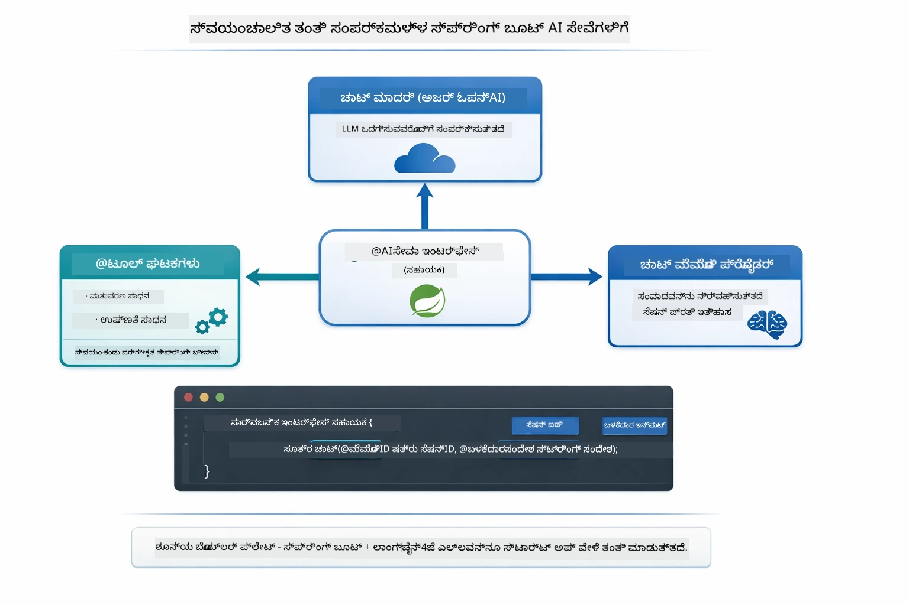

*@AiService ಇಂಟರ್ಫೇಸ್ ChatModel, ಸಾಧನ ಘಟಕಗಳು ಮತ್ತು ಸ್ಮೃತಿ ಪೂರೈಕೆದಾರರನ್ನು ಒಟ್ಟುಗೂಡಿಸುತ್ತದೆ — ಸ್ಪ್ರಿಂಗ್ ಬೂಟ್ ಎಲ್ಲ ವೈರ್ ಮಾಡುವುದನ್ನು ಸ್ವಯಂಚಾಲಿತವಾಗಿ ನಿಭಾಯಿಸುತ್ತದೆ.*

ಇದು ಸಂಪೂರ್ಣ ವಿನಂತಿ ಜೀವನಚಕ್ರವನ್ನು ಕ್ರಮ ಚಿತ್ರವಾಗಿ ನೋಡಬೇಕು — HTTP ವಿನಂತಿಯಿಂದ ಕಂಟ್ರೋಲರ್, ಸೇವೆ, ಆಟೋ-ವೈರ್ ಪ್ರಾಕ್ಸಿ ಮೂಲಕ ಸಾಧನ ಕಾರ್ಯಗತಗೊಳಿಸುವಿಕೆಯವರೆಗೆ:

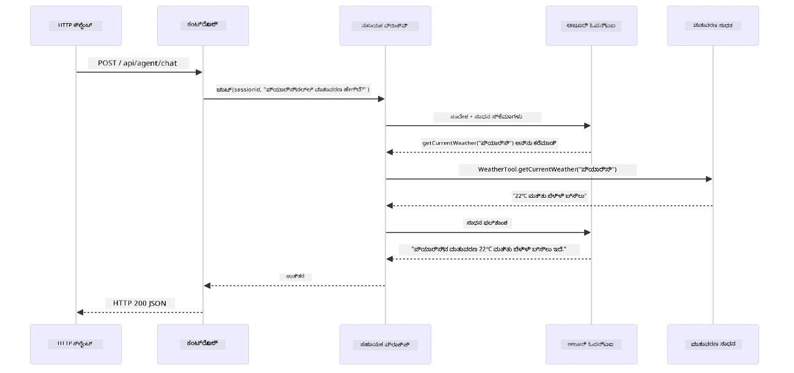

*ಮೂಲಕಸ್ಪ್ರಿಂಗ್ ಬೂಟ್ ಸಂಪೂರ್ಣ ವಿನಂತಿ ಜೀವನಚಕ್ರ — HTTP ವಿನಂತಿ ಕಂಟ್ರೋಲರ್ ಮತ್ತು ಸೇವೆಯ ಮೂಲಕ ಆಟೋ-ವೈರ್ ಆಗಿರುವ ಸಹಾಯಕ ಪ್ರಾಕ್ಸಿಗೆ ಹೋಗುತ್ತದೆ, ಅದು LLM ಮತ್ತು ಸಾಧನ ಕರೆಗಳನ್ನು ಸ್ವಯಂಚಾಲಿತವಾಗಿ ಸಂಯೋಜಿಸುತ್ತದೆ.*

ಈ ವಿಧಾನದ ಮುಖ್ಯ ಪ್ರಯೋಜನಗಳು:

- **ಸ್ಪ್ರಿಂಗ್ ಬೂಟ್ ಆಟೋ-ವೈರಿಂಗ್** — ChatModel ಮತ್ತು ಸಾಧನಗಳು ಸ್ವಯಂಚಾಲಿತವಾಗಿ ಅಳವಡಿಸಲಾಗುತ್ತದೆ
- **@MemoryId ಮಾದರಿ** — ಸ್ವಯಂಚಾಲಿತ ಸತ್ರ ಆಧಾರಿತ ಸ್ಮೃತಿ ನಿರ್ವಹಣೆ
- **ಒಂದು ಉದಾಹರಣೆ** — ಸಹಾಯಕರನ್ನು ಒಂದೇ ಬಾರಿ ಸೃಷ್ಟಿಸಿ ಉತ್ತಮ ಕಾರ್ಯದಕ್ಷತೆಯಿಗಾಗಿ ಮರುಬಳಕೆ
- **টাইಪ್-ಸೇಫ್ ಕಾರ್ಯಗತಗೊಳಿಸುವಿಕೆ** — ಜಾವಾ ವಿಧಾನಗಳನ್ನು ನೇರವಾಗಿ ಟೈಪ್ ಪರಿವರ್ತನೆಯೊಂದಿಗೆ ಕರೆ ಮಾಡುವುದು
- **ಬಹು ಹಂತ ಸಂಚಿಕೆ** — ಸಾಧನ ಸರಪಳಿಯನ್ನು ಸ್ವಯಂಚಾಲಿತವಾಗಿ ನಿರ್ವಹಿಸುತ್ತದೆ
- **ಶೂನ್ಯ ಬೋಯ್ಲರ್ ಪ್ಲೇಟ್** — ಕೈಾಮಾಡಲ್ಪಟ್ಟ `AiServices.builder()` ಕರೆಗಳು ಅಥವಾ ಸ್ಮೃತಿ ಹ್ಯಾಶ್‌ಮ್ಯಾಪ್ ಇಲ್ಲ

ಬದಲಿಗೆ ಕೈಮಟ್ಟ `AiServices.builder()` ಪ್ರಯೋಗಗಳು ಹೆಚ್ಚುವರಿ ಕೋಡ್ ಅಗತ್ಯವಿರುತ್ತದೆ ಮತ್ತು ಸ್ಪ್ರಿಂಗ್ ಬೂಟ್ ಐಕೋಷ್ಠಕ ಪ್ರಯೋಜನಗಳನ್ನು ತಪ್ಪ ಮಾಡುತ್ತವೆ.

## ಸಾಧನ ಸರಪಳಿ

**ಸಾಧನ ಸರಪಳಿ** — ಸಾಧನ ಆಧಾರಿತ ಏಜೆಂಟ್‌ಗಳ ನಿಜವಾದ ಶಕ್ತಿ ತೋರುತ್ತದೆ, ಒಂದು ಪ್ರಶ್ನೆಗೆ ಬಹು ಸಾಧನಗಳು ಬೇಕಾದಾಗ. "ಸಿಯಾಟಲ್ನಲ್ಲಿ ಫಾರೆನ್‌ಹೀಟ್ ಬೆಲೆಯಿಂದ ವಾತಾವರಣ ಏನು?" ಎಂದು ಕೇಳಿ, ಏಜೆಂಟ್ ಎರಡು ಸಾಧನಗಳನ್ನು ಸರಪಳಿಯಾಗಿ ಕರೆದೊಯ್ಯುತ್ತದೆ: ಮೊದಲಿಗೆ `getCurrentWeather` ಕರೆ ಮಾಡಿ ಸೆಲ್ಸಿಯಸ್‌ ನಲ್ಲಿ ತಾಪಮಾನ ಪಡೆಯುತ್ತದೆ, ನಂತರ ಆ ಮೌಲ್ಯವನ್ನು `celsiusToFahrenheit` ಗೆ ಕಳುಹಿಸಿ ಪರಿವರ್ತನೆ ಮಾಡಿಸಿ—ಎಲ್ಲವೊಂದು ಸಂಭಾಷಣೆ ಟರ್ನ್‌ನಲ್ಲಿ.

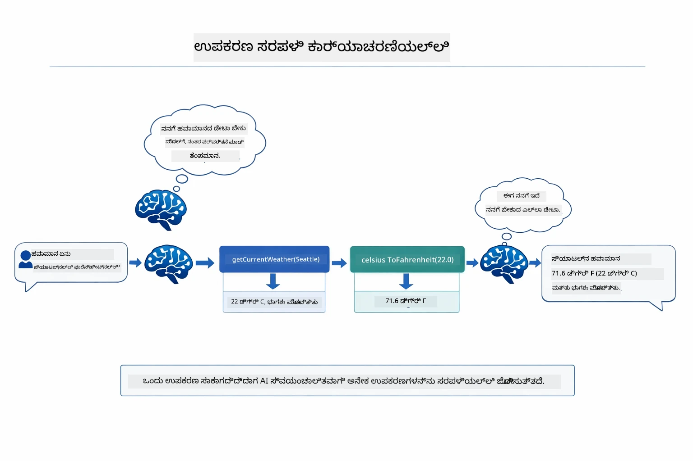

*ಸಾಧನ ಸರಪಳಿ ಕಾರ್ಯವಾಯ್ತು — ಏಜೆಂಟ್ ಮೊದಲು getCurrentWeather ಅನ್ನು ಕರೆಮಾಡುತ್ತದೆ, ನಂತರ ಸೆಲ್ಸಿಯಸ್ ಫಲಿತಾಂಶವನ್ನು celsiusToFahrenheit ಗೆ ಪೈಪ್ ಮಾಡುತ್ತದೆ ಮತ್ತು ಸಂಯೋಜಿತ ಉತ್ತರ ಒದಗಿಸುತ್ತದೆ.*

**ಸೌಮ್ಯ ವಿಫಲತೆಗಳು** — ಈಡೊಂದಿನಲ್ಲಿರುವ ನಗರ ತಪಾಸಣೆಗೆ ವಿನಂತಿಸು. ಸಾಧನ ದೋಷ ಸಂದೇಶ ಹಿಂತಿರುಗಿಸುತ್ತದೆ ಮತ್ತು AI ಸಹಾಯ ಮಾಡಲು ಸಾಧ್ಯವಿಲ್ಲ ಎಂದು ವಿವರಿಸುತ್ತದೆ, ಅಪ್ಲಿಕೇಶನ್ ಕ್ರ್ಯಾಶ್ ಆಗುವುದಿಲ್ಲ. ಸಾಧನಗಳು ಸುರಕ್ಷಿತವಾಗಿ ವಿಫಲವಾಗುತ್ತವೆ. ಕೆಳಗಿನ ಚಿತ್ರಣದಲ್ಲಿ ಈ ಎರಡು ವಿಧಾನಗಳ ಒಳಕಟ್ಟು ಚಿತ್ರಿಸಲಾಗಿದೆ — ಸೂಕ್ತ ದೋಷ ನಿರ್ವಹಣೆಯಿಂದ ಏಜೆಂಟ್ ತಪ್ಪನ್ನು ಹಿಡಿದು ಸಹಾಯಕವಾಗಿ ಉತ್ತರ ನೀಡುತ್ತದೆ, ಇಲ್ಲದೆ ಇದ್ದರೆ ಅಪ್ಲಿಕೇಶನ್ ಸಂಪೂರ್ಣ ಕ್ರ್ಯಾಶ್ ಆಗುತ್ತದೆ:

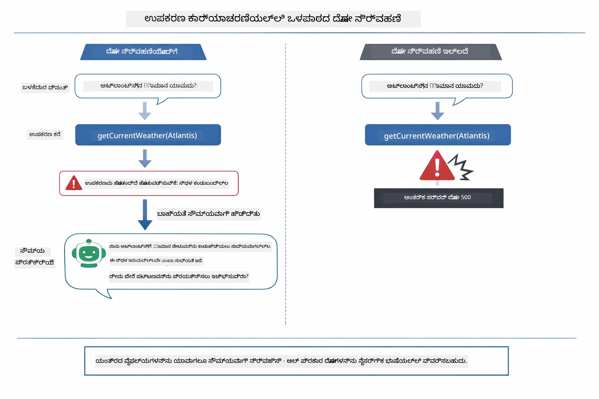

*ಸಾಧನ ವಿಫಲವಾದಾಗ, ಏಜೆಂಟ್ ದೋಷವನ್ನು ಹಿಡಿದು ಕ್ರ್ಯಾಶ್ ಆಗುವುದನ್ನು ತಪ್ಪಿಸಿ ಸಹಾಯಕ ವಿವರಣೆಯೊಂದಿಗೆ ಪ್ರತಿಕ್ರಿಯಿಸುತ್ತದೆ.*

ಇದು ಒಂದೇ ಸಂಭಾಷಣೆಯ ಟರ್ನಿನಲ್ಲಿ ನಡೆಯುತ್ತದೆ. ಏಜೆಂಟ್ ಬಹು ಸಾಧನ ಕರೆಗಳನ್ನು ಸ್ವಯಂಚಾಲಿತವಾಗಿ ಸಂಯೋಜಿಸುತ್ತದೆ.

## ಅನ್ವಯಿಕೆಯನ್ನು ಚಾಲನೆಮಾಡಿ

**ನಿಯೋಜನವನ್ನು ಪರಿಶೀಲಿಸಿ:**

ಮೂಲೆ ಡೈರೆಕ್ಟರಿಯಲ್ಲಿ `.env` ಫೈಲ್ Azure ಪ್ರಮಾಣಪತ್ರಗಳೊಂದಿಗೆ ಇರುವುದನ್ನು ಖಚಿತಪಡಿಸಿಕೊಳ್ಳಿ (ಮೋಡ್ಯೂಲ್ 01 ರಲ್ಲಿ ಸೃಷ್ಟಿಸಲಾಗಿದೆ). ಇದನ್ನು ಮೋಡ್ಯೂಲ್ ಡೈರೆಕ್ಟರಿಯಿಂದ (`04-tools/`) ಚಾಲನೆಮಾಡಿ:

**ಬ್ಯಾಶ್:**
```bash
cat ../.env  # AZURE_OPENAI_ENDPOINT, API_KEY, DEPLOYMENT ಅನ್ನು ತೋರಿಸಬೇಕು
```

**ಪವರ್‌ಷೆಲ್:**
```powershell
Get-Content ..\.env  # AZURE_OPENAI_ENDPOINT, API_KEY, DEPLOYMENT ಅನ್ನು ತೋರಿಸಬೇಕು
```

**ಅನ್ವಯಿಕೆಯನ್ನು ಪ್ರಾರಂಭಿಸಿ:**

> **ಗಮನಿಸಿ:** ನೀವು ಮೊದಲು ರೂಟ್ ಡೈರೆಕ್ಟರಿಯಿಂದ ಎಲ್ಲಾ ಅನ್ವಯಿಕೆಗಳನ್ನು `./start-all.sh` ಬಳಸಿಕೊಂಡು ಪ್ರಾರಂಭಿಸಿದ್ದರೆ (ಮೋಡ್ಯೂಲ್ 01 ರಲ್ಲಿ ವಿವರಿಸಲಾಗಿದೆ), ಈ ಮೋಡ್ಯೂಲ್ ಈಗಾಗಲೇ ಪೋರ್ಟ್ 8084 ಮೇಲೆ ಚಾಲನೆಯಲ್ಲಿದೆ. ನೀವು ಕೆಳಗಿನ ಪ್ರಾರಂಭ ಆಜ್ಞೆಗಳನ್ನು ಉಲ್ಲಂಘಿಸಿ ನೇರವಾಗಿ http://localhost:8084 ಗೆ ಹೋಗಬಹುದು.

**ಆಯ್ಕೆ 1: ಸ್ಪ್ರಿಂಗ್ ಬೂಟ್ ಡ್ಯಾಶ್‌ಬೋರ್ಡ್‌ನೊಂದಿಗೆ (VS ಕೋಡ್ ಬಳಕೆದಾರರಿಗಾಗಿ ಶಿಫಾರಸು ಮಾಡಲಾಗಿದೆ)**

ಡೆವ್ ಕಂಟೈನರ್ ಸ್ಪ್ರಿಂಗ್ ಬೂಟ್ ಡ್ಯಾಶ್‌ಬೋರ್ಡ್ ವಿಸ್ತರಣೆಯನ್ನು ಸೇರಿಸಿಕೊಂಡಿದೆ, ಇದು ಎಲ್ಲಾ ಸ್ಪ್ರಿಂಗ್ ಬೂಟ್ ಅನ್ವಯಿಕೆಗಳನ್ನು ನಿರ್ವಹಿಸಲು ದೃಶ್ಯಾತ್ಮಕ ಇಂಟರ್ಫೇಸನ್ನು ಒದಗಿಸುತ್ತದೆ. ನೀವು ಅದನ್ನು VS ಕೋಡ್‌ನ ಎಡಭಾಗದಲ್ಲಿರುವ ಕೃತ್ಯ ಬಾರಿಗೆ ಕಾಣಬಹುದು (ಸ್ಪ್ರಿಂಗ್ ಬೂಟ್ ಚಿಹ್ನೆಯನ್ನು ಹುಡುಕಿರಿ).

ಸ್ಪ್ರಿಂಗ್ ಬೂಟ್ ಡ್ಯಾಶ್‌ಬೋರ್ಡ್ ಮೂಲಕ ನೀವು:
- ವರ್ಕ್‌ಸ್ಪೇಸ್‌ನ ಎಲ್ಲಾ ಲಭ್ಯವಿರುವ ಸ್ಪ್ರಿಂಗ್ ಬೂಟ್ ಅನ್ವಯಿಕೆಗಳನ್ನು ನೋಡಬಹುದು
- ಒಂದು ಕ್ಲಿಕ್‌ನಲ್ಲಿ ಅನ್ವಯಿಕೆಗಳನ್ನು ಪ್ರಾರಂಭ/ನಿಲ್ಲಿಸಬಹುದು
- ಅನ್ವಯಿಕೆಯ ಲಾಗ್‌ಗಳನ್ನು ನಿಷ್ಕ್ರಿಯವಾಗಿ ನೋಡಬಹುದು
- ಅನ್ವಯಿಕೆಯ ಸ್ಥಿತಿಯನ್ನು ಮೇಲ್ವಿಚಾರಣೆ ಮಾಡಬಹುದು

ಸದ್ದುನ್ "tools" ನ ಪಕ್ಕದಲ್ಲಿರುವ ಪ್ಲೇ ಬಟನ್ ಕ್ಲಿಕ್ ಮಾಡಿ ಈ ಮೋಡ್ಯೂಲ್ ಪ್ರಾರಂಭಿಸಬಹುದು ಅಥವಾ ಎಲ್ಲ ಮೋಡ್ಯೂಲ್‌ಗಳನ್ನು ಒಂದೇಸಾರಿ ಪ್ರಾರಂಭಿಸಬಹುದು.

VS ಕೋಡ್‌ನಲ್ಲಿನ ಸ್ಪ್ರಿಂಗ್ ಬೂಟ್ ಡ್ಯಾಶ್‌ಬೋರ್ಡ್ ಹೀಗಿದೆ:


*VS ಕೋಡ್‌ನಲ್ಲಿನ ಸ್ಪ್ರಿಂಗ್ ಬೂಟ್ ಡ್ಯಾಶ್‌ಬೋರ್ಡ್ — ಒಂದು ಸ್ಥಳದಿಂದ ಎಲ್ಲ ಮೋಡ್ಯೂಲ್‌ಗಳನ್ನು ಪ್ರಾರಂಭಿಸಿ, ನಿಲ್ಲಿಸಿ, ಮತ್ತು ಮೇಲ್ವಿಚಾರಣೆ ಮಾಡಿ*

**ಆಯ್ಕೆ 2: ಶೆಲ್ ಸ್ಕ್ರಿಪ್ಟ್‌ಗಳ ಬಳಕೆ**

ಎಲ್ಲ ವೆಬ್ ಅನ್ವಯಿಕೆಗಳನ್ನು ಪ್ರಾರಂಭಿಸಿ (ಮೋಡ್ಯೂಲ್ 01-04):

**ಬ್ಯಾಶ್:**
```bash
cd ..  # ರೂಟ್ ಡೈರೆಕ್ಟರಿ‌ನಿಂದ
./start-all.sh
```

**PowerShell:**
```powershell
cd ..  # ರೂಟ್ ಡೈರෙක්ಟರಿ ನಿಂದ
.\start-all.ps1
```

ಅಥವಾ ಈ ಮಾಯಾಜಾಲವನ್ನು ಮಾತ್ರ ಪ್ರಾರಂಭಿಸಿ:

**Bash:**
```bash
cd 04-tools
./start.sh
```

**PowerShell:**
```powershell
cd 04-tools
.\start.ps1
```

ಎರಡೂ ಸ್ಕ್ರಿಪ್ಟ್‌ಗಳು ಮೂಲ `.env` ಕಡತದಿಂದ ಸುತ್ತಳ ಸನ್ನಿವೇಶ ವ್ಯತ್ಯಾಸಗಳನ್ನು ಸ್ವಯಂಚಾಲಿತವಾಗಿ ಲೋಡ್ ಮಾಡುತ್ತವೆ ಮತ್ತು ಅವುಗಳಿಲ್ಲದಿದ್ದರೆ JARಗಳನ್ನು ನಿರ್ಮಿಸುತ್ತವೆ.

> **ಗಮನಿಸಿ:** ಪ್ರಾರಂಭಿಸುವ ಮೊದಲು ಎಲ್ಲಾ ಮಾಯಾಜಾಲಗಳನ್ನು ಕೈಯಿಂದ ನಿರ್ಮಿಸಲು ನೀವು ಇಚ್ಛಿಸಿದರೆ:
>
> **Bash:**
> ```bash
> cd ..  # Go to root directory
> mvn clean package -DskipTests
> ```
>
> **PowerShell:**
> ```powershell
> cd ..  # Go to root directory
> mvn clean package -DskipTests
> ```

http://localhost:8084 ಅನ್ನು ನಿಮ್ಮ ಬ್ರೌಸರ್‌ನಲ್ಲಿ ತೆರೆಯಿರಿ.

**ನಿಲ್ಲಿಸಲು:**

**Bash:**
```bash
./stop.sh  # ಈ ಮódyೂಲ್ ಮಾತ್ರ
# ಅಥವಾ
cd .. && ./stop-all.sh  # ಎಲ್ಲಾ ಮಂಡಳಿಗಳು
```

**PowerShell:**
```powershell
.\stop.ps1  # ಈ ಮೋಡುಲ್ ಮಾತ್ರ
# ಅಥವಾ
cd ..; .\stop-all.ps1  # ಎಲ್ಲಾ ಮೋಡುಲ್‍ಗಳು
```

## ಅಪ್ಲಿಕೇಶನ್ ಬಳಸುವುದು

ಅಪ್ಲಿಕೇಶನ್ ಒಂದು ವೆಬ್ ಇಂಟರ್ಫೇಸ್ ಅನ್ನು ಒದಗಿಸುತ್ತದೆ, ಇಲ್ಲಿ ನೀವು ಹವಾಮಾನ ಮತ್ತು ತಾಪಮಾನ ಪರಿವರ್ತನೆ ಉಪಕರಣಗಳನ್ನು ಬಳಸುವ AI ಏಜೆಂಟ್ ಜೊತೆಗೆ ಸಂವಹನ ಮಾಡಬಹುದು. ಇಂಟರ್ಫೇಸ್ ಹೀಗಿದೆ — ಇದರಲ್ಲಿ ತ್ವರಿತ ಪ್ರಾರಂಭ ಉದಾಹರಣೆಗಳು ಮತ್ತು ವಿನಂತಿಗಳನ್ನು ಕಳುಹಿಸಲು ಚಾಟ್ ಪ್ಯಾನಲ್ ಇದೆ:

<a href="images/tools-homepage.png"></a>

*AI ಏಜೆಂಟ್ ಉಪಕರಣಗಳ ಇಂಟರ್ಫೇಸ್ - ತ್ವರಿತ ಉದಾಹರಣೆಗಳು ಮತ್ತು ಉಪಕರಣಗಳೊಂದಿಗೆ ಸಂವಹನದ ಚಾಟ್ ಇಂಟರ್ಫೇಸ್*

### ಸರಳ ಉಪಕರಣ ಬಳಕೆಯನ್ನು ಪ್ರಯತ್ನಿಸಿ

ಸರಳ ವಿನಂತಿಯಿಂದ ಪ್ರಾರಂಭಿಸಿ: "100 ಡಿಗ್ರೀ ಫಾರೆನ್‌ಹೈಟ್ ಅನ್ನು ಸೆಲ್ಸಿಯಸ್‌ಗೆ ಪರಿವರ್ತಿಸಿ". ಏಜೆಂಟ್ ಪರಿವರ್ತನೆ ಉಪಕರಣ ಅಗತ್ಯವ olduğunu ಗುರುತಿಸುತ್ತದೆ, ಸರಿಯಾದ ಪರಿಮಾಣಗಳೊಂದಿಗೆ ಅದನ್ನು ಕರೆದು ಫಲಿತಾಂಶ ನೀಡುತ್ತದೆ. ಇದು ಹೇಗೆ ಸ್ವಾಭಾವಿಕವಾಗಿ ನಡೆಯುತ್ತದೆ ಎಂಬುದನ್ನು ಗಮನಿಸಿ - ನೀವು ಯಾವ ಉಪಕರಣವನ್ನು ಬಳಸಬೇಕು ಅಥವಾ ಅದನ್ನು ಹೇಗೆ ಕರೆಸಬೇಕು ಎಂಬುದನ್ನು ಸೂಚಿಸಿರಲಿಲ್ಲ.

### ಉಪಕರಣ ಸರಪಳಿಯನ್ನು ಪರೀಕ್ಷಿಸಿ

ಈಗ ಸ್ವಲ್ಪ ਕੁಂಜಿ vinಂತಿಯನ್ನು ಪ್ರಯತ್ನಿಸಿ: "ಸೀಯಾಟಲ್‌ನ ಹವಾಮಾನ ಏನು ಮತ್ತು ಅದನ್ನು ಫಾರೆನ್‌ಹೈಟಿಗೆ ಪರಿವರ್ತಿಸಿ?" ಏಜೆಂಟ್ ಹಂತಗಳಾಗಿ ಈ ಕೆಲಸವನ್ನು ಮಾಡುತ್ತಿರುವುದನ್ನು ನೋಡಿರಿ. ಪ್ರಥಮವಾಗಿ ಹವಾಮಾನ ಪಡೆಯುತ್ತದೆ (ಸೇಲ್ಸಿಯಸ್‌ನಲ್ಲಿ ಬರುತ್ತದೆ), ಅದು ಫಾರೆನ್‌ಹೈಟ್‌ಗೆ ಪರಿವರ್ತಿಸಬೇಕೆಂದು ಗುರುತಿಸಿ, ಪರಿವರ್ತನೆ ಉಪಕರಣವನ್ನು ಕರೆಸಿ, ಮತ್ತು ಎರಡೂ ಫಲಿತಾಂಶಗಳನ್ನು ಒಂದೇ ಪ್ರತಿಕ್ರಿಯೆಯಾಗಿ ಸಂಯೋಜಿಸುತ್ತದೆ.

### ಸಂವಾದದ ಹರಿವನ್ನು ನೋಡಿ

ಚಾಟ್ ಇಂಟರ್ಫೇಸ್ ಸಂವಾದ ಇತಿಹಾಸವನ್ನು ನಿರ್ವಹಿಸುತ್ತದೆ, ಇದು ನಿಮಗೆ ಬಹು-ತಿರುಗಾಟ ಸಂವಹನ ಮಾಡಲು ಅವಕಾಶ ಕೊಡುತ್ತದೆ. ಎಲ್ಲ ಹಿಂದಿನ ಪ್ರಶ್ನೆಗಳು ಮತ್ತು ಉತ್ತರಗಳನ್ನು ನೋಡಬಹುದು, ಇದು ಸಂಭಾಷಣೆಯನ್ನು ಟ್ರ್ಯಾಕ್ ಮಾಡುವುದು ಮತ್ತು ಏಜೆಂಟ್ ಹಲವು ವಿನಿಮಯಗಳಲ್ಲಿ ಸಂದರ್ಭವನ್ನು ಹೇಗೆ ನಿರ್ಮಿಸುತ್ತೋ ಅದು ತಿಳಿಯಲು ಸುಲಭ ಮಾಡುತ್ತದೆ.

<a href="images/tools-conversation-demo.png"></a>

*ಬಹು-ತಿರುಗಾಟ ಸಂಭಾಷಣೆ - ಸರಳ ಪರಿವರ್ತನೆಗಳು, ಹವಾಮಾನ ಕೇಳುಕು ಮತ್ತು ಉಪಕರಣ ಸರಪಳಿ ಬೋರಿಸುವುದು*

### ವಿಭಿನ್ನ ವಿನಂತಿಗಳನ್ನು ಪ್ರಯತ್ನಿಸಿ

ವಿವಿಧ ಸಂಯೋಜನೆಗಳನ್ನು ಪ್ರಯತ್ನಿಸಿ:
- ಹವಾಮಾನ ವಿಚಾರಣೆಗಳು: "ಟೋಕಿಯೋದಲ್ಲಿ ಹವಾಮಾನ ಹೇಗಿದೆ?"
- ತಾಪಮಾನ ಪರಿವರ್ತನೆಗಳು: "25°C ಅನ್ನು ಕೆಲ್ವಿನ್‌ಗೆ ಪರಿವರ್ತಿಸಿ?"
- ಸಂಯೋಜಿತ ಪ್ರಶ್ನೆಗಳು: "ಪ್ಯಾರಿಸ್‌ನಲ್ಲಿ ಹವಾಮಾನ ಪರಿಶೀಲಿಸಿ ಮತ್ತು ಅದು 20°C ಕ್ಕಿಂತ ಮೇಲಿದೆ ಎಂದು ತಿಳಿಸಿ"

ಏಜೆಂಟ್ ಸ್ವಾಭಾವಿಕ ಭಾಷೆಯನ್ನು ಹೇಗೆ ಅರ್ಥಮಾಡಿಕೊಳ್ಳುತ್ತದೆ ಮತ್ತು ಅದು ಯುಕ್ತ ಉಪಕರಣ ಕಾಲ್‌ಗಳಿಗೆ ಹೇಗೆ ನಕ್ಷೆ ಮಾಡಲು ಸಹಾಯ ಮಾಡುತ್ತದೆ ನೋಡಿ.

## ಪ್ರಮುಖ ಆಲೋಚನೆಗಳು

### ReAct ಮಾದರಿ (ಕಾರಣ ನಿರ್ಧಾರ ಮತ್ತು ಕ್ರಿಯೆ)

ఏಜೆಂಟ್ ಕ್ರಮವಾಗಿ ಕಾರಣ ನಿರ್ಧಾರ (ಏನು ಮಾಡಬೇಕು ಎಂದು ತೀರ್ಮಾನಿಸುವುದು) ಮತ್ತು ಕಾರ್ಯಾಚರಣೆ (ಉಪಕರಣಗಳನ್ನು ಬಳಸುವುದು) ಮಾಡುತ್ತದೆ. ಈ ಮಾದರಿ ಸ್ವಯಂಚಾಲಿತ ಸಮಸ್ಯೆ ಪರಿಹಾರಕ್ಕೆ ಸಾಧ್ಯತೆ ಒದಗಿಸುತ್ತದೆ, ಕೇವಲ ಸೂಚನೆಗಳಿಗೆ ಪ್ರತಿಕ್ರಿಯಿಸಲು ಅಲ್ಲ.

### ಉಪಕರಣ ವಿವರಣೆಗಳು ಮುಖ್ಯ

ನಿಮ್ಮ ಉಪಕರಣ ವಿವರಣೆಗಳ ಗುಣಮಟ್ಟ ನೇರವಾಗಿ ಏಜೆಂಟ್ ಅದನ್ನು ಬಳಸುವಷ್ಟು ಪ್ರಭಾವ ಬೀರುತ್ತದೆ. ಸ್ಪಷ್ಟ, ನಿರ್ದಿಷ್ಟ ವಿವರಣೆಗಳು ಮಾದರಿಯನ್ನು ಯಾವಾಗ ಮತ್ತು ಹೇಗೆ ಪ್ರತಿಯೊಂದು ಉಪಕರಣವನ್ನು ಕರೆಸಬೇಕು ಎಂಬುದನ್ನು ಅರ್ಥಮಾಡಿಕೊಳ್ಳಲು ಸಹಾಯ ಮಾಡುತ್ತವೆ.

### ಸೆಷನ್ ನಿರ್ವಹಣೆ

`@MemoryId` ಅನೋಟೇಶನ್ ಸ್ವಯಂಚಾಲಿತ ಸೆಷನ್ ಆಧಾರಿತ ಮೆಮೊರಿ ನಿರ್ವಹಣೆಯನ್ನು ಸಕ್ರಿಯಗೊಳಿಸುತ್ತದೆ. ಪ್ರತಿ ಸೆಷನ್ ಐಡಿ ತನ್ನದೇ ಆದ `ChatMemory` ಇನ್ಸ್ಟನ್ಸ್ ಹೊಂದಿದ್ದು `ChatMemoryProvider` ಬೀನ್ ಮೂಲಕ ನಿರ್ವಹಿಸಲಾಗುತ್ತದೆ, ಹೀಗಾಗಿ ಅನೇಕ ಬಳಕೆದಾರರು ಏಕಕಾಲದಲ್ಲಿ ಏಜೆಂಟ್ ಜೊತೆ ಸಂವಹನ ಮಾಡಿದರೂ ಸಂಭಾಷಣೆಗಳು ಮಿಶ್ರಣವಾಗುವುದಿಲ್ಲ. ಕೆಳಗಿನ ಚಿತ್ರಣದಲ್ಲಿ ಅನೇಕ ಬಳಕೆದಾರರು ತಮ್ಮ ಸೆಷನ್ ಐಡಿಗಳ ಆಧಾರದ ಮೇಲೆ ಬೇರು ಮೆಮೊರಿ ಸ್ಟೋರ್‌ಗೆ ರುಟಿಂಗ್ ಆಗುವವಿಧಾನವನ್ನು ತೋರಿಸಲಾಗಿದೆ:

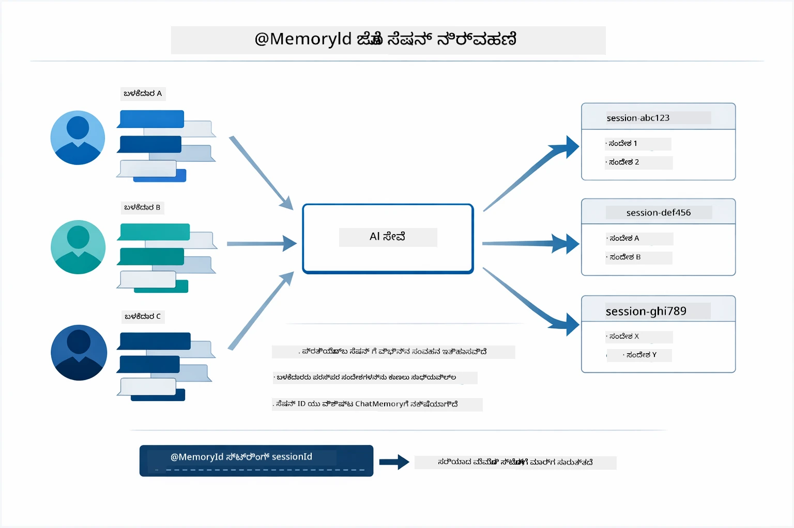

*ಪ್ರತಿ ಸೆಷನ್ ಐಡಿ ಬೇರೆ ಸಂವಾದ ಇತಿಹಾಸಕ್ಕೆ ನಕ್ಷೆಗಳು — ಬಳಕೆದಾರರು ಒಬ್ಬರ ಸಂದೇಶಗಳನ್ನು ನೋಡಲು ಸಾಧ್ಯವಿಲ್ಲ.*

### ದೋಷ ನಿರ್ವಹಣೆ

ಉಪಕರಣಗಳು ವಿಫಲವಾಗಬಹುದು — API ಗಳು ಟೈಮೌಟ್ ಆಗಬಹುದು, ಪ್ಯಾರಾಮೆಟರ್‌ಗಳು ಅಮಾನ್ಯವಾಗಿರಬಹುದು, ಬಾಹ್ಯ ಸೇವೆಗಳು ಕೆಡಬಹುದು. ಉತ್ಪಾದನೆ ಏಜೆಂಟ್ಗಳಿಗೆ ದೋಷ ನಿರ್ವಹಣೆ ಅಗತ್ಯ, ಇದರಿಂದ ಮಾದರಿ ಸಮಸ್ಯೆಗಳನ್ನು ವಿವರಿಸಬಹುದಾದಂತೆ ಅಥವಾ ಪರ್ಯಾಯ ಮಾರ್ಗಗಳನ್ನು ಪ್ರಯತ್ನಿಸಬಹುದಾಗಿರುತ್ತದೆ, ಸಂಪೂರ್ಣ ಅಪ್ಲಿಕೇಶನ್ ಕಗೆದುಬೀಳದಂತೆ. ಉಪಕರಣವು ಒಪ್ಪಾಂತ್ಯವನ್ನು ಹೇಗೆ ಎಸೆಯುತ್ತದೋ LangChain4j ಅದನ್ನು ಹಿಡಿದು ತಪ್ಪು ಸಂದೇಶವನ್ನು ಮಾದರಿಗೆ ಹಿಂತಿರುಗಿಸುತ್ತದೆ, ಇದು ಸ್ವಾಭಾವಿಕ ಭಾಷೆಯಲ್ಲಿ ಸಮಸ್ಯೆಯನ್ನು ವಿವರಿಸಬಹುದು.

## ಲಭ್ಯವಿರುವ ಉಪಕರಣಗಳು

ಕೆಳಗಿನ ಚಿತ್ರಣದಲ್ಲಿ ನೀವು ನಿರ್ಮಿಸಬಹುದಾದ ವ್ಯಾಪಕ ಉಪಕರಣ ಪರಿಸರವನ್ನು ತೋರಿಸಲಾಗಿದೆ. ಈ ಮಾಯಾಜಾಲವು ಹವಾಮಾನ ಮತ್ತು ತಾಪಮಾನ ಉಪಕರಣಗಳನ್ನು ತೋರಿಸುತ್ತದೆ, ಆದರೆ ಇದೇ `@Tool` ಮಾದರಿ ಯಾವುದೇ ಜಾವಾ ವಿಧಾನಕ್ಕೆ ಬಳಕೆಯಾಗಬಹುದು — ಡೇಟಾಬೇಸ್ ಪ್ರಶ್ನೆಗಳಿಂದ ಪಾವತಿ ಪ್ರಕ್ರಿಯೆಗೆವರೆಗೆ.

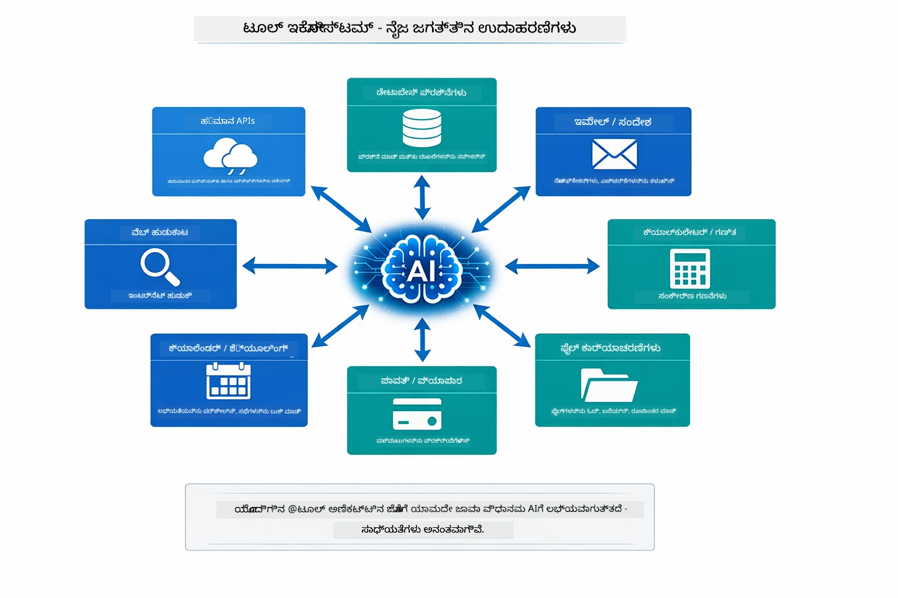

*ಯಾವುದೇ ಜಾವಾ ವಿಧಾನವು @Tool ಅನೇಶನ್ ಆದಾಗ AIಗೆ ಲಭ್ಯವಾಗುತ್ತದೆ — ಮಾದರಿ ಡೇಟಾಬೇಸ್‌ಗಳು, API, ಇಮೇಲ್, ಕಡತ ಕಾರ್ಯಾಚರಣೆಗಳಿಗೂ ವಿಸ್ತಾರಗೊಳ್ಳುತ್ತದೆ.*

## ಉಪಕರಣ ಆಧಾರಿತ ಏಜೆಂಟ್‌ಗಳನ್ನು ಬಳಸಬೇಕಾಗಿರುವ ಸಂದರ್ಭಗಳು

ಪ್ರತಿ ವಿನಂತಿಗೆ ಉಪಕರಣಗಳು ಅಗತ್ಯವಿಲ್ಲ. ನಿರ್ಧಾರವು AI ಬಾಹ್ಯ ವ್ಯವಸ್ಥೆಗಳೊಂದಿಗೆ ಸಂವಹನ ಮಾಡಬೇಕಾದೆಯೇ ಅಥವಾ ತನ್ನ ಸ್ವಂತ ಜ್ಞಾನದಿಂದ ಉತ್ತರಿಸಬಹುದೇ ಎಂಬುದರ ಮೇಲೆ ಇರುತ್ತದೆ. ಕೆಳಗಿನ ಮಾರ್ಗದರ್ಶಿಯಲ್ಲಿ ಯಾವಾಗ ಉಪಕರಣಗಳು ಮೌಲ್ಯವನ್ನು ಸೇರಿಸುತ್ತವೆ ಮತ್ತು ಯಾವಾಗ ಅವು ಅನವಶ್ಯಕವೆಂದು ಸಾರಲಾಗಿದೆ:

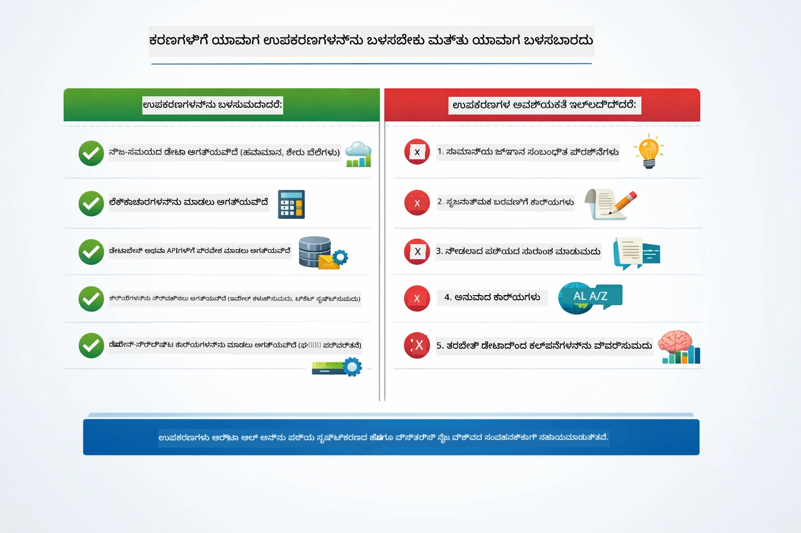

*ತ್ವರಿತ ನಿರ್ಧಾರ ಮಾರ್ಗದರ್ಶಿ — ಉಪಕರಣಗಳು ನೇರ ಡೇಟಾ, ಗಣನೆಗಳು ಮತ್ತು ಕಾರ್ಯಗಳಿಗಾಗಿ; ಸಾಮಾನ್ಯ ಜ್ಞಾನ ಮತ್ತು ಸೃಜನಶೀಲ ಕಾರ್ಯಗಳಿಗೆ ಅವಶ್ಯಕವಿಲ್ಲ.*

## ಉಪಕರಣಗಳು ಮತ್ತು RAG

ಮಾಡ್ಯೂಲ್‌ಗಳ 03 ಮತ್ತು 04 ಎರಡೂ AI ಮಾಡಲು ಸಾಧ್ಯವೊಂದನ್ನು ವಿಸ್ತರಿಸುತ್ತವೆ, ಆದರೆ ಮೂಲತಃ ವಿಭಿನ್ನ ರೀತಿಗಳಲ್ಲಿ. RAGವು ಮಾದರಿಯನ್ನು **ಜ್ಞಾನ** ಪ್ರಾಪ್ತಿಗೆ ಸಹಾಯಮಾಡುವುದು, ಡಾಕ್ಯುಮೆಂಟ್‌ಗಳು ಪರಿಹರಿಸುವ ಮೂಲಕ. ಉಪಕರಣಗಳು ಮಾದರಿಯನ್ನು **ಕ್ರಿಯೆಗಳು** ಕೈಗೊಳ್ಳಲು ಮೀಸಲಿಡುತ್ತವೆ, ಫಂಕ್ಷನ್ಗಳನ್ನು ಕರೆಸಿ. ಕೆಳಗಿನ ಚಿತ್ರಣ ಈ ಎರಡು ವಿಧಾನಗಳನ್ನು ಪಕ್ಕ ಪಕ್ಕದಂತೆ ಹೋಲಿಸುತ್ತದೆ — ಪ್ರತಿಯೊಂದು ಕಾರ್ಯವಿಧಾನ ಹೇಗೆ ಕಾರ್ಯನಿರ್ವಹಿಸುತ್ತದೆ ಮತ್ತು ಅವುಗಳ ನಡುವಣ ವ್ಯತ್ಯಾಸಗಳು:

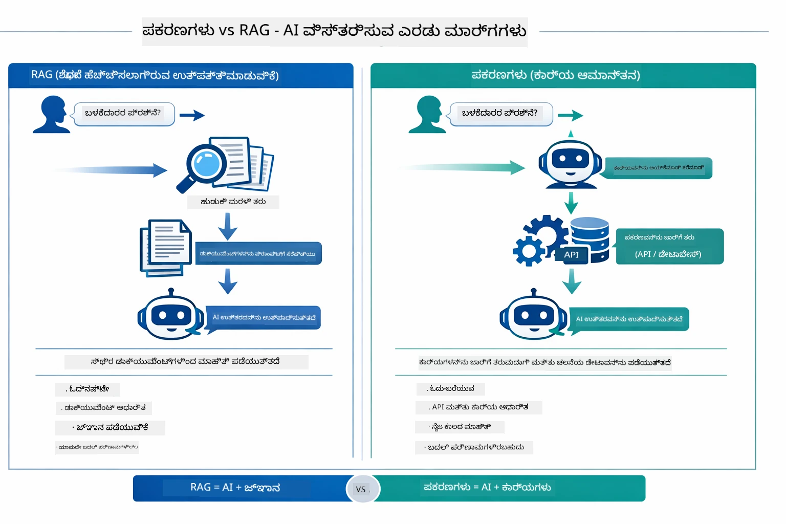

*RAG ಸ್ಥಿರ ಡಾಕ್ಯುಮೆಂಟ್‌ಗಳಿಂದ ಮಾಹಿತಿ ಪಡೆದರೆ, ಉಪಕರಣಗಳು ಕ್ರಿಯೆಗಳನ್ನು ಕಾರ್ಯಗತಗೊಳಿಸಿ ನಿರಂತರ, ನೈಜ ಡೇಟಾವನ್ನು ಸೆಳೆಯುತ್ತವೆ. ಹಲವಾರು ಉತ್ಪಾದನಾ ವ್ಯವಸ್ಥೆಗಳು ಎರಡನ್ನೂ ಸಂಯೋಜಿಸುತ್ತವೆ.*

ವಾಸ್ತವಿಕತೆಯಲ್ಲಿ, ಹಲವಾರು ಉತ್ಪಾದನಾ ವ್ಯವಸ್ಥೆಗಳು ಎರಡೂ ವಿಧಾನಗಳನ್ನು ಸಂಯೋಜಿಸುತ್ತವೆ: RAG ನಿಮ್ಮ ಡಾಕ್ಯುಮೆಂಟೇಶನಿನಲ್ಲಿ ಜವಾಬ್ದಾರಿಯನ್ನು ನೆಲೆಗೊಳಿಸಲು ಮತ್ತು ಉಪಕರಣಗಳು ನೈಜ ಡೇಟಾ ಪಡೆಯಲು ಅಥವಾ ಕಾರ್ಯಗಳನ್ನು ಮಾಡುವುದಕ್ಕೆ.

## ಮುಂದಿನ ಹಂತಗಳು

**ಮುಂದಿನ ಮಾಯಾಜಾಲ:** [05-mcp - ಮಾದರಿ ಸಡಿಲಿಕೆ ಪ್ರೋಟೋಕಾಲ್ (MCP)](../05-mcp/README.md)

---

**ಮಾರ್ಗದರ್ಶನ:** [← ಹಿಂದಿನ: ಮಾಯಾಜಾಲ 03 - RAG](../03-rag/README.md) | [ಪ್ರಮುಖಕ್ಕೆ ಹಿಂತಿರುಗಿ](../README.md) | [ಮುಂದಿನ: ಮಾಯಾಜಾಲ 05 - MCP →](../05-mcp/README.md)

---

<!-- CO-OP TRANSLATOR DISCLAIMER START -->
**ಚೆತನ ಸೂಚನೆ**:  
ಈ ದಸ್ತಾವೇಜು [Co-op Translator](https://github.com/Azure/co-op-translator) ಎಂಬ AI ಭಾಷಾಂತರ ಸೇವೆಯನ್ನು ಬಳಸಿ ಅನುವಾದಿಸಲಾಗಿದೆ. ನಾವು ಶುದ್ಧತೆಗಾಗಿ ಪ್ರಯತ್ನಿಸುತ್ತಿರುವಾಗ, ಸ್ವಯಂಚಾಲಿತ ಭಾಷಾಂತರಗಳಲ್ಲಿ ದೋಷಗಳು ಅಥವಾ ತಪ್ಪುಗಳು ಇರಬಹುದೆಂದು ಮನಗಂಡಿರಿ. ಮೂಲ ದಸ್ತಾವೇಜಿನ ಆಲ್ ಭಾಷೆಯಲ್ಲಿ ಇರುವ ಪ್ರತಿ ದಸ್ತಾವೇಜು ಪ್ರಮಾಣಿಕ ಮೂಲವಾಗಿದೆ ಎಂದು ಪರಿಗಣಿಸಬೇಕು. ಪ್ರಮುಖ ಮಾಹಿತಿಗಾಗಿ, ನಿಪುಣ ಮಾನವ ಭಾಷಾಂತರವನ್ನು ಸಲಹೆ ನೀಡಲಾಗುತ್ತದೆ. ಈ ಭಾಷಾಂತರ ಬಳಕೆಯಿಂದ ಉಂಟಾಗುವ ಯಾವುದೇ ತಪ್ಪು ಅರ್ಥಮಾಡಿಕೊಳೆಯನ್ನು ಅಥವಾ ವ್ಯಾಖ್ಯಾನ ಮ erineೂ ಸುದ್ದಿಗಳಿಗೆ ನಾವು ಜವಾಬ್ದಾರರಾಗುವುದಿಲ್ಲ.
<!-- CO-OP TRANSLATOR DISCLAIMER END -->