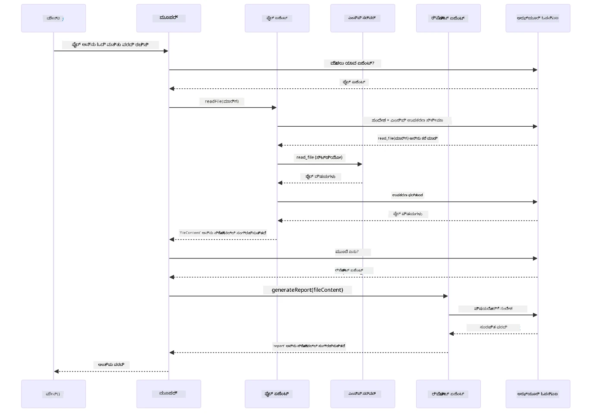

# Module 05: ಮಾದರಿ ಪ್ರಾಸಂಗಿಕ ಪ್ರೋಟೋಕಾಲ್ (MCP)

## ವಿಷಯಪಟ್ಟಿ

- [ನೀವು ಕಲಿಯೋದು ಏನು](../../../05-mcp)
- [MCP ಎಂದರೇನು?](../../../05-mcp)
- [MCP ಹೇಗೆ ಕೆಲಸ ಮಾಡುತ್ತದೆ](../../../05-mcp)
- [ಏಜೆಂಟಿಕ್ ಮಾಡ್ಯೂಲ್](../../../05-mcp)
- [ಉದಾಹರಣೆಗಳನ್ನು ನಡೆಸುವುದು](../../../05-mcp)
  - [ಪೂರ್ವಶರತ್ತುಗಳು](../../../05-mcp)
- [ತ್ವರಿತ ಪ್ರಾರಂಭ](../../../05-mcp)
  - [ಫೈಲ್ ಕಾರ್ಯಾಚರಣೆಗಳು (Stdio)](../../../05-mcp)
  - [ಸೂಪರ್ವೈಸರ್ ಏಜೆಂಟ್](../../../05-mcp)
    - [ಡೆಮೋ ಚಾಲನೆ](../../../05-mcp)
    - [ಸೂಪರ್ವೈಸರ್ ಹೇಗೆ ಕೆಲಸ ಮಾಡುತ್ತದೆ](../../../05-mcp)
    - [FileAgent MCP ಟೂಲ್ಗಳನ್ನು ಕಾರ್ಯನಿರ್ವಹಿಸುವಾಗ ಹೇಗೆ ಹುಡುಕುತ್ತದೆ](../../../05-mcp)
    - [ಪ್ರತಿಕ್ರಿಯಾ ತಂತ್ರಗಳು](../../../05-mcp)
    - [ಫಲಿತಾಂಶವನ್ನು ಅರ್ಥಮಾಡಿಕೊಳ್ಳುವುದು](../../../05-mcp)
    - [ಏಜೆಂಟಿಕ್ ಮಾಡ್ಯೂಲ್ ವೈಶಿಷ್ಟ್ಯಗಳ ವಿವರಣೆ](../../../05-mcp)
- [ಮುಖ್ಯ ತತ್ವಗಳು](../../../05-mcp)
- [ಅಭಿನಂದನೆಗಳು!](../../../05-mcp)
  - [ಮುಂದೆ ಏನು?](../../../05-mcp)

## ನೀವು ಕಲಿಯೋದು ಏನು

ನೀವು ಸಂಭാഷಣಾತ್ಮಕ AI ಅನ್ನು ನಿರ್ಮಿಸಿಕೊಂಡಿದ್ದೀರಿ, ಪ್ರಾಂಪ್ಟ್ಗಳನ್ನು ಪಾರಂಗತ ಮಾಡಿಕೊಂಡಿದ್ದೀರಿ, ಪ್ರമാണಗಳ ಮೇಲೆ ಉತ್ತರಗಳನ್ನು ಆಧಾರಿತಗೊಳಿಸಿದ್ದೀರಿ ಮತ್ತು ಟूल್ಗಳೊಂದಿಗೆ ಏಜೆಂಟ್ಗಳನ್ನು ರಚಿಸಿದ್ದೀರಿ. ಆದರೆ ಆ ಎಲ್ಲಾ ಟೂಲ್ಗಳು ನಿಮ್ಮ ವಿಶಿಷ್ಟ ಅನ್ವಯಕ್ಕೆ ಕಸ್ಟಮ್-ನಿರ್ಮಿತವಾಗಿದ್ದವು. ನಿಮ್ಮ AI ಗೆ ಯಾರಾದರೂ ಸೃಷ್ಟಿಸಬಹುದಾದ ಹಾಗೂ ಹಂಚಿಕೊಳ್ಳಬಹುದಾದ ಒಂದು ಮಾನಕೀಕೃತ ಉಪಕರಣ ಪರಿಸರಕ್ಕೆ ಪ್ರವೇಶ ನೀಡಬಹುದಾದರೆ? ಈ ಮಾಡ್ಯೂಲ್ ನಲ್ಲಿ ನೀವು Model Context Protocol (MCP) ಮತ್ತು LangChain4j ನ ಏಜೆಂಟಿಕ್ ಮಾಡ್ಯೂಲ್ ಮೂಲಕ ಅದನ್ನು ಹೇಗೆ ಮಾಡಲು ಸಾಧ್ಯವೋ ಕಲಿಯೋದು. ಮೊದಲು ಸರಳ MCP ಫೈಲ್ ರೀಡರ್ ಪ್ರದರ್ಶಿಸಿ ನಂತರ ಅದನ್ನು ಸೃಜನೆಗೊಳ್ಳುವ ಏಜೆಂಟಿಕ್ ಕಾರ್ಯವಾಹಿಗಾಗಿ ಸೂಪರ್ವೈಸರ್ ಏಜೆಂಟ್ ಶೈಲಿಯಲ್ಲಿ ಸುಲಭವಾಗಿ ಸಂಯೋಜಿಸುವುದನ್ನು ತೋರಿಸುತ್ತೇವೆ.

## MCP ಎಂದರೇನು?

Model Context Protocol (MCP) ತಗೋಬಗುವದಷ್ಟೇ ಒದಗಿಸುತ್ತದೆ - ಎಐ ಅನ್ವಯಗಳಿಗೆ ಹೊರಗಿನ ಉಪಕರಣಗಳನ್ನು ಪತ್ತೆ ಮಾಡುವುದು ಮತ್ತು ಬಳಸಲು ಒಂದು ಮಾನಕ ವಿಧಾನ. ಪ್ರತಿ ಡೇಟಾ ಮೂಲ ಅಥವಾ ಸೇವೆಗೆ ಕಸ್ಟಮ್ ಎನ್ನುಕಾಲಿನ ಬದಲು, ನೀವು ಸಾಮರಸ್ಯವಿರುವ ಸ್ವರೂಪದಲ್ಲಿ ಸಾಮರ್ಥ್ಯಗಳನ್ನು ಬಹಿರಂಗಪಡಿಸುವ MCP ಸರ್ವರ್‌ಗಳಿಗೆ ಸಂಪರ್ಕ ಹೊಂದುತ್ತೀರಿ. ನಿಮ್ಮ AI ಏಜೆಂಟ್ ತಕ್ಷಣವೇ ಆ ಉಪಕರಣಗಳನ್ನು ಪತ್ತೆಮಾಡಿ ಸ್ವಯಂಚಾಲಿತವಾಗಿ ಬಳಸಬಹುದು.

ಕೆಳಗಿನ ಚಿತ್ರವು ವ್ಯತ್ಯಾಸವನ್ನು ತೋರಿಸುತ್ತದೆ — MCP ಇಲ್ಲದೆ ಪ್ರತಿ ತೊಳಗಿನ ಏಾರು ಸೀಮಿತಗೊಳಿಸುವಂತೆ ಕಸ್ಟಮ್ ವೈರಿಂಗ್ ಅಗತ್ಯವಿದೆ; MCP ಇರುವ ಸ್ಥಳದಲ್ಲಿ ಒಬ್ಬ ಪ್ರೋಟೋಕಾಲ್ ನಿಮ್ಮ ಅಪ್ಲಿಕೇಶನ್ ಅನ್ನು ಯಾವುದಾದರೂ ಉಪಕರಣಕ್ಕೆ ಸಂಪರ್ಕಿಸುತ್ತದೆ:


*MCPಗೂ ಮುಂಚೆ: ಸಂಕೀರ್ಣ ಆತ್ಮೀಯ-ಆತ್ಮೀಯ ಏಕೀಕರಣಗಳು. MCPನ ನಂತರ: ಒಬ್ಬ ಪ್ರೋಟೋಕಾಲ್, ಅನಂತ ಸಾಧ್ಯತೆಗಳು.*

MCP ಎಐ ಅಭಿವೃದ್ಧಿಯಲ್ಲಿ ಒಂದು ಮೂಲಪದ ಸಮಸ್ಯೆಯನ್ನು ಪರಿಹರಿಸುತ್ತದೆ: ಪ್ರತಿ ಏಕೀಕರಣವೂ ಕಸ್ಟಮ್. GitHub ನಲ್ಲಿ ಪ್ರವೇಶ ಬೇಕಾ? ಕಸ್ಟಮ್ ಕೋಡ್. ಫೈಲ್ ಓದಬೇಕೆ? ಕಸ್ಟಮ್ ಕೋಡ್. ಡೇಟಾಬೇಸ್ ಅನ್ನು ಕೇಳಬೇಕೆ? ಕಸ್ಟಮ್ ಕೋಡ್. ಮತ್ತು ಈ ಏಕೀಕರಣಗಳೆಲ್ಲವೂ ಇತರ AI ಅನ್ವಯಗಳೊಂದಿಗೆ ಕಾರ್ಯನಿರ್ವಹಿಸುವುದಿಲ್ಲ.

MCP ಇದನ್ನು ಮಾನಕೀಕರಿಸುತ್ತದೆ. ಒಬ್ಬ MCP ಸರ್ವರ್ ಸ್ವಚ್ಛ ವಿವರಣೆಗಳು ಮತ್ತು ಸ್ಕೀಮಾಗಳೊಂದಿಗೆ ಟೂಲ್ಗಳನ್ನು ಬಹಿರಂಗಪಡಿಸುತ್ತಾನೆ. ಯಾವುದೇ MCP ಕ್ಲೈಂಟ್ ಸಂಪರ್ಕಿಸಿ, ಲಭ್ಯವಿರುವ ಉಪಕರಣಗಳನ್ನು ಪತ್ತೆಮಾಡಿ ಮತ್ತು ಉಪಯೋಗಿಸಿಕೊಳ್ಳಬಹುದು. ಒಮ್ಮೆ ನಿರ್ಮಿಸಿ, ಎಲ್ಲೆಡೆ ಬಳಸಿರಿ.

ಕೆಳಗಿನ ಚಿತ್ರದಲ್ಲಿ ಈ ವಾಸ್ತವ್ಯ ರಚನೆಯೂ ಇದೆ — ಒಬ್ಬ MCP ಕ್ಲೈಂಟ್ (ನಿಮ್ಮ AI ಅನ್ವಯ) ಬಹು MCP ಸರ್ವರ್ ಗಳನ್ನು ಸಂಪರ್ಕಿಸಿ, ಪ್ರತಿ ಸರ್ವರ್ ತಮ್ಮದೇ ಉಪಕರಣಗಳನ್ನು ಮಾನಕ ಪ್ರೋಟೋಕಾಲ್ ಮೂಲಕ ಬಹಿರಂಗಪಡಿಸುತ್ತಾರೆ:


*Model Context Protocol ವಾಸ್ತವ್ಯ ರಚನೆ - ಮಾನಕೀಕೃತ ಉಪಕರಣ ಪತ್ತೆ ಮತ್ತು ಕಾರ್ಯನಿರ್ವಹಣೆ*

## MCP ಹೇಗೆ ಕೆಲಸ ಮಾಡುತ್ತದೆ

ಮುಂಬರುವದೃಷ್ಟಿಯಿಂದ, MCP ಒಂದು ಪದರವಾದ ರಚನೆಯನ್ನೇ ಬಳಸುತ್ತದೆ. ನಿಮ್ಮ Java ಅಪ್ಲಿಕೇಶನ್ (MCP ಕ್ಲೈಂಟ್) ಲಭ್ಯವಿರುವ ಉಪಕರಣಗಳನ್ನು ಪತ್ತೆ ಮಾಡಿ, JSON-RPC ವಿನಂತಿಗಳನ್ನು ಟ್ರಾನ್ಸ್ಪೋರ್ಟ್ ಪದರ (Stdio ಅಥವಾ HTTP) ಮೂಲಕ ಕಳುಹಿಸಿ, MCP ಸರ್ವರ್ ಕಾರ್ಯಾಚರಣೆಗಳನ್ನು ನಡೆಸಿ ಫಲಿತಾಂಶಗಳನ್ನು ಹಿಂತಿರುಗಿಸುತ್ತದೆ. ಕೆಳಗಿನ ಚಿತ್ರವು ಈ ಪ್ರೋಟೋಕಾಲ್ ಪ್ರತಿಯೊಂದು ಪದರವನ್ನು ಪ್ರತ್ಯೇಕವಾಗಿ ತೋರಿಸುತ್ತದೆ:


*MCP ಹೇಗೆ ಒಳಗೆ ಕೆಲಸ ಮಾಡುತ್ತದೆ - ಕ್ಲೈಂಟ್ ಗಳು ಉಪಕರಣಗಳನ್ನು ಪತ್ತೆ ಮಾಡಿ, JSON-RPC ಸಂದೇಶಗಳನ್ನು ವಿನಿಮಯ ಮಾಡಿ, ಟ್ರಾನ್ಸ್ಪೋರ್ಟ್ ಪದರದ ಮೂಲಕ ಕಾರ್ಯಾಚರಣೆಗಳನ್ನು ನಡೆಸುತ್ತವೆ.*

**ಸರ್ವರ್-ಕ್ಲೈಂಟ್ ವಾಸ್ತುಶಿಲ್ಪ**

MCP ಗಾಗಿ ಕ್ಲೈಂಟ್-ಸರ್ವರ್ ಮಾದರಿಯನ್ನು ಬಳಕೆ ಮಾಡಲಾಗುತ್ತದೆ. ಸರ್ವರ್ ಗಳು ಉಪಕರಣಗಳನ್ನು ಒದಗಿಸುತ್ತವೆ - ಫೈಲ್ ಓದುವಿಕೆ, ಡೇಟಾಬೇಸ್ ಪ್ರಶ್ನಿಸಲು, API ಕರೆಗಳನ್ನು ಮಾಡಲು. ಕ್ಲೈಂಟ್ ಗಳು (ನಿಮ್ಮ AI ಅಪ್ಲಿಕೇಶನ್) ಸರ್ವರ್ ಗಳನ್ನು ಸಂಪರ್ಕಿಸಿ ಅವರ ಉಪಕರಣಗಳನ್ನು ಬಳಸುತ್ತವೆ.

LangChain4j ಜೊತೆಗೆ MCP ಉಪಯೋಗಿಸಲು, ಈ Maven ಅವಲಂಬನೆಯನ್ನು ಸೇರಿಸಿ:

```xml
<dependency>
    <groupId>dev.langchain4j</groupId>
    <artifactId>langchain4j-mcp</artifactId>
    <version>${langchain4j.version}</version>
</dependency>
```


**ಉಪಕರಣ ಪತ್ತೆಮಾಡುವುದು**

ನಿಮ್ಮ ಕ್ಲೈಂಟ್ MCP ಸರ್ವರ್ ಅನ್ನು ಸಂಪರ್ಕಿಸುವಾಗ, ಅದು ಕೇಳುತ್ತದೆ "ನಿಮಗೆ ಯಾವ ಯಾವ ಉಪಕರಣಗಳಿವೆ?" ಸರ್ವರ್ ಲಭ್ಯವಿರುವ ಉಪಕರಣಗಳ ಪಟ್ಟಿ, ವಿವರಣೆಗಳು ಮತ್ತು ಪರಿಮಿತಿಗಳ ಸ್ಕೀಮಗಳೊಂದಿಗೆ ಉತ್ತರಿಸುತ್ತದೆ. ನಿಮ್ಮ AI ಏಜೆಂಟ್ ಬಳಕೆದಾರರ ವಿನಂತಿಗಳ ಮೇಲೆ ಆಧಾರಿತವಾಗಿ ಯಾವ ಉಪಕರಣಗಳನ್ನು ಬಳಸಬೇಕೆಂದು ನಿರ್ಧರಿಸಬಹುದು. ಕೆಳಗಿನ ಚಿತ್ರವು ಈ ಕೈಚಳಿಕೆಯನ್ನು ತೋರಿಸುತ್ತದೆ — ಕ್ಲೈಂಟ್ ಒಂದು `tools/list` ವಿನಂತಿಯನ್ನು ಕಳುಹಿಸುತ್ತದೆ ಮತ್ತು ಸರ್ವರ್ өзінің ಉಪಕರಣಗಳನ್ನು ವಿವರಣೆಗಳೊಂದಿಗೆ ಹಿಂತಿರುಗಿಸುತ್ತದೆ:


*AI ಆರಂಭದಲ್ಲಿ ಲಭ್ಯವಿರುವ ಉಪಕರಣಗಳನ್ನು ಪತ್ತೆಮಾಡುತ್ತದೆ — ಈಗ ಯಾವ ಸಾಮರ್ಥ್ಯಗಳನ್ನು ಬಳಸಬೇಕೆಂದು ತೀರ್ಮಾನಿಸಬಹುದು.*

**ಟ್ರಾನ್ಸ್ಪೋರ್ಟ್ ಯಂತ್ರಗಳು**

MCP ವಿಭಿನ್ನ ಟ್ರಾನ್ಸ್ಪೋರ್ಟ್ ಯಂತ್ರಗಳನ್ನು ಬೆಂಬಲಿಸುತ್ತದೆ. ಎರಡು ಆಯ್ಕೆಗಳಿವೆ Stdio (ಸ್ಥಳೀಯ ಉಪಕ್ರಮ ಸಂವಹನಕ್ಕೆ) ಮತ್ತು Streamable HTTP (ದೂರದ ಸರ್ವರ್‌ಗಳಿಗಾಗಿ). ಈ ಮಾಡ್ಯೂಲ್ Stdio ಟ್ರಾನ್ಸ್ಪೋರ್ಟ್ ನ್ನು ತೋರಿಸುತ್ತದೆ:


*MCP ಟ್ರಾನ್ಸ್ಪೋರ್ಟ್ ಯಂತ್ರಗಳು: HTTP ದೂರದ ಸರ್ವರ್‌ಗಳಿಗಾಗಿ, Stdio ಸ್ಥಳೀಯ ಪ್ರಕ್ರಿಯೆಗಳಿಗಾಗಿ*

**Stdio** - [StdioTransportDemo.java](../../../05-mcp/src/main/java/com/example/langchain4j/mcp/StdioTransportDemo.java)

ಸ್ಥಳೀಯ ಪ್ರಕ್ರಿಯೆಗಳಿಗೆ. ನಿಮ್ಮ ಅಪ್ಲಿಕೇಶನ್ ಸರ್ವರ್ ಅನ್ನು ಉಪಕ್ರಮವಾಗಿ ಸೃಷ್ಟಿಸಿ ಮಾನಕ ಇನ್ಪುಟ್/ಔಟ್‌ಪುಟ್ ಮೂಲಕ ಸಂವಹನ ಮಾಡುತ್ತದೆ. ಫೈಲ್‌ಸಿಸ್ಟಂ ಪ್ರವೇಶ ಅಥವಾ ಕಮಾಂಡ್ ಲೈನ್ ಸಾಧನಗಳಿಗಾಗಿ ಉಪಯುಕ್ತ.

```java
McpTransport stdioTransport = new StdioMcpTransport.Builder()
    .command(List.of(
        npmCmd, "exec",
        "@modelcontextprotocol/server-filesystem@2025.12.18",
        resourcesDir
    ))
    .logEvents(false)
    .build();
```


`@modelcontextprotocol/server-filesystem` ಸರ್ವರ್ ಕೆಳಗಿನ ಉಪಕರಣಗಳನ್ನು ಬಹಿರಂಗಪಡಿಸುತ್ತದೆ, ಎಲ್ಲವು ನೀವು ನಿಗದಿಪಡಿಸಿದ ಡೈರೆಕ್ಟರಿಗಳಲ್ಲಿ ಪ್ರತ್ಯೇಕಿತವಾಗಿರುತ್ತವೆ:

| ಉಪಕರಣ | ವಿವರಣೆ |
|--------|----------|
| `read_file` | ಒಂದೇ ಫೈಲ್‌ನ ವಿಷಯವನ್ನು ಓದು |
| `read_multiple_files` | ಒಂದೇ ಕಾಲ್‌ನಲ್ಲಿ ಹಲವು ಫೈಲ್‌ಗಳನ್ನು ಓದು |
| `write_file` | ಫೈಲ್ ರಚಿಸಿ ಅಥವಾ ಮರುಬರಹಿಸಿ |
| `edit_file` | ಗುರಿ ಮಾಡಿದ ಹುಡುಕಾಟ ಮತ್ತು ಬದಲಾವಣೆ ಸಂಪಾದನೆ |
| `list_directory` | ಒಂದು ಮಾರ್ಗದಲ್ಲಿ ಫೈಲ್‌ಗಳು ಮತ್ತು ಡೈರೆಕ್ಟರಿಗಳನ್ನು ಪಟ್ಟಿಮಾಡು |
| `search_files` | ಮಾದರಿಯನ್ನು ಹೊಂದಿರುವ ಫೈಲ್‌ಗಳನ್ನು ಪುನರಾವರ್ತಿತವಾಗಿ ಹುಡುಕು |
| `get_file_info` | ಫೈಲ್ ಮೆಟಾಡೇಟಾ ಪಡೆಯಿರಿ (ಗಾತ್ರ, ಟೈಮ್ ಸ್ಟ್ಯಾಂಪ್‌ಗಳು, ಅನುಮತಿಗಳು) |
| `create_directory` | ಡೈರೆಕ್ಟರಿ ರಚಿಸಿ (ಪೋಷಕ ಡೈರೆಕ್ಟರಿಗಳು ಸಹ) |
| `move_file` | ಫೈಲ್ ಅಥವಾ ಡೈರೆಕ್ಟರಿಯನ್ನು ಸ್ಥಳಾಂತರಿಸಿ ಅಥವಾ ಮರುಹೆಸರಿಸಿ |

ಕೆಳಗಿನ ಚಿತ್ರವು ಕಾರ್ಯನಿರ್ವಹಿಸುವಾಗ Stdio ಟ್ರಾನ್ಸ್ಪೋರ್ಟ್ ಹೇಗೆ ಕೆಲಸ ಮಾಡುತ್ತದೆ ಎಂದು ತೋರಿಸುತ್ತದೆ — ನಿಮ್ಮ Java ಅಪ್ಲಿಕೇಶನ್ MCP ಸರ್ವರ್ ಅನ್ನು ಮಕ್ಕಳ ಪ್ರಕ್ರಿಯಾಗೆ ಸೃಷ್ಟಿಸಿ stdin/stdout ಪೈಪ್‌ಗಳ ಮೂಲಕ ಸಂವಹನ ಮಾಡುತ್ತದೆ, ಯಾವುದೇ ನೆಟ್‌ವರ್ಕ್ ಅಥವಾ HTTP ಬಳಸುವುದಿಲ್ಲ:


*Stdio ಟ್ರಾನ್ಸ್ಪೋರ್ಟ್ ಕಾರ್ಯಾಚರಣೆ - ನಿಮ್ಮ ಅಪ್ಲಿಕೇಶನ್ MCP ಸರ್ವರ್ ಅನ್ನು ಮಕ್ಕಳ ಪ್ರಕ್ರಿಯಾಗಿ ಸೃಷ್ಟಿಸಿ stdin/stdout ಪೈಪ್ ಮೂಲಕ ಸಂವಹನ ಮಾಡುತ್ತದೆ.*

> **🤖 [GitHub Copilot](https://github.com/features/copilot) ಚಾಟ್ ಜೊತೆ ಪ್ರಯತ್ನಿಸಿ:** [`StdioTransportDemo.java`](../../../05-mcp/src/main/java/com/example/langchain4j/mcp/StdioTransportDemo.java)⁠ ಓದಿ ಮತ್ತು ಕೇಳಿ:
> - "Stdio ಟ್ರಾನ್ಸ್ಪೋರ್ಟ್ ಹೇಗೆ ಕೆಲಸ ಮಾಡುತ್ತದೆ ಮತ್ತು ನಾನು HTTP ಜೊತೆ ಯಾವಾಗ ಬಳಸುವುದು?"
> - "LangChain4j MCP ಸರ್ವರ್ ಪ್ರಕ್ರಿಯೆಗಳ ಜೀವನಚಕ್ರವನ್ನು ಹೇಗೆ ನಿರ್ವಹಿಸುತ್ತದೆ?"
> - "AI ಗೆ ಫೈಲ್ ಸಿಸ್ಟಂ ಪ್ರವೇಶದ ಸುರಕ್ಷತಾ ಪರಿಣಾಮಗಳು ಯಾವುವು?"

## ಏಜೆಂಟಿಕ್ ಮಾಡ್ಯೂಲ್

MCP ಮಾನಕೀಕೃತ ಉಪಕರಣಗಳನ್ನು ಒದಗಿಸುವ ವೇಳೆ, LangChain4j ನ **ಏಜೆಂಟಿಕ್ ಮಾಡ್ಯೂಲ್** ಆ ಉಪಕರಣಗಳನ್ನು ಸಂಚಾಲಿಸುವ ಏಜೆಂಟ್ಗಳನ್ನು ಘೋಷಣಾತ್ಮಕವಾಗಿ ನಿರ್ಮಿಸಲು ಮಾರ್ಗ ಒದಗಿಸುತ್ತದೆ. `@Agent` ಸೂಚನೆ ಮತ್ತು `AgenticServices` ಇನ್ಟರ್ಫೇಸ್ಗಳ ಮೂಲಕ ಏಜೆಂಟ್ ವರ್ತನೆಯನ್ನು ನಿರ್ಧರಿಸಲು ಅನುವು ಮಾಡಿಕೊಡುತ್ತದೆ.

ಈ ಮಾಡ್ಯೂಲ್ ನಲ್ಲಿ ನೀವು **ಸೂಪರ್ವೈಸರ್ ಏಜೆಂಟ್** ಶೈಲಿಯನ್ನು ಅನ್ವೇಷಿಸುವಿರಿ — ಇದು ಒಂದು ಪ್ರಗತಿಶೀಲ ಏಜೆಂಟಿಕ್ AI ವಿಧಾನ, ಯಾವಲ್ಲಿ "ಸೂಪರ್ವೈಸರ್" ಏಜೆಂಟ್ ಬಳಕೆದಾರರ ವಿನಂತಿಗಳ ಆಧಾರದ ಮೇಲೆ ಉಪ-ಏಜೆಂಟ್ಗಳನ್ನು ಚಾಲನೆ ಮಾಡಲು ಗತಿಯುತ ನಿರ್ಧಾರ ತೆಗೆದುಕೊಳ್ಳುತ್ತದೆ. ನಾವು ಎರಡು ಮೌಲ್ಯಗಳನ್ನು ಸಂಯೋಜಿಸುತ್ತೇವೆ, ನಮಗೆ ಒಂದು ಉಪ-ಏಜೆಂಟ್ MCP ಚಾಲಿತ ಫೈಲ್ ಪ್ರವೇಶ ಸಾಮರ್ಥ್ಯಗಳನ್ನು ನೀಡುತ್ತೇವೆ.

ಏಜೆಂಟಿಕ್ ಮಾಡ್ಯೂಲ್ ಬಳಸಲು, ಈ Maven ಅವಲಂಬನೆಯನ್ನು ಸೇರಿಸಿ:

```xml
<dependency>
    <groupId>dev.langchain4j</groupId>
    <artifactId>langchain4j-agentic</artifactId>
    <version>${langchain4j.mcp.version}</version>
</dependency>
```


> **ಗಮನಿಸಿ:** `langchain4j-agentic` ಮಾಡ್ಯೂಲ್ ಪ್ರಾಥಮಿಕ LangChain4j ಗ್ರಂಥಾಲಯಗಳಿಗಿಂತ ಭಿನ್ನ ವೇಗದಲ್ಲಿ ಬಿಡುಗಡೆ ಆಗುತ್ತಿದ್ದು, ಅದಕ್ಕಾಗಿ ಪ್ರತ್ಯೇಕ ಆವೃತ್ತಿ ಗುಣಲಕ್ಷಣ (`langchain4j.mcp.version`) ಬಳಕೆ ಮಾಡುತ್ತದೆ.

> **⚠️ ಪ್ರಯೋಗಾತ್ಮಕ:** `langchain4j-agentic` ಮಾಡ್ಯೂಲ್ **ಪ್ರಯೋಗಾತ್ಮಕ** ಹಾಗೂ ಬದಲಾಗಬಹುದಾಗಿದೆ. AI ಸಹಾಯಕರ ನಿಖರ ರಚನೆಯಲ್ಲಿ ಸ್ಥಿರ ಮಾರ್ಗವೆಂದರೆ `langchain4j-core` ಮತ್ತು ಕಸ್ಟಮ್ ಟೂಲ್ಗಳು (ಮಾಡ್ಯೂಲ್ 04).

## ಉದಾಹರಣೆಗಳನ್ನು ನಡೆಸುವುದು

### ಪೂರ್ವಶರತ್ತುಗಳು

- ಪೂರ್ಣಗೊಂಡ [ಮಾಡ್ಯೂಲ್ 04 - ಉಪಕರಣಗಳು](../04-tools/README.md) (ಈ ಮಾಡ್ಯೂಲ್ ಕಸ್ಟಮ್ ಟೂಲ್ಗಳ ಆಧಾರದ ಮೇಲೆ ನಿರ್ಮಿಸಿರುವುದು ಮತ್ತು MCP ಟೂಲ್ಗಳೊಂದಿಗೆ ಹೋಲಿಕೆ ಮಾಡುತ್ತದೆ)
- ಮೂಲ ಫೋಲ್ಡರ್‌ನಲ್ಲಿ `.env` ಫೈಲ್ ಜೊತೆಗೆ Azure ಪ್ರಮಾಣಪತ್ರಗಳು (ಮಾಡ್ಯೂಲ್ 01 ರ `azd up` ಮೂಲಕ ರಚಿಸಲಾಗಿದೆ)
- Java 21+, Maven 3.9+
- Node.js 16+ ಮತ್ತು npm (MCP ಸರ್ವರ್‌ಗಳಿಗೆ)

> **ಗಮನಿಸಿ:** ನೀವು ಇನ್ನೂ ನಿಮ್ಮ ಪರಿಸರ ಚರಗಳನ್ನು ವಿನ್ಯಾಸಗೊಳಿಸದಿದ್ದರೆ, [ಮಾಡ್ಯೂಲ್ 01 - ಪರಿಚಯ](../01-introduction/README.md) ನಲ್ಲಿ ನಿಯೋಜನೆ ಸೂಚನೆಗಳನ್ನು ನೋಡಿ (`azd up` ಸ್ವಯಂಚಾಲಿತವಾಗಿ `.env` ರಚಿಸುತ್ತದೆ), ಅಥವಾ `.env.example` ಅನ್ನು ಕಾಪಿ ಮಾಡಿ ಮೂಲ ಫೋಲ್ಡರ್‌ನಲ್ಲಿ `.env` ಎಂದು ಮಾಡಿ ನಿಮ್ಮ ಮೌಲ್ಯಗಳನ್ನು ಪೂರೈಸಿ.

## ತ್ವರಿತ ಪ್ರಾರಂಭ

**VS Code ಬಳಸಿ:** ಎಕ್ಸಪ್ಲೋರರ್‌ನಲ್ಲಿ ಯಾವುದೇ ಡೆಮೋ ಫೈಲ್ ಮೇಲೆ ಬಲ-ಕ್ಲಿಕ್ ಮಾಡಿ **"Run Java"** ಆಯ್ಕೆಮಾಡಿ, ಅಥವಾ ರನ್ ಮತ್ತು ಡಿಬಗ್ ಫಲಕದಿಂದ ಲಾಂಚ್ ಕಾನ್ಫಿಗರೇಶನ್‌ಗಳನ್ನು ಬಳಸಿ (.env ಫೈಲ್ ಮೊದಲು Azure ಪ್ರಮಾಣಪತ್ರಗಳೊಂದಿಗೆ ಸಂರಚಿತವಾಗಿರಬೇಕು).

**Maven ಬಳಸಿ:** ಅಥವಾ ಕೆಳಗಿನ ಉದಾಹರಣೆಗಳ ಮೂಲಕ ಕಮಾಂಡ್ ಲೈನಿನಿಂದ ಚಾಲನೆ ಮಾಡಬಹುದು.

### ಫೈಲ್ ಕಾರ್ಯಾಚರಣೆಗಳು (Stdio)

ಸ್ಥಳೀಯ ಉಪಕ್ರಮಾಧಾರಿತ ಟೂಲ್ಗಳನ್ನು ಪ್ರದರ್ಶಿಸುತ್ತದೆ.

**✅ ಪೂರ್ವಶರತ್ತುಗಳ ಅಗತ್ಯವಿಲ್ಲ** - MCP ಸರ್ವರ್ ಸ್ವಯಂಚಾಲಿತವಾಗಿ ಆರಂಭಿಸುತ್ತದೆ.

**ಆರಂಭಿಸುವ ಸ್ಕ್ರಿಪ್ಟ್‌ಗಳು (ಶಿಫಾರಸು ಮಾಡಲ್ಪಟ್ಟ):**

ಆರಂಭಿಸುವ ಸ್ಕ್ರಿಪ್ಟ್‌ಗಳು ಸ್ವಯಂಚಾಲಿತವಾಗಿ ಮೂಲ `.env` ಫೈಲ್‌ನಿಂದ ಪರಿಸರ ಚರಗಳನ್ನು ಲೋಡ್ ಮಾಡುತ್ತವೆ:

**Bash:**
```bash
cd 05-mcp
chmod +x start-stdio.sh
./start-stdio.sh
```

**PowerShell:**
```powershell
cd 05-mcp
.\start-stdio.ps1
```

**VS Code ಬಳಸಿ:** `StdioTransportDemo.java` ಮೇಲೆ ಬಲ-ಕ್ಲಿಕ್ ಮಾಡಿ ಮತ್ತು **"Run Java"** ಆಯ್ಕೆಮಾಡಿ (`.env` ಫೈಲ್ ಸಂರಚಿತವಾಗಿದೆ ಎಂದು ಖಚಿತಪಡಿಸಿ).

ಅಪ್ಲಿಕೇಶನ್ ಸ್ವಯಂಚಾಲಿತವಾಗಿ ಫೈಲ್‌ಸಿಸ್ಟಮ್ MCP ಸರ್ವರ್‌ನ್ನು ಆರಂಭಿಸಿ ಸ್ಥಳೀಯ ಫೈಲ್ ಓದುತ್ತದೆ. ಉಪಕ್ರಮ ನಿರ್ವಹಣೆ ನಿಮಗಾಗಿ ಹೇಗೆ ಸಾಗುತ್ತದೆ ಅದು ಗಮನಿಸಿ.

**ನಿರೀಕ್ಷಿತ ಔಟ್‌ಪುಟ್:**
```
Assistant response: The file provides an overview of LangChain4j, an open-source Java library
for integrating Large Language Models (LLMs) into Java applications...
```


### ಸೂಪರ್ವೈಸರ್ ಏಜೆಂಟ್

**ಸೂಪರ್ವೈಸರ್ ಏಜೆಂಟ್ ಶೈಲಿ** ಒಂದು **ಲವಚಿಕ** ಏಜೆಂಟಿಕ್ AI ರೂಪವಾಗಿದೆ. ಸೂಪರ್ವೈಸರ್ LLM ಬಳಸಿ ಯಾವ ಏಜೆಂಟ್‌ಗಳನ್ನು ಚಾಲನೆ ಮಾಡುವುದು ಅಂತ ಸ್ವಯಂಚಾಲಿತ ನಿರ್ಣಯ ಮಾಡುತ್ತದೆ. ಮುಂದಿನ ಉದಾಹರಣೆಯಲ್ಲಿ, MCP ಚಾಲಿತ ಫೈಲ್ ಪ್ರವೇಶವನ್ನು LLM ಏಜೆಂಟ್ ಜೊತೆ ಸೇರಿಸಿ ಸೂಪರ್ವೈಸ್ಡ್ ಫೈಲ್ ಓದಿಸಿ → ವರದಿ ಪ್ರಕ್ರಿಯೆಯನ್ನು ನಿರ್ಮಿಸುತ್ತೇವೆ.

ಡೆಮೋದಲ್ಲಿ, `FileAgent` MCP ಫೈಲ್‌ಸಿಸ್ಟಮ್ ಟೂಲ್ಗಳನ್ನು ಬಳಸಿ ಫೈಲ್ ಓದುತ್ತದೆ ಮತ್ತು `ReportAgent` ಕಾರ್ಯನಿರ್ವಹಣೆ ಸಂಶ್ಲೇಷಣೆಯ ಉತ್ತರಿಕೆ (1 ವಾಕ್ಯ), 3 ಮುಖ್ಯ ಅಂಶಗಳು ಮತ್ತು ಶಿಫಾರಸುಗಳೊಂದಿಗೆ ರಚನಾತ್ಮಕ ವರದಿಯನ್ನು ರಚಿಸುತ್ತದೆ. ಸೂಪರ್ವೈಸರ್ ಈ ಪ್ರವಾಹವನ್ನು ಸ್ವಯಂಚಾಲಿತವಾಗಿ ಸಂಚಾಲಿಸುತ್ತದೆ:


*ಸೂಪರ್ವೈಸರ್ ತನ್ನ LLM ಬಳಸಿ ಯಾವ ಏಜೆಂಟ್‌ಗಳನ್ನು ಯಾವ ಕ್ರಮದಲ್ಲಿ ಚಾಲನೆ ಮಾಡಬೇಕೆಂದು ನಿರ್ಧರಿಸುತ್ತದೆ - ಯಾವುದೇ ಹಾರ್ಡ್ ಕೋಡ್ ರೂಟಿಂಗ್ ಅಗತ್ಯವಿಲ್ಲ.*

ನಮ್ಮ ಫೈಲ್-ನಿಂದ-ವರದಿ ಕಾರ್ಯಪ್ರವೃತ್ತಿ ಹೇಗಿರುತ್ತದೆ ಅಂತ ಕೆಳಗಿನ ಚಿತ್ರ ತೋರಿಸುತ್ತದೆ:


*FileAgent MCP ಟೂಲ್ಗಳ ಮೂಲಕ ಫೈಲ್ ಓದುತ್ತದೆ, ನಂತರ ReportAgent ಕಚ್ಚಾ ವಿಷಯವನ್ನು ರಚನಾತ್ಮಕ ವರದಿಯಾಗಿ ಪರಿವರ್ತಿಸುತ್ತದೆ.*

ಕೆಳಗಿನ ಕ್ರಮ ಚಿತ್ತರವು ಪೂರ್ಣ ಸೂಪರ್ವೈಸರ್ ಸಂಚಾಲನೆಯు — MCP ಸರ್ವರ್ ಅನ್ನು ಆರಂಭಿಸುವುದರಿಂದ, ಸೂಪರ್ವೈಸರ್ ಸ್ವಾಯತ್ತ ಏಜೆಂಟ್ ಆಯ್ಕೆಮಾಡುವ ತನಕ, stdio ಮೂಲಕ ಉಪಕರಣ ಕರೆಗಳಿಗೆ ಮತ್ತು ಅಂತಿಮ ವರದಿಗೆ ಸಾಗುವವರೆಗಿನ ಪ್ರಕ್ರಿಯೆಯನ್ನು ತೋರಿಸುತ್ತದೆ:



*ಸೂಪರ್ವೈಸರ್ ಸ್ವಾಯತ್ತವಾಗಿ FileAgent ಅನ್ನು ಕರೆದು (MCP ಸರ್ವರ್‌ನ್ನು stdio ಮೂಲಕ ಫೈಲ್ ಓದಲು), ನಂತರ ReportAgent ಅನ್ನು ರಚನಾತ್ಮಕ ವರದಿ ಮಾಡಲು ಕರೆಸುತ್ತದೆ — ಪ್ರತಿ ಏಜೆಂಟ್ ತನ್ನ ಔಟ್‌ಪುಟ್ ಅನ್ನು ಹಂಚಿದ Agentic Scope ನಲ್ಲಿ ಸಂಗ್ರಹಿಸುತ್ತದೆ.*

ಪ್ರತಿ ಏಜೆಂಟ್ ತನ್ನ ಔಟ್‌ಪುಟ್ ಅನ್ನು **Agentic Scope** (ಹಂಚಿಕೊಂಡ ನೆನಪು) ನಲ್ಲಿ ಸಂಗ್ರಹಿಸುತ್ತದೆ, ಇದರಿಂದ ನಂತರದ ಏಜೆಂಟ್‌ಗಳು ಹಿಂದಿನ ಫಲಿತಾಂಶಗಳಿಗೆ ಪ್ರಾಪ್ತಿಯಾಗಬಲ್ಲವು. ಇದು MCP ಟೂಲ್ಗಳು ಏಜೆಂಟಿಕ್ ಕಾರ್ಯವಾಹಿಗಳಲ್ಲಿ ಸುಗಮವಾಗಿ ಸಂಯೋಜಿಸುವುದನ್ನು ತೋರಿಸುತ್ತದೆ — ಸೂಪರ್ವೈಸರ್ ಫೈಲ್‌ಗಳು ಹೇಗೆ ಓದುತ್ತಾವೋ ತಿಳಿಯಬೇಕಿಲ್ಲ, `FileAgent` ಅದನ್ನು ಮಾಡಬಲ್ಲದು ಗೊತ್ತಿರಬೇಕು.

#### ಡೆಮೋ ಚಾಲನೆ

ಆರಂಭಿಸುವ ಸ್ಕ್ರಿಪ್ಟ್‌ಗಳು ಸ್ವಯಂಚಾಲಿತವಾಗಿ ಮೂಲ `.env` ಫೈಲ್‌ನಿಂದ ಪರಿಸರ ಚರಗಳನ್ನು ಲೋಡ್ ಮಾಡುತ್ತವೆ:

**Bash:**
```bash
cd 05-mcp
chmod +x start-supervisor.sh
./start-supervisor.sh
```

**PowerShell:**
```powershell
cd 05-mcp
.\start-supervisor.ps1
```

**VS Code ಬಳಸಿ:** `SupervisorAgentDemo.java` ಮೇಲೆ ಬಲ-ಕ್ಲಿಕ್ ಮಾಡಿ ಮತ್ತು **"Run Java"** ಆಯ್ಕೆಮಾಡಿ (`.env` ಫೈಲ್ ಸಂರಚಿತವಾಗಿದೆ ಎಂದು ಖಚಿತಪಡಿಸಿ).

#### ಸೂಪರ್ವೈಸರ್ ಹೇಗೆ ಕೆಲಸ ಮಾಡುತ್ತದೆ

ಏಜೆಂಟ್‌ಗಳನ್ನು ನಿರ್ಮಿಸುವ ಮೊದಲು, MCP ಟ್ರಾನ್ಸ್ಪೋರ್ಟ್ ಅನ್ನು ಕ್ಲೈಂಟ್‌ಗೆ ಸಂಪರ್ಕ ಮಾಡಿ ಅದನ್ನು `ToolProvider` ಆಗಿ оборачивать ಮಾಡಬೇಕು. ಇದೇ MCP ಸರ್ವರ್‌ನ ಟೂಲ್ಗಳು ನಿಮ್ಮ ಏಜೆಂಟ್‌ಗಳಿಗೆ ಲಭ್ಯವಾಗುವ ಮೂಲಕ:

```java
// ಸಾಗಣಿಯಿಂದ MCP ಗ್ರಾಹಕರನ್ನು ರಚಿಸಿ
McpClient mcpClient = new DefaultMcpClient.Builder()
        .transport(stdioTransport)
        .build();

// ಗ್ರಾಹಕನನ್ನು ToolProvider ಆಗಿ ಮುಚ್ಚಿ — ಇದು MCP ಉಪಕರಣಗಳನ್ನು LangChain4j ಗೆ ಸಂಪರ್ಕಿಸುತ್ತದೆ
ToolProvider mcpToolProvider = McpToolProvider.builder()
        .mcpClients(List.of(mcpClient))
        .build();
```

ಮತ್ತು ನೀವು `mcpToolProvider` ಅನ್ನು MCP ಟೂಲ್ಗಳು ಬೇಕಾದ ಯಾವ ಏಜೆಂಟ್‌ಗೆ ಆಗಾಗ ಹಾಕಬಹುದು:

```java
// ಹಂತ 1: FileAgent MCP Tools ಬಳಸಿ ಫೈಲುಗಳನ್ನು ಓದುತ್ತದೆ
FileAgent fileAgent = AgenticServices.agentBuilder(FileAgent.class)
        .chatModel(model)
        .toolProvider(mcpToolProvider)  // ಫೈಲು ಕಾರ್ಯಾಚರಣೆಗಳಿಗಾಗಿ MCP Tools ಹೊಂದಿದೆ
        .build();

// ಹಂತ 2: ReportAgent ರಚನಾತ್ಮಕ ವರದಿಗಳನ್ನು ರಚಿಸುತ್ತದೆ
ReportAgent reportAgent = AgenticServices.agentBuilder(ReportAgent.class)
        .chatModel(model)
        .build();

// ಮೇಲ್ವಿಚಾರಕ ಫೈಲು → ವರದಿ ಕಾರ್ಯಪ್ರವಾಹವನ್ನು ಸಂಯೋಜಿಸುತ್ತದೆ
SupervisorAgent supervisor = AgenticServices.supervisorBuilder()
        .chatModel(model)
        .subAgents(fileAgent, reportAgent)
        .responseStrategy(SupervisorResponseStrategy.LAST)  // ಅಂತಿಮ ವರದಿಯನ್ನು ಹಿಂತಿರುಗಿಸಿ
        .build();

// ಮೇಲ್ವಿಚಾರಕ ಕೇಳಿಸಲಾದ ಆಧಾರದ ಮೇಲೆ ಯಾವ ಏಜೆಂಟ್‌ಗಳನ್ನು ಕರೆಮಾಡುವುದು ಎಂದು ನಿರ್ಧರಿಸುತ್ತಾನೆ
String response = supervisor.invoke("Read the file at /path/file.txt and generate a report");
```

#### FileAgent ಕಾರ್ಯನಿರ್ವಹಿಸುವಾಗ MCP ಟೂಲ್ಗಳನ್ನು ಹೇಗೆ ಪತ್ತೆಮಾಡುತ್ತದೆ

ನೀವು ಆಶ್ಚರ್ಯಪಡಬಹುದು: **`FileAgent` npm ಫೈಲ್‌ಸಿಸ್ಟಮ್ ಟೂಲ್ಗಳನ್ನು ಹೇಗೆ ಉಪಯೋಗಿಸುವುದನ್ನು ತಿಳಿದುಕೊಳ್ಳುತ್ತದೆ?** ಉತ್ತರವೆಂದರೆ ಅದು ತಿಳಿದಿಲ್ಲ — **LLM** ಟೂಲ್ ಸ್ಕೀಮಗಳ ಮೂಲಕ runtime ನಲ್ಲಿ ಅದು ಹೇಗೆ ಉಪಯೋಗಿಸಬೇಕು ಅಂತ ಕಂಡುಕೊಳ್ಳುತ್ತದೆ.

`FileAgent` ಇಂಟರ್ಫೇಸ್ ಕೇವಲ **ಪ್ರಾಂಪ್ಟ್ ವ್ಯಾಖ್ಯಾನ** ಮಾತ್ರ. ಅದರಲ್ಲಿ `read_file`, `list_directory` ಅಥವಾ ಮುಂತಾದ MCP ಟೂಲ್ಗಳ ಬಗ್ಗೆ ಯಾವುದಾದರೂ ಕಠಿಣ ಕೋಡ್ ತಿಳಿವು ಇಲ್ಲ. ಇಲ್ಲಿ ಅಂತ್ಯದಿಂದ ಅಂತ್ಯಕ್ಕೆ ಏನಾಗುತ್ತದೆ:
1. **ಸರ್ವರ್ ಸ್ಪಾಂಸ್:** `StdioMcpTransport` `@modelcontextprotocol/server-filesystem` npm ಪ್ಯಾಕೇಜ್ ಅನ್ನು ಚೀಲ ಪ್ರಕ್ರಿಯೆಯಾಗಿಯಾಗಿ ಪ್ರಾರಂಭಿಸುತ್ತದೆ  
2. **ಟೂಲ್ ಪತ್ತೆಮಾಡು:** `McpClient` ಸರ್ವರ್‌ಗೆ `tools/list` JSON-RPC ವಿನಂತಿಯನ್ನು ಕಳುಹಿಸುತ್ತದೆ, ಅದು ಟೂಲ್ ಹೆಸರುಗಳು, ವಿವರಣೆಗಳು ಮತ್ತು ಪ್ಯಾರಾಮೀಟರ್ ಸ್ಕೀಮಾಗಳು (ಉದಾ., `read_file` — *"ಫೈಲ್‌ನ ಪೂರ್ಣ ವಿಷಯವನ್ನು ಓದಿ"* — `{ path: string }`) ಯೊಂದಿಗೆ ಪ್ರತಿಕ್ರಿಯೆ ನೀಡುತ್ತದೆ  
3. **ಸ್ಕೀಮಾ ಇಂಜೆಕ್ಷನ್:** `McpToolProvider` ಈ ಪತ್ತೆಮಾಡಲಾದ ಸ್ಕೀಮಾಗಳನ್ನು ಮುತ್ತುಮಾಡಿ LangChain4j ಗೆ ಲಭ್ಯವಾಗಿಸುತ್ತದೆ  
4. **LLM ನಿರ್ಧರಿಸುತ್ತದೆ:** `FileAgent.readFile(path)` ಕರೆ ಮಾಡಲಾದಾಗ, LangChain4j ಸಿಸ್ಟಮ್ ಸಂದೇಶ, ಬಳಕೆದಾರ ಸಂದೇಶ ಮತ್ತು **ಟೂಲ್ ಸ್ಕೀಮಕಳ ಪಟ್ಟಿಯನ್ನು** LLM ಗೆ ಕಳುಹಿಸುತ್ತದೆ. LLM ಟೂಲ್ ವಿವರಣೆಗಳನ್ನು ಓದಿ, ಟೂಲ್ ಕರೆ ರಚಿಸುತ್ತದೆ (ಉದಾ., `read_file(path="/some/file.txt")`)  
5. **ಕಾರ್ಯಾಚರಣೆ:** LangChain4j ಟೂಲ್ ಕರೆ ಬಾರಿಹಾಕಿ MCP ಕ್ಲೈಂಟ್ ಮೂಲಕ Node.js ಉಪಪ್ರಕ್ರಿಯೆಗೆ ದಾರಿ ಹಾಯಿಸುತ್ತದೆ, ಫಲಿತಾಂಶ ಪಡೆದು LLM ಗೆ ಹಿಂತಿರುಗಿಸುತ್ತದೆ  

ಅಪರೇಕ್ಷಣೆಯಲ್ಲಿ ವಿವರಣೆಯಾದ [ಟೂಲ್ ಪತ್ತೆಮಾಡುವಿಕೆ](../../../05-mcp) ವ್ಯವಸ್ಥೆಯೇ ಇದು, ಆದರೆ ವಿಶೇಷವಾಗಿ ಏಜೆಂಟ್ ವರ್ಕ್‌ಫ್ಲೋಗೆ ಅನ್ವಯಿಸಿತು. `@SystemMessage` ಮತ್ತು `@UserMessage` ಸೂಚನೆಗಳು LLM ನ ವರ್ತನೆಗೆ ಮಾರ್ಗದರ್ಶನ ಮಾಡುತ್ತವೆ, ಇಂಜೆಕ್ಟ್ ಮಾಡಿದ `ToolProvider` ಅದು ಹೊಂದಿದ **ಸಾಮರ್ಥ್ಯಗಳನ್ನು** ನೀಡುತ್ತದೆ — LLM ಅವರಿಗೆ ರನ್‌ಟೈಮ್‌ನಲ್ಲಿ ಇವುಗಳನ್ನು ಸೇರ್ಪಡೆ ಮಾಡುತ್ತದೆ.

> **🤖 [GitHub Copilot](https://github.com/features/copilot) ಚಾಟ್ ಮೂಲಕ ಪ್ರಯತ್ನಿಸಿ:** [`FileAgent.java`](../../../05-mcp/src/main/java/com/example/langchain4j/mcp/agents/FileAgent.java) খুলಿ ಮತ್ತು ಕೇಳಿ:  
> - "ಈ ಏಜೆಂಟ್ ಯಾವ MCP ಟೂಲ್ ಅನ್ನು ಕರೆಮಾಡಬೇಕೆಂದು ಹೇಗೆ ತಿಳಿದುಕೊಳ್ಳುತ್ತದೆ?"  
> - "ನಾನು ಏಜೆಂಟ್ ಬಿಲ್ಡರ್‌ನಿಂದ ToolProvider ಅನ್ನು ತೆಗೆದರೆ ಏನಾಗುತ್ತದೆ?"  
> - "ಟೂಲ್ ಸ್ಕೀಮಾಗಳು LLM ಗೆ ಹೇಗೆ ಪಾಸಾಗುತ್ತವೆ?"  

#### ಪ್ರತಿಕ್ರಿಯೆ ತಂತ್ರಗಳು

ನೀವು `SupervisorAgent` ಅನ್ನು ವಿನ್ಯಾಸಗೊಳಿಸುವಾಗ, ಸಬ್ಏಜೆಂಟ್‌ಗಳ ಕಾರ್ಯ ಪೂರ್ಣವಾಗಿದ ನಂತರ ಬಳಕೆದಾರನಿಗೆ ಕೊನೆ ಉತ್ತರವನ್ನು ಹೇಗೆ ರೂಪಿಸಬೇಕು ಎಂದು ನಿಗದಿಪಡಿಸುತ್ತೀರಿ. ಕೆಳಗಿನ ಚಿತ್ರವು ಲಭ್ಯವಿರುವ ಮೂರು ತಂತ್ರಗಳನ್ನು ತೋರಿಸುತ್ತದೆ — LAST ಕೊನೆ ಏಜೆಂಟ್ ಔಟ್ಪುಟ್ ನೇರವಾಗಿ ನೀಡುತ್ತದೆ, SUMMARY ಎಲ್ಲಾ ಔಟ್ಪುಟ್‌ಗಳನ್ನು LLM ಮೂಲಕ ಸಂಯೋಜಿಸುತ್ತದೆ ಮತ್ತು SCORED ಮೂಲ ವಿನಂತಿಯನ್ನು ಹೋಲಿಸಿ ಹೆಚ್ಚಿನ ಅಂಕಗಳನ್ನು ಪಡೆದ ಆಯ್ಕೆ ನೀಡುತ್ತದೆ:


*Supervisor ಕೊನೆ ಪ್ರತಿಕ್ರಿಯೆಯನ್ನು ರೂಪಿಸುವ ಮೂರು ತಂತ್ರಗಳು — ನೀವು ಕೊನೆಯ ಏಜೆಂಟ್ ಔಟ್ಪುಟ್, ಸಂಯೋಜಿತ ಸಾರಾಂಶ ಅಥವಾ ಉತ್ತಮ ಅಂಕಗಳ ಆಯ್ಕೆಯನ್ನು ಆಯ್ಕೆ ಮಾಡಬಹುದು.*

ಲಭ್ಯವಿರುವ ತಂತ್ರಗಳು:

| ತಂತ್ರ | ವಿವರಣೆ |
|----------|-------------|
| **LAST** | ಸೂಪರ್‌ವೈಸರ್ ಕೊನೆಯ ಸಬ್ಏಜೆಂಟ್ ಅಥವಾ ಟೂಲಿನ ಔಟ್ಪುಟ್ ನೀಡುತ್ತದೆ. ಈದು ವಿಶೇಷವಾಗಿ ಕಾರ್ಯಪ್ರವಾಹದ ಕೊನೆಯ ಏಜೆಂಟ್ ಪೂರ್ಣ, ಕೊನೆಯ ಉತ್ತರ ಉತ್ಪಾದಿಸಲು ವಿನ್ಯಾಸಗೊಳಿಸಿದಾಗ ಉಪಯುಕ್ತ (ಉದಾ., ಸಂಶೋಧನಾ ಫಲವತ್ತೆಯ "ಸಾರಾಂಶ ಏಜೆಂಟ್"). |
| **SUMMARY** | ಸೂಪರ್‌ವೈಸರ್ ತನ್ನ ಆಂತರಿಕ ಭಾಷಾ ಮಾದರಿಯನ್ನು (LLM) ಬಳಸಿ ಸಂವಹನ ಹಾಗೂ ಎಲ್ಲಾ ಸಬ್ಏಜೆಂಟ್ ಔಟ್ಪುಟ್‌ಗಳ ಸಾರಾಂಶ ಸೃಷ್ಟಿಸಿ ಕೊನೆಪ್ರತಿಕ್ರಿಯೆಯಾಗಿ ನೀಡುತ್ತದೆ. ಇದು ಬಳಕೆದಾರರಿಗೆ ಕ್ಲೀನ್, ಸಂಗ್ರಹಿತ ಉತ್ತರ ಒದಗಿಸುತ್ತದೆ. |
| **SCORED** | ವ್ಯವಸ್ಥೆ ಆಂತರಿಕ LLM ಮೂಲಕ LAST ಪ್ರತಿಕ್ರಿಯೆ ಮತ್ತು SUMMARY ನ್ನು ಮೌಲ್ಯಾಂಕರಿಸಿ ಮೂಲ ಬಳಕೆದಾರ ವಿನಂತಿಗೆ ಹೋಲಿಸಿ ಹೆಚ್ಚಿನ ಅಂಕಗಳದ್ದನ್ನು ಹಿಂತಿರುಗಿಸುತ್ತದೆ. |

ಪೂರ್ಣ ಜಾರಿಗೆ [SupervisorAgentDemo.java](../../../05-mcp/src/main/java/com/example/langchain4j/mcp/SupervisorAgentDemo.java) ನೋಡಿ.

> **🤖 [GitHub Copilot](https://github.com/features/copilot) ಚಾಟ್ ಮೂಲಕ ಪ್ರಯತ್ನಿಸಿ:** [`SupervisorAgentDemo.java`](../../../05-mcp/src/main/java/com/example/langchain4j/mcp/SupervisorAgentDemo.java) ತೆರೆದು ಕೇಳಿ:  
> - "ಸೂಪರ್‍ವೈಸರ್ ಯಾವ ಏಜೆಂಟ್‌ಗಳನ್ನು ಕರೆಮಾಡಬೇಕೆಂದು ಹೇಗೆ ನಿರ್ಧರಿಸುತ್ತದೆ?"  
> - "ಸೂಪರ್‍ವೈಸರ್ ಮತ್ತು ಸರಣೀಕೃತ ವರ್ಕ್‌ಫ್ಲೋ ಮಾದರಿಗಳ ವ್ಯತ್ಯಾಸವೇನು?"  
> - "ಸೂಪರ್‍ವೈಸರ್ ಯೋಜನಾ ವ್ಯವಹಾರವನ್ನು ನಾನು ಹೇಗೆ ಕಸ್ಟಮೈಸ್ ಮಾಡಬಹುದು?"  

#### ಔಟ್ಪುಟ್ ಅರ್ಥವಿಲ್ಲಿಕೆ

ಡೆಮೋ ರನ್ ಮಾಡಿದಾಗ, ಸೂಪರ್‌ವೈಸರ್ ಬಹು ಏಜೆಂಟ್‌ಗಳನ್ನು ಹೇಗೆ ಸಂಚಾಲನೆ ಮಾಡುತ್ತದೆ ಎಂಬ ಸಂರಚಿತ ಪ್ರಕ್ರಿಯೆಯನ್ನು ನೀವು ನೋಡುತ್ತಿರಿ. ಪ್ರತಿ ವಿಭಾಗದ ಅರ್ಥ ಇಲ್ಲಿದೆ:

```
======================================================================
  FILE → REPORT WORKFLOW DEMO
======================================================================

This demo shows a clear 2-step workflow: read a file, then generate a report.
The Supervisor orchestrates the agents automatically based on the request.
```
  
**ಶೀರ್ಷಿಕೆ** ವರ್ಕ್‌ಫ್ಲೋ ಕಲ್ಪನೆಯನ್ನು ಪರಿಚಯಿಸುತ್ತದೆ: ಫೈಲ್ ಓದುವಿಂದ ವರದಿ ರಚನೆಗೆ ಕೇಂದ್ರೀಕೃತ ಪೈಪ್ಲೈನ್.

```
--- WORKFLOW ---------------------------------------------------------
  ┌─────────────┐      ┌──────────────┐
  │  FileAgent  │ ───▶ │ ReportAgent  │
  │ (MCP tools) │      │  (pure LLM)  │
  └─────────────┘      └──────────────┘
   outputKey:           outputKey:
   'fileContent'        'report'

--- AVAILABLE AGENTS -------------------------------------------------
  [FILE]   FileAgent   - Reads files via MCP → stores in 'fileContent'
  [REPORT] ReportAgent - Generates structured report → stores in 'report'
```
  
**ವರ್ಕ್‌ಫ್ಲೋ ಚಿತ್ರ** ಏಜೆಂಟ್‌ಗಳ ನಡುವಿನ ಡೇಟಾ ಹರಿವನ್ನು ತೋರಿಸುತ್ತದೆ. ಪ್ರತಿ ಏಜೆಂಟ್ ವಿಶೇಷ ಪಾತ್ರ ವಹಿಸುತ್ತದೆ:  
- **FileAgent** MCP ಟೂಲ್ಗಳನ್ನು ಉಪಯೋಗಿಸಿ ಫೈಲ್ ಓದಿ ಕಚ್ಚಾ ವಿಷಯವನ್ನು `fileContent` ನಲ್ಲಿ ಸಂಗ್ರಹಿಸುತ್ತದೆ  
- **ReportAgent** ಆ ವಿಷಯವನ್ನು ಉಪಯೋಗಿಸಿ ರಚಿತ ವರದಿಯನ್ನು `report` ನಲ್ಲಿ ಉತ್ಪಾದಿಸುತ್ತದೆ  

```
--- USER REQUEST -----------------------------------------------------
  "Read the file at .../file.txt and generate a report on its contents"
```
  
**ಬಳಕೆದಾರ ವಿನಂತಿ** ಕಾರ್ಯವನ್ನು ತೋರಿಸುತ್ತದೆ. ಸೂಪರ್‌ವೈಸರ್ ಇದನ್ನು ವಿಶ್ಲೇಷಿಸಿ FileAgent → ReportAgent ಅನ್ನು ಕರೆಮಾಡಲು ನಿರ್ಧರಿಸುತ್ತದೆ.

```
--- SUPERVISOR ORCHESTRATION -----------------------------------------
  The Supervisor decides which agents to invoke and passes data between them...

  +-- STEP 1: Supervisor chose -> FileAgent (reading file via MCP)
  |
  |   Input: .../file.txt
  |
  |   Result: LangChain4j is an open-source, provider-agnostic Java framework for building LLM...
  +-- [OK] FileAgent (reading file via MCP) completed

  +-- STEP 2: Supervisor chose -> ReportAgent (generating structured report)
  |
  |   Input: LangChain4j is an open-source, provider-agnostic Java framew...
  |
  |   Result: Executive Summary...
  +-- [OK] ReportAgent (generating structured report) completed
```
  
**ಸೂಪರ್‌ವೈಸರ್ ಸಂಚಾಲನೆ** 2 ಹಂತದ ಹರಿವನ್ನು ಪ್ರದರ್ಶಿಸುತ್ತದೆ:  
1. **FileAgent** MCP ಮೂಲಕ ಫೈಲ್ ಓದಿ ವಿಷಯ ಸಂಗ್ರಹಿಸುತ್ತದೆ  
2. **ReportAgent** ಆ ವಿಷಯ ಪಡೆದ ನಂತರ ರಚಿತ ವರದಿ ಮೂಡಿಸುತ್ತದೆ  

ಬಳಕೆದಾರ ವಿನಂತಿಯನ್ನು ಆಧರಿಸಿ ಸೂಪರ್‌ವೈಸರ್ ಈ ನಿರ್ಧಾರಗಳನ್ನು **ಸ್ವಯಂಪ್ರೇರಿತವಾಗಿ** ತೆಗೆದುಕೊಂಡಿತು.

```
--- FINAL RESPONSE ---------------------------------------------------
Executive Summary
...

Key Points
...

Recommendations
...

--- AGENTIC SCOPE (Data Flow) ----------------------------------------
  Each agent stores its output for downstream agents to consume:
  * fileContent: LangChain4j is an open-source, provider-agnostic Java framework...
  * report: Executive Summary...
```
  
#### ಏಜೆಂಟಿಕ್ ಮೋಡ್ಯೂಲ್ ವೈಶಿಷ್ಟ್ಯಗಳ ವಿವರಣೆ

ಉದಾಹರಣೆ ಏಜೆಂಟ್ ಮೋಡ್ಯೂಲ್‌ನ ಹಲವಾರು ಪ್ರಗತ ವೈಶಿಷ್ಟ್ಯಗಳನ್ನು ತೋರಿಸುತ್ತದೆ. ಏಜೆಂಟಿಕ್ ಸ್ಕೋಪ್ ಮತ್ತು ಏಜೆಂಟ್ ಲಿಸ್ಟನರ್ಸ್ ಬಗ್ಗೆ ತಿಳಿಸೋಣ.

**ಏಜೆಂಟಿಕ್ ಸ್ಕೋಪ್** `@Agent(outputKey="...")` ಬಳಸಿ ಏಜೆಂಟ್‌ಗಳು ಫಲಿತಾಂಶಗಳನ್ನು ಸಂಗ್ರಹಿಸಿರುವ ಹಂಚಿಕೊಂಡ ಮೆಮೋರಿಯನ್ನು ತೋರಿಸುತ್ತದೆ. ಇದರಿಂದ:  
- ನಂತರದ ಏಜೆಂಟ್‌ಗಳು ಹಿಂದಿನ ಏಜೆಂಟ್ ಔಟ್ಪುಟ್‌ಗಳಿಗೆ ಪ್ರವೇಶಿಸಬಹುದು  
- ಸೂಪರ್‌ವೈಸರ್ ಕೊನೆفعೇಳನ್ನು ಸಂಯೋಜಿಸಬಹುದು  
- ನೀವು ಪ್ರತಿ ಏಜೆಂಟ್ ಉತ್ಪಾದಿಸಿದುದನ್ನು ಪರಿಶೀಲಿಸಬಹುದು  

ಕೆಳಗಿನ ಚಿತ್ರವು ಫೈಲ್-ಟು-ವರದಿ ವರ್ಕ್ಫ್ಲೋದಲ್ಲಿ ಹಂಚಿಕೊಂಡ ಮೆಮೊರಿ ಹೇಗೆ ಕೆಲಸಮಾಡುತ್ತದೆ ಎಂಬುದನ್ನು ತೋರಿಸುತ್ತದೆ — FileAgent `fileContent` ಅನ್ನು ಬರೆಯುತ್ತದೆ, ReportAgent ಅದನ್ನು ಓದಿ ಅದರ `report` ಅನ್ನು ಬರೆಯುತ್ತದೆ:


*ಏಜೆಂಟಿಕ್ ಸ್ಕೋಪ್ ಹಂಚಿಕೊಂಡ ಮೆಮೊರಿ — FileAgent `fileContent` ಬರೆಯುತ್ತದೆ, ReportAgent ಅದನ್ನು ಓದಿ `report` ಬರೆಯುತ್ತದೆ, ನಿಮ್ಮ ಕೋಡ್ ಕೊನೆ ಫಲಿತಾಂಶ ಓದುತ್ತದೆ.*

```java
ResultWithAgenticScope<String> result = supervisor.invokeWithAgenticScope(request);
AgenticScope scope = result.agenticScope();
String fileContent = scope.readState("fileContent");  // ಫೈಲ್‌ಏಜೆಂಟ್‌ನಿಂದ ಕಚ್ಚಾ ಫೈಲ್ ಡೇಟಾ
String report = scope.readState("report");            // ರಿಪೋರ್ಟ್‌ಏಜೆಂಟ್‌ನಿಂದ ರಚನಾತ್ಮಕ ರಿಪೋರ್ಟ್
```
  
**ಏಜೆಂಟ್ ಲಿಸ್ಟನರ್ಸ್** ಏಜೆಂಟ್ ಕಾರ್ಯಾಚರಣೆಯನ್ನು ಲಕ್ಷ್ಯವಿಟ್ಟು ವೇದಿಕೆ ಮತ್ತು ದೋಷ ಪರಿಹಾರಕ್ಕೆ ಸಹಾಯ ಮಾಡುತ್ತವೆ. ಡೆಮೋದಲ್ಲಿ ಕಂಡುಬರುವ ಹಂತ ಹಂತದ ಔಟ್ಪುಟ್ ಪ್ರತಿಯೊಬ್ಬ ಏಜೆಂಟ್ ಕರೆಮಾಡುವಾಗ ಲಿಸ್ಟನರ್ ಮುಖಾಂತರ ಪಡೆದುಕೊಳ್ಳುತ್ತದೆ:  
- **beforeAgentInvocation** - ಸೂಪರ್‌ವೈಸರ್ ಏಜೆಂಟ್ ಆಯ್ಕೆ ಮಾಡಿದಾಗ ಕರೆಮಾಡುತ್ತದೆ, ಯಾವ ಏಜೆಂಟ್ ಆಯ್ಕೆಯಾಗಿದ್ದು ಏಕೆ ಎಂದು ನಮೂದಿಸುತ್ತದೆ  
- **afterAgentInvocation** - ಏಜೆಂಟ್ ಪೂರ್ಣಗೊಂಡಾಗ ಅದರ ಫಲಿತಾಂಶ ತೋರಿಸುತ್ತದೆ  
- **inheritedBySubagents** - ಸತ್ಯವಾದಾಗ, ಹಿರಾರ್ಕಿಯಲ್ಲಿ ಎಲ್ಲಾ ಏಜೆಂಟ್‌ಗಳನ್ನು ನಿಗಾದಿ ಮಾಡುತ್ತದೆ  

ಕೆಳಗಿನ ಚಿತ್ರವು ಪೂರ್ಣ ಏಜೆಂಟ್ ಲಿಸ್ಟನರ್ ಲೈಫ್ಸೈಕಲ್ ಮತ್ತು `onError` ಮೂಲಕ ಕಾರ್ಯನಿರ್ವಹಣೆ ದೋಷಗಳನ್ನು ಹೇಗೆ ಹ್ಯಾಂಡಲ್ ಮಾಡುತ್ತದೆ ಎಂಬುದನ್ನು ತೋರಿಸುತ್ತದೆ:


*ಏಜೆಂಟ್ ಲಿಸ್ಟನರ್ಸ್ ಕಾರ್ಯನಿರ್ವಹಣೆ ಚಕ್ರದಲ್ಲಿ ಹೂಕುಂಡಿ — ಏಜೆಂಟ್ ಆರಂಭ, ಪೂರ್ಣ ಮತ್ತು ದೋಷಗಳನ್ನೂ ಗಮನಿಸುತ್ತವೆ.*

```java
AgentListener monitor = new AgentListener() {
    private int step = 0;
    
    @Override
    public void beforeAgentInvocation(AgentRequest request) {
        step++;
        System.out.println("  +-- STEP " + step + ": " + request.agentName());
    }
    
    @Override
    public void afterAgentInvocation(AgentResponse response) {
        System.out.println("  +-- [OK] " + response.agentName() + " completed");
    }
    
    @Override
    public boolean inheritedBySubagents() {
        return true; // ಎಲ್ಲಾ ಉಪ-ಏಜೆಂಟ್‌ಗಳಿಗೆ ಪ್ರಸಾರ ಮಾಡಿ
    }
};
```
  
ಸೂಪರ್‌ವೈಸರ್ ಮಾದರಿಯನ್ನು ಮೀರಿದಂತೆ, `langchain4j-agentic` ಮೋಡ್ಯೂಲ್ ಹಲವು ಶಕ್ತಿಶಾಲಿ ವರ್ಕ್ಫ್ಲೋ ಮಾದರಿಗಳನ್ನು ನೀಡುತ್ತದೆ. ಕೆಳಗಿನ ಚಿತ್ರವು ಐದು ಮಾದರಿಗಳನ್ನು ತೋರಿಸುತ್ತದೆ — ಸರಳ ಸರಣೀಕೃತ ಪೈಪ್ಲೈನ್‌ಗಳಿಂದ ಮಾನವ-ನೇರಿತ ಅನುಮತಿ ವರ್ಕ್ಫ್ಲೋಗಳವರೆಗೆ:


*ಏಜೆಂಟುಗಳನ್ನು ಸಂಚಾಲಿಸುವ ಐದು ವರ್ಕ್ಫ್ಲೋ ಮಾದರಿಗಳು — ಸರಳ ಸರಣೀಕೃತದಿಂದ ಮಾನವ-ನೇರಿತ ಅನುಮತಿ ವರ್ಕ್‌ಫ್ಲೋಗಳವರೆಗೆ.*

| ಮಾದರಿ | ವಿವರಣೆ | ಬಳಸುವ ಪ್ರಕರಣ |
|---------|-------------|----------|
| **ಸರಣೀಕೃತ** | ಏಜೆಂಟ್‌ಗಳನ್ನು ಕ್ರಮವಾಗಿ ಕಾರ್ಯಗೊಳಿಸಿ, ಔಟ್ಪುಟ್ ಮುಂದಿನದಕ್ಕೆ ಹರಿದುಹೋಗುತ್ತದೆ | ಪೈಪ್ಲೈನ್ಗಳು: ಸಂಶೋಧನೆ → ವಿಶ್ಲೇಷಣೆ → ವರದಿ |
| **ಸಮಾನಾಂತರ** | ಏಜೆಂಟ್‌ಗಳನ್ನು ಸಮಕಾಲಿಕವಾಗಿ ಕಾರ್ಯಗೊಳಿಸಿ | ಸ್ವತಂತ್ರ ಕಾರ್ಯಗಳು: ಹವಾಮಾನ + ಸುದ್ದಿ + ಷೇರುಗಳು |
| **ಲೂಪ್** | ಶರತ್ತು ಪೂರೆಯುವವರೆಗೆ ಪುನರಾವರ್ತಿಸಿ | ಗುಣಮಟ್ಟ ಮೌಲ್ಯಮಾಪನ: ಅಂಕ ≥ 0.8 ಆದವರೆಗೆ ಸುಧಾರಣೆ |
| **ಶರತುಗತ** | ಶರತ್ತುಗಳ ಆಧಾರದಲ್ಲಿ ದಾರಿ ತೋರು | ವರ್ಗೀಕರಣ → ವಿಶೇಷಜ್ಞ ಏಜೆಂಟ್‌ಗೆ ದಾರಿ |
| **ಮಾನವ ನೇರಿಕೆಯಲ್ಲಿ** | ಮಾನವ ತಪಾಸಣಾಧಿಕಾರಿಗಳನ್ನು ಸೇರಿಸಿ | ಅನುಮತಿ ವರ್ಕ್‌ಫ್ಲೋಗಳು, ವಿಷಯ ಪರಿಶೀಲನೆ |

## ಮುಖ್ಯ ಸಂಜ್ಞಾನಗಳು

ಈಗ ನೀವು MCP ಮತ್ತು ಏಜೆಂಟಿಕ್ ಮೋಡ್ಯೂಲ್ ಅನ್ನು ಅನ್ವಯಿಸಿರುವುದನ್ನು ನೋಡಿದ್ದೀರಿ, ಪ್ರತಿ ವಿಧಾನವನ್ನು ಯಾವಾಗ ಉಪಯೋಗಿಸಬೇಕೆಂಬುವದು:

MCP の ದೊಡ್ಡ ಪ್ರಯೋಜನಗಳು ಅದರ ವೃದ್ಧಿಸುತ್ತಿರುವ ಪರಿಸರವೆಂದು ಪರಿಗಣಿಸಲಾಗುತ್ತದೆ. ಕೆಳಗಿನ ಚಿತ್ರವು ಒಂದೇ ಸರ್ವರ್ ಪ್ರೋಟೋಕಾಲ್ ಮೂಲಕ ವಿವಿಧ MCP ಸರ್ವರ್‌ಗಳನ್ನು (ಫೈಲ್​ಸಿಸ್ಟಂ, ಡೇಟಾಬೇಸ್, GitHub, ಇಮೇಲ್, ವೆಬ್ ಸ್ಕ್ರಾಪಿಂಗ್ ಮುಂತಾದವು) ಸಹಜವಾಗಿ ಸಂಪರ್ಕಿಸುವುದನ್ನು ತೋರಿಸುತ್ತದೆ:


*MCP ಒಂದು ಸರ್ವತ್ರಿ ಪ್ರೋಟೋಕಾಲ್ ಪರಿಸರವನ್ನು ಸೃಷ್ಟಿಸುತ್ತದೆ — ಯಾವುದೇ MCP-ಸಮರ್ಥಿತ ಸರ್ವರ್ ಯಾವುದೇ MCP-ಸಮರ್ಥಿತ ಕ್ಲೈಂಟ್‌తో ಕೆಲಸಮಾಡುತ್ತದೆ, ಇನ್‌ಸ್ಟಲೇಶನ್ ವ್ಯಾಪ್ತಿಯಲ್ಲಿ ಟೂಲ‍್ ಹಂಚಿಕೊಳ್ಳುವಿಕೆ ಸಾಧ್ಯ.*

**MCP** ನೀವು ಈಗಾಗಲೇ ಇರುವ ಟೂಲ‍್ ಪರಿಕಲ್ಪನೆಗಳನ್ನು ಉಪಯೋಗಿಸಲು, ಹಲವು ಅಪ್ಲಿಕೇಶನ್‍ಗಳು ಹಂಚಿಕೊಳ್ಳಬಹುದಾದ ಟೂಲ್ಗಳನ್ನು ನಿರ್ಮಿಸಲು, ಮೂರನೇ पक्ष ಸೇವೆಗಳನ್ನು ಮಾನಕರ ಪ್ರೋಟೋಕಾಲ್ ಮೂಲಕ ಸಂಯೋಜಿಸಲು, ಅಥವಾ ಕೋಡ್ ಬದಲಾಯಿಸದೇ ಟೂಲ ಅನ್ನು ಬದಲಿಸಲು ಬಯಸಿದಾಗ ಸೂಕ್ತ.

**ಏಜೆಂಟಿಕ್ ಮೋಡ್ಯೂಲ್** ನಿಮಗೆ `@Agent` ಸೂಚನೆಗಳೊಂದಿಗೆ ಘೋಷಣಾತ್ಮಕ ಏಜೆಂಟ್ ವ್ಯಾಖ್ಯಾನಗಳನ್ನು ನೀಡುತ್ತದೆ; ವರ್ಕ್‌ಫ್ಲೋ ಸಂಚಾಲನೆ (ಸರಣೀಕೃತ, ಲೂಪ್, ಸಮಾಂತರ) ಅಗತ್ಯವಿದ್ದಾಗ; ಕಾರ್ಯಗತಿಗೊಳಿಸಿದ ಲಾಯಿಕರ್ ಹೋಲಿಕೆಗೆ ಬದಲು ಇಂಟರ್‌ಫೇಸ್ ಆಧಾರಿತ ಏಜೆಂಟ್ ವಿನ್ಯಾಸ ಆಯ್ಕೆಮಾಡಿದ್ದಾಗ; ಅಥವಾ ವಿವಿಧ ಏಜೆಂಟ್‌ಗಳು `outputKey` ಮೂಲಕ ಔಟ್ಪುಟ್ ಹಂಚಿಕೊಳ್ಳುವಾಗ ಉತ್ತಮ.

**ಸೂಪರ್‌ವೈಸರ್ ಏಜೆಂಟ್ ಮಾದರಿ** ವರ್ತನೆಯಲ್ಲಿ ಅತ್ಯಂತ ಲವಚಿಕ, ಅನ್ವಯಾತ್ಮಕ ಏಜೆಂಟ್ ವರ್ತನೆಯನ್ನು ಬಯಸಿದಾಗ; ಮುಂಚಿತವಾಗಿ ವರ್ತನೆ ನಿರೀಕ್ಷೆಗೆ ಬಾರದಿರುವಾಗ; ಹಲವು ವಿಶೇಷಜ್ಞ ಏಜೆಂಟ್‌ಗಳ ಸಕ್ರಿಯ ಸಂಯೋಜನೆ ಅಗತ್ಯವಿದ್ದಾಗ; ಮತ್ತು ವಿವಿಧ ಸಾಮರ್ಥ್ಯಗಳಿಗೆ ಮಾರ್ಗ ತೋರುವ ಸಂವಾದಾತ್ಮಕ ವ್ಯವಸ್ಥೆಗಳನ್ನು ನಿರ್ಮಿಸುವಾಗ ಎಳ್ಳು.

ಕಸ್ಟಮ್ `@Tool` ವಿಧಾನಗಳು ಮತ್ತು MCP ಟೂಲಗಳ ನಡುವಿನ ತಾಳಮೇಳವನ್ನು ಸಹಾಯದಕ್ಕಾಗಿ ಕೆಳಗಿನ ಹೋಲಿಕೆ ನೀಡಲಾಗಿದೆ — ಕಸ್ಟಮ್ ಟೂಲ್‌ಗಳು ಅಪ್ಲಿಕೇಶನ್ ವಿಶಿಷ್ಟ ಲಾಜಿಕ್‌ಗಾಗಿ ಬಿಗಿಯಾಗಿ ಜೋಡಣೆ ಹಾಗೂ ಸಂಪೂರ್ಣ ಪ್ರಕಾರ ಸುರಕ್ಷತೆ ನೀಡುತ್ತವೆ, MCP ಟೂಲ್‌ಗಳು ಮಾನಕರ, ಪುನರಾಯೋಜನೀಯ ಸಂಯೋಜನೆಗಳನ್ನು ಒದಗಿಸುತ್ತವೆ:


*ಯಾವಾಗ ಕಸ್ಟಮ್ @Tool ವಿಧಾನಗಳು ಮತ್ತು ಯಾವಾಗ MCP ಟೂಲ್‌ಗಳನ್ನು ಬಳಸಬೇಕು — ಅಪ್ಲಿಕೇಶನ್‌ಗೆ ಸ್ಪಷ್ಟ ಲಾಜಿಕ್ ಮತ್ತು ಸಂಪೂರ್ಣ ಪ್ರಕಾರ ಸುರಕ್ಷತೆಗೆ ಕಸ್ಟಮ್, ವಿವಿಧ ಅಪ್ಲಿಕೇಶನ್‌ಗೊಳಗಿನ ಮಾನಕರ ಸಂಯೋಜನೆಗೆ MCP.*

## ಅಭಿನಂದನೆಗಳು!

ನೀವು LangChain4j for Beginners ಕೋರ್ಸ್‌ನ ಎಲ್ಲಾ ಐದು ಮೋಡ್ಯೂಲ್‌ಗಳನ್ನು ಯಶಸ್ವಿಯಾಗಿ ಮುಗಿಸಿದ್ದೀರಿ! ಯುವಿಜ್ಞಪ್ತಿಯಿಂದ ಪ್ರಾರಂಭಿಸಿ MCP-ಸಾಧಿತರ ಏಜೆಂಟಿಕ್ ವ್ಯವಸ್ಥೆಗಳವರೆಗೆ ಪೂರ್ಣ ಅಧ್ಯಯನ ಭ್ರಮಣ:


*ನೀವು ಕಂಡುಹಿಡಿದಿರಿ: ಅಧುನಿಕ ಚಾಟ್‌ನಿಂದ MCP ಸಕ್ರಿಯ ಏಜೆಂಟ್ ವ್ಯವಸ್ಥೆಗಳವರೆಗೆ ನಿಮ್ಮ ಕಲಿಕೆಯ ಪಯಣ.*

ನೀವು LangChain4j for Beginners ಕೋರ್ಸ್ ಮುಗಿಸಿದ್ದೀರಿ. ನೀವು ಕಲಿತವು:

- ಸ್ಮರಣಾಶಕ್ತಿಯೊಂದಿಗೆ ಸಂವಾದಾತ್ಮಕ AI ರಚಿಸುವುದು (ಮೋಡ್ಯೂಲ್ 01)  
- ವಿವಿಧ ಕಾರ್ಯಗಳಿಗೆ ಪ್ರಾಂಪ್ಟ್ ಇಂಜಿನಿಯರಿಂಗ್ ಮಾದರಿಗಳು (ಮೋಡ್ಯೂಲ್ 02)  
- RAG ಮೂಲಕ ನಿಮ್ಮ ದಾಖಲೆಗಳ ಆಧಾರದ ಮೇಲೆ ಸ್ಪಂದನಗಳು (ಮೋಡ್ಯೂಲ್ 03)  
- ಕಸ್ಟಮ್ ಟೂಲ್ಗಳೊಂದಿಗೆ ಮೂಲಭೂತ AI ಏಜೆಂಟ್ ರಚನೆ (ಮೋಡ್ಯೂಲ್ 04)  
- LangChain4j MCP ಮತ್ತು ಏಜೆಂಟಿಕ್ ಮೋಡ್ಯೂಲ್‌ಗಳೊಂದಿಗೆ ಮಾನಕರ ಟೂಲ್ ಸಂಯೋಜನೆ (ಮೋಡ್ಯೂಲ್ 05)  

### ಮುಂದಿನ ಹಂತ?

ಮೋಡ್ಯೂಲ್‌ಗಳನ್ನು ಪೂರ್ಣಗೊಳಿಸಿದ ನಂತರ, LangChain4j ಪರೀಕ್ಷಾ ಸಂಜ್ಞಾಪನೆಯನ್ನು ಅನುಭವಿಸಲು [Testing Guide](../docs/TESTING.md) ಪರಿಶೀಲಿಸಿ.

**ಅಧಿಕೃತ ಸಂಪನ್ಮೂಲಗಳು:**  
- [LangChain4j ಡಾಕ್ಯುಮೆಂಟೇಶನ್](https://docs.langchain4j.dev/) - ಸಂಪೂರ್ಣ ಮಾರ್ಗದರ್ಶಿಗಳು ಮತ್ತು API ರೆಫರೆನ್ಸ್  
- [LangChain4j GitHub](https://github.com/langchain4j/langchain4j) - ಸೋರ್ಸ್ ಕೋಡ್ ಮತ್ತು ಉದಾಹರಣೆಗಳು  
- [LangChain4j ಟ್ಯುಟೋರಿಯಲ್ಗಳು](https://docs.langchain4j.dev/tutorials/) - ವಿವಿಧ ಉಪಯೋಗ ಪ್ರಕರಣಗಳಗಾಗಿ ಹಂತ ಹಂತವಾಗಿ ಟ್ಯುಟೋರಿಯಲ್ಗಳು  

ಈ ಕೋರ್ಸ್ ಪೂರ್ಣಗೊಳಿಸಿದ್ದಾರೆಂದು ಧನ್ಯವಾದಗಳು!

---

**ನ್ಯಾವಿಗೇಶನ್:** [← ಹಿಂದಿನದು: ಮೋಡ್ಯೂಲ್ 04 - ಟೂಲ್ಗಳು](../04-tools/README.md) | [ಮುಂದಿನ ಮುಖ್ಯ ಪುಟ](../README.md)

---

<!-- CO-OP TRANSLATOR DISCLAIMER START -->
**ಬೇಡಿಕೆ**:  
ಈ ದಾಖಲೆ ಅನ್ನು AI ಭಾಷಾಂತರ ಸೇವೆ [ಕೋ-ಆಪ್ ತರಗತಿಗಾರ](https://github.com/Azure/co-op-translator) ಬಳಸಿ ಭಾಷಾಂತರಿಸಲಾಗಿದೆ. ನಾವು ನಿಖರತೆಯಾದ ಪ್ರಯತ್ನ ಮಾಡುವುದಾದರೂ, ಸ್ವಯಂಚಾಲಿತ ಭಾಷಾಂತರಗಳಲ್ಲಿ ದೋಷಗಳು ಅಥವಾ ತಪ್ಪುತೆಗಳು ಇರಬಹುದು ಎಂದು ತಿಳಿದುಕೊಳ್ಳಿ. ಮೂಲ ದಾಖಲೆ ತನ್ನ ಮೂಲಭಾಷೆಗಳಲ್ಲಿ ಅಧಿಕೃತ ಮೂಲವಾಗಿ ಪರಿಗಣಿಸಬೇಕಾಗುತ್ತದೆ. ತೀವ್ರ ಮಾಹಿತಿ ಪರಿಶೀಲನೆಗಾಗಿ, ವೃತ್ತಿಪರ ಮಾನವ ಭಾಷಾಂತರವನ್ನು ಶಿಫಾರಸು ಮಾಡಲಾಗುತ್ತದೆ. ಈ ಭಾಷಾಂತರ ಬಳಕೆಯಿಂದ ಉಂಟಾಗುವ ಯಾವುದೇ ಅರ್ಥಾರ್ಥದ ತಪ್ಪುಗಳ ಅಥವಾ ತಪ್ಪು ವ್ಯಾಖ್ಯಾನದ ಹೊಣೆಗಾರಿಕೆಯನ್ನು ನಾವು ಸ್ವೀಕರಿಸುವುದಿಲ್ಲ.
<!-- CO-OP TRANSLATOR DISCLAIMER END -->