# ಮೋಡ್ಯೂಲ್ 05: ಮಾದರಿ ಸಂಕಲ್ಪ ಪ್ರೋಟೋಕಾಲ್ (MCP)

## ಒಳಗಿನ ವಿಷಯಗಳು

- [ನೀವು ಏನು ಕಲಿಯುತ್ತೀರಿ](../../../05-mcp)
- [MCP ಎಂದರೆ ಏನು?](../../../05-mcp)
- [MCP ಹೇಗೆ ಕಾರ್ಯನಿರ್ವಹಿಸುತ್ತದೆ](../../../05-mcp)
- [ಏಜೆಂಟಿಕ್ ಮೋಡ್ಯೂಲ್](../../../05-mcp)
- [ಉದಾಹರಣೆಗಳನ್ನು ಕಾರ್ಯಗತಗೊಳಿಸುವುದು](../../../05-mcp)
  - [ಆವಶ್ಯಕತೆಗಳು](../../../05-mcp)
- [ವೇಗದ ಪ್ರಾರಂಭ](../../../05-mcp)
  - [ಫೈಲ್ ಕಾರ್ಯಾಚರಣೆಗಳು (Stdio)](../../../05-mcp)
  - [ಮೇಲ್ವಿಚಾರಕ ಏಜೆಂಟ್](../../../05-mcp)
    - [ಡೆಮೊವನ್ನು ಚಾಲನೆ ಮಾಡುವುದು](../../../05-mcp)
    - [ಮೇಲ್ವಿಚಾರಕ ಹೇಗೆ ಕಾರ್ಯನಿರ್ವಹಿಸುತ್ತದೆ](../../../05-mcp)
    - [ಪ್ರತಿಕ್ರಿಯಾ ತಂತ್ರಗಳು](../../../05-mcp)
    - [ಫಲಿತಾಂಶವನ್ನು ಅರ್ಥಮಾಡಿಕೊಳ್ಳುವುದು](../../../05-mcp)
    - [ಏಜೆಂಟಿಕ್ ಮೋಡ್ಯೂಲ್ ವೈಶಿಷ್ಟ್ಯಗಳ ವಿವರಣೆ](../../../05-mcp)
- [ಪ್ರಮುಖ ನುಡಿಗಳು](../../../05-mcp)
- [ಅಭಿನಂದನೆಗಳು!](../../../05-mcp)
  - [ಮುಂದೆ ಏನು?](../../../05-mcp)

## ನೀವು ಏನು ಕಲಿಯುತ್ತೀರಿ

ನೀವು ಸಂಭಾಷಣಾತ್ಮಕ AI ನಿರ್ಮಿಸಿಕೊಂಡಿದ್ದೀರಿ, ಪ್ರಾಂಪ್ಟ್‌ಗಳನ್ನು ಪರಿಣತಿ ಮಾಡಿದ್ದೀರಿ, ಪ್ರತಿಕ್ರಿಯೆಗಳನ್ನು ದಾಖಲೆಗಳಲ್ಲಿ ನೆಲಸಿಸಿದ್ದೀರಿ ಮತ್ತು ಸಾಧನಗಳೊಂದಿಗೆ ಏಜೆಂಟ್‌ಗಳನ್ನು ರಚಿಸಿದ್ದೀರಿ. ಆದರೆ ಆ ಎಲ್ಲಾ ಸಾಧನಗಳು ನಿಮ್ಮ ವಿಶೇಷ ಅಪ್ಲಿಕೇಶನ್‌ಗಾಗಿ ಕಸ್ಟಮ್ ನಿರ್ಮಿಸಲ್ಪಟ್ಟದ್ದಾಗಿವೆ. ನೀವು ನಿಮ್ಮ AI ಗೆ ಯಾರೂ ඕದಾಗುಗರಿಸಬಹುದಾದ ಮತ್ತು ಹಂಚಿಕೊಳ್ಳಬಹುದಾದ ಮಾನಕಿತ ಸಾಧನಗಳ ಪರಿಸರವನ್ನು ಪ್ರವೇಶಿಸಲು ಸಾಧ್ಯವಾಗಿದ್ದರೆ? ಈ ಮೋಡ್ಯೂಲ್‌ನಲ್ಲಿ, ನೀವು ಅದನ್ನು ಮಾಡಲು ಹೇಗೆ ಮಾಡಬೇಕೆಂದನ್ನು ಮಾದರಿ ಸಂಕಲ್ಪ ಪ್ರೋಟೋಕಾಲ್ (MCP) ಮತ್ತು LangChain4j ರ ಏಜೆಂಟಿಕ್ ಮೋಡ್ಯೂಲ್ ಉಪಯೋಗಿಸಿ ಕಲಿಯುತ್ತೀರಿ. ನಾವು ಮೊದಲು ಸರಳ MCP ಫೈಲ್ ರೀಡರ್ ತೋರಿಸುತ್ತೇವೆ ಮತ್ತು ನಂತರ ಅದು ಸುಲಭವಾಗಿ ಮೇಲ್ವಿಚಾರಕ ಏಜೆಂಟ್ ಪ್ಯಾಟರ್ನ್ನ ಮೂಲಕ ಉನ್ನತ ಏಜೆಂಟಿಕ್ ವರ್ಕ್‌ಫ್ಲೋದಲ್ಲಿ ಹೇಗೆ ಹೊಂದಿಕೆಯಾಗುತ್ತದೆ ಎಂಬುದನ್ನು ತೋರಿಸುತ್ತೇವೆ.

## MCP ಎಂದರೆ ಏನು?

ಮಾದರಿ ಸಂಕಲ್ಪ ಪ್ರೋಟೋಕಾಲ್ (MCP) ಅದೇ - AI ಅಪ್ಲಿಕೇಶನ್‌ಗಳಿಗೆ ಬಾಹ್ಯ ಸಾಧನಗಳನ್ನು ಕಂಡುಹಿಡಿದು ಉಪಯೋಗಿಸಲು ಮಾನಕಿತ ಮಾರ್ಗವನ್ನು ಒದಗಿಸುತ್ತದೆ. ಪ್ರತಿ ಡೇಟಾ ಮೂಲ ಅಥವಾ ಸೇವೆಗಾಗಿ ಕಸ್ಟಮ್ ಹೊಂದಿಕೆಗಳನ್ನು ಬರೆಯುವುದರ ಬದಲು, ನೀವು ಅದರ ಸಾಮರ್ಥ್ಯಗಳನ್ನು ಸಮ್ಮಿಲಿತ ಸ್ವರೂಪದಲ್ಲಿ ಪ್ರದರ್ಶಿಸುವ MCP ಸರ್ವರ್‌ಗಳಿಗೆ ಸಂಪರ್ಕಿಸುವಿರಿ. ನಿಮ್ಮ AI ಏಜೆಂಟ್ ನಂತರ ಸ್ವಯಂಚಾಲಿತವಾಗಿ ಈ ಸಾಧನಗಳನ್ನು ಕಂಡುಹಿಡಿದು ಉಪಯೋಗಿಸಬಹುದು.


*MCP ಮುಂಚೆ: ಕಠಿಣ ಪಾಯಿಂಟ್-ಟು-ಪಾಯಿಂಟ್ ಹೊಂದಿಕೆಗಳು. MCP ನಂತರ: ಒಂದು ಪ್ರೋಟೋಕಾಲ್, ಅನಂತ ಸಾಧ್ಯತೆಗಳು.*

MCP AI ಅಭಿವೃದ್ಧಿಯಲ್ಲಿ ಮೂಲಭೂತ ಸಮಸ್ಯೆಯನ್ನು ಪರಿಹರಿಸುತ್ತದೆ: ಪ್ರತಿಯೊಂದು ಹೊಂದಿಕೆ ಕಸ್ಟಮ್ ಆಗಿದೆ. GitHub ಗೆ ಪ್ರವೇಶಿಸಬೇಕೇ? ಕಸ್ಟಮ್ ಕೋಡ್. ಫೈಲ್‌ಗಳನ್ನು ಓದಲುಬಯಸದಿದೆಯೇ? ಕಸ್ಟಮ್ ಕೋಡ್. ಡೇಟಾಬೇಸ್ ಅನ್ನು ವಿಚಾರಿಸಬೇಕೇ? ಕಸ್ಟಮ್ ಕೋಡ್. ಮತ್ತು ಈ ಯಾವುದೂ ಬೇರೆ AI ಅಪ್ಲಿಕೇಶನ್‌ಗಳೊಂದಿಗೆ ಕೆಲಸ ಮಾಡದು.

MCP ಇದನ್ನು ಮಾನಕಿತಗೊಳಿಸುತ್ತದೆ. ಒಂದು MCP ಸರ್ವರ್ ಸಾಧನಗಳನ್ನು ಸ್ಪಷ್ಟ ವಿವರಣೆಗಳು ಮತ್ತು ಸ್ಕೀಮಾಗಳೊಡನೆ ಪ್ರದರ್ಶಿಸುತ್ತದೆ. ಯಾವುದೇ MCP ಕ್ಲೈಂಟ್ ಸಂಪರ್ಕಿಸಿ ಉಪಲಬ್ಧ ಸಾಧನಗಳನ್ನು ಕಂಡುಹಿಡಿದು ಅವುಗಳನ್ನು ಬಳಸಬಹುದು. ಒಮ್ಮೆ ನಿರ್ಮಿಸಿ, ಎಲ್ಲೆಡೆ ಉಪಯೋಗಿಸಿ.


*ಮಾದರಿ ಸಂಕಲ್ಪ ಪ್ರೋಟೋಕಾಲ್ ವಾಸ್ತುಶಿಲ್ಪ - ಮಾನಕಿತ ಸಾಧನ ಕಂಡುಹಿಡಿತ ಮತ್ತು ಕಾರ್ಯಗತಗೊಳಿಸುವಿಕೆ*

## MCP ಹೇಗೆ ಕಾರ್ಯನಿರ್ವಹಿಸುತ್ತದೆ

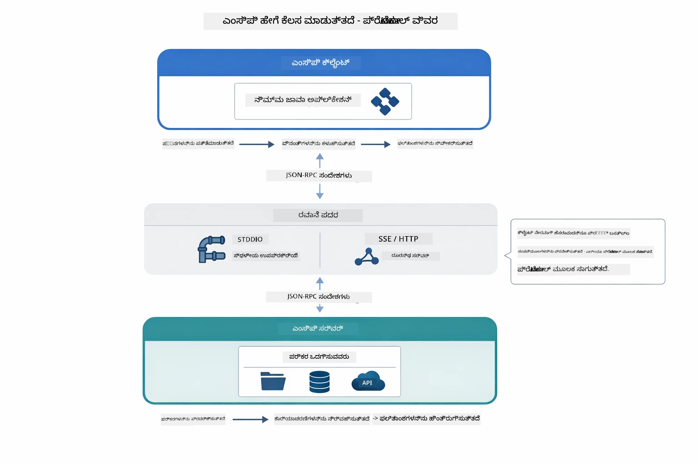

*MCP ಹಿನ್ನೆಲೆಯಲ್ಲಿ ಹೇಗೆ ಕೆಲಸ ಮಾಡುತ್ತದೆ - ಕ್ಲೈಂಟುಗಳು ಸಾಧನಗಳನ್ನು ಕಂಡುಹಿಡಿದು JSON-RPC ಸಂದೇಶಗಳನ್ನು ವಿನಿಮಯ ಮಾಡಿಕೊಳ್ಳುತ್ತವೆ ಮತ್ತು ಸಂಚಾರ ಪದರದಿಂದ ಕಾರ್ಯಾಚರಣೆಗಳನ್ನು ನಿರ್ವಹಿಸುತ್ತವೆ.*

**ಸರ್ವರ್-ಕ್ಲೈಂಟ್ ವಾಸ್ತುಶಿಲ್ಪ**

MCP ಕ್ಲೈಂಟ್-ಸರ್ವರ್ ಮಾದರಿಯನ್ನು ಬಳಕೆಮಾಡುತ್ತದೆ. ಸರ್ವರ್‌ಗಳು ಸಾಧನಗಳನ್ನು ಒದಗಿಸುತ್ತವೆ - ಫೈಲ್ ಓದುವುದು, ಡೇಟಾಬೇಸ್ ವಿಚಾರಣೆ ಮಾಡುವುದು, APIಗಳನ್ನು ಕರೆ ಮಾಡುವುದು. ಕ್ಲೈಂಟ್‌ಗಳು (ನಿಮ್ಮ AI ಅಪ್ಲಿಕೇಶನ್) ಸರ್ವರ್‌ಗಳಿಗೆ ಸಂಪರ್ಕಿಸಿ ಸಾಧನಗಳನ್ನು ಉಪಯೋಗಿಸುತ್ತವೆ.

LangChain4j ಜೊತೆ MCP ಉಪಯೋಗಿಸಲು, ಈ Maven ಅವಲಂಬನೆಯನ್ನು ಸೇರಿಸಿ:

```xml
<dependency>
    <groupId>dev.langchain4j</groupId>
    <artifactId>langchain4j-mcp</artifactId>
    <version>${langchain4j.version}</version>
</dependency>
```

**ಸಾಧನ ಕಂಡುಹಿಡಿತ**

ನಿಮ್ಮ ಕ್ಲೈಂಟ್ MCP ಸರ್ವರ್‌ಗೆ ಸಂಪರ್ಕಿಸಿದಾಗ, ಅದು "ನಿಮ್ಮ ಬಳಿ ಯಾವ ಸಾಧನಗಳಿವೆ?" ಎಂದು ಕೇಳುತ್ತದೆ. ಸರ್ವರ್ ಲಭ್ಯ ಸಾಧನಗಳ ಪಟ್ಟಿಯನ್ನು, ವಿವರಣೆಗಳು ಮತ್ತು ಪರಿಮಾಣ ಸ್ಕೀಮಗಳ ಜೊತೆ ಉತ್ತರಿಸುತ್ತದೆ. ನಿಮ್ಮ AI ಏಜೆಂಟ್ ನಂತರ ಬಳಕೆದಾರ ವಿನಂತಿಯ ಪ್ರಕಾರ ಯಾವ ಸಾಧನಗಳನ್ನು ಉಪಯೋಗಿಸಬೇಕೆಂಬುದನ್ನು ನಿರ್ಧರಿಸಬಹುದು.

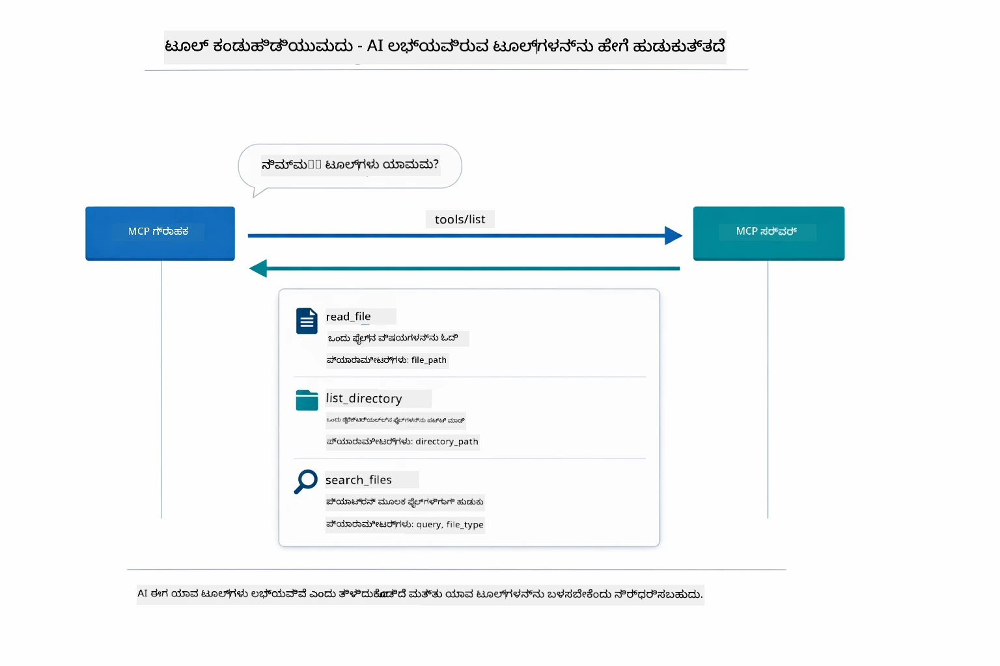

*AI ಆರಂಭದಲ್ಲಿ ಲಭ್ಯ ಸಾಧನಗಳನ್ನು ಕಂಡುಹಿಡಿಯುತ್ತದೆ - ಇದು ಈಗ ಯಾರಾದರೂ ಲಭ್ಯವಿರುವ ಸಾಮರ್ಥ್ಯಗಳನ್ನು ತಿಳಿದುಕೊಳ್ಳುತ್ತದೆ ಮತ್ತು ಯಾವುವನ್ನು ಉಪಯೋಗಿಸುವುದೆಂದನ್ನು ತೀರ್ಮಾನಿಸಬಹುದು.*

**ಸಂಚಾರ ಕ್ರಮಗಳು**

MCP ವಿಭಿನ್ನ ಸಂಚಾರ ಕ್ರಮಗಳನ್ನು ಬೆಂಬಲಿಸುತ್ತದೆ. ಈ ಮೋಡ್ಯೂಲ್ ಸ್ಥಳೀಯ ಪ್ರಕ್ರಿಯೆಗಳಿಗಾಗಿ Stdio ಸಂಚಾರವನ್ನು ಪ್ರದರ್ಶಿಸುತ್ತದೆ:


*MCP ಸಂಚಾರ ಕ್ರಮಗಳು: ದೂರಸ್ಥ ಸರ್ವರ್‌ಗಳಿಗೆ HTTP, ಸ್ಥಳೀಯ ಪ್ರಕ್ರಿಯೆಗಳಿಗಾಗಿ Stdio*

**Stdio** - [StdioTransportDemo.java](../../../05-mcp/src/main/java/com/example/langchain4j/mcp/StdioTransportDemo.java)

ಸ್ಥಳೀಯ ಪ್ರಕ್ರಿಯೆಗಳಿಗೆ. ನಿಮ್ಮ ಅಪ್ಲಿಕೇಶನ್ ಉಪಪ್ರಕ್ರಿಯೆಯಾಗಿ ಸರ್ವರ್ ಅನ್ನು ಸೃಷ್ಟಿಸಿ ಸ್ಟ್ಯಾಂಡರ್ಡ್ ಇನ್ಪುಟ್/ಆઉಟ್‌ಪುಟ್ ಮೂಲಕ ಸಂವಹನ ಮಾಡುತ್ತದೆ. ಫೈಲ್‌ಸಿಸ್ಟಂ ಪ್ರವೇಶ ಅಥವಾ ಕಮಾಂಡ್ ಲೈನ್ ಸಾಧನಗಳಿಗಾಗಿ ಉಪಯುಕ್ತ.

```java
McpTransport stdioTransport = new StdioMcpTransport.Builder()
    .command(List.of(
        npmCmd, "exec",
        "@modelcontextprotocol/server-filesystem@2025.12.18",
        resourcesDir
    ))
    .logEvents(false)
    .build();
```

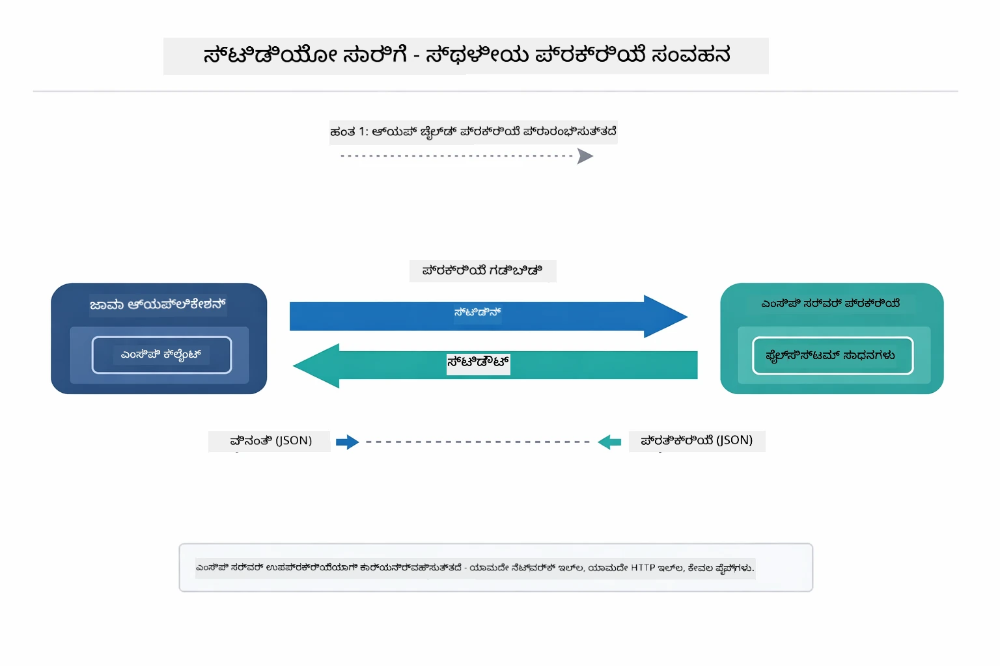

*Stdio ಸಂಚಾರದಲ್ಲಿ ಕಾರ್ಯನಿರ್ವಹಣೆ — ನಿಮ್ಮ ಅಪ್ಲಿಕೇಶನ್ MCP ಸರ್ವರ್ ಅನ್ನು ಮಕ್ಕಳಂತೆ ಸೃಷ್ಟಿಸಿ stdin/stdout ಪೈಪಿನ ಮೂಲಕ ಸಂವಹನ ಮಾಡುತ್ತದೆ.*

> **🤖 [GitHub Copilot](https://github.com/features/copilot) ಚಾಟ್ ಜೊತೆ ಪ್ರಯತ್ನಿಸಿ:** [`StdioTransportDemo.java`](../../../05-mcp/src/main/java/com/example/langchain4j/mcp/StdioTransportDemo.java) ತೆರೆಯಿರಿ ಮತ್ತು ಕೇಳಿ:
> - "Stdio ಸಂಚಾರ ಹೇಗೆ ಕಾರ್ಯನಿರ್ವಹಿಸುತ್ತದೆ ಮತ್ತು ನಾನು ಯಾವಾಗ ಅದನ್ನು HTTP ಗೆ ಬದಲಿಸಿ ಉಪಯೋಗಿಸಬೇಕು?"
> - "LangChain4j ಹೇಗೆ MCP ಸರ್ವರ್ ಚಲಿತಪ್ರಕ್ರಿಯೆಗಳ ಜೀವನಚಕ್ರವನ್ನು ನಿರ್ವಹಿಸುತ್ತದೆ?"
> - "AI ಗೆ ಫೈಲ್ ಸಿಸ್ಟಂ ಪ್ರವೇಶ ನೀಡುವ ಭದ್ರತಾ ಪರಿಣಾಮಗಳು ಏನು?"

## ಏಜೆಂಟಿಕ್ ಮೋಡ್ಯೂಲ್

MCP ಮಾನಕಿತ ಸಾಧನಗಳನ್ನು ಒದಗಿಸುತ್ತಿದ್ದರೆ, LangChain4j ರ **ಏಜೆಂಟಿಕ್ ಮೋಡ್ಯೂಲ್** ಆ ಸಾಧನಗಳನ್ನು ನಿಯಂತ್ರಿಸುವ ಏಜೆಂಟ್‌ಗಳನ್ನು ನಿರ್ಮಿಸಲು ಘೋಷಣಾತ್ಮಕ ಮಾರ್ಗವನ್ನು ಒದಗಿಸುತ್ತದೆ. `@Agent` ಟ್ಯಾಗ್ ಮತ್ತು `AgenticServices` ಮೂಲಕ ನೀವು ಏಜೆಂಟ್ ನಾಳಿಕೆಯನ್ನು ಪರಿಸರದಂತೆ rather than ಕಮಾಂಡ್ ಆಧಾರಿತ ಕೋಡ್ ಮೂಲಕ ವ್ಯಾಖ್ಯಾನಿಸಬಹುದು.

ಈ ಮೋಡ್ಯೂಲ್‌ನಲ್ಲಿ, ನೀವು **ಮೇಲ್ವಿಚಾರಕ ಏಜೆಂಟ್** ಪ್ಯಾಟರ್ನ್ ಅನ್ನು ಅನ್ವೇಷಿಸುವಿರಿ — ಇದು ಬಳಕೆದಾರರ ವಿನಂತಿಯ ಆಧಾರದಲ್ಲಿ ಉಪ-ಏಜೆಂಟ್‌ಗಳನ್ನು ಡೈನಾಮಿಕ್ ಆಗಿ ಕರೆ ಮಾಡುವ ಉನ್ನತ ಏಜೆಂಟಿಕ್ AI ವಿಧಾನ. ನಾವು MCP ಚಾಲಿತ ಫೈಲ್ ಪ್ರವೇಶ ಸಾಮರ್ಥ್ಯಗಳನ್ನು ಹೊಂದಿರುವ ಒಂದು ಉಪಏಜೆಂಟ್ ಅನ್ನು ಸಹಾಯಪಡಿಸಿ ಎರಡನ್ನು ಸಂಯೋಜಿಸುವೆವು.

ಏಜೆಂಟಿಕ್ ಮೋಡ್ಯೂಲ್ ಉಪಯೋಗಿಸಲು, ಈ Maven ಅವಲಂಬನೆಯನ್ನು ಸೇರಿಸಿ:

```xml
<dependency>
    <groupId>dev.langchain4j</groupId>
    <artifactId>langchain4j-agentic</artifactId>
    <version>${langchain4j.mcp.version}</version>
</dependency>
```

> **⚠️ ಪ್ರಾಯೋಗಿಕ:** `langchain4j-agentic` ಮೋಡ್ಯೂಲ್ **ಪ್ರಾಯೋಗಿಕ** ಆಗಿದೆ ಮತ್ತು ಬದಲಾವಣೆಗಳಿಗೆ ಒಳಪಟ್ಟಿದೆ. AI ಸಹಾಯಕರನ್ನು ನಿರ್ಮಿಸುವ ಸ್ಥಿರ ಮಾರ್ಗವು `langchain4j-core` ಮತ್ತು ಕಸ್ಟಮ್ ಸಾಧನಗಳೊಂದಿಗೆ (ಮೋಡ್ಯೂಲ್ 04) ಆಗಿದೆ.

## ಉದಾಹರಣೆಗಳನ್ನು ಕಾರ್ಯಗತಗೊಳಿಸುವುದು

### ಆಗಾಗ ಬೇಕಾಗುವ ಐಟಂಗಳು

- ಜಾವಾ 21+, Maven 3.9+
- Node.js 16+ ಮತ್ತು npm (MCP ಸರ್ವರ್‌ಗಳಿಗೆ)
- `.env` ಫೈಲ್ ನಲ್ಲಿ ಪರಿಸರ ಚರಗಳಿಂದ ಸಂರಚಿತ (ರೂಟ್ ಡೈರೆಕ್ಟರಿಯಿಂದ):
  - `AZURE_OPENAI_ENDPOINT`, `AZURE_OPENAI_API_KEY`, `AZURE_OPENAI_DEPLOYMENT` (ಮೋಡ್ಯೂಲ್‌ಗಳು 01-04 ನಷ್ಟೇ)

> **ಗಮನ:** ನೀವು ಇನ್ನು ನಿಮ್ಮ ಪರಿಸರ ಚರಗಳನ್ನು ಹೊಂದಿಸಿರಲಿಲ್ಲದಿದ್ದರೆ, ಸೂಚನೆಗಳಿಗೆ [ಮೋಡ್ಯೂಲ್ 00 - ವೇಗದ ಪ್ರಾರಂಭ](../00-quick-start/README.md) ನೋಡಿ, ಅಥವಾ ರೂಟ್ ಡೈರೆಕ್ಟರಿಯಲ್ಲಿ `.env.example` ಫೈಲ್ ನಕಲಿಸಿ `.env` ಮಾಡಿ ನಿಮ್ಮ ಮೌಲ್ಯಗಳನ್ನು ತುಂಬಿ.

## ವೇಗದ ಪ್ರಾರಂಭ

**VS ಕೋಡ್ ಬಳಸಿ:** ಗವೇಶಕನಲ್ಲಿ ಯಾವುದೇ ಡೆಮೊ ಫೈಲ್ ಮೇಲೆ ರೈಟ್ ಕ್ಲಿಕ್ ಮಾಡಿ **"Java ಓಡಿಸಿ"** ಆಯ್ಕೆಮಾಡಿ, ಅಥವಾ ರನ್ ಮತ್ತು ಡೀಬಗ್ ಫಲಕದಿಂದ ಲಾಂಚ್ ಸಂರಚನೆಗಳನ್ನು ಬಳಸಬಹುದು (ನೀವು ಮೊದಲು `.env` ಫೈಲ್ ಗೆ ಟೊಕನ್ ಸೇರಿಸಿರುವುದನ್ನು ಖಚಿತಪಡಿಸಿಕೊಳ್ಳಿ).

**Maven ಬಳಸಿ:** ಅಥವಾ, ಕೆಳಗಿನ ಉದಾಹರಣೆಗಳೊಂದಿಗೆ ಕಮಾಂಡ್ ಲೈನ್ ನಲ್ಲಿ ಚಲಾಯಿಸಬಹುದು.

### ಫೈಲ್ ಕಾರ್ಯಾಚರಣೆಗಳು (Stdio)

ಇದು ಸ್ಥಳೀಯ ಉಪಪ್ರಕ್ರಿಯೆಯಾಧಾರಿತ ಸಾಧನಗಳನ್ನು ತೋರಿಸುತ್ತದೆ.

**✅ ಯಾವುದೇ ಪೂರ್ವ ಅವಶ್ಯಕತೆಗಳಿಲ್ಲ** - MCP ಸರ್ವರ್ ಸ್ವತಃ ಸೃಷ್ಟಿಸಲಾಗುತ್ತದೆ.

**ಆರಂಭ ದಶೆ (ಶಿಫಾರಸು ಮಾಡಲಾಗಿದೆ):**

ಆರಂಭ ದಶೆಗಳು ರೂಟ್ `.env` ಫೈಲ್ ಇಂದ ಪರಿಸರ ಚರಗಳನ್ನು ಸ್ವಯಂಚಾಲಿತವಾಗಿ ಲೋಡ್ ಮಾಡುತ್ತವೆ:

**ಬ್ಯಾಶ್:**
```bash
cd 05-mcp
chmod +x start-stdio.sh
./start-stdio.sh
```

**ಪವರ್‌ಚೆಲ್:**
```powershell
cd 05-mcp
.\start-stdio.ps1
```

**VS ಕೋಡ್ ಬಳಸಿ:** `StdioTransportDemo.java` ಮೇಲೆ ರೈಟ್ ಕ್ಲಿಕ್ ಮಾಡಿ **"Java ಓಡಿಸಿ"** ಆಯ್ಕೆಮಾಡಿ (ನಿಮ್ಮ `.env` ಫೈಲ್ ಸರಿಯಾಗಿ ಹೊಂದಿಸಲಾಗಿದೆ ಎಂದು ಖಚಿತಪಡಿಸಿಕೊಳ್ಳಿ).

ಅಪ್ಲಿಕೇಶನ್ ಸ್ವತಃ ಫೈಲ್‌ಸಿಸ್ಟಂ MCP ಸರ್ವರ್ ಅನ್ನು ಸೃಷ್ಟಿಸಿ ಸ್ಥಳೀಯ ಫೈಲ್ ಓದುತ್ತದೆ. ಉಪಪ್ರಕ್ರಿಯೆ ನಿರ್ವಹಣೆ ನಿಮಗಾಗಿ ಹೇಗೆ ಮಾಡಲ್ಪಡುತ್ತಿದೆ ಎಂದು ಗಮನಿಸಿ.

**ನಿರೀಕ್ಷಿತ ಔಟ್‌ಪುಟ್:**
```
Assistant response: The file provides an overview of LangChain4j, an open-source Java library
for integrating Large Language Models (LLMs) into Java applications...
```

### ಮೇಲ್ವಿಚಾರಕ ಏಜೆಂಟ್

**ಮೇಲ್ವಿಚಾರಕ ಏಜೆಂಟ್ ಪ್ಯಾಟರ್ನ್** ಒಂದು **ಲಚಿಲಾದ** ಏಜೆಂಟಿಕ್ AI ರೂಪವಾಗಿದೆ. ಮೇಲ್ವಿಚಾರಕ ಬಳಕೆದಾರರ ವಿನಂತಿಯ ಆಧಾರದಲ್ಲಿ ಸ್ವತಂತ್ರವಾಗಿ ಯಾವ ಏಜೆಂಟ್‌ಗಳನ್ನು ಕರೆ ಮಾಡಬೇಕು ಎಂದು ನಿರ್ಧರಿಸುವ LLMನ್ನು ಉಪಯೋಗಿಸುತ್ತದೆ. ಮುಂದಿನ ಉದಾಹರಣೆಯಲ್ಲಿ, ನಾವು MCP ಚಾಲಿತ ಫೈಲ್ ಪ್ರವೇಶವನ್ನು LLM ಏಜೆಂಟ್ ಜೊತೆಗೆ ಸಂಯೋಜಿಸಿ ಮೇಲ್ವಿಚಾರಿತ ಫೈಲ್ ಓದು → ವರದಿ ವರ್ಕ್‌ಫ್ಲೋವನ್ನು ನಿರ್ಮಿಸುವೆವು.

ಡೆಮೊನಲ್ಲಿ, `FileAgent` MCP ಫೈಲ್‌ಸಿಸ್ಟಂ ಸಾಧನಗಳನ್ನು ಉಪಯೋಗಿಸಿ ಫೈಲ್ ಓದುವದು, ಮತ್ತು `ReportAgent` ರಚನಾತ್ಮಕ ವರದಿ (ಒಂದು ವಾಕ್ಯ ಸಂಕ್ಷಿಪ್ತಿಕೆ, 3 ಪ್ರಮುಖ ಅಂಶಗಳು, ಶಿಫಾರಸುಗಳು) ರಚಿಸುವದು. ಮೇಲ್ವಿಚಾರಕ ಸ್ವತಃ ಈ ಪ್ರವಾಹವನ್ನು ನಿರ್ವಹಿಸುತ್ತದೆ:

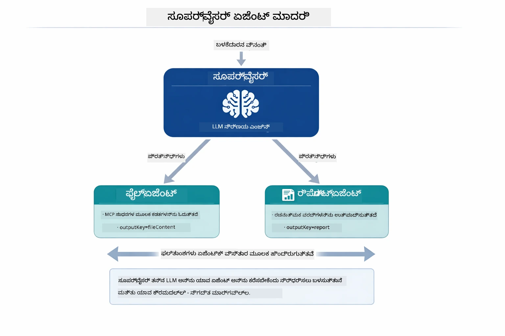

*ಮೇಲ್ವಿಚಾರಕ ತನ್ನ LLM ಉಪಯೋಗಿಸಿ ಯಾವ ಏಜೆಂಟ್‌ಗಳನ್ನು ಎಷ್ಟು ಕ್ರಮದಲ್ಲಿ ಕರೆ ಮಾಡಬೇಕು ಎಂದು ನಿರ್ಧರಿಸುತ್ತದೆ — ಯಾವುದೇ ಹಾರ್ಡ್ಕೋಡ್ ಮಾರ್ಗವಿಧಾನ ಅಗತ್ಯವಿಲ್ಲ.*

ನಮ್ಮ ಫೈಲ್-ನಿರ್ದೇಶಿತ ವರದಿ ದಂಡಣಿಯನ್ನು ಹೊಂದಿರುವ ನಿಜವಾದ ಕಾರ್ಯವಿಧಾನ ಇಲ್ಲಿದೆ:

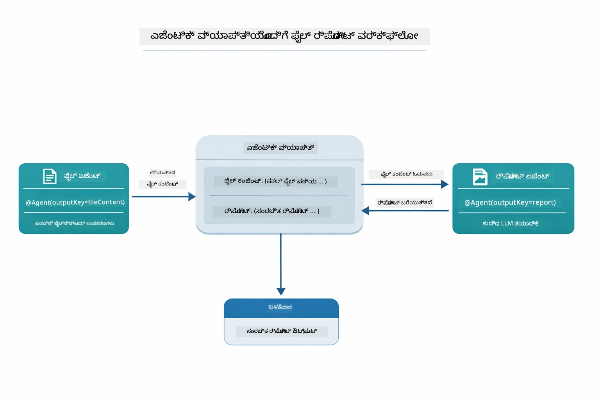

*FileAgent MCP ಸಾಧನಗಳ ಮೂಲಕ ಫೈಲ್ ಓದಿ, ನಂತರ ReportAgent ಅಸಂರಚಿತ ವಿಷಯವನ್ನು ರಚನಾತ್ಮಕ ವರದಿಗೆ ಪರಿವರ್ತಿಸುತ್ತದೆ.*

ಎಲ್ಲಾ ಏಜೆಂಟ್‌ಗಳು ತಮ್ಮ ಔಟ್‌ಪುಟ್ ಅನ್ನು **ಏಜೆಂಟಿಕ್ ವಿಸ್ತಾರ** (ಹಂಚಿದ ಮೆಮೊರಿ) ಯಲ್ಲಿ ಸಂಗ್ರಹಿಸುತ್ತವೆ, ಇದರಿಂದ ಮುಂದಿನ ಏಜೆಂಟ್‌ಗಳು ಹಿಂದಿನ ಫಲಿತಾಂಶಗಳನ್ನು ಪ್ರವೇಶಿಸಬಹುದು. ಇದು MCP ಸಾಧನಗಳು ಏಜೆಂಟಿಕ್ ವರ್ಕ್‌ಫ್ಲೋಗೆ ಸುಲಭವ={}) ಸಮಸ್ಯೆಯ ಲಭಿಸುತ್ತದೆ — ಮೇಲ್ವಿಚಾರಕಕ್ಕೆ *ಫೈಲ್‌ಗಳನ್ನು ಹೇಗೆ ಓದಲಾಗುತ್ತದೆ* ಎಂಬುದನ್ನು ತಿಳಿಯಬೇಕಿಲ್ಲ, `FileAgent` ಅದನ್ನು ಮಾಡಬಹುದು ಎಂದು ತಿಳಿದಿರಬೇಕು ಮಾತ್ರ.

#### ಡೆಮೊ ಓಡಿಸುವುದು

ಆರಂಭ ದಶೆಗಳು ರೂಟ್ `.env` ಫೈಲ್ ಇಂದ ಪರಿಸರ ಚರಗಳನ್ನು ಸ್ವಯಂಚಾಲಿತವಾಗಿ ಲೋಡ್ ಮಾಡುತ್ತವೆ:

**ಬ್ಯಾಶ್:**
```bash
cd 05-mcp
chmod +x start-supervisor.sh
./start-supervisor.sh
```

**ಪವರ್‌ಚೆಲ್:**
```powershell
cd 05-mcp
.\start-supervisor.ps1
```

**VS ಕೋಡ್ ಬಳಸಿ:** `SupervisorAgentDemo.java` ಮೇಲೆ ರೈಟ್ ಕ್ಲಿಕ್ ಮಾಡಿ **"Java ಓಡಿಸಿ"** ಆಯ್ಕೆಮಾಡಿ (ನಿಮ್ಮ `.env` ಫೈಲ್ ಸರಿಯಾಗಿ ಹೊಂದಿಸಲಾಗಿದೆ ಎಂದು ಖಚಿತಪಡಿಸಿಕೊಳ್ಳಿ).

#### ಮೇಲ್ವಿಚಾರಕ ಹೇಗೆ ಕಾರ್ಯನಿರ್ವಹಿಸುತ್ತದೆ

```java
// ಹಂತ 1: FileAgent MCP ಸಾಧನಗಳನ್ನು ಬಳಸಿಕೊಂಡು ಫೈಲ್‌ಗಳನ್ನು ಓದುತ್ತದೆ
FileAgent fileAgent = AgenticServices.agentBuilder(FileAgent.class)
        .chatModel(model)
        .toolProvider(mcpToolProvider)  // ಫೈಲ್ ಆಪರೇಷನ್‌ಗಳಿಗೆ MCP ಸಾಧನಗಳನ್ನು ಹೊಂದಿದೆ
        .build();

// ಹಂತ 2: ReportAgent ರಚನಾತ್ಮಕ ವರದಿಗಳನ್ನು ರಚಿಸುತ್ತದೆ
ReportAgent reportAgent = AgenticServices.agentBuilder(ReportAgent.class)
        .chatModel(model)
        .build();

// Supervisor ಫೈಲ್ → ವರದಿ ಕಾರ್ಯಪ್ರವಾಹವನ್ನು ಸಂಕಲನಗೊಳಿಸುತ್ತದೆ
SupervisorAgent supervisor = AgenticServices.supervisorBuilder()
        .chatModel(model)
        .subAgents(fileAgent, reportAgent)
        .responseStrategy(SupervisorResponseStrategy.LAST)  // ಅಂತಿಮ ವರದಿಯನ್ನು ಮರಳಿಸಿ
        .build();

// ವಿನಂತಿಯ ಆಧಾರದ ಮೇಲೆ ಯಾವ ಏಜೆಂಟ್‌ಗಳನ್ನು ಕರೆಸಬೇಕೆಂದು Supervisor ನಿರ್ಧರಿಸುತ್ತದೆ
String response = supervisor.invoke("Read the file at /path/file.txt and generate a report");
```

#### ಪ್ರತಿಕ್ರಿಯಾ ತಂತ್ರಗಳು

ನೀವು `SupervisorAgent` ಅನ್ನು ಸಂರಚಿಸುವಾಗ, ಉಪ-ಏಜೆಂಟ್‌ಗಳು ತಮ್ಮ ಕಾರ್ಯಗಳನ್ನು ಪೂರ್ಣಗೊಳಿಸಿದ ನಂತರ ಬಳಕೆದಾರನಿಗೆ ಕೊನೆಯ ಉತ್ತರವನ್ನು ಹೇಗೆ ರೂಪಿಸಬೇಕು ಎಂದು ನೀವು ನಿರ್ಧರಿಸುತ್ತೀರಿ.

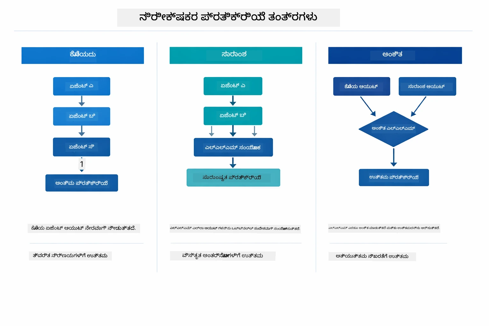

*ಮೇಲ್ವಿಚಾರಕ ಕೊನೆಗೊಳ್ಳುವ ಪ್ರತಿಕ್ರಿಯೆಯನ್ನು ರೂಪಿಸುವ ಮೂರು ತಂತ್ರಗಳು — ನೀವು ಕೊನೆಯ ಏಜೆಂಟ್ ಔಟ್‌ಪುಟ್, ಸಂಶ್ಲೇಷಿಸಲಾದ ಸಂಕ್ಷಿಪ್ತಿಕೆ ಅಥವಾ ಅತ್ಯುತ್ತಮ ಅಂಕ ಹೊಂದಿದ ಆಯ್ಕೆಯನ್ನು ಆಧರಿಸಿ ಆಯ್ಕೆಮಾಡಬಹುದು.*

ಲಭ್ಯವಿರುವ ತಂತ್ರಗಳು:

| ತಂತ್ರ | ವಿವರಣೆ |
|----------|-------------|
| **LAST** | ಮೇಲ್ವಿಚಾರಕ ಕೊನೆ ಉಪ-ಏಜೆಂಟ್ ಅಥವಾ ಕರೆಮಾಡಲಾದ ಸಾಧನದ ಔಟ್‌ಪುಟ್ ಅನ್ನು ನೀಡುತ್ತದೆ. ಇದು ಕೊನೆಯ ಏಜೆಂಟ್ ಸಂಪೂರ್ಣ, ಅಂತಿಮ ಉತ್ತರವನ್ನು ನೀಡುವುದಕ್ಕೆ ವಿಶೇಷವಾಗಿ ವಿನ್ಯಾಸಗೊಳಿಸಿದಾಗ (ಉದಾ: ಸಂಶೋಧನಾ ಪ್ರವಾಹದಲ್ಲಿ "ಸಂಕ್ಷಿಪ್ತಿಕೆ ಏಜೆಂಟ್") ಉಪಯುಕ್ತ. |
| **SUMMARY** | ಮೇಲ್ವಿಚಾರಕ ತನ್ನ ಸ್ವಂತ ಒಳಗಿನ ಭಾಷಾ ಮಾದರಿಯನ್ನು (LLM) ಉಪಯೋಗಿಸಿ ಸಂಪೂರ್ಣ ಸಂಭಾಷಣೆ ಮತ್ತು ಎಲ್ಲಾ ಉಪ-ಏಜೆಂಟ್ ಔಟ್‌ಪುಟ್‌ಗಳ ಸಂಕ್ಷಿಪ್ತಿಕರಣವನ್ನು ರೂಪಿಸಿ, ಆ ಸಂಕ್ಷಿಪ್ತಿಕರಣವನ್ನು ಕೊನೆಯ ಪ್ರತಿಕ್ರಿಯೆಯಾಗಿ ನೀಡುತ್ತದೆ. ಇದು ಬಳಕೆದಾರನಿಗೆ ಸ್ವಚ್ಛ ಮತ್ತು ಸಂಗ್ರಹಿತ ಉತ್ತರವನ್ನು ಒದಗಿಸುತ್ತದೆ. |
| **SCORED** | ವ್ಯವಸ್ಥೆ ಒಳಗಿನ LLM ಅನ್ನು ಉಪಯೋಗಿಸಿ `LAST` ಪ್ರತಿಕ್ರಿಯೆ ಮತ್ತು ಸಂಭಾಷಣೆಯ `SUMMARY` ಎರಡರನ್ನೂ ಬಳಕೆದಾರ ಮೂಲ ವಿನಂತಿಯ ವಿರುದ್ಧ ಅಂಕ ನೀಡುತ್ತದೆ ಮತ್ತು ಹೆಚ್ಚಿನ ಅಂಕ ಪಡೆದ ಔಟ್‌ಪುಟ್ ಅನ್ನು ನೀಡುತ್ತದೆ. |

ಪೂರ್ಣ ಅನುಷ್ಠಾನಕ್ಕಾಗಿ [SupervisorAgentDemo.java](../../../05-mcp/src/main/java/com/example/langchain4j/mcp/SupervisorAgentDemo.java) ನೋಡಿ.

> **🤖 [GitHub Copilot](https://github.com/features/copilot) ಚಾಟ್ ಜೊತೆ ಪ್ರಯತ್ನಿಸಿ:** [`SupervisorAgentDemo.java`](../../../05-mcp/src/main/java/com/example/langchain4j/mcp/SupervisorAgentDemo.java) ತೆರೆಯಿರಿ ಮತ್ತು ಕೇಳಿ:
> - "ಮೇಲ್ವಿಚಾರಕ ಯಾವ ಏಜೆಂಟ್‌ಗಳನ್ನು ಕರೆ ಮಾಡಬೇಕೆಂದು ಹೇಗೆ ನಿರ್ಧರಿಸುತ್ತದೆ?"
> - "ಮೇಲ್ವಿಚಾರಕ ಮತ್ತು ಕ್ರಮಬದ್ಧ ವರ್ಕ್‌ಫ್ಲೋ ಪ್ಯಾಟರ್ನ್ಗಳ ನಡುವೆ ಏನು ಭಿನ್ನತೆ?"
> - "ನಾನು ಮೇಲ್ವಿಚಾರಕರ ಯೋಜನಾ ವರ್ತನೆ ಅನ್ನು ಹೇಗೆ ಕಸ್ಟಮೈಸ್ ಮಾಡಬಹುದು?"

#### ಫಲಿತಾಂಶವನ್ನು ಅರ್ಥಮಾಡಿಕೊಳ್ಳುವುದು

ಡೇಮೋ ಓಡಿಸುವಾಗ, ನೀವು ಮೇಲ್ವಿಚಾರಕ ಹೇಗೆ ಹಲವು ಏಜೆಂಟ್‌ಗಳನ್ನು ಸಂಚಾಲಿಸುತ್ತದೆ ಎಂಬ ಅನುಕ್ರಮಣಿಕೆಯನ್ನು ನೋಡುತ್ತೀರಿ. ಹೀಗಿದೆ ಪ್ರತಿ ವಿಭಾಗದ ಅರ್ಥ:

```
======================================================================
  FILE → REPORT WORKFLOW DEMO
======================================================================

This demo shows a clear 2-step workflow: read a file, then generate a report.
The Supervisor orchestrates the agents automatically based on the request.
```

**ಶೀರ್ಷಿಕೆ** ವರ್ಕ್‌ಫ್ಲೋ ಪರಿಕಲ್ಪನೆ ಪರಿಚಯಿಸುವದು: ಫೈಲ್ ಓದುವಿಕೆಯಿಂದ ವರದಿ ರಚನೆಗೆ ಕೇಂದ್ರಿತ ಪ್ರವಾಹ.

```
--- WORKFLOW ---------------------------------------------------------
  ┌─────────────┐      ┌──────────────┐
  │  FileAgent  │ ───▶ │ ReportAgent  │
  │ (MCP tools) │      │  (pure LLM)  │
  └─────────────┘      └──────────────┘
   outputKey:           outputKey:
   'fileContent'        'report'

--- AVAILABLE AGENTS -------------------------------------------------
  [FILE]   FileAgent   - Reads files via MCP → stores in 'fileContent'
  [REPORT] ReportAgent - Generates structured report → stores in 'report'
```

**ವರ್ಕ್‌ಫ್ಲೋ ಚಿತ್ರ** ಏಜೆಂಟ್‌ಗಳ ನಡುವೆ ಡೇಟಾ ಪ್ರವಹವನ್ನು ತೋರಿಸುತ್ತದೆ. ಪ್ರತಿ ಏಜೆಂಟ್‌್ಗೆ ನಿರ್ದಿಷ್ಟ ಪಾತ್ರವಿದೆ:
- **FileAgent** MCP ಸಾಧನಗಳಿಂದ ಫೈಲ್ ಓದುತ್ತದೆ ಮತ್ತು ಮೂಲ ವಿಷಯವನ್ನು `fileContent` ನಲ್ಲಿ ಸಂಗ್ರಹಿಸುತ್ತದೆ
- **ReportAgent** ಆ ವಿಷಯವನ್ನು ಉಪಯೋಗಿಸಿ ರಚನಾತ್ಮಕ ವರದಿ `report` ರಚಿಸುತ್ತದೆ

```
--- USER REQUEST -----------------------------------------------------
  "Read the file at .../file.txt and generate a report on its contents"
```

**ಬಳಕೆದಾರ ವಿನಂತಿ** ಕಾರ್ಯವನ್ನು ತೋರಿಸುತ್ತದೆ. ಮೇಲ್ವಿಚಾರಕ ಇದನ್ನು ವೈಭವಿಸಿ FileAgent → ReportAgent ಕರೆಮಾಡಲು ನಿರ್ಧರಿಸುತ್ತದೆ.

```
--- SUPERVISOR ORCHESTRATION -----------------------------------------
  The Supervisor decides which agents to invoke and passes data between them...

  +-- STEP 1: Supervisor chose -> FileAgent (reading file via MCP)
  |
  |   Input: .../file.txt
  |
  |   Result: LangChain4j is an open-source, provider-agnostic Java framework for building LLM...
  +-- [OK] FileAgent (reading file via MCP) completed

  +-- STEP 2: Supervisor chose -> ReportAgent (generating structured report)
  |
  |   Input: LangChain4j is an open-source, provider-agnostic Java framew...
  |
  |   Result: Executive Summary...
  +-- [OK] ReportAgent (generating structured report) completed
```

**ಮೇಲ್ವಿಚಾರಕ ಸಂಚಲನ** 2 ಹಂತದ പ്രവಾಹವನ್ನು ತೋರಿಸುತ್ತದೆ:
1. **FileAgent** MCP ಮೂಲಕ ಫೈಲ್ ಓದುತ್ತದೆ ಮತ್ತು ವಿಷಯವನ್ನು ಸಂಗ್ರಹಿಸುತ್ತದೆ
2. **ReportAgent** ವಿಷಯವನ್ನು ಪಡೆದ ನಂತರ ರಚನಾತ್ಮಕ ವರದಿ ರೂಪಿಸುತ್ತದೆ

ಮೇಲ್ವಿಚಾರಕ ಬಳಕೆದಾರ ವಿನಂತಿಯ ಆಧಾರದ ಮೇಲೆ ಸ್ವತಂತ್ರವಾಗಿ ಈ ನಿರ್ಧಾರಗಳನ್ನು ಮಾಡಿದೆ.

```
--- FINAL RESPONSE ---------------------------------------------------
Executive Summary
...

Key Points
...

Recommendations
...

--- AGENTIC SCOPE (Data Flow) ----------------------------------------
  Each agent stores its output for downstream agents to consume:
  * fileContent: LangChain4j is an open-source, provider-agnostic Java framework...
  * report: Executive Summary...
```

#### ಏಜೆಂಟಿಕ್ ಮೋಡ್ಯೂಲ್ ವೈಶಿಷ್ಟ್ಯಗಳ ವಿವರಣೆ

ಉದಾಹರಣೆ ಏಜೆಂಟಿಕ್ ಮೋಡ್ಯೂಲ್‌ನ ಹಲವಾರು ಉನ್ನತ ವೈಶಿಷ್ಟ್ಯಗಳನ್ನು ತೋರಿಸುತ್ತದೆ. ಅದರಲ್ಲಿ ಏಜೆಂಟಿಕ್ ವಿಸ್ತಾರ ಮತ್ತು ಏಜೆಂಟ್ ಶ್ರೋತ ಗಳು ಸೇರಿವೆ.

**ಏಜೆಂಟಿಕ್ ವಿಸ್ತಾರ** ಸಹಭಾಗಿತ್ವ ಮೆಮೊರಿ ಆಗಿದ್ದು, ಏಜೆಂಟ್‌ಗಳು ತಮ್ಮ ಫಲಿತಾಂಶಗಳನ್ನು `@Agent(outputKey="...")` ಮೂಲಕ ಇಲ್ಲಿ ಸಂಗ್ರಹಿಸುತ್ತವೆ. ಇದರಿಂದ:
- ನಂತರದ ಏಜೆಂಟ್‌ಗಳು ಹಿಂದಿನ ಫಲಿತಾಂಶವನ್ನು ಪ್ರವೇಶಿಸಬಹುದು
- ಮೇಲ್ವಿಚಾರಕ ಅಂತಿಮ ಪ್ರತಿಕ್ರಿಯೆಯನ್ನು ಸಂಶ್ಲೇಷಿಸಬಹುದು
- ನೀವು ಪ್ರತಿ ಏಜೆಂಟ್ ಏನು ರಚಿಸಿದ್ದು ಎಂದು ಪರಿಶೀಲಿಸಬಹುದು

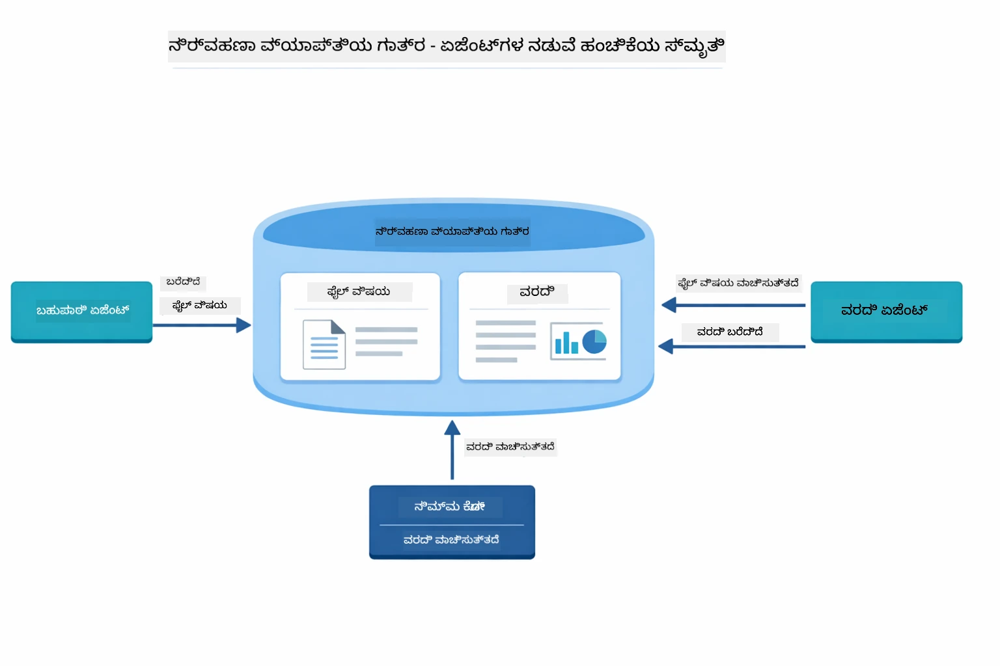

*ಏಜೆಂಟಿಕ್ ವಿಸ್ತಾರ ಸಹಭಾಗಿತ್ವ ಮೆಮೊರಿ ಆಗಿದ್ದು — FileAgent `fileContent` ಅನ್ನು ಬರೆಯುತ್ತದೆ, ReportAgent ಅದನ್ನು ಓದುತ್ತದೆ ಮತ್ತು `report` ಅನ್ನು ಬರೆಯುತ್ತದೆ, ಮತ್ತು ನೀವು ಅಂತಿಮ ಫಲಿತಾಂಶವನ್ನು ಓದುತ್ತೀರಿ.*

```java
ResultWithAgenticScope<String> result = supervisor.invokeWithAgenticScope(request);
AgenticScope scope = result.agenticScope();
String fileContent = scope.readState("fileContent");  // ಫೈಲ್ ಏಜೆಂಟ್‌ನಿಂದ ರಾ ಫೈಲ್ ಡೇಟಾ
String report = scope.readState("report");            // ರಿಪೋರ್ಟ್ ಏಜೆಂಟ್‌ನಿಂದ ರಚನೆಯಲ್ಲಿದೆ ವರದಿ
```

**ಏಜೆಂಟ್ ಶ್ರೋತಗಳು** ಏಜೆಂಟ್ ಕಾರ್ಯಾಚರಣೆಯ ನಿಗಾವಳಿಕೆಗೆ ಮತ್ತು ಡೀಬಗ್ಗಿಂಗೆ ಅವಕಾಶ ನೀಡುತ್ತವೆ. ಡೆಮೋದಲ್ಲಿ ನೀವು ನೋಡುತ್ತಿರುವ ಹಂತ-ಹೊರಹೊಳಗಿನ ಔಟ್‌ಪುಟ್ ಪ್ರತಿ ಏಜೆಂಟ್ ಕರೆಯುವಿಕೆಯಲ್ಲಿ ಸೇರಿಸಲಾಗಿರುವ ಏಜೆಂಟ್ ಶ್ರೋತವಾಗಿದೆ:
- **beforeAgentInvocation** - ಸೂಪರ್‌ವೈಸರ್‌ ಒಂದು ಏಜೆಂಟ್ ಅನ್ನು ಆಯ್ಕೆಮಾಡಿದಾಗ ಕರೆಮಾಡಲ್ಪಡುವುದು, ಯಾವ ಏಜೆಂಟ್ ಆಯ್ಕೆಮಾಡಲ್ಪಟ್ಟದೆ ಮತ್ತು ಎಂಥ ಕಾರಣಗಳಿಂದ ಎಂದು ನಿಮಗೆ ತಿಳಿಸಲು
- **afterAgentInvocation** - ಏಜೆಂಟ್ ಕಾರ್ಯನಿರ್ವಹಿಸಿದ ನಂತರ ಕರೆಮಾಡಲ್ಪಡುವುದು, ಅದರ ಫಲಿತಾಂಶವನ್ನು ತೋರಿಸುತ್ತದೆ
- **inheritedBySubagents** - ಸತ್ಯವಾದಾಗ, ಲಿಸ್ನರ್ ಎಲ್ಲಾ ಏಜೆಂಟ್‌ಗಳ ಹಿರಾರ್ಕಿಯನ್ನು ನಿಯಂತ್ರಿಸುತ್ತದೆ

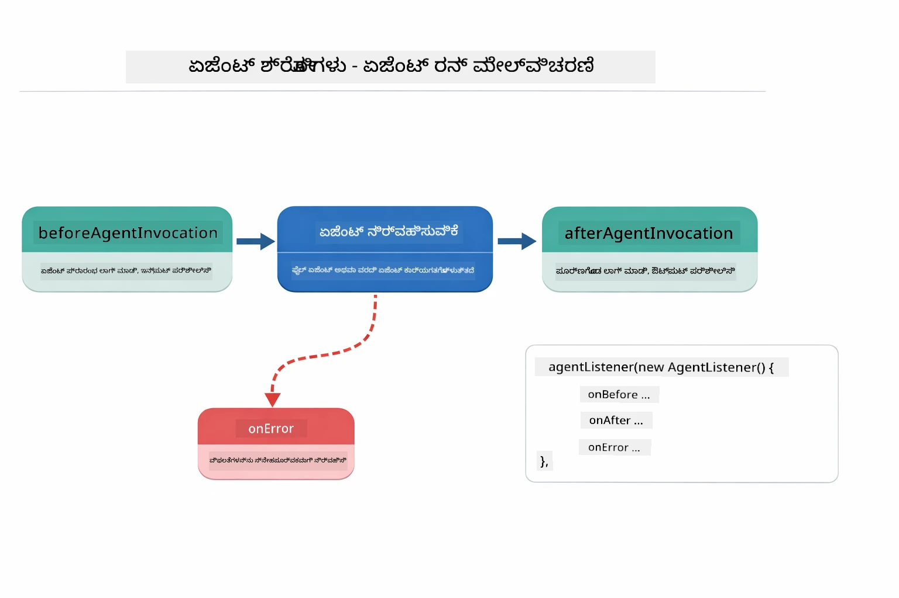

*ಏಜೆಂಟ್ ಲಿಸ್ನರ್ಸ್ ನಿರ್ವಹಣೆಯ ಜೀವನಚಕ್ರಕ್ಕೆ ಹೂಕುಲೆ ಹಾಕುತ್ತಾರೆ — ಏಜೆಂಟ್‌ಗಳು ಆರಂಭಿಸುವಾಗ, ಪೂರ್ಣಗೊಳ್ಳುವಾಗ ಅಥವಾ ದೋಷಗಳನ್ನು ಎದುರಿಸುವಾಗ ಗಮನಿಸುವುದು.*

```java
AgentListener monitor = new AgentListener() {
    private int step = 0;
    
    @Override
    public void beforeAgentInvocation(AgentRequest request) {
        step++;
        System.out.println("  +-- STEP " + step + ": " + request.agentName());
    }
    
    @Override
    public void afterAgentInvocation(AgentResponse response) {
        System.out.println("  +-- [OK] " + response.agentName() + " completed");
    }
    
    @Override
    public boolean inheritedBySubagents() {
        return true; // ಎಲ್ಲಾ ಉಪ-ಏಜೆಂಟ್‌ಗಳಿಗೆ ವ್ಯಾಪಿಸು
    }
};
```

ಸೂಪರ್‌ವೈಸರ್ ಮಾದರಿಯನ್ನು ಮೀರಿಸಿ, `langchain4j-agentic` ಮೋಡ್ಯೂಲ್ ಹಲವಾರು ಶಕ್ತಿಶಾಲಿ ಕಾರ್ಯಪ್ರवाह ಮಾದರಿಗಳು ಮತ್ತು ವೈಶಿಷ್ಟ್ಯಗಳನ್ನು ಒದಗಿಸುತ್ತದೆ:

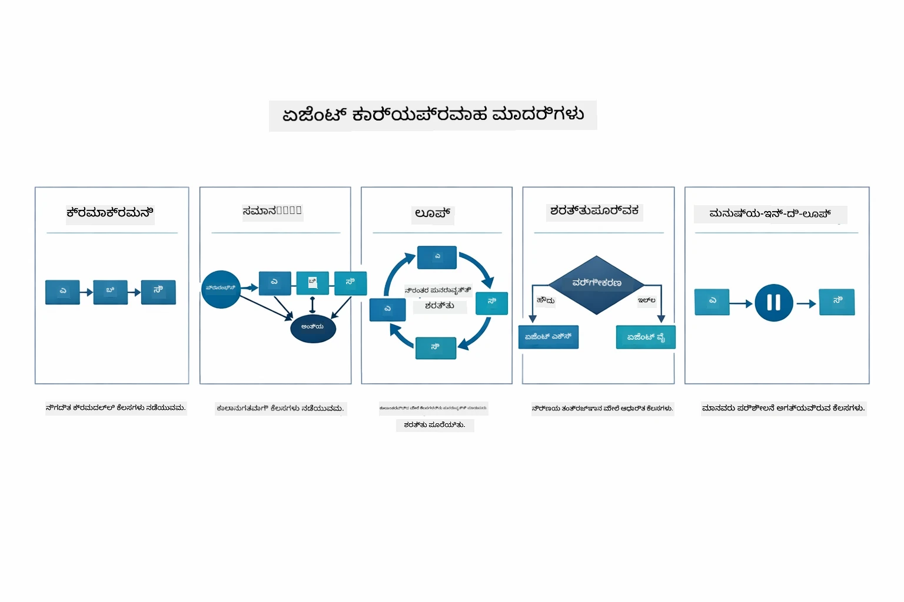

*ಏಜೆಂಟ್‌ಗಳನ್ನು ಸಂಚರಿಸುವ ಐದು ಕಾರ್ಯಪ್ರवाह ಮಾದರಿಗಳು — ಸರಳ ಕ್ರಮಾಲೋಚನ ಪೈಪ್‌ಲೈನಿಂದ ಮಾನವ-ನಿಯಂತ್ರಿತ ಅನುಮೋದನೆ ಕಾರ್ಯಪ್ರವಾಹಗಳವರೆಗೆ.*

| ಮಾದರಿ | ವಿವರಣೆ | ಬಳಕೆ ಪ್ರಕರಣ |
|---------|-------------|----------|
| **ಕ್ರಮಭದ್ರ** | ಏಜೆಂಟ್‌ಗಳನ್ನು ಕ್ರಮೇಣ ನಿರ್ವಹಿಸಿ, output ಮುಂದಿನದರಿಗೆ ಹರಿಯುತ್ತದೆ | ಪೈಪ್‌ಲೈನ್: ಸಂಶೋಧನೆ → ವಿಶ್ಲೇಷಣೆ → ವರದಿ |
| **ಸಮನ್ವಯ** | ಏಜೆಂಟ್‌ಗಳನ್ನು ಒಟ್ಟಿಗೆ ನಿರ್ವಹಿಸಿ | ಸ್ವತಂತ್ರ ಕಾರ್ಯಗಳು: ಹವಾಮಾನ + ಸುದ್ದಿ + ಷೇರುಗಳು |
| **ಲೂಪ್** | ಮಟ್ಟಿಗೆ ತಲುಪುವವರೆಗೆ ಪುನರಾವರ್ತನೆ | ಗುಣಮಟ್ಟ ಮೌಲ್ಯಮಾಪನ: 0.8 ಕ್ಕಿಂತ ಹೆಚ್ಚಾಗುವವರೆಗೆ ಸುಧಾರಣೆ |
| **ಶರತ್ತುಗೊಂಡ** | ಶರತ್ತುಗಳ ಆಧಾರವಾಗಿ ಮಾರ್ಗ ನಿರ್ಣಯ | ವರ್ಗೀಕರಣ → ವಿಶಿಷ್ಟ ಏಜೆಂಟ್ ಗೆ ಮಾರ್ಗಸೂಚಿ |
| **ಮಾನವ-ನಿಯಂತ್ರಿತ** | ಮಾನವ ನಿಲ್ದಾಣಗಳನ್ನು ಸೇರಿಸಿ | ಅನುಮೋದನೆ ಕಾರ್ಯಪ್ರವಾಹ, ವಿಷಯ ವಿಮರ್ಶೆ |

## ಮುಖ್ಯ ಸಂಕಲ್ಪನೆಗಳು

ನೀವು ಈಗ MCP ಮತ್ತು agentic ಮೋಡ್ಯೂಲ್ ಅನ್ನು ಕಾರ್ಯಾಚರಣೆಯಲ್ಲಿ ಅನ್ವೇಷಿಸಿದ್ದು, ಪ್ರತಿ ವಿಧಾನವನ್ನು ಯಾವಾಗ ಬಳಸಬೇಕು ಎಂದು ಸಂಕ್ಷೇಪಿಸೋಣ.

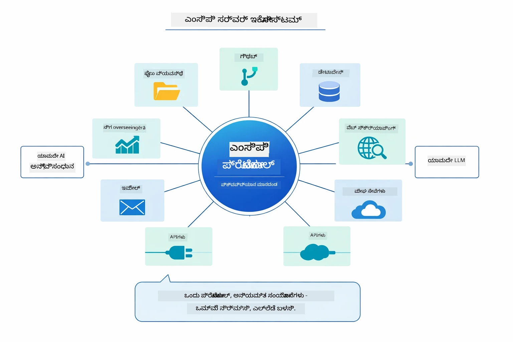

*MCP ವಿಶ್ವವ್ಯಾಪಿ ಪ್ರೋಟೋಕಾಲ್ ಪರಿಸರ ವ್ಯವಸ್ಥೆಯನ್ನು ಸೃಷ್ಟಿಸುತ್ತದೆ — ಯಾವುದಾದರೂ MCP-ಸಮ್ಮತಿ ಹೊಂದಿರುವ ಸರ್ವರ್ ಯಾವುದೇ MCP-ಸಮ್ಮತಿಪಡಿಸಿದ ಕಸ್ಟಮರ್ ಜೊತೆಗೆ ಕೆಲಸಮಾಡಬಹುದು, ಅನ್ವಯಿಕೆಗಳ ನಡುವೆ ಸಾಧನ ಹಂಚಿಕೆಯನ್ನು ಸಾಧ್ಯಮಾಡುತ್ತದೆ.*

**MCP** ನೀವು ಇತ್ತೀಚಿನ ಸಾಧನ ಪರಿಸರಗಳನ್ನು ಬಳಸಬೇಕು ಎಂದಾಗ, ಬಹು ಅನ್ವಯಿಕೆಗಳು ಹಂಚಿಕೊಳ್ಳಬಹುದಾದ ಸಾಧನಗಳನ್ನು ನಿರ್ಮಿಸಬೇಕು, ಮಾನ್ಯ ಪ್ರೋಟೋಕಾಲುಗಳೊಂದಿಗೆ ಮೂರನೇ ಪಕ್ಷ ಸೇವೆಗಳನ್ನು ಸಂಯೋಜಿಸಬೇಕು ಅಥವಾ ಕೋಡ್ ಬದಲಿಸದೆ ಸಾಧನ ಅಳವಡಿಕೆಯನ್ನು ಬದಲಾಯಿಸಬೇಕು ಎಂದಾಗ ಉತ್ತಮ.

**Agentic Module** ನೀವು `@Agent` ಅಣುಕುಗಳೊಂದಿಗೆ ವಿವರಣಾತ್ಮಕ ಏಜೆಂಟ್ ವ್ಯಾಖ್ಯಾನಗಳನ್ನು ಬಳಸಬೇಕು ಎಂದಾಗ, ಕಾರ್ಯಪ್ರवाह ಸಂಚಿಕರಣ (ಕ್ರಮೇಣ, ಲೂಪ್, ಸಮನ್ವಯ) ಬೇಕಾಗಿದ್ದಾಗ, ಆಜ್ಞಾತ್ಮಕ ಕೋಡ್‌ಗೆ ಬದಲು ಅಂತರಮುಖBased ಏಜೆಂಟ್ ವಿನ್ಯಾಸ ಇಷ್ಟಪಟ್ಟಾಗ ಅಥವಾ ಬಹು ಏಜೆಂಟ್‌ಗಳನ್ನು `outputKey` ಮೂಲಕ ಹಂಚಿಕೊಳ್ಳುವಾಗ ಉತ್ತಮ.

**Supervisor Agent ಮಾದರಿ** ಕಾರ್ಯಪ್ರवाह ಮುಂಚಿತವಾಗಿ ನಿರೀಕ್ಷಿಸಲ್ಪಡದಾಗ ಮತ್ತು LLM ನಿರ್ಧಾರಮಾಡಬೇಕು ಎಂದು ಆಸೆಯಿದ್ದಾಗ, ಹಲವು ವಿಶಿಷ್ಟ ಏಜೆಂಟ್‌ಗಳಿಗೆ ಡೈನಾಮಿಕ್ ಶಾಖೀಕರಣ ಬೇಕಾಗಿದ್ದಾಗ, ಬೇರೆ ಬೇರೆ ಸಾಮರ್ಥ್ಯಗಳಿಗೆ ಮಾರ್ಗನಿರೂಪಿಸುವ ಸಂವಾದ ವ್ಯವಸ್ಥೆಗಳನ್ನು ನಿರ್ಮಿಸುವಾಗ ಅಥವಾ ಅತ್ಯಂತ ಅನುವನೀಯ, ಹೊಂದಿಕೊಳ್ಳುವ ಏಜೆಂಟ್ ವರ್ತನೆಯನ್ನು ನೀವು ಬಯಸುವಾಗ ಅತ್ಯುತ್ತಮ.

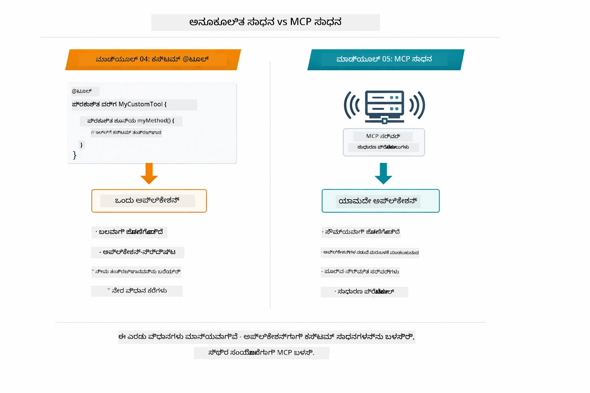

*ನೀವು ಯಾವಾಗ ಕಸ್ಟಮ್ @Tool ವಿಧಾನಗಳನ್ನು MCP ಸಾಧನಗಳಿಗಿಂತ ಬಳಸಬೇಕು — ಆ್ಯಪ್ ನಿರ್ದಿಷ್ಟ ಲಾಜಿಕ್‌ಗೆ ಸಮಗ್ರ ಪ್ರಕಾರ ಭದ್ರತೆ ಹೊಂದಿರುವ ಕಸ್ಟಮ್ ಸಾಧನಗಳು, MCP ಸಾಧನಗಳು ವಿವಿಧ ಆ್ಯಪ್‌ಗಳಲ್ಲಿ ಇಂಟಿಗ್ರೇಷನ್ ಗಾಗಿ ಮಾನ್ಯವಾಗಿದೆ.*

## ಅಭಿನಂದನೆಗಳು!

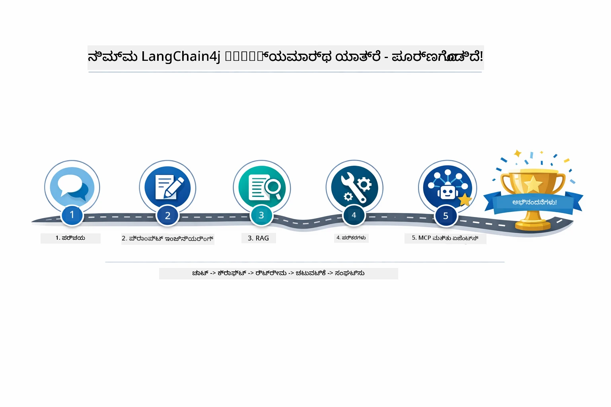

*ನಿಮ್ಮ ಪಾಠದ ಪ್ರಯಾಣ ಐದು ಮೋಡ್ಯೂಲ್‌ಗಳ ಮೂಲಕ — ಮೂಲ ಚಾಟ್‌ನಿಂದ MCP-ಚಾಲಿತ agentic ವ್ಯವಸ್ಥೆಗಳವರೆಗೆ.*

ನೀವು LangChain4j for Beginners ಪಾಠಕ್ರಮವನ್ನು ಪೂರ್ಣಗೊಳಿಸಿದ್ದೀರಿ. ನೀವು ಕಲಿತಿದ್ದು:

- ಮೆಮೊರಿಯೊಂದಿಗೆ ಸಂವಾದಾತ್ಮಕ AI ಅನ್ನು ನಿರ್ಮಿಸುವುದು (ಮೋಡ್‌್ಯೂಲ್ 01)
- ವಿಭಿನ್ನ ಕಾರ್ಯಗಳಿಗೆ ಪ್ರಾಂಪ್ಟ್ ಇಂಜಿನಿಯರಿಂಗ್ ಮಾದರಿಗಳು (ಮೋಡ್‌್ಯೂಲ್ 02)
- RAG ಮೂಲಕ ನಿಮ್ಮ ದಾಖಲೆಗಳಲ್ಲಿ ಪ್ರತಿಕ್ರಿಯೆಗಳನ್ನು ನೆಲಸಿಸುವುದು (ಮೋಡ್‌್ಯೂಲ್ 03)
- ಕಸ್ಟಮ್ ಸಾಧನಗಳೊಂದಿಗೆ ಮೂಲ AI ಏಜೆಂಟ್‌ಗಳನ್ನು (ಸಹಾಯಕ) ಸೃಷ್ಟಿಸುವುದು (ಮೋಡ್‌್ಯೂಲ್ 04)
- LangChain4j MCP ಮತ್ತು Agentic ಮೋಡ್ಯೂಲ್‌ಗಳೊಂದಿಗೆ ಮಾನ್ಯ ಸಾಧನಗಳನ್ನು ಸಂಯೋಜಿಸುವುದು (ಮೋಡ್‌್ಯೂಲ್ 05)

### ಮುಂದೇನೆನು?

ಮೋಡ್‌್ಯೂಲ್‌ಗಳನ್ನು ಪೂರ್ಣಗೊಳಿಸಿದ ನಂತರ, LangChain4j ಟೆಸ್ಟಿಂಗ್ ವಿಶೇಷತಗಳನ್ನು ಕೆಲಸದ ಜಾಗದಲ್ಲಿ ನೋಡಲು [ಟೆಸ್ಟಿಂಗ್ ಗೈಡ್](../docs/TESTING.md) ಅನ್ನು ಅನ್ವೇಷಿಸಿ.

**ಅಧिकारिक ಸಂಪನ್ಮೂಲಗಳು:**
- [LangChain4j ಡಾಕ್ಯುಮೆಂಟೇಶನ್](https://docs.langchain4j.dev/) - ಸಮಗ್ರ ಮಾರ್ಗದರ್ಶಿಗಳು ಮತ್ತು API ಸೂಚನೆ
- [LangChain4j GitHub](https://github.com/langchain4j/langchain4j) - ಮೂಲ ಕೋಡ್ ಮತ್ತು ಉದಾಹರಣೆಗಳು
- [LangChain4j ಟ್ಯುಟೋರಿಯಲ್ಸ್](https://docs.langchain4j.dev/tutorials/) - ವಿವಿಧ ಬಳಕೆ ಪ್ರಕರಣಗಳಿಗಾಗಿ ಹಂತ ಹಂತದ ಪಾಠಗಳು

ಈ ಪಾಠಕುಮವನ್ನು ಪೂರ್ಣಗೊಳಿಸಿದುದಕ್ಕೆ ಧನ್ಯವಾದಗಳು!

---

**ನ್ಯಾವಿಗೇಷನ್:** [← ಹಿಂದಿನ: ಮೋಡ್ಯೂಲ್ 04 - ಸಾಧನಗಳು](../04-tools/README.md) | [ಮುನ್ನಡೆ ಮುಖ್ಯಕ್ಕೆ](../README.md)

---

<!-- CO-OP TRANSLATOR DISCLAIMER START -->
**ತಾಥ್ಯತ್ಯಾಗ**:  
ಈ ದಸ್ತಾವೇಜುವನ್ನು AI ಅನುವಾದ ಸೇವೆಯಾದ [Co-op Translator](https://github.com/Azure/co-op-translator) ಬಳಸಿ ಅನುವಾದಿಸಲಾಗಿದೆ. ನಾವು ಸತ್ಯನಿಷ್ಠತೆಗೆ ಪ್ರಯತ್ನಿಸುವಾಗಲೂ, ಸ್ವಯಂಚಾಲಿತ ಅನುವಾದಗಳಲ್ಲಿ ದೋಷಗಳು ಅಥವಾ ತಪ್ಪುತೆಗೂಡುಗಳಿರಬಹುದು ಎಂಬುದನ್ನು ಗಮನಿಸಿ. ಮೂಲ ದಸ್ತಾವೇಜು ಅದರ ಸ್ವದೇಶಿ ಭಾಷೆಯಲ್ಲಿ ಅಧಿಕೃತ ಮೂಲವೆಂದು ಪರಿಗಣಿಸಬೇಕು. ಪ್ರಮುಖ ಮಾಹಿತಿಗಾಗಿ ವೃತ್ತಿಪರ ಮಾನವ ಅನುವಾದವನ್ನು ಶಿಫಾರಸು ಮಾಡಲಾಗುತ್ತದೆ. ಈ ಅನುವಾದ ಬಳಕೆಯಿಂದ ಉಂಟಾಗುವ ಯಾವುದೇ ತಪ್ಪುಗ್ರಹಿಕೆಗಳು ಅಥವಾ ದುರವಾಖ್ಯಾನಗಳಿಗಾಗಿ ನಾವು ಹೊಣೆಗಾರರಾಗಿಲ್ಲ.
<!-- CO-OP TRANSLATOR DISCLAIMER END -->