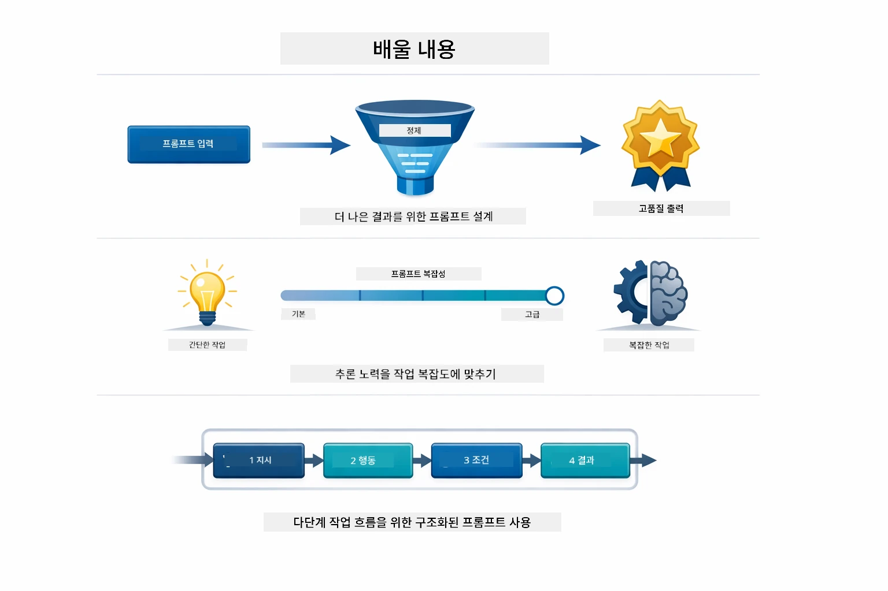
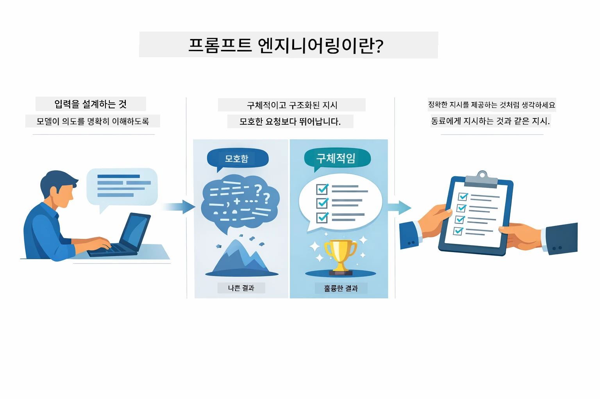
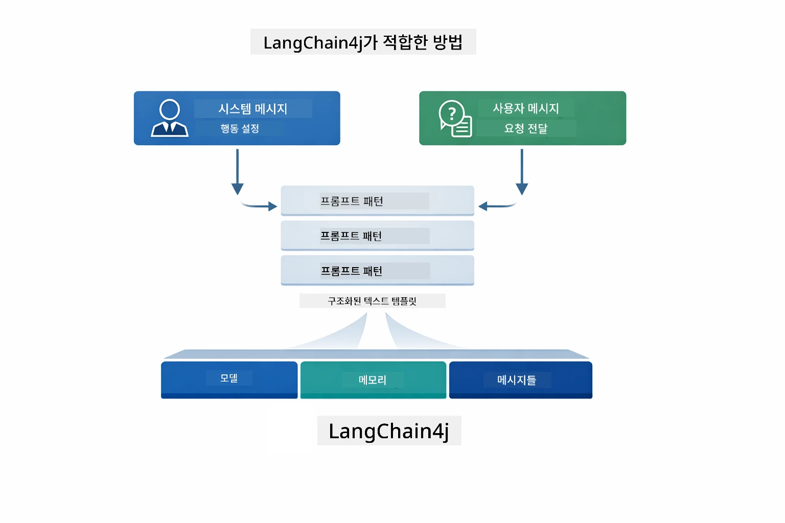
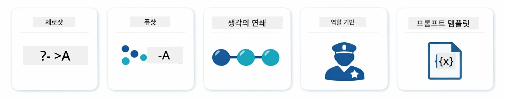
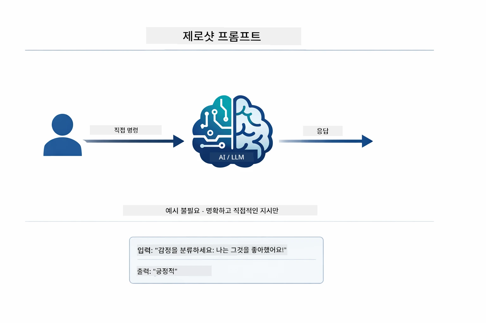
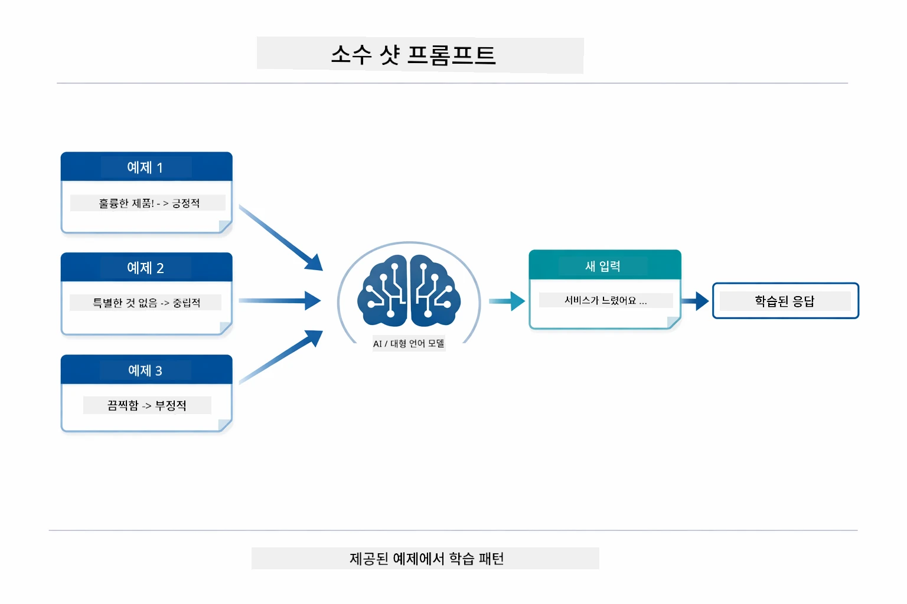
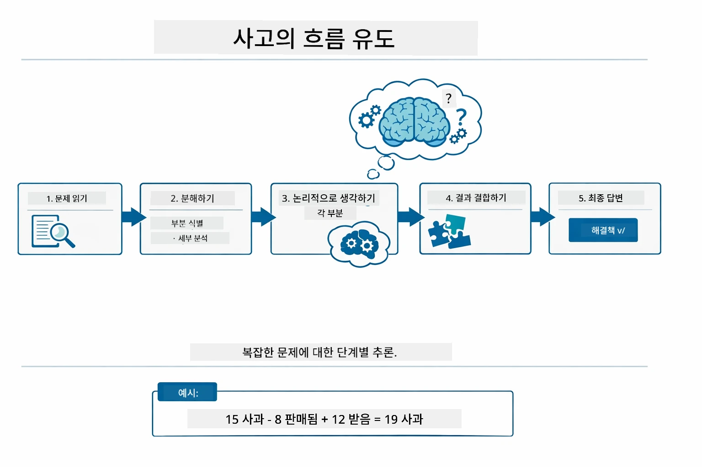
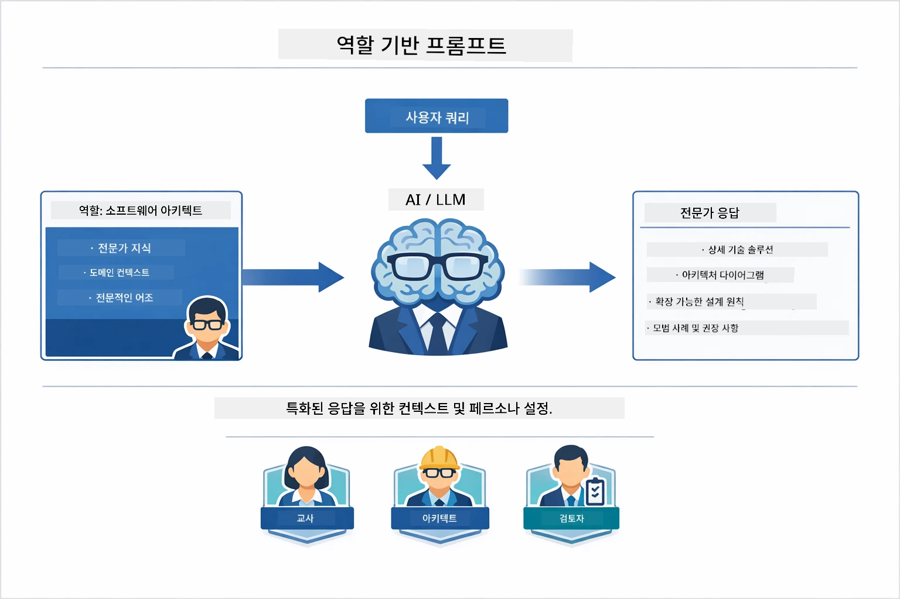
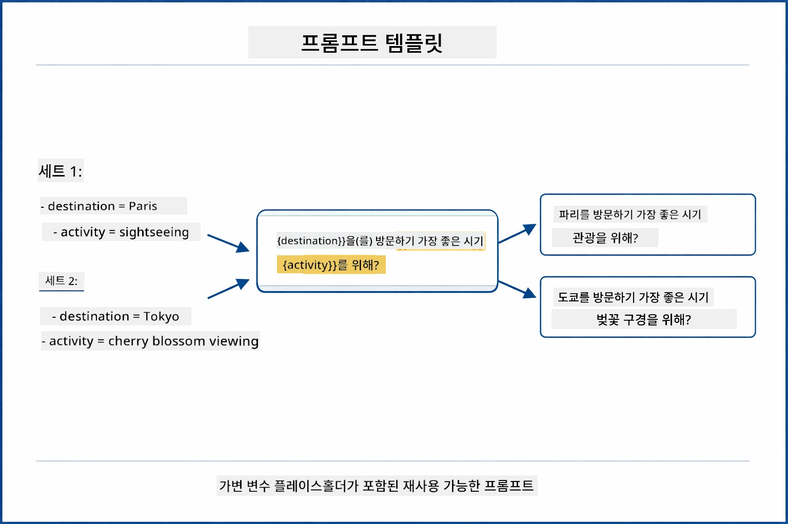
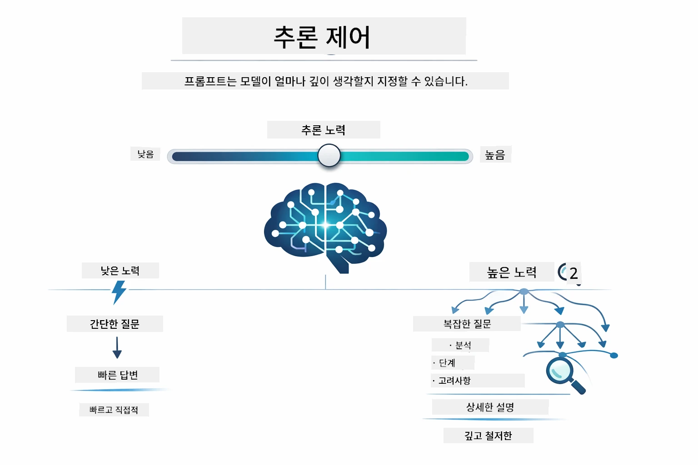

# Module 02: GPT-5.2를 활용한 프롬프트 엔지니어링

## 목차

- [학습 내용](../../../02-prompt-engineering)
- [사전 준비](../../../02-prompt-engineering)
- [프롬프트 엔지니어링 이해하기](../../../02-prompt-engineering)
- [프롬프트 엔지니어링 기초](../../../02-prompt-engineering)
  - [제로샷 프롬프트](../../../02-prompt-engineering)
  - [퓨샷 프롬프트](../../../02-prompt-engineering)
  - [사고의 연결고리](../../../02-prompt-engineering)
  - [역할 기반 프롬프트](../../../02-prompt-engineering)
  - [프롬프트 템플릿](../../../02-prompt-engineering)
- [고급 패턴](../../../02-prompt-engineering)
- [기존 Azure 리소스 사용하기](../../../02-prompt-engineering)
- [애플리케이션 스크린샷](../../../02-prompt-engineering)
- [패턴 탐색](../../../02-prompt-engineering)
  - [낮은 열의와 높은 열의 비교](../../../02-prompt-engineering)
  - [작업 실행 (도구 사전 안내)](../../../02-prompt-engineering)
  - [자기 반영 코드](../../../02-prompt-engineering)
  - [구조화된 분석](../../../02-prompt-engineering)
  - [다중 턴 채팅](../../../02-prompt-engineering)
  - [단계별 추론](../../../02-prompt-engineering)
  - [제약된 출력](../../../02-prompt-engineering)
- [진정한 학습 내용](../../../02-prompt-engineering)
- [다음 단계](../../../02-prompt-engineering)

## 학습 내용



이전 모듈에서는 메모리가 대화형 AI를 가능하게 하는 방식을 살펴보고 GitHub 모델을 사용해 기본 상호작용을 해보았습니다. 이제는 Azure OpenAI의 GPT-5.2를 사용해 질문하는 방식 — 즉 프롬프트 자체 — 에 집중합니다. 프롬프트를 구성하는 방식이 응답의 품질에 큰 영향을 줍니다. 기본적인 프롬프트 기법을 복습한 후, GPT-5.2의 기능을 최대한 활용하는 8가지 고급 패턴으로 넘어갑니다.

GPT-5.2를 사용하는 이유는 추론 제어 기능을 도입했기 때문입니다 — 모델이 답변하기 전에 얼마만큼 생각할지 지정할 수 있습니다. 이로 인해 다양한 프롬프트 전략이 더 명확해지고 각 전략을 언제 사용하는지 이해하는 데 도움이 됩니다. 또한 Azure는 GitHub 모델에 비해 GPT-5.2에 대한 제한이 적어 유리합니다.

## 사전 준비

- 모듈 01 완료 (Azure OpenAI 리소스 배포 완료)
- 루트 디렉터리에 Azure 자격 증명이 포함된 `.env` 파일 (모듈 01에서 `azd up` 명령어로 생성됨)

> **참고:** 모듈 01을 완료하지 않았다면 먼저 거기 있는 배포 지침을 따라 주세요.

## 프롬프트 엔지니어링 이해하기



프롬프트 엔지니어링은 원하는 결과를 지속적으로 얻을 수 있도록 입력 텍스트를 설계하는 것입니다. 단순히 질문을 던지는 것을 넘어, 모델이 정확히 무엇을 원하는지 이해하고 그에 맞게 답하도록 요청을 구조화하는 것입니다.

동료에게 지시하는 것과 같습니다. "버그 수정해"는 모호합니다. "UserService.java 45라인에서 널 포인터 예외를 null 체크를 추가해서 수정해"는 구체적입니다. 언어 모델도 마찬가지로 구체성과 구조가 중요합니다.



LangChain4j는 인프라스트럭처 — 모델 연결, 메모리, 메시지 타입 — 를 제공하며, 프롬프트 패턴은 그 인프라를 통해 보내는 신중하게 구조화된 텍스트일 뿐입니다. 핵심 구성 요소는 AI의 행동과 역할을 설정하는 `SystemMessage`와 실제 요청을 담는 `UserMessage`입니다.

## 프롬프트 엔지니어링 기초



이번 모듈의 고급 패턴으로 넘어가기 전, 기본적인 5가지 프롬프트 기법을 복습해 보겠습니다. 이는 모든 프롬프트 엔지니어가 알아야 할 기본 블록입니다. 이미 [빠른 시작 모듈](../00-quick-start/README.md#2-prompt-patterns)을 통해 접해 보았다면, 여기에 그 개념적 틀을 제시합니다.

### 제로샷 프롬프트

가장 간단한 접근법: 예제 없이 직접 명령을 제공합니다. 모델은 전적으로 훈련된 정보를 토대로 작업을 이해하고 실행합니다. 예상 동작이 분명한 단순 요청에 적합합니다.



*예제 없이 직접 명령 — 모델이 명령만으로 작업을 유추함*

```java
String prompt = "Classify this sentiment: 'I absolutely loved the movie!'";
String response = model.chat(prompt);
// 응답: "긍정적"
```
  
**사용 시기:** 단순 분류, 직접 질문, 번역, 추가 안내 없이 모델이 처리할 수 있는 모든 작업에 적합합니다.

### 퓨샷 프롬프트

모델이 따라야 할 패턴을 보여주는 예제를 제공합니다. 모델은 예제에서 예상하는 입력-출력 형태를 배우고 새로운 입력에도 이를 적용합니다. 원하는 형식이나 동작이 명확하지 않은 작업에서 일관성을 크게 향상시킵니다.



*예제로 학습 — 모델이 패턴을 인식하고 새 입력에 적용함*

```java
String prompt = """
    Classify the sentiment as positive, negative, or neutral.
    
    Examples:
    Text: "This product exceeded my expectations!" → Positive
    Text: "It's okay, nothing special." → Neutral
    Text: "Waste of money, very disappointed." → Negative
    
    Now classify this:
    Text: "Best purchase I've made all year!"
    """;
String response = model.chat(prompt);
```
  
**사용 시기:** 맞춤 분류, 일관된 포맷팅, 도메인 특화 작업, 제로샷 결과가 일관되지 않을 때.

### 사고의 연결고리

모델에게 단계별로 추론 과정을 보여달라고 요청합니다. 바로 답변으로 넘어가지 않고 문제를 쪼개어 각 부분을 명확히 해결합니다. 수학, 논리, 다단계 추론 작업에서 정확도를 높입니다.



*단계별 추론 — 복잡한 문제를 명시적 논리 단계로 분해*

```java
String prompt = """
    Problem: A store has 15 apples. They sell 8 apples and then 
    receive a shipment of 12 more apples. How many apples do they have now?
    
    Let's solve this step-by-step:
    """;
String response = model.chat(prompt);
// 모델은 다음을 보여줍니다: 15 - 8 = 7, 그리고 7 + 12 = 19개의 사과
```
  
**사용 시기:** 수학 문제, 논리 퍼즐, 디버깅, 추론 과정을 보여야 신뢰도와 정확도가 향상되는 작업.

### 역할 기반 프롬프트

질문 전에 AI에게 특정 페르소나나 역할을 부여합니다. 이는 답변의 어조, 깊이, 초점을 결정하는 문맥을 제공합니다. “소프트웨어 설계자”가 “초급 개발자”나 “보안 감사자”와는 다른 조언을 줍니다.



*문맥과 페르소나 설정 — 같은 질문도 할당된 역할에 따라 다른 답변을 받음*

```java
String prompt = """
    You are an experienced software architect reviewing code.
    Provide a brief code review for this function:
    
    def calculate_total(items):
        total = 0
        for item in items:
            total = total + item['price']
        return total
    """;
String response = model.chat(prompt);
```
  
**사용 시기:** 코드 리뷰, 튜터링, 도메인 분석, 특정 전문성 수준이나 관점에 맞는 답변이 필요할 때.

### 프롬프트 템플릿

변수 자리 표시자가 있는 재사용 가능한 프롬프트를 만듭니다. 매번 새 프롬프트를 쓰지 않고 템플릿에서 변수만 채울 수 있습니다. LangChain4j의 `PromptTemplate` 클래스는 `{{variable}}` 문법으로 쉽게 구현됩니다.



*변수 자리 표시자가 있는 재사용 가능한 프롬프트 — 하나의 템플릿, 여러 용도*

```java
PromptTemplate template = PromptTemplate.from(
    "What's the best time to visit {{destination}} for {{activity}}?"
);

Prompt prompt = template.apply(Map.of(
    "destination", "Paris",
    "activity", "sightseeing"
));

String response = model.chat(prompt.text());
```
  
**사용 시기:** 다양한 입력에 반복 조회, 배치 처리, 재사용 가능한 AI 워크플로우 구축, 프롬프트 구조는 같고 데이터만 바뀌는 상황.

---

이 다섯 가지 기본기법은 대부분의 프롬프트 작업에 강력한 도구가 됩니다. 나머지 모듈은 GPT-5.2의 추론 제어, 자기 평가, 구조화 출력 기능을 활용하는 **8가지 고급 패턴**으로 확장합니다.

## 고급 패턴

기본기를 마쳤으니, 이번 모듈을 특별하게 하는 8가지 고급 패턴으로 넘어가 보겠습니다. 모든 문제에 같은 접근법이 필요한 건 아닙니다. 어떤 질문은 빠른 답변이 필요하고, 다른 것들은 깊은 사고가 필요합니다. 어떤 것은 추론 과정을 보여야 하고, 또 어떤 것은 결과만 필요합니다. 아래 각 패턴은 각기 다른 시나리오에 최적화되어 있으며, GPT-5.2의 추론 제어 기능으로 차이가 더욱 뚜렷해집니다.


*8가지 프롬프트 엔지니어링 패턴과 활용 예시 개요*



*GPT-5.2는 모델이 얼마나 깊게 생각할지 지정할 수 있음 — 빠른 직접 답변부터 깊이 있는 탐색까지*

**낮은 열의 (빠르고 집중된)** - 빠른 직접 답변이 필요한 간단한 질문용. 모델은 최소한의 추론만 수행 — 최대 2단계. 계산, 조회, 단순 질문에 적합.

```java
String prompt = """
    <context_gathering>
    - Search depth: very low
    - Bias strongly towards providing a correct answer as quickly as possible
    - Usually, this means an absolute maximum of 2 reasoning steps
    - If you think you need more time, state what you know and what's uncertain
    </context_gathering>
    
    Problem: What is 15% of 200?
    
    Provide your answer:
    """;

String response = chatModel.chat(prompt);
```
  
> 💡 **GitHub Copilot으로 탐구해보기:** [`Gpt5PromptService.java`](../../../02-prompt-engineering/src/main/java/com/example/langchain4j/prompts/service/Gpt5PromptService.java) 파일을 열고 질문해보세요:  
> - "낮은 열의와 높은 열의 프롬프트 패턴의 차이점은?"  
> - "프롬프트 XML 태그는 AI 응답 구조화에 어떻게 도움이 되는가?"  
> - "자기 반영 패턴과 직접 지시 패턴은 언제 사용하나요?"

**높은 열의 (깊고 철저한)** - 종합적인 분석이나 복잡한 문제에 적합. 모델이 철저히 탐색하고 상세한 추론을 보여줌. 시스템 설계, 아키텍처 결정, 복잡한 연구에 적합.

```java
String prompt = """
    Analyze this problem thoroughly and provide a comprehensive solution.
    Consider multiple approaches, trade-offs, and important details.
    Show your analysis and reasoning in your response.
    
    Problem: Design a caching strategy for a high-traffic REST API.
    """;

String response = chatModel.chat(prompt);
```
  
**작업 실행 (단계별 진행 상황)** - 다단계 워크플로에 적합. 모델이 사전 계획을 제공하고, 작업 중 각 단계를 설명하며, 요약까지 제공. 마이그레이션, 구현, 기타 다단계 프로세스에 적합.

```java
String prompt = """
    <task_execution>
    1. First, briefly restate the user's goal in a friendly way
    
    2. Create a step-by-step plan:
       - List all steps needed
       - Identify potential challenges
       - Outline success criteria
    
    3. Execute each step:
       - Narrate what you're doing
       - Show progress clearly
       - Handle any issues that arise
    
    4. Summarize:
       - What was completed
       - Any important notes
       - Next steps if applicable
    </task_execution>
    
    <tool_preambles>
    - Always begin by rephrasing the user's goal clearly
    - Outline your plan before executing
    - Narrate each step as you go
    - Finish with a distinct summary
    </tool_preambles>
    
    Task: Create a REST endpoint for user registration
    
    Begin execution:
    """;

String response = chatModel.chat(prompt);
```
  
사고의 연결고리 프롬프트는 모델이 추론 과정을 보여주도록 명시적으로 요구해 복잡한 작업의 정확도를 높입니다. 단계별 분해는 사람과 AI 모두가 논리를 이해하는 데 도움을 줍니다.

> **🤖 [GitHub Copilot](https://github.com/features/copilot) Chat에서 시도해 보기:** 이 패턴에 대해 물어보세요:  
> - "장시간 실행 작업에 작업 실행 패턴을 어떻게 적용할 수 있나요?"  
> - "프로덕션 애플리케이션에서 도구 사전 안내를 구조화하는 모범 사례는?"  
> - "UI에서 중간 진행 상황을 캡처하고 표시하는 방법은?"


*다단계 작업을 위한 계획 → 실행 → 요약 워크플로*

**자기 반영 코드** - 프로덕션 품질 코드를 생성하는 데 사용. 모델이 에러 처리까지 포함해 프로덕션 표준에 맞는 코드를 생성. 새로운 기능이나 서비스를 만들 때 적합.

```java
String prompt = """
    Generate Java code with production-quality standards: Create an email validation service
    Keep it simple and include basic error handling.
    """;

String response = chatModel.chat(prompt);
```
  


*반복 개선 주기 - 생성, 평가, 문제점 확인, 개선, 반복*

**구조화된 분석** - 일관된 평가를 위해 사용. 모델이 고정된 평가 틀(정확성, 관행, 성능, 보안, 유지보수성)을 사용해 코드를 리뷰. 코드 리뷰나 품질 평가에 적합.

```java
String prompt = """
    <analysis_framework>
    You are an expert code reviewer. Analyze the code for:
    
    1. Correctness
       - Does it work as intended?
       - Are there logical errors?
    
    2. Best Practices
       - Follows language conventions?
       - Appropriate design patterns?
    
    3. Performance
       - Any inefficiencies?
       - Scalability concerns?
    
    4. Security
       - Potential vulnerabilities?
       - Input validation?
    
    5. Maintainability
       - Code clarity?
       - Documentation?
    
    <output_format>
    Provide your analysis in this structure:
    - Summary: One-sentence overall assessment
    - Strengths: 2-3 positive points
    - Issues: List any problems found with severity (High/Medium/Low)
    - Recommendations: Specific improvements
    </output_format>
    </analysis_framework>
    
    Code to analyze:
    ```
    public List getUsers() {
        return database.query("SELECT * FROM users");
    }
    ```
    Provide your structured analysis:
    """;

String response = chatModel.chat(prompt);
```
  
> **🤖 [GitHub Copilot](https://github.com/features/copilot) Chat에서 시도해 보기:** 구조화된 분석에 대해 질문해 보세요:  
> - "다양한 유형의 코드 리뷰에 맞게 분석 틀을 어떻게 맞춤 설정하나요?"  
> - "구조화된 출력을 프로그램적으로 파싱하고 활용하는 최선의 방법은?"  
> - "다양한 리뷰 세션에서 심각도 수준을 일관되게 유지하려면?"


*심각도 수준을 포함한 일관된 코드 리뷰 프레임워크*

**다중 턴 채팅** - 문맥이 필요한 대화에 적합. 모델이 이전 메시지를 기억하고 이를 기반으로 답변을 확장. 인터랙티브 도움말 세션이나 복잡한 Q&A에 적합.

```java
ChatMemory memory = MessageWindowChatMemory.withMaxMessages(10);

memory.add(UserMessage.from("What is Spring Boot?"));
AiMessage aiMessage1 = chatModel.chat(memory.messages()).aiMessage();
memory.add(aiMessage1);

memory.add(UserMessage.from("Show me an example"));
AiMessage aiMessage2 = chatModel.chat(memory.messages()).aiMessage();
memory.add(aiMessage2);
```
  


*대화가 여러 턴에 걸쳐 누적되어 토큰 한도에 도달할 때까지 문맥 유지*

**단계별 추론** - 논리의 가시성이 필요한 문제에 적합. 모델이 각 단계에 대한 명시적 추론을 보여줌. 수학 문제, 논리 퍼즐, 사고 과정을 이해해야 할 때 사용.

```java
String prompt = """
    <instruction>Show your reasoning step-by-step</instruction>
    
    If a train travels 120 km in 2 hours, then stops for 30 minutes,
    then travels another 90 km in 1.5 hours, what is the average speed
    for the entire journey including the stop?
    """;

String response = chatModel.chat(prompt);
```
  


*문제를 명시적 논리 단계로 분해*

**제약된 출력** - 특정 형식 요구사항을 준수해야 하는 답변. 모델이 형식과 길이 규칙을 엄격히 따름. 요약 등 정확한 출력 구조가 필요한 경우에 적합.

```java
String prompt = """
    <constraints>
    - Exactly 100 words
    - Bullet point format
    - Technical terms only
    </constraints>
    
    Summarize the key concepts of machine learning.
    """;

String response = chatModel.chat(prompt);
```
  


*특정 형식, 길이, 구조 요구 사항 강제 적용*

## 기존 Azure 리소스 사용하기

**배포 확인:**

루트 디렉터리에 Azure 자격 증명이 포함된 `.env` 파일이 존재하는지 확인 (모듈 01에서 생성됨):  
```bash
cat ../.env  # AZURE_OPENAI_ENDPOINT, API_KEY, DEPLOYMENT를 표시해야 합니다
```
  
**애플리케이션 시작:**

> **참고:** 모듈 01에서 `./start-all.sh`를 사용해 모든 애플리케이션을 이미 시작했다면 이 모듈은 포트 8083에서 이미 실행 중입니다. 아래 시작 명령은 생략하고 http://localhost:8083 에 바로 접속하세요.

**옵션 1: Spring Boot 대시보드 사용 (VS Code 사용자 권장)**

개발 컨테이너에는 Spring Boot 대시보드 확장 프로그램이 포함되어 있습니다. 이는 VS Code 왼쪽 액티비티 바에서 Spring Boot 아이콘을 통해 시각적 인터페이스로 모든 Spring Boot 애플리케이션을 관리할 수 있게 합니다.

Spring Boot 대시보드에서 할 수 있는 작업:  
- 워크스페이스 내 모든 Spring Boot 애플리케이션 보기  
- 클릭 한 번으로 애플리케이션 시작/중지  
- 실시간 애플리케이션 로그 확인  
- 애플리케이션 상태 모니터링
"prompt-engineering" 옆에 있는 재생 버튼을 클릭하여 이 모듈을 시작하거나, 모든 모듈을 한 번에 시작하세요.


**옵션 2: 셸 스크립트 사용**

모든 웹 애플리케이션(모듈 01-04)을 시작하려면:

**Bash:**
```bash
cd ..  # 루트 디렉토리에서
./start-all.sh
```

**PowerShell:**
```powershell
cd ..  # 루트 디렉토리에서부터
.\start-all.ps1
```

또는 이 모듈만 시작하려면:

**Bash:**
```bash
cd 02-prompt-engineering
./start.sh
```

**PowerShell:**
```powershell
cd 02-prompt-engineering
.\start.ps1
```

두 스크립트 모두 루트 `.env` 파일에서 환경 변수를 자동으로 불러오며, JAR 파일이 없으면 빌드합니다.

> **참고:** 시작 전에 모든 모듈을 수동으로 빌드하려면:
>
> **Bash:**
> ```bash
> cd ..  # Go to root directory
> mvn clean package -DskipTests
> ```
>
> **PowerShell:**
> ```powershell
> cd ..  # Go to root directory
> mvn clean package -DskipTests
> ```

브라우저에서 http://localhost:8083 을 여세요.

**중지하려면:**

**Bash:**
```bash
./stop.sh  # 이 모듈만
# 또는
cd .. && ./stop-all.sh  # 모든 모듈
```

**PowerShell:**
```powershell
.\stop.ps1  # 이 모듈만
# 또는
cd ..; .\stop-all.ps1  # 모든 모듈
```

## 애플리케이션 스크린샷


*특징과 사용 사례가 포함된 8가지 프롬프트 엔지니어링 패턴을 모두 보여주는 메인 대시보드*

## 패턴 탐색

웹 인터페이스를 통해 다양한 프롬프트 전략을 실험할 수 있습니다. 각 패턴은 다른 문제를 해결하므로, 각각의 접근법이 언제 효과적인지 직접 확인해 보세요.

### 낮은 열의와 높은 열의

낮은 열의(Low Eagerness)를 사용하여 "200의 15%는 얼마인가요?" 같은 간단한 질문을 해보세요. 즉각적이고 직접적인 답변을 얻을 수 있습니다. 이제 높은 열의(High Eagerness)를 사용하여 "고트래픽 API를 위한 캐싱 전략을 설계하라" 같은 복잡한 질문을 해보세요. 모델이 천천히 생각하면서 상세한 근거를 제공합니다. 같은 모델, 같은 질문 구조지만 프롬프트가 얼마나 깊게 생각할지 지시하는 것입니다.


*최소한의 추론으로 빠른 계산*


*종합적인 캐싱 전략 (2.8MB)*

### 작업 실행 (툴 전주)

다단계 워크플로는 사전 계획과 진행 상황 설명이 유익합니다. 모델이 무엇을 할지 개요를 제시하고, 각 단계를 설명하며 결과를 요약합니다.


*단계별 설명과 함께 REST 엔드포인트 생성 (3.9MB)*

### 자기 반영 코드

"이메일 검증 서비스를 만들어라"고 시도해 보세요. 단순히 코드를 생성하고 멈추는 대신, 모델은 생성 후 품질 기준에 따라 평가하고 약점을 찾아 개선합니다. 코드를 생산 기준에 맞출 때까지 반복하는 과정을 볼 수 있습니다.


*완성된 이메일 검증 서비스 (5.2MB)*

### 구조화된 분석

코드 리뷰에는 일관된 평가 프레임워크가 필요합니다. 모델은 고정된 범주(정확성, 관행, 성능, 보안)와 심각도 수준을 사용해 코드를 분석합니다.


*프레임워크 기반 코드 리뷰*

### 다중 턴 대화

"Spring Boot가 무엇인가요?"라고 묻고 바로 "예제를 보여주세요"라고 이어서 질문하세요. 모델은 첫 질문을 기억하고 Spring Boot 예제를 제공합니다. 메모리가 없으면 두 번째 질문은 모호할 수 있습니다.


*질문 간 컨텍스트 유지*

### 단계별 추론

수학 문제를 골라서 단계별 추론과 낮은 열의로 시도해 보세요. 낮은 열의는 빠르지만 답만 간단히 줍니다. 단계별 추론은 모든 계산과 결정을 보여줍니다.


*명확한 단계가 포함된 수학 문제*

### 제약된 출력

특정 형식이나 단어 수가 필요할 때 이 패턴은 엄격한 준수를 강제합니다. 정확히 100단어의 글머리표 형식 요약을 생성해 보세요.


*형식 제어가 포함된 머신러닝 요약*

## 실제로 배우는 것

**추론 노력은 모든 것을 바꾼다**

GPT-5.2는 프롬프트를 통해 계산 노력을 조절할 수 있습니다. 낮은 노력은 최소 탐색으로 빠른 응답을 의미합니다. 높은 노력은 모델이 깊이 생각하도록 시간을 줍니다. 작업 복잡도에 맞게 노력을 조절하는 법을 배우는 것입니다 — 간단한 질문에 시간을 낭비하지 말고, 복잡한 결정은 서두르지 마세요.

**구조는 행동을 안내한다**

프롬프트 내 XML 태그를 보셨나요? 장식이 아닙니다. 모델은 자유형 텍스트보다 구조화된 지시를 더 신뢰성 있게 따릅니다. 다단계 프로세스나 복잡한 논리가 필요할 때, 구조는 현재 위치와 다음 단계를 모델이 추적하도록 돕습니다.


*명확한 섹션과 XML 스타일 조직이 포함된 잘 구조화된 프롬프트 해부*

**자기 평가를 통한 품질 향상**

자기 반영 패턴은 품질 기준을 명시적으로 만듭니다. 모델이 "잘 하길" 바라는 대신, 무엇이 "옳음"인지 정확히 알려줍니다: 정확한 로직, 오류 처리, 성능, 보안. 모델은 스스로 출력물을 평가하고 개선할 수 있습니다. 이는 코드 생성 과정을 복권에서 일련의 과정으로 바꿉니다.

**컨텍스트는 유한하다**

다중 턴 대화는 각 요청에 메시지 기록을 포함하여 작동합니다. 그러나 한계가 있습니다 — 모든 모델에는 최대 토큰 수가 있습니다. 대화가 길어지면 관련 컨텍스트를 유지하면서 제한을 넘지 않는 전략이 필요합니다. 이 모듈은 메모리가 어떻게 작동하는지를 보여주며, 나중에 요약, 잊기, 검색 시점을 배우게 됩니다.

## 다음 단계

**다음 모듈:** [03-rag - RAG (Retrieval-Augmented Generation)](../03-rag/README.md)

---

**탐색:** [← 이전: 모듈 01 - 소개](../01-introduction/README.md) | [메인으로 돌아가기](../README.md) | [다음: 모듈 03 - RAG →](../03-rag/README.md)

---

<!-- CO-OP TRANSLATOR DISCLAIMER START -->
**면책 조항**:  
이 문서는 AI 번역 서비스 [Co-op Translator](https://github.com/Azure/co-op-translator)를 사용하여 번역되었습니다. 정확성을 위해 노력하고 있으나, 자동 번역에는 오류나 부정확성이 포함될 수 있음을 알려드립니다. 원문은 해당 문서의 권위 있는 출처로 간주되어야 합니다. 중요한 정보에 대해서는 전문적인 인간 번역을 권장합니다. 본 번역 사용으로 인해 발생하는 오해나 잘못된 해석에 대해 당사는 책임을 지지 않습니다.
<!-- CO-OP TRANSLATOR DISCLAIMER END -->