# Module 03: RAG (검색 보강 생성)

## 목차

- [비디오 워크스루](../../../03-rag)
- [학습 내용](../../../03-rag)
- [전제 조건](../../../03-rag)
- [RAG 이해하기](../../../03-rag)
  - [이 튜토리얼에서 사용하는 RAG 접근법은?](../../../03-rag)
- [동작 원리](../../../03-rag)
  - [문서 처리](../../../03-rag)
  - [임베딩 생성](../../../03-rag)
  - [의미 기반 검색](../../../03-rag)
  - [답변 생성](../../../03-rag)
- [애플리케이션 실행](../../../03-rag)
- [애플리케이션 사용법](../../../03-rag)
  - [문서 업로드](../../../03-rag)
  - [질문하기](../../../03-rag)
  - [소스 참조 확인](../../../03-rag)
  - [질문 실험하기](../../../03-rag)
- [핵심 개념](../../../03-rag)
  - [청킹 전략](../../../03-rag)
  - [유사도 점수](../../../03-rag)
  - [메모리 내 저장소](../../../03-rag)
  - [컨텍스트 윈도우 관리](../../../03-rag)
- [RAG가 중요한 시점](../../../03-rag)
- [다음 단계](../../../03-rag)

## 비디오 워크스루

이 모듈 시작 방법을 설명하는 라이브 세션을 시청하세요:

<a href="https://www.youtube.com/watch?v=_olq75ZH_eY"></a>

## 학습 내용

이전 모듈에서는 AI와 대화하는 방법과 효과적으로 프롬프트를 구성하는 방법을 배웠습니다. 하지만 근본적인 한계가 있습니다: 언어 모델은 오직 훈련 시 학습한 내용만 알고 있습니다. 회사 정책, 프로젝트 문서 또는 훈련 받지 않은 정보에 대한 질문에 답할 수 없습니다.

RAG(검색 보강 생성)는 이 문제를 해결합니다. 모델에게 정보를 직접 가르치는 대신(비용도 많이 들고 실용적이지도 않음), 문서 내에서 검색 기능을 제공합니다. 누군가 질문을 하면 시스템이 관련 정보를 찾아 프롬프트에 포함시킵니다. 모델은 그 검색된 컨텍스트를 기반으로 답변합니다.

RAG를 모델에게 참고 도서관을 주는 것으로 생각해 보세요. 질문하면 시스템은:

1. **사용자 쿼리** - 질문을 합니다
2. **임베딩** - 질문을 벡터로 변환합니다
3. **벡터 검색** - 유사한 문서 청크를 찾습니다
4. **컨텍스트 구성** - 관련 청크를 프롬프트에 추가합니다
5. **응답** - LLM이 그 컨텍스트 기반으로 답변을 생성합니다

이로써 모델의 답변이 학습 지식에만 의존하지 않고 실제 데이터에 근거하도록 합니다.

## 전제 조건

- [Module 00 - 빠른 시작](../00-quick-start/README.md) 완료 (이 모듈에서 나중에 참조하는 Easy RAG 예제 사용법)
- [Module 01 - 소개](../01-introduction/README.md) 완료 (Azure OpenAI 리소스 배포, `text-embedding-3-small` 임베딩 모델 포함)
- 루트 디렉토리에 Azure 자격 증명이 포함된 `.env` 파일 (Module 01에서 `azd up` 명령으로 생성됨)

> **참고:** Module 01을 완료하지 않았다면 먼저 배포 지침을 따라 진행하세요. `azd up` 명령은 이 모듈에서 사용하는 GPT 채팅 모델과 임베딩 모델을 모두 배포합니다.

## RAG 이해하기

아래 다이어그램은 핵심 개념을 보여줍니다: 단순히 모델의 학습 데이터에 의존하는 대신, RAG는 답변 생성 전에 참조할 사용자의 문서 라이브러리를 제공합니다.

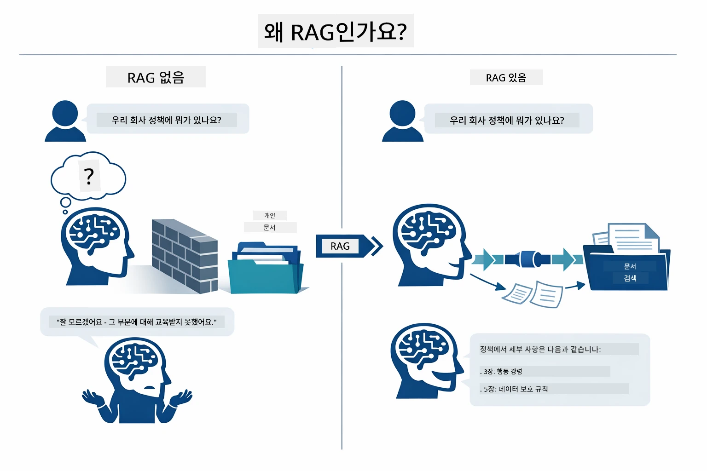

*이 다이어그램은 표준 LLM(학습 데이터로 추측)과 RAG 강화 LLM(문서를 먼저 참조) 간의 차이를 보여줍니다.*

다음은 단계별 동작 연결 방식입니다. 사용자의 질문은 임베딩, 벡터 검색, 컨텍스트 구성, 답변 생성의 네 단계를 거치며 이전 단계에 따라 쌓입니다:


*이 다이어그램은 사용자 쿼리가 임베딩, 벡터 검색, 컨텍스트 구성, 답변 생성 단계를 거치는 RAG 파이프라인을 보여줍니다.*

이 모듈 나머지에서는 실제 코드와 함께 각 단계를 상세히 설명합니다.

### 이 튜토리얼에서 사용하는 RAG 접근법은?

LangChain4j는 세 가지 RAG 구현 방식을 제공합니다. 이 다이어그램은 세 가지 방식을 나란히 비교합니다:

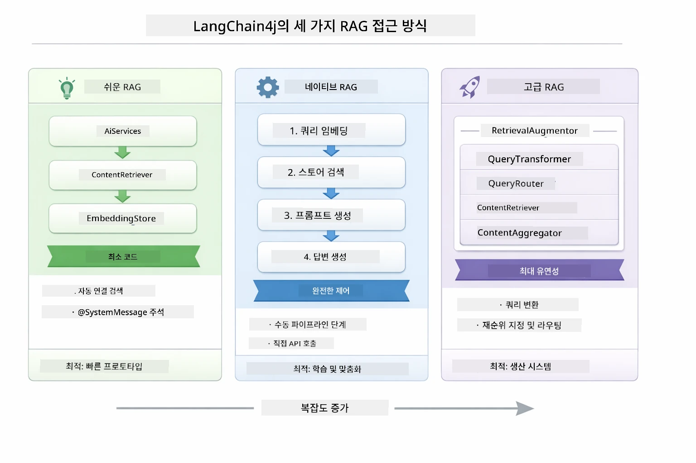

*이 다이어그램은 LangChain4j의 Easy, Native, Advanced 세 가지 RAG 접근법의 주요 구성 요소와 사용 시기를 비교한 것입니다.*

| 방법 | 설명 | 트레이드오프 |
|---|---|---|
| **Easy RAG** | `AiServices`와 `ContentRetriever`를 통해 모든 단계가 자동으로 연결됩니다. 인터페이스에 주석을 달고 리트리버를 연결하기만 하면 LangChain4j가 임베딩, 검색, 프롬프트 조립을 뒤에서 처리합니다. | 코드가 최소화되지만 각 단계가 어떻게 작동하는지 볼 수 없습니다. |
| **Native RAG** | 임베딩 모델 호출, 저장소 검색, 프롬프트 구성, 답변 생성 단계를 직접 한 단계씩 명시적으로 구현합니다. | 더 많은 코드 작성이 필요하지만 모든 단계가 보여지고 수정 가능합니다. |
| **Advanced RAG** | 쿼리 변환기, 라우터, 재정렬기, 콘텐츠 주입기를 플러그인 방식으로 사용하는 `RetrievalAugmentor` 프레임워크를 활용해 프로덕션급 파이프라인을 구축합니다. | 최고의 유연성을 제공하지만 상당히 복잡합니다. |

**이 튜토리얼은 Native 방식을 사용합니다.** 쿼리 임베딩, 벡터 저장소 검색, 컨텍스트 조립, 답변 생성 등 RAG 파이프라인의 각 단계가 [`RagService.java`](../../../03-rag/src/main/java/com/example/langchain4j/rag/service/RagService.java) 내에 명확히 작성되어 있습니다. 학습 자료로서 코드를 최소화하기보다 각 단계를 보고 이해하는 것이 중요하기 때문입니다. 단계별 동작에 익숙해지면 빠른 프로토타입을 위해 Easy RAG로, 프로덕션 시스템에는 Advanced RAG로 진행할 수 있습니다.

> **💡 Easy RAG를 이미 경험해 보셨나요?** [빠른 시작 모듈](../00-quick-start/README.md)에는 Easy RAG를 사용한 문서 Q&A 예제([`SimpleReaderDemo.java`](../../../00-quick-start/src/main/java/com/example/langchain4j/quickstart/SimpleReaderDemo.java))가 있습니다 — LangChain4j가 임베딩, 검색, 프롬프트 조립을 자동으로 처리합니다. 이 모듈은 그 파이프라인을 분해하여 각 단계를 직접 보고 제어할 수 있도록 한 단계 더 나아갑니다.

아래 다이어그램은 그 빠른 시작 예제의 Easy RAG 파이프라인을 보여줍니다. `AiServices`와 `EmbeddingStoreContentRetriever`가 모든 복잡함을 숨기고, 문서를 로드해 리트리버를 연결하면 바로 답변을 받을 수 있습니다. 이 모듈의 Native 방식은 그 숨겨진 단계들을 모두 분해합니다:

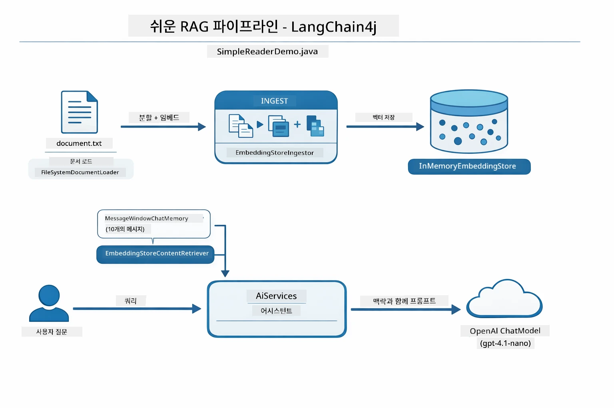

*이 다이어그램은 `SimpleReaderDemo.java`의 Easy RAG 파이프라인을 보여줍니다. Easy RAG는 임베딩, 검색, 프롬프트 조립을 `AiServices`와 `ContentRetriever` 뒤에 숨깁니다 — 문서를 로드하고 리트리버를 연결하면 답을 받습니다. 이 모듈의 Native 방식은 그 파이프라인을 분해해 각 단계(임베딩, 검색, 컨텍스트 조립, 생성)를 직접 호출하고 전체 과정을 볼 수 있습니다.*

## 동작 원리

이 모듈의 RAG 파이프라인은 사용자가 질문할 때마다 순차로 실행되는 네 단계로 나뉩니다. 먼저 업로드된 문서를 **파싱하고 청크**로 나눕니다. 청크들은 모델의 컨텍스트 창에 잘 맞을 만큼 작은 조각입니다. 그런 다음 청크를 **벡터 임베딩**으로 변환해 수학적으로 비교 가능하게 저장합니다. 질문이 들어오면 시스템은 **의미 기반 검색**을 수행해 가장 관련성 높은 청크를 찾고, 마지막으로 LLM에 그 청크들을 컨텍스트로 전달해 **답변 생성**을 합니다. 아래 각 단계를 코드와 다이어그램으로 설명합니다. 먼저 첫 단계부터 살펴보겠습니다.

### 문서 처리

[DocumentService.java](../../../03-rag/src/main/java/com/example/langchain4j/rag/service/DocumentService.java)

문서를 업로드하면 시스템이 해당 문서를 파싱(PDF 또는 일반 텍스트), 파일명 같은 메타데이터를 첨부한 뒤 문서를 청크로 분할합니다 — 모델 컨텍스트 크기에 맞게 적당히 작은 조각들입니다. 청크 사이에는 약간 겹침이 있어 경계 부분에서 컨텍스트 손실을 방지합니다.

```java
// 업로드된 파일을 분석하고 LangChain4j 문서로 감싸기
Document document = Document.from(content, metadata);

// 30토큰 중첩으로 300토큰 청크로 분할하기
DocumentSplitter splitter = DocumentSplitters
    .recursive(300, 30);

List<TextSegment> segments = splitter.split(document);
```

아래 다이어그램은 작동 방식을 시각적으로 보여줍니다. 각 청크가 이웃 청크와 일부 토큰을 공유하는 모습을 볼 수 있습니다 — 30 토큰의 겹침이 중요한 컨텍스트가 끊기지 않게 보장합니다:

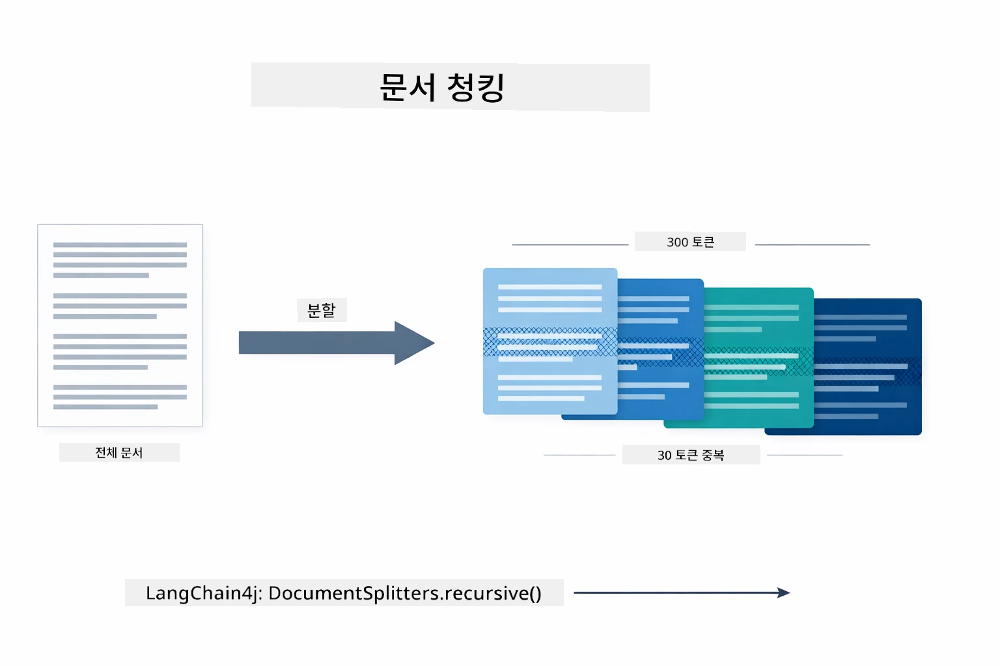

*이 다이어그램은 문서를 300 토큰씩 청크로 나누고 30 토큰씩 겹치게 하여 청크 경계에서 컨텍스트가 보존되는 과정을 보여줍니다.*

> **🤖 [GitHub Copilot](https://github.com/features/copilot) 챗으로 시도해보세요:** [`DocumentService.java`](../../../03-rag/src/main/java/com/example/langchain4j/rag/service/DocumentService.java) 열고 질문해보세요:
> - "LangChain4j가 문서를 어떻게 청크로 분할하며 왜 겹침이 중요한가요?"
> - "문서 유형별 최적 청크 크기는 얼마이며 그 이유는?"
> - "다국어 문서나 특수 포매팅 문서는 어떻게 처리할까요?"

### 임베딩 생성

[LangChainRagConfig.java](../../../03-rag/src/main/java/com/example/langchain4j/rag/config/LangChainRagConfig.java)

각 청크는 임베딩이라 불리는 수치적 표현으로 변환됩니다 — 의미를 숫자로 바꾸는 과정입니다. 임베딩 모델은 챗 모델처럼 지능적이지 않습니다; 지시를 따르거나 추론하거나 질문에 직접 답하지 못합니다. 텍스트를 수학적 공간에 매핑해 유사 의미가 가까이 위치하도록 합니다 — 예를 들어 "car"와 "automobile"이 가깝고, "refund policy"와 "return my money"가 가깝게 배치됩니다. 챗 모델이 대화 상대라면, 임베딩 모델은 매우 훌륭한 분류 시스템이라 할 수 있습니다.

아래 다이어그램은 이 개념을 시각화했습니다 — 텍스트 입력, 수치 벡터 출력, 유사 의미가 근접한 위치에 자리잡음:

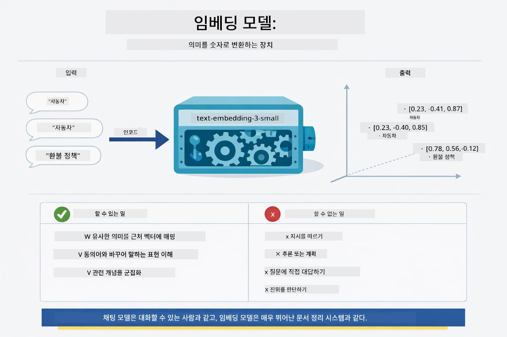

*이 다이어그램은 임베딩 모델이 텍스트를 수치 벡터로 변환하며, "car"와 "automobile" 같은 유사 의미를 벡터 공간에서 가까운 위치에 배치하는 과정을 보여줍니다.*

```java
@Bean
public EmbeddingModel embeddingModel() {
    return OpenAiOfficialEmbeddingModel.builder()
        .baseUrl(azureOpenAiEndpoint)
        .apiKey(azureOpenAiKey)
        .modelName(azureEmbeddingDeploymentName)
        .build();
}

EmbeddingStore<TextSegment> embeddingStore = 
    new InMemoryEmbeddingStore<>();
```

아래 클래스 다이어그램은 RAG 파이프라인의 두 가지 흐름과 LangChain4j 클래스 구현을 보여줍니다. **등록 흐름**(업로드 시 1회 실행)은 문서를 분할하고, 청크를 임베딩해 `.addAll()`로 저장합니다. **쿼리 흐름**(사용자 질문 때마다 실행)은 질문을 임베딩하고, 저장소를 `.search()`해 일치하는 컨텍스트를 챗 모델에 전달합니다. 두 흐름은 `EmbeddingStore<TextSegment>`라는 공통 인터페이스를 통해 연결됩니다:

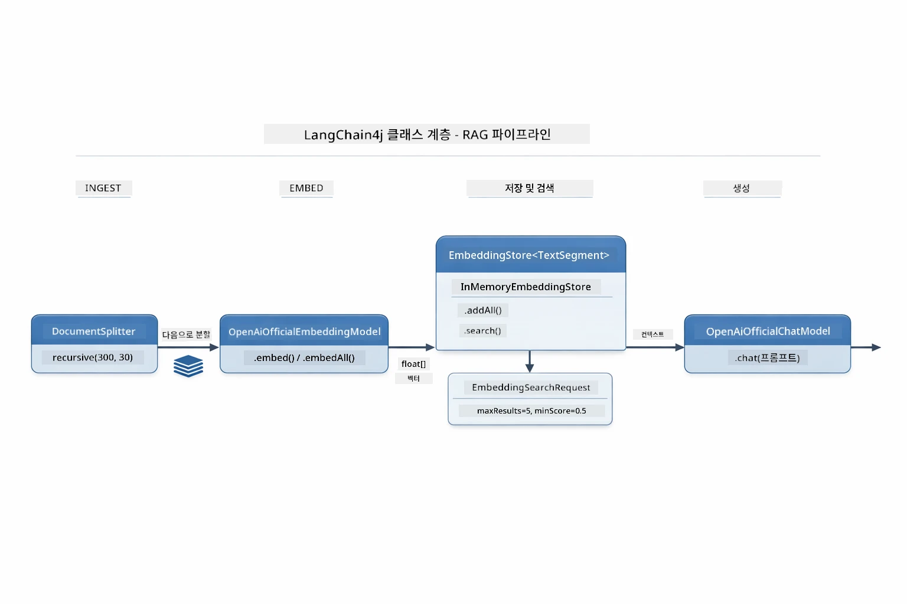

*이 다이어그램은 RAG 파이프라인의 등록 흐름과 쿼리 흐름, 그리고 공유 EmbeddingStore를 통한 연결 방식을 보여줍니다.*

임베딩이 저장되면 유사한 내용이 자연스럽게 벡터 공간에 군집을 형성합니다. 아래 시각화는 관련 주제의 문서들이 벡터 공간 내에 가까운 점으로 모이는 모습을 보여주며, 이것이 의미 기반 검색이 가능하게 하는 기반입니다:


*이 시각화는 기술 문서, 비즈니스 규칙, FAQ 같은 주제별 관련 문서들이 3D 벡터 공간에서 별개의 군집을 형성하는 모습을 보여줍니다.*

사용자가 검색할 때 시스템은 네 단계를 따릅니다: 문서를 한 번 임베딩, 매 검색 시 질문 임베딩, 코사인 유사도로 질문 벡터와 저장된 모든 벡터 비교, 상위 K개 청크 반환. 아래 다이어그램은 각 단계와 관련 LangChain4j 클래스를 보여줍니다:

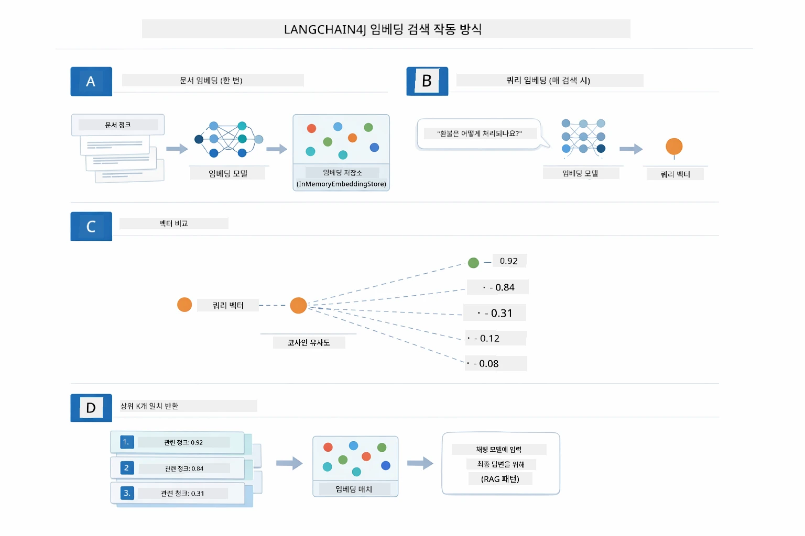

*이 다이어그램은 임베딩 검색 네 단계 과정을 보여줍니다: 문서 임베딩, 질문 임베딩, 코사인 유사도 비교, 상위 K개 결과 반환.*

### 의미 기반 검색

[RagService.java](../../../03-rag/src/main/java/com/example/langchain4j/rag/service/RagService.java)

질문을 하면 그 질문 역시 임베딩으로 변환됩니다. 시스템은 질문 임베딩을 모든 문서 청크 임베딩과 비교합니다. 가장 의미가 비슷한 청크들을 찾는데, 단순 키워드 일치가 아니라 실제 의미 유사성입니다.

```java
Embedding queryEmbedding = embeddingModel.embed(question).content();

EmbeddingSearchRequest searchRequest = EmbeddingSearchRequest.builder()
    .queryEmbedding(queryEmbedding)
    .maxResults(5)
    .minScore(0.5)
    .build();

EmbeddingSearchResult<TextSegment> searchResult = embeddingStore.search(searchRequest);
List<EmbeddingMatch<TextSegment>> matches = searchResult.matches();

for (EmbeddingMatch<TextSegment> match : matches) {
    String relevantText = match.embedded().text();
    double score = match.score();
}
```

아래 다이어그램은 의미 기반 검색과 전통적인 키워드 검색을 대비해서 보여줍니다. "vehicle"이라는 키워드 검색은 "cars and trucks" 내용 청크를 놓치지만, 의미 기반 검색은 같은 의미임을 이해하고 높은 점수를 주어 반환합니다:

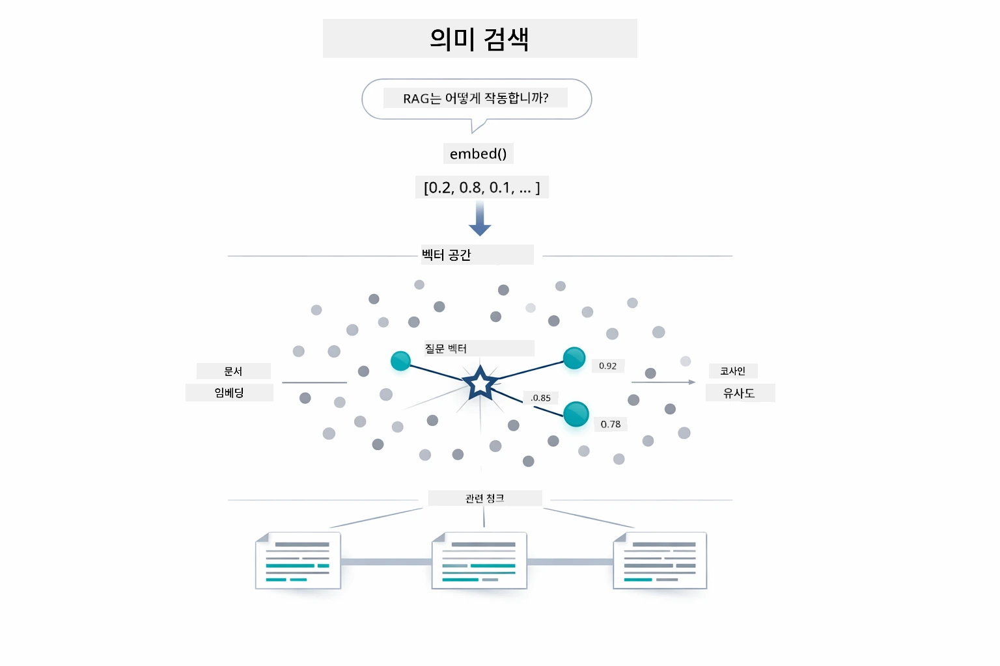

*이 다이어그램은 키워드 기반 검색과 의미 기반 검색을 비교하며, 의미 기반 검색은 정확한 키워드가 달라도 개념적으로 관련된 콘텐츠를 찾아내는 과정을 보여줍니다.*
내부적으로 유사도는 코사인 유사도(cosine similarity)를 사용하여 측정됩니다 — 본질적으로 "이 두 화살표가 같은 방향을 가리키고 있나요?"라고 묻는 것과 같습니다. 두 개의 청크가 전혀 다른 단어를 사용하더라도 의미가 같으면 그 벡터들은 같은 방향을 가리키며 점수는 1.0에 가깝게 나옵니다:

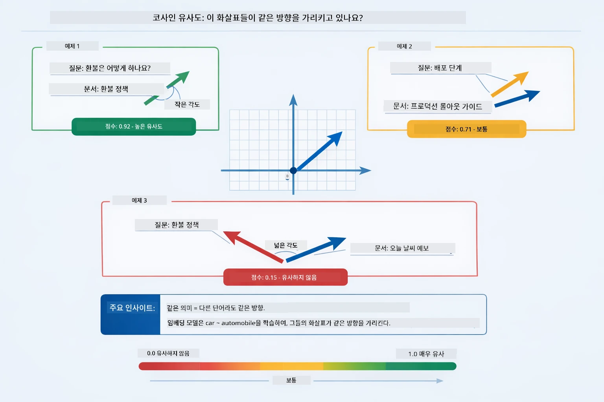

*이 다이어그램은 임베딩 벡터 간의 각도로서 코사인 유사도를 보여줍니다 — 벡터가 더 일치할수록 점수가 1.0에 가까워져 더 높은 의미적 유사성을 나타냅니다.*

> **🤖 [GitHub Copilot](https://github.com/features/copilot) Chat으로 시도해 보세요:** [`RagService.java`](../../../03-rag/src/main/java/com/example/langchain4j/rag/service/RagService.java)를 열고 다음을 물어보세요:
> - "임베딩과 함께 유사도 검색은 어떻게 작동하며 점수는 무엇에 의해 결정되나요?"
> - "어떤 유사도 임계값을 사용해야 하며 결과에 어떻게 영향을 주나요?"
> - "관련 문서가 없을 때는 어떻게 처리하나요?"

### 답변 생성

[RagService.java](../../../03-rag/src/main/java/com/example/langchain4j/rag/service/RagService.java)

가장 관련성 높은 청크들이 명확한 지침, 검색된 문맥, 사용자 질문을 포함하는 구조화된 프롬프트로 조립됩니다. 모델은 특정 청크만 읽고 그 정보를 바탕으로 답변을 생성하며 — 앞에 있는 정보만을 사용하므로 환각을 방지할 수 있습니다.

```java
String context = matches.stream()
    .map(match -> match.embedded().text())
    .collect(Collectors.joining("\n\n"));

String prompt = String.format("""
    Answer the question based on the following context.
    If the answer cannot be found in the context, say so.

    Context:
    %s

    Question: %s

    Answer:""", context, request.question());

String answer = chatModel.chat(prompt);
```

아래 다이어그램은 이 조립 과정을 보여줍니다 — 검색 단계에서 최고 점수의 청크들이 프롬프트 템플릿에 주입되고, `OpenAiOfficialChatModel`이 근거 있는 답변을 생성합니다:

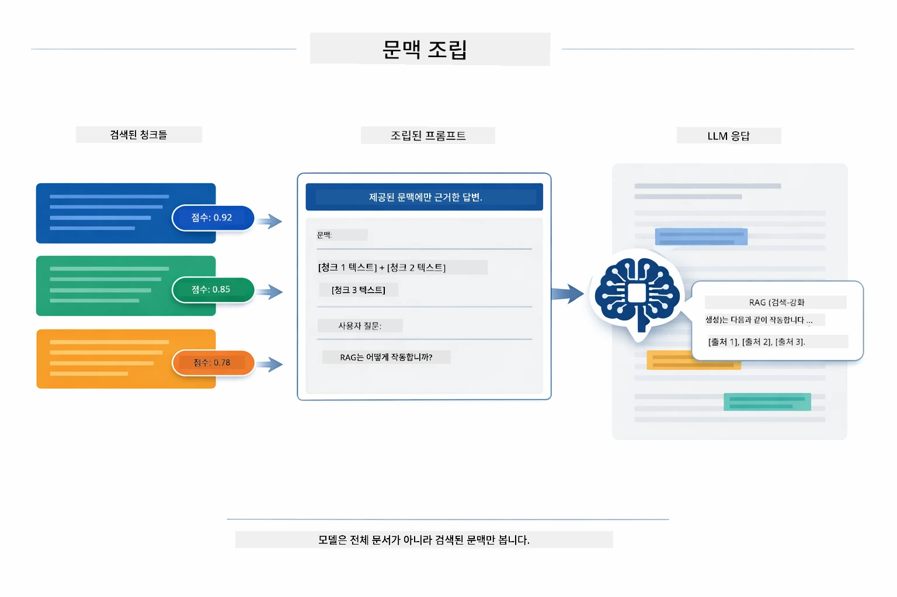

*이 다이어그램은 최고 점수 청크가 구조화된 프롬프트로 조립되어 모델이 데이터로부터 근거 있는 답변을 생성하는 방식을 보여줍니다.*

## 애플리케이션 실행하기

**배포 확인:**

`.env` 파일이 루트 디렉토리에 존재하며 Azure 자격 증명(모듈 01에서 생성됨)이 포함되어 있는지 확인하세요. 모듈 디렉토리(`03-rag/`)에서 다음을 실행합니다:

**Bash:**
```bash
cat ../.env  # AZURE_OPENAI_ENDPOINT, API_KEY, DEPLOYMENT를 표시해야 합니다
```

**PowerShell:**
```powershell
Get-Content ..\.env  # AZURE_OPENAI_ENDPOINT, API_KEY, DEPLOYMENT을(를) 보여야 합니다
```

**애플리케이션 시작:**

> **참고:** 이미 루트 디렉토리에서 `./start-all.sh` (모듈 01에서 설명)를 사용해 모든 애플리케이션을 시작했다면, 이 모듈은 포트 8081에서 이미 실행 중입니다. 아래 시작 명령어를 건너뛰고 바로 http://localhost:8081 으로 이동하세요.

**옵션 1: Spring Boot 대시보드 사용 (VS Code 사용자에 권장)**

개발 컨테이너에는 Spring Boot 대시보드 확장 프로그램이 포함되어 있어 모든 Spring Boot 애플리케이션을 시각적으로 관리할 수 있습니다. VS Code 왼쪽 활동 바에서 Spring Boot 아이콘을 찾으세요.

Spring Boot 대시보드에서 할 수 있는 일은:
- 작업 공간 내 모든 Spring Boot 애플리케이션 보기
- 클릭 한 번으로 애플리케이션 시작/중지
- 실시간으로 애플리케이션 로그 보기
- 애플리케이션 상태 모니터링

"rag" 옆의 플레이 버튼을 클릭하여 이 모듈을 시작하거나 모든 모듈을 한 번에 시작할 수 있습니다.


*이 스크린샷은 VS Code에서 Spring Boot 대시보드를 보여주며, 애플리케이션을 시각적으로 시작, 중지, 모니터링할 수 있습니다.*

**옵션 2: 셸 스크립트 사용**

모든 웹 애플리케이션(모듈 01-04) 시작:

**Bash:**
```bash
cd ..  # 루트 디렉토리에서
./start-all.sh
```

**PowerShell:**
```powershell
cd ..  # 루트 디렉토리에서
.\start-all.ps1
```

또는 이 모듈만 시작:

**Bash:**
```bash
cd 03-rag
./start.sh
```

**PowerShell:**
```powershell
cd 03-rag
.\start.ps1
```

두 스크립트 모두 루트 `.env` 파일에서 환경 변수를 자동으로 로드하며, JAR 파일이 없으면 빌드합니다.

> **참고:** 모든 모듈을 수동으로 빌드한 후 시작하고 싶다면:
>
> **Bash:**
> ```bash
> cd ..  # Go to root directory
> mvn clean package -DskipTests
> ```
>
> **PowerShell:**
> ```powershell
> cd ..  # Go to root directory
> mvn clean package -DskipTests
> ```

브라우저에서 http://localhost:8081 을 엽니다.

**중지하려면:**

**Bash:**
```bash
./stop.sh  # 이 모듈만
# 또는
cd .. && ./stop-all.sh  # 모든 모듈
```

**PowerShell:**
```powershell
.\stop.ps1  # 이 모듈만
# 또는
cd ..; .\stop-all.ps1  # 모든 모듈
```

## 애플리케이션 사용법

이 애플리케이션은 문서 업로드와 질문을 위한 웹 인터페이스를 제공합니다.

<a href="images/rag-homepage.png"></a>

*이 스크린샷은 문서를 업로드하고 질문할 수 있는 RAG 애플리케이션 인터페이스를 보여줍니다.*

### 문서 업로드

우선 문서를 업로드하세요 - TXT 파일이 테스트용으로 가장 적합합니다. 이 디렉토리에는 LangChain4j 기능, RAG 구현, 모범 사례에 대한 정보를 담은 `sample-document.txt`가 제공되어 있어 시스템 테스트에 완벽합니다.

시스템은 문서를 처리하고 청크로 분할한 후 각 청크에 임베딩을 생성합니다. 업로드하면 이 과정이 자동으로 진행됩니다.

### 질문하기

이제 문서 내용에 관한 구체적인 질문을 해 보세요. 문서에 명확히 서술된 사실적 내용을 시도해 보는 것이 좋습니다. 시스템은 관련 청크를 검색하여 프롬프트에 포함시키고 답변을 생성합니다.

### 출처 확인

각 답변에는 유사도 점수가 포함된 출처 참고가 포함됩니다. 이 점수(0부터 1까지)는 각 청크가 질문과 얼마나 관련 있는지를 나타냅니다. 점수가 높을수록 더 좋은 매칭입니다. 이를 통해 답변을 원본 자료와 검증할 수 있습니다.

<a href="images/rag-query-results.png"></a>

*이 스크린샷은 생성된 답변, 출처 참고, 검색된 각 청크의 관련성 점수를 포함한 쿼리 결과를 보여줍니다.*

### 다양한 질문 실험하기

다양한 유형의 질문을 시도해 보세요:
- 구체적 사실: "주요 주제는 무엇인가요?"
- 비교: "X와 Y의 차이점은 무엇인가요?"
- 요약: "Z에 관한 핵심 내용을 요약해 주세요."

질문이 문서 내용과 얼마나 잘 맞는지에 따라 관련성 점수가 어떻게 변하는지 확인하세요.

## 주요 개념

### 청크 분할 전략

문서는 300 토큰 청크로 나누며, 30 토큰씩 중첩(overlap)됩니다. 이 균형은 각 청크가 충분한 문맥을 갖도록 하면서도 프롬프트에 여러 청크를 포함할 수 있게 작은 크기를 유지합니다.

### 유사도 점수

검색된 각 청크에는 0부터 1까지의 유사도 점수가 붙어 있으며, 이는 사용자의 질문과 얼마나 밀접한 관련이 있는지를 나타냅니다. 아래 다이어그램은 점수 범위와 시스템이 이를 어떻게 사용해 결과를 필터링하는지 시각화했습니다:

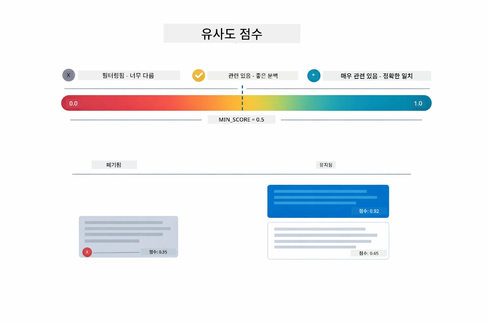

*이 다이어그램은 0부터 1까지 점수 범위와 0.5의 최소 임계값을 보여주며, 임계값 이하 청크는 필터링됩니다.*

점수 범위:
- 0.7-1.0: 매우 관련성 높음, 정확한 매칭
- 0.5-0.7: 관련성 있음, 좋은 문맥
- 0.5 미만: 필터링됨, 너무 다름

시스템은 품질을 보장하기 위해 최소 임계값 이상의 청크만 검색합니다.

임베딩은 의미가 명확하게 군집될 때 잘 작동하지만, 한계도 있습니다. 아래 다이어그램은 대표적인 실패 사례를 보여줍니다 — 너무 큰 청크는 뒤섞인 벡터를 만들고, 너무 작은 청크는 문맥 부족, 애매한 용어는 여러 군집을 가리키며, ID나 부품 번호 같은 정확한 매칭 조회는 임베딩과 전혀 작동하지 않습니다:

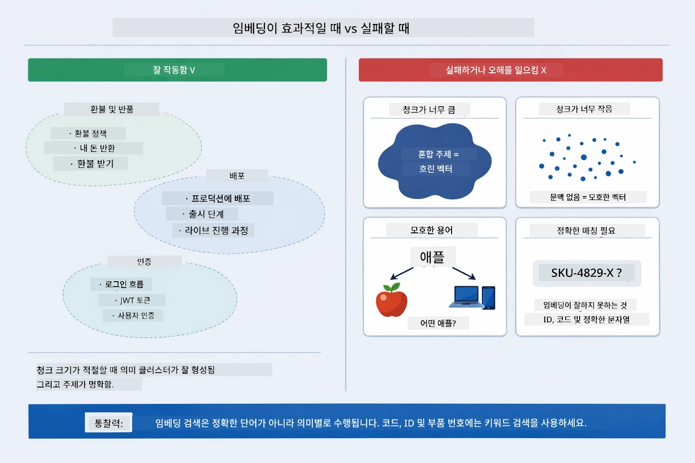

*이 다이어그램은 임베딩의 흔한 실패 모드인 너무 큰 청크, 너무 작은 청크, 여러 군집을 가리키는 애매한 용어, 그리고 ID 같은 정확한 매칭 조회 문제를 보여줍니다.*

### 메모리 내 저장소

이 모듈은 간단하게 메모리 내 저장소만 사용합니다. 애플리케이션을 재시작하면 업로드한 문서는 사라집니다. 실제 운영 환경에서는 Qdrant나 Azure AI Search 같은 지속적 벡터 데이터베이스를 사용합니다.

### 컨텍스트 창 관리

각 모델에 최대 컨텍스트 창이 있습니다. 큰 문서의 모든 청크를 포함할 수 없습니다. 시스템은 상위 N개(기본 5개)의 가장 관련 있는 청크만 검색해 제한 내에서 충분한 문맥을 제공합니다.

## RAG가 중요한 경우

RAG가 항상 최선의 접근법은 아닙니다. 아래 의사 결정 가이드가 RAG가 가치를 더하는 경우와 단순히 콘텐츠를 프롬프트에 포함시키거나 모델 내장 지식을 사용하는 것이 충분한 경우를 판단하는 데 도움을 줍니다:

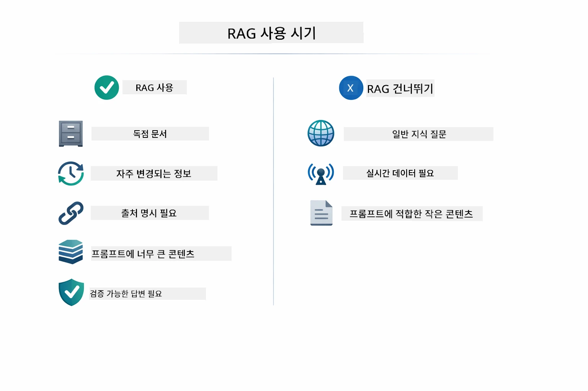

*이 다이어그램은 RAG가 가치를 더하는 경우와 단순한 접근법으로 충분한 경우를 구분하는 의사 결정 가이드를 보여줍니다.*

## 다음 단계

**다음 모듈:** [04-tools - 도구를 활용한 AI 에이전트](../04-tools/README.md)

---

**네비게이션:** [← 이전: 모듈 02 - 프롬프트 엔지니어링](../02-prompt-engineering/README.md) | [메인으로 돌아가기](../README.md) | [다음: 모듈 04 - 도구 →](../04-tools/README.md)

---

<!-- CO-OP TRANSLATOR DISCLAIMER START -->
**면책 조항**:  
이 문서는 AI 번역 서비스 [Co-op Translator](https://github.com/Azure/co-op-translator)를 사용하여 번역되었습니다. 정확성을 위해 노력하고 있지만, 자동 번역에는 오류나 부정확성이 포함될 수 있음을 양지해 주시기 바랍니다. 원문은 해당 언어의 원본 문서가 권위 있는 출처임을 인정해 주십시오. 중요한 정보의 경우 전문적인 인간 번역을 권장합니다. 본 번역 사용으로 인한 오해나 잘못된 해석에 대해서는 책임지지 않습니다.
<!-- CO-OP TRANSLATOR DISCLAIMER END -->