# Module 04: 도구를 갖춘 AI 에이전트

## 목차

- [비디오 워크스루](../../../04-tools)
- [학습할 내용](../../../04-tools)
- [필수 조건](../../../04-tools)
- [도구를 갖춘 AI 에이전트 이해하기](../../../04-tools)
- [도구 호출 작동 방식](../../../04-tools)
  - [도구 정의](../../../04-tools)
  - [의사 결정](../../../04-tools)
  - [실행](../../../04-tools)
  - [응답 생성](../../../04-tools)
  - [아키텍처: Spring Boot 자동 연결](../../../04-tools)
- [도구 체인](../../../04-tools)
- [애플리케이션 실행](../../../04-tools)
- [애플리케이션 사용법](../../../04-tools)
  - [단순 도구 사용 시도하기](../../../04-tools)
  - [도구 체인 테스트하기](../../../04-tools)
  - [대화 흐름 보기](../../../04-tools)
  - [다양한 요청 실험하기](../../../04-tools)
- [핵심 개념](../../../04-tools)
  - [ReAct 패턴 (추론과 행동)](../../../04-tools)
  - [도구 설명의 중요성](../../../04-tools)
  - [세션 관리](../../../04-tools)
  - [오류 처리](../../../04-tools)
- [사용 가능한 도구](../../../04-tools)
- [도구 기반 에이전트 사용 시기](../../../04-tools)
- [도구와 RAG 비교](../../../04-tools)
- [다음 단계](../../../04-tools)

## 비디오 워크스루

이 모듈 시작 방법을 설명하는 라이브 세션을 시청하세요:

<a href="https://www.youtube.com/watch?v=O_J30kZc0rw"></a>

## 학습할 내용

지금까지 AI와 대화를 나누고, 효과적으로 프롬프트를 구조화하며, 응답을 문서 기반으로 연동하는 방법을 배웠습니다. 하지만 기본적인 한계가 있습니다: 언어 모델은 텍스트만 생성할 수 있습니다. 날씨를 확인하거나, 계산을 수행하거나, 데이터베이스를 조회하거나, 외부 시스템과 상호작용할 수 없습니다.

도구가 이를 바꿉니다. 모델이 호출할 수 있는 기능에 접근 권한을 부여하면 텍스트 생성기에서 행동할 수 있는 에이전트로 변환됩니다. 모델은 언제 도구가 필요한지, 어떤 도구를 사용하고, 어떤 매개변수를 전달할지 결정합니다. 코드는 해당 함수 실행 후 결과를 반환합니다. 모델은 그 결과를 응답에 반영합니다.

## 필수 조건

- [Module 01 - 소개](../01-introduction/README.md) 완료 (Azure OpenAI 리소스 배포됨)
- 이전 모듈 완료 권장 (이 모듈에서는 [Module 03 RAG 개념](../03-rag/README.md)을 도구와 RAG 비교 시 언급함)
- 루트 디렉터리에 Azure 자격 증명이 담긴 `.env` 파일 존재 (Module 01에서 `azd up` 명령으로 생성)

> **참고:** Module 01을 완료하지 않았다면, 먼저 해당 배포 지침을 따르세요.

## 도구를 갖춘 AI 에이전트 이해하기

> **📝 참고:** 이 모듈에서 "에이전트"란 도구 호출 기능이 향상된 AI 도우미를 의미합니다. 이는 [Module 05: MCP](../05-mcp/README.md)에서 다룰 계획인 **Agentic AI** 패턴(자율 에이전트, 계획, 메모리, 다중 단계 추론)과는 다릅니다.

도구가 없으면, 언어 모델은 단지 훈련 데이터에서 텍스트를 생성할 뿐입니다. 현재 날씨를 물으면 추측할 수밖에 없습니다. 도구를 주면, 날씨 API를 호출하거나, 계산을 하거나, 데이터베이스를 조회한 다음 실제 결과를 응답에 녹일 수 있습니다.

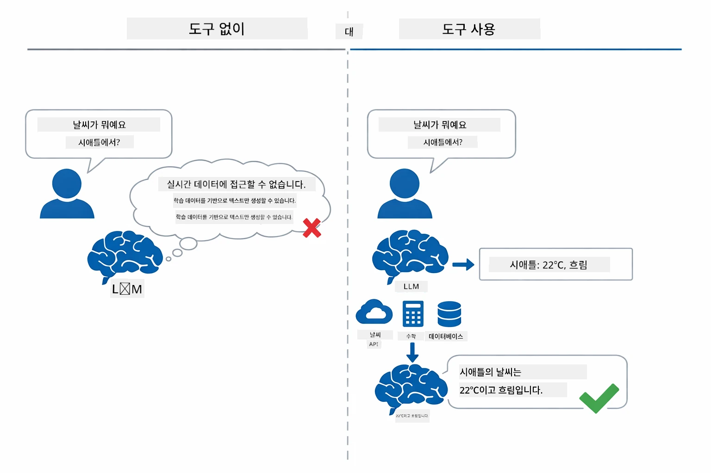

*도구가 없으면 모델은 추측만 하지만, 도구가 있으면 API 호출, 계산 실행, 실시간 데이터 반환이 가능합니다.*

도구를 갖춘 AI 에이전트는 **추론하고 행동하는 (ReAct)** 패턴을 따릅니다. 모델은 단순히 응답하는 것이 아니라, 무엇이 필요한지 생각하고, 도구를 호출해 행동하며, 결과를 관찰하고, 다시 행동할지 최종 답변을 할지 결정합니다:

1. **추론** — 에이전트가 사용자 질문을 분석하고 필요한 정보를 결정
2. **행동** — 적절한 도구를 선택하고 정확한 매개변수를 생성하여 호출
3. **관찰** — 도구 출력 결과를 받고 평가
4. **반복하거나 응답** — 추가 데이터가 필요하면 다시 반복, 아니면 자연어 답변 작성

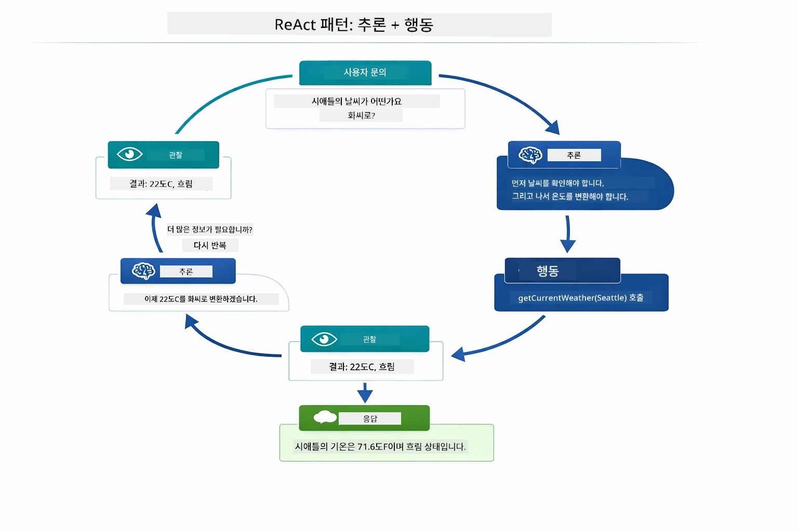

*ReAct 사이클 — 에이전트가 무엇을 해야 할지 추론하고, 도구를 호출하며, 결과를 관찰하고, 최종 답변을 낼 때까지 반복.*

이 과정은 자동으로 이뤄집니다. 도구와 설명을 정의하면, 모델이 언제 어떻게 사용할지 결정합니다.

## 도구 호출 작동 방식

### 도구 정의

[WeatherTool.java](../../../04-tools/src/main/java/com/example/langchain4j/agents/tools/WeatherTool.java) | [TemperatureTool.java](../../../04-tools/src/main/java/com/example/langchain4j/agents/tools/TemperatureTool.java)

함수를 명확한 설명과 매개변수 명세와 함께 정의합니다. 모델은 시스템 프롬프트에서 이 설명을 보고 각 도구가 무엇을 하는지 이해합니다.

```java
@Component
public class WeatherTool {
    
    @Tool("Get the current weather for a location")
    public String getCurrentWeather(@P("Location name") String location) {
        // 귀하의 날씨 조회 로직
        return "Weather in " + location + ": 22°C, cloudy";
    }
}

@AiService
public interface Assistant {
    String chat(@MemoryId String sessionId, @UserMessage String message);
}

// 어시스턴트는 Spring Boot에 의해 자동으로 연결됩니다:
// - ChatModel 빈
// - @Component 클래스의 모든 @Tool 메서드
// - 세션 관리를 위한 ChatMemoryProvider
```

아래 다이어그램은 모든 어노테이션을 분해하여 각 부분이 AI가 도구를 언제 호출하고 어떤 인자를 전달할지 이해하는 데 어떻게 도움이 되는지 보여줍니다:

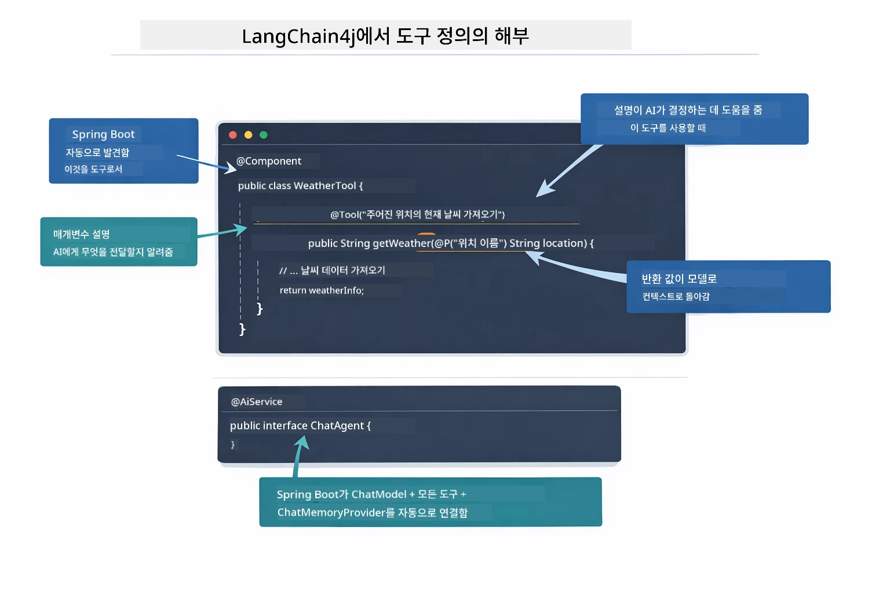

*도구 정의 구조 — @Tool은 AI에 도구 사용 시점을 알려주고, @P는 각 매개변수를 설명하며, @AiService는 시작 시 모두 연결합니다.*

> **🤖 [GitHub Copilot](https://github.com/features/copilot) Chat으로 시도해보세요:** [`WeatherTool.java`](../../../04-tools/src/main/java/com/example/langchain4j/agents/tools/WeatherTool.java)를 열고 질문해보세요:
> - "모의 데이터 대신 OpenWeatherMap 같은 실제 날씨 API를 어떻게 통합하나요?"
> - "AI가 제대로 도구를 사용하도록 돕는 좋은 도구 설명은 무엇인가요?"
> - "도구 구현 시 API 오류와 호출 제한은 어떻게 처리하나요?"

### 의사 결정

사용자가 "시애틀 날씨 어때?"라고 물으면, 모델은 무작위로 도구를 고르지 않습니다. 사용자 의도를 각 도구 설명과 비교해 관련성을 점수화한 후 가장 적합한 도구를 선택합니다. 그런 다음 구조화된 함수 호출을 생성하는데, 여기서는 `location`이 `"Seattle"`로 설정됩니다.

사용자 요청에 맞는 도구가 없으면 모델은 자체 지식에서 답변합니다. 여러 도구가 매칭되면 가장 구체적인 것을 선택합니다.

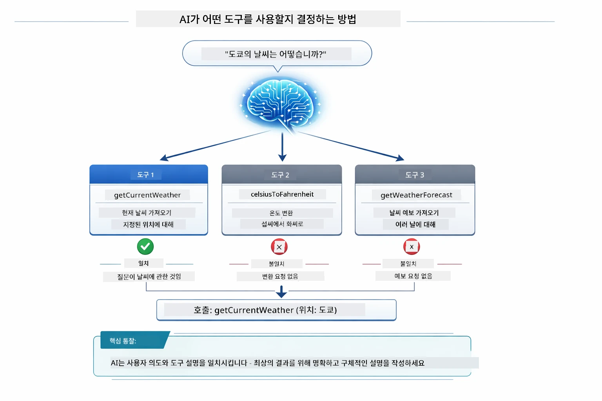

*모델은 사용자 의도에 대해 모든 도구를 평가하고 최적을 선택합니다 — 명확하고 구체적인 도구 설명이 중요한 이유입니다.*

### 실행

[AgentService.java](../../../04-tools/src/main/java/com/example/langchain4j/agents/service/AgentService.java)

Spring Boot가 선언적인 `@AiService` 인터페이스를 모든 등록된 도구와 자동 연결하고 LangChain4j가 도구 호출을 자동 실행합니다. 내부적으로는 여섯 단계로 완전한 도구 호출 흐름이 이뤄집니다 — 사용자의 자연어 질문부터 자연어 답변까지:

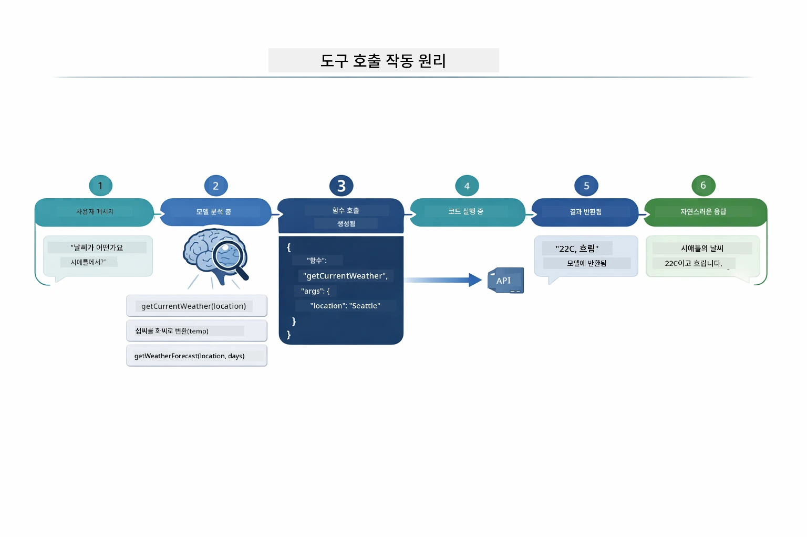

*엔드투엔드 흐름 — 사용자가 질문하면 모델이 도구를 선택하고, LangChain4j가 실행하며, 결과를 자연어 응답에 반영합니다.*

Module 00의 [ToolIntegrationDemo](../../../00-quick-start/src/main/java/com/example/langchain4j/quickstart/ToolIntegrationDemo.java)를 실행해 봤다면 이미 이 패턴을 경험했을 겁니다 — `Calculator` 도구도 같은 방식으로 호출됩니다. 아래 시퀀스 다이어그램은 데모 중 내부에서 무슨 일이 있었는지 보여줍니다:

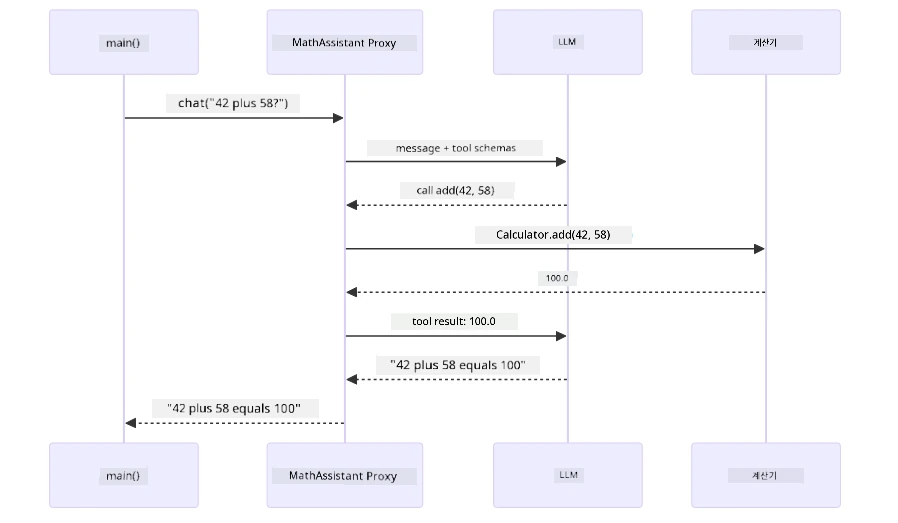

*퀵 스타트 데모의 도구 호출 루프 — `AiServices`가 메시지와 도구 스키마를 LLM에 보내고, LLM이 `add(42, 58)` 같은 함수 호출로 응답하며 LangChain4j가 로컬에서 `Calculator` 메서드를 실행하고 결과를 최종 답변으로 다시 전달.*

> **🤖 [GitHub Copilot](https://github.com/features/copilot) Chat으로 시도해보세요:** [`AgentService.java`](../../../04-tools/src/main/java/com/example/langchain4j/agents/service/AgentService.java)를 열어 질문해보세요:
> - "ReAct 패턴은 어떻게 작동하고 왜 AI 에이전트에 효과적인가요?"
> - "에이전트는 어떤 도구를 언제, 어떤 순서로 결정하나요?"
> - "도구 실행 실패 시 어떻게 처리해야 하나요, 오류 관리를 견고하게 하려면?"

### 응답 생성

모델은 날씨 데이터를 받아 사용자에게 자연어로 정리된 응답을 작성합니다.

### 아키텍처: Spring Boot 자동 연결

이 모듈은 LangChain4j의 Spring Boot 통합과 선언적 `@AiService` 인터페이스를 사용합니다. 시작 시 Spring Boot가 `@Tool` 메서드를 가진 모든 `@Component`, `ChatModel` 빈, `ChatMemoryProvider`를 찾아 한 개의 `Assistant` 인터페이스로 모두 연결합니다. 보일러플레이트 코드가 전혀 없습니다.

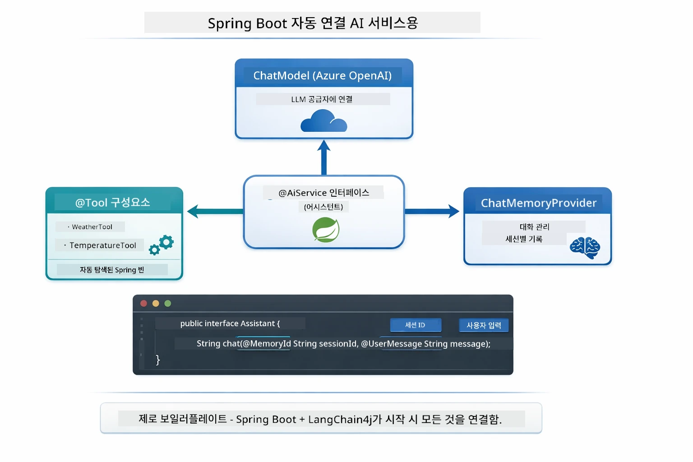

*@AiService 인터페이스가 ChatModel, 도구 컴포넌트, 메모리 프로바이더를 하나로 연결 — Spring Boot가 모든 연결을 자동으로 처리.*

전체 요청 수명 주기를 나타내는 시퀀스 다이어그램입니다 — HTTP 요청에서 컨트롤러, 서비스, 자동 연결된 프록시를 거쳐 도구 실행 및 결과 반환까지:

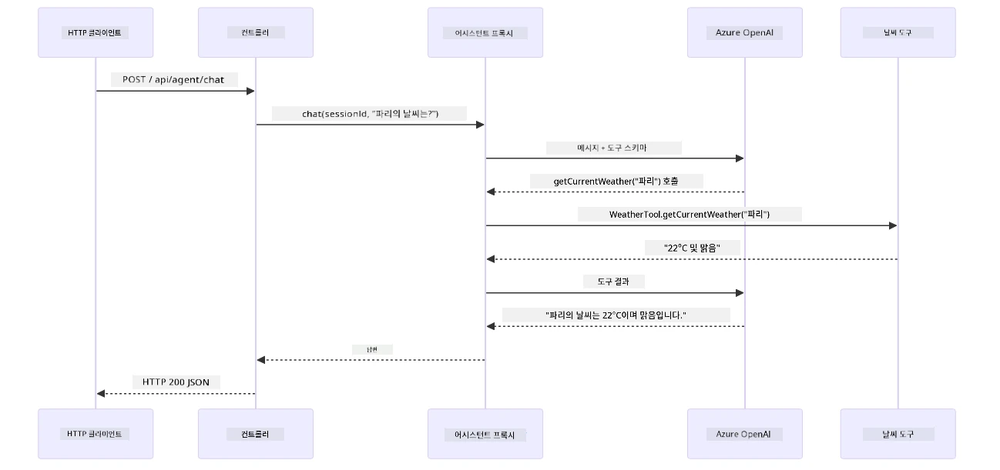

*완벽한 Spring Boot 요청 수명 주기 — HTTP 요청이 컨트롤러와 서비스를 거쳐 자동 연결된 Assistant 프록시로 흘러 들어가 LLM과 도구 호출을 자동으로 조율합니다.*

이 접근법의 주요 이점:

- **Spring Boot 자동 연결** — ChatModel과 도구가 자동 주입됨
- **@MemoryId 패턴** — 자동 세션 기반 메모리 관리
- **단일 인스턴스** — Assistant를 한 번 생성해 성능 향상
- **타입 안전 실행** — Java 메서드를 타입 변환과 함께 직접 호출
- **다중 회차 조율** — 도구 체인을 자동으로 처리
- **제로 보일러플레이트** — 수동 `AiServices.builder()` 호출이나 메모리 HashMap 불필요

수동 `AiServices.builder()` 방식은 더 많은 코드가 필요하고 Spring Boot 통합의 이점을 활용하지 못합니다.

## 도구 체인

**도구 체인** — 단일 질문에 여러 도구가 필요한 경우 도구 기반 에이전트의 진정한 힘이 드러납니다. "시애틀의 화씨 온도는?" 이라고 물으면 에이전트는 두 도구를 자동 체인합니다: 먼저 `getCurrentWeather`를 호출해 섭씨 온도를 받고, 그 값을 `celsiusToFahrenheit`에 전달해 변환합니다 — 모든 과정을 한 회차 대화에서 처리합니다.

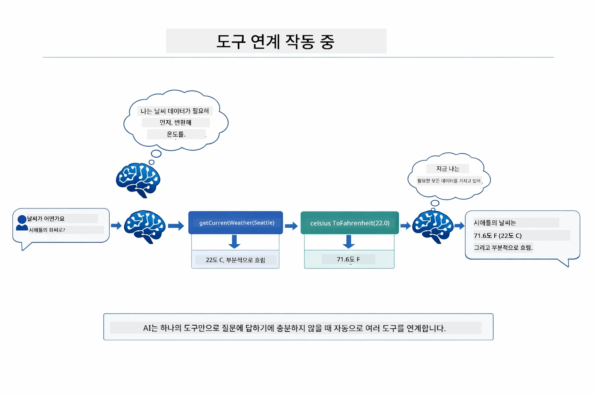

*도구 체인 동작 — 에이전트가 먼저 getCurrentWeather를 호출하고, 섭씨 결과를 celsiusToFahrenheit에 전달해 결합된 답변을 제공합니다.*

**우아한 실패 처리** — 모의 데이터에 없는 도시의 날씨를 요청하면, 도구는 오류 메시지를 반환하고 AI는 도와줄 수 없다고 설명하는 방식으로 충돌 없이 대응합니다. 안전하게 실패합니다. 아래 다이어그램은 두 방식을 대비합니다 — 적절한 오류 처리 시 에이전트가 예외를 잡아 유용한 응답을 하며, 그렇지 않으면 전체 앱이 충돌합니다:

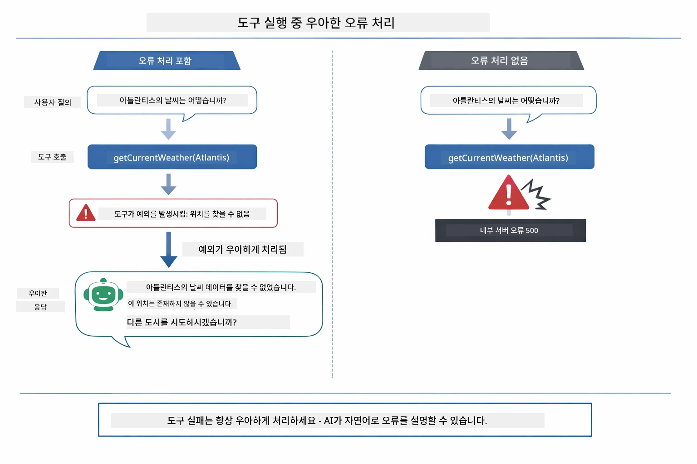

*도구 실패 시 에이전트가 오류를 잡아 충돌 없이 도움 설명 응답을 반환합니다.*

모든 과정은 단일 대화 회차에서 이뤄집니다. 에이전트가 여러 도구 호출을 자율적으로 조율합니다.

## 애플리케이션 실행

**배포 검증:**

루트 디렉터리에 Azure 자격 증명 `.env` 파일이 있는지 확인하세요 (Module 01에서 생성됨). 모듈 디렉터리(`04-tools/`)에서 다음을 실행합니다:

**Bash:**
```bash
cat ../.env  # AZURE_OPENAI_ENDPOINT, API_KEY, DEPLOYMENT를 표시해야 합니다
```

**PowerShell:**
```powershell
Get-Content ..\.env  # AZURE_OPENAI_ENDPOINT, API_KEY, DEPLOYMENT를 보여줘야 합니다
```

**애플리케이션 시작:**

> **참고:** 이미 루트 디렉터리에서 `./start-all.sh`로 모든 애플리케이션을 시작했다면 (Module 01 설명 참조), 이 모듈은 8084 포트에서 실행 중입니다. 아래 시작 명령은 건너뛰고 바로 http://localhost:8084 접속해도 됩니다.

**옵션 1: Spring Boot 대시보드 사용하기 (VS Code 사용자 권장)**

개발 컨테이너에는 Spring Boot 대시보드 확장 기능이 포함되어 있어 모든 Spring Boot 애플리케이션을 시각적으로 관리할 수 있습니다. VS Code 왼쪽 액티비티 바에서 Spring Boot 아이콘을 찾으면 됩니다.

Spring Boot 대시보드에서는:
- 작업 영역 내 모든 Spring Boot 애플리케이션 목록 확인
- 클릭 한 번으로 애플리케이션 시작/중지
- 실시간 애플리케이션 로그 보기
- 애플리케이션 상태 모니터링
도구 옆에 있는 재생 버튼을 클릭하여 이 모듈을 시작하거나 모든 모듈을 한 번에 시작하세요.

VS Code에서 Spring Boot 대시보드가 어떻게 보이는지 다음과 같습니다:


*VS Code의 Spring Boot 대시보드 — 한 곳에서 모든 모듈을 시작, 중지 및 모니터링*

**옵션 2: 셸 스크립트 사용**

모든 웹 애플리케이션(모듈 01-04) 시작:

**Bash:**
```bash
cd ..  # 루트 디렉터리에서
./start-all.sh
```

**PowerShell:**
```powershell
cd ..  # 루트 디렉토리에서
.\start-all.ps1
```

또는 이 모듈만 시작:

**Bash:**
```bash
cd 04-tools
./start.sh
```

**PowerShell:**
```powershell
cd 04-tools
.\start.ps1
```

두 스크립트 모두 루트 `.env` 파일에서 환경 변수를 자동으로 로드하며, JAR 파일이 없으면 빌드합니다.

> **참고:** 시작 전에 모든 모듈을 수동으로 빌드하려면:
>
> **Bash:**
> ```bash
> cd ..  # Go to root directory
> mvn clean package -DskipTests
> ```
>
> **PowerShell:**
> ```powershell
> cd ..  # Go to root directory
> mvn clean package -DskipTests
> ```

브라우저에서 http://localhost:8084 를 엽니다.

**중지하려면:**

**Bash:**
```bash
./stop.sh  # 이 모듈만
# 또는
cd .. && ./stop-all.sh  # 모든 모듈
```

**PowerShell:**
```powershell
.\stop.ps1  # 이 모듈만
# 또는
cd ..; .\stop-all.ps1  # 모든 모듈
```


## 애플리케이션 사용하기

이 애플리케이션은 날씨 및 온도 변환 도구에 접근할 수 있는 AI 에이전트와 상호작용할 수 있는 웹 인터페이스를 제공합니다. 인터페이스는 다음과 같으며, 빠른 시작 예제와 요청을 보낼 수 있는 채팅 패널이 포함되어 있습니다:

<a href="images/tools-homepage.png"></a>

*AI 에이전트 도구 인터페이스 - 도구와 상호작용하기 위한 빠른 예제 및 채팅 인터페이스*

### 간단한 도구 사용해보기

간단한 요청으로 시작해보세요: "100도 화씨를 섭씨로 변환해줘". 에이전트는 온도 변환 도구가 필요함을 인지하고 올바른 매개변수로 호출하여 결과를 반환합니다. 어느 도구를 사용할지 지정하지 않아도 자연스레 작동하는 것을 확인할 수 있습니다.

### 도구 체인 사용해보기

이번에는 좀 더 복잡한 요청을 시도해보세요: "시애틀 날씨가 어때? 그리고 화씨로 변환해줘." 에이전트가 단계별로 작업하는 과정을 볼 수 있습니다. 먼저 날씨 정보를 얻고(섭씨로 반환), 화씨로 변환해야 함을 인지하고 변환 도구를 호출하여 두 결과를 하나의 응답으로 결합합니다.

### 대화 흐름 확인하기

채팅 인터페이스는 대화 기록을 유지하여 다중 턴 상호작용이 가능합니다. 이전 문의와 응답을 모두 볼 수 있어 대화를 추적하고 에이전트가 여러 교환을 통해 문맥을 어떻게 구축하는지 쉽게 이해할 수 있습니다.

<a href="images/tools-conversation-demo.png"></a>

*간단한 변환, 날씨 조회, 도구 체인으로 이루어진 다중 턴 대화 예시*

### 다양한 요청 시도해보기

다양한 조합을 시도해 보세요:
- 날씨 조회: "도쿄 날씨가 어때?"
- 온도 변환: "25°C는 켈빈으로 얼마야?"
- 복합 쿼리: "파리 날씨 확인하고 20°C 이상인지 알려줘"

에이전트가 자연어를 해석해 적절한 도구 호출로 매핑하는 방식을 확인할 수 있습니다.

## 주요 개념

### ReAct 패턴 (추론과 실행)

에이전트는 추론(무엇을 할지 결정)과 실행(도구 사용)을 번갈아 수행합니다. 이 패턴은 단순 명령 응답이 아니라 자율적 문제 해결을 가능하게 합니다.

### 도구 설명이 중요함

도구 설명의 품질이 에이전트가 도구를 얼마나 잘 사용하는지를 직접 결정합니다. 명확하고 구체적인 설명이 모델이 언제, 어떻게 각 도구를 호출할지 이해하는 데 도움이 됩니다.

### 세션 관리

`@MemoryId` 어노테이션은 자동 세션 기반 메모리 관리를 가능하게 합니다. 각 세션 ID마다 `ChatMemory` 인스턴스가 `ChatMemoryProvider` 빈에 의해 관리되어 여러 사용자가 대화를 섞지 않고 독립적으로 상호작용할 수 있습니다. 아래 그림은 여러 사용자가 자신의 세션 ID에 따라 격리된 메모리 저장소로 라우팅되는 과정을 보여줍니다:

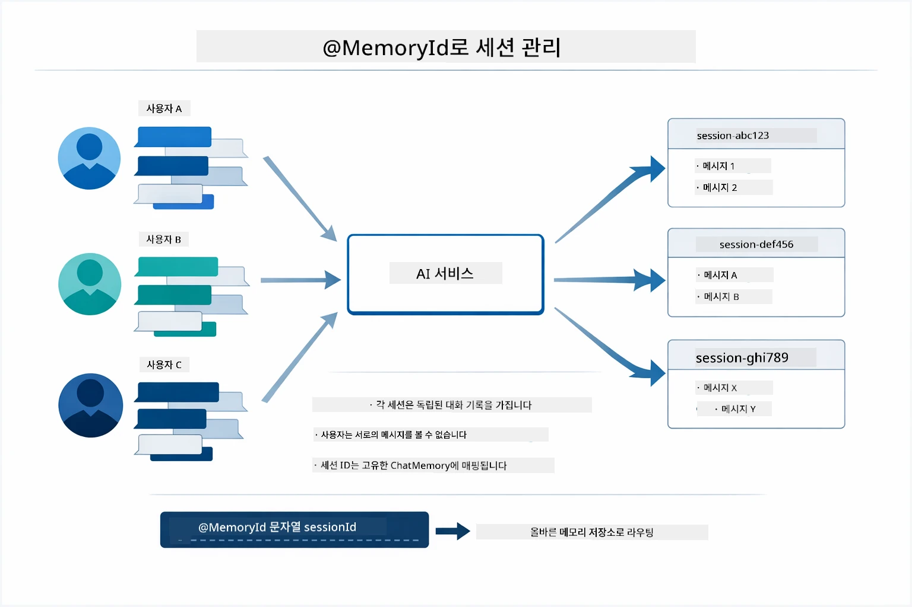

*각 세션 ID는 격리된 대화 기록에 매핑되어, 사용자의 메시지가 서로 보이지 않습니다.*

### 오류 처리

도구는 실패할 수 있습니다 — API 타임아웃, 잘못된 매개변수, 외부 서비스 장애 등. 운영 환경에서는 모델이 문제를 설명하거나 대안을 시도할 수 있도록 오류 처리가 필요합니다. 도구가 예외를 던지면 LangChain4j가 이를 잡아 모델에 오류 메시지를 피드백하며, 모델은 자연어로 문제를 설명할 수 있습니다.

## 사용 가능한 도구

아래 다이어그램은 구축할 수 있는 다양한 도구 생태계를 보여줍니다. 이 모듈은 날씨 및 온도 도구를 보여주지만 같은 `@Tool` 패턴은 데이터베이스 쿼리부터 결제 처리까지 모든 Java 메서드에 적용할 수 있습니다.

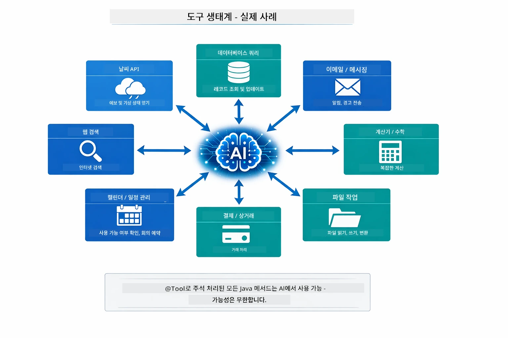

*@Tool 어노테이션이 적용된 모든 Java 메서드는 AI에 의해 사용 가능해지며, 이 패턴은 데이터베이스, API, 이메일, 파일 작업 등으로 확장됩니다.*

## 도구 기반 에이전트 사용 시기

모든 요청에 도구가 필요한 것은 아닙니다. AI가 외부 시스템과 상호작용해야 하는지, 아니면 자체 지식으로 응답할 수 있는지의 문제입니다. 다음 가이드는 도구가 가치가 있을 때와 불필요할 때를 요약합니다:

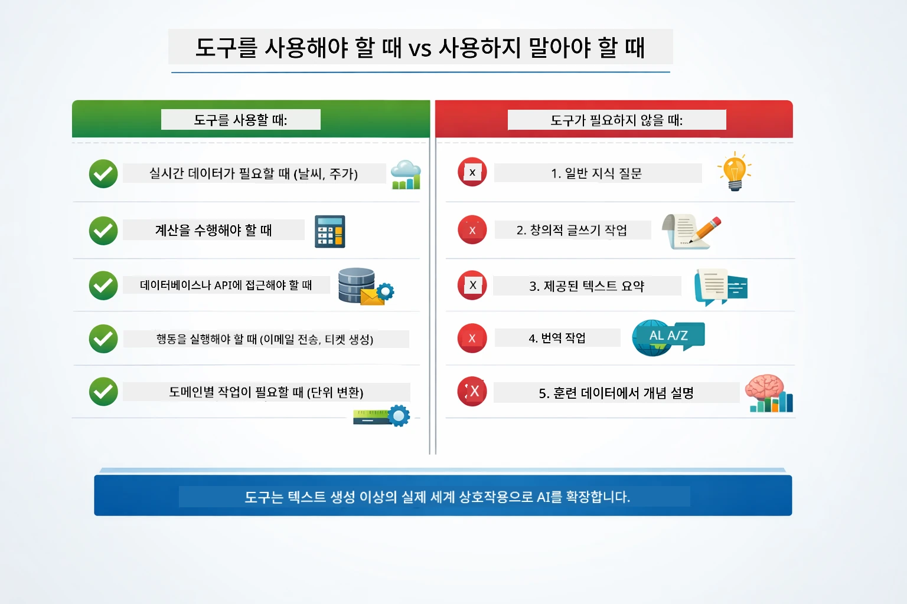

*빠른 결정 가이드 — 도구는 실시간 데이터, 계산, 작업에 사용되며 일반 지식이나 창의적 작업에는 필요하지 않습니다.*

## 도구 vs RAG

모듈 03과 04는 AI의 기능을 확장하지만 근본적으로 다른 방식입니다. RAG는 문서 검색을 통해 모델에 **지식** 접근을 허용합니다. 도구는 함수 호출을 통해 모델에 **행동** 수행 능력을 부여합니다. 아래 그림은 두 접근법을 나란히 비교하며 각 워크플로우와 장단점도 보여줍니다:

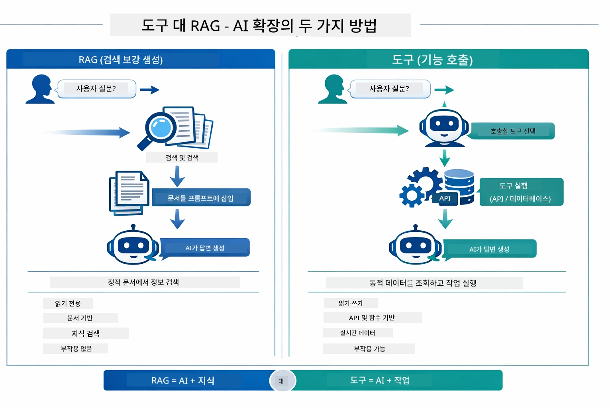

*RAG는 정적 문서에서 정보를 검색하고 — 도구는 작업을 실행하며 동적, 실시간 데이터를 가져옵니다. 많은 운영 시스템은 두 방식을 결합합니다.*

실제로 많은 운영 시스템은 두 방식을 결합해 사용합니다: RAG는 문서 기반 근거 제공용, 도구는 실시간 데이터 획득 및 작업 수행용입니다.

## 다음 단계

**다음 모듈:** [05-mcp - 모델 컨텍스트 프로토콜 (MCP)](../05-mcp/README.md)

---

**탐색:** [← 이전: 모듈 03 - RAG](../03-rag/README.md) | [메인으로 돌아가기](../README.md) | [다음: 모듈 05 - MCP →](../05-mcp/README.md)

---

<!-- CO-OP TRANSLATOR DISCLAIMER START -->
**면책 조항**:  
이 문서는 AI 번역 서비스 [Co-op Translator](https://github.com/Azure/co-op-translator)를 사용하여 번역되었습니다. 정확성을 위해 노력하고 있으나 자동 번역에는 오류나 부정확한 내용이 포함될 수 있음을 알려드립니다. 원문은 해당 언어의 원본 문서를 권위 있는 자료로 간주해야 합니다. 중요한 정보의 경우 전문 인간 번역을 권장합니다. 이 번역의 사용으로 인해 발생하는 어떠한 오해나 잘못된 해석에 대해서도 당사는 책임을 지지 않습니다.
<!-- CO-OP TRANSLATOR DISCLAIMER END -->