# Module 05: 모델 컨텍스트 프로토콜 (MCP)

## 목차

- [학습할 내용](../../../05-mcp)
- [MCP란?](../../../05-mcp)
- [MCP 작동 방식](../../../05-mcp)
- [에이전틱 모듈](../../../05-mcp)
- [예제 실행하기](../../../05-mcp)
  - [전제 조건](../../../05-mcp)
- [빠른 시작](../../../05-mcp)
  - [파일 작업 (Stdio)](../../../05-mcp)
  - [슈퍼바이저 에이전트](../../../05-mcp)
    - [데모 실행하기](../../../05-mcp)
    - [슈퍼바이저 작동 원리](../../../05-mcp)
    - [응답 전략](../../../05-mcp)
    - [출력 이해하기](../../../05-mcp)
    - [에이전틱 모듈 기능 설명](../../../05-mcp)
- [핵심 개념](../../../05-mcp)
- [축하합니다!](../../../05-mcp)
  - [다음 단계는?](../../../05-mcp)

## 학습할 내용

대화형 AI를 만들고, 프롬프트를 익히고, 문서에 근거한 응답을 만들고, 도구와 함께 작동하는 에이전트를 만들었습니다. 하지만 지금까지 모든 도구는 여러분의 특정 애플리케이션에 맞춘 맞춤형이었습니다. 만약 여러분의 AI가 누구나 만들고 공유할 수 있는 표준화된 도구 생태계에 접근할 수 있다면 어떨까요? 이 모듈에서는 바로 그 방법인 Model Context Protocol (MCP)와 LangChain4j의 에이전틱 모듈을 통해 이를 배우게 됩니다. 먼저 간단한 MCP 파일 리더를 보여주고, 그것이 어떻게 감독자 에이전트 패턴을 이용한 고급 에이전틱 워크플로우에 쉽게 통합되는지 설명합니다.

## MCP란?

Model Context Protocol (MCP)는 AI 애플리케이션이 외부 도구를 탐색하고 사용할 수 있는 표준 방식을 제공합니다. 각 데이터 소스나 서비스를 위해 맞춤형 통합 코드를 작성하는 대신, 일관된 형식으로 기능을 공개하는 MCP 서버에 연결합니다. 그러면 AI 에이전트가 자동으로 도구를 발견하고 사용할 수 있습니다.


*MCP 이전: 복잡한 포인트투포인트 통합. MCP 이후: 하나의 프로토콜, 무한한 가능성.*

MCP는 AI 개발의 근본적인 문제를 해결합니다: 모든 통합이 맞춤형이라는 점입니다. GitHub에 접근하려면? 맞춤 코드. 파일을 읽으려면? 맞춤 코드. 데이터베이스를 쿼리하려면? 맞춤 코드. 이 맞춤형 통합들은 다른 AI 애플리케이션과 호환되지 않습니다.

MCP는 이를 표준화합니다. MCP 서버는 명확한 설명과 스키마를 가진 도구를 공개합니다. 어떤 MCP 클라이언트든 연결하여 사용 가능한 도구를 발견하고 사용할 수 있습니다. 한 번 구축하면 어디서나 사용할 수 있습니다.


*Model Context Protocol 아키텍처 - 표준화된 도구 발견 및 실행*

## MCP 작동 방식

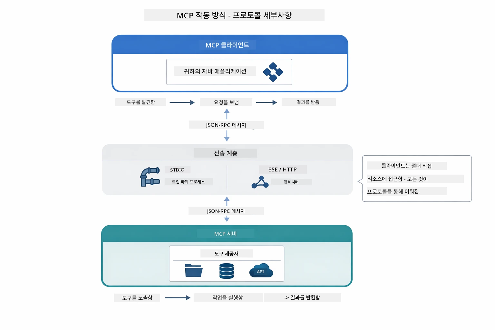

*MCP가 내부적으로 작동하는 방식 — 클라이언트가 도구를 발견하고 JSON-RPC 메시지를 교환하며 전송 계층을 통해 작업을 실행합니다.*

**서버-클라이언트 아키텍처**

MCP는 클라이언트-서버 모델을 사용합니다. 서버는 파일 읽기, 데이터베이스 쿼리, API 호출과 같은 도구를 제공합니다. 클라이언트(여러분의 AI 애플리케이션)는 서버에 연결해 그 도구들을 사용합니다.

LangChain4j에서 MCP를 사용하려면 다음 Maven 의존성을 추가하세요:

```xml
<dependency>
    <groupId>dev.langchain4j</groupId>
    <artifactId>langchain4j-mcp</artifactId>
    <version>${langchain4j.version}</version>
</dependency>
```

**도구 발견**

클라이언트가 MCP 서버에 연결하면 "사용 가능한 도구가 무엇인가요?"라고 묻습니다. 서버는 각 도구에 대한 설명과 매개변수 스키마를 포함한 도구 목록을 응답합니다. AI 에이전트는 사용자 요청에 따라 사용할 도구를 선택할 수 있습니다.

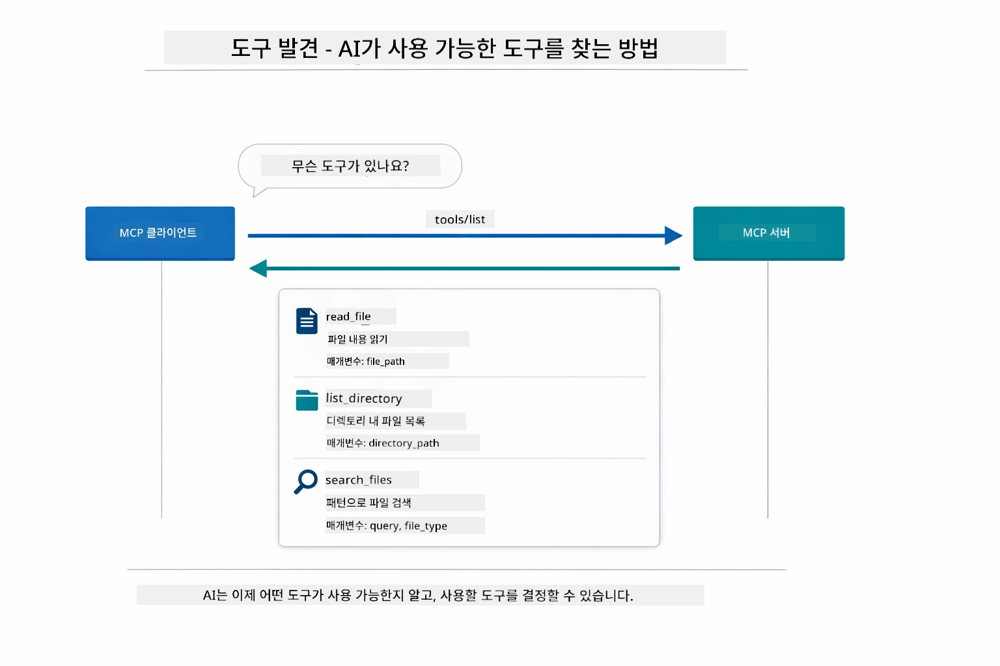

*AI가 시작 시 사용 가능한 도구를 발견 — 이제 어떤 기능이 있는지 파악하고 사용할 도구를 결정할 수 있습니다.*

**전송 메커니즘**

MCP는 다양한 전송 메커니즘을 지원합니다. 이 모듈에서는 로컬 프로세스를 위한 Stdio 전송 방식을 시연합니다:


*MCP 전송 메커니즘: 원격 서버용 HTTP, 로컬 프로세스용 Stdio*

**Stdio** - [StdioTransportDemo.java](../../../05-mcp/src/main/java/com/example/langchain4j/mcp/StdioTransportDemo.java)

로컬 프로세스를 위한 방식입니다. 애플리케이션이 서버를 하위 프로세스로 실행하고 표준 입력/출력을 통해 통신합니다. 파일 시스템 접근이나 커맨드라인 도구에 유용합니다.

```java
McpTransport stdioTransport = new StdioMcpTransport.Builder()
    .command(List.of(
        npmCmd, "exec",
        "@modelcontextprotocol/server-filesystem@2025.12.18",
        resourcesDir
    ))
    .logEvents(false)
    .build();
```

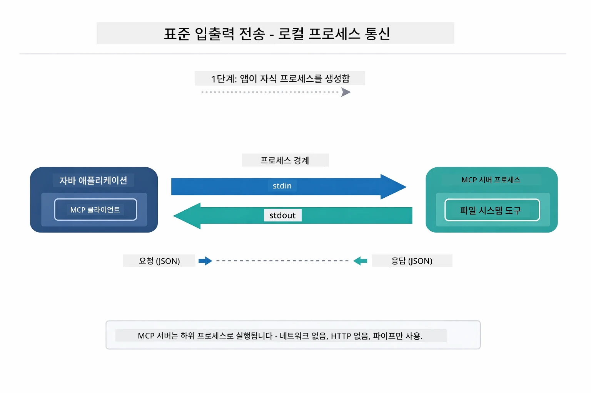

*Stdio 전송 실제 작동— 애플리케이션이 MCP 서버를 자식 프로세스로 실행하고 stdin/stdout 파이프를 통해 통신합니다.*

> **🤖 [GitHub Copilot](https://github.com/features/copilot) 챗으로 시도해보기:** [`StdioTransportDemo.java`](../../../05-mcp/src/main/java/com/example/langchain4j/mcp/StdioTransportDemo.java)를 열고 물어보세요:
> - "Stdio 전송은 어떻게 작동하며 HTTP와 언제 사용해야 하나요?"
> - "LangChain4j는 MCP 서버 프로세스의 라이프사이클을 어떻게 관리하나요?"
> - "AI에게 파일 시스템 접근 권한을 주는 보안상의 문제는 무엇인가요?"

## 에이전틱 모듈

MCP가 표준화된 도구를 제공하는 반면, LangChain4j의 **에이전틱 모듈**은 그런 도구들을 조율하는 에이전트를 선언적으로 구축할 수 있게 합니다. `@Agent` 애노테이션과 `AgenticServices`를 사용하면 명령형 코드가 아니라 인터페이스로 에이전트 행동을 정의할 수 있습니다.

이 모듈에서는 **슈퍼바이저 에이전트** 패턴을 탐구합니다 — 사용자의 요청에 따라 어떤 서브 에이전트를 호출할지 동적으로 결정하는 고급 에이전틱 AI 접근법입니다. MCP 기반 파일 접근 기능을 갖춘 서브 에이전트를 조합해 봅니다.

에이전틱 모듈을 사용하려면 다음 Maven 의존성을 추가하세요:

```xml
<dependency>
    <groupId>dev.langchain4j</groupId>
    <artifactId>langchain4j-agentic</artifactId>
    <version>${langchain4j.mcp.version}</version>
</dependency>
```

> **⚠️ 실험적:** `langchain4j-agentic` 모듈은 **실험 단계**이며 변경될 수 있습니다. 안정적인 AI 도우미 구축은 여전히 `langchain4j-core`와 맞춤 도구(모듈 04) 사용법이 권장됩니다.

## 예제 실행하기

### 전제 조건

- Java 21 이상, Maven 3.9 이상
- Node.js 16 이상 및 npm (MCP 서버용)
- `.env` 파일에 환경변수 설정 (루트 디렉토리 기준):
  - `AZURE_OPENAI_ENDPOINT`, `AZURE_OPENAI_API_KEY`, `AZURE_OPENAI_DEPLOYMENT` (모듈 01-04와 동일)

> **참고:** 환경변수를 설정하지 않았다면 [모듈 00 - 빠른 시작](../00-quick-start/README.md)을 참조하거나 루트 디렉토리에서 `.env.example` 파일을 `.env`로 복사한 후 값을 채우세요.

## 빠른 시작

**VS Code 사용 시:** 탐색기에서 아무 데모 파일 위에서 우클릭하고 **"Run Java"**를 선택하거나, 실행 및 디버그 패널에서 런치 구성을 사용하세요 (반드시 `.env` 파일에 토큰을 먼저 추가하세요).

**Maven 사용 시:** 아래 명령어로 커맨드라인에서 실행할 수 있습니다.

### 파일 작업 (Stdio)

로컬 하위 프로세스 기반 도구를 시연합니다.

**✅ 별도 전제 조건 없음** - MCP 서버가 자동으로 실행됩니다.

**시작 스크립트 사용 (권장):**

시작 스크립트는 루트 `.env` 파일에서 환경변수를 자동으로 로드합니다:

**Bash:**
```bash
cd 05-mcp
chmod +x start-stdio.sh
./start-stdio.sh
```

**PowerShell:**
```powershell
cd 05-mcp
.\start-stdio.ps1
```

**VS Code 사용 시:** `StdioTransportDemo.java`를 우클릭하여 **"Run Java"** 선택 (`.env` 파일이 설정되어 있어야 합니다).

애플리케이션이 자동으로 파일 시스템 MCP 서버를 실행하고 로컬 파일을 읽습니다. 하위 프로세스 관리가 어떻게 처리되는지 주목하세요.

**예상 출력:**
```
Assistant response: The file provides an overview of LangChain4j, an open-source Java library
for integrating Large Language Models (LLMs) into Java applications...
```

### 슈퍼바이저 에이전트

**슈퍼바이저 에이전트 패턴**은 **유연한** 에이전틱 AI 형태입니다. 슈퍼바이저는 LLM을 사용해 사용자 요청에 따라 호출할 에이전트를 자율적으로 결정합니다. 다음 예제에서는 MCP 기반 파일 접근과 LLM 에이전트를 결합해 파일 읽기 → 보고서 생성 워크플로우를 감독합니다.

데모에서 `FileAgent`는 MCP 파일 시스템 도구로 파일을 읽고, `ReportAgent`는 1문장 요약, 3가지 핵심 포인트, 권고사항이 포함된 구조화된 보고서를 생성합니다. 슈퍼바이저가 이 흐름을 자동으로 조율합니다:

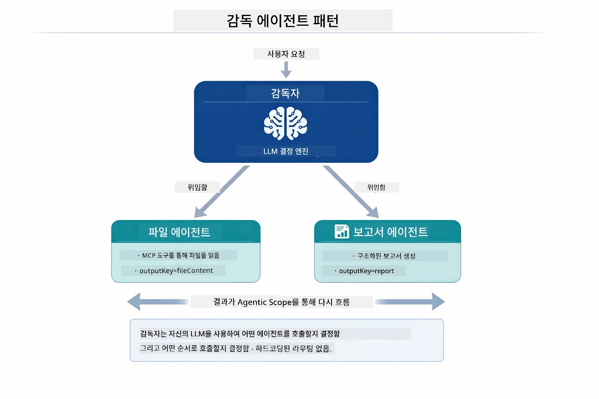

*슈퍼바이저는 LLM을 이용해 호출할 에이전트와 순서를 결정 — 하드코딩된 경로 설정이 필요 없습니다.*

파일 → 보고서 파이프라인의 구체적 워크플로우는 다음과 같습니다:

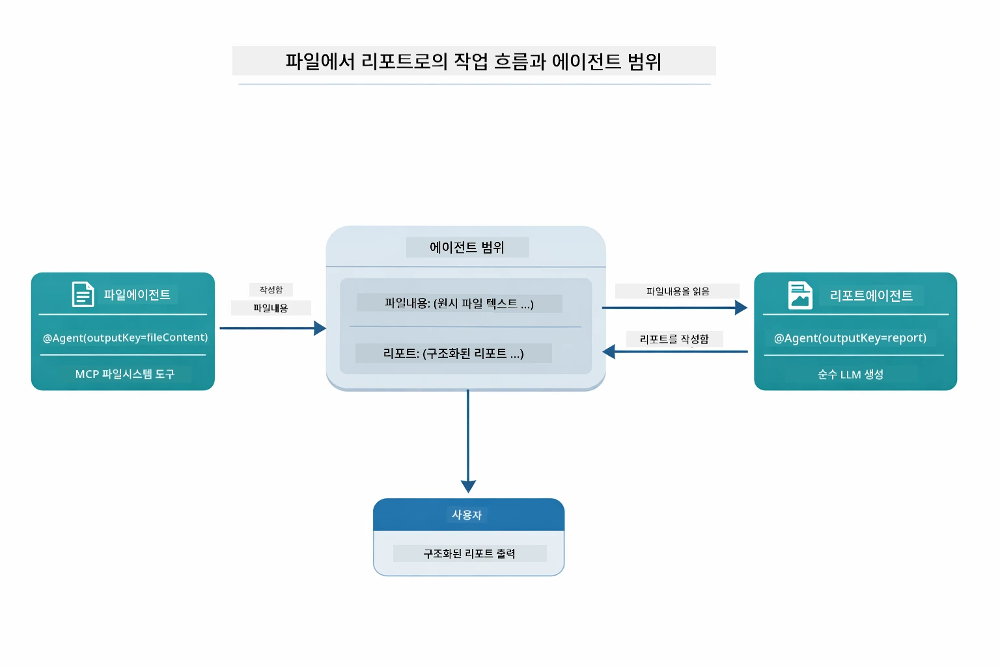

*FileAgent가 MCP 도구로 파일을 읽고, ReportAgent가 원시 내용을 구조화된 보고서로 변환합니다.*

각 에이전트는 결과를 **에이전틱 스코프**(공유 메모리)에 저장해, 이후 에이전트가 이전 결과에 접근할 수 있습니다. 이로써 MCP 도구가 에이전틱 워크플로우에 매끄럽게 통합됨을 보여줍니다 — 슈퍼바이저는 *파일이 어떻게 읽히는지*는 몰라도 `FileAgent`가 그 작업을 수행한다는 것만 알면 됩니다.

#### 데모 실행하기

시작 스크립트는 루트 `.env` 파일에서 환경변수를 자동으로 로드합니다:

**Bash:**
```bash
cd 05-mcp
chmod +x start-supervisor.sh
./start-supervisor.sh
```

**PowerShell:**
```powershell
cd 05-mcp
.\start-supervisor.ps1
```

**VS Code 사용 시:** `SupervisorAgentDemo.java`를 우클릭하여 **"Run Java"** 선택 (`.env` 파일이 설정되어 있어야 합니다).

#### 슈퍼바이저 작동 원리

```java
// 1단계: FileAgent는 MCP 도구를 사용하여 파일을 읽습니다
FileAgent fileAgent = AgenticServices.agentBuilder(FileAgent.class)
        .chatModel(model)
        .toolProvider(mcpToolProvider)  // 파일 작업을 위한 MCP 도구를 가지고 있습니다
        .build();

// 2단계: ReportAgent는 구조화된 보고서를 생성합니다
ReportAgent reportAgent = AgenticServices.agentBuilder(ReportAgent.class)
        .chatModel(model)
        .build();

// Supervisor는 파일 → 보고서 작업 흐름을 조율합니다
SupervisorAgent supervisor = AgenticServices.supervisorBuilder()
        .chatModel(model)
        .subAgents(fileAgent, reportAgent)
        .responseStrategy(SupervisorResponseStrategy.LAST)  // 최종 보고서를 반환합니다
        .build();

// Supervisor는 요청에 따라 호출할 에이전트를 결정합니다
String response = supervisor.invoke("Read the file at /path/file.txt and generate a report");
```

#### 응답 전략

`SupervisorAgent`를 구성할 때 서브 에이전트 작업 완료 후 최종 사용자 응답을 어떻게 생성할지 지정합니다.

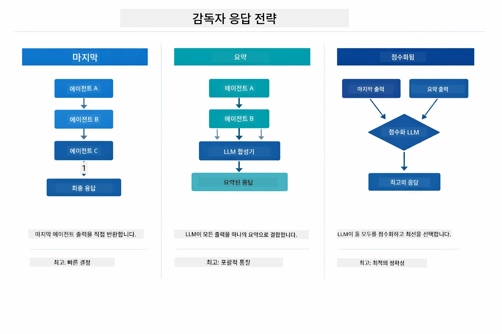

*슈퍼바이저가 최종 응답을 만드는 세 가지 전략 — 마지막 에이전트 출력, 종합 요약, 최고 점수 선택 중 원하는 것을 골라 사용하세요.*

전략 설명:

| 전략 | 설명 |
|----------|-------------|
| **LAST** | 작업 흐름의 마지막 서브 에이전트 또는 호출된 도구의 출력을 반환합니다. 최종 응답을 생성하는 에이전트가 명확할 때 유용합니다(예: 연구 파이프라인의 "요약 에이전트"). |
| **SUMMARY** | 슈퍼바이저가 내장된 LLM을 사용해 전체 상호작용과 서브 에이전트 출력물을 요약한 후, 이를 최종 응답으로 반환합니다. 사용자에게 깔끔하고 요약된 응답을 제공합니다. |
| **SCORED** | 시스템이 내장 LLM으로 LAST 응답과 SUMMARY를 사용자 원래 요청에 맞춰 점수화하여 더 높은 점수를 받은 출력을 반환합니다. |

전체 구현은 [SupervisorAgentDemo.java](../../../05-mcp/src/main/java/com/example/langchain4j/mcp/SupervisorAgentDemo.java)를 참조하세요.

> **🤖 [GitHub Copilot](https://github.com/features/copilot) 챗으로 시도해보기:** [`SupervisorAgentDemo.java`](../../../05-mcp/src/main/java/com/example/langchain4j/mcp/SupervisorAgentDemo.java)를 열고 물어보세요:
> - "슈퍼바이저는 어떤 에이전트를 호출할지 어떻게 결정하나요?"
> - "슈퍼바이저와 순차(workflow) 패턴의 차이점은 무엇인가요?"
> - "슈퍼바이저의 계획 동작을 어떻게 커스터마이즈할 수 있나요?"

#### 출력 이해하기

데모 실행 시 슈퍼바이저가 여러 에이전트를 조율하는 과정을 단계별로 볼 수 있습니다. 각 섹션이 의미하는 바는 다음과 같습니다:

```
======================================================================
  FILE → REPORT WORKFLOW DEMO
======================================================================

This demo shows a clear 2-step workflow: read a file, then generate a report.
The Supervisor orchestrates the agents automatically based on the request.
```

**헤더**는 워크플로우 개념을 소개합니다: 파일 읽기부터 보고서 생성까지 집중된 파이프라인.

```
--- WORKFLOW ---------------------------------------------------------
  ┌─────────────┐      ┌──────────────┐
  │  FileAgent  │ ───▶ │ ReportAgent  │
  │ (MCP tools) │      │  (pure LLM)  │
  └─────────────┘      └──────────────┘
   outputKey:           outputKey:
   'fileContent'        'report'

--- AVAILABLE AGENTS -------------------------------------------------
  [FILE]   FileAgent   - Reads files via MCP → stores in 'fileContent'
  [REPORT] ReportAgent - Generates structured report → stores in 'report'
```

**워크플로우 다이어그램**은 에이전트 간 데이터 흐름을 보여줍니다. 각각 역할이 명확합니다:
- **FileAgent**는 MCP 도구를 사용해 파일을 읽고 `fileContent`에 원시 내용을 저장
- **ReportAgent**는 해당 내용을 받아 구조화된 보고서를 `report`에 생성

```
--- USER REQUEST -----------------------------------------------------
  "Read the file at .../file.txt and generate a report on its contents"
```

**사용자 요청**은 작업 내용을 보여줍니다. 슈퍼바이저가 분석 후 FileAgent → ReportAgent 순으로 호출하기로 결정.

```
--- SUPERVISOR ORCHESTRATION -----------------------------------------
  The Supervisor decides which agents to invoke and passes data between them...

  +-- STEP 1: Supervisor chose -> FileAgent (reading file via MCP)
  |
  |   Input: .../file.txt
  |
  |   Result: LangChain4j is an open-source, provider-agnostic Java framework for building LLM...
  +-- [OK] FileAgent (reading file via MCP) completed

  +-- STEP 2: Supervisor chose -> ReportAgent (generating structured report)
  |
  |   Input: LangChain4j is an open-source, provider-agnostic Java framew...
  |
  |   Result: Executive Summary...
  +-- [OK] ReportAgent (generating structured report) completed
```

**슈퍼바이저 조율**은 2단계 흐름의 실제 동작을 보여줍니다:
1. **FileAgent**가 MCP를 통해 파일 읽기 및 내용 저장
2. **ReportAgent**가 내용을 받아 구조화된 보고서 생성

사용자 요청에 따라 슈퍼바이저가 **자율적으로** 결정을 내렸습니다.

```
--- FINAL RESPONSE ---------------------------------------------------
Executive Summary
...

Key Points
...

Recommendations
...

--- AGENTIC SCOPE (Data Flow) ----------------------------------------
  Each agent stores its output for downstream agents to consume:
  * fileContent: LangChain4j is an open-source, provider-agnostic Java framework...
  * report: Executive Summary...
```

#### 에이전틱 모듈 기능 설명

예제는 에이전틱 모듈의 여러 고급 기능을 보여줍니다. 에이전틱 스코프와 에이전트 리스너를 자세히 살펴봅시다.

**에이전틱 스코프**는 에이전트들이 `@Agent(outputKey="...")`를 써서 결과를 저장하는 공유 메모리입니다. 이를 통해:
- 이후 에이전트가 이전 에이전트의 출력을 접근 가능
- 슈퍼바이저가 최종 응답을 종합 가능
- 사용자가 각 에이전트가 무엇을 생성했는지 확인 가능

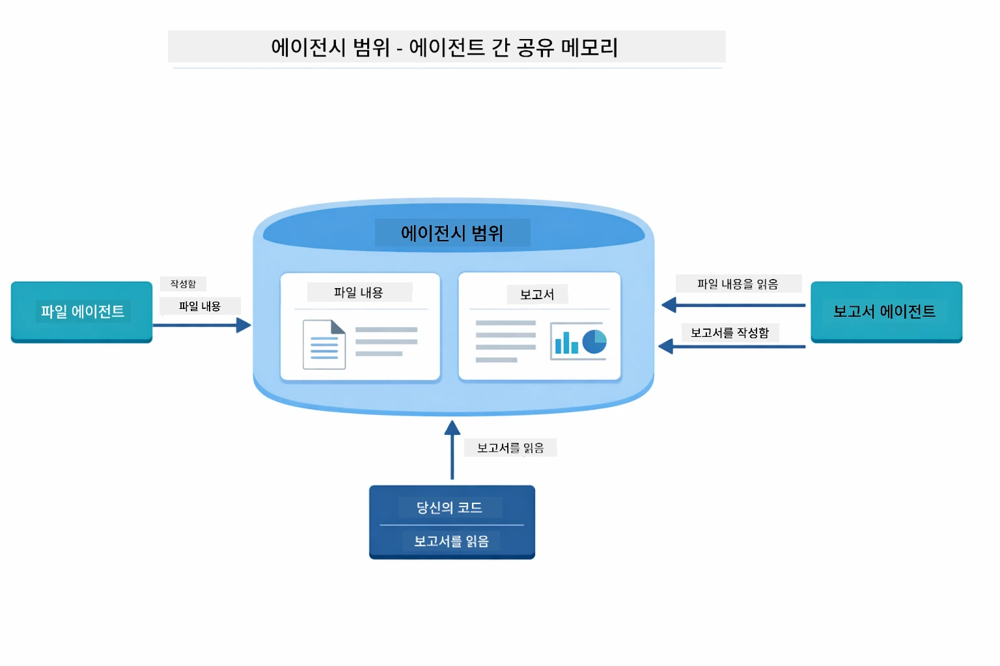

*에이전틱 스코프는 공유 메모리 역할 — FileAgent가 `fileContent`를 쓰고, ReportAgent가 읽어 `report`를 쓰며, 사용자는 최종 결과를 읽음.*

```java
ResultWithAgenticScope<String> result = supervisor.invokeWithAgenticScope(request);
AgenticScope scope = result.agenticScope();
String fileContent = scope.readState("fileContent");  // FileAgent의 원시 파일 데이터
String report = scope.readState("report");            // ReportAgent의 구조화된 보고서
```

**에이전트 리스너**는 에이전트 실행 모니터링과 디버깅을 가능하게 합니다. 데모에서 단계별 출력은 각 에이전트 호출에 후킹된 AgentListener가 출력한 것입니다.
- **beforeAgentInvocation** - Supervisor가 에이전트를 선택할 때 호출되며, 선택된 에이전트와 그 이유를 확인할 수 있습니다.
- **afterAgentInvocation** - 에이전트가 완료되면 호출되어 결과를 보여줍니다.
- **inheritedBySubagents** - true일 때, 리스너가 계층 내 모든 에이전트를 모니터링합니다.

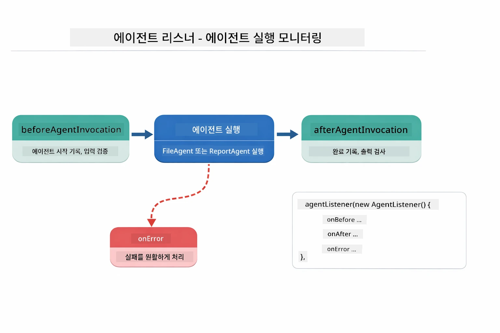

*에이전트 리스너는 실행 생명주기와 연결되어 — 에이전트가 시작되고 완료되거나 오류가 발생할 때 모니터링합니다.*

```java
AgentListener monitor = new AgentListener() {
    private int step = 0;
    
    @Override
    public void beforeAgentInvocation(AgentRequest request) {
        step++;
        System.out.println("  +-- STEP " + step + ": " + request.agentName());
    }
    
    @Override
    public void afterAgentInvocation(AgentResponse response) {
        System.out.println("  +-- [OK] " + response.agentName() + " completed");
    }
    
    @Override
    public boolean inheritedBySubagents() {
        return true; // 모든 하위 에이전트에 전파하기
    }
};
```

Supervisor 패턴을 넘어, `langchain4j-agentic` 모듈은 여러 강력한 워크플로 패턴과 기능을 제공합니다:

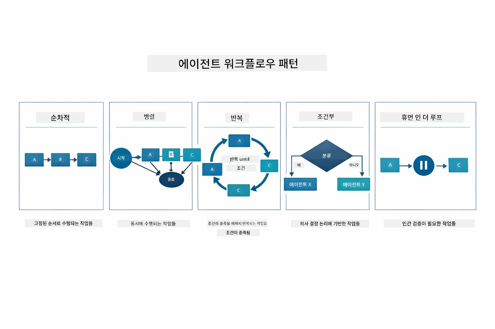

*에이전트 오케스트레이션을 위한 다섯 가지 워크플로 패턴 — 단순 순차 파이프라인부터 인간 참여 승인 워크플로까지.*

| 패턴 | 설명 | 사용 사례 |
|---------|-------------|----------|
| **순차** | 에이전트를 순서대로 실행, 출력이 다음으로 흐름 | 파이프라인: 조사 → 분석 → 보고 |
| **병렬** | 에이전트를 동시에 실행 | 독립 작업: 날씨 + 뉴스 + 주식 |
| **루프** | 조건 충족 시까지 반복 | 품질 점수: 점수 ≥ 0.8 될 때까지 개선 |
| **조건부** | 조건에 따라 경로 지정 | 분류 → 전문 에이전트로 라우팅 |
| **인간 참여** | 인간 체크포인트 추가 | 승인 워크플로, 콘텐츠 검토 |

## 핵심 개념

MCP와 agentic 모듈을 살펴본 후, 각 접근법을 언제 사용하는지 요약해봅니다.

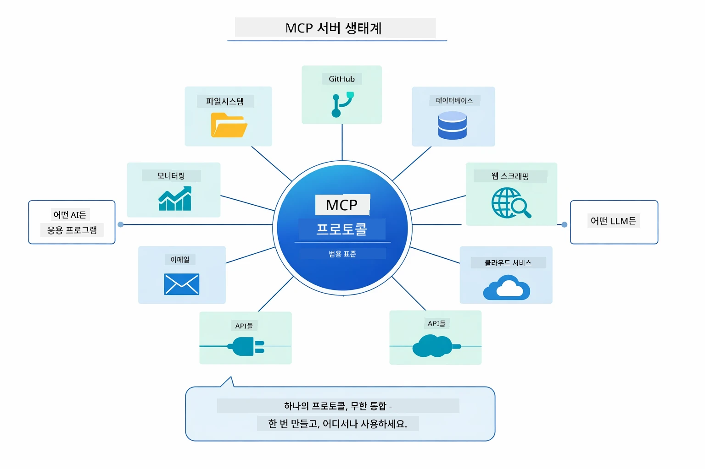

*MCP는 범용 프로토콜 생태계를 만듭니다 — 어떤 MCP 호환 서버도 어떤 MCP 호환 클라이언트와도 동작하여 애플리케이션 간 도구 공유가 가능합니다.*

**MCP**는 기존 도구 생태계를 활용하거나, 여러 애플리케이션에서 공유 가능한 도구를 만들거나, 표준 프로토콜로 타사 서비스를 통합하거나, 코드를 변경하지 않고 도구 구현을 교체할 때 이상적입니다.

**Agentic 모듈**은 `@Agent` 주석으로 선언적 에이전트를 정의하고, 워크플로 오케스트레이션(순차, 루프, 병렬)을 원하며, 명령형 코드보다 인터페이스 기반 에이전트 설계를 선호하거나, `outputKey`를 통해 출력을 공유하는 여러 에이전트를 결합할 때 가장 적합합니다.

**Supervisor 에이전트 패턴**은 워크플로가 사전에 예측 불가능하고 LLM이 결정해야 할 때, 여러 전문 에이전트의 동적 오케스트레이션이 필요할 때, 다양한 기능별 라우팅이 필요한 대화 시스템을 구축할 때, 가장 유연하고 적응력 있는 에이전트 행동을 원할 때 빛을 발합니다.

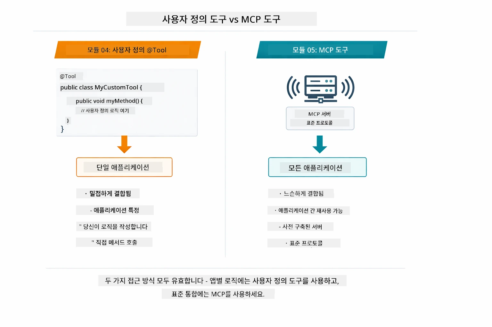

*언제 커스텀 @Tool 메서드를 사용하고 언제 MCP 도구를 사용할지 — 커스텀 도구는 앱별 로직과 완전한 타입 안전성을, MCP 도구는 애플리케이션 간 작동하는 표준화된 통합을 위해.*

## 축하합니다!

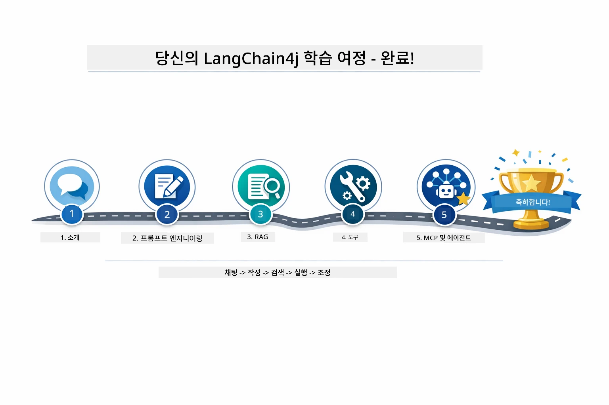

*기본 대화부터 MCP 지원 agentic 시스템까지 다섯 개 모듈을 통한 학습 여정.*

LangChain4j 입문 과정을 완료했습니다. 다음을 배웠습니다:

- 메모리 기반 대화 AI 구축 방법 (모듈 01)
- 다양한 작업을 위한 프롬프트 엔지니어링 패턴 (모듈 02)
- RAG로 문서 기반 응답 근거 만들기 (모듈 03)
- 커스텀 도구로 기본 AI 에이전트(어시스턴트) 생성 (모듈 04)
- LangChain4j MCP 및 Agentic 모듈로 표준화 도구 통합 (모듈 05)

### 다음 단계?

모듈 완료 후, [Testing Guide](../docs/TESTING.md)를 탐색하여 LangChain4j 테스트 개념을 직접 확인해 보세요.

**공식 자료:**
- [LangChain4j Documentation](https://docs.langchain4j.dev/) - 종합 가이드 및 API 참조
- [LangChain4j GitHub](https://github.com/langchain4j/langchain4j) - 소스 코드 및 예제
- [LangChain4j Tutorials](https://docs.langchain4j.dev/tutorials/) - 다양한 사용 사례 단계별 튜토리얼

이 과정을 완료해 주셔서 감사합니다!

---

**네비게이션:** [← 이전: 모듈 04 - 도구](../04-tools/README.md) | [메인으로 돌아가기](../README.md)

---

<!-- CO-OP TRANSLATOR DISCLAIMER START -->
**면책 조항**:  
이 문서는 AI 번역 서비스 [Co-op Translator](https://github.com/Azure/co-op-translator)를 사용하여 번역되었습니다. 정확성을 위해 최선을 다하고 있으나, 자동 번역은 오류나 부정확한 점이 포함될 수 있음을 유의해 주시기 바랍니다. 원본 문서가 권위 있는 출처로 간주되어야 합니다. 중요한 정보의 경우, 전문적인 인간 번역을 권장합니다. 본 번역의 사용으로 인해 발생하는 오해나 잘못된 해석에 대해 당사는 책임을 지지 않습니다.
<!-- CO-OP TRANSLATOR DISCLAIMER END -->