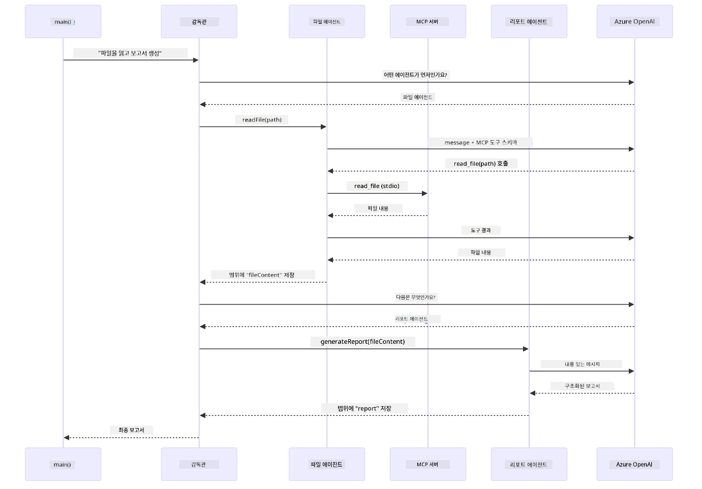

# Module 05: 모델 컨텍스트 프로토콜 (MCP)

## 목차

- [비디오 안내](../../../05-mcp)
- [배우게 될 내용](../../../05-mcp)
- [MCP란 무엇인가?](../../../05-mcp)
- [MCP 작동 원리](../../../05-mcp)
- [에이전트 모듈](../../../05-mcp)
- [예제 실행하기](../../../05-mcp)
  - [전제 조건](../../../05-mcp)
- [빠른 시작](../../../05-mcp)
  - [파일 작업 (Stdio)](../../../05-mcp)
  - [슈퍼바이저 에이전트](../../../05-mcp)
    - [데모 실행하기](../../../05-mcp)
    - [슈퍼바이저 작동 방식](../../../05-mcp)
    - [FileAgent가 런타임에 MCP 도구를 찾는 방법](../../../05-mcp)
    - [응답 전략](../../../05-mcp)
    - [출력 이해하기](../../../05-mcp)
    - [에이전트 모듈 기능 설명](../../../05-mcp)
- [핵심 개념](../../../05-mcp)
- [축하합니다!](../../../05-mcp)
  - [다음 단계는?](../../../05-mcp)

## 비디오 안내

이 모듈을 시작하는 방법을 설명하는 라이브 세션을 시청하세요:

<a href="https://www.youtube.com/watch?v=O_J30kZc0rw"></a>

## 배우게 될 내용

대화형 AI를 만들고, 프롬프트를 마스터하며, 문서에 근거한 응답을 생성하고 도구가 있는 에이전트를 만들었습니다. 하지만 지금까지의 도구들은 특정 애플리케이션을 위해 맞춤 제작된 것이었죠. 만약 누구나 만들고 공유할 수 있는 표준화된 도구 생태계에 당신의 AI를 연결할 수 있다면 어떨까요? 이 모듈에서는 바로 그 방법을 모델 컨텍스트 프로토콜(MCP)과 LangChain4j의 에이전트 모듈을 통해 배우게 됩니다. 먼저 간단한 MCP 파일 리더를 소개하고, 이를 Supervisor Agent 패턴으로 고급 에이전트 워크플로에 쉽게 통합하는 방법을 보여드립니다.

## MCP란 무엇인가?

모델 컨텍스트 프로토콜(MCP)은 바로 그 점을 제공합니다 — AI 애플리케이션이 외부 도구를 발견하고 사용하는 표준화된 방법입니다. 각 데이터 소스나 서비스에 대해 개별적인 통합 코드를 작성하는 대신, 기능을 일관된 형식으로 제공하는 MCP 서버에 연결하면 됩니다. AI 에이전트는 이 도구들을 자동으로 찾아서 사용할 수 있습니다.

아래 다이어그램은 차이를 보여줍니다 — MCP가 없으면 모든 통합이 맞춤형 포인트 투 포인트 연결이 필요하지만, MCP가 있으면 하나의 프로토콜이 앱과 모든 도구를 연결합니다:


*MCP 전: 복잡한 포인트 투 포인트 통합. MCP 후: 하나의 프로토콜, 무한한 가능성.*

MCP는 AI 개발에서 근본적인 문제를 해결합니다: 모든 통합이 맞춤형이라는 점입니다. GitHub에 접근하려면 맞춤 코드, 파일을 읽으려면 맞춤 코드, 데이터베이스를 쿼리하려면 맞춤 코드가 필요하고, 이러한 통합들은 다른 AI 애플리케이션과 호환되지 않습니다.

MCP는 이를 표준화합니다. MCP 서버는 명확한 설명과 스키마를 가진 도구를 노출합니다. 어떤 MCP 클라이언트든 연결하여 사용 가능한 도구를 발견하고 이용할 수 있습니다. 한 번 만들면 어디서든 사용 가능합니다.

아래 다이어그램은 이 아키텍처를 보여줍니다 — 하나의 MCP 클라이언트(당신의 AI 애플리케이션)가 여러 MCP 서버에 연결하고, 각각은 표준 프로토콜을 통해 자체 도구 집합을 노출합니다:


*모델 컨텍스트 프로토콜 아키텍처 - 표준화된 도구 발견 및 실행*

## MCP 작동 원리

내부적으로 MCP는 계층화된 아키텍처를 사용합니다. Java 애플리케이션(클라이언트)은 사용 가능한 도구를 발견하고, 전송 계층(Stdio 또는 HTTP)을 통해 JSON-RPC 요청을 전송합니다. MCP 서버는 작업을 실행하고 결과를 반환합니다. 다음 다이어그램은 이 프로토콜 각 계층을 자세히 보여줍니다:


*MCP 내부 작동 원리 — 클라이언트가 도구를 발견하고, JSON-RPC 메시지를 교환하며, 전송 계층을 통해 작업을 실행함.*

**서버-클라이언트 아키텍처**

MCP는 클라이언트-서버 모델을 사용합니다. 서버는 파일 읽기, 데이터베이스 쿼리, API 호출 등 도구를 제공합니다. 클라이언트(당신의 AI 애플리케이션)는 서버에 연결해 도구를 사용합니다.

LangChain4j에서 MCP를 사용하려면 다음 Maven 의존성을 추가하세요:

```xml
<dependency>
    <groupId>dev.langchain4j</groupId>
    <artifactId>langchain4j-mcp</artifactId>
    <version>${langchain4j.version}</version>
</dependency>
```

**도구 발견**

클라이언트가 MCP 서버에 연결하면 "어떤 도구를 가지고 있나요?"라고 묻습니다. 서버는 설명과 파라미터 스키마가 포함된 사용 가능한 도구 목록으로 응답합니다. AI 에이전트는 사용자 요청에 따라 사용할 도구를 결정할 수 있습니다. 아래 다이어그램은 이 핸드셰이크를 보여줍니다 — 클라이언트가 `tools/list` 요청을 보내면 서버가 도구 목록과 설명, 파라미터 스키마를 반환합니다:


*AI가 시작 시 사용 가능한 도구를 발견함 — 현재 어떤 기능을 사용할 수 있는지 알게 되어 어떤 도구를 사용할지 결정할 수 있습니다.*

**전송 메커니즘**

MCP는 다양한 전송 메커니즘을 지원합니다. 두 가지 옵션은 Stdio(로컬 하위 프로세스 통신용)와 스트리밍 HTTP(원격 서버용)입니다. 이 모듈에서는 Stdio 전송을 시연합니다:


*MCP 전송 메커니즘: 원격 서버용 HTTP, 로컬 프로세스용 Stdio*

**Stdio** - [StdioTransportDemo.java](../../../05-mcp/src/main/java/com/example/langchain4j/mcp/StdioTransportDemo.java)

로컬 프로세스용입니다. 애플리케이션이 하위 프로세스로 서버를 실행하고 표준 입력/출력을 통해 통신합니다. 파일시스템 접근이나 커맨드라인 도구에 유용합니다.

```java
McpTransport stdioTransport = new StdioMcpTransport.Builder()
    .command(List.of(
        npmCmd, "exec",
        "@modelcontextprotocol/server-filesystem@2025.12.18",
        resourcesDir
    ))
    .logEvents(false)
    .build();
```

`@modelcontextprotocol/server-filesystem` 서버는 다음 도구들을 노출하며, 모두 지정한 디렉터리로 샌드박스화되어 있습니다:

| 도구 | 설명 |
|------|-------------|
| `read_file` | 단일 파일 내용 읽기 |
| `read_multiple_files` | 한 번에 여러 파일 읽기 |
| `write_file` | 파일 생성 또는 덮어쓰기 |
| `edit_file` | 특정 부분 찾기 및 교체 편집 |
| `list_directory` | 경로의 파일 및 디렉터리 목록 나열 |
| `search_files` | 재귀적으로 패턴에 맞는 파일 검색 |
| `get_file_info` | 파일 메타데이터(크기, 시간, 권한) 조회 |
| `create_directory` | 디렉터리 생성(상위 디렉터리 포함) |
| `move_file` | 파일 또는 디렉터리 이동/이름 변경 |

다음 다이어그램은 Stdio 전송이 런타임에 어떻게 작동하는지 보여줍니다 — 당신의 Java 애플리케이션이 MCP 서버를 하위 프로세스로 실행하고 표준 입출력 파이프를 통해 통신하며 네트워크나 HTTP는 사용하지 않습니다:


*Stdio 전송의 실제 동작 — 애플리케이션이 MCP 서버를 하위 프로세스로 실행하고 표준 입출력 파이프를 통해 통신합니다.*

> **🤖 [GitHub Copilot](https://github.com/features/copilot) Chat으로 시도해 보세요:** [`StdioTransportDemo.java`](../../../05-mcp/src/main/java/com/example/langchain4j/mcp/StdioTransportDemo.java)를 열고 다음을 물어보세요:
> - "Stdio 전송은 어떻게 작동하며 HTTP와 언제 써야 하나요?"
> - "LangChain4j는 MCP 서버 프로세스의 라이프사이클을 어떻게 관리하나요?"
> - "AI에게 파일 시스템 접근 권한을 주는 것의 보안 문제는 무엇인가요?"

## 에이전트 모듈

MCP가 표준화된 도구를 제공하는 반면, LangChain4j의 **에이전트 모듈**은 이러한 도구를 조율하는 에이전트를 선언적으로 빌드하는 방법을 제공합니다. `@Agent` 애노테이션과 `AgenticServices`를 사용하면 명령형 코드 대신 인터페이스를 통해 에이전트 동작을 정의할 수 있습니다.

이 모듈에서는 **슈퍼바이저 에이전트** 패턴을 탐구합니다 — 사용자 요청에 따라 어떤 하위 에이전트를 호출할지 동적으로 결정하는 고급 에이전트 AI 접근법입니다. MCP 기반 파일 접근 기능을 갖춘 하위 에이전트 중 하나를 포함하여 이 두 개념을 결합합니다.

에이전트 모듈을 사용하려면 다음 Maven 의존성을 추가하세요:

```xml
<dependency>
    <groupId>dev.langchain4j</groupId>
    <artifactId>langchain4j-agentic</artifactId>
    <version>${langchain4j.mcp.version}</version>
</dependency>
```
> **참고:** `langchain4j-agentic` 모듈은 핵심 LangChain4j 라이브러리와 다른 일정으로 릴리스되므로 별도의 버전 속성(`langchain4j.mcp.version`)을 사용합니다.

> **⚠️ 실험적:** `langchain4j-agentic` 모듈은 **실험적**이며 변경될 수 있습니다. 안정적인 AI 어시스턴트 구축 방법은 여전히 `langchain4j-core`와 맞춤 도구(모듈 04)입니다.

## 예제 실행하기

### 전제 조건

- [모듈 04 - 도구](../04-tools/README.md) 완료 (이 모듈은 맞춤 도구 개념을 기반으로 하며 MCP 도구와 비교함)
- 루트 디렉터리에 Azure 자격증명이 포함된 `.env` 파일 (모듈 01에서 `azd up`으로 생성됨)
- Java 21+, Maven 3.9+
- Node.js 16+ 및 npm (MCP 서버용)

> **참고:** 아직 환경 변수를 설정하지 않았다면 [모듈 01 - 소개](../01-introduction/README.md)를 참조해 배포 지침을 따르세요 (`azd up`이 `.env` 파일을 자동 생성합니다). 또는 루트에 `.env.example`을 `.env`로 복사하고 값을 채우세요.

## 빠른 시작

**VS Code 사용 시:** 탐색기에서 데모 파일을 우클릭하고 **"Run Java"** 선택 또는 실행 및 디버그 패널에서 실행 구성 사용 (먼저 `.env` 파일에 Azure 자격증명이 설정되어 있어야 함).

**Maven 사용 시:** 아래 예제로 커맨드라인에서 실행할 수도 있습니다.

### 파일 작업 (Stdio)

로컬 하위 프로세스 기반 도구를 시연합니다.

**✅ 전제 조건 없음** - MCP 서버가 자동으로 실행됩니다.

**시작 스크립트 사용 (권장):**

시작 스크립트는 루트 `.env` 파일에서 환경 변수를 자동 로드합니다:

**Bash:**
```bash
cd 05-mcp
chmod +x start-stdio.sh
./start-stdio.sh
```

**PowerShell:**
```powershell
cd 05-mcp
.\start-stdio.ps1
```

**VS Code 사용:** `StdioTransportDemo.java`를 우클릭하고 **"Run Java"** 선택 (환경 변수 설정 확인).

애플리케이션이 파일시스템 MCP 서버를 자동으로 실행하고 로컬 파일을 읽습니다. 하위 프로세스 관리가 어떻게 처리되는지 주목하세요.

**예상 출력:**
```
Assistant response: The file provides an overview of LangChain4j, an open-source Java library
for integrating Large Language Models (LLMs) into Java applications...
```

### 슈퍼바이저 에이전트

**슈퍼바이저 에이전트 패턴**은 **유연한** 에이전트 AI 방식입니다. 슈퍼바이저는 LLM을 사용해 사용자 요청에 따라 호출할 에이전트를 자율적으로 결정합니다. 다음 예제에서는 MCP 파일 접근 기능과 LLM 에이전트를 결합하여 자동으로 파일 읽기 → 보고서 생성 워크플로를 만듭니다.

데모에서 `FileAgent`는 MCP 파일시스템 도구를 사용해 파일을 읽고, `ReportAgent`는 실행 요약(한 문장), 주요 내용 3가지, 권고사항이 포함된 구조화된 보고서를 생성합니다. 슈퍼바이저가 이 흐름을 자동으로 조율합니다:


*슈퍼바이저는 LLM을 사용해 호출할 에이전트와 순서를 결정 — 하드코딩된 경로 지정 불필요.*

파일 → 보고서 파이프라인의 구체적 워크플로는 다음과 같습니다:


*FileAgent는 MCP 도구를 통해 파일을 읽고, ReportAgent는 원시 내용을 구조화된 보고서로 변환합니다.*

다음 시퀀스 다이어그램은 전체 슈퍼바이저 조율 과정을 추적합니다 — MCP 서버 실행, 슈퍼바이저의 자율적 에이전트 선택, stdio를 통한 도구 호출, 최종 보고서 생성까지:



*슈퍼바이저는 자율적으로 FileAgent를 호출(파일 읽기를 위해 MCP 서버에 stdio 통해 요청), 이어 ReportAgent를 호출해 구조화된 보고서를 생성 — 각 에이전트는 공유된 Agentic Scope에 출력을 저장함.*

각 에이전트는 **Agentic Scope**(공유 메모리)에 출력을 저장하여 후속 에이전트가 이전 결과에 접근할 수 있도록 합니다. 이는 MCP 도구가 에이전트 워크플로에 원활히 통합되는 방법을 보여줍니다 — 슈퍼바이저는 파일이 어떻게 읽히는지 몰라도 `FileAgent`가 그 일을 할 수 있음을 알고 있습니다.

#### 데모 실행하기

시작 스크립트는 루트 `.env` 파일에서 환경 변수를 자동 로드합니다:

**Bash:**
```bash
cd 05-mcp
chmod +x start-supervisor.sh
./start-supervisor.sh
```

**PowerShell:**
```powershell
cd 05-mcp
.\start-supervisor.ps1
```

**VS Code 사용:** `SupervisorAgentDemo.java`를 우클릭하고 **"Run Java"** 선택 (환경 변수 설정 확인).

#### 슈퍼바이저 작동 방식

에이전트를 빌드하기 전에 MCP 전송을 클라이언트에 연결하고 `ToolProvider`로 감싸야 합니다. 이렇게 하면 MCP 서버의 도구를 에이전트가 사용할 수 있습니다:

```java
// 전송에서 MCP 클라이언트를 생성합니다
McpClient mcpClient = new DefaultMcpClient.Builder()
        .transport(stdioTransport)
        .build();

// 클라이언트를 ToolProvider로 래핑합니다 — 이는 MCP 도구를 LangChain4j에 연결합니다
ToolProvider mcpToolProvider = McpToolProvider.builder()
        .mcpClients(List.of(mcpClient))
        .build();
```

이제 MCP 도구가 필요한 에이전트에 `mcpToolProvider`를 주입할 수 있습니다:

```java
// 1단계: FileAgent가 MCP 도구를 사용하여 파일을 읽음
FileAgent fileAgent = AgenticServices.agentBuilder(FileAgent.class)
        .chatModel(model)
        .toolProvider(mcpToolProvider)  // 파일 작업을 위한 MCP 도구를 보유함
        .build();

// 2단계: ReportAgent가 구조화된 보고서를 생성함
ReportAgent reportAgent = AgenticServices.agentBuilder(ReportAgent.class)
        .chatModel(model)
        .build();

// Supervisor가 파일 → 보고서 작업 흐름을 조정함
SupervisorAgent supervisor = AgenticServices.supervisorBuilder()
        .chatModel(model)
        .subAgents(fileAgent, reportAgent)
        .responseStrategy(SupervisorResponseStrategy.LAST)  // 최종 보고서를 반환함
        .build();

// Supervisor는 요청에 따라 호출할 에이전트를 결정함
String response = supervisor.invoke("Read the file at /path/file.txt and generate a report");
```

#### FileAgent가 런타임에 MCP 도구를 찾는 방법

궁금할 수 있습니다: **FileAgent는 어떻게 npm 파일시스템 도구 사용법을 알까요?** 답은 모릅니다 — **LLM**이 도구 스키마를 통해 런타임에 파악합니다.
`FileAgent` 인터페이스는 단지 **프롬프트 정의**일 뿐입니다. `read_file`, `list_directory` 또는 기타 MCP 도구에 대한 하드코딩된 지식이 전혀 없습니다. 엔드 투 엔드로 일어나는 일은 다음과 같습니다:

1. **서버 시작:** `StdioMcpTransport`가 `@modelcontextprotocol/server-filesystem` npm 패키지를 자식 프로세스로 실행합니다
2. **도구 탐색:** `McpClient`가 서버에 `tools/list` JSON-RPC 요청을 보내면, 서버는 도구 이름, 설명 및 파라미터 스키마(예: `read_file` — *"파일의 전체 내용을 읽음"* — `{ path: string }`)를 응답합니다
3. **스키마 주입:** `McpToolProvider`가 이 탐색된 스키마들을 래핑하여 LangChain4j에 제공됩니다
4. **LLM 결정:** `FileAgent.readFile(path)` 호출 시, LangChain4j가 시스템 메시지, 사용자 메시지, **그리고 도구 스키마 목록**을 LLM에 보냅니다. LLM은 도구 설명을 읽고 도구 호출을 생성합니다(예: `read_file(path="/some/file.txt")`)
5. **실행:** LangChain4j가 도구 호출을 가로채 MCP 클라이언트를 통해 Node.js 하위 프로세스로 라우팅하고 결과를 받아 LLM에 다시 전달합니다

이는 위에서 설명한 동일한 [도구 탐색](../../../05-mcp) 메커니즘이지만, 에이전트 워크플로우에 구체적으로 적용된 것입니다. `@SystemMessage`와 `@UserMessage` 주석이 LLM의 동작을 안내하고, 주입된 `ToolProvider`가 **기능**을 부여합니다 — LLM은 런타임에 둘을 연결합니다.

> **🤖 [GitHub Copilot](https://github.com/features/copilot) Chat으로 시도해보세요:** [`FileAgent.java`](../../../05-mcp/src/main/java/com/example/langchain4j/mcp/agents/FileAgent.java) 파일을 열고 다음 질문을 해보세요:
> - "이 에이전트가 어떤 MCP 도구를 호출하는지 어떻게 아나요?"
> - "에이전트 빌더에서 ToolProvider를 제거하면 무슨 일이 발생하나요?"
> - "도구 스키마는 어떻게 LLM에 전달되나요?"

#### 응답 전략

`SupervisorAgent`를 구성할 때, 서브 에이전트들이 작업을 완료한 후 사용자에게 최종 답변을 어떻게 작성할지 지정합니다. 아래 다이어그램은 사용 가능한 세 가지 전략을 보여줍니다 — LAST는 마지막 에이전트 출력을 직접 반환하고, SUMMARY는 모든 출력을 LLM으로 종합하며, SCORED는 원 요청에 대해 더 높은 점수를 받은 출력을 택합니다:


*Supervisor가 최종 응답을 구성하는 세 가지 전략 — 마지막 에이전트 출력, 종합 요약, 또는 최고 점수 중 선택할 수 있습니다.*

사용 가능한 전략은 다음과 같습니다:

| 전략 | 설명 |
|----------|-------------|
| **LAST** | 감독자는 마지막으로 호출된 서브 에이전트 또는 도구의 출력을 반환합니다. 이는 연구 파이프라인의 "요약 에이전트"처럼 최종 에이전트가 완전한 답변을 생성하도록 설계된 경우에 유용합니다. |
| **SUMMARY** | 감독자는 자체 내부 LLM을 사용해 전체 상호작용과 모든 서브 에이전트 출력을 요약하고, 이를 최종 응답으로 반환합니다. 사용자에게 깔끔하고 집계된 답변을 제공합니다. |
| **SCORED** | 시스템은 내부 LLM으로 LAST 응답과 SUMMARY를 원래 사용자 요청에 대해 평가한 후 더 높은 점수를 받은 결과를 반환합니다. |

전체 구현은 [SupervisorAgentDemo.java](../../../05-mcp/src/main/java/com/example/langchain4j/mcp/SupervisorAgentDemo.java)를 참조하세요.

> **🤖 [GitHub Copilot](https://github.com/features/copilot) Chat으로 시도해보세요:** [`SupervisorAgentDemo.java`](../../../05-mcp/src/main/java/com/example/langchain4j/mcp/SupervisorAgentDemo.java)를 열고 다음 질문을 해보세요:
> - "Supervisor가 어떤 에이전트를 호출할지 어떻게 결정하나요?"
> - "Supervisor와 Sequential 워크플로우 패턴의 차이는 무엇인가요?"
> - "Supervisor의 계획 동작을 어떻게 맞춤 설정할 수 있나요?"

#### 출력 이해하기

데모 실행 시, Supervisor가 여러 에이전트를 어떻게 조율하는지 구조화된 진행 과정을 볼 수 있습니다. 각 섹션의 의미는 다음과 같습니다:

```
======================================================================
  FILE → REPORT WORKFLOW DEMO
======================================================================

This demo shows a clear 2-step workflow: read a file, then generate a report.
The Supervisor orchestrates the agents automatically based on the request.
```
  
**헤더**는 파일 읽기부터 보고서 생성까지 집중된 파이프라인 개념을 소개합니다.

```
--- WORKFLOW ---------------------------------------------------------
  ┌─────────────┐      ┌──────────────┐
  │  FileAgent  │ ───▶ │ ReportAgent  │
  │ (MCP tools) │      │  (pure LLM)  │
  └─────────────┘      └──────────────┘
   outputKey:           outputKey:
   'fileContent'        'report'

--- AVAILABLE AGENTS -------------------------------------------------
  [FILE]   FileAgent   - Reads files via MCP → stores in 'fileContent'
  [REPORT] ReportAgent - Generates structured report → stores in 'report'
```
  
**워크플로우 다이어그램**은 에이전트 간 데이터 흐름을 보여줍니다. 각 에이전트는 특정 역할을 가집니다:  
- **FileAgent**는 MCP 도구를 사용해 파일을 읽고 원시 콘텐츠를 `fileContent`에 저장  
- **ReportAgent**는 그 콘텐츠를 활용해 구조화된 보고서를 `report`에 생성

```
--- USER REQUEST -----------------------------------------------------
  "Read the file at .../file.txt and generate a report on its contents"
```
  
**사용자 요청**은 작업을 보여줍니다. Supervisor가 이를 파싱하고 FileAgent → ReportAgent 순으로 호출을 결정합니다.

```
--- SUPERVISOR ORCHESTRATION -----------------------------------------
  The Supervisor decides which agents to invoke and passes data between them...

  +-- STEP 1: Supervisor chose -> FileAgent (reading file via MCP)
  |
  |   Input: .../file.txt
  |
  |   Result: LangChain4j is an open-source, provider-agnostic Java framework for building LLM...
  +-- [OK] FileAgent (reading file via MCP) completed

  +-- STEP 2: Supervisor chose -> ReportAgent (generating structured report)
  |
  |   Input: LangChain4j is an open-source, provider-agnostic Java framew...
  |
  |   Result: Executive Summary...
  +-- [OK] ReportAgent (generating structured report) completed
```
  
**Supervisor 조율**은 2단계 흐름 작동을 보여줍니다:  
1. **FileAgent**가 MCP를 통해 파일을 읽고 내용을 저장  
2. **ReportAgent**가 콘텐츠를 받아 구조화된 보고서를 생성

Supervisor는 사용자의 요청에 기반해 **자율적으로** 이러한 결정을 내렸습니다.

```
--- FINAL RESPONSE ---------------------------------------------------
Executive Summary
...

Key Points
...

Recommendations
...

--- AGENTIC SCOPE (Data Flow) ----------------------------------------
  Each agent stores its output for downstream agents to consume:
  * fileContent: LangChain4j is an open-source, provider-agnostic Java framework...
  * report: Executive Summary...
```
  
#### Agentic 모듈 기능 설명

예시는 agentic 모듈의 여러 고급 기능을 보여줍니다. Agentic Scope와 Agent Listeners에 좀 더 주목해 봅시다.

**Agentic Scope**는 에이전트가 `@Agent(outputKey="...")`를 사용해 결과를 저장하는 공유 메모리 공간입니다. 이 공간을 통해:  
- 이후 에이전트가 이전 에이전트의 출력을 접근  
- Supervisor가 최종 응답을 종합  
- 개발자가 각 에이전트 결과를 확인할 수 있습니다  

아래 다이어그램은 파일→보고서 워크플로우에서 Agentic Scope가 공유 메모리로 작동하는 방식을 보입니다 — FileAgent는 `fileContent` 키로 출력을 쓰고 ReportAgent는 이를 읽어 `report` 키에 자신의 출력을 기록:


*Agentic Scope는 공유 메모리 역할을 합니다 — FileAgent는 `fileContent`를 쓰고, ReportAgent는 이를 읽고 `report`를 쓰며, 최종 결과는 코드가 읽습니다.*

```java
ResultWithAgenticScope<String> result = supervisor.invokeWithAgenticScope(request);
AgenticScope scope = result.agenticScope();
String fileContent = scope.readState("fileContent");  // FileAgent로부터의 원시 파일 데이터
String report = scope.readState("report");            // ReportAgent로부터의 구조화된 보고서
```
  
**Agent Listeners**는 에이전트 실행 중 모니터링과 디버깅을 가능하게 합니다. 데모에서 보이는 단계별 출력은 각 에이전트 호출에 훅을 거는 AgentListener에서 나옵니다:  
- **beforeAgentInvocation** - Supervisor가 에이전트를 선택할 때 호출되어 어떤 에이전트가 왜 선택됐는지 알 수 있습니다  
- **afterAgentInvocation** - 에이전트가 완료되면 호출되어 결과를 보여줍니다  
- **inheritedBySubagents** - true일 때 계층 구조 내 모든 에이전트를 모니터링합니다  

아래 다이어그램은 전체 Agent Listener 라이프사이클과, `onError`가 에이전트 실행 중 실패를 처리하는 방식을 보여줍니다:


*Agent Listeners는 실행 라이프사이클에 훅 걸어 에이전트 시작, 완료, 오류 시점을 모니터링합니다.*

```java
AgentListener monitor = new AgentListener() {
    private int step = 0;
    
    @Override
    public void beforeAgentInvocation(AgentRequest request) {
        step++;
        System.out.println("  +-- STEP " + step + ": " + request.agentName());
    }
    
    @Override
    public void afterAgentInvocation(AgentResponse response) {
        System.out.println("  +-- [OK] " + response.agentName() + " completed");
    }
    
    @Override
    public boolean inheritedBySubagents() {
        return true; // 모든 하위 에이전트에게 전파하세요
    }
};
```
  
Supervisor 패턴 외에도, `langchain4j-agentic` 모듈은 여러 강력한 워크플로우 패턴을 제공합니다. 아래 다이어그램은 간단한 순차 파이프라인부터 사람의 승인 흐름까지 다섯 가지를 보여줍니다:


*에이전트를 조율하는 다섯 가지 워크플로우 패턴 — 간단한 순차 파이프라인부터 사람 승인 워크플로우까지.*

| 패턴 | 설명 | 사용 사례 |
|---------|-------------|----------|
| **Sequential** | 에이전트를 순서대로 실행하며 출력을 다음으로 넘김 | 파이프라인: 연구 → 분석 → 보고서 작성 |
| **Parallel** | 에이전트를 동시에 실행 | 독립 작업: 날씨 + 뉴스 + 주식 |
| **Loop** | 조건 충족 시까지 반복 | 품질 점수: 점수가 0.8 이상 될 때까지 개선 |
| **Conditional** | 조건에 따라 경로 지정 | 분류 → 전문 에이전트로 라우팅 |
| **Human-in-the-Loop** | 인간 검토 단계 추가 | 승인 워크플로우, 콘텐츠 리뷰 |

## 주요 개념

MCP와 agentic 모듈을 실제로 체험한 후, 각 방식을 언제 사용하는지 요약합니다.

MCP의 가장 큰 장점 중 하나는 성장하는 생태계입니다. 아래 다이어그램은 단일 범용 프로토콜이 다양한 MCP 서버와 AI 애플리케이션을 연결하는 방식을 보여줍니다 — 파일시스템 및 데이터베이스 접근부터 GitHub, 이메일, 웹 스크래핑 등 다양한 서비스 포함:


*MCP는 범용 프로토콜 생태계를 만듭니다 — MCP 호환 서버와 클라이언트는 도구를 공유하며 애플리케이션 간 연동이 가능합니다.*

**MCP**는 기존 도구 생태계를 활용하거나, 여러 애플리케이션이 공유 가능한 도구를 구축하거나, 표준 프로토콜로 서드파티 서비스를 통합하거나, 코드 변경 없이 도구 구현을 교체할 때 적합합니다.

**Agentic 모듈**은 `@Agent` 주석을 사용해 선언적 에이전트를 정의하고 싶거나, 순차, 루프, 병렬과 같은 워크플로우 조율이 필요하거나, 인터페이스 기반 에이전트 설계를 선호하거나, 여러 에이전트가 `outputKey`로 출력을 공유할 때 최적입니다.

**Supervisor Agent 패턴**은 워크플로우가 사전에 예측 불가능할 때 LLM에게 결정을 맡기고, 여러 특화 에이전트의 동적 조율이 필요하거나, 다양한 기능으로 라우팅하는 대화 시스템을 만들 때, 가장 유연하고 적응력 있는 에이전트 행동이 필요할 때 빛납니다.

Module 04의 커스텀 `@Tool` 메서드와 이번 모듈의 MCP 도구 중 어떤 것을 선택할지 결정할 때 주요 트레이드오프를 비교하면 다음과 같습니다 — 커스텀 도구는 앱 특화 로직에 강한 결합도와 완전한 타입 안전성을 제공하고, MCP 도구는 표준화된 재사용 가능 통합을 제공합니다:


*커스텀 @Tool 메서드와 MCP 도구를 언제 사용할지 — 앱 특화 로직엔 커스텀 도구, 여러 애플리케이션에서 쓰는 표준 통합엔 MCP 도구.*

## 축하합니다!

LangChain4j 초심자 과정을 다섯 모듈 모두 완료하셨습니다! 기본 대화부터 MCP 기반 agentic 시스템까지의 전체 학습 여정을 살펴보세요:


*기본 대화부터 MCP 기반 agentic 시스템까지 다섯 모듈 전체 학습 여정.*

수강을 마치면서 다음을 배웠습니다:

- 메모리를 갖춘 대화형 AI 구축법 (모듈 01)  
- 다양한 작업용 프롬프트 엔지니어링 패턴 (모듈 02)  
- 문서 기반 반응 근거 생성 RAG (모듈 03)  
- 커스텀 도구를 활용한 기본 AI 에이전트 생성 (모듈 04)  
- LangChain4j MCP 및 Agentic 모듈을 활용한 표준화 도구 통합 (모듈 05)  

### 다음 단계?

모듈을 마친 후 [테스트 가이드](../docs/TESTING.md)를 살펴보며 LangChain4j 테스트 개념을 실습해 보세요.

**공식 자료:**  
- [LangChain4j 문서](https://docs.langchain4j.dev/) — 종합 가이드 및 API 참고  
- [LangChain4j GitHub](https://github.com/langchain4j/langchain4j) — 소스 코드 및 예제  
- [LangChain4j 튜토리얼](https://docs.langchain4j.dev/tutorials/) — 다양한 사용 사례별 단계별 튜토리얼  

수강해 주셔서 감사합니다!

---

**이동:** [← 이전: 모듈 04 - 도구](../04-tools/README.md) | [메인으로 돌아가기](../README.md)

---

<!-- CO-OP TRANSLATOR DISCLAIMER START -->
**면책 조항**:  
이 문서는 AI 번역 서비스 [Co-op Translator](https://github.com/Azure/co-op-translator)를 사용하여 번역되었습니다. 정확성을 위해 최선을 다하고 있으나, 자동 번역에는 오류나 부정확성이 포함될 수 있음을 양지하시기 바랍니다. 원문 문서가 권위 있는 출처로 간주되어야 합니다. 중요한 정보의 경우 전문적인 인간 번역을 권장합니다. 본 번역 사용으로 인한 오해나 잘못된 해석에 대해 당사는 책임을 지지 않습니다.
<!-- CO-OP TRANSLATOR DISCLAIMER END -->