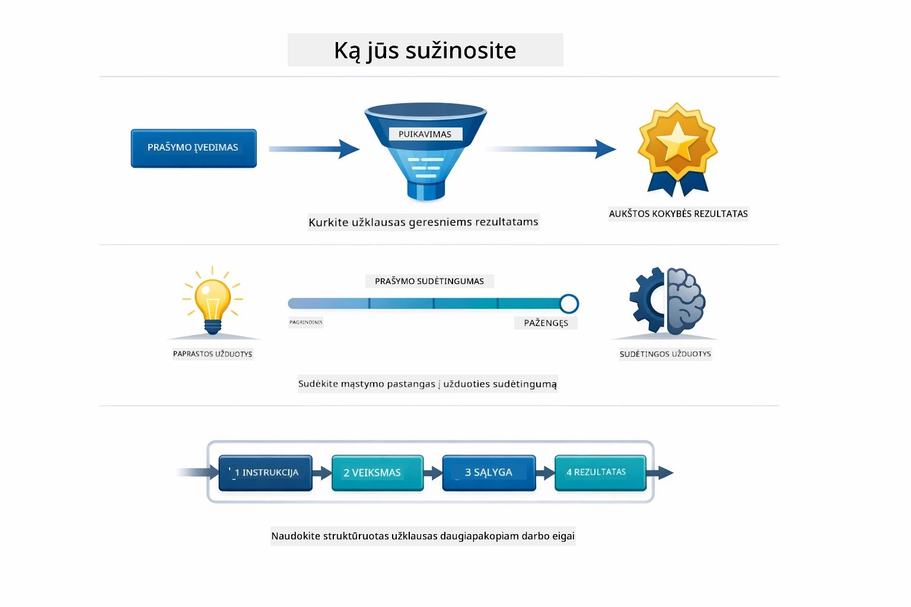
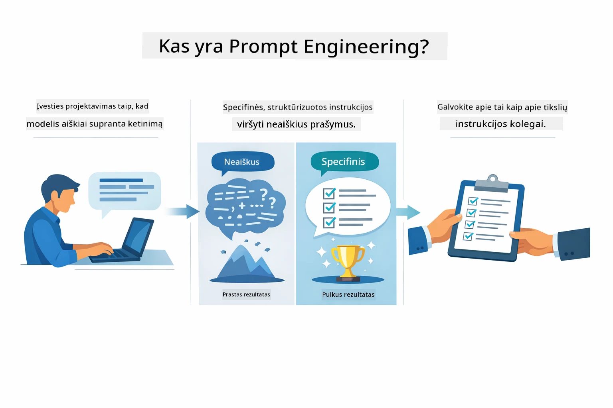
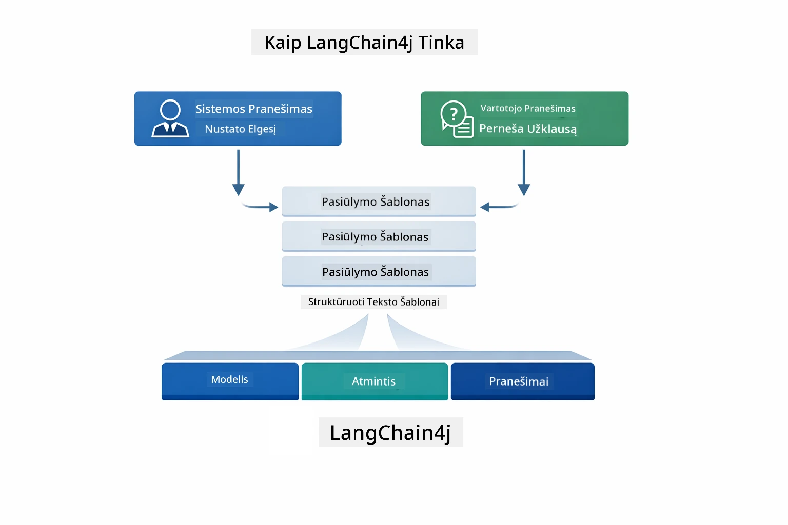
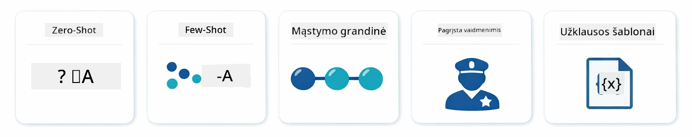
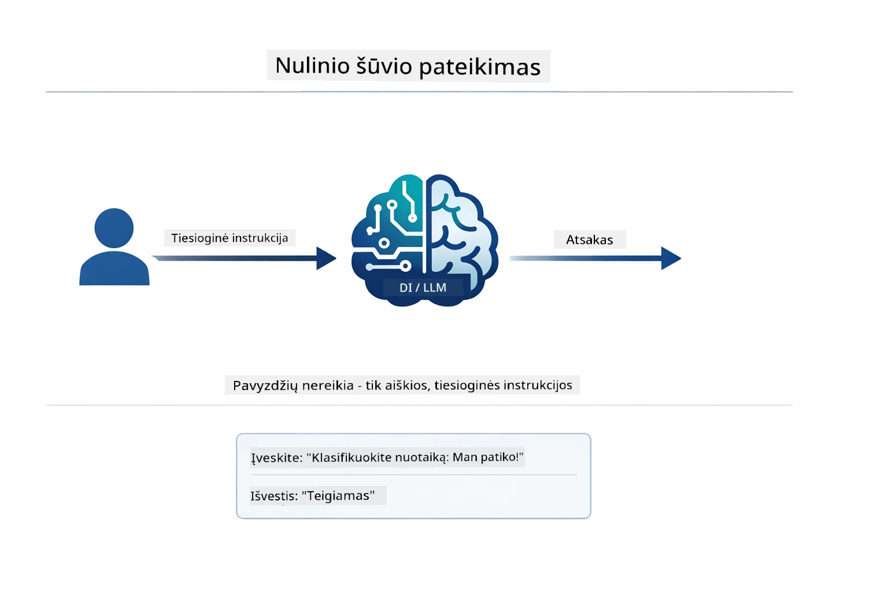
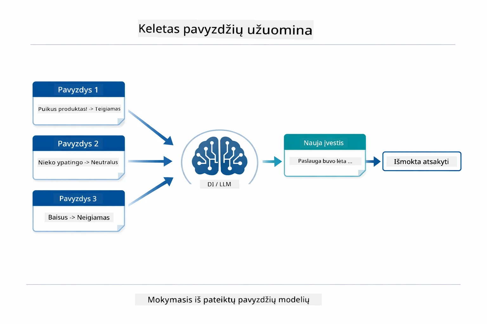
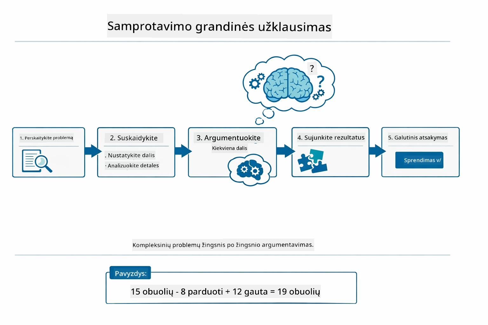
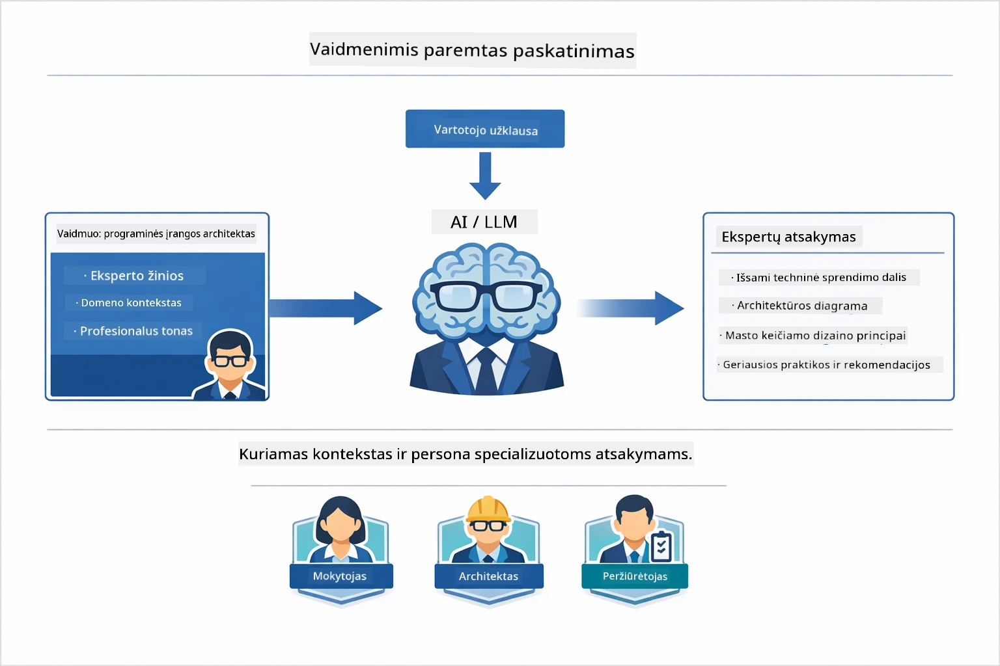
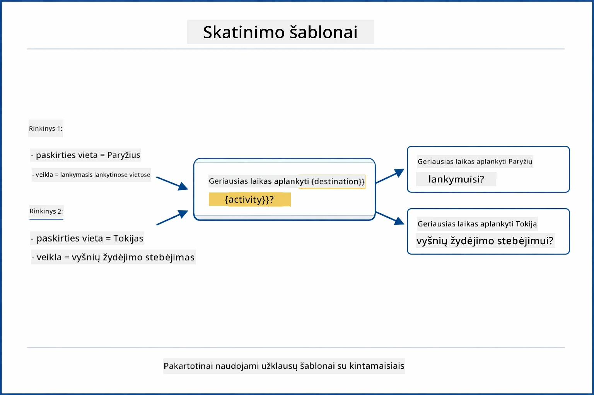
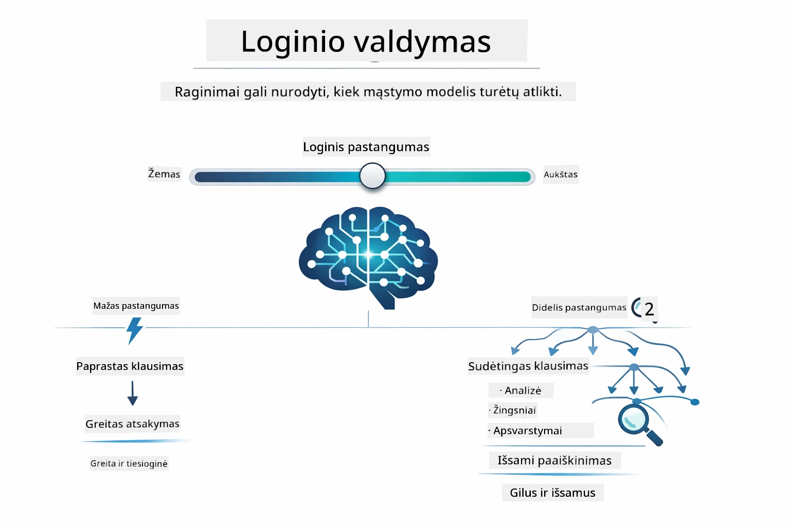

# Modulis 02: Promptų inžinerija su GPT-5.2

## Turinys

- [Vaizdo įrašo apžvalga](../../../02-prompt-engineering)
- [Ko išmoksite](../../../02-prompt-engineering)
- [Reikalavimai](../../../02-prompt-engineering)
- [Promptų Inžinerijos Suvokimas](../../../02-prompt-engineering)
- [Promptų Inžinerijos Pagrindai](../../../02-prompt-engineering)
  - [Zero-Shot Prompting](../../../02-prompt-engineering)
  - [Few-Shot Prompting](../../../02-prompt-engineering)
  - [Grandinės mintis](../../../02-prompt-engineering)
  - [Rolės pagrindu kuriamas promptas](../../../02-prompt-engineering)
  - [Promptų šablonai](../../../02-prompt-engineering)
- [Pažangios struktūros](../../../02-prompt-engineering)
- [Paleiskite programą](../../../02-prompt-engineering)
- [Programos ekrano nuotraukos](../../../02-prompt-engineering)
- [Mokslo struktūrų tyrinėjimas](../../../02-prompt-engineering)
  - [Mažas ir didelis entuziazmas](../../../02-prompt-engineering)
  - [Užduoties vykdymas (Įrankių įvadas)](../../../02-prompt-engineering)
  - [Savi reflektuojantis kodas](../../../02-prompt-engineering)
  - [Struktūrinė analizė](../../../02-prompt-engineering)
  - [Daugiapakopis pokalbis](../../../02-prompt-engineering)
  - [Žingsnis po žingsnio argumentavimas](../../../02-prompt-engineering)
  - [Ribotas išvesties formatas](../../../02-prompt-engineering)
- [Ką iš tiesų išmoksite](../../../02-prompt-engineering)
- [Kiti žingsniai](../../../02-prompt-engineering)

## Vaizdo įrašo apžvalga

Peržiūrėkite šią tiesioginę sesiją, kuri paaiškina, kaip pradėti darbą su šiuo moduliu:

<a href="https://www.youtube.com/live/PJ6aBaE6bog?si=LDshyBrTRodP-wke"></a>

## Ko išmoksite

Ši diagrama apžvelgia pagrindines temas ir įgūdžius, kuriuos įgysite šiame modulyje — nuo promptų tobulinimo technikų iki žingsnis po žingsnio darbo eigos, kurios laikysitės.



Anksčiau moduliuose tyrinėjote pagrindinius LangChain4j sąveikos su GitHub modeliais pavyzdžius ir matėte, kaip atmintis leidžia palaikyti pokalbių AI naudojant Azure OpenAI. Dabar sutelksime dėmesį į tai, kaip užduodate klausimus — pačius promptus — naudodami Azure OpenAI GPT-5.2. Jūsų promptų struktūra dramatiškai įtakoja atsakymų kokybę. Pradedame nuo pagrindinių promptų technikų apžvalgos, po to pereiname prie aštuonių pažangių struktūrų, kurios visiškai išnaudoja GPT-5.2 galimybes.

Naudosime GPT-5.2, nes jis įveda samprotavimo valdymą - galite nurodyti modeliui, kiek mąstymo atlikti prieš atsakant. Tai pabrėžia skirtingas promptų strategijas ir padeda suprasti, kada naudoti kurią. Taip pat pasinaudosime mažesniais GPT-5.2 Azure apribojimais, palyginti su GitHub modeliais.

## Reikalavimai

- Įvykdytas modulis 01 (Azure OpenAI ištekliai diegti)
- `.env` failas pagrindiniame kataloge su Azure kredencialais (sukurtas vykdant `azd up` modulyje 01)

> **Pastaba:** Jei dar neįvykdėte modulio 01, pirmiausia atlikite diegimo instrukcijas ten.

## Promptų inžinerijos suvokimas

Iš esmės promptų inžinerija yra skirtumas tarp miglotų ir tikslių nurodymų, kaip žemiau palyginta.



Promptų inžinerija yra įvesties teksto kūrimas, kuris nuosekliai duoda jums reikalingus rezultatus. Tai ne tik klausimų uždavimas - tai užklausų struktūrizavimas, kad modelis tiksliai suprastų, ko norite ir kaip tai pateikti.

Įsivaizduokite, kad duodate nurodymus kolegai. „Pataisyk klaidą“ yra miglota. „Pataisyk null pointer exception UserService.java faile, eilutėje 45, pridėdamas null patikrą“ yra specifikuota. Kalbos modeliai veikia ta pati logika - specifika ir struktūra yra svarbios.

Žemiau diagrama parodo, kaip LangChain4j įsilieja į šią sistemą — jungiant jūsų promptų šablonus su modeliu per SystemMessage ir UserMessage statybos blokėlius.



LangChain4j suteikia infrastruktūrą — modelio jungtis, atmintį ir žinučių tipus — o promptų šablonai yra tiesiog kruopščiai suformuotas tekstas, kuriuo perduodate per tą infrastruktūrą. Pagrindiniai statybos blokai yra `SystemMessage` (nustato AI elgesį ir rolę) ir `UserMessage` (neša jūsų faktinį prašymą).

## Promptų inžinerijos pagrindai

Penki pagrindiniai metodai pateikti žemiau sudaro efektyvios promptų inžinerijos pagrindą. Kiekvienas iš jų sprendžia skirtingą, kaip bendraujate su kalbos modeliais, aspektą.



Prieš pereidami prie pažangių šablonų šiame modulyje, apžvelkime penkias pagrindines promptų technikas. Tai statybiniai blokai, kuriuos turėtų pažinti kiekvienas promptų inžinierius. Jei jau dirbote su [greito starto moduliu](../00-quick-start/README.md#2-prompt-patterns), matėte juos veikime — čia jų konceptualus pagrindas.

### Zero-Shot Prompting

Paprastasis metodas: suteikite modeliui tiesioginį nurodymą be pavyzdžių. Modelis visiškai pasikliauja savo mokymu suprasti ir atlikti užduotį. Tai gerai veikia paprastoms užklausoms, kai elgsena yra aiški.



*Tiesioginis nurodymas be pavyzdžių — modelis daro išvadą apie užduotį remdamasis tik nurodymu*

```java
String prompt = "Classify this sentiment: 'I absolutely loved the movie!'";
String response = model.chat(prompt);
// Atsakymas: „Teigiamas“
```

**Kada naudoti:** paprastoms klasifikacijoms, tiesioginiams klausimams, vertimams ar kitoms užduotims, kur modelis gali dirbti be papildomų nurodymų.

### Few-Shot Prompting

Pateikite pavyzdžių, kurie demonstruoja modelio pageidaujamą šabloną. Modelis išmoksta tikėtino įvesties-išvesties formato pagal jūsų pavyzdžius ir taiko jį naujoms įvestims. Tai dramatiškai pagerina nuoseklumą užduotyse, kuriose norimas formatas ar elgsena nėra akivaizdūs.



*Mokymasis iš pavyzdžių — modelis identifikuoja šabloną ir taiko jį naujoms įvestims*

```java
String prompt = """
    Classify the sentiment as positive, negative, or neutral.
    
    Examples:
    Text: "This product exceeded my expectations!" → Positive
    Text: "It's okay, nothing special." → Neutral
    Text: "Waste of money, very disappointed." → Negative
    
    Now classify this:
    Text: "Best purchase I've made all year!"
    """;
String response = model.chat(prompt);
```

**Kada naudoti:** suasmenintoms klasifikacijoms, nuosekliam formatavimui, domeno specifinėms užduotims ar kai zero-shot rezultatai yra nevienodi.

### Grandinės mintis

Prašykite modelio parodyti savo samprotavimą žingsnis po žingsnio. Vietoj tiesioginio atsakymo, modelis suskaido problemą ir aiškiai dirba su kiekviena dalimi. Tai pagerina tikslumą matematikos, logikos ir daugiažingsnių užduočių atvejais.



*Žingsnis po žingsnio argumentavimas — sudėtingų problemų suskaidymas į aiškius loginius žingsnius*

```java
String prompt = """
    Problem: A store has 15 apples. They sell 8 apples and then 
    receive a shipment of 12 more apples. How many apples do they have now?
    
    Let's solve this step-by-step:
    """;
String response = model.chat(prompt);
// Modelis rodo: 15 - 8 = 7, tada 7 + 12 = 19 obuolių
```

**Kada naudoti:** matematikos užduotims, logikos galvosūkiams, derinimui ar kitoms užduotims, kuriose mąstymo proceso demonstravimas gerina tikslumą ir pasitikėjimą.

### Rolės pagrindu kuriamas promptas

Nustatykite AI personažą ar vaidmenį prieš užduodami klausimą. Tai suteikia kontekstą, kuris formuoja tono, gilumo ir atsakymo fokuso pobūdį. „Programinės įrangos architektas“ pateikia kitokią rekomendaciją nei „jaunesnysis programuotojas“ ar „saugumo auditorius“.



*Konteksto ir personažo nustatymas — tas pats klausimas gauna skirtingą atsakymą priklausomai nuo priskirtos rolės*

```java
String prompt = """
    You are an experienced software architect reviewing code.
    Provide a brief code review for this function:
    
    def calculate_total(items):
        total = 0
        for item in items:
            total = total + item['price']
        return total
    """;
String response = model.chat(prompt);
```

**Kada naudoti:** kodo peržiūroms, mokymui, domeno specifinėms analizėms ar kai reikia atsakymų, pritaikytų pagal tam tikrą ekspertizės lygį ar perspektyvą.

### Promptų šablonai

Sukurkite pakartotinai naudojamus promptus su kintamųjų vietomis. Užuot rašę naują promptą kiekvieną kartą, apibrėžkite šabloną kartą ir įterpkite skirtingas reikšmes. LangChain4j `PromptTemplate` klasė tai palengvina naudodama `{{variable}}` sintaksę.



*Pakartotinai naudojami promptai su kintamųjų vietomis — vienas šablonas, daug panaudojimų*

```java
PromptTemplate template = PromptTemplate.from(
    "What's the best time to visit {{destination}} for {{activity}}?"
);

Prompt prompt = template.apply(Map.of(
    "destination", "Paris",
    "activity", "sightseeing"
));

String response = model.chat(prompt.text());
```

**Kada naudoti:** pasikartojančioms užklausoms su skirtinga įvestimi, masinėms apdorojimo užduotims, pakartotinai naudojamų AI darbo eigos kūrimui ar bet kuriai situacijai, kai prompto struktūra išlieka ta pati, bet duomenys keičiasi.

---

Šie penki pagrindai suteikia jums tvirtą įrankių rinkinį daugumai promptų užduočių. Likusi šio modulio dalis plėtoja juos su **aštuoniais pažangiais šablonais**, kurie išnaudoja GPT-5.2 samprotavimo valdymą, savęs vertinimą ir struktūruotos išvesties galimybes.

## Pažangios struktūros

Įvaldę pagrindus, pereikime prie aštuonių pažangių šablonų, kurie daro šį modulį unikaliai. Ne visiems klausimams reikia tokio paties požiūrio. Kai kurie reikalauja greitų atsakymų, kiti gilios analizės. Kai kuriems reikalingas matomas samprotavimas, kitiems tik rezultatai. Kiekvienas žemiau pateiktas šablonas yra optimizuotas skirtingam scenarijui — o GPT-5.2 samprotavimo valdymas šiuos skirtumus dar labiau pabrėžia.


*Aštuoni promptų inžinerijos šablonų ir jų panaudojimo apžvalga*

GPT-5.2 suteikia papildomą dimensiją šioms struktūroms: *samprotavimo valdymą*. Žemiau esantis slankiklis rodo, kaip galite reguliuoti modeliui skirtą mąstymo pastangų kiekį — nuo greitų, tiesioginių atsakymų iki gilaus, kruopštaus analizavimo.



*GPT-5.2 samprotavimo valdymas leidžia nurodyti, kiek mąstymo modelis turi atlikti — nuo greitų tiesioginių atsakymų iki gilios analizės*

**Mažas entuziazmas (Greita & Tiksli)** - Skirti paprastiems klausimams, kur reikia greitų, tiesioginių atsakymų. Modelis atlieka minimalų samprotavimą – daugiausia 2 žingsnius. Naudokite skaičiavimams, paieškoms ar tiesioginiams klausimams.

```java
String prompt = """
    <context_gathering>
    - Search depth: very low
    - Bias strongly towards providing a correct answer as quickly as possible
    - Usually, this means an absolute maximum of 2 reasoning steps
    - If you think you need more time, state what you know and what's uncertain
    </context_gathering>
    
    Problem: What is 15% of 200?
    
    Provide your answer:
    """;

String response = chatModel.chat(prompt);
```

> 💡 **Išbandykite su GitHub Copilot:** Atidarykite [`Gpt5PromptService.java`](../../../02-prompt-engineering/src/main/java/com/example/langchain4j/prompts/service/Gpt5PromptService.java) ir paklauskite:
> - „Kuo skiriasi mažo ir didelio entuziazmo promptų šablonai?“
> - „Kaip XML žymos promptuose padeda struktūruoti AI atsakymą?“
> - „Kada naudoti savęs reflektavimo šablonus, o kada tiesioginius nurodymus?“

**Didelis entuziazmas (Gilumas & Kruopštumas)** - Skirta sudėtingoms problemoms, kur norite išsamių analizų. Modelis kruopščiai gilina problemą ir rodo detalias mintis. Naudojama sistemų projektavimui, architektūros sprendimams arba sudėtingiems tyrimams.

```java
String prompt = """
    Analyze this problem thoroughly and provide a comprehensive solution.
    Consider multiple approaches, trade-offs, and important details.
    Show your analysis and reasoning in your response.
    
    Problem: Design a caching strategy for a high-traffic REST API.
    """;

String response = chatModel.chat(prompt);
```

**Užduoties vykdymas (Žingsnis po žingsnio pažanga)** - Skirta daugiažingsnėms darbo eigoms. Modelis pateikia pradžioje planą, pasako apie kiekvieną žingsnį dirbdamas, tada pateikia santrauką. Naudokite migracijoms, įgyvendinimams ar bet kokiai daugiažingsnei veiklai.

```java
String prompt = """
    <task_execution>
    1. First, briefly restate the user's goal in a friendly way
    
    2. Create a step-by-step plan:
       - List all steps needed
       - Identify potential challenges
       - Outline success criteria
    
    3. Execute each step:
       - Narrate what you're doing
       - Show progress clearly
       - Handle any issues that arise
    
    4. Summarize:
       - What was completed
       - Any important notes
       - Next steps if applicable
    </task_execution>
    
    <tool_preambles>
    - Always begin by rephrasing the user's goal clearly
    - Outline your plan before executing
    - Narrate each step as you go
    - Finish with a distinct summary
    </tool_preambles>
    
    Task: Create a REST endpoint for user registration
    
    Begin execution:
    """;

String response = chatModel.chat(prompt);
```

Grandinės minties promptinimas aiškiai ragina modelį parodyti samprotavimo procesą, kas pagerina sudėtingų užduočių tikslumą. Žingsnis po žingsnio analizė padeda tiek žmonėms, tiek AI suprasti logiką.

> **🤖 Išbandykite su [GitHub Copilot](https://github.com/features/copilot) pokalbiu:** Paklauskite apie šį šabloną:
> - „Kaip pritaikyčiau užduoties vykdymo šabloną ilgiau trunkančioms operacijoms?“
> - „Kokios yra geriausios praktikos įrankių įvadų struktūravimui gamybinėse programose?“
> - „Kaip fiksuoti ir rodyti tarpinę pažangą UI?“

Žemiau pateikta diagrama iliustruoja šią Plan → Vykdyti → Santrauka darbo eigą.


*Planavimas → Vykdymas → Santrauka daugiažingsnėms užduotims*

**Savi reflektuojantis kodas** - Skirta generuoti gamybinės kokybės kodui. Modelis kuria kodą vadovaudamasis gamybos standartais su tinkamu klaidų valdymu. Naudojama kuriant naujas funkcijas ar paslaugas.

```java
String prompt = """
    Generate Java code with production-quality standards: Create an email validation service
    Keep it simple and include basic error handling.
    """;

String response = chatModel.chat(prompt);
```

Žemiau diagrama rodo šią iteratyvios tobulinimo ciklą — generavimą, vertinimą, silpnųjų vietų nustatymą ir tobulinimą, kol kodas atitinka gamybos standartus.


*Iteratyvus tobulinimo ciklas - generuoti, vertinti, identifikuoti problemas, gerinti, kartoti*

**Struktūrinė analizė** - Nuosekliam vertinimui. Modelis peržiūri kodą naudodamas fiksuotą sistemą (teisingumas, praktikos, našumas, saugumas, priežiūra). Naudojama kodo peržiūroms ar kokybės įvertinimams.

```java
String prompt = """
    <analysis_framework>
    You are an expert code reviewer. Analyze the code for:
    
    1. Correctness
       - Does it work as intended?
       - Are there logical errors?
    
    2. Best Practices
       - Follows language conventions?
       - Appropriate design patterns?
    
    3. Performance
       - Any inefficiencies?
       - Scalability concerns?
    
    4. Security
       - Potential vulnerabilities?
       - Input validation?
    
    5. Maintainability
       - Code clarity?
       - Documentation?
    
    <output_format>
    Provide your analysis in this structure:
    - Summary: One-sentence overall assessment
    - Strengths: 2-3 positive points
    - Issues: List any problems found with severity (High/Medium/Low)
    - Recommendations: Specific improvements
    </output_format>
    </analysis_framework>
    
    Code to analyze:
    ```
    public List getUsers() {
        return database.query("SELECT * FROM users");
    }
    ```
    Provide your structured analysis:
    """;

String response = chatModel.chat(prompt);
```

> **🤖 Išbandykite su [GitHub Copilot](https://github.com/features/copilot) pokalbiu:** Paklauskite apie struktūrinę analizę:
> - „Kaip pritaikyti analizės sistemą skirtingo tipo kodo peržiūroms?“
> - „Koks geriausias būdas programiškai išskaidyti ir veikti pagal struktūrizuotą išvestį?“
> - „Kaip užtikrinti nuoseklius reikšmingumo lygius skirtingose peržiūros sesijose?“

Žemiau pateikta diagrama parodo, kaip ši struktūrinė sistema organizuoja kodo peržiūrą nuosekliomis kategorijomis su reikšmingumo lygiais.


*Kodo peržiūrų nuoseklumo sistema su reikšmingumo lygiais*

**Daugiapakopis pokalbis** - Pokalbiams, kuriems reikalingas kontekstas. Modelis prisimena ankstesnes žinutes ir juo remiasi. Naudojama interaktyvioms pagalbos sesijoms ar sudėtingoms Q&A.

```java
ChatMemory memory = MessageWindowChatMemory.withMaxMessages(10);

memory.add(UserMessage.from("What is Spring Boot?"));
AiMessage aiMessage1 = chatModel.chat(memory.messages()).aiMessage();
memory.add(aiMessage1);

memory.add(UserMessage.from("Show me an example"));
AiMessage aiMessage2 = chatModel.chat(memory.messages()).aiMessage();
memory.add(aiMessage2);
```

Žemiau diagrama vizualizuoja, kaip pokalbio kontekstas kaupiasi su kiekvienu žingsniu ir kaip tai susiję su modelio tokenų limitu.


*Kaip pokalbio kontekstas kaupiasi daugeliu žingsnių iki pasiekiant tokenų limitą*
**Žingsnis po žingsnio mąstymas** – Skirta problemoms, kurioms reikalinga matoma logika. Modelis aiškiai parodo samprotavimus kiekviename žingsnyje. Naudokite tai matematiniams uždaviniams, logikos galvosūkams ar kai reikia suprasti mąstymo procesą.

```java
String prompt = """
    <instruction>Show your reasoning step-by-step</instruction>
    
    If a train travels 120 km in 2 hours, then stops for 30 minutes,
    then travels another 90 km in 1.5 hours, what is the average speed
    for the entire journey including the stop?
    """;

String response = chatModel.chat(prompt);
```

Žemiau pateiktas diagrama iliustruoja, kaip modelis suskaido problemas į aiškius, numeruotus loginius žingsnius.


*Probleminių uždavinių suskaidymas į aiškius loginius žingsnius*

**Apribotas išvesties formatas** – Skirta atsakymams su konkrečiomis formato reikalavimų taisyklėmis. Modelis griežtai laikosi formato ir ilgio taisyklių. Naudokite tai santraukoms arba kai reikalinga tiksli išvesties struktūra.

```java
String prompt = """
    <constraints>
    - Exactly 100 words
    - Bullet point format
    - Technical terms only
    </constraints>
    
    Summarize the key concepts of machine learning.
    """;

String response = chatModel.chat(prompt);
```

Žemiau pateikta diagrama rodo, kaip apribojimai nukreipia modelį generuoti išvestį, kuri griežtai atitinka jūsų formato ir ilgio reikalavimus.


*Specialių formato, ilgio ir struktūros reikalavimų užtikrinimas*

## Paleiskite programą

**Patikrinkite diegimą:**

Įsitikinkite, kad projekto šakniniame kataloge egzistuoja `.env` failas su Azure kredencialais (sukurtais Modulyje 01). Paleiskite tai iš modulio katalogo (`02-prompt-engineering/`):

**Bash:**
```bash
cat ../.env  # Turėtų rodyti AZURE_OPENAI_ENDPOINT, API_KEY, DEPLOYMENT
```

**PowerShell:**
```powershell
Get-Content ..\.env  # Turėtų parodyti AZURE_OPENAI_ENDPOINT, API_KEY, DEPLOYMENT
```

**Paleiskite programą:**

> **Pastaba:** Jei jau paleidote visas programas naudodami `./start-all.sh` iš šakniniame katalogo (kaip aprašyta Modulyje 01), šis modulis jau veikia 8083 prievade. Galite praleisti žemiau pateiktas starto komandas ir tiesiogiai nueiti į http://localhost:8083.

**1 variantas: Naudojant Spring Boot Dashboard (rekomenduojama VS Code naudotojams)**

Dev konteineryje yra Spring Boot Dashboard plėtinys, kuris suteikia vizualią sąsają visoms Spring Boot programoms valdyti. Jį rasite Aktyvumo juostoje kairėje VS Code pusėje (ieškokite Spring Boot ikonos).

Iš Spring Boot Dashboard galite:
- Matyti visas darbo aplinkoje esančias Spring Boot programas
- Vienu spustelėjimu paleisti/stabdyti programas
- Realiai matyti programų žurnalus
- Stebėti programų būseną

Tiesiog spustelėkite paleidimo mygtuką šalia „prompt-engineering“, kad paleistumėte šį modulį, arba paleiskite visus modulius vienu metu.


*Spring Boot Dashboard VS Code — paleiskite, stabdykite ir stebėkite visus modulius iš vienos vietos*

**2 variantas: Naudojant shell skriptus**

Paleiskite visas interneto programas (modulius 01-04):

**Bash:**
```bash
cd ..  # Iš šaknies katalogo
./start-all.sh
```

**PowerShell:**
```powershell
cd ..  # Iš šakninio katalogo
.\start-all.ps1
```

Arba paleiskite tik šį modulį:

**Bash:**
```bash
cd 02-prompt-engineering
./start.sh
```

**PowerShell:**
```powershell
cd 02-prompt-engineering
.\start.ps1
```

Abu skriptai automatiškai įkelia aplinkos kintamuosius iš šakniniame kataloge esančio `.env` failo ir sukurs JAR failus, jei jų nėra.

> **Pastaba:** Jei norite rankiniu būdu sukompiliuoti visus modulius prieš paleidimą:
>
> **Bash:**
> ```bash
> cd ..  # Go to root directory
> mvn clean package -DskipTests
> ```
>
> **PowerShell:**
> ```powershell
> cd ..  # Go to root directory
> mvn clean package -DskipTests
> ```

Atidarykite http://localhost:8083 savo naršyklėje.

**Norėdami sustabdyti:**

**Bash:**
```bash
./stop.sh  # Tik šis modulis
# Arba
cd .. && ./stop-all.sh  # Visi moduliai
```

**PowerShell:**
```powershell
.\stop.ps1  # Tik šis modulis
# Arba
cd ..; .\stop-all.ps1  # Visi moduliai
```

## Programos ekrano kopijos

Čia pagrindinė promptų kūrimo modulio sąsaja, kur galite eksperimentuoti su visais aštuoniais šablonais lygiagrečiai.


*Pagrindinis valdymo skydelis, rodantis visus 8 promptų kūrimo šablonus su jų charakteristikomis ir panaudojimo atvejais*

## Šablonų tyrinėjimas

Interneto sąsaja leidžia eksperimentuoti su įvairiomis promptų strategijomis. Kiekvienas šablonas sprendžia skirtingas problemas – išbandykite ir pamatykite, kada kuris metodas yra efektyvus.

> **Pastaba: Srautinio duomenų perdavimo (Streaming) ir nesrautinio skirtumai** — Kiekvieno šablono puslapyje yra du mygtukai: **🔴 Srautinis atsakas (Realtime)** ir **Nesrautinės** versijos pasirinkimas. Srautinis perdavimas naudoja Server-Sent Events (SSE) ir rodo žodžius realiu laiku, kai modelis juos generuoja, tad matote progresą iš karto. Nesrautinė versija laukia viso atsakymo pabaigos. Gilų samprotavimą reikalaujančiose užklausose (pvz., Aukštas entuziazmas, Savianalizuojantis kodas) nesrautinės versijos kvietimas gali užtrukti ilgai – kartais kelias minutes – be jokios matomos informacijos. **Naudokite srautinį režimą sudėtingiems užklausimams,** kad matytumėte modelio darbą ir išvengtumėte įspūdžio, kad užklausa užstrigo.
>
> **Pastaba: Naršyklės reikalavimas** — Srautinio režimo funkcija naudoja Fetch Streams API (`response.body.getReader()`), kuri reikalinga pilnavertei naršyklei (Chrome, Edge, Firefox, Safari). Ji **nesuveikia** VS Code integruotoje Simple Browser, nes jos žiniatinklio vaizdas nepalaiko ReadableStream API. Naudojant Simple Browser, nesrautiniai mygtukai veiks normaliai – paveikti tik srautiniai mygtukai. Atidarykite `http://localhost:8083` išorinėje naršyklėje, kad gautumėte visą funkcionalumą.

### Žemas ir aukštas entuziazmas

Užduokite paprastą klausimą, pvz., „Kiek yra 15% iš 200?“ naudodami Žemą entuziazmą. Gausite greitą ir tiesioginį atsakymą. Dabar paklauskite sudėtingesnio, pvz., „Sukurkite talpyklos strategiją didelio srauto API“, naudodami Aukštą entuziazmą. Spauskite **🔴 Srautinį atsaką (Realtime)** ir stebėkite, kaip modelis pateikia detalius samprotavimus žodis po žodžio. Tas pats modelis, ta pati klausimo struktūra – bet užklausa nurodo, kiek mąstymo reikia.

### Užduočių vykdymas (įrankių pradžios tekstai)

Daugiapakopiai procesai naudingesni, kai iškart suplanuojamas veiksmas ir aprašomas progresas. Modelis numato, ką darys, aprašo kiekvieną žingsnį, tada apibendrina rezultatus.

### Savianalizuojantis kodas

Išbandykite „Sukurti el. pašto validacijos paslaugą“. Modelis ne tik sugeneruoja kodą ir sustoja, bet ir vertina pagal kokybės kriterijus, identifikuoja trūkumus ir tobulina. Matysite, kaip modelis iteruoja tol, kol kodas tenkina gamybinius standartus.

### Struktūruota analizė

Kodo peržiūros reikalauja pastovių vertinimo sistemų. Modelis analizuoja kodą pagal fiksuotas kategorijas (teisingumas, praktikos, našumas, saugumas) su rimtumo lygiais.

### Daugiabutis pokalbis

Paklauskite „Kas yra Spring Boot?“ ir iškart po to klauskit „Parodyk man pavyzdį“. Modelis prisimena jūsų pirmą klausimą ir pateikia konkrečius Spring Boot pavyzdžius. Be atminties tas antras klausimas būtų pernelyg neaiškus.

### Žingsnis po žingsnio mąstymas

Pasirinkite matematinę užduotį ir išbandykite su Žingsnis po žingsnio mąstymu bei Žemu entuziazmu. Žemas entuziazmas greitai pateikia tik atsakymą – greita, bet neaišku. Žingsnis po žingsnio rodo kiekvieną skaičiavimą ir sprendimą.

### Apribota išvestis

Kai reikia konkrečių formatų ar žodžių skaičiaus, šis šablonas užtikrina griežtą taisyklių laikymąsi. Išbandykite generuoti santrauką tiksliu 100 žodžių skaičiumi sąrašo formatu.

## Ko jūs iš tikrųjų mokotės

**Samprotavimo pastangos keičia viską**

GPT-5.2 leidžia valdyti skaičiavimo pastangas per savo užklausas. Mažos pastangos reiškia greitus atsakymus su minimaliu nagrinėjimu. Didelės pastangos reiškia, kad modelis skiria laiko giliam mąstymui. Jūs mokotės pritaikyti pastangas užduoties sudėtingumui – neskubėkite su paprastais klausimais, bet ir neleiskite sudėtingoms užduotims būti sprendžiamoms per greitai.

**Struktūra nukreipia elgesį**

Pastebėjote XML žymes promptuose? Jos ne vien dekoratyvios. Modeliai labiau patikimai laikosi struktūruotų nurodymų nei laisvo teksto. Kai reikia daug žingsnių ar sudėtingos logikos, struktūra padeda modeliui sekti, kur jis yra ir kas bus toliau. Žemiau pateikta diagrama rodo gerai struktūruoto sodo prompto anatomiją, kur žymos kaip `<system>`, `<instructions>`, `<context>`, `<user-input>`, ir `<constraints>` organizuoja jūsų nurodymus aiškiomis dalimis.


*Gerai struktūruoto prompto anatomija su aiškiomis dalimis ir XML stiliaus organizacija*

**Kokybė per savianalizę**

Savianalizuojantys šablonai veikia nurodant kokybės kriterijus aiškiai. Vietoje to, kad tikėtumėtės, jog modelis „tai padarys gerai“, jūs tiesiogiai nurodote, ką reiškia „gerai“: teisinga logika, klaidų valdymas, našumas, saugumas. Tuomet modelis gali įvertinti savo išvestį ir tobulėti. Tai pokyčių kodų generavimą iš loterijos į procesą.

**Kontekstas yra ribotas**

Daugiabutis pokalbis veikia įtraukiant žinutės istoriją su kiekvienu užklausa. Bet yra ribos – kiekvienas modelis turi maksimalią žodžių/ženklų ribą. Augant pokalbiui, teks naudoti strategijas palaikyti aktualų kontekstą, nepersikeliant virš ribos. Šis modulis parodo, kaip veikia atmintis; vėliau sužinosite, kada apibendrinti, kada pamiršti ir kada atkurti informaciją.

## Tolimesni veiksmai

**Kitas modulis:** [03-rag - RAG (Retrieval-Augmented Generation)](../03-rag/README.md)

---

**Naršymas:** [← Ankstesnis: Modulis 01 - Įvadas](../01-introduction/README.md) | [Grįžti į pagrindinį](../README.md) | [Kitas: Modulis 03 - RAG →](../03-rag/README.md)

---

<!-- CO-OP TRANSLATOR DISCLAIMER START -->
**Atsakomybės apribojimas**:
Šis dokumentas buvo išverstas naudojant dirbtinio intelekto vertimo paslaugą [Co-op Translator](https://github.com/Azure/co-op-translator). Nors stengiamės užtikrinti tikslumą, prašome atkreipti dėmesį, kad automatizuoti vertimai gali turėti klaidų arba netikslumų. Originalus dokumentas gimtąja kalba turėtų būti laikomas autoritetingu šaltiniu. Kritinei informacijai rekomenduojama naudoti profesionalų žmogaus vertimą. Mes neatsakome už jokius nesusipratimus ar klaidingas interpretacijas, kylančias dėl šio vertimo naudojimo.
<!-- CO-OP TRANSLATOR DISCLAIMER END -->