# Modulis 03: RAG (Retrieval-Augmented Generation)

## Turinys

- [Vaizdo įrašo apžvalga](../../../03-rag)
- [Ko išmoksite](../../../03-rag)
- [Išankstiniai reikalavimai](../../../03-rag)
- [RAG supratimas](../../../03-rag)
  - [Kuris RAG metodas naudojamas šiame vadove?](../../../03-rag)
- [Kaip tai veikia](../../../03-rag)
  - [Dokumento apdorojimas](../../../03-rag)
  - [Įterpimų kūrimas](../../../03-rag)
  - [Semantinė paieška](../../../03-rag)
  - [Atsakymo generavimas](../../../03-rag)
- [Paleiskite programą](../../../03-rag)
- [Programos naudojimas](../../../03-rag)
  - [Įkelkite dokumentą](../../../03-rag)
  - [Uždavinėkite klausimus](../../../03-rag)
  - [Patikrinkite šaltinių nuorodas](../../../03-rag)
  - [Eksperimentuokite su klausimais](../../../03-rag)
- [Pagrindinės sąvokos](../../../03-rag)
  - [Fragmentavimo strategija](../../../03-rag)
  - [Panašumo įvertinimai](../../../03-rag)
  - [Atminties saugykla](../../../03-rag)
  - [Konteksto lango valdymas](../../../03-rag)
- [Kada RAG svarbus](../../../03-rag)
- [Kiti žingsniai](../../../03-rag)

## Vaizdo įrašo apžvalga

Žiūrėkite šią tiesioginę sesiją, kurioje paaiškinama, kaip pradėti dirbti su šiuo moduliu: [RAG with LangChain4j - Live Session](https://www.youtube.com/watch?v=_olq75ZH_eY)

## Ko išmoksite

Anksčiau moduliuose išmokote, kaip kalbėtis su DI ir efektyviai struktūruoti užklausas. Tačiau yra esminis apribojimas: kalbos modeliai žino tik tai, ką jie išmoko mokymo metu. Jie negali atsakyti į klausimus apie jūsų įmonės taisykles, jūsų projekto dokumentaciją ar bet kokią informaciją, kurios nebuvo mokomi.

RAG (Retrieval-Augmented Generation) sprendžia šią problemą. Vietoj to, kad mokytumėte modelį jūsų informacija (kas yra brangu ir nepraktiška), suteikiate jam galimybę ieškoti per jūsų dokumentus. Kai kas nors užduoda klausimą, sistema suranda atitinkamą informaciją ir įtraukia ją į užklausos kontekstą. Modelis tada atsako remdamasis tuo surinktu kontekstu.

Įsivaizduokite RAG kaip nuorodų biblioteką modeliui. Kai klausiate, sistema:

1. **Vartotojo užklausa** – jūs užduodate klausimą  
2. **Įterpimas** – paverčia klausimą vektoriumi  
3. **Vektorinė paieška** – randa panašius dokumentų fragmentus  
4. **Konteksto surinkimas** – į pradinę užklausą prideda atitinkamus fragmentus  
5. **Atsakymas** – LLM generuoja atsakymą remdamasis kontekstu  

Tai pagrindžia modelio atsakymus jūsų tikrais duomenimis, o ne tik mokymo žiniomis ar išgalvotais atsakymais.

## Išankstiniai reikalavimai

- Užbaigtas [00 modulis - Greitas startas](../00-quick-start/README.md) (Easy RAG pavyzdžiui, minėtam anksčiau)  
- Užbaigtas [01 modulis - Įvadas](../01-introduction/README.md) (įdiegti Azure OpenAI ištekliai, įskaitant `text-embedding-3-small` įterpimų modelį)  
- `.env` failas pagrindiniame kataloge su Azure kredencialais (sukurtas vykdant `azd up` 01 modulyje)  

> **Pastaba:** Jei dar nebaigėte 01 modulio, pirmiausia laikykitės ten pateiktų diegimo nurodymų. Komanda `azd up` įdiegia tiek GPT pokalbių modelį, tiek šio modulio naudojamą įterpimų modelį.

## RAG supratimas

Žemiau pateiktas diagrama iliustruoja pagrindinę koncepciją: vietoj to, kad remtumėtės vien modelio mokymo duomenimis, RAG suteikia jam jūsų dokumentų nuorodų biblioteką, kuria galima pasinaudoti prieš generuojant kiekvieną atsakymą.

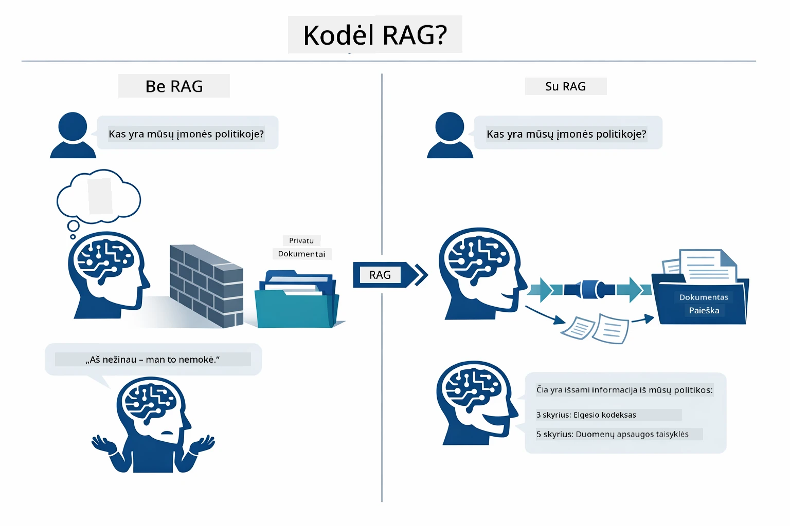

*Ši diagrama parodo skirtumą tarp standartinio LLM (kuris spėja remdamasis mokymo duomenimis) ir RAG patobulinto LLM (kuris pirmiausia pasitikrina jūsų dokumentus).*

Štai kaip visi komponentai sujungti nuo pradžios iki galo. Vartotojo klausimas praeina keturis etapus — įterpimą, vektorinę paiešką, konteksto surinkimą ir atsakymo generavimą — kiekvienas statomas ant ankstesnio:


*Ši diagrama parodo visą RAG procesą – vartotojo užklausa praeina per įterpimą, vektorinę paiešką, konteksto surinkimą ir atsakymo generavimą.*

Likusi šio modulio dalis detaliai apžvelgia kiekvieną etapą su kodu, kurį galite paleisti ir modifikuoti.

### Kuris RAG metodas naudojamas šiame vadove?

LangChain4j siūlo tris RAG įgyvendinimo būdus, kiekvienas su skirtingu abstrakcijos lygiu. Žemiau pateikta diagrama juos palygina:

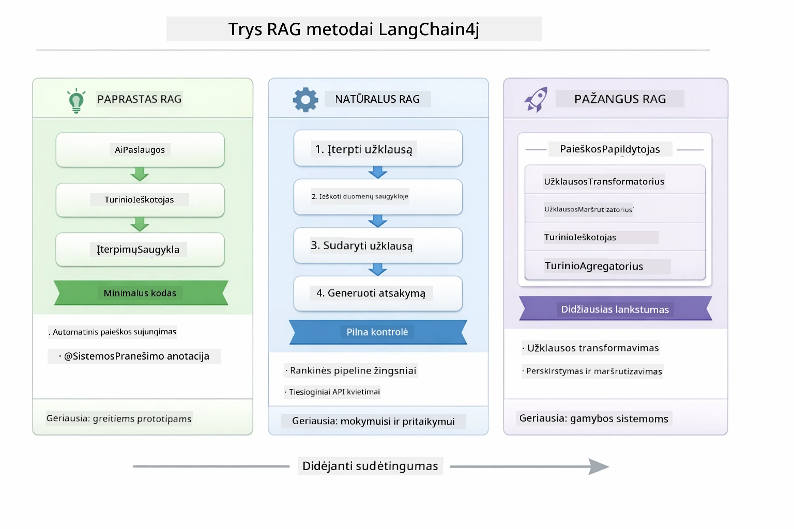

*Ši diagrama palygina tris LangChain4j RAG metodus – Easy, Native ir Advanced – rodydama jų pagrindinius komponentus ir kada naudoti kiekvieną.*

| Metodas | Ką daro | Kompromisas |
|---|---|---|
| **Easy RAG** | Automatiškai sujungia viską per `AiServices` ir `ContentRetriever`. Žymite sąsają, prijungiate retriever'į, o LangChain4j užkulisiuose valdo įterpimą, paiešką ir užklausos surinkimą. | Minimaliai kodo, bet nematote kas vyksta kiekviename žingsnyje. |
| **Native RAG** | Patys kviečiate įterpimų modelį, ieškote saugykloje, kuriate užklausą ir generuojate atsakymą – po vieną aiškų žingsnį. | Daugiau kodo, bet kiekvienas etapas yra matomas ir keičiamas. |
| **Advanced RAG** | Naudoja `RetrievalAugmentor` sistemą su keičiamais užklausų transformatoriais, maršrutizatoriais, perrikiuotojais ir turinio įterpėjais, skirtais produkcijos lygio procesams. | Didžiausias lankstumas, bet ženkliai sudėtingiau. |

**Šis vadovas naudoja Native metodą.** Kiekvienas RAG proceso žingsnis – įterpimo kūrimas, vektorinė paieška, konteksto surinkimas ir atsakymo generavimas – yra aiškiai išrašytas faile [`RagService.java`](../../../03-rag/src/main/java/com/example/langchain4j/rag/service/RagService.java). Tai daryta sąmoningai: mokymosi tikslais svarbiau matyti ir suprasti kiekvieną etapą, nei minimizuoti kodą. Kai susipažinsite, galėsite pereiti prie Easy RAG greitiems prototipams arba Advanced RAG produkcijos sistemoms.

> **💡 Jau matėte Easy RAG veikimą?** [Greito starto modulis](../00-quick-start/README.md) pateikia Dokumentų Q&A pavyzdį ([`SimpleReaderDemo.java`](../../../00-quick-start/src/main/java/com/example/langchain4j/quickstart/SimpleReaderDemo.java)), kuris naudoja Easy RAG metodą – LangChain4j automatiškai tvarko įterpimą, paiešką ir užklausos surinkimą. Šiame modulyje žingsnis po žingsnio atverčiame šį procesą, kad galėtumėte pamatyti ir valdyti kiekvieną etapą patys.

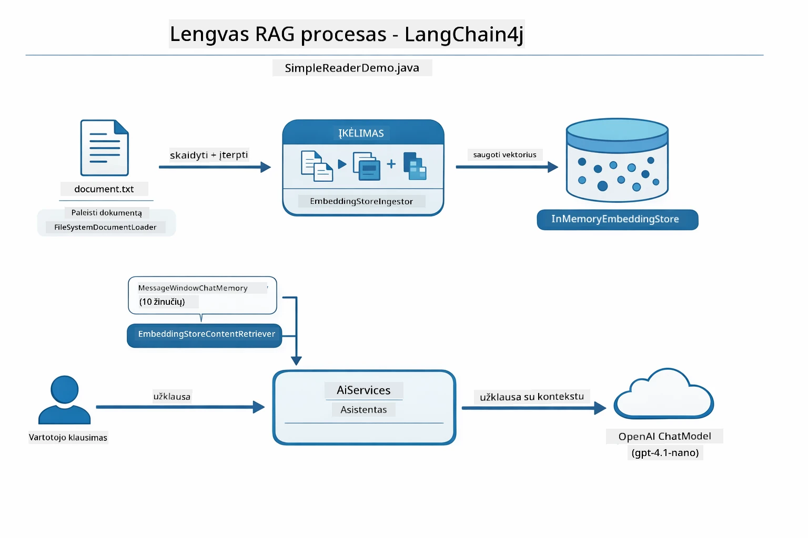

*Ši diagrama rodo Easy RAG procesą iš `SimpleReaderDemo.java`. Palyginkite su Native metodu šiame modulyje: Easy RAG paslepia įterpimą, gavimą ir užklausos surinkimą už `AiServices` ir `ContentRetriever` – įkeliat dokumentą, prijungiate retrieverį ir gaunate atsakymus. Native metodas šiame modulyje atskleidžia šį procesą, kad pats kviečiate kiekvieną etapą (įterpti, ieškoti, surinkti kontekstą, generuoti), suteikdamas pilną matomumą ir kontrolę.*

## Kaip tai veikia

Šio modulio RAG procesas suskaidytas į keturis etapus, kurie vykdomi kiekvieną kartą, kai vartotojas užduoda klausimą. Pirmiausia įkeltas dokumentas yra **išanalizuojamas ir suskaidomas** į valdomus fragmentus. Tie fragmentai virsta į **vektorinius įterpimus** ir saugomi, kad būtų galima matematiškai juos palyginti. Kai atkeliauja užklausa, sistema atlieka **semantinę paiešką** norėdama rasti aktualiausius fragmentus ir galiausiai perduoda juos LLM kaip kontekstą **atsakymo generavimui**. Žemiau pateiktos skiltys detalizuoja kiekvieną etapą su tikru kodu ir diagramomis. Pirmyn prie pirmojo žingsnio.

### Dokumento apdorojimas

[DocumentService.java](../../../03-rag/src/main/java/com/example/langchain4j/rag/service/DocumentService.java)

Kai įkeliate dokumentą, sistema jį parsiunčia (PDF arba paprastas tekstas), prideda metaduomenis, tokius kaip failo pavadinimas, o tada suskaido į fragmentus – mažesnes dalis, kurios patogiai telpa modelio konteksto lange. Šie fragmentai šiek tiek persidengia, kad neprarastumėte konteksto ribose.

```java
// Išanalizuokite įkeltą failą ir įpakuokite jį į LangChain4j dokumentą
Document document = Document.from(content, metadata);

// Padalykite į 300 žodžių fragmentus su 30 žodžių persidengimu
DocumentSplitter splitter = DocumentSplitters
    .recursive(300, 30);

List<TextSegment> segments = splitter.split(document);
```
  
Žemiau pateikta diagrama vizualiai parodo, kaip tai veikia. Matyti, kaip kiekvienas fragmentas dalinasi kai kuriais žetonais su kaimynais — 30 žetonų persidengimas užtikrina, kad svarbus kontekstas nepranyktų per tarpą:

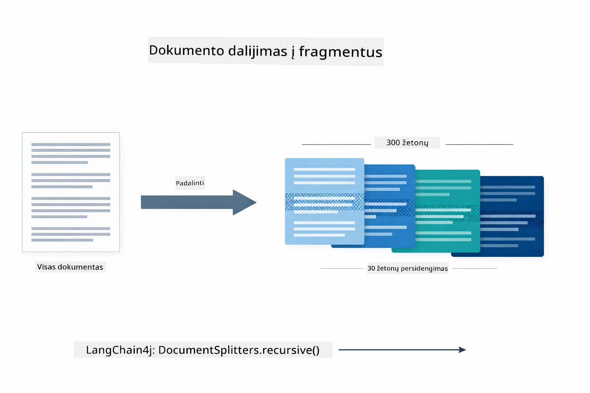

*Ši diagrama rodo, kaip dokumentas suskaidomas į 300 žetonų fragmentus su 30 žetonų persidengimu, išlaikant kontekstą fragmentų ribose.*

> **🤖 Išbandykite su [GitHub Copilot](https://github.com/features/copilot) pokalbių funkcija:** Atidarykite [`DocumentService.java`](../../../03-rag/src/main/java/com/example/langchain4j/rag/service/DocumentService.java) ir paklauskite:
> - „Kaip LangChain4j suskaido dokumentus į fragmentus ir kodėl persidengimas svarbus?“
> - „Koks yra optimalus fragmento dydis skirtingiems dokumentams ir kodėl?“
> - „Kaip tvarkyti dokumentus keliomis kalbomis ar su specialiu formatu?“

### Įterpimų kūrimas

[LangChainRagConfig.java](../../../03-rag/src/main/java/com/example/langchain4j/rag/config/LangChainRagConfig.java)

Kiekvienas fragmentas paverčiamas į skaitmeninę išraišką, vadinamą įterpimu – tarsi prasmių vertėju į skaičius. Įterpimų modelis nėra „protingas“ kaip pokalbių modelis; jis neseka komandų, nemąsto ar neatsako į klausimus. Jo darbas – atvaizduoti tekstą į matematinę erdvę, kur panaši reikšmė yra arti viena kitos – „automobilis“ šalia „automobilio“, „grąžinimo politika“ šalia „pinigų grąžinimo“. Pokalbių modelį įsivaizduokite kaip žmogų, su kuriuo galima kalbėtis; įterpimų modelis – kaip labai gerai veikianti dokumentų sistema.

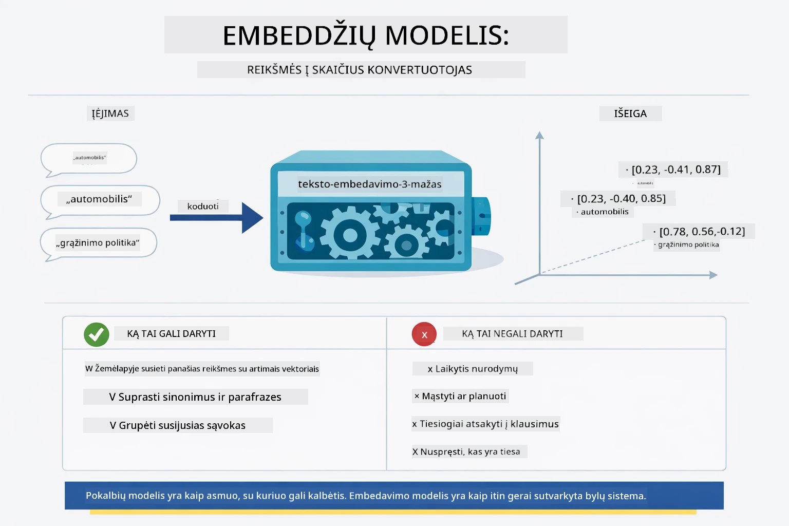

*Ši diagrama parodo, kaip įterpimų modelis paverčia tekstą į skaitmeninius vektorius, išdėstydamas panašias reikšmes – pvz., „automobilis“ ir „automobilis“ – arti viena kitos vektorinėje erdvėje.*

```java
@Bean
public EmbeddingModel embeddingModel() {
    return OpenAiOfficialEmbeddingModel.builder()
        .baseUrl(azureOpenAiEndpoint)
        .apiKey(azureOpenAiKey)
        .modelName(azureEmbeddingDeploymentName)
        .build();
}

EmbeddingStore<TextSegment> embeddingStore = 
    new InMemoryEmbeddingStore<>();
```
  
Klasės diagrama žemiau rodo du atskirus srautus RAG procese ir LangChain4j klases, kurios juos įgyvendina. **Duomenų suvartojimo srautas** (vykdomas vieną kartą įkėlimo metu) suskaido dokumentą, sukuria įterpimus fragmentams ir saugo juos per `.addAll()`. **Užklausų srautas** (vykdomas kiekvieną kartą, kai užduodamas klausimas) įterpia klausimą, ieško saugykloje per `.search()` ir perduoda surinktą kontekstą pokalbių modeliui. Abu srautai susijungia per bendrą `EmbeddingStore<TextSegment>` sąsają:

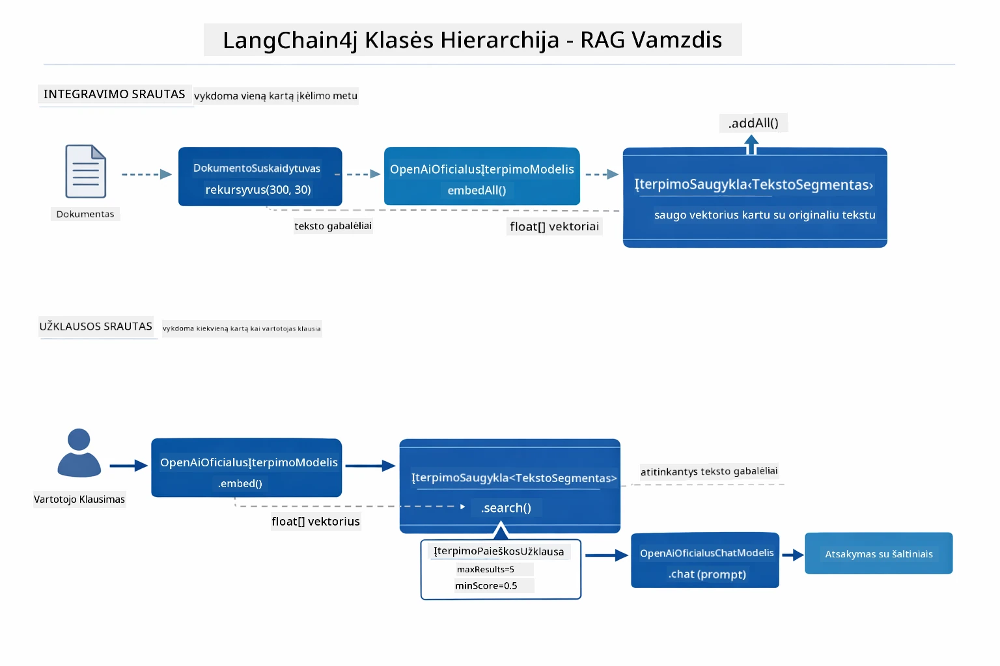

*Ši diagrama rodo du RAG srautus – duomenų suvartojimą ir klausimą – ir jų sąsają per bendrą EmbeddingStore.*

Įrašius įterpimus, panašus turinys natūraliai klasterizuojasi vektorinėje erdvėje. Žemiau pateikta vizualizacija rodo, kaip susijusios temos susikoncentruoja į artimus taškus, dėl ko įmanoma semantinė paieška:


*Ši vizualizacija rodo, kaip susiję dokumentai klasterizuojasi 3D vektorinėje erdvėje, su temomis kaip Techninės dokumentacijos, Verslo taisyklės ir DUK formuojančiomis atskirus grupes.*

Kai vartotojas ieško, sistema vykdo keturis žingsnius: vieną kartą įterpia dokumentus, kiekvieną kartą įterpia užklausą, palygina užklausos vektorių su visais saugomais vektoriais kosinuso panašumo metodu ir pateikia viršutinius K aukščiausius įvertintus fragmentus. Žemiau pateikta diagrama aiškina kiekvieną žingsnį ir LangChain4j klases:

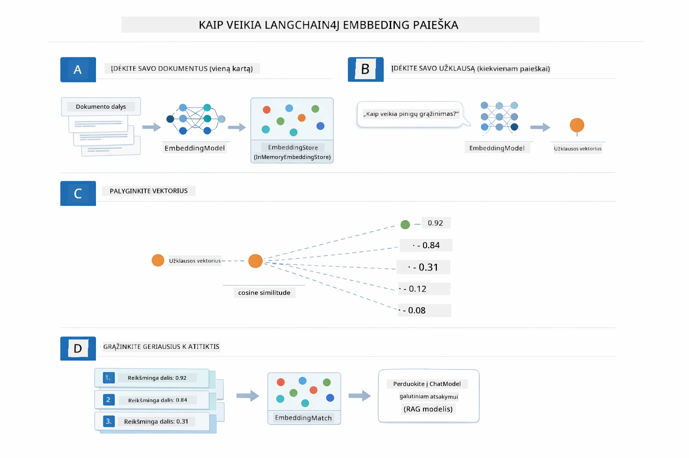

*Ši diagrama iliustruoja keturių žingsnių įterpimų paieškos procesą: įterpti dokumentus, įterpti užklausą, palyginti vektorius kosinuso panašumo būdu ir pateikti geriausius rezultatus.*

### Semantinė paieška

[RagService.java](../../../03-rag/src/main/java/com/example/langchain4j/rag/service/RagService.java)

Kai užduodate klausimą, jūsų klausimas taip pat virsta įterpimu. Sistema palygina jūsų klausimo įterpimą su visų dokumentų fragmentų įterpimais. Ji randa fragmentus, turinčius panašiausią reikšmę – ne tik atitinkančius raktažodžius, bet ir konceptualią semantinę panašumą.

```java
Embedding queryEmbedding = embeddingModel.embed(question).content();

EmbeddingSearchRequest searchRequest = EmbeddingSearchRequest.builder()
    .queryEmbedding(queryEmbedding)
    .maxResults(5)
    .minScore(0.5)
    .build();

EmbeddingSearchResult<TextSegment> searchResult = embeddingStore.search(searchRequest);
List<EmbeddingMatch<TextSegment>> matches = searchResult.matches();

for (EmbeddingMatch<TextSegment> match : matches) {
    String relevantText = match.embedded().text();
    double score = match.score();
}
```
  
Žemiau pateikta diagrama lygina semantinę paiešką su tradicine raktažodžių paieška. Raktažodžių paieška pagal „transporto priemonė“ praleidžia fragmentą apie „automobilius ir sunkvežimius“, bet semantinė paieška supranta, kad tai tas pats ir pateikia jį kaip aukštai įvertintą atitikmenį:

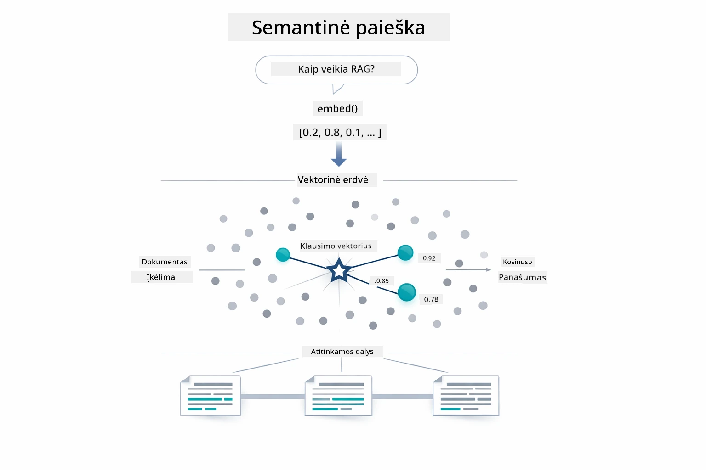

*Ši diagrama lygina raktažodžių pagrindu veikiančią paiešką su semantine, parodant, kaip semantinė paieška surenka konceptualiai susijusį turinį, net jei tikslūs raktažodžiai nesutampa.*

Sistemos viduje panašumas matuojamas kosinuso panašumo metodu – tarsi klausiama „ar šie du rodyklės rodo ta pačia kryptimi?“ Du fragmentai gali naudoti visiškai skirtingus žodžius, bet jei jų reikšmė ta pati, jų vektoriai nukreipti ta kryptimi ir įvertinimas yra arti 1.0:

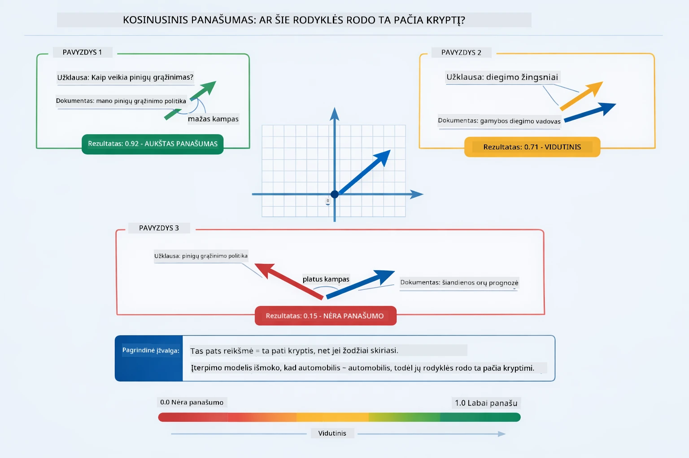

*Ši diagrama iliustruoja kosinuso panašumą kaip kampą tarp įterpimo vektorių – kuo vektoriai labiau suderinti, tuo jų balas arčiau 1.0, reiškiantis didesnį semantinį panašumą.*
> **🤖 Išbandykite su [GitHub Copilot](https://github.com/features/copilot) Chat:** Atidarykite [`RagService.java`](../../../03-rag/src/main/java/com/example/langchain4j/rag/service/RagService.java) ir užduokite:
> - "Kaip veikia panašumo paieška su imbeddingais ir kas lemia balą?"
> - "Kokį panašumo slenkstį turėčiau naudoti ir kaip tai veikia rezultatus?"
> - "Kaip elgtis, kai nerandami atitinkami dokumentai?"

### Atsakymo generavimas

[RagService.java](../../../03-rag/src/main/java/com/example/langchain4j/rag/service/RagService.java)

Patys aktualiausi tekstų gabalai sujungiami į struktūruotą užklausą, kuri apima aiškias instrukcijas, surinktą kontekstą ir vartotojo klausimą. Modelis skaito tuos konkrečius gabalus ir atsako remdamasis ta informacija – jis gali naudoti tik tai, kas jam pateikta, taip išvengiant klajonių informacijos srityje.

```java
String context = matches.stream()
    .map(match -> match.embedded().text())
    .collect(Collectors.joining("\n\n"));

String prompt = String.format("""
    Answer the question based on the following context.
    If the answer cannot be found in the context, say so.

    Context:
    %s

    Question: %s

    Answer:""", context, request.question());

String answer = chatModel.chat(prompt);
```

Žemiau pateiktame diagramoje parodyta, kaip vyksta šis sujungimas – aukščiausiai įvertinti gabalai iš paieškos etapo įterpiami į užklausos šabloną, o `OpenAiOfficialChatModel` generuoja tvirtai pagrįstą atsakymą:

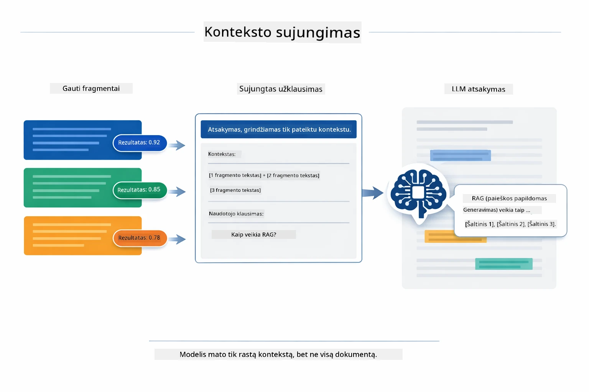

*Ši diagrama parodo, kaip aukščiausiai įvertinti tekstų gabalai sujungiami į struktūruotą užklausą, leidžiančią modeliui generuoti pagrįstą atsakymą iš jūsų duomenų.*

## Programos paleidimas

**Patikrinkite diegimą:**

Įsitikinkite, kad pagrindiniame kataloge yra `.env` failas su Azure kredencialais (sukurtas 1 Modulyje):

**Bash:**
```bash
cat ../.env  # Turėtų rodyti AZURE_OPENAI_ENDPOINT, API_KEY, DEPLOYMENT
```

**PowerShell:**
```powershell
Get-Content ..\.env  # Turėtų rodyti AZURE_OPENAI_ENDPOINT, API_KEY, DEPLOYMENT
```

**Paleiskite programą:**

> **Pastaba:** Jei jau paleidote visas programas naudodami `./start-all.sh` iš 1 Modulio, šis modulis jau veikia 8081 porte. Galite praleisti žemiau pateiktas paleidimo komandas ir tiesiog nueiti į http://localhost:8081.

**1 variantas: Naudojant Spring Boot Dashboard (rekomenduojama VS Code naudotojams)**

Dev konteineryje yra Spring Boot Dashboard plėtinys, suteikiantis vizualią sąsają valdyti visas Spring Boot programas. Jį rasite veiklos juostoje kairėje VS Code pusėje (ieškokite Spring Boot ikonos).

Naudodamiesi Spring Boot Dashboard galite:
- Matyti visas prieinamas Spring Boot programas darbo aplinkoje
- Vienu spustelėjimu paleisti/stabdyti programas
- Realiniu laiku peržiūrėti programų žurnalus
- Stebėti programų būseną

Tiesiog spustelėkite žaidimo mygtuką šalia „rag“ ir paleiskite šį modulį arba paleiskite visus modulius iš karto.


*Ši ekrano nuotrauka rodo Spring Boot Dashboard VS Code, kur galite vizualiai paleisti, stabdyti ir stebėti programas.*

**2 variantas: Naudojant shell scenarijus**

Paleiskite visas interneto programas (1–4 moduliai):

**Bash:**
```bash
cd ..  # Iš šaknininio katalogo
./start-all.sh
```

**PowerShell:**
```powershell
cd ..  # Iš šaknininio katalogo
.\start-all.ps1
```

Arba paleiskite tik šį modulį:

**Bash:**
```bash
cd 03-rag
./start.sh
```

**PowerShell:**
```powershell
cd 03-rag
.\start.ps1
```

Abu scenarijai automatiškai užkrauna aplinkos kintamuosius iš pagrindinio `.env` failo ir sukurs JAR failus, jei jų nėra.

> **Pastaba:** Jei norite rankiniu būdu sukurti visus modulius prieš paleidimą:
>
> **Bash:**
> ```bash
> cd ..  # Go to root directory
> mvn clean package -DskipTests
> ```
>
> **PowerShell:**
> ```powershell
> cd ..  # Go to root directory
> mvn clean package -DskipTests
> ```

Atidarykite naršyklėje http://localhost:8081.

**Norint sustabdyti:**

**Bash:**
```bash
./stop.sh  # Tik šis modulis
# Arba
cd .. && ./stop-all.sh  # Visi moduliai
```

**PowerShell:**
```powershell
.\stop.ps1  # Tik šis modulis
# Arba
cd ..; .\stop-all.ps1  # Visi moduliai
```

## Programos naudojimas

Programa suteikia žiniatinklio sąsają dokumentų įkėlimui ir klausimų uždavimui.

<a href="images/rag-homepage.png"></a>

*Ši ekrano nuotrauka rodo RAG programos sąsają, kur galite įkelti dokumentus ir užduoti klausimus.*

### Įkelkite dokumentą

Pradėkite nuo dokumento įkėlimo – geriausiai testavimui tinka TXT failai. Šiame kataloge yra pateiktas `sample-document.txt`, kuriame rasite informaciją apie LangChain4j funkcijas, RAG įgyvendinimą ir geriausias praktikas – puikiai tinkantis sistemai išbandyti.

Sistema apdoroja jūsų dokumentą, suskaido jį į gabalus ir sukuria embeddingus kiekvienam gabalui. Tai vyksta automatiškai įkėlimo metu.

### Užduokite klausimus

Dabar užduokite specifinius klausimus apie dokumento turinį. Bandykite kažką faktinio, kas aiškiai yra pateikta dokumente. Sistema ieško aktualių gabalų, įtraukia juos į užklausą ir generuoja atsakymą.

### Patikrinkite šaltinių nuorodas

Atkreipkite dėmesį, kad kiekvienas atsakymas turi šaltinių nuorodas su panašumo balais. Šie balai (nuo 0 iki 1) parodo, kaip labai kiekvienas gabalas buvo susijęs su jūsų klausimu. Aukštesni balai reiškia geresnius atitikmenis. Tai leidžia jums patikrinti atsakymą prieš pradinius duomenis.

<a href="images/rag-query-results.png"></a>

*Ši ekrano nuotrauka rodo užklausos rezultatus su sugeneruotu atsakymu, šaltinių nuorodomis ir aktualumo balais kiekvienam surastam gabalui.*

### Eksperimentuokite su klausimais

Išbandykite skirtingų tipų klausimus:
- Specifiniai faktai: „Kokia pagrindinė tema?“
- Palyginimai: „Kuo skiriasi X ir Y?“
- Santraukos: „Apibendrinkite svarbiausius taškus apie Z“

Stebėkite, kaip keičiasi aktualumo balai, priklausomai nuo to, kaip gerai jūsų klausimas atitinka dokumentų turinį.

## Pagrindinės sąvokos

### Gabalų skaidymo strategija

Dokumentai suskaidomi į 300 ženklų gabalus su 30 ženklų persidengimu. Toks balansas užtikrina, kad kiekvienas gabalas turi pakankamai konteksto, kad būtų prasmingas, tuo pačiu išlaikant gabalus pakankamai mažus, kad jų būtų galima įtraukti daugiau užklausoje.

### Panašumo balai

Kiekvienas rastas gabalas turi panašumo balą nuo 0 iki 1, kuris rodo, kaip tiksliai jis atitinka vartotojo klausimą. Žemiau pateikta diagrama vizualizuoja balų intervalus ir kaip sistema juos naudoja rezultatų filtravimui:

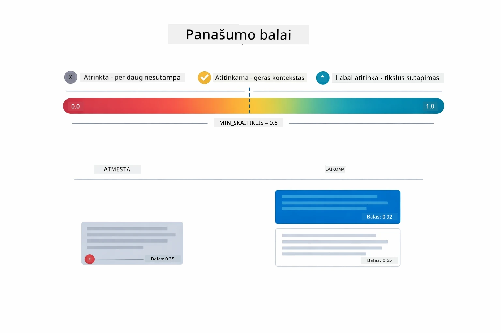

*Ši diagrama rodo balų intervalus nuo 0 iki 1, su minimaliu slenksčiu 0,5, kuris filtruoją nereikšmingus gabalus.*

Balai svyruoja nuo 0 iki 1:
- 0,7-1,0: Labai aktualu, tiksli atitiktis
- 0,5-0,7: Aktualu, geras kontekstas
- Žemiau 0,5: Filtruojama, per daug skirtinga

Sistema grąžina tik gabalus virš minimalaus slenksčio, kad užtikrintų kokybę.

Embeddingai gerai veikia, kai reikšmės aiškiai suskirstytos į klasterius, tačiau turi neaiškių vietų. Žemiau pateikta diagrama parodo dažniausias nesėkmių situacijas – per dideli gabalai sukuria miglotus vektorius, per maži gabalai neturi konteksto, neaiškūs terminai rodo į kelis klasterius, o tikslūs atitikimai (ID, dalių numeriai) visiškai neveikia su embeddingais:

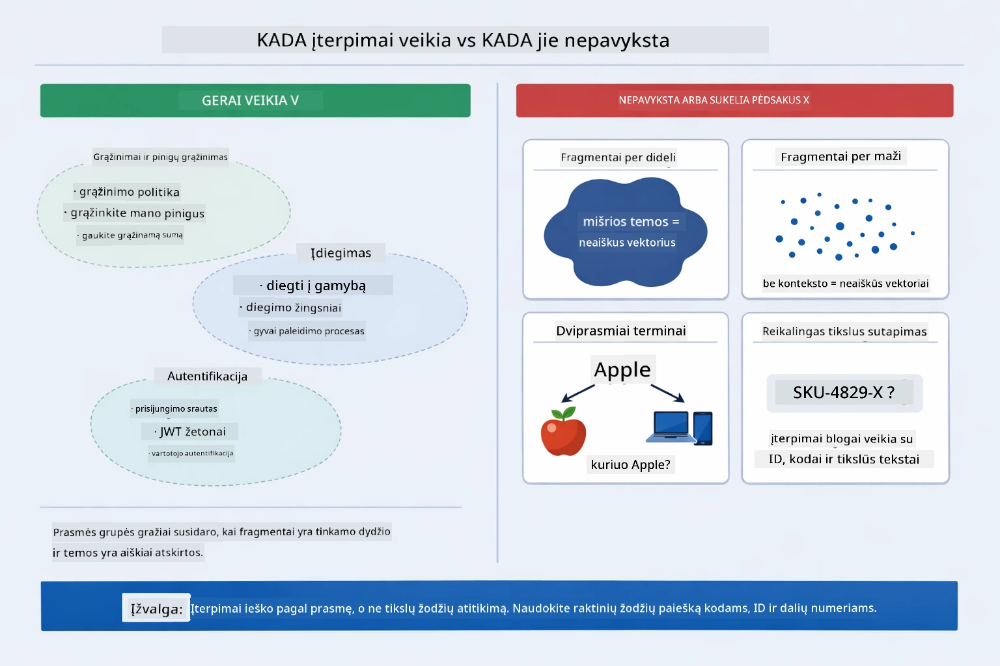

*Ši diagrama rodo dažniausias embeddingų nesėkmių rūšis: per dideli gabalai, per maži gabalai, neaiškūs terminai, kurie rodo kelis klasterius, ir tikslių atitikimų ieškojimai, pvz., pagal ID.*

### Atminties saugykla

Šis modulis naudoja atminties saugyklą paprastumui. Kai perkraunate programą, įkelti dokumentai prarandami. Gamybinėse sistemose naudojamos pastovios vektorinės duomenų bazės, tokios kaip Qdrant ar Azure AI Search.

### Konteksto lango valdymas

Kiekvienas modelis turi maksimalų konteksto langą. Negalite įtraukti kiekvieno gabalo iš didelio dokumento. Sistema paima top N (pagal nutylėjimą 5) aktualiausių gabalų, kad tilptų į apribojimus ir suteiktų pakankamai konteksto tiksliems atsakymams.

## Kada svarbus RAG

RAG nėra visada tinkamas sprendimas. Žemiau pateiktas sprendimų gidas padeda nuspręsti, kada RAG prideda vertės, o kada paprastesni metodai – kaip turinio įtraukimas tiesiogiai į užklausą arba modelio integruotos žinios – yra pakankami:

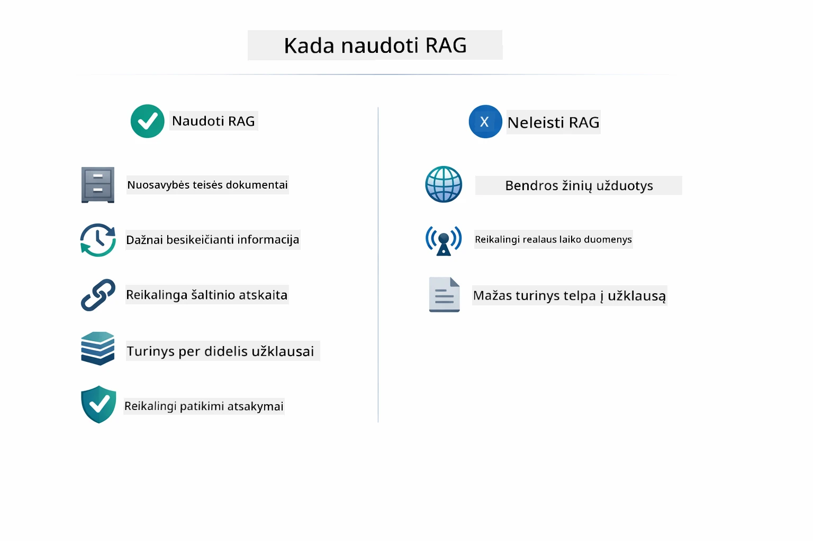

*Ši diagrama rodo sprendimų gidą, kada verta naudoti RAG, o kada užtenka paprastesnių metodų.*

**Naudokite RAG, kai:**
- Atsakote į klausimus apie konfidencialius dokumentus
- Informacija dažnai keičiasi (politikos, kainos, specifikacijos)
- Reikalingas tikslumas su šaltinių pateikimu
- Turinys per didelis, kad tilptų į vieną užklausą
- Reikia patikimų ir patvirtinamų atsakymų

**Nenaudokite RAG, kai:**
- Klausimai reikalauja bendrųjų žinių, kurias modelis jau turi
- Reikia realaus laiko duomenų (RAG veikia su įkeltais dokumentais)
- Turinys pakankamai mažas, kad būtų galima įtraukti tiesiogiai į užklausas

## Tolimesni žingsniai

**Kitas modulis:** [04-tools - AI agentai su įrankiais](../04-tools/README.md)

---

**Navigacija:** [← Ankstesnis: Modulis 02 - Užklausų inžinerija](../02-prompt-engineering/README.md) | [Atgal į pradžią](../README.md) | [Kitas: Modulis 04 - Įrankiai →](../04-tools/README.md)

---

<!-- CO-OP TRANSLATOR DISCLAIMER START -->
**Atsakomybės atsisakymas**:
Šis dokumentas buvo išverstas naudojant dirbtinio intelekto vertimo paslaugą [Co-op Translator](https://github.com/Azure/co-op-translator). Nors stengiamės užtikrinti tikslumą, atkreipkite dėmesį, kad automatiniai vertimai gali turėti klaidų arba netikslumų. Originalus dokumentas gimtąja kalba turėtų būti laikomas autoritetingu šaltiniu. Esant svarbiai informacijai, rekomenduojamas profesionalus žmogaus vertimas. Mes neprisiimame atsakomybės už bet kokius nesusipratimus ar neteisingus interpretavimus, atsiradusius dėl šio vertimo naudojimo.
<!-- CO-OP TRANSLATOR DISCLAIMER END -->