# Module 04: Dirbtinio Intelekto Agentai su Įrankiais

## Turinys

- [Vaizdo įrašo peržiūra](../../../04-tools)
- [Ką sužinosite](../../../04-tools)
- [Priešistorė](../../../04-tools)
- [Dirbtinio intelekto agentų su įrankiais supratimas](../../../04-tools)
- [Kaip veikia įrankių kvietimas](../../../04-tools)
  - [Įrankių apibrėžimai](../../../04-tools)
  - [Sprendimų priėmimas](../../../04-tools)
  - [Vykdymas](../../../04-tools)
  - [Atsakymo generavimas](../../../04-tools)
  - [Architektūra: Spring Boot automatinis sujungimas](../../../04-tools)
- [Įrankių grandinėlės](../../../04-tools)
- [Programos paleidimas](../../../04-tools)
- [Programos naudojimas](../../../04-tools)
  - [Išbandykite paprastą įrankių naudojimą](../../../04-tools)
  - [Išbandykite įrankių grandinėlę](../../../04-tools)
  - [Peržiūrėkite pokalbio eigą](../../../04-tools)
  - [Eksperimentuokite su skirtingais užklausimais](../../../04-tools)
- [Pagrindinės sąvokos](../../../04-tools)
  - [ReAct modelis (mąstymas ir veikimas)](../../../04-tools)
  - [Įrankių aprašymai yra svarbūs](../../../04-tools)
  - [Sesijos valdymas](../../../04-tools)
  - [Klaidų tvarkymas](../../../04-tools)
- [Galimi įrankiai](../../../04-tools)
- [Kada naudoti agentus su įrankiais](../../../04-tools)
- [Įrankiai ir RAG](../../../04-tools)
- [Tolimesni žingsniai](../../../04-tools)

## Vaizdo įrašo peržiūra

Peržiūrėkite šią tiesioginę sesiją, kurioje paaiškinama, kaip pradėti darbą su šiuo moduliu:

<a href="https://www.youtube.com/watch?v=O_J30kZc0rw"></a>

## Ką sužinosite

Iki šiol jūs išmokote bendrauti su DI, efektyviai struktūruoti užklausas ir pagrįsti atsakymus savo dokumentais. Tačiau lieka pagrindinis apribojimas: kalbos modeliai gali tik generuoti tekstą. Jie negali patikrinti oro sąlygų, atlikti skaičiavimų, užklausti duomenų bazių ar sąveikauti su išorinėmis sistemomis.

Įrankiai tai keičia. Suteikdami modeliui funkcijų, kurias jis gali kviesti, jūs paverčiate jį iš teksto generatoriaus į agentą, kuris gali imtis veiksmų. Modelis pats nusprendžia, kada jam reikia įrankio, kurį įrankį naudoti ir kokius parametrus perduoti. Jūsų kodas vykdo funkciją ir grąžina rezultatą. Modelis įtraukia tą rezultatą į savo atsakymą.

## Priešistorė

- Baigtas [Modulis 01 - Įvadas](../01-introduction/README.md) (Įdiegti Azure OpenAI resursai)
- Rekomenduojama baigti ankstesnius modulius (šis modulis nurodo [RAG sąvokas iš Modulis 03](../03-rag/README.md) įrankių ir RAG palyginime)
- Šakninėje direktorijoje yra `.env` failas su Azure kredencialais (sukurtas vykdant `azd up` Modulyje 01)

> **Pastaba:** Jeigu dar nebaigėte Modulio 01, pirmiausia sekite ten pateiktas diegimo instrukcijas.

## Dirbtinio intelekto agentų su įrankiais supratimas

> **📝 Pastaba:** Šio modulio terminas „agentai“ reiškia DI asistentus patobulintus su įrankių kvietimo galimybėmis. Tai skiriasi nuo **Agentinio DI** modelių (autonominių agentų su planavimu, atmintimi ir kelių žingsnių mąstymu), kuriuos aptarsime [Modulis 05: MCP](../05-mcp/README.md).

Be įrankių kalbos modelis gali tik generuoti tekstą iš savo mokymosi duomenų. Paklauskite jo apie esamą orą, ir jis turi spėti. Pateikite įrankius, ir jis gali kviesti oro sąlygų API, atlikti skaičiavimus ar užklausti duomenų bazę — ir tuomet į savo atsakymą įtraukti tuos tikrus rezultatus.

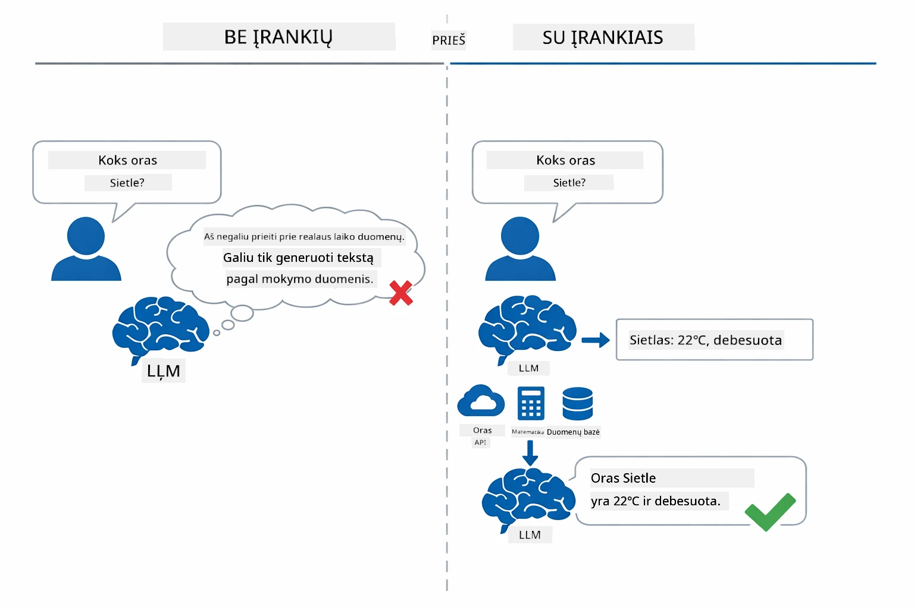

*Be įrankių modelis tik spėlioja — su įrankiais jis gali kviesti API, atlikti skaičiavimus ir grąžinti realaus laiko duomenis.*

DI agentas su įrankiais seka **Mąstymo ir Veikimo (ReAct)** modelį. Modelis ne tik atsako — jis mąsto apie tai, ko jam reikia, veikia kviesdamas įrankį, stebi rezultatą ir tada sprendžia, ar veikti toliau, ar pateikti galutinį atsakymą:

1. **Mąsto** — Agentas analizuojapro kalbėtojo klausimą ir nustato kokios informacijos jam reikia
2. **Veikia** — Agentas pasirenka tinkamą įrankį, sugeneruoja tinkamus parametrus ir jį kviečia
3. **Stebi** — Agentas gauna įrankio išvestį ir įvertina rezultatą
4. **Kartoja arba atsako** — Jei reikalinga daugiau duomenų, agentas kartoja ciklą; priešingu atveju sukuria natūralios kalbos atsakymą

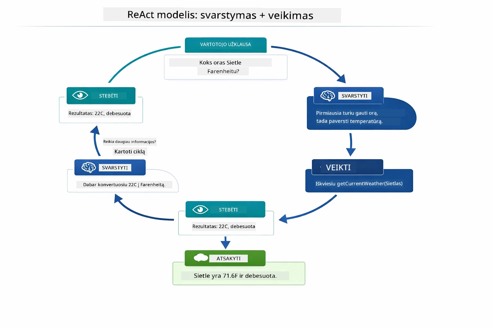

*ReAct ciklas — agentas mąsto, ką daryti, veikia kviesdamas įrankį, stebi rezultatą ir kartoja, kol gali pateikti galutinį atsakymą.*

Tai vyksta automatiškai. Jūs apibrėžiate įrankius ir jų aprašymus. Modelis priima sprendimus, kada ir kaip juos naudoti.

## Kaip veikia įrankių kvietimas

### Įrankių apibrėžimai

[WeatherTool.java](../../../04-tools/src/main/java/com/example/langchain4j/agents/tools/WeatherTool.java) | [TemperatureTool.java](../../../04-tools/src/main/java/com/example/langchain4j/agents/tools/TemperatureTool.java)

Jūs apibrėžiate funkcijas su aiškiais aprašymais ir parametrų specifikacijomis. Modelis mato šiuos aprašymus savo sistemos užklausoje ir supranta, ką kiekvienas įrankis atlieka.

```java
@Component
public class WeatherTool {
    
    @Tool("Get the current weather for a location")
    public String getCurrentWeather(@P("Location name") String location) {
        // Jūsų orų paieškos logika
        return "Weather in " + location + ": 22°C, cloudy";
    }
}

@AiService
public interface Assistant {
    String chat(@MemoryId String sessionId, @UserMessage String message);
}

// Asistentas automatiškai sujungiamas per Spring Boot su:
// - ChatModel komponentu
// - Visais @Tool metodais iš @Component klasių
// - ChatMemoryProvider sesijų valdymui
```

Žemiau pateiktame diagramoje aiškinamos visos anotacijos ir kaip kiekvienas jų elementas padeda DI suprasti, kada kviečiama įrankį ir kokius argumentus perduoti:

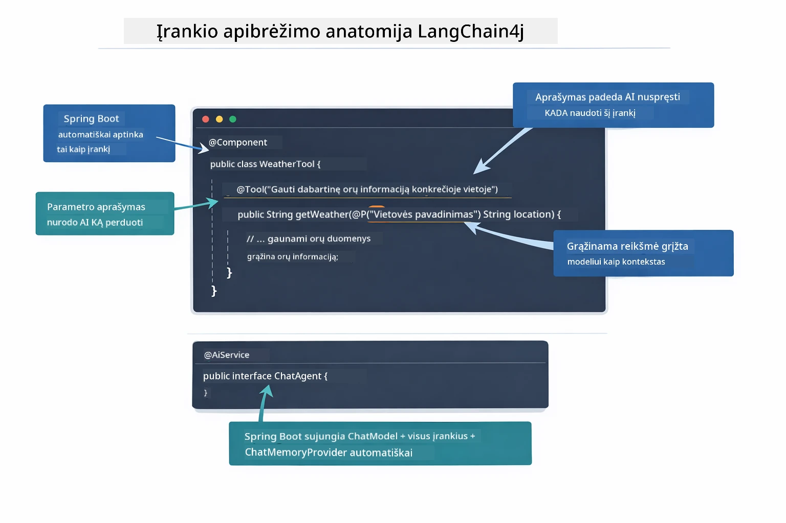

*Įrankio apibrėžimo anatomija — @Tool nurodo DI, kada naudoti įrankį, @P aprašo kiekvieną parametrą, o @AiService sujungia viską paleidimo metu.*

> **🤖 Išbandykite su [GitHub Copilot](https://github.com/features/copilot) Chat:** Atidarykite [`WeatherTool.java`](../../../04-tools/src/main/java/com/example/langchain4j/agents/tools/WeatherTool.java) ir paklauskite:
> - „Kaip integruočiau tikrą oro API, pvz., OpenWeatherMap, vietoj imitacinių duomenų?“
> - „Kas sudaro gerą įrankio aprašymą, kuris padeda DI naudoti įrankį teisingai?“
> - „Kaip tvarkyti API klaidas ir kvotų ribojimus įrankių įgyvendinime?“

### Sprendimų priėmimas

Kai vartotojas paklausia „Koks oras Sietle?“, modelis neatsitiktinai pasirenka įrankį. Jis lygina vartotojo intenciją su visų prieinamų įrankių aprašymais, vertina kiekvieno atitikimą ir pasirenka geriausiai tinkantį. Tuomet sugeneruoja struktūruotą funkcijos kvietimą su tinkamais parametrais — šiuo atveju, nustatydamas `location` į `"Seattle"`.

Jei jokio įrankio neatitinka vartotojo užklausos, modelis grįžta prie atsakymo pagal savo žinias. Jei keli įrankiai atitinka, jis pasirenka konkretžiausią.

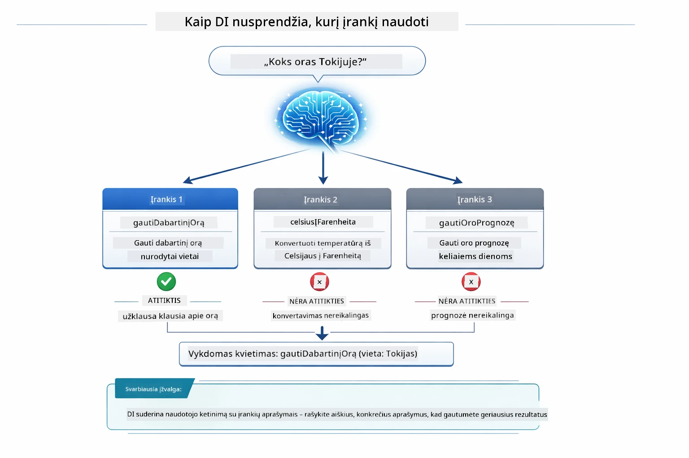

*Modelis įvertina kiekvieną prieinamą įrankį pagal vartotojo intenciją ir pasirenka geriausiai tinkantį — todėl aiškūs, konkretūs įrankių aprašymai yra labai svarbūs.*

### Vykdymas

[AgentService.java](../../../04-tools/src/main/java/com/example/langchain4j/agents/service/AgentService.java)

Spring Boot automatiškai sujungia deklaratyvų `@AiService` interfeisą su visais registruotais įrankiais, o LangChain4j vykdo įrankių kvietimus automatiškai. Užkulisiuose pilnas įrankio kvietimo procesas praeina per šešias stadijas — nuo vartotojo natūralios kalbos klausimo iki natūralaus atsakymo:

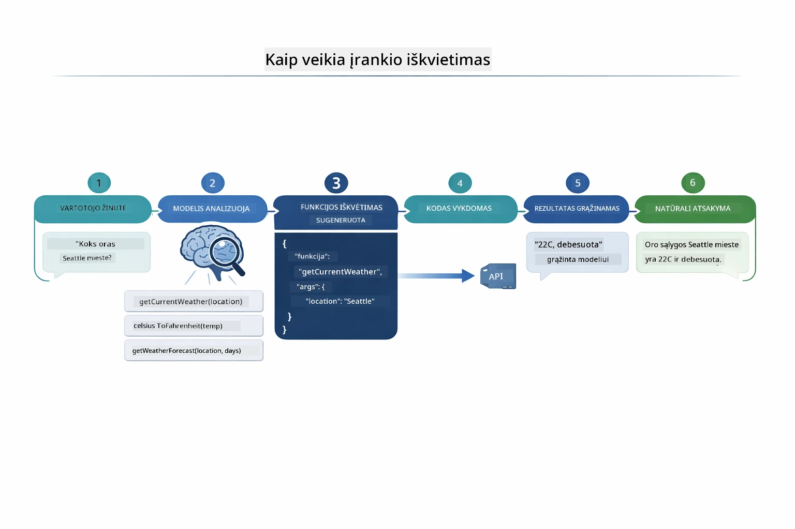

*Visas procesas — vartotojas užduoda klausimą, modelis pasirenka įrankį, LangChain4j jį vykdo, o modelis integruoja rezultatą į natūralų atsakymą.*

Jeigu vykdėte [ToolIntegrationDemo](../../../00-quick-start/src/main/java/com/example/langchain4j/quickstart/ToolIntegrationDemo.java) Modulyje 00, jau matėte šio modelio veikimą — „Calculator“ įrankiai buvo kviečiami taip pat. Žemiau pateiktame sekos diagramoje matyti, kas vyko užkulisiuose to demo metu:

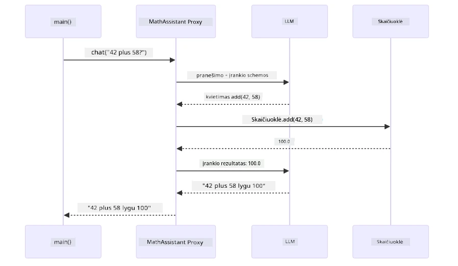

*Įrankio kvietimo ciklas greitojo starto demo metu — `AiServices` siunčia jūsų žinutę ir įrankių schemas LLM, LLM atsako struktūruotu funkcijos kvietimu pavyzdžiui `add(42, 58)`, LangChain4j lokaliai vykdo `Calculator` metodą ir grąžina rezultatą galutiniam atsakymui.*

> **🤖 Išbandykite su [GitHub Copilot](https://github.com/features/copilot) Chat:** Atidarykite [`AgentService.java`](../../../04-tools/src/main/java/com/example/langchain4j/agents/service/AgentService.java) ir paklauskite:
> - „Kaip veikia ReAct modelis ir kodėl jis efektyvus DI agentams?“
> - „Kaip agentas nusprendžia, kurį įrankį naudoti ir kokia tvarka?“
> - „Kas nutinka, jei įrankio vykdymas nepavyksta – kaip tinkamai tvarkyti klaidas?“

### Atsakymo generavimas

Modelis gauna oro duomenis ir formatuoja juos į natūralios kalbos atsakymą vartotojui.

### Architektūra: Spring Boot automatinis sujungimas

Šis modulis naudoja LangChain4j integraciją su Spring Boot per deklaratyvius `@AiService` interfeisus. Paleidimo metu Spring Boot suranda kiekvieną `@Component`, kuriame yra `@Tool` metodai, jūsų `ChatModel` komponentą ir `ChatMemoryProvider`, ir sujungia juos į vieną `Assistant` interfeisą be jokio papildomo boilerplate kodo.

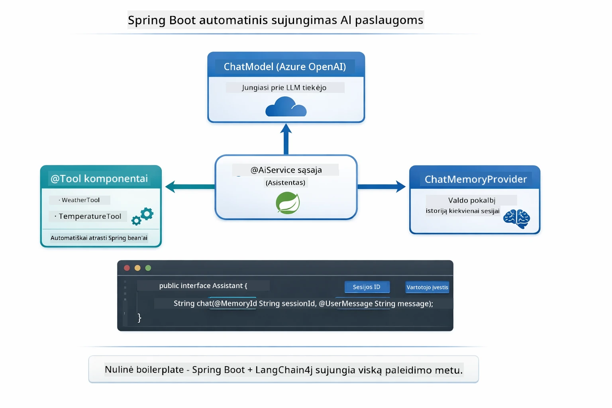

*@AiService interfeisas sujungia ChatModel, įrankius ir atminties tiekėją — Spring Boot automatiškai atlieka visą sujungimą.*

Toliau pateikta viso užklausos gyvenimo ciklo sekos diagrama — nuo HTTP užklausos per kontrolerį, servisą ir automatiškai sujungtą proxy, iki įrankio vykdymo ir atgal:

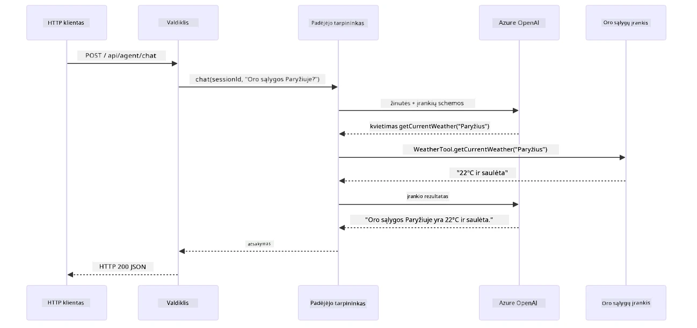

*Pilnas Spring Boot užklausos ciklas — HTTP užklausa praeina per kontrolerį ir servisą iki automatiškai sujungto Assistant proxy, kuris automatizuoja LLM ir įrankių kvietimus.*

Pagrindiniai šio požiūrio privalumai:

- **Spring Boot automatinis sujungimas** — ChatModel ir įrankiai automatiškai įjungiami
- **@MemoryId modelis** — automatinis sesijos pagrindu veikiantis atminties valdymas
- **Vienas egzempliorius** — Assistant sukuriamas vieną kartą ir pakartotinai naudojamas geresniam našumui
- **Tipų saugus vykdymas** — Java metodai kviečiami tiesiogiai su tipų konvertavimu
- **Daugiaturninė orkestracija** — Automatiškai valdo įrankių grandinėlę
- **Nulinis boilerplate** — Nereikia rankiniu `AiServices.builder()` kvietimų arba atminties HashMap

Alternatyvūs metodai (rankinis `AiServices.builder()`) reikalauja daugiau kodo ir neturi Spring Boot integracijos privalumų.

## Įrankių grandinėlės

**Įrankių grandinėlė** — Tikroji įrankiais pagrįstų agentų galia atsiskleidžia kai į vieną klausimą reikia kelių įrankių. Paklauskite „Koks oras Sietle pagal Farenheito skalę?“ ir agentas automatiškai sudaro grandinėlę iš dviejų įrankių: pirmiausia kviečia `getCurrentWeather`, kad gautų temperatūrą Celsijumi, tada perduoda tą reikšmę į `celsiusToFahrenheit` konvertavimui — visa tai viename pokalbio cikle.

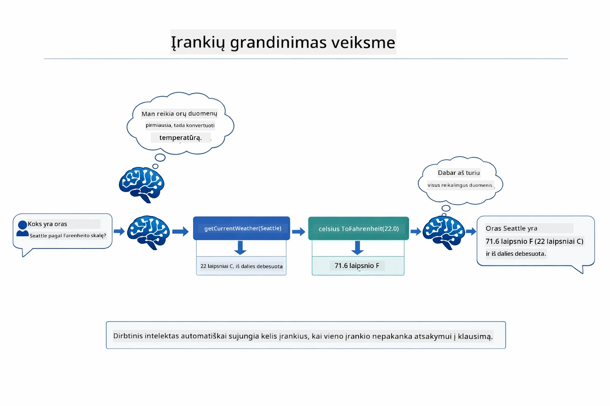

*Įrankių grandinėlės veikimas — agentas pirmiausia kviečia getCurrentWeather, tada persiunčia Celsijaus rezultatą į celsiusToFahrenheit ir pateikia jungtinį atsakymą.*

**Gražios gedimų tvarkymo reakcijos** — Paklauskite apie orą mieste, kuris nėra imitaciniuose duomenyse. Įrankis grąžina klaidos pranešimą, o DI paaiškina, kad negali padėti namiest to, kad programėlė sugestų. Įrankiai saugiai reaguoja į klaidas. Žemiau pateikta schema rodo skirtumą tarp dviejų požiūrių — tinkamai tvarkant klaidas agentas užfiksuoja išimtį ir atsako pagalbiniu pranešimu, o be to taikomoji programa sugenda:

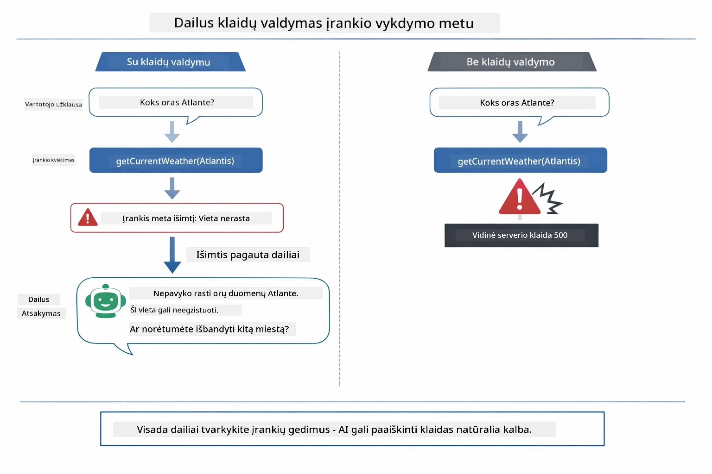

*Kai įrankis sugenda, agentas užfiksuoja klaidą ir atsako naudingą paaiškinimą vietoje programos gedimo.*

Tai vyksta viename pokalbio cikle. Agentas automatiškai orkestruoja kelis įrankių kvietimus.

## Programos paleidimas

**Patikrinkite diegimą:**

Įsitikinkite, kad `.env` faile šakninėje direktorijoje yra Azure kredencialai (sukurti Modulio 01 metu). Paleiskite tai iš šio modulio katalogo (`04-tools/`):

**Bash:**
```bash
cat ../.env  # Turėtų parodyti AZURE_OPENAI_ENDPOINT, API_KEY, DEPLOYMENT
```

**PowerShell:**
```powershell
Get-Content ..\.env  # Turėtų parodyti AZURE_OPENAI_ENDPOINT, API_KEY, DEPLOYMENT
```

**Paleiskite programą:**

> **Pastaba:** Jeigu jau paleidote visas programas naudodami `./start-all.sh` iš šakninės direktorijos (kaip aprašyta Modulyje 01), šis modulis jau veikia 8084 porte. Galite praleisti paleidimo komandas ir nueiti tiesiai į http://localhost:8084.

**1 variantas: naudoti Spring Boot Dashboard (rekomenduojama VS Code vartotojams)**

Dev konteineryje yra Spring Boot Dashboard plėtinys, suteikiantis vizualią sąsają visoms Spring Boot programoms valdyti. Jį rasite kairėje pusėje esančiame veiklų juostoje VS Code (pažymėkite Spring Boot piktogramą).

Iš Spring Boot Dashboard galite:
- Peržiūrėti visas prieinamas Spring Boot programas darbo aplinkoje
- Vienu paspaudimu paleisti / sustabdyti programas
- Matyti programų realaus laiko žurnalus
- Stebėti programos būseną
Tiesiog spustelėkite paleidimo mygtuką šalia „tools“, kad pradėtumėte šį modulį, arba paleiskite visus modulius vienu metu.

Vaizdas, kaip atrodo Spring Boot valdymo skydelis VS Code:


*Spring Boot valdymo skydelis VS Code — paleiskite, sustabdykite ir stebėkite visus modulius iš vienos vietos*

**2 variantas: naudojant shell scenarijus**

Paleiskite visas žiniatinklio programas (modulius 01-04):

**Bash:**
```bash
cd ..  # Iš šaknininio katalogo
./start-all.sh
```

**PowerShell:**
```powershell
cd ..  # Iš root katalogo
.\start-all.ps1
```

Arba paleiskite tik šį modulį:

**Bash:**
```bash
cd 04-tools
./start.sh
```

**PowerShell:**
```powershell
cd 04-tools
.\start.ps1
```

Abu scenarijai automatiškai įkelia aplinkos kintamuosius iš pagrindinio `.env` failo ir sukompiliuos JAR failus, jei jų nėra.

> **Pastaba:** Jei norite prieš paleisdami rankiniu būdu sukompiliuoti visus modulius:
>
> **Bash:**
> ```bash
> cd ..  # Go to root directory
> mvn clean package -DskipTests
> ```
>
> **PowerShell:**
> ```powershell
> cd ..  # Go to root directory
> mvn clean package -DskipTests
> ```

Naršyklėje atidarykite http://localhost:8084.

**Norint sustabdyti:**

**Bash:**
```bash
./stop.sh  # Tik šis modulis
# Arba
cd .. && ./stop-all.sh  # Visi moduliai
```

**PowerShell:**
```powershell
.\stop.ps1  # Tik šis modulis
# Arba
cd ..; .\stop-all.ps1  # Visi moduliai
```

## Kaip naudoti programą

Programa siūlo žiniatinklio sąsają, kurioje galite bendrauti su AI agentu, turinčiu prieigą prie orų ir temperatūros konvertavimo įrankių. Štai kaip atrodo sąsaja — ji apima greito pradžios pavyzdžius ir pokalbių panelę užklausoms siųsti:

<a href="images/tools-homepage.png"></a>

*AI agento įrankių sąsaja – greiti pavyzdžiai ir pokalbių sąsaja darbui su įrankiais*

### Išbandykite paprastą įrankio naudojimą

Pradėkite nuo paprastos užklausos: „Konvertuokite 100 laipsnių Farenheito į Celsijų“. Agentas supranta, kad reikia naudoti temperatūros konvertavimo įrankį, iškviečia jį su tinkamais parametrais ir pateikia rezultatą. Pastebėkite, kaip natūraliai tai jaučiasi — jūs nenurodėte, kurį įrankį naudoti ar kaip jį iškviesti.

### Išbandykite įrankių grandinėlę

Dabar pabandykite kažką sudėtingesnio: „Koks oras Sietle ir konvertuokite jį į Farenheitą?“ Stebėkite, kaip agentas sprendžia žingsnis po žingsnio. Pirmiausia gauna orų prognozę (kuri pateikiama Celsijumi), supranta, kad reikia konvertuoti į Farenheitą, iškviečia konvertavimo įrankį ir sujungia abu rezultatus į vieną atsakymą.

### Peržiūrėkite pokalbio eigą

Pokalbių sąsaja saugo pokalbio istoriją, leidžiantį palaikyti kelių raundų sąveiką. Matote visas ankstesnes užklausas ir atsakymus, kas palengvina pokalbio stebėjimą ir leidžia suprasti, kaip agentas stato kontekstą per kelis keitimus.

<a href="images/tools-conversation-demo.png"></a>

*Daugiaraundis pokalbis, rodantis paprastus konvertavimus, orų paieškas ir įrankių grandinėlę*

### Eksperimentuokite su skirtingomis užklausomis

Išbandykite įvairius derinius:
- Orų paieškos: „Koks oras Tokijuje?“
- Temperatūros konvertavimas: „Kiek yra 25 °C kelvinuose?“
- Kombinuotos užklausos: „Patikrink orą Paryžiuje ir pasakyk, ar temperatūra viršija 20 °C“

Stebėkite, kaip agentas interpretuoja natūralią kalbą ir pritaiko tinkamus įrankių iškvietimus.

## Esminės sąvokos

### ReAct modelis (mąstymas ir veikimas)

Agentas kaitaliojasi tarp mąstymo (sprendžiant, ką daryti) ir veikimo (naudojant įrankius). Šis modelis leidžia autonomiškai spręsti problemas, o ne tik vykdyti komandas.

### Įrankių aprašymai svarbūs

Jūsų įrankių aprašymų kokybė tiesiogiai lemia, kaip gerai agentas juos naudoja. Aiškūs, konkretūs aprašymai padeda modeliui suprasti, kada ir kaip iškviesti kiekvieną įrankį.

### Sesijos valdymas

`@MemoryId` anotacija leidžia automatizuotą sesijų pagrindu veikiančią atminties valdymo funkciją. Kiekvienas sesijos ID gauna savo `ChatMemory` egzempliorių, kurį valdo `ChatMemoryProvider` servisas, todėl keli vartotojai gali bendrauti su agentu vienu metu, nesimaišant jų pokalbiams. Toliau pateiktas diagramas parodo, kaip keli vartotojai nukreipiami į atskiras atminties saugyklas pagal jų sesijos ID:

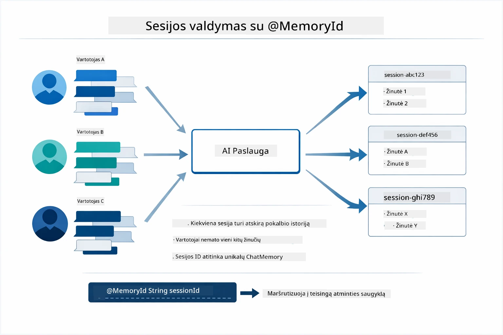

*Kiekvienas sesijos ID atitinka atskirą pokalbio istoriją — vartotojai niekada nemato vienas kito žinučių.*

### Klaidų tvarkymas

Įrankiai gali sugesti — API neatsako, parametrai gali būti neteisingi, išorinės paslaugos gali neveikti. Produkcijos agentai turi apdoroti klaidas, kad modelis galėtų aiškinti problemas arba bandyti alternatyvas, o ne sugadinti visą programą. Kai įrankis meta išimtį, LangChain4j ją sugavęs perduoda klaidos žinutę modeliui, kuris gali natūralia kalba paaiškinti problemą.

## Galimi įrankiai

Žemiau pateikta diagrama rodo platų įrankių ekosistemą, kurią galite kurti. Šis modulis demonstruoja orų ir temperatūros įrankius, tačiau tas pats `@Tool` modelis veikia bet kuriam Java metodui — nuo duomenų bazių užklausų iki mokėjimų apdorojimo.

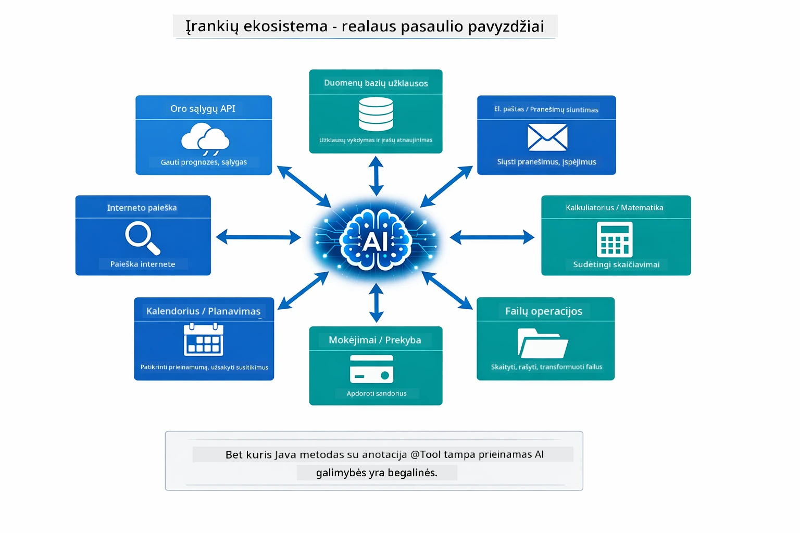

*Bet kuris Java metodas su `@Tool` anotacija tampa prieinamas AI — šis modelis taikomas duomenų bazėms, API, el. paštui, failų operacijoms ir kt.*

## Kada naudoti įrankiais pagrįstus agentus

Ne kiekvienai užklausai reikia įrankių. Sprendimas priklauso nuo to, ar AI turi sąveikauti su išorinėmis sistemomis, ar gali atsakyti iš savo žinių. Toliau pateiktas gidas apibendrina, kada įrankiai pridės vertės, o kada jų nereikia:

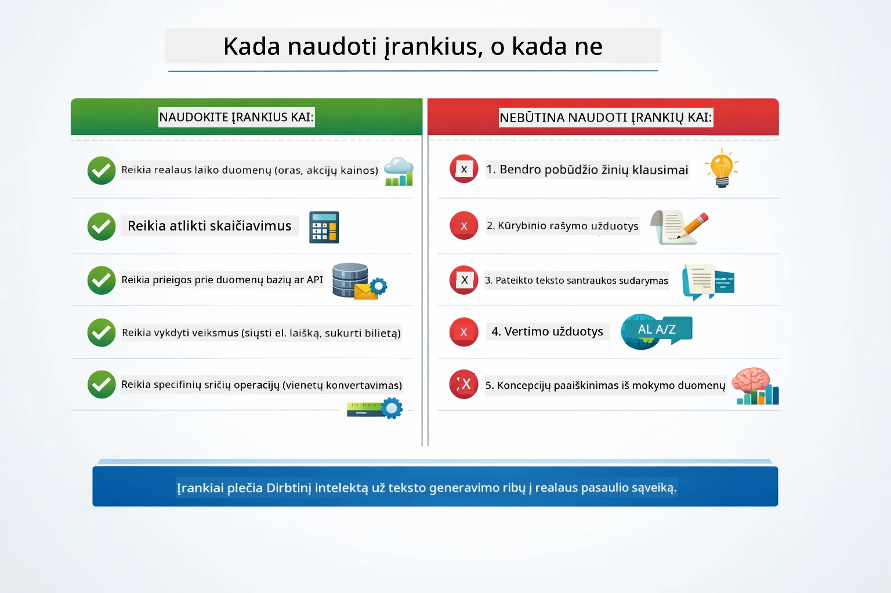

*Greitas sprendimų vadovas — įrankiai skirti realaus laiko duomenims, skaičiavimams ir veiksmams; bendros žinios ir kūrybinės užduotys jų nereikalauja.*

## Įrankiai prieš RAG

Moduliai 03 ir 04 abu plečia AI galimybes, bet iš esmės skirtingais būdais. RAG suteikia modeliui prieigą prie **žinių**, gaunant dokumentus. Įrankiai suteikia modeliui galimybę imtis **veiksmų**, kviečiant funkcijas. Žemiau pateikta diagrama palygina šiuos du metodus šalia vienas kito — nuo veikimo principų iki kompromisų:

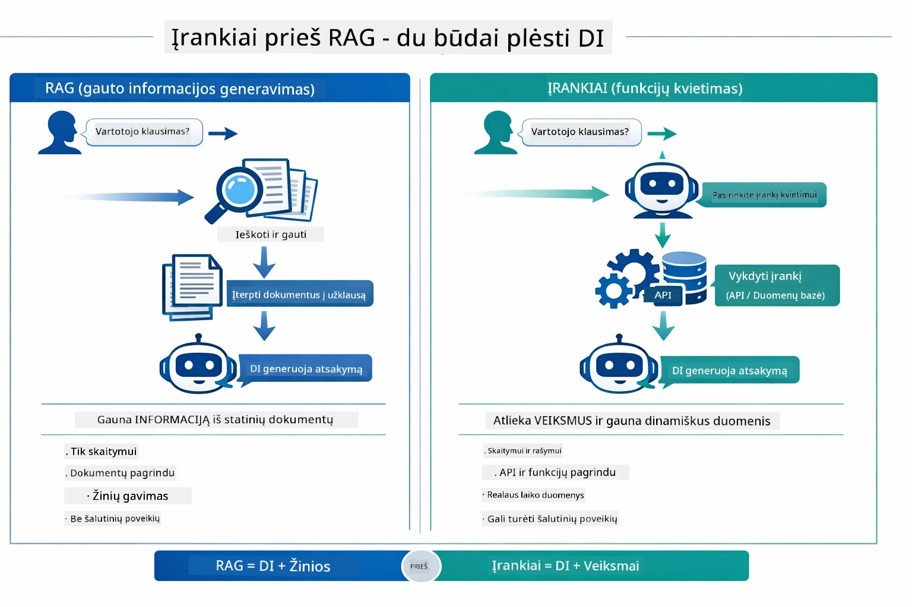

*RAG ištraukia informaciją iš statinių dokumentų — įrankiai atlieka veiksmus ir gauna dinamiškus, realaus laiko duomenis. Daugelis produkcijos sistemų naudoja abu kartu.*

Praktikoje dauguma produkcinių sistemų derina abu metodus: RAG naudojamas atsakymams pagrįsti dokumentacijoje, o įrankiai – gyviems duomenims gauti arba operacijoms atlikti.

## Tolimesni veiksmai

**Kitas modulis:** [05-mcp - Model Context Protocol (MCP)](../05-mcp/README.md)

---

**Navigacija:** [← Ankstesnis: Modulis 03 - RAG](../03-rag/README.md) | [Atgal į pradžią](../README.md) | [Kitas: Modulis 05 - MCP →](../05-mcp/README.md)

---

<!-- CO-OP TRANSLATOR DISCLAIMER START -->
**Atsakomybės atsisakymas**:
Šis dokumentas buvo išverstas naudojant dirbtinio intelekto vertimo paslaugą [Co-op Translator](https://github.com/Azure/co-op-translator). Nors siekiame tikslumo, prašome atkreipti dėmesį, kad automatizuotuose vertimuose gali būti klaidų ar netikslumų. Originalus dokumentas gimtąja kalba turėtų būti laikomas autoritetingu šaltiniu. Esant svarbiai informacijai, rekomenduojama naudoti profesionalų žmogaus vertimą. Mes neatsakome už bet kokius nesusipratimus ar neteisingą interpretavimą, kylančius iš šio vertimo naudojimo.
<!-- CO-OP TRANSLATOR DISCLAIMER END -->