# Modulis 05: Modelio konteksto protokolas (MCP)

## Turinys

- [Ko išmoksite](../../../05-mcp)
- [Kas yra MCP?](../../../05-mcp)
- [Kaip veikia MCP](../../../05-mcp)
- [Agentinis modulis](../../../05-mcp)
- [Pavyzdžių vykdymas](../../../05-mcp)
  - [Reikalavimai](../../../05-mcp)
- [Greitas pradžia](../../../05-mcp)
  - [Failų operacijos (Stdio)](../../../05-mcp)
  - [Priežiūros agentas](../../../05-mcp)
    - [Demo vykdymas](../../../05-mcp)
    - [Kaip veikia priežiūra](../../../05-mcp)
    - [Kaip FileAgent aptinka MCP įrankius paleidimo metu](../../../05-mcp)
    - [Atsakymo strategijos](../../../05-mcp)
    - [Rezultato supratimas](../../../05-mcp)
    - [Agentinio modulio funkcijų paaiškinimas](../../../05-mcp)
- [Pagrindinės sąvokos](../../../05-mcp)
- [Sveikiname!](../../../05-mcp)
  - [Kas toliau?](../../../05-mcp)

## Ko išmoksite

Jūs jau sukūrėte pokalbių AI, įvaldėte užklausas, pagrindėte atsakymus dokumentuose ir sukūrėte agentus su įrankiais. Tačiau visi tie įrankiai buvo specialiai sukurti jūsų konkrečiai programai. O jei galėtumėte suteikti savo AI prieigą prie standartizuoto įrankių ekosistemos, kurią gali sukurti ir dalintis bet kas? Šiame modulyje išmoksite tai padaryti naudojant Modelio konteksto protokolą (MCP) ir LangChain4j agentinį modulį. Pirmiausia parodytas paprastas MCP failų skaitytuvas, o vėliau – kaip jis lengvai integruojamas į pažangias agento darbo eigas naudojant Priežiūros agento modelį.

## Kas yra MCP?

Modelio konteksto protokolas (MCP) būtent tai ir suteikia – standartizuotą būdą AI programoms rasti ir naudoti išorinius įrankius. Vietoje to, kad rašytumėte specialias integracijas kiekvienam duomenų šaltiniui ar paslaugai, jūs prisijungiate prie MCP serverių, kurie savo galimybes atskleidžia nuoseklia forma. Jūsų AI agentas tada gali automatizuotai atrasti ir naudoti šiuos įrankius.

Žemiau pateiktame diagrama parodytas skirtumas – be MCP kiekviena integracija reikalauja unikalaus pojūčio ilgio sujungimo, tuo tarpu su MCP vienas protokolas jungia jūsų programą prie bet kurio įrankio:


*Prieš MCP: sudėtingos taško į tašką integracijos. Po MCP: vienas protokolas, begalinės galimybės.*

MCP sprendžia pagrindinę AI kūrimo problemą: kiekviena integracija yra specialiai sukurta. Norite pasiekti GitHub? Reikia specialaus kodo. Norite skaityti failus? Specialus kodas. Norite užklausti duomenų bazę? Vėl specialus kodas. Be to, jokios iš šių integracijų neveikia su kitomis AI programomis.

MCP standartizuoja šį procesą. MCP serveris pateikia įrankius su aiškiais aprašymais ir schemomis. Bet kuris MCP klientas gali prisijungti, aptikti turimus įrankius ir juos naudoti. Sukurkite vieną kartą, naudokite visur.

Žemiau pateiktoje diagramoje parodyta ši architektūra – vienas MCP klientas (jūsų AI programa) jungiasi prie kelių MCP serverių, kiekvienas atskleidžia savo įrankių rinkinį per standartizuotą protokolą:


*Modelio konteksto protokolo architektūra – standartizuotas įrankių aptikimas ir vykdymas*

## Kaip veikia MCP

Viduje MCP naudoja sluoksniuotą architektūrą. Jūsų Java programa (MCP klientas) aptinka turimus įrankius, siunčia JSON-RPC užklausas per transporto sluoksnį (Stdio arba HTTP), o MCP serveris vykdo operacijas ir grąžina rezultatus. Žemiau pateikta diagrama iliustruoja kiekvieną šio protokolo sluoksnį:

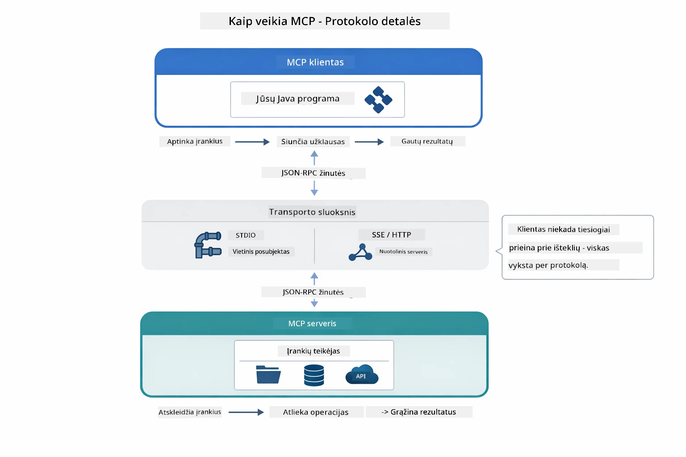

*Kaip MCP veikia viduje – klientai aptinka įrankius, keičiasi JSON-RPC žinutėmis ir vykdo operacijas per transporto sluoksnį.*

**Serverio-Kliento architektūra**

MCP naudoja klientų-serverių modelį. Serveriai suteikia įrankius – failų skaitymui, duomenų bazių užklausoms, API kvietimams. Klientai (jūsų AI programa) jungiasi prie serverių ir naudoja jų įrankius.

Norint naudoti MCP su LangChain4j, pridėkite šią Maven priklausomybę:

```xml
<dependency>
    <groupId>dev.langchain4j</groupId>
    <artifactId>langchain4j-mcp</artifactId>
    <version>${langchain4j.version}</version>
</dependency>
```


**Įrankių aptikimas**

Kai klientas prisijungia prie MCP serverio, jis klausia „Kokius įrankius turite?“ Serveris atsako su sąrašu turimų įrankių, kiekvienas su aprašymais ir parametrų schemomis. Jūsų AI agentas tada gali nuspręsti, kuriuos įrankius naudoti pagal vartotojo užklausas. Žemiau pateikta diagrama rodo šią sandorą – klientas išsiunčia `tools/list` užklausą, o serveris grąžina galimus įrankius su aprašymais ir schemomis:

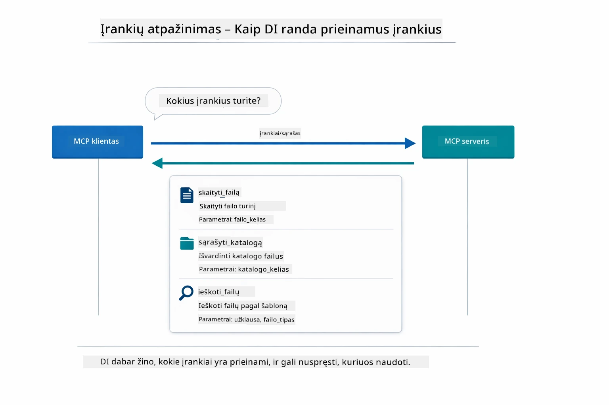

*AI starto metu aptinka prieinamus įrankius – dabar žino, kokios galimybės yra ir gali nuspręsti, kuriuos naudoti.*

**Transporto mechanizmai**

MCP palaiko skirtingus transporto mechanizmus. Yra du variantai: Stdio (vietiniams subprocessams) ir Streamable HTTP (nuotoliniams serveriams). Šiame modulyje demonstruojamas Stdio transportas:


*MCP transporto mechanizmai: HTTP nuotoliniams serveriams, Stdio vietiniams procesams*

**Stdio** - [StdioTransportDemo.java](../../../05-mcp/src/main/java/com/example/langchain4j/mcp/StdioTransportDemo.java)

Skirta vietiniams procesams. Jūsų programa paleidžia serverį kaip subprocess ir bendrauja per standartinę įėjimą/išėjimą. Naudinga prieigai prie failų sistemos ar komandų eilutės įrankių.

```java
McpTransport stdioTransport = new StdioMcpTransport.Builder()
    .command(List.of(
        npmCmd, "exec",
        "@modelcontextprotocol/server-filesystem@2025.12.18",
        resourcesDir
    ))
    .logEvents(false)
    .build();
```


Serveris `@modelcontextprotocol/server-filesystem` atskleidžia šiuos įrankius, visi veikia apsaugoti ribotose katalogų srityse, kurias nurodote:

| Įrankis | Aprašymas |
|------|-------------|
| `read_file` | Skaityti vieno failo turinį |
| `read_multiple_files` | Skaityti kelis failus vienu užklausimu |
| `write_file` | Kurti arba perrašyti failą |
| `edit_file` | Atliekami tikslingi atitikimo-ir-pakeitimo redagavimai |
| `list_directory` | Išvardinti failus ir katalogus nurodytoje vietoje |
| `search_files` | Rekursyviai ieškoti failų pagal šabloną |
| `get_file_info` | Gauti failo metaduomenis (dydį, laiko žymes, leidimus) |
| `create_directory` | Kurti katalogą (įskaitant tėvų katalogus) |
| `move_file` | Perkelti arba pervadinti failą ar katalogą |

Žemiau pateikta diagrama rodo, kaip veikia Stdio transportas veikimo metu – jūsų Java programa paleidžia MCP serverį kaip vaiko procesą ir jie bendrauja per stdin/stdout vamzdžius, be tinklo ar HTTP:

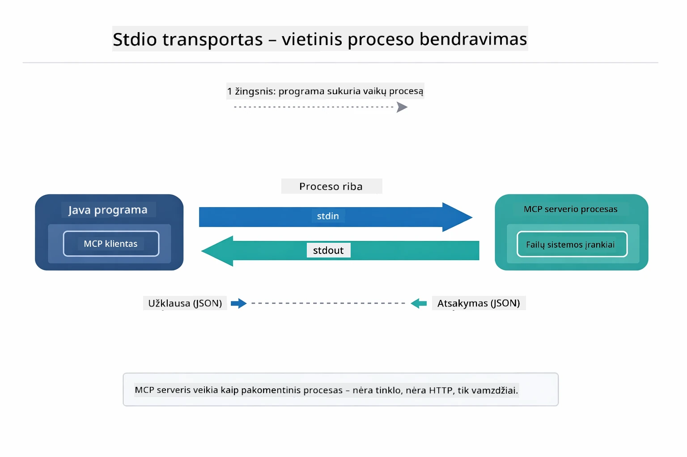

*Stdio transportas veikia – jūsų programa paleidžia MCP serverį kaip vaiko procesą ir bendrauja per stdin/stdout vamzdžius.*

> **🤖 Išbandykite su [GitHub Copilot](https://github.com/features/copilot) Pokalbiu:** Atidarykite [`StdioTransportDemo.java`](../../../05-mcp/src/main/java/com/example/langchain4j/mcp/StdioTransportDemo.java) ir paklauskite:
> - „Kaip veikia Stdio transportas ir kada jį naudoti vietoje HTTP?“
> - „Kaip LangChain4j valdo MCP serverių procesų gyvavimo ciklą?“
> - „Kokios yra saugumo pasekmės suteikiant AI prieigą prie failų sistemos?“

## Agentinis modulis

Nors MCP suteikia standartizuotus įrankius, LangChain4j **agentinis modulis** suteikia deklaratyvų būdą kurti agentus, kurie organizuoja šiuos įrankius. `@Agent` anotacija ir `AgenticServices` leidžia aprašyti agento elgesį per sąsajas, o ne imperatyvų kodą.

Šiame modulyje nagrinėsite **Priežiūros agento** modelį – pažangią agentinę AI metodiką, kur „priežiūros“ agentas dinamiškai sprendžia, kuriuos poagentus kvieti pagal vartotojo užklausą. Sujungsime abu konceptus – vienam iš poagentų suteiksime MCP pagrindu veikiančius failų prieigos gebėjimus.

Norėdami naudoti agentinį modulį, pridėkite šią Maven priklausomybę:

```xml
<dependency>
    <groupId>dev.langchain4j</groupId>
    <artifactId>langchain4j-agentic</artifactId>
    <version>${langchain4j.mcp.version}</version>
</dependency>
```


> **Pastaba:** `langchain4j-agentic` modulis naudoja atskirą versijos savybę (`langchain4j.mcp.version`), nes jis leidžiamas kitu grafiku nei pagrindinės LangChain4j bibliotekos.

> **⚠️ Eksperimentinis:** `langchain4j-agentic` modulis yra **eksperimentinis** ir gali keistis. Stabilus būdas kurti AI asistentus išlieka `langchain4j-core` su individualiais įrankiais (4 modulis).

## Pavyzdžių vykdymas

### Reikalavimai

- Užbaigtas [4 modulis - Įrankiai](../04-tools/README.md) (šis modulis statomas ant individualių įrankių koncepcijų ir juos lygina su MCP įrankiais)
- `.env` failas šakniniame kataloge su Azure kredencialais (sukuriamas su `azd up` 1 modulyje)
- Java 21+, Maven 3.9+
- Node.js 16+ ir npm (MCP serveriams)

> **Pastaba:** Jei dar nesate sukonfigūravę aplinkos kintamųjų, žiūrėkite [1 modulis - Įvadas](../01-introduction/README.md) dėl diegimo instrukcijų (`azd up` automatiškai sukuria `.env` failą), arba nukopijuokite `.env.example` į `.env` šakniniame kataloge ir užpildykite reikšmes.

## Greitas pradžia

**Naudojant VS Code:** Tiesiog dešiniuoju spustelėkite bet kurį demo failą Explorer lange ir pasirinkite **„Run Java“**, arba naudokite paleidimo konfigūracijas iš Run and Debug panelės (įsitikinkite, kad `.env` failas sukonfigūruotas su Azure kredencialais).

**Naudojant Maven:** Alternatyviai galite paleisti komandine eilute su žemiau pateiktais pavyzdžiais.

### Failų operacijos (Stdio)

Tai demonstruoja vietinius subprocess pagrindu veikiančius įrankius.

**✅ Nereikia išankstinių sąlygų** – MCP serveris paleidžiamas automatiškai.

**Naudojant starto skriptus (rekomenduojama):**

Starto skriptai automatiškai pakrauna aplinkos kintamuosius iš šakniniame kataloge esančio `.env` failo:

**Bash:**
```bash
cd 05-mcp
chmod +x start-stdio.sh
./start-stdio.sh
```

**PowerShell:**
```powershell
cd 05-mcp
.\start-stdio.ps1
```


**Naudojant VS Code:** Dešiniuoju spustelėkite `StdioTransportDemo.java` ir pasirinkite **„Run Java“** (įsitikinkite, kad `.env` failas sukonfigūruotas).

Programa automatiškai paleidžia failų sistemos MCP serverį ir perskaito vietinį failą. Pastebėkite, kaip valdomas subprocess procesas.

**Laukiamas išvesties rezultatas:**
```
Assistant response: The file provides an overview of LangChain4j, an open-source Java library
for integrating Large Language Models (LLMs) into Java applications...
```


### Priežiūros agentas

**Priežiūros agento modelis** yra **lanksti** agentinės AI forma. Priežiūros agentas naudoja didelį kalbos modelį (LLM), kad savarankiškai nuspręstų, kuriuos agentus kvieti pagal vartotojo užklausą. Kitame pavyzdyje sujungiame MCP pagrindu veikiančią failų prieigą su LLM agentu, kad sukurtume priežiūrinį failo skaitymo → ataskaitos darbo eigą.

Demo metu `FileAgent` skaito failą naudodamas MCP failų sistemos įrankius, o `ReportAgent` generuoja struktūruotą ataskaitą su vykdomuoju santrauka (1 sakinys), 3 pagrindinėmis mintimis ir rekomendacijomis. Priežiūros agentas automatiškai organizuoja šią seką:

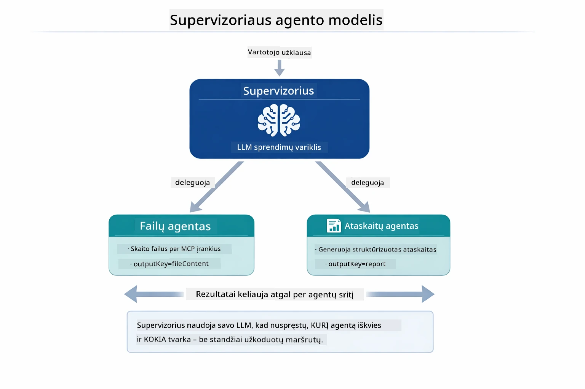

*Priežiūros agentas naudoja savo LLM, kad nuspręstų, kuriuos agentus kviesti ir kokia tvarka – nėra reikalingas standartiškai koduotas maršrutas.*

Štai kaip atrodo mūsų failo į ataskaitą darbo eigos konkretus procesas:

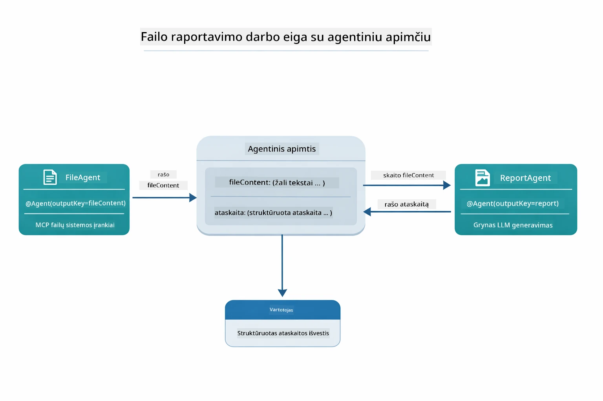

*FileAgent perskaito failą per MCP įrankius, tada ReportAgent paverčia žaliavos turinį į struktūruotą ataskaitą.*

Toliau pateiktas sekos diagrama vaizduoja visą Priežiūros agento organizavimą – nuo MCP serverio paleidimo, per autonominį agentų pasirinkimą, iki įrankių kvietimų per stdio ir galutinės ataskaitos:

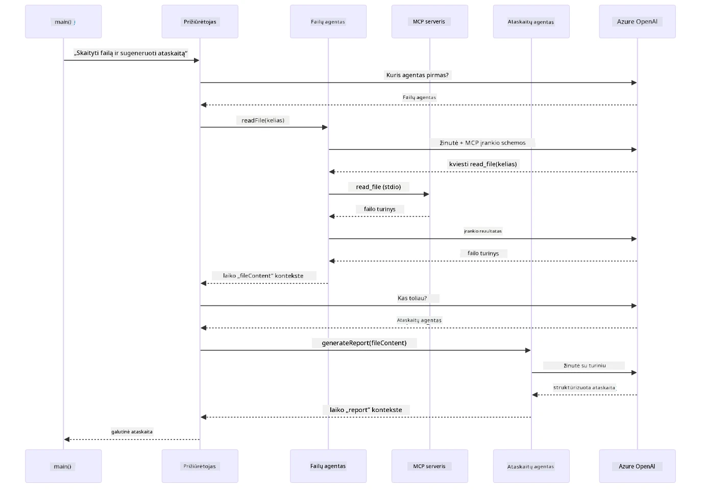

*Priežiūros agentas savarankiškai kviečia FileAgent (kuris per stdio kreipiasi į MCP serverį failo skaitymui), po to kviečia ReportAgent sugeneruoti struktūruotą ataskaitą – kiekvienas agentas išsaugo rezultatus bendroje Agentinėje Atmintyje.*

Kiekvienas agentas saugo savo išvestį **Agentinėje atmintyje** (bendroje atmintyje), leisdamas sekančioms agentų dalims prieiti prie ankstesnių rezultatų. Tai demonstruoja, kaip MCP įrankiai sklandžiai įsilieja į agentinę darbo eigą – Priežiūros agentui nereikia žinoti *kaip* yra skaitomi failai, tik kad `FileAgent` gali tai atlikti.

#### Demo vykdymas

Starto skriptai automatiškai pakrauna aplinkos kintamuosius iš šakniniame kataloge esančio `.env` failo:

**Bash:**
```bash
cd 05-mcp
chmod +x start-supervisor.sh
./start-supervisor.sh
```

**PowerShell:**
```powershell
cd 05-mcp
.\start-supervisor.ps1
```


**Naudojant VS Code:** Dešiniuoju spustelėkite `SupervisorAgentDemo.java` ir pasirinkite **„Run Java“** (įsitikinkite, kad `.env` failas sukonfigūruotas).

#### Kaip veikia priežiūra

Prieš kuriant agentus, turite prijungti MCP transportą prie kliento ir apvynioti jį kaip `ToolProvider`. Šitaip MCP serverio įrankiai tampa prieinami jūsų agentams:

```java
// Sukurkite MCP klientą iš transporto
McpClient mcpClient = new DefaultMcpClient.Builder()
        .transport(stdioTransport)
        .build();

// Apvyniokite klientą kaip ToolProvider — tai sujungia MCP įrankius su LangChain4j
ToolProvider mcpToolProvider = McpToolProvider.builder()
        .mcpClients(List.of(mcpClient))
        .build();
```


Dabar galite įterpti `mcpToolProvider` į bet kurį agentą, kuriam reikalingi MCP įrankiai:

```java
// 1 žingsnis: FileAgent skaito failus naudodamas MCP įrankius
FileAgent fileAgent = AgenticServices.agentBuilder(FileAgent.class)
        .chatModel(model)
        .toolProvider(mcpToolProvider)  // Turi MCP įrankius failų operacijoms
        .build();

// 2 žingsnis: ReportAgent generuoja struktūrizuotas ataskaitas
ReportAgent reportAgent = AgenticServices.agentBuilder(ReportAgent.class)
        .chatModel(model)
        .build();

// Supervisor kuruoja failo → ataskaitos darbo eigą
SupervisorAgent supervisor = AgenticServices.supervisorBuilder()
        .chatModel(model)
        .subAgents(fileAgent, reportAgent)
        .responseStrategy(SupervisorResponseStrategy.LAST)  // Grąžina galutinę ataskaitą
        .build();

// Supervisor nusprendžia, kuriuos agentus iškviesti pagal užklausą
String response = supervisor.invoke("Read the file at /path/file.txt and generate a report");
```


#### Kaip FileAgent aptinka MCP įrankius paleidimo metu

Gal susimąstote: **kaip `FileAgent` žino, kaip naudoti npm failų sistemos įrankius?** Atsakymas – jis nežino – **LLM** sužino tai vykdymo metu pagal įrankių schemas.

`FileAgent` sąsaja yra tik **užklausos apibrėžimas**. Ji neturi iš anksto užkoduotos informacijos apie `read_file`, `list_directory` ar kitus MCP įrankius. Štai kas vyksta nuo pradžios iki galo:
1. **Serverio paleidimas:** `StdioMcpTransport` paleidžia `@modelcontextprotocol/server-filesystem` npm paketą kaip išorinį procesą  
2. **Įrankių aptikimas:** `McpClient` siunčia `tools/list` JSON-RPC užklausą serveriui, kuris atsako įrankių pavadinimais, aprašymais ir parametrų schemomis (pvz., `read_file` — *„Perskaityti visą failo turinį“* — `{ path: string }`)  
3. **Schemų įterpimas:** `McpToolProvider` apgaubia šias aptiktas schemas ir padaro jas prieinamas LangChain4j  
4. **LLM sprendžia:** Kai iškviečiamas `FileAgent.readFile(path)`, LangChain4j siunčia sisteminę žinutę, vartotojo žinutę **ir įrankių schemų sąrašą** LLM. LLM perskaito įrankių aprašymus ir sugeneruoja įrankio kvietimą (pvz., `read_file(path="/some/file.txt")`)  
5. **Vykdymas:** LangChain4j perima įrankio kvietimą, nukreipia jį per MCP klientą atgal Node.js subprocessui, gauna rezultatą ir perduoda jį atgal LLM  

Tai tas pats aukščiau aprašytas [Įrankių aptikimo](../../../05-mcp) mechanizmas, bet taikomas konkrečiai agentų darbo eigai. `@SystemMessage` ir `@UserMessage` anotacijos nurodo LLM elgseną, o įterptas `ToolProvider` suteikia jai **galimybes** — LLM runtime metu susieja abu.

> **🤖 Išbandykite su [GitHub Copilot](https://github.com/features/copilot) Chat:** Atidarykite [`FileAgent.java`](../../../05-mcp/src/main/java/com/example/langchain4j/mcp/agents/FileAgent.java) ir paklauskite:  
> - „Kaip šis agentas žino, kurį MCP įrankį iškviesti?“  
> - „Kas nutiktų, jei pašalinčiau ToolProvider iš agentų kūrėjo?“  
> - „Kaip įrankių schemos perduodamos LLM?“  

#### Atsakymo strategijos

Konfigūruodami `SupervisorAgent` nurodote, kaip jis turėtų formuluoti galutinį atsakymą vartotojui po to, kai daliniai agentai užbaigs savo užduotis. Žemiau pateiktame diagramoje parodytos trys galimos strategijos — LAST grąžina paskutinio agento tiesioginį rezultatą, SUMMARY sintetina visus rezultatus per LLM, o SCORED pasirenka aukštesnį įvertintą variantą pagal originalų užklausą:

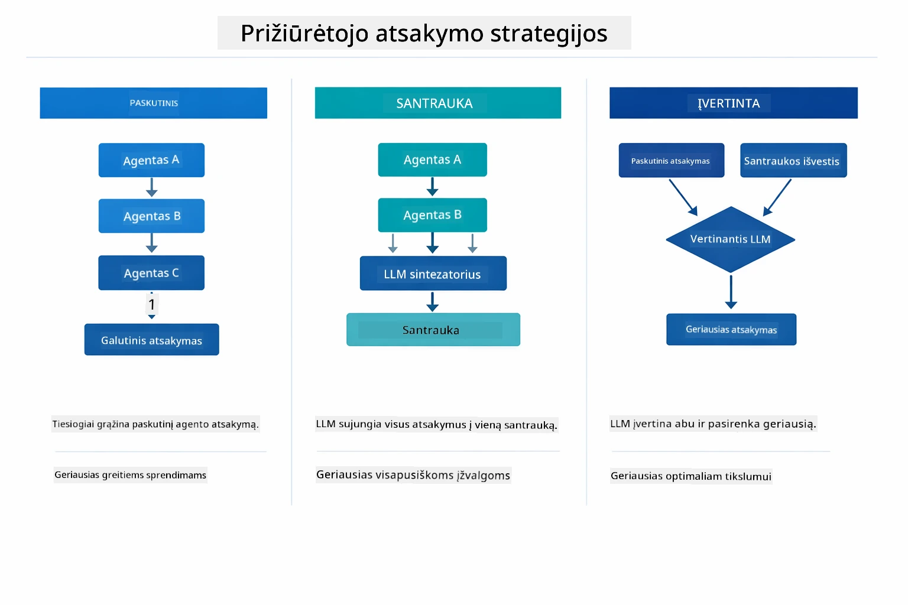

*Trys strategijos, kaip Supervisor formuluoja galutinį atsakymą — rinkitės pagal tai, ar norite paskutinio agento rezultato, suvestinio apibendrinimo ar rezultatu, kuris gauna aukštesnį įvertinimą.*

Galimos strategijos:

| Strategija | Aprašymas |
|-----------|------------|
| **LAST** | Supervisor grąžina paskutinio iškviesto dalinio agento arba įrankio rezultatą. Tai naudinga, kai darbo proceso paskutinis agentas yra specialiai sukurtas pateikti galutinį, pilną atsakymą (pvz., „Santraukos agentas“ tyrimų procese). |
| **SUMMARY** | Supervisor naudoja savo integruotą Kalbos Modelį (LLM), kad suformuotų santrauką apie visą sąveiką ir visus dalinių agentų rezultatus, tada grąžina šią santrauką kaip galutinį atsakymą. Tai suteikia aiškų, apibendrintą atsakymą vartotojui. |
| **SCORED** | Sistema naudoja integruotą LLM, kad įvertintų tiek LAST atsakymą, tiek SUMMARY santrauką pagal originalią vartotojo užklausą ir grąžina tą variantą, kuris gauna aukštesnį įvertinimą. |

Visą įgyvendinimą žr. [SupervisorAgentDemo.java](../../../05-mcp/src/main/java/com/example/langchain4j/mcp/SupervisorAgentDemo.java).

> **🤖 Išbandykite su [GitHub Copilot](https://github.com/features/copilot) Chat:** Atidarykite [`SupervisorAgentDemo.java`](../../../05-mcp/src/main/java/com/example/langchain4j/mcp/SupervisorAgentDemo.java) ir paklauskite:  
> - „Kaip Supervisor nusprendžia, kuriuos agentus iškviesti?“  
> - „Kuo skiriasi Supervisor ir Sequential darbo eigos modeliai?“  
> - „Kaip pritaikyti Supervisor planavimo elgseną?“  

#### Rezultato supratimas

Paleidus demonstraciją, matysite struktūrizuotą eigos apžvalgą, kaip Supervisor kuruoja kelis agentus. Štai ką reiškia kiekviena dalis:

```
======================================================================
  FILE → REPORT WORKFLOW DEMO
======================================================================

This demo shows a clear 2-step workflow: read a file, then generate a report.
The Supervisor orchestrates the agents automatically based on the request.
```
  
**Antraštė** pristato darbo eigos koncepciją: susikoncentruotą procesą nuo failo nuskaitymo iki ataskaitos generavimo.

```
--- WORKFLOW ---------------------------------------------------------
  ┌─────────────┐      ┌──────────────┐
  │  FileAgent  │ ───▶ │ ReportAgent  │
  │ (MCP tools) │      │  (pure LLM)  │
  └─────────────┘      └──────────────┘
   outputKey:           outputKey:
   'fileContent'        'report'

--- AVAILABLE AGENTS -------------------------------------------------
  [FILE]   FileAgent   - Reads files via MCP → stores in 'fileContent'
  [REPORT] ReportAgent - Generates structured report → stores in 'report'
```
  
**Darbo eigos diagrama** rodo duomenų srautą tarp agentų. Kiekvienas agentas atlieka konkrečią rolę:  
- **FileAgent** daugiausiai skaito failus naudodamas MCP įrankius ir saugo pirminį turinį `fileContent`  
- **ReportAgent** naudoja šį turinį ir generuoja struktūruotą ataskaitą `report`  

```
--- USER REQUEST -----------------------------------------------------
  "Read the file at .../file.txt and generate a report on its contents"
```
  
**Vartotojo užklausa** rodo užduotį. Supervisor ją analizuoja ir nusprendžia iškviesti FileAgent → ReportAgent.

```
--- SUPERVISOR ORCHESTRATION -----------------------------------------
  The Supervisor decides which agents to invoke and passes data between them...

  +-- STEP 1: Supervisor chose -> FileAgent (reading file via MCP)
  |
  |   Input: .../file.txt
  |
  |   Result: LangChain4j is an open-source, provider-agnostic Java framework for building LLM...
  +-- [OK] FileAgent (reading file via MCP) completed

  +-- STEP 2: Supervisor chose -> ReportAgent (generating structured report)
  |
  |   Input: LangChain4j is an open-source, provider-agnostic Java framew...
  |
  |   Result: Executive Summary...
  +-- [OK] ReportAgent (generating structured report) completed
```
  
**Supervisor valdymas** parodo 2-žingsnių darbo eigą:  
1. **FileAgent** per MCP perskaito failą ir išsaugo turinį  
2. **ReportAgent** gauna turinį ir sugeneruoja struktūruotą ataskaitą  

Supervisor priėmė šiuos sprendimus **autonomiškai**, remdamasis vartotojo užklausa.

```
--- FINAL RESPONSE ---------------------------------------------------
Executive Summary
...

Key Points
...

Recommendations
...

--- AGENTIC SCOPE (Data Flow) ----------------------------------------
  Each agent stores its output for downstream agents to consume:
  * fileContent: LangChain4j is an open-source, provider-agnostic Java framework...
  * report: Executive Summary...
```
  
#### Agentinio modulio funkcijų paaiškinimas

Šis pavyzdys demonstruoja kelias pažangias agentinio modulio funkcijas. Pažvelkime arčiau į Agentic Scope ir Agent Listeners.

**Agentic Scope** parodo bendrą atmintį, kurioje agentai saugojo savo rezultatus naudodami `@Agent(outputKey="...")`. Tai leidžia:  
- Vėlesniems agentams pasiekti ankstesnių agentų rezultatus  
- Supervisoriui sintetinti galutinį atsakymą  
- Jums apžiūrėti, ką kiekvienas agentas pagamino  

Ši diagrama rodo, kaip Agentic Scope veikia kaip bendroji atmintis failo į ataskaitą darbo eigoje — FileAgent rašo savo rezultatą po raktu `fileContent`, ReportAgent jį skaito ir rašo savo rezultatą po raktu `report`:

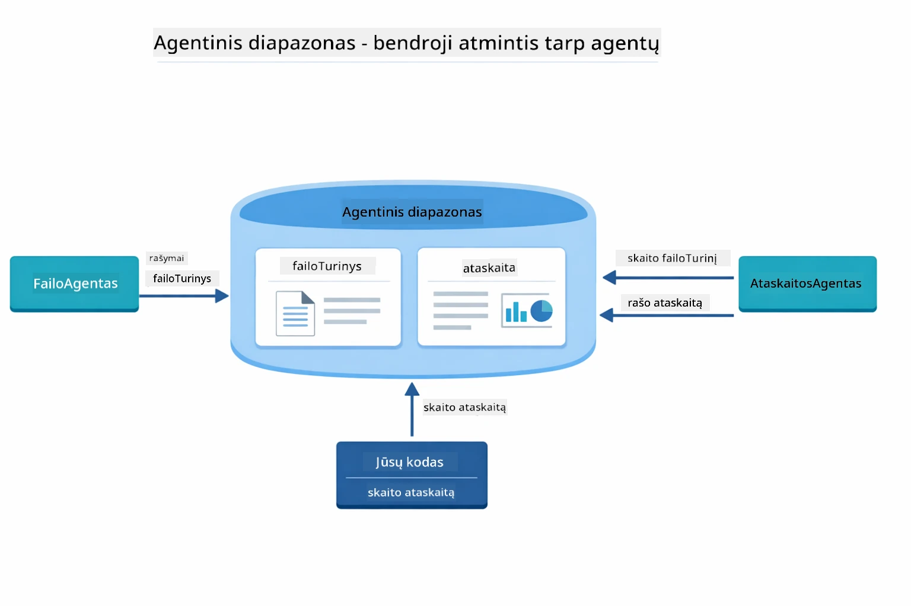

*Agentic Scope veikia kaip bendra atmintis — FileAgent rašo `fileContent`, ReportAgent jį skaito ir rašo `report`, o jūsų kodas skaito galutinį rezultatą.*

```java
ResultWithAgenticScope<String> result = supervisor.invokeWithAgenticScope(request);
AgenticScope scope = result.agenticScope();
String fileContent = scope.readState("fileContent");  // Neapdoroti failo duomenys iš FileAgent
String report = scope.readState("report");            // Struktūrizuota ataskaita iš ReportAgent
```
  
**Agent Listeners** leidžia stebėti ir derinti agentų vykdymą. Žingsnis po žingsnio išvestis demostruojama per AgentListener, kuris prisijungia prie kiekvieno agentų kvietimo:  
- **beforeAgentInvocation** – iškviečiamas, kai Supervisor pasirenka agentą, leidžiantis matyti, kuris agentas buvo pasirinktas ir kodėl  
- **afterAgentInvocation** – iškviečiamas, kai agentas baigia darbą, rodantis jo rezultatą  
- **inheritedBySubagents** – kai true, stebi visus agentus hierarchijoje  

Ši diagrama rodo visą Agent Listener gyvavimo ciklą, įskaitant kaip `onError` tvarko klaidas agento vykdymo metu:

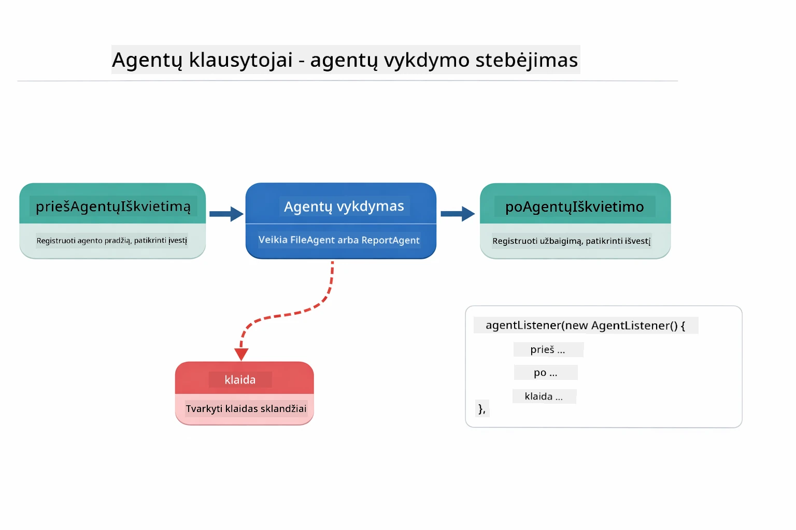

*Agent Listeners prisijungia prie vykdymo ciklo — stebėkite agentų pradžią, pabaigą ar klaidų įvykį.*

```java
AgentListener monitor = new AgentListener() {
    private int step = 0;
    
    @Override
    public void beforeAgentInvocation(AgentRequest request) {
        step++;
        System.out.println("  +-- STEP " + step + ": " + request.agentName());
    }
    
    @Override
    public void afterAgentInvocation(AgentResponse response) {
        System.out.println("  +-- [OK] " + response.agentName() + " completed");
    }
    
    @Override
    public boolean inheritedBySubagents() {
        return true; // Paskleiskite visiems subagentams
    }
};
```
  
Be Supervisor modelio, `langchain4j-agentic` modulis suteikia kelis galingus darbo eigos modelius. Žemiau pateiktoje diagramoje parodyti visi penki — nuo paprastų sekvencinių procesų iki žmogaus įsikišimą reikalaujančių patvirtinimo procesų:

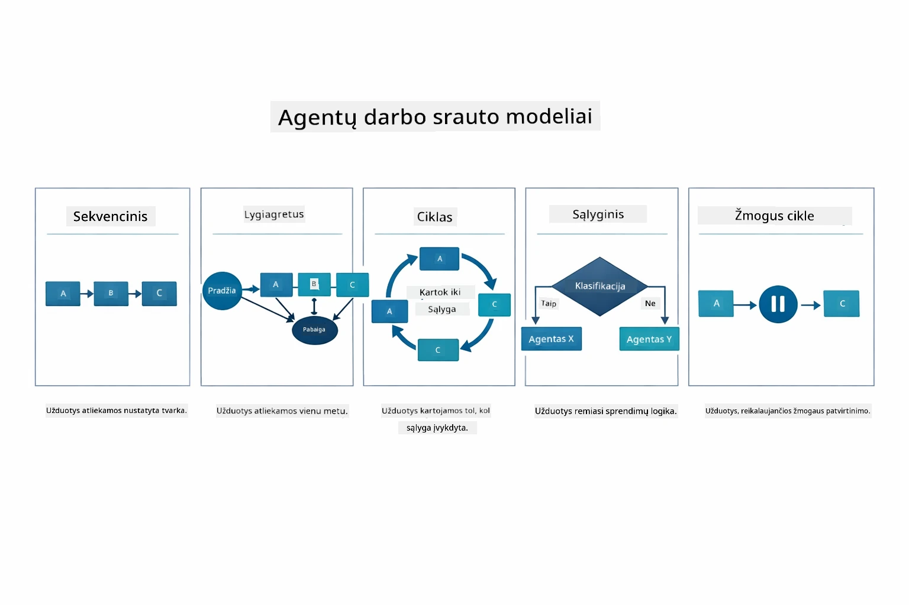

*Penki darbo eigos modeliai agentų valdymui — nuo paprastų sekvencinių iki žmogaus įsitraukimo patvirtinimo procesų.*

| Modelis | Aprašymas | Taikymas |
|---------|-----------|----------|
| **Sequential** | Vykdyti agentus paeiliui, rezultatas perduodamas kitam | Procesai: tyrimas → analizė → ataskaita |
| **Parallel** | Vykdyti agentus vienu metu | Nepriklausomos užduotys: oras + naujienos + akcijos |
| **Loop** | Kartoti, kol įvykdytos sąlygos | Kiekybinis vertinimas: tobulinti iki įvertinimo ≥ 0.8 |
| **Conditional** | Nukreipti pagal sąlygas | Klasifikavimas → nukreipimas specialistui |
| **Human-in-the-Loop** | Įtraukti žmogaus patvirtinimus | Patvirtinimo procesai, turinio peržiūra |

## Pagrindinės sąvokos

Ištyrę MCP ir agentinį modulį praktiškai, apibendrinkime, kada naudoti kurią metodiką.

Viena didžiausių MCP privalumų yra auganti ekosistema. Žemiau diagrama rodo, kaip vienas universalus protokolas jungia jūsų DI programą su daugybe MCP serverių — nuo failų sistemos ir duomenų bazių iki GitHub, el. pašto, tinklo nuskaitymo ir kt.:

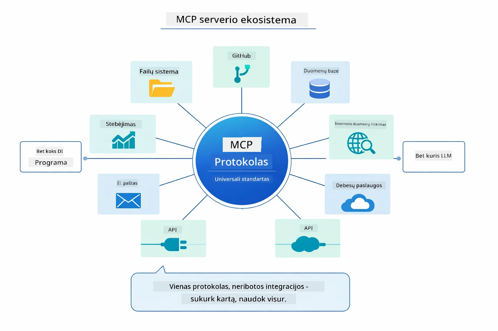

*MCP kuria universalų protokolo ekosistemą — bet kuris MCP suderinamas serveris veikia su bet kuriuo MCP klientu, leidžiant dalytis įrankiais tarp programų.*

**MCP** puikiai tinka, kai norite panaudoti esamą įrankių ekosistemą, kurti įrankius, kuriais gali naudotis keli projektai, integruoti trečių šalių paslaugas standartinių protokolų pagalba arba keisti įrankių įgyvendinimus nekeisdami kodo.

**Agentinis modulis** geriausiai tinka, jei norite deklaratyvių agentų aprašymo `@Agent` anotacijomis, reikia darbo eigos valdymo (sekvencinis, cikliškas, lygiagretus), pirmenybę teikiate sąsajomis pagrįstam agentų dizainui vietoj imperatyvaus kodo, arba derinate kelis agentus, kurie dalijasi rezultatais naudodami `outputKey`.

**Supervisor Agent modelis** išsiskiria, kai darbo eiga nėra iš anksto prognozuojama ir norite, kad LLM spręstų, kai turite kelis specializuotus agentus, kuriems reikia dinaminės koordinacijos, kai statote pokalbių sistemas su skirtingomis galimybėmis, arba kai norite lankstaus, adaptuojamo agentų elgesio.

Norėdami padėti nuspręsti tarp specialių `@Tool` metodų iš 4-ojo modulio ir MCP įrankių iš šio modulio, žemiau pateikiama svarbių kompromisų palyginimas — specialūs įrankiai suteikia glaudžią sąsają ir pilną tipų saugumą programai specifinei logikai, o MCP įrankiai siūlo standartizuotas, daugkartinio naudojimo integracijas:

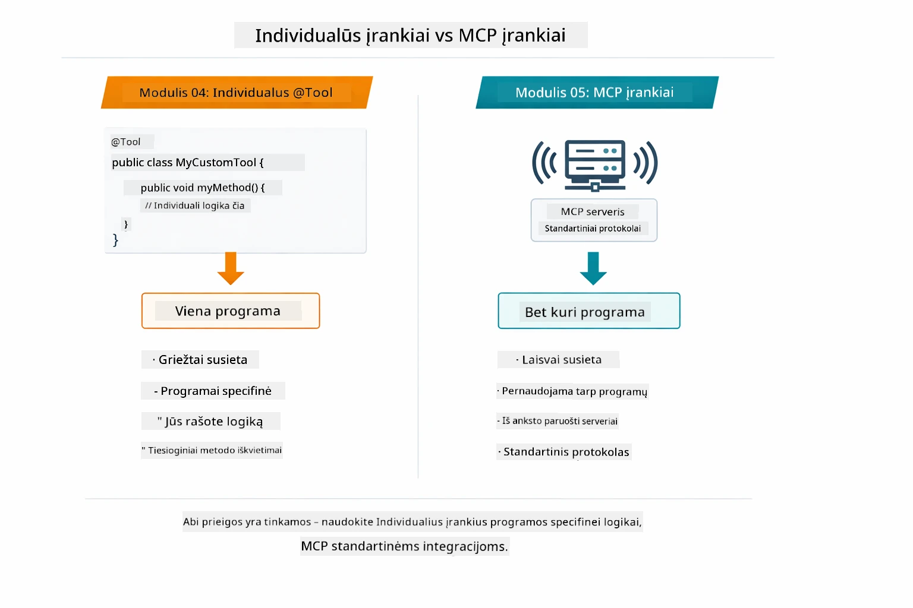

* Kada naudoti savo @Tool metodus prieš MCP įrankius — specialūs įrankiai programai specifinei logikai su pilnu tipų saugumu, MCP įrankiai standartizuotoms integracijoms, kurios veikia tarp programų.*

## Sveikiname!

Jūs sėkmingai įveikėte visus penkis LangChain4j pradedančiųjų kurso modulius! Štai visos jūsų mokymosi kelionės apžvalga — nuo bazinio pokalbių variklio iki MCP varomų agentinių sistemų:

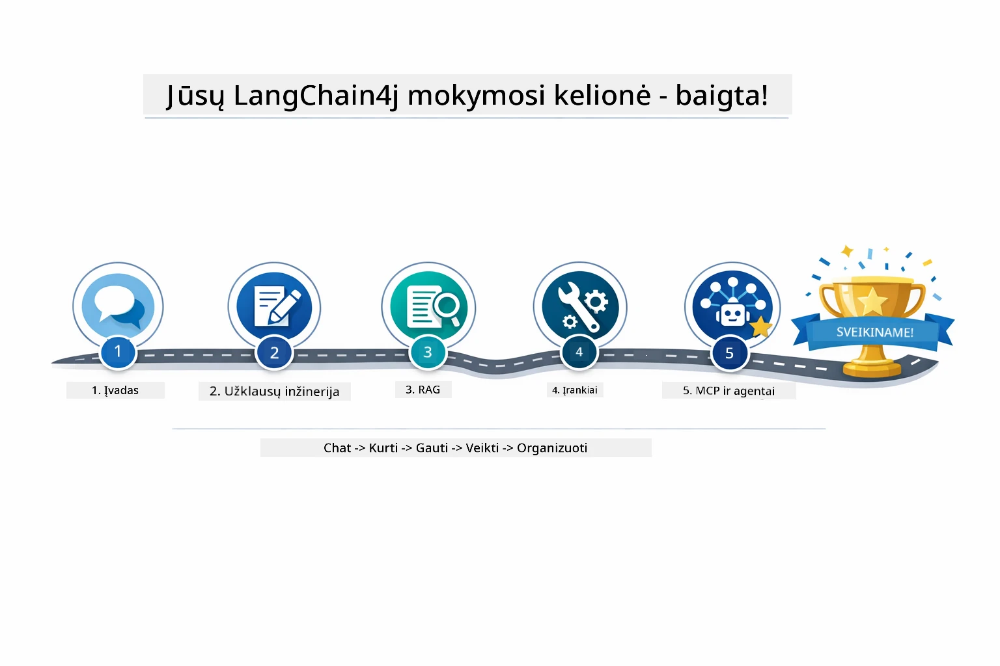

*Jūsų mokymosi kelionė per visus penkis modulius — nuo bazinio pokalbių variklio iki MCP varomų agentinių sistemų.*

Jūs baigėte LangChain4j pradedančiųjų kursą. Išmokote:

- Kaip kurti pokalbių DI su atmintimi (1 modulis)  
- Paragrafų konstravimo modelius skirtingoms užduotims (2 modulis)  
- Atsakymų pagrindimą jūsų dokumentais su RAG (3 modulis)  
- Kurti paprastus DI agentus (asistentus) su specialiais įrankiais (4 modulis)  
- Integruoti standartizuotus įrankius su LangChain4j MCP ir Agentic moduliais (5 modulis)  

### Kas toliau?

Baigę modulius, išbandykite [Testavimo vadovą](../docs/TESTING.md), kad pamatytumėte LangChain4j testavimo koncepcijas veikime.

**Oficialūs ištekliai:**  
- [LangChain4j dokumentacija](https://docs.langchain4j.dev/) – išsamūs vadovai ir API aprašymai  
- [LangChain4j GitHub](https://github.com/langchain4j/langchain4j) – šaltinio kodas ir pavyzdžiai  
- [LangChain4j pamokos](https://docs.langchain4j.dev/tutorials/) – nuoseklūs gidai įvairiems atvejams  

Ačiū, kad baigėte šį kursą!

---

**Naršymas:** [← Ankstesnis: Modulis 04 - Įrankiai](../04-tools/README.md) | [Atgal į pradžią](../README.md)

---

<!-- CO-OP TRANSLATOR DISCLAIMER START -->
**Atsakomybės apribojimas**:
Šis dokumentas buvo išverstas naudojant AI vertimo paslaugą [Co-op Translator](https://github.com/Azure/co-op-translator). Nors stengiamės užtikrinti tikslumą, atkreipkite dėmesį, kad automatiniai vertimai gali turėti klaidų ar netikslumų. Originalus dokumentas jo gimtąja kalba turi būti laikomas autoritetingu šaltiniu. Svarbiai informacijai rekomenduojama naudoti profesionalų žmogaus atliktą vertimą. Mes neatsakome už bet kokius nesusipratimus ar neteisingus aiškinimus, atsiradusius dėl šio vertimo naudojimo.
<!-- CO-OP TRANSLATOR DISCLAIMER END -->