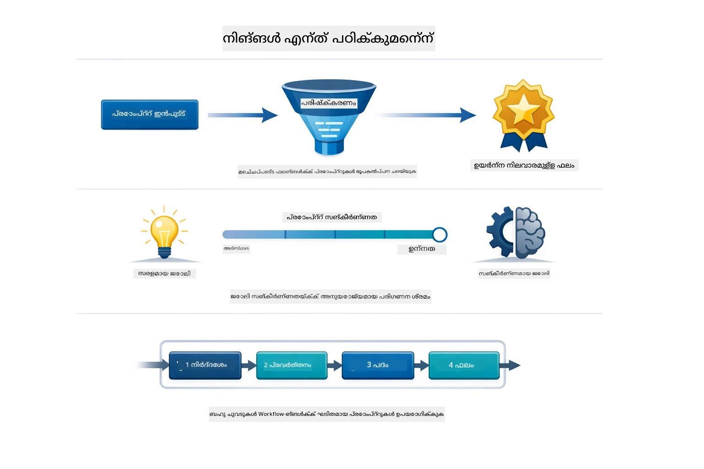
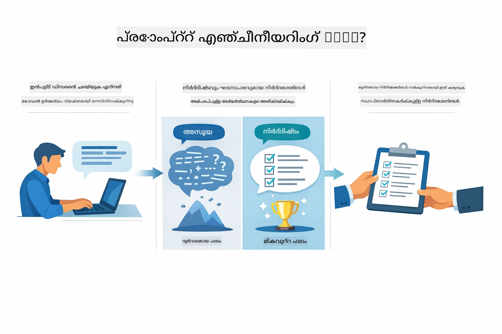
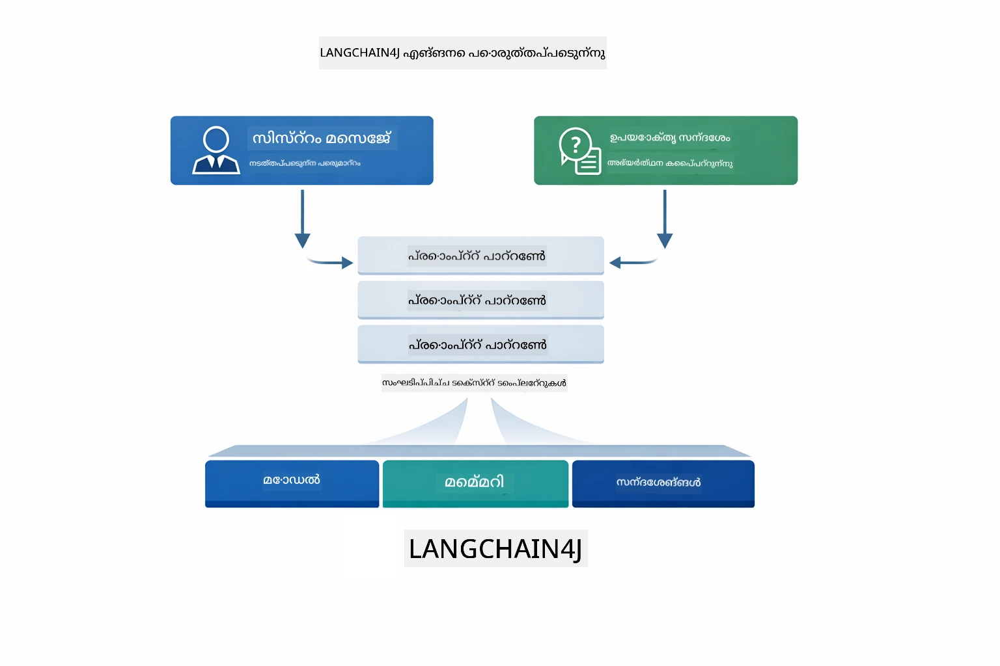
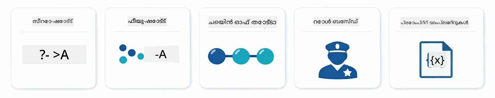
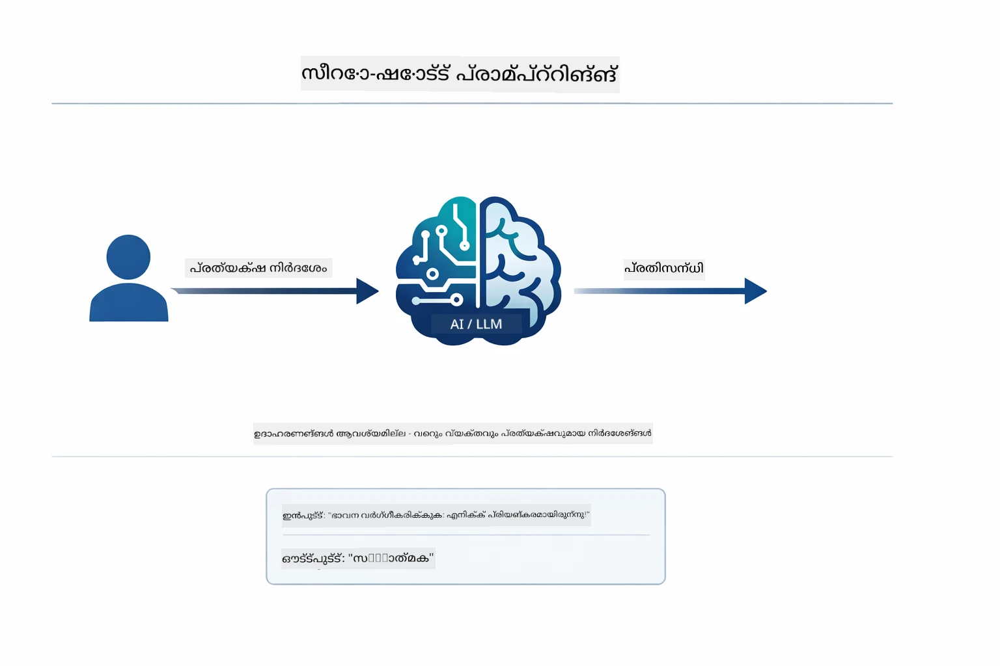
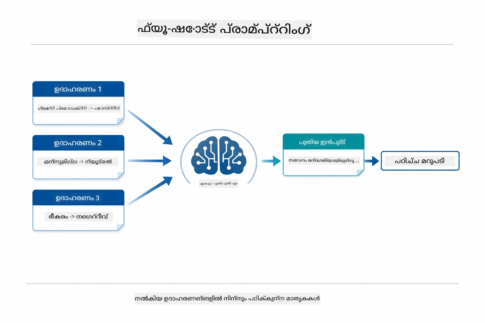
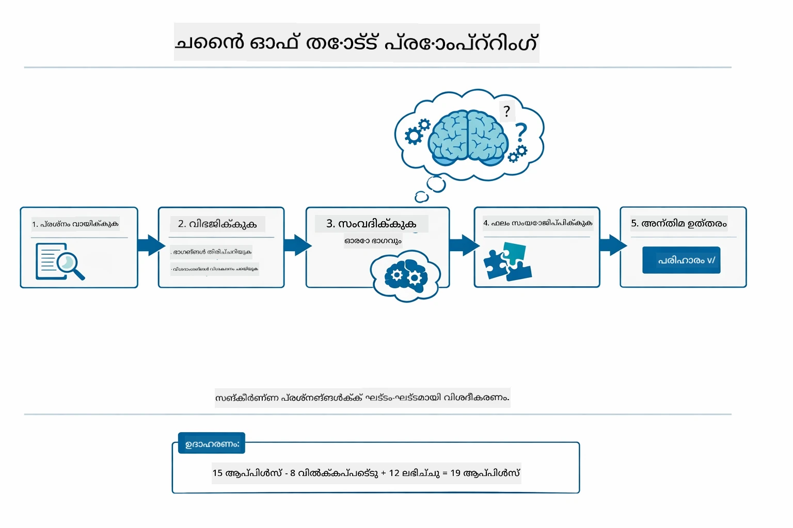
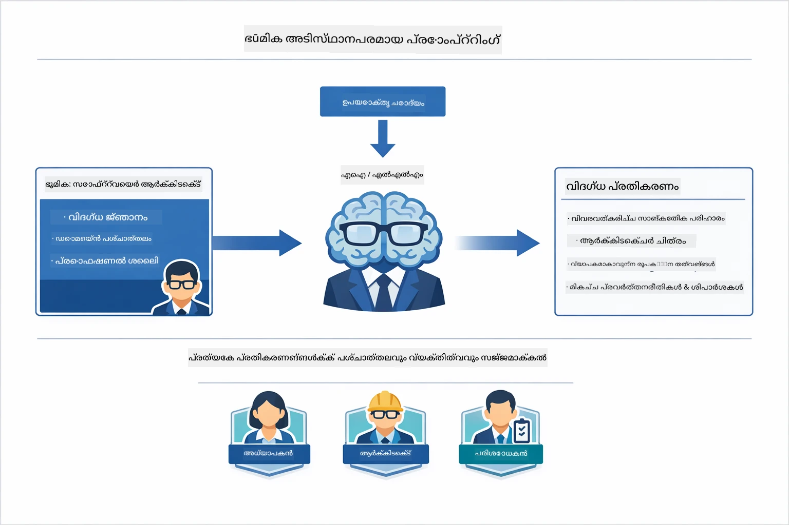
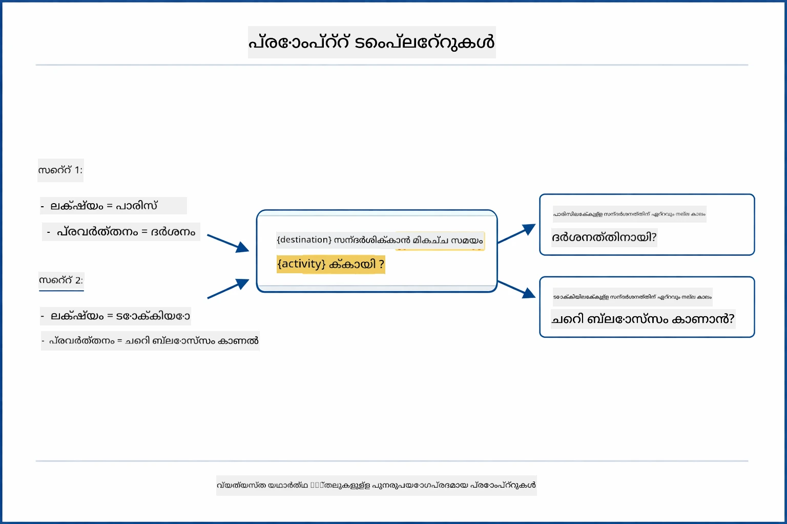
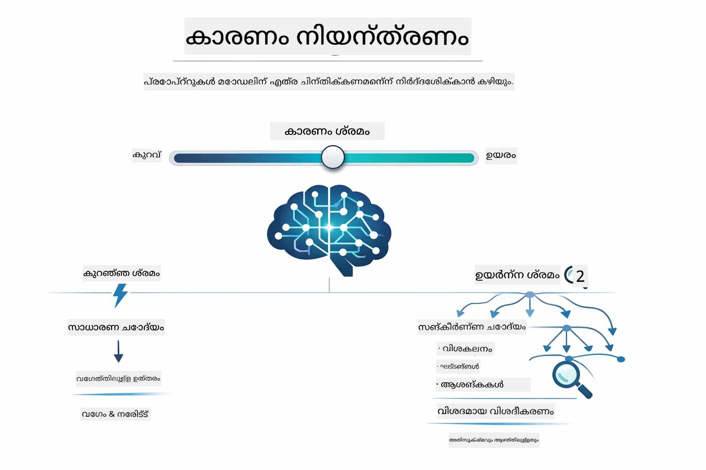

# Module 02: GPT-5.2 ഉപയോഗിച്ച് പ്രോംപ്റ്റ് എൻജിനീയറിംഗ്

## ഉള്ളടക്ക സൂചിക

- [വീഡിയോ വാക്ക്‌ത്രൂ](../../../02-prompt-engineering)
- [നിങ്ങൾ പഠിക്കാൻ പോകുന്നത്](../../../02-prompt-engineering)
- [ആവിശ്യങ്ങൾ](../../../02-prompt-engineering)
- [പ്രോംപ്റ്റ് എൻജിനീയറിംഗ് മനസ്സിലാക്കൽ](../../../02-prompt-engineering)
- [പ്രോംപ്റ്റ് എൻജിനീയറിംഗിന്റെ അടിസ്ഥാനങ്ങൾ](../../../02-prompt-engineering)
  - [സീറോ-ഷോട്ട് പ്രോംപ്റ്റിംഗ്](../../../02-prompt-engineering)
  - [ഫ്യൂ-ഷോട്ട് പ്രോംപ്റ്റിംഗ്](../../../02-prompt-engineering)
  - [ചെയിൻ ഓഫ് തോട്ട്](../../../02-prompt-engineering)
  - [റോൾ അടിസ്ഥാനമാക്കിയുള്ള പ്രോംപ്റ്റിംഗ്](../../../02-prompt-engineering)
  - [പ്രോംപ്റ്റ് ടെംപ്ലേറ്റുകൾ](../../../02-prompt-engineering)
- [അധുനിക പാറ്റേണുകൾ](../../../02-prompt-engineering)
- [ഇപ്പോഴുള്ള Azure ಸಂಪನ್ಮೂಲങ്ങൾ ഉപയോഗിക്കുക](../../../02-prompt-engineering)
- [ആപ്ലിക്കേഷൻ സ്‌ക്രീൻഷോട്ടുകൾ](../../../02-prompt-engineering)
- [പാറ്റേണുകൾ പരിശോധിക്കൽ](../../../02-prompt-engineering)
  - [കുറഞ്ഞ എഗർനെസ്സ് vs ഉയർന്ന എഗർനെസ്സ്](../../../02-prompt-engineering)
  - [ടാസ്‌ക്ക് എക്സിക്യൂഷൻ (ടൂൾ പ്രീഅംബിളുകൾ)](../../../02-prompt-engineering)
  - [സ്വയം-പരിശോധന കോഡ്](../../../02-prompt-engineering)
  - [സംഘടിത വിശകലനം](../../../02-prompt-engineering)
  - [മൾട്ടി-ടേൺ ചാറ്റ്](../../../02-prompt-engineering)
  - [പടി പടി റീസണിംഗ്](../../../02-prompt-engineering)
  - [പരിധി നിശ്ചയിച്ച ഔട്ട്‌പുട്ട്](../../../02-prompt-engineering)
- [നിങ്ങൾ യഥാർത്ഥത്തിൽ പഠിക്കുന്നത്](../../../02-prompt-engineering)
- [അടുത്ത ചുവടുകൾ](../../../02-prompt-engineering)

## വീഡിയോ വാക്ക്‌ത്രൂ

ഈ മോഡ്യൂൾ ഉപയോഗിച്ച് എങ്ങനെ ആരംഭിക്കാമെന്നത് വിശദീകരിക്കുന്ന ലൈവ് സെഷൻ കാണുക:

<a href="https://www.youtube.com/live/PJ6aBaE6bog?si=LDshyBrTRodP-wke"></a>

## നിങ്ങൾ പഠിക്കാൻ പോകുന്നത്



മുൻ മോഡ്യൂളിൽ, മെമ്മറി സംസാരിക്കാനാകുന്ന AI-നെ എങ്ങനെ സഹായിക്കുന്നു എന്നും GitHub മോഡലുകൾ അടിസ്ഥാന സൗകര്യങ്ങൾക്കായി എങ്ങനെ ഉപയോഗിക്കാമെന്നും നിങ്ങൾ കണ്ടു. ഇപ്പോൾ, Azure OpenAI യുടെ GPT-5.2 ഉപയോഗിച്ച് നിങ്ങളുടെ ചോദ്യങ്ങൾ - പ്രോംപ്റ്റുകൾ - എങ്ങനെ ചോദിക്കాలో നോക്കാം. നിങ്ങൾ ക്രമീകരിക്കുന്ന പ്രോംപ്റ്റുകൾ ലഭിക്കുന്ന പ്രതികരണങ്ങളുടെ ഗുണമേന്മയെ ഗണ്യമായി ബാധിക്കുന്നു. നാം അടിസ്ഥാന പ്രോംപ്റ്റിംഗ് സാങ്കേതിക വിദ്യകളുടെ അവലോകനത്തോടെ തുടങ്ങുകയും പിന്നീടുള്ള എട്ടു അദ്ധുനിക പാറ്റേണുകളിലേക്ക് മ്യൂവ് ചെയ്യുകയും ചെയ്യും, അവ GPT-5.2-ന്റെ കഴിവുകൾ പൂർണ്ണമായും ഉപയോഗിക്കുന്നു.

ഞങ്ങൾ GPT-5.2 ഉപയോഗിക്കുന്നു കാരണം ഇതിൽ റീസണിംഗ് നിയന്ത്രണം പരിചയപ്പെടുത്തപ്പെട്ടിരിക്കുന്നു - നിങ്ങൾ എത്ര ചിന്തിക്കണമെന്ന് മോഡലിനോട് പറയാം. ഇതിലൂടെ വിവിധ പ്രോംപ്റ്റിംഗ് തന്ത്രങ്ങൾ വ്യക്തമായി കാണാൻ സാധിക്കുകയും ഓരോ സമീപനം എപ്പോൾ ഉപയോഗിക്കാമെന്ന് മനസ്സിലാക്കാൻ സഹായിക്കുകയും ചെയ്യുന്നു. കൂടാതെ GitHub മോഡലുകളെ അപേക്ഷിച്ച് GPT-5.2-ന്റെ Azure ൽ കുറവുള്ള റേറ്റ് പരിമിതികൾ നമുക്ക് പ്രയോജനം നൽകും.

## ആവശ്യമുള്ള മുൻകൂർ തയാറെടുപ്പുകൾ

- Module 01 പൂർത്തിയാക്കിയിരിക്കുന്നത് (Azure OpenAI സൂത്രങ്ങൾ വിന്യസിച്ചിരിക്കുന്നു)
- മൂല ഡയറക്ടറിയിൽ `.env` ഫയൽ Azure ക്രെഡൻഷ്യലുകളോടെ (Module 01-ൽ `azd up` ഉപയോഗിച്ച് സൃഷ്ടിച്ചത്)

> **സൂചന:** Module 01 പൂർത്തിയാക്കിയിട്ടില്ലെങ്കിൽ, ആദ്യം അവിടെ നൽകിയ വിന്യാസ നിർദ്ദേശങ്ങൾ പിന്തുടരുക.

## പ്രോംപ്റ്റ് എൻജിനീയറിംഗ് മനസ്സിലാക്കൽ



പ്രോംപ്റ്റ് എൻജിനീയറിംഗ് എന്നത് നിങ്ങൾക്ക് ആവശ്യമുള്ള ഫലങ്ങൾ സ്ഥിരതയോടെ കിട്ടാൻ ഇൻപുട്ട് വാചകം രൂപകൽപ്പന ചെയ്യുന്നതിനെയാണ് സൂചിപ്പിക്കുന്നത്. ഇത് വെറും ചോദ്യങ്ങൾ ചോദിക്കുന്നതല്ല - മോഡൽ നിങ്ങൾക്ക് ആവശ്യമായതു എങ്ങനെ നൽകണമെന്ന് പൂർണ്ണമായി മനസ്സിലാക്കും വിധം നിർബന്ധിതമായ അഭ്യർത്ഥന രൂപപ്പെടുത്തൽ എന്നതാണ്.

ഒരു മേഖലക്കാരൻക്ക് നിർദ്ദേശങ്ങൾ നൽകുന്നതുപോലെ ചിന്തിക്കൂ. "ബഗ് പരിഹരിക്കുക" എന്നത് അപൂർവമാണ്. "UserService.java ലൈനിനു 45-ൽ നൾ പോയിന്റർ എക്സപ്ഷൻ ഫിക്‌സ് ചെയ്യുക, നൾ ചെക്കുമായി" എന്നത് പ്രത്യേകവും വ്യക്തവുമാണ്. ഭാഷാ മോഡലുകൾക്കും അവിടെയേത് സമാനമാണ് — വ്യക്തതയും ഘടനയുമാണ് പ്രധാനമാണ്.



LangChain4j അടിസ്ഥാന സൗകര്യങ്ങളായ മോഡൽ കണക്ഷനുകൾ, മെമ്മറി, മെസ്സേജ് തരം എന്നിവ നൽകുന്നു. പ്രോംപ്റ്റ് പാറ്റേണുകൾ ആ ഘടനയിൽ നിർമ്മിച്ച കൃത്യമായ വാചകങ്ങളാണ്. പ്രധാന ഘടകങ്ങൾ `SystemMessage` (AI-യുടെ പെരുമാറ്റവും റോളും സജ്ജമാക്കുന്നു) കൂടാതെ `UserMessage` (നിങ്ങളുടെ യഥാർത്ഥ അഭ്യർത്ഥന) എന്നതാണ്.

## പ്രോംപ്റ്റ് എൻജിനീയറിംഗിന്റെ അടിസ്ഥാനങ്ങൾ



ഈ മോഡ്യൂളിലെ അദ്ധുനിക പാറ്റേണുകളിൽ മുക്കിയ്ക്കും മുൻപ്, അഞ്ച് അടിസ്ഥാന പ്രോംപ്റ്റിംഗ് സാങ്കേതിക വിദ്യകളെ അവലോകനം ചെയ്യാം. ഇവ എല്ലാ പ്രോംപ്റ്റ് എൻജിനീയറർമാർക്കും അറിയേണ്ട അവശ്യ ഘടകങ്ങളാണ്. നിങ്ങൾ ഇതിനകം [ക്വിക് സ്റ്റാർട്ട് മോഡ്യൂൾ](../00-quick-start/README.md#2-prompt-patterns) പൂർത്തിയാക്കിയിട്ടുണ്ടെങ്കിൽ, അവ പ്രവർത്തനത്തിൽ കാണാൻ കഴിഞ്ഞതാണ് — ഇവയ്ക്ക് പിന്നിലുള്ള സിദ്ധാന്തരൂപമാണ്.

### സീറോ-ഷോട്ട് പ്രോംപ്റ്റിംഗ്

എളുപ്പമൊരു സമീപനം: ഉദാഹരണമില്ലാതെ നേരിട്ടുള്ള നിർദ്ദേശം മോഡലിന് നൽകുക. മോഡൽ താൻ സ.training ൽനിന്നും പൂർണ്ണമായി ആശയം മനസ്സിലാക്കി ജോലി നിർവ്വഹിക്കുന്നു. ഇതൊരു നേരെപ്പെട്ട അഭ്യർത്ഥനയ്ക്കായി അത് നല്ലതു.



*ഉദാഹരണങ്ങളില്ലാതെ നേരിട്ടുള്ള നിർദ്ദേശം — മോഡൽ നിർദ്ദേശം പ്രകാരം മാത്രമേ ടാസ്‌ക്കിന്‍റെ ആശയം മനസിലാക്കൂ*

```java
String prompt = "Classify this sentiment: 'I absolutely loved the movie!'";
String response = model.chat(prompt);
// പ്രതികരണം: "നല്ലത്"
```

**ഉപയോഗിക്കാനുള്ള സമയം:** ലളിതമായ വർഗ്ഗീകരണങ്ങൾ, നേരിട്ട് ചോദിക്കലുകൾ, വിവർത്തനങ്ങൾ, അല്ലെങ്കിൽ അധിക മാർഗ്ഗനിർദ്ദേശം ഇല്ലാതെ മോഡൽ കൈകാര്യം ചെയ്യാൻ കഴിയുന്ന ടാസ്‌കുകൾ.

### ഫ്യൂ-ഷോട്ട് പ്രോംപ്റ്റിംഗ്

നിങ്ങൾ മോഡലിന് നിർബന്ധിക്കാൻ ആഗ്രഹിക്കുന്ന പാറ്റേൺ പ്രകടിപ്പിക്കുന്ന ഉദാഹരണങ്ങൾ നൽകുക. മോഡൽ നിങ്ങളുടെ ഉദാഹരണങ്ങളിൽ നിന്നു പ്രതീക്ഷിക്കപ്പെട്ട ഇൻപുട്ട്-ഔട്ട്പുട്ട് ഫോർമാറ്റ് പഠിച്ച് അതിനെ പുതിയ ഇൻപുട്ടിൽ പ്രയോഗിക്കുന്നു. ഇത് ആകൃതി അല്ലെങ്കിൽ പെരുമാറ്റം നിർബന്ധസൗകര്യമല്ലാത്ത ടാസ്‌കുകളിൽ സ്ഥിരത വളരെയധികം മെച്ചപ്പെടുത്തുന്നു.



*ഉദാഹരണങ്ങളിൽ നിന്ന് പഠിക്കൽ — മോഡൽ പാറ്റേൺ തിരിച്ചറിയുകയും പുതിയ ഇൻപുട്ടിൽ പ്രയോഗിക്കുകയും ചെയ്യുന്നു*

```java
String prompt = """
    Classify the sentiment as positive, negative, or neutral.
    
    Examples:
    Text: "This product exceeded my expectations!" → Positive
    Text: "It's okay, nothing special." → Neutral
    Text: "Waste of money, very disappointed." → Negative
    
    Now classify this:
    Text: "Best purchase I've made all year!"
    """;
String response = model.chat(prompt);
```

**ഉപയോഗിക്കാനുള്ള സമയം:** ഇഷ്ടാനുസൃത വർഗ്ഗീകരണങ്ങൾ, സ്ഥിരമായ രൂപീകരണം, ഡൊമെയ്ൻ-സവിശേഷ ടാസ്‌കുകൾ, അല്ലെങ്കിൽ സീറോ-ഷോട്ട് ഫലം മാറ്റമായിരിക്കുമ്പോൾ.

### ചെയിൻ ഓഫ് തോട്ട്

മോഡലിനോട് അതിന്റെ ചിന്തനപ്രക്രിയ പടി പടിയായി കാണിക്കണമെന്ന് പറയുക. ഉത്തരം നേരിട്ട് പറയാനുള്ളതിന് പകരം, മോഡൽ പ്രശ്നം പൊളിച്ച് ഓരോ ഭാഗവും വ്യക്തമായി പ്രവർത്തിപ്പിക്കുന്നു. ഗണിതം, ലൊജിക്ക്, മൾട്ടി-സ്റ്റെപ് റീസണിംഗ് ടാസ്‌കുകളിൽ ഇത് കൃത്യത മെച്ചപ്പെടുത്തുന്നു.



*പടി പടി റീസണിംഗ് — സങ്കീർണ്ണ പ്രശ്നങ്ങൾ ഏറ്റവും വ്യക്തമായ കാര്യാന്വേഷണ ഘട്ടങ്ങളായി വിരിച്ചു കാണിക്കൽ*

```java
String prompt = """
    Problem: A store has 15 apples. They sell 8 apples and then 
    receive a shipment of 12 more apples. How many apples do they have now?
    
    Let's solve this step-by-step:
    """;
String response = model.chat(prompt);
// മോഡൽ കാണിക്കുന്നു: 15 - 8 = 7, തുടർന്ന് 7 + 12 = 19 ആപ്പിളുകൾ
```

**ഉപയോഗിക്കാനുള്ള സമയം:** ഗണിത പ്രശ്നങ്ങൾ, ലൊജിക് പസിലുകൾ, ഡബഗ്ഗിംഗ്, അല്ലെങ്കിൽ ചിന്തന പ്രക്രിയ കാണിച്ച് കൃത്യതയും വിശ്വാസ്യതയും മെച്ചപ്പെടുത്തേണ്ട ടാസ്‌കുകൾ.

### റോളിന്റെ അടിസ്ഥാനത്തിലുള്ള പ്രോംപ്റ്റിംഗ്

AI-യ്ക്കായി ഒരു വ്യക്തിത്വം അല്ലെങ്കിൽ റോൾ സജ്ജമാക്കി ശേഷം ചോദ്യങ്ങൾ ചോദിക്കുക. ഇത് പ്രതികരണത്തിന്റെ ശൈലി, ആഴം, ശ്രദ്ധ എന്നിവക്ക് സ്വഭാവം നൽകുന്നു. ഒരു "സോഫ്റ്റ്വെയർ ആർക്കിടെക്ട്" "ജൂനിയർ ഡവലപ്പർ" അല്ലെങ്കിൽ "സുരക്ഷാ ഓഡിറ്റർ" എന്നവരുടെ അപേക്ഷിച്ച് വ്യത്യസ്ത ഉപദേശങ്ങൾ നൽകും.



*സന്ദർഭവും വ്യക്തിത്വവുമെഴുതൽ — റോളിന്റെ പേരിൽ ഒരേ ചോദ്യത്തിന് വ്യത്യസ്ത മറുപടി*

```java
String prompt = """
    You are an experienced software architect reviewing code.
    Provide a brief code review for this function:
    
    def calculate_total(items):
        total = 0
        for item in items:
            total = total + item['price']
        return total
    """;
String response = model.chat(prompt);
```

**ഉപയോഗിക്കാനുള്ള സമയം:** കോഡ് റിവ്യൂസ്, ട്യൂടറിംഗ്, ഡൊമെയ്ൻ-നിർദ്ദിഷ്ട വിശകലനം, അല്ലെങ്കിൽ പ്രത്യേക വിദഗ്‌ധതാ തലത്തിലോ കാഴ്ചപ്പാടിലോ അനുയോജ്യമായ മറുപടികൾ വേണമെന്ന് ആയിരിക്കും.

### പ്രോംപ്റ്റ് ടെംപ്ലേറ്റുകൾ

മാറ്റി നിറയ്ക്കാവുന്ന പ്ലേസ്‌ഹോൾഡറുകളുള്ള പുനരുപയോഗാനിയോഗപ്രദമായ പ്രോംപ്റ്റുകൾ സൃഷ്ടിക്കുക. ഓരോ തവണ പുതിയ പ്രോംപ്റ്റ് എഴുതേണ്ടതില്ല, ഒരിക്കൽ ടെംപ്ലേറ്റ് നിർവചിച്ചു വ്യത്യസ്ത മൂല്യങ്ങൾ നിറയ്‌ക്കാം. LangChain4j-യിലെ `PromptTemplate` ക്ലാസ് `{{variable}}` സിന്റാക്സിൽ ഇത് എളുപ്പമാക്കുന്നു.



*മാറ്റി നിറയ്ക്കാവുന്ന പ്ലേസ്‌ഹോൾഡറുകളുള്ള പുനരുപയോഗ പ്രോപ്രാമ്പുകൾ*

```java
PromptTemplate template = PromptTemplate.from(
    "What's the best time to visit {{destination}} for {{activity}}?"
);

Prompt prompt = template.apply(Map.of(
    "destination", "Paris",
    "activity", "sightseeing"
));

String response = model.chat(prompt.text());
```

**ഉപയോഗിക്കാനുള്ള സമയം:** വ്യത്യസ്ത ഇൻപുട്ടുകളുള്ള ആവർത്തിച്ച ചോദ്യങ്ങൾ, ബാച്ച് പ്രോസസ്സിംഗ്, പുനരുപയോഗം സാധ്യമാകുന്ന AI വർക്ക്‌ഫ്ലോകൾ നിർമ്മിക്കുക, അല്ലെങ്കിൽ പ്രോംപ്റ്റ് ഘടന സ്ഥിരമായിടത്തോളം ഡാറ്റ മാത്രം മാറുന്ന സാഹചര്യങ്ങൾ.

---

ഈ അഞ്ച് അടിസ്ഥാനങ്ങൾ നിങ്ങളുടെ പ്രോംപ്റ്റിംഗ് ടാസ്‌കുകൾക്കായി ഒരു দৃഢമായ ഉപകരണങ്ങൾ നൽകുന്നു. ഈ മോഡ്യൂൾ അവയുമായി തുടർച്ചയായി **എട്ട് അദ്ധുനിക പാറ്റേണുകൾ** നിർമ്മിക്കുന്നു, അവ GPT-5.2-യുടെ റീസണിംഗ് നിയന്ത്രണം, സ്വയംമൂല്യനിർണയം, ഘടനավորված ഔട്ട്‌പുട്ട് കഴിവുകൾ ഉപയോഗിച്ച് പ്രവർത്തിക്കുന്നു.

## അദ്ധുനിക പാറ്റേണുകൾ

ആסרഭൂതങ്ങൾ തെളിവുകളായി, ഈ മോഡ്യൂളിനെ അതുല്യമായത് ആക്കാൻ സഹായിക്കുന്ന എട്ട് അദ്ധുനിക പാറ്റേണുകളിലേക്ക് നമുക്ക് പോകാം. എല്ലാ പ്രശ്നങ്ങൾക്കും ഒരേ സമീപനം വേണ്ടതല്ല. ചില ചോദ്യങ്ങൾക്ക് വേഗത്തിലുള്ള ഉത്തരങ്ങൾ വേണം, ചിലത് ആഴത്തിലുള്ള ചിന്ത നൽകി. ചിലത് ദർശനീയമായ റീസണിംഗ് ആവശ്യപ്പെടുന്നു, ചിലത് ഫലം മാത്രം വേണ്ടിവരും. താഴെയുള്ള ഓരോ പാറ്റേണും വ്യത്യസ്ത സാഹചര്യത്തിന് ഒരുക്കിയതാണ് — GPT-5.2-ന്റെ റീസണിംഗ് നിയന്ത്രണം വ്യത്യാസങ്ങൾ കൂടുതൽ വ്യക്തമാക്കുന്നു.


*എട്ട് പ്രോംപ്റ്റ് എൻജിനീയറിംഗ് പാറ്റേണുകളുടെ അവലോകനം കൂടാതെ അവയുടെ ഉപയോഗ കേസുകൾ*



*GPT-5.2-ന്റെ റീസണിംഗ് നിയന്ത്രണം മോഡലിന് എത്ര ചിന്തിക്കണമെന്ന് നിങ്ങൾക്ക് പറഞ്ഞുകൊടുക്കാൻ അനുവദിക്കുന്നു — ദ്രുതമായ നേരിട്ടുള്ള ഉത്തരങ്ങളിൽ നിന്നും ആഴത്തിലുള്ള അന്വേഷണത്തിലേക്കു വരെ*

**കുറഞ്ഞ എഗർനെസ്സ് (വേഗമേറിയും ലക്ഷ്യമിട്ടും)** - ലളിതമായ ചോദ്യങ്ങൾക്ക് വേഗവും നേരിട്ടുള്ള മറുപടികളും വേണമെങ്കിൽ. മോഡൽ കുറഞ്ഞ റീസണിംഗ് മാത്രം ചെയ്യുന്നു - പരമാവധി 2 ഘട്ടം. കണക്കു നിർവഹണം, തിരയൽ അല്ലെങ്കിൽ നേരെ ചോദിക്കുന്ന ചോദ്യങ്ങൾക്കായി ഇത് ഉപയോഗിക്കുക.

```java
String prompt = """
    <context_gathering>
    - Search depth: very low
    - Bias strongly towards providing a correct answer as quickly as possible
    - Usually, this means an absolute maximum of 2 reasoning steps
    - If you think you need more time, state what you know and what's uncertain
    </context_gathering>
    
    Problem: What is 15% of 200?
    
    Provide your answer:
    """;

String response = chatModel.chat(prompt);
```

> 💡 **GitHub Copilot ഉപയോഗിച്ച് പരീക്ഷിക്കുക:** [`Gpt5PromptService.java`](../../../02-prompt-engineering/src/main/java/com/example/langchain4j/prompts/service/Gpt5PromptService.java) തുറന്ന് ചോദിക്കുക:
> - "കുറഞ്ഞ എഗർനെസ്സ് കൊണ്ടുള്ള പ്രോംപ്റ്റിംഗ് പാറ്റേണുകൾക്ക് ഉയർന്ന എഗർനെസ്സിൽ ഉള്ളവയില്‍有什么 വ്യത്യാസങ്ങൾ?"
> - "പ്രോംപ്റ്റുകളിൽ XML ടാഗുകൾ എന്തുകൊണ്ട് AI യുടെ പ്രതികരണം ഘടിപ്പിക്കാൻ സഹായിക്കുന്നു?"
> - "സ്വയംപരിശോധന പാറ്റേണുകൾ ഉപയോഗിക്കേണ്ട സമയവും നേരിട്ട് നിർദ്ദേശം നൽകേണ്ട സമയവും എന്താണ്?"

**ഉയർന്ന എഗർനെസ്സ് (ആഴപ്രവേശനവും സ്ണെഹപൂർണവുമായ)** - സമ്പൂർണ്ണമായ വിശകലനങ്ങൾ വേണമെങ്കിൽ. മോഡൽ വിശദമായി പരിശോധിച്ച് പ്രതിപാദനങ്ങൾ കാണിക്കും. സിസ്റ്റം ഡിസൈൻ, ആർക്കിടെക്ചറൽ തീരുമാനങ്ങൾ, സങ്കീർണ്ണ ഗവേഷണങ്ങൾ എന്നിവയ്ക്കായി ഇത് ഉപയോഗിക്കുക.

```java
String prompt = """
    Analyze this problem thoroughly and provide a comprehensive solution.
    Consider multiple approaches, trade-offs, and important details.
    Show your analysis and reasoning in your response.
    
    Problem: Design a caching strategy for a high-traffic REST API.
    """;

String response = chatModel.chat(prompt);
```

**ടാസ്‌ക്ക് എക്സിക്യൂഷൻ (പടി പടി പുരോഗതി)** - മൾട്ടി-സ്റ്റെപ്പ് വർക്ക്‌ഫ്ലോകൾക്കായി. മോഡൽ ഒരു മുന്നറിയിപ്പ് പദ്ധതിയും ഓരോ പടിയും പ്രവർത്തിക്കുന്നതിന്‍റെ വിവരണവും നിർവഹിച്ചു സാരാംശം നൽകും. മൈഗ്രേഷൻ, എക്സിക്യൂഷൻ, അല്ലെങ്കിൽ ഏതും മൾട്ടി-സ്റ്റെപ്പ് പ്രക്രിയകളിൽ ഇത് ഉപയോഗിക്കുക.

```java
String prompt = """
    <task_execution>
    1. First, briefly restate the user's goal in a friendly way
    
    2. Create a step-by-step plan:
       - List all steps needed
       - Identify potential challenges
       - Outline success criteria
    
    3. Execute each step:
       - Narrate what you're doing
       - Show progress clearly
       - Handle any issues that arise
    
    4. Summarize:
       - What was completed
       - Any important notes
       - Next steps if applicable
    </task_execution>
    
    <tool_preambles>
    - Always begin by rephrasing the user's goal clearly
    - Outline your plan before executing
    - Narrate each step as you go
    - Finish with a distinct summary
    </tool_preambles>
    
    Task: Create a REST endpoint for user registration
    
    Begin execution:
    """;

String response = chatModel.chat(prompt);
```

ചെയിൻ-ഓഫ്-തോട്ട് പ്രോംപ്റ്റിംഗ് മോഡലിനോട് അതിന്റെ ചിന്തന പ്രക്രിയ വ്യക്തമാക്കാൻ ആവശ്യപ്പെടുന്നു, ഇത് സങ്കീർണ്ണപ്പെട്ട ടാസ്‌കുകളിൽ കൃത്യത കൂട്ടുന്നു. പടി പടി വിഭജനം മനുഷ്യർക്കും AI-ക്കും ലൊജിക് മനസിലാക്കാൻ ഉപകരിക്കുന്നു.

> **🤖 [GitHub Copilot](https://github.com/features/copilot) ചാറ്റിൽ പരീക്ഷിക്കൂ:** ഈ പാറ്റേൺ സംബന്ധിച്ച് ചോദിക്കുക:
> - "പഴുത്തടഞ്ഞ് ജോലി ചെയ്യുന്ന ഓപ്പറേഷനുകൾക്കായി ടാസ്‌ക്ക് എക്സിക്യൂഷൻ പാറ്റേൺ എങ്ങനെ അനുസൃജ്ജീകരിക്കും?"
> - "പ്രൊഡക്ഷൻ ആപ്ലിക്കേഷനുകളിൽ ടൂൾ പ്രീഅംബിളുകൾ ഘടിപ്പിക്കുന്നതിനുള്ള മികച്ച രീതികൾ എന്തൊക്കെയാണ്?"
> - "മധ്യേള്പ്പ് പുരോഗതി അപ്ഡേറ്റുകൾ UI-യിൽ എങ്ങനെ പിടിച്ചുചേർക്കാം, പ്രദർശിപ്പിക്കാം?"


*പദ്ധതി → നടപ്പാക്കൽ → സാരാംശം workflow മൾട്ടി-സ്റ്റെപ്പ് ടാസ്‌ക്കുകൾക്കായി*

**സ്വയംപരിശോധന കോഡ്** - ഉൽപ്പാദന നിലവാരമുള്ള കോഡ് ജനറേറ്റ് ചെയ്യുന്നതിനായി. മോഡൽ ഉൽപ്പാദന മാനദണ്ഡങ്ങൾ പാലിച്ച് യോഗ്യമായ പിശക് കൈകാര്യം കൂടി ഉളവാക്കുന്നു. പുതിയ ഫീച്ചറുകൾ അല്ലെങ്കിൽ സേവനങ്ങൾ നിർമ്മിക്കുമ്പോൾ ഇത് ഉപയോഗിക്കുക.

```java
String prompt = """
    Generate Java code with production-quality standards: Create an email validation service
    Keep it simple and include basic error handling.
    """;

String response = chatModel.chat(prompt);
```


*ഏകക്രീയ നവീകരണ ചക്രം - സൃഷ്ടിക്കുക, മൂല്യനിർണ്ണയം നടത്തുക, പ്രശ്നങ്ങൾ കണ്ടെത്തുക, മെച്ചപ്പെടുത്തുക, ആവർത്തിക്കുക*

**സംഘടിത വിശകലനം** - സ്ഥിരതയുള്ള മൂല്യനിർണ്ണയത്തിനായി. മോഡൽ കോഡ് ഒരു നിശ്ചിത ഫ്രെയിംവർക്കിൽ (ശുദ്ധത, പ്രാക്ടീസുകൾ, പ്രകടനം, സുരക്ഷ, പരിപാലനക്ഷമത) അവലോകനം ചെയ്യുന്നു. കോഡ് റിവ്യൂസിനായി അല്ലെങ്കിൽ ഗുണനിലവാര വിലയിരുത്തലിനായി ഇത് ഉപയോഗിക്കുക.

```java
String prompt = """
    <analysis_framework>
    You are an expert code reviewer. Analyze the code for:
    
    1. Correctness
       - Does it work as intended?
       - Are there logical errors?
    
    2. Best Practices
       - Follows language conventions?
       - Appropriate design patterns?
    
    3. Performance
       - Any inefficiencies?
       - Scalability concerns?
    
    4. Security
       - Potential vulnerabilities?
       - Input validation?
    
    5. Maintainability
       - Code clarity?
       - Documentation?
    
    <output_format>
    Provide your analysis in this structure:
    - Summary: One-sentence overall assessment
    - Strengths: 2-3 positive points
    - Issues: List any problems found with severity (High/Medium/Low)
    - Recommendations: Specific improvements
    </output_format>
    </analysis_framework>
    
    Code to analyze:
    ```
    public List getUsers() {
        return database.query("SELECT * FROM users");
    }
    ```
    Provide your structured analysis:
    """;

String response = chatModel.chat(prompt);
```

> **🤖 [GitHub Copilot](https://github.com/features/copilot) ചാറ്റിൽ പരീക്ഷിക്കുക:** സംഘടിത വിശകലനത്തെക്കുറിച്ച് ചോദിക്കുക:
> - "വിവിധ തരം കോഡ് റിവ്യൂപ്പുകൾക്കായി വിശകലന ചട്ടം എങ്ങനെ തീർപ്പാക്കാം?"
> - "സംഘടിത ഔട്ട്‌പുട്ട് പ്രോഗ്രാമാറ്റിക്കായി പാർസ് ചെയ്ത് പ്രവർത്തിപ്പിക്കുന്ന മികച്ച മാർഗ്ഗങ്ങൾ എന്തൊക്കെയാണ്?"
> - "വിവിധ റിവ്യൂ സെഷനുകളിൽ സ്ഥിരമായ ഗുരുത്വനില വാഗ്ദാനം എങ്ങനെ ഉറപ്പ് വരുത്താം?"


*സ്റ്റ്രക്ചർ ചെയ്ത കോഡ് റിവ്യൂ ഫ്രമ്വർക്കും ഗുരുത്വനിലകളും*

**മൾട്ടി-ടേൺ ചാറ്റ്** - സ്ഥിരീകരിക്കേണ്ട സംവാദങ്ങൾക്കായി. മോഡൽ മുൻപത്തെ സന്ദേശങ്ങൾ ഓർത്തുവെച്ച് അവയിൽ അടിസ്ഥാനമാക്കി വികസിക്കുന്നു. സംവേദന സഹായ സെഷനുകൾക്കോ സങ്കീർണ്ണ ചോദ്യോത്തരങ്ങൾക്കോ ഇത് ഉപയോഗിക്കുക.

```java
ChatMemory memory = MessageWindowChatMemory.withMaxMessages(10);

memory.add(UserMessage.from("What is Spring Boot?"));
AiMessage aiMessage1 = chatModel.chat(memory.messages()).aiMessage();
memory.add(aiMessage1);

memory.add(UserMessage.from("Show me an example"));
AiMessage aiMessage2 = chatModel.chat(memory.messages()).aiMessage();
memory.add(aiMessage2);
```


*ചർച്ചാ സന്ദർഭം ഒരു ബഹുവിഭാഗം വഴികളുടെ തുടർച്ചയായി സഞ്ചരിച്ച് ടോക്കൺ പരിധി എത്തുന്നതുവരെ സമാഹരിച്ചു*

**പടി പടി റീസണിംഗ്** - കാഴ്ചവെക്കുന്ന ലൊജിക്കുള്ള പ്രശ്നങ്ങൾക്ക്. മോഡൽ ഓരോ ഘട്ടത്തിനും വ്യക്തമായ റീസണിംഗ് കാണിക്കുന്നു. ഗണിത പ്രശ്നങ്ങൾ, ലൊജിക് പസിലുകൾ, അല്ലെങ്കിൽ ചിന്താനിലവാരം മനസ്സിലാക്കേണ്ടപ്പോൾ ഇത് ഉപയോഗിക്കുക.

```java
String prompt = """
    <instruction>Show your reasoning step-by-step</instruction>
    
    If a train travels 120 km in 2 hours, then stops for 30 minutes,
    then travels another 90 km in 1.5 hours, what is the average speed
    for the entire journey including the stop?
    """;

String response = chatModel.chat(prompt);
```


*പ്രശ്നങ്ങളെ വ്യക്തമായ ലൊജിക്കൽ ഘട്ടങ്ങളായി വിഭജിക്കൽ*

**പരിധിയിട്ടുള്ള ഔട്ട്പുട്ട്** - പ്രത്യേക ഫോർമാറ്റ് ആവശ്യകതകൾ ഉള്ള പ്രതികരണങ്ങൾക്ക്. മോഡൽ സ്ട്രിക്റ്റായി ഫോർമാറ്റ്, നീളം, ഘടന എന്നിവ പാലിക്കുന്നു. സംഗ്രഹങ്ങൾക്കോ കൃത്യമായ ഔട്ട്‌പുട്ട് ഘടന ആവശ്യമുള്ളപ്പോൾ ഇത് ഉപയോഗിക്കുക.

```java
String prompt = """
    <constraints>
    - Exactly 100 words
    - Bullet point format
    - Technical terms only
    </constraints>
    
    Summarize the key concepts of machine learning.
    """;

String response = chatModel.chat(prompt);
```


*പ്രത്യേകം ഫോർമാറ്റ്, നീളം, ഘടനാ ആവശ്യകതകൾ ഉറപ്പുവരുത്തൽ*

## നിലവിലുള്ള Azure സാമ്പത്തിക ഉപകരണങ്ങൾ ഉപയോഗിക്കൽ

**ദ്വാരം പരിശോധിക്കുക:**

Azure ക്രെഡൻഷ്യലുകളോടെ മൂല ഡയറക്ടറിയിൽ `.env` ഫയൽ നിലവിൽ ഉണ്ടെന്ന് ഉറപ്പുവരുത്തുക (Module 01-ൽ സൃഷ്ടിച്ചതു):
```bash
cat ../.env  # AZURE_OPENAI_ENDPOINT, API_KEY, DEPLOYMENT കാണിക്കണം
```

**ആപ്ലിക്കേഷൻ ആരംഭിക്കുക:**

> **സൂചന:** Module 01-ൽ `./start-all.sh` ഉപയോഗിച്ച് എല്ലാ ആപ്ലിക്കേഷൻകളും ഇതിനകം ആരംഭിച്ചിട്ടുണ്ടെങ്കിൽ, ഈ മോഡ്യൂൾ പോർട്ട് 8083-ൽ തന്നെ പ്രവർത്തിക്കുന്നു. താഴെയുള്ള സ്റ്റാർട് കമാൻഡുകൾ ഒഴിവാക്കി നേരിട്ട് http://localhost:8083-ൽ പോകാം.
**ഓപ്ഷന്‍ 1: സ്‌പ്രിംഗ് ബൂട്ട് ഡാഷ്ബോർഡ് ഉപയോഗിക്കൽ (VS കോഡ് ഉപയോക്താക്കൾക്കായി ശുപാർശ ചെയ്യുന്നു)**

ഡെവ് കൺറ്റെയ്‌നർ സ്‌പ്രിംഗ് ബൂട്ട് ഡാഷ്ബോർഡ് എക്സ്റ്റെൻഷൻ ഉൾക്കൊള്ളിച്ചിരിക്കുന്നു, ഇത് എല്ലാ സ്‌പ്രിംഗ് ബൂട്ട് ആപ്ലിക്കേഷനുകളും നിയന്ത്രിക്കാൻ ഒരു ദൃശ്യ ഇന്റർഫേസ് നൽകുന്നു. ഇത് VS കോഡിന്റെ ഇടത് വശത്ത് ഉള്ള ആക്ടിവിറ്റി ബാറിൽ നിങ്ങൾക്ക് കാണാം (സ്‌പ്രിംഗ് ബൂട്ട് ഐകോൺ അന്വേഷിക്കുക).

സ്‌പ്രിംഗ് ബൂട്ട് ഡാഷ്ബോർഡിൽ നിന്ന്, നിങ്ങൾക്ക് കഴിയുന്നത്:
- വർക്ക്‌സ്പേസിലുള്ള എല്ലായ്പ്പോഴും ലഭ്യമായ സ്‌പ്രിംഗ് ബൂട്ട് ആപ്ലിക്കേഷനുകൾ കാണുക
- ആപ്ലിക്കേഷനുകൾ ഒറ്റ ക്ലിക്കിൽ ആരംഭിക്കുക/നിറുത്തുക
- ആപ്പ്ലിക്കേഷൻ ലോഗുകൾ റിയൽ-ടൈത്തിൽ കാണുക
- ആപ്പ്ലിക്കേഷൻ നില നിരീക്ഷിക്കുക

"prompt-engineering" ന്റെ പക്കൽ ഉള്ള പ്ലേ ബട്ടൺ ക്ലിക്ക് ചെയ്യുക ഈ മോഡ്യൂൾ ആരംഭിക്കാൻ, അല്ലെങ്കിൽ എല്ലാ മോഡ്യൂളുകളും ഒരേസമയം തുടങ്ങുക.


**ഓപ്ഷന്‍ 2: ഷെൽ സ്‌ക്രിപ്റ്റുകൾ ഉപയോഗിക്കൽ**

എല്ലാ വെബ് ആപ്ലിക്കേഷനുകളും (മോഡ്യൂളുകൾ 01-04) ആരംഭിക്കുക:

**ബാഷ്:**
```bash
cd ..  # റൂട്ടി ഡയറക്ടറിയിൽ നിന്ന്
./start-all.sh
```

**പവർഷെൽ:**
```powershell
cd ..  # റൂട്ടി ഡയറക്ടറിയിൽ നിന്നും
.\start-all.ps1
```

അഥവാ ഈ മോഡ്യൂളു മാത്രം ആരംഭിക്കുക:

**ബാഷ്:**
```bash
cd 02-prompt-engineering
./start.sh
```

**പവർഷെൽ:**
```powershell
cd 02-prompt-engineering
.\start.ps1
```

രണ്ട് സ്‌ക്രിപ്റ്റുകളും റൂട്ട് `.env` ഫയലിൽ നിന്ന് സ്വയം പരിസ്ഥിതി മൂല്യങ്ങളും ലോഡ് ചെയ്ത്, ജാറുകൾ കാണാതിരുന്നാൽ നിർമ്മിക്കും.

> **കുറിപ്പ്:** എല്ലാ മോഡ്യൂളുകളും തുടങ്ങുന്നതിന് മുമ്പായി കൈകാര്യം ചെയ്ത് നിർമ്മിക്കാൻ ഇഷ്ടപ്പെടുന്നുവെങ്കിൽ:
>
> **ബാഷ്:**
> ```bash
> cd ..  # Go to root directory
> mvn clean package -DskipTests
> ```
>
> **പവർഷെൽ:**
> ```powershell
> cd ..  # Go to root directory
> mvn clean package -DskipTests
> ```

http://localhost:8083 നിങ്ങളുടെ ബ്രൗസറിൽ തുറക്കുക.

**നിറുത്താൻ:**

**ബാഷ്:**
```bash
./stop.sh  # ഈ മോഡ്യൂളിനും മാത്രം
# അല്ലെങ്കിൽ
cd .. && ./stop-all.sh  # എല്ലാ മോഡ്യൂളുകളും
```

**പവർഷെൽ:**
```powershell
.\stop.ps1  # ഈ മോദ്യൂള് മാത്രം
# അല്ലെങ്കില്
cd ..; .\stop-all.ps1  # എല്ലാ മോദ്യൂളുകളും
```

## ആപ്ലിക്കേഷൻ സ്ക്രീൻഷോട്ടുകൾ


*അവതരിപ്പിക്കുന്ന പ്രധാന ഡാഷ്ബോർഡ് എല്ലാ 8 പ്രോംപ്റ്റ് എൻജിനീയറിംഗ് പാറ്റേണുകളും അവയുടെ സവിശേഷതകളും ഉപയോഗ കേസുകളും കാണിക്കുന്നു*

## പാറ്റേണുകൾ പിന്തുടരൽ

വെബ് ഇന്റർഫേസ് വ്യത്യസ്ത പ്രോംപ്റ്റിംഗ് തന്ത്രങ്ങൾ പരീക്ഷിക്കാൻ അനുവദിക്കുന്നു. ഓരോ പാറ്റേണും വ്യത്യസ്ത പ്രശ്‌നങ്ങൾ പരിഹരിക്കുന്നു - ഓരോ സമീപനം എപ്പോൾ മികച്ചതാണെന്ന് കാണാൻ അവ പരീക്ഷിച്ച് നോക്കൂ.

> **കുറിപ്പ്: സ്ട്രീമിംഗ് vs നോൺ-സ്ട്രീമിംഗ്** — ഓരോ പാറ്റേൺ പേജിലും രണ്ട് ബട്ടണുകൾ ഉണ്ട്: **🔴 Stream Response (Live)**ും **Non-streaming** ഓപ്ഷനും. സ്ട്രീമിംഗ് സർവർ-സെന്റ് ഇവന്റുകൾ (SSE) ഉപയോഗിച്ച് മോഡൽ ഓരോ ടോക്കനും തൽക്ഷണം പ്രദർശിപ്പിക്കുന്നു, അതിനാൽ നിങ്ങൾ പ്രോഗ്രസ്സ് ഉടനെ കാണും. നോൺ-സ്ട്രീമിംഗ് ഓപ്ഷൻ പൂർണ്ണ പ്രതികരണത്തിനായി കാത്തിരിക്കും പിന്നീട് തന്നെ കാണിക്കും. വിശദമായ ചിന്തനത്തെ ടെർമ്മിനേറ്റു ചെയ്യുന്ന പ്രോംപ്റ്റുകൾ (ഉദാഹരണത്തിന്, ഹൈ ഈജർനെസ്, സെൽഫ്-റിഫ്ലക്ടിംഗ് കോഡ്) നോൺ-സ്ട്രീമിംഗ് കോൾ വളരെ നാളുകൾ വരെ നീണ്ടേക്കാമെന്ന് (മിനുറുക്കളോ) കാണാതെയുള്ള പ്രതികരണത്തിൽ. **ജടിലമായ പ്രോംപ്റ്റുകളിൽ പരീക്ഷിക്കുമ്പോൾ സ്ട്രീമിംഗ് ഉപയോഗിക്കുക** അതിനാൽ മോഡൽ എങ്ങനെ പ്രവർത്തിക്കുന്നു എന്ന് കാണാം, അഭ്യർത്ഥിക്കുന്നത് ടൈംഔട്ടായി എന്ന് തോന്നുന്നത് ഒഴിവാക്കാം.
>
> **കുറിപ്പ്: ബ്രൗസർ ആവശ്യകത** — സ്ട്രീമിംഗ് സവിശേഷത ഫെച് സ്ട്രീംസ് API (`response.body.getReader()`) ഉപയോഗിക്കുന്നു, ഇത് പൂർണ ബ്രൗസറുകൾക്ക് (.Chrome, Edge, Firefox, Safari) ആവശ്യമാണ്. VS കോഡിന്റെ ആന്തരിക സിംപിൾ ബ്രൗസറിൽ ഇത് പ്രവർത്തിക്കാറില്ല, കാരണം അതിന്റെ വെബ്‍വ്യൂ ReadableStream API പിന്തുണയ്ക്കുന്നില്ല. സിംപിൾ ബ്രൗസർ ഉപയോഗിക്കുന്നപ്പോഴും നോൺ-സ്ട്രീമിംഗ് ബട്ടണുകൾ സാധാരണ പ്രവർത്തിക്കും — സ്ട്രീമിംഗ് ബട്ടണുകൾ മാത്രമാണ് ബാധിക്കപ്പെടുന്നത്. പൂർണ്ണ അനുഭവത്തിനായി `http://localhost:8083` പുറത്തുള്ള ബ്രൗസറിൽ തുറക്കുക.

### ലോ vs ഹൈ ഈജർനെസ്

"200 ലെ 15% എന്താണ്?" എന്ന ലളിതമായ ചോദ്യം ലോ ഈജർനെസോടെ ചോദിച്ചു നോക്കൂ. നിങ്ങൾക്ക് ഉടൻ, നേരിട്ട് ഉത്തരം ലഭിക്കും. ഇപ്പോൾ "ഉയർന്ന ട്രാഫിക് API-യ്ക്ക് ക്യാഷിംഗ് തന്ത്രം ഡിസൈൻ ചെയ്യുക" എന്ന സങ്കീർണ്ണ ചോദ്യത്തോടുകൂടേ ഹൈ ഈജർനെസോടെ ചോദിക്കുക. **🔴 Stream Response (Live)** ക്ലിക്ക് ചെയ്തിട്ട് മോഡലിന്റെ വിശദമായ ചിന്തനം ടോക്കൻ പൂജ്യമായി കാണാൻ পারবেন. ഒരേ മോഡൽ, ഒരേ ചോദ്യ ഘടന — പക്ഷേ പ്രോംപ്റ്റ് എത്ര ചിന്തിക്കും എന്ന് നിർദ്ദേശിക്കുന്നു.

### ടാസ്ക് എക്സിക്യൂഷൻ (ടൂൾ പ്രീ.എം.ബിൾസ്)

മൾട്ടി-സ്റ്റെപ്പ് പ്രവൃത്തികൾ മുൻകൂട്ടി പദ്ധതി രൂപീകരണവും പുരോഗതി വിവരണവും ആവശ്യമാണ്. മോഡൽ എന്ത് ചെയ്യുമെന്ന് പറഞ്ഞ്, ഓരോ സ്റ്റെപ്പും വിവർത്തനം ചെയ്‌തിട്ട്, ഫലം സംഗ്രഹിക്കുന്നു.

### സ്വയം-പരിശോധന കോഡ്

"ഒരു ഇമെയിൽ വിലയിരുത്തൽ സർവീസ് സൃഷ്‌ടിക്കുക" പരീക്ഷിക്കുക. കോഡ് നിർമ്മിച്ച് നിർത്താതെ, മോഡൽ നിർമ്മിക്കുകയും ഗുണനിലവാര മാനദണ്ഡങ്ങളുടെ അടിസ്ഥാനത്തിൽ വിലയിരുത്തുകയും, ദുർബലതകൾ കണ്ടെത്തുകയും മെച്ചപ്പെടുത്തുകയും ചെയ്യുന്നു. നിർമ്മാണ നിലവാരങ്ങളിൽ എത്തുന്ന വരെ ഇതു ഓർമ്മപ്പെടുത്തലോടെ തുടരും.

### ഘടിപ്പിച്ച വിശകലനം

കോഡ് റിവ്യൂകൾക്കായി സ്ഥിരമായ മൂല്യനിർണയ രീതി ആവശ്യമുണ്ട്. മോഡൽ സൗകര്യങ്ങളെയും കാര്യക്ഷമതയെയും (കഴിവുകൾ, പ്രാക്ടീസുകൾ, പ്രകടനം, സുരക്ഷ) കൃത്യമായ വരഗ്ഗീകരണത്തോടെ വിശകലനം ചെയ്യുന്നു.

### മൾട്ടി-ടേൺ ചാറ്റ്

"സ്‌പ്രിംഗ് ബൂട്ട് എന്താണ്?" ചോദിച്ച് ഉടനെ "ഒരു ഉദാഹരണം കാണിക്കൂ" തുടർന്നും ചോദിക്കുക. മോഡൽ നിങ്ങളുടെ ആദ്യ ചോദ്യവും ഓർമിക്കുന്നു, പ്രത്യേകമായി അവലോകനം ചെയ്ത് ഉദാഹരണങ്ങൾ നൽകുന്നു. ഓർമ ഇല്ലാതെ, രണ്ടാം ചോദ്യം വളരെ അസ്പഷ്ടമായിരുന്നേനെ.

### ഘട്ടം-ഘട്ടമായ ചിന്തനം

എന്തെങ്കിലും ഗണിത പ്രശ്നം തിരഞ്ഞെടു, ഇത് സ്റ്റെപ്പ്-ബൈ-സ്റ്റെപ്പ് ചിന്തനത്തിലേയും ലോ ഈജർനെസിലേയും പരിശോധിച്ചു നോക്കൂ. ലോ ഈജർനെസ് വേഗത്തിൽ മറുപടി നൽകുന്നു, പക്ഷേ വ്യക്തമല്ല. ഘട്ടം-ഘട്ടമായി എല്ലാ കണക്കുകളും തീരുമാനങ്ങളും കാണിക്കുന്നു.

### നിയന്ത്രിത ഔട്ട്പുട്ട്

കുറഞ്ഞത് ആവശ്യമായ ഫോർമാറ്റ് അല്ലെങ്കിൽ വാക്കുകളുടെ എണ്ണം പാലിക്കുക എന്നറിയാം. ഉദാഹരണമായി 100 വാക്കുകൾ അടങ്ങിയ ബുള്ളറ്റ് പോയിന്റുകളുടെ സംഗ്രഹം സൃഷ്‌ടിക്കുക.

## നിങ്ങൾ യഥാർത്ഥത്തിൽ പഠിക്കുന്നത്

**ചിന്തന പരിശ്രമം എല്ലാം മാറ്റുന്നു**

GPT-5.2 പ്രോംപ്റ്റുകൾ വഴി കംപ്യൂട്ടേഷണൽ പരിശ്രമം നിയന്ത്രിക്കാം. കുറഞ്ഞ പരിശ്രമം വേഗത്തിൽ എളുപ്പം മറുപടി നൽകുന്നു. ഉയർന്ന പരിശ്രമം മോഡൽ മനസ്സിലാക്കാൻ സമയം മാത്രം ചെലവഴിക്കുന്നു. നിങ്ങൾ പഠിക്കുന്നത് ഏറ്റവും സഹായകരമായ ശ്രമം തിരഞ്ഞെടുത്ത് പ്രവർത്തിക്കുന്നത് - ലളിതമായ ചോദ്യങ്ങളിൽ സമയം കളയാതിരിക്കുക, പക്ഷേ സങ്കീർണ്ണ നിർദ്ദേശങ്ങൾക്കും ഉൾക്കൊള്ളുക.

**ഘടന സ്വഭാവം നയിക്കുന്നു**

പ്രോംപ്റ്റുകളിൽ XML ടാഗുകളും കാണുന്നുവെങ്കിൽ അത് അലങ്കാരമല്ല. മോഡലുകൾ ഘടനാപരമായ നിർദ്ദേശങ്ങൾ കൂടുതൽ വിശ്വാസ്യമായും പാലിക്കുന്നു. മൾട്ടി-സ്റ്റെപ്പ് പ്രക്രിയകളോ സങ്കീർണ്ണ ലാജിക്കോ ആവശ്യമുള്ളപ്പോൾ, ഘടന മോഡൽ എവിടെയാണെന്നും അടുത്ത ഘട്ടം എന്താണെന്നും അറിയിക്കാൻ സഹായിക്കുന്നു.


*ശ്രദ്ധയോടെയുള്ള ഭാഗങ്ങളോടും XML-സ്റ്റൈൽ ക്രമീകരണത്തോടെയും ഒരു മികച്ച ഘടനാപരമായ പ്രോംപ്റ്റിന്റെ ഘടന*

**സ്വയം-പരിശോധന മുഖാന്തിരം ഗുണനിലവാരം**

സ്വയം-പരിശോധന മാറ്റങ്ങൾ ഗുണനിലവാര മാനദണ്ഡങ്ങൾ വ്യക്തമായി പ്രദർശിപ്പിച്ച് പ്രവർത്തിക്കുന്നു. മോഡൽ "സരിയായ പ്രവർത്തനം" ആയിരിക്കുമെന്ന് കരുതികൂടാതെ, നിങ്ങൾക്ക് "സരിയാം" എന്ന് നേരിട്ട് പറയാം: ശരിയായ ലാജിക്, പിഴവ് കൈകാര്യം, പ്രകടനം, സുരക്ഷ. അതിനുശേഷം മോഡൽ അതിന്റെ തന്നെ ഔട്ട്പുട്ട് വിലയിരുത്തി മെച്ചപ്പെടുത്താം. ഇത് കോഡ് നിർമ്മാണത്തെ ഭാഗ്യ കളിയല്ലാതെ ഒരു പ്രക്രിയയാക്കുന്നു.

**സന്ദർഭം അവസാനിച്ചു**

മൾട്ടി-ടേൺ സംഭാഷണം ഓരോ അഭ്യർത്ഥനയോടു കൂടി സന്ദേശ ചരിത്രം ഉൾക്കൊള്ളുന്നു. എന്നാൽ പരിധിയുണ്ട് - ഓരോ മോഡലിനും പരമാവധി ടോക്കൺ എണ്ണം ഉണ്ട്. സംഭാഷണങ്ങൾ വളരുമ്പോൾ, പ്രাসאנגിക സന്ദർഭം സൂക്ഷിക്കാൻ നിങ്ങൾക്ക് തന്ത്രങ്ങൾ പ്രയോജനപ്പെടും. ഈ മോഡ്യൂൾ ഓർമ്മ എങ്ങനെ പ്രവർത്തിക്കുന്നു എന്ന് കാണിക്കുന്നു; പിന്നീട് എപ്പോൾ സംഗ്രഹിക്കണം, എപ്പോൾ മറക്കണം, എപ്പോൾ പുനഃപ്രാപിക്കണം എന്ന് പഠിക്കും.

## അടുത്ത പടികൾ

**അടുത്ത മോഡ്യൂൾ:** [03-rag - RAG (Retrieval-Augmented Generation)](../03-rag/README.md)

---

**നാവിഗേഷൻ:** [← മുൻപ്: മോഡ്യൂൾ 01 - പരിചയം](../01-introduction/README.md) | [പ്രധാനത്തിലേക്ക് മടങ്ങുക](../README.md) | [അടുത്തത്: മോഡ്യൂൾ 03 - RAG →](../03-rag/README.md)

---

<!-- CO-OP TRANSLATOR DISCLAIMER START -->
**ഇട്ടുറപ്പ്**:  
ഈ രേഖ AI പരിഭാഷ സേവനം [Co-op Translator](https://github.com/Azure/co-op-translator) ഉപയോഗിച്ച് പരിഭാഷപ്പെടുത്തിയതാണ്. നമുക്ക് കൃത്യത ഉറപ്പാക്കാൻ ശ്രമിച്ചിട്ടും, സ്വയംപകർന്ന പരിഭാഷകളിൽ പിഴവുകളോ അസംബന്ധങ്ങളോ ഉണ്ടായേക്കാമെന്ന് ദയവായി അറിയിക്കുക. ഇത് മാതൃഭാഷയിലുള്ള യഥാർത്ഥ രേഖയാണ് ആധികാരിക ഉറവിടം എന്നു കരുതുക. നിർണ്ണായക വിവരങ്ങൾക്കായി പ്രൊഫഷണൽ മനുഷ്യ പരിഭാഷ നിർദ്ദേശിക്കപ്പെടുന്നു. ഈ പരിഭാഷയുടെ ഉപയോഗത്തിൽ നിന്നുണ്ടാകുന്ന ഏതൊരു തെറ്റിദ്ധാരണയ്ക്കും ഞങ്ങൾ ഉത്തരവാദികളല്ല.
<!-- CO-OP TRANSLATOR DISCLAIMER END -->