# Module 03: RAG (Retrieval-Augmented Generation)

## Table of Contents

- [Video Walkthrough](../../../03-rag)
- [What You'll Learn](../../../03-rag)
- [Prerequisites](../../../03-rag)
- [Understanding RAG](../../../03-rag)
  - [Which RAG Approach Does This Tutorial Use?](../../../03-rag)
- [How It Works](../../../03-rag)
  - [Document Processing](../../../03-rag)
  - [Creating Embeddings](../../../03-rag)
  - [Semantic Search](../../../03-rag)
  - [Answer Generation](../../../03-rag)
- [Run the Application](../../../03-rag)
- [Using the Application](../../../03-rag)
  - [Upload a Document](../../../03-rag)
  - [Ask Questions](../../../03-rag)
  - [Check Source References](../../../03-rag)
  - [Experiment with Questions](../../../03-rag)
- [Key Concepts](../../../03-rag)
  - [Chunking Strategy](../../../03-rag)
  - [Similarity Scores](../../../03-rag)
  - [In-Memory Storage](../../../03-rag)
  - [Context Window Management](../../../03-rag)
- [When RAG Matters](../../../03-rag)
- [Next Steps](../../../03-rag)

## Video Walkthrough

ഈ മോഡ്യൂളുമായി തുടങ്ങുന്നത് എങ്ങനെ എന്നത് വിശദീകരിക്കുന്ന ലൈവ് സെഷൻ കാണുക:

<a href="https://www.youtube.com/watch?v=_olq75ZH_eY"></a>

## What You'll Learn

മുന്‍ മോഡ്യൂളുകളില്‍,നിങ്ങള്‍ എഐയുമായി സംവാദം നടത്തുകയും നിങ്ങളുടെ പ്രാപ്തങ്ങള്‍ കാര്യക്ഷമമായി ഘടിപ്പിക്കാനും പഠിച്ചു. പക്ഷേ ഒരു അടിസ്ഥാനപരമായ പരിമിതി ഉണ്ട്: ഭാഷ മോഡലുകള്‍ക്ക് പരിശീലന സമയത്ത് അവര്‍ പഠിച്ച വസ്തുതകള്‍ മാത്രമേ അറിയാവൂ. നിങ്ങളുടെ കമ്പനിയുടെ നയങ്ങള്‍, നിങ്ങളുടെ പ്രോജക്ട് ഡോക്യുമെന്റേഷന്‍, അല്ലെങ്കിൽ അവര്‍ ട്രെയിൻ ചെയ്തിട്ടില്ലാത്ത ഏതെങ്കിലും വിവരങ്ങള്‍ സംബന്ധിച്ചുള്ള ചോദ്യങ്ങള്‍ക്ക് അവര്‍ ഉത്തരം നല്‍കാനാകില്ല.

RAG (Retrieval-Augmented Generation) ഈ പ്രശ്‌നം പരിഹരിക്കുന്നു. മോഡലിനെ നിങ്ങളുടെ വിവരങ്ങള്‍ പഠിപ്പിക്കാന്‍ ശ്രമിക്കുന്നതിന് പകരം (അത് ചെലവേറിയതും യാഥാര്‍ത്ഥ്യവുമല്ലാത്തതും ആണ്), നിങ്ങള്‍ക്ക് നിങ്ങളുടെ ഡോക്യുമെന്റുകളില്‍ തിരയാനുള്ള കഴിവ് നല്‍കുന്നു. ആരെങ്കില്‍ ചോദിക്കുമ്പോളും, സിസ്റ്റം ബന്ധപ്പെട്ട വിവരങ്ങള്‍ കണ്ടെത്തുകയും അവ പ്രോംപ്റ്റിലൊടുക്കുകയും ചെയ്യും. മോഡല്‍ പിന്നീട് ആ തിരഞ്ഞെടുത്ത പശ്ചാത്തലത്തെ അടിസ്ഥാനമാക്കി ഉത്തരം നല്‍കുന്നു.

RAG-നെ മോഡലിന് ഒരു റഫറൻസ് ലൈബ്രറി നല്‍കുന്ന രീതിയെന്നായി ചിന്തിക്കുക. നിങ്ങൾ ചോദിക്കുന്നത്:

1. **User Query** - നിങ്ങൾ ചോദ്യമുയര്‍ത്തുന്നു
2. **Embedding** - നിങ്ങളുടെ ചോദ്യത്തെ വെക്ടറായി മാറ്റുന്നു
3. **Vector Search** - സമാനമായ ഡോക്യുമെന്റ് ചങ്കുകള്‍ കണ്ടെത്തുന്നു
4. **Context Assembly** - പ്രസക്തമായ ചങ്കുകള്‍ പ്രോംപ്റ്റിലേക്ക് കൂട്ടിച്ചേർക്കുന്നു
5. **Response** - LLM ആ പശ്ചാത്തലത്തെ അടിസ്ഥാനമാക്കി ഉത്തരം സൃഷ്ടിക്കുന്നു

ഇത് മോഡലിന്റെ പ്രതികരണങ്ങള്‍ പരിശീലന ജ്ഞാനത്തിലല്ല, നിങ്ങളുടെ യഥാർത്ഥ ഡാറ്റയിൽ നിശ്ചയിക്കുന്നു.

## Prerequisites

- പൂർത്തിയായി [Module 00 - Quick Start](../00-quick-start/README.md) (പിന്നീട് ഈ മോഡ്യൂളിൽ സന്ദർശിക്കുന്ന എസി RAG ഉദാഹരണത്തിന്)
- പൂർത്തിയായി [Module 01 - Introduction](../01-introduction/README.md) (Azure OpenAI വിഭവങ്ങൾ താങ്കൾ വിന്യസിച്ചിരിക്കുന്നു, ഉൾപ്പെടെ `text-embedding-3-small` embedding മോഡൽ)
- റൂട്ടിലുള്ള `.env` ഫയൽ Azure ക്രെഡൻഷ്യലുകളോടെ (Module 01-ലുള്ള `azd up` കമ്മാൻഡ് സൃഷ്ടിച്ചത്)

> **Note:** നിങ്ങൾ Module 01 പൂർത്തിയാക്കിയിട്ടില്ലെങ്കിൽ, ആദ്യം അവിടെ നൽകിയ വിന്യാസ നിർദ്ദേശങ്ങൾ പിന്തുടരുക. `azd up` കമാൻഡ് ഈ മോഡ്യൂളിൽ ഉപയോഗിക്കുന്ന GPT ചാറ്റ് മോഡലും എम्बഡിംഗ് മോഡലും വിന്യസിക്കുന്നു.

## Understanding RAG

താഴെ കാണുന്ന ചിത്രരചന RAGയുടെ പ്രധാന ആശയം സാന്ദർഭ്യപ്പെടുത്തുന്നു: മോഡലിന്റെ പരിശീലന ഡാറ്റയ്ക്ക് മാത്രം ആശ്രയിക്കാതെ, RAG ഓരോ ഉത്തരം സൃഷ്ടിക്കുന്നതിന് മുമ്പായി നിങ്ങളുടെ ഡോക്യുമെന്റുകളുമായി ഉപദേശ ലൈബ്രറി പോലെയാണ് പ്രവർത്തിക്കുന്നത്.

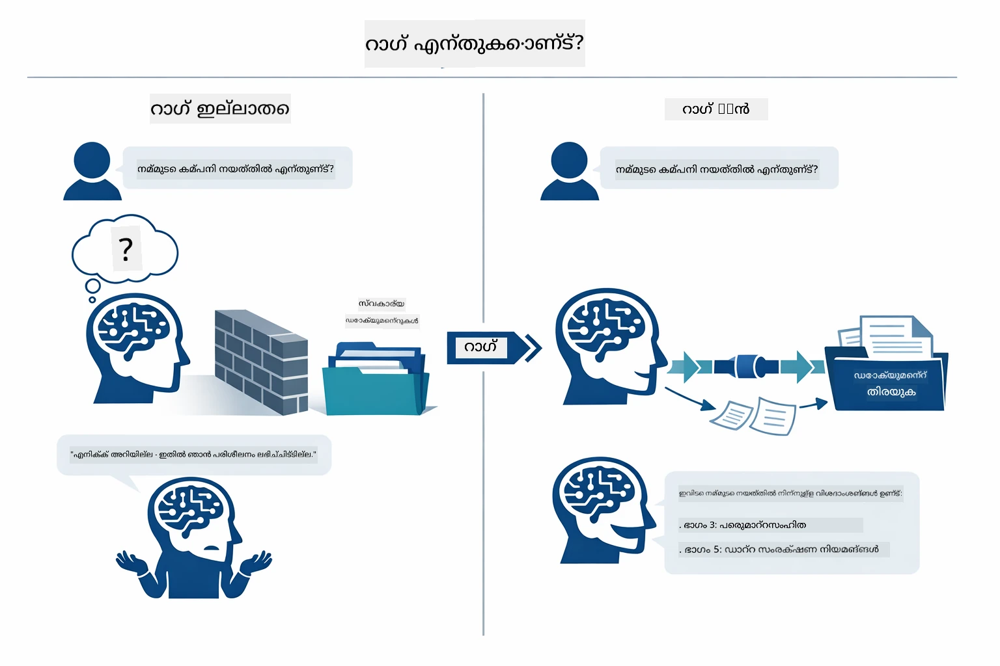

*ഈ ചിത്രരചന സാധാരണ LLM (പിന്നിലെ ഡാറ്റയിൽ നിന്നും ഗസ്സ് ചെയ്യുന്നവ)യും RAG-ഉൽപ്പന്ന LLM (ആദ്യം നിങ്ങളുടെ ഡോക്യുമെന്റുകള്‍ പരിശോധിക്കുന്നവ) തമ്മിലുള്ള വ്യത്യാസം കാണിക്കുന്നു.*

ഇപ്പോൾ, ഓരോ ഘട്ടവും എങ്ങനെ ബന്ധിപ്പിക്കപ്പെടുന്നു എന്ന് നോക്കൂ. ഒരു ഉപയോക്താവിന്റെ ചോദ്യമുട്ടി നാലു ഘട്ടങ്ങൾ വഴി സഞ്ചരിക്കുന്നു — embedding, vector search, context assembly, answer generation — ഓരോതും മുൻവഴികാട്ടലിന് തുടർച്ചയായാണ്:


*ഈ ചിത്രരചന അവധാനം RAG പൈപ്പ്ലൈൻ കാണിക്കുന്നു — ഉപയോക്താവിന്റെ ചോദ്യം embedding, vector search, context assembly, answer generation എന്നിവ വഴി കടക്കുന്നു.*

ഈ മോഡ്യൂള്‍ ബാക്കിയുള്ള വീതം ഓരോ ഘട്ടവും വിശദമായി കാണിക്കും, നിങ്ങൾക്ക് കോഡ് ഓടിച്ച് മാറ്റാം.

### Which RAG Approach Does This Tutorial Use?

LangChain4j RAG നടപ്പാക്കാൻ മൂന്ന് രീതികൾ നൽകുന്നു, ഓരോതും വ്യത്യസ്ത ലെവൽ അപ്‌ട്രാക്‌ഷനോടൊപ്പം. താഴെ കാണുന്ന ചിത്രരചന അവ തമ്മിൽ താരതമ്യം ചെയ്യുന്നു:

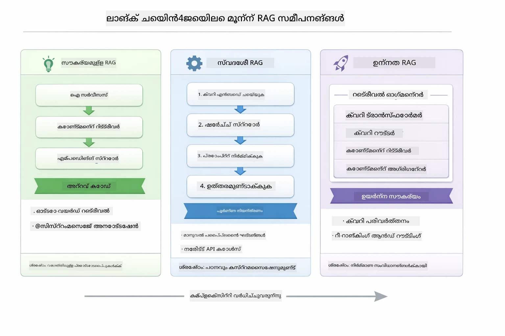

*ഈ ചിത്രരചന LangChain4j-യിലെ മൂന്ന് RAG സമീപനങ്ങളെ — Easy, Native, Advanced — താരതമ്യം ചെയ്യുന്നു, അവയുടെ പ്രധാന ഘടകങ്ങളും ഉപയോഗസമയം.*

| Approach | എന്ത് ചെയ്യുന്നു | വാണിജ്യ തന്ത്രം |
|---|---|---|
| **Easy RAG** | എല്ലാം സ്വയം `AiServices`-നും `ContentRetriever`-നും വഴി കൈകാര്യം ചെയ്യുന്നു. നിങ്ങൾ ഒരു ഇന്റർഫേസ് ചിലിട്ട്, റെട്രീവർ ചേർത്ത്, LangChain4j എമ്പഡ്ഡിംഗ്, തിരയൽ, പ്രോംപ്റ്റ് രചന പിന്നിൽ നിയന്ത്രിക്കുന്നു. | കുറഞ്ഞ കോഡ്, പക്ഷേ ഓരോ ഘട്ടവും കാണാനാകില്ല. |
| **Native RAG** | നിങ്ങൾ തന്നെ embedding മോഡൽ വിളിക്കുന്നു, സ്റ്റോർ തിരയുന്നു, പ്രോംപ്റ്റ് തയാറാക്കുന്നു, ഉത്തരം സൃഷ്ടിക്കുന്നു — ഓരോചടങ്ങും വ്യക്തമായി. | കൂടുതൽ കോഡ്, എന്നാൽ ഓരോ ഘട്ടവും ദൃശ്യമാണ്, മാറ്റം ചെയ്യാം. |
| **Advanced RAG** | `RetrievalAugmentor` ഫ്രെയിംവർക്കിനൊപ്പം ചേർക്കാവുന്ന ക്വറി ട്രാൻസ്ഫോർമേഴ്സ്, റൗട്ടേഴ്സ്, റീ-റാങ്കേഴ്‌സ്, കണ്ഠന്റ് ഇഞ്ചെക്ടർമാർ ഉപയോഗിച്ച് പ്രൊഡക്ഷൻ ഗ്രേഡ് പൈപ്പ്ലൈൻ. | അത്യധിക സ്വാതന്ത്ര്യം, എന്നാൽ വലിയ സങ്കീർണ്ണത. |

**ഈ ട്യൂട്ടോറിയൽ Native സമീപനം ഉപയോഗിക്കുന്നു.** RAG പൈപ്പ്ലൈനിലെ ഓരോ ഘട്ടവും — ക്വറിയെ എമ്പഡ് ചെയ്യുക, വെക്റ്റർ സ്റ്റോർ തേടുക, പശ്ചാത്തലം ഒരുക്കുക, ഉത്തരം സൃഷ്ടിക്കുക — വ്യത്യസ്തമായി [`RagService.java`](../../../03-rag/src/main/java/com/example/langchain4j/rag/service/RagService.java) എന്ന ഫയലില്‍ എഴുതപ്പെട്ടിരിക്കുന്നു. ഇത് പഠനത്തിനായുള്ള കാരണം: ഓരോ ഘട്ടവും നിങ്ങൾക്കറിയാനും മനസ്സിലാക്കാനും വഴിയൊരുക്കാൻ. ഘടകങ്ങൾ എങ്ങനെ ചേർന്നു പ്രവർത്തിക്കുന്നത് മനസ്സിലാക്കിയ രോഗ, നിങ്ങൾക്ക് Easy RAG-ലേക്ക്, ത്വരിത പ്രോട്ടോട്ടൈപ്പുകളിൽ പോകാം, അല്ലെങ്കിൽ Advanced RAG പ്രൊഡക്ഷൻ സിസ്റ്റങ്ങൾക്കായി.

> **💡 Easy RAG നിങ്ങൾക്ക് മുമ്പേ കാണാമോ?** [Quick Start module](../00-quick-start/README.md) ലെ ഒരു ഡോക്യുമെന്റ് Q&A ഉദാഹരണം ([`SimpleReaderDemo.java`](../../../00-quick-start/src/main/java/com/example/langchain4j/quickstart/SimpleReaderDemo.java)) Easy RAG സമീപനമാണ് ഉപയോഗിക്കുന്നത് — LangChain4j എമ്പഡ്ഡിംഗ്, തിരയൽ, പ്രോംപ്റ്റ് രചന സ്വയം കൈകാര്യം ചെയ്യുന്നു. ഈ മോഡ്യൂള്‍ ആ പൈപ്പ്ലൈൻ തുറന്ന് ഓരോ ഘട്ടവും നിങ്ങൾ തന്നെ നിയന്ത്രിക്കാനുള്ള വഴി കാണിക്കുന്നു.

താഴെ కనిపിക്കുന്നത് ആ Quick Start ഉദാഹരണത്തിലെ Easy RAG പൈപ്പ്ലൈൻ ആണ്. `AiServices` ഉം `EmbeddingStoreContentRetriever` ഉം എല്ലാ സങ്കീർണ്ണത മറയ്ക്കുന്നുവെന്ന് ശ്രദ്ധിക്കുക — നിങ്ങൾ ഡോക്യുമെന്റ് ലോഡ് ചെയ്യുന്നു, റെട്രീവർ ചേർക്കുന്നു, ഉത്തരം ലഭിക്കുന്നു. ഈ മോഡ്യൂളിലെ Native സമീപനം അവ മുഴുവൻ തുറക്കുന്നു:

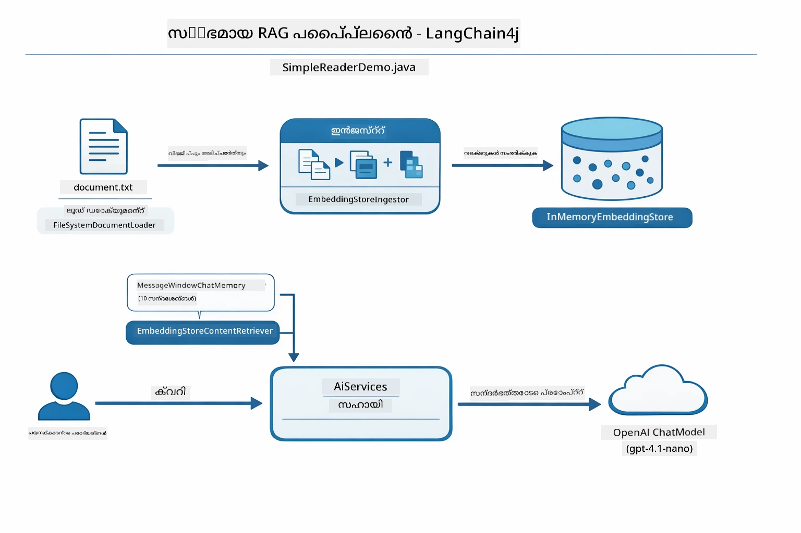

*ഈ ചിത്രരചന `SimpleReaderDemo.java`-ൽ നിന്നുള്ള Easy RAG പൈപ്പ്ലൈനാണ് കാണിക്കുന്നത്. ഇത് ഈ മോഡ്യൂളിൽ ഉപയോഗിച്ചിരിക്കുന്ന Native സമീപനത്തോടെ താരതമ്യം ചെയ്യുക: Easy RAG embedding, retrieval, പ്രോംപ്റ്റ് അസംബ്ലി `AiServices` ഉം `ContentRetriever` ഉം പിന്നിൽ മറയ്ക്കുന്നു — ഡോക്യുമെന്റ് ലോഡ് ചെയ്ത്, റെട്രീവർ ചേർത്ത്, ഉത്തരം നേടുക. ഈ മോഡ്യൂളിലെ Native സമീപനം ആ പൈപ്പ്ലൈൻ തുറന്ന് ഓരോ ഘട്ടവും (എമ്പഡ് ചെയ്യുക, തിരയുക, പശ്ചാത്തലം കൂട്ടിച്ചേർക്കുക, സൃഷ്ടിക്കുക) നിങ്ങൾക്ക് വ്യക്തമായി കാണിക്കുന്നു.*

## How It Works

ഈ മോഡ്യൂളിലെ RAG പൈപ്പ്ലൈൻ ഒരു ഉപയോക്താവ് ചോദ്യമുയർത്തിയാൽ നിരന്തരം പ്രവർത്തിക്കുന്ന നാല് ഘട്ടങ്ങളായി വിഭജിക്കുന്നു. ആദ്യം, അപ്‌ലോഡ് ചെയ്ത ഡോക്യുമെന്റ് **പരിശോധിക്കുകയും ചങ്കുകളാക്കി** ചെറിയ manageable ഭാഗങ്ങളാക്കി. ആ ചങ്കുകൾ പിന്നീട് **വെക്റ്റർ എംബഡിങ്ങുകളായി** മാറ്റി സൂക്ഷിക്കുന്നു, ഇപ്പോള്‍ ഗണിതപരമായി താരതമ്യം ചെയ്യാനാകും. ചോദ്യമെത്തുമ്പോൾ, ഒരു **സെമാന്റിക് തിരയൽ** നടത്തുകയും ഏറ്റവും പ്രസക്തമായ ചങ്കുകൾ കണ്ടെത്തി, അവ LLM-ന് **ഉത്തര സൃഷ്ടിക്കാനായി** പശ്ചാത്തലമായി നൽകുന്നു. താഴെ ഓരോ ഘട്ടവും കോഡുമായി വിശദമായി കാണാം. ആദ്യ ഘട്ടം നോക്കാം.

### Document Processing

[DocumentService.java](../../../03-rag/src/main/java/com/example/langchain4j/rag/service/DocumentService.java)

നിങ്ങൾ ഒരു ഡോക്യുമെന്റ് അപ്‌ലോഡ് ചെയുമ്പോൾ, സിസ്റ്റം അതിനെ (PDF അല്ലെങ്കിൽ പ്ലെയിന്‍ ടെക്സ്റ്റ്) പാഴ്‌സുചെയ്ത്, ഫയൽനാമം പോലുള്ള മെറ്റാഡേറ്റ കൂടിയാക്കി, ചെറിയ ചങ്കുകളായി വിഭജിക്കും — മോഡലിന്റെ context window-യിൽ എളുപ്പത്തിൽ ഒതുക്കാവുന്ന ചെറിയ ഭാഗങ്ങൾ. ഈ ചങ്കുകൾ ഒറ്റപ്പെട്ടിടങ്ങളിൽ പശ്ചാത്തല നഷ്ടപ്പെടാതിരിക്കുവാനായി ചെറിയ മറുപടി പങ്ക് കൂട്ടായി.

```java
// അപ്ലോഡ് ചെയ്ത ഫയൽ പരീക്ഷിച്ച് അത് LangChain4j ഡോക്യുമെന്റായി മൂടുക
Document document = Document.from(content, metadata);

// 30-ടോക്കൺ ഒവർലാപ്പോടെ 300-ടോക്കൺ ചുങ്കുകളിൽ വിഭജിക്കുക
DocumentSplitter splitter = DocumentSplitters
    .recursive(300, 30);

List<TextSegment> segments = splitter.split(document);
```

താഴെ കാണുന്ന ചിത്രരചന ഇത് എങ്ങനെ പ്രവർത്തിക്കുന്നു വ്യക്തമാക്കുന്നു. ഓരോ ചങ്കും ചുറ്റുപാട് ചില ടോക്കണുകൾ പങ്കിടുന്നത് ശ്രദ്ധിക്കുക — 30-ടോക്കൺ ഓവർലാപ്പ് boundaries-ൽ പ്രാധാന്യമുള്ള പശ്ചാത്തലം നഷ്ടപ്പെടാതെ ഉറപ്പാക്കുന്നു:

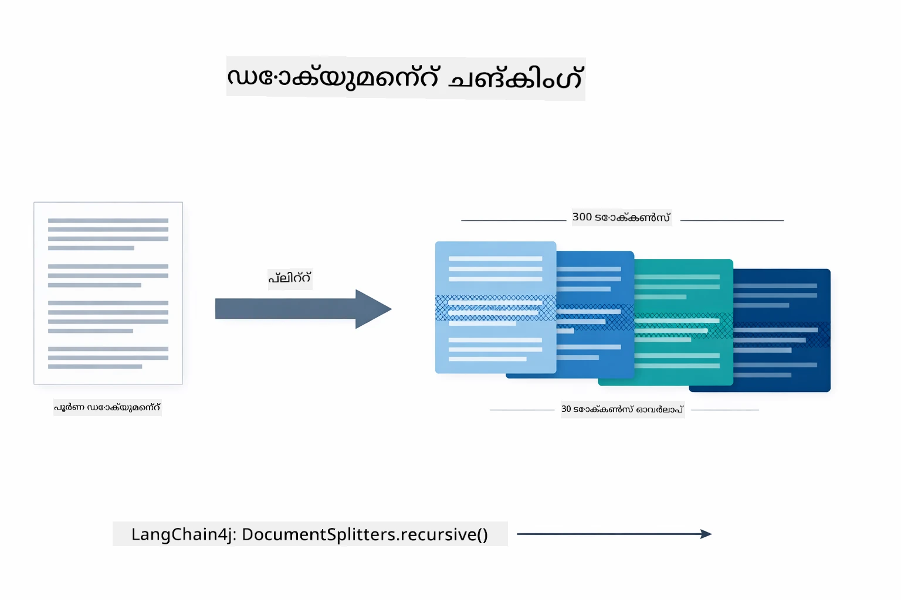

*ഈ ചിത്രരചന ഒരു ഡോക്യുമെന്റ് 300-ടോക്കൺ ചങ്കുകളായി 30-ടോക്കൺ ഓവർലാപ്പോടെ വിഭജിക്കുന്നതും ചങ്ക് ബൗണ്ടറികളിൽ പശ്ചാത്തലം സംരക്ഷിക്കുന്നതും കാണിക്കുന്നു.*

> **🤖 [GitHub Copilot](https://github.com/features/copilot) ചാറ്റിൽ ശ്രമിക്കുക:** [`DocumentService.java`](../../../03-rag/src/main/java/com/example/langchain4j/rag/service/DocumentService.java) തുറന്നു ചോദിക്കുക:
> - "LangChain4j ഡോക്യുമെന്റുകള്‍ എങ്ങനെ ചങ്കുകളായി വിഭജിക്കുന്നു, ഓവർലാപ്പിന്റെ പ്രാധാന്യം എന്ത്?"
> - "വിവിധ ഡോക്യുമെന്റ് തരംകൾക്കുള്ള ഏറ്റവും ഉചിതമായ ചങ്ക് വലുപ്പം എന്താണ്, എന്തുകൊണ്ട്?"
> - "വിവിധ ഭാഷകളിൽ ഉള്ള ഡോക്യുമെന്റുകളും പ്രത്യേക ഫോർമാറ്റിംഗും എങ്ങനെ കൈകാര്യം ചെയ്യാം?"

### Creating Embeddings

[LangChainRagConfig.java](../../../03-rag/src/main/java/com/example/langchain4j/rag/config/LangChainRagConfig.java)

ഓരോ ചങ്കും embedding-എന്നറിയപ്പെടുന്ന ഒരു സംഖ്യാത്മക പ്രതിനിധാനമായി മാറ്റപ്പെടുന്നു — അര്‍ത്ഥം സംഖ്യകളായി മാറ്റുന്നൊരു സംവിധാനമാണ്. എമ്പഡിങ്ങ് മോഡല്‍ ഒരു ചാറ്റ് മോഡല് പോലെ "ബുദ്ധിമുട്ടുള്ള"തന്നെയല്ല; അത് നിർദ്ദേശങ്ങൾ പാലിക്കുകയോ, കാരണമൊടുക്കുകയോ, ചോദ്യങ്ങൾക്കു ഉത്തരം നൽകുകയോ ചെയ്യേണ്ട ആവശ്യമില്ല. അത് ചെയ്യുന്നത് എന്നത്: ഒരേ തരം അർത്ഥമുള്ള വാക്കുകൾ, ഒരു സമാനമായ ഗണിതാന്തരീക്ഷത്തിൽ അടുത്ത് വന്നു നിൽക്കുന്നു. "കാർ" "ഓട്ടോമൊബൈൽ"ക്ക് അടുത്ത്, "റീഫണ്ട് നയം" "പണം മടക്കുക"യ്ക്ക് അടുത്ത്. ചാറ്റ് മോഡല്‍ മനുഷ്യൻ പോലെ സംസാരിക്കാവുന്നതാണ്; എമ്പഡിങ്ങ് മോഡൽ അതിനേക്കാൾ മികച്ച ഫയൽ സംവിധാനമാണ്.

താഴെ കാണുന്ന ചിത്രരചന ഈ ആശയം വിശദീകരിക്കുന്നു — ടെക്സ്റ്റ് പുറത്തേക്ക് യാഥാർഥഗണിത വക്ടറുകളിലേക്കുള്ള മാറ്റം, സമാന അർത്ഥങ്ങൾ അടുത്ത വക്ടറുകളായി വരുന്നു:

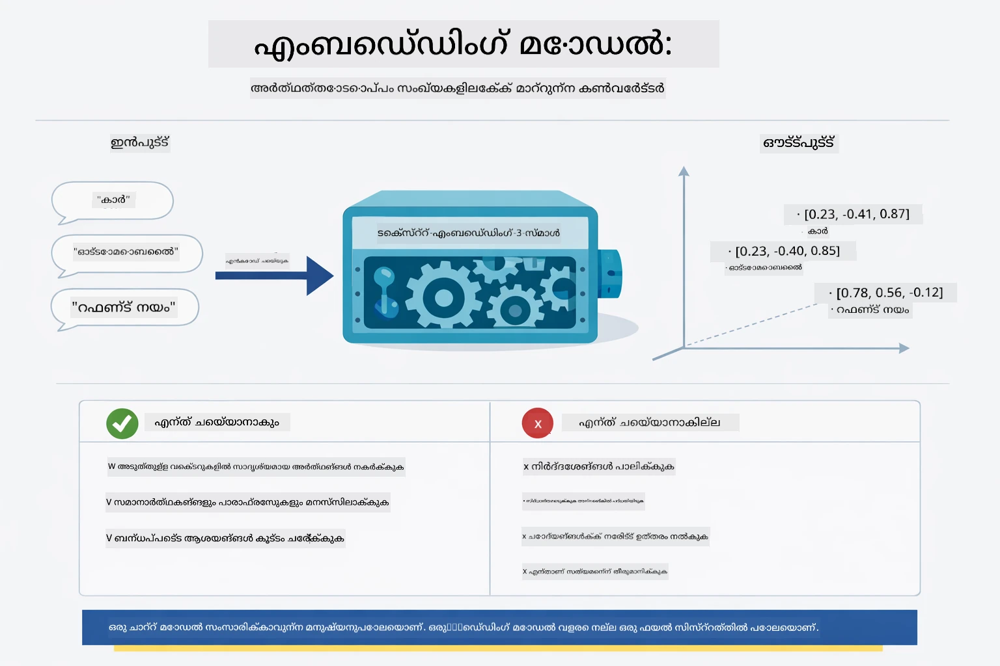

*ഈ ചിത്രരചന ഒരു എമ്പഡിങ്ങ് മോഡൽ ടെക്സ്റ്റ് സംഖ്യാത്മക വക്ടറുകളായി മാറ്റുന്നവിധം കാണിക്കുന്നു, സമാന അർത്ഥങ്ങള്‍ — "കാർ" & "ഓട്ടോമൊബൈൽ" പോലുള്ളവ — അടുത്ത് നില്‍ക്കുന്നു.*

```java
@Bean
public EmbeddingModel embeddingModel() {
    return OpenAiOfficialEmbeddingModel.builder()
        .baseUrl(azureOpenAiEndpoint)
        .apiKey(azureOpenAiKey)
        .modelName(azureEmbeddingDeploymentName)
        .build();
}

EmbeddingStore<TextSegment> embeddingStore = 
    new InMemoryEmbeddingStore<>();
```

താഴെ കാണുന്ന ക്ലാസ് ചിത്രരചന RAG പൈപ്പ്ലൈനുകളിലെ രണ്ട് വ്യത്യസ്ത പ്രവാഹങ്ങളും അവ നടപ്പിലാക്കുന്ന LangChain4j ക്ലാസ്സുകളും കാണിക്കുന്നു. **ഇൻജെക്ഷൻ പ്രവാഹം** (അപ്‌ലോഡ് സമയത്ത് ഓടുക) ഡോക്യുമെന്റ് വിഭജിച്ച്, ചങ്കുകൾ എമ്പഡ് ചെയ്ത് `.addAll()` വഴി സൂക്ഷിക്കുന്നു. **ക്വറി പ്രവാഹം** (ഓരോ ചോദിച്ചപ്പോഴും ഓടുക) ചോദ്യത്തെ എമ്പഡ് ചെയ്ത് `.search()` വഴി സ്റ്റോർ തിരയുന്നു, ചേരുന്ന പശ്ചാത്തലം ചാറ്റ് മോഡലിലേക്ക് നൽകുന്നു. ഇരുവരും പങ്കുവച്ച `EmbeddingStore<TextSegment>` ഇന്റർഫേസിൽ അപേക്ഷിച്ചു കൂടുന്നു:

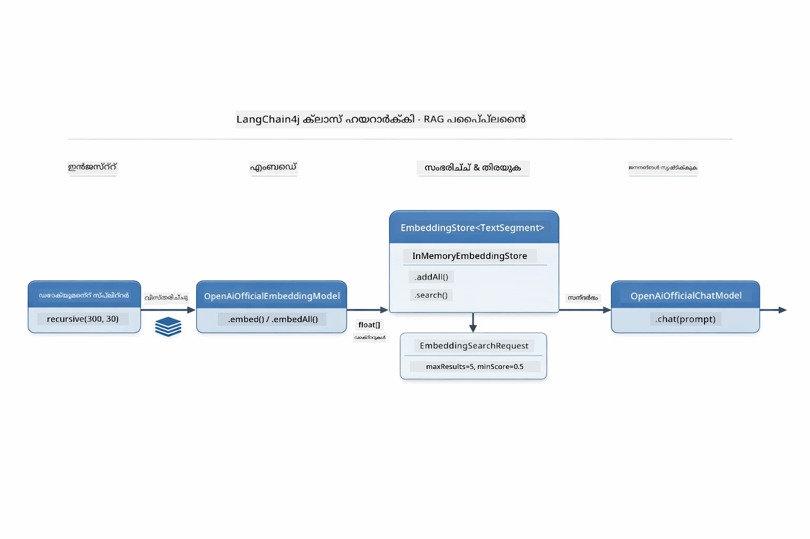

*ഈ ചിത്രരചന RAG പൈപ്പ്ലൈനിലെ ഇരട്ട പ്രവാഹങ്ങള്‍ — ingestion, query — എങ്ങനെ പങ്കുവച്ച EmbeddingStore വഴി ബന്ധപ്പെടുന്നു എന്ന് കാണിക്കുന്നു.*

എംബഡിങ്ങുകൾ സൂക്ഷിച്ചശേഷം, സമാന ഉള്ളടക്കം സ്വാഭാവികമായി വെക്ടർ സ്പെയ്സിൽ കൂട്ടമായി നിൽക്കും. താഴെയുള്ള ദൃശ്യീകരണം ബന്ധപ്പെട്ട വിഷയം ഉള്ള ഡോക്യുമെന്റുകൾ സമീപവൃത്തങ്ങളിൽ കാണിക്കുന്നു, ഇത് സെമാന്റിക് തിരയൽ സാധ്യമാക്കുന്നു:


*ഈ ദൃശ്യീകരണം ബന്ധപ്പെട്ട ഡോക്യുമെന്റുകൾ 3D വെക്ടർ സ്പെയ്സിൽ, ടെക്നിക്കൽ ഡോക്സ്, ബിസിനസ് റൂൾസ്, പ്രായോഗിക ചോദ്യങ്ങൾ എന്നീ വിഷയങ്ങൾ നൽകിയ ഗ്രൂപ്പുകളായി കാണിക്കുന്നു.*

ഉപയോക്താവ് തിരയുമ്പോൾ, സിസ്റ്റം നാല് ഘട്ടങ്ങൾ പാലിക്കുന്നു: ഡോക്യുമെന്റുകൾ ഒരിക്കൽ എമ്പഡ് ചെയ്യുക, ഓരോ തിരയലിനും ചോദ്യവും എമ്പഡ് ചെയ്യുക, കോസൈൻ സമാനതയിലൂടെ ചോദ്യ വെക്ടർ മുഴുവൻ സൂക്ഷിക്കപ്പെട്ട വെക്ടറുകളോട് താരതമ്യം ചെയ്യുക, ഏറ്റവും ഉയർന്ന സ്കോർ നേടിയ Top-K ചങ്കുകൾ തിരികെ നൽകുക. താഴെയുള്ള диаграм് ഓരോ ഘട്ടവും LangChain4j ക്ലാസ്സുകളെ ഉൾപ്പെടുത്തി കാണിക്കുന്നു:

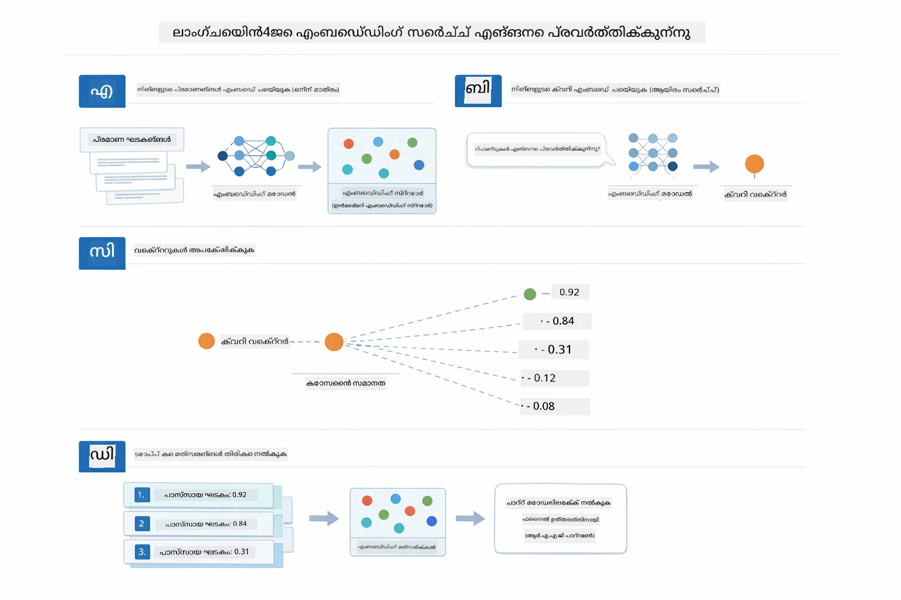

*ഈ ചിത്രരചന നാല് ഘട്ടങ്ങളുള്ള എമ്പഡിങ്ങ് തിരയൽ പ്രക്രിയ കാണിക്കുന്നു: ഡോക്യുമെന്റ് എമ്പഡ് ചെയ്യുക, ചോദ്യവും എമ്പഡ് ചെയ്യുക, കോസൈൻ സമാനത ഉപയോഗിച്ച് വെക്ടറുകൾ താരതമ്യം ചെയ്യുക, Top-K ഫലം തിരികെ നൽകുക.*

### Semantic Search

[RagService.java](../../../03-rag/src/main/java/com/example/langchain4j/rag/service/RagService.java)

നിങ്ങൾ ചോദ്യമുയർത്തുമ്പോൾ, ചോദ്യവും എമ്പഡിങ്ങായി മാറും. സിസ്റ്റം നിങ്ങളുടെ ചോദ്യം എമ്പഡിങ്ങും എല്ലാ ഡോക്യുമെന്റ് ചങ്കുകളുടെയും എമ്പഡിങ്ങുകളുമായും താരതമ്യം ചെയ്യുന്നു. ഏറ്റവും സമാന അർത്ഥമുളള ചങ്കുകൾ കണ്ടെത്തുന്നു — കീവേർഡുകൾ മാത്രമല്ല, യഥാർത്ഥ സെമാന്റിക് സമാനത.

```java
Embedding queryEmbedding = embeddingModel.embed(question).content();

EmbeddingSearchRequest searchRequest = EmbeddingSearchRequest.builder()
    .queryEmbedding(queryEmbedding)
    .maxResults(5)
    .minScore(0.5)
    .build();

EmbeddingSearchResult<TextSegment> searchResult = embeddingStore.search(searchRequest);
List<EmbeddingMatch<TextSegment>> matches = searchResult.matches();

for (EmbeddingMatch<TextSegment> match : matches) {
    String relevantText = match.embedded().text();
    double score = match.score();
}
```

താഴത്തെ ചിത്രരചന സെമാന്റിക് തിരയലും പരമ്പരാഗത കീവേഡ് തിരയലും തമ്മിലുള്ള വ്യത്യാസം കാണിക്കുന്നു. "വാഹനം" എന്ന കീവേഡ് തിരയൽ "കാറുകളും ട്രക്കുകളും" ഉള്ള ഒരു ചങ്ക് കാണിക്കാതെ പോവുമ്പോൾ, സെമാന്റിക് തിരയൽ അവ കടന്നുകാണുകയും ഉയർന്ന സ്‌കോറുള്ള ഫലം നൽകുകയും ചെയ്യുന്നു:

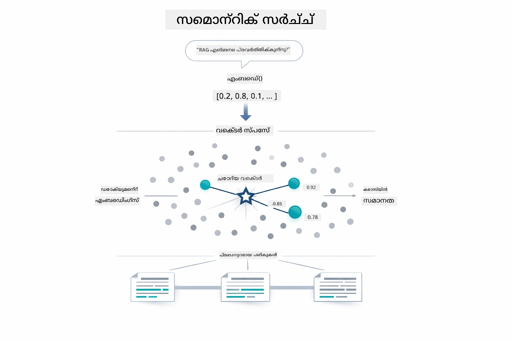

*ഈ ചിത്രരചന കീവേഡ് തിരയലും സെമാന്റിക് തിരയലും തമ്മിലുള്ള വ്യത്യാസം കാണിക്കുന്നു, സെമാന്റിക് തിരയൽ കീവേഡുകളിൽ വ്യത്യാസം ഉണ്ടായാലും ആശയപരമായി ബന്ധമുള്ള ഉള്ളടക്കം കണ്ടെത്തുന്നു.*
ഹുഡ് അണ്ടർ, സാദൃശ്യത കോസൈൻ സാദൃശ്യത ഉപയോഗിച്ച് അളക്കപ്പെടുന്നു — അതായത് "ഈ രണ്ട് അണക്കിഴകൾ ഒരേ ദിശയിലാണോ?" എന്ന ചോദ്യം. രണ്ടു ചങ്കുകൾ പൂർണമായും വ്യത്യസ്തമായ വാക്കുകൾ ഉപയോഗിക്കാം, പക്ഷെ അവയ്ക്ക് സമാനമായ അർത്ഥമുണ്ടെങ്കിൽ അവയുടെ വെക്ടറുകൾ ഒരേ ദിശയിലായിരിക്കും, സ്കോർ 1.0-ന് അടുത്ത് വരും:

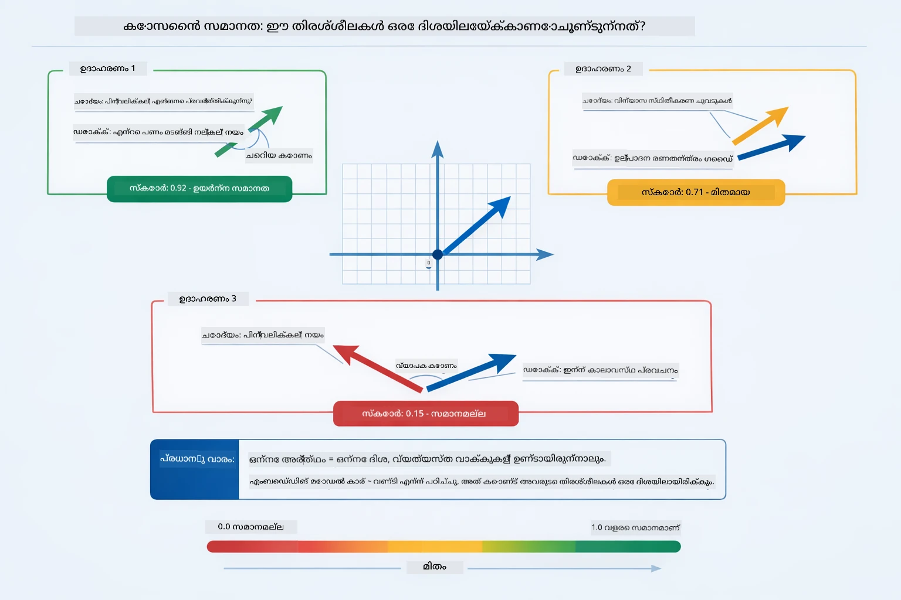

*ഈ ഡിസൈനിൽ എൻബെഡിങ് വെക്ടറുകൾക്കിടയിൽ കോസൈൻ സാദൃശ്യത കോണം ആയി കാണിക്കുന്നു — കൂടുതല് സാമ്യമുള്ള വെക്ടറുകൾ 1.0-ന് അടുത്ത് സ്കോർ ചെയ്യുന്നു, ഉയർന്ന സമാനാർത്ഥ സാദൃശ്യത സൂചിപ്പിക്കുന്നു.*

> **🤖 [GitHub Copilot](https://github.com/features/copilot) ചാറ്റുമായി പരീക്ഷിക്കൂ:** തുറക്കുക [`RagService.java`](../../../03-rag/src/main/java/com/example/langchain4j/rag/service/RagService.java) և ചോദിക്കുക:
> - "എൻബെഡിങ്സിനോടൊപ്പം സാദൃശ്യ തിരച്ചിൽ എങ്ങനെ പ്രവർത്തിക്കുന്നു, സ്കോർ എന്തുകൊണ്ട് നിർണയിക്കപ്പെടുന്നു?"
> - "എന്താണ് ഉപയോഗിക്കാൻ ഉചിതമായ സാദൃശ്യ ത്രെഷോള്‍ഡ്, അത് ഫലങ്ങളെ എങ്ങനെ ബാധിക്കുന്നു?"
> - "പ്രസക്ത ഡോക്യുമെന്റുകൾ കണ്ടെത്തില്ലെങ്കിൽ എങ്ങനെ കൈകാര്യം ചെയ്യാം?"

### ഉത്തരം സൃഷ്ടിക്കൽ

[RagService.java](../../../03-rag/src/main/java/com/example/langchain4j/rag/service/RagService.java)

സബ്ബന്ധപ്പെട്ട ഏറ്റവും യോജിച്ച ചങ്കുകൾ വ്യക്തമായ നിർദേശങ്ങളും തിരിഞ്ഞു കിട്ടിയ ഉള്ളടക്കവും ഉപയോക്താവിന്റെ ചോദ്യം ഉൾപ്പെടുത്തിയ സ്റ്റ്രക്ചർ ചെയ്ത പ്രോംപ്റ്റായി സംയോജിപ്പിക്കപ്പെടുന്നു. മോഡൽ ആ പ്രത്യേക ചങ്കുകൾ വായിക്കുകയും അവ അടിസ്ഥാനമാക്കി ഉത്തരം നൽകുകയും ചെയ്യുന്നു — ഇത് മുന്നിൽ ഉള്ള കാര്യങ്ങൾ മാത്രം ഉപയോഗിക്കാൻ കഴിയും, കാരണത്താൽ ഹല്ലൂസിനേഷൻ തടയുകയും ചെയ്യുന്നു.

```java
String context = matches.stream()
    .map(match -> match.embedded().text())
    .collect(Collectors.joining("\n\n"));

String prompt = String.format("""
    Answer the question based on the following context.
    If the answer cannot be found in the context, say so.

    Context:
    %s

    Question: %s

    Answer:""", context, request.question());

String answer = chatModel.chat(prompt);
```

താഴെയുള്ള ഡിസൈനിൽ ഈ അസംബ്ലിയെ കാണിക്കുന്നു — തിരച്ചിൽ ഘട്ടത്തിൽ ഏറ്റവും ഉയർന്ന സ്കോർ നേടുന്ന ചങ്കുകൾ പ്രോംപ്റ്റ് ടെംപ്ലേറ്റിൽ ചേർക്കപ്പെടുകയും `OpenAiOfficialChatModel` ഒരു അടിത്തറയുള്ള ഉത്തരം സൃഷ്ടിക്കുകയും ചെയ്യുന്നു:

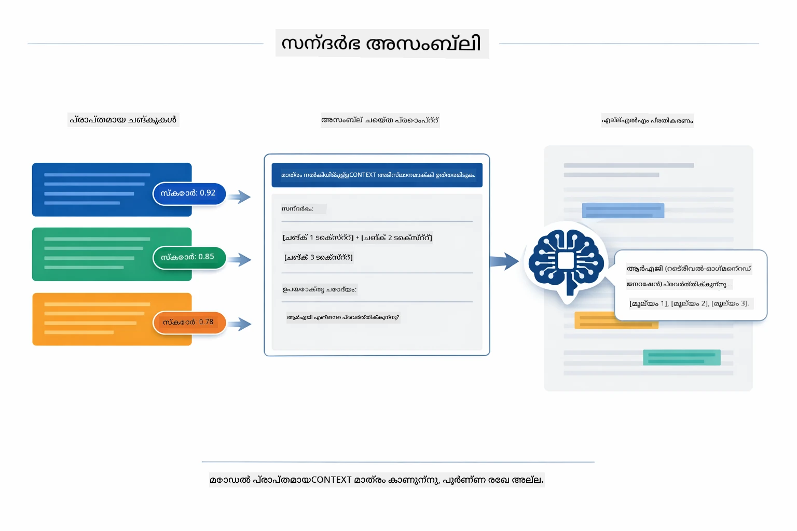

*ഈ ഡിസൈൻ ടോപ്-സ്കോറിങ് ചങ്കുകൾ എങ്ങനെ ഒരു ഘടനാപരമായ പ്രോംപ്റ്റിലേക്ക് ചേർത്ത് മോഡൽ നിങ്ങളുടെ ഡാറ്റയിൽ നിന്നൊരു പശ്ചാത്തലമുള്ള ഉത്തരം സൃഷ്ടിക്കുന്നുവെന്ന് കാണിക്കുന്നു.*

## ആപ്ലിക്കേഷൻ ഓടിക്കുക

**ഡിപ്ലോയ്മെന്റ് സ്ഥിരീകരിക്കുക:**

റൂട്ട് ഡയറക്ടറിയിൽ Azure ക്രെഡൻഷ്യലുകളോടുകൂടിയ `.env` ഫയൽ ഉണ്ടെന്ന് ഉറപ്പാക്കുക (മോഡ്യൂൾ 01-ൽ സൃഷ്ടിച്ചത്). ഇത് മോഡ്യൂൾ ഡയറക്ടറിയിൽ നിന്നു (`03-rag/`) പ്രവർത്തിപ്പിക്കുക:

**Bash:**
```bash
cat ../.env  # AZURE_OPENAI_ENDPOINT, API_KEY, DEPLOYMENT കാണിക്കണം
```

**PowerShell:**
```powershell
Get-Content ..\.env  # AZURE_OPENAI_ENDPOINT, API_KEY, DEPLOYMENT കാണിക്കണം
```

**ആപ്ലിക്കേഷൻ ആരംഭിക്കുക:**

> **ശ്രദ്ധിക്കുക:** മുൻപ് `./start-all.sh` റൂട്ട് ഡയറക്ടറിയിൽ നിന്നു ഓടിച്ചതെങ്കിൽ (മോഡ്യൂൾ 01-ൽ വിവരിച്ചതുപോലെ), ഈ മോഡ്യൂൾ 8081 പോർട്ടിൽ നിലവിലുണ്ട്. താഴെ കൊടുത്ത സ്റ്റാർട്ട് കമാൻഡുകൾ ഒഴിവാക്കി http://localhost:8081-ലേക്ക് നേരെ പോകാം.

**പ്രവർത്തന പരിധി 1: സ്പ്രിംഗ് ബൂട്ടിലെ ഡാഷ്ബോർഡ് ഉപയോഗിക്കുക (VS കോഡ് ഉപയോക്താക്കൾക്ക് ശുപാർശചെയ്യുന്നു)**

ഡെവ് കണ്ടെയ്‌നറിൽ സ്പ്രിംഗ് ബൂട്ട് ഡാഷ്ബോർഡ് എക്സ്റ്റൻഷൻ ഉൾപ്പെടുത്തിയിട്ടുണ്ട്, ഇത് എല്ലാ സ്പ്രിംഗ് ബൂട്ടു ആപ്ലിക്കേഷനുകളും വിസ്വാലായി കാണാനും നിയന്ത്രിക്കാനും ഉപയോഗിക്കുന്നു. VS കോഡിന്റെ ഇടതുവശമുള്ള ആക്ടിവിറ്റി ബാറിൽ (സ്പ്രിംഗ് ബൂട്ട് ഐക്കൺ നോക്കുക) ലഭ്യമാണ്.

സ്പ്രിംഗ് ബൂട്ട് ഡാഷ്ബോർഡിൽ നിന്നു നിങ്ങൾക്ക്:
- വർക്ക്‌സ്പേസിൽ ലഭ്യമായ എല്ലാ സ്പ്രിംഗ് ബൂട്ടു ആപ്ലിക്കേഷനുകളും കാണാം
- ഒറ്റ ക്ലിക്കിൽ ആപ്ലിക്കേഷനുകൾ ആരംഭിക്കുന്നതും നിർത്തുന്നതും
- ആപ്ലിക്കേഷൻ ലോഗുകൾ റിയൽ ടൈമിൽ കാണാം
- ആപ്ലിക്കേഷൻ നില നിരീക്ഷണം

"rag" ന്റെ അടുത്തുള്ള പ്ളേ ബട്ടൺ ക്ലിക്ക് ചെയ്താൽ ഈ മോഡ്യൂൾ ആരംഭിക്കും, അല്ലെങ്കിൽ എല്ലാ മോഡ്യൂളുകളും ഒരുമിച്ച് ആരംഭിക്കാം.


*ഈ സ്ക്രീൻഷോട്ടിൽ VS കോഡിൽ സ്പ്രിംഗ് ബൂട്ട് ഡാഷ്ബോർഡ് കാണിക്കുന്നു, നിങ്ങൾക്ക് ആപ്ലിക്കേഷനുകൾ തുടങ്ങാനും നിർത്താനും നിയന്ത്രിക്കാനും സാധിക്കുന്നു.*

**പ്രവർത്തന പരിധി 2: ഷെൽ സ്ക്രിപ്റ്റുകൾ ഉപയോഗിക്കുക**

എല്ലാ വെബ് ആപ്ലിക്കേഷനുകൾ (മോഡ്യൂൾ 01-04) ആരംഭിക്കുക:

**Bash:**
```bash
cd ..  # റൂട്ട് ഡയറക്ടറിയിൽ നിന്ന്
./start-all.sh
```

**PowerShell:**
```powershell
cd ..  # റൂട്ട് ഡയറക്റ്ററിയിൽ നിന്ന്
.\start-all.ps1
```

അല്ലെങ്കിൽ ഈ മോഡ്യൂളിൽ മാത്രം തുടങ്ങിയാൽ:

**Bash:**
```bash
cd 03-rag
./start.sh
```

**PowerShell:**
```powershell
cd 03-rag
.\start.ps1
```

രണ്ട് സ്ക്രിപ്റ്റുകൾ റൂട്ട് `.env` ഫയലിൽ നിന്നുള്ള പരിസ്ഥിതി ഘടകങ്ങൾ സ്വയം ലോഡ് ചെയ്യും, ജാറുകൾ ഇല്ലെങ്കിൽ നിർമ്മിക്കും.

> **ശ്രദ്ധിക്കുക:** സ്റ്റാർട്ട് ചെയ്യുന്നതിനുമുമ്പ് എല്ലാ മോഡ്യൂളുകളും കൈമാറാൻ നിങ്ങൾ ഇഷ്ടപ്പെടുന്നതെങ്കിൽ:  
>
> **Bash:**
> ```bash
> cd ..  # Go to root directory
> mvn clean package -DskipTests
> ```
>  
> **PowerShell:**
> ```powershell
> cd ..  # Go to root directory
> mvn clean package -DskipTests
> ```

നിങ്ങളുടെ ബ്രൗസറിൽ http://localhost:8081 തുറക്കുക.

**നിറുത്തുന്നതിന്:**

**Bash:**
```bash
./stop.sh  # ഈ മോഡ്യൂളും മാത്രം
# അല്ലെങ്കിൽ
cd .. && ./stop-all.sh  # എല്ലാ മോഡ്യൂളുകളും
```

**PowerShell:**
```powershell
.\stop.ps1  # ഈ മൊഡ്യൂള് മാത്രമേ
# അല്ലങ്കില്
cd ..; .\stop-all.ps1  # എല്ലാ മൊഡ്യൂളുകളും
```

## ആപ്ലിക്കേഷൻ ഉപയോഗിക്കുക

ഡോക്യുമെന്റ് അപ്‌ലോഡ് ചെയ്യാനും ചോദ്യങ്ങൾ ചോദിക്കാനും വെബ് ഇന്റർഫേസ് ആപ്ലിക്കേഷൻ നൽകുന്നു.

<a href="images/rag-homepage.png"></a>

*ഈ സ്ക്രീൻഷോട്ടിൽ RAG ആപ്ലിക്കേഷൻ ഇന്റർഫേസാണ് കാണുന്നത്, നിങ്ങൾ ഡോക്യുമെന്റുകൾ അപ്‌ലോഡ് ചെയ്ത് ചോദ്യങ്ങൾ ചോദിക്കാൻ സാധിക്കുന്നത്.*

### ഡോക്യുമെന്റ് അപ്‌ലോഡ് ചെയ്യുക

ഒരു ഡോക്യുമെന്റ് അപ്‌ലോഡ് ചെയ്യുന്നതു മുതൽ ചെയ്യുക - പരീക്ഷണത്തിന് TXT ഫയലുകൾ വളരെ അനുയോജ്യമാണ്. ഈ ഡയറക്ടറിയിലാണ് `sample-document.txt` നൽകപ്പെട്ടിരിക്കുന്നത്, ഇതിൽ LangChain4j ഫീച്ചറുകൾ, RAG നടപ്പാക്കൽ, മികച്ച ശീലങ്ങൾ എന്നിവയുടെ വിവരങ്ങൾ അടങ്ങിയിരിക്കുന്നു - സിസ്റ്റം പരീക്ഷിക്കാൻ ഇത് അനുയോജ്യമാണ്.

സിസ്റ്റം നിങ്ങളുടെ ഡോക്യുമെന്റ് പ്രോസസ്സ് ചെയ്ത്, ചങ്കുകളായി വിഭജിച്ച്, ഓരോ ചങ്കിനും എൻബെഡിങ്സ് സൃഷ്ടിക്കുന്നു. ഇത് നിങ്ങൾ അപ്‌ലോഡ് ചെയ്തപ്പോൾ തന്നെ സ്വയമെത്തിച്ചാക്കി നടക്കുന്നു.

### ചോദ്യങ്ങൾ ചോദിക്കുക

ഇപ്പോൾ ഡോക്യുമെന്റ് ഉള്ളടക്കത്തെ സംബന്ധിച്ച വ്യക്തമായ ചോദ്യങ്ങൾ ചോദിക്കൂ. ഡോക്യുമെന്റിൽ വ്യക്തമായി പറഞ്ഞിട്ടുള്ള സത്യസന്ധമായ കാര്യങ്ങൾ ചോദിക്കുക. സിസ്റ്റം അനുയോജ്യമായ ചങ്കുകൾ തിരയുകയും അവ പ്രോംപ്റ്റിൽ ഉൾപ്പെടുത്തി ഉത്തരം നിർമ്മിക്കുകയും ചെയ്യും.

### ഉറവിട റഫറൻസുകൾ പരിശോധിക്കുക

പ്രത്യേക ഉത്തരം ഓരോ ഉറവിട റഫറൻസുകളും സമാനത സ്കോറുകളുമായാണ് ലഭിക്കുന്നത്. ഈ സ്കോറുകൾ (0 മുതൽ 1 വരെയാണ്) നിങ്ങൾ ചോദിച്ച ചോദ്യത്തിനുള്ള അതിനൊത്ത ചങ്കുകളുടെ പ്രസക്തത കാണിക്കുന്നു. ഉയർന്ന സ്കോറുകൾ മികച്ച ഗുണമേന്മയുള്ള ചങ്കുകൾ സൂചിപ്പിക്കുന്നു. ഇതിലൂടെ നിങ്ങള്‍ ഉത്തരം ഉറവിടം പ്രമാണിച്ച് പരിശോദിക്കാം.

<a href="images/rag-query-results.png"></a>

*ഈ സ്ക്രീൻഷോട്ട് ക്വറി ഫലങ്ങളും ഉത്തരം, ഉറവിട റഫറൻസുകളും, ഓരോ തിരഞ്ഞെടുത്ത ചങ്കിന്റെയും പ്രസക്തത സ്കോറുകളും കാണിക്കുന്നു.*

### ചോദ്യങ്ങളുമായി പരീക്ഷണം നടത്തുക

വിവിധ തരം ചോദ്യങ്ങൾ ചോദിച്ച് നോക്കൂ:  
- പ്രത്യേക സത്യങ്ങൾ: "പ്രധാന വിഷയം എന്താണ്?"  
- താരതമ്യങ്ങൾ: "X ഉം Y ഉമെന്നുള്ള വ്യത്യാസം എന്താണ്?"  
- സംക്ഷേപങ്ങൾ: "Z സംബന്ധിച്ച പ്രധാനപ്പെട്ട കാര്യങ്ങൾ സംഗ്രഹിപ്പിക്കുക"

നിങ്ങളുടെ ചോദ്യത്തിന്റെ പ്രാസക്തി അടിസ്ഥാനമാക്കി പ്രസക്തത സ്കോറുകൾ എങ്ങനെ മാറുന്നു എന്നത് ശ്രദ്ധിക്കൂ.

## പ്രധാന ആശയങ്ങൾ

### ചങ്കിംഗ് തന്ത്രം

ഡോക്യുമെന്റുകൾ 300-ടോക്കൺ ചങ്കുകളായി വിഭജിക്കുന്നുണ്ട്, 30 ടോക്കണുകൾ ഓവർലാപ്പുമായി. ഈ സാന്ദ്രമാണ്, ഓരോ ചങ്കിനും സാങ്കേതികമായി മതിയായ സവിശേഷതയും, ധാരണനിർണയവും ഉണ്ടാകുന്നതിനും ഒരേ പ്രൊംപ്റ്റിൽ നിരവധി ചങ്കുകൾ ഉൾപ്പെടുന്നതിനും.

### സമാനത സ്കോറുകൾ

തിരഞ്ഞെടുത്ത ഓരോ ചങ്കിനും 0 മുതൽ 1 വരെയുള്ള സാദൃശ്യ സ്കോർ ലഭിക്കുന്നു, ഇത് ഉപയോക്തൃ ചോദ്യത്തോട് എത്ര അടുത്താണെന്ന് സൂചിപ്പിക്കുന്നു. താഴെയുള്ള ഡിസൈനിൽ സ്കോർ പരിധികളും സിസ്റ്റം ഫലങ്ങൾ ഫിൽറ്റർ ചെയ്യാൻ അവ എങ്ങനെ ഉപയോഗിക്കുന്നത് എന്നതും കാണിക്കുന്നു:

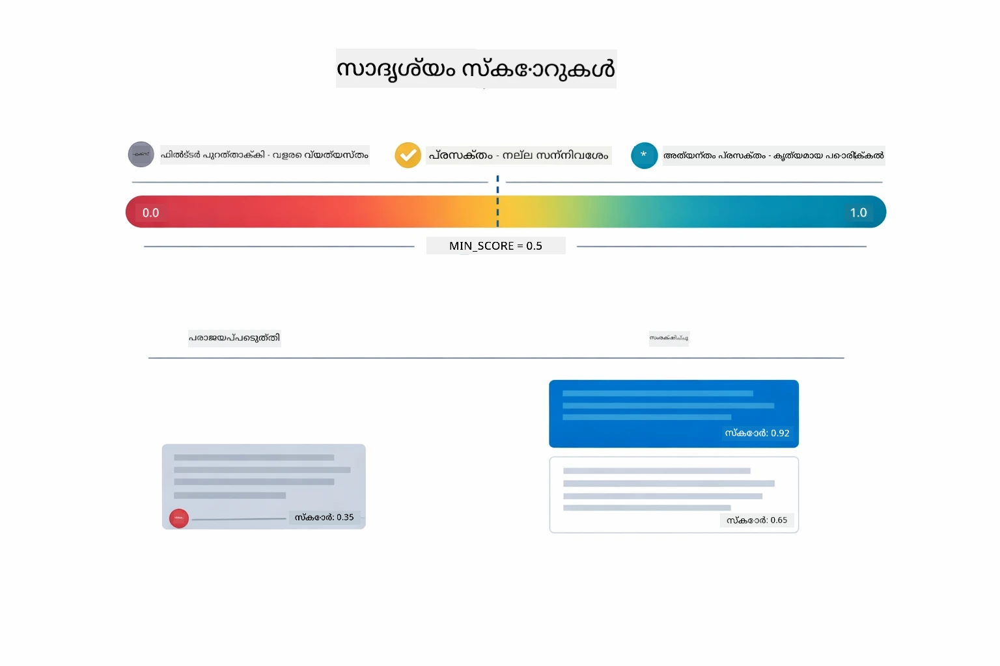

*ഈ ഡിസൈൻ 0 മുതൽ 1 വരെ സ്കോർ പരിധികൾ കാണിക്കുന്നു, 0.5 എന്ന നിമ്നം ത്രെഷോൾഡ് ഉപയോഗിച്ച് പ്രാസക്തമല്ലാത്ത ചങ്കുകൾ അവഗണിക്കുന്നു.*

സ്കോറിന്റെ പരിധി:  
- 0.7-1.0: വളരെ പ്രസക്തവും, കൃത്യമായ പൊരുത്തം  
- 0.5-0.7: പ്രസക്തവും, നല്ല പബ്ലിക് സാന്റർ  
- 0.5-ൽ താഴെ: ഫിൽറ്റർ ചെയ്ത, ഏറെ വ്യത്യസ്തം

ഉയർന്ന നിലവാരത്തിനായി സിസ്റ്റം ഏറ്റവും കുറഞ്ഞ ത്രെഷോൾഡിന് മുകളിൽ ഉള്ള ചങ്കുകൾ മാത്രമേ തിരഞ്ഞെടുക്കുകയുള്ളു.

എൻബെഡിങ്സ് അർത്ഥം വ്യക്തമായി കിൽധിക്കുന്നിടത്താണ് നല്ലത്, എന്നാൽ അവയ്ക്ക് ചില ബില്ലൈൻഡ് സ്‌പോട്ടുകൾ ഉണ്ട്. താഴെയുള്ള ഡിസൈനിൽ പരാജയപ്പെട്ട പൊതുവായ സാഹചര്യങ്ങൾ കാണിച്ചired ചങ്കുകൾ വളരെ വലിയതും മഷിഞ്ഞ വെക്ടറുകൾ ഉല്പാദിപ്പിക്കുന്നു, വളരെ ചെറുതും പബ്ലിക് സാന്ററില്ലാത്തതും, ഒറ്റ അർത്ഥം കൊണ്ടhasilkan മതിയായ സന്ദർഭം ലഭിക്കാത്തതും, ഐഡികൾ പോലുള്ള കൃത്രിമ പൊരുത്തം കാണിക്കുന്നവർ ഉൾപ്പെടുന്നു:

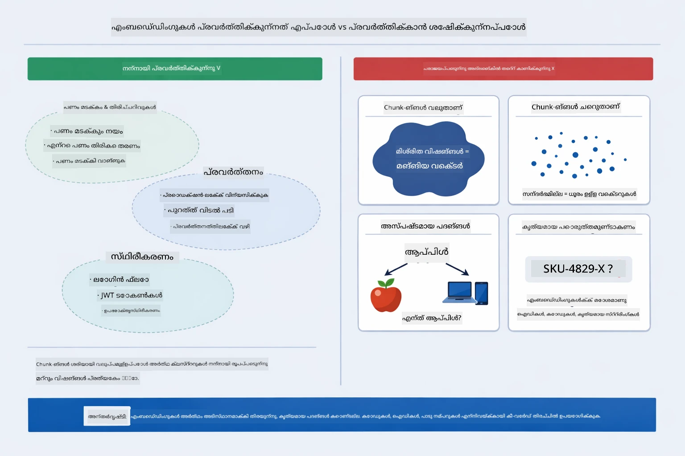

*ഈ ഡിസൈനിൽ പൊതുവായ എൻബെഡിങ് പരാജയ വിധികൾ കാണിക്കുന്നു: വലിയ ചങ്കുകൾ, ചെറു ചങ്കുകൾ, ഒരു പദം പല അർത്ഥങ്ങളിലേക്കും സൂചിപ്പിക്കുന്നത്, കൃത്യമായ പൊരുത്തം ഉറവിടങ്ങൾ പോലുള്ള ഐഡികളോടുകൂടെ പ്രവർത്തിക്കാത്തത്.*

### ഇൻ-മെമ്മറി സംഭരണം

മോഡ്യൂൾ ലളിതമായ ഇൻ-മെമ്മറി സംഭരണം ഉപയോഗിക്കുന്നു. ആപ്ലിക്കേഷൻ റീസ്റ്റാർട്ട് ചെയ്യുമ്പോൾ, അപ്‌ലോഡ് ചെയ്ത ഡോക്യുമെന്റുകൾ നഷ്ടപ്പെടും. പ്രൊഡക്ഷൻ സിസ്റ്റങ്ങളിൽ Qdrant അല്ലെങ്കിൽ Azure AI Search പോലെയുള്ള സ്ഥിരതയുള്ള വെക്റ്റർ ഡാറ്റാബേസുകൾ ഉപയോഗിക്കുന്നു.

### കോൺടെക്സ്റ്റ് വിൻഡോ മാനേജ്‌മെന്റ്

ഓരോ മോഡലിനും പരമാവധി കോൺടെക്സ്റ്റ് വിൻഡോ പരിധി ഉണ്ട്. വലിയ ഡോക്യുമെന്റിലെ എല്ലാ ചങ്കുകളും ഉൾപ്പെടുത്താനാകില്ല. സിസ്റ്റം ഏറ്റവും പ്രസക്തമായ ടോപ്പ് N (ഡീഫോൾട്ട് 5) ചങ്കുകൾ തിരഞ്ഞെടുക്കുന്നു, അതിരുകൾക്കുള്ളിൽ ഉറപ്പു വരുത്തുകയും കൃത്യമായ ഉത്തരങ്ങൾക്കായി മതിയായ കോൺടെക്സ്റ്റ് നൽകുകയും ചെയ്യുന്നു.

## RAG കാര്യമുള്ളപ്പോൾ

RAG എല്ലാ സമയത്തും ശരിയായ സമീപനം അല്ല. താഴെയുള്ള തീരുമാന മാർഗ്ഗനിർദ്ദേശം RAG എപ്പോൾ മൂല്യം കൂട്ടും എന്നും ലളിതമായ സമീപനങ്ങൾ (പ്രോംപ്റ്റിലെ ഉള്ളടക്കമോ മോഡലിന്റെ സ്വപ്രജ്ഞാനമോ സഹായി ആയി ഉപയോഗിക്കുന്നത്) എപ്പോൾ മതിയാകും എന്നും വ്യക്തമാക്കുന്നു:

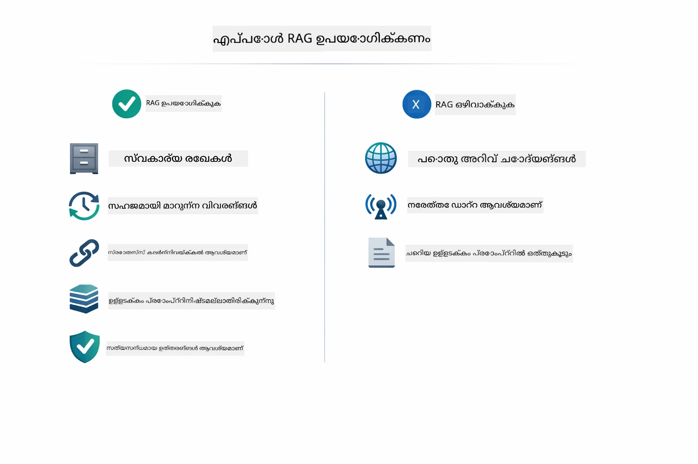

*ഈ ഡിസൈൻ RAG മൂല്യം കൂട്ടുന്നപ്പോൾ, ലളിതമായ സമീപനങ്ങൾ മതിയാകുന്നപ്പോൾ എന്നിവക്കുള്ള ഒരു തീരുമാന മാർഗ്ഗനിർദ്ദേശം കാണിക്കുന്നു.*

## അടുത്ത ചുവടുകൾ

**അടുത്ത മോഡ്യൂൾ:** [04-tools - ടൂൾസുകളുള്ള AI ഏജൻറുകൾ](../04-tools/README.md)

---

**നാവിഗേഷൻ:** [← മുൻപ്: മോഡ്യൂൾ 02 - പ്രോംപ്‌റ്റ് എഞ്ചിനീയറിങ്](../02-prompt-engineering/README.md) | [പ്രധാനത്തിലേക്ക് മടങ്ങുക](../README.md) | [അടുത്തത്: മോഡ്യൂൾ 04 - ടൂൾസ് →](../04-tools/README.md)

---

<!-- CO-OP TRANSLATOR DISCLAIMER START -->
**വ്യാഖ്യാനം**:  
ഈ രേഖ AI വിവർത്തന സേവനം [Co-op Translator](https://github.com/Azure/co-op-translator) ഉപയോഗിച്ച് വിവർത്തനം ചെയ്തതാണ്. നമുക്ക് കൃത്യതയ്ക്കായി ശ്രമിച്ചുവെങ്കിലും, സ്വയം പ്രവർത്തിക്കുന്ന വിവർത്തനങ്ങളിൽ പിഴവുകളോ തെറ്റുകളോ ഉണ്ടാകാമെന്ന് ദയവായി ശ്രദ്ധിക്കുക.റോസ്രിജനം ദയവായി ശ്രദ്ധിക്കുക.  
അതിന്റെ സ്വഭാവ ഭാഷയിലെ യാഥാർത്ഥ്യ രേഖ മാത്രമേ അതിന്റെ അതോറിറ്റേറ്റീവ് ഉറവിടമായി കരുതാവൂ. നിർണായക വിവരങ്ങൾക്കായി പ്രൊഫഷണൽ മനുഷ്യ വിവർത്തനം ശുപാർശ ചെയ്യപ്പെടുന്നു. ഈ വിവർത്തനം ഉപയോഗിച്ചുവിൽ സംഭവിക്കുന്ന ഭ്രമങ്ങൾക്കും തെറ്റിദ്ധാരണകൾക്കും ഞങ്ങൾ ഉത്തരവാദികളല്ല.
<!-- CO-OP TRANSLATOR DISCLAIMER END -->