# മോഡ്യൂൾ 04: ടൂളുകളുള്ള AI ഏജന്റുകൾ

## ഉള്ളടക്ക പട്ടിക

- [നിങ്ങൾ പഠിക്കാനിരിക്കുന്നതു](../../../04-tools)
- [മുൻകൂട്ടി അറിയേണ്ടതുകൾ](../../../04-tools)
- [ടൂളുകളുള്ള AI ഏജന്റുകളെ മനസിലാക്കുക](../../../04-tools)
- [ടൂൾ കോൾ ചെയ്യുന്നത് എങ്ങനെ പ്രവർത്തിക്കുന്നു](../../../04-tools)
  - [ടൂൾ നിർവചനങ്ങൾ](../../../04-tools)
  - [തിരഞ്ഞെടുപ്പ് ഉണ്ടാക്കൽ](../../../04-tools)
  - [നിർവഹണം](../../../04-tools)
  - [പ്രതികരണ സൃഷ്ടി](../../../04-tools)
  - [ആർക്കിടെക്ചർ: സ്പ്രിങ് ബൂട് ഓട്ടോ-വയറിംഗ്](../../../04-tools)
- [ടൂൾ ചെൈനിങ്](../../../04-tools)
- [ആപ്ലിക്കേഷൻ പ്രവർത്തിപ്പിക്കുക](../../../04-tools)
- [ആപ്ലിക്കേഷൻ ഉപയോഗിക്കുന്നത്](../../../04-tools)
  - [സാധാരണ ടൂൾ ഉപയോഗം പരീക്ഷിക്കുക](../../../04-tools)
  - [ടൂൾ ചെൈനിങ് പരീക്ഷണം](../../../04-tools)
  - [സംഭാഷണ പ്രവാഹം കാണുക](../../../04-tools)
  - [വിവിധ അഭ്യർത്ഥനകൾ പരീക്ഷിക്കുക](../../../04-tools)
- [പ്രധാന ആശയങ്ങൾ](../../../04-tools)
  - [ReAct മാതൃക (കാരണം കാണിക്കുകയും പ്രവർത്തിക്കുകയും)](../../../04-tools)
  - [ടൂൾ വിവരണങ്ങൾ പ്രാധാന്യമുണ്ട്](../../../04-tools)
  - [സെഷൻ മാനേജ്മെന്റ്](../../../04-tools)
  - [പിഴവുകൾ കൈകാര്യംചെയ്യൽ](../../../04-tools)
- [ലഭ്യമായ ടൂളുകൾ](../../../04-tools)
- [ടൂൾ അടിസ്ഥാനത്തിലുള്ള ഏജന്റുകൾ എപ്പോൾ ഉപയോഗിക്കണം](../../../04-tools)
- [ടൂളുകൾ vs RAG](../../../04-tools)
- [അടുത്ത ചുവടുകൾ](../../../04-tools)

## എന്ത് പഠിക്കാം

ഇവരവരെ, നിങ്ങൾ AI-യുമായി സംഭാഷണം നടത്താൻ, പ്രോംപ്റ്റുകൾ ഫലപ്രദമായി ഘടിപ്പിക്കാൻ, നിങ്ങളുടെ പത്രികകളിൽ നിന്നുള്ള മറുപടികൾ അടിസ്ഥാനം ചെയ്യാൻ പഠിച്ചിരുന്നു. പക്ഷേ ഒരു അടിസ്ഥാന പരിധി ഇപ്പോഴും ഉണ്ട്: ഭാഷാ മോഡലുകൾ ടെക്സ്റ്റ് മാത്രമേ സൃഷ്ടിക്കുകയുള്ളൂ. അവ കാലാവസ്ഥ പരിശോധിക്കാനാവില്ല, കണക്കുകൾ നടത്താനാവില്ല, ഡാറ്റാബേസുകൾ ചോദിക്കാനാവില്ല, അല്ലെങ്കിൽ ബാഹ്യ സംവിധാനങ്ങളുമായി ഇടപഴകാനാവില്ല.

ടൂളുകൾ ഇത് മാറ്റുന്നു. മോഡൽക്കു വിളിക്കാനാകുന്ന ഫംഗ്ഷനുകൾ നൽകുമ്പോൾ, അത് ടെക്സ്റ്റ് ജനറേറ്റർ ല് നിന്ന് പ്രവർത്തനങ്ങൾ കൈകാര്യം ചെയ്യുന്ന ഒരു ഏജന്റായി മാറുന്നു. മോഡൽ ഏതുവേള ടൂൾ വേണമെന്ന്, ഏത് ടൂൾ ഉപയോഗിക്കണമെന്ന്, ഏതെല്ലാം പാരാമീറ്ററുകൾ നൽകണമെന്ന് തീരുമാനിക്കുന്നു. നിങ്ങളുടെ കോഡ് ആ ഫംഗ്ഷൻ നിർവഹിച്ചു ഫലം തരും. മോഡൽ ആ ഫലം അതിന്റെ മറുപടിയിൽ ഉൾപ്പെടുത്തുകയും ചെയ്യും.

## മുൻകൂട്ടി അറിയേണ്ടതുകൾ

- [Module 01 - Introduction](../01-introduction/README.md) പൂർത്തിയായി (Azure OpenAI വിഭവങ്ങൾ വിന്യസിച്ചിട്ടുള്ളത്)
- മുൻ മോഡ്യൂളുകൾ പൂർത്തിയാക്കിയിരിക്കണം (ഈ മോഡ്യൂൾ [Module 03](../03-rag/README.md) ൽ നിന്നും RAG ആശയങ്ങൾ റഫറൻസ് ചെയ്യുന്നു)
- റൂട്ട് ഡയറക്ടറിയിലുള്ള `.env` ഫയലിൽ Azure ക്രെഡൻഷ്യലുകൾ (Module 01 ൽ `azd up` ഉപയോഗിച്ച് സൃഷ്ടിച്ചതാണ്)

> **ഗమనിക്കുക:** Module 01 പൂർത്തിയാകാത്തവർക്ക് ആദ്യം അവിടെ നൽകിയ വിന്യാസ നിർദ്ദേശങ്ങൾ പിന്തുടരുക.

## ടൂളുകളുള്ള AI ഏജന്റികളെ മനസിലാക്കുക

> **📝 ശ്രദ്ധിക്കുക:** ഈ മോഡ്യൂളിൽ "ഏജന്റുകൾ" എന്ന് പറയുന്നത് ടൂൾ-കോൾ കഴിവുകൾ ഉള്ള AI സഹായികൾക്കാണ്. ഇത് [Module 05: MCP](../05-mcp/README.md) ൽ ചർച്ച ചെയ്യുന്ന **Agentic AI** (സ്വയം നയിക്കുന്ന, പദ്ധതിബദ്ധമായ, ഓർമ്മയുള്ള, മൾട്ടി-സ്റ്റപ്പ് കാരണ-പ്രവർത്തന മാതൃകയുള്ള ഏജന്റുകൾ) യിൽ നിന്നു വ്യത്യസ്തമാണ്.

ടൂളുകൾ ഇല്ലാതെ, ഭാഷാ മോഡൽ അതിന്റെ പരിശീലനം നടത്തിയ ഡാറ്റയിൽ നിന്ന് മാത്രം ടെക്സ്റ്റ് സൃഷ്ടിക്കാം. ഇപ്പോഴത്തെ കാലാവസ്ഥ ചോദിച്ചാൽ, അത് അനുമാനിക്കേണ്ടി വരും. ടൂളുകൾ നൽകിച്ചാൽ, ഇത് കാലാവസ്ഥ API, കണക്കു നിർവഹണം, ഡാറ്റാബേസ് ചോദ്യം തുടങ്ങിയവക്ക് വിളിക്കാവുന്നതാണ് — അതിനു ശേഷമുള്ള യഥാർത്ഥ ഫലങ്ങൾ മറുപടിയിൽ ചേർക്കാൻ കഴിയും.

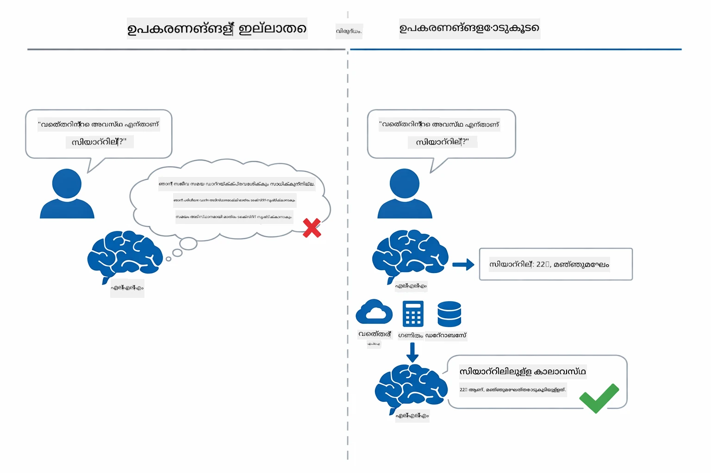

*ടൂളുകൾ ഇല്ലാതെ മോഡൽ അപ്രമാദമായി കണക്കു കൂട്ടുന്നു — ടൂളുകൾ ഉള്ളപ്പോൾ API-കൾ വിളിച്ച് കണക്കുകൾ നിർവഹിച്ച് യഥാർത്ഥ സമയ ഡാറ്റ നൽകുന്നു.*

ടൂളുകളുള്ള AI ഏജന്റ് **Reasoning and Acting (ReAct)** മാതൃക പിന്തുടരുന്നു. മോഡൽ മറുപടി നൽകുന്നതിലപ്പുറം — അത് ആവശ്യമായതു ചിന്തിക്കുകയും, ടൂൾ വിളിച്ച് പ്രവർത്തിക്കുകയും, ഫലം നിരീക്ഷിക്കുകയും, വീണ്ടും പ്രവർത്തിക്കണോ ഇല്ലയോയെന്ന് തീരുമാനിക്കുകയും ചെയ്യുന്നു:

1. **കാരണം കാണുക** — ഉപയോക്താവിന്റെ ചോദ്യത്തിൽ നാസ്ത്യം ചെയ്യുകയും, ആവശ്യമായ വിവരങ്ങൾ കണ്ടെത്തുകയും ചെയ്യുക  
2. **പ്രവർത്തിക്കുക** — ശരിയായ ടൂൾ തിരഞ്ഞെടുക്കുക, പാരാമീറ്ററുകൾ സജ്ജമാക്കുക, ടൂൾ വിളിക്കുക  
3. **നിരീക്ഷിക്കുക** — ടൂൾ ഫലം സ്വീകരിക്കുകയും വിലയിരുത്തുകയും ചെയ്യുക  
4. **പുനരരമ്പിക്കുക അല്ലെങ്കിൽ മറുപടി നൽകുക** — കൂടുതൽ ഡാറ്റ ആവശ്യമെങ്കിൽ തിരിച്ച് ചുറ്റുവളച്ച്, അല്ലെങ്കിൽ പ്രകൃതിമയമായ മറുപടി സൃഷ്ടിക്കുക  

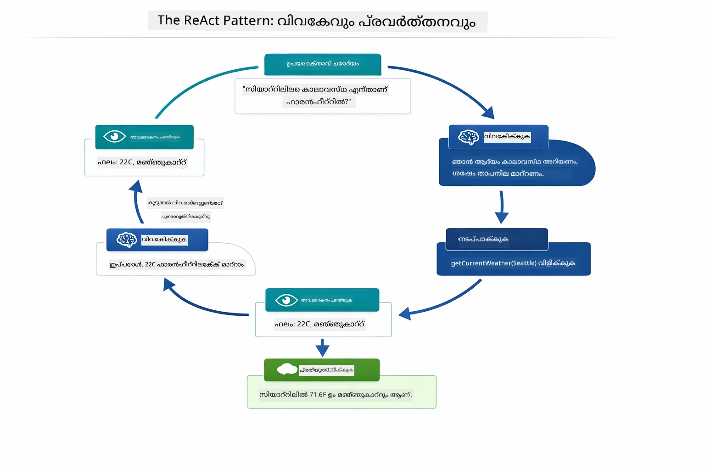

*ReAct ചക്രം — ഏജന്റ് ചെയ്യേണ്ടത് എന്തെന്ന് കൂട്ടായ്മയായി ചിന്തിക്കുന്നു, ടൂൾ വിളിച്ച് പ്രവർത്തിക്കുന്നു, ഫലം നിരീക്ഷിക്കുന്നു, അന്തിമ മറുപടി ലഭിച്ചുവരെയായി വീണ്ടും ചുറ്റുന്നു.*

ഇത് സ്വയം പ്രക്രിയയിലാണ് നടക്കുന്നത്. നിങ്ങൾ ടൂളും അവരുടെ വിവരണങ്ങളും നിർവചിക്കുന്നു. മോഡൽ ടൂൾ ഉപയോഗിക്കേണ്ട സമയം, രീതി എന്നിവ തീരുമാനിക്കുന്നു.

## ടൂൾ കോൾ ചെയ്യുന്നത് എങ്ങനെ പ്രവർത്തിക്കുന്നു

### ടൂൾ നിർവചനങ്ങൾ

[WeatherTool.java](../../../04-tools/src/main/java/com/example/langchain4j/agents/tools/WeatherTool.java) | [TemperatureTool.java](../../../04-tools/src/main/java/com/example/langchain4j/agents/tools/TemperatureTool.java)

നിങ്ങൾ ഫംഗ്ഷനുകൾ വ്യക്തമായ വിവരണങ്ങളോടുകൂടി, പാരാമീറ്റർ നിർവചനങ്ങളോടുകൂടി നിർവചിക്കുന്നു. മോഡൽ അതിന്റെ സിസ്റ്റം പ്രോംപ്റ്റിൽ ഈ വിവരണങ്ങൾ കാണുകയും ഓരോ ടൂളും എന്ത് ചെയ്യുന്നു എന്ന് മനസ്സിലാക്കുകയും ചെയ്യുന്നു.

```java
@Component
public class WeatherTool {
    
    @Tool("Get the current weather for a location")
    public String getCurrentWeather(@P("Location name") String location) {
        // നിങ്ങളുടെ കാലാവസ്ഥ അന്വേഷണം ലாஜിക്ക്
        return "Weather in " + location + ": 22°C, cloudy";
    }
}

@AiService
public interface Assistant {
    String chat(@MemoryId String sessionId, @UserMessage String message);
}

// അസിസ്റ്റന്റ് സ്വയം Spring Boot ഉപയോഗിച്ച് ബന്ധിപ്പിച്ചിരിക്കുന്നു:
// - ChatModel ബീൻ
// - @Component ക്ലാസുകളിൽ നിന്നുള്ള എല്ലാ @Tool മെത്തഡുകളും
// - സെഷൻ മാനേജ്മെന്റിനായി ChatMemoryProvider
```

താഴെയുള്ള ചിത്രം ഓരോ അനോട്ടേഷനുടെയും വിശദാംശങ്ങൾ കാണിക്കുന്നു, എങ്ങനെ AI-ക്ക് എപ്പോഴും ടൂൾ വിളിക്കണം എങ്ങനെ പാരാമീറ്ററുകൾ നൽകണം എന്നിവ മനസിലാക്കാൻ സഹായിക്കുന്നുവെന്ന് വ്യക്തമാക്കുന്നു:

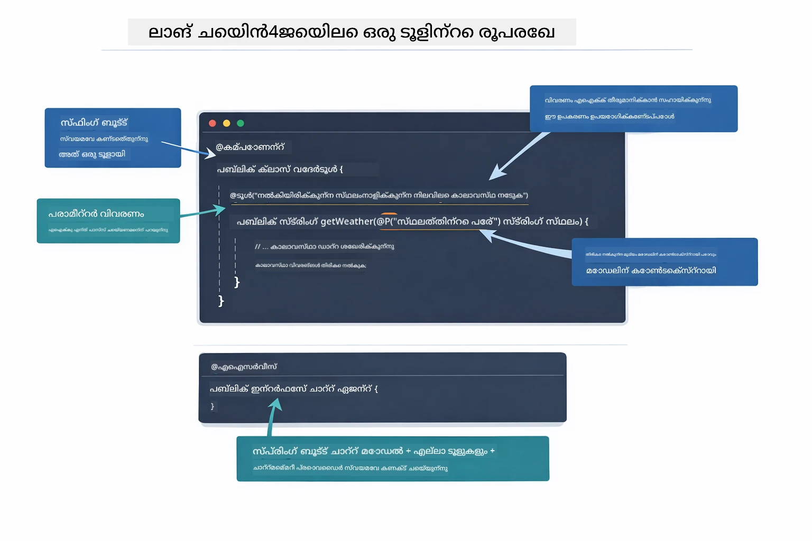

*ടൂൾ നിർവചനങ്ങളുടെ ഘടന — @Tool എപ്പോൾ ഉപയോഗിക്കണമെന്ന് പറയുന്നു, @P ഓരോ പാരാമീറ്ററും വിവരിക്കുന്നു, @AiService സ്റ്റാർട്ടപ്പിൽ എല്ലാം വയർ ചെയ്യുന്നു.*

> **🤖 [GitHub Copilot](https://github.com/features/copilot) ചാട്ടിൽ ശ്രമിക്കുക:** [`WeatherTool.java`](../../../04-tools/src/main/java/com/example/langchain4j/agents/tools/WeatherTool.java) തുറന്ന് ചോദിക്കൂ:  
> - "മോക് ഡാറ്റയ്‌ക്കു പകരം OpenWeatherMap പോലുള്ള യഥാർത്ഥ കാലാവസ്ഥ API എങ്ങനെ സംയോജിപ്പിക്കാം?"  
> - "AIയുടെ ശരിയായ ഉപയോഗത്തിന് സഹായിക്കുന്ന നല്ല ടൂൾ വിവരണങ്ങൾ എന്തെല്ലാം ആണ്?"  
> - "API പിഴവുകളും നിരക്കുകളുടെ പരിധികളും ടൂൾ നടപ്പാക്കലിൽ എങ്ങിനെയാണ് കൈകാര്യം ചെയ്യുന്നത്?"

### തിരഞ്ഞെടുപ്പ് ഉണ്ടാകൽ

ഉപയോക്താവ് "സിയാറ്റിലിൽ കാലാവസ്ഥ എങ്ങനെയാണ്?" എന്ന് ചോദിക്കുമ്പോൾ, മോഡൽ യാദൃശ്ചികമായി ടൂൾ തിരഞ്ഞെടുക്കുന്നില്ല. ഉപയോക്താവിന്റെ ഉദ്ദേശം ഓരോ ടൂൾ വിവരണത്തോടും താരതമ്യം ചെയ്ത് പ്രസക്തമെന്ന് വിലയിരുത്തി ഏറ്റവും ഉചിതമായതു തിരഞ്ഞെടുക്കുന്നു. തുടർന്ന് ശരിയായ പാരാമീറ്ററുകളോടെ ഘടനാപരമായ ഫംഗ്ഷൻ കോൾ ഉണ്ടാക്കുന്നു — ഈ കേസിൽ `location` = `"Seattle"`.

ഉപയോക്തൃ അഭ്യർത്ഥനയ്ക്ക് യോജിക്കുന്ന ടൂൾ ഇല്ലെങ്കിൽ, മോഡൽ തന്റെ അറിവിൽ നിന്നാകും മറുപടി നൽകുന്നത്. ഒരാൾക്കധികം ടൂളുകൾ യോജിക്കുന്ന പക്ഷം ഏറ്റവും സ്പെസിഫിക് ആയതാണ് തിരഞ്ഞെടുക്കുന്നത്.

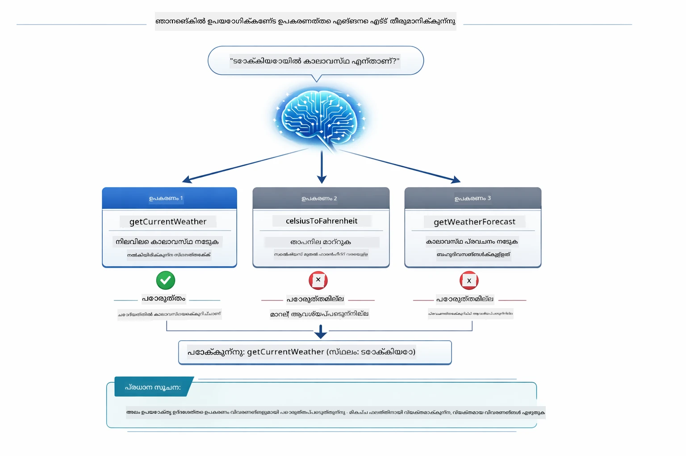

*മോഡൽ ഉപയോക്താവിന്റെ ഉദ്ദേശം എല്ലാ ടൂളുകളോടും താരതമ്യം ചെയ്ത് മികച്ചതു തിരഞ്ഞെടുക്കുന്നു — അതുകൊണ്ടു തന്നെ വ്യക്തവും നിർദ്ദിഷ്ടവുമായ ടൂൾ വിവരണങ്ങൾ രചിക്കുന്നത് പ്രാധാന്യമുണ്ട്.*

### നിർവഹണം

[AgentService.java](../../../04-tools/src/main/java/com/example/langchain4j/agents/service/AgentService.java)

സ്പ്രിങ് ബൂട്ട് `@AiService` ഇന്റർഫേസ് എല്ലാ രജിസ്റ്റർ ചെയ്ത ടൂളുകളോടും ഓട്ടോ-വയറിങ്ങ് നടത്തുന്നു, LangChain4j ടൂൾ കോൾ ഓട്ടോമാറ്റിക്കായി നടത്തുന്നു. പശ്ചാത്തലം ഒരു പൂർത്തിയുള്ള ടൂൾ കോൾ ആറു ഘട്ടംകൂടെ സഞ്ചരിക്കുന്നു — ഉപയോക്താവിന്റെ പ്രകൃതിമയമായ ഭാഷ ചോദ്യത്തിൽ നിന്നു വീണ്ടും പ്രകൃതിമയമായ ഭാഷാ മറുപടിയിലേക്ക്:

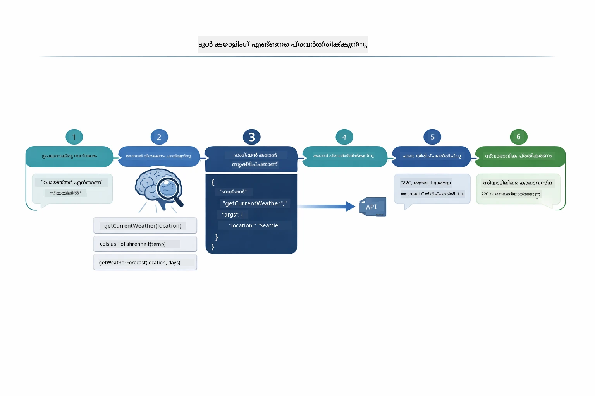

*ആറ് ഘട്ടങ്ങളിലൂടെയുള്ള പൂർണ പ്രവാഹം — ഉപയോക്താവ് ചോദിക്കുന്നു, മോഡൽ ടൂൾ തിരഞ്ഞെടുക്കുന്നു, LangChain4j നിർവഹിക്കുന്നു, ഫലം മോഡൽ മറുപടിയിൽ ഉൾപ്പെടുത്തുന്നു.*

മോഡ്യൂൾ 00 ലെ [ToolIntegrationDemo](../../../00-quick-start/src/main/java/com/example/langchain4j/quickstart/ToolIntegrationDemo.java) നിങ്ങൾ നടത്തിയിട്ടുണ്ടെങ്കിൽ, ഈ മാതൃക നേരിട്ട് കാണാനാകും — `Calculator` ടൂളുകൾ സമാനമായി വിളിക്കപ്പെട്ടിരുന്നു. താഴെയുള്ള സീന്സ് ഡയഗ്രാം ആ പ്രകടനക്കാലത്ത് എന്ത് സംഭവിച്ചതെന്ന് വ്യക്തമാക്കുന്നു:

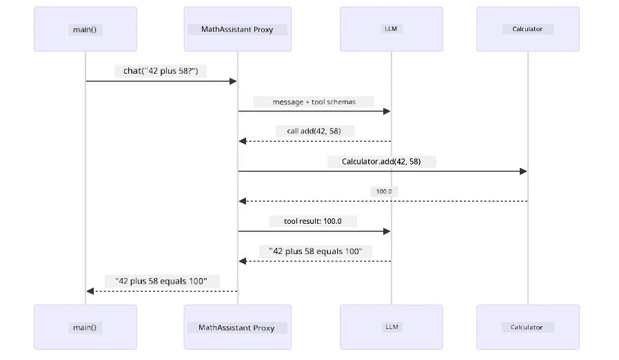

*ക്വിക്ക് സ്റ്റാർട്ട് ഡെമോയിൽ നിന്നുള്ള ടൂൾ-കോൾ ലൂപ്പ് — `AiServices` നിങ്ങളുടെ സന്ദേശവും ടൂൾ സ്കീമകളും LLM-ലേക്ക് അയക്കുന്നു, LLM `add(42, 58)` പോലെയുള്ള ഫംഗ്ഷൻ കോൾ നൽകുന്നു, LangChain4j `Calculator` മെത്തേഡ് പ്രാദേശികമായി നിർവഹിക്കുന്നു, ഫലം വീണ്ടും LLM-ലേക്ക് മറക്കി അന്തിമ മറുപടി നൽകുന്നു.*

> **🤖 [GitHub Copilot](https://github.com/features/copilot) ചാറ്റിൽ ശ്രമിക്കുക:** [`AgentService.java`](../../../04-tools/src/main/java/com/example/langchain4j/agents/service/AgentService.java) തുറന്ന് ചോദിക്കൂ:  
> - "ReAct മാതൃക എങ്ങനെ പ്രവർത്തിക്കുന്നു, AI ഏജന്റുകൾക്ക് ഇത് ഫലപ്രദമാണോ?"  
> - "ഏജന്റ് എങ്ങനെ തീരുമാനിക്കുന്നു ഏത് ടൂൾ ഉപയോഗിക്കണം, ഏത് ക്രമത്തിൽ?"  
> - "ടൂൾ നിർവഹണം പരാജയപ്പെടുകയെങ്കിൽ എന്താകും - പിഴവുകൾ എങ്ങനെ ഉറപ്പുള്ളതായും കൈകാര്യം ചെയ്യാം?"

### പ്രതികരണ സൃഷ്ടി

മോഡൽ കാലാവസ്ഥ ഡാറ്റ സ്വീകരിച്ച് ഉപയോക്താവിനായി പ്രകൃതിമയമായ ഭാഷയിൽ മറുപടി രൂപപ്പെടുത്തുന്നു.

### ആർക്കിടെക്ചർ: സ്പ്രിങ് ബൂട്ടും ഓട്ടോ-വയറിങ്ങും

ഈ മോഡ്യൂൾ LangChain4j ന്റെ സ്പ്രിങ് ബൂട്ട് ഇന്റഗ്രേഷനായി `@AiService` ഇന്റർഫേസുകൾ ഡിക്ലറേറ്റീവായി ഉപയോഗിക്കുന്നു. സ്റ്റാർട്ടപ്പിൽ, സ്പ്രിങ് ബൂട്ടും `@Tool` യുള്ള എല്ലാ `@Component` കളെയും, നിങ്ങളുടെ `ChatModel` ബീനും, `ChatMemoryProvider` ഉം കണ്ടെത്തി അത് എല്ലാം ഒരൊറ്റ `Assistant` ഇന്റർഫേസിൽ വയർ ചെയ്യുന്നു, അതിനായി യാതൊരു ബോയ്ലർപ്ലേറ്റും ഇല്ലാതെ.

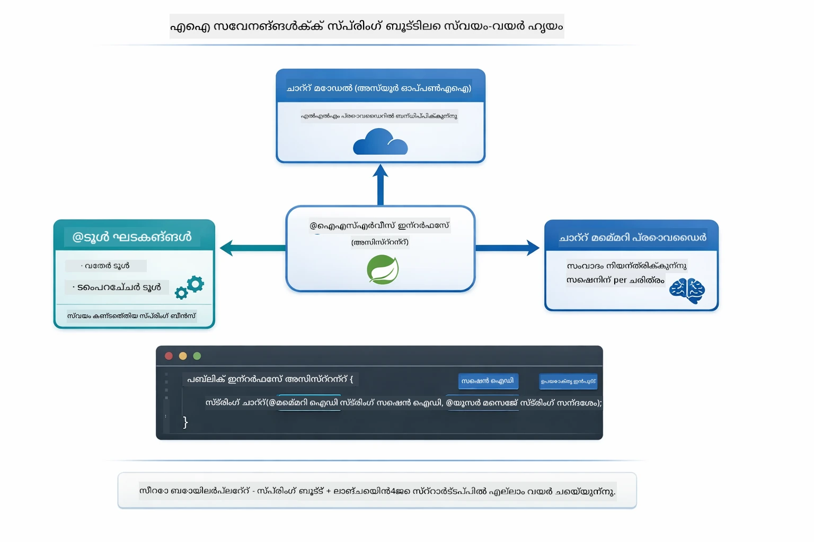

*@AiService* ഇന്റർഫേസ് ChatModel, ടൂൾ കംപോണന്റുകൾ, മെമ്മറി പ്രൊവൈഡർ ഒക്കെ ബന്ധിപ്പിക്കുന്നു — സ്പ്രിങ് ബൂട്ട് ഓട്ടോമാറ്റിക് വയറിങ് കൈകാര്യം ചെയ്യുന്നു.

ഇത് പൂര്‍ണമായൊരു അഭ്യർത്ഥന ജീവചക്രവും സിഖ്വൻസ് ഡയഗ്രാമിൽ കാണാം — HTTP അഭ്യർത്ഥന മുതൽ കണ്ട്രോളർ, സർവീസ്, ഓട്ടോ വയർഡ് പ്രോക്സി വഴി ടൂൾ നിർവഹനവും പിന്നിലേക്ക്:

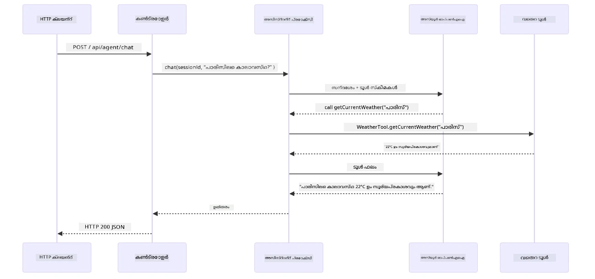

*സ്പ്രിങ് ബൂട്ടിന്റെ പൂര്‍ണ അഭ്യർത്ഥന പ്രക്രിയ — HTTP അഭ്യര്‍ഥന കണ്ട്രോളർ, സർവീസ്, ഓട്ടോ വയർഡ് അസിസ്റ്റന്റ് പ്രോക്സി വഴി LLM ടൂൾ കോൾ ഓർക്കസ്ട്രേറ്റ് ചെയ്യുന്നു.*

ഈ സമീപനത്തിന്റെ പ്രധാന ഗുണങ്ങൾ:

- **സ്പ്രിങ് ബൂട്ട് ഓട്ടോ വയറിങ്** — ChatModel ഉം ടൂളുകളും സ്വയമേവ എൻജക്ട് ചെയ്യുന്നു  
- **@MemoryId മാതൃക** — സജ്ജീകരിക്കപ്പെട്ട സെഷൻ അടിസ്ഥാനമായ മെമ്മറി മാനേജ്മെന്റ്  
- **ഏക പോട്ടി** — അസിസ്റ്റന്റ് ഒന്ന് സൃഷ്ടിക്കുകയും മെച്ചപ്പെട്ട പ്രകടനത്തിന്നായി പുനരുപയോഗം ചെയ്യുകയും ചെയ്യുന്നു  
- **ടൈപ്പ്-സുരക്ഷിത നിർവഹണം** — ജാവ മെത്തഡുകൾ നേരിട്ട് ടൈപ്പ് പരിവർത്തനത്തോടെ വിളിക്കുന്നു  
- **ബഹു-തവണ ഓർക്കസ്ട്രേഷൻ** — ടൂൾ ചെൈനിങ് സ്വയം കൈകാര്യം ചെയ്യുന്നു  
- **നിക്ഷേപം ഇല്ലാത്ത കോഡ്** — മാനുവൽ `AiServices.builder()` വിളികൾ ഇല്ല, ഹാഷ്‌മാപ്പ് ഇല്ല

മികച്ച ടെക്നോളജി ഉപയോഗിച്ച് ചേര്‍ക്കപ്പെട്ട മാനുവൽ `AiServices.builder()` രീതികളിൽ നിന്നും ഇത് വ്യത്യസ്തമാണ്.

## ടൂൾ ചെൈനിങ്

**ടൂൾ ചെൈനിങ്** — ടൂൾ അടിസ്ഥാനത്തിലുള്ള ഏജന്റുകളുടെ യഥാർത്ഥ ശക്തി ഒന്നൊരു ചോദ്യത്തിന് ഒന്നിലധികം ടൂളുകൾ ആവശ്യമായപ്പോൾ പ്രകടമാകുന്നു. "സിയാറ്റിലിലെ കാലാവസ്ഥ ഫാരൻഹീറ്റിൽ എന്താണ്?" എന്ന് ചോദിക്കുമ്പോൾ, ഏജന്റ് രണ്ട് ടൂളുകൾ അനുക്രമത്തിൽ വിളിക്കുന്നു: ആദ്യം `getCurrentWeather` സ fundedൽ സില്ഷിയസിൽ താപനില അറിയുന്നു, പിന്നെ അതു `celsiusToFahrenheit`-ലേക്ക് മാറ്റുന്നു — എല്ലാം ഒരു സംവാദ ടേൺ ആയി.

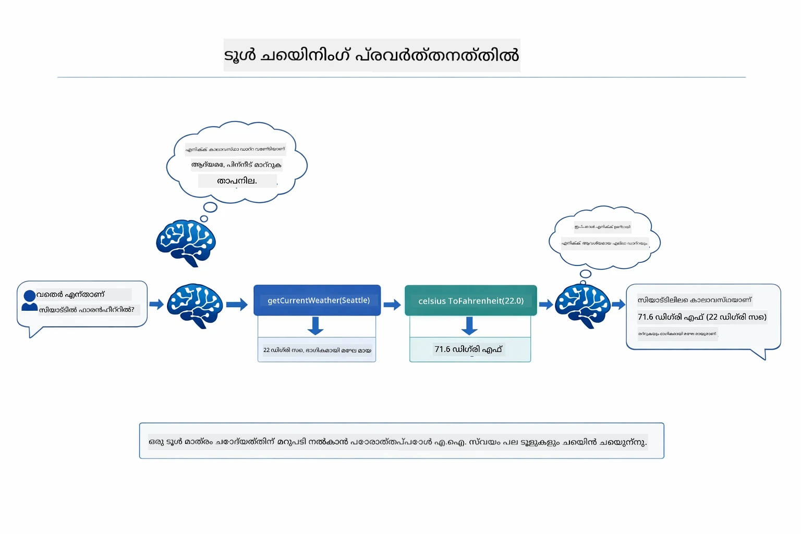

*ടൂൾ ചെൈനിങ് പ്രവർത്തനത്തിൽ — ഏജന്റ് ആദ്യം getCurrentWeather വിളിക്കുന്നു, അണ്ടർ സില്ഷിയസിൽ നിന്നും ഫലമെടുക്കുന്നു, പിന്നെ celsiusToFahrenheit വഴി മാറ്റി സംയോജിത മറുപടി നൽകുന്നു.*

**ഗ്രേസ്‌ഫുൾ ഫെയില്യറുകൾ** — മോക്ക് ഡാറ്റയിലുള്ള ഒരു നഗരത്തിലെ കാലാവസ്ഥ നൽകാൻ നിർദ്ദേശിക്കുമ്പോൾ, ടൂൾ പിഴവിന്റെ സന്ദേശം നൽകുന്നു, AI സഹായം നൽകാൻ കഴിയില്ല എന്ന് വിശദീകരിക്കുന്നു, അവൻ ക്രാഷ് ചെയ്യാതിരിക്കാൻ. ടൂളുകൾ സുരക്ഷിതമായി പരാജയപ്പെടുന്നു. താഴെയുള്ള ചിത്രം രണ്ട് സമീപനങ്ങൾ തമ്മിലുള്ള വ്യത്യാസം കാണിക്കുന്നു — ശരിയായ പിഴവ് കൈകാര്യം ചെയ്യലിൽ ഏജന്റ് പിഴവ് പിടിച്ചു, സഹായകരമായി മറുപടി നൽകുന്നു; ഇല്ലെങ്കിൽ മുഴുവൻ ആപ്ലിക്കേഷൻ ക്രാഷ് ചെയ്യും:

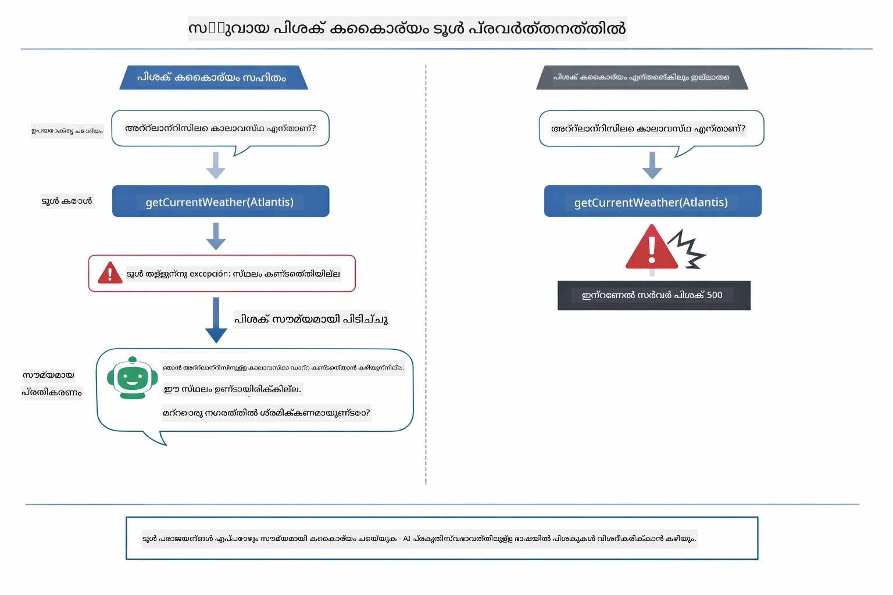

*ഒരു ടൂൾ പരാജയപ്പെട്ടപ്പോൾ ഏജന്റ് പിഴവ് പിടിച്ചു സഹായകരമായി മറുപടി നൽകുന്നു, ക്രാഷ് ചെയ്യാതെ.*

ഇത് ഏകദേശം ഒരു സംവാദ ടേണിലാണ് നടക്കുന്നത്. ഏജന്റ് സ്വയം വിവിധ ടൂൾ കോൾസ് ഓർക്കസ്ട്രേറ്റ് ചെയ്യുന്നു.

## ആപ്ലിക്കേഷൻ പ്രവർത്തിപ്പിക്കുക

**വിന്യാസം സ്ഥിരീകരിക്കുക:**

റൂട്ടിൽ `.env` ഫയൽ ഉണ്ട് എന്ന് ഉറപ്പാക്കുക (Module 01ൽ നിർമ്മിച്ചതാണ്). മോഡ്യൂൾ ഡയറക്ടറിയിൽ നിന്ന് (`04-tools/`):

**Bash:**
```bash
cat ../.env  # AZURE_OPENAI_ENDPOINT, API_KEY, DEPLOYMENT കാണിക്കണം
```

**PowerShell:**
```powershell
Get-Content ..\.env  # AZURE_OPENAI_ENDPOINT, API_KEY, DEPLOYMENT കാണിക്കണം
```

**ആപ്ലിക്കേഷൻ ആരംഭിക്കുക:**

> **ഗమనിക്കുക:** റൂട്ടിൽ നിന്ന് (`./start-all.sh`) എല്ലാ ആപ്ലിക്കേഷനുകളും(Module 01 വിവരണപ്രകാരം) നിങ്ങൾ തുടക്കം ചേർന്നിട്ടുണ്ടെങ്കിൽ, ഈ മോഡ്യൂൾ 8084 പോർട്ടിൽ പ്രവർത്തിക്കുകയാണ്. താഴെയുള്ള ആരംഭ കമാൻഡുകൾ ഒഴിവാക്കി http://localhost:8084 കാണാം.

**വികൽപം 1: സ്പ്രിങ് ബൂട്ട് ഡാഷ്ബോർഡ് ഉപയോഗിക്കൽ (VS കോഡ് ഉപയോക്താക്കൾക്കായി ശുപാർശ ചെയ്യുന്നു)**

ഡെവ് കണ്ടെയ്നറിൽ സ്പ്രിങ് ബൂട്ട് ഡാഷ്ബോർഡ് എക്സ്റ്റൻഷൻ ഉണ്ട്, ഇത് എല്ലാ സ്പ്രിങ് ബൂട്ട് ആപ്ലിക്കേഷനുകൾക്കുമുള്ള ദൃശ്യ ഇന്റർഫേസ് നൽകുന്നു. VS കോഡിന്റെ ഇടതു Activity Bar-ൽ (സ്പ്രിങ് ബൂട്ട് ഐകൺ നോക്കുക) കണ്ടെത്താം.

സ്പ്രിങ് ബൂട്ട് ഡാഷ്ബോർഡിൽനിന്ന് നിങ്ങൾക്ക്:  
- വർക്ക് സ്പേസിലുള്ള എല്ലാ സ്പ്രിങ് ബൂട്ട് ആപ്ലിക്കേഷനുകൾ കാണാൻ  
- സിംപിൾ ക്ലിക്കിൽ ആപ്ലിക്കേഷനുകൾ ആരംഭിക്കാനും നിർത്താനും  
- ആപ്ലിക്കേഷൻ ലോഗുകൾക്ക് യഥാർത്ഥ സമയ സാന്നിധ്യം കാണാനുമുള്ള അവസരം  
- ആപ്ലിക്കേഷൻ നില നിരീക്ഷിക്കാൻ  

"tools" പക്കൽ പ്ലേ ബട്ടൺ അമർത്തി ഈ മോഡ്യൂൾ തുടങ്ങാം, അല്ലെങ്കിൽ എല്ലാ മോഡ്യൂളുകളും ഒറ്റത്തവണ ആരംഭിക്കാം.

VS കോഡിൽ സ്പ്രിങ് ബൂട്ട് ഡാഷ്ബോർഡിന്റെ രൂപം ഇത്:


*VS കോഡിലെ സ്പ്രിങ് ബൂട്ട് ഡാഷ്ബോർഡ് — ഒറ്റ സ്ഥലത്ത് എല്ലാ മോഡ്യൂളുകൾ ആരംഭിക്കുക, നിര്‍ത്തുക, നിരീക്ഷിക്കുക*

**വികൽപം 2: ഷെൽ സ്‌ക്രിപ്റ്റുകൾ ഉപയോഗിക്കുക**

എല്ലാ വെബ് ആപ്ലിക്കേഷനുകളും (മോഡ്യൂൾ 01-04) തുടങ്ങുക:

**Bash:**
```bash
cd ..  # റൂട്ട് ഡയറക്ടറിയിൽ നിന്ന്
./start-all.sh
```

**PowerShell:**
```powershell
cd ..  # റൂട്ട് ഡയറക്ടറിയിൽ നിന്ന്
.\start-all.ps1
```

അഥവാ ഈ മോഡ്യൂൾ മാത്രം ആരംഭിക്കുക:

**Bash:**
```bash
cd 04-tools
./start.sh
```

**PowerShell:**
```powershell
cd 04-tools
.\start.ps1
```

രണ്ടു സ്ക്രിപ്റ്റുകളും മൗലിക `.env` ഫയലിൽ നിന്ന് ഓട്ടോമാറ്റിക്കായി പരിസ്ഥിതി ചലനങ്ങൾ ലോഡ് ചെയ്ത് ജാർ ഫയലുകൾ നിലവിൽ ഇല്ലങ്കിൽ നിർമ്മിക്കും.

> **കുറിപ്പ്:** ആരംഭിക്കുന്നതിനു മുമ്പ് എല്ലാ മോഡ്യൂളുകളും മാനുവലായി നിർമ്മിക്കാൻ താല്പര്യമുണ്ടെങ്കിൽ:
>
> **Bash:**
> ```bash
> cd ..  # Go to root directory
> mvn clean package -DskipTests
> ```
>
> **PowerShell:**
> ```powershell
> cd ..  # Go to root directory
> mvn clean package -DskipTests
> ```

നിങ്ങളുടെ ബ്രൗസറിൽ http://localhost:8084 തുറക്കുക.

**നിർത്താൻ:**

**Bash:**
```bash
./stop.sh  # ഈ മോഡ്യൂളിന് മാത്രം
# അല്ലെങ്കിൽ
cd .. && ./stop-all.sh  # എല്ലാ മോഡ്യൂളുകളും
```

**PowerShell:**
```powershell
.\stop.ps1  # ഈ മാഡ്യൂൾ മാത്രം
# അല്ലെങ്കിൽ
cd ..; .\stop-all.ps1  # എല്ലാ മാഡ്യൂളുകളും
```

## ആപ്ലിക്കേഷൻ ഉപയോഗിക്കൽ

ആപ്ലിക്കേഷൻ ഒരു വെബ്ബ് ഇന്റർഫേസ് നൽകുന്നു, അവിടെ നിങ്ങൾക്ക് കാലാവസ്ഥാ വിവരങ്ങളുടെയും താപനില പരിവർത്തന ഉപകരണങ്ങളുടെയും ആക്സസ് ഉള്ള AI ഏജന്റുമായി ഇടപഴകാം. ഇന്റർഫേസിന് ഇത് പോലെ കാണപ്പെടും — ഇതിൽ ക്വിക്ക്-സ്റ്റാർട്ട് ഉദാഹരണങ്ങളും അഭ്യർത്ഥനകൾ അയക്കുന്നതിനുള്ള ചാറ്റ് പാനലും ഉൾപ്പെടുന്നു:

<a href="images/tools-homepage.png"></a>

*AI ഏജന്റ് ടൂളുകൾ ഇന്റർഫേസ് - ടൂളുകളുമായി ഇടപഴകാൻ ക്വിച്ച് ഉദാഹരണങ്ങളും ചാറ്റ് ഇന്റർഫേസും*

### ലളിതമായ ടൂൾ ഉപയോഗം പരീക്ഷിക്കുക

ഒരു സാദാരണ അഭ്യർത്ഥനയുമായി തുടങ്ങുക: "100 ഡിഗ്രി ഫാരൻഹീറ്റ് സെൽഷ്യസ്സിലേക്ക് പരിവർത്തനം ചെയ്‌തു" ഏജന്റ് താപനില പരിവർത്തന ഉപകരണമാണ് ആവശ്യമാണ് എന്ന് മനസ്സിലാക്കി ശരിയായ പാരാമീറ്ററുകളോടെ വിളിച്ച് ഫലം തിരികെ നൽകുന്നു. നിങ്ങൾ ഏത് ടൂൾ ഉപയോഗിക്കണമെന്ന് അല്ലെങ്കിൽ എങ്ങനെ വിളിക്കാമെന്നു വ്യക്തമാക്കിയില്ലെങ്കിലും പ്രകൃതിസംയോജിതമാണ്.

### ടൂൾ ചൈനിംഗ് പരീക്ഷിക്കുക

ഇപ്പോൾ കൂടുതൽ സങ്കീർണ്ണമായ ഒന്നു പരീക്ഷിക്കുക: "സിയാറ്റിലിനുള്ള കാലാവസ്ഥ എന്ത് ആണ്, അതും ഫാരൻഹീറ്റിലായി മാറ്റൂ?" ഏജന്റ് ഘട്ടങ്ങളായി ഇത് പ്രവർത്തിക്കുന്നത് കാണുക. ആദ്യം കാലാവസ്ഥ (സെൽഷ്യസിൽ തിരികെ നൽകുന്നത്) കണ്ടുപിടിക്കുന്നു, ഫാരൻഹീറ്റിലേക്ക് മാറ്റണം എന്ന് തിരിച്ചറിയുന്നു, പരിവർത്തന ടൂൾ വിളിക്കുന്നു, ഫലം ഒറ്റ പ്രതികരണമായി സംയോജിപ്പിക്കുന്നു.

### സംഭാഷണ പ്രവാഹം കാണുക

ചാറ്റ് ഇന്റർഫേസ് സംഭാഷണ ചരിത്രം സൂക്ഷിക്കുന്നു, ഇതിലൂടെ നിങ്ങൾക്ക് മൾട്ടി-ടേൺ ഇടപെടലുകൾ നടത്താം. എല്ലാ മുൻകൂട്ടിലെ ചോദ്യം-പ്രതി കാണാം, അതിനാൽ സംഭാഷണം എങ്ങനെ നടന്നു, ഏജന്റ് എങ്ങനെ വ്യാഖ്യാനം നിർമ്മിക്കുന്നു എന്ന് മനസ്സിലാക്കാൻ എളുപ്പമാണ്.

<a href="images/tools-conversation-demo.png"></a>

*വളരെ അഭ്യന്തര സൂക്ഷ്മമായ ചാറ്റ് സംവാദം - ലളിതമായ പരിവർത്തനങ്ങൾ, കാലാവസ്ഥ സേര്‍ച്ചുകൾ, ടൂൾ ചൈനിംഗ്*

### വ്യത്യസ്ത അഭ്യർത്ഥനകൾ പരീക്ഷിക്കുക

വിവിധ കൂട്ടിച്ചേർക്കലുകൾ പരിശ്രമിക്കുക:
- കാലാവസ്ഥ അന്വേഷിക്കൽ: "ടോക്കിയോയിൽ കാലാവസ്ഥ എന്താണ്?"
- താപനില പരിവർത്തനങ്ങൾ: "25°C എത്ര കെൽവിൻ ആണ്?"
- സംയോജിത ചോദ്യം: "പാരിസിന്റെ കാലാവസ്ഥ പരിശോധിച്ച് 20°Cക്ക് മുകളിൽ ആണോ എന്നു പറ ആകുമോ"

എജന്റ് പ്രകൃതിഭാഷ വ്യാഖ്യാനം ചെയ്ത് അനുയോജ്യമായ ടൂൾ വിളികളെ എങ്ങനെ നിർവചിക്കുന്നു എന്ന് ശ്രദ്ധിക്കുക.

## പ്രധാന ആശയങ്ങൾ

### ReAct പാറ്റേൺ (വിവേകം και പ്രവർത്തനം)

ഏജന്റ് വിചാരിക്കുന്നതും (എന്തു ചെയ്യണം എന്ന് തീരുമാനിക്കൽ) പ്രവർത്തിപ്പിക്കുന്നതും (ടൂൾസ് ഉപയോഗിക്കൽ) മാറിമാറി നടക്കുന്നു. ഈ പാറ്റേൺ വഴി സ്വയം പരിഹാരത്തിന് സഹായിക്കുന്നു, നേരിട്ട് നിർദ്ദേശങ്ങൾ പാലിക്കുക മാത്രമല്ല.

### ടൂൾ വിവരണങ്ങൾ പ്രധാനമാണ്

ടൂളിന്റെ വിവരണങ്ങളിലെ ഗുണമേന്മ എങ്ങനെ ഏജന്റ് അവയെ ഉപയോഗിക്കുന്നു എന്നത് നേരിട്ട് ബാധിക്കുന്നു. വ്യക്തമായ, സുതാര്യമായ വിവരണങ്ങൾ മോഡലിനെ എല്ലാ ടൂൾ വിളിക്ക് എപ്പോഴും എങ്ങനെ നടത്താമെന്ന് മനസ്സിലാക്കാൻ സഹായിക്കുന്നു.

### സെഷൻ മാനേജ്മെന്റ്

`@MemoryId` അനോട്ടേഷൻ ഉപയോഗിച്ച് ഓട്ടോമാറ്റിക് സെഷൻ അടിസ്ഥാനമായ മെമ്മറി മാനേജ്മെന്റ് സാധ്യമാണ്. ഓരോ സെഷൻ ID ഉം തനിക്ക് സ്വന്തം `ChatMemory` ഉദാഹരണം `ChatMemoryProvider` ബീൻ വഴി കൈകാര്യം ചെയ്യും, അതുകൊണ്ട് ഒരേ സമയം പലഉപയോക്താക്കളും ഏജന്റുമായി സംവദിക്കുമ്പോൾ അവരുടെ സംഭാഷണം കലർക്കപ്പെടുന്നില്ല. താഴെയുള്ള ചിത്രം സെഷൻ ഐഡികളുടെ അടിസ്ഥാനത്തിൽ എങ്ങനെ പല ഉപയോക്താക്കളും വ്യത്യസ്ത മെമ്മറി സ്റ്റോറുകളിലേക്ക് റൂട്ടിംഗ് ചെയ്യപ്പെടുന്നു എന്നു കാണിക്കുന്നു:

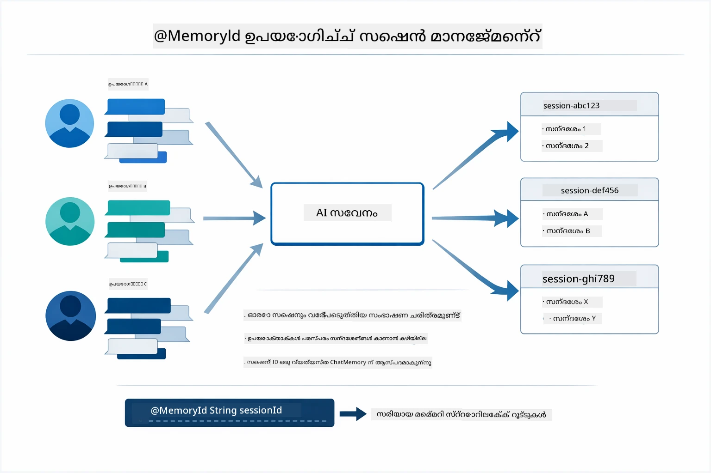

*ഓരോ സെഷൻ ഐഡിക്കും ഒരു വ്യത്യസ്ത സംഭാഷണ ചരിത്രം — ഉപയോക്താക്കൾ പരസ്പരം സന്ദേശങ്ങൾ കാണാറില്ല.*

### പിശക് കൈകാര്യം ചെയ്യൽ

ടൂളുകൾ പിഴച്ച് വീഴാം — APIകൾ ടൈംഔട്ട് ആകാം, പാരാമീറ്ററുകൾ തെറ്റായിരിക്കാം, ബാഹ്യ സേവനങ്ങൾ നിലച്ചുപോകാം. പ്രൊഡക്ഷൻ ഏജന്റുകൾ എളുപ്പത്തിൽ പിശക് കൈകാര്യം ചെയ്യണം; അതിനാൽ മോഡൽ പ്രശ്നങ്ങൾ വിശദീകരിക്കാൻ അല്ലെങ്കിൽ പകരം മാർഗങ്ങൾ പരീക്ഷിക്കാൻ കഴിയും, അപ്ലിക്കേഷൻ തകരാതെ. ടൂൾ ഒരു അപവാദം ഉണ്ട് എങ്കിൽ, LangChain4j അത് പിടിച്ച് പിശക് സന്ദേശം മോഡലിലേക്ക് നൽകുന്നു, അതു നിൽക്കുന്നു പ്രശ്നം പ്രകൃതിദത്ത ഭാഷയിൽ വിശദീകരിക്കാൻ കഴിയും.

## ലഭ്യമായ ടൂളുകൾ

ഇതിചിത്രം നിങ്ങൾ നിർമ്മിക്കാവുന്ന വ്യാപക ടൂൾ പരിസരത്തെ കാണിക്കുന്നു. ഈ മോഡ്യൂൾ കാലാവസ്ഥയും താപനില ഉപകരണങ്ങളും കാണിക്കുന്നു, പക്ഷേ ആ കോഡ് പോലെ `@Tool` പാറ്റേൺ ഏത് ജാവ മെതഡിനും ബാധകമാണ് — ഡാറ്റാബേസ് ക്വെറിയുകളിൽ നിന്നു പെയ്മെന്റ് പ്രോസസിംഗ് വരെ.

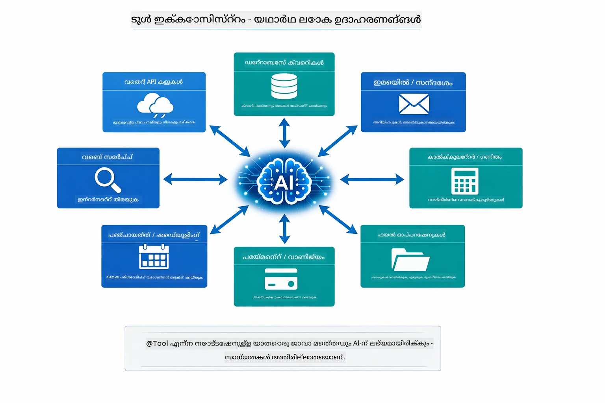

*`@Tool` അണോട്ടേഷൻ ഉള്ള ഏത് ജാവ മെതഡ് AIക്ക് ലഭ്യമാണ് — പാറ്റേൺ ഡാറ്റാബേസുകൾ, APIകൾ, ഇമെയിൽ, ഫയൽ പ്രവർത്തനങ്ങൾ പോലുള്ളവ ആയി വ്യാപിക്കുന്നു.*

## ടൂൾ അധിഷ്ഠിത ഏജന്റുകൾ 언제 ഉപയോഗിക്കണം

എല്ലാ അഭ്യർത്ഥനകൾക്കും ടൂളുകൾ ആവശ്യമില്ല. തീരുമാനമാകുന്നത് AI ബാഹ്യ സിസ്റ്റങ്ങൾ വഴി ഇടപെടാൻ ആഗ്രഹിക്കുന്നുണ്ടോ, അല്ലെങ്കിൽ സ്വന്തം അറിവിൽ നിന്നു മറുപടി നൽകാമോ എന്നതാണ്. താഴെയുള്ള മാർഗ്ഗരേഖ ടൂളുകൾ മൂല്യം വർധിപ്പിക്കുന്നപ്പോൾ ഒപ്പം അവ ആവശ്യകത ഇല്ലാതിരിക്കുന്ന സമയവും ചുരുക്കി കാണിക്കുന്നു:

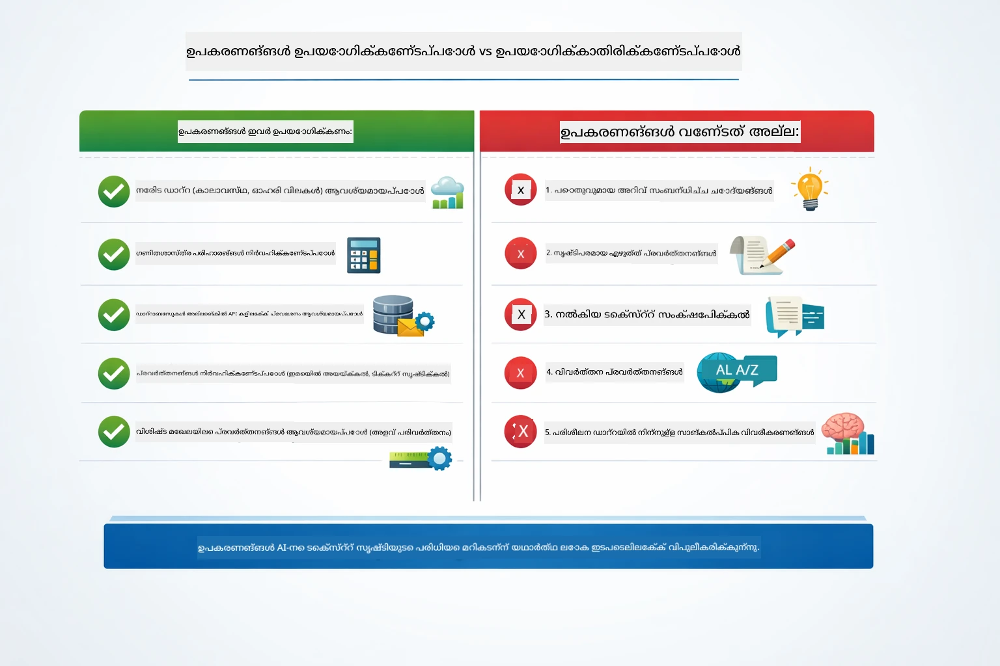

*വേഗം തീരുമാനിക്കാൻ — ടൂളുകൾ ജീവിതകാല ഡാറ്റ, കാൽക്കുലেচനുകൾ, പ്രവർത്തനങ്ങൾക്ക്; സാധാരണ അറിവും സൃഷ്ടിപരമായ പ്രവർത്തനങ്ങൾക്കു വേണ്ടതല്ല.*

## Tools vs RAG

മോഡ്യൂളുകൾ 03 ഉം 04 ഉം AI ചെയ്യാൻ കഴിയുന്ന കാര്യങ്ങൾ വിപുലീകരിക്കുന്നു, പക്ഷേ അടിസ്ഥാനമായി വ്യത്യസ്തമാണ്. RAG മോഡലിന് **അറിവ്** നൽകുന്നു, ഡോക്യുമെന്റുകൾ തിരയുന്നതിലൂടെ. Tools മോഡലിനെ **പ്രവർത്തനങ്ങൾ** ചെയ്യാൻ കഴിവ് നൽകുന്നു, ഫംഗ്ഷനുകൾ വിളിച്ച്. താഴെയുള്ള ചിത്രം ഇവ രണ്ടും കൂട്ടിച്ചേർന്ന് കാണിക്കുന്നു — പ്രവർത്തന രീതി മുതൽ അവ തമ്മിലുള്ള ലാഭം നഷ്ടങ്ങൾ വരെ:

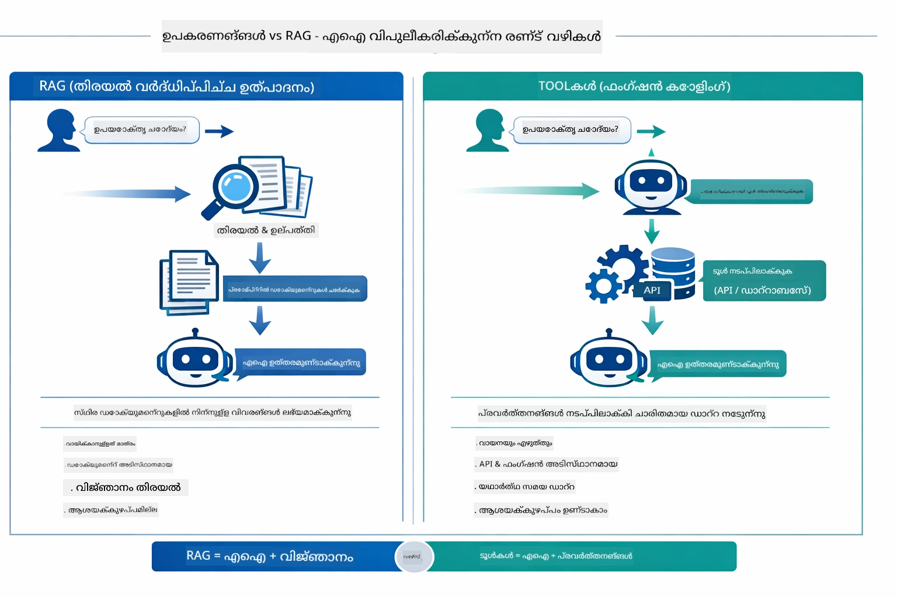

*RAG സ്റ്റാറ്റിക് ഡോക്യുമെന്റുകളിൽ നിന്നു വിവരങ്ങൾ തിരയുന്നു — Tools പ്രവർത്തനങ്ങൾ നിർവഹിച്ച് ഡൈനാമിക്, യഥാർഥകാല ഡാറ്റ കൊണ്ടുവരുന്നു. പല പ്രൊഡക്ഷൻ സിസ്റ്റങ്ങളും ഇരண்டும் ചേർത്തിരിക്കുന്നു.*

പ്രായോഗികമായല്ലെങ്കിൽ പല പ്രൊഡക്ഷൻ സിസ്റ്റങ്ങളും ഇരട്ട പാത പിന്തുടരുന്നു: RAG നിങ്ങളുടെ ഡോക്യുമെന്റേഷനിൽ ഉത്തരം പിടിക്കാൻ, Tools ജീവിച്ചുള്ള ഡാറ്റ കൊണ്ടുവരാനും പ്രവർത്തനങ്ങൾ നടത്താനുമുള്ളത്.

## അടുത്ത പടികൾ

**അടുത്ത മോഡ്യൂൾ:** [05-mcp - Model Context Protocol (MCP)](../05-mcp/README.md)

---

**നാവിഗേഷൻ:** [← മുൻ: മോഡ്യൂൾ 03 - RAG](../03-rag/README.md) | [പ്രിൻസിപ്പൽ സിൻട്രൽ പേജ്](../README.md) | [അടുത്തത്: മോഡ്യൂൾ 05 - MCP →](../05-mcp/README.md)

---

<!-- CO-OP TRANSLATOR DISCLAIMER START -->
**അസാധാരണം**:  
ഈ പ്രമാണം AI തർജ്ജമ സേവനം [Co-op Translator](https://github.com/Azure/co-op-translator) ഉപയോഗിച്ചു തർജ്ജമ ചെയ്തതാണ്. നിശ്ചിതത്വത്തിന് വേണ്ടി ഞങ്ങൾ ശ്രമിക്കുമ്പോഴും, യാന്ത്രിക തർജ്ജമയിൽ പിശകുകളും അപാകതകളും ഉണ്ടാകാമെന്നതിൽご了承ください. യഥാർത്ഥ പ്രമാണം അതിന്റെ സ്വദേശഭാഷയിലുണ്ടായിരിക്കുന്നതാണ് പ്രാമാണിക സ്രോതസ്സ് ആയി കണക്കാക്കേണ്ടത്. ഗുരുതര വിവരങ്ങൾക്കായി വിദഗ്ധ മാനുഷിക തർജ്ജമ നിർദേശിക്കപ്പെടുന്നു. ഈ തർജ്ജമ ഉപയോഗത്തിൽ നിന്നുണ്ടാകുന്ന തെറ്റിദ്ധാരണകൾക്കും തെറ്റായ വ്യാഖ്യാനങ്ങൾക്കും ഞങ്ങൾ ഉത്തരവാദിത്വം ബാധിച്ചിട്ടില്ല.
<!-- CO-OP TRANSLATOR DISCLAIMER END -->