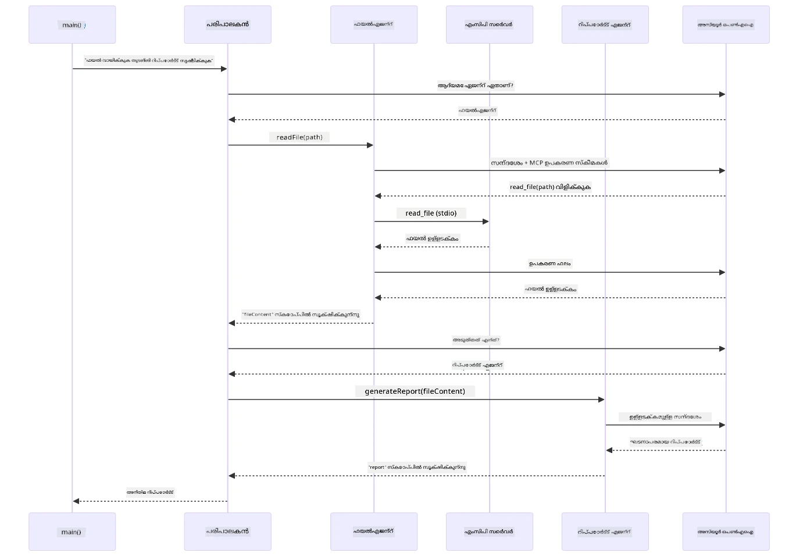

# Module 05: Model Context Protocol (MCP)

## Table of Contents

- [Video Walkthrough](../../../05-mcp)
- [What You'll Learn](../../../05-mcp)
- [What is MCP?](../../../05-mcp)
- [How MCP Works](../../../05-mcp)
- [The Agentic Module](../../../05-mcp)
- [Running the Examples](../../../05-mcp)
  - [Prerequisites](../../../05-mcp)
- [Quick Start](../../../05-mcp)
  - [File Operations (Stdio)](../../../05-mcp)
  - [Supervisor Agent](../../../05-mcp)
    - [Running the Demo](../../../05-mcp)
    - [How the Supervisor Works](../../../05-mcp)
    - [How FileAgent Discovers MCP Tools at Runtime](../../../05-mcp)
    - [Response Strategies](../../../05-mcp)
    - [Understanding the Output](../../../05-mcp)
    - [Explanation of Agentic Module Features](../../../05-mcp)
- [Key Concepts](../../../05-mcp)
- [Congratulations!](../../../05-mcp)
  - [What's Next?](../../../05-mcp)

## Video Walkthrough

നിങ്ങൾ ഈ മോഡ്യൂളുമായി ആരംഭിക്കാനുള്ള വിശദീകരണ ലൈവ് സെഷൻ കാണുക:

<a href="https://www.youtube.com/watch?v=O_J30kZc0rw"></a>

## What You'll Learn

നിങ്ങൾ സംഭാഷണ എഐ നിർമ്മിച്ചു, പ്രോമ്പ്റ്റുകൾ നിപുണമായി കൈകാര്യം ചെയ്തു, ഡോക്യുമെന്റുകളിൽ അടിസ്ഥാനമാക്കിയുള്ള പ്രതികരണങ്ങൾ സൃഷ്ടിച്ചു, ടൂൾസ് ഉപയോഗിച്ച് ഏജന്റുകൾ സൃഷ്ടിച്ചു. എന്നാൽ അവ ടൂൾസ് നിങ്ങളുടെ പ്രത്യേക ആപ്ലിക്കേഷനും വേണ്ടി കൊണ്ടുവന്നതാണ്. എങ്കിൽ നിങ്ങളുടെ എഐക്ക് ആരും സൃഷ്ടിച്ച് പങ്കുവെക്കാവുന്ന മാനദണ്ഡങ്ങളിലുള്ള ടൂൾസ് ഇക്കോസിസ്റ്റത്തിനുള്ള ആക്സസ് നൽകിയാൽ എന്താകും? ഈ മോഡ്യൂളിൽ, നിങ്ങൾ അത് നീതി പ്രോട്ടോക്കോൾ (Model Context Protocol - MCP)യും LangChain4j-ന്റെ ഏജന്റിക് മോഡ്യൂളും ഉപയോഗിച്ച് എങ്ങനെ ചെയ്യാമെന്ന് പഠിക്കും. ആദ്യം ഒരു ലളിതമായ MCP ഫയൽ റീഡർ കാണിക്കുകയും പിന്നീട് ഇത് സൂപ്പർവൈസർ ഏജന്റ് മാതൃക ഉപയോഗിച്ച് എളുപ്പം എങ്ങനെ ആഡ്ജ്വാൻസ്ഡ് ഏജന്റിക് വർക്ക്‌ഫ്ലോകളിൽ ഉൾടക്കാമെന്ന് അവതരിപ്പിക്കും.

## What is MCP?

Model Context Protocol (MCP) അതെ - എഐ ആപ്ലിക്കേഷനുകൾക്ക് ബാഹ്യ ടൂൾസുകൾ കണ്ടെത്താനും ഉപയോഗിക്കാനും ഒരു സ്റ്റാൻഡേർഡ് മാർഗം നൽകുന്നു. ഓരോ ഡാറ്റ സോഴ്‌സിനും സർവീസിനും പ്രത്യേകം ഇന്റഗ്രേഷനായ് എഴുതാനുള്ള പകരം, MCP സെർവറുകളുമായി ബന്ധപ്പെടുന്നു, അവയുടെ കഴിവുകൾ ഏകരൂപമായ ഫോർമാറ്റിൽ പ്രദർശിപ്പിക്കുന്നു. നിങ്ങളുടെ എഐ ഏജന്റ് അവ ടൂൾസുകൾ തിരിച്ചറിഞ്ഞ് സ്വയം ഉപയോഗിക്കാം.

താഴെയുള്ള ചിത്രത്തിൽ വ്യത്യാസം കാണാം — MCP ഇല്ലാതെ, ഓരോ ഇന്റഗ്രേഷനും പ്രത്യേക കണക്ഷനുകൾ ആവശ്യമാണ്; MCP ഉപയോഗിച്ച്, ഒറ്റ പ്രോട്ടോക്കോൾ നിങ്ങളുടെ ആപ്പ് ഏതെങ്കിലും ടൂളുമായി ബന്ധിപ്പിക്കുന്നു:


*MCP മുമ്പ്: സങ്കീർണ്ണമായ കണക്ഷനുകൾ. MCP ശേഷം: ഒറ്റ പ്രോട്ടോക്കോൾ, അനന്ത സാധ്യതകൾ.*

MCP എഐ ഡെവലപ്പ്മെന്റിൽ ഒരു അടിസ്ഥാനം പ്രശ്നം പരിഹരിക്കുന്നു: ഓരോ ഇന്റഗ്രേഷനും പ്രത്യേകം ആയിരിക്കുന്നു. GitHub ആക്സസ് ചെയ്യണമെങ്കിൽ? പ്രത്യേകം കോഡ്. ഫയലുകൾ വായിക്കണമെങ്കിൽ? പ്രത്യേകം കോഡ്. ഡാറ്റാബേസ് ക്വറി ചെയ്യണമെങ്കിൽ? പ്രത്യേകം കോഡ്. ഇവയൊക്കെ വേറെ എഐ ആപ്ലിക്കേഷനുകളുമായി പ്രവർത്തിക്കുന്നില്ല.

MCP ഇതു സ്റ്റാൻഡർഡൈസ് ചെയ്യുന്നു. MCP സെർവർ ടൂളുകൾ വ്യക്തമായ വിവരണങ്ങൾക്കും സ്കീമകൾക്കും കൂടെ പ്രദർശിപ്പിക്കുന്നു. ഏത് MCP ക്ലയന്റും ബന്ധപ്പെടുന്നു, ലഭ്യമായ ടൂളുകൾ കണ്ടെത്തുന്നു, ഉപയോഗിക്കുന്നു. ഒരിക്കൽ നിർമ്മിച്ച് എവിടെയും ഉപയോഗിക്കുക.

താഴെയുള്ള ചിത്രത്തിലുള്ള ആർക്കിടെക്ചർ കാണിക്കുന്നു — ഒരു MCP ക്ലയന്റ് (നിങ്ങളുടെ എഐ അപ്ലിക്കേഷൻ) നിരവധി MCP സെർവറുകളുമായി ബന്ധിപ്പിക്കുന്നു, ഓരോ സെർവർ അവയുടെ ടൂൾസുകൾ സ്റ്റാൻഡേർഡ് പ്രോട്ടോക്കോളിലൂടെ പ്രദർശിപ്പിക്കുന്നു:


*Model Context Protocol ആർക്കിടെക്ചർ - സ്റ്റാൻഡേർഡ് ടൂൾ കണ്ടെത്തൽ, പ്രവർത്തനം.*

## How MCP Works

അടിയിൽ MCP ഒരു ലെയർഡ് ആർക്കിടെക്ചർ ഉപയോഗിക്കുന്നു. നിങ്ങളുടെ ജാവ ആപ്ലിക്കേഷൻ (MCP ക്ലയന്റ്) ലഭ്യമായ ടൂൾസ് കണ്ടെത്തുന്നു, JSON-RPC അപേക്ഷകൾ ഒരു ട്രാൻസ്പോർട്ട് ലെയർ (Stdio അല്ലെങ്കിൽ HTTP) വഴി അയയ്ക്കുന്നു, MCP സെർവർ ഓപ്പറേഷനുകൾ നടപ്പിലാക്കി ഫലങ്ങൾ തിരികെ അയക്കുന്നു. താഴെയുള്ള ചിത്രം ഈ പ്രോട്ടോക്കോളിന്റെ ഓരോ ലെയറുകളും വിശദീകരിക്കുന്നു:


*MCP എങ്ങനെ പ്രവർത്തിക്കുന്നു — ക്ലയന്റുകൾ ടൂളുകളെ കണ്ടെത്തുന്നു, JSON-RPC സന്ദേശങ്ങൾ കൈമാറുന്നു, ട്രാൻസ്പോർട്ട് ലെയറിലൂടെ ഓപ്പറേഷനുകൾ നടപ്പാക്കുന്നു.*

**സെർവർ-ക്ലയന്റ് ആർക്കിടെക്ചർ**

MCP ഒരു ക്ലയന്റ്-സെർവർ മോഡൽ ആണ്. സെർവർ ടൂൾസ് നൽകുന്നു - ഫയലുകൾ വായിക്കൽ, ഡാറ്റാബേസ് ക്വറി, API വിളിത്തല. ക്ലയന്റുകൾ (നിങ്ങളുടെ എഐ ആപ്ലിക്കേഷൻ) സെർവറുകളുമായി ബന്ധപ്പെടുന്നു, അവയുടെ ടൂൾസ് ഉപയോഗിക്കുന്നു.

LangChain4j-യുമായി MCP ഉപയോഗിക്കാൻ, ഈ Maven ഡിപ്പെൻഡൻസി ചേർക്കുക:

```xml
<dependency>
    <groupId>dev.langchain4j</groupId>
    <artifactId>langchain4j-mcp</artifactId>
    <version>${langchain4j.version}</version>
</dependency>
```

**ടൂൾ കണ്ടെത്തൽ**

നിങ്ങളുടെ ക്ലയന്റ് MCP സെർവറുമായി ബന്ധപ്പെടുമ്പോൾ, അത് "നിങ്ങൾക്ക് എത്ര ടൂളുകൾ ഉണ്ട?" എന്ന് ചോദിക്കും. സെർവർ ലഭ്യമായ ടൂൾസിന്റെ ലിസ്റ്റ് വിവരണങ്ങളും പാരാമീറ്റർ സ്കീമകളും അടങ്ങിയതു മടങ്ങ് നൽകുന്നു. നിങ്ങളുടെ എഐ ഏജന്റ് ഉപഭോക്തൃ അഭിലാഷങ്ങളെ അടിസ്ഥാനമാക്കി ഏത് ടൂളുകൾ ഉപയോഗിക്കാമെന്ന് തീരുമാനിക്കും. താഴെയുള്ള ചിത്രം ഈ ഹാൻഡ്‌ഷെയ്ക്ക് കാണിക്കുന്നു — ക്ലയന്റ് `tools/list` അഭ്യർത്ഥന അയക്കുന്നു, സെർവർ ലഭ്യമായ ടൂളുകൾ വിവരണങ്ങളും പാരാമീറ്റർ സ്കീമകളും കൂടാതെ മടങ്ങ് നൽകുന്നു:


*എഐ സ്റ്റാർട്ടപ്പിൽ ലഭ്യമായ ടൂളുകൾ കണ്ടെത്തുന്നു —ഇപ്പോൾ അതിന് എന്ത് കഴിവുകൾ ലഭ്യമാണ് എന്ന് അറിയാം, ഉപയോഗിക്കേണ്ട ടൂളുകൾ തീരുമാനിക്കാൻ കഴിയും.*

**ട്രാൻസ്പോർട്ട് മെക്കാനിസം**

MCP വ്യത്യസ്ത ട്രാൻസ്പോർട്ട് പൊതികളുമായി പ്രവർത്തിക്കുന്നു. രണ്ട് ഓപ്ഷനുകൾ Stdio (ലോകൽ subprocess കമ്മ്യൂണിക്കേഷൻ) və Streamable HTTP (റിമോട്ട് സെർവർസ്). ഈ മോഡ്യൂൾ Stdio ട്രാൻസ്പോർട്ട് തുടർച്ചയായി കാണിക്കുന്നു:


*MCP ട്രാൻസ്പോർട്ട് മെക്കാനിസങ്ങൾ: HTTP റിമോട്ട് സെർവർസിനായി, Stdio ലോപല പ്രക്രിയകൾക്കും*

**Stdio** - [StdioTransportDemo.java](../../../05-mcp/src/main/java/com/example/langchain4j/mcp/StdioTransportDemo.java)

ലോകൽ പ്രക്രിയകൾക്കായി. നിങ്ങളുടെ ആപ്ലിക്കേഷൻ ഒരു സെർവർ subprocess ആയി സ്പോൺ ചെയ്ത് സ്റ്റാൻഡേർഡ് ഇൻപുട്ട്/ഔട്ട്പുട്ട് മുഖേന സംവദിക്കുന്നു. ഫയൽസിസ്റ്റം ആക്സസിനും കമാൻഡ് ലൈൻ ടൂൾസിനും ഉപകാരപ്രദം.

```java
McpTransport stdioTransport = new StdioMcpTransport.Builder()
    .command(List.of(
        npmCmd, "exec",
        "@modelcontextprotocol/server-filesystem@2025.12.18",
        resourcesDir
    ))
    .logEvents(false)
    .build();
```

`@modelcontextprotocol/server-filesystem` സെർവർ താഴെ കൊടുത്തിരിക്കുന്ന ടൂളുകൾ എക്‌സ്‌പോസ് ചെയ്യുന്നു, എല്ലാ ടൂളുകളും നിങ്ങൾ നൽകിയ ഡയറക്ടറികളിലേക്ക് സാൻഡ്‌ബോക്സ്ഡ് ചെയ്യപ്പെട്ടു:

| Tool | വിവരണം |
|------|-------------|
| `read_file` | ഒരു ഫയലിന്റെ ഉള്ളടക്കം വായിക്കുക |
| `read_multiple_files` | ഒരേസമയം ഒന്നിലധികം ഫയലുകൾ വായിക്കുക |
| `write_file` | ഒരു ഫയൽ സൃഷ്ടിക്കുക അല്ലെങ്കിൽ മിനിമം മുറിക്കുക |
| `edit_file` | ലക്ഷ്യമിട്ട ഫയലിൽ കണ്ടെത്തൽ-മാറ്റം നടത്തുക |
| `list_directory` | ഒരു പാതയിലെ ഫയലുകളും ഡയറക്ടറികളും ലിസ്റ്റു ചെയ്യുക |
| `search_files` | ഒരു പാറ്റേൺ അനുസരിച്ച് ഫയലുകൾ റിപ്പർക്കുലി ശോധിക്കുക |
| `get_file_info` | ഫയൽ മെടഡേറ്റ (വലിപ്പം, ടൈംസ്റ്റാമ്പുകൾ, അനുമതികൾ) കിട്ടുക |
| `create_directory` | ഡയറക്ടറി സൃഷ്ടിക്കുക (പാരന്റ് ഡയറക്ടറികളും ഉൾപ്പെടെ) |
| `move_file` | ഫയൽ അല്ലെങ്കിൽ ഡയറക്ടറി നീക്കുക അല്ലെങ്കിൽ പേരമാറ്റുക |

താഴെയുള്ള ചിത്രം Stdio transport റൺടൈം എങ്ങനെ പ്രവർത്തിക്കുന്നു എന്നതാണ് — നിങ്ങളുടെ ജാവ ആപ്ലിക്കേഷൻ MCP സെർവർ ഒരു ചൈൽഡ് പ്രോസസ്സ് ആയി സ്പോൺ ചെയ്യുന്നു, stdin/stdout പൈപ്പുകളിലൂടെ സംവദിക്കുന്നു, നെറ്റ്‌വർക്ക് അല്ലെങ്കിൽ HTTP ഉൾപ്പെടുന്നില്ല:


*Stdio transport പ്രവർത്തനരീതി — നിങ്ങളുടെ ആപ്ലിക്കേഷൻ MCP സെർവർ ഒരു ചൈൽഡ് പ്രോസസ്സ് ആയി സ്പോൺ ചെയ്ത് stdin/stdout പൈപ്പുകളിലൂടെ സംവദിക്കുന്നു.*

> **🤖 GitHub Copilot ഉപയോഗിച്ച് പരീക്ഷിക്കുക:** [`StdioTransportDemo.java`](../../../05-mcp/src/main/java/com/example/langchain4j/mcp/StdioTransportDemo.java) തുറന്ന് ചോദിക്കൂ:
> - "Stdio transport എങ്ങനെ പ്രവർത്തിക്കുന്നു? HTTP പോലെ ഏതപ്പോൾ ഉപയോഗിക്കണം?"
> - "LangChain4j MCP സെർവർ പ്രോസസുകളുടെ ലൈഫ്‌സൈക്കിൾ എങ്ങനെ മാനേജ്മെന്റ് ചെയ്യുന്നു?"
> - "ഫയൽ സിസ്റ്റത്തിന് എഐ ആക്സസ് നൽകുമ്പോൾ സുരക്ഷാ ആശങ്കകൾ എന്തൊക്കെയാണ്?"

## The Agentic Module

MCP സ്റ്റാൻഡേർഡ് ടൂളുകൾ നൽകുന്നപ്പോൾ, LangChain4j-ന്റെ **ഏജന്റിക് മോഡ്യൂൾ** ആ ടൂളുകൾ ക്രമീകരിച്ച് ഉപയോഗിക്കുന്ന ഭാഗങ്ങൾ നിർവചിക്കാനുള്ള പ്രഖ്യാപന രീതി നൽകുന്നു. `@Agent` അനോട്ടേഷനും `AgenticServices`-ഉം നിങ്ങളുടെ ഏജന്റ് പെരുമാറ്റം ഇന്റർഫേസ് ഉപയോഗിച്ച് നിർവചിക്കാൻ അനുവദിക്കുന്നു, കാഴ്ചപ്പാട് വർഷങ്ങളുമായി കൺട്രോൾ ചെയ്യുന്നതിന് പകരം.

ഈ മോഡ്യൂളിൽ, നിങ്ങൾ **സൂപ്പർവൈസർ ഏജന്റ്** മാതൃക പരീക്ഷിക്കും — ഒരു പ്രൊഗ്രസീവ് ഏജന്റിക് എഐ മാർഗ്ഗം, "സൂപ്പർവൈസർ" ഏജന്റ് ഉപയോക്തൃ അഭ്യർത്ഥന അനുസരിച്ച് ആൾവേറെ ഉപഏജന്റുകളെ സജീവമായി വിളിക്കുന്നതിൽ തീരുമാനിക്കുന്നു. MCP-നു സജീവമായ ഫയൽ ആക്സസ് ശേഷിയുള്ള ഒരാൾ ഉപഏജന്റ് നൽകിയും രണ്ട് ആശയങ്ങൾ സംയോജിപ്പിക്കും.

ഏജന്റിക് മോഡ്യൂൾ ഉപയോഗിക്കാൻ, ഈ Maven ഡിപ്പെൻഡൻസി ചേർക്കുക:

```xml
<dependency>
    <groupId>dev.langchain4j</groupId>
    <artifactId>langchain4j-agentic</artifactId>
    <version>${langchain4j.mcp.version}</version>
</dependency>
```

> **കുറിപ്പ്:** `langchain4j-agentic` മോഡ്യൂൾക്ക് വേറെ വേർഷൻ പ്രോപ്പർട്ടി (`langchain4j.mcp.version`) ഉണ്ട്, കാരണം അത് കോർ LangChain4j ലൈബ്രറികളിൽ നിന്നും വ്യത്യസ്ത സമയത്ത് റിലീസ് ചെയ്യുന്നു.

> **⚠️ പരീക്ഷണ ഘട്ടം:** `langchain4j-agentic` മോഡ്യൂൾ പരീക്ഷണ ഘട്ടത്തിലുള്ളതാണ്. സ്ഥിരം രീതിയിൽ എഐ അസിസ്റ്റന്റുകൾ നിർമ്മിക്കാൻ `langchain4j-core` വേറിട്ട ടൂളുകളുമായി മോഡ്യൂൾ 04 ആണ് ഉപയോഗിക്കുന്നത്.

## Running the Examples

### Prerequisites

- പൂർത്തിയാക്കിയിട്ടുള്ള [Module 04 - Tools](../04-tools/README.md) (ഈ മോഡ്യൂൾ കസ്റ്റം ടൂൾ ആശയങ്ങൾക്ക് അടിസ്ഥാനമാക്കിയുള്ളതാണ് MCP ടൂളുകളുമായി താരതമ്യം ചെയ്യുന്നു)
- റൂട്ട് ഡയറക്ടറിയിൽ Azure ക്രെഡൻഷ്യലുകളുള്ള `.env` ഫയൽ (Module 01-ൽ `azd up` ഉപയോഗിച്ച് സൃഷ്ടിച്ചിട്ടുണ്ട്)
- Java 21+, Maven 3.9+
- Node.js 16+ കൂടാതെ npm (MCP സെർവറുകൾക്കായി)

> **കുറിപ്പ്:** നിങ്ങൾ ഇപ്പോഴും എൻവയോൺമെന്റ് വേരിയബിളുകൾ സജ്ജമാക്കിയിട്ടില്ലെങ്കിൽ, [Module 01 - Introduction](../01-introduction/README.md) ലെ ഡിപ്പ്ലോയ്മെന്റ് നിർദ്ദേശങ്ങൾ കാണുക (`azd up` സ്വയം `.env` ഫയൽ സൃഷ്ടിക്കും), അല്ലെങ്കിൽ `.env.example` റൂട്ട് ഡയറക്ടറിയിൽ `.env` ആയി പകർന്നിട്ട് നിങ്ങളുടെ മൂല്യങ്ങൾ പൂരിപ്പിക്കുക.

## Quick Start

**VS Code ഉപയോഗിക്കൽ:** എക്സ്പ്ലോററിൽ ഏതെങ്കിലും ഡെമോ ഫയലിൽ റൈറ്റ് ക്ലിക്ക് ചെയ്ത് **"Run Java"** തെരഞ്ഞെടുത്ത് പ്രവർത്തിപ്പിക്കുക, അല്ലെങ്കിൽ Run and Debug പാനലിൽ നിന്നുള്ള ലോഞ്ച് കോൺഫിഗറേഷനുകൾ ഉപയോഗിക്കുക (ആദ്യം നിങ്ങളുടെ `.env` ഫയൽ Azure ക്രെഡൻഷ്യലുകളോടെ ക്രമീകരിക്കുക).

**Maven ഉപയോഗിക്കൽ:** അല്ലാതെ, താഴെ കൊടുത്തിരിക്കുന്ന ഉദാഹരണങ്ങൾ കമാൻഡ് ലൈൻ വഴി പ്രവർത്തിപ്പിക്കാം.

### File Operations (Stdio)

ഇതിൽ ലോകൽ subprocess അടിസ്ഥാനമാക്കിയുള്ള ടൂളുകൾ കാണിക്കുന്നുണ്ട്.

**✅ മുൻ നിബന്ധനകൾ ആവശ്യമില്ല** - MCP സെർവർ സ്വയം സ്പോൺ ചെയ്യും.

**സ്റ്റാർട്ട് സ്ക്രിപ്റ്റുകൾ ഉപയോഗിക്കൽ (പരാമർശനരഹിതം):**

സ്റ്റാർട്ട് സ്ക്രിപ്റ്റുകൾ റൂട്ട് `.env` ഫയലിൽ നിന്ന് എൻവയോൺമെന്റ് വേരിയബിളുകൾ ഓട്ടോമാറ്റിക്കായി ലോഡ് ചെയ്യുന്നു:

**Bash:**
```bash
cd 05-mcp
chmod +x start-stdio.sh
./start-stdio.sh
```

**PowerShell:**
```powershell
cd 05-mcp
.\start-stdio.ps1
```

**VS Code ഉപയോഗിച്ച്:** `StdioTransportDemo.java`-യിൽ റൈറ്റ് ക്ലിക്ക് ചെയ്ത് **"Run Java"** തിരഞ്ഞെടുക്കുക (നിങ്ങളുടെ `.env` ഫയൽ ക്രമീകരിച്ചിരിക്കുന്നതിടത്തോളം).

ആപ്ലിക്കേഷൻ സ്വയം MCP ഫയൽസിസ്റ്റം സെർവർ സ്പോൺ ചെയ്ത്, ഒരു ലോക്കൽ ഫയൽ വായിക്കുന്നു. subprocess മാനേജ്മെന്റ് നിങ്ങൾക്കായി എങ്ങനെ കൈകാര്യം ചെയ്യപ്പെടുന്നു ശ്രദ്ധിക്കുക.

**പ്രതീക്ഷിച്ച ഔട്ട്‌പുട്ട്:**
```
Assistant response: The file provides an overview of LangChain4j, an open-source Java library
for integrating Large Language Models (LLMs) into Java applications...
```

### Supervisor Agent

**സൂപ്പർവൈസർ ഏജന്റ് മാതൃക** എളുപ്പം നിലനിൽക്കുന്ന ഏജന്റിക് എഐ രൂപമാണ്. ഒരു സൂപ്പർവൈസർ LLM ഉപയോക്താവിന്റെ അഭ്യർത്ഥന അനുസരിച്ച് ഏജന്റുകൾ സ്വയം വിളിക്കാമെന്ന് തീരുമാനിക്കുന്നു. അടുത്ത ഉദാഹരണത്തിൽ, MCP-ജോഡിയുള്ള ഫയൽ ആക്സസ് LLM ഏജന്റുമായി സംയോജിപ്പിച്ച് സൂപ്പർവൈസ്ഡ് ഫയൽ വായിക്കൽ → റിപ്പോർട്ട് വർക്ക്‌ഫ്ലോ സൃഷ്ടിക്കുകയാണ്.

ഡെമോയിൽ, `FileAgent` MCP ഫയൽസിസ്റ്റം ടൂളുകൾ ഉപയോഗിച്ച് ഒരു ഫയൽ വായിക്കുന്നു, `ReportAgent` ഒരു ഘടിത റിപ്പോർട്ട് (ഒരു പദവിവരണം, 3 പ്രധാന പോയിന്റുകൾ, ശുപാർശകൾ) സൃഷ്ടിക്കുന്നു. സൂപ്പർവൈസർ ഈ പ്രവാഹം സ്വയം ക്രമീകരിക്കുന്നു:


*സൂപ്പർവൈസർ സ്വന്തം LLM ഉപയോഗിച്ച് ഏജന്റുകൾ ആരെ വിളിക്കണം, ഏതു ക്രമത്തിൽ വിളിക്കണം എന്ന് തീരുമാനിക്കുന്നു — ഹാർഡ്കോഡ് ചെയ്ത റൂട്ടിംഗ് ആവശ്യമില്ല.*

നമ്മുടെ ഫയൽ മുതൽ റിപ്പോർട്ട് പൈപ്പ്‌ലൈൻ ദൃശ്യരൂപം ഇങ്ങനെ കാണപ്പെടുന്നു:


*FileAgent MCP ടൂളുകൾ വഴി ഫയൽ വായിക്കുന്നു, ReportAgent ആ മൂടൽ ഉള്ളടക്കം ഘടിത റിപ്പോർട്ടിലേക്ക് മാറ്റുന്നു.*

പൂർണംSupervisor ഓർക്കസ്ട്രേഷൻ അനുക്രമചിത്രം — MCP സെർവർ സ്പോൺ ചെയ്യുന്നതിൽ നിന്ന്, സൂപ്പർവൈസർ സ്വയം പ്രവർത്തിക്കുന്ന ഏജന്റ് തിരഞ്ഞെടുപ്പിലൂടെ, stdio വഴി ടൂൾ കോൾ, അന്തിമ റിപ്പോർട്ട് വരേയുള്ള എല്ലാം വിശദമായി കാണിക്കുന്നു:



*സുപ്രവൈസർ സ്വയം FileAgent (MCP സെർവർ സെർവറിൽ stdin/stdout വഴി ഫയൽ വായിക്കുന്നു) വിളിക്കുന്നു, തുടർന്ന് ReportAgent ഘടിത റിപ്പോർട്ട് സൃഷ്ടിക്കുന്നു — ഓരോ ഏജന്റും സ്വന്തം ഔട്ട്പുട്ട് Agentic Scope-ൽ (പങ്കിടുന്ന ഓർമ്മ) സൂക്ഷിക്കുന്നു.*

ഓരോ ഏജന്റും തന്റെ ഔട്ട്പുട്ട് **Agentic Scope** (പങ്കിടുന്ന മെമ്മറി)യിൽ സൂക്ഷിക്കുന്നു, ഇതിലൂടെ താഴെയുള്ള ഏജന്റുകൾ മുമ്പ് ലഭിച്ച ഫലങ്ങൾ ഒരു ക്രമത്തിൽ പ്രാപിക്കാം. ഇത് MCP ടൂൾസ് എങ്ങനെ ഏജന്റിക് വർക്ക്‌ഫ്ലോകളിൽ അടുക്കും എന്ന് കാണിക്കുന്നു — സൂപ്പർവൈസർ ഫയലുകൾ എങ്ങനെ വായിക്കപ്പെടുന്നു എന്ന് അറിയേണ്ടതില്ല, മാത്രം `FileAgent` അത് ചെയ്യുന്നു എന്ന് അറിഞ്ഞാൽ മതി.

#### Running the Demo

സ്റ്റാർട്ട് സ്ക്രിപ്റ്റുകൾ റൂട്ട് `.env` നിന്നും എൻവയോൺമെന്റ് വേരിയബിളുകൾ സ്വയം ലോഡ് ചെയ്യുന്നു:

**Bash:**
```bash
cd 05-mcp
chmod +x start-supervisor.sh
./start-supervisor.sh
```

**PowerShell:**
```powershell
cd 05-mcp
.\start-supervisor.ps1
```

**VS Code ഉപയോഗിച്ച്:** `SupervisorAgentDemo.java`-യിൽ റൈറ്റ് ക്ലിക്ക് ചെയ്ത് **"Run Java"** തിരഞ്ഞെടുക്കുക (നിങ്ങളുടെ `.env` ഫയൽ ക്രമീകരിച്ചിരിക്കുന്നതുപോലെ).

#### How the Supervisor Works

ഏജന്റുകൾ നിർമ്മിക്കുന്നതിന് മുമ്പ്, MCP ട്രാൻസ്പോർട്ട് ക്ലയന്റിന് കണക്ട് ചെയ്ത് `ToolProvider` ആയി റാപ്പ് ചെയ്യണം. അതാണ് MCP സെർവറിന്റെ ടൂളുകൾ നിങ്ങളുടെ ഏജന്റ് ഉപയോഗിക്കാൻ ലഭ്യമാക്കുന്നത്:

```java
// ട്രാൻസ്പോർട്ടിൽ നിന്നും ഒരു MCP ക്ലയന്റ് സൃഷ്ടിക്കുക
McpClient mcpClient = new DefaultMcpClient.Builder()
        .transport(stdioTransport)
        .build();

// ക്ലയന്റിനെ ToolProvider ആയി വറപ്പ് ചെയ്യുക — ഇത് MCP ടൂളുകളെ LangChain4j-ലേക്ക് ബന്ധിപ്പിക്കുന്നു
ToolProvider mcpToolProvider = McpToolProvider.builder()
        .mcpClients(List.of(mcpClient))
        .build();
```

ഇപ്പോൾ എവിടെ MCP ടൂൾസ് ആവശ്യമാണ് അവിടെ `mcpToolProvider` ഇൻജെക്റ്റ് ചെയ്യാം:

```java
// ഘട്ടം 1: ഫയൽ ഏജന്റ് MCP ഉപകരണങ്ങൾ പ്രയോജനപ്പെടുത്തി ഫയലുകൾ വായിക്കുന്നു
FileAgent fileAgent = AgenticServices.agentBuilder(FileAgent.class)
        .chatModel(model)
        .toolProvider(mcpToolProvider)  // ഫയൽ പ്രവർത്തനങ്ങൾക്കായി MCP ഉപകരണങ്ങൾ ഉണ്ട്
        .build();

// ഘട്ടം 2: റിപ്പോർട്ട് ഏജന്റ് ഘടനയുള്ള റിപ്പോർട്ടുകൾ സൃഷ്ടിക്കുന്നു
ReportAgent reportAgent = AgenticServices.agentBuilder(ReportAgent.class)
        .chatModel(model)
        .build();

// സൂപ്പർവൈസർ ഫയൽ → റിപ്പോർട്ട് പ്രവൃത്തി ക്രമീകരിക്കുന്നു
SupervisorAgent supervisor = AgenticServices.supervisorBuilder()
        .chatModel(model)
        .subAgents(fileAgent, reportAgent)
        .responseStrategy(SupervisorResponseStrategy.LAST)  // അന്തിമമായ റിപ്പോർട്ട് തിരിച്ചുകൊടുക്കുക
        .build();

// അപേക്ഷ ആധാരമാക്കി സൂപ്പർവൈസർ ഏജന്റ്മാരെ വിളിക്കാനുള്ള തീരുമാനം എടുക്കുന്നു
String response = supervisor.invoke("Read the file at /path/file.txt and generate a report");
```

#### How FileAgent Discovers MCP Tools at Runtime

നിങ്ങൾക്ക് ആശ്ചര്യമാകാം: **`FileAgent` എങ്ങനെ npm ഫയൽസിസ്റ്റം ടൂളുകൾ ഉപയോഗിക്കേണ്ടതെന്ന് അറിയുന്നു?** മറുപടി അതല്ല - **LLM** ടൂൾ സ്കീമകൾ വഴി റൺടൈം തിരിച്ചറിയുന്നു.
`FileAgent` ഇന്റർഫേസ് വെറും **പ്രോംപ്റ്റ് നിർവ്വചനമാണ്**. ഇത് `read_file`, `list_directory` അല്ലെങ്കിൽ മറ്റ് ഏത് MCP ടൂളിന്റെയും ഹാർഡ്‌കോഡഡ് അറിവ് ഇല്ല. ഇതാ എങ്ങനെ അവസാനം വരെയുള്ള പ്രക്രിയ നടക്കുന്നു:

1. **സെർവർ ആരംഭിക്കുന്നു:** `StdioMcpTransport` `@modelcontextprotocol/server-filesystem` npm പാക്കേജ് ഒരു ചയൽഡ് പ്രോസസ്സ് ആയി ലോഞ്ച് ചെയ്യുന്നു  
2. **ടൂൾ കണ്ടെത്തൽ:** `McpClient` സെർവറിലേക്ക് `tools/list` JSON-RPC അഭ്യർത്ഥനയയയ്‌ക്കുന്നു, സെർവർ ടൂൾ നാമങ്ങൾ, വിവരണങ്ങൾ, პარാമീറ്റർ സ്കീമകൾ (ഉദാ. `read_file` — *"ഒരു ഫയലിന്റെ പരിപൂർണ്ണ ഉള്ളടക്കം വായിക്കുക"* — `{ path: string }`) പാസ്സാക്കുന്നു  
3. **സ്കീമ എൻജക്ഷൻ:** `McpToolProvider` ഈ കണ്ടെത്തിയ സ്കീമകൾ പൊതുക്കുവിച്ച് LangChain4j നു ലഭ്യമാക്കുന്നു  
4. **LLM തീരുമാനം:** `FileAgent.readFile(path)` വിളിക്കുമ്പോൾ LangChain4j സിസ്റ്റം സന്ദേശവും, ഉപയോക്തൃ സന്ദേശവും, **ടൂൾ സ്കീമകളുടെ പട്ടികയും** LLM നു അയയ്ക്കുന്നു. LLM ടൂൾ വിവരണങ്ങൾ വായിച്ച് ടൂൾ കോൾ സൃഷ്ടിക്കുന്നു (ഉദാ. `read_file(path="/some/file.txt")`)  
5. **ഇടപാട്:** LangChain4j ടൂൾ കോൾ തടയുകയും MCP ക്ലയന്റിലൂടെ Node.js subprocess ലേക്ക് റൂട്ടു ചെയ്‌തും ഫലം വാങ്ങി LLM നു തിരിച്ചയയ്ക്കുകയും ചെയ്യുന്നു  

ഇതാണ് മുകളിൽ വിവർത്തിക്കുന്നത് പോലെ തന്നെ [Tool Discovery](../../../05-mcp) മെക്കാനിസം, പക്ഷേ പ്രത്യേകമായി ഏജന്റ് വർക്ക്‌ഫ്ലോയ്ക്ക് പ്രയോഗിച്ചിരിക്കുന്നത്. `@SystemMessage` ഒപ്പം `@UserMessage` അനോട്ടേഷനുകൾ LLM ന്റെ പെരുമാറ്റത്തെ വഴിത്തിരിച്ചുകൊടുക്കുന്നു, എൻജക്ട് ചെയ്‌ത `ToolProvider` അതിനോട് **സാധ്യതകൾ** കൊടുക്കുന്നു — LLM രണ്ടിലെയും വേളയിൽ ബ്രിഡ്ജ് നിർമ്മിക്കുന്നു.  

> **🤖 [GitHub Copilot](https://github.com/features/copilot) ചാറ്റ് ഉപയോഗിച്ച് ശ്രമിക്കൂ:**  
> [`FileAgent.java`](../../../05-mcp/src/main/java/com/example/langchain4j/mcp/agents/FileAgent.java) തുറന്ന് ചോദിക്കൂ:  
> - "ഈ ഏജന്റ് ഏത് MCP ടൂൾ വിളിക്കണമെന്നു എങ്ങനെ അറിയുന്നു?"  
> - "എജന്റ് ബിൽഡറിൽ നിന്നു ToolProvider നീക്കം ചെയ്താൽ എന്ത് സംഭവിക്കും?"  
> - "ടൂൾ സ്കീമകൾ എങ്ങനെ LLM നു പോവുന്നു?"  

#### പ്രതികരണ തന്ത്രങ്ങൾ

`SupervisorAgent` സെറ്റപ്പുചെയ്യേണ്ടപ്പോൾ, ഉപയോക്താവിന് ഉത്തരം നൽകുമ്പോൾ സബ് ഏജന്റുകൾ അവരുടെ ജോലി समाप्तിച്ചതിന് ശേഷം എങ്ങനെ അന്തിമ ഉത്തരമൊരുക്കണം എന്ന് നിങ്ങൾ നിർവ്വചിക്കുന്നു. താഴെ കാണുന്ന ചിത്രം മൂന്ന് ലഭ്യമായ തന്ത്രങ്ങൾ കാണിക്കുന്നു — LAST അന്തിമ ഏജന്റിന്റെ ഔട്ട്പുട്ട് നേരിട്ട് നൽകുന്നു, SUMMARY LLM വഴി എല്ലാ ഔട്ട്പുട്ടുകളും സംഗ്രഹിക്കുന്നു, SCORED അതിൽ ഏതാണെങ്കിൽ ഉയർന്ന സ്കോർ ലഭിച്ചത് ആ ഔട്ട്പുട്ട് തിരഞ്ഞെടുത്തുകൊടുക്കുന്നു:  


*Supervisor തന്റെ അന്തിമ പ്രതികരണം എങ്ങനെ രൂപപ്പെടുത്തുന്നു എന്നതിനുള്ള മൂന്ന് തന്ത്രങ്ങൾ — അവസാന ഏജന്റിന്റെ ഔട്ട്പുട്ട്, സംഗ്രഹിച്ച ആരോപണം, അല്ലെങ്കിൽ മികച്ച സ്കോർ алғанത് അടിസ്ഥാനമാക്കി തിരഞ്ഞെടുക്കുക.*  

ലഭ്യമായ തന്ത്രങ്ങൾ:

| തന്ത്രം | വിവരണം |
|----------|-------------|
| **LAST** | സൂപ്പർവൈസർ അവസാന സബ് ഏജന്റിന്റേയും ടൂൾ കോളിന്റേയും ഔട്ട്പുട്ട് തിരിച്ച് നൽകുന്നു. ഇത് പ്രത്യേകിച്ച് ഫൈനൽ ഏജന്റ് മുഴുവൻ, അന്തിമ ഉത്തരമുണ്ടാക്കുന്ന കാര്യങ്ങൾ ചെയ്യുന്നപ്പോൾ (ഉദാ. ഗവേഷണ പൈപ്പ്‌ലൈൻയിലെ "Summary Agent") ഉപകാരപ്പെടുന്നു. |
| **SUMMARY** | സൂപ്പർവൈസർ സ്വന്തം ഭാഷാമോഡൽ (LLM) ഉപയോഗിച്ച് മുഴുവൻ സബ് ഏജന്റുകളുടെയും ഇടപഴകലിന്റെയും സംഗ്രഹം ഉണ്ടാക്കി അത് അന്തിമ ഫലമായി കണക്കാക്കുന്നു. ഇത് ഉപയോക്താവിന് ഒരു ശുദ്ധമായ, പൊതുവായ ഉത്തരം നൽകുന്നു. |
| **SCORED** | സിസ്റ്റം ഉൾക്കൊള്ളുന്ന LLM ഉപയോഗിച്ച് LAST പ്രതികരണവും SUMMARY സംഗ്രഹവും ഉപയോഗിച്ച് അസൽ ഉപയോക്തൃ അഭ്യർത്ഥനയെ അടിസ്ഥാനമാക്കി സ്കോർ ചെയ്യുന്നു, ഉയർന്ന സ്കോർ ലഭിച്ച ഔട്ട്പുട്ട് തിരിച്ച് നൽകുന്നു. |  

മുഴുവൻ ഉപയോഗത്തിന് [SupervisorAgentDemo.java](../../../05-mcp/src/main/java/com/example/langchain4j/mcp/SupervisorAgentDemo.java) കാണുക.  

> **🤖 [GitHub Copilot](https://github.com/features/copilot) ചാറ്റ് ഉപയോഗിച്ച് ശ്രമിക്കൂ:**  
> [`SupervisorAgentDemo.java`](../../../05-mcp/src/main/java/com/example/langchain4j/mcp/SupervisorAgentDemo.java) തുറന്ന് ചോദിക്കൂ:  
> - "സൂപ്പർവൈസർ ഏജന്റുകൾ എങ്ങനെ തിരഞ്ഞെടുക്കുന്നു?"  
> - "സൂപ്പർവൈസറും സീക്വൻഷ്യൽ വർക്ക്‌ഫ്ലോ പാറ്റേണും തമ്മിലുള്ള വ്യത്യാസം എന്താണ്?"  
> - "സൂപ്പർവൈസറിന്റെ പ്ലാനിങ് പെരുമാറ്റം എങ്ങനെ കസ്റ്റമൈസ് ചെയ്യാം?"  

#### ഔട്ട്പുട്ട് മനസ്സിലാക്കുക

ഡെമോ റൺ ചെയ്‌തപ്പോൾ, സൂപ്പർവൈസർ നിരവധി ഏജന്റുകൾ എങ്ങനെ ஒரുങ്ങിക്കുന്നു എന്നതു ഘടനാപരമായ ഒരു വാക്കുപോലെ കാണാം. ഓരോ വിഭാഗത്തിന്റെയും അർത്ഥം ഇതാണ്:

```
======================================================================
  FILE → REPORT WORKFLOW DEMO
======================================================================

This demo shows a clear 2-step workflow: read a file, then generate a report.
The Supervisor orchestrates the agents automatically based on the request.
```
  
**ഹെഡർ** വർക്ക്‌ഫ്ലോ ആശയം പരിചയപ്പെടുത്തുന്നു: ഫയല് വായനയിൽ നിന്ന് റിപ്പോർട്ട് സൃഷ്ടി വരെ കേന്ദ്രീകൃത പൈപ്പ്ലൈൻ.  

```
--- WORKFLOW ---------------------------------------------------------
  ┌─────────────┐      ┌──────────────┐
  │  FileAgent  │ ───▶ │ ReportAgent  │
  │ (MCP tools) │      │  (pure LLM)  │
  └─────────────┘      └──────────────┘
   outputKey:           outputKey:
   'fileContent'        'report'

--- AVAILABLE AGENTS -------------------------------------------------
  [FILE]   FileAgent   - Reads files via MCP → stores in 'fileContent'
  [REPORT] ReportAgent - Generates structured report → stores in 'report'
```
  
**വർക്ക്‌ഫ്ലോ ഡയഗ്രാം** ഏജന്റുകളിലെ ഡാറ്റാ ഫ്ലോ കാണിക്കുന്നു. ഓരോ ഏജന്റിനും പ്രത്യേകം റോളുണ്ട്:  
- **FileAgent** MCP ടൂളുകൾ ഉപയോഗിച്ച് ഫയലുകൾ വായിക്കുന്നു കൂടാതെ കച്ചവട ഉള്ളടക്കം `fileContent` എന്ന കീയിൽ സൂക്ഷിക്കുന്നു  
- **ReportAgent** ആ ഉള്ളടക്കം ഉപയോഗിച്ച് ഘടനാപരമായ റിപ്പോർട്ട് `report` എന്ന കീയിൽ സൃഷ്ടിക്കുന്നു  

```
--- USER REQUEST -----------------------------------------------------
  "Read the file at .../file.txt and generate a report on its contents"
```
  
**ഉപയോക്തൃ അഭ്യർത്ഥന** ടാസ്‌ക് കാണിക്കുന്നു. സൂപ്പർവൈസർ ഇത് വിശകലനം ചെയ്ത് FileAgent → ReportAgent എന്ന കോൾ തന്ത്രം സ്വീകരിക്കുന്നു.  

```
--- SUPERVISOR ORCHESTRATION -----------------------------------------
  The Supervisor decides which agents to invoke and passes data between them...

  +-- STEP 1: Supervisor chose -> FileAgent (reading file via MCP)
  |
  |   Input: .../file.txt
  |
  |   Result: LangChain4j is an open-source, provider-agnostic Java framework for building LLM...
  +-- [OK] FileAgent (reading file via MCP) completed

  +-- STEP 2: Supervisor chose -> ReportAgent (generating structured report)
  |
  |   Input: LangChain4j is an open-source, provider-agnostic Java framew...
  |
  |   Result: Executive Summary...
  +-- [OK] ReportAgent (generating structured report) completed
```
  
**സൂപ്പർവൈസർ ഓർക്കസ്ട്രേഷൻ** പ്രവർത്തനത്തിലുള്ള 2-പടി ഫ്ലോ കാണിക്കുന്നു:  
1. **FileAgent** MCP വഴി ഫയല് വായിച്ചു ഉള്ളടക്കം സൂക്ഷിക്കുന്നു  
2. **ReportAgent** ഉള്ളടക്കം സ്വീകരിച്ച് ഘടനാപരമായ റിപ്പോര്ട്ട് സൃഷ്ടിക്കുന്നു  

ഉപയോക്തൃ അഭ്യർത്ഥന അടിസ്ഥാനമാക്കി സൂപ്പർവൈസർ സ്വയം ആണവായ് യത്‌രയും നിർണയിച്ചു.  

```
--- FINAL RESPONSE ---------------------------------------------------
Executive Summary
...

Key Points
...

Recommendations
...

--- AGENTIC SCOPE (Data Flow) ----------------------------------------
  Each agent stores its output for downstream agents to consume:
  * fileContent: LangChain4j is an open-source, provider-agnostic Java framework...
  * report: Executive Summary...
```
  
#### Agentic മോഡ്യൂൾ സവിശേഷതകൾ വിശദീകരണം

ഉദാഹരണം Agentic മോഡ്യൂളിന്റെ ചില ഉയർന്ന സവിശേഷതകൾ കാണിക്കുന്നു. Agentic Scope ഒപ്പം Agent Listeners നു സമീപം നോക്കാം.  

**Agentic Scope** @Agent(outputKey="...") ഉപയോഗിച്ച് ഏജന്റുകൾ ഫലം സൂക്ഷിച്ചിരിക്കുന്ന പങ്കിടുന്ന മെമ്മറിയാണ്. ഇതിലൂടെ:  
- അടുത്തുള്ള ഏജന്റുകൾ മുമ്പ് സൃഷ്ടിച്ച ഔട്ട്പുട്ടുകൾ ആക്സസ് ചെയ്യാൻ കഴിയും  
- സൂപ്പർവൈസർ അന്തിമ പ്രതികരണം സംഗ്രഹിക്കാൻ കഴിയും  
- നിങ്ങൾ ഓരോ ഏജന്റും സൃഷ്ടിച്ചതു പരിശോധിക്കാം  

താഴെ ചിത്രത്തിൽ Agentic Scope ഫയൽ-അധികം റിപ്പോര്ട്ട് പ്രവൃത്തി ഫ്ലോയിലുള്ള പങ്കിടുന്ന മെമ്മറിയായി പ്രവർത്തിക്കുന്നത് കാണിക്കുന്നു — FileAgent ഔട്ട്‌പുട്ട് `fileContent` കീയ്ക്ക് എഴുതുന്നു, ReportAgent അത് വായിച്ച് സ്വന്തം ഔട്ട്പുട്ട് `report` കീയ്ക്കു എഴുതുന്നു:  


*Agentic Scope പങ്കിടുന്ന മെമ്മറിയായി പ്രവർത്തിക്കുന്നു — FileAgent `fileContent` എഴുതുന്നു, ReportAgent വായിച്ച് `report` എഴുതി, നിങ്ങൾ അന്തിമ ഫലം വായിക്കുന്നു.*  

```java
ResultWithAgenticScope<String> result = supervisor.invokeWithAgenticScope(request);
AgenticScope scope = result.agenticScope();
String fileContent = scope.readState("fileContent");  // ഫയൽഎജൻറിൽ നിന്നുള്ള അഖണ്ഡമായ ഫയൽ ഡാറ്റ
String report = scope.readState("report");            // റിപ്പോർട്എജൻറിൽ നിന്നുള്ള ഘടനാപരമായ റിപ്പോർട്ട്
```
  
**Agent Listeners** ഏജന്റ് നിർവ്വഹണം നിരീക്ഷിക്കുകയും ഡീബഗ് നടത്തുകയും ചെയ്യാൻ അനുവദിക്കുന്നു. ഡെമോയിൽ കാണുന്ന ഘട്ടം ഘട്ടം ഔട്ട്പുട്ട് ഏജന്റ് Listener നും ഇടപെട്ടാണ്:  
- **beforeAgentInvocation** - സൂപ്പർവൈസർ ഏജന്റ് തിരഞ്ഞെടുക്കുമ്പോൾ അനുഭവപ്പെടുന്നു, ഏജന്റ് ഏതാണെന്ന് എന്തുകൊണ്ട് തെരഞ്ഞെടുക്കപ്പെട്ടു എന്ന് കാണിക്കുന്നു  
- **afterAgentInvocation** - ആജന്റ് പൂർത്തിയാക്കിയപ്പോൾ വിളിക്കപ്പെടുന്നു, ഫലം കാണിക്കുന്നു  
- **inheritedBySubagents** - true ആയാൽ, ലിസ്നർ അവിടെല്ലാം ഏജന്റുകളെയും നിരീക്ഷിക്കുന്നു  

താഴെയുള്ള ചിത്രം മുഴുവൻ Agent Listener ലൈഫ്‌സൈക്കിൾ കാണിക്കുന്നു, അതിൽ `onError` ഏജന്റ് നിർവ്വഹണത്തിന് പിഴവുണ്ടായപ്പോൾ എങ്ങനെ കൈകാര്യം ചെയ്യുന്നു എന്നതും ഉള്‍പ്പെടുത്തുന്നു:  


*Agent Listeners നിർവഹണ ലൈഫ്‌സൈക്കിളിൽ ഇടപെടുന്നു — ഏജൻറുകൾ ആരംഭിക്കുമ്പോൾ, പൂർത്തിയാകുമ്പോൾ, പിഴവുകൾ ഉണ്ടായപ്പോൾ അവയെ നിരീക്ഷിക്കാം.*  

```java
AgentListener monitor = new AgentListener() {
    private int step = 0;
    
    @Override
    public void beforeAgentInvocation(AgentRequest request) {
        step++;
        System.out.println("  +-- STEP " + step + ": " + request.agentName());
    }
    
    @Override
    public void afterAgentInvocation(AgentResponse response) {
        System.out.println("  +-- [OK] " + response.agentName() + " completed");
    }
    
    @Override
    public boolean inheritedBySubagents() {
        return true; // എല്ലാ ഉപ ഏജന്റുകളിലേക്കും പ്രചരിപ്പിക്കുക
    }
};
```
  
സൂപ്പർവൈസർ പാറ്റേൺക്കു പുറമെ `langchain4j-agentic` മോഡ്യൂളിൽ മറ്റു ശക്തമായ വർക്ക്‌ഫ്ലോ പാറ്റേണുകൾ ഉണ്ട്. താഴെയുള്ള ചിത്രം സിമ്പിൾ സീക്വൻഷ്യൽ പൈപ്പ്ലൈനുകളിൽ നിന്ന് മനുഷ്യ-ഇൻ-ദി-ലൂപ്പ് അംഗീകാരം വരെ അഞ്ചു പാറ്റേണുകൾ കാണിക്കുന്നു:  


*ഏജന്റുകൾ ഓർക്കസ്ട്രേറ്റ് ചെയ്യാനുള്ള അഞ്ച് വർക്ക്‌ഫ്ലോ പാറ്റേണുകൾ — അഡ്വാൻസ്ഡ് approval workflows വരെ.*  

| പാറ്റേൺ | വിവരണം | ഉപയോഗം |
|---------|-------------|----------|
| **Sequential** | ഏജന്റുകൾ ക്രമമായി നിർവ്വഹിക്കുക, ഔട്ട്പുട്ട് അടുത്ത് പകരുക | പൈപ്പ്ലൈനുകൾ: റിസർച്ച് → അനലൈസ് → റിപ്പോര്ട്ട് |
| **Parallel** | ഏജന്റുകൾ ഒരേസമയം നടത്തുക | സ്വതന്ത്ര ടാസ്കുകൾ: കാലാവസ്ഥ + വാർത്തകൾ + സ്റ്റോക്ക് |
| **Loop** | നിബന്ധന പാലിക്കുംവരെ പുനരാവർത്തനം | ഗുണമേന്മ സ്കോർ: സ്കോർ ≥ 0.8 വരെയുള്ള റിഫൈന്മെന്റ് |
| **Conditional** | നിബന്ധനകളുടെ അടിസ്ഥാനത്തിൽ റൂട്ടിംഗ് | ക്ലാസിഫൈ → സ്പെഷലിസ്റ്റ് ഏജന്റിലേക്ക് റൂട്ടുചെയ്യുക |
| **Human-in-the-Loop** | മാനുഷ്യ പരിശോധന സ്റ്റേഷന്‍ ചേർക്കുക | അംഗീകരണ പ്രവൃത്തി രീതികൾ, ഉള്ളടക്ക പരിശോധന |  

## പ്രധാന ആശയങ്ങൾ

ഇപ്പോൾ നിങ്ങൾ MCP മнім嗼്വും Agentic മോഡ്യൂളും പ്രയോഗത്തിൽ പരിശോധിച്ചതിനു ശേഷം പിതൃകമായി എപ്പോഴെന്ത് ഉപയോഗിക്കാമെന്നു സംഗ്രഹിക്കാം.

MCP വൻവിശ്വാസമാണ് അതിന്റെ വളരുന്ന പരിസരം. താഴെ ചിത്രം ഒരു ഏക സാര്വത്രിക പ്രോട്ടോക്കോൾ നിങ്ങളുടെ AI അപ്ലിക്കേഷനെ വിപുലമായ MCP സെർവറുകളെ ബന്ധിപ്പിക്കുന്നു — ഫയൽസിസ്റ്റം, ഡേറ്റാബേസ് ആക്സസ്, GitHub, ഇമെയിൽ, വെബ് സ്ക്രാപിങ്, മറ്റ് സേവനങ്ങൾ:


*MCP ഏകസര്വ്വാത്ക പ്രോട്ടോക്കോൾ പരിസ്ഥിതി സൃഷ്ടിക്കുന്നു — ഏതെങ്കിലും MCP-ഉപയുക്ത സെർവർ ഏതെങ്കിലും MCP-ഉപയുക്ത ക്ലയന്റുമായി പ്രവർത്തിക്കുന്നു, ടൂൾ പങ്കുവെക്കൽ പഠ്യാപനങ്ങൾക്കും.*

**MCP** ഉപയോഗിക്കുക നിങ്ങൾ നിലവിലുള്ള ടൂൾ പരിതസ്ഥിതികൾ ഉപയോക്തൃസഹായം ചെയ്യാൻ, പല അപ്ലിക്കേഷനുകളും പങ്കുവെക്കാൻ കഴിയുന്ന ടൂളുകൾ നിർമ്മിക്കാൻ, മൂന്നാം കക്ഷി സേവനങ്ങൾ സാധാരണമാർഗ്ഗങ്ങളിലൂടെ സംയോജിപ്പിക്കാൻ, അല്ലെങ്കിൽ ടൂൾ നടപ്പാക്കലുകൾ മാറ്റം വരുത്തുമ്പോൾ കോഡ് മാറാതിരിക്കാൻ ആഗ്രഹിക്കുമ്പോൾ.

**Agentic മോഡ്യൂൾ** ഏറ്റവും നന്നായി പ്രവർത്തിക്കുന്നു നിങ്ങൾ നിർവ്വചന-നിര്മിത ഏജന്റ് നിർവ്വചനങ്ങൾ `@Agent` അനോട്ടേഷനുകളോടെ വേണമെന്ന്, വർക്ക്‌ഫ്ലോ ഓർക്കസ്ട്രേഷൻ (സീക്വൻഷ്യൽ, ലൂപ്പ്, പാരലൽ) വേണമെന്ന്, നിർദ്ദേശാത്മക കോഡിന് പകരം ഇന്റർഫേസ്-അധിഷ്ഠിത ഏജന്റ് ഡിസൈൻ ആഗ്രഹിക്കുമ്പോൾ, അല്ലെങ്കിൽ outputKey വഴി ഔട്ട്പുട്ട് പങ്കുവെക്കുന്ന ഏജന്റുകൾ ഒന്നിച്ചു ചേർക്കുമ്പോൾ.

**Supervisor Agent പാറ്റേൺ** മികച്ചത് നിങ്ങൾക്ക് മുൻകൂട്ടി പ്രവചിക്കാനാവാത്ത വർക്ക്‌ഫ്ലോ ഉണ്ടെങ്കിൽ, LLM തീരുമാനമെടുക്കണമെന്ന് ആഗ്രഹിച്ചാൽ, പല പ്രത്യേക ഏജന്റുകളും ഡൈനാമിക് ഓർക്കസ്ട്രേഷൻ ആവശ്യമുണ്ടെങ്കിൽ, വ്യത്യസ്ത സാധ്യതകളിലേക്ക് റൂട്ടുചെയ്യുന്ന സംഭാഷണ സംവിധാനങ്ങൾ നിർമ്മിക്കുമ്പോൾ, ഏറ്റവും സുഗമവും ആധുനികവും ആയ ഏജന്റ് പെരുമാറ്റം വേണമെങ്കിൽ.

മോഡ്യൂൾ 04 ൽ നിന്നുള്ള കസ്റ്റം `@Tool` മെത്തഡുകളുമായി ഈ മോഡ്യൂളിലെ MCP ടൂളുകൾ തമ്മിലുള്ള വ്യത്യാസം തിരഞ്ഞെടുക്കാൻ താഴെയുള്ള താരതമ്യം സഹായകമാണ് — കസ്റ്റം ടൂളുകൾ ആപ്പ്-നിശ്ചിത തർക്കത്തിനായി ശക്തമായ കപ്പിളിങ്, മുഴുവൻ ടൈപ്പ് സുരക്ഷ ഉണ്ടാക്കുമ്പോൾ, MCP ടൂളുകൾ സാമാന്യപരവും വീണ്ടും ഉപയോഗിക്കാൻ കഴിയുന്നതുമായ ഇന്റഗ്രേഷനുകൾ നൽകുന്നു:


*കസ്റ്റം @Tool മെത്തഡുകളും MCP ടൂളുകളും എപ്പോൾ ഉപയോഗിക്കണം — ആപ്പ്-നിശ്ചിത തർക്കത്തിനായി കസ്റ്റം ടൂളുകൾ, MCP ടൂൾസ് സാങ്കേതികോപകരണ ഇന്റഗ്രേഷനുകൾക്കായി.*  

## അഭിനന്ദനങ്ങൾ!

നിങ്ങൾ LangChain4j for Beginners കോഴ്‌സ് മുഴുവൻ അഞ്ചു മോഡ്യൂളുകളും പൂർത്തിയാക്കി! നിങ്ങളുടെ പൂർണ പഠന യാത്ര ഇവിടെ കാണാം — അടിസ്ഥാന ചാറ്റിൽ നിന്നു MCP-പവേർഡ് ഏജന്റുകളുടെ സിസ്റ്റങ്ങളിലേക്ക്:


*നിങ്ങളുടെ പഠന യാത്ര — അടിസ്ഥാന ചാറ്റിൽനിന്ന് MCP-പവേർഡ് ഏജന്റിക് സിസ്റ്റങ്ങളിലേക്കുള്ള*  

LangChain4j for Beginners കോഴ്‌സ് നിങ്ങൾ പൂർത്തിയാക്കിയിരിക്കുന്നു. നിങ്ങൾ പഠിച്ചത്:

- മെമ്മറിയുമായുള്ള സംഭാഷണ AI നിർമ്മിക്കുന്നത് (മോഡ്യൂൾ 01)  
- വിഭിന്ന ടാസ്ക്കുകൾക്കായി പ്രോംപ്റ്റ് എഞ്ചിനീയറിങ് പാറ്റേണുകൾ (മോഡ്യൂൾ 02)  
- നിങ്ങളുടെ ഡോകുമെന്റുകളിൽ അടിസ്ഥാനമാക്കപ്പെട്ട പ്രതികരണങ്ങൾ RAG ഉപയോഗിച്ച് (മോഡ്യൂൾ 03)  
- കസ്റ്റം ടൂളുകളുമായി അടിസ്ഥാന AI ഏജന്റുകൾ സൃഷ്ടിക്കുക (മോഡ്യൂൾ 04)  
- LangChain4j MCP ഒപ്പം Agentic മോഡ്യൂളുകളുമായി സ്റ്റാൻഡേർഡ് ടൂളുകൾ സംയോജിപ്പിക്കൽ (മോഡ്യൂൾ 05)  

### അടുത്തത് എന്താണ്?

മോഡ്യൂളുകൾ പൂർത്തിയാക്കിയതിനു ശേഷം, [Testing Guide](../docs/TESTING.md) പരിശോധിച്ച് LangChain4j ടെസ്റ്റിംഗ് ആശയങ്ങൾ പ്രയോഗത്തിലേക്ക് കാണൂ.

**അധികൃത რესോഴ്സുകൾ:**  
- [LangChain4j ഡോക്യുമെന്റേഷൻ](https://docs.langchain4j.dev/) - സമഗ്ര ഗൈഡുകളും API റഫറൻസും  
- [LangChain4j GitHub](https://github.com/langchain4j/langchain4j) - സോഴ്‌സ് കോഡ് ഉം ഉദാഹരണങ്ങളും  
- [LangChain4j ടൂട്ടോറിയലുകൾ](https://docs.langchain4j.dev/tutorials/) - വിവിധ ഉപയോഗങ്ങൾക്കുള്ള പടിപടിക്ക് ടൂട്ടോറിയലുകൾ  

ഈ കോഴ്‌സ് പൂർത്തിയാക്കിയതിന് നന്ദി!  

---

**നവിഗേഷൻ:** [← മുൻപ്: മോഡ്യൂൾ 04 - ടൂളുകൾ](../04-tools/README.md) | [മുകളിൽ മടങ്ങാൻ](../README.md)

---

<!-- CO-OP TRANSLATOR DISCLAIMER START -->
**അസാംശം**:  
ഈ പ്രമാണം AI വിവർത്തന സേവനം [Co-op Translator](https://github.com/Azure/co-op-translator) ഉപയോഗിച്ച് പരിഭാഷപ്പെടുത്തപ്പെട്ടിരിക്കുന്നു. ഞങ്ങൾ കൃത്യതയ്ക്ക് പ്രയത്നിച്ചുകൊണ്ടിരിക്കുന്നു എങ്കിലും, സ്വയംമാറ്റംഭാഷ്യത്തിൽ പിഴവുകൾ അല്ലെങ്കിൽ അക്കുറാതികൾ ഉണ്ടായേക്കാമെന്നതു കണക്കിലെടുക്കുക. ഈ പ്രമാണത്തിന്റെ അവതാരകമായ ഭാഷയിലെ പ്രഥമ പ്രമാണം അവർദ്ധമായ ഉറവിടമായി കണക്കാക്കണം. നിർണ്ണായക വിവരങ്ങൾക്ക് പ്രൊഫഷണൽ മനുഷ്യ വിവർത്തനം ശുപാർശ ചെയ്യപ്പെടുന്നു. ഈ വിവർത്തനത്തെ ഉപയോഗിച്ചതിനാൽ ഉണ്ടായതിനുള്ള ഏതെങ്കിലും തെറ്റിദ്ധാരണകൾക്ക് ഞങ്ങൾ ഉത്തരവാദിത്തം വഹിക്കുന്നില്ല.
<!-- CO-OP TRANSLATOR DISCLAIMER END -->