# മോഡ്യൂള്‍ 05: മോഡല്‍ കോണ്ടക്‌സ് പ്രോട്ടോക്കോള്‍ (MCP)

## ഉള്ളടക്കത്തിന്റെ പട്ടിക

- [നിങ്ങള്‍ പഠിക്കുന്നതു](../../../05-mcp)
- [MCP എന്താണ്?](../../../05-mcp)
- [MCP എങ്ങനെ പ്രവര്‍ത്തിക്കുന്നു](../../../05-mcp)
- [ഏജന്റിക് മോഡ്യൂള്‍](../../../05-mcp)
- [ഉദാഹരണങ്ങള്‍ പ്രവര്‍ത്തിപ്പിക്കല്‍](../../../05-mcp)
  - [ആവശ്യമായ മുന്‍വിധികള്‍](../../../05-mcp)
- [ഷീഗ്രം തുടങ്ങിയാല്‍](../../../05-mcp)
  - [ഫയല്‍ പ്രവര്‍ത്തനങ്ങള്‍ (സ്റ്റ്ഡിയോ)](../../../05-mcp)
  - [സ്വയംപോലീസ് ഏജന്റ്](../../../05-mcp)
    - [ഡെമോ പ്രവര്‍ത്തിപ്പിക്കല്‍](../../../05-mcp)
    - [സ്വയംപോലീസ് എങ്ങനെ പ്രവർത്തിക്കുന്നു](../../../05-mcp)
    - [പ്രതികരണ തന്ത്രങ്ങള്‍](../../../05-mcp)
    - [ഔട്ട്പുട്ട് മനസ്സിലാക്കല്‍](../../../05-mcp)
    - [ഏജന്റിക് മോഡ്യൂള്‍ സവിശേഷതകള്‍ വിശദീകരണം](../../../05-mcp)
- [പ്രധാന ആശയങ്ങള്‍](../../../05-mcp)
- [അഭിനന്ദനങ്ങള്‍!](../../../05-mcp)
  - [അടുത്തത് എന്ത്?](../../../05-mcp)

## നിങ്ങൾ എന്താണ് പഠിക്കുക

നിങ്ങള്‍ സംവാദാത്മക എഐ നിര്‍മ്മിച്ചു, പ്രോംപ്റ്റുകള്‍ പ്രാവീണ്യമാക്കി, പ്രത്യുത്പന്നങ്ങളെ രേഖകളില്‍ ഉറപ്പിക്കുകയും, ടൂളുകളുള്ള ഏജന്റുകള്‍ സൃഷ്‌ടിക്കുകയും ചെയ്തു. എന്നാല്‍ ആ എല്ലാ ടൂളുകളും നിങ്ങളുടെ പ്രത്യേക അപേക്ഷക്ക് വേണ്ടി അനുകൂലമായി നിർമ്മിച്ചതായിരുന്നു. നിങ്ങള്‍ക്ക് നിങ്ങളുടെ എഐക്ക് ആരും സൃഷ്ടിക്കുകയും പങ്കിടുകയും ചെയ്യാൻ കഴിയുന്ന ഒരു സ്റ്റാൻഡേർഡൈസ്ഡ് ടൂൾ പരിസ്ഥിതി ആക്‌സസ് നൽകാനായാല്‍? ഈ മോഡ്യൂളില്‍, മോഡല്‍ കോണ്ടക്‌സ് പ്രോട്ടോക്കോള്‍ (MCP)യും LangChain4jയുടെ ഏജന്റിക് മോഡ്യൂള്‍ സംവിധാനവും ഉപയോഗിച്ച് അതെങ്ങനെ ചെയ്യാമെന്ന് പഠിക്കും. ആദ്യം ഒരു ലളിതമായ MCP ഫയല്‍ റീഡറിനെ കാണിച്ച് ശേഷം അത് എങ്ങനെ സൂപ്രവൈസർ ഏജന്റ് പാറ്റേണ്‍ ഉപയോഗിച്ച് ഉയര്‍ന്ന തലത്തിലുള്ള ഏജന്റിക് വര്‍ക്‌ഫ്ലോസില്‍ എളുപ്പത്തില്‍ ഇണചേരുന്നതായിട്ടും കാണിക്കും.

## MCP എന്നത് എന്താണ്?

മോഡല്‍ കോണ്ടക്‌സ് പ്രോട്ടോക്കോള്‍ (MCP) അതും തന്നെയാണ് - എഐ അപ്ലിക്കേഷനുകൾക്ക് ബാഹ്യ ടൂളുകൾ കണ്ടെത്താനും ഉപയോഗിക്കാനും ഒരു സ്റ്റാൻഡേർഡ് മാർഗ്ഗം. ഓരോ ഡാറ്റാ സ്രോതസും/സേവനവും വേണ്ടി കസ്റ്റം സംയോജനങ്ങള്‍ എഴുതാന്‍ പകരം, നിങ്ങള്‍ MCP സെര്‍വറുകളുമായി ബന്ധപ്പെടും, അവയുടെ കഴിവുകള്‍ ഏകദേശം സവിശകലന രീതിയില്‍ പ്രകടിപ്പിക്കുന്നു. നിങ്ങളുടെ എഐ ഏജന്റ് സ്വയമേവ ഈ ടൂളുകൾ കണ്ടെത്തി ഉപയോഗിക്കാം.


*MCP മുന്‍പ്: ബഹുസ്വരബന്ധിച്ച് പരസ്പരം ബന്ധിപ്പിക്കലുകള്‍. MCP ശേഷം: ഒരു പ്രോട്ടോക്കോള്‍, അന്ത്യ സെന്തംശേഷികള്‍.*

എഐ വികസനത്തില്‍ MCP ഒരു അടിസ്ഥാന പ്രശ്‌ന പരിഹരിക്കുന്നു: എല്ലാ സംയോജനങ്ങളും തനത് ആയിരിക്കുന്നു. GitHub ആക്‌സസ് ചെയ്യാന്‍ ആഗ്രഹിക്കുവോ? കസ്റ്റം കോഡ്. ഫയലുകള്‍ വായിക്കണം? കസ്റ്റം കോഡ്. ഡാറ്റാബേസില്‍ ചോദ്യം ചെയ്യണം? കസ്റ്റം കോഡ്. ഈ സംയോജനങ്ങളില്‍ ഏതും മറ്റ് എഐ അപ്ലിക്കേഷനുകളുമായി പൊരുത്തപ്പെടുന്നില്ല.

MCP ഇത് സ്റ്റാൻഡേർഡൈസ് ചെയ്യുന്നു. ഒരു MCP സെര്‍വര്‍ ടൂളുകളുടെ വ്യക്തമായ വിവരണങ്ങളും സ്കീമകളും പ്രദര്‍ശിപ്പിക്കുന്നു. ഏതു MCP ക്ലയന്റും കണക്ട് ചെയ്ത് ലഭ്യമായ ടൂളുകള്‍ കണ്ടെത്തി ഉപയോഗിക്കാം. ഒരിക്കല്‍ നിര്‍മ്മിച്ച്, എല്ലാകിടകളും ഉപയോഗിയ്ക്കാം.


*Model Context Protocol ആർക്കിടെക്ചർ - സ്റ്റാൻഡേർഡൈസ്ഡ് ടൂൾ കണ്ടെത്തലും നിർവഹണവും*

## MCP എങ്ങനെ പ്രവര്‍ത്തിക്കുന്നു

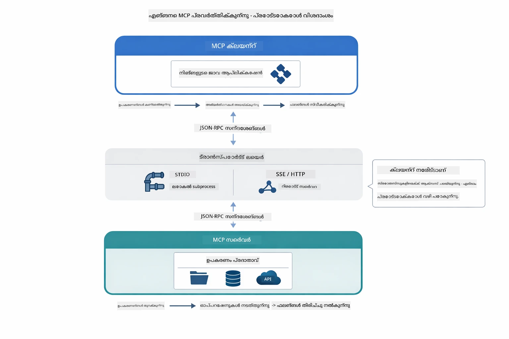

*MCP ഹൂഡിന്റെ അടിയില്‍ എങ്ങനെ പ്രവര്‍ത്തിക്കുന്നു - ക്ലയന്റുകള്‍ ടൂളുകള്‍ കണ്ടെത്തുന്നു, JSON-RPC സന്ദേശങ്ങള്‍ കൈമാറ്റം ചെയ്യുന്നു, ട്രാന്‍സ്പോര്‍ട്ട് ലെയര്‍ വഴി ഓപ്പറേഷനുകള്‍ നിര്‍വഹിക്കുന്നു.*

**സര്‍വര്‍-ക്ലയന്റ് ആർക്കിടെക്ചർ**

MCP ക്ലയന്റ്-സര്‍വര്‍ മോഡല്‍ ഉപയോഗിക്കുന്നു. സര്‍വറുകള്‍ ടൂളുകള്‍ കൊടുക്കുന്നു - ഫയല്‍ വായിക്കല്‍, ഡാറ്റാബേസ് ചോദ്യം ചെയ്യല്‍, API വിളികള്‍. ക്ലയന്റുകള്‍ (നിങ്ങളുടെ എഐ അപ്ലിക്കേഷൻ) സെര്‍വറുകളുമായി ബന്ധപ്പെടുകയും അവയുടെ ടൂളുകള്‍ ഉപയോഗിക്കുകയും ചെയ്യുന്നു.

LangChain4j-യുമായി MCP ഉപയോഗിക്കാൻ, ഈ Maven ആശ്രിതം ചേർക്കുക:

```xml
<dependency>
    <groupId>dev.langchain4j</groupId>
    <artifactId>langchain4j-mcp</artifactId>
    <version>${langchain4j.version}</version>
</dependency>
```

**ടൂൾ കണ്ടെത്തല്‍**

നിങ്ങളുടെ ക്ലയന്റ് MCP സെർവറിനോടു ബന്ധപ്പെടുമ്പോൾ, അത് "നിനക്കുണ്ടായിരിക്കുന്ന ടൂളുകള്‍ എന്തൊക്കെയാണ്?" എന്നു ചോദിക്കുന്നു. സെർവർ ലഭ്യമായ ടൂളുകളുടെ പട്ടിക വിവരണങ്ങളും പാരാമീറ്റർ സ്കീമകളുമായി ലഭ്യമാക്കുന്നു. നിങ്ങളുടെ AI ഏജന്റിന് ഉപയോക്തൃ അഭ്യർത്ഥനകളുടെ അടിസ്ഥാനത്തിൽ ഉപയോഗിക്കാനാകുന്ന ടൂളുകൾ തിരഞ്ഞെടുക്കാം.

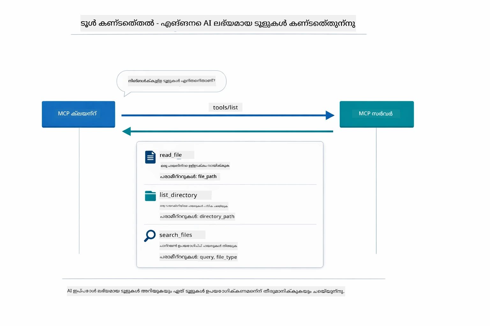

*ആറ് ഒരുക്കത്തോടെ ലഭ്യമായ ടൂളുകൾ കണ്ടെത്തുന്നു — ഇപ്പോൾ ഏജന്റ് എവിടെ എന്ത് കഴിവുകൾ ഉള്ളതാണ് അവ നടക്കാന്‍ തീരുമാനിക്കാവുന്നതാണ്.*

**ട്രാന്‍സ്പോര്‍ട്ട് സംവിധാനം**

MCP വ്യത്യസ്ത ട്രാന്‍സ്പോര്‍ട്ട് സംവിധാനങ്ങളെ പിന്തുണയ്ക്കുന്നു. ഈ മോഡ്യൂള്‍ പ്രാദേശിക പ്രക്രിയകൾക്കായുള്ള സ്റ്റ്ഡിയോ ട്രാന്‍സ്പോര്‍ട്ട് ഉദാഹരണമായി കാണിക്കുന്നു:


*MCP ട്രാന്‍സ്പോര്‍ട്ട് സാങ്കേതികതകള്‍: ദൂരെ സര്‍വറുകള്‍ക്ക് HTTP, പ്രാദേശിക പ്രക്രിയകള്‍ക്ക് Stdio*

**Stdio** - [StdioTransportDemo.java](../../../05-mcp/src/main/java/com/example/langchain4j/mcp/StdioTransportDemo.java)

പ്രാദേശിക പ്രക്രിയകള്‍ക്കായി. നിങ്ങളുടെ അപ്ലിക്കേഷന്‍ ഒരു subprocess ആയി സെര്‍വര്‍ ഉണ്ടാക്കി സ്റ്റാൻഡേര്‍ഡ് ഇൻപുട്ട്/ഔട്ട്പുട്ട് മുഖേന സംവദിക്കുന്നു. ഫയല്‍സിസ്റ്റം ആക്‌സസിനും കമാന്‍ഡ്-ലൈന്‍ ടൂളുകൾക്കും അനുയോജ്യം.

```java
McpTransport stdioTransport = new StdioMcpTransport.Builder()
    .command(List.of(
        npmCmd, "exec",
        "@modelcontextprotocol/server-filesystem@2025.12.18",
        resourcesDir
    ))
    .logEvents(false)
    .build();
```

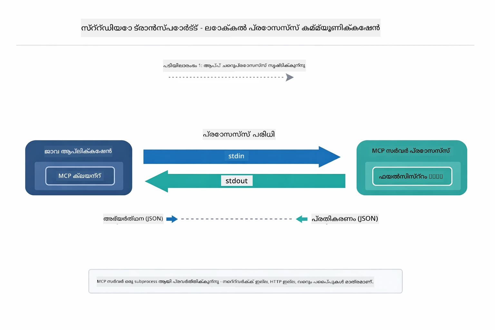

*Stdio transport പ്രവർത്തനത്തിൽ — നിങ്ങളുടെ അപ്ലിക്കേഷൻ MCP സർവർയെ ഒരു ചൈൽഡ് പ്രോസസ്സ് ആയി സൃഷ്ടിച്ച് stdin/stdout പൈപ്പുകൾ വഴിയാണ് സംഭാഷണം.*

> **🤖 [GitHub Copilot](https://github.com/features/copilot) ചാറ്റ് ഉപയോഗിച്ച് ശ്രമിക്കുക:** [`StdioTransportDemo.java`](../../../05-mcp/src/main/java/com/example/langchain4j/mcp/StdioTransportDemo.java) തുറന്ന് ചോദിക്കുക:
> - "Stdio transport എങ്ങനെ പ്രവർത്തിക്കുന്നു, HTTP-യുടെ സമ്പ്രദായത്തില്‍ എപ്പോള്‍ ഉപയോഗിക്കണം?"
> - "LangChain4j എങ്ങനെ MCP സെര്‍വര്‍ പ്രോസസ്സുകളുടെ ജീവചരിത്രം നിയന്ത്രിക്കുന്നു?"
> - "എഐയ്ക്ക് ഫയല്‍സിസ്റ്റം ആക്‌സസ് നൽകുന്നതിന്റെ സുരക്ഷാ പ്രശ്നങ്ങൾ എന്തെന്താണ്?"

## ഏജന്റിക് മോഡ്യൂള്‍

MCP സ്റ്റാൻഡേർഡൈസ്ഡ് ടൂളുകൾ നൽകുമ്പോൾ, LangChain4j-യുടെ **ഏജന്റിക് മോഡ്യൂള്‍** അവ ടൂളുകൾ നിയന്ത്രിക്കുന്ന ഏജന്റുകൾ നിർമിക്കാൻ പ്രഖ്യാപനാത്മക മാർഗ്ഗം നൽകുന്നു. `@Agent` അനോട്ടേഷൻ, `AgenticServices` എന്നിവ നിർദ്ദേശിക്കുന്ന ഇന്റര്‍ഫേസുകൾ വഴി ഏജന്റ് പെരുമാറ്റം നിർവചിക്കാൻ ഉപകരിക്കുന്നു, നിർദ്ദേശപരമായ കോഡിനുപകരം.

ഈ മോഡ്യൂളിൽ, നിങ്ങൾ **സ്വയംപോലീസ് ഏജന്റ്** പാറ്റേൺ പരിശോധിക്കും — ഒരുപോലെ ലളിതമല്ലാത്ത ഏജന്റിക് എഐ സമീപനം, ‘സ്വയംപോലീസ്’ ഏജന്റ് ഉപയോക്തൃ അഭ്യർത്ഥനകൾ അടിസ്ഥാനപ്പെടുത്തി ഉപ - ഏജന്റുകൾ എത്രയും കാര്യക്ഷമമായി വിളിക്കണമെന്ന് സ്വയം തീരുമാനിക്കുന്നു. MCP-സാമര്‍ത്ഥ്യമുള്ള ഫയൽ ആക്‌സസ് അവസരങ്ങളൊന്നായി ഒരു ഉപ-ഏജന്റിൽ ഞങ്ങൾ ചേർക്കുന്നു.

ഏജന്റിക് മോഡ്യൂള്‍ ഉപയോഗിക്കാൻ, ഈ Maven ആശ്രിതം ചേർക്കുക:

```xml
<dependency>
    <groupId>dev.langchain4j</groupId>
    <artifactId>langchain4j-agentic</artifactId>
    <version>${langchain4j.mcp.version}</version>
</dependency>
```

> **⚠️ പരീക്ഷണാധിഷ്ഠിതം:** `langchain4j-agentic` മോഡ്യൂള്‍ **പരീക്ഷണ ഘട്ടത്തിലാണ്**. സ്ഥിരതയുള്ള എഐ അസിസ്റ്റന്റ് നിര്‍മ്മാണം ഇപ്പോഴും `langchain4j-core` കസ്റ്റം ടൂളുകളോടൊപ്പം (Module 04) ആണ്.

## ഉദാഹരണങ്ങള്‍ പ്രവര്‍ത്തിപ്പിക്കല്‍

### ആവശ്യമായ മുന്‍വിധികള്‍

- ജावा 21+, Maven 3.9+
- Node.js 16+ ಮತ್ತು npm (MCP സെർവർമാർക്കായി)
- പരിസ്ഥിതി സൂചകം `.env` ഫയലിൽ കോൺഫിഗർ ചെയ്തിട്ടുണ്ട് (റൂട്ട് ഡയറക്ടറിയിൽ നിന്നും):
  - `AZURE_OPENAI_ENDPOINT`, `AZURE_OPENAI_API_KEY`, `AZURE_OPENAI_DEPLOYMENT` (Module 01-04 പോലെ തന്നെ)

> **അറിയിപ്പ്:** നിങ്ങൾക്ക് പരിസ്ഥിതി മൂല്യങ്ങൾ ഇതുവരെ സജ്ജീകരിച്ചിട്ടില്ലെങ്കിൽ, [Module 00 - Quick Start](../00-quick-start/README.md) നോക്കുക, അല്ലെങ്കിൽ `.env.example` ഫയൽ കോപ്പി ചെയ്ത് റൂട്ട് ഡയറക്ടറിയിൽ `.env` എന്ന് പേരുവെച്ച് ആവശ്യമായ മൂല്യങ്ങൾ പൂരിപ്പിക്കുക.

## ഷീഗ്രം തുടങ്ങിയാല്‍

**VS Code ഉപയോഗിച്ച്:** എക്സ്പ്ലോററിൽ ഒരു ഡെമോ ഫയലിൽ റൈറ്റ് ക്ലിക്കുചെയ്ത് **"Run Java"** തിരഞ്ഞെടുക്കുക, അല്ലെങ്കിൽ റണ്‍ ആന്‍ഡ് ഡീബഗ് പാനലിൽ നിന്നുള്ള ലഞ്ച് കോൺഫിഗ്യുറേഷനുകൾ ഉപയോഗിക്കുക (മുൻപ് `.env` ഫയൽ സജ്ജീകരിച്ചിരിക്കണം).

**Maven ഉപയോഗിച്ച്:** താഴെയുള്ള ഉദാഹരണങ്ങൾ കൊണ്ട് കമാൻഡ് ലൈന്‍ വഴി റൺ ചെയ്യാം.

### ഫയല്‍ പ്രവര്‍ത്തനങ്ങള്‍ (സ്റ്റ്ഡിയോ)

ഇത് പ്രാദേശിക subprocess അടിസ്ഥാനമാക്കിയുള്ള ടൂളുകൾ കാണിക്കുന്നു.

**✅ ആവശ്യമായ മുന്‍വിധികള്‍ വേണ്ട** - MCP സെര്‍വര്‍ സ്വയം സ്പോൺ ചെയ്യുന്നുണ്ട്.

**സ്ടാർട്ട് സ്‌ക്രിപ്റ്റുകൾ ഉപയോഗിക്കുന്നത് (ശിപാർശചെയ്യുന്നു):**

റൂട്ട് `.env` ഫയലിൽ നിന്ന് പരിസ്ഥിതി മൂല്യങ്ങൾ സ്വയം ലോഡ് ചെയ്യും:

**Bash:**
```bash
cd 05-mcp
chmod +x start-stdio.sh
./start-stdio.sh
```

**PowerShell:**
```powershell
cd 05-mcp
.\start-stdio.ps1
```

**VS Code ഉപയോഗിച്ച്:** `StdioTransportDemo.java`-യിൽ റൈറ്റ് ക്ലിക്ക് ചെയ്ത് **"Run Java"** തിരഞ്ഞെടുക്കുക (.env ആദ്യേകൃതമാണെന്ന് ഉറപ്പാക്കുക).

അപ്ലിക്കേഷന്‍ സ്വയം ഒരു ഫയല്‍സിസ്റ്റം MCP സെര്‍വര്‍ ആരംഭിച്ച് പ്രാദേശിക ഫയൽ വായിക്കുന്നു. subprocess മാനേജ്മെന്റ് എങ്ങനെ നടക്കുന്നു എന്ന് ശ്രദ്ധിക്കുക.

**പ്രതീക്ഷിക്കുന്ന ഔട്ട്പുട്ട്:**
```
Assistant response: The file provides an overview of LangChain4j, an open-source Java library
for integrating Large Language Models (LLMs) into Java applications...
```

### സ്വയംപോലീസ് ഏജന്റ്

**സ്വയംപോലീസ് ഏജന്റ് പാറ്റേൺ** ഒരു **ലളിതമായ** ഏജന്റിക് എഐ രൂപമാണ്. ഒരു സ്വയംപോലീസ് ഉപയോക്തൃ അഭ്യര്‍ത്ഥനയുടെ അടിസ്ഥാനത്തിൽ ഏജന്റുകൾ എങ്ങനെ വിളിക്കണമെന്നത് സ്വയമേവ തീരുമാനിക്കുന്ന LLM ഉപയോഗിക്കുന്നു. അടുത്ത ഉദാഹരണത്തിൽ, MCP-സാമര്‍ത്ഥ്യമുള്ള ഫയല്‍ ആക്‌സസ് LLM ഏജന്റിനോടൊപ്പം ചേർത്ത് ഒരു പ്രാപഞ്ചിക ഫയല്‍ വായന → റിപ്പോര്‍ട്ട് പ്രവാഹം സൃഷ്‌ടിക്കും.

ഡെമോയിൽ, `FileAgent` MCP ഫയല്‍സിസ്റ്റം ടൂളുകൾ ഉപയോഗിച്ച് ഒരു ഫയല്‍ വായിക്കുന്നു, `ReportAgent` 1 വാക്യത്തോടു കൂടിയ ഒരു എക്സിക്യൂട്ടീവ് സംക്ഷേപം, 3 പ്രധാന പോയിന്റുകൾ, ശിപാർശകൾ എന്നിവയുള്ള ഘടിത റിപ്പോർട്ട് സൃഷ്‌ടിക്കുന്നു. സ്വയംപോലീസ് ഈ പ്രവാഹത്തെ സ്വയം നിയന്ത്രിക്കുന്നു:

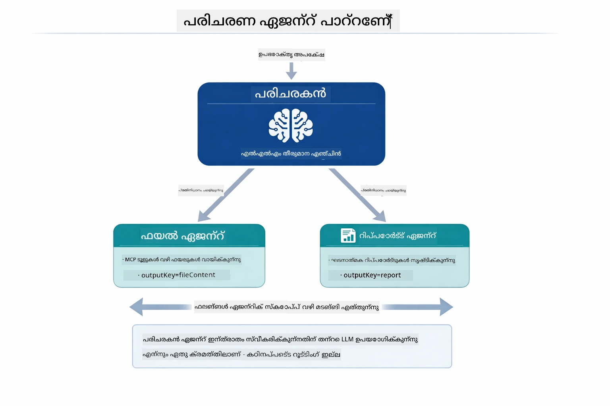

*സ്വയംപോലീസ് തന്റെ LLM ഉപയോഗിച്ച് ഏജന്റുകളുടെ ഓർഡർ സ്വയം തീരുമാനിക്കുന്നു — കരുതിക്കinioി വേഗതയുള്ള റൂട്ടിംഗ് ആവശ്യമില്ല.*

ഫയല്‍-നിന്ന്-റിപോർട്ട് പൈപ്പ്‌ലൈന്‍ തികച്ചും ഇങ്ങനെ പ്രവർത്തിക്കുന്നു:

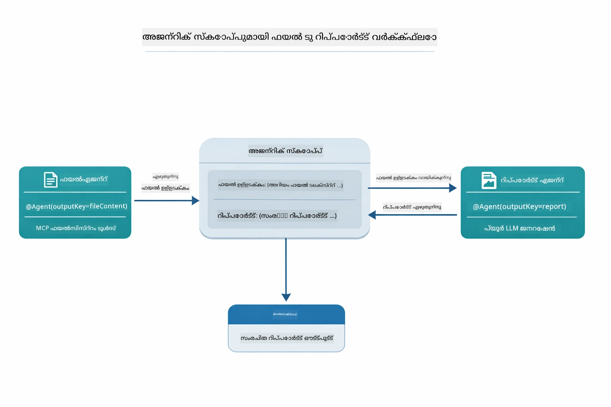

*FileAgent MCP ടൂളുകള്‍ വഴിയുള്ള ഫയല്‍ വായനം, പിന്നീട് ReportAgent അവയെ ഘടിത റിപ്പോർട്ടായി മാറ്റുന്നു.*

ഓരോ ഏജന്റും അവരുടെ ഔട്ട്പുട്ട് **ഏജന്റിക് സ്കോപ്പിൽ** (പങ്കിടുന്ന മെമ്മറി) സൂക്ഷിക്കുന്നു, തുടർന്ന് മുഴുവൻ ഏജന്റുകളും മുൻപുള്ള ഫലങ്ങൾ കാണാം. ഇത് MCP ടൂളുകള്‍ എളുപ്പം ഏജന്റിക് പ്രവാഹങ്ങളിലേക്ക് എങ്ങനെ സംയോജിപ്പിക്കാമെന്ന് കാണിക്കുന്നു - സ്വയംപോലീസ് ഫയല്‍ എങ്ങനെ വായിക്കുന്നത് അറിയേണ്ടതില്ല, വെറും `FileAgent` അത് ചെയ്യുമെന്ന് അറിയുക മതിയാകും.

#### ഡെമോ പ്രവര്‍ത്തിപ്പിക്കൽ

റൂട്ട് `.env` ഫയലിൽ നിന്നുള്ള പരിസ്ഥിതി മൂല്യങ്ങൾ ദൈർഘ്യമേറിയ സ്ടാർട്ട് സ്ക്രിപ്റ്റുകൾ സ്വയം ലോഡ് ചെയ്യും:

**Bash:**
```bash
cd 05-mcp
chmod +x start-supervisor.sh
./start-supervisor.sh
```

**PowerShell:**
```powershell
cd 05-mcp
.\start-supervisor.ps1
```

**VS Code ഉപയോഗിച്ച്:** `SupervisorAgentDemo.java` ഓപ്പണ്‍ ചെയ്ത് റൈറ്റ് ക്ലിക്ക് ചെയ്ത് **"Run Java"** തിരഞ്ഞെടുക്കുക (.env ഫയൽ സജ്ജീകരിച്ചിരിക്കണം).

#### സ്വയംപോലീസ് എങ്ങനെ പ്രവർത്തിക്കുന്നു

```java
// ഘട്ടം 1: ഫയൽഎജന്റ് MCP ഉപകരണങ്ങൾ ഉപയോഗിച്ച് ഫയലുകൾ വായിക്കുന്നു
FileAgent fileAgent = AgenticServices.agentBuilder(FileAgent.class)
        .chatModel(model)
        .toolProvider(mcpToolProvider)  // ഫയൽ പ്രവർത്തനങ്ങൾക്ക് MCP ഉപകരണങ്ങൾ ഉണ്ട്
        .build();

// ഘട്ടം 2: റിപ്പോർട്ട്‌എജന്റ് ഘടനയുള്ള റിപ്പോർട്ടുകൾ സൃഷ്ടിക്കുന്നു
ReportAgent reportAgent = AgenticServices.agentBuilder(ReportAgent.class)
        .chatModel(model)
        .build();

// സൂപ്പർവൈസർ ഫയൽ → റിപ്പോർട്ട് പ്രവാഹം നിയന്ത്രിക്കുന്നു
SupervisorAgent supervisor = AgenticServices.supervisorBuilder()
        .chatModel(model)
        .subAgents(fileAgent, reportAgent)
        .responseStrategy(SupervisorResponseStrategy.LAST)  // അന്തിമ റിപ്പോർട്ട് തിരികെ നൽകുക
        .build();

// അഭ്യർത്ഥനയുടെ അടിസ്ഥാനത്തിൽ ഏത് ഏജന്റുകളെ വിളിക്കണമെന്ന് സൂപ്പർവൈസർ തീരുമാനിക്കുന്നു
String response = supervisor.invoke("Read the file at /path/file.txt and generate a report");
```

#### പ്രതികരണ തന്ത്രങ്ങൾ

`SupervisorAgent` കോൺഫിഗർ ചെയ്യുമ്പോൾ, ഉപ-ഏജന്റുകൾ അവരുടെ ജോലികൾ പൂർത്തിയാക്കിയശേഷം ഉപയോക്താവിനായി അന്തിമ ഉത്തരമുണ്ടാക്കേണ്ട വിധം വ്യക്തമാക്കി നൽകുന്നു.

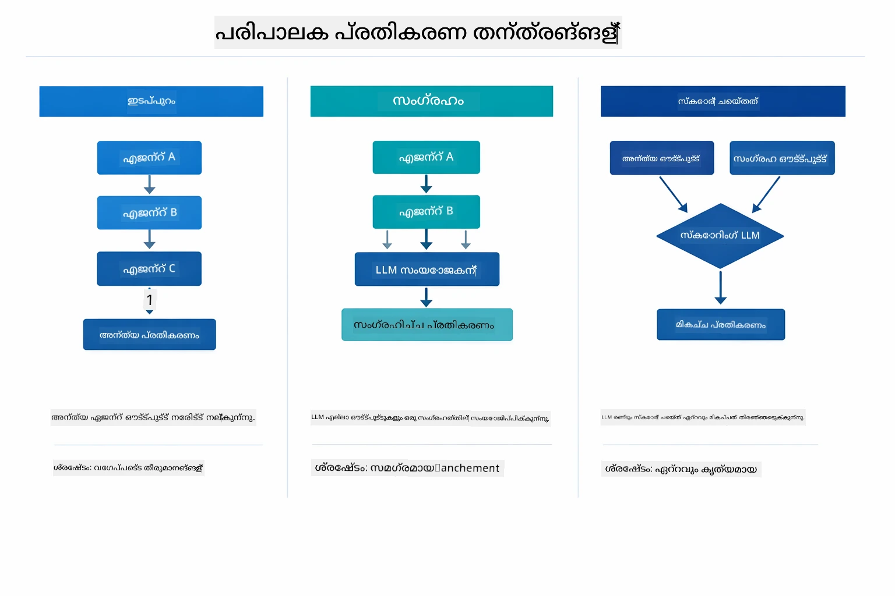

*സ്വയംപോലീസ് അന്തിമ പ്രതികരണം രൂപീകരിക്കുന്നതിനുള്ള മൂന്ന് തന്ത്രങ്ങൾ — അവസാനം പ്രവർത്തിച്ച ഏജന്റിന്റെ ഔട്ട്പുട്ടോ, സംഗ്രഹത്തോ, ഉത്തമ സ്‌കോർ ലഭിച്ച ഒപ്ഷനോ തിരഞ്ഞെടുക്കുക.*

ലഭ്യമായ തന്ത്രങ്ങൾ:

| തന്ത്രം | വിവരണം |
|----------|-------------|
| **LAST** | സ്വയംപോളീസ് വിളിച്ച अंतिम ഉപ-ഏജന്റിന്റെയോ ടൂളിന്റെയോ ഔട്ട്പുട്ട് തിരികെ നല്‍കും. ഇത് ഫലപ്രദമാണ്, workflows-ലുള്ള അവസാന ഏജന്റ് പ്രത്യേകിച്ച് സമാപ്ത, സമ്പൂര്‍ണ്ണ ഉത്തര നിർവഹിക്കാന്‍ രൂപപ്പെടുത്തിയിട്ടുണ്ടെങ്കില്‍ (ഉദാ: ഗവേഷണ പൈപ്പ്‌ലൈനിൽ "സംക്ഷേപ ഏജന്റ്"). |
| **SUMMARY** | സ്വയംപോലീസ് തന്റെ ഉള്ളില്‍ ഉള്ള LLM ഉപയോഗിച്ച് മുഴുവന്‍ ഇടപെടലിനും ഉപ-ഏജന്റ് ഫലങ്ങള്‍ക്കും ഒരു സംഗ്രഹം ചേർത്ത് അത് അന്തിമ പ്രതികരണമായി തിരിച്ച് നൽകുന്നു. ഇത് ഉപയോക്താവിന് ഒരു വ്യക്തമായ ഏകീകൃത ഉത്തരം നൽകുന്നു. |
| **SCORED** | സിസ്റ്റം ഉള്ളിൽ ഒരു LLM ഉപയോഗിച്ച് LAST പ്രതികരണത്തിനും SUMMARY സംഗ്രഹത്തിനും ഉപയോക്തൃ അഭ്യര്‍ത്ഥനയുടെ പൂർവവിവരണത്തോടു താരതമ്യം ചെയ്ത് സ്‌കോർ വിതരണം ചെയ്ത് ഏറ്റവും ഉയർന്ന സ്കോർ ലഭിച്ച ഔട്ട്പുട്ട് തിരികെ നൽകും. |

കമ്പീറ്റ് പ്രവർത്തനത്തിന് [SupervisorAgentDemo.java](../../../05-mcp/src/main/java/com/example/langchain4j/mcp/SupervisorAgentDemo.java) കാണുക.

> **🤖 [GitHub Copilot](https://github.com/features/copilot) ചാറ്റ് ഉപയോഗിച്ച് ശ്രമിക്കുക:** [`SupervisorAgentDemo.java`](../../../05-mcp/src/main/java/com/example/langchain4j/mcp/SupervisorAgentDemo.java) തുറന്ന് ചോദിക്കുക:
> - "സ്വയംപോലീസ് ഏജന്റ് ഏജന്റുകള്‍ എങ്ങനെ തിരഞ്ഞെടുക്കുന്നു?"
> - "സ്വയംപോലീസ് workflows-നും ക്രമാനുസൃത workflows-നും ഇടയിലെ വ്യത്യാസം എന്ത്?"
> - "സ്വയംപോലീസിന്റെ പദ്ധതി ക്രമീകരണം എങ്ങനെ ഇഷ്ടാനുസരിച്ചു മാറ്റാം?"

#### ഔട്ട്പുട്ട് മനസ്സിലാക്കല്‍

ഡെമോ ഓടുമ്പോൾ സ്വയംപോലീസ് ഏജന്റുകളെ എങ്ങനെ നിയന്ത്രിക്കുന്നു എന്ന് ഘടിതമായി കാണാം. ഓരോ ഭാഗവും നൽകുന്നത്:

```
======================================================================
  FILE → REPORT WORKFLOW DEMO
======================================================================

This demo shows a clear 2-step workflow: read a file, then generate a report.
The Supervisor orchestrates the agents automatically based on the request.
```

**ഹെഡര്‍** പൈപ്പ്‌ലൈനിന്റെ ആശയം പരിചയപ്പെടുത്തി: ഫയല്‍ വായന മുതൽ റിപ്പോർട്ട് ജനറേഷൻ വരെ ശ്രദ്ധ കേന്ദ്രീകരിച്ച പ്രവാഹം.

```
--- WORKFLOW ---------------------------------------------------------
  ┌─────────────┐      ┌──────────────┐
  │  FileAgent  │ ───▶ │ ReportAgent  │
  │ (MCP tools) │      │  (pure LLM)  │
  └─────────────┘      └──────────────┘
   outputKey:           outputKey:
   'fileContent'        'report'

--- AVAILABLE AGENTS -------------------------------------------------
  [FILE]   FileAgent   - Reads files via MCP → stores in 'fileContent'
  [REPORT] ReportAgent - Generates structured report → stores in 'report'
```

**പ്രവാഹം ആഖ്യാനം** ഏജന്റുകൾ തമ്മിലുള്ള ഡാറ്റാ പ്രവാഹം കാണിക്കുന്നു. ഓരോ ഏജന്റിനും പ്രത്യേക പാട്:
- **FileAgent** MCP ടൂളുകൾ ഉപയോഗിച്ച് ഫയലുകൾ വായിക്കുകയും `fileContent`-ല്‍ ക.raw ഉള്ളടക്കം സൂക്ഷിക്കുകയും ചെയ്യുന്നു
- **ReportAgent** ആ ഉള്ളടക്കം ഉപയോഗിച്ച് ഘടിത റിപ്പോർട്ട് `report` ഉൽപാദിപ്പിക്കുന്നു

```
--- USER REQUEST -----------------------------------------------------
  "Read the file at .../file.txt and generate a report on its contents"
```

**ഉപയോക്തൃ അഭ്യർത്ഥന** പ്രവർത്തനം കാണിക്കുന്നു. സ്വയംപോലീസ് ഇതിനെ വിശകലനം ചെയ്ത് FileAgent → ReportAgent വിളിക്കാനാണ് തീരുമാനിക്കുന്നത്.

```
--- SUPERVISOR ORCHESTRATION -----------------------------------------
  The Supervisor decides which agents to invoke and passes data between them...

  +-- STEP 1: Supervisor chose -> FileAgent (reading file via MCP)
  |
  |   Input: .../file.txt
  |
  |   Result: LangChain4j is an open-source, provider-agnostic Java framework for building LLM...
  +-- [OK] FileAgent (reading file via MCP) completed

  +-- STEP 2: Supervisor chose -> ReportAgent (generating structured report)
  |
  |   Input: LangChain4j is an open-source, provider-agnostic Java framew...
  |
  |   Result: Executive Summary...
  +-- [OK] ReportAgent (generating structured report) completed
```

**സ്വയംപോലീസ് നിയന്ത്രണം** 2-പടി പ്രവാഹം കാണിക്കുന്നു:
1. **FileAgent** MCP ഉപകരണങ്ങൾ വഴി ഫയൽ വായിക്കുകയും ഉള്ളടക്കം സൂക്ഷിക്കുകയും ചെയ്യുന്നു
2. **ReportAgent** ആ ഉള്ളടക്കം സ്വീകരിച്ച് ഘടിത റിപ്പോർട്ട് സൃഷ്‌ടിക്കുന്നു

ഉപയോക്തൃ അഭ്യര്ത്ഥന അടിസ്ഥാനമാക്കിയുള്ള സ്വയം ചിന്തന്റെ തീരുമാനമാണ്.

```
--- FINAL RESPONSE ---------------------------------------------------
Executive Summary
...

Key Points
...

Recommendations
...

--- AGENTIC SCOPE (Data Flow) ----------------------------------------
  Each agent stores its output for downstream agents to consume:
  * fileContent: LangChain4j is an open-source, provider-agnostic Java framework...
  * report: Executive Summary...
```

#### ഏജന്റിക് മോഡ്യൂള്‍ സവിശേഷതകളുടെ വിശദീകരണം

ഉദാഹരണം ഏജന്റിക് മോഡ്യൂളിന്റെ ബഹുദൂരം സവിശേഷതകൾ കാണിക്കുന്നു. ഏജന്റിക് സ്കോപ്പ്, ഏജന്റ് ലിസ്നേഴ്സിനെ ഏകദേശം നോക്കാം.

**ഏജന്റിക് സ്കോപ്പ്** `@Agent(outputKey="...")` ഉപയോഗിച്ച് ഏജന്റുകൾ ഫലങ്ങൾ സംഭരിക്കുന്ന പങ്കിട്ട് മെമ്മറി ആണ്. ഇതിലൂടെ:
- പിന്നീട് വരുന്ന ഏജന്റുകൾ മുമ്പത്തെ ഔട്ട്പുട്ടുകൾ കാണാം
- സ്വയംപോലീസ് ഇടപെടലിന്റെ അന്തിമ പ്രതികരണം ഉയർത്താം
- നിങ്ങൾക്ക് ഓരോ ഏജന്റും ഉൽപാദിപ്പിച്ചത് പരിശോധിക്കാം

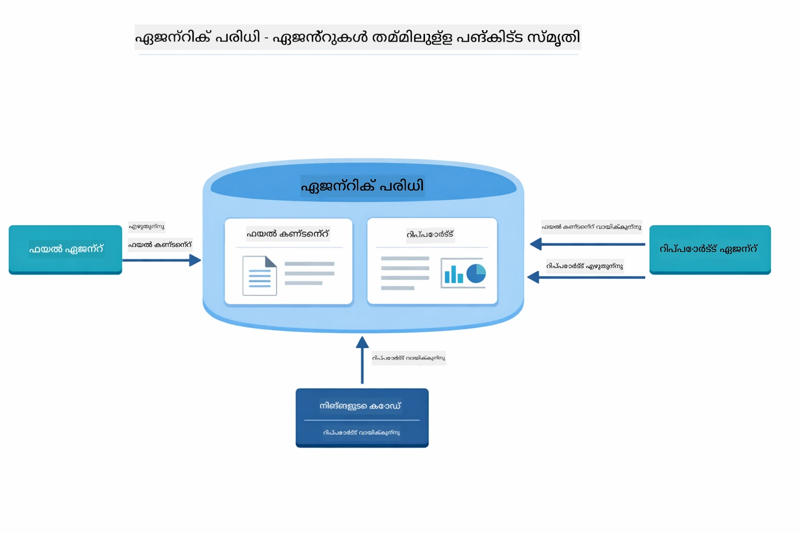

*ഏജന്റിക് സ്കോപ്പ് പങ്കിട്ട മെമ്മറിയായി പ്രവർത്തിക്കുന്നു — FileAgent `fileContent` എഴുതുന്നു, ReportAgent അത് വായിച്ച് `report` എഴുതുന്നു, നിങ്ങളുടെ കോഡ് അന്തിമ ഫലം വായിക്കുന്നു.*

```java
ResultWithAgenticScope<String> result = supervisor.invokeWithAgenticScope(request);
AgenticScope scope = result.agenticScope();
String fileContent = scope.readState("fileContent");  // ഫയൽ ഏജന്റിൽ നിന്നുള്ള അപരിഷ്കൃത ഫയൽ ഡാറ്റ
String report = scope.readState("report");            // റിപോർട്ട് ഏജന്റിൽ നിന്നുള്ള സംവേദ്യമായ റിപ്പോർട്ട്
```

**ഏജന്റ് ലിസ്നേഴ്സ്** ഏജന്റ് നിർവഹണം നിരീക്ഷിക്കാനും ഡീബഗ് ചെയ്യാനും സഹായിക്കുന്നു. ഡെമോയിലുള്ള ഘട്ടം ഘട്ടം ഔട്ട്പുട്ട് ഓരോ ഏജന്റ് വിളിപ്പിക്കുന്നിടത്തും അനുബന്ധിച്ചിട്ടുള്ള AgentListener-നാണ്.
- **beforeAgentInvocation** - സൂപർവൈസർ ഒരു ഏജന്റ് തിരഞ്ഞെടുക്കുമ്പോൾ വിളിക്കപ്പെടുന്നു, ഏജന്റ് ആര് തിരഞ്ഞെടുത്തു എന്ന് എന്തുകൊണ്ട് എന്ന് കാണിക്കാൻ
- **afterAgentInvocation** - ഏജന്റ് പൂർത്തിയാക്കിയപ്പോൾ വിളിക്കപ്പെടുന്നു, അതിന്റെ ഫലങ്ങൾ കാണിക്കുന്നു
- **inheritedBySubagents** - സത്യം ആണെങ്കിൽ, ലിസ്ടിനർ ഹയർആർക്കിയിലെ എല്ലാ ഏജന്റുകളെയും നിരീക്ഷിക്കുന്നു

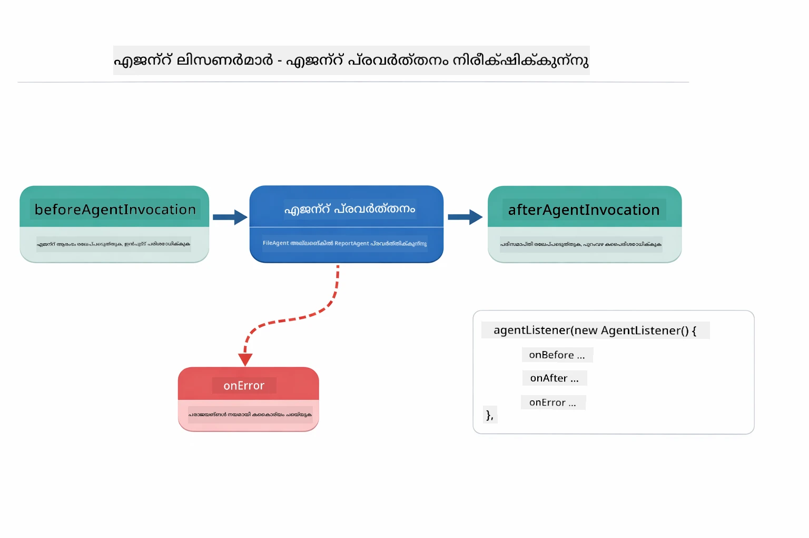

*ഏജന്റ് ലിസ്ടിനേഴ്സ് പ്രവർത്തന ജീവിതചക്രത്തിൽ ചേരുന്നു — ഏജന്റുകൾ തുടങ്ങുമ്പോൾ, പൂർത്തിയാക്കുമ്പോൾ, അല്ലെങ്കിൽ പിശകുകൾ ഏറ്റടുക്കുമ്പോൾ നിരീക്ഷിക്കുന്നു.*

```java
AgentListener monitor = new AgentListener() {
    private int step = 0;
    
    @Override
    public void beforeAgentInvocation(AgentRequest request) {
        step++;
        System.out.println("  +-- STEP " + step + ": " + request.agentName());
    }
    
    @Override
    public void afterAgentInvocation(AgentResponse response) {
        System.out.println("  +-- [OK] " + response.agentName() + " completed");
    }
    
    @Override
    public boolean inheritedBySubagents() {
        return true; // എല്ലാ സബ്-ഏജന്റുകളിലേക്കും പ്രചരിപ്പിക്കുക
    }
};
```

സൂപർവൈസർ പാറ്റേൺക്കപ്പുറം, `langchain4j-agentic` മോഡ്യൂൾ നിരവധി ശക്തമായ വർക്ക്‌ഫ്ലോ പാറ്റേണുകളും സവിശേഷതകളും നൽകുന്നു:

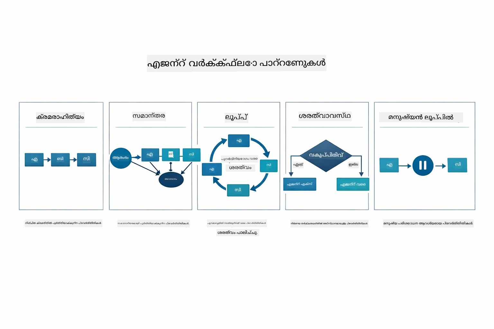

*ഏജന്റുകളെ ഓർക്കസ്ട്രേറ്റ് ചെയ്യാനുള്ള അഞ്ച് വർക്ക്‌ഫ്ലോ പാറ്റേണുകൾ — ലളിതമായ അനുക്രമ പൈപ്പ്‌ലൈൻ മുതൽ മനുഷ്യനിനെ ഉൾപ്പെടുത്തിയ അംഗീകൃതി വർക്ക്‌ഫ്ലോകൾ വരെ.*

| പാറ്റേൺ | വിവരണം | ഉപയോഗകേസ് |
|---------|-------------|----------|
| **അനുക്രമം (Sequential)** | ഏജന്റുകൾ ആനുക്രമമായി പ്രവർത്തിപ്പിക്കുക, ഔട്ട്‌പുട്ട് അടുത്തതിലേക്കു ഒഴുകുക | പൈപ്പ്‌ലൈൻ: ഗവേഷണം → വിശകലനം → റിപ്പോർട്ട് |
| **സമാന്തര (Parallel)** | ഏജന്റുകൾ ഒരേസമയം ഓടുക | സ്വതന്ത്ര കൃത്യങ്ങൾ: കാലാവസ്ഥ + വാർത്തകൾ + ഓഹരികൾ |
| **ലൂപ്പ് (Loop)** | നിബന്ധനയ്ക്ക് ഏറ്റവും വരെ ആവർത്തിക്കുക | ഗുണനിലവാര സ്കോറിംഗ്: സ്കോർ ≥ 0.8 വരെ പ്രശ്‌ന പരിഹാരം |
| **നിബന്ധനാപരമാകൃതി (Conditional)** | നിബന്ധനകളെ ആശ്രയിച്ചുള്ള റൂട്ടിംഗ് | വർഗ്ഗീകരിക്കുക → വിദഗ്ധ ഏജന്റിന് റൂട്ട് ചെയ്യുക |
| **മനുഷ്യൻ-ഇൻ-ദ-ലൂപ്പ് (Human-in-the-Loop)** | മനുഷ്യ പരിശോധന പോയിന്റുകൾ ചേർക്കുക | അംഗീകാരം വർക്ക്‌ഫ്ലോകൾ, ഉള്ളടക്കം അവലോകനം |

## മുഖ്യ ആശയങ്ങൾ

ഇപ്പോൾ നിങ്ങൾ MCPയും agentic മോഡ്യൂളും പ്രായോഗികമായി കടന്നുകാണിച്ചതിനാൽ, ഓരോ രീതിയും എപ്പോൾ ഉപയോഗിക്കാമെന്ന് സംഗ്രഹിക്കാം.

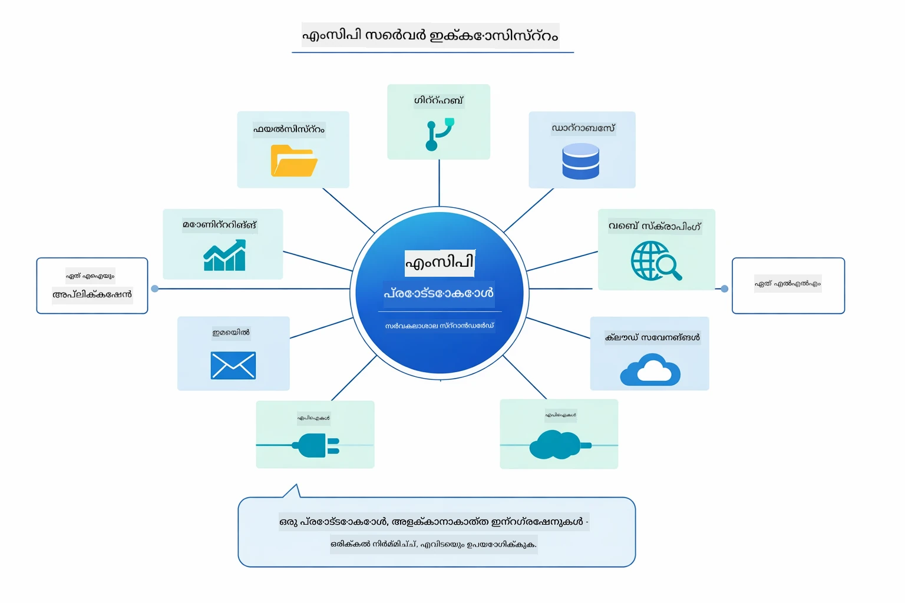

*MCP ഒരു യൂണിവേഴ്സൽ പ്രോട്ടോക്കോൾ പരിസ്ഥിതി സൃഷ്ടിക്കുന്നു — യാതൊരു MCP-സമർത്ഥ സെർവർ MCP-സമർത്ഥ ക്ലയന്റുമായി ജോലി ചെയ്യുന്നു, ആപ്പ്ലിക്കേഷനുകൾക്കിടയിൽ ഉപകരണങ്ങൾ പങ്കിടാൻ സാധിക്കുന്നു.*

**MCP** നിലവിലുള്ള ഉപകരണ പരിസ്ഥിതികളെ പ്രയോജനപ്പെടുത്താനും, പല ആപ്പ്ലിക്കേഷനുകളും പങ്കുവെയ്ക്കാവുന്ന ഉപകരണങ്ങൾ നിർമ്മിക്കാനും, സ്റ്റാൻഡേർഡ് പ്രോട്ടോക്കോളുകളിലൂടെ ത്ര Partei സേവനങ്ങൾ സംയോജിപ്പിക്കാനും, കോഡ് മാറ്റാതെ ഉപകരണങ്ങൾ മാറ്റാനും വേണ്ടിയുള്ള വനമാണ്.

**Agentic Module** `@Agent` അനോടേഷനുകളോടെ പ്രഖ്യാപനാത്മക ഏജന്റ് നിർവചനങ്ങൾ ഉപയോഗിക്കുമ്പോൾ, വർക്ക്‌ഫ്ലോ ഓർക്കസ്ട്രേഷനു (അനുക്രമ, ലൂപ്പ്, സമാന്തര) ആവശ്യം ഉണ്ടെങ്കിൽ, നിർദ്ദേശപരമായ കോഡിനെ പകരം ഇന്റർ‌ഫേസ് അടിസ്ഥാനമായ ഏജന്റ് രൂപകൽപ്പന ചേരുമ്പോൾ എന്നിവയ്ക്ക് ഏറ്റവും അനുയോജ്യം ആണ്. ഒരേ outputKey വഴി ഔട്ട്‌പുട്ടുകൾ പങ്കിടുന്ന നിരവധി ഏജന്റുകളെ സംയോജിപ്പിക്കാൻ ഉപയോഗിക്കുന്നു.

**സൂപർവൈസർ ഏജന്റ് പാറ്റേൺ** മുൻകൂട്ടി പ്രവചിക്കാനാകാത്ത വർക്ക്‌ഫ്ലോ ആണെങ്കിൽ, LLM തീരുമാനമെടുക്കുമ്പോൾ, ഡൈനാമിക് ഓർക്കസ്ട്രേഷൻ ആവശ്യമായ ഒന്നിലധികം പ്രത്യേക്ഗതയർജന്റുകൾ ഉണ്ടെങ്കിൽ, വിവിധ കഴിവുകൾക്ക് റൂട്ടുചെയ്യുന്ന സംഭാഷണ സിസ്റ്റങ്ങൾ നിർമിക്കുമ്പോൾ, ഏറ്റവും അനായാസവും പരിണാമാത്മകവുമായ ഏജന്റ് പെരുമാറ്റം വേണ്ടിയുള്ളപ്പോൾ മികച്ചതാണ്.

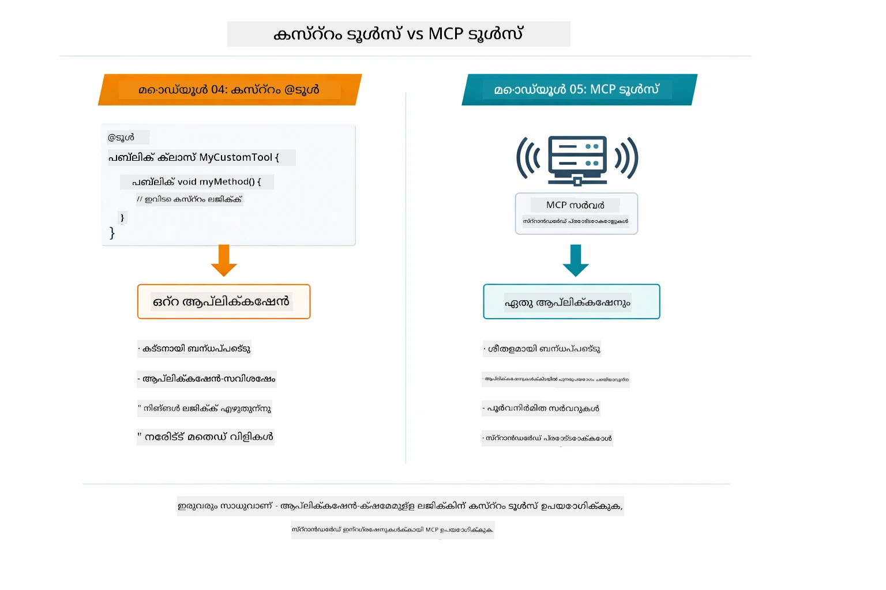

*കസ്റ്റം @Tool മ്ETHODുകൾ എപ്പോൾ ഉപയോഗിക്കും പരിശോധിക്കുക vs MCP ടൂൾസ് — ആപ്പ്-സ്വഭാവമുള്ള ലൊജിക്കും പൂർണ്ണ ടൈപ്പ് സുരക്ഷയുമുള്ള കസ്റ്റം ടൂൾസ്, ആപ്പ്ലിക്കേഷനുകൾക്കിടയിൽ പ്രവർത്തിക്കുന്ന ഫ്രമാലურად സംയോജിപ്പിക്കാവുന്ന MCP ടൂൾസ്.*

## അഭിനന്ദനങ്ങൾ!

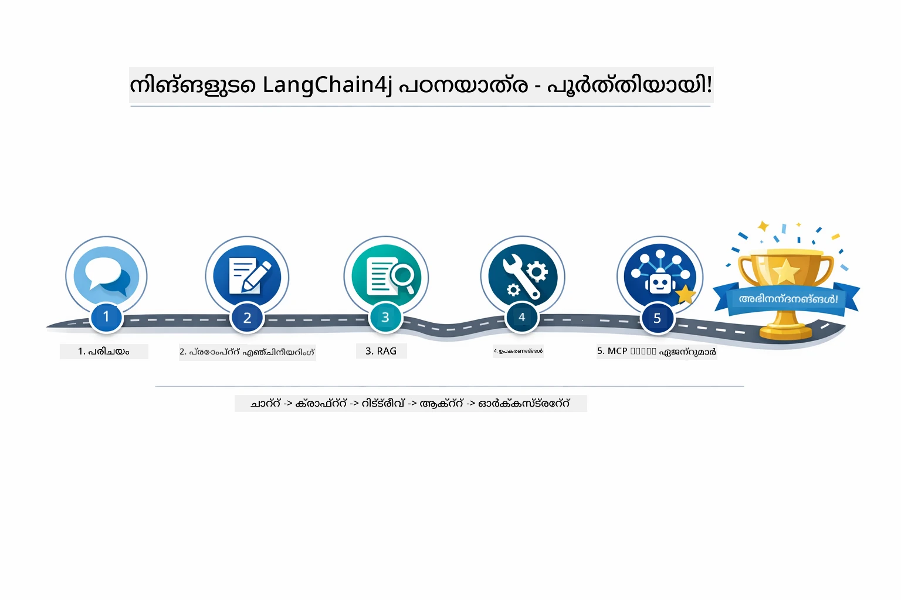

*അടിസ്ഥാപക സംവാദത്തിൽ നിന്ന് MCP-പവേഡായ ഏജന്റ് სისტემുകളിലേക്കുള്ള നിങ്ങൾ പഠനയാത്രയിൽ നിന്നുള്ള അഞ്ച് മൊഡ്യൂളുകൾ.*

നിങ്ങൾ LangChain4j for Beginners കോഴ്സ് പൂർത്തിയാക്കി. നിങ്ങൾ പഠിച്ചത്:

- മെമ്മറിയോടെ സംഭാഷണ AI നിർമ്മിക്കാൻ (Module 01)
- വിവിധ പ്രവർത്തനങ്ങൾക്കായുള്ള പ്രോംപ്റ്റ് എൻജിനീയറിംഗ് പാറ്റേണുകൾ (Module 02)
- നിങ്ങളുടെ ഡോക്യുമെന്റുകളിൽ അടിത്തറ വച്ചു പ്രതികരണമാർഗ്ഗങ്ങൾ (RAG) (Module 03)
- കസ്റ്റം ടൂളുകളുമായി അടിസ്ഥാന AI ഏജന്റുകൾ (സഹായികൾ) സൃഷ്ടിക്കുക (Module 04)
- LangChain4j MCP, Agentic മോഡ്യൂളുകളുമായി സ്റ്റാൻഡേർഡ് ടൂളുകൾ സംയോജിപ്പിക്കുക (Module 05)

### ഇനി എന്ത്?

മൊഡ്യൂളുകൾ പൂര്‍ത്തിയാക്കിയ ശേഷം, LangChain4j ടെസ്റ്റിംഗ് ആശയങ്ങൾ പ്രയോഗിച്ച് കാണാൻ [Testing Guide](../docs/TESTING.md) പരിശോധിക്കുക.

**അധികാരিক സ്രോതസ്സ്:**
- [LangChain4j ഡോക്യുമെന്റേഷൻ](https://docs.langchain4j.dev/) - സമഗ്ര ഗൈഡുകളും API റഫറൻസും
- [LangChain4j GitHub](https://github.com/langchain4j/langchain4j) - സ്രോതസ്സ് കോഡ്, ഉദാഹരണങ്ങൾ
- [LangChain4j ടൂട്ടോറിയലുകൾ](https://docs.langchain4j.dev/tutorials/) - വിവിധ ഉപയോഗ കേസുകൾക്കായുള്ള ഘട്ടം-ഘട്ടം ടെutorials

ഈ കോഴ്സ് പൂർത്തിയാക്കിയതിന് നന്ദി!

---

**തിരഞ്ഞെടുക്കുക:** [← മുൻപത്തേക്ക്: Module 04 - Tools](../04-tools/README.md) | [പ്രധാന പേജിൽ തിരിച്ചുപോകുക](../README.md)

---

<!-- CO-OP TRANSLATOR DISCLAIMER START -->
**തള്ളി പറഞ്ഞു**:
ഈ ദസ്താവേജ് [Co-op Translator](https://github.com/Azure/co-op-translator) എന്ന AI പരിഭാഷാ സേവനം ഉപയോഗിച്ച് പരിഭാഷ ചെയ്തത് ആണ്. മികവിനായി ഞങ്ങൾ ശ്രമിക്കുകയും ചെയ്യുമ്പോഴും, സ്വയംപ്രവർത്തിത പരിഭാഷകളിൽ പിഴവുകൾ അല്ലെങ്കിൽ അക്ഷരശുദ്ധി ഉണ്ടാകാമെന്ന് ദയവായി ശ്രദ്ധിക്കുക. യഥാർത്ഥ ദസ്താവേജിന്റെ മാതൃഭാഷാ പതിപ്പ് ആധാരമായാണ് കണക്കാക്കേണ്ടത്. പ്രധാന വിവരംക്കായി പ്രൊഫഷണൽ മാനവ പരിഭാഷ ശുപാർശ ചെയ്യപ്പെടുന്നു. ഈ പരിഭാഷയുടെ ഉപയോഗം മൂലം ഉള്ള തെറ്റിദ്ധാരണകൾക്കും വ്യാഖ്യാനങ്ങള്ക്കും ഞങ്ങൾ ഉത്തരവാദികളല്ല.
<!-- CO-OP TRANSLATOR DISCLAIMER END -->