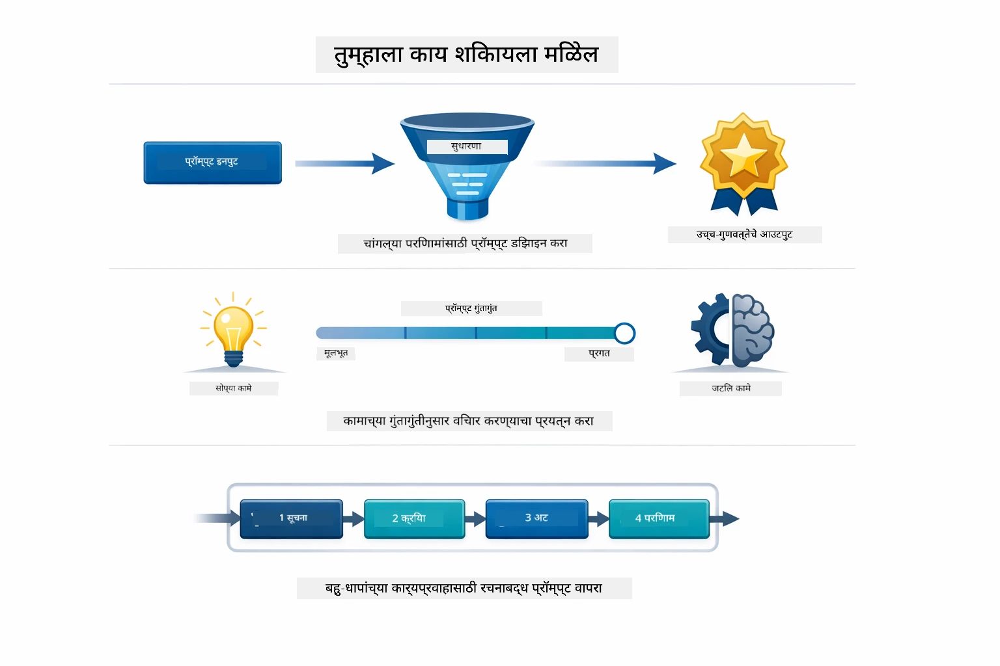
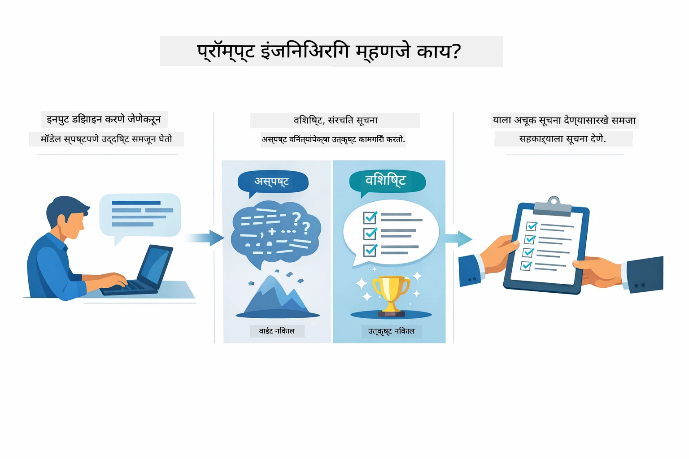
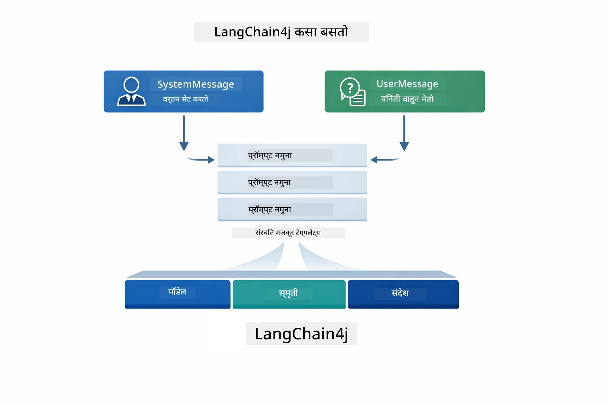
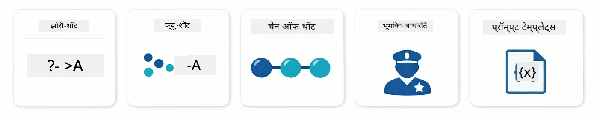
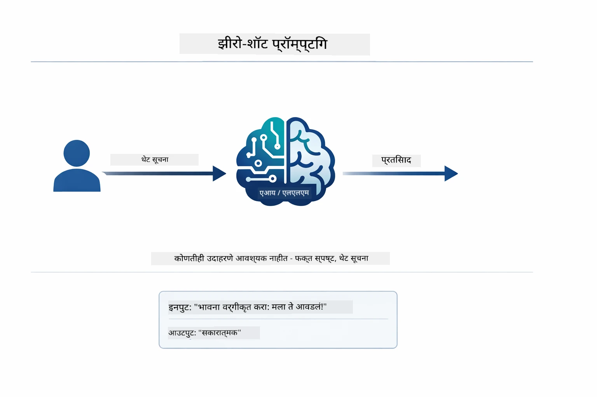
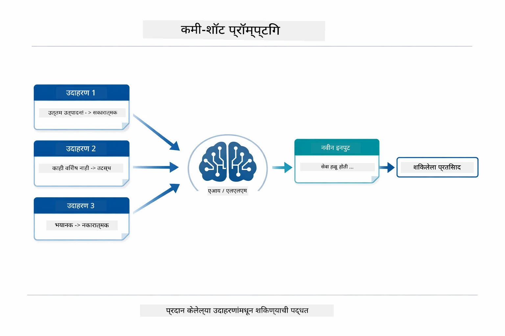
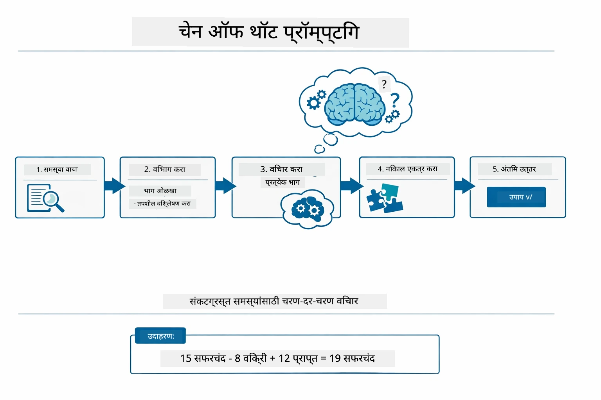
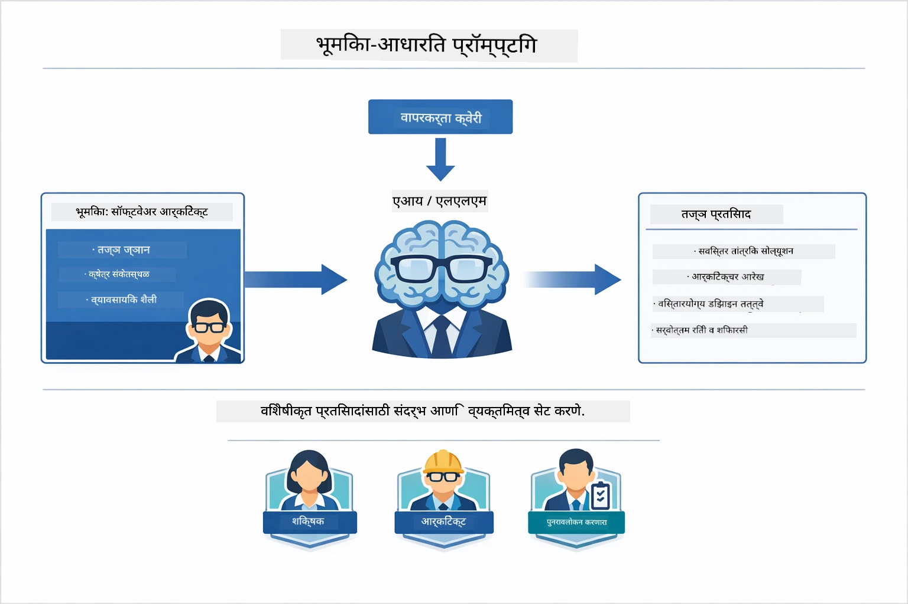
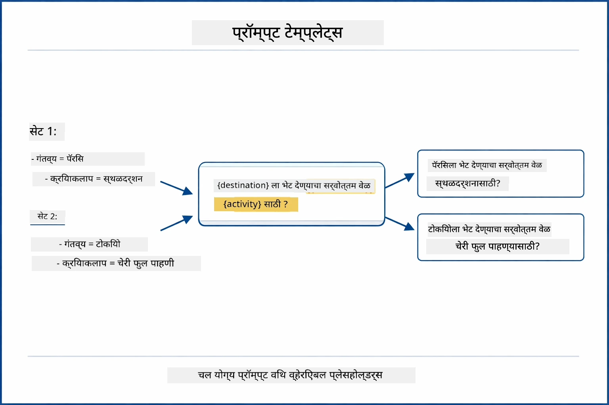
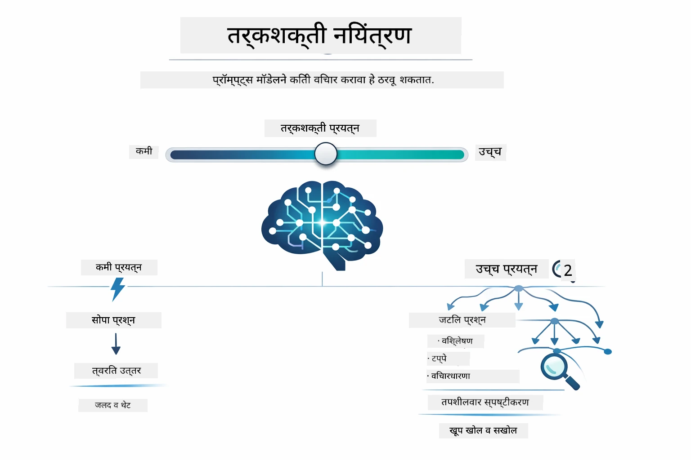

# Module 02: GPT-5.2 सह प्रॉम्प्ट इंजिनिअरिंग

## अनुक्रमणिका

- [आपण काय शिकणार आहात](../../../02-prompt-engineering)
- [पूर्वअटी](../../../02-prompt-engineering)
- [प्रॉम्प्ट इंजिनिअरिंग समजून घेणे](../../../02-prompt-engineering)
- [प्रॉम्प्ट इंजिनिअरिंग मूलतत्त्वे](../../../02-prompt-engineering)
  - [झिरो-शॉट प्रॉम्प्टिंग](../../../02-prompt-engineering)
  - [फ्यु-शॉट प्रॉम्प्टिंग](../../../02-prompt-engineering)
  - [चेन ऑफ थॉट](../../../02-prompt-engineering)
  - [भूमिका-आधारित प्रॉम्प्टिंग](../../../02-prompt-engineering)
  - [प्रॉम्प्ट टेम्प्लेट्स](../../../02-prompt-engineering)
- [प्रगत नमुने](../../../02-prompt-engineering)
- [विद्यमान Azure संसाधने वापरणे](../../../02-prompt-engineering)
- [अॅप्लिकेशन स्क्रीनशॉट्स](../../../02-prompt-engineering)
- [नमुने शोधणे](../../../02-prompt-engineering)
  - [कमी विरागीपणा विरुद्ध जास्त विरागीपणा](../../../02-prompt-engineering)
  - [कार्य अंमलबजावणी (टूल प्रीअॅम्बल्स)](../../../02-prompt-engineering)
  - [स्वत:ची मागोवा घेणारा कोड](../../../02-prompt-engineering)
  - [संरचित विश्लेषण](../../../02-prompt-engineering)
  - [मल्टी-टर्न चॅट](../../../02-prompt-engineering)
  - [पायरी-मार्गे निष्कर्ष काढणे](../../../02-prompt-engineering)
  - [बंधित आउटपुट](../../../02-prompt-engineering)
- [आपण खरोखर काय शिकत आहात](../../../02-prompt-engineering)
- [पुढील पावले](../../../02-prompt-engineering)

## आपण काय शिकणार आहात



मागील मॉड्यूलमध्ये, आपण पाहिले कसे मेमरी संवादात्मक AI सक्षम करते आणि GitHub मॉडेल्स वापरून प्राथमिक संवाद केले. आता आपण कसे प्रश्न विचारता यावर लक्ष केंद्रीत करू — प्रॉम्प्ट्स स्वतः — Azure OpenAI च्या GPT-5.2 वापरून. आपण जेव्हा प्रॉम्प्ट्स रचता तेव्हा मिळणाऱ्या प्रतिसादांची गुणवत्ता मोठ्या प्रमाणात प्रभावित होते. आपण प्रॉम्प्टिंग तंत्रांच्या मूलतत्त्वांची पुनरावृत्ती करतो आणि नंतर GPT-5.2 च्या क्षमतेचा पूर्ण फायदा घेणारे आठ प्रगत नमुने पाहतो.

आपण GPT-5.2 वापरणार कारण त्यात रीझनिंग कंट्रोल आहे - आपण मॉडेलला सांगू शकता की उत्तर देण्यापूर्वी किती विचार करायचा. हे विविध प्रॉम्प्टिंग स्ट्रॅटेजीज स्पष्ट करते आणि कोणत्या पद्धती कधी वापरायच्या ते समजून घेण्यास मदत करते. तसेच GPT-5.2 साठी Azure चे कमी संख्यात्मक मर्यादा GitHub मॉडेल्सच्या तुलनेत फायदा देतात.

## पूर्वअटी

- मॉड्यूल 01 पूर्ण केलेले आहेत (Azure OpenAI संसाधने तैनात केलेली)
- रूट डायरेक्टरीमध्ये `.env` फाईल, ज्यात Azure प्रमाणपत्रे आहेत (`azd up` द्वारे मॉड्यूल 01 मध्ये तयार केलेली)

> **टीप:** जर आपण मॉड्यूल 01 पूर्ण केले नसेल तर तिथील तैनाती सूचना प्रथम फॉलो करा.

## प्रॉम्प्ट इंजिनिअरिंग समजून घेणे



प्रॉम्प्ट इंजिनिअरिंग म्हणजे अशी इनपुट टेक्स्ट डिझाइन करणे जे सतत आपल्याला हव्या असलेल्या निकालांना पोहोचवते. हे फक्त प्रश्न विचारण्याबाबत नाही - तर अशा प्रकारे विनंत्या संरचित करण्याबाबत आहे ज्यामुळे मॉडेलने आपल्याला काय हवे आहे आणि ते कसे द्यायचे हे अचूक समजते.

हे अशा प्रकारे समजा जणू एखाद्या सहकर्मचार्‍याला सूचना देत आहे. "बग दुरुस्त करा" हे अस्पष्ट आहे. "UserService.java मध्ये लाइन 45 वर नल चेक जोडून नल पॉइंटर अपवाद दुरुस्त करा" हे विशिष्ट आहे. भाषा मॉडेल्स देखील तसंच वापरतात — विशिष्टता आणि रचनेचा महत्त्वाचा भाग आहे.



LangChain4j पुरवते पायाभूत सुविधा — मॉडेल कनेक्शन्स, मेमरी, आणि मेसेज प्रकार — तर प्रॉम्प्ट नमुने म्हणजे फक्त काळजीपूर्वक रचलेले टेक्स्ट जे आपण त्या पायाभूत सोयीने पाठवता. मुख्य बांधणीचे घटक आहेत `SystemMessage` (जो AI चा वर्तन आणि भूमिका सेट करतो) आणि `UserMessage` (जो आपली वास्तविक विनंती घेऊन येतो).

## प्रॉम्प्ट इंजिनिअरिंग मूलतत्त्वे



या मॉड्यूलमधील प्रगत नमुन्यांमध्ये डुबकी मारण्यापूर्वी, चला पाच मूलभूत प्रॉम्प्टिंग तंत्रे परत पाहूया. ही ती मूलभूत साधने आहेत जी प्रत्येक प्रॉम्प्ट इंजिनिअरला माहीत असली पाहिजे. आपण आधीच [Quick Start module](../00-quick-start/README.md#2-prompt-patterns) मधून ही पाहिली असल्यास, ही त्यामागची संकल्पनात्मक चौकट आहे.

### झिरो-शॉट प्रॉम्प्टिंग

सर्वात सोपा दृष्टिकोन: मॉडेलला कोणतेही उदाहरण न देता थेट निर्देश द्या. मॉडेल पूर्णपणे त्याच्या प्रशिक्षणावर अवलंबून राहते ही कामगिरी समजून घेण्यासाठी आणि पूर्ण करण्यासाठी. हा सोपा विनंतीसाठी चांगला कार्य करतो जिथे अपेक्षित वर्तन स्पष्ट आहे.



*उदाहरणांशिवाय थेट निर्देश — मॉडेल फक्त निर्देशावरून काम समजून घेतो*

```java
String prompt = "Classify this sentiment: 'I absolutely loved the movie!'";
String response = model.chat(prompt);
// प्रतिसाद: "सकारात्मक"
```

**कधी वापरायचे:** सोपी वर्गीकरणे, थेट प्रश्न, भाषांतर वा कोणतेही काम जे अतिरिक्त मार्गदर्शनाशिवाय मॉडेल हाताळू शकते.

### फ्यु-शॉट प्रॉम्प्टिंग

उदाहरणे द्या जी मॉडेलला आपल्याला हवे असलेले नमुना दाखवतात. मॉडेल आपले उदाहरणांच्या इनपुट-आउटपुट स्वरूपातून शिकते आणि नवीन इनपुटवर ते लागू करते. हे अशा कामांसाठी सुसंगतता सुधारते जिथे अपेक्षित स्वरूप किंवा वर्तन स्पष्ट नाही.



*उदाहरणांमधून शिकणे — मॉडेल नमुना ओळखते आणि नवीन इनपुटसाठी लागू करते*

```java
String prompt = """
    Classify the sentiment as positive, negative, or neutral.
    
    Examples:
    Text: "This product exceeded my expectations!" → Positive
    Text: "It's okay, nothing special." → Neutral
    Text: "Waste of money, very disappointed." → Negative
    
    Now classify this:
    Text: "Best purchase I've made all year!"
    """;
String response = model.chat(prompt);
```

**कधी वापरायचे:** सानुकूल वर्गीकरणे, सुसंगत स्वरूपन, डोमेन-विशिष्ट काम, किंवा जेव्हा झिरो-शॉट परिणाम अस्थिर असतात.

### चेन ऑफ थॉट

मॉडेलला त्याच्या रीझनिंग प्रक्रियेचा टप्प्याटप्प्याने दाखवण्यासाठी विचारा. थेट उत्तरावर झपाट्याने न जाता, मॉडेल प्रश्नाचे विश्लेषण करते आणि प्रत्येक भाग स्पष्टपणे काम करते. हे गणित, लॉजिक आणि बहु-टप्प्यांवरील रीझनिंगमध्ये अचूकता वाढवते.



*पायरी-मार्गे रीझनिंग — गुंतागुंतीच्या समस्यांचे स्पष्ट लॉजिकल टप्पे*

```java
String prompt = """
    Problem: A store has 15 apples. They sell 8 apples and then 
    receive a shipment of 12 more apples. How many apples do they have now?
    
    Let's solve this step-by-step:
    """;
String response = model.chat(prompt);
// मॉडेल दाखवते: 15 - 8 = 7, नंतर 7 + 12 = 19 सफरचंदे
```

**कधी वापरायचे:** गणिती समस्या, लॉजिक कोडे, डीबगिंग, किंवा कुठल्याही कामासाठी जिथे रीझनिंग प्रक्रिया दाखवणे अचूकता आणि विश्वास वाढवते.

### भूमिका-आधारित प्रॉम्प्टिंग

उत्तर विचारण्यापूर्वी AI साठी एक व्यक्तिमत्व किंवा भूमिका सेट करा. हे उत्तराचा टोन, सखोलता, आणि लक्ष केंद्रित करण्यास संदर्भ देते. "सॉफ्टवेअर आर्किटेक्ट" "ज्युनियर डेव्हलपर" किंवा "सुरक्षा परीक्षक" पेक्षा वेगळे सल्ले देतो.



*संदर्भ व व्यक्तिमत्व सेट करणे — त्याच प्रश्नावर नियुक्त भूमिकेनुसार वेगळे उत्तर मिळते*

```java
String prompt = """
    You are an experienced software architect reviewing code.
    Provide a brief code review for this function:
    
    def calculate_total(items):
        total = 0
        for item in items:
            total = total + item['price']
        return total
    """;
String response = model.chat(prompt);
```

**कधी वापरायचे:** कोड पुनरावलोकने, ट्युटोरिंग, डोमेन-विशिष्ट विश्लेषण, किंवा जेव्हा आपल्याला विशिष्ट कौशल्य किंवा दृष्टीकोनानुसार उत्तर हवे असते.

### प्रॉम्प्ट टेम्प्लेट्स

पर्यायक प्लेसहोल्डर्ससह पुनर्वापर करता येणारे प्रॉम्प्ट तयार करा. प्रत्येक वेळी नवीन प्रॉम्प्ट लिहिण्याऐवजी एकदा टेम्प्लेट परिभाषित करा आणि वेगवेगळ्या मूल्यांसह भरा. LangChain4j चा `PromptTemplate` वर्ग हे `{{variable}}` सिंटॅक्ससह सोपे करतो.



*पर्यायक प्लेसहोल्डर्ससह पुनर्वापर करता येणारे प्रॉम्प्ट — एक टेम्प्लेट, अनेक वापर*

```java
PromptTemplate template = PromptTemplate.from(
    "What's the best time to visit {{destination}} for {{activity}}?"
);

Prompt prompt = template.apply(Map.of(
    "destination", "Paris",
    "activity", "sightseeing"
));

String response = model.chat(prompt.text());
```

**कधी वापरायचे:** वेगळ्या इनपुटसह पुनरावृत्ती क्वेरीज, बॅच प्रक्रिया, पुनर्वापरायोग्य AI वर्कफ्लोज, किंवा ज्याठिकाणी प्रॉम्प्ट संरचना सारखी राहते पण डेटा बदलतो.

---

ही पाच मूलतत्त्वे आपल्याला बहुतेक प्रॉम्प्टिंग कामांसाठी मजबूत साधने देतात. या मॉड्यूलचे उर्वरित भाग आठ **प्रगत नमुन्यांवर** आधारित आहेत जे GPT-5.2 च्या रीझनिंग कंट्रोल, स्व-मूल्यांकन आणि संरचित आउटपुट क्षमतांचा पूर्ण उपयोग करतात.

## प्रगत नमुने

मूलतत्त्वे आच्छादित असल्यामुळे, चला आठ प्रगत नमुन्यांकडे वळू जे या मॉड्यूलला अनन्य बनवतात. सर्व समस्या सारखी पद्धत वापरत नाहीत. काही प्रश्नांना जलद उत्तरे हवी असतात, काहींना सखोल विचार. काहींना स्पष्ट रीझनिंग पाहिजे, काहींना फक्त निकाल. खालील प्रत्येक नमुना वेगळ्या परिस्थितीसाठी अनुकूलित आहे — आणि GPT-5.2 चा रीझनिंग कंट्रोल फरक आणखी स्पष्ट करतो.


*आठ प्रॉम्प्ट इंजिनिअरिंग नमुन्यांचा आढावा आणि त्यांचे वापर केस*



*GPT-5.2 चा रीझनिंग कंट्रोल तुम्हाला ठरवायची मुभा देतो मॉडेलला किती विचार करायचा आहे — जलद थेट उत्तरांकडून सखोल शोधापर्यंत*

**कमी विरागीपणा (जलद आणि लक्ष केंद्रीत)** - सोप्या प्रश्नांसाठी जेथे तुम्हाला जलद आणि थेट उत्तरे हवी आहेत. मॉडेल लहान रीझनिंग करतो - कमाल 2 टप्पे. गणना, शोध किंवा सरळ प्रश्नांसाठी वापरा.

```java
String prompt = """
    <context_gathering>
    - Search depth: very low
    - Bias strongly towards providing a correct answer as quickly as possible
    - Usually, this means an absolute maximum of 2 reasoning steps
    - If you think you need more time, state what you know and what's uncertain
    </context_gathering>
    
    Problem: What is 15% of 200?
    
    Provide your answer:
    """;

String response = chatModel.chat(prompt);
```

> 💡 **GitHub Copilot सोबत शोधा:** [`Gpt5PromptService.java`](../../../02-prompt-engineering/src/main/java/com/example/langchain4j/prompts/service/Gpt5PromptService.java) उघडा आणि विचारा:
> - "कमी विरागीपणाच्या आणि जास्त विरागीपणाच्या प्रॉम्प्टिंग नमुन्यांमध्ये काय फरक आहे?"
> - "प्रॉम्प्ट्समधील XML टॅग्स AI च्या उत्तराला कसे संरचित करतात?"
> - "स्वत:ची मागोवा घेण्याच्या नमुन्यांचा कधी वापर करावा आणि थेट सूचनेचा कधी?"

**जास्त विरागीपणा (सखोल व व्यापक)** - जटिल समस्या जिथे सखोल विश्लेषण आवश्यक आहे. मॉडेल सखोलपणे तपासतो आणि तपशीलवार रीझनिंग दाखवतो. सिस्टीम डिझाइन, आर्किटेक्चर निर्णय किंवा गुंतागुंतीच्या संशोधनासाठी वापरा.

```java
String prompt = """
    Analyze this problem thoroughly and provide a comprehensive solution.
    Consider multiple approaches, trade-offs, and important details.
    Show your analysis and reasoning in your response.
    
    Problem: Design a caching strategy for a high-traffic REST API.
    """;

String response = chatModel.chat(prompt);
```

**कार्य अंमलबजावणी (पायरी-मार्गे प्रगती)** - बहु-टप्प्यांतील कार्यप्रवाहांसाठी. मॉडेल पूर्व नियोजन देतो, प्रत्येक पायर्यावर काम करताना सांगतो, नंतर सारांश देतो. स्थलांतर, अंमलबजावणी वा कोणत्याही बहु-टप्प्यांतील प्रक्रियेसाठी वापरा.

```java
String prompt = """
    <task_execution>
    1. First, briefly restate the user's goal in a friendly way
    
    2. Create a step-by-step plan:
       - List all steps needed
       - Identify potential challenges
       - Outline success criteria
    
    3. Execute each step:
       - Narrate what you're doing
       - Show progress clearly
       - Handle any issues that arise
    
    4. Summarize:
       - What was completed
       - Any important notes
       - Next steps if applicable
    </task_execution>
    
    <tool_preambles>
    - Always begin by rephrasing the user's goal clearly
    - Outline your plan before executing
    - Narrate each step as you go
    - Finish with a distinct summary
    </tool_preambles>
    
    Task: Create a REST endpoint for user registration
    
    Begin execution:
    """;

String response = chatModel.chat(prompt);
```

चेन-ऑफ-थॉट प्रॉम्प्टिंग मॉडेलला त्याच्या रीझनिंग प्रक्रियेचे दर्शन देण्यासाठी स्पष्टपणे विचारते, जे जटिल कामांसाठी अचूकता वाढवते. पायरी-मार्गे विश्लेषण मानव आणि AI दोघांसाठीच लॉजिक समजून घेणे सोपे करते.

> **🤖 [GitHub Copilot](https://github.com/features/copilot) चॅट सह प्रयत्न करा:** या नमुन्याबद्दल विचारा:
> - "दीर्घकालीन ऑपरेशन्ससाठी कार्य अंमलबजावणी नमुना कसा जुळवून घ्यायचा?"
> - "उत्पादन अनुप्रयोगांमध्ये टूल प्रीअॅम्बल्स संरचित करण्याच्या सर्वोत्तम पद्धती काय आहेत?"
> - "UI मध्ये मधल्या टप्प्यांचे प्रगती अपडेट कसे टिपावे व दाखवावे?"


*योजना → अंमलबजावणी → सारांश बहु-टप्प्यांतील कामांसाठी*

**स्वत:ची मागोवा घेणारा कोड** - उत्पादन-गुणवत्तेचा कोड तयार करण्यासाठी. मॉडेल उत्पादन मानकांचे पालन करत योग्य त्रुटी हाताळणीसह कोड तयार करतो. नवीन फिचर्स किंवा सेवा तयार करताना वापरा.

```java
String prompt = """
    Generate Java code with production-quality standards: Create an email validation service
    Keep it simple and include basic error handling.
    """;

String response = chatModel.chat(prompt);
```


*आवर्तक सुधारणा लूप - निर्माण करा, मूल्यांकन करा, समस्या शोधा, सुधारणा करा, पुन्हा करा*

**संरचित विश्लेषण** - सुसंगत मूल्यमापनासाठी. मॉडेल कोडचे पुनरावलोकन निश्चित चौकटीत (योग्यत्व, पद्धती, कार्यक्षमता, सुरक्षा, देखरेख) करते. कोड पुनरावलोकने किंवा गुणवत्ता मूल्यमापनासाठी वापरा.

```java
String prompt = """
    <analysis_framework>
    You are an expert code reviewer. Analyze the code for:
    
    1. Correctness
       - Does it work as intended?
       - Are there logical errors?
    
    2. Best Practices
       - Follows language conventions?
       - Appropriate design patterns?
    
    3. Performance
       - Any inefficiencies?
       - Scalability concerns?
    
    4. Security
       - Potential vulnerabilities?
       - Input validation?
    
    5. Maintainability
       - Code clarity?
       - Documentation?
    
    <output_format>
    Provide your analysis in this structure:
    - Summary: One-sentence overall assessment
    - Strengths: 2-3 positive points
    - Issues: List any problems found with severity (High/Medium/Low)
    - Recommendations: Specific improvements
    </output_format>
    </analysis_framework>
    
    Code to analyze:
    ```
    public List getUsers() {
        return database.query("SELECT * FROM users");
    }
    ```
    Provide your structured analysis:
    """;

String response = chatModel.chat(prompt);
```

> **🤖 [GitHub Copilot](https://github.com/features/copilot) चॅट सह प्रयत्न करा:** संरचित विश्लेषणाबद्दल विचारा:
> - "भिन्न प्रकारच्या कोड पुनरावलोकनांसाठी विश्लेषण चौकट कशी सानुकूलित करावी?"
> - "संरचित आउटपुट प्रोग्रामॅटिकली पार्स करणे व कार्यवाही करणे कसे करावे?"
> - "वेगवेगळ्या पुनरावलोकन सत्रांमध्ये सुसंगत गंभीरता पातळी कशी सुनिश्चित करावी?"


*सुसंगत कोड पुनरावलोकनासाठी चौकट गंभीरता पातळ्यांसह*

**मल्टी-टर्न चॅट** - संदर्भ आवश्यक असलेल्या संवादांसाठी. मॉडेल आधीच्या संदेशांना स्मरण ठेवतो आणि त्यावर आधारित वाढ करतो. इंटरऍक्टिव्ह मदत सत्रे किंवा गुंतागुंतीच्या प्रश्नोत्तरीसाठी वापरा.

```java
ChatMemory memory = MessageWindowChatMemory.withMaxMessages(10);

memory.add(UserMessage.from("What is Spring Boot?"));
AiMessage aiMessage1 = chatModel.chat(memory.messages()).aiMessage();
memory.add(aiMessage1);

memory.add(UserMessage.from("Show me an example"));
AiMessage aiMessage2 = chatModel.chat(memory.messages()).aiMessage();
memory.add(aiMessage2);
```


*संवाद संदर्भ बहुतेक टर्नपर्यंत गोळा होतो तोपर्यंत टोकन मर्यादा गाठली जाते*

**पायरी-मार्गे निष्कर्ष काढणे** - दृश्यमान लॉजिक आवश्यक असलेल्या समस्या. मॉडेल प्रत्येक टप्प्याचे स्पष्ट रीझनिंग दाखवतो. गणिती समस्या, लॉजिक कोडे किंवा विचार प्रक्रियेचा आढावा घेण्याची गरज असलेल्या कामांसाठी वापरा.

```java
String prompt = """
    <instruction>Show your reasoning step-by-step</instruction>
    
    If a train travels 120 km in 2 hours, then stops for 30 minutes,
    then travels another 90 km in 1.5 hours, what is the average speed
    for the entire journey including the stop?
    """;

String response = chatModel.chat(prompt);
```


*समस्या स्पष्ट लॉजिकल टप्प्यांमध्ये विभागणे*

**बंधित आउटपुट** - विशिष्ट स्वरूप आवश्यक असलेल्या प्रतिसादांसाठी. मॉडेल नेमके स्वरूप आणि लांबीचे नियम काटेकोरपणे पाळतो. सारांशांसाठी किंवा अचूक आउटपुट संरचना आवश्यक असलेल्या ठिकाणी वापरा.

```java
String prompt = """
    <constraints>
    - Exactly 100 words
    - Bullet point format
    - Technical terms only
    </constraints>
    
    Summarize the key concepts of machine learning.
    """;

String response = chatModel.chat(prompt);
```


*विशिष्ट स्वरूप, लांबी, आणि रचना आवश्यकता लागू करणे*

## विद्यमान Azure संसाधने वापरणे

**तैनात आहे का तपासा:**

रूट डायरेक्टरीमध्ये `.env` फाईल अस्तित्वात आहे का पहा ज्यात Azure प्रमाणपत्रे आहेत (मॉड्यूल 01 मध्ये तयार केलेले):
```bash
cat ../.env  # AZURE_OPENAI_ENDPOINT, API_KEY, DEPLOYMENT दाखवायला हवे
```

**अॅप्लिकेशन सुरू करा:**

> **टीप:** जर आपण आधीच मॉड्यूल 01 मधील `./start-all.sh` वापरून सर्व अॅप्लिकेशन्स सुरू केले असतील, तर हा मॉड्यूल पत्त्यावर स्वतःच सुरू आहे 8083. आपण खालील सुरू करण्याच्या आदेशांकडे लक्ष न देता थेट http://localhost:8083 वर जाऊ शकता.

**पर्याय 1: Spring Boot डॅशबोर्ड वापरणे (VS Code वापरकर्त्यांसाठी शिफारसीय)**

डेव्ह कंटेनरमध्ये Spring Boot डॅशबोर्ड विस्तार समाविष्ट आहे, जो सर्व Spring Boot अॅप्लिकेशन्स व्यवस्थापित करण्यासाठी दृश्य इंटरफेस पुरवतो. आपण हे VS Code च्या Activity Bar मध्ये डाव्या बाजूला (Spring Boot आयकॉन शोधा) पाहू शकता.

Spring Boot डॅशबोर्डद्वारे आपण:
- कार्यक्षेत्रातील सर्व उपलब्ध Spring Boot अॅप्लिकेशन्स पाहू शकता
- एका क्लिकने अॅप्लिकेशन्स सुरू/थांबवू शकता
- अॅप्लिकेशन लॉग्स रिअल-टाईममध्ये पाहू शकता
- अॅप्लिकेशन स्थितीचे निरीक्षण करू शकता
"prompt-engineering" च्या शेजारी प्ले बटणावर क्लिक करून हा मॉड्युल सुरू करा, किंवा सर्व मॉड्युल्स एकाच वेळी सुरू करा.


**पर्याय 2: शेल स्क्रिप्ट वापरणे**

सर्व वेब अनुप्रयोग सुरू करा (मॉड्युल 01-04):

**Bash:**
```bash
cd ..  # रूट निर्देशिका पासून
./start-all.sh
```

**PowerShell:**
```powershell
cd ..  # रूट डिरेक्टरीमधून
.\start-all.ps1
```

किंवा फक्त हा मॉड्युल सुरू करा:

**Bash:**
```bash
cd 02-prompt-engineering
./start.sh
```

**PowerShell:**
```powershell
cd 02-prompt-engineering
.\start.ps1
```

दोन्ही स्क्रिप्ट्स आपोआप रूट `.env` फाईलमधून पर्यावरण चल (environment variables) लोड करतात आणि जेव्हा JARs अस्तित्वात नसतील तेव्हा त्यांना तयार करतील.

> **टीप:** तुम्हाला सुरू करण्यापूर्वी सर्व मॉड्युल्स मॅन्युअली तयार करायचे असल्यास:
>
> **Bash:**
> ```bash
> cd ..  # Go to root directory
> mvn clean package -DskipTests
> ```
>
> **PowerShell:**
> ```powershell
> cd ..  # Go to root directory
> mvn clean package -DskipTests
> ```

तुमच्या ब्राउझरमध्ये http://localhost:8083 उघडा.

**थांबवण्यासाठी:**

**Bash:**
```bash
./stop.sh  # केवळ हा विभाग
# किंवा
cd .. && ./stop-all.sh  # सर्व विभाग
```

**PowerShell:**
```powershell
.\stop.ps1  # हा मॉड्यूलच
# किंवा
cd ..; .\stop-all.ps1  # सर्व मॉड्यूल्स
```

## अनुप्रयोगाचे स्क्रीनशॉट्स


*मुख्य डॅशबोर्ड ज्यावर सर्व 8 प्रॉम्प्ट अभियांत्रिकी नमुने त्यांच्या वैशिष्ट्यांसहित आणि वापरांच्या बाबतीत दाखवले आहेत*

## नमुने एक्सप्लोर करणे

वेब इंटरफेस तुम्हाला वेगवेगळ्या प्रॉम्प्टिंग धोरणांसह प्रयोग करण्याची परवानगी देते. प्रत्येक नमुना वेगवेगळ्या समस्या सोडवतो - त्यांना वापरून पाहा की कधी कोणता दृष्टिकोन श्रेष्ठ असतो.

> **टीप: स्ट्रीमिंग विरुद्ध नॉन-स्ट्रीमिंग** — प्रत्येक नमुना पृष्ठावर दोन बटणे उपलब्ध आहेत: **🔴 Stream Response (Live)** आणि **Non-streaming** पर्याय. स्ट्रीमिंग Server-Sent Events (SSE) वापरते जेणेकरून मॉडेल टोकन तयार करीत असताना ते रिअल-टाइम मध्ये दिसतात, त्यामुळे तुम्हाला प्रगती लगेच दिसते. नॉन-स्ट्रीमिंग पर्याय पूर्ण प्रतिसाद येईपर्यंत थांबतो आणि नंतर तो दाखवतो. जेव्हा खोलवर विचार करावा लागतो अशा प्रॉम्प्ट्ससाठी (उदा. High Eagerness, Self-Reflecting Code), नॉन-स्ट्रीमिंग कॉल फार वेळ लागू शकतो — कधी कधी मिनिटे — आणि कुठलेही दृश्यमान प्रतिसाद नसतो. **कठीण प्रॉम्प्टसह प्रयोग करताना स्ट्रीमिंग वापरा** ज्यामुळे तुम्हाला मॉडेल काम करताना दिसेल आणि असे भासणार नाही की विनंती वेळेत पूर्ण झाली नाही.
>
> **टीप: ब्राउझर आवश्यकता** — स्ट्रीमिंग सुविधा Fetch Streams API (`response.body.getReader()`) वापरते ज्यासाठी पूर्ण ब्राउझर (Chrome, Edge, Firefox, Safari) आवश्यक आहे. VS Code च्या अंगभूत Simple Browser मध्ये ते कार्य करत नाही कारण त्याचा वेबव्यू ReadableStream API ला सपोर्ट करत नाही. Simple Browser वापरल्यास नॉन-स्ट्रीमिंग बटणे सामान्यपणे कार्य करतील — फक्त स्ट्रीमिंग बटणे प्रभावित होतात. पूर्ण अनुभवासाठी `http://localhost:8083` कोणत्याही बाह्य ब्राउझरमध्ये उघडा.

### कमी विरूद्ध जास्त उत्सुकता

"200 चा 15% किती?" सारखा सोपा प्रश्न कमी उत्सुकतेने विचारा. तुम्हाला झटपट, थेट उत्तर मिळेल. आता "उच्च-ट्रॅफिक API साठी कॅशिंग धोरण डिझाइन करा" असे जटिल प्रश्न जास्त उत्सुकतेने विचारा. **🔴 Stream Response (Live)** क्लिक करा आणि मॉडेलचे तपशीलवार विचार टोकननिहाय कसे दिसतात ते पहा. एकच मॉडेल, एकाच प्रश्नाचा रचना पण प्रॉम्प्ट त्याला किती विचार करायचा हे सांगतो.

### कार्य अंमलबजावणी (Tool Preambles)

अनेक टप्प्यांच्या वर्कफ्लोजना पूर्व नियोजन आणि प्रगतीचे वर्णन आवश्यक असते. मॉडेल काय करणार आहे ते ठरवते, प्रत्येक टप्प्याचे वर्णन करते, नंतर निकाल सारांशित करते.

### स्व-प्रतिबिंबित कोड

"ईमेल पुष्टीकरण सेवा तयार करा" असे मागणी करा. फक्त कोड तयार करून थांबवण्याऐवजी, मॉडेल तयार करते, गुणवत्ता निकषांवर मूल्यांकन करते, कमकुवतपणा शोधते, आणि सुधारणा करते. तुम्हाला ते पुनरावृत्ती करताना दिसेल जोपर्यंत कोड उत्पादनमानकांपर्यंत पोहोचत नाही.

### संरचित विश्लेषण

कोड पुनरावलोकनासाठी सुसंगत मूल्यांकन ढांचा आवश्यक असतो. मॉडेल निश्चित स्वरूपाच्या श्रेण्या (योग्यता, पद्धती, कार्यक्षमता, सुरक्षा) आणि तीव्रतेच्या स्तरांचा वापर करून कोडचे परीक्षण करते.

### बहु-टर्न चॅट

"Spring Boot म्हणजे काय?" असे विचारा आणि लगेच "एक उदाहरण दाखवा" असे मागणी करा. मॉडेल तुमचा पहिला प्रश्न लक्षात ठेवते आणि तुम्हाला विशेषतः Spring Boot चे उदाहरण देते. स्मृतीशिवाय, दुसरा प्रश्न फार अस्पष्ट असेल.

### टप्प्याटप्प्याने विचार

कोणतीही गणितीय समस्या निवडा आणि ती टप्प्याटप्प्याने विचार आणि कमी उत्सुकतेने दोन्हीप्रकारे प्रयत्न करा. कमी उत्सुकता फक्त उत्तर देतो - वेगवान पण अस्पष्ट. टप्प्याटप्प्याने तुम्हाला प्रत्येक गणना आणि निर्णय दाखवतो.

### बंधित आउटपुट

जेव्हा विशेष स्वरूप किंवा शब्दसंख्या आवश्यक असते, तेव्हा हा नमुना कडक पालन सुनिश्चित करतो. अगदी 100 शब्दांच्या ठराविक बुलेट पॉइंट स्वरूपात सारांश तयार करण्याचा प्रयत्न करा.

## तुम्ही प्रत्यक्ष काय शिकत आहात

**विचार करण्याचा प्रयत्न सगळं बदलतो**

GPT-5.2 तुम्हाला प्रॉम्प्टद्वारे गणनात्मक प्रयत्न नियंत्रित करण्याची सुविधा देते. कमी प्रयत्न म्हणजे कमी शोधासह जलद प्रतिसाद. जास्त प्रयत्न म्हणजे मॉडेल दीर्घकाळ विचार करते. तुम्ही शिकत आहात की प्रयत्नांची मात्रा कार्याच्या गुंतागुंतीशी जुळवायची - सोप्या प्रश्नांवर वेळ वाया घालवू नका, पण जटिल निर्णय पटकन करू नका.

**रचना वर्तन मार्गदर्शित करते**

प्रॉम्प्टमधील XML टॅग्स पाहिलेत का? ते सजावटीसाठी नाहीत. मॉडेल्स संरचित सूचनांचे अधिक विश्वासार्हपणे पालन करतात. जेव्हा बहु-टप्प्यांची प्रक्रिया किंवा गुंतागुंतीचा लॉजिक आवश्यक असतो, तेव्हा रचना मॉडेलला त्याच्या स्थानाचा आणि पुढे काय करायचे याचा मागोवा ठेवण्यास मदत करते.


*चांगल्या संरचनेचे प्रॉम्प्ट ज्यामध्ये स्पष्ट विभाग आणि XML-शैलीची संघटना आहे*

**स्व-मूल्यमापनाद्वारे गुणवत्ता**

स्व-प्रतिबिंबित नमुने गुणवत्तेचे निकष स्पष्ट करून कार्य करतात. "बरं करेल" अशी अपेक्षा ठेवण्याऐवजी, तुम्ही मॉडेलला नेमके काय "बरं" आहे ते सांगता: योग्य लॉजिक, त्रुटी हाताळणी, कार्यक्षमता, सुरक्षा. मॉडेल नंतर त्याच्या स्वतःच्या आउटपुटचे मूल्यांकन करून सुधारणा करू शकते. हे कोड निर्मितीला लॉटरीपेक्षा प्रक्रियेत रुपांतरित करते.

**संदर्भ मर्यादित आहे**

बहु-टर्न संभाषणे प्रत्येक विनंतीसह संदेश इतिहास समाविष्ट करून कार्य करतात. पण मर्यादा असते - प्रत्येक मॉडेलची टोकन संख्या मर्यादीत असते. संभाषणे वाढत असताना, तुम्हाला संदर्भ टिकवण्यासाठी आणि ती मर्यादा ओलांडू नये यासाठी धोरणे वापरावी लागतील. हा मॉड्युल तुम्हाला स्मृती कशी कार्य करते ते दाखवतो; नंतर तुम्ही सारांश कधी करायचा, कधी विसरायचे, आणि कधी पुनर्प्राप्त करायचे शिकाल.

## पुढील पायऱ्या

**पुढील मॉड्युल:** [03-rag - RAG (Retrieval-Augmented Generation)](../03-rag/README.md)

---

**नेव्हिगेशन:** [← मागील: मॉड्युल 01 - परिचय](../01-introduction/README.md) | [परत मुख्य पृष्ठावर](../README.md) | [पुढे: मॉड्युल 03 - RAG →](../03-rag/README.md)

---

<!-- CO-OP TRANSLATOR DISCLAIMER START -->
**अस्वीकरण**:
हा दस्तऐवज AI भाषांतर सेवा [Co-op Translator](https://github.com/Azure/co-op-translator) वापरून भाषांतरित करण्यात आला आहे. आम्ही अचूकतेसाठी प्रयत्न करतो, परंतु कृपया लक्षात घ्या की स्वयंचलित भाषांतरांमध्ये त्रुटी किंवा अपूर्णता असू शकते. मूळ दस्तऐवज त्याच्या स्थानिक भाषेतच प्राधिकृत स्त्रोत मानला जातो. महत्त्वाच्या माहितीसाठी व्यावसायिक मानव अनुवाद शिफारसीय आहे. या भाषांतराच्या वापरामुळे उद्भवणाऱ्या कोणत्याही गैरसमजुती किंवा चुकीच्या अर्थलागी आम्ही जबाबदार नाही आहोत.
<!-- CO-OP TRANSLATOR DISCLAIMER END -->