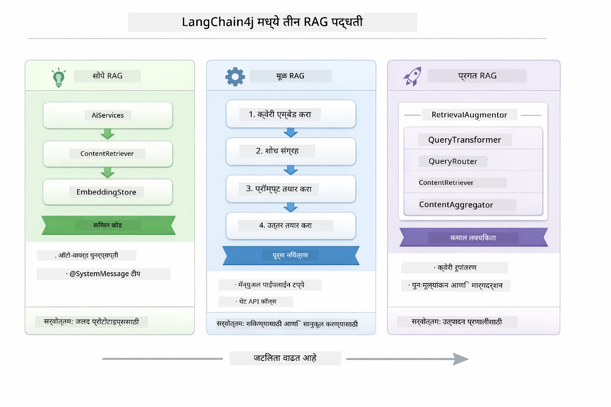
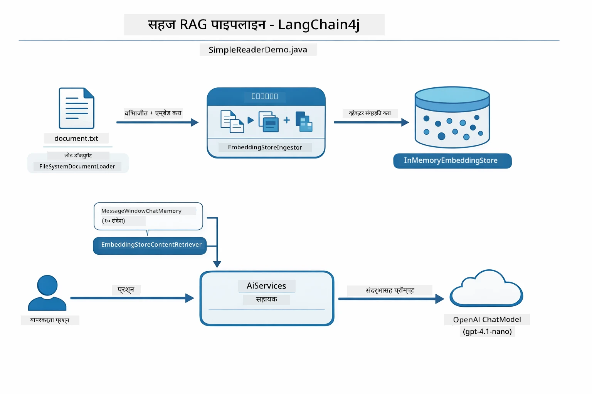
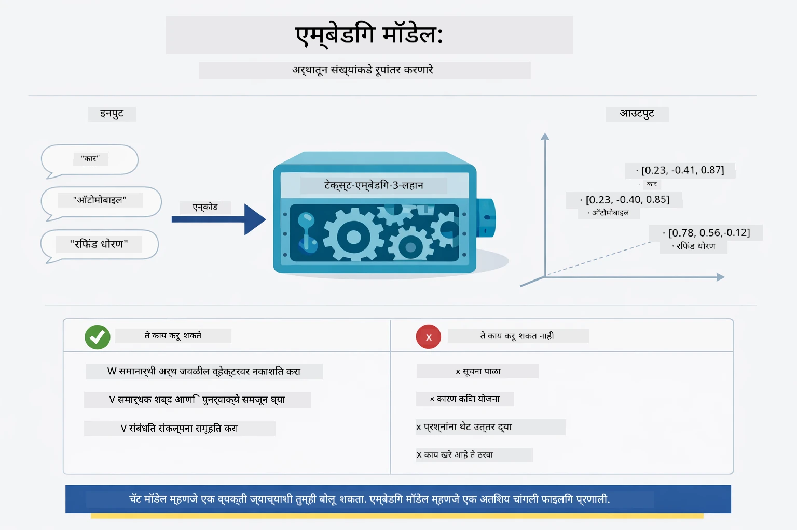
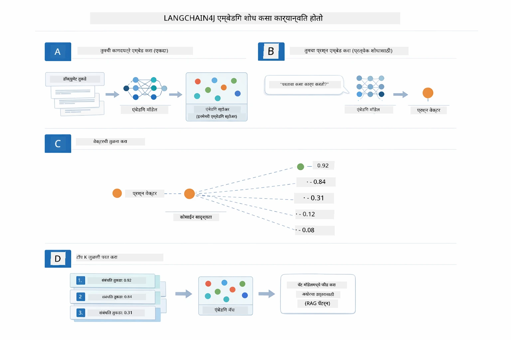
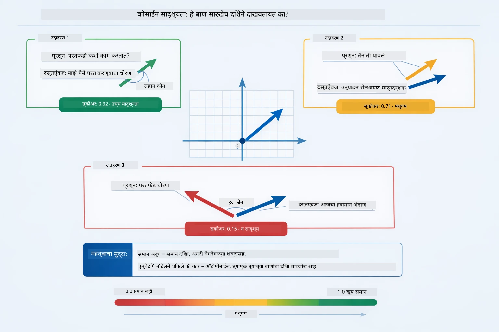
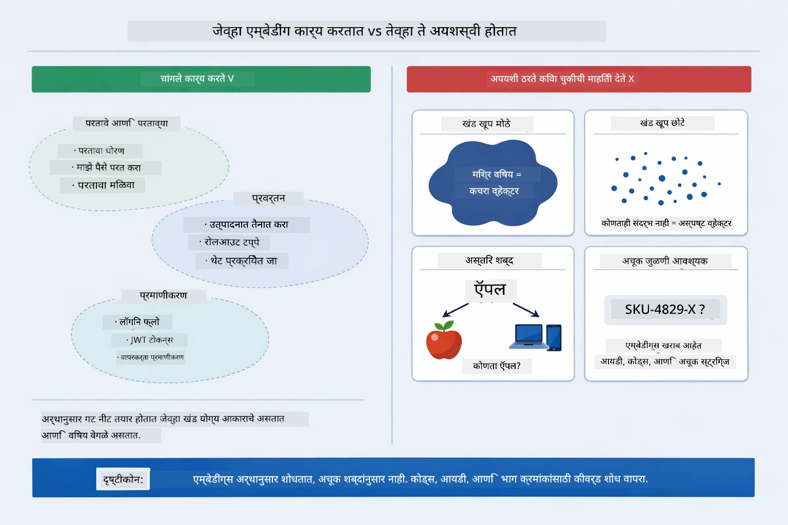

# Module 03: RAG (रिट्रीवल-ऑगमेंटेड जनरेशन)

## Table of Contents

- [व्हिडिओ वॉकथ्रू](../../../03-rag)
- [तुम्ही काय शिकाल](../../../03-rag)
- [पूर्वआवश्यकता](../../../03-rag)
- [RAG समजून घेणे](../../../03-rag)
  - [हा ट्युटोरियल कोणता RAG दृष्टिकोन वापरतो?](../../../03-rag)
- [हे कसे कार्य करते](../../../03-rag)
  - [डॉक्युमेंट प्रोसेसिंग](../../../03-rag)
  - [एंबेडिंग तयार करणे](../../../03-rag)
  - [समानार्थी शोध](../../../03-rag)
  - [उत्तर निर्माण](../../../03-rag)
- [अॅप्लिकेशन चालवा](../../../03-rag)
- [अॅप्लिकेशन वापरणे](../../../03-rag)
  - [डॉक्युमेंट अपलोड करा](../../../03-rag)
  - [प्रश्न विचारा](../../../03-rag)
  - [स्रोत संदर्भ तपासा](../../../03-rag)
  - [प्रश्नांसह प्रयोग करा](../../../03-rag)
- [मुख्य संकल्पना](../../../03-rag)
  - [चंकिंग धोरण](../../../03-rag)
  - [समानता गुण](../../../03-rag)
  - [इन-मेमरी स्टोरेज](../../../03-rag)
  - [कॉन्टेक्स्ट विंडो व्यवस्थापन](../../../03-rag)
- [RAG कधी महत्वाचा आहे](../../../03-rag)
- [पुढील पावले](../../../03-rag)

## व्हिडिओ वॉकथ्रू

हा थेट सत्र पहा जे तुम्हाला या मोड्यूलसह सुरू करण्याचे मार्गदर्शन करते: [RAG with LangChain4j - Live Session](https://www.youtube.com/watch?v=_olq75ZH_eY)

## तुम्ही काय शिकाल

मागील मोड्यूलमध्ये, तुम्ही AI सोबत संवाद कसे साधायचे आणि तुमचे प्रॉम्प्ट प्रभावीपणे कसे रचना करायची हे शिकलात. पण एक मूलभूत मर्यादा आहे: भाषा मॉडेल्सना फक्त त्यांच्या प्रशिक्षणादरम्यान शिकलेले माहित असते. ते तुमच्या कंपनीच्या धोरणांबद्दल, तुमच्या प्रोजेक्ट डॉक्युमेंटेशनबद्दल, किंवा त्यांनी ज्यावर प्रशिक्षण घेतले नाही अशा कोणत्याही माहितीसाठी प्रश्नांची उत्तरे देऊ शकत नाहीत.

RAG (रिट्रीवल-ऑगमेंटेड जनरेशन) ही समस्या सोडवते. मॉडेलला तुमची माहिती शिकवण्याचा प्रयत्न करण्यापेक्षा (जे महागडे आणि अव्यवहार्य आहे), तुम्ही त्याला तुमच्या कागदपत्रांत शोध घेण्याची क्षमता देता. जेव्हा कोणी प्रश्न विचारतो, तेव्हा प्रणाली संबंधित माहिती शोधते आणि ते प्रॉम्प्टमध्ये समाविष्ट करते. नंतर मॉडेल त्या मिळालेल्या संदर्भावर आधारित उत्तर देते.

RAG ला मॉडेलला संदर्भ ग्रंथालय देण्याच्या सारखे समजा. जेव्हा तुम्ही प्रश्न विचारता, प्रणाली:

1. **वापरकर्ता क्वेरी** - तुम्ही प्रश्न विचारता
2. **एंबेडिंग** - तुमचा प्रश्न व्हेक्टरमध्ये रूपांतरित करते
3. **व्हेक्टर शोध** - समान दस्तऐवज चंक शोधते
4. **संदर्भ संकलन** - संबंधित चंक प्रॉम्प्टमध्ये समाविष्ट करते
5. **प्रतिक्रिया** - LLM संदर्भावर आधारित उत्तर निर्माण करते

हे मॉडेलच्या प्रतिसादांना तुमच्या मूळ डेटावर आधारभूत करते, त्याच्या प्रशिक्षणाच्या ज्ञानावर अवलंबून राहण्याऐवजी किंवा उत्तरं बनवण्याऐवजी.

## पूर्वआवश्यकता

- पूर्ण झालेला [Module 00 - Quick Start](../00-quick-start/README.md) (वरील Easy RAG उदाहरणासाठी)
- पूर्ण झालेला [Module 01 - Introduction](../01-introduction/README.md) (Azure OpenAI संसाधने तैनात केलेली, ज्यात `text-embedding-3-small` एंबेडिंग मॉडेल समाविष्ट आहे)
- `.env` फाइल रूट डायरेक्टरीमध्ये Azure क्रेडेन्शियलसह (Module 01 मध्ये `azd up` ने तयार केली)

> **नोट:** तुम्ही Module 01 पूर्ण केला नसेल तर तिथल्या तैनाती निर्देशांचे अनुसरण करा. `azd up` कमांड GPT चॅट मॉडेल आणि या मोड्यूलसाठी वापरल्या जाणाऱ्या एंबेडिंग मॉडेल दोन्ही तैनात करते.

## RAG समजून घेणे

खालील आकृती मुख्य संकल्पना दर्शवते: मॉडेलच्या प्रशिक्षण डेटावर फक्त अवलंबून न राहता, RAG त्याला प्रत्येक उत्तर निर्माण करण्यापूर्वी तुमच्या दस्तऐवजांची संदर्भ ग्रंथालय देते.


*ही आकृती मानक LLM (जे प्रशिक्षण डेटा पासून अंदाज लावते) आणि RAG-उन्नत LLM (जे पहिले तुमचे दस्तऐवज पहाते) यामधील फरक दर्शवते.*

येथे संपूर्ण प्रक्रियेत भाग कसा जोडलेला आहे ते दाखविले आहे. वापरकर्त्याचा प्रश्न चार टप्प्यांतून जातो — एंबेडिंग, व्हेक्टर शोध, संदर्भ संकलन, आणि उत्तर निर्मिती — प्रत्येक आधीच्या टप्प्यांवर आधारित असतो:


*ही आकृती संपूर्ण RAG पाइपलाइन दाखवते — वापरकर्ता क्वेरी एंबेडिंग, व्हेक्टर शोध, संदर्भ संकलन, आणि उत्तर निर्मिती ह्या मार्गाने जाते.*

या मोड्यूलचे पुढील भाग प्रत्येक टप्पा तपशीलात पार पाडतो, ज्यामध्ये तुम्ही कोड चालवू व बदलू शकता.

### हा ट्युटोरियल कोणता RAG दृष्टिकोन वापरतो?

LangChain4j तीन प्रकारे RAG लागू करण्याचा मार्ग देते, प्रत्येक वेगळ्या स्तरावर. खालील आकृती त्यांची तुलना बाजूने बाजूने करते:



*ही आकृती LangChain4j मधील Easy, Native, आणि Advanced RAG दृष्टिकोनांची मुख्य घटक आणि वापरण्याच्या वेळा दाखवते.*

| दृष्टिकोन | काय करतो | ट्रेड-ऑफ़ |
|---|---|---|
| **Easy RAG** | `AiServices` आणि `ContentRetriever` द्वारे सर्व काही आपोआप जोडले जाते. तुम्ही एका इंटरफेसला निशाणांकित करता, रिट्रीवर जोडता, आणि LangChain4j एंबेडिंग, शोध आणि प्रॉम्प्ट संकलन ह्या मागे हाताळते. | सर्वात कमी कोड, पण प्रत्येक टप्पा काय घडत आहे ते दिसत नाही. |
| **Native RAG** | तुम्ही एंबेडिंग मॉडेल कॉल करता, स्टोअर शोधता, प्रॉम्प्ट तयार करता, आणि उत्तर स्वतः निर्माण करता — एकएक स्पष्ट टप्पा. | जास्त कोड, पण प्रत्येक टप्पा दिसतो आणि बदलता येतो. |
| **Advanced RAG** | `RetrievalAugmentor` फ्रेमवर्क वापरते प्लग-अॅबल क्वेरी ट्रान्सफॉर्मर, राऊटर, री-रँकर, आणि कंटेंट इंजेक्टरसह उत्पादन-ग्रेड पाइपलाइनसाठी. | जास्तीत जास्त लवचिकता, पण प्रचंड जास्त जटिलता. |

**हा ट्युटोरियल Native दृष्टिकोन वापरतो.** RAG पाइपलाइनचा प्रत्येक टप्पा — क्वेरी एंबेडिंग, व्हेक्टर स्टोअर शोध, संदर्भ संकलन, आणि उत्तर निर्मिती — [`RagService.java`](../../../03-rag/src/main/java/com/example/langchain4j/rag/service/RagService.java) मध्ये स्पष्टपणे लिहिला आहे. हे इरादा आहे: शिकण्यासाठी हे आवश्यक आहे की तुम्ही प्रत्येक टप्पा पाहाल आणि समजून घ्याल, कोड कमी करून देण्याऐवजी. एकदा तुम्हाला भाग कसे बसतात ते समजले की, तुम्ही पटकन प्रोटोटाइपसाठी Easy RAG कडे किंवा उत्पादनासाठी Advanced RAG कडे जाऊ शकता.

> **💡 Easy RAG आधी पाहिला आहे का?** [Quick Start मोड्यूल](../00-quick-start/README.md) मध्ये Document Q&A उदाहरण ([`SimpleReaderDemo.java`](../../../00-quick-start/src/main/java/com/example/langchain4j/quickstart/SimpleReaderDemo.java)) आहे जे Easy RAG दृष्टिकोन वापरते — LangChain4j एंबेडिंग, शोध आणि प्रॉम्प्ट संकलन आपोआप हाताळते. हा मोड्यूल पाइपलाइन उघडून प्रत्येक टप्पा तुम्हाला पाहण्यास आणि नियंत्रण ठेवण्यास मदत करतो.



*ही आकृती `SimpleReaderDemo.java` मधील Easy RAG पाइपलाइन दाखवते. याची तुलना या मोड्यूलमधील Native दृष्टिकोनाशी करा: Easy RAG `AiServices` आणि `ContentRetriever` मागे एंबेडिंग, रिट्रीवल, आणि प्रॉम्प्ट संकलन लपवते — तुम्ही एक दस्तऐवज लोड करतात, रिट्रीवर जोडतात आणि उत्तर मिळवतात. या मोड्यूलमधील Native दृष्टिकोन प्रत्येक टप्पा (एंबेड, शोध, संदर्भ संकलन, उत्तर तयार करणे) स्वतः कॉल करतो, ज्यामुळे पूर्ण नियंत्रण आणि दृश्यता मिळते.*

## हे कसे कार्य करते

या मोड्यूलमधील RAG पाइपलाइन चार टप्प्यांमध्ये विभागलेले आहे, जी वापरकर्ता दरवेळी प्रश्न विचारल्यावर सलग चालतात. प्रथम, अपलोड केलेला दस्तऐवज **पार्स आणि चंक करा** जे व्यवस्थापन करताना सोपे असतील. नंतर त्या चंकना **व्हेक्टर एंबेडिंगमध्ये** रूपांतरित करून संचयित केले जाते ज्यामुळे त्यांची गणिती तुलना करता येते. जेव्हा क्वेरी येते, प्रणाली संबंधित भाग शोधण्यासाठी **समानार्थी शोध** करते, आणि शेवटी त्या LLM साठी संदर्भ म्हणून पास करते **उत्तर निर्मितीसाठी**. खालील विभाग प्रत्येक टप्पा कोडसह व आकृतींसह समजावतो. प्रथम टप्पा पाहूया.

### डॉक्युमेंट प्रोसेसिंग

[DocumentService.java](../../../03-rag/src/main/java/com/example/langchain4j/rag/service/DocumentService.java)

जेव्हा तुम्ही दस्तऐवज अपलोड करता, तेव्हा प्रणाली त्याचे पार्सिंग (PDF किंवा प्लेन टेक्स्ट) करते, फाईल नावासारखी मेटाडेटा जोडते, आणि नंतर त्याला चंकमध्ये विभागते — छोटे तुकडे जे मॉडेलच्या संदर्भ विंडो मध्ये आरामात बसतात. हे चंक थोडेसे ओव्हरलॅप होतात जेणेकरून सीमारेषांवर संदर्भ गमावला जात नाही.

```java
// अपलोड केलेली फाईल पार्स करा आणि ती LangChain4j Document मध्ये वेढा
Document document = Document.from(content, metadata);

// ३० टोकन ओव्हरलॅपसह ३००-टोकनच्या तुकड्यांमध्ये विभागा
DocumentSplitter splitter = DocumentSplitters
    .recursive(300, 30);

List<TextSegment> segments = splitter.split(document);
```

खाली आकृतीत हे कसे कार्य करते ते दृश्यात्मकरीत्या दाखवले आहे. लक्षात घ्या की प्रत्येक चंक त्याच्या शेजाऱ्यांशी काही टोकन्स शेअर करत आहे — 30 टोकन ओव्हरलॅपमुळे कोणताही महत्त्वाचा संदर्भ गमावला जात नाही:


*ही आकृती 300-टोकन चंक 30-टोकन ओव्हरलॅपसह कशी विभागली जाते ते दाखवते, ज्यामुळे चंकच्या सीमांवर संदर्भ टिकतो.*

> **🤖 [GitHub Copilot](https://github.com/features/copilot) चॅटसह प्रयत्न करा:** [`DocumentService.java`](../../../03-rag/src/main/java/com/example/langchain4j/rag/service/DocumentService.java) उघडा आणि विचाराः
> - "LangChain4j कसे दस्तऐवज चंकमध्ये विभागते आणि ओव्हरलॅप का महत्त्वाचा आहे?"
> - "वेगवेगळ्या दस्तऐवज प्रकारांसाठी आदर्श चंक आकार काय आहे आणि का?"
> - "एकाधिक भाषा किंवा विशेष फॉरमॅटिंग असलेल्या दस्तऐवजांसोबत कसे हाताळावे?"

### एंबेडिंग तयार करणे

[LangChainRagConfig.java](../../../03-rag/src/main/java/com/example/langchain4j/rag/config/LangChainRagConfig.java)

प्रत्येक चंकला एक सांख्यिक प्रतिनिधित्वात रूपांतरित केले जाते ज्याला एंबेडिंग म्हणतात — मूलतः अर्थ-ते-संख्यांमध्ये रूपांतर करणारा. एंबेडिंग मॉडेल चॅट मॉडेलसारखे "बुद्धिमान" नाही; ते निर्देशांचे पालन करू शकत नाही, कारण समजू शकत नाही किंवा प्रश्नांची उत्तरे देऊ शकत नाही. ते फक्त मजकूराला गणिती जागेत रूपांतरित करते जिथे समान अर्थ जवळजवळ येतात — "कार" जवळ "ऑटोमॉबाइल," "रिफंड धोरण" जवळ "पैसे परत करा." चॅट मॉडेल हा ज्याच्याशी तुम्ही बोलू शकता अशा व्यक्तीसारखा आहे; एंबेडिंग मॉडेल एक अचूक वर्गीकरण प्रणाली आहे.



*ही आकृती दाखवते की एंबेडिंग मॉडेल मजकूराला सांख्यिक व्हेक्टरमध्ये कसे रूपांतरित करते, ज्यात समान अर्थ, जसे "कार" आणि "ऑटोमॉबाइल," एकमेकांसाठी जवळ येतात.*

```java
@Bean
public EmbeddingModel embeddingModel() {
    return OpenAiOfficialEmbeddingModel.builder()
        .baseUrl(azureOpenAiEndpoint)
        .apiKey(azureOpenAiKey)
        .modelName(azureEmbeddingDeploymentName)
        .build();
}

EmbeddingStore<TextSegment> embeddingStore = 
    new InMemoryEmbeddingStore<>();
```

खालील वर्ग आकृती RAG पाइपलाइनमधील दोन स्वतंत्र प्रवाह आणि LangChain4j वर्ग जे त्यांना अंमलात आणतात ते दाखवते. **इंजेशन प्रवाह** (अपलोड वेळी एकदाच चालते) दस्तऐवज विभागते, चंक एंबेड करते, आणि `.addAll()` द्वारे संचयित करते. **क्वेरी प्रवाह** (प्रत्येक वेळेस वापरकर्ता प्रश्न विचारतो तेव्हा चालते) प्रश्न एंबेड करते, `.search()` द्वारे स्टोअर शोधते, आणि जुळणाऱ्या संदर्भाला चॅट मॉडेलला देते. दोन्ही प्रवाह सामायिक `EmbeddingStore<TextSegment>` इंटरफेसला भेटतात:


*ही आकृती दाखवते की RAG पाइपलाइनमध्ये इंजेशन आणि क्वेरी हे दोन प्रवाह EmbeddingStore द्वारे कसे जोडलेले आहेत.*

एकदा एंबेडिंग संचयित केल्यावर, समान विषयांची सामग्री नैसर्गिकरित्या व्हेक्टर जागेत एकत्र जमते. खालील दृश्य दर्शवते की संबंधित विषयांसंबंधित दस्तऐवज कसे जवळच्या बिंदूंमध्ये जमतात, ज्यामुळे समानार्थी शोध शक्य होतो:


*ही दृश्य संकल्पना दर्शवते की संबंधित दस्तऐवज 3D व्हेक्टर स्पेसमध्ये कसे एकत्र जमतात, ज्यात तांत्रिक दस्तऐवज, व्यवसाय नियम आणि सतत विचारले जाणारे प्रश्न वेगळ्या गटात येतात.*

जेव्हा वापरकर्ता शोध करतो, प्रणाली चार टप्पे पार पाडते: एकदाच दस्तऐवज एंबेड करणे, प्रत्येक शोधाच्या वेळी क्वेरी एंबेड करणे, क्वेरी व्हेक्टरस सर्व संचयित व्हेक्टरसहित कोसाइन समानतेद्वारे तुलना करणे, आणि टॉप-K उच्च गुणांकित चंक परत करणे. खालील आकृती प्रत्येक टप्पा व LangChain4j वर्ग दाखवते:



*ही आकृती चार टप्प्यांच्या एंबेडिंग शोध प्रक्रियेचे वर्णन करते: दस्तऐवज एंबेड करणे, क्वेरी एंबेड करणे, कोसाइन समानतेने व्हेक्टर तुलना करणे, आणि टॉप-K निकाल परत करणे.*

### समानार्थी शोध

[RagService.java](../../../03-rag/src/main/java/com/example/langchain4j/rag/service/RagService.java)

जेव्हा तुम्ही प्रश्न विचारता, तुमचा प्रश्न सुद्धा एंबेड केला जातो. प्रणाली तुमच्या प्रश्नाच्या एंबेडिंगची तुलना सर्व दस्तऐवज चंकच्या एंबेडिंगसह करते. ती सर्वांत समान अर्थ असलेले चंक शोधते - फक्त समान कीवर्ड नाही, परंतु खरी समानार्थी समानता.

```java
Embedding queryEmbedding = embeddingModel.embed(question).content();

EmbeddingSearchRequest searchRequest = EmbeddingSearchRequest.builder()
    .queryEmbedding(queryEmbedding)
    .maxResults(5)
    .minScore(0.5)
    .build();

EmbeddingSearchResult<TextSegment> searchResult = embeddingStore.search(searchRequest);
List<EmbeddingMatch<TextSegment>> matches = searchResult.matches();

for (EmbeddingMatch<TextSegment> match : matches) {
    String relevantText = match.embedded().text();
    double score = match.score();
}
```

खालील आकृती समानार्थी शोध आणि पारंपरिक कीवर्ड शोध यांची तुलना करते. "vehicle" साठी कीवर्ड शोध "cars and trucks" बद्दल चंक सोडून देतो, पण समानार्थी शोध समजतो की त्यांचा अर्थ सारखा आहे आणि ते उच्च गुणांक मिळवलेले म्हणून परत करतो:


*ही आकृती कीवर्ड-आधारित शोध आणि समानार्थी शोधची तुलना करते, दाखवितो की समानार्थी शोध संकल्पनात्मकदृष्ट्या संबंधित सामग्री परत करतो जरी अचूक कीवर्ड वेगळे असतील.*

या प्रक्रियेमध्ये समानता मोजण्यासाठी कोसाइन समानता वापरली जाते — याचा अर्थ "हे दोन बाण एकाच दिशेने निर्देश करत आहेत का?" दोन चंक अगदी वेगळे शब्द वापरू शकतात, पण जर त्यांचा अर्थ सारखा असेल तर त्यांचे व्हेक्टर एकाच दिशेने जातील आणि स्कोअर 1.0 च्या जवळ असेल:



*ही आकृती कोसाइन समानता दर्शवते, ज्यात एंबेडिंग व्हेक्टरमधील कोन दर्शवला आहे — अधिक सुसंगत व्हेक्टर 1.0 च्या जवळ स्कोअर करतात, ज्याचा अर्थ अधिक समानार्थीता.*
> **🤖 [GitHub Copilot](https://github.com/features/copilot) चॅटसह प्रयत्न करा:** [`RagService.java`](../../../03-rag/src/main/java/com/example/langchain4j/rag/service/RagService.java) उघडा आणि विचाराः
> - "एम्बेडिंगसह सादृश्यता शोध कशी कार्य करते आणि स्कोअर काय ठरवते?"
> - "मला कोणती सादृश्यता थ्रेशोल्ड वापरायची आणि त्याचा निकालांवर कसा परिणाम होतो?"
> - "जेथे संबंधित दस्तऐवज सापडत नाहीत अशा प्रकरणांमध्ये मी कसा हाताळणी करतो?"

### उत्तर निर्मिती

[RagService.java](../../../03-rag/src/main/java/com/example/langchain4j/rag/service/RagService.java)

सर्वात संबंधित भाग एका संरचित प्रॉम्प्टमध्ये एकत्र केले जातात ज्यात स्पष्ट सूचना, मिळवलेला संदर्भ, आणि वापरकर्त्याचा प्रश्न असतो. मॉडेल त्या विशिष्ट भागांना वाचते आणि त्या माहितीनुसार उत्तर देते — ते फक्त समोर असलेली माहिती वापरू शकते, ज्यामुळे भ्रम निर्माण होण्यापासून टाळले जाते.

```java
String context = matches.stream()
    .map(match -> match.embedded().text())
    .collect(Collectors.joining("\n\n"));

String prompt = String.format("""
    Answer the question based on the following context.
    If the answer cannot be found in the context, say so.

    Context:
    %s

    Question: %s

    Answer:""", context, request.question());

String answer = chatModel.chat(prompt);
```

खालील आकृती या एकत्रिकरणामध्ये काम करताना दाखवते — शोध टप्प्यातील उच्चतम स्कोअर करणारे भाग प्रॉम्प्ट टेम्पलेटमध्ये समाविष्ट केले जातात, आणि `OpenAiOfficialChatModel` भूमित उत्तर तयार करते:


*ही आकृती दर्शवते की कसे उच्च स्कोअर करणारे भाग संरचित प्रॉम्प्टमध्ये एकत्र केले जातात, ज्यामुळे मॉडेल तुमच्या डेटावरून भूमित उत्तर तयार करू शकते.*

## अॅप्लिकेशन चालवा

**अंमलबजावणीची पडताळणी करा:**

रूट डिरेक्टरीमध्ये `.env` फाइल आहे याची खात्री करा ज्यात Azure क्रेडेन्शियल्स असाव्यात (Module 01 दरम्यान तयार केलेले):

**Bash:**
```bash
cat ../.env  # AZURE_OPENAI_ENDPOINT, API_KEY, DEPLOYMENT दर्शवावे लागेल
```

**PowerShell:**
```powershell
Get-Content ..\.env  # AZURE_OPENAI_ENDPOINT, API_KEY, DEPLOYMENT दाखवले पाहिजे
```

**अॅप्लिकेशन सुरू करा:**

> **टीप:** जर तुम्ही आधीच Module 01 मधील `./start-all.sh` वापरून सर्व अॅप्लिकेशन्स सुरू केले असतील, तर हा मॉड्यूल आधीच पोर्ट 8081 वर चालू आहे. तुम्ही खालील सुरू करण्याच्या आज्ञा टाळून थेट http://localhost:8081 वर जाऊ शकता.

**पर्याय 1: Spring Boot डॅशबोर्ड वापरून (VS Code वापरकर्त्यांसाठी शिफारस केलेले)**

डेव्ह कंटेनरमध्ये Spring Boot Dashboard विस्तार समाविष्ट आहे, जो सर्व Spring Boot अॅप्लिकेशन्स व्यवस्थापित करण्यासाठी दृष्य इंटरफेस प्रदान करतो. तुम्हाला हे VS Code च्या डाव्या बाजूला Activity Bar मध्ये सापडेल (Spring Boot चिन्ह पहा).

Spring Boot Dashboard मधून, तुम्ही:
- कार्यक्षेत्रातील सर्व उपलब्ध Spring Boot अॅप्लिकेशन्स पाहू शकता
- एका क्लिकने अॅप्लिकेशन्स सुरू/थांबवू शकता
- अॅप्लिकेशन लॉग्स वास्तविक वेळेत पाहू शकता
- अॅप्लिकेशन स्थितीचे निरीक्षण करू शकता

"rag" जवळील प्ले बटणावर क्लिक करा हा मॉड्यूल सुरू करण्यासाठी, किंवा सर्व मॉड्यूल एकाच वेळी सुरू करा.


*हा स्क्रीनशॉट VS Code मधील Spring Boot डॅशबोर्ड दर्शवतो, जिथे तुम्ही अॅप्लिकेशन्स दृश्यमानपणे सुरू, थांबवू आणि निरीक्षण करू शकता.*

**पर्याय 2: शेल स्क्रिप्ट्स वापरून**

सर्व वेब अॅप्लिकेशन्स (मॉड्यूल 01-04) सुरू करा:

**Bash:**
```bash
cd ..  # मूळ निर्देशिका मधून
./start-all.sh
```

**PowerShell:**
```powershell
cd ..  # रूट निर्देशिकेपासून
.\start-all.ps1
```

किंवा केवळ हा मॉड्यूल सुरू करा:

**Bash:**
```bash
cd 03-rag
./start.sh
```

**PowerShell:**
```powershell
cd 03-rag
.\start.ps1
```

दोन्ही स्क्रिप्ट्स रूट `.env` फाइलमधून वातावरणातील बदल आपोआप लोड करतात आणि जर JAR अस्तित्वात नसल्यास ती तयार करतील.

> **टीप:** तुम्हाला सर्व मॉड्यूल्स मॅन्युअली तयार करायचे असल्यास:
>
> **Bash:**
> ```bash
> cd ..  # Go to root directory
> mvn clean package -DskipTests
> ```
>
> **PowerShell:**
> ```powershell
> cd ..  # Go to root directory
> mvn clean package -DskipTests
> ```

http://localhost:8081 हे तुमच्या ब्राउझरमध्ये उघडा.

**थांबवण्यासाठी:**

**Bash:**
```bash
./stop.sh  # हा फक्त मॉड्यूल
# किंवा
cd .. && ./stop-all.sh  # सर्व मॉड्यूल्स
```

**PowerShell:**
```powershell
.\stop.ps1  # फक्त हा मॉड्यूल
# किंवा
cd ..; .\stop-all.ps1  # सर्व मॉड्यूल्स
```

## अॅप्लिकेशन वापरणे

अॅप्लिकेशन दस्तऐवज अपलोड आणि प्रश्न विचारण्यासाठी वेब इंटरफेस देते.

<a href="images/rag-homepage.png"></a>

*हा स्क्रीनशॉट RAG अॅप्लिकेशन इंटरफेस दाखवतो जिथे तुम्ही दस्तऐवज अपलोड करता आणि प्रश्न विचारता.*

### दस्तऐवज अपलोड करा

दस्तऐवज अपलोड करण्यापासून सुरू करा - TXT फाईल्स चाचणीसाठी सर्वात उपयुक्त आहेत. या फोल्डरमध्ये `sample-document.txt` दिलेला आहे, ज्यात LangChain4j वैशिष्ट्ये, RAG अमलबजावणी आणि सर्वोत्तम पद्धतींची माहिती आहे - प्रणालीची चाचणी करण्यासाठी उत्तम.

सिस्टम तुमचा दस्तऐवज प्रक्रिया करते, त्याचे भागांमध्ये विभाग करते, आणि प्रत्येक भागासाठी एंबेडिंग तयार करते. हे ऑटोमॅटिक होतो जेव्हा तुम्ही अपलोड करता.

### प्रश्न विचारा

आता दस्तऐवजाच्या विषयावर विशिष्ट प्रश्न विचारा. काही तथ्यात्मक जे स्पष्टपणे दस्तऐवजात दिलेले आहे ते विचारा. प्रणाली संबंधित भाग शोधते, त्यांना प्रॉम्प्टमध्ये समाविष्ट करते, आणि उत्तर तयार करते.

### स्रोत संदर्भ तपासा

प्रत्येक उत्तरामध्ये संदर्भासह सादृश्यता स्कोअर दाखवले जातात. हे स्कोअर (0 ते 1) दर्शवतात की तुमच्या प्रश्नाशी संबंधित प्रत्येक भाग कितपत सुसंगत होता. जास्त स्कोअर म्हणजे चांगला सुसंगतपणा. त्यामुळे तुम्ही उत्तराचा स्रोतासोबत पडताळणी करू शकता.

<a href="images/rag-query-results.png"></a>

*हा स्क्रीनशॉट क्वेरी निकाल दर्शवतो ज्यात जनरेट केलेले उत्तर, स्रोत संदर्भ आणि प्रत्येक प्राप्त भागासाठी सादृश्यता स्कोअर आहेत.*

### प्रश्नांसह प्रयोग करा

वेगवेगळ्या प्रकारचे प्रश्न तपासा:
- विशिष्ट तथ्ये: "मुख्य विषय काय आहे?"
- तुलना: "X आणि Y मध्ये काय फरक आहे?"
- सारांश: "Z बद्दल मुख्य मुद्दे सारांशित करा"

तुमच्या प्रश्नाच्या प्रमाणित होण्यावर आधारित सादृश्यता स्कोअर कसे बदलतात ते पाहा.

## मुख्य संकल्पना

### भागांमध्ये विभागण्याची रणनीती

दस्तऐवज 300-टोकनच्या विभागांमध्ये विभागले जातात ज्यात 30 टोकन्सचा ओव्हरलॅप असतो. हा संतुलन प्रत्येक भागाला पर्याप्त संदर्भ देते आणि एकाच वेळी अनेक भाग प्रॉम्प्टमध्ये समाविष्ट करणे शक्य करते.

### सादृश्यता स्कोअर

प्रत्येक प्राप्त भागास सादृश्यता स्कोअर (0 ते 1 दरम्यान) दिला जातो, जो दर्शवतो की तो वापरकर्त्याच्या प्रश्नाशी कितपत जुळतो. खालील आकृती स्कोअर श्रेणी आणि प्रणाली त्यांचा वापर कशी करते हे दर्शवते:


*ही आकृती 0 ते 1 दरम्यान स्कोअर श्रेणी दाखवते, ज्यात किमान थ्रेशोल्ड 0.5 आहे जो अप्रासंगिक भाग फिल्टर करतो.*

स्कोअर 0 ते 1 दरम्यान असतात:
- 0.7-1.0: अत्यंत संबंधित, नेमका जुळता
- 0.5-0.7: संबंधित, चांगला संदर्भ
- 0.5 खाली: फिल्टर केलेले, फारच वेगळे

सिस्टम केवळ किमान थ्रेशोल्डपेक्षा जास्त स्कोअर असलेले भाग प्राप्त करते ज्यामुळे गुणवत्ता सुनिश्चित होते.

एम्बेडिंग्स चांगल्या प्रकारे अर्थाने विभक्त होतात, पण त्यांना कमजोरी आहेत. खालील आकृती सामान्य अपयश प्रकार दाखवते — फार मोठे भाग मुरटलेले व्हेक्टर तयार करतात, फार लहान भागांना संदर्भ नाही, अस्पष्ट शब्द अनेक क्लस्टर्सकडे निर्देश करतात, आणि नेमका जुळतात असा शोध (IDs, भाग क्रमांक) एमबेडिंग्ससह काम करत नाही:



*ही आकृती सामान्य एम्बेडिंग अपयश प्रकार दर्शवते: फार मोठे भाग, फार लहान भाग, अस्पष्ट संज्ञा अनेक क्लस्टर्सकडे इंगित करतात, आणि नेमका जुळणारे शोध जसे की IDs.*

### इन-मेमरी स्टोरेज

हा मॉड्यूल सोप्यासाठी इन-मेमरी स्टोरेज वापरतो. तुम्ही अॅप्लिकेशन पुन्हा सुरू केल्यास अपलोड केलेले दस्तऐवज गमावले जातात. उत्पादन प्रणाली Qdrant किंवा Azure AI Search सारख्या स्थिर व्हेक्टर डेटाबेसचा वापर करतात.

### संदर्भ विंडो व्यवस्थापन

प्रत्येक मॉडेलला जास्तीत जास्त संदर्भ विंडो मर्यादा असते. तुम्ही मोठ्या दस्तऐवजातून प्रत्येक भाग समाविष्ट करू शकत नाही. प्रणाली मर्यादेमध्ये राहून अचूक उत्तरे देण्यासाठी सर्वात संबंधित N भाग (डिफॉल्ट 5) प्राप्त करते.

## कधी RAG महत्त्वाचा आहे

RAG नेहमी योग्य पद्धत नाही. खालील निर्णय मार्गदर्शक तुम्हाला ठरवायला मदत करतो की RAG मूल्य कधी वाढवतो आणि सोप्या पद्धती - जसे की प्रॉम्प्टमध्ये सामग्री समाविष्ट करणे किंवा मॉडेलच्या अंतर्निर्मित ज्ञानावर अवलंबून राहणे - कधी पुरेसे असते:


*ही आकृती दाखवते की कधी RAG मूल्य वाढवतो आणि कधी सोप्या पद्धती पुरेशा असतात.*

**RAG वापरा जेव्हा:**
- खासगी दस्तऐवजांविषयी प्रश्नांची उत्तरे द्यायची असतील
- माहिती वारंवार बदलते (धोरणे, किंमती, तपशील)
- अचूकतेसाठी स्रोताचे संदर्भ आवश्यक असतील
- सामग्री एकाच प्रॉम्प्टमध्ये बसणार नाही
- तुम्हाला सत्यापित, भूमित उत्तरे हवी असतील

**RAG वापरू नका जेव्हा:**
- प्रश्न मॉडेलला आधीपासून ज्ञात सामान्य ज्ञानाविषयी असतील
- वास्तविक वेळेतील डेटा आवश्यक असेल (RAG ह्या अपलोड केलेल्या दस्तऐवजांवर कार्य करते)
- सामग्री इतकी लहान असेल की थेट प्रॉम्प्टमध्ये समाविष्ट करता येईल

## पुढील पावले

**पुढील मॉड्यूल:** [04-tools - AI Agents with Tools](../04-tools/README.md)

---

**नेव्हिगेशन:** [← मागील: Module 02 - Prompt Engineering](../02-prompt-engineering/README.md) | [मुख्यपृष्ठावर परत](../README.md) | [पुढील: Module 04 - Tools →](../04-tools/README.md)

---

<!-- CO-OP TRANSLATOR DISCLAIMER START -->
**डिस्क्लेमर**:  
हा दस्तऐवज AI अनुवाद सेवा [Co-op Translator](https://github.com/Azure/co-op-translator) वापरून अनुवादित केला आहे. आम्ही अचूकतेसाठी प्रयत्नशील असलो तरी, कृपया लक्षात घ्या की स्वयंचलित अनुवादांमध्ये चुका किंवा असंगतता असू शकतात. मूळ दस्तऐवज त्याच्या मूळ भाषेत अधिकृत स्रोत मानला जावा. महत्त्वाची माहिती असल्यास व्यावसायिक मानवी अनुवादाची शिफारस केली जाते. या अनुवादाच्या वापरामुळे झालेल्या कोणत्याही गैरसमजांबाबत किंवा चुकीच्या अर्थ लावण्याबाबत आम्ही जबाबदार नाही.
<!-- CO-OP TRANSLATOR DISCLAIMER END -->