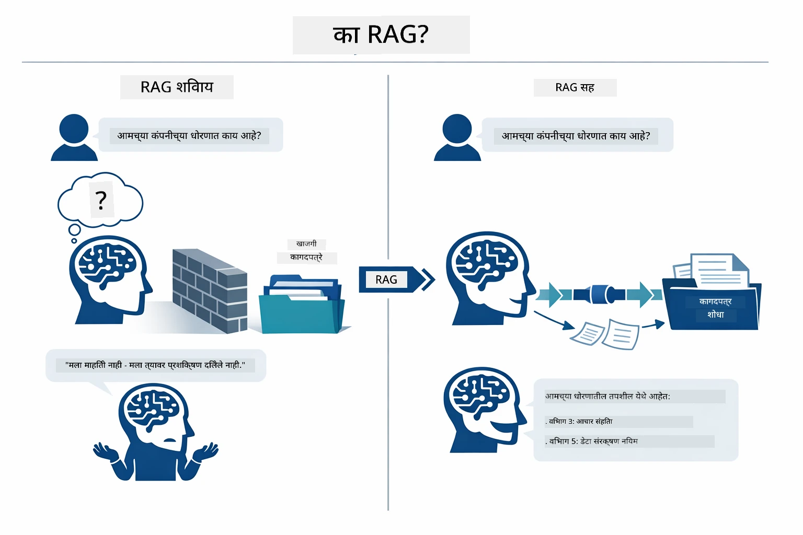
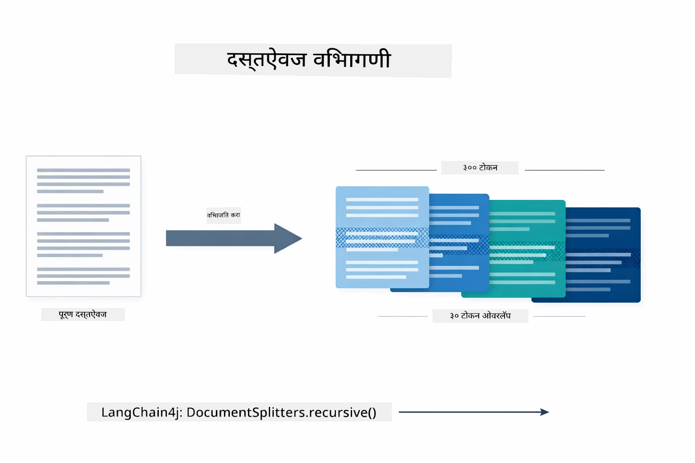
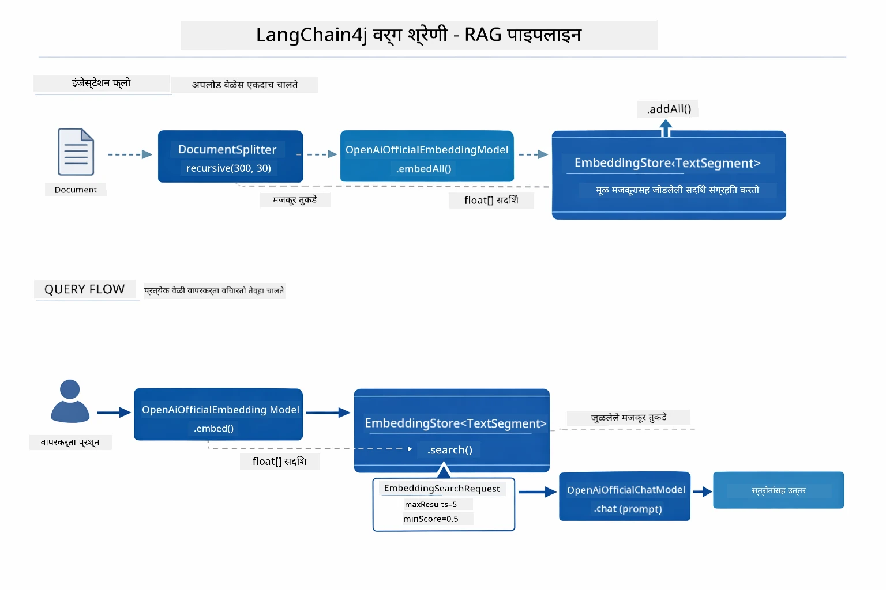
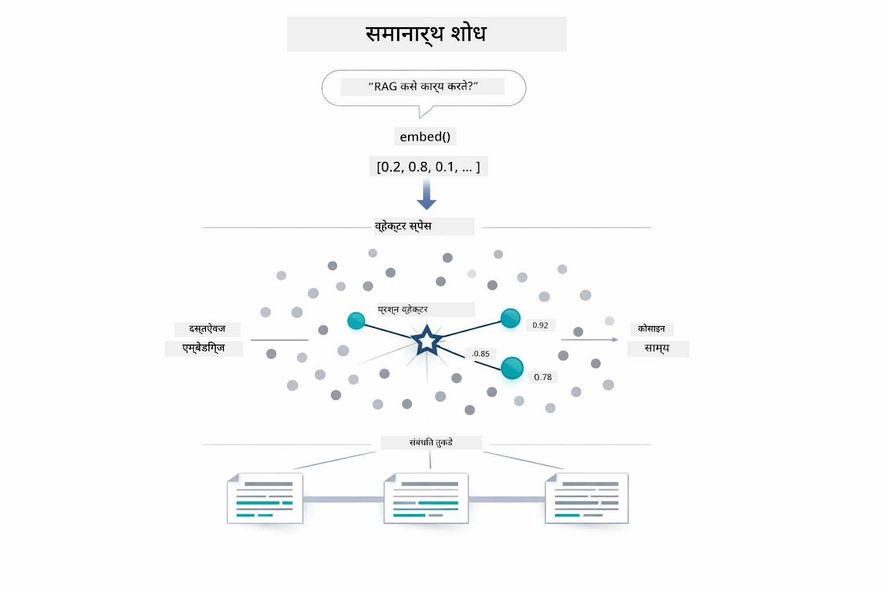
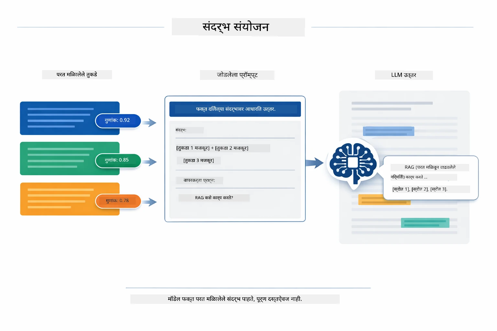
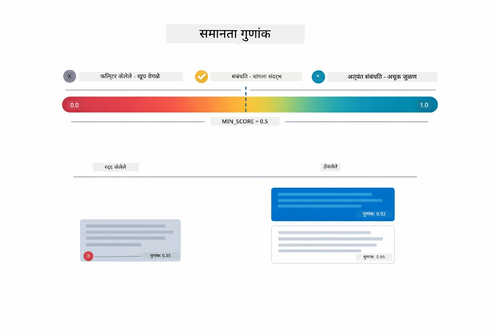
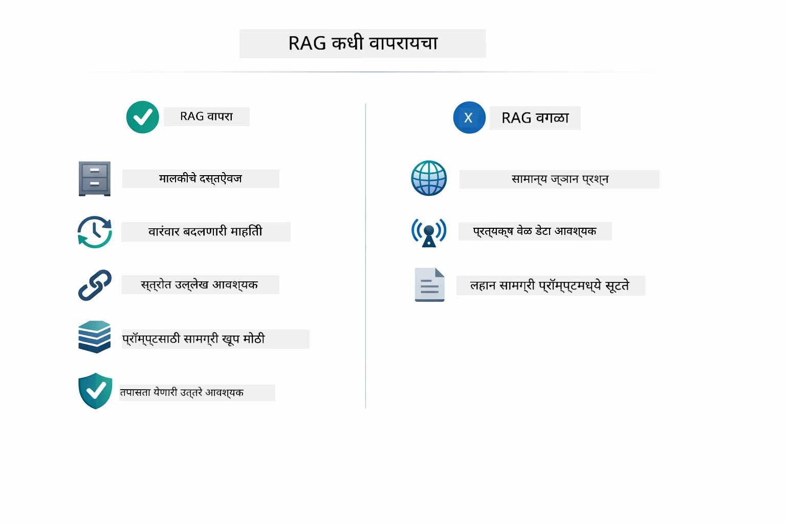

# मॉड्यूल 03: RAG (Retrieval-Augmented Generation)

## मजकुराची यादी

- [आपण काय शिकणार आहात](../../../03-rag)
- [RAG समजून घेणे](../../../03-rag)
- [पूर्वअट](../../../03-rag)
- [हे कसे कार्य करते](../../../03-rag)
  - [दस्तऐवज प्रक्रिया](../../../03-rag)
  - [एंबेडिंग तयार करणे](../../../03-rag)
  - [सामांस्यपूर्ण शोध](../../../03-rag)
  - [उत्तर निर्मिती](../../../03-rag)
- [अॅप्लिकेशन चालवा](../../../03-rag)
- [अॅप्लिकेशन वापरणे](../../../03-rag)
  - [दस्तऐवज अपलोड करा](../../../03-rag)
  - [प्रश्न विचारा](../../../03-rag)
  - [स्रोत संदर्भ तपासा](../../../03-rag)
  - [प्रश्नांसह प्रयोग करा](../../../03-rag)
- [महत्वाचे संकल्पना](../../../03-rag)
  - [चंकिंग स्ट्रॅटेजी](../../../03-rag)
  - [समानता गुणांकन](../../../03-rag)
  - [इन-मेमरी स्टोरेज](../../../03-rag)
  - [संदर्भ विंडो व्यवस्थापन](../../../03-rag)
- [RAG कधी महत्त्वाचा आहे](../../../03-rag)
- [पुढील पावले](../../../03-rag)

## आपण काय शिकणार आहात

मागील मॉड्यूलमध्ये, आपण AI सोबत संवाद कसा करायचा आणि आपले प्रॉम्प्ट प्रभावीपणे कसे रचना करायची हे शिकले. पण एक मूलभूत मर्यादा आहे: भाषा मॉडेल फक्त तेच जाणतात जे त्यांनी प्रशिक्षणादरम्यान शिकले आहे. ते आपल्या कंपनीच्या धोरणांबद्दल, आपल्या प्रकल्प दस्तऐवजाबद्दल किंवा त्यांच्या प्रशिक्षणात नसलेल्या कोणत्याही माहितीसंबंधी प्रश्नांची उत्तरे देऊ शकत नाहीत.

RAG (Retrieval-Augmented Generation) हा हा प्रश्न सुटवतो. मॉडेलला आपल्या माहिती शिकवण्याचा प्रयत्न करण्याऐवजी (जो महागडा आणि प्रत्यक्षात कठीण आहे), आपण त्याला आपल्या दस्तऐवजांमधून शोध घेण्याची क्षमता देता. जेव्हा कोणी प्रश्न विचारतो, तेव्हा प्रणाली संबंधित माहिती शोधते आणि ती प्रॉम्प्टमध्ये समाविष्ट करते. मॉडेल नंतर त्या प्राप्त केलेल्या संदर्भावर आधारित उत्तर देते.

RAG ला मॉडेलला संदर्भ ग्रंथालय देण्यासारखे समजा. जेव्हा आपण प्रश्न विचारता, प्रणाली:

1. **वापरकर्त्याचा प्रश्न** - आपण प्रश्न विचारता
2. **एंबेडिंग** - आपला प्रश्न एका व्हेक्टरमध्ये रूपांतरित होते
3. **व्हेक्टर शोध** - समान दस्तऐवज चंक शोधतो
4. **संदर्भ एकत्रीकरण** - संबंधित चंक प्रॉम्प्टमध्ये जोडतो
5. **प्रतिक्रिया** - LLM संदर्भावर आधारित उत्तर तयार करते

हे मॉडेलच्या उत्तरांना त्याच्या प्रशिक्षण ज्ञानावर अवलंबून न राहता आपल्या प्रत्यक्ष डेटावर आधारित बनवते.

## RAG समजून घेणे

खालील आकृती मुख्य संकल्पना दाखवते: केवळ मॉडेलच्या प्रशिक्षण डेटावर अवलंबून राहण्याऐवजी, RAG मॉडेलला प्रत्येक उत्तर तयार करण्यापूर्वी आपल्या दस्तऐवजांचे संदर्भ ग्रंथालय देते.



येथे तुकड्यांची सुरुवातीपासून शेवटपर्यंत कसे जोडली जातात हे दर्शवले आहे. वापरकर्त्याचा प्रश्न चार टप्प्यांतून वाहतो — एंबेडिंग, व्हेक्टर शोध, संदर्भ एकत्रीकरण, आणि उत्तर निर्मिती — जे प्रत्येक मागील टप्प्यावर आधारित असतात:


या मॉड्यूलचा उर्वरित भाग प्रत्येक टप्पा तपशीलवार समजावून सांगतो, ज्यामध्ये आपण कोड चालवू आणि सुधारणा करू शकता.

## पूर्वअट

- मॉड्यूल 01 पूर्ण केलेले (Azure OpenAI संसाधने तैनात केलेले)
- मूळ निर्देशिकेत `.env` फाइल ज्यात Azure प्रमाणपत्रे असतील (मॉड्यूल 01 मध्ये `azd up` ने तयार केलेले)

> **टिप:** जर आपण मॉड्यूल 01 पूर्ण केले नसेल, तर प्रथम तिथली तैनाती सूचना पूर्ण करा.

## हे कसे कार्य करते

### दस्तऐवज प्रक्रिया

[DocumentService.java](../../../03-rag/src/main/java/com/example/langchain4j/rag/service/DocumentService.java)

जेव्हा आपण दस्तऐवज अपलोड करता, प्रणाली तो पार्स करते (PDF किंवा प्लेन टेक्स्ट), फाइल नावासह मेटाडेटा जोडते, आणि नंतर तो चंकमध्ये विभागते — छोटे भाग जे मॉडेलच्या संदर्भ विंडोमध्ये आरामदायक बसतात. हे चंक थोडेसे ओव्हरलॅप करतात जेणेकरून मर्यादांवर संदर्भ गमावला जात नाही.

```java
// अपलोड केलेला फाईल पार्स करा आणि त्याला LangChain4j दस्तऐवजात गुंडाळा
Document document = Document.from(content, metadata);

// ३० टोकन ओळखीने ३०० टोकनच्या तुकड्यांमध्ये विभाजित करा
DocumentSplitter splitter = DocumentSplitters
    .recursive(300, 30);

List<TextSegment> segments = splitter.split(document);
```

खालील आकृती हे कार्य कसे होते ते दृश्यात्मकपणे दर्शवते. प्रत्येक चंक त्याच्या शेजारील टोकनसह थोडा भाग वाटून घेतो — ३० टोकनचा ओव्हरलॅप सुनिश्चित करतो की महत्त्वाचा संदर्भ गहाळ होणार नाही:



> **🤖 [GitHub Copilot](https://github.com/features/copilot) चॅटसह प्रयत्न करा:** [`DocumentService.java`](../../../03-rag/src/main/java/com/example/langchain4j/rag/service/DocumentService.java) उघडा आणि विचारा:
> - "LangChain4j दस्तऐवज कसे चंकमध्ये विभागतो आणि ओव्हरलॅप का महत्त्वाचा आहे?"
> - "वेगळ्या दस्तऐवज प्रकारांसाठी सर्वोत्तम चंक आकार काय आहे आणि का?"
> - "मी बहुभाषिक दस्तऐवज किंवा विशेष स्वरूपांसह दस्तऐवज कसे हाताळू?"

### एंबेडिंग तयार करणे

[LangChainRagConfig.java](../../../03-rag/src/main/java/com/example/langchain4j/rag/config/LangChainRagConfig.java)

प्रत्येक चंक एका संख्यात्मक प्रतिनिधित्वात रूपांतरित होतो ज्यास एंबेडिंग म्हणतात - मूळतः मजकूराचा अर्थ समजून घेणारे गणितीय फिंगरप्रिंट. समान मजकूर समान एंबेडिंग तयार करतो.

```java
@Bean
public EmbeddingModel embeddingModel() {
    return OpenAiOfficialEmbeddingModel.builder()
        .baseUrl(azureOpenAiEndpoint)
        .apiKey(azureOpenAiKey)
        .modelName(azureEmbeddingDeploymentName)
        .build();
}

EmbeddingStore<TextSegment> embeddingStore = 
    new InMemoryEmbeddingStore<>();
```

खालील वर्ग आकृती LangChain4j घटक कसे जोडलेले आहेत ते दर्शवते. `OpenAiOfficialEmbeddingModel` मजकूर व्हेक्टरमध्ये रूपांतरित करतो, `InMemoryEmbeddingStore` व्हेक्टर आणि त्यांचा मूळ `TextSegment` डेटा साठवतो, आणि `EmbeddingSearchRequest` पुनर्प्राप्ति पॅरामीटर्स कसे तपासतं ते नियंत्रित करते जसे `maxResults` आणि `minScore`:



एंबेडिंग साठवल्यानंतर, संबंधित विषयांवरील दस्तऐवज निसर्गाने वेक्टर स्पेसमध्ये एकत्र येतात. खालील दृश्य दर्शवते की संबंधित विषयांवरील दस्तऐवज जवळपास ठिकाणी जमा होतात, जे सामांस्यपूर्ण शोध शक्य करतात:


### सामांस्यपूर्ण शोध

[RagService.java](../../../03-rag/src/main/java/com/example/langchain4j/rag/service/RagService.java)

जेव्हा आपण प्रश्न विचारता, आपला प्रश्न देखील एंबेडिंगमध्ये रूपांतरित होतो. प्रणाली आपला प्रश्न एंबेडिंग सर्व दस्तऐवज चंकच्या एंबेडिंगसह तुलना करते. ती अशा चंक्स शोधते ज्यांचे अर्थ समान असतात - केवळ कीवर्ड जुळणे नाही, तर प्रत्यक्ष सामांस्यपूर्ण समानता.

```java
Embedding queryEmbedding = embeddingModel.embed(question).content();

EmbeddingSearchRequest searchRequest = EmbeddingSearchRequest.builder()
    .queryEmbedding(queryEmbedding)
    .maxResults(5)
    .minScore(0.5)
    .build();

EmbeddingSearchResult<TextSegment> searchResult = embeddingStore.search(searchRequest);
List<EmbeddingMatch<TextSegment>> matches = searchResult.matches();

for (EmbeddingMatch<TextSegment> match : matches) {
    String relevantText = match.embedded().text();
    double score = match.score();
}
```

खालील आकृती सामांस्यपूर्ण शोध आणि पारंपारिक कीवर्ड शोध यांच्यात फरक दाखवते. "vehicle" या कीवर्डसाठी पारंपारिक शोध "cars and trucks" संदर्भ असलेला चंक चुकवतो, पण सामांस्यपूर्ण शोध समजतो की त्याचा अर्थ सारखाच आहे आणि तो उच्च गुणांकासह परत करतो:



> **🤖 [GitHub Copilot](https://github.com/features/copilot) चॅटसह प्रयत्न करा:** [`RagService.java`](../../../03-rag/src/main/java/com/example/langchain4j/rag/service/RagService.java) उघडा आणि विचारा:
> - "एंबेडिंगसह सामांस्यपूर्ण शोध कसा काम करतो आणि गुणांकन काय ठरवतं?"
> - "समानता सिमा काय असावी आणि ती निकालांवर कशी परिणाम करते?"
> - "जेथे संबंधित दस्तऐवज सापडत नाहीत ते कसे हाताळावे?"

### उत्तर निर्मिती

[RagService.java](../../../03-rag/src/main/java/com/example/langchain4j/rag/service/RagService.java)

सर्वात संबंधित चंक एका रचनाबद्ध प्रॉम्प्टमध्ये एकत्र केले जातात ज्यात स्पष्ट सूचना, मिळवलेला संदर्भ आणि वापरकर्त्याचा प्रश्न असतो. मॉडेल ते विशिष्ट चंक वाचते आणि त्या माहितीच्या आधारे उत्तर देते — ते फक्त त्याच संदर्भावर आधारित असते, जे हॅल्युसिनेशन टाळते.

```java
String context = matches.stream()
    .map(match -> match.embedded().text())
    .collect(Collectors.joining("\n\n"));

String prompt = String.format("""
    Answer the question based on the following context.
    If the answer cannot be found in the context, say so.

    Context:
    %s

    Question: %s

    Answer:""", context, request.question());

String answer = chatModel.chat(prompt);
```

खालील आकृती यात क्रिया दाखवते — शोध टप्प्यातील शीर्ष गुणांकित चंक प्रॉम्प्ट टेम्प्लेटमध्ये इंजेक्ट केले जातात, आणि `OpenAiOfficialChatModel` आधारभूत उत्तर तयार करतो:



## अॅप्लिकेशन चालवा

**तैनातीची पुष्टी करा:**

मूळ निर्देशिकेत `.env` फाइल अस्तित्वात आहे आणि त्यात Azure प्रमाणपत्रे आहेत (मॉड्यूल 01 दरम्यान तयार केलेली):
```bash
cat ../.env  # AZURE_OPENAI_ENDPOINT, API_KEY, DEPLOYMENT दर्शवावे
```

**अॅप्लिकेशन सुरू करा:**

> **टिप:** जर आपण आधीच Module 01 मधील `./start-all.sh` वापरून सर्व अॅप्लिकेशन्स सुरू केले असतील, तर हा मॉड्यूल पोर्ट 8081 वर चालू आहे. खालील सुरू करण्याच्या आदेशांना वगळा आणि थेट http://localhost:8081 वर जा.

**पर्याय 1: स्प्रिंग बूट डॅशबोर्ड वापरणे (VS Code वापरकर्त्यांसाठी शिफारस केलेले)**

डेव्ह कंटेनरमध्ये स्प्रिंग बूट डॅशबोर्ड विस्तार समाविष्ट आहे, जो सर्व स्प्रिंग बूट अॅप्लिकेशन्सचे व्यवस्थापन करण्यासाठी दृश्यात्मक इंटरफेस प्रदान करतो. आपण ते VS Code च्या डावे बाजूच्या Activity Bar मध्ये (स्प्रिंग बूट आयकन शोधा) शोधू शकता.

स्प्रिंग बूट डॅशबोर्डमधून आपण:
- कार्यक्षेत्रातील सर्व स्प्रिंग बूट अॅप्लिकेशन्स पाहू शकता
- एक क्लिकने अॅप्लिकेशन्स सुरू/थांबवू शकता
- रिअल-टाइममध्ये अॅप्लिकेशन लॉग पाहू शकता
- अॅप्लिकेशन स्थिती मॉनिटर करू शकता

"rag" च्या पुढील प्ले बटणावर क्लिक करा किंवा एकाच वेळी सर्व मॉड्यूल सुरू करा.


**पर्याय 2: शेल स्क्रिप्ट वापरणे**

सर्व वेब अॅप्लिकेशन्स (मॉड्यूल 01-04) सुरू करा:

**Bash:**
```bash
cd ..  # मूळ निर्देशिकेतून
./start-all.sh
```

**PowerShell:**
```powershell
cd ..  # मुख्य फोल्डरमधून
.\start-all.ps1
```

किंवा फक्त हा मॉड्यूल सुरू करा:

**Bash:**
```bash
cd 03-rag
./start.sh
```

**PowerShell:**
```powershell
cd 03-rag
.\start.ps1
```

दोन्ही स्क्रिप्ट मूळ `.env` फाइलमधून पर्यावरणीय चल आपोआप लोड करतात आणि जर JAR अस्तित्वात नसतील तर तयार करतील.

> **टिप:** जर तुम्हाला सर्व मॉड्यूल मॅन्युअली तयार करायचे असतील तर पुढील आदेश वापरा:
>
> **Bash:**
> ```bash
> cd ..  # Go to root directory
> mvn clean package -DskipTests
> ```
>
> **PowerShell:**
> ```powershell
> cd ..  # Go to root directory
> mvn clean package -DskipTests
> ```

http://localhost:8081 आपल्या ब्राउझरमध्ये उघडा.

**थांबवण्यासाठी:**

**Bash:**
```bash
./stop.sh  # हे फक्त मॉड्यूल
# किंवा
cd .. && ./stop-all.sh  # सर्व मॉड्यूल्स
```

**PowerShell:**
```powershell
.\stop.ps1  # हा मॉड्यूल फक्त
# किंवा
cd ..; .\stop-all.ps1  # सर्व मॉड्यूल
```


## अॅप्लिकेशन वापरणे

अॅप्लिकेशन दस्तऐवज अपलोड आणि प्रश्न विचारण्यासाठी वेब इंटरफेस प्रदान करते.

<a href="images/rag-homepage.png"></a>

*RAG अॅप्लिकेशन इंटरफेस - दस्तऐवज अपलोड करा आणि प्रश्न विचारा*

### दस्तऐवज अपलोड करा

दस्तऐवज अपलोड करण्यापासून सुरू करा - चाचणीसाठी TXT फाइल्स सर्वोत्तम काम करतात. या निर्देशिकेमध्ये `sample-document.txt` उपलब्ध आहे ज्यामध्ये LangChain4j वैशिष्ट्ये, RAG अंमलबजावणी, आणि सर्वोत्तम पद्धती यांची माहिती आहे - प्रणालीची चाचणी करण्यासाठी परिपूर्ण.

प्रणाली आपला दस्तऐवज प्रक्रिया करते, तो चंकमध्ये विभाजित करते, आणि प्रत्येक चंकसाठी एंबेडिंग तयार करते. हे आपोआप होते जेव्हा आपण अपलोड करता.

### प्रश्न विचारा

आता दस्तऐवजाच्या सामग्रीबद्दल विशिष्ट प्रश्न विचारा. काही तथ्यात्मक विचार करा जे दस्तऐवजामध्ये स्पष्टपणे नमूद आहे. प्रणाली संबंधित चंक शोधते, त्यांना प्रॉम्प्टमध्ये समाविष्ट करते, आणि उत्तर तयार करते.

### स्रोत संदर्भ तपासा

प्रत्येक उत्तरामध्ये स्रोत संदर्भांसह समानता गुणांकन असते. हे गुणांकन (0 ते 1) दर्शवते की प्रश्नाशी प्रत्येक चंक कितपत संबंधित होता. उच्च गुणांकन म्हणजे चांगले जुळणारे आयटम. हे आपल्याला उत्तर स्रोत सामग्रीशी तपासण्याची परवानगी देते.

<a href="images/rag-query-results.png"></a>

*प्रश्नांचे निकाल - स्रोत संदर्भ आणि संबंधित गुणांसह उत्तर दाखवत आहेत*

### प्रश्नांसह प्रयोग करा

वेगवेगळ्या प्रकारचे प्रश्न विचारून पहा:
- विशिष्ट तथ्य: "मुख्य विषय काय आहे?"
- तुलना: "X आणि Y मधील फरक काय आहे?"
- सारांश: "Z बद्दल मुख्य मुद्दे सारांशित करा"

प्रश्न दस्तऐवजाच्या सामग्रीशी किती चांगले जुळतात यावरून समानता गुणांकन कसे बदलतात ते पाहा.

## महत्वाचे संकल्पना

### चंकिंग स्ट्रॅटेजी

दस्तऐवज ३०० टोकनच्या चंकमध्ये विभागले जातात ज्यात ३० टोकन्सचा ओव्हरलॅप असतो. हे संतुलन सुनिश्चित करते की प्रत्येक चंकमध्ये पुरेसा संदर्भ असतो आणि तो लहान असतो जेणेकरून एकाच प्रॉम्प्टमध्ये अनेक चंक समाविष्ट करता येतात.

### समानता गुणांकन

प्रत्येक पुनर्प्राप्त चंकसह 0 ते 1 दरम्यान समानता गुणांकन असते जे वापरकर्त्याच्या प्रश्नाशी किती जवळून जुळतो ते दर्शवते. खालील आकृती गुणांकन श्रेणी दाखवते आणि प्रणाली त्याचा वापर निकाल फिल्टर करण्यासाठी कशी करते:



गुणांक श्रेणी 0 ते 1:
- 0.7-1.0: अत्यंत संबंधित, अचूक जुळणी
- 0.5-0.7: संबंधित, चांगला संदर्भ
- 0.5 खाली: फिल्टर केलेले, खूप भिन्न

प्रणाली केवळ किमान मर्यादेपेक्षा अधिक गुणांक असलेले चंकच परत करते जेणेकरून गुणवत्ता सुनिश्चित होईल.

### इन-मेमरी स्टोरेज

या मॉड्यूलमध्ये सोप्या कारणासाठी इन-मेमरी स्टोरेज वापरले जाते. अॅप्लिकेशन रीस्टार्ट केल्यावर, अपलोड केलेले दस्तऐवज हरवतात. उत्पादन प्रणाली Qdrant किंवा Azure AI Search सारख्या स्थिर व्हेक्टर डेटाबेसचा वापर करतात.

### संदर्भ विंडो व्यवस्थापन

प्रत्येक मॉडेलचा संदर्भ विंडोचा एक कमाल आकार असतो. तुम्ही मोठ्या दस्तऐवजाच्या प्रत्येक चंकचा समावेश करू शकत नाही. प्रणाली शीर्ष N संबंधित चंक (मूलतः 5) मिळवते जेणेकरून मर्यादेत राहून पुरेसा संदर्भ देऊन अचूक उत्तरे देऊ शकेल.

## RAG कधी महत्त्वाचा आहे

RAG नेहमी योग्य पध्दत नाही. खालील निर्णय मार्गदर्शक आपल्याला कायद्याचे मूल्य वाढवते ते ठरवायला मदत करतो, जेव्हा सोप्या पर्यायांकी प्रॉम्प्टमध्ये सामग्री थेट समाविष्ट करणे किंवा मॉडेलच्या अंगभूत ज्ञानावर अवलंबून राहणे पुरेसे असतात:



**RAG वापरा जेव्हा:**
- मालकी हक्क असलेल्या कागदपत्रांबाबत प्रश्नांची उत्तरे देणे  
- माहिती वारंवार बदलते (धोरणे, किंमती, तपशील)  
- अचूकतेसाठी स्रोतांचा उल्लेख आवश्यक  
- सामग्री एकाच प्रॉम्प्टमध्ये बसवायला खूप मोठी आहे  
- तुम्हाला पडताळण्यायोग्य, पाया असलेले प्रत्युत्तर हवे आहेत  

**खालील वेळी RAG वापरू नका:**  
- प्रश्नांना सामान्य ज्ञान आवश्यक आहे जे मॉडेलकडे आधीपासून आहे  
- रिअल-टाइम डेटा हवा आहे (RAG अपलोड केलेल्या कागदपत्रांवर काम करते)  
- सामग्री प्रॉम्प्टमध्ये थेट समाविष्ट करण्यासाठी पुरेशी लहान आहे  

## पुढील पायऱ्या  

**पुढील मॉड्यूल:** [04-tools - AI Agents with Tools](../04-tools/README.md)  

---  

**नेव्हिगेशन:** [← मागील: मॉड्यूल 02 - प्रॉम्प्ट इंजिनीअरिंग](../02-prompt-engineering/README.md) | [मुख्यपृष्ठावर परत जा](../README.md) | [पुढील: मॉड्यूल 04 - टूल्स →](../04-tools/README.md)

---

<!-- CO-OP TRANSLATOR DISCLAIMER START -->
**अस्वीकरण**:  
हा दस्तऐवज AI अनुवाद सेवा [Co-op Translator](https://github.com/Azure/co-op-translator) वापरून अनुवादित केला आहे. आम्ही अचूकतेसाठी प्रयत्नशील असतो, परंतु कृपया लक्षात ठेवा की स्वयंचलित अनुवादांमध्ये चुका किंवा अचूकतेचा अभाव असू शकतो. मूळ दस्तऐवज त्याच्या मूळ भाषेतच अधिकृत स्रोत मानला पाहिजे. महत्त्वाची माहिती असल्यास व्यावसायिक मानवी अनुवादाचा सल्ला घेतला पाहिजे. या अनुवादाच्या वापरामुळे उद्भवलेल्या कुठल्याही गैरसमजुती किंवा चुकीच्या समजुतीसाठी आम्ही जबाबदार नाही.
<!-- CO-OP TRANSLATOR DISCLAIMER END -->