# Module 04: टूलसह AI एजंट्स

## अनुक्रमणिका

- [तुम्ही काय शिकाल](../../../04-tools)
- [पूर्वआवश्यकता](../../../04-tools)
- [टूलसह AI एजंट्स समजून घेणे](../../../04-tools)
- [टूल कॉलिंग कसे कार्य करते](../../../04-tools)
  - [टूल व्याख्या](../../../04-tools)
  - [निर्णय घेणे](../../../04-tools)
  - [कार्यान्वयन](../../../04-tools)
  - [उत्तर निर्मिती](../../../04-tools)
  - [आर्किटेक्चर: स्प्रिंग बूट ऑटो-वाईरिंग](../../../04-tools)
- [टूल चेनिंग](../../../04-tools)
- [अॅप्लिकेशन चालवा](../../../04-tools)
- [अॅप्लिकेशन वापरणे](../../../04-tools)
  - [साधा टूल वापरून बघा](../../../04-tools)
  - [टूल चेनिंग तपासा](../../../04-tools)
  - [संवाद प्रवाह पाहा](../../../04-tools)
  - [वेगवेगळ्या विनंत्यांसह प्रयोग करा](../../../04-tools)
- [महत्त्वाचे संकल्पना](../../../04-tools)
  - [ReAct नमुना (शोध आणि कृती)](../../../04-tools)
  - [टूल वर्णने महत्त्वाची](../../../04-tools)
  - [सत्र व्यवस्थापन](../../../04-tools)
  - [त्रुटी हाताळणी](../../../04-tools)
- [उपलब्ध टूल्स](../../../04-tools)
- [टूल-आधारित एजंट्स कधी वापरावेत](../../../04-tools)
- [टूल्स विरुद्ध RAG](../../../04-tools)
- [पुढील टप्पे](../../../04-tools)

## तुम्ही काय शिकाल

आत्तापर्यंत, तुम्ही AI सोबत संवाद कसा करायचा, प्रभावीपणे प्रम्पट्स तयार कसे करायचे, आणि तुमच्या दस्तऐवजांमध्ये प्रतिसादांना आधार देणे शिकले आहे. पण एक मूलभूत मर्यादा आहे: भाषा मॉडेल फक्त मजकूर निर्माण करू शकतात. ते हवामान तपासू शकत नाहीत, गणना करू शकत नाहीत, डेटाबेस विचारू शकत नाहीत, किंवा बाह्य प्रणालींशी संवाद साधू शकत नाहीत.

टूल्स हे बदलतात. मॉडेलला कॉल करू शकतील अशा फंक्शन्सची प्रवेश देऊन, तुम्ही त्याला मजकूर निर्माते पासून एक एजंटमध्ये रूपांतरित करता जो कृती करू शकतो. मॉडेल ठरवते की त्याला कधी टूलची गरज आहे, कोणता टूल वापरायचा आहे, आणि काय परिमाणे द्यायची आहेत. तुमचा कोड फंक्शन चालवतो आणि निकाल परत करतो. मॉडेल त्या निकालाला त्याच्या प्रतिसादात समाविष्ट करते.

## पूर्वआवश्यकता

- पूर्ण केलेले [Module 01 - Introduction](../01-introduction/README.md) (Azure OpenAI स्त्रोत तैनात केलेले)
- आधीच्या मॉड्यूल्सची शिफारस केली जाते (हा मॉड्यूल [Module 03 मधील RAG संकल्पना](../03-rag/README.md) टूल्स विरुद्ध RAG तुलना मध्ये संदर्भित करतो)
- मूल निर्देशिकेत `.env` फाईल असावी ज्यात Azure क्रेडेन्शियल्स आहेत (`azd up` द्वारे Module 01 मध्ये तयार केलेली)

> **टीप:** जर तुम्ही Module 01 पूर्ण केला नसेल, तर तिथील तैनाती सूचना आधी फॉलो करा.

## टूलसह AI एजंट्स समजून घेणे

> **📝 टीप:** या मॉड्यूलमध्ये "एजंट्स" हा शब्द AI सहाय्यकांसाठी वापरला आहे ज्यांनी टूल-कॉलिंग क्षमता वाढवलेली आहे. हे आम्ही नंतर [Module 05: MCP](../05-mcp/README.md) मध्ये कव्हर करणार असलेल्या **Agentic AI** नमुन्यांपेक्षा वेगळे आहे (स्वायत्त एजंट ज्या नियोजन, स्मृती, आणि बहु-चरणीय विचार करतात).

टूलशिवाय, भाषा मॉडेल फक्त त्याच्या प्रशिक्षण डेटावरून मजकूर तयार करू शकतो. सद्य हवामान विचारले तर, त्याला अंदाज घ्यावा लागतो. टूल्स दिले तर, तो हवामान API कॉल करू शकतो, गणना करू शकतो, किंवा डेटाबेस विचारू शकतो — मग त्या वास्तविक निकालांना आपल्या प्रतिसादात गुंफतो.

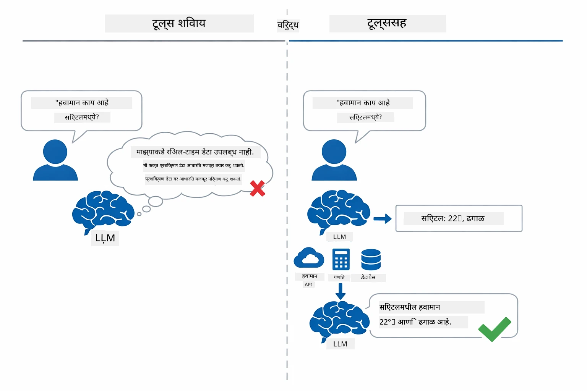

*टूलशिवाय मॉडेल फक्त अंदाज लावते — टूल्ससह तो API कॉल करू शकतो, गणना करू शकतो, आणि रिअल-टाइम डेटा परत करू शकतो.*

टूलसह AI एजंट एक **Reasoning and Acting (ReAct)** नमुन्याचे पालन करतो. मॉडेल फक्त उत्तर देत नाही — ते काय आवश्यक आहे याचा विचार करतो, टूल कॉल करतो, निकाल निरीक्षण करतो, आणि नंतर ठरवते की पुन्हा क्रिया करायची की अंतिम उत्तर द्यायचे:

1. **शोधा** — एजंट वापरकर्त्याच्या प्रश्नाचे विश्लेषण करतो आणि काय माहिती हवी आहे ते ठरवतो
2. **कृती करा** — एजंट योग्य टूल निवडतो, योग्य परिमाणे तयार करतो, आणि कॉल करतो
3. **निरीक्षण करा** — एजंट टूलचा आउटपुट प्राप्त करतो आणि निकालाचे मूल्यमापन करतो
4. **पुन्हा करू किंवा उत्तर द्या** — जर अधिक डेटा लागेल तर एजंट पुन्हा लूपमध्ये जातो; अन्यथा, नैसर्गिक भाषेत उत्तर तयार करतो

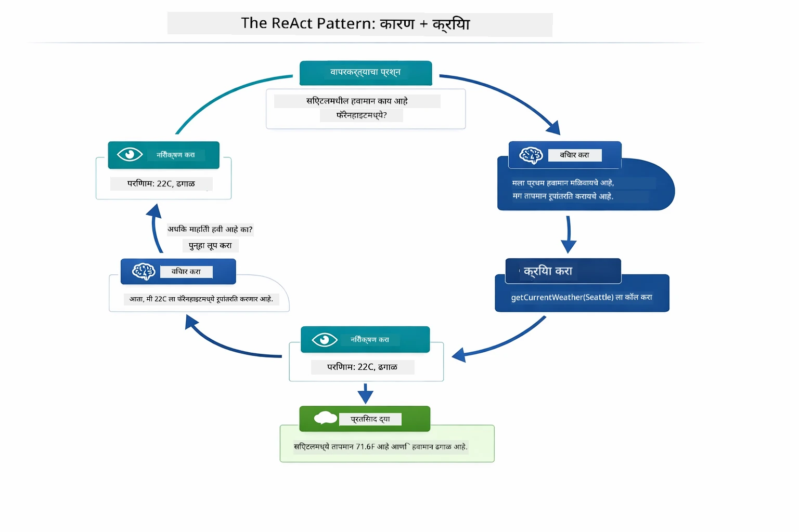

*ReAct वर्तुळ — एजंट काय करायचे ते विचारतो, टूल कॉल करतो, निकाल पाहतो, आणि शेवटच्या उत्तरासाठी लूप करतो.*

हे सर्व स्वयंचलितपणे होते. तुम्ही टूल्स आणि त्यांचे वर्णन निश्चित करता. मॉडेल ठरवते की कधी आणि कसे त्यांचा वापर करायचा.

## टूल कॉलिंग कसे कार्य करते

### टूल व्याख्या

[WeatherTool.java](../../../04-tools/src/main/java/com/example/langchain4j/agents/tools/WeatherTool.java) | [TemperatureTool.java](../../../04-tools/src/main/java/com/example/langchain4j/agents/tools/TemperatureTool.java)

तुम्ही तंतोतंत वर्णनांसह आणि परिमाण स्पष्टीकरणांसह फंक्शन्स परिभाषित करता. मॉडेल हे वर्णन त्याच्या सिस्टम प्रम्प्टमध्ये पाहते आणि प्रत्येक टूल काय करतो हे समजते.

```java
@Component
public class WeatherTool {
    
    @Tool("Get the current weather for a location")
    public String getCurrentWeather(@P("Location name") String location) {
        // तुमची हवामान शोधण्याची तर्कशास्त्र
        return "Weather in " + location + ": 22°C, cloudy";
    }
}

@AiService
public interface Assistant {
    String chat(@MemoryId String sessionId, @UserMessage String message);
}

// सहाय्यक Spring Boot द्वारा आपोआप जोडलेले आहे:
// - ChatModel बीन
// - @Component वर्गांमधील सर्व @Tool पद्धती
// - सेशन व्यवस्थापनासाठी ChatMemoryProvider
```

खालिल आकृती प्रत्येक एनोटेशनचे स्पष्टीकरण करते आणि कसे प्रत्येक भाग AI ला टूल कधी कॉल करायचा आणि कोणते आर्ग्युमेंट मिळवायचे हे समजण्यास मदत करतो ते दाखवते:

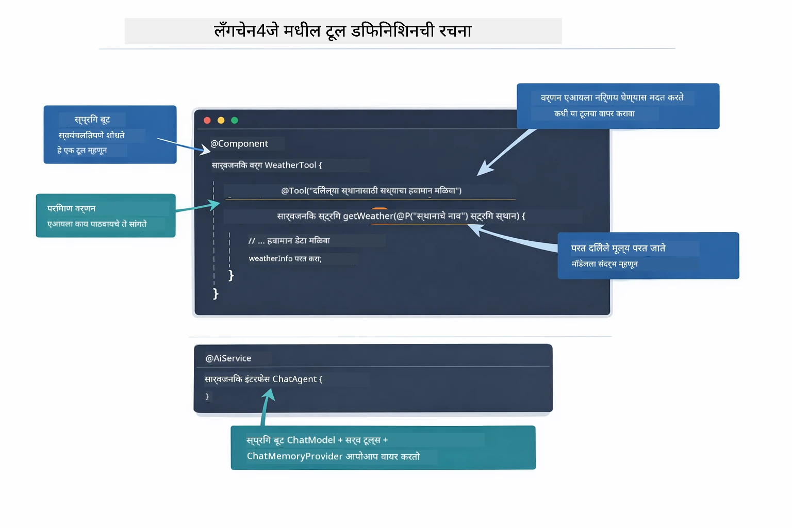

*टूल व्याख्येचे शारीरिक भाग — @Tool AI ला सांगते कधी वापरायचे, @P प्रत्येक परिमाणाचे वर्णन करते, आणि @AiService सगळे एकत्र स्टार्टअपवर वायर्स करते.*

> **🤖 [GitHub Copilot](https://github.com/features/copilot) Chat सह प्रयत्न करा:** [`WeatherTool.java`](../../../04-tools/src/main/java/com/example/langchain4j/agents/tools/WeatherTool.java) उघडा आणि विचारा:
> - "मॉक डेटाऐवजी OpenWeatherMap सारख्या वास्तविक हवामान API कसे एकत्र करावे?"
> - "एआय योग्यरित्या वापरण्यास मदत करणारी चांगली टूल वर्णन काय आहे?"
> - "टूल अंमलबजावणीमध्ये API त्रुटी आणि रेट लिमिट्स कशा हाताळाव्यात?"

### निर्णय घेणे

जेव्हा वापरकर्ता विचारतो "सीएटलमध्ये हवामान काय आहे?", तेव्हा मॉडेल निवडकपणे टूल निवडत नाही. ते वापरकर्त्याच्या हेतूची तुलना त्यांच्या सर्व टूल वर्णनांसोबत करते, प्रत्येकाला संबंध ठरवते, आणि सर्वोत्तम जुळणी निवडते. मग योग्य परिमाणांसह संरचित फंक्शन कॉल तयार करते — या प्रकरणात, `location` ला `"Seattle"` सेट करते.

जर कोणताही टूल वापरकर्त्याच्या विनंतीशी जुळत नसेल, तर मॉडेल त्याच्या स्वतःच्या ज्ञानातून उत्तर देतो. जर अनेक टूल जुळले तर तो सर्वात विशिष्ट निवडतो.

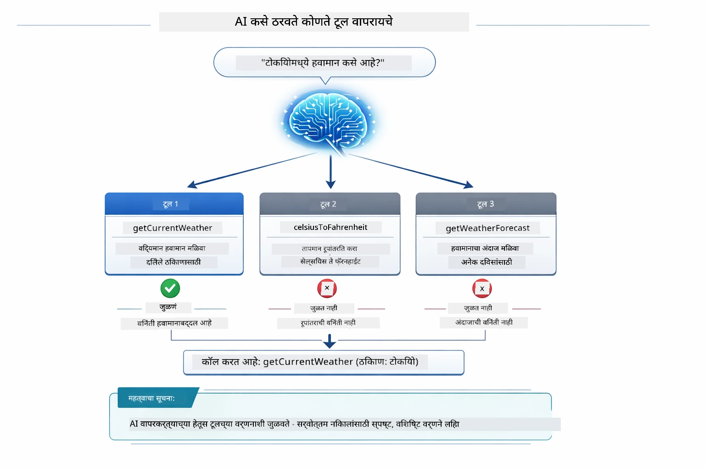

*मॉडेल प्रत्येक उपलब्ध टूल वापरकर्त्याच्या हेतूशी मूल्यांकन करते आणि सर्वोत्तम जुळणी निवडते — म्हणून स्पष्ट, विशिष्ट टूल वर्णन लिहिणे महत्त्वाचे आहे.*

### कार्यान्वयन

[AgentService.java](../../../04-tools/src/main/java/com/example/langchain4j/agents/service/AgentService.java)

स्प्रिंग बूट `@AiService` इंटरफेस सर्व नोंदणीकृत टूल्ससह ऑटो-वायरिंग करते, आणि LangChain4j टूल कॉल्स आपोआप चालवतो. मागे, टूल कॉल पूर्ण सहा टप्प्यांतून जातो — वापरकर्त्याच्या नैसर्गिक भाषेतील प्रश्नापासून शेवटी नैसर्गिक भाषेतील उत्तरापर्यंत:

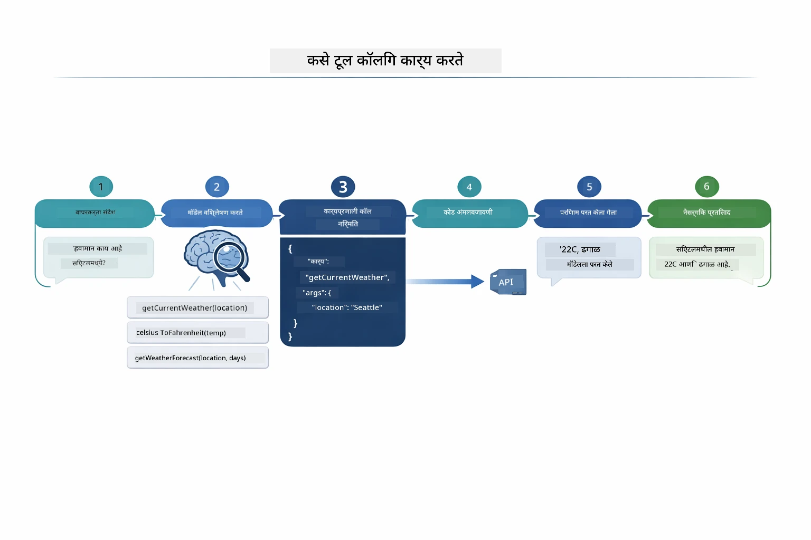

*पूर्ण प्रवाह — वापरकर्ता प्रश्न विचारतो, मॉडेल टूल निवडते, LangChain4j ते चालवते, आणि मॉडेल निकाल नैसर्गिक प्रतिसादात समाविष्ट करते.*

जर तुम्ही Module 00 मधील [ToolIntegrationDemo](../../../00-quick-start/src/main/java/com/example/langchain4j/quickstart/ToolIntegrationDemo.java) चालवले असेल, तर तुम्हाला हा नमुना आधीच दिसला आहे — `Calculator` टूल्सही त्याच पद्धतीने कॉल केले गेले. खालील सिक्वेन्स आकृती दाखवते की त्या डेमोमध्ये नेमकं काय घडलं:

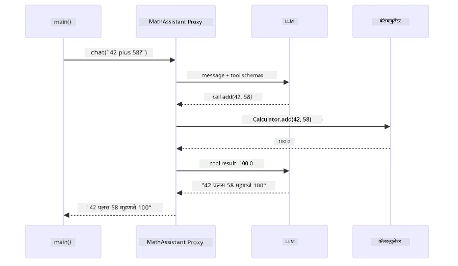

*क्विक स्टार्ट डेमोमधील टूल कॉलिंग लूप — `AiServices` तुमचा मेसेज आणि टूल स्कीमा LLM कडे पाठवते, LLM `add(42, 58)` सारखा फंक्शन कॉल परत करतो, LangChain4j `Calculator` मेथड स्थानीयपणे चालवते, आणि निकाल अंतिम उत्तरासाठी परत पाठवते.*

> **🤖 [GitHub Copilot](https://github.com/features/copilot) Chat सह प्रयत्न करा:** [`AgentService.java`](../../../04-tools/src/main/java/com/example/langchain4j/agents/service/AgentService.java) उघडा आणि विचारा:
> - "ReAct नमुना कसा कार्य करतो आणि AI एजंटसाठी तो का प्रभावी आहे?"
> - "एजंट कसा ठरवतो कोणता टूल वापरायचा आणि कोणत्या क्रमाने?"
> - "जर टूल अंमलबजावणी अयशस्वी झाली, तर त्रुटी कशा हाताळाव्यात?"

### प्रतिसाद निर्मिती

मॉडेल हवामान डेटा प्राप्त करते आणि वापरकर्त्यासाठी नैसर्गिक भाषेतील प्रतिसाद स्वरूपित करते.

### आर्किटेक्चर: स्प्रिंग बूट ऑटो-वाईरिंग

हा मॉड्यूल LangChain4j चा स्प्रिंग बूट इंटिग्रेशन वापरतो `@AiService` इंटरफेसेससह. स्टार्टअपवर स्प्रिंग बूट प्रत्येक `@Component` शोधतो ज्यामध्ये `@Tool` मेथड्स असतात, तुमचा `ChatModel` बीन, आणि `ChatMemoryProvider` — मग सर्व एका `Assistant` इंटरफेसमध्ये शून्य बोइलरप्लेटसह वायर्स करतो.

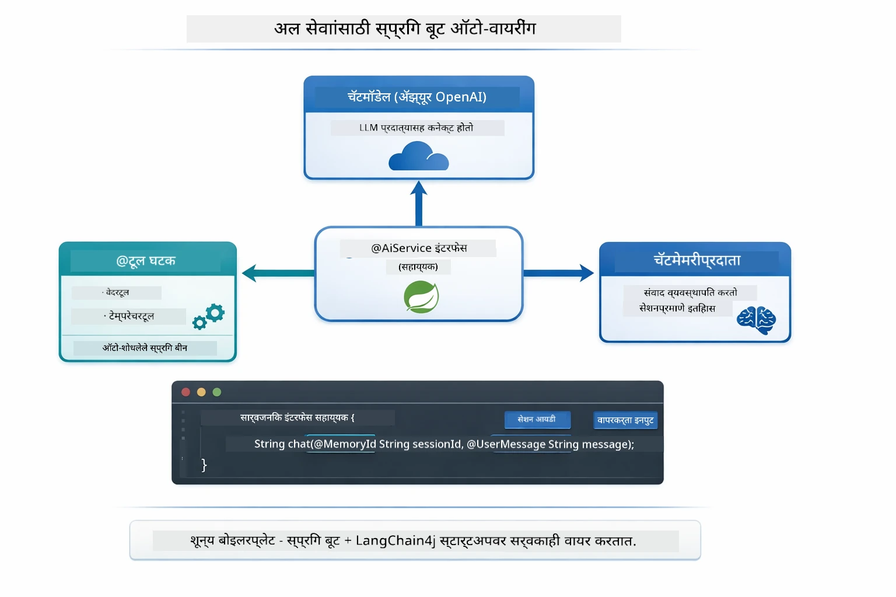

*@AiService इंटरफेस ChatModel, टूल कॉम्पोनंट्स, आणि मेमरी प्रोव्हायडर एकत्र करतो — स्प्रिंग बूट सर्व वायर्स आपोआप हाताळतो.*

खाली पूर्ण विनंती केवळ सिक्वेन्स आकृती म्हणून — HTTP विनंतीपासून कंट्रोलर, सेवा, ऑटो-वायर्ड प्रॉक्सी पर्यंत, आणि शेवटी टूल कार्यान्वयन आणि परत:

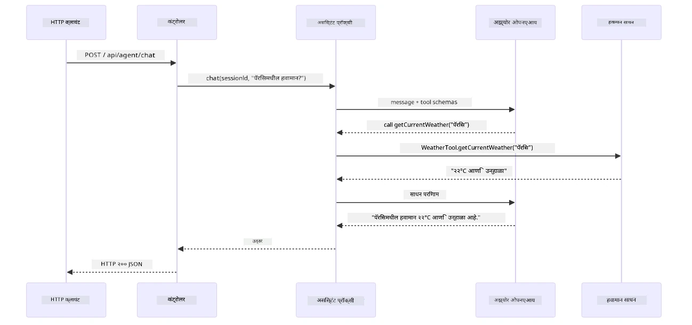

*पूर्ण स्प्रिंग बूट विनंती जीवनचक्र — HTTP विनंती कंट्रोलर आणि सेवा मार्फत ऑटो-वायर्ड Assistant प्रॉक्सीपर्यंत जाते, जे LLM आणि टूल कॉल स्वयंचलितपणे सांभाळतो.*

या पद्धतीचे मुख्य फायदे:

- **स्प्रिंग बूट ऑटो-वायर्ड** — ChatModel आणि टूल्स आपोआप इंजेक्ट होतात
- **@MemoryId नमुना** — स्वयंचलित सत्र-आधारित स्मृती व्यवस्थापन
- **एकच उदाहरण** — Assistant एकदा तयार करून पुनर्वापरासाठी ठेवतो, कार्यक्षमता सुधारते
- **टाइप-सुरक्षित कार्यान्वयन** — जावा मेथड थेट टाइप रूपांतरणासह कॉल होतात
- **मल्टी-टर्न ऑर्केस्ट्रेशन** — टूल चेनिंग आपोआप हाताळतो
- **शून्य बोइलरप्लेट** — कुठलेही `AiServices.builder()` कॉल किंवा मेमरी HashMap नको

पर्यायी पद्धती (मॅन्युअल `AiServices.builder()`) अधिक कोडसह आणि स्प्रिंग बूट इंटिग्रेशन फायदे न मिळालन्यास कारणीभूत.

## टूल चेनिंग

**टूल चेनिंग** — टूल-आधारित एजंट्सची खरी ताकद तेव्हा दिसते जेव्हा एक विचार अनेक टूल्स वापरण्याची गरज असते. "सीएटलमध्ये फॅरेनहाईट तापमान काय आहे?" असा प्रश्न विचारा आणि एजंट आपणोआप दोन टूल्स चेन करतो: प्रथम तो `getCurrentWeather` कॉल करतो ज्याने सेल्सिअस तापमान मिळते, नंतर त्या मूल्याला `celsiusToFahrenheit` मध्ये रूपांतरासाठी पाठवतो — ते सगळं एका संवाद टर्नमध्ये.

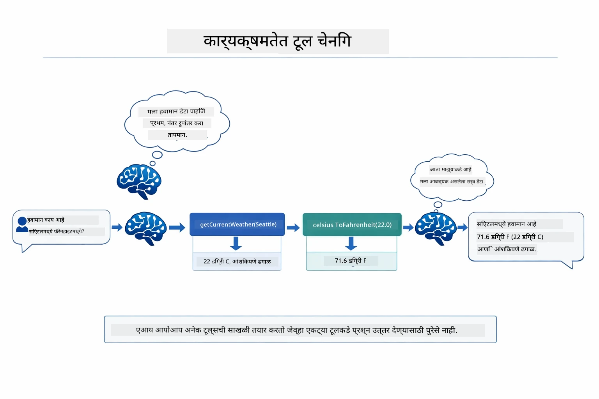

*टूल चेनिंग कृतीमधील — एजंट प्रथम getCurrentWeather कॉल करतो, मग सेल्सिअस निकाल celsiusToFahrenheit मध्ये पास करतो, आणि एकत्रित उत्तर देतो.*

**शांतपणे अपयश होणे** — मॉक डेटामध्ये न नसलेल्या शहरात हवामान विचारा. टूल त्रुटी संदेश परत देतो, आणि AI स्पष्ट करतो की तो मदत करू शकत नाही, अॅप क्रॅश होत नाही. टूल सुरक्षीतपणे अयशस्वी होतात. खालील आकृती दोन पद्धती दाखवते — योग्य त्रुटी हाताळणीसह एजंट अपवाद धरून मदतीचे उत्तर देतो, तर नसेल तर संपूर्ण अॅप्लिकेशन क्रॅश होतो:

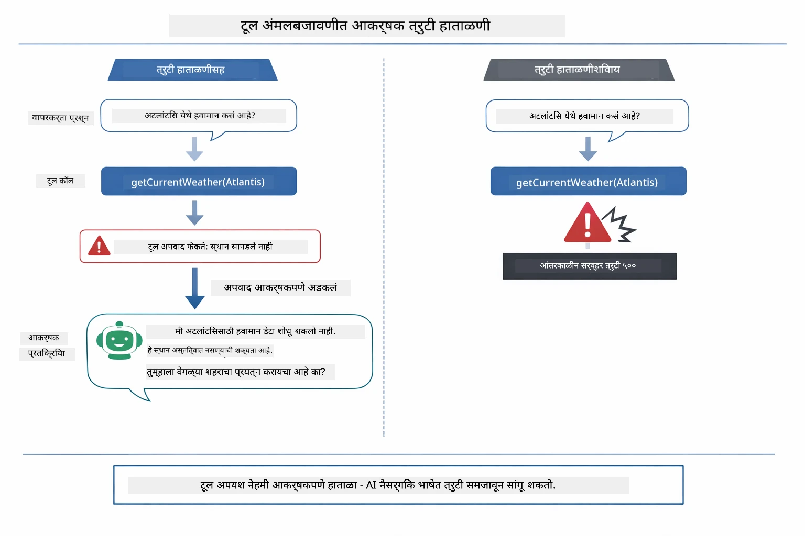

*टूल अयशस्वी झाल्यास, एजंट त्रुटी धरतो आणि क्रॅश न होता मदतकारक स्पष्टीकरण देतो.*

हे सगळं एका संवाद टर्नमध्ये घडते. एजंट स्वयंचलितपणे अनेक टूल कॉल्सचे समन्वय करते.

## अॅप्लिकेशन चालवा

**तैनाति तपासा:**

मूल निर्देशिकेत `.env` फाईल असल्याची खात्री करा ज्यात Azure क्रेडेन्शियल्स आहेत (Module 01 दरम्यान तयार केलेली). मॉड्यूल निर्देशिकेतून (`04-tools/`) हे चालवा:

**Bash:**
```bash
cat ../.env  # AZURE_OPENAI_ENDPOINT, API_KEY, DEPLOYMENT दाखवले पाहिजे
```

**PowerShell:**
```powershell
Get-Content ..\.env  # AZURE_OPENAI_ENDPOINT, API_KEY, DEPLOYMENT दाखवायला हवा
```

**अॅप्लिकेशन सुरू करा:**

> **टीप:** जर तुम्ही आधीच सर्व अॅप्लिकेशन्स `./start-all.sh` वापरून मूळ निर्देशिकेतून (जसे Module 01 मध्ये वर्णन केले) चालू केले असतील, तर हा मॉड्यूल पोर्ट 8084 वर चालू आहे. खालील स्टार्ट कमांड्स वगळू शकता आणि थेट http://localhost:8084 वर जाऊ शकता.

**पर्याय 1: स्प्रिंग बूट डॅशबोर्ड वापरा (VS कोड वापरकर्त्यांसाठी शिफारस)**

डेव्ह कंटेनरमध्ये स्प्रिंग बूट डॅशबोर्ड एक्सटेंशन समाविष्ट आहे, जे सर्व स्प्रिंग बूट अॅप्लिकेशन्सचा दृष्य इंटरफेस देते. हे VS कोडच्या डाव्या Activity Bar मध्ये स्प्रिंग बूट चिन्हाखटावर पाहू शकता.

स्प्रिंग बूट डॅशबोर्डद्वारे आपण:
- कार्यक्षेत्रातील सर्व स्प्रिंग बूट अॅप्लिकेशन्स पाहू शकता
- एका क्लिकने अॅप्लिकेशन्स सुरू/थांबवू शकता
- अॅप्लिकेशन लॉग रिअल-टाइममध्ये पाहू शकता
- अॅप्लिकेशन स्थिती निरीक्षण करू शकता

"tools" जवळील प्ले बटण क्लिक करून हा मॉड्यूल सुरू करा, किंवा सर्व मॉड्यूल्स एकाच वेळी सुरू करा.

VS कोडमधील स्प्रिंग बूट डॅशबोर्ड काय दिसते ते येथे आहे:


*VS कोडमधील स्प्रिंग बूट डॅशबोर्ड — एकाच ठिकाणाहून सर्व मॉड्यूल्स सुरू, थांबवा, आणि निरीक्षण करा*

**पर्याय 2: शेल स्क्रिप्ट्स वापरणे**

सर्व वेब अॅप्लिकेशन्स (मॉड्यूल 01-04) सुरू करा:

**Bash:**
```bash
cd ..  # मूळ निर्देशिका पासून
./start-all.sh
```

**PowerShell:**
```powershell
cd ..  # मुळ निर्देशिकेतून
.\start-all.ps1
```

किंवा फक्त हा मॉड्यूल सुरू करा:

**Bash:**
```bash
cd 04-tools
./start.sh
```

**PowerShell:**
```powershell
cd 04-tools
.\start.ps1
```

दोन्ही स्क्रिप्ट्स रूट `.env` फाइलमधून आपोआप वातावरण व्हेरिएबल्स लोड करतात आणि जर जा़र अस्तित्वात नसतील तर त्यांना बिल्ड करतील.

> **टिप:** जर तुम्हाला सर्व मॉड्यूल्स मॅन्युअली बिल्ड करायचे असतील सुरुवात करण्यापूर्वी:
>
> **Bash:**
> ```bash
> cd ..  # Go to root directory
> mvn clean package -DskipTests
> ```
>
> **PowerShell:**
> ```powershell
> cd ..  # Go to root directory
> mvn clean package -DskipTests
> ```

तुमच्या ब्राउझरमध्ये http://localhost:8084 उघडा.

**थांबवण्यासाठी:**

**Bash:**
```bash
./stop.sh  # हा मॉड्यूल फक्त
# किंवा
cd .. && ./stop-all.sh  # सर्व मॉड्यूल्स
```

**PowerShell:**
```powershell
.\stop.ps1  # फक्त हा मॉड्यूल
# किंवा
cd ..; .\stop-all.ps1  # सर्व मॉड्यूल्स
```

## अनुप्रयोगाचा वापर

हा अनुप्रयोग वेब इंटरफेस देते जिथे तुम्ही हवामान आणि तापमान रूपांतरण साधनांपर्यंत प्रवेश असलेल्या एआय एजंटशी संवाद साधू शकता. इंटरफेस कसा दिसतो ते खाली आहे — यात जलद सुरूवातीसाठी उदाहरणे आणि विनंत्या पाठवण्यासाठी चॅट पॅनेल समाविष्ट आहे:

<a href="images/tools-homepage.png"></a>

*एआय एजंट टूल्स इंटरफेस - जलद उदाहरणे आणि टूल्सशी संवादासाठी चॅट इंटरफेस*

### साध्या टूल वापराचा प्रयत्न करा

सरळ विनंतीने सुरू करा: "100 डिग्री फॅरेनहाइट ते सेल्सियस मध्ये रूपांतर करा". एजंट ओळखतो की त्याला तापमान रूपांतरण टूल वापरायचे आहे, योग्य पॅरामीटर्ससह कॉल करतो आणि निकाल परत करतो. हे किती नैसर्गिक वाटते याकडे लक्ष द्या - तुम्ही कोणता टूल वापरायचा आहे किंवा कसा कॉल करायचा हे निर्दिष्ट केले नाही.

### टूल चेनिंगची चाचणी करा

आता थोडके जास्त क्लिष्ट प्रयत्न करा: "सिएटल मध्ये हवामान काय आहे आणि ते फॅरेनहाइट मध्ये रूपांतर करा?" एजंट कसे टप्प्याटप्प्याने काम करतो ते पहा. प्रथम तो हवामान मिळवतो (जे सेल्सियस परत करतं), ओळखतो की फॅरेनहाइटमध्ये रूपांतरण करायचे आहे, रूपांतरण टूलला कॉल करतो, आणि दोन्ही निकाल एकाच प्रतिसादात एकत्रित करतो.

### संभाषण प्रवाह पहा

चॅट इंटरफेस संभाषण इतिहास राखतो, ज्यामुळे तुम्ही अनेक टप्प्यांवर संवाद करू शकता. तुम्ही सर्व मागील प्रश्न आणि प्रतिसाद पाहू शकता, ज्यामुळे संभाषणाचा मागोवा घेणे सोपे होते आणि एजंट कसा अनेक विनिमयांमध्ये संदर्भ तयार करतो ते समजते.

<a href="images/tools-conversation-demo.png"></a>

*साध्या रूपांतर, हवामान शोध आणि टूल चेनिंगसह बहु-चरणीय संभाषण*

### वेगवेगळ्या विनंत्यांसह प्रयोग करा

विविध संयोजने वापरून बघा:
- हवामान शोध: "टोकियोमध्ये हवामान कसे आहे?"
- तापमान रूपांतरण: "25°C किती केल्विन आहे?"
- एकत्रित प्रश्न: "पॅरिसमध्ये हवामान तपासा आणि मला सांगा की ते 20°C पेक्षा जास्त आहे का"

एजंट नैसर्गिक भाषा कशी समजतो आणि योग्य टूल कॉलशी कशी मॅपिंग करतो याकडे लक्ष द्या.

## मुख्य संकल्पना

### ReAct नमुना (तर्क आणि क्रिया)

एजंट तर्क (काय करायचे ते ठरवणे) आणि क्रिया (टूल्स वापरणे) यामध्ये बदलतो. हा नमुना स्वायत्त समस्या सोडवण्यास सक्षम करतो फक्त सूचना प्रदान करण्याऐवजी.

### टूल वर्णने महत्वाची

टूल्स कसे वापरायचे हे एजंटसाठी स्पष्ट करण्यासाठी तुमच्या टूल वर्णनांची गुणवत्ता महत्त्वाची आहे. स्पष्ट, विशिष्ट वर्णने मॉडेलला प्रत्येक टूल केव्हा आणि कसे कॉल करावे हे समजायला मदत करतात.

### सत्र व्यवस्थापन

`@MemoryId` अॅनोटेशन आपोआप सत्राधारित स्मृती व्यवस्थापन सक्षम करते. प्रत्येक सत्र ID ला स्वतःची `ChatMemory` उदाहरण मिळते जी `ChatMemoryProvider` बीनने व्यवस्थापित होते, त्यामुळे अनेक वापरकर्ते एजंटशी एकाच वेळी संवाद साधू शकतात आणि त्यांचे संभाषणे एकमेकांत गोंधळत जात नाहीत. खालील आकृती दर्शवते की कसे अनेक वापरकर्ते त्यांच्या सत्र ID नुसार वेगळ्या स्मृती स्टोअरकडे मार्गदर्शित केले जातात:

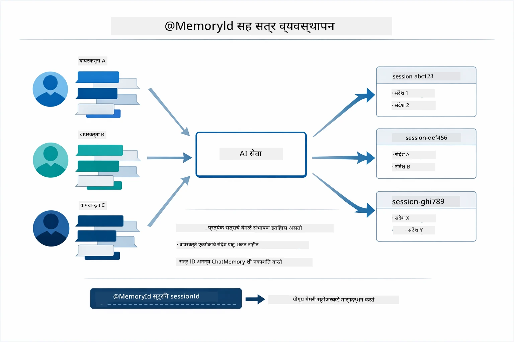

*प्रत्येक सत्र ID वेगळ्या संभाषण इतिहासाशी जुळतो — वापरकर्ते एकमेकांचे संदेश कधीच पाहत नाहीत.*

### त्रुटी हाताळणी

टूल्स अपयशी होऊ शकतात — API वेळेत प्रतिसाद देत नाहीत, पॅरामीटर्स अवैध असू शकतात, बाह्य सेवा बंद होऊ शकतात. उत्पादनात एजंटसाठी त्रुटी हाताळणी आवश्यक आहे जेणेकरून मॉडेल समस्यांचे स्पष्टीकरण देऊ शकेल किंवा पर्याय वापरू शकेल, संपूर्ण अनुप्रयोग क्रॅश न होता. जेव्हा टूल एरर फेकते, तेव्हा LangChain4j ते पकड़ून त्रुटी संदेश मॉडेलकडे परत पाठवते, जे मग नैसर्गिक भाषेत समस्या समजावून सांगू शकते.

## उपलब्ध टूल्स

खालील आकृती तुम्ही तयार करू शकता अशा टूल्सचे विस्तृत परिसंस्था दर्शवते. हा मॉड्यूल हवामान आणि तापमान टूल्सचे प्रदर्शन करतो, परंतु तोच `@Tool` नमुना कोणत्याही Java पध्दतीसाठी काम करतो — डेटाबेस क्वेरीजपासून ते पेमेंट प्रोसेसिंगपर्यंत.

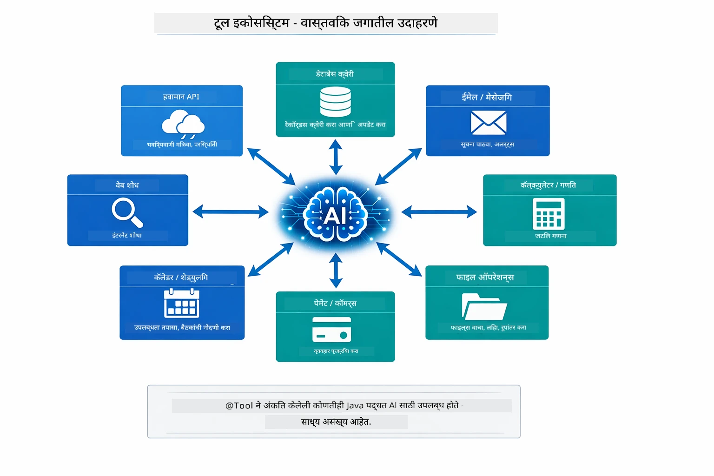

*@Tool सह चिन्हांकित कोणतीही Java पध्दत AI ला उपलब्ध होते — हा नमुना डेटाबेस, API, ईमेल, फाइल ऑपरेशन्स आणि अधिकासाठी विस्तारित होतो.*

## टूल-आधारित एजंट्स कधी वापरावे

प्रत्येक विनंतीला टूल्सची गरज नसते. निर्णय हा असतो की AI ला बाह्य सिस्टम्सशी संवाद साधायचा आहे का किंवा तो स्वतःच्या ज्ञानावरून उत्तर देऊ शकतो. खालील मार्गदर्शकमुळं टूल्स कधी उपयुक्त असतात आणि कधी आवश्यकता नाही ते सारांशित आहे:

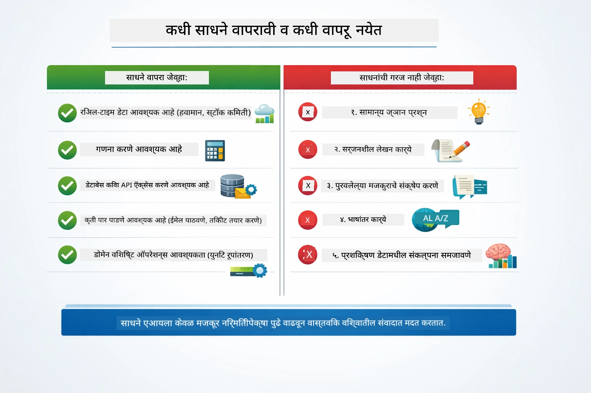

*एक जलद निर्णय मार्गदर्शक — टूल्स प्रत्यक्ष डेटा, गणना आणि क्रियांसाठी; सामान्य ज्ञान आणि सर्जनशील कामांसाठी गरज नाही.*

## टूल्स विरुद्ध RAG

मॉड्यूल 03 आणि 04 दोन्ही AI काय करू शकतो वाढवतात, परंतु मूलत: वेगवेगळ्या पद्धतीने. RAG मॉडेलला **ज्ञान** प्रदान करते दस्तऐवज प्राप्त करून. टूल्स मॉडेलला क्रिया करण्याची क्षमता देतात फंक्शन्स कॉल करून. खालील आकृती या दोन दृष्टिकोनांची बाजूने बाजूने तुलना करते — प्रत्येक कार्यप्रवाह कसा चालतो ते पाहता तसेच त्यांच्यातील ट्रेड-ऑफ्ज:

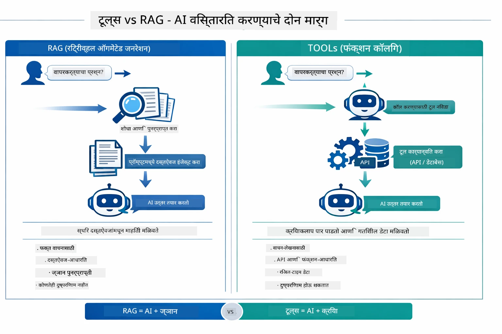

*RAG स्थिर दस्तऐवजांमधून माहिती प्राप्त करतो — टूल्स क्रिया करतात आणि गतिशील, रिअल-टाइम डेटा आणतात. अनेक उत्पादन प्रणाली दोन्ही एकत्र वापरतात.*

व्यवहारात, अनेक उत्पादन प्रणाली दोन्ही पद्धतींचा वापर करतात: RAG तुमच्या दस्तऐवजीकरणात उत्तरांना आधार देण्यासाठी, आणि टूल्स प्रत्यक्ष डेटा आणण्यासाठी किंवा ऑपरेशन्स करण्यासाठी.

## पुढील टप्पे

**पुढील मॉड्यूल:** [05-mcp - Model Context Protocol (MCP)](../05-mcp/README.md)

---

**नेव्हिगेशन:** [← मागील: मॉड्यूल 03 - RAG](../03-rag/README.md) | [मुख्यपृष्ठाकडे परत](../README.md) | [पुढे: मॉड्यूल 05 - MCP →](../05-mcp/README.md)

---

<!-- CO-OP TRANSLATOR DISCLAIMER START -->
**अस्वीकरण**:  
हा दस्तऐवज AI अनुवाद सेवा [Co-op Translator](https://github.com/Azure/co-op-translator) चा वापर करून अनुवादित केला आहे. आम्ही अचूकतेसाठी प्रयत्नशील आहोत, तरी कृपया लक्षात ठेवा की स्वयंचलित अनुवादांमध्ये त्रुटी किंवा चुकीची माहिती असू शकते. मूळ दस्तऐवज त्याच्या मूळ भाषेत अधिकृत स्रोत मानला जावा. महत्त्वाच्या माहितीकरिता व्यावसायिक मानवी अनुवाद करणे शिफारसीय आहे. या अनुवादाच्या वापरामुळे उद्भवणाऱ्या कोणत्याही गैरसमजुती किंवा चुकीच्या अर्थ लावणीबाबत आम्ही जबाबदार नाही आहोत.
<!-- CO-OP TRANSLATOR DISCLAIMER END -->