# मॉड्यूल ०५: मॉडेल संदर्भ प्रोटोकॉल (MCP)

## आशय सूची

- [तुम्ही काय शिकाल](../../../05-mcp)
- [MCP म्हणजे काय?](../../../05-mcp)
- [MCP कसे कार्य करते](../../../05-mcp)
- [एजेंटिक मॉड्यूल](../../../05-mcp)
- [उदाहरण चालविणे](../../../05-mcp)
  - [पूर्वअट](../../../05-mcp)
- [तत्काल प्रारंभ](../../../05-mcp)
  - [फाइल ऑपरेशन्स (Stdio)](../../../05-mcp)
  - [सुपरव्हायझर एजंट](../../../05-mcp)
    - [डेमो चालविणे](../../../05-mcp)
    - [सुपरव्हायझर कसा कार्य करतो](../../../05-mcp)
    - [प्रतिक्रिया धोरणे](../../../05-mcp)
    - [आउटपुट समजून घेणे](../../../05-mcp)
    - [एजेंटिक मॉड्यूल फीचर्सचे स्पष्टीकरण](../../../05-mcp)
- [महत्त्वाचे संकल्पना](../../../05-mcp)
- [अभिनंदन!](../../../05-mcp)
  - [पुढे काय?](../../../05-mcp)

## तुम्ही काय शिकाल

तुम्ही संभाषणात्मक AI तयार केला आहे, प्रॉम्प्ट्समध्ये पारंगत झाला आहात, दस्तऐवजांमधील प्रतिसादांना मूळ दिले आहे, आणि साधने वापरून एजंट तयार केले आहेत. पण त्या सर्व साधनांना तुमच्या विशिष्ट अनुप्रयोगासाठी सानुकूलित केले गेले आहे. जर तुम्ही तुमच्या AI ला अशा एकसंध साधन परिसंस्थेचा प्रवेश देता आलात ज्याला कोणतीही व्यक्ती तयार करू शकते आणि शेअर करू शकते तर काय? या मॉड्यूलमध्ये, तुम्ही मॉडेल संदर्भ प्रोटोकॉल (MCP) आणि LangChain4j च्या एजेंटिक मॉड्यूलच्या साहाय्याने हे कसे करायचे ते शिकाल. आम्ही प्रथम एक सोपा MCP फाइल रीडर दाखवतो आणि नंतर ते सुपरव्हायझर एजंट नमुन्याचा वापर करून प्रगत एजेंटिक वर्कफ्लोजमध्ये सहज कसे एकत्रित होते ते दाखवतो.

## MCP म्हणजे काय?

मॉडेल संदर्भ प्रोटोकॉल (MCP) नेमके तेच प्रदान करतो - AI अनुप्रयोगांना बाह्य साधने शोधण्यासाठी आणि वापरण्यासाठी एक प्रमाणित मार्ग. प्रत्येक डेटा स्रोत किंवा सेवेसाठी सानुकूल एकत्रीकरण लिहिण्याऐवजी, तुम्ही MCP सर्व्हरशी कनेक्ट करता जे त्यांच्या क्षमतांची एकसंध स्वरूपात माहिती देतात. तुमचा AI एजंट नंतर या साधनांना आपोआप शोधू शकतो आणि वापरू शकतो.


*MCP आधी: गुंतागुंतीचे पॉईंट-टू-पॉईंट एकत्रीकरण. MCP नंतर: एक प्रोटोकॉल, अमर्याद शक्यता.*

MCP AI विकासातील एक मूलभूत समस्या सोडवितो: प्रत्येक एकत्रीकरण सानुकूल असते. GitHub वापरायचे आहे? सानुकूल कोड. फाइल्स वाचायच्या आहेत? सानुकूल कोड. डेटाबेस क्वेरी करायची आहे? सानुकूल कोड. आणि हे एकत्रीकरण इतर AI अनुप्रयोगांसोबत काम करत नाही.

MCP याला प्रमाणित करते. एक MCP सर्व्हर स्पष्ट वर्णने आणि स्कीमासह साधने उपलब्ध करून देतो. कोणताही MCP क्लायंट कनेक्ट करू शकतो, उपलब्ध साधने शोधू शकतो, आणि त्यांचा वापर करू शकतो. एकदाच तयार करा, सर्वत्र वापरा.


*मॉडेल संदर्भ प्रोटोकॉल आर्किटेक्चर - प्रमाणित साधन शोध आणि अंमलबजावणी*

## MCP कसे कार्य करते

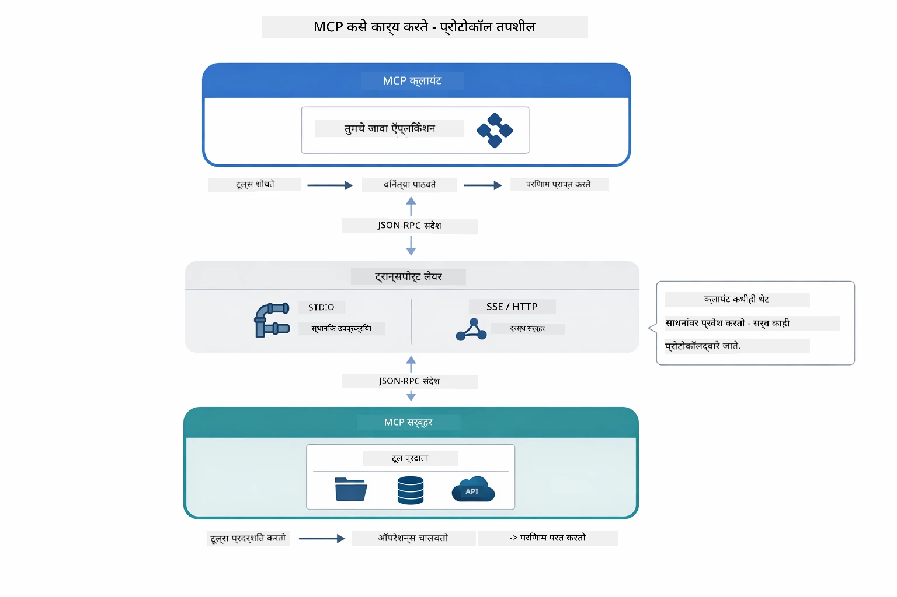

*MCP कसे कार्य करते — क्लायंट साधने शोधतो, JSON-RPC संदेशांची देवाणघेवाण करतो, आणि ट्रान्सपोर्ट लेयरद्वारे ऑपरेशन्स अंमलात आणतो.*

**सर्व्हर-क्लायंट आर्किटेक्चर**

MCP क्लायंट-सर्व्हर मॉडेल वापरतो. सर्व्हर साधने प्रदान करतात - फाइल्स वाचणे, डेटाबेस क्वेरी करणे, API कॉल करणे. क्लायंट (तुमचा AI अनुप्रयोग) सर्व्हरशी कनेक्ट करून त्यांच्या साधनांचा वापर करतो.

LangChain4j सह MCP वापरण्यासाठी, हा Maven अवलंबित्व जोडा:

```xml
<dependency>
    <groupId>dev.langchain4j</groupId>
    <artifactId>langchain4j-mcp</artifactId>
    <version>${langchain4j.version}</version>
</dependency>
```


**साधने शोधणे**

तुमचा क्लायंट जेव्हा MCP सर्व्हरशी कनेक्ट होतो, तेव्हा तो विचारतो "तुमच्याकडे कोणती साधने आहेत?" सर्व्हर उपलब्ध साधनांची यादी पाठवतो, प्रत्येकसाठी वर्णन आणि पॅरामीटर स्कीमासह. तुमचा AI एजंट नंतर वापरकर्त्यांच्या विनंतीनुसार वापरावयाची साधने ठरवू शकतो.

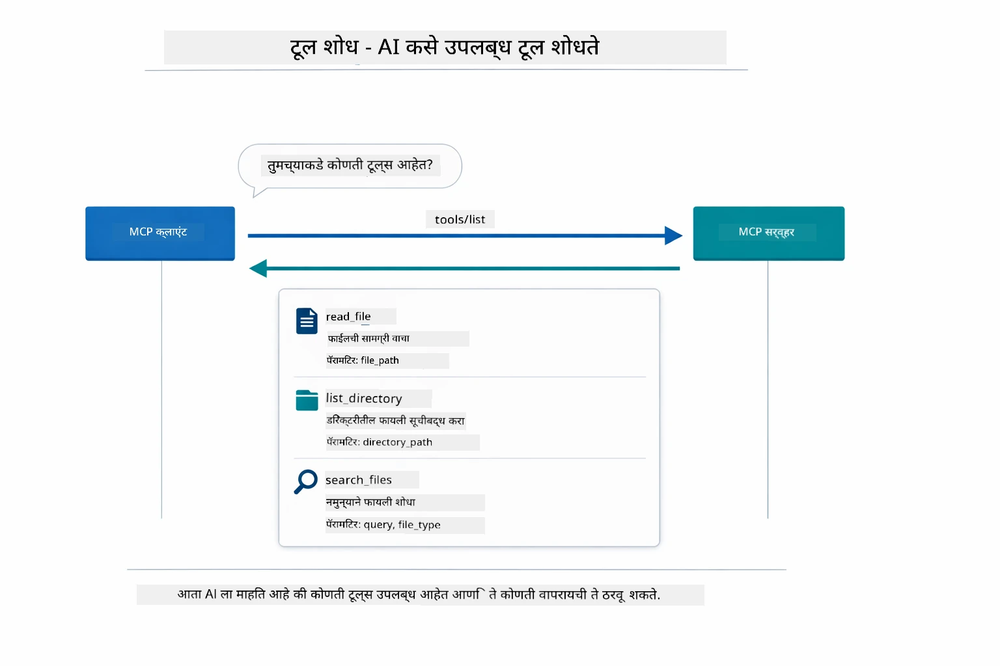

*AI सुरुवातीस उपलब्ध साधने शोधतो — आता त्याला माहित आहे काय क्षमता उपलब्ध आहेत आणि कोणती वापरायची ते ठरवतो.*

**ट्रान्सपोर्ट तंत्रे**

MCP वेगवेगळ्या ट्रान्सपोर्ट तंत्रांचा समर्थन करतो. हा मॉड्यूल लोकल प्रोसेसेससाठी Stdio ट्रान्सपोर्ट दाखवतो:


*MCP ट्रान्सपोर्ट तंत्रे: रिमोट सर्व्हरांसाठी HTTP, लोकल प्रोसेसेससाठी Stdio*

**Stdio** - [StdioTransportDemo.java](../../../05-mcp/src/main/java/com/example/langchain4j/mcp/StdioTransportDemo.java)

लोकल प्रोसेसेससाठी. तुमचा अनुप्रयोग एक सर्व्हर सबप्रोसेस म्हणून स्पॉन करतो आणि मानक इनपुट/आउटपुटद्वारे संवाद साधतो. फाइलसिस्टम प्रवेश किंवा कमांड-लाइन साधनांसाठी उपयुक्त.

```java
McpTransport stdioTransport = new StdioMcpTransport.Builder()
    .command(List.of(
        npmCmd, "exec",
        "@modelcontextprotocol/server-filesystem@2025.12.18",
        resourcesDir
    ))
    .logEvents(false)
    .build();
```

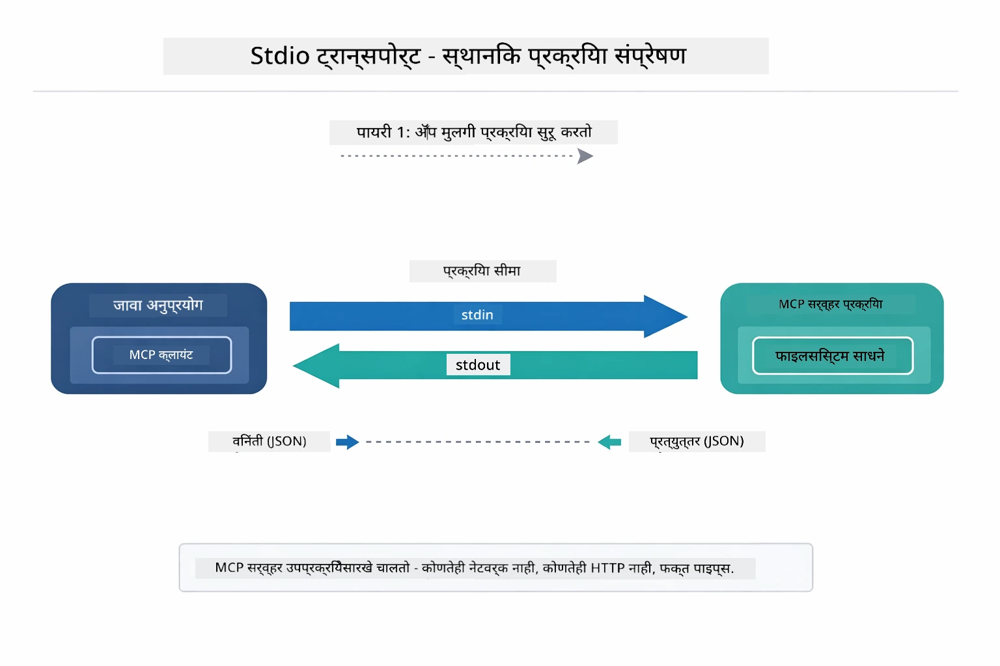

*Stdio ट्रान्सपोर्ट अंमलबजावणी — तुमचा अनुप्रयोग MCP सर्व्हर एक चाइल्ड प्रोसेस म्हणून स्पॉन करतो आणि stdin/stdout पाइप्सद्वारे संवाद करतो.*

> **🤖 [GitHub Copilot](https://github.com/features/copilot) च्या मदतीने प्रयत्न करा:** [`StdioTransportDemo.java`](../../../05-mcp/src/main/java/com/example/langchain4j/mcp/StdioTransportDemo.java) उघडा आणि विचारा:
> - "Stdio ट्रान्सपोर्ट कसा कार्य करतो आणि HTTP च्या तुलनेत कधी वापरावा?"
> - "LangChain4j MCP सर्व्हर प्रक्रियेच्या लाइफसायकलचे व्यवस्थापन कसे करते?"
> - "फाइल सिस्टमला AI प्रवेश देण्याचे सुरक्षा परिणाम काय आहेत?"

## एजेंटिक मॉड्यूल

MCP प्रमाणित साधने प्रदान करतो, तर LangChain4j चा **एजेंटिक मॉड्यूल** अशा एजंटस तयार करण्याचा घोषणात्मक मार्ग देतो जे त्या साधनांचे सुसंगत नियोजन करतात. `@Agent` एनोटेशन आणि `AgenticServices` तुम्हाला एजंट वर्तन इंटरफेसेसद्वारे परिभाषित करण्याची मुभा देतात, impérative कोडऐवजी.

या मॉड्यूलमध्ये, तुम्ही **सुपरव्हायझर एजंट** नमुन्याचा अभ्यास कराल — एक प्रगत एजंटिक AI पद्धत जिथे "सुपरव्हायझर" एजंट वापरकर्त्यांच्या विनंतीनुसार कोणते सब-एजंट्स कॉल करायचे ते गतिशीलपणे ठरवतो. आम्ही हे दोन्ही संकल्पना एकत्र करून आमच्या एका सब-एजंटला MCP-आधारित फाइल प्रवेश क्षमता देऊ.

एजेंटिक मॉड्यूल वापरण्यासाठी हा Maven अवलंबित्व जोडा:

```xml
<dependency>
    <groupId>dev.langchain4j</groupId>
    <artifactId>langchain4j-agentic</artifactId>
    <version>${langchain4j.mcp.version}</version>
</dependency>
```


> **⚠️ प्रयोगात्मक:** `langchain4j-agentic` मॉड्यूल **प्रयोगात्मक** आहे आणि बदलू शकतो. AI सहाय्यक तयार करण्याचा स्थिर मार्ग म्हणजे `langchain4j-core` सानुकूल साधनांसह (मॉड्यूल ०४).

## उदाहरण चालविणे

### पूर्वअट

- Java 21+, Maven 3.9+
- Node.js 16+ आणि npm (MCP सर्व्हरांसाठी)
- `.env` फाइलमध्ये पर्यावरणीय बदलविलेले (रूट निर्देशिकेतून):
  - `AZURE_OPENAI_ENDPOINT`, `AZURE_OPENAI_API_KEY`, `AZURE_OPENAI_DEPLOYMENT` (मॉड्यूल ०१-०४ प्रमाणे)

> **टीप:** जर तुम्ही अद्याप पर्यावरणीय बदलविलेले सेट केले नसेल, तर [मॉड्यूल ०० - त्वरित प्रारंभ](../00-quick-start/README.md) पहा किंवा `.env.example` कॉपी करून रूट निर्देशिकेत `.env` म्हणून सेव्ह करा आणि तुमचे मूल्य भरा.

## तत्काल प्रारंभ

**VS कोड वापरुन:** Explorerd मधील कोणत्याही डेमो फाइलवर राइट-क्लिक करा आणि **"Run Java"** निवडा, किंवा रन आणि डिबग पॅनेलमधील लॉन्च कॉन्फिगरेशन वापरा (सर्वप्रथम `.env` फाइलमध्ये तुमचा टोकन समाविष्ट केलेला असावा).

**Maven वापरुन:** पर्यायीपणे, खालील उदाहरणांसह कमांड लाइनवरून चालवू शकता.

### फाइल ऑपरेशन्स (Stdio)

हे स्थानिक सबप्रोसेस-आधारित साधने दाखवते.

**✅ कोणतीही पूर्वअट नाही** - MCP सर्व्हर आपोआप स्पॉन होतो.

**स्टार्ट स्क्रिप्ट वापरणे (शिफारस):**

स्टार्ट स्क्रिप्ट रूट `.env` फाइलमधून पर्यावरणीय बदलवित्या आपोआप लोड करतात:

**Bash:**
```bash
cd 05-mcp
chmod +x start-stdio.sh
./start-stdio.sh
```

**PowerShell:**
```powershell
cd 05-mcp
.\start-stdio.ps1
```

**VS Code वापरताना:** `StdioTransportDemo.java` वर राइट-क्लिक करा आणि **"Run Java"** निवडा (तुमच्या `.env` फाइलची योग्य सेटिंग पहा).

अनुप्रयोग आपोआप फाइलसिस्टम MCP सर्व्हर स्पॉन करतो आणि स्थानिक फाइल वाचतो. subprocess व्यवस्थापन तुमच्यासाठी कसे हाताळले जाते हे लक्षात घ्या.

**अपेक्षित आउटपुट:**
```
Assistant response: The file provides an overview of LangChain4j, an open-source Java library
for integrating Large Language Models (LLMs) into Java applications...
```


### सुपरव्हायझर एजंट

**सुपरव्हायझर एजंट नमुना** हे एजेंटिक AI चे **लवचीक** स्वरूप आहे. सुपरव्हायझर वापरकर्ता विनंतीनुसार कोणते एजंट कॉल करायचे हे स्वयंचलितपणे ठरवण्यासाठी LLM वापरतो. पुढील उदाहरणात, आम्ही MCP-शक्तीवान फाइल प्रवेश आणि LLM एजंट एकत्र करून एक सुपरवाइज्ड फाइल रीड → अहवाल वर्कफ्लो तयार करतो.

डेमोमध्ये `FileAgent` MCP फाइलसिस्टम साधनांचा वापर करून फाइल वाचतो, आणि `ReportAgent` शीर्षक संक्षेप (१ वाक्य), ३ मुख्य मुद्दे, आणि शिफारसींसह एक संरचित अहवाल तयार करतो. सुपरव्हायझर हा प्रवाह आपोआप नियंत्रित करतो:

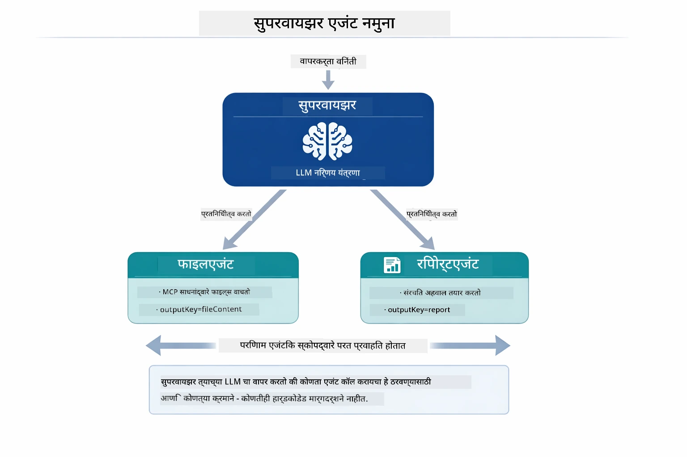

*सुपरव्हायझर त्याचा LLM वापरून ठरवतो कोणते एजंट कॉल करायचे आणि कोणत्या क्रमाने — कोणताही हार्डकोडेड राउटिंग आवश्यक नाही.*

साधक वर्कफ्लोचे रूप:

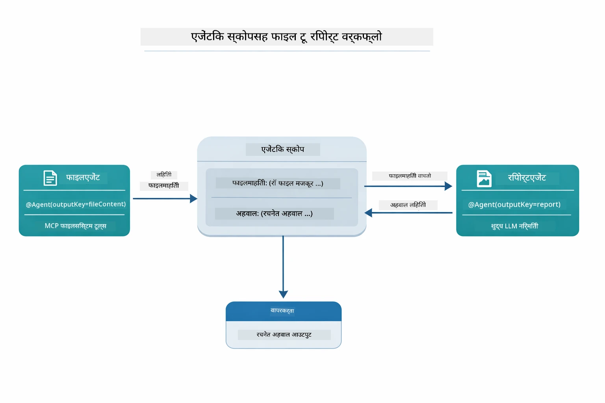

*FileAgent MCP साधनांद्वारे फाइल वाचतो, नंतर ReportAgent कच्चा मजकूर संरचित अहवालात रूपांतरित करतो.*

प्रत्येक एजंट त्याचा आउटपुट **Agentic Scope** (सामायिक मेमरी) मध्ये संग्रहित करतो, ज्यामुळे पुढील एजंट्स पूर्व निकालांपर्यंत पोहोचू शकतात. हे दर्शविते की MCP साधने एजेंटिक वर्कफ्लोमध्ये निर्बाधपणे कशी समाकलित होतात — सुपरव्हायझरला फाइल वाचन कसे होते हे माहित असण्याची गरज नाही, फक्त माहित असते की `FileAgent` हे करू शकतो.

#### डेमो चालविणे

स्टार्ट स्क्रिप्ट रूट `.env` फाइलमधून पर्यावरणीय बदलवित्या आपोआप लोड करतात:

**Bash:**
```bash
cd 05-mcp
chmod +x start-supervisor.sh
./start-supervisor.sh
```

**PowerShell:**
```powershell
cd 05-mcp
.\start-supervisor.ps1
```

**VS Code वापरताना:** `SupervisorAgentDemo.java` वर राइट-क्लिक करा आणि **"Run Java"** निवडा (तुमच्या `.env` फाइलची योग्य सेटिंग पहा).

#### सुपरव्हायझर कसा कार्य करतो

```java
// पाऊल 1: FileAgent MCP साधने वापरून फाइल्स वाचतो
FileAgent fileAgent = AgenticServices.agentBuilder(FileAgent.class)
        .chatModel(model)
        .toolProvider(mcpToolProvider)  // फाइल ऑपरेशन्ससाठी MCP साधने आहेत
        .build();

// पाऊल 2: ReportAgent संरचित अहवाल तयार करतो
ReportAgent reportAgent = AgenticServices.agentBuilder(ReportAgent.class)
        .chatModel(model)
        .build();

// Supervisor फाइल → अहवाल workflow चे व्यवस्थापन करतो
SupervisorAgent supervisor = AgenticServices.supervisorBuilder()
        .chatModel(model)
        .subAgents(fileAgent, reportAgent)
        .responseStrategy(SupervisorResponseStrategy.LAST)  // अंतिम अहवाल परत करा
        .build();

// विनंतीच्या आधारे कोणते एजंट्स सक्रिय करायचे ते Supervisor ठरवतो
String response = supervisor.invoke("Read the file at /path/file.txt and generate a report");
```


#### प्रतिक्रिया धोरणे

तुम्ही `SupervisorAgent` कॉन्फिगर करताना, सब-एजंट्स त्यांच्या कार्यानंतर वापरकर्त्यास शेवटचा उत्तर कसे द्यायचे ते ठरवाल.

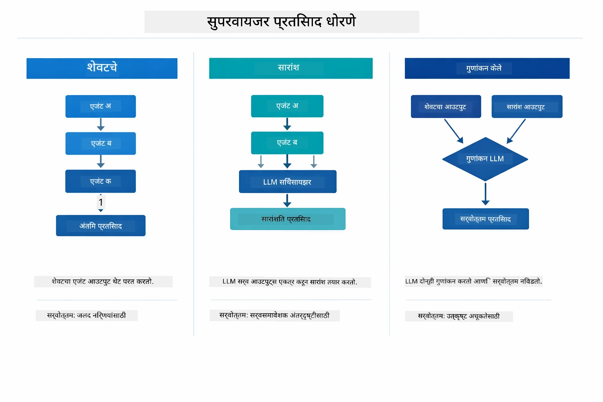

*सुपरव्हायझर शेवटची प्रतिक्रिया कशी तयार करतो याचे तीन धोरणे — तुम्ही निवडा तुम्हाला शेवटचा एजंट आउटपुट हवा आहे, एक संक्षिप्त सारांश, की सर्वोत्तम गुणांकित पर्याय.*

उपलब्ध धोरणे:

| धोरण | वर्णन |
|----------|-------------|
| **LAST** | सुपरव्हायझर शेवटच्या सब-एजंट किंवा साधनाचा आउटपुट परत करतो. वर्कफ्लोमधील अंतिम एजंट विशेषतः अंतिम संपूर्ण उत्तर देण्यासाठी डिझाइन केलेला आहे तेव्हा उपयुक्त (उदा. संशोधन वर्कफ्लोतील "सारांश एजंट"). |
| **SUMMARY** | सुपरव्हायझर त्याचा अंतर्गत LLM वापरून संपूर्ण संवाद आणि सर्व सब-एजंट आउटपुटचा अंदाज घेऊन एक समारोप तयार करतो आणि तो अंतिम उत्तर म्हणून परत करतो. यामुळे वापरकर्त्यास एक स्पष्ट, संकलित उत्तर मिळते. |
| **SCORED** | सिस्टम अंतर्गत LLM वापरून LAST प्रतिक्रिया आणि संवादाचा सारांश मूलभूत वापरकर्ता विनंतीशी तुलना करून अधिक गुणांकित आउटपुट परत करते. |

संपूर्ण अंमलबजावणीसाठी [SupervisorAgentDemo.java](../../../05-mcp/src/main/java/com/example/langchain4j/mcp/SupervisorAgentDemo.java) पहा.

> **🤖 [GitHub Copilot](https://github.com/features/copilot) च्या मदतीने प्रयत्न करा:** [`SupervisorAgentDemo.java`](../../../05-mcp/src/main/java/com/example/langchain4j/mcp/SupervisorAgentDemo.java) उघडा आणि विचारा:
> - "सुपरव्हायझर कोणते एजंट्स कॉल करायचे हे कसे ठरवतो?"
> - "सुपरव्हायझर आणि सिक्वेन्शियल वर्कफ्लो नमुन्यात काय फरक आहे?"
> - "सुपरव्हायझरच्या नियोजन वर्तनाला कसे सानुकूलित करू?"

#### आउटपुट समजून घेणे

डेमो चालविल्यावर, तुम्हाला सुपरव्हायझर अनेक एजंट्स कसे नियंत्रित करतो याचा संरचित प्रगत मार्गदर्शन दिसेल. प्रत्येकी विभागाचा अर्थ:

```
======================================================================
  FILE → REPORT WORKFLOW DEMO
======================================================================

This demo shows a clear 2-step workflow: read a file, then generate a report.
The Supervisor orchestrates the agents automatically based on the request.
```

**शीर्षक** कार्यप्रवाह संकल्पना सादर करते: फाइल वाचन ते अहवाल तयार करणे असा लक्ष केंद्रित पाइपलाइन.

```
--- WORKFLOW ---------------------------------------------------------
  ┌─────────────┐      ┌──────────────┐
  │  FileAgent  │ ───▶ │ ReportAgent  │
  │ (MCP tools) │      │  (pure LLM)  │
  └─────────────┘      └──────────────┘
   outputKey:           outputKey:
   'fileContent'        'report'

--- AVAILABLE AGENTS -------------------------------------------------
  [FILE]   FileAgent   - Reads files via MCP → stores in 'fileContent'
  [REPORT] ReportAgent - Generates structured report → stores in 'report'
```

**वर्कफ्लो आरेख** एजंट्समधील डेटा प्रवाह दर्शविते. प्रत्येक एजंटची ठराविक भूमिका आहे:
- **FileAgent** MCP साधन वापरून फाइल वाचतो आणि कच्चा मजकूर `fileContent` मध्ये संग्रहित करतो
- **ReportAgent** तो मजकूर वापरून `report` मध्ये संरचित अहवाल तयार करतो

```
--- USER REQUEST -----------------------------------------------------
  "Read the file at .../file.txt and generate a report on its contents"
```

**वापरकर्ता विनंती** काम दाखवते. सुपरव्हायझर हे पार्स करतो आणि FileAgent → ReportAgent ला कॉल करायचा ठरवतो.

```
--- SUPERVISOR ORCHESTRATION -----------------------------------------
  The Supervisor decides which agents to invoke and passes data between them...

  +-- STEP 1: Supervisor chose -> FileAgent (reading file via MCP)
  |
  |   Input: .../file.txt
  |
  |   Result: LangChain4j is an open-source, provider-agnostic Java framework for building LLM...
  +-- [OK] FileAgent (reading file via MCP) completed

  +-- STEP 2: Supervisor chose -> ReportAgent (generating structured report)
  |
  |   Input: LangChain4j is an open-source, provider-agnostic Java framew...
  |
  |   Result: Executive Summary...
  +-- [OK] ReportAgent (generating structured report) completed
```

**सुपरव्हायझर नियोजन** २-चरणात्मक प्रवाह दाखवतो:
1. **FileAgent** MCP द्वारे फाइल वाचतो आणि सामग्री संग्रहित करतो
2. **ReportAgent** सामग्री घेतो आणि संरचित अहवाल तयार करतो

सुपरव्हायझर वापरकर्त्यांच्या विनंतीवर आधारित **स्वतंत्रपणे** निर्णय घेतो.

```
--- FINAL RESPONSE ---------------------------------------------------
Executive Summary
...

Key Points
...

Recommendations
...

--- AGENTIC SCOPE (Data Flow) ----------------------------------------
  Each agent stores its output for downstream agents to consume:
  * fileContent: LangChain4j is an open-source, provider-agnostic Java framework...
  * report: Executive Summary...
```


#### एजेंटिक मॉड्यूल फीचर्सचे स्पष्टीकरण

ही उदाहरणे एजेंटिक मॉड्यूलमधील अनेक प्रगत वैशिष्ट्ये दर्शवितात. चला Agentic Scope आणि Agent Listeners ला जवळून पाहू.

**Agentic Scope** शेअर्ड मेमरी दाखवतो जिथे एजंट्सनी `@Agent(outputKey="...")` वापरून निकाल संग्रहित केला. हे परवानगी देते:
- नंतरचे एजंट्स आधीच्या एजंट्सचे आउटपुट पाहू शकतात
- सुपरव्हायझर अंतिम प्रतिसाद तयार करू शकतो
- तुम्ही प्रत्येक एजंटने काय तयार केले ते तपासू शकता

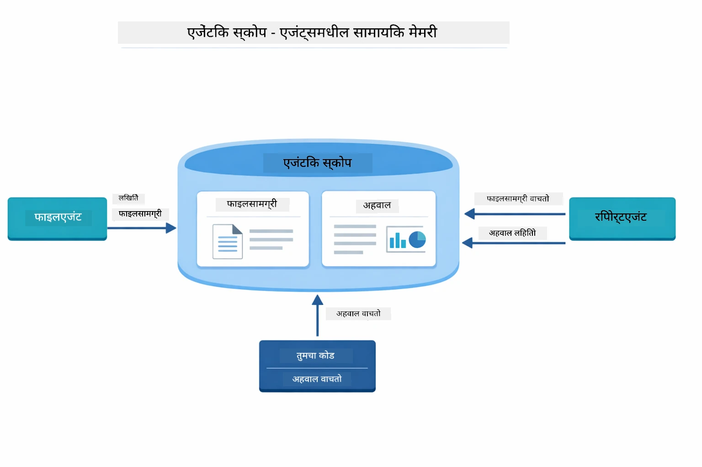

*Agentic Scope हे सामायिक मेमरीप्रमाणे कार्य करते — FileAgent `fileContent` लिहितो, ReportAgent वाचतो आणि `report` लिहितो, आणि तुमचा कोड अंतिम निकाल वाचतो.*

```java
ResultWithAgenticScope<String> result = supervisor.invokeWithAgenticScope(request);
AgenticScope scope = result.agenticScope();
String fileContent = scope.readState("fileContent");  // FileAgent कडून कच्चा फाइल डेटा
String report = scope.readState("report");            // ReportAgent कडून संरचित अहवाल
```


**Agent Listeners** एजंट कार्यान्वयनाचे निरीक्षण आणि डीबगिंग सक्षम करतात. डेमोमध्ये तुम्हाला दिसणारे टप्प्याटप्प्याने आउटपुट प्रत्येक एजंट कॉलमध्ये एक AgentListener कडून येते:
- **beforeAgentInvocation** - पर्यवेक्षक एजंट निवडल्यावर कॉल केले जाते, ज्यामुळे आपल्याला कोणता एजंट का निवडला गेला ते पाहता येते
- **afterAgentInvocation** - एजंट पूर्ण केल्यावर कॉल केले जाते, त्याचा निकाल दाखवते
- **inheritedBySubagents** - जर खरे असेल तर, श्रोता संपूर्ण पदानुक्रमातील एजंट्सवर नजर ठेवतो

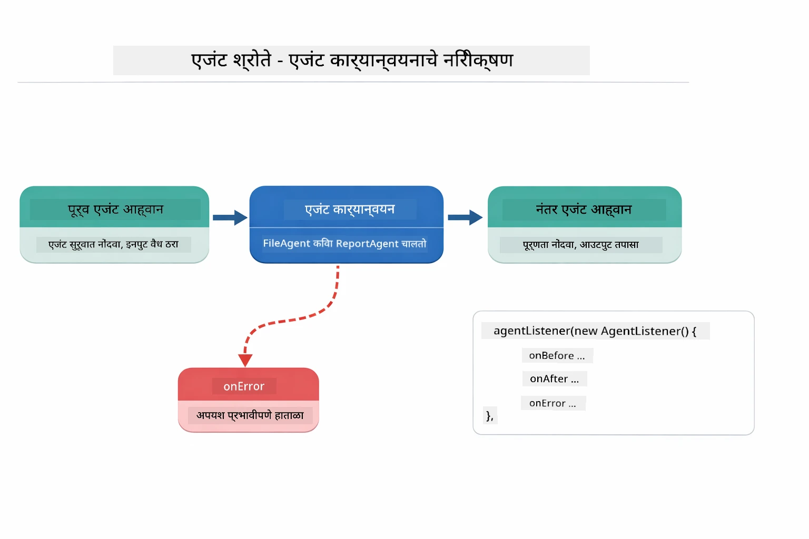

*एजंट श्रोते अंमलबजावणी जीवनचक्रात हुक करतात — एजंट सुरू होतात, पूर्ण होतात किंवा त्रुटी येतात तेव्हा पाहतात.*

```java
AgentListener monitor = new AgentListener() {
    private int step = 0;
    
    @Override
    public void beforeAgentInvocation(AgentRequest request) {
        step++;
        System.out.println("  +-- STEP " + step + ": " + request.agentName());
    }
    
    @Override
    public void afterAgentInvocation(AgentResponse response) {
        System.out.println("  +-- [OK] " + response.agentName() + " completed");
    }
    
    @Override
    public boolean inheritedBySubagents() {
        return true; // सर्व उप-एजंट्सपर्यंत प्रसारित करा
    }
};
```

सुपरव्हायझर पॅटर्न व्यतिरिक्त, `langchain4j-agentic` मॉड्यूल अनेक सामर्थ्यशाली वर्कफ्लो पॅटर्न्स आणि वैशिष्ट्ये प्रदान करते:

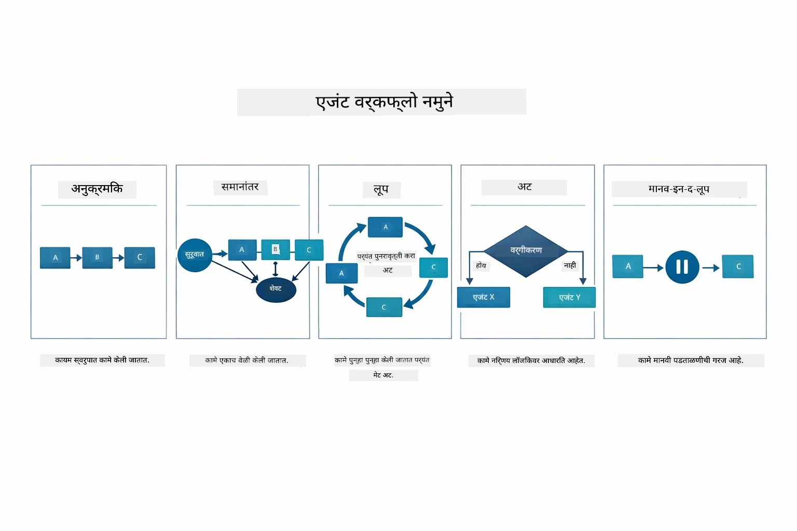

*एजंट्सच्या समन्वयासाठी पाच वर्कफ्लो पॅटर्न्स — साध्या अनुक्रमिक पाइपलाइनपासून मानवी-इन-द-लूप मंजुरी वर्कफ्लोपर्यंत.*

| पॅटर्न | वर्णन | वापर प्रकरण |
|---------|---------|-------------|
| **अनुक्रमिक** | एजंट्सला क्रमाने चालवा, आउटपुट पुढीलकडे वाहते | पाइपलाइन: संशोधन → विश्लेषण → अहवाल |
| **समानांतर** | एजंट्स एकत्रितपणे चालवा | स्वतंत्र कार्ये: हवामान + बातम्या + स्टॉक |
| **लूप** | अट पूर्ण होईपर्यंत पुनरावृत्ती करा | गुणवत्ता गुणांकन: गुण ≥ 0.8 पर्यंत सुधारणा करा |
| **अटी-आधारित** | अटींवर आधारित मार्ग निवडा | वर्गीकरण → विशेषज्ञ एजंटकडे मार्गदर्शन |
| **मानवी-इन-द-लूप** | मानवी तपासणी अंक जोडा | मंजुरी वर्कफ्लो, सामग्री पुनरावलोकन |

## मुख्य संकल्पना

आता जेव्हा आपण MCP आणि एजंटिक मॉड्यूल क्रियाशील पाहिले आहे, तेव्हा प्रत्येक पद्धत कधी वापरावी हे सारांशित करूयात.

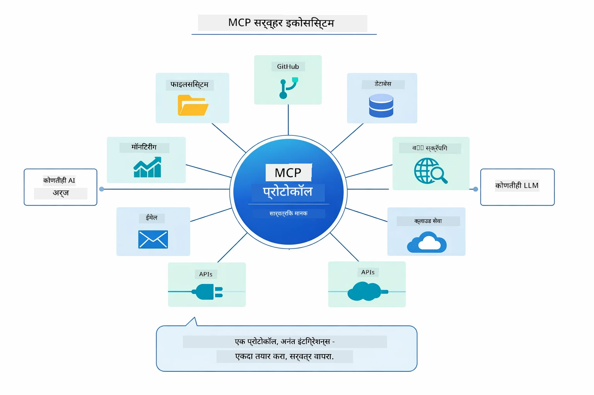

*MCP एक सार्वत्रिक प्रोटोकॉल परिसंस्था तयार करते — कोणताही MCP-सुसंगत सर्व्हर कोणत्याही MCP-सुसंगत क्लायंटसह काम करतो, ज्यामुळे अनुप्रयोगांमध्ये साधने सामायिक करता येतात.*

**MCP** तेव्हा आदर्श आहे जेव्हा आपण विद्यमान साधन परिसंस्था वापरू इच्छित असाल, अशी साधने तयार करू इच्छित असाल जी अनेक अनुप्रयोग सामायिक करू शकतील, तृतीय-पक्ष सेवा मानक प्रोटोकॉलसह समाकलित करू इच्छित असाल, किंवा कोड न बदलता साधन अंमलबजावणी बदलू इच्छित असाल.

**एजंटिक मॉड्यूल** तेव्हा उत्तम काम करते जेव्हा आपण `@Agent` अनुलेखनांसह घोषणात्मक एजंट व्याख्येस आवश्यक असते, वर्कफ्लो समन्वय (अनुक्रमिक, लूप, समानांतर) आवश्यक असतो, आदेशात्मक कोडपेक्षा इंटरफेस-आधारित एजंट डिझाईन पसंत करतो, किंवा अनेक एजंट्स ज्यात आउटपुट `outputKey` द्वारे सामायिक केले जातात त्यांचा संयोजन करू इच्छित असाल.

**सुपरव्हायझर एजंट पॅटर्न** तेव्हा चमकतो जेव्हा वर्कफ्लो पूर्वी ठरलेला नसतो आणि LLMला निर्णय घेण्याची गरज असते, जेव्हा आपल्याकडे बहुतेक तज्ञ एजंट्स असतात ज्यांना गतिशील समन्वय आवश्यक असतो, संभाषण प्रणाली तयार करत असताना जी विविध क्षमता मार्गदर्शन करते, किंवा जेव्हा आपल्याला सर्वात लवचीक, अनुकूली एजंट वर्तन हवे असते.

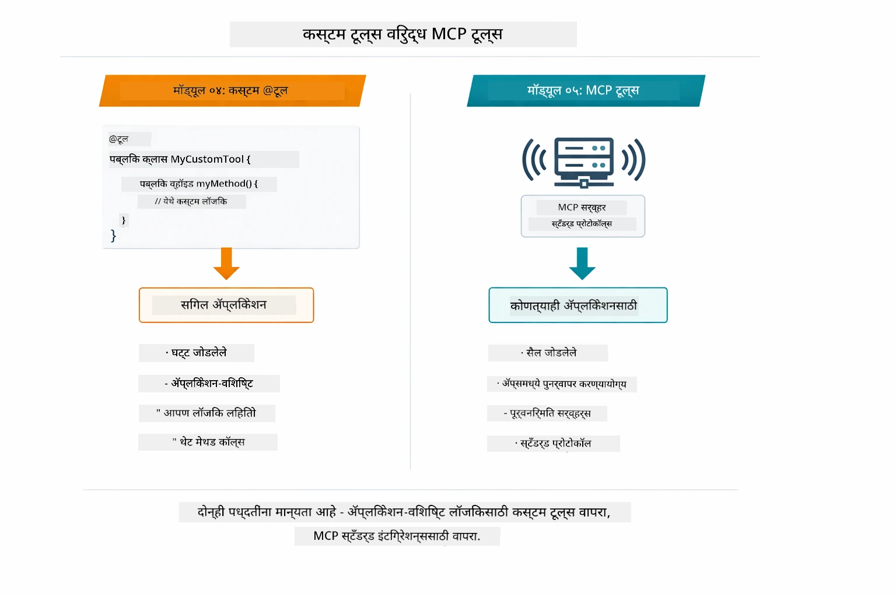

*कधी कस्टम @Tool पद्धती वापरायच्या व कधी MCP साधने — कस्टम साधने अनुप्रयोग-विशिष्ट लॉजिकसाठी संपूर्ण प्रकारानुसार सुरक्षिततेसह, MCP साधने वेगवेगळ्या अनुप्रयोगांसाठी मानकीकृत समाकलनासाठी.*

## अभिनंदन!

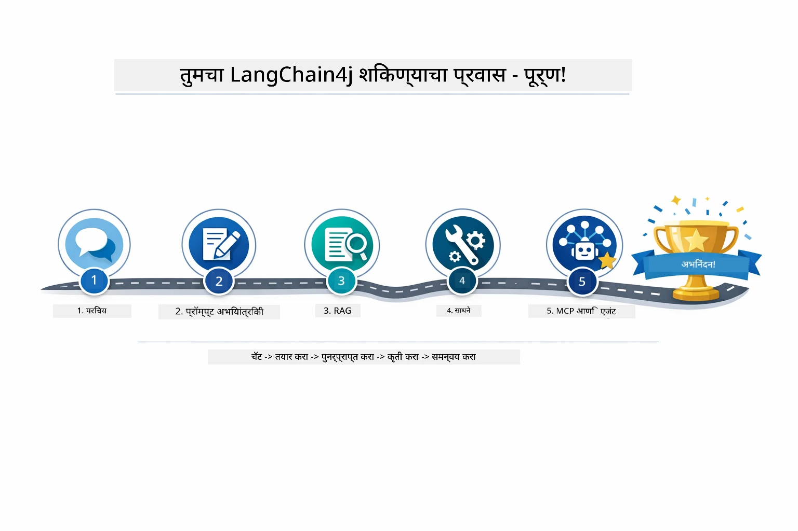

*आपल्या शिक्षण प्रवासामध्ये सर्व पाच मॉड्यूल — मूलभूत चॅटपासून MCP-संचालित एजंटिक प्रणालींपर्यंत.*

आपण LangChain4j for Beginners कोर्स पूर्ण केला आहे. आपण शिकलात:

- स्मृतीसह संभाषणात्मक AI कसे तयार करायचे (मॉड्यूल 01)
- विविध कार्यांसाठी प्रॉम्प्ट अभियांत्रिकी नमुने (मॉड्यूल 02)
- आपल्या कागदपत्रांमध्ये प्रतिसादांची ग्राउंडिंग RAG सह (मॉड्यूल 03)
- कस्टम साधनांसह मूलभूत AI एजंट (सहायक) तयार करणे (मॉड्यूल 04)
- LangChain4j MCP आणि Agentic मॉड्यूलसह मानकीकृत साधने समाकलित करणे (मॉड्यूल 05)

### पुढे काय?

मॉड्यूल्स पूर्ण केल्यानंतर, LangChain4j च्या चाचणी संकल्पना क्रियाशील पाहण्यासाठी [Testing Guide](../docs/TESTING.md) तपासा.

**अधिकृत स्रोत:**
- [LangChain4j Documentation](https://docs.langchain4j.dev/) - सर्वसमावेशक मार्गदर्शक आणि API संदर्भ
- [LangChain4j GitHub](https://github.com/langchain4j/langchain4j) - स्रोत कोड आणि उदाहरणे
- [LangChain4j Tutorials](https://docs.langchain4j.dev/tutorials/) - विविध वापरप्रकरणांसाठी चरण-दर-चरण मार्गदर्शक

हा कोर्स पूर्ण केल्याबद्दल धन्यवाद!

---

**नेव्हिगेशन:** [← मागील: मॉड्यूल 04 - साधने](../04-tools/README.md) | [मुख्यपृष्ठावर परत](../README.md)

---

<!-- CO-OP TRANSLATOR DISCLAIMER START -->
**अस्वीकरण**:
हे दस्तऐवज AI अनुवाद सेवा [Co-op Translator](https://github.com/Azure/co-op-translator) वापरून अनुवादित करण्यात आले आहे. आम्ही अचूकतेसाठी प्रयत्न करतो, तरी कृपया लक्षात ठेवा की स्वयंचलित अनुवादांमध्ये चुका किंवा अचूकतेत त्रुटी असू शकतात. मूळ दस्तऐवज त्याच्या स्थानिक भाषेत अधिकृत स्रोत मानला जाणे आवश्यक आहे. महत्त्वाच्या माहितीसाठी व्यावसायिक मानवी अनुवादाची शिफारस केली जाते. या अनुवादाच्या वापरामुळे उद्भवलेल्या कोणत्याही गैरसमज किंवा चुकीच्या अर्थवापरासाठी आम्ही जबाबदार नाही.
<!-- CO-OP TRANSLATOR DISCLAIMER END -->