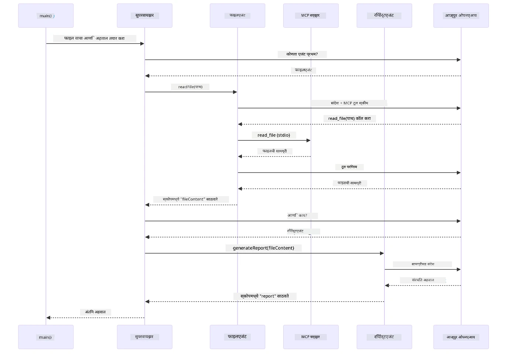

# Module 05: मॉडेल संदर्भ प्रोटोकॉल (MCP)

## आशय सूची

- [व्हिडिओ वॉकथ्रू](../../../05-mcp)
- [तुम्ही काय शिकाल](../../../05-mcp)
- [MCP म्हणजे काय?](../../../05-mcp)
- [MCP कसे कार्य करते](../../../05-mcp)
- [एजेंटिक मॉड्यूल](../../../05-mcp)
- [उदाहरण चालवत आहे](../../../05-mcp)
  - [पूर्वआवश्यकता](../../../05-mcp)
- [जलद प्रारंभ](../../../05-mcp)
  - [फाइल ऑपरेशन्स (Stdio)](../../../05-mcp)
  - [सुपरवायजर एजंट](../../../05-mcp)
    - [डेमो चालवणे](../../../05-mcp)
    - [सुपरवायजर कसा कार्य करतो](../../../05-mcp)
    - [FileAgent कसे MCP टूल्स रनटाईमवर शोधतो](../../../05-mcp)
    - [प्रतिक्रिया धोरणे](../../../05-mcp)
    - [आउटपुट समजून घेणे](../../../05-mcp)
    - [एजेंटिक मॉड्यूल फीचर्सचे स्पष्टीकरण](../../../05-mcp)
- [महत्त्वाचे संकल्पना](../../../05-mcp)
- [अभिनंदन!](../../../05-mcp)
  - [पुढे काय?](../../../05-mcp)

## व्हिडिओ वॉकथ्रू

हा थेट सत्र पाहा ज्यात हा मॉड्यूल कसा सुरू करायचा हे समजावले आहे:

<a href="https://www.youtube.com/watch?v=O_J30kZc0rw"></a>

## तुम्ही काय शिकाल

तुम्ही संभाषणात्मक AI तयार केला आहे, प्रॉम्प्ट्समध्ये पारंगत झाला आहात, दस्तऐवजांमध्ये उत्तरं प्रमाणित केली आहेत, आणि टूल्ससह एजंट्स तयार केले आहेत. परंतु ते सर्व टूल्स तुमच्या विशिष्ट अनुप्रयोगासाठी सानुकूल बनवलेले होते. जर तुम्हाला तुमच्या AI ला एक प्रमाणित टूल्स इकोसिस्टिम देता आली जिथे कोणालाही टूल्स तयार करण्याची आणि शेअर करण्याची मुभा असेल तर? या मॉड्यूलमध्ये तुम्ही Model Context Protocol (MCP) आणि LangChain4j च्या एजेंटिक मॉड्यूलसह तसेच करण्याचा मार्ग शिकाल. आम्ही प्रथम एक सोपा MCP फाइल रीडर दाखवतो आणि नंतर दर्शवितो की तो कसा Supervisor Agent पॅटर्न वापरून प्रगत एजेंटिक वर्कफ्लोजमध्ये सहज एकत्रित होतो.

## MCP म्हणजे काय?

Model Context Protocol (MCP) याने अगदी तसंच पुरवलं आहे - AI अनुप्रयोगांना बाह्य टूल्स शोधण्याचा आणि वापरण्याचा एक प्रमाणित मार्ग. प्रत्येक डेटा स्रोत किंवा सेवेसाठी सानुकूल इंटीग्रेशन लिहिण्याऐवजी, तुम्ही MCP सर्व्हरशी जोडता जे त्यांच्या क्षमता एकसारख्या स्वरूपात व्यक्त करतात. तुमचा AI एजंट नंतर हे टूल्स स्वयंचलितपणे शोधू शकतो आणि वापरू शकतो.

खालिल आकृती दाखवते फरक — MCP शिवाय, प्रत्येक इंटीग्रेशनसाठी सानुकूल बिंदू-ते-बिंदू वायरिंग आवश्यक आहे; MCP सह, एकच प्रोटोकॉल तुमचा अ‍ॅप कोणत्याही टूलशी जोडतो:


*MCP पूर्वी: गुंतागुंतीचे बिंदू-ते-बिंदू इंटीग्रेशन्स. MCP नंतर: एक प्रोटोकॉल, असीम शक्यता.*

MCP AI विकासातील मूलभूत समस्या सोडवतो: प्रत्येक इंटीग्रेशन सानुकूल असते. GitHub कडे प्रवेश हवा आहे का? सानुकूल कोड. फाइल वाचायची आहे का? सानुकूल कोड. डेटाबेस क्वेरी करायची आहे का? सानुकूल कोड. आणि हे कोणतेही इंटीग्रेशन्स इतर AI अनुप्रयोगांसोबत कार्य करत नाहीत.

MCP याला प्रमाणित करतो. एक MCP सर्व्हर स्पष्ट वर्णन आणि स्कीमा असलेले टूल्स प्रदर्शित करतो. कोणताही MCP क्लायंट कनेक्ट होऊ शकतो, उपलब्ध टूल्स शोधू शकतो, आणि वापरू शकतो. एकदा तयार करा, सर्वत्र वापरा.

खालिल आकृती यांचे आर्किटेक्चर दर्शविते — एक MCP क्लायंट (तुमचा AI अनुप्रयोग) अनेक MCP सर्व्हरशी कनेक्ट होतो, प्रत्येक त्यांच्या स्वतःच्या टूल्ससह प्रमाणित प्रोटोकॉल वापरून:


*Model Context Protocol आर्किटेक्चर - प्रमाणित टूल शोध व अंमलबजावणी*

## MCP कसे कार्य करते

खालच्या स्तरावर, MCP एक स्तरित आर्किटेक्चर वापरतो. तुमचा Java अ‍ॅप्लिकेशन (MCP क्लायंट) उपलब्ध टूल्स शोधतो, JSON-RPC विनंत्या ट्रान्सपोर्ट लेयर (Stdio किंवा HTTP) द्वारे पाठवतो, आणि MCP सर्व्हर ऑपरेशन्स अंमलात आणतो व निकाल परत करतो. खाली दिलेली आकृती या प्रोटोकॉलचा प्रत्येक स्तर स्पष्ट करते:


*MCP कसे कार्य करते — क्लायंट टूल्स शोधतो, JSON-RPC संदेश विनिमयित करतो, आणि ट्रान्सपोर्ट लेयरद्वारे ऑपरेशन्स अंमलात आणतो.*

**सर्व्हर-क्लायंट आर्किटेक्चर**

MCP क्लायंट-सर्व्हर मॉडेल वापरतो. सर्व्हर्स टूल्स पुरवतात - फाइल्स वाचणे, डेटाबेस क्वेरी करणे, API कॉल करणे. क्लायंट्स (तुमचा AI अनुप्रयोग) सर्व्हरशी कनेक्ट होतात आणि त्यांचे टूल्स वापरतात.

LangChain4j सह MCP वापरण्यासाठी हे Maven dependency जोडा:

```xml
<dependency>
    <groupId>dev.langchain4j</groupId>
    <artifactId>langchain4j-mcp</artifactId>
    <version>${langchain4j.version}</version>
</dependency>
```

**टूल डिस्कव्हरी**

जेव्हा तुमचा क्लायंट MCP सर्व्हरशी कनेक्ट होतो, तेव्हा तो विचारतो "तुमच्याकडे कोणती टूल्स आहेत?" सर्व्हर त्याचा उपलब्ध टूल्सची यादी, वर्णने आणि पॅरामीटर स्कीमा सह परत करतो. तुमचा AI एजंट वापरकर्त्यांच्या विनंत्यांनुसार कोणते टूल्स वापरायचे हे ठरवू शकतो. खाली आकृतीमध्ये हे हातमिळवणी दाखवलेली आहे — क्लायंट `tools/list` विनंती पाठवतो आणि सर्व्हर त्याचे उपलब्ध टूल्स आणि वर्णने स्कीमांसह परत पाठवतो:


*AI स्टार्टअपमध्ये उपलब्ध टूल्स शोधते — आता त्याला काय क्षमता उपलब्ध आहेत हे समजले आहे आणि कोणता वापरायचा हे ठरवू शकते.*

**ट्रान्सपोर्ट मॅकॅनिझम**

MCP वेगवेगळ्या ट्रान्सपोर्ट मॅकॅनिझमला समर्थन देतो. दोन पर्याय आहेत Stdio (स्थानिक सबप्रॉसेससाठी) आणि Streamable HTTP (रिमोट सर्व्हर्ससाठी). हा मॉड्यूल Stdio ट्रान्सपोर्ट दाखवितो:


*MCP चा ट्रान्सपोर्ट मॅकॅनिझम: रिमोट सर्व्हर्ससाठी HTTP, स्थानिक प्रक्रियांसाठी Stdio*

**Stdio** - [StdioTransportDemo.java](../../../05-mcp/src/main/java/com/example/langchain4j/mcp/StdioTransportDemo.java)

स्थानिक प्रोसेससाठी. तुमचा अ‍ॅप्लिकेशन सर्व्हर एक उपप्रक्रियेसारखा निर्माण करतो आणि मानक इनपुट/आउटपुट चॅनेलद्वारे संवाद साधतो. फायली सिस्टीम प्रवेश किंवा कमांड-लाइन टूल्ससाठी उपयुक्त.

```java
McpTransport stdioTransport = new StdioMcpTransport.Builder()
    .command(List.of(
        npmCmd, "exec",
        "@modelcontextprotocol/server-filesystem@2025.12.18",
        resourcesDir
    ))
    .logEvents(false)
    .build();
```

`@modelcontextprotocol/server-filesystem` सर्व्हर खालील टूल्स प्रदर्शित करतो, सर्व काही तुम्ही निर्दिष्ट केलेल्या निर्देशिकांमध्ये संकुचित:

| टूल | वर्णन |
|------|-------------|
| `read_file` | एकाच फाइलच्या सामग्री वाचा |
| `read_multiple_files` | एका कॉलमध्ये अनेक फाइल्स वाचा |
| `write_file` | फाइल तयार करा किंवा ओव्हरराईट करा |
| `edit_file` | लक्षित शोधा-आणि-बदल करा |
| `list_directory` | मार्गावरील फाइल्स आणि निर्देशिका यादी करा |
| `search_files` | एखाद्या नमुन्यास अनुरूप फाइल्स पुनरावृत्तीने शोधा |
| `get_file_info` | फाइल मेटाडेटा मिळवा (आकार, टाईमस्टॅम्प, परवानग्या) |
| `create_directory` | निदेशक तयार करा (पालक निर्देशकांसह) |
| `move_file` | फाइल किंवा निर्देशिका हलवा किंवा नाव बदला |

खालिल आकृती रनटाईमवर Stdio ट्रान्सपोर्ट कसा कार्य करतो ते दाखवते — तुमचा Java अ‍ॅप्लिकेशन MCP सर्व्हरला मुलप्रक्रियेसारखा जन्म देतो आणि ते stdin/stdout चॅन्सल्सद्वारे संवाद साधतात, कोणतेही नेटवर्क किंवा HTTP यामध्ये नसते:


*Stdio ट्रान्सपोर्ट प्रत्यक्षात — तुमचा अ‍ॅप्लिकेशन MCP सर्व्हरला उपप्रक्रियेसारखा निर्माण करतो आणि stdin/stdout पाइप्सद्वारे संवाद साधतो.*

> **🤖 [GitHub Copilot](https://github.com/features/copilot) चॅट सह प्रयत्न करा:** [`StdioTransportDemo.java`](../../../05-mcp/src/main/java/com/example/langchain4j/mcp/StdioTransportDemo.java) उघडा आणि विचारा:
> - "Stdio ट्रान्सपोर्ट कसा कार्य करतो आणि मला HTTP पेक्षा कधी वापरावा?"
> - "LangChain4j MCP सर्व्हर प्रक्रिया कशी व्यवस्थापित करतो?"
> - "AI ला फाइल सिस्टम प्रवेश देण्याचे सुरक्षा परिणाम काय आहेत?"

## एजेंटिक मॉड्यूल

MCP प्रमाणित टूल्स पुरवतो, तर LangChain4j चा **एजेंटिक मॉड्यूल** त्यांची अंमलबजावणी करणारे एजंट तयार करण्याचा घोषणात्मक मार्ग पुरवतो. `@Agent` अ‍ॅनोटेशन आणि `AgenticServices` तुम्हाला एजंटचे वर्तन इंटरफेसद्वारे कसे सांगायचे ते परवानगी देतात, ज्यामुळे अनिवार्य कोड लेखीकरण टाळता येते.

या मॉड्यूलमध्ये, तुम्ही **सुपरवायजर एजंट** पॅटर्नसह परिचित व्हाल — एक प्रगत एजेंटिक AI पद्धत जिथे "सुपरवायजर" एजंट वापरकर्त्याच्या विनंत्यांनुसार कोणते उपएजंट कॉल करायचे हे गतिशीलरीत्या ठरवतो. आम्ही दोन्ही संकल्पना एकत्र करून एका उपएजंटला MCP-शक्तीशाली फाइल प्रवेश क्षमता देत आहोत.

एजेंटिक मॉड्यूल वापरण्यासाठी हे Maven dependency जोडा:

```xml
<dependency>
    <groupId>dev.langchain4j</groupId>
    <artifactId>langchain4j-agentic</artifactId>
    <version>${langchain4j.mcp.version}</version>
</dependency>
```
> **टीप:** `langchain4j-agentic` मॉड्यूल वेगळ्या वेळापत्रकावर रिलीज होते, म्हणून त्याला स्वतंत्र आवृत्ती प्रॉपर्टी (`langchain4j.mcp.version`) आहे.

> **⚠️ प्रयोगात्मक:** `langchain4j-agentic` मॉड्यूल **प्रयोगात्मक** आहे आणि बदलासाठी बाध्य आहे. स्थिर AI सहाय्यक तयार करण्याचा मार्ग `langchain4j-core` सानुकूल टूल्ससह राहतो (Module 04).

## उदाहरण चालवत आहे

### पूर्वआवश्यकता

- पूर्ण [Module 04 - Tools](../04-tools/README.md) (हा मॉड्यूल सानुकूल टूल संकल्पनांवर आधारित असून MCP टूल्सशी तुलना करतो)
- रूट निर्देशिकेत `.env` फाइल (Module 01 मध्ये `azd up` ने तयार केलेली) ज्यात Azure प्रमाणपत्रे आहेत
- Java 21+, Maven 3.9+
- Node.js 16+ आणि npm (MCP सर्व्हर्ससाठी)

> **टीप:** जर तुम्ही पर्यावरण बदल noch setups केले नसलात, तर तैनाती सूचना साठी पहा [Module 01 - Introduction](../01-introduction/README.md) (`azd up` स्वतःहून `.env` फाइल तयार करते), किंवा `.env.example` कॉपी करून `.env` मध्ये भरा.

## जलद प्रारंभ

**VS कोड वापरून:** Explorer मध्ये कोणत्याही डेमो फाइलवर उजव्या क्लिक करा आणि **"Run Java"** निवडा, किंवा Run आणि Debug पॅनेलमधील लॉन्च कॉन्फिगरेशन वापरा (तुमची `.env` फाइल Azure प्रमाणपत्रांसह सेटअप करत असल्याची खात्री करा).

**Maven वापरून:** किंवा तुम्ही खालील उदाहरणांसह कमांड लाइनवरून चालवू शकता.

### फाइल ऑपरेशन्स (Stdio)

हा स्थानिक सबप्रॉसेस आधारित टूल्स दाखवतो.

**✅ कोणतीही पूर्वआवश्यकता नाही** - MCP सर्व्हर आपोआप निर्माण होतो.

**स्टार्ट स्क्रिप्ट्स वापरणे (शिफारस केलेले):**

स्टार्ट स्क्रिप्ट्स आपोआप `.env` फाइलमधील पर्यावरण बदल लोड करतात:

**Bash:**
```bash
cd 05-mcp
chmod +x start-stdio.sh
./start-stdio.sh
```

**PowerShell:**
```powershell
cd 05-mcp
.\start-stdio.ps1
```

**VS कोड वापरून:** `StdioTransportDemo.java` वर उजव्या क्लिक करा आणि **"Run Java"** निवडा (तुमची `.env` फाइल कॉन्फिगर केलेली असावी).

अ‍ॅप्लिकेशन आपोआप फाइलसिस्टम MCP सर्व्हर निर्माण करतो आणि स्थानिक फाइल वाचतो. लक्षात घ्या कसे सबप्रोसेस व्यवस्थापन तुमच्यासाठी हाताळले जाते.

**अपेक्षित आउटपुट:**
```
Assistant response: The file provides an overview of LangChain4j, an open-source Java library
for integrating Large Language Models (LLMs) into Java applications...
```

### सुपरवायजर एजंट

**सुपरवायजर एजंट पॅटर्न** ही एजेंटिक AI चे एक **लवचिक** रूप आहे. सुपरवायजर वापरकर्त्याच्या विनंतीनुसार कोणते एजंट्स कॉल करायचे ते स्वयंचलितपणे ठरवतो LLM चा वापर करून. पुढील उदाहरणात, आम्ही MCP-शक्तीशाली फाइल प्रवेश LLM एजंटसह एकत्र करून एक नियंत्रित फाइल वाचन → अहवाल तयार व्हर्कफ्लो निर्माण करतो.

डेमो मध्ये, `FileAgent` MCP फाइलसिस्टम टूल्सने फाइल वाचतो, आणि `ReportAgent` एक संरचित अहवाल तयार करतो ज्यात एक कार्यकारी सारांश (एक वाक्य), 3 मुख्य मुद्दे, आणि शिफारशी असतात. सुपरवायजर हा प्रवाह आपोआप समन्वयित करतो:


*सुपरवायजर त्याच्या LLM वापरून ठरवतो कोणते एजंट कॉल करायचे आणि कोणत्या क्रमाने — कोणतेही हार्डकोडेड राऊटिंग आवश्यक नाही.*

आमच्या फाइल-टू-रिपोर्ट पाईपलाइनसाठी प्रत्यक्ष वर्कफ्लो असे दिसते:


*FileAgent MCP टूल्सद्वारे फाइल वाचतो, नंतर ReportAgent कच्च्या सामग्रीला संरचित अहवालात रूपांतरित करतो.*

खालिल सिक्वेन्स डायग्राम सुपरवायजरचे पूर्ण समन्वय दाखवतो — MCP सर्व्हर निर्माण करण्यापासून, सुपरवायजरचा स्वायत्त एजंट निवड, stdio वर टूल कॉल्स, आणि शेवटचा अहवाल:



*सुपरवायजर स्वायत्तपणे FileAgent ला कॉल करतो (जो MCP सर्व्हरवरून stdio वापरून फाइल वाचतो), नंतर ReportAgent ला कॉल करतो संरचित अहवाल तयार करण्यासाठी — प्रत्येक एजंट त्याचा आउटपुट सामायिक Agentic Scope मध्ये साठवतो.*

प्रत्येक एजंट त्याचा आउटपुट **Agentic Scope** (सामायिक मेमरी) मध्ये साठवतो, ज्यामुळे पुढच्या एजंट्सना पूर्वीच्या निकालांमध्ये प्रवेश मिळतो. हे दाखवते की MCP टूल्स एजेंटिक वर्कफ्लोजमध्ये कसे सहजपणे एकत्र केले जातात — सुपरवायजरला फाइल कशी वाचली जाते हे माहित असण्याची गरज नाही, फक्त माहित आहे की `FileAgent` ते करू शकतो.

#### डेमो कसे चालवायचे

स्टार्ट स्क्रिप्ट्स आपोआप रूट `.env` फाइलमधील पर्यावरण बदल लोड करतात:

**Bash:**
```bash
cd 05-mcp
chmod +x start-supervisor.sh
./start-supervisor.sh
```

**PowerShell:**
```powershell
cd 05-mcp
.\start-supervisor.ps1
```

**VS कोड वापरून:** `SupervisorAgentDemo.java` वर उजव्या क्लिक करा आणि **"Run Java"** निवडा (तुमची `.env` फाइल कॉन्फिगर केलेली असावी).

#### सुपरवायजर कसा कार्य करतो

एजंट तयार करण्यापूर्वी, तुम्हाला MCP ट्रान्सपोर्ट क्लायंटशी कनेक्ट करावा लागतो आणि तो `ToolProvider` म्हणून रॅप करावा लागतो. अशा प्रकारे MCP सर्व्हरचे टूल्स तुमच्या एजंटसाठी उपलब्ध होतात:

```java
// ट्रान्सपोर्टमधून MCP क्लायंट तयार करा
McpClient mcpClient = new DefaultMcpClient.Builder()
        .transport(stdioTransport)
        .build();

// क्लायंटला ToolProvider म्हणून झाकणे — हे MCP टूल्सना LangChain4j मध्ये जोडते
ToolProvider mcpToolProvider = McpToolProvider.builder()
        .mcpClients(List.of(mcpClient))
        .build();
```

आता तुम्ही `mcpToolProvider` कुठल्याही एजंटमध्ये इंजेक्ट करू शकता ज्याला MCP टूल्सची गरज आहे:

```java
// टप्पा 1: FileAgent MCP साधने वापरून फाइल्स वाचतो
FileAgent fileAgent = AgenticServices.agentBuilder(FileAgent.class)
        .chatModel(model)
        .toolProvider(mcpToolProvider)  // फाइल ऑपरेशन्ससाठी MCP साधने आहेत
        .build();

// टप्पा 2: ReportAgent संरचित अहवाल तयार करतो
ReportAgent reportAgent = AgenticServices.agentBuilder(ReportAgent.class)
        .chatModel(model)
        .build();

// Supervisor फाइल → अहवाल वर्कफ्लोचे नियोजन करतो
SupervisorAgent supervisor = AgenticServices.supervisorBuilder()
        .chatModel(model)
        .subAgents(fileAgent, reportAgent)
        .responseStrategy(SupervisorResponseStrategy.LAST)  // अंतिम अहवाल परत करा
        .build();

// विनंतीनुसार कोणते एजंट कॉल करायचे ते Supervisor ठरवतो
String response = supervisor.invoke("Read the file at /path/file.txt and generate a report");
```

#### FileAgent कसे MCP टूल्स रनटाइमवर शोधतो

तुम्हाला कदाचित आश्चर्य वाटेल: **`FileAgent` ला npm फाइलसिस्टम टूल्स वापरण्याचा कसा कळतो?** उत्तर म्हणजे कळत नाही — **LLM** रनटाइमवर टूल स्कीमा वापरून ते शोधतो.
`FileAgent` इंटरफेस फक्त एक **प्रॉम्प्ट व्याख्या** आहे. यात `read_file`, `list_directory`, किंवा इतर कोणत्याही MCP टूलचे हार्डकोडेड ज्ञान नाही. येथे संपूर्ण प्रक्रियेतील काय होते ते दिले आहे:

1. **सर्व्हर सुरू होतो:** `StdioMcpTransport` `@modelcontextprotocol/server-filesystem` npm पॅकेजला चाईल्ड प्रोसेस म्हणून लॉन्च करते  
2. **टूल शोध:** `McpClient` सर्व्हरकडे `tools/list` JSON-RPC विनंती पाठवतो, जो टूल नावे, वर्णने, आणि पॅरामीटर स्कीमा (उदा. `read_file` — *"फाइलचा पूर्ण मजकूर वाचा"* — `{ path: string }`) पाठवतो  
3. **स्कीमा इंजेक्शन:** `McpToolProvider` या शोधलेल्या स्कीमांना लपेटतो आणि ते LangChain4j ला उपलब्ध करून देतो  
4. **LLM ठरवतो:** जेव्हा `FileAgent.readFile(path)` कॉल होते, तेव्हा LangChain4j सिस्टम संदेश, वापरकर्ता संदेश, **आणि टूल स्कीमांची यादी** LLM कडे पाठवतो. LLM टूलच्या वर्णनांचे वाचन करून टूल कॉल तयार करतो (उदा. `read_file(path="/some/file.txt")`)  
5. **कार्यन्वयन:** LangChain4j टूल कॉल इंटरसेप्ट करतो, ते MCP क्लायंट मार्फत Node.js सबप्रोसेसमध्ये पाठवतो, निकाल मिळवतो, आणि तो पुन्हा LLM कडे देतो  

हेच वरील [Tool Discovery](../../../05-mcp) यंत्रणा आहे, पण एजंट वर्कफ्लोवर विशेषतः लागू केलेले. `@SystemMessage` आणि `@UserMessage` अॅनोटेशन्स LLM च्या वर्तनाचे मार्गदर्शन करतात, तर इंजेक्ट केलेले `ToolProvider` त्याला **क्षमता** भागवतो — LLM रनटाइमवर या दोघांना जोडतो.

> **🤖 [GitHub Copilot](https://github.com/features/copilot) Chat सह प्रयत्न करा:** [`FileAgent.java`](../../../05-mcp/src/main/java/com/example/langchain4j/mcp/agents/FileAgent.java) उघडा आणि विचार करा:  
> - "हा एजंट कोणता MCP टूल कॉल करायचा ते कसे माहित करतो?"  
> - "जर मी एजंट बिल्डरमधून ToolProvider काढल्यास काय होईल?"  
> - "टूल स्कीमा LLM कडे कसे पाठवले जातात?"

#### प्रतिसाद धोरणे

जेव्हा तुम्ही `SupervisorAgent` कॉन्फिगर करता, तेव्हा तुम्ही ठरवता की सब-एजंट्सने आपले कार्य पूर्ण केल्यानंतर वापरकर्त्यासाठी अंतिम उत्तर कसे ठरवेल. खालील आकृतीत तीन उपलब्ध धोरणे दाखवले आहेत — LAST थेट अंतिम एजंटची आउटपुट देते, SUMMARY सर्व आउटपुट्स LLM द्वारे संयोजित करून देते, आणि SCORED मूळ विनंतीशी तुलना करून उच्च गुण मिळवलेली आउटपुट निवडतो:


*Supervisor अंतिम उत्तर कसे तयार करतो यासाठी तीन धोरणे — शेवटचा एजंट आउटपुट, समारोपित सारांश, अथवा सर्वोत्तम गुण मिळवलेला पर्याय निवडा.*

उपलब्ध धोरणे:

| धोरण | वर्णन |
|----------|-------------|
| **LAST** | सुपरवायझर शेवटच्या सब-एजंट किंवा टूलने परत केलेले आउटपुट परत करतो. जेव्हा कार्यप्रवाहातील अंतिम एजंट पूर्ण, अंतिम उत्तर तयार करण्यासाठी असतो तेव्हा हे उपयुक्त असते (उदा. संशोधन पाईपलाइनमधील "Summary Agent"). |
| **SUMMARY** | सुपरवायझर स्वतःच्या अंतर्गत LLM चा वापर करून संपूर्ण संवादाचा व सर्व सब-एजंट आउटपुटचा सारांश तयार करतो आणि तो अंतिम प्रतिसाद म्हणून परत करतो. हे वापरकर्त्यास स्वच्छ, संक्षिप्त उत्तर देते. |
| **SCORED** | सिस्टम अंतर्गत LLM चा वापर करून LAST प्रतिसाद व संवादाचा SUMMARY मूळ विनंतीशी तुलना करतो, आणि उच्च गुण मिळवलेली आउटपुट परत करतो. |

पूर्ण अंमलबजावणीसाठी [SupervisorAgentDemo.java](../../../05-mcp/src/main/java/com/example/langchain4j/mcp/SupervisorAgentDemo.java) पहा.

> **🤖 [GitHub Copilot](https://github.com/features/copilot) Chat सह प्रयत्न करा:** [`SupervisorAgentDemo.java`](../../../05-mcp/src/main/java/com/example/langchain4j/mcp/SupervisorAgentDemo.java) उघडा आणि विचार करा:  
> - "सुपरवायझर कोणते एजंट कॉल करायचे हे कसे ठरवतो?"  
> - "Supervisor आणि Sequential workflow मधील फरक काय आहे?"  
> - "Supervisor चे नियोजन वर्तन मी कसे सानुकूलित करू शकतो?"

#### आउटपुट समजून घेणे

जेव्हा तुम्ही डेमो चालवता, तेव्हा तुम्हाला सुपरवायझर कसे एकाधिक एजंट्स चे आयोजन करतो याचे संरचित वॉकथ्रू दिसेल. प्रत्येक विभागाचा अर्थ खालीलप्रमाणे:

```
======================================================================
  FILE → REPORT WORKFLOW DEMO
======================================================================

This demo shows a clear 2-step workflow: read a file, then generate a report.
The Supervisor orchestrates the agents automatically based on the request.
```
  
**हेडर** कार्यप्रवाह संकल्पना सादर करतो: फाइल वाचनापासून रिपोर्ट तयार करण्यापर्यंत लक्ष केंद्रित पाईपलाइन.  

```
--- WORKFLOW ---------------------------------------------------------
  ┌─────────────┐      ┌──────────────┐
  │  FileAgent  │ ───▶ │ ReportAgent  │
  │ (MCP tools) │      │  (pure LLM)  │
  └─────────────┘      └──────────────┘
   outputKey:           outputKey:
   'fileContent'        'report'

--- AVAILABLE AGENTS -------------------------------------------------
  [FILE]   FileAgent   - Reads files via MCP → stores in 'fileContent'
  [REPORT] ReportAgent - Generates structured report → stores in 'report'
```
  
**वर्कफ्लो डायग्राम** एजंट्समधील डेटा प्रवाह दर्शवतो. प्रत्येक एजंटचा विशिष्ट रोल आहे:  
- **FileAgent** MCP टूल्स वापरून फाइल वाचतो आणि कच्चा मजकूर `fileContent` मध्ये साठवतो  
- **ReportAgent** तो मजकूर वापरून `report` मध्ये संरचित रिपोर्ट तयार करतो  

```
--- USER REQUEST -----------------------------------------------------
  "Read the file at .../file.txt and generate a report on its contents"
```
  
**वापरकर्ता विनंती** कार्य दर्शवते. सुपरवायझर हे पार्स करून FileAgent → ReportAgent invoke करण्याचा निर्णय घेतो.  

```
--- SUPERVISOR ORCHESTRATION -----------------------------------------
  The Supervisor decides which agents to invoke and passes data between them...

  +-- STEP 1: Supervisor chose -> FileAgent (reading file via MCP)
  |
  |   Input: .../file.txt
  |
  |   Result: LangChain4j is an open-source, provider-agnostic Java framework for building LLM...
  +-- [OK] FileAgent (reading file via MCP) completed

  +-- STEP 2: Supervisor chose -> ReportAgent (generating structured report)
  |
  |   Input: LangChain4j is an open-source, provider-agnostic Java framew...
  |
  |   Result: Executive Summary...
  +-- [OK] ReportAgent (generating structured report) completed
```
  
**सुपरवायझर ऑर्केस्ट्रेशन** २-टप्पा प्रवाह दाखवते:  
1. **FileAgent** MCP द्वारे फाइल वाचतो आणि मजकूर साठवतो  
2. **ReportAgent** मजकूर घेतो आणि संरचित रिपोर्ट तयार करतो  

सुपरवायझरने हे निर्णय वापरकर्त्याच्या विनंतीनुसार **स्वतंत्रपणे** घेतले.  

```
--- FINAL RESPONSE ---------------------------------------------------
Executive Summary
...

Key Points
...

Recommendations
...

--- AGENTIC SCOPE (Data Flow) ----------------------------------------
  Each agent stores its output for downstream agents to consume:
  * fileContent: LangChain4j is an open-source, provider-agnostic Java framework...
  * report: Executive Summary...
```
  
#### एजंटिक मॉड्यूल वैशिष्ट्यांचे स्पष्टीकरण

हे उदाहरण एजंटिक मॉड्यूलची अनेक प्रगत वैशिष्ट्ये दर्शवते. चला Agentic Scope आणि Agent Listeners जवळून पाहूया.

**Agentic Scope** shared memory दर्शवते जिथे एजंट्सनी `@Agent(outputKey="...")` वापरून आपले निकाल साठवले. हे सक्षम करते:  
- नंतरचे एजंट्स आधीच्या एजंट्सचे आउटपुट वापरू शकतात  
- सुपरवायझर अंतिम प्रतिसाद तयार करू शकतो  
- तुम्ही प्रत्येक एजंटने काय तयार केले ते तपासू शकता  

खालील आकृती दाखवते की Agentic Scope फाइल-टू-रिपोर्ट कार्यप्रवाहात कसे shared memory प्रमाणे कार्य करते — FileAgent आपले आउटपुट `fileContent` खाली लिहितो, ReportAgent वाचतो आणि आपले आउटपुट `report` खाली लिहितो:  


*Agentic Scope shared memory प्रमाणे कार्य करते — FileAgent `fileContent` लिहितो, ReportAgent ते वाचतो आणि `report` लिहितो, आणि तुमचा कोड अंतिम निकाल वाचतो.*

```java
ResultWithAgenticScope<String> result = supervisor.invokeWithAgenticScope(request);
AgenticScope scope = result.agenticScope();
String fileContent = scope.readState("fileContent");  // FileAgent कडून कच्चा फाइल डेटा
String report = scope.readState("report");            // ReportAgent कडून रचनाबद्ध अहवाल
```
  
**Agent Listeners** एजंट कार्यान्वयनाच्या मॉनिटरिंग आणि डिबगिंगसाठी सक्षम करतात. डेमोमध्ये दिसणारे टप्प्याटप्प्याचे आउटपुट प्रत्येक एजंट कॉलसाठी AgentListener मधून येते:  
- **beforeAgentInvocation** - सुपरवायझर एजंट निवडल्यावर कॉल होतो, तुम्हाला कोणता एजंट का निवडला ते दिसते  
- **afterAgentInvocation** - एजंट पूर्ण झाल्यावर कॉल होतो आणि त्याचा निकाल दाखवतो  
- **inheritedBySubagents** - जर true असेल तर लिसनर संपूर्ण हायरेरकीतील एजंट्सवर लक्ष्य करतो  

खालील आकृती पूर्ण Agent Listener लाइफसायकल दाखवते, ज्यात `onError` एजंट कार्यान्वयनातील त्रुटी हाताळते:  


*Agent Listeners कार्यान्वयन lifecycle मध्ये हुक करतात — एजंट्स सुरू होताना, पूर्ण होताना, किंवा त्रुटी असताना मॉनिटर करा.*

```java
AgentListener monitor = new AgentListener() {
    private int step = 0;
    
    @Override
    public void beforeAgentInvocation(AgentRequest request) {
        step++;
        System.out.println("  +-- STEP " + step + ": " + request.agentName());
    }
    
    @Override
    public void afterAgentInvocation(AgentResponse response) {
        System.out.println("  +-- [OK] " + response.agentName() + " completed");
    }
    
    @Override
    public boolean inheritedBySubagents() {
        return true; // सर्व उप-एजंटकडे प्रसारित करा
    }
};
```
  
सुपरवायझर पॅटर्न व्यतिरिक्त, `langchain4j-agentic` मॉड्यूल अनेक शक्तिशाली वर्कफ्लो पॅटर्न्स देतो. खालील आकृती सर्व पाच दाखवते — सोप्या अनुक्रमिक पाईपलाइनपासून मानवी-अनुमोदन वर्कफ्लोपर्यंत:  


*एजंट ऑर्केस्ट्रेशनसाठी पाच कार्यप्रवाह पॅटर्न — सोप्या अनुक्रमिक पाईपलाइनपासून मानवी-अनुमोदन वर्कफ्लोपर्यंत.*

| पॅटर्न | वर्णन | वापर केसा |
|---------|-------------|----------|
| **Sequential** | एजंट्स अनुक्रमाने चालवा, आउटपुट पुढीलकडे | पाईपलाइन: संशोधन → विश्लेषण → रिपोर्ट |
| **Parallel** | एजंट्स एकाच वेळी चालवा | स्वतंत्र कार्य: हवामान + बातम्या + स्टॉक्स |
| **Loop** | पर्याय पूर्ण होईपर्यंत पुनरावृत्ती करा | गुणवत्ता गुणांकन: स्कोअर ≥ 0.8 पर्यंत सुधारा |
| **Conditional** | अटींवर आधारित मार्गदर्शन | वर्गीकरण → विशेषज्ञ एजंटकडे रूट करा |
| **Human-in-the-Loop** | मानवी तपासणी गुजरात करा | अनुमोदन प्रक्रिया, सामग्री पुनरावलोकन |

## मुख्य संकल्पना

आता तुम्ही MCP आणि एजंटिक मॉड्यूलचा उपयोग पाहिला आहे, तर कोणती पद्धत नेहमी वापरावी हे सारांश पाहूया.

MCP ची मोठी ताकद म्हणजे त्याचा वाढणारा इकोसिस्टम. खालील आकृती दाखवते की एक सार्वत्रिक प्रोटोकॉल कसा विविध MCP सर्व्हरशी तुमची AI अॅप्लिकेशन कनेक्ट करतो — फाइलसिस्टम, डेटाबेस, GitHub, ईमेल, वेब स्क्रॅपिंग इत्यादी:


*MCP सार्वत्रिक प्रोटोकॉल इकोसिस्टम तयार करतो — कोणताही MCP-सुसंगत सर्व्हर कोणत्याही MCP-सुसंगत क्लायंटसह काम करतो, जे अॅप्समधील टूल शेअरिंग शक्य करतो.*

**MCP** उत्तम आहे जेव्हा तुम्हाला अस्तित्वातल्या टूल इकोसिस्टमचा वापर करायचा असेल, बहु-अॅप्लिकेशनसाठी टूल्स तयार करायचे असतील, मानक प्रोटोकॉल्सद्वारे तृतीय-पक्ष सेवा एकत्र करायची असतील, किंवा कोड न बदले टूल अंमलबजावण्या बदलायच्या असतील.

**एजंटिक मॉड्यूल** सर्वोत्तम असते जेव्हा तुम्हाला `@Agent` अॅनोटेशन्ससह घोषणात्मक एजंट व्याख्यांसाठी, वर्कफ्लो ऑर्केस्ट्रेशनसाठी (अनुक्रमिक, लूप, समांतर),आदेशात्मक कोडपेक्षा इंटरफेस-आधारित एजंट डिझाइनसाठी, किंवा `outputKey` वापरून आउटपुट शेअर करणार्या अनेक एजंट्सच्या संयोजनासाठी पाहिजे.

**Supervisor एजंट पॅटर्न** उजळत असतो जेव्हा कार्यप्रवाह पुढे काय होणार हे ठरवणे शक्य नसते आणि तुम्हाला LLM ठरवण्याची गरज असते, जेव्हा तुमच्याकडे वैशिष्ट्यीकृत विविध एजंट्स असतात ज्यांना गतिशील ऑर्केस्ट्रेशन हवे असते, संवादात्मक सिस्टम्स बांधायच्या असतात ज्यांचा मार्ग वेगवेगळ्या क्षमतांकडे टाकतात, किंवा तुम्हाला सर्वात लवचिक, अनुकूलनीय एजंट वर्तन हवे असते.

मॉड्यूल 04 मधील सानुकूल `@Tool` पद्धती आणि या मॉड्यूलमधील MCP टूल्स यांच्यातील फरक समजून घेण्यासाठी, खालील तुलना मुख्य फायद्यांचे ठळक चित्रण करते — सानुकूल टूल्स तुम्हाला अॅप-स्पेसिफिक लॉजिकसाठी घट्ट कनेक्शन व पूर्ण टाइप सुरक्षा देतात, तर MCP टूल्स मानकीकृत, पुनर्वापरयोग्य इंटीग्रेशन्स देतात:


*कधी सानुकूल @Tool पद्धती वापरावे, कधी MCP टूल्स — अॅप-स्पेसिफिक लॉजिकसाठी सानुकूल टूल्स पूर्ण टाइप सुरक्षा देतात, MCP टूल्स सर्व अॅप्ससाठी काम करणारे मानकीकृत इंटीग्रेशन्स.*

## अभिनंदन!

तुम्ही LangChain4j for Beginners कोर्सचे सर्व पाच मॉड्यूल पूर्ण केले! येथे संपूर्ण शिकण्याचा प्रवास पाहा — मूलभूत चॅटपासून सुरू करून MCP-शक्तीप्राप्त एजंटिक सिस्टम्सपर्यंत:


*तुमच्या सर्व पाच मॉड्यूल्समधील शिकण्याचा प्रवास — मूलभूत चॅट पासून MCP-शक्तीप्राप्त एजंटिक सिस्टम्सपर्यंत.*

तुम्ही LangChain4j for Beginners कोर्स पूर्ण केला. तुम्ही शिकला:

- संवादात्मक AI मेमरीसह कसे तयार करायचे (मॉड्यूल 01)  
- विविध कामांसाठी प्रॉम्प्ट इंजिनियरिंग पॅटर्न्स (मॉड्यूल 02)  
- कसे RAG वापरून तुमच्या दस्तऐवजांत प्रतिसाद आधारित करायचा (मॉड्यूल 03)  
- सानुकूल टूल्ससह मूलभूत AI एजंट्स तयार करणे (मॉड्यूल 04)  
- LangChain4j MCP आणि Agentic मॉड्यूल्ससह मानकीकृत टूल्स एकत्रीकरण (मॉड्यूल 05)  

### पुढे काय?

मॉड्यूल्स पूर्ण केल्यानंतर, LangChain4j टेस्टिंग संकल्पना प्रत्यक्षात पाहण्यासाठी [Testing Guide](../docs/TESTING.md) एक्सप्लोर करा.

**अधिकृत स्रोत:**  
- [LangChain4j Documentation](https://docs.langchain4j.dev/) - व्यापक मार्गदर्शक आणि API संदर्भ  
- [LangChain4j GitHub](https://github.com/langchain4j/langchain4j) - स्रोत कोड आणि उदाहरणे  
- [LangChain4j Tutorials](https://docs.langchain4j.dev/tutorials/) - विविध वापर केससाठी टप्प्याटप्प्याने मार्गदर्शक  

हा कोर्स पूर्ण केल्याबद्दल धन्यवाद!

---

**नॅव्हिगेशन:** [← मागील: Module 04 - Tools](../04-tools/README.md) | [मुख्यपृष्ठाकडे परत](../README.md)

---

<!-- CO-OP TRANSLATOR DISCLAIMER START -->
**अस्वीकरण**:  
हा दस्तऐवज AI अनुवाद सेवा [Co-op Translator](https://github.com/Azure/co-op-translator) वापरून अनुवादित केला आहे. आम्ही अचूकतेसाठी प्रयत्न करतो, तरी कृपया लक्षात ठेवा की स्वयंचलित अनुवादांमध्ये चुका किंवा अचूकतेचा अभाव असू शकतो. मूळ दस्तऐवज त्याच्या स्थानिक भाषेत अधिकारप्राप्त स्रोत म्हणून विचारला पाहिजे. महत्त्वाच्या माहितीसाठी व्यावसायिक मानवी अनुवाद करण्याची शिफारस केली जाते. या अनुवादाचा वापर करून होणाऱ्या कोणत्याही गैरसमजुती किंवा चुकीच्या अर्थलाभासाठी आम्ही जबाबदार नाही.
<!-- CO-OP TRANSLATOR DISCLAIMER END -->