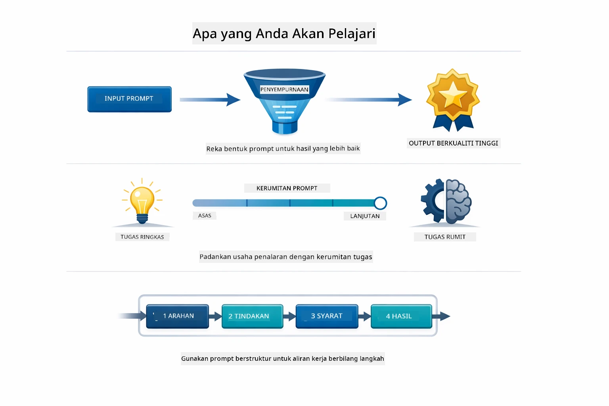
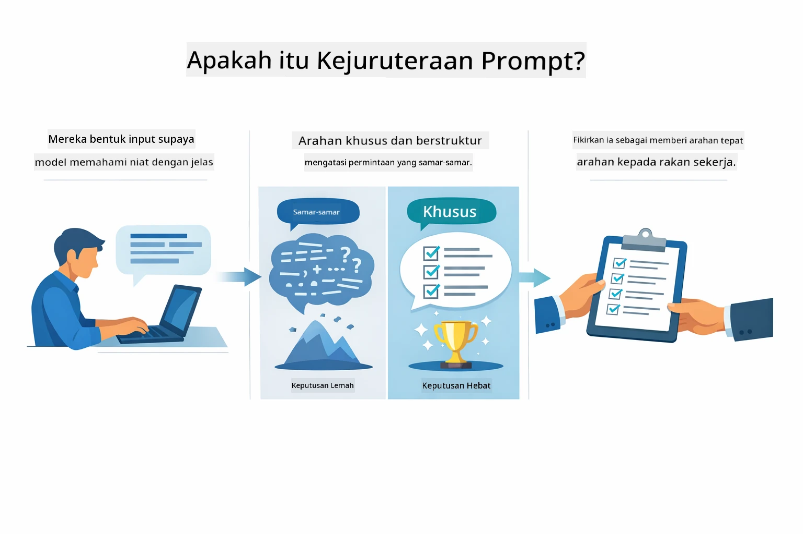
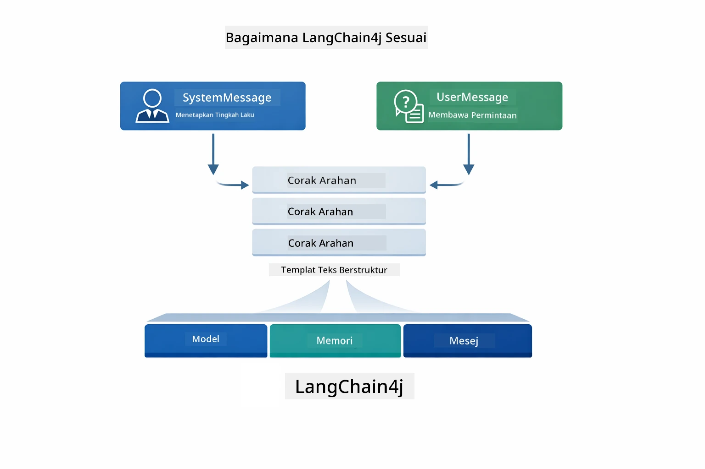
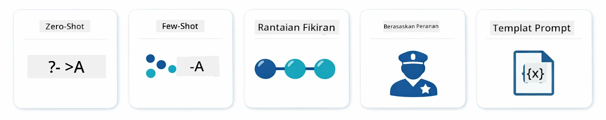
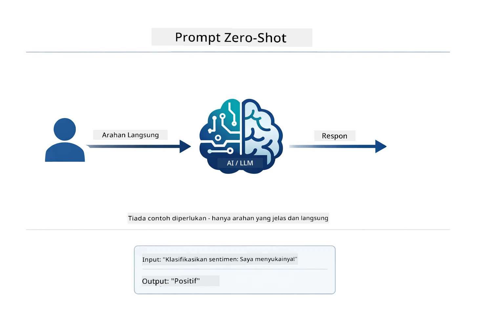
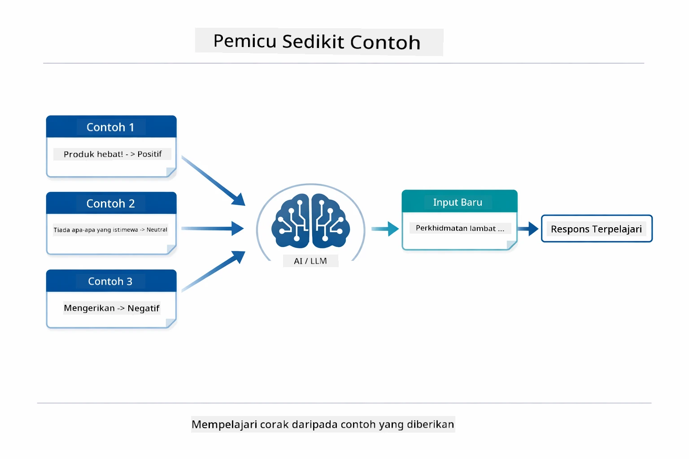
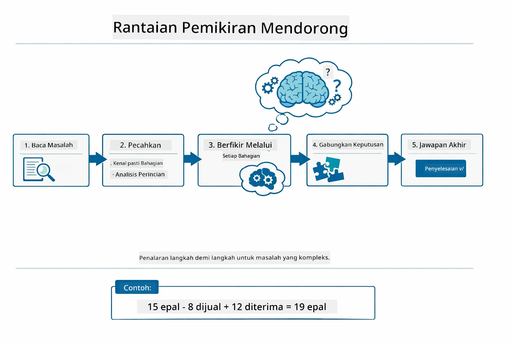
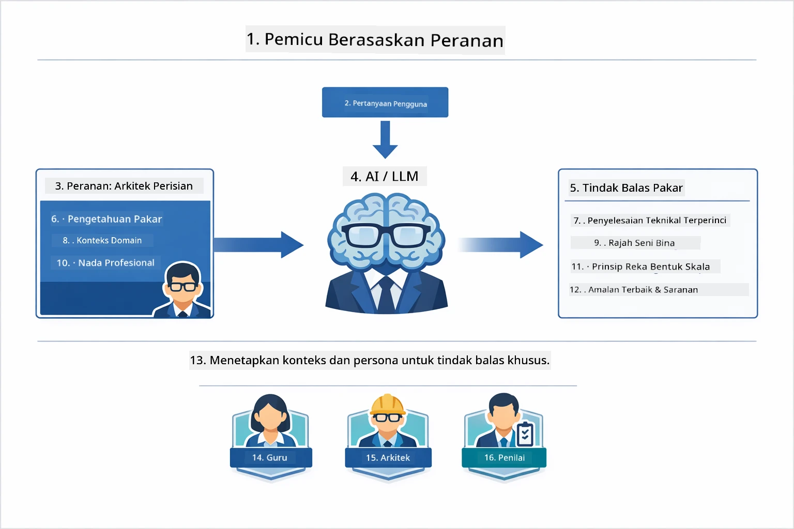
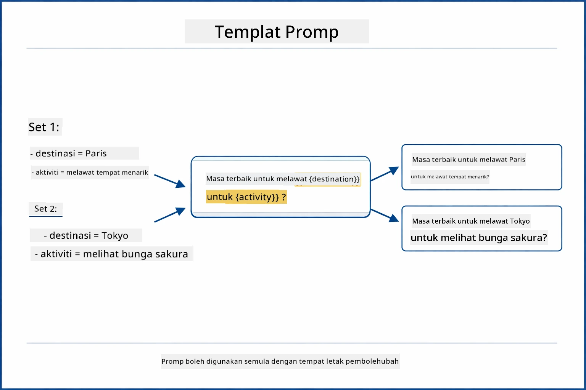
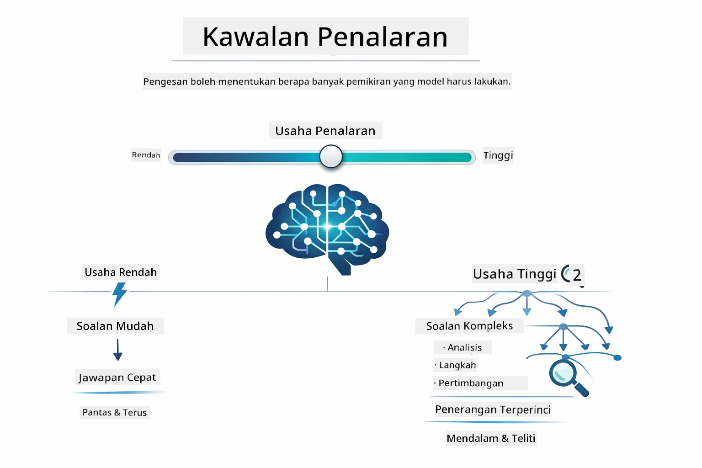

# Modul 02: Kejuruteraan Prompt dengan GPT-5.2

## Jadual Kandungan

- [Panduan Video](../../../02-prompt-engineering)
- [Apa yang Akan Anda Pelajari](../../../02-prompt-engineering)
- [Prasyarat](../../../02-prompt-engineering)
- [Memahami Kejuruteraan Prompt](../../../02-prompt-engineering)
- [Asas Kejuruteraan Prompt](../../../02-prompt-engineering)
  - [Prompt Tanpa Contoh](../../../02-prompt-engineering)
  - [Prompt Dengan Beberapa Contoh](../../../02-prompt-engineering)
  - [Rantaian Pemikiran](../../../02-prompt-engineering)
  - [Prompt Berdasarkan Peranan](../../../02-prompt-engineering)
  - [Templat Prompt](../../../02-prompt-engineering)
- [Corak Lanjutan](../../../02-prompt-engineering)
- [Jalankan Aplikasi](../../../02-prompt-engineering)
- [Tangkapan Skrin Aplikasi](../../../02-prompt-engineering)
- [Meneroka Corak](../../../02-prompt-engineering)
  - [Keghairahan Rendah vs Tinggi](../../../02-prompt-engineering)
  - [Pelaksanaan Tugas (Preambul Alat)](../../../02-prompt-engineering)
  - [Kod Reflektif Diri](../../../02-prompt-engineering)
  - [Analisis Berstruktur](../../../02-prompt-engineering)
  - [Cakap Bergilir Pelbagai Pusingan](../../../02-prompt-engineering)
  - [Penalaran Langkah demi Langkah](../../../02-prompt-engineering)
  - [Output Terhad](../../../02-prompt-engineering)
- [Apa yang Anda Benar-Benar Pelajari](../../../02-prompt-engineering)
- [Langkah Seterusnya](../../../02-prompt-engineering)

## Panduan Video

Tonton sesi langsung ini yang menerangkan cara memulakan modul ini:

<a href="https://www.youtube.com/live/PJ6aBaE6bog?si=LDshyBrTRodP-wke"></a>

## Apa yang Akan Anda Pelajari

Rajah berikut memberikan gambaran tentang topik utama dan kemahiran yang anda akan kembangkan dalam modul ini — daripada teknik penambahbaikan prompt kepada aliran kerja langkah demi langkah yang akan anda ikuti.



Dalam modul sebelumnya, anda meneroka interaksi asas LangChain4j dengan Model GitHub dan melihat bagaimana ingatan membolehkan AI perbualan dengan Azure OpenAI. Sekarang kita akan fokus pada cara anda mengajukan soalan — prompt itu sendiri — menggunakan GPT-5.2 Azure OpenAI. Cara anda menyusun prompt secara dramatik mempengaruhi kualiti respons yang anda terima. Kita mulakan dengan ulasan teknik prompting asas, kemudian beralih ke lapan corak lanjutan yang memanfaatkan sepenuhnya kebolehan GPT-5.2.

Kita gunakan GPT-5.2 kerana ia memperkenalkan kawalan penalaran - anda boleh memberitahu model berapa banyak pemikiran yang perlu dilakukan sebelum menjawab. Ini membuatkan strategi prompting yang berbeza lebih jelas dan membantu anda memahami bila untuk menggunakan setiap pendekatan. Kita juga akan mendapat manfaat dari had kadar yang lebih sedikit Azure untuk GPT-5.2 berbanding Model GitHub.

## Prasyarat

- Menyelesaikan Modul 01 (sumber Azure OpenAI telah diterapkan)
- Fail `.env` di direktori root dengan kelayakan Azure (dibuat oleh `azd up` dalam Modul 01)

> **Nota:** Jika anda belum menyelesaikan Modul 01, ikut arahan penyebaran di sana dahulu.

## Memahami Kejuruteraan Prompt

Pada intinya, kejuruteraan prompt adalah perbezaan antara arahan samar dan arahan tepat, seperti yang ditunjukkan dalam perbandingan di bawah.



Kejuruteraan prompt adalah tentang mereka bentuk teks input yang sentiasa memberikan hasil yang anda perlukan. Ia bukan sekadar bertanya soalan - ia tentang menyusun permintaan supaya model benar-benar faham apa yang anda mahu dan bagaimana untuk menyampaiinya.

Fikirkan ia seperti memberi arahan kepada rakan sekerja. "Betulkan pepijat" adalah samar. "Betulkan pengecualian penunjuk kosong di UserService.java baris 45 dengan menambah semakan null" adalah spesifik. Model bahasa berfungsi sama — kekhususan dan struktur penting.

Rajah di bawah menunjukkan bagaimana LangChain4j sesuai dalam gambaran ini — menghubungkan corak prompt anda ke model melalui blok binaan SystemMessage dan UserMessage.



LangChain4j menyediakan infrastruktur — sambungan model, memori, dan jenis mesej — sementara corak prompt hanyalah teks yang disusun dengan teliti yang anda hantar melalui infrastruktur itu. Blok bina utama adalah `SystemMessage` (yang menetapkan tingkah laku dan peranan AI) dan `UserMessage` (yang membawa permintaan sebenar anda).

## Asas Kejuruteraan Prompt

Lima teknik teras yang ditunjukkan di bawah membentuk asas kejuruteraan prompt yang berkesan. Setiap satu menangani aspek berbeza bagaimana anda berkomunikasi dengan model bahasa.



Sebelum menyelami corak lanjutan dalam modul ini, mari kita ulas lima teknik prompting asas. Ini adalah blok bina yang setiap jurutera prompt harus tahu. Jika anda telah mengikuti modul [Mula Cepat](../00-quick-start/README.md#2-prompt-patterns), anda sudah melihatnya beraksi — ini adalah kerangka konsep di sebaliknya.

### Prompt Tanpa Contoh

Pendekatan paling mudah: beri model arahan langsung tanpa contoh. Model bergantung sepenuhnya pada latihan untuk memahami dan melaksanakan tugas. Ini berkesan untuk permintaan mudah di mana tingkah laku yang diharapkan jelas.



*Arahan langsung tanpa contoh — model menyerlahkan tugas hanya dari arahan*

```java
String prompt = "Classify this sentiment: 'I absolutely loved the movie!'";
String response = model.chat(prompt);
// Respons: "Positif"
```

**Bila digunakan:** Klasifikasi mudah, soalan langsung, terjemahan, atau mana-mana tugas yang model boleh kendalikan tanpa panduan tambahan.

### Prompt Dengan Beberapa Contoh

Berikan contoh yang menunjukkan corak yang anda mahu model ikuti. Model mempelajari format input-output yang dijangka dari contoh anda dan menerapkannya kepada input baru. Ini secara dramatik meningkatkan konsistensi untuk tugas di mana format atau tingkah laku yang dikehendaki tidak jelas.



*Belajar dari contoh — model mengenal pasti corak dan menerapkannya pada input baru*

```java
String prompt = """
    Classify the sentiment as positive, negative, or neutral.
    
    Examples:
    Text: "This product exceeded my expectations!" → Positive
    Text: "It's okay, nothing special." → Neutral
    Text: "Waste of money, very disappointed." → Negative
    
    Now classify this:
    Text: "Best purchase I've made all year!"
    """;
String response = model.chat(prompt);
```

**Bila digunakan:** Klasifikasi tersuai, pemformatan konsisten, tugas domain khusus, atau bila hasil zero-shot tidak konsisten.

### Rantaian Pemikiran

Minta model menunjukkan penalaran langkah demi langkah. Daripada terus menjawab, model memecahkan masalah dan mengerjakan setiap bahagian dengan jelas. Ini meningkatkan ketepatan dalam tugasan matematik, logik, dan penalaran berbilang langkah.



*Penalaran langkah demi langkah — memecah masalah kompleks kepada langkah logik yang jelas*

```java
String prompt = """
    Problem: A store has 15 apples. They sell 8 apples and then 
    receive a shipment of 12 more apples. How many apples do they have now?
    
    Let's solve this step-by-step:
    """;
String response = model.chat(prompt);
// Model menunjukkan: 15 - 8 = 7, kemudian 7 + 12 = 19 epal
```

**Bila digunakan:** Masalah matematik, teka-teki logik, penyahpepijatan, atau mana-mana tugasan di mana menunjukkan proses penalaran meningkatkan ketepatan dan kepercayaan.

### Prompt Berdasarkan Peranan

Tetapkan persona atau peranan untuk AI sebelum mengajukan soalan anda. Ini menyediakan konteks yang membentuk nada, kedalaman, dan fokus respons. "Arkitek perisian" memberi nasihat berbeza daripada "pembangun junior" atau "juruaudit keselamatan".



*Menetapkan konteks dan persona — soalan yang sama mendapat respons berbeza bergantung pada peranan yang diberikan*

```java
String prompt = """
    You are an experienced software architect reviewing code.
    Provide a brief code review for this function:
    
    def calculate_total(items):
        total = 0
        for item in items:
            total = total + item['price']
        return total
    """;
String response = model.chat(prompt);
```

**Bila digunakan:** Ulasan kod, pembelajaran, analisis domain khusus, atau bila anda memerlukan respons yang disesuaikan dengan tahap kepakaran atau perspektif tertentu.

### Templat Prompt

Cipta prompt yang boleh digunakan semula dengan tempat letak pembolehubah. Daripada menulis prompt baru setiap kali, tentukan templatenya sekali dan isi nilai berlainan. Kelas `PromptTemplate` LangChain4j memudahkan ini dengan sintaks `{{variable}}`.



*Prompt guna semula dengan tempat letak pembolehubah — satu template, banyak guna*

```java
PromptTemplate template = PromptTemplate.from(
    "What's the best time to visit {{destination}} for {{activity}}?"
);

Prompt prompt = template.apply(Map.of(
    "destination", "Paris",
    "activity", "sightseeing"
));

String response = model.chat(prompt.text());
```

**Bila digunakan:** Pertanyaan ulangan dengan input berbeza, pemprosesan batch, membina aliran kerja AI guna semula, atau sebarang situasi di mana struktur prompt kekal sama tetapi datanya berubah.

---

Lima asas ini memberi anda set alat yang kukuh untuk kebanyakan tugasan prompting. Selebihnya modul ini membina di atasnya dengan **lapan corak lanjutan** yang memanfaatkan kawalan penalaran GPT-5.2, penilaian kendiri, dan kebolehan output berstruktur.

## Corak Lanjutan

Setelah asas diliputi, mari beralih kepada lapan corak lanjutan yang menjadikan modul ini unik. Tidak semua masalah memerlukan pendekatan yang sama. Sesetengah soalan memerlukan jawapan cepat, yang lain memerlukan pemikiran mendalam. Ada yang memerlukan penalaran jelas, ada yang hanya perlukan hasil. Setiap corak di bawah dioptimumkan untuk senario berbeza — dan kawalan penalaran GPT-5.2 menjadikan perbezaannya lebih ketara.


*Tinjauan lapan corak kejuruteraan prompt dan kes penggunaan mereka*

GPT-5.2 menambah dimensi lain kepada corak ini: *kawalan penalaran*. Gelangsar di bawah menunjukkan bagaimana anda boleh laraskan usaha pemikiran model — daripada jawapan pantas, langsung ke analisis mendalam dan menyeluruh.



*Kawalan penalaran GPT-5.2 membolehkan anda tetapkan berapa banyak pemikiran model perlu lakukan — daripada jawapan langsung laju ke penerokaan mendalam*

**Keghairahan Rendah (Cepat & Fokus)** - Untuk soalan mudah di mana anda mahukan jawapan cepat, terus. Model melakukan sedikit penalaran - maksimum 2 langkah. Gunakan ini untuk pengiraan, pencarian, atau soalan mudah.

```java
String prompt = """
    <context_gathering>
    - Search depth: very low
    - Bias strongly towards providing a correct answer as quickly as possible
    - Usually, this means an absolute maximum of 2 reasoning steps
    - If you think you need more time, state what you know and what's uncertain
    </context_gathering>
    
    Problem: What is 15% of 200?
    
    Provide your answer:
    """;

String response = chatModel.chat(prompt);
```

> 💡 **Terokai dengan GitHub Copilot:** Buka [`Gpt5PromptService.java`](../../../02-prompt-engineering/src/main/java/com/example/langchain4j/prompts/service/Gpt5PromptService.java) dan tanya:
> - "Apa perbezaan antara corak prompting keghairahan rendah dan tinggi?"
> - "Bagaimana tag XML dalam prompt membantu struktur respons AI?"
> - "Bilakah saya patut guna corak refleksi diri berbanding arahan langsung?"

**Keghairahan Tinggi (Mendalam & Teliti)** - Untuk masalah kompleks di mana anda mahukan analisis menyeluruh. Model meneroka dengan teliti dan menunjukkan penalaran terperinci. Gunakan ini untuk reka bentuk sistem, keputusan seni bina, atau penyelidikan rumit.

```java
String prompt = """
    Analyze this problem thoroughly and provide a comprehensive solution.
    Consider multiple approaches, trade-offs, and important details.
    Show your analysis and reasoning in your response.
    
    Problem: Design a caching strategy for a high-traffic REST API.
    """;

String response = chatModel.chat(prompt);
```

**Pelaksanaan Tugas (Kemajuan Langkah demi Langkah)** - Untuk aliran kerja berbilang langkah. Model menyediakan pelan awal, menceritakan setiap langkah semasa bekerja, kemudian memberi ringkasan. Gunakan ini untuk migrasi, pelaksanaan, atau mana-mana proses berbilang langkah.

```java
String prompt = """
    <task_execution>
    1. First, briefly restate the user's goal in a friendly way
    
    2. Create a step-by-step plan:
       - List all steps needed
       - Identify potential challenges
       - Outline success criteria
    
    3. Execute each step:
       - Narrate what you're doing
       - Show progress clearly
       - Handle any issues that arise
    
    4. Summarize:
       - What was completed
       - Any important notes
       - Next steps if applicable
    </task_execution>
    
    <tool_preambles>
    - Always begin by rephrasing the user's goal clearly
    - Outline your plan before executing
    - Narrate each step as you go
    - Finish with a distinct summary
    </tool_preambles>
    
    Task: Create a REST endpoint for user registration
    
    Begin execution:
    """;

String response = chatModel.chat(prompt);
```

Prompt rantai pemikiran secara jelas meminta model menunjukkan proses penalaran, meningkatkan ketepatan untuk tugasan kompleks. Pemecahan langkah demi langkah membantu manusia dan AI memahami logik.

> **🤖 Cuba dengan Sembang [GitHub Copilot](https://github.com/features/copilot):** Tanya tentang corak ini:
> - "Bagaimana saya boleh sesuaikan corak pelaksanaan tugas untuk operasi yang berjalan lama?"
> - "Apakah amalan terbaik untuk menyusun preambul alat dalam aplikasi produksi?"
> - "Bagaimana saya boleh menangkap dan memaparkan kemas kini kemajuan antara dalam UI?"

Rajah di bawah menggambarkan aliran kerja Pelan → Laksana → Rumus.


*Aliran kerja Pelan → Laksana → Rumus untuk tugasan berbilang langkah*

**Kod Reflektif Diri** - Untuk menjana kod berkualiti produksi. Model menjana kod mengikut piawaian produksi dengan pengendalian ralat yang betul. Gunakan ini bila membina ciri atau perkhidmatan baru.

```java
String prompt = """
    Generate Java code with production-quality standards: Create an email validation service
    Keep it simple and include basic error handling.
    """;

String response = chatModel.chat(prompt);
```

Rajah di bawah menunjukkan kitaran peningkatan berulang ini — menjana, menilai, kenal pasti kelemahan, dan haluskan sehingga kod memenuhi piawaian produksi.


*Kitaran peningkatan berulang - menjana, menilai, kenal pasti isu, perbaiki, ulang*

**Analisis Berstruktur** - Untuk penilaian konsisten. Model mengulas kod menggunakan rangka kerja tetap (ketepatan, amalan, prestasi, keselamatan, penyelenggaraan). Gunakan ini untuk ulasan kod atau penilaian kualiti.

```java
String prompt = """
    <analysis_framework>
    You are an expert code reviewer. Analyze the code for:
    
    1. Correctness
       - Does it work as intended?
       - Are there logical errors?
    
    2. Best Practices
       - Follows language conventions?
       - Appropriate design patterns?
    
    3. Performance
       - Any inefficiencies?
       - Scalability concerns?
    
    4. Security
       - Potential vulnerabilities?
       - Input validation?
    
    5. Maintainability
       - Code clarity?
       - Documentation?
    
    <output_format>
    Provide your analysis in this structure:
    - Summary: One-sentence overall assessment
    - Strengths: 2-3 positive points
    - Issues: List any problems found with severity (High/Medium/Low)
    - Recommendations: Specific improvements
    </output_format>
    </analysis_framework>
    
    Code to analyze:
    ```
    public List getUsers() {
        return database.query("SELECT * FROM users");
    }
    ```
    Provide your structured analysis:
    """;

String response = chatModel.chat(prompt);
```

> **🤖 Cuba dengan Sembang [GitHub Copilot](https://github.com/features/copilot):** Tanya tentang analisis berstruktur:
> - "Bagaimana saya boleh menyesuaikan rangka kerja analisis untuk jenis ulasan kod yang berbeza?"
> - "Apakah cara terbaik untuk mengurai dan bertindak balas terhadap output berstruktur secara programatik?"
> - "Bagaimana saya memastikan tahap keseriusan konsisten merentas sesi ulasan berlainan?"

Rajah berikut menunjukkan bagaimana rangka kerja berstruktur ini mengatur ulasan kod dalam kategori konsisten dengan tahap keseriusan.


*Rangka kerja untuk ulasan kod konsisten dengan tahap keseriusan*

**Cakap Bergilir Pelbagai Pusingan** - Untuk perbualan yang memerlukan konteks. Model mengingati mesej sebelumnya dan membina ke atasnya. Gunakan ini untuk sesi bantuan interaktif atau soal jawab kompleks.

```java
ChatMemory memory = MessageWindowChatMemory.withMaxMessages(10);

memory.add(UserMessage.from("What is Spring Boot?"));
AiMessage aiMessage1 = chatModel.chat(memory.messages()).aiMessage();
memory.add(aiMessage1);

memory.add(UserMessage.from("Show me an example"));
AiMessage aiMessage2 = chatModel.chat(memory.messages()).aiMessage();
memory.add(aiMessage2);
```

Rajah di bawah memvisualisasikan bagaimana konteks perbualan terkumpul dengan setiap pusingan dan bagaimana ia berkaitan dengan had token model.


*Bagaimana konteks perbualan terkumpul sepanjang beberapa pusingan sehingga mencapai had token*
**Penalaran Langkah demi Langkah** - Untuk masalah yang memerlukan logik yang jelas. Model menunjukkan penalaran eksplisit untuk setiap langkah. Gunakan ini untuk masalah matematik, teka-teki logik, atau apabila anda perlu memahami proses pemikiran.

```java
String prompt = """
    <instruction>Show your reasoning step-by-step</instruction>
    
    If a train travels 120 km in 2 hours, then stops for 30 minutes,
    then travels another 90 km in 1.5 hours, what is the average speed
    for the entire journey including the stop?
    """;

String response = chatModel.chat(prompt);
```

Rajah di bawah menunjukkan bagaimana model memecahkan masalah kepada langkah-langkah logik yang eksplisit dan bernombor.


*Memecahkan masalah kepada langkah-langkah logik yang eksplisit*

**Output Terhad** - Untuk jawapan dengan keperluan format khusus. Model mengikuti peraturan format dan panjang dengan ketat. Gunakan ini untuk ringkasan atau apabila anda memerlukan struktur output yang tepat.

```java
String prompt = """
    <constraints>
    - Exactly 100 words
    - Bullet point format
    - Technical terms only
    </constraints>
    
    Summarize the key concepts of machine learning.
    """;

String response = chatModel.chat(prompt);
```

Rajah berikut menunjukkan bagaimana kekangan membimbing model untuk menghasilkan output yang mematuhi format dan keperluan panjang anda dengan ketat.


*Menguatkuasakan format, panjang, dan keperluan struktur yang spesifik*

## Jalankan Aplikasi

**Sahkan pelaksanaan:**

Pastikan fail `.env` wujud di direktori akar dengan kelayakan Azure (dicipta semasa Modul 01). Jalankan ini dari direktori modul (`02-prompt-engineering/`):

**Bash:**
```bash
cat ../.env  # Perlu menunjukkan AZURE_OPENAI_ENDPOINT, API_KEY, DEPLOYMENT
```

**PowerShell:**
```powershell
Get-Content ..\.env  # Perlu menunjukkan AZURE_OPENAI_ENDPOINT, API_KEY, DEPLOYMENT
```

**Mulakan aplikasi:**

> **Nota:** Jika anda sudah memulakan semua aplikasi menggunakan `./start-all.sh` dari direktori akar (seperti yang diterangkan dalam Modul 01), modul ini sudah berjalan pada port 8083. Anda boleh langkau arahan mula di bawah dan terus ke http://localhost:8083.

**Pilihan 1: Menggunakan Spring Boot Dashboard (Disyorkan untuk pengguna VS Code)**

Kontena dev termasuk sambungan Spring Boot Dashboard, yang menyediakan antara muka visual untuk mengurus semua aplikasi Spring Boot. Anda boleh menemuinya di Bar Aktiviti di sebelah kiri VS Code (cari ikon Spring Boot).

Dari Spring Boot Dashboard, anda boleh:
- Melihat semua aplikasi Spring Boot yang tersedia dalam ruang kerja
- Mulakan/henti aplikasi dengan satu klik
- Lihat log aplikasi secara masa nyata
- Pantau status aplikasi

Cuma klik butang main di sebelah "prompt-engineering" untuk memulakan modul ini, atau mulakan semua modul sekali gus.


*Spring Boot Dashboard dalam VS Code — mula, hentikan, dan pantau semua modul dari satu tempat*

**Pilihan 2: Menggunakan skrip shell**

Mulakan semua aplikasi web (modul 01-04):

**Bash:**
```bash
cd ..  # Dari direktori root
./start-all.sh
```

**PowerShell:**
```powershell
cd ..  # Dari direktori akar
.\start-all.ps1
```

Atau mulakan hanya modul ini:

**Bash:**
```bash
cd 02-prompt-engineering
./start.sh
```

**PowerShell:**
```powershell
cd 02-prompt-engineering
.\start.ps1
```

Kedua-dua skrip secara automatik memuatkan pembolehubah persekitaran dari fail `.env` akar dan akan membina JAR jika belum ada.

> **Nota:** Jika anda lebih suka membina semua modul secara manual sebelum memulakan:
>
> **Bash:**
> ```bash
> cd ..  # Go to root directory
> mvn clean package -DskipTests
> ```
>
> **PowerShell:**
> ```powershell
> cd ..  # Go to root directory
> mvn clean package -DskipTests
> ```

Buka http://localhost:8083 di pelayar anda.

**Untuk berhenti:**

**Bash:**
```bash
./stop.sh  # Modul ini sahaja
# Atau
cd .. && ./stop-all.sh  # Semua modul
```

**PowerShell:**
```powershell
.\stop.ps1  # Modul ini sahaja
# Atau
cd ..; .\stop-all.ps1  # Semua modul
```

## Tangkapan Skrin Aplikasi

Berikut ialah antara muka utama modul kejuruteraan prompt, di mana anda boleh bereksperimen dengan semua lapan corak secara berdampingan.


*Paparan utama yang menunjukkan semua 8 corak kejuruteraan prompt dengan ciri-ciri dan kes penggunaan mereka*

## Meneroka Corak-corak

Antara muka web membenarkan anda bereksperimen dengan strategi prompting yang berbeza. Setiap corak menyelesaikan masalah yang berbeza - cubalah untuk melihat bila setiap pendekatan menjadi cemerlang.

> **Nota: Streaming vs Non-Streaming** — Setiap halaman corak menawarkan dua butang: **🔴 Alir Respons (Siang)** dan pilihan **Non-streaming**. Streaming menggunakan Server-Sent Events (SSE) untuk memaparkan token secara masa nyata semasa model menjana, jadi anda dapat melihat kemajuan dengan segera. Pilihan non-streaming menunggu keseluruhan respons sebelum memaparkannya. Untuk prompt yang mencetuskan penalaran mendalam (contohnya, High Eagerness, Self-Reflecting Code), panggilan non-streaming boleh mengambil masa yang sangat lama — kadang-kadang minit — tanpa maklum balas yang nampak. **Gunakan streaming apabila bereksperimen dengan prompt yang kompleks** supaya anda dapat melihat model berkerja dan elakkan kesan bahawa permintaan telah tamat masa.
>
> **Nota: Keperluan Pelayar** — Ciri streaming menggunakan Fetch Streams API (`response.body.getReader()`) yang memerlukan pelayar penuh (Chrome, Edge, Firefox, Safari). Ia **tidak** berfungsi dalam Simple Browser terbina dalam VS Code, kerana webviewnya tidak menyokong ReadableStream API. Jika anda menggunakan Simple Browser, butang non-streaming masih berfungsi secara normal — hanya butang streaming yang terhad. Buka `http://localhost:8083` dalam pelayar luar untuk pengalaman penuh.

### Eagerness Rendah vs Tinggi

Tanya soalan mudah seperti "Apakah 15% daripada 200?" menggunakan Eagerness Rendah. Anda akan mendapat jawapan segera dan terus. Sekarang tanya sesuatu yang kompleks seperti "Reka strategi caching untuk API trafik tinggi" menggunakan Eagerness Tinggi. Klik **🔴 Alir Respons (Siang)** dan tonton penalaran terperinci model muncul token demi token. Model sama, struktur soalan sama - tetapi prompt memberitahu berapa banyak pemikiran yang perlu dilakukan.

### Pelaksanaan Tugasan (Preambles Alat)

Aliran kerja berbilang langkah memanfaatkan perancangan awal dan narasi kemajuan. Model menggariskan apa yang akan dilakukannya, menceritakan setiap langkah, kemudian meringkaskan hasil.

### Kod Refleksi Diri

Cuba "Cipta perkhidmatan pengesahan emel". Daripada hanya menjana kod dan berhenti, model menjana, menilai berdasarkan kriteria kualiti, mengenal pasti kelemahan, dan memperbaiki. Anda akan lihat ia mengulang sehingga kod memenuhi piawaian pengeluaran.

### Analisis Berstruktur

Ulasan kod memerlukan rangka kerja penilaian yang konsisten. Model menganalisis kod menggunakan kategori tetap (ketepatan, amalan, prestasi, keselamatan) dengan tahap keterukan.

### Sembang Pelbagai Giliran

Tanya "Apa itu Spring Boot?" kemudian teruskan dengan "Tunjukkan contoh". Model mengingati soalan pertama anda dan memberikan contoh Spring Boot yang spesifik. Tanpa ingatan, soalan kedua itu akan terlalu samar.

### Penalaran Langkah demi Langkah

Pilih satu masalah matematik dan cuba dengan Penalaran Langkah demi Langkah dan Eagerness Rendah. Eagerness rendah hanya memberi jawapan - cepat tetapi sukar difahami. Penalaran langkah demi langkah menunjukkan setiap pengiraan dan keputusan.

### Output Terhad

Apabila anda memerlukan format atau jumlah perkataan tertentu, corak ini menguatkuasakan pematuhan ketat. Cubalah menjana ringkasan dengan tepat 100 perkataan dalam format poin peluru.

## Apa yang Anda Betul-betul Pelajari

**Usaha Penalaran Mengubah Segalanya**

GPT-5.2 membolehkan anda kawal usaha pengiraan melalui prompt anda. Usaha rendah bermakna respons cepat dengan penerokaan minimum. Usaha tinggi bermakna model mengambil masa untuk berfikir dengan mendalam. Anda belajar padankan usaha dengan kerumitan tugasan - jangan bazirkan masa pada soalan mudah, tapi jangan terburu-buru buat keputusan kompleks juga.

**Struktur Membimbing Tingkah Laku**

Perasan tag XML dalam prompt? Ia bukan hiasan. Model mengikuti arahan berstruktur dengan lebih boleh dipercayai daripada teks bebas. Apabila anda memerlukan proses berbilang langkah atau logik kompleks, struktur membantu model jejak di mana ia berada dan apa seterusnya. Rajah di bawah memecahkan prompt berstruktur baik, menunjukkan bagaimana tag seperti `<system>`, `<instructions>`, `<context>`, `<user-input>`, dan `<constraints>` menyusun arahan anda menjadi bahagian yang jelas.


*Anatomi prompt berstruktur dengan bahagian jelas dan organisasi gaya XML*

**Kualiti Melalui Penilaian Diri**

Corak refleksi diri berfungsi dengan menjadikan kriteria kualiti eksplisit. Daripada berharap model "buat dengan betul", anda beritahu ia dengan tepat apa maksud "betul": logik tepat, pengendalian ralat, prestasi, keselamatan. Model kemudian boleh menilai output sendiri dan memperbaiki. Ini menjadikan penjanaan kod dari loteri kepada proses.

**Konteks adalah Terhad**

Perbualan berbilang giliran berfungsi dengan memasukkan sejarah mesej pada setiap permintaan. Tetapi ada had - setiap model ada bilangan token maksimum. Apabila perbualan berkembang, anda perlukan strategi untuk menyimpan konteks relevan tanpa mencapai had itu. Modul ini menunjukkan cara ingatan berfungsi; kemudian anda akan belajar bila untuk meringkaskan, bila untuk lupa, dan bila untuk mengambil semula.

## Langkah Seterusnya

**Modul Seterusnya:** [03-rag - RAG (Generasi Diperkaya Pengambilan)](../03-rag/README.md)

---

**Navigasi:** [← Sebelumnya: Modul 01 - Pengenalan](../01-introduction/README.md) | [Kembali ke Utama](../README.md) | [Seterusnya: Modul 03 - RAG →](../03-rag/README.md)

---

<!-- CO-OP TRANSLATOR DISCLAIMER START -->
**Penafian**:
Dokumen ini telah diterjemahkan menggunakan perkhidmatan terjemahan AI [Co-op Translator](https://github.com/Azure/co-op-translator). Walaupun kami berusaha untuk ketepatan, sila ambil perhatian bahawa terjemahan automatik mungkin mengandungi kesilapan atau ketidaktepatan. Dokumen asal dalam bahasa asalnya harus dianggap sebagai sumber rujukan yang sahih. Untuk maklumat penting, terjemahan profesional oleh manusia adalah disyorkan. Kami tidak bertanggungjawab terhadap sebarang salah faham atau salah tafsir yang timbul daripada penggunaan terjemahan ini.
<!-- CO-OP TRANSLATOR DISCLAIMER END -->