# Modul 03: RAG (Generasi Beraugmen Pengambilan)

## Jadual Kandungan

- [Video Panduan](../../../03-rag)
- [Apa yang Anda Akan Pelajari](../../../03-rag)
- [Prasyarat](../../../03-rag)
- [Memahami RAG](../../../03-rag)
  - [Pendekatan RAG Mana Yang Digunakan Oleh Tutorial Ini?](../../../03-rag)
- [Bagaimana Ia Berfungsi](../../../03-rag)
  - [Pemprosesan Dokumen](../../../03-rag)
  - [Mewujudkan Penggambaran](../../../03-rag)
  - [Carian Semantik](../../../03-rag)
  - [Penjanaan Jawapan](../../../03-rag)
- [Jalankan Aplikasi](../../../03-rag)
- [Menggunakan Aplikasi](../../../03-rag)
  - [Muat Naik Dokumen](../../../03-rag)
  - [Tanya Soalan](../../../03-rag)
  - [Semak Rujukan Sumber](../../../03-rag)
  - [Bereksperimen Dengan Soalan](../../../03-rag)
- [Konsep Utama](../../../03-rag)
  - [Strategi Pemecahan](../../../03-rag)
  - [Skor Kesamaan](../../../03-rag)
  - [Penyimpanan Dalam Memori](../../../03-rag)
  - [Pengurusan Tetingkap Konteks](../../../03-rag)
- [Bila RAG Penting](../../../03-rag)
- [Langkah Seterusnya](../../../03-rag)

## Video Panduan

Tonton sesi langsung ini yang menerangkan bagaimana untuk memulakan modul ini: [RAG dengan LangChain4j - Sesi Langsung](https://www.youtube.com/watch?v=_olq75ZH_eY)

## Apa yang Anda Akan Pelajari

Dalam modul-modul sebelum ini, anda belajar bagaimana untuk berbual dengan AI dan menyusun prompt anda dengan berkesan. Tetapi ada satu kekangan asas: model bahasa hanya tahu apa yang mereka pelajari semasa latihan. Mereka tidak boleh menjawab soalan mengenai polisi syarikat anda, dokumentasi projek anda, atau sebarang maklumat yang mereka tidak dilatih.

RAG (Generasi Beraugmen Pengambilan) menyelesaikan masalah ini. Daripada cuba mengajar model maklumat anda (yang mahal dan tidak praktikal), anda memberinya kebolehan untuk mencari melalui dokumen anda. Apabila seseorang bertanya soalan, sistem mencari maklumat yang relevan dan memasukkannya ke dalam prompt. Model kemudian menjawab berdasarkan konteks yang diperoleh itu.

Fikirkan RAG sebagai memberikan model perpustakaan rujukan. Apabila anda bertanya soalan, sistem:

1. **Soalan Pengguna** - Anda bertanya soalan
2. **Penggambaran** - Menukar soalan anda menjadi vektor
3. **Carian Vektor** - Mencari kepingan dokumen yang serupa
4. **Perhimpunan Konteks** - Menambah kepingan relevan ke dalam prompt
5. **Respon** - LLM menjana jawapan berdasarkan konteks

Ini menjadikan respons model berasaskan data sebenar anda dan tidak bergantung pada pengetahuan latihan atau mereka jawapan.

## Prasyarat

- Menyelesaikan [Modul 00 - Mula Cepat](../00-quick-start/README.md) (untuk contoh Easy RAG yang dirujuk di atas)
- Menyelesaikan [Modul 01 - Pengenalan](../01-introduction/README.md) (sumber Azure OpenAI diterapkan, termasuk model penggambaran `text-embedding-3-small`)
- Fail `.env` di direktori root dengan kelayakan Azure (dicipta melalui `azd up` dalam Modul 01)

> **Nota:** Jika anda belum menyelesaikan Modul 01, ikuti arahan pemasangan di sana dahulu. Perintah `azd up` memasang kedua-dua model perbualan GPT dan model penggambaran yang digunakan oleh modul ini.

## Memahami RAG

Rajah di bawah menerangkan konsep teras: daripada bergantung hanya pada data latihan model, RAG memberinya perpustakaan rujukan dokumen anda untuk dirujuk sebelum menjana setiap jawapan.

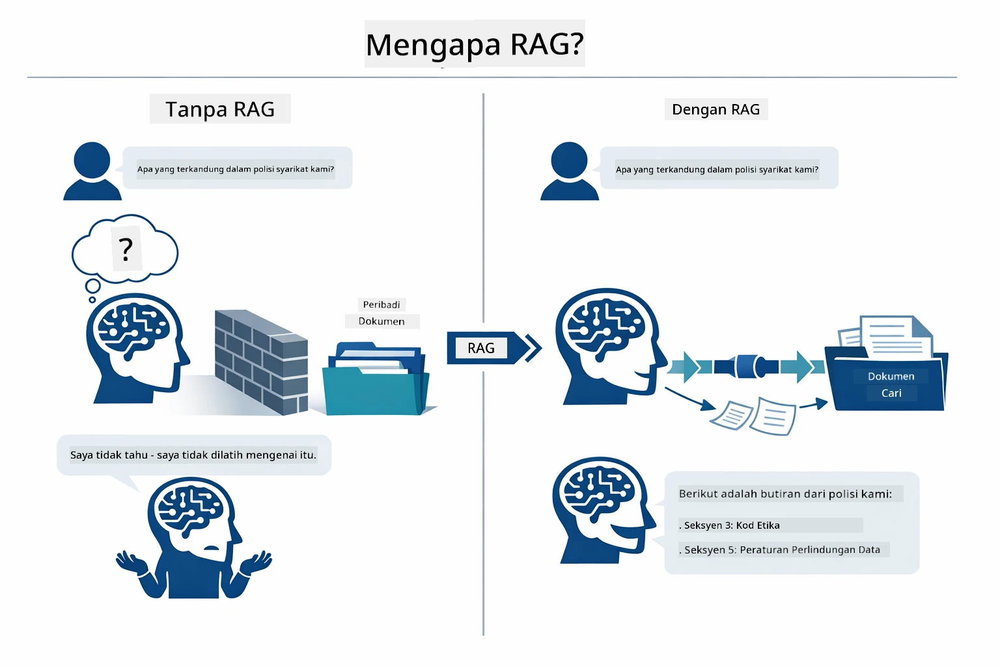

*Rajah ini menunjukkan beza antara LLM biasa (yang membuat andaian dari data latihan) dan LLM yang dipertingkat dengan RAG (yang merujuk dokumen anda terlebih dahulu).*

Ini cara setiap bahagian bersambung secara menyeluruh. Soalan pengguna mengalir melalui empat peringkat — penggambaran, carian vektor, perhimpunan konteks, dan penjanaan jawapan — setiap satu membina pada yang sebelumnya:


*Rajah ini menunjukkan alur kerja RAG secara menyeluruh — soalan pengguna melalui penggambaran, carian vektor, perhimpunan konteks, dan penjanaan jawapan.*

Selepas itu, modul ini membincangkan setiap peringkat dengan terperinci, lengkap dengan kod yang anda boleh jalankan dan ubah suai.

### Pendekatan RAG Mana Yang Digunakan Oleh Tutorial Ini?

LangChain4j menawarkan tiga cara untuk melaksanakan RAG, setiap satu dengan tahap abstraksi yang berbeza. Rajah di bawah membandingkan mereka dari sisi ke sisi:

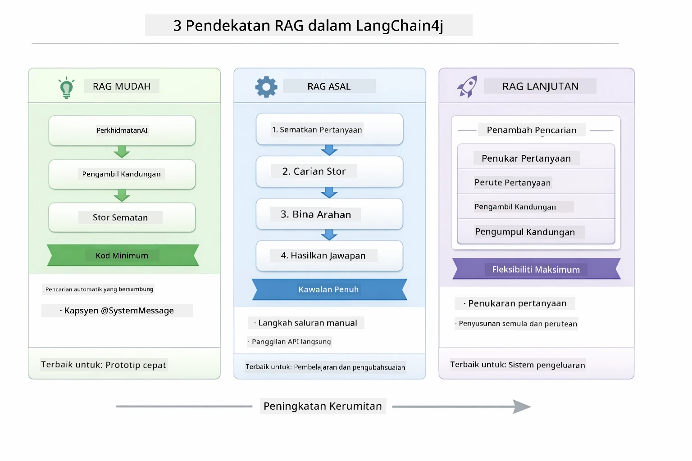

*Rajah ini membandingkan tiga pendekatan RAG LangChain4j — Easy, Native, dan Advanced — menunjukkan komponen utama mereka dan bila digunakan.*

| Pendekatan | Apa Yang Dilakukan | Pertukaran |
|---|---|---|
| **Easy RAG** | Menyambungkan semua secara automatik melalui `AiServices` dan `ContentRetriever`. Anda anotasi satu antaramuka, lampirkan pengambil, dan LangChain4j mengendalikan penggambaran, pencarian, dan perhimpunan prompt di belakang tabir. | Kod minimum, tetapi anda tidak melihat apa yang berlaku pada setiap langkah. |
| **Native RAG** | Anda memanggil model penggambaran, mencari stor, membina prompt, dan menjana jawapan sendiri — satu langkah jelas pada satu masa. | Lebih banyak kod, tetapi setiap peringkat nampak dan boleh diubah. |
| **Advanced RAG** | Menggunakan rangka kerja `RetrievalAugmentor` dengan transformasi pertanyaan, penentu laluan, penilai semula, dan penyuntik kandungan yang boleh disambungkan untuk saluran produksi. | Fleksibiliti maksimum, tetapi lebih kompleks. |

**Tutorial ini menggunakan pendekatan Native.** Setiap langkah rangka kerja RAG — menggambar pertanyaan, mencari stor vektor, mengumpul konteks, dan menjana jawapan — ditulis secara terperinci dalam [`RagService.java`](../../../03-rag/src/main/java/com/example/langchain4j/rag/service/RagService.java). Ini disengajakan: sebagai sumber pembelajaran, adalah lebih penting anda nampak dan faham setiap peringkat daripada memendekkan kod. Setelah anda selesa dengan perhubungan setiap bahagian, anda boleh beralih ke Easy RAG untuk prototaip cepat atau Advanced RAG untuk sistem produksi.

> **💡 Sudah lihat Easy RAG beraksi?** Modul [Mula Cepat](../00-quick-start/README.md) termasuk contoh Q&A Dokumen ([`SimpleReaderDemo.java`](../../../00-quick-start/src/main/java/com/example/langchain4j/quickstart/SimpleReaderDemo.java)) yang menggunakan pendekatan Easy RAG — LangChain4j mengendalikan penggambaran, pencarian, dan perhimpunan prompt secara automatik. Modul ini membawa langkah seterusnya dengan membuka pipeline tersebut supaya anda boleh melihat dan mengawal setiap peringkat sendiri.

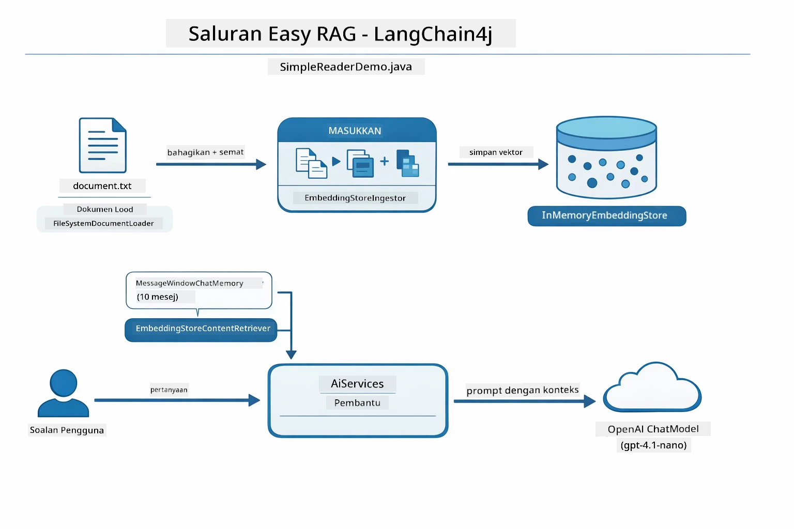

*Rajah ini menunjukkan aliran Easy RAG dari `SimpleReaderDemo.java`. Bandingkan ini dengan pendekatan Native yang digunakan dalam modul ini: Easy RAG menyembunyikan penggambaran, pengambilan, dan perhimpunan prompt di belakang `AiServices` dan `ContentRetriever` — anda memuatkan dokumen, melampirkan pengambil, dan mendapat jawapan. Pendekatan Native modul ini membuka aliran tersebut supaya anda memanggil setiap peringkat (embed, cari, kumpul konteks, jana) sendiri, memberikan visibiliti dan kawalan penuh.*

## Bagaimana Ia Berfungsi

Aliran RAG dalam modul ini dipecahkan kepada empat peringkat yang dijalankan berurutan setiap kali pengguna bertanya soalan. Pertama, dokumen yang dimuat naik **diparse dan dibahagi kepada kepingan** yang mudah dikendalikan. Kepingan itu kemudian ditukar menjadi **penggambaran vektor** dan disimpan supaya boleh dibanding secara matematik. Apabila soalan tiba, sistem melakukan **carian semantik** untuk mencari kepingan paling relevan, dan akhirnya menghantar kepingan tersebut sebagai konteks ke LLM untuk **penjanaan jawapan**. Bahagian di bawah membincangkan setiap peringkat dengan kod sebenar dan rajah. Mari lihat langkah pertama.

### Pemprosesan Dokumen

[DocumentService.java](../../../03-rag/src/main/java/com/example/langchain4j/rag/service/DocumentService.java)

Apabila anda memuat naik dokumen, sistem akan parse dokumen itu (PDF atau teks biasa), melampirkan metadata seperti nama fail, dan kemudian memecahkan dokumen itu kepada kepingan—bahagian lebih kecil yang muat dengan selesa dalam tetingkap konteks model. Kepingan-kepingan ini bertindih sedikit supaya tiada konteks penting hilang di sempadan.

```java
// Huraikan fail yang dimuat naik dan bungkus ia dalam Dokumen LangChain4j
Document document = Document.from(content, metadata);

// Bahagikan kepada kepingan 300 token dengan tumpang tindih 30 token
DocumentSplitter splitter = DocumentSplitters
    .recursive(300, 30);

List<TextSegment> segments = splitter.split(document);
```

Rajah di bawah menunjukkan bagaimana ini berfungsi secara visual. Perhatikan bagaimana setiap kepingan berkongsi beberapa token dengan jiran-jirannya — pertindihan 30 token memastikan tiada konteks penting terlepas antara sempadan:

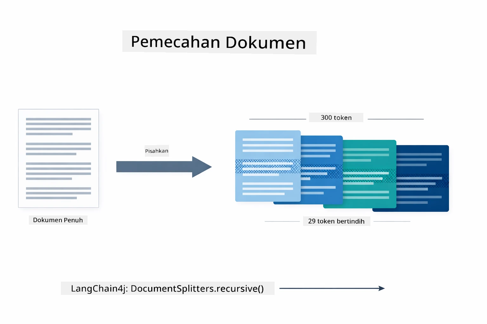

*Rajah ini menunjukkan dokumen dibahagikan kepada kepingan 300 token dengan pertindihan 30 token, mengekalkan konteks di sempadan kepingan.*

> **🤖 Cuba dengan [GitHub Copilot](https://github.com/features/copilot) Chat:** Buka [`DocumentService.java`](../../../03-rag/src/main/java/com/example/langchain4j/rag/service/DocumentService.java) dan tanya:
> - "Bagaimana LangChain4j membahagi dokumen kepada kepingan dan mengapa pertindihan penting?"
> - "Apakah saiz kepingan optimum untuk jenis dokumen yang berlainan dan kenapa?"
> - "Bagaimana saya mengendalikan dokumen dalam pelbagai bahasa atau format khas?"

### Mewujudkan Penggambaran

[LangChainRagConfig.java](../../../03-rag/src/main/java/com/example/langchain4j/rag/config/LangChainRagConfig.java)

Setiap kepingan ditukar menjadi representasi berangka yang dipanggil penggambaran — pada dasarnya penukar makna kepada nombor. Model penggambaran bukan 'pintar' seperti model perbualan; ia tidak boleh mengikuti arahan, berfikir, atau menjawab soalan. Apa yang boleh dilakukan adalah memetakan teks ke ruang matematik di mana makna serupa berdekatan satu sama lain — “kereta” dekat dengan “automobil,” “polisi pemulangan” dekat dengan “kembalikan wang saya.” Fikirkan model perbualan sebagai seorang manusia yang anda boleh bercakap; model penggambaran adalah sistem pengarkiban yang sangat bagus.

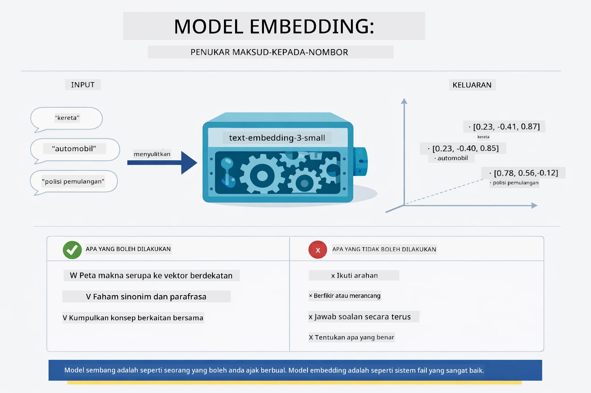

*Rajah ini menunjukkan bagaimana model penggambaran menukar teks menjadi vektor berangka, meletakkan makna serupa — seperti “kereta” dan “automobil” — berhampiran dalam ruang vektor.*

```java
@Bean
public EmbeddingModel embeddingModel() {
    return OpenAiOfficialEmbeddingModel.builder()
        .baseUrl(azureOpenAiEndpoint)
        .apiKey(azureOpenAiKey)
        .modelName(azureEmbeddingDeploymentName)
        .build();
}

EmbeddingStore<TextSegment> embeddingStore = 
    new InMemoryEmbeddingStore<>();
```

Rajah kelas di bawah menunjukkan dua aliran berasingan dalam pipeline RAG dan kelas LangChain4j yang melaksanakannya. Aliran **penyerapan** (dijalankan sekali semasa muat naik) membahagi dokumen, menggambar kepingan, dan menyimpannya melalui `.addAll()`. Aliran **pertanyaan** (dijalankan setiap kali pengguna bertanya) menggambar soalan, mencari stor melalui `.search()`, dan menghantar konteks yang sepadan ke model perbualan. Kedua-duanya bersatu di antaramuka `EmbeddingStore<TextSegment>` yang dikongsi:

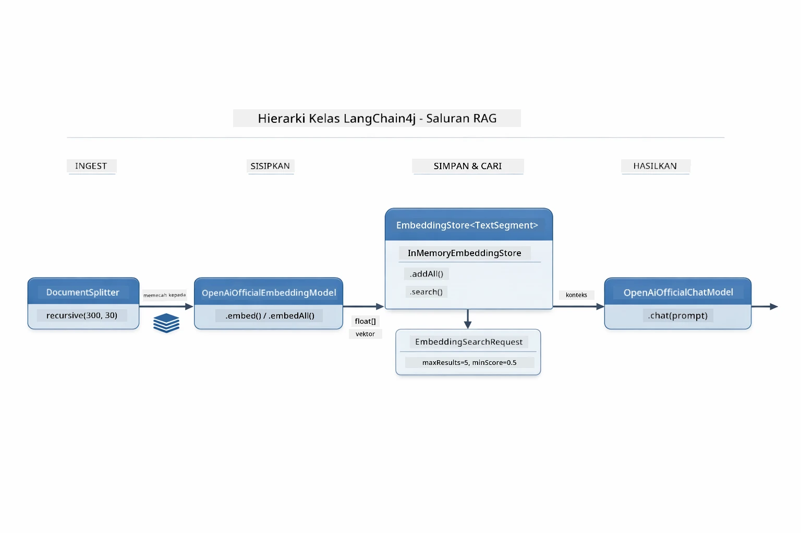

*Rajah ini menunjukkan dua aliran dalam pipeline RAG — penyerapan dan pertanyaan — dan bagaimana ia bersambung melalui EmbeddingStore yang dikongsi.*

Setelah penggambaran disimpan, kandungan serupa secara semula jadi berkumpul dalam ruang vektor. Visualisasi di bawah menunjukkan bagaimana dokumen tentang topik berkaitan berakhir sebagai titik berdekatan, yang membolehkan carian semantik berfungsi:


*Visualisasi ini menunjukkan bagaimana dokumen berkaitan berkumpul bersama dalam ruang vektor 3D, dengan topik seperti Dokumen Teknikal, Peraturan Perniagaan, dan Soalan Lazim membentuk kumpulan berbeza.*

Apabila pengguna membuat carian, sistem mengikuti empat langkah: menggambar dokumen sekali, menggambar pertanyaan pada setiap carian, membandingkan vektor pertanyaan dengan semua vektor yang disimpan menggunakan persamaan kosinus, dan mengembalikan top-K kepingan dengan skor tertinggi. Rajah di bawah menguraikan setiap langkah dan kelas LangChain4j yang terlibat:

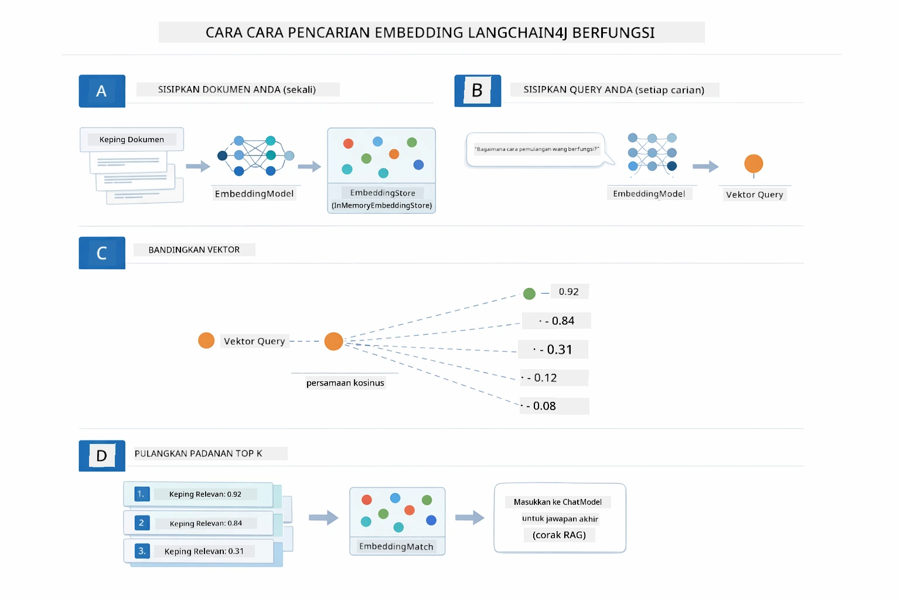

*Rajah ini menunjukkan proses carian penggambaran empat langkah: menggambar dokumen, menggambar pertanyaan, membandingkan vektor dengan persamaan kosinus, dan mengembalikan keputusan top-K.*

### Carian Semantik

[RagService.java](../../../03-rag/src/main/java/com/example/langchain4j/rag/service/RagService.java)

Apabila anda bertanya soalan, soalan anda juga ditukar menjadi penggambaran. Sistem membandingkan penggambaran soalan anda dengan semua penggambaran kepingan dokumen. Ia mencari kepingan dengan makna paling serupa — bukan hanya kata kunci yang sama, tapi kesamaan semantik sebenar.

```java
Embedding queryEmbedding = embeddingModel.embed(question).content();

EmbeddingSearchRequest searchRequest = EmbeddingSearchRequest.builder()
    .queryEmbedding(queryEmbedding)
    .maxResults(5)
    .minScore(0.5)
    .build();

EmbeddingSearchResult<TextSegment> searchResult = embeddingStore.search(searchRequest);
List<EmbeddingMatch<TextSegment>> matches = searchResult.matches();

for (EmbeddingMatch<TextSegment> match : matches) {
    String relevantText = match.embedded().text();
    double score = match.score();
}
```

Rajah di bawah membezakan carian semantik dengan carian kata kunci tradisional. Carian kata kunci untuk "kenderaan" terlepas kepingan tentang "kereta dan trak," tetapi carian semantik faham ia bermaksud perkara yang sama dan mengembalikannya sebagai padanan skor tinggi:

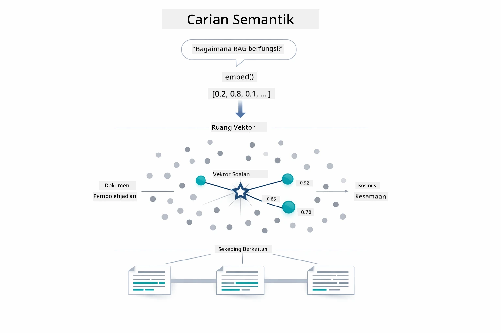

*Rajah ini membandingkan carian berasaskan kata kunci dengan carian semantik, menunjukkan bagaimana carian semantik mengambil kandungan konsep berkaitan walaupun kata kunci tidak sama.*

Di belakang tabir, kesamaan diukur menggunakan persamaan kosinus — pada dasarnya bertanya "adakah dua anak panah ini menunjuk ke arah yang sama?" Dua kepingan boleh menggunakan perkataan berbeza, tetapi jika maknanya sama, vektor mereka menunjuk arah sama dan skor hampir 1.0:

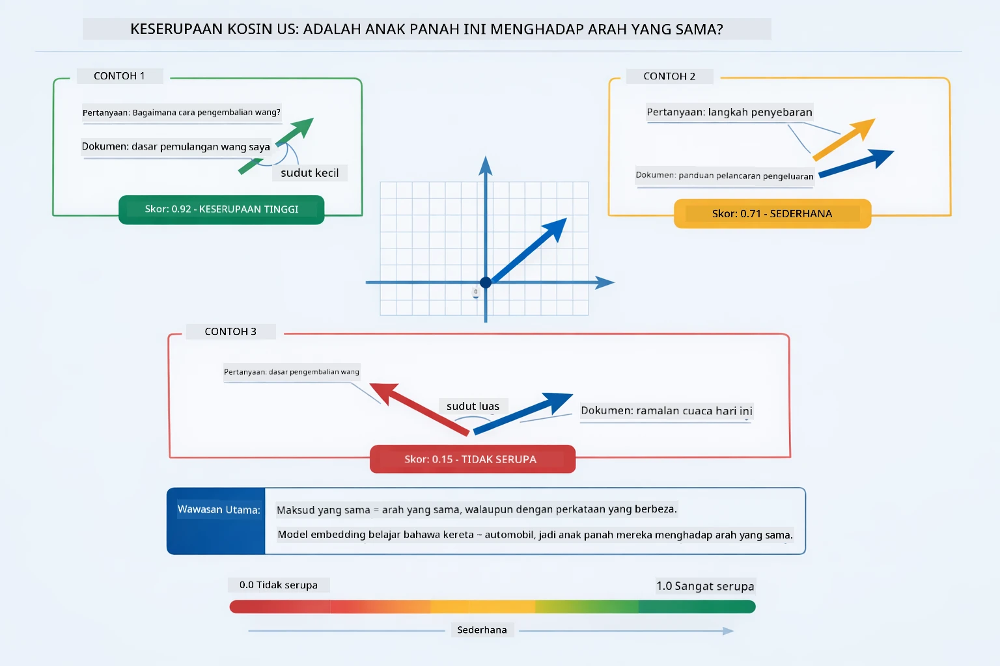

*Rajah ini menggambarkan persamaan kosinus sebagai sudut antara vektor penggambaran — vektor yang selari lebih rapat mendapat skor hampir 1.0, menandakan kesamaan semantik tinggi.*
> **🤖 Cuba dengan [GitHub Copilot](https://github.com/features/copilot) Chat:** Buka [`RagService.java`](../../../03-rag/src/main/java/com/example/langchain4j/rag/service/RagService.java) dan tanya:
> - "Bagaimanakah caranya carian kesamaan berfungsi dengan embeddings dan apa yang menentukan skor?"
> - "Apakah ambang kesamaan yang harus saya gunakan dan bagaimana ia mempengaruhi keputusan?"
> - "Bagaimana saya mengendalikan kes apabila tiada dokumen berkaitan dijumpai?"

### Penghasilan Jawapan

[RagService.java](../../../03-rag/src/main/java/com/example/langchain4j/rag/service/RagService.java)

Kepingan yang paling relevan dikumpulkan menjadi satu prompt berstruktur yang termasuk arahan jelas, konteks yang diperoleh, dan soalan pengguna. Model membaca kepingan khusus tersebut dan memberi jawapan berdasarkan maklumat itu — ia hanya boleh menggunakan apa yang berada di hadapannya, yang menghalang halusinasi.

```java
String context = matches.stream()
    .map(match -> match.embedded().text())
    .collect(Collectors.joining("\n\n"));

String prompt = String.format("""
    Answer the question based on the following context.
    If the answer cannot be found in the context, say so.

    Context:
    %s

    Question: %s

    Answer:""", context, request.question());

String answer = chatModel.chat(prompt);
```

Diagram di bawah menunjukkan rakaman ini beraksi — kepingan dengan skor tertinggi dari langkah carian disuntik ke dalam templat prompt, dan `OpenAiOfficialChatModel` menghasilkan jawapan berasas:

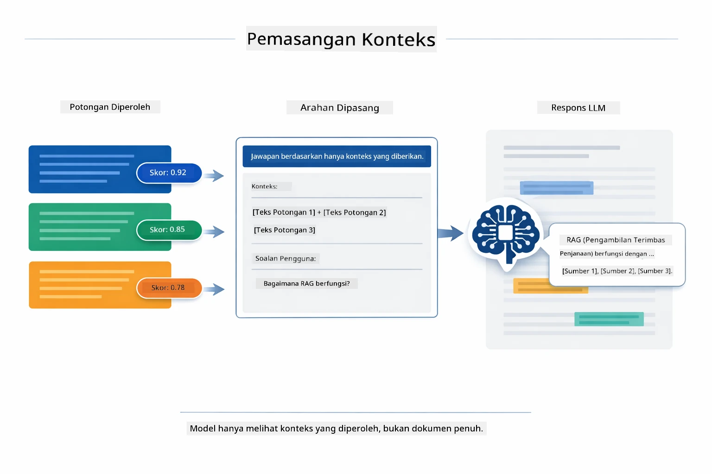

*Diagram ini menunjukkan bagaimana kepingan dengan skor tertinggi disusun menjadi prompt berstruktur, membolehkan model menghasilkan jawapan berasas daripada data anda.*

## Jalankan Aplikasi

**Sahkan pelaksanaan:**

Pastikan fail `.env` wujud di direktori akar dengan kelayakan Azure (dicipta semasa Modul 01):

**Bash:**
```bash
cat ../.env  # Patut menunjukkan AZURE_OPENAI_ENDPOINT, API_KEY, DEPLOYMENT
```

**PowerShell:**
```powershell
Get-Content ..\.env  # Perlu menunjukkan AZURE_OPENAI_ENDPOINT, API_KEY, PENYEBARAN
```

**Mulakan aplikasi:**

> **Nota:** Jika anda sudah mulai semua aplikasi menggunakan `./start-all.sh` dari Modul 01, modul ini sudah berjalan di port 8081. Anda boleh langkau arahan mula di bawah dan pergi terus ke http://localhost:8081.

**Pilihan 1: Menggunakan Spring Boot Dashboard (Disyorkan untuk pengguna VS Code)**

Kontena dev termasuk sambungan Spring Boot Dashboard, yang menyediakan antara muka visual untuk mengurus semua aplikasi Spring Boot. Anda boleh menemuinya di Bar Aktiviti di sebelah kiri VS Code (cari ikon Spring Boot).

Dari Spring Boot Dashboard, anda boleh:
- Melihat semua aplikasi Spring Boot yang tersedia dalam ruang kerja
- Mula/hentikan aplikasi dengan satu klik
- Lihat log aplikasi secara masa nyata
- Pantau status aplikasi

Cuma klik butang main di sebelah "rag" untuk mulakan modul ini, atau mulakan semua modul sekaligus.


*Tangkapan skrin ini menunjukkan Spring Boot Dashboard dalam VS Code, di mana anda boleh memulakan, menghentikan, dan memantau aplikasi secara visual.*

**Pilihan 2: Menggunakan skrip shell**

Mula semua aplikasi web (modul 01-04):

**Bash:**
```bash
cd ..  # Dari direktori root
./start-all.sh
```

**PowerShell:**
```powershell
cd ..  # Dari direktori akar
.\start-all.ps1
```

Atau mulakan hanya modul ini:

**Bash:**
```bash
cd 03-rag
./start.sh
```

**PowerShell:**
```powershell
cd 03-rag
.\start.ps1
```

Kedua-dua skrip secara automatik memuatkan pembolehubah persekitaran dari fail `.env` akar dan akan membina JAR jika ia tiada.

> **Nota:** Jika anda mahu membina semua modul secara manual dahulu sebelum mula:
>
> **Bash:**
> ```bash
> cd ..  # Go to root directory
> mvn clean package -DskipTests
> ```
>
> **PowerShell:**
> ```powershell
> cd ..  # Go to root directory
> mvn clean package -DskipTests
> ```

Buka http://localhost:8081 dalam pelayar anda.

**Untuk hentikan:**

**Bash:**
```bash
./stop.sh  # Hanya modul ini
# Atau
cd .. && ./stop-all.sh  # Semua modul
```

**PowerShell:**
```powershell
.\stop.ps1  # Modul ini sahaja
# Atau
cd ..; .\stop-all.ps1  # Semua modul
```

## Menggunakan Aplikasi

Aplikasi menyediakan antara muka web untuk memuat naik dokumen dan bertanya soalan.

<a href="images/rag-homepage.png"></a>

*Tangkapan skrin ini menunjukkan antara muka aplikasi RAG di mana anda memuat naik dokumen dan bertanya soalan.*

### Muat Naik Dokumen

Mulakan dengan memuat naik dokumen - fail TXT paling sesuai untuk ujian. Fail `sample-document.txt` disediakan dalam direktori ini yang mengandungi maklumat tentang ciri LangChain4j, pelaksanaan RAG, dan amalan terbaik - sempurna untuk menguji sistem.

Sistem memproses dokumen anda, memecahkannya menjadi kepingan, dan mencipta embeddings untuk setiap kepingan. Ini berlaku secara automatik apabila anda memuat naik.

### Tanya Soalan

Kini tanya soalan khusus tentang kandungan dokumen. Cuba fakta yang dengan jelas dinyatakan dalam dokumen. Sistem mencari kepingan berkaitan, memasukkannya ke prompt, dan menghasilkan jawapan.

### Semak Rujukan Sumber

Perhatikan setiap jawapan menyertakan rujukan sumber dengan skor kesamaan. Skor ini (0 hingga 1) menunjukkan betapa relevannya setiap kepingan dengan soalan anda. Skor lebih tinggi bermakna padanan lebih bagus. Ini membolehkan anda sahkan jawapan berbanding bahan sumber.

<a href="images/rag-query-results.png"></a>

*Tangkapan skrin ini menunjukkan keputusan pertanyaan dengan jawapan dijana, rujukan sumber, dan skor relevan bagi setiap kepingan yang diperoleh.*

### Cuba Soalan Berbeza

Cuba jenis soalan berbeza:
- Fakta khusus: "Apakah topik utama?"
- Perbandingan: "Apakah perbezaan antara X dan Y?"
- Rumusan: "Ringkaskan perkara utama tentang Z"

Perhatikan bagaimana skor relevan berubah mengikut kesesuaian soalan anda dengan kandungan dokumen.

## Konsep Utama

### Strategi Pemecahan Kepingan

Dokumen dipecah kepada kepingan 300 token dengan tumpang tindih 30 token. Keseimbangan ini memastikan setiap kepingan mempunyai konteks mencukupi untuk bermakna sementara kekal kecil untuk memasukkan beberapa kepingan dalam satu prompt.

### Skor Kesamaan

Setiap kepingan yang diperoleh disertai dengan skor kesamaan antara 0 dan 1 yang menunjukkan betapa hampirnya ia padan dengan soalan pengguna. Diagram di bawah memvisualisasikan julat skor dan bagaimana sistem menggunakannya bagi menapis keputusan:

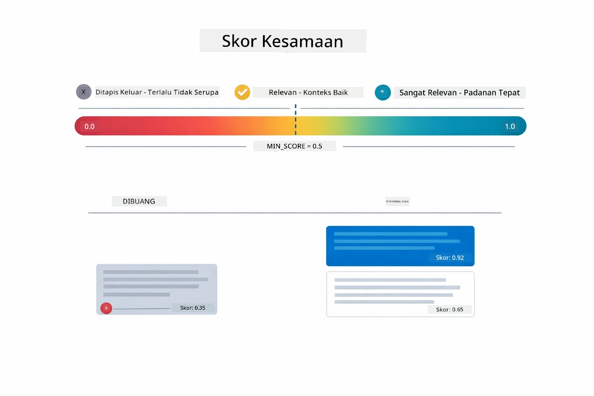

*Diagram ini menunjukkan julat skor dari 0 hingga 1, dengan ambang minimum 0.5 yang menapis keluar kepingan tidak relevan.*

Skor dalam julat 0 hingga 1:
- 0.7-1.0: Sangat relevan, padanan tepat
- 0.5-0.7: Relevan, konteks baik
- Kurang daripada 0.5: Ditapis, terlalu tidak serupa

Sistem hanya mengambil kepingan yang melebihi ambang minimum untuk memastikan kualiti.

Embeddings berfungsi baik apabila makna berkumpul dengan jelas, tetapi ada titik buta. Diagram di bawah menunjukkan mod kegagalan biasa — kepingan terlalu besar menghasilkan vektor kabur, kepingan terlalu kecil kurang konteks, istilah samar menunjuk ke pelbagai kluster, dan carian padanan tepat (ID, nombor bahagian) tidak berfungsi langsung dengan embeddings:

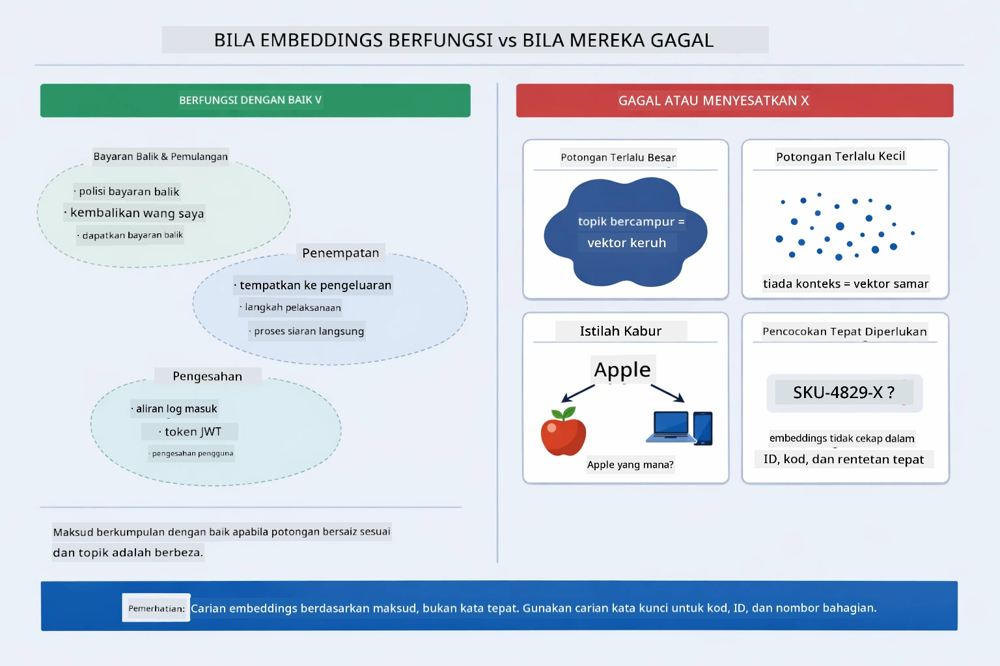

*Diagram ini menunjukkan mod kegagalan embedding biasa: kepingan terlalu besar, terlalu kecil, istilah samar yang menunjuk ke pelbagai kluster, dan carian padanan tepat seperti ID.*

### Penyimpanan Dalam Memori

Modul ini menggunakan penyimpanan dalam memori untuk kesederhanaan. Apabila anda mulakan semula aplikasi, dokumen yang dimuat naik akan hilang. Sistem produksi menggunakan pangkalan data vektor persisten seperti Qdrant atau Azure AI Search.

### Pengurusan Jendela Konteks

Setiap model mempunyai had jendela konteks maksimum. Anda tidak boleh memasukkan setiap kepingan dari dokumen besar. Sistem mendapatkan N kepingan paling relevan (lalai 5) untuk kekal dalam had sambil menyediakan konteks cukup untuk jawapan tepat.

## Bila RAG Penting

RAG tidak selalu pendekatan tepat. Panduan keputusan di bawah membantu anda tentukan bila RAG memberi nilai tambah berbanding bila pendekatan lebih mudah — seperti memasukkan kandungan terus dalam prompt atau bergantung pada pengetahuan terbina dalam model — sudah mencukupi:

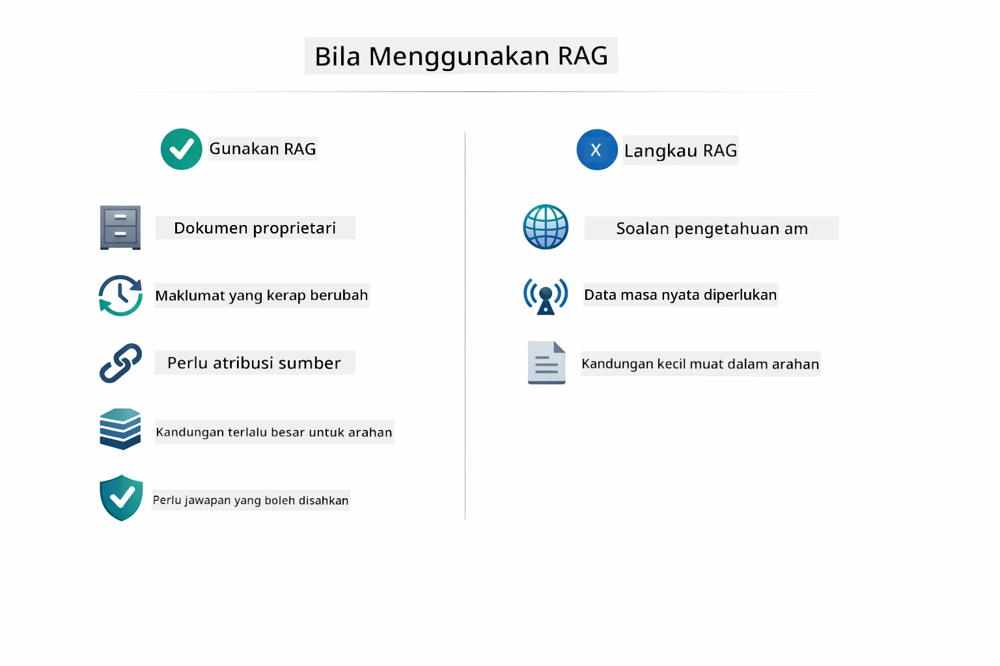

*Diagram ini menunjukkan panduan keputusan bila RAG memberi nilai tambah berbanding bila pendekatan lebih mudah mencukupi.*

**Gunakan RAG apabila:**
- Menjawab soalan tentang dokumen proprietari
- Maklumat berubah kerap (polisi, harga, spesifikasi)
- Ketepatan memerlukan atribusi sumber
- Kandungan terlalu besar untuk muat dalam satu prompt
- Anda memerlukan jawapan yang boleh disahkan dan berasas

**Jangan gunakan RAG apabila:**
- Soalan memerlukan pengetahuan umum yang sudah ada pada model
- Data masa nyata diperlukan (RAG berfungsi pada dokumen yang dimuat naik)
- Kandungan cukup kecil untuk dimasukkan terus dalam prompt

## Langkah Seterusnya

**Modul Seterusnya:** [04-tools - Ejen AI dengan Alat](../04-tools/README.md)

---

**Navigasi:** [← Sebelum: Modul 02 - Kejuruteraan Prompt](../02-prompt-engineering/README.md) | [Kembali ke Utama](../README.md) | [Seterusnya: Modul 04 - Alat →](../04-tools/README.md)

---

<!-- CO-OP TRANSLATOR DISCLAIMER START -->
**Penafian**:
Dokumen ini telah diterjemahkan menggunakan perkhidmatan terjemahan AI [Co-op Translator](https://github.com/Azure/co-op-translator). Walaupun kami berusaha untuk mencapai ketepatan, sila ambil maklum bahawa terjemahan automatik mungkin mengandungi kesilapan atau ketidaktepatan. Dokumen asal dalam bahasa asalnya harus dianggap sebagai sumber yang sahih. Untuk maklumat yang penting, disyorkan untuk mendapatkan terjemahan profesional oleh manusia. Kami tidak bertanggungjawab atas sebarang salah faham atau salah tafsir yang timbul daripada penggunaan terjemahan ini.
<!-- CO-OP TRANSLATOR DISCLAIMER END -->