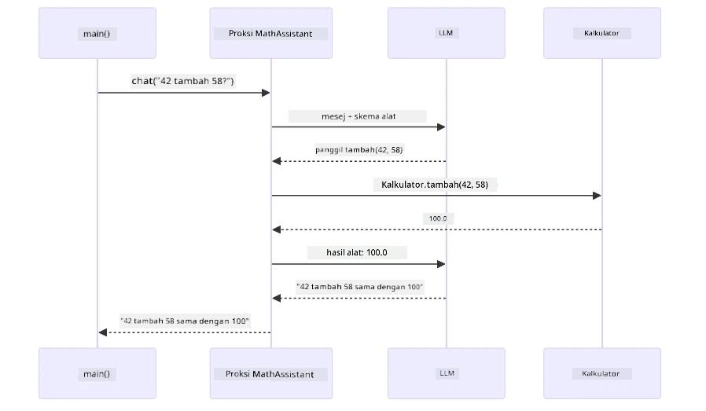
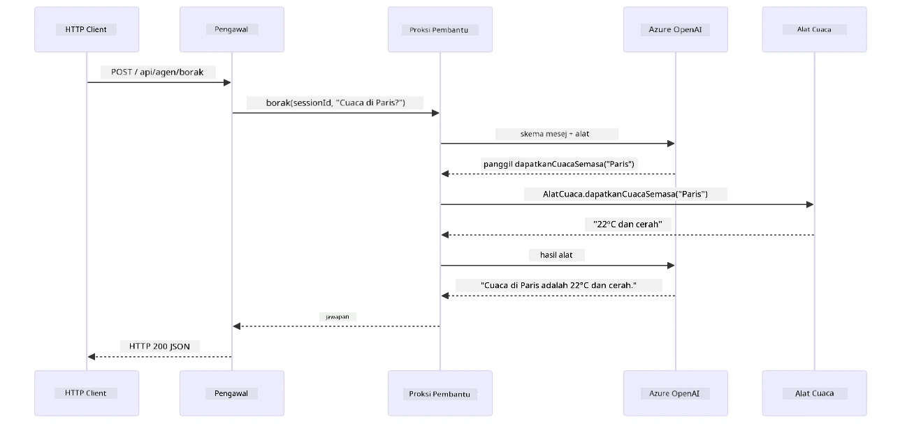

# Modul 04: Ejen AI dengan Alat

## Kandungan

- [Video Panduan](../../../04-tools)
- [Apa yang Anda Akan Pelajari](../../../04-tools)
- [Prasyarat](../../../04-tools)
- [Memahami Ejen AI dengan Alat](../../../04-tools)
- [Bagaimana Panggilan Alat Berfungsi](../../../04-tools)
  - [Definisi Alat](../../../04-tools)
  - [Pengambilan Keputusan](../../../04-tools)
  - [Pelaksanaan](../../../04-tools)
  - [Penjanaan Respons](../../../04-tools)
  - [Senibina: Auto-Wiring Spring Boot](../../../04-tools)
- [Rantaian Alat](../../../04-tools)
- [Jalankan Aplikasi](../../../04-tools)
- [Menggunakan Aplikasi](../../../04-tools)
  - [Cuba Penggunaan Alat Mudah](../../../04-tools)
  - [Uji Rantaian Alat](../../../04-tools)
  - [Lihat Aliran Perbualan](../../../04-tools)
  - [Eksperimen dengan Permintaan Berbeza](../../../04-tools)
- [Konsep Utama](../../../04-tools)
  - [Corak ReAct (Penalaran dan Bertindak)](../../../04-tools)
  - [Deskripsi Alat Penting](../../../04-tools)
  - [Pengurusan Sesi](../../../04-tools)
  - [Pengendalian Ralat](../../../04-tools)
- [Alat Tersedia](../../../04-tools)
- [Bilakah Menggunakan Ejen Berasaskan Alat](../../../04-tools)
- [Alat vs RAG](../../../04-tools)
- [Langkah Seterusnya](../../../04-tools)

## Video Panduan

Tonton sesi langsung ini yang menerangkan cara memulakan modul ini:

<a href="https://www.youtube.com/watch?v=O_J30kZc0rw"></a>

## Apa yang Anda Akan Pelajari

Sehingga kini, anda telah belajar bagaimana untuk berkomunikasi dengan AI, menyusun arahan dengan berkesan, dan menjadikan respons berasaskan dokumen anda. Tetapi masih ada kekangan asas: model bahasa hanya boleh menghasilkan teks. Ia tidak boleh memeriksa cuaca, melakukan pengiraan, membuat pertanyaan pangkalan data, atau berinteraksi dengan sistem luaran.

Alat mengubah ini. Dengan memberikan model akses kepada fungsi yang boleh ia panggil, anda menukar ia daripada penjana teks kepada ejen yang boleh mengambil tindakan. Model memutuskan bila ia memerlukan alat, alat mana yang hendak digunakan, dan parameter apa yang perlu dihantar. Kod anda melaksanakan fungsi itu dan mengembalikan hasil. Model memasukkan hasil tersebut ke dalam responsnya.

## Prasyarat

- Telah menyiapkan [Modul 01 - Pengenalan](../01-introduction/README.md) (sumber Azure OpenAI telah diterapkan)  
- Disyorkan telah melengkapkan modul-modul sebelumnya (modul ini merujuk [konsep RAG dari Modul 03](../03-rag/README.md) dalam perbandingan Alat vs RAG)  
- Fail `.env` di direktori utama dengan kredensial Azure (dicipta oleh `azd up` dalam Modul 01)  

> **Nota:** Jika anda belum menyiapkan Modul 01, ikut arahan penerapan di sana dahulu.

## Memahami Ejen AI dengan Alat

> **📝 Nota:** Istilah "ejen" dalam modul ini merujuk kepada pembantu AI yang dipertingkatkan dengan kemampuan memanggil alat. Ini berbeza dari pola **Agentic AI** (ejen autonomi dengan perancangan, memori, dan penalaran berlapis-lapis) yang akan kami bahas dalam [Modul 05: MCP](../05-mcp/README.md).

Tanpa alat, model bahasa hanya boleh menghasilkan teks daripada data latihannya. Tanyakan cuaca semasa, dan ia terpaksa meneka. Berikan ia alat, dan ia boleh memanggil API cuaca, melakukan pengiraan, atau bertanya pangkalan data — kemudian membina hasil sebenar itu ke dalam responsnya.


*Tanpa alat model hanya boleh meneka — dengan alat ia boleh memanggil API, menjalankan pengiraan, dan mengembalikan data masa nyata.*

Ejen AI dengan alat mengikuti corak **Reasoning and Acting (ReAct)**. Model tidak hanya membalas — ia berfikir apa yang diperlukan, bertindak dengan memanggil alat, memerhati hasil, kemudian memutuskan sama ada hendak bertindak lagi atau menyampaikan jawapan akhir:

1. **Berfikir** — Ejen menganalisis soalan pengguna dan menentukan maklumat yang diperlukan  
2. **Bertindak** — Ejen memilih alat yang tepat, menjana parameter yang betul, dan memanggilnya  
3. **Memerhati** — Ejen menerima output alat dan menilai hasil  
4. **Ulang atau Balas** — Jika data lebih diperlukan, ejen mengulangi; jika tidak, ia menyusun jawapan bahasa semula jadi  


*Kitaran ReAct — ejen berfikir tentang apa yang perlu dilakukan, bertindak dengan memanggil alat, memerhati hasil, dan mengulangi sehingga dapat memberikan jawapan akhir.*

Ini berlaku secara automatik. Anda tetapkan alat dan deskripsinya. Model mengendalikan pengambilan keputusan bila dan bagaimana untuk menggunakannya.

## Bagaimana Panggilan Alat Berfungsi

### Definisi Alat

[WeatherTool.java](../../../04-tools/src/main/java/com/example/langchain4j/agents/tools/WeatherTool.java) | [TemperatureTool.java](../../../04-tools/src/main/java/com/example/langchain4j/agents/tools/TemperatureTool.java)

Anda mentakrifkan fungsi dengan deskripsi jelas dan spesifikasi parameter. Model melihat deskripsi ini dalam sistem arahan dan memahami apa yang setiap alat lakukan.

```java
@Component
public class WeatherTool {
    
    @Tool("Get the current weather for a location")
    public String getCurrentWeather(@P("Location name") String location) {
        // Logik carian cuaca anda
        return "Weather in " + location + ": 22°C, cloudy";
    }
}

@AiService
public interface Assistant {
    String chat(@MemoryId String sessionId, @UserMessage String message);
}

// Pembantu disambungkan secara automatik oleh Spring Boot dengan:
// - Bean ChatModel
// - Semua kaedah @Tool dari kelas @Component
// - ChatMemoryProvider untuk pengurusan sesi
```
  
Rajah di bawah memecahkan setiap anotasi dan menunjukkan bagaimana setiap bahagiannya membantu AI memahami bila untuk memanggil alat dan argumen apa yang hendak diberi:


*Anatomi definisi alat — @Tool memberitahu AI bila menggunakannya, @P menerangkan setiap parameter, dan @AiService menghubungkan semuanya semasa permulaan.*

> **🤖 Cuba dengan [GitHub Copilot](https://github.com/features/copilot) Chat:** Buka [`WeatherTool.java`](../../../04-tools/src/main/java/com/example/langchain4j/agents/tools/WeatherTool.java) dan tanya:  
> - "Bagaimana saya boleh mengintegrasi API cuaca sebenar seperti OpenWeatherMap berbanding data rekaan?"  
> - "Apa yang menjadikan deskripsi alat baik yang membantu AI menggunakannya dengan betul?"  
> - "Bagaimana saya mengendalikan ralat API dan had kadar dalam pelaksanaan alat?"

### Pengambilan Keputusan

Apabila pengguna bertanya "Bagaimana cuaca di Seattle?", model tidak memilih alat secara rawak. Ia membandingkan niat pengguna dengan setiap deskripsi alat yang boleh diakses, menilai setiap satu dari segi kaitan, dan memilih yang paling sesuai. Kemudian ia menjana panggilan fungsi berstruktur dengan parameter yang betul — dalam kes ini, menetapkan `location` kepada `"Seattle"`.

Jika tiada alat yang sesuai dengan permintaan pengguna, model akan menjawab berdasarkan pengetahuannya sendiri. Jika beberapa alat sesuai, ia memilih yang paling spesifik.


*Model menilai setiap alat tersedia mengikut niat pengguna dan memilih padanan terbaik — sebab itulah penulisan deskripsi alat yang jelas dan spesifik adalah penting.*

### Pelaksanaan

[AgentService.java](../../../04-tools/src/main/java/com/example/langchain4j/agents/service/AgentService.java)

Spring Boot secara automatik menghubungkan antara muka deklaratif `@AiService` dengan semua alat yang didaftarkan, dan LangChain4j melaksanakan panggilan alat secara automatik. Di belakang tabir, satu panggilan alat lengkap mengalir melalui enam tahap — dari soalan bahasa semula jadi pengguna hingga ke jawapan bahasa semula jadi:


*Aliran hujung-ke-hujung — pengguna bertanya soalan, model memilih alat, LangChain4j melaksanakannya, dan model menggabungkan hasil ke dalam respons alami.*

Jika anda menjalankan [ToolIntegrationDemo](../../../00-quick-start/src/main/java/com/example/langchain4j/quickstart/ToolIntegrationDemo.java) dalam Modul 00, anda sudah melihat corak ini berfungsi — alat `Calculator` dipanggil dengan cara yang sama. Rajah urutan di bawah menunjukkan dengan tepat apa yang berlaku di belakang tabir semasa demo itu:



*Kitaran panggilan alat dari demo Permulaan Pantas — `AiServices` menghantar mesej anda dan skema alat kepada LLM, LLM membalas dengan panggilan fungsi seperti `add(42, 58)`, LangChain4j melaksanakan kaedah `Calculator` secara setempat, dan memberi keputusan kembali untuk jawapan akhir.*

> **🤖 Cuba dengan [GitHub Copilot](https://github.com/features/copilot) Chat:** Buka [`AgentService.java`](../../../04-tools/src/main/java/com/example/langchain4j/agents/service/AgentService.java) dan tanya:  
> - "Bagaimana corak ReAct berfungsi dan kenapa ia berkesan untuk ejen AI?"  
> - "Bagaimana ejen menentukan alat mana untuk digunakan dan dalam susunan apa?"  
> - "Apa yang berlaku jika pelaksanaan alat gagal - bagaimana saya harus mengendalikan ralat dengan kukuh?"

### Penjanaan Respons

Model menerima data cuaca dan memformatkannya menjadi respons bahasa semula jadi untuk pengguna.

### Senibina: Auto-Wiring Spring Boot

Modul ini menggunakan integrasi LangChain4j dengan Spring Boot dengan antara muka deklaratif `@AiService`. Semasa permulaan, Spring Boot mengesan setiap `@Component` yang mengandungi kaedah `@Tool`, bean `ChatModel` anda, dan `ChatMemoryProvider` — kemudian menghubungkan semuanya ke dalam satu antara muka `Assistant` tanpa kod boilerplate.


*Antara muka @AiService menghubungkan ChatModel, komponen alat, dan penyedia memori — Spring Boot mengendalikan semua sambungan secara automatik.*

Berikut adalah hayat permintaan penuh sebagai rajah urutan — dari permintaan HTTP melalui pengawal, perkhidmatan, dan proksi auto-wired, sehingga pelaksanaan alat dan kembali:



*Hayat permintaan lengkap Spring Boot — permintaan HTTP mengalir melalui pengawal dan perkhidmatan ke proksi Assistant auto-wired, yang mengatur LLM dan panggilan alat secara automatik.*

Manfaat utama kaedah ini:

- **Auto-wiring Spring Boot** — ChatModel dan alat dimasukkan secara automatik  
- **Corak @MemoryId** — Pengurusan memori berasaskan sesi automatik  
- **Satu contoh** — Assistant dicipta sekali dan digunakan semula untuk prestasi lebih baik  
- **Pelaksanaan type-safe** — Kaedah Java dipanggil terus dengan penukaran jenis  
- **Orkestrasi pelbagai giliran** — Mengendalikan rantaian alat secara automatik  
- **Tiada boilerplate** — Tiada panggilan manual `AiServices.builder()` atau HashMap memori  

Pendekatan alternatif (manual `AiServices.builder()`) memerlukan kod lebih banyak dan tidak mendapat manfaat integrasi Spring Boot.

## Rantaian Alat

**Rantaian Alat** — Kuasa sebenar ejen berasaskan alat muncul apabila satu soalan memerlukan beberapa alat. Tanyakan "Bagaimana cuaca di Seattle dalam Fahrenheit?" dan ejen secara automatik mengaitkan dua alat: pertama ia memanggil `getCurrentWeather` untuk dapatkan suhu dalam Celsius, kemudian ia menghantar nilai itu ke `celsiusToFahrenheit` untuk penukaran — semua dalam satu giliran perbualan.


*Rantaian alat dalam tindakan — ejen memanggil getCurrentWeather terlebih dahulu, kemudian menyalurkan hasil Celsius ke celsiusToFahrenheit, dan memberikan jawapan gabungan.*

**Kegagalan Yang Sopan** — Minta cuaca di bandar yang tiada dalam data rekaan. Alat mengembalikan mesej ralat, dan AI menerangkan yang ia tidak dapat membantu daripada aplikasi crash. Alat gagal dengan selamat. Rajah di bawah membezakan dua pendekatan — dengan pengendalian ralat yang betul, ejen menangkap pengecualian dan memberi respons yang membantu, tanpa itu aplikasi keseluruhan crash:


*Apabila alat gagal, ejen menangkap ralat dan memberikan penjelasan berguna daripada aplikasi crash.*

Ini berlaku dalam satu giliran perbualan. Ejen mengatur banyak panggilan alat secara autonomi.

## Jalankan Aplikasi

**Sahkan penerapan:**

Pastikan fail `.env` wujud di direktori utama dengan kredensial Azure (dicipta semasa Modul 01). Jalankan ini dari direktori modul (`04-tools/`):

**Bash:**  
```bash
cat ../.env  # Harus menunjukkan AZURE_OPENAI_ENDPOINT, API_KEY, DEPLOYMENT
```
  
**PowerShell:**  
```powershell
Get-Content ..\.env  # Harus menunjukkan AZURE_OPENAI_ENDPOINT, API_KEY, DEPLOYMENT
```
  
**Mulakan aplikasi:**

> **Nota:** Jika anda sudah memulakan semua aplikasi menggunakan `./start-all.sh` dari direktori utama (seperti yang diterangkan dalam Modul 01), modul ini sudah berjalan pada port 8084. Anda boleh langkau arahan mulakan di bawah dan pergi terus ke http://localhost:8084.

**Pilihan 1: Menggunakan Spring Boot Dashboard (Disyorkan untuk pengguna VS Code)**

Kontena pembangunan termasuk pelanjutan Spring Boot Dashboard, yang menyediakan antara muka visual untuk mengurus semua aplikasi Spring Boot. Anda boleh mencarinya di Bar Aktiviti di sebelah kiri VS Code (cari ikon Spring Boot).

Daripada Spring Boot Dashboard, anda boleh:  
- Melihat semua aplikasi Spring Boot tersedia dalam ruang kerja  
- Mulakan/henti aplikasi dengan satu klik  
- Lihat log aplikasi secara masa nyata  
- Pantau status aplikasi
Klik sahaja butang main di sebelah "tools" untuk memulakan modul ini, atau mulakan semua modul sekaligus.

Ini rupa Spring Boot Dashboard dalam VS Code:


*Spring Boot Dashboard dalam VS Code — mulakan, hentikan, dan pantau semua modul dari satu tempat*

**Pilihan 2: Menggunakan skrip shell**

Mulakan semua aplikasi web (modul 01-04):

**Bash:**
```bash
cd ..  # Dari direktori akar
./start-all.sh
```

**PowerShell:**
```powershell
cd ..  # Dari direktori akar
.\start-all.ps1
```

Atau mulakan hanya modul ini:

**Bash:**
```bash
cd 04-tools
./start.sh
```

**PowerShell:**
```powershell
cd 04-tools
.\start.ps1
```

Kedua-dua skrip secara automatik memuatkan pemboleh ubah persekitaran dari fail `.env` akar dan akan membina JAR jika ia tidak wujud.

> **Nota:** Jika anda lebih suka membina semua modul secara manual sebelum memulakan:
>
> **Bash:**
> ```bash
> cd ..  # Go to root directory
> mvn clean package -DskipTests
> ```
>
> **PowerShell:**
> ```powershell
> cd ..  # Go to root directory
> mvn clean package -DskipTests
> ```

Buka http://localhost:8084 dalam pelayar web anda.

**Untuk hentikan:**

**Bash:**
```bash
./stop.sh  # Modul ini sahaja
# Atau
cd .. && ./stop-all.sh  # Semua modul
```

**PowerShell:**
```powershell
.\stop.ps1  # Modul ini sahaja
# Atau
cd ..; .\stop-all.ps1  # Semua modul
```

## Menggunakan Aplikasi

Aplikasi ini menyediakan antara muka web di mana anda boleh berinteraksi dengan ejen AI yang mempunyai akses kepada alat cuaca dan penukaran suhu. Ini rupa antara mukanya — ia termasuk contoh permulaan pantas dan panel sembang untuk menghantar permintaan:

<a href="images/tools-homepage.png"></a>

*Antara muka Alat Ejen AI - contoh pantas dan antara muka sembang untuk berinteraksi dengan alat*

### Cuba Penggunaan Alat Mudah

Mulakan dengan permintaan mudah: "Tukar 100 darjah Fahrenheit ke Celsius". Ejen mengenali ia memerlukan alat penukaran suhu, memanggilnya dengan parameter yang betul, dan mengembalikan hasilnya. Perhatikan betapa semulajadinya ini dirasakan - anda tidak menyatakan alat mana yang hendak digunakan atau bagaimana memanggilnya.

### Uji Rantaian Alat

Sekarang cuba sesuatu yang lebih kompleks: "Cuaca di Seattle dan tukar ke Fahrenheit?" Perhatikan ejen melakukan ini secara langkah demi langkah. Pertama ia mendapat cuaca (yang mengembalikan Celsius), mengenal pasti ia perlu menukar ke Fahrenheit, memanggil alat penukaran, dan menggabungkan kedua-dua hasil ke satu jawapan.

### Lihat Aliran Perbualan

Antara muka sembang mengekalkan sejarah perbualan, membolehkan anda mempunyai interaksi berbilang giliran. Anda boleh melihat semua pertanyaan dan jawapan terdahulu, menjadikannya mudah untuk mengesan perbualan dan memahami bagaimana ejen membina konteks dalam beberapa pertukaran.

<a href="images/tools-conversation-demo.png"></a>

*Perbualan berbilang giliran menunjukkan penukaran mudah, semakan cuaca, dan rantaian alat*

### Eksperimen dengan Permintaan Berbeza

Cuba pelbagai gabungan:
- Semakan cuaca: "Cuaca di Tokyo?"
- Penukaran suhu: "Berapa 25°C dalam Kelvin?"
- Pertanyaan gabungan: "Periksa cuaca di Paris dan beritahu jika suhu melebihi 20°C"

Perhatikan bagaimana ejen mentafsir bahasa semulajadi dan memetakan kepada panggilan alat yang sesuai.

## Konsep Utama

### Corak ReAct (Berfikir dan Bertindak)

Ejen bergilir-gilir antara berfikir (memutuskan apa yang perlu dilakukan) dan bertindak (menggunakan alat). Corak ini membolehkan penyelesaian masalah secara autonomi dan bukan sekadar bertindak balas kepada arahan.

### Penerangan Alat Penting

Kualiti penerangan alat anda secara langsung mempengaruhi betapa baiknya ejen menggunakannya. Penerangan yang jelas dan khusus membantu model memahami bila dan bagaimana untuk memanggil setiap alat.

### Pengurusan Sesi

Anotasi `@MemoryId` membolehkan pengurusan ingatan berasaskan sesi secara automatik. Setiap ID sesi mendapat instans `ChatMemory` sendiri yang diuruskan oleh bean `ChatMemoryProvider`, supaya pelbagai pengguna boleh berinteraksi dengan ejen serentak tanpa perbualan mereka bercampur. Rajah berikut menunjukkan bagaimana pelbagai pengguna diarahkan ke stor ingatan yang terasing berdasarkan ID sesi mereka:


*Setiap ID sesi memetakan kepada sejarah perbualan yang terasing — pengguna tidak pernah melihat mesej antara satu sama lain.*

### Pengurusan Ralat

Alat boleh gagal — API tamat masa, parameter mungkin tidak sah, perkhidmatan luaran tergendala. Ejen produksi memerlukan pengurusan ralat supaya model boleh menerangkan masalah atau cuba alternatif daripada menyebabkan aplikasi lumpuh sepenuhnya. Apabila alat melemparkan pengecualian, LangChain4j menangkapnya dan menghantar mesej ralat balik kepada model, yang kemudian boleh menerangkan masalah dalam bahasa semulajadi.

## Alat Tersedia

Rajah di bawah menunjukkan ekosistem luas alat yang boleh anda bina. Modul ini mempamerkan alat cuaca dan suhu, tetapi corak `@Tool` yang sama berfungsi untuk mana-mana kaedah Java — daripada pertanyaan pangkalan data hingga pemprosesan pembayaran.


*Mana-mana kaedah Java yang dianotasikan dengan @Tool akan tersedia kepada AI — corak ini meluas kepada pangkalan data, API, emel, operasi fail, dan banyak lagi.*

## Bila Menggunakan Ejen Berasaskan Alat

Tidak semua permintaan memerlukan alat. Keputusan bergantung sama ada AI perlu berinteraksi dengan sistem luaran atau boleh menjawab daripada pengetahuannya sendiri. Panduan berikut merumuskan bila alat menambah nilai dan bila ia tidak diperlukan:


*Panduan keputusan pantas — alat untuk data masa nyata, pengiraan, dan tindakan; pengetahuan umum dan tugas kreatif tidak memerlukannya.*

## Alat vs RAG

Modul 03 dan 04 kedua-duanya memperluas kemampuan AI, tetapi dengan cara yang berbeza secara asas. RAG memberi model akses kepada **pengetahuan** dengan mengambil dokumen. Alat memberi model kebolehan melakukan **tindakan** dengan memanggil fungsi. Rajah di bawah membandingkan kedua-dua pendekatan secara berdampingan — daripada cara setiap workflow beroperasi hingga pertukaran antara keduanya:


*RAG mengambil maklumat dari dokumen statik — Alat melaksanakan tindakan dan mengambil data dinamik masa nyata. Banyak sistem produksi menggabungkan kedua-duanya.*

Dalam praktik, banyak sistem produksi menggabungkan kedua-dua pendekatan: RAG untuk mendasari jawapan dalam dokumentasi anda, dan Alat untuk mengambil data langsung atau menjalankan operasi.

## Langkah Seterusnya

**Modul Seterusnya:** [05-mcp - Model Context Protocol (MCP)](../05-mcp/README.md)

---

**Navigasi:** [← Sebelumnya: Modul 03 - RAG](../03-rag/README.md) | [Kembali ke Utama](../README.md) | [Seterusnya: Modul 05 - MCP →](../05-mcp/README.md)

---

<!-- CO-OP TRANSLATOR DISCLAIMER START -->
**Penafian**:  
Dokumen ini telah diterjemahkan menggunakan perkhidmatan terjemahan AI [Co-op Translator](https://github.com/Azure/co-op-translator). Walaupun kami berusaha untuk ketepatan, sila maklum bahawa terjemahan automatik mungkin mengandungi kesilapan atau ketidaktepatan. Dokumen asal dalam bahasa asalnya hendaklah dianggap sebagai sumber yang sahih. Untuk maklumat penting, terjemahan manusia profesional adalah disyorkan. Kami tidak bertanggungjawab terhadap sebarang salah faham atau salah tafsir yang timbul daripada penggunaan terjemahan ini.
<!-- CO-OP TRANSLATOR DISCLAIMER END -->