# Modul 04: Ejen AI dengan Alat

## Jadual Kandungan

- [Apa yang Anda Akan Pelajari](../../../04-tools)
- [Prasyarat](../../../04-tools)
- [Memahami Ejen AI dengan Alat](../../../04-tools)
- [Bagaimana Panggilan Alat Berfungsi](../../../04-tools)
  - [Definisi Alat](../../../04-tools)
  - [Pengambilan Keputusan](../../../04-tools)
  - [Pelaksanaan](../../../04-tools)
  - [Penjanaan Respons](../../../04-tools)
  - [Seni Bina: Penyambungan Auto Spring Boot](../../../04-tools)
- [Rangkaian Alat](../../../04-tools)
- [Jalankan Aplikasi](../../../04-tools)
- [Menggunakan Aplikasi](../../../04-tools)
  - [Cuba Penggunaan Alat Mudah](../../../04-tools)
  - [Uji Rangkaian Alat](../../../04-tools)
  - [Lihat Aliran Perbualan](../../../04-tools)
  - [Eksperimen dengan Permintaan Berbeza](../../../04-tools)
- [Konsep Utama](../../../04-tools)
  - [Corak ReAct (Berfikir dan Bertindak)](../../../04-tools)
  - [Keterangan Alat Penting](../../../04-tools)
  - [Pengurusan Sesi](../../../04-tools)
  - [Pengendalian Ralat](../../../04-tools)
- [Alat Tersedia](../../../04-tools)
- [Bilakah Menggunakan Ejen Berasaskan Alat](../../../04-tools)
- [Alat vs RAG](../../../04-tools)
- [Langkah Seterusnya](../../../04-tools)

## Apa yang Anda Akan Pelajari

Setakat ini, anda telah belajar bagaimana untuk mengadakan perbualan dengan AI, menyusun arahan dengan berkesan, dan mengaitkan respons dalam dokumen anda. Tetapi masih ada batasan asas: model bahasa hanya boleh menjana teks. Ia tidak boleh menyemak cuaca, melakukan pengiraan, membuat pertanyaan pangkalan data, atau berinteraksi dengan sistem luar.

Alat mengubah ini. Dengan memberikan model akses kepada fungsi yang boleh dipanggil, anda mengubahnya dari penjana teks menjadi ejen yang boleh mengambil tindakan. Model memutuskan bila ia memerlukan alat, alat mana yang digunakan, dan parameter apa yang perlu diserahkan. Kod anda menjalankan fungsi itu dan mengembalikan hasil. Model menggabungkan hasil itu ke dalam responsnya.

## Prasyarat

- Menyelesaikan Modul 01 (sumber Azure OpenAI telah disebarkan)
- Fail `.env` dalam direktori root dengan kelayakan Azure (dicipta oleh `azd up` dalam Modul 01)

> **Nota:** Jika anda belum menyelesaikan Modul 01, ikut arahan penyebaran di sana terlebih dahulu.

## Memahami Ejen AI dengan Alat

> **📝 Nota:** Istilah "ejen" dalam modul ini merujuk kepada pembantu AI yang dipertingkatkan dengan keupayaan panggilan alat. Ini berbeza daripada corak **Agentic AI** (ejen autonomi dengan perancangan, memori, dan penalaran berbilang langkah) yang akan kita pelajari dalam [Modul 05: MCP](../05-mcp/README.md).

Tanpa alat, model bahasa hanya boleh menjana teks dari data latihan. Tanya ia tentang cuaca semasa, dan ia harus meneka. Berikan ia alat, dan ia boleh memanggil API cuaca, melakukan pengiraan, atau membuat pertanyaan pangkalan data — kemudian menggabungkan hasil sebenar itu ke dalam responsnya.

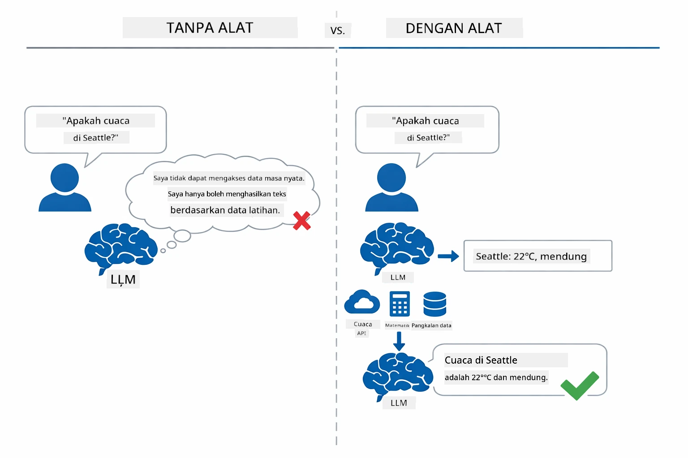

*Tanpa alat model hanya boleh meneka — dengan alat ia boleh memanggil API, menjalankan pengiraan, dan mengembalikan data masa nyata.*

Ejen AI dengan alat mengikuti corak **Berfikir dan Bertindak (ReAct)**. Model bukan sahaja memberi respons — ia berfikir tentang apa yang diperlukan, bertindak dengan memanggil alat, memerhati hasil, dan kemudian memutuskan sama ada untuk bertindak lagi atau memberi jawapan akhir:

1. **Berfikir** — Ejen menganalisis soalan pengguna dan menentukan maklumat yang diperlukan
2. **Bertindak** — Ejen memilih alat yang sesuai, menjana parameter yang betul, dan memanggilnya
3. **Memerhati** — Ejen menerima output alat dan menilai hasil
4. **Ulang atau Jawab** — Jika data lebih diperlukan, ejen mengulangi; jika tidak, ia menyusun jawapan dalam bahasa semula jadi

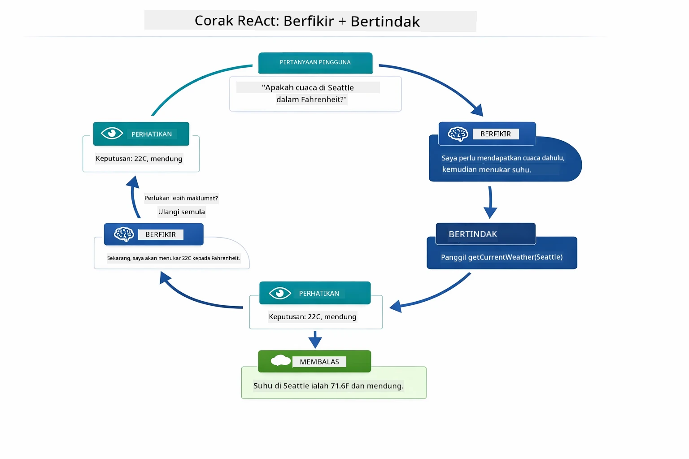

*Kitaran ReAct — ejen berfikir tentang apa yang perlu dibuat, bertindak dengan memanggil alat, memerhati hasil, dan mengulang sehingga dapat memberikan jawapan akhir.*

Ini berlaku secara automatik. Anda mentakrifkan alat dan penerangannya. Model mengendalikan keputusan bila dan bagaimana menggunakannya.

## Bagaimana Panggilan Alat Berfungsi

### Definisi Alat

[WeatherTool.java](../../../04-tools/src/main/java/com/example/langchain4j/agents/tools/WeatherTool.java) | [TemperatureTool.java](../../../04-tools/src/main/java/com/example/langchain4j/agents/tools/TemperatureTool.java)

Anda mentakrifkan fungsi dengan penerangan jelas dan spesifikasi parameter. Model melihat penerangan ini dalam arahan sistem dan memahami apa yang dilakukan oleh setiap alat.

```java
@Component
public class WeatherTool {
    
    @Tool("Get the current weather for a location")
    public String getCurrentWeather(@P("Location name") String location) {
        // Logik carian cuaca anda
        return "Weather in " + location + ": 22°C, cloudy";
    }
}

@AiService
public interface Assistant {
    String chat(@MemoryId String sessionId, @UserMessage String message);
}

// Pembantu disambungkan secara automatik oleh Spring Boot dengan:
// - Bean ChatModel
// - Semua kaedah @Tool dari kelas @Component
// - ChatMemoryProvider untuk pengurusan sesi
```

Rajah di bawah memecahkan setiap anotasi dan menunjukkan bagaimana setiap bahagian membantu AI memahami bila untuk memanggil alat dan argumen apa yang perlu diberikan:

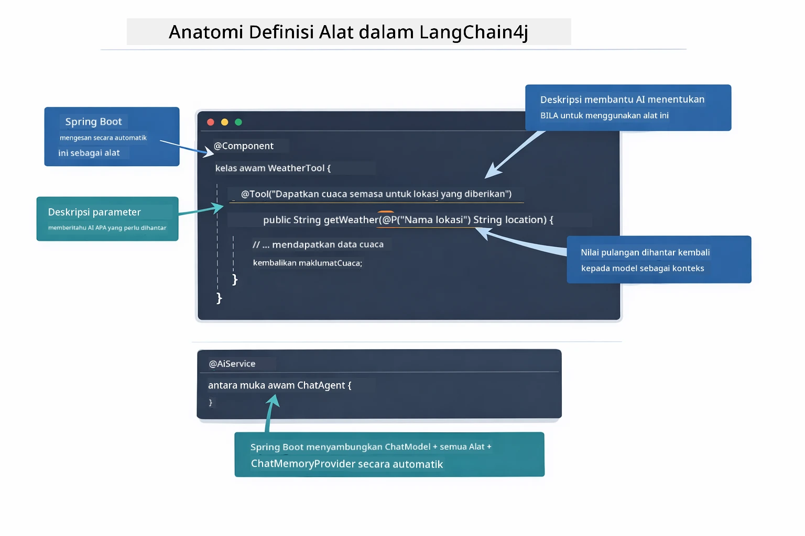

*Anatomi definisi alat — @Tool memberitahu AI bila untuk menggunakannya, @P menerangkan setiap parameter, dan @AiService menyambungkan semuanya pada permulaan.*

> **🤖 Cuba dengan [GitHub Copilot](https://github.com/features/copilot) Chat:** Buka [`WeatherTool.java`](../../../04-tools/src/main/java/com/example/langchain4j/agents/tools/WeatherTool.java) dan tanya:
> - "Bagaimana saya integrasikan API cuaca sebenar seperti OpenWeatherMap dan bukannya data rekaan?"
> - "Apa yang membuatkan penerangan alat yang baik yang membantu AI menggunakannya dengan betul?"
> - "Bagaimana saya mengendalikan ralat API dan had kadar dalam pelaksanaan alat?"

### Pengambilan Keputusan

Apabila pengguna bertanya "Bagaimana cuaca di Seattle?", model tidak memilih alat secara rawak. Ia membandingkan niat pengguna dengan setiap penerangan alat yang ada, menilai kesesuaian setiap satu, dan memilih yang paling sesuai. Kemudian ia menjana panggilan fungsi berstruktur dengan parameter yang betul — dalam kes ini, menetapkan `location` kepada `"Seattle"`.

Jika tiada alat yang sesuai dengan permintaan pengguna, model akan menjawab berdasarkan pengetahuannya sendiri. Jika beberapa alat sesuai, ia memilih yang paling spesifik.

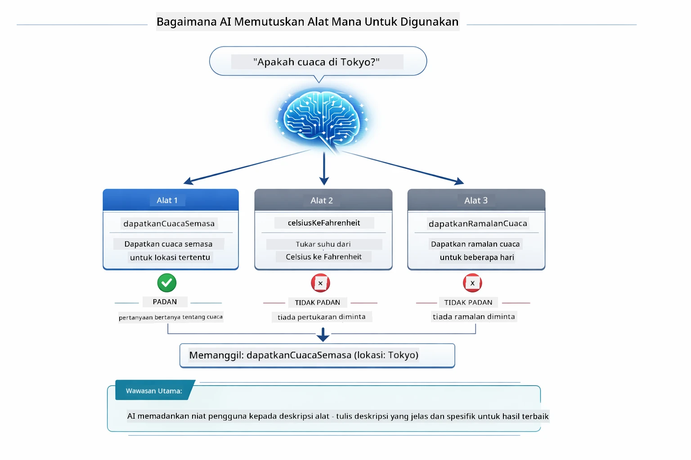

*Model menilai setiap alat yang tersedia melawan niat pengguna dan memilih yang paling sesuai — sebab itulah penerangan alat yang jelas dan spesifik sangat penting.*

### Pelaksanaan

[AgentService.java](../../../04-tools/src/main/java/com/example/langchain4j/agents/service/AgentService.java)

Spring Boot menyambung secara automatik antara antara muka deklaratif `@AiService` dengan semua alat yang didaftarkan, dan LangChain4j melaksanakan panggilan alat secara automatik. Di belakang tabir, satu panggilan alat lengkap melalui enam peringkat — dari soalan dalam bahasa semula jadi pengguna sehingga jawapan dalam bahasa semula jadi:

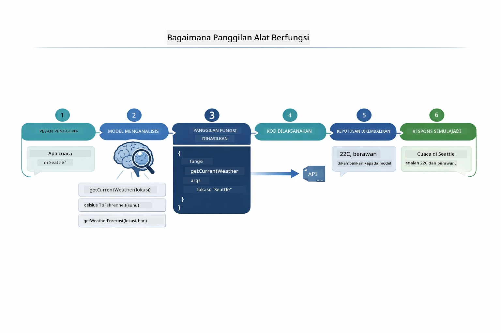

*Aliran hujung-ke-hujung — pengguna bertanya soalan, model memilih alat, LangChain4j melaksanakannya, dan model menyusun hasil ke dalam respons semula jadi.*

> **🤖 Cuba dengan [GitHub Copilot](https://github.com/features/copilot) Chat:** Buka [`AgentService.java`](../../../04-tools/src/main/java/com/example/langchain4j/agents/service/AgentService.java) dan tanya:
> - "Bagaimana corak ReAct berfungsi dan mengapa ia berkesan untuk ejen AI?"
> - "Bagaimana ejen memutuskan alat mana yang digunakan dan dalam susunan apa?"
> - "Apa yang berlaku jika pelaksanaan alat gagal - bagaimana saya harus mengendalikan ralat dengan mantap?"

### Penjanaan Respons

Model menerima data cuaca dan memformatkannya menjadi respons bahasa semula jadi untuk pengguna.

### Seni Bina: Penyambungan Auto Spring Boot

Modul ini menggunakan integrasi LangChain4j dengan Spring Boot melalui antara muka deklaratif `@AiService`. Pada permulaan, Spring Boot mengesan setiap `@Component` yang mengandungi kaedah `@Tool`, bean `ChatModel` anda, dan `ChatMemoryProvider` — kemudian menyambungkan semuanya ke dalam satu antara muka `Assistant` tanpa memerlukan kod boilerplate.

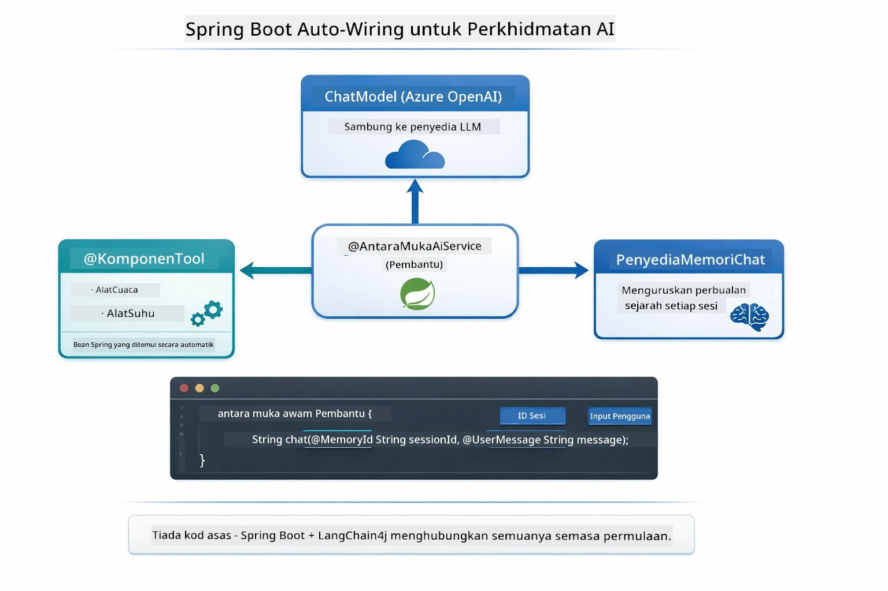

*Antara muka @AiService mengikat bersama ChatModel, komponen alat, dan penyedia memori — Spring Boot mengendalikan semua penyambungan secara automatik.*

Faedah utama pendekatan ini:

- **Penyambungan auto Spring Boot** — ChatModel dan alat disuntik secara automatik
- **Corak @MemoryId** — Pengurusan memori berdasarkan sesi secara automatik
- **Satu contoh sahaja** — Assistant dicipta sekali dan digunakan semula untuk prestasi lebih baik
- **Pelaksanaan selamat jenis** — Kaedah Java dipanggil secara langsung dengan penukaran jenis
- **Pengurusan berbilang pusingan** — Mengendalikan rangkaian alat secara automatik
- **Tiada boilerplate** — Tiada panggilan manual `AiServices.builder()` atau peta Hash memori

Pendekatan alternatif (manual `AiServices.builder()`) memerlukan lebih banyak kod dan tidak mendapat faedah integrasi Spring Boot.

## Rangkaian Alat

**Rangkaian Alat** — Kuasa sebenar ejen berasaskan alat ditunjukkan apabila satu soalan memerlukan pelbagai alat. Tanya "Bagaimana cuaca di Seattle dalam Fahrenheit?" dan ejen secara automatik menyusun rangkaian dua alat: pertama ia memanggil `getCurrentWeather` untuk mendapat suhu dalam Celsius, kemudian ia menyampaikan nilai itu ke `celsiusToFahrenheit` untuk penukaran — semua dalam satu pusingan perbualan.

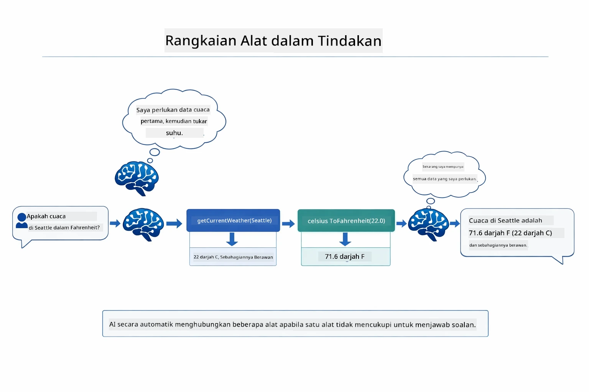

*Rangkaian alat dalam tindakan — ejen memanggil getCurrentWeather dahulu, kemudian menghantar hasil Celsius ke celsiusToFahrenheit, dan memberi jawapan gabungan.*

Ini kelihatan seperti berikut dalam aplikasi berjalan — ejen menyusun dua panggilan alat dalam satu pusingan perbualan:

<a href="images/tool-chaining.png"></a>

*Output aplikasi sebenar — ejen secara automatik menyusun getCurrentWeather → celsiusToFahrenheit dalam satu pusingan.*

**Kegagalan Tersusun** — Tanya tentang cuaca di bandar yang tiada dalam data rekaan. Alat mengembalikan mesej ralat, dan AI menerangkan ia tidak dapat membantu bukannya terhenti. Alat gagal dengan selamat.

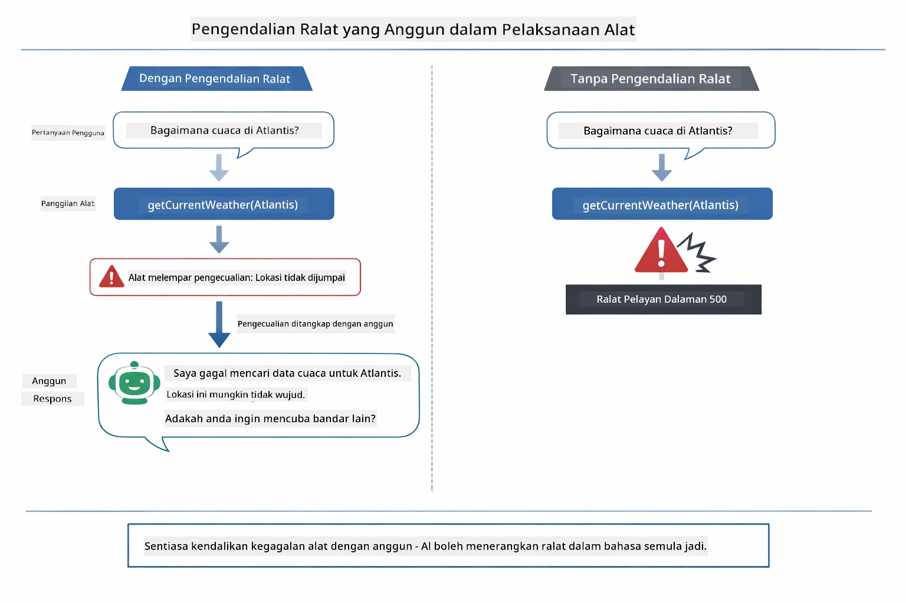

*Apabila alat gagal, ejen menangkap ralat dan memberi respons dengan penerangan yang membantu bukannya terhenti.*

Ini berlaku dalam satu pusingan perbualan. Ejen mengatur pelbagai panggilan alat secara automatik.

## Jalankan Aplikasi

**Sahkan penyebaran:**

Pastikan fail `.env` wujud dalam direktori root dengan kelayakan Azure (dicipta semasa Modul 01):
```bash
cat ../.env  # Perlu menunjukkan AZURE_OPENAI_ENDPOINT, API_KEY, PENDEPLOYAN
```

**Mula aplikasi:**

> **Nota:** Jika anda sudah mula semua aplikasi menggunakan `./start-all.sh` dari Modul 01, modul ini sudah berjalan pada port 8084. Anda boleh langkau arahan mula di bawah dan pergi terus ke http://localhost:8084.

**Pilihan 1: Menggunakan Papan Pemuka Spring Boot (Disyorkan untuk pengguna VS Code)**

Bekas pembangunan termasuk sambungan Papan Pemuka Spring Boot, yang menyediakan antaramuka visual untuk mengurus semua aplikasi Spring Boot. Anda boleh menemuinya dalam Bar Aktiviti di sebelah kiri VS Code (cari ikon Spring Boot).

Dari Papan Pemuka Spring Boot, anda boleh:
- Melihat semua aplikasi Spring Boot yang tersedia dalam ruang kerja
- Mula/hentikan aplikasi dengan satu klik
- Lihat log aplikasi secara masa nyata
- Pantau status aplikasi

Klik sahaja butang main di sebelah "tools" untuk memulakan modul ini, atau mulakan semua modul sekaligus.


**Pilihan 2: Menggunakan skrip shell**

Mulakan semua aplikasi web (modul 01-04):

**Bash:**
```bash
cd ..  # Dari direktori akar
./start-all.sh
```

**PowerShell:**
```powershell
cd ..  # Dari direktori root
.\start-all.ps1
```

Atau mulakan modul ini sahaja:

**Bash:**
```bash
cd 04-tools
./start.sh
```

**PowerShell:**
```powershell
cd 04-tools
.\start.ps1
```

Kedua-dua skrip memuatkan pembolehubah persekitaran secara automatik dari fail `.env` root dan akan membina JAR jika belum wujud.

> **Nota:** Jika anda lebih suka membina semua modul secara manual sebelum memulakan:
>
> **Bash:**
> ```bash
> cd ..  # Go to root directory
> mvn clean package -DskipTests
> ```
>
> **PowerShell:**
> ```powershell
> cd ..  # Go to root directory
> mvn clean package -DskipTests
> ```

Buka http://localhost:8084 dalam pelayar anda.

**Untuk berhenti:**

**Bash:**
```bash
./stop.sh  # Modul ini sahaja
# Atau
cd .. && ./stop-all.sh  # Semua modul
```

**PowerShell:**
```powershell
.\stop.ps1  # Modul ini sahaja
# Atau
cd ..; .\stop-all.ps1  # Semua modul
```

## Menggunakan Aplikasi

Aplikasi menyediakan antaramuka web di mana anda boleh berinteraksi dengan ejen AI yang mempunyai akses kepada alat cuaca dan penukaran suhu.

<a href="images/tools-homepage.png"></a>

*Antaramuka Alat Ejen AI - contoh cepat dan antaramuka sembang untuk berinteraksi dengan alat*

### Cuba Penggunaan Alat Mudah
Mulakan dengan permintaan yang mudah: "Tukar 100 darjah Fahrenheit ke Celsius". Ejen mengenal pasti bahawa ia memerlukan alat penukaran suhu, memanggilnya dengan parameter yang betul, dan mengembalikan hasilnya. Perhatikan betapa semulajadinya ini terasa - anda tidak menyatakan alat mana yang perlu digunakan atau bagaimana untuk memanggilnya.

### Uji Rantaian Alat

Sekarang cuba sesuatu yang lebih kompleks: "Bagaimana cuaca di Seattle dan tukarkannya ke Fahrenheit?" Perhatikan ejen berkerja melalui ini langkah demi langkah. Ia pertama mendapatkan cuaca (yang mengembalikan Celsius), mengenal pasti ia perlu menukar ke Fahrenheit, memanggil alat penukaran, dan menggabungkan kedua-dua hasil menjadi satu jawapan.

### Lihat Aliran Perbualan

Antaramuka sembang mengekalkan sejarah perbualan, membolehkan anda melakukan interaksi berbilang pusingan. Anda boleh melihat semua pertanyaan dan jawapan terdahulu, memudahkan anda menjejaki perbualan dan memahami bagaimana ejen membina konteks sepanjang beberapa pertukaran.

<a href="images/tools-conversation-demo.png"></a>

*Perbualan berbilang pusingan yang menunjukkan penukaran mudah, carian cuaca, dan rantaian alat*

### Cuba dengan Permintaan Berbeza

Cuba pelbagai kombinasi:
- Carian cuaca: "Bagaimana cuaca di Tokyo?"
- Penukaran suhu: "Berapa 25°C dalam Kelvin?"
- Pertanyaan gabungan: "Semak cuaca di Paris dan beritahu saya jika ia melebihi 20°C"

Perhatikan bagaimana ejen mentafsir bahasa semula jadi dan memetakannya kepada panggilan alat yang sesuai.

## Konsep Utama

### Corak ReAct (Penyeleksian dan Tindakan)

Ejen bergilir antara membuat penyeleksian (memutuskan apa yang perlu dilakukan) dan bertindak (menggunakan alat). Corak ini membolehkan penyelesaian masalah secara autonomi dan bukannya hanya membalas arahan.

### Penerangan Alat Penting

Kualiti penerangan alat anda secara langsung mempengaruhi bagaimana baik ejen menggunakannya. Penerangan yang jelas dan spesifik membantu model memahami bila dan bagaimana memanggil setiap alat.

### Pengurusan Sesi

Anotasi `@MemoryId` membolehkan pengurusan memori berasaskan sesi secara automatik. Setiap ID sesi mendapat contoh `ChatMemory`nya sendiri yang diuruskan oleh `ChatMemoryProvider` bean, supaya pelbagai pengguna boleh berinteraksi dengan ejen secara serentak tanpa perbualan mereka bercampur.

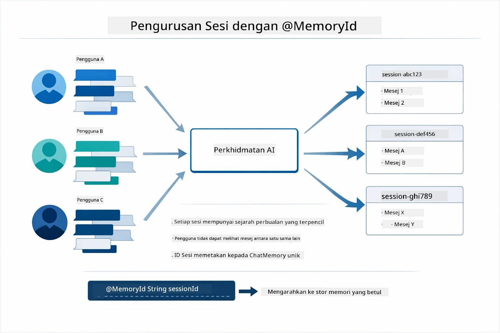

*Setiap ID sesi memetakan kepada sejarah perbualan terasing — pengguna tidak pernah melihat mesej antara satu sama lain.*

### Pengendalian Ralat

Alat boleh gagal — API berlebihan masa, parameter mungkin tidak sah, perkhidmatan luaran terhenti. Ejen produksi memerlukan pengendalian ralat supaya model boleh menjelaskan masalah atau mencuba alternatif daripada meruntuhkan keseluruhan aplikasi. Apabila alat memunculkan pengecualian, LangChain4j menangkapnya dan menghantar mesej ralat kembali kepada model, yang kemudian boleh menerangkan masalah dalam bahasa semula jadi.

## Alat Tersedia

Rajah di bawah menunjukkan ekosistem luas alat yang anda boleh bina. Modul ini menunjukkan alat cuaca dan suhu, tetapi corak `@Tool` yang sama berfungsi untuk mana-mana kaedah Java — dari soal selidik pangkalan data hingga pemprosesan pembayaran.

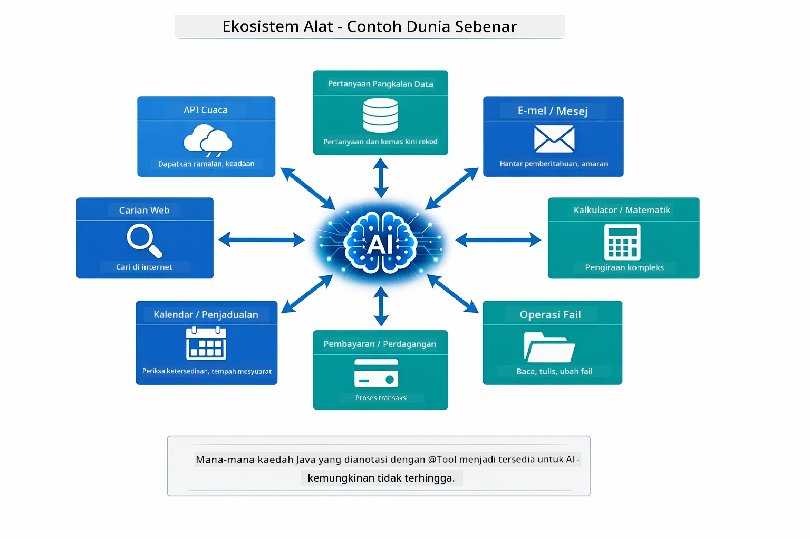

*Mana-mana kaedah Java yang dianotasi dengan @Tool menjadi tersedia kepada AI — corak ini meluas kepada pangkalan data, API, e-mel, operasi fail, dan banyak lagi.*

## Bila Untuk Menggunakan Ejen Berasaskan Alat

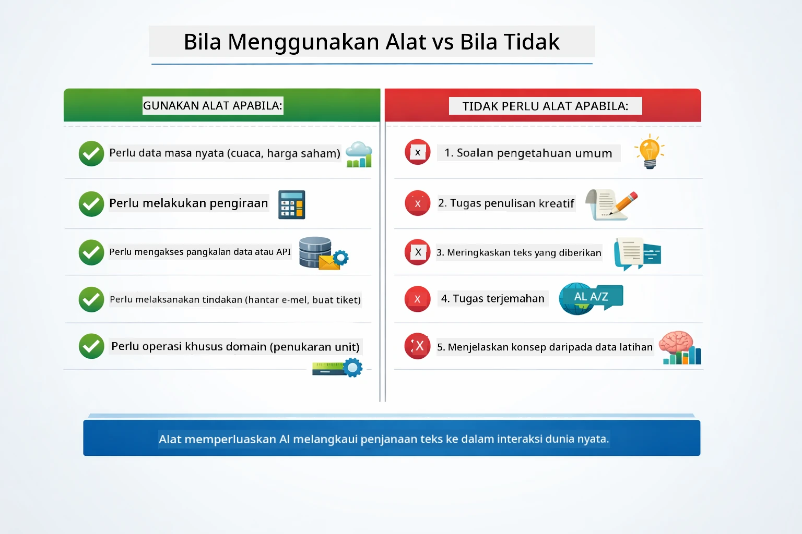

*Panduan keputusan ringkas — alat adalah untuk data masa nyata, pengiraan, dan tindakan; pengetahuan umum dan tugas kreatif tidak memerlukannya.*

**Gunakan alat apabila:**
- Jawapan memerlukan data masa nyata (cuaca, harga saham, inventori)
- Anda perlu melakukan pengiraan melebihi matematik mudah
- Mengakses pangkalan data atau API
- Melakukan tindakan (menghantar e-mel, membuat tiket, mengemas kini rekod)
- Menggabungkan pelbagai sumber data

**Jangan gunakan alat apabila:**
- Soalan boleh dijawab dari pengetahuan umum
- Jawapan bersifat semata-mata perbualan
- Latensi alat akan menjadikan pengalaman terlalu perlahan

## Alat vs RAG

Modul 03 dan 04 kedua-duanya meluaskan apa yang AI boleh lakukan, tetapi dengan cara yang berbeza secara asas. RAG memberi model akses kepada **pengetahuan** melalui pengambilan dokumen. Alat memberi model kemampuan untuk melakukan **tindakan** dengan memanggil fungsi.

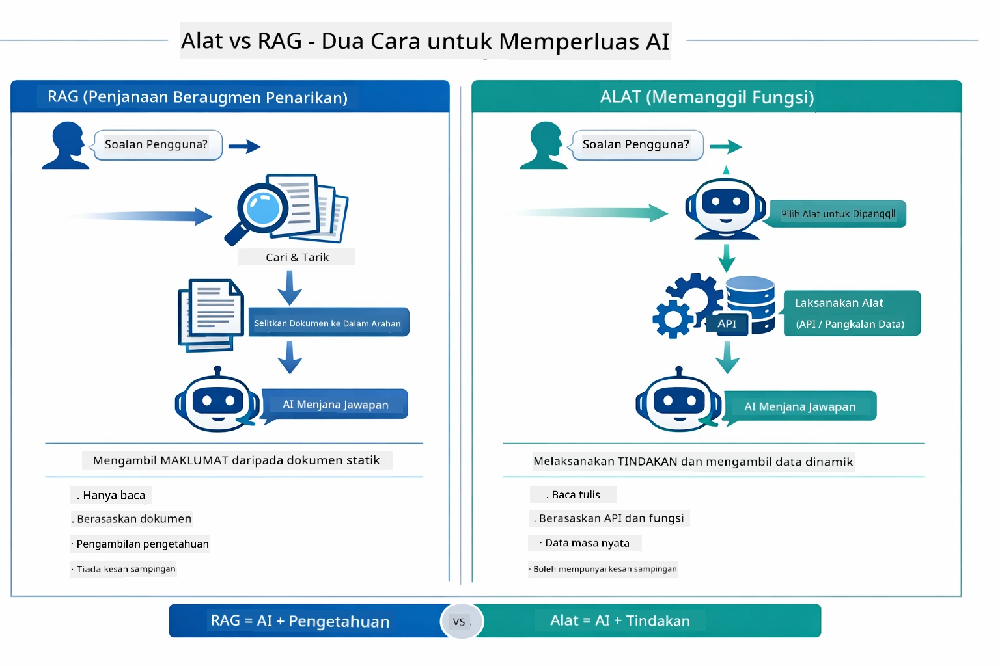

*RAG mengambil maklumat dari dokumen statik — Alat melaksanakan tindakan dan mendapatkan data dinamik masa nyata. Banyak sistem produksi menggabungkan kedua-duanya.*

Dalam praktik, banyak sistem produksi menggabungkan kedua-dua pendekatan: RAG untuk menyandarkan jawapan dalam dokumentasi anda, dan Alat untuk mendapatkan data langsung atau melakukan operasi.

## Langkah Seterusnya

**Modul Seterusnya:** [05-mcp - Protokol Konteks Model (MCP)](../05-mcp/README.md)

---

**Navigasi:** [← Sebelumnya: Modul 03 - RAG](../03-rag/README.md) | [Kembali ke Utama](../README.md) | [Seterusnya: Modul 05 - MCP →](../05-mcp/README.md)

---

<!-- CO-OP TRANSLATOR DISCLAIMER START -->
**Penafian**:
Dokumen ini telah diterjemahkan menggunakan perkhidmatan terjemahan AI [Co-op Translator](https://github.com/Azure/co-op-translator). Walaupun kami berusaha untuk ketepatan, sila ambil perhatian bahawa terjemahan automatik mungkin mengandungi kesilapan atau ketidaktepatan. Dokumen asal dalam bahasa asalnya harus dianggap sebagai sumber yang sahih. Untuk maklumat penting, terjemahan profesional oleh manusia adalah disarankan. Kami tidak bertanggungjawab atas sebarang salah faham atau salah tafsir yang timbul daripada penggunaan terjemahan ini.
<!-- CO-OP TRANSLATOR DISCLAIMER END -->