# Modul 05: Protokol Konteks Model (MCP)

## Jadual Kandungan

- [Penerangan Video](../../../05-mcp)
- [Apa Yang Anda Akan Pelajari](../../../05-mcp)
- [Apakah MCP?](../../../05-mcp)
- [Bagaimana MCP Berfungsi](../../../05-mcp)
- [Modul Agentik](../../../05-mcp)
- [Menjalankan Contoh](../../../05-mcp)
  - [Prasyarat](../../../05-mcp)
- [Mula Dengan Cepat](../../../05-mcp)
  - [Operasi Fail (Stdio)](../../../05-mcp)
  - [Ejen Penyelia](../../../05-mcp)
    - [Menjalankan Demo](../../../05-mcp)
    - [Bagaimana Penyelia Berfungsi](../../../05-mcp)
    - [Bagaimana FileAgent Menemui Alat MCP Semasa Runtime](../../../05-mcp)
    - [Strategi Tindak Balas](../../../05-mcp)
    - [Memahami Output](../../../05-mcp)
    - [Penjelasan Ciri Modul Agentik](../../../05-mcp)
- [Konsep Utama](../../../05-mcp)
- [Tahniah!](../../../05-mcp)
  - [Apa Seterusnya?](../../../05-mcp)

## Penerangan Video

Tonton sesi langsung ini yang menerangkan cara memulakan dengan modul ini:

<a href="https://www.youtube.com/watch?v=O_J30kZc0rw"></a>

## Apa Yang Anda Akan Pelajari

Anda telah membina AI perbualan, menguasai arahan, mengikat tindak balas pada dokumen, dan mencipta ejen dengan alat. Tetapi semua alat itu dibina khusus untuk aplikasi anda. Bagaimana jika anda boleh memberi AI anda akses kepada ekosistem alat standard yang boleh dibuat dan dikongsi oleh sesiapa sahaja? Dalam modul ini, anda akan belajar cara melakukan itu dengan Protokol Konteks Model (MCP) dan modul agentik LangChain4j. Kami mula dengan menunjukkan pembaca fail MCP yang mudah dan kemudian tunjuk bagaimana ia mudah disepadukan ke dalam aliran kerja agentik lanjutan menggunakan pola Ejen Penyelia.

## Apakah MCP?

Protokol Konteks Model (MCP) menyediakan tepat itu - cara standard untuk aplikasi AI menemui dan menggunakan alat luaran. Daripada menulis integrasi khusus untuk setiap sumber data atau perkhidmatan, anda menyambung ke pelayan MCP yang mendedahkan kebolehan mereka dalam format yang konsisten. Ejen AI anda kemudian boleh menemui dan menggunakan alat ini secara automatik.

Rajah di bawah menunjukkan perbezaannya — tanpa MCP, setiap integrasi memerlukan sambungan titik-ke-titik khusus; dengan MCP, satu protokol menyambungkan aplikasi anda ke mana-mana alat:


*Sebelum MCP: Integrasi titik-ke-titik yang kompleks. Selepas MCP: Satu protokol, kemungkinan tanpa had.*

MCP menyelesaikan masalah asas dalam pembangunan AI: setiap integrasi adalah khusus. Mahu akses GitHub? Kod khusus. Mahu baca fail? Kod khusus. Mahu buat pertanyaan pangkalan data? Kod khusus. Dan tiada satu pun integrasi ini berfungsi dengan aplikasi AI lain.

MCP menstandardkan ini. Pelayan MCP mendedahkan alat dengan keterangan dan skema parameter yang jelas. Mana-mana klien MCP boleh menyambung, menemui alat yang tersedia, dan menggunakannya. Bina sekali, guna di mana-mana.

Rajah di bawah menggambarkan seni bina ini — satu klien MCP (aplikasi AI anda) menyambung ke berbilang pelayan MCP, setiap satu mendedahkan set alatnya melalui protokol standard:


*Seni Bina Protokol Konteks Model - penemuan dan pelaksanaan alat yang distandardkan*

## Bagaimana MCP Berfungsi

Di sebalik tabir, MCP menggunakan seni bina berlapis. Aplikasi Java anda (klien MCP) menemui alat yang tersedia, menghantar permintaan JSON-RPC melalui lapisan pengangkutan (Stdio atau HTTP), dan pelayan MCP melaksanakan operasi dan mengembalikan keputusan. Rajah berikut menguraikan setiap lapisan protokol ini:

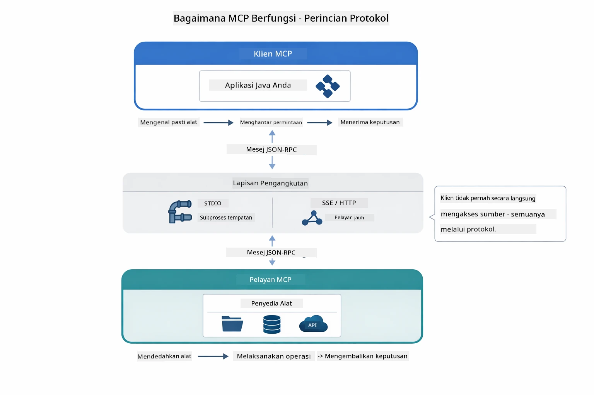

*Bagaimana MCP berfungsi di sebalik tabir — klien menemui alat, bertukar mesej JSON-RPC, dan melaksanakan operasi melalui lapisan pengangkutan.*

**Seni Bina Pelayan-Klien**

MCP menggunakan model pelayan-klien. Pelayan menyediakan alat - membaca fail, bertanya pangkalan data, memanggil API. Klien (aplikasi AI anda) menyambung ke pelayan dan menggunakan alat mereka.

Untuk menggunakan MCP dengan LangChain4j, tambahkan pergantungan Maven ini:

```xml
<dependency>
    <groupId>dev.langchain4j</groupId>
    <artifactId>langchain4j-mcp</artifactId>
    <version>${langchain4j.version}</version>
</dependency>
```

**Penemuan Alat**

Apabila klien anda menyambung ke pelayan MCP, ia bertanya "Apakah alat yang anda ada?" Pelayan membalas dengan senarai alat tersedia, setiap satu dengan keterangan dan skema parameter. Ejen AI anda kemudian boleh memutuskan alat mana untuk digunakan berdasarkan permintaan pengguna. Rajah di bawah menunjukkan jabat tangan ini — klien menghantar permintaan `tools/list` dan pelayan memulangkan alat tersedia dengan keterangan dan skema parameter:

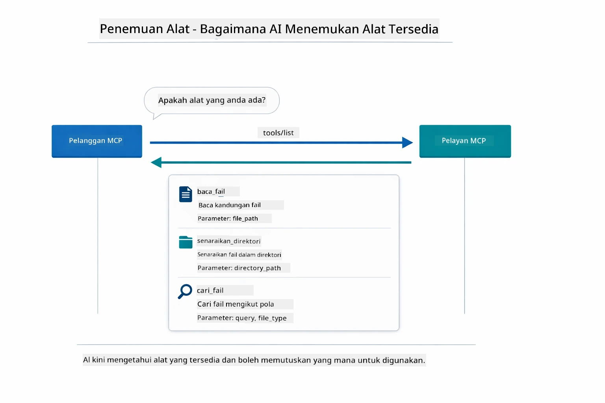

*AI menemui alat yang tersedia semasa permulaan — kini ia tahu kebolehan yang ada dan boleh memutuskan yang mana hendak digunakan.*

**Mekanisme Pengangkutan**

MCP menyokong pelbagai mekanisme pengangkutan. Dua pilihan ialah Stdio (untuk komunikasi subprocess tempatan) dan Streamable HTTP (untuk pelayan jauh). Modul ini menunjukkan pengangkutan Stdio:


*Mekanisme pengangkutan MCP: HTTP untuk pelayan jauh, Stdio untuk proses tempatan*

**Stdio** - [StdioTransportDemo.java](../../../05-mcp/src/main/java/com/example/langchain4j/mcp/StdioTransportDemo.java)

Untuk proses tempatan. Aplikasi anda memulakan pelayan sebagai subprocess dan berkomunikasi melalui input/output standard. Berguna untuk akses sistem fail atau alat baris perintah.

```java
McpTransport stdioTransport = new StdioMcpTransport.Builder()
    .command(List.of(
        npmCmd, "exec",
        "@modelcontextprotocol/server-filesystem@2025.12.18",
        resourcesDir
    ))
    .logEvents(false)
    .build();
```

Pelayan `@modelcontextprotocol/server-filesystem` mendedahkan alat berikut, semua disandarkan ke direktori yang anda tentukan:

| Alat | Penerangan |
|------|-------------|
| `read_file` | Baca kandungan satu fail |
| `read_multiple_files` | Baca beberapa fail dalam satu panggilan |
| `write_file` | Cipta atau timpa fail |
| `edit_file` | Buat pengeditan cari dan ganti yang disasarkan |
| `list_directory` | Senaraikan fail dan direktori di jalur tertentu |
| `search_files` | Cari fail secara rekursif yang sepadan dengan pola |
| `get_file_info` | Dapatkan metadata fail (saiz, cap masa, kebenaran) |
| `create_directory` | Cipta direktori (termasuk direktori induk) |
| `move_file` | Pindah atau nama semula fail atau direktori |

Rajah berikut menunjukkan bagaimana pengangkutan Stdio berfungsi semasa runtime — aplikasi Java anda memulakan pelayan MCP sebagai proses anak dan mereka berkomunikasi melalui paip stdin/stdout, tanpa rangkaian atau HTTP terlibat:

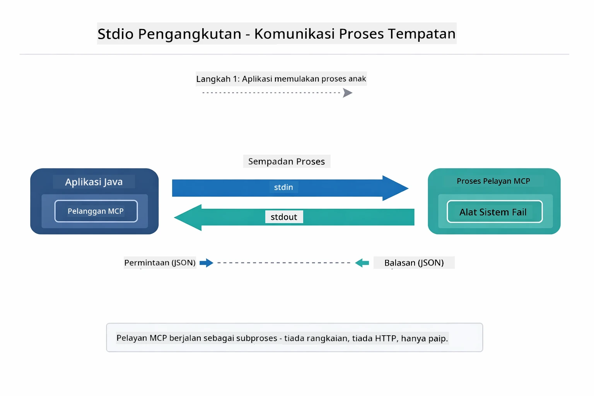

*Pengangkutan Stdio dalam tindakan — aplikasi anda memulakan pelayan MCP sebagai proses anak dan berkomunikasi melalui paip stdin/stdout.*

> **🤖 Cuba dengan [GitHub Copilot](https://github.com/features/copilot) Chat:** Buka [`StdioTransportDemo.java`](../../../05-mcp/src/main/java/com/example/langchain4j/mcp/StdioTransportDemo.java) dan tanya:
> - "Bagaimana pengangkutan Stdio berfungsi dan bila saya harus menggunakannya berbanding HTTP?"
> - "Bagaimana LangChain4j menguruskan kitar hayat proses pelayan MCP yang dimulakan?"
> - "Apakah implikasi keselamatan memberi AI akses ke sistem fail?"

## Modul Agentik

Walaupun MCP menyediakan alat standard, modul **agentik** LangChain4j menyediakan cara deklaratif untuk membina ejen yang mengatur alat itu. Anotasi `@Agent` dan `AgenticServices` membolehkan anda menentukan tingkah laku ejen melalui antara muka dan bukannya kod imperatif.

Dalam modul ini, anda akan meneroka pola **Ejen Penyelia** — pendekatan AI agentik lanjutan di mana ejen "penyelia" membuat keputusan dinamik ejen anak mana yang dipanggil berdasarkan permintaan pengguna. Kami menggabungkan kedua-dua konsep dengan memberi salah satu ejen anak kami keupayaan akses fail berkekuatan MCP.

Untuk menggunakan modul agentik, tambahkan pergantungan Maven ini:

```xml
<dependency>
    <groupId>dev.langchain4j</groupId>
    <artifactId>langchain4j-agentic</artifactId>
    <version>${langchain4j.mcp.version}</version>
</dependency>
```
> **Nota:** Modul `langchain4j-agentic` menggunakan sifat versi berasingan (`langchain4j.mcp.version`) kerana ia dilepaskan pada jadual berbeza daripada perpustakaan teras LangChain4j.

> **⚠️ Eksperimen:** Modul `langchain4j-agentic` adalah **eksperimen** dan mungkin berubah. Cara stabil untuk membina pembantu AI kekal `langchain4j-core` dengan alat tersuai (Modul 04).

## Menjalankan Contoh

### Prasyarat

- Selesai [Modul 04 - Alat](../04-tools/README.md) (modul ini membina konsep alat tersuai dan membandingkannya dengan alat MCP)
- Fail `.env` dalam direktori root dengan kelayakan Azure (dibuat oleh `azd up` dalam Modul 01)
- Java 21+, Maven 3.9+
- Node.js 16+ dan npm (untuk pelayan MCP)

> **Nota:** Jika anda belum menetapkan pemboleh ubah persekitaran anda, lihat [Modul 01 - Pengenalan](../01-introduction/README.md) untuk arahan penyebaran (`azd up` mencipta fail `.env` secara automatik), atau salin `.env.example` ke `.env` di direktori root dan isikan nilai anda.

## Mula Dengan Cepat

**Menggunakan VS Code:** Klik kanan pada mana-mana fail demo dalam Penjelajah dan pilih **"Run Java"**, atau gunakan konfigurasi pelancaran dari panel Run and Debug (pastikan fail `.env` anda telah dikonfigurasi dengan kelayakan Azure terlebih dahulu).

**Menggunakan Maven:** Sebagai alternatif, anda boleh jalankan dari baris perintah dengan contoh di bawah.

### Operasi Fail (Stdio)

Ini menunjukkan alat berasaskan subprocess tempatan.

**✅ Tiada prasyarat diperlukan** - pelayan MCP dihidupkan automatik.

**Menggunakan Skrip Mula (Disyorkan):**

Skrip mula memuatkan pemboleh ubah persekitaran dari fail `.env` root secara automatik:

**Bash:**
```bash
cd 05-mcp
chmod +x start-stdio.sh
./start-stdio.sh
```

**PowerShell:**
```powershell
cd 05-mcp
.\start-stdio.ps1
```

**Menggunakan VS Code:** Klik kanan `StdioTransportDemo.java` dan pilih **"Run Java"** (pastikan fail `.env` anda telah dikonfigurasi).

Aplikasi memulakan pelayan MCP sistem fail secara automatik dan membaca fail tempatan. Perhatikan bagaimana pengurusan subprocess dikendalikan untuk anda.

**Output dijangka:**
```
Assistant response: The file provides an overview of LangChain4j, an open-source Java library
for integrating Large Language Models (LLMs) into Java applications...
```

### Ejen Penyelia

**Pola Ejen Penyelia** adalah bentuk AI agentik yang **fleksibel**. Penyelia menggunakan LLM untuk membuat keputusan secara autonomi ejen mana yang akan dipanggil berdasarkan permintaan pengguna. Dalam contoh seterusnya, kami gabungkan akses fail berkekuatan MCP dengan ejen LLM untuk mencipta aliran kerja baca fail → laporan yang diawasi.

Dalam demo, `FileAgent` membaca fail menggunakan alat sistem fail MCP, dan `ReportAgent` menjana laporan berstruktur dengan ringkasan eksekutif (1 ayat), 3 perkara utama, dan cadangan. Penyelia mengatur aliran ini secara automatik:

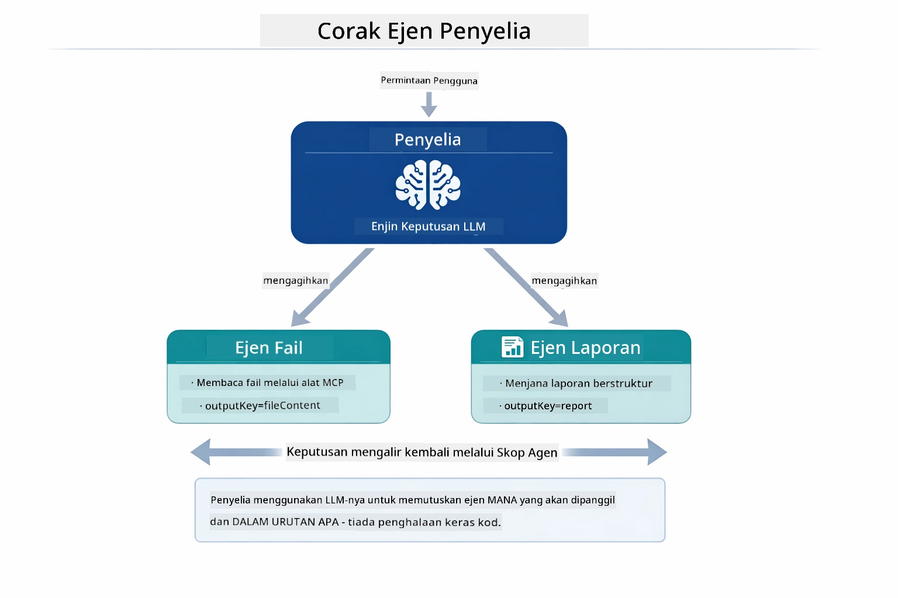

*Penyelia menggunakan LLM untuk memutuskan ejen mana yang dipanggil dan dalam urutan apa — tiada penghalaan keras kod diperlukan.*

Berikut ialah bagaimana aliran kerja konkrit untuk saluran fail ke laporan kami:

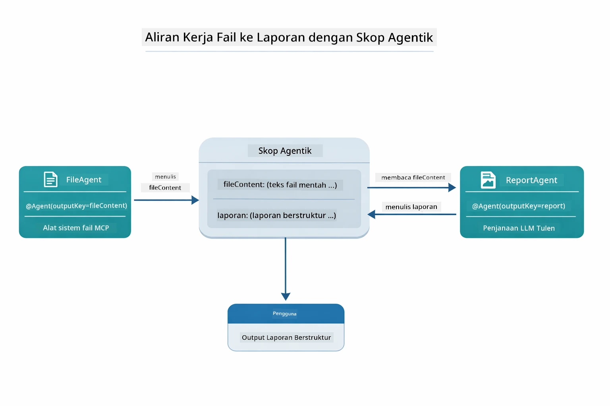

*FileAgent membaca fail melalui alat MCP, kemudian ReportAgent menukar kandungan mentah menjadi laporan berstruktur.*

Rajah urutan berikut mengesan keseluruhan pengaturan Penyelia — daripada pelancaran pelayan MCP, melalui pemilihan ejen autonomi Penyelia, hingga panggilan alat melalui stdio dan laporan akhir:

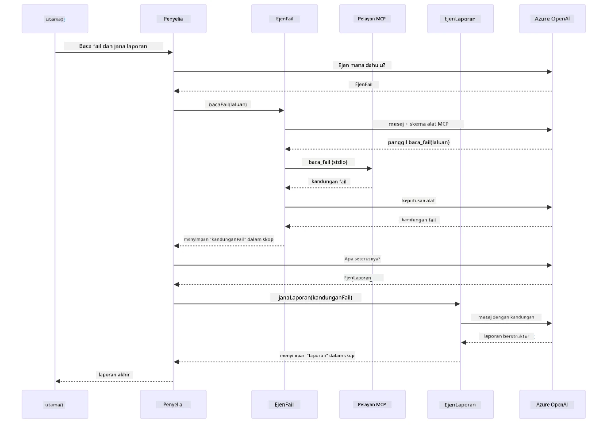

*Penyelia secara autonomi memanggil FileAgent (yang memanggil pelayan MCP melalui stdio untuk baca fail), kemudian memanggil ReportAgent untuk menjana laporan berstruktur — setiap ejen menyimpan outputnya dalam Skop Agentik bersama.*

Setiap ejen menyimpan outputnya dalam **Skop Agentik** (memori dikongsi), membolehkan ejen hiliran mengakses keputusan sebelumnya. Ini menunjukkan bagaimana alat MCP disepadukan dengan lancar ke dalam aliran kerja agentik — Penyelia tidak perlu tahu *bagaimana* fail dibaca, hanya bahawa `FileAgent` boleh melakukannya.

#### Menjalankan Demo

Skrip mula memuatkan pemboleh ubah persekitaran dari fail `.env` root secara automatik:

**Bash:**
```bash
cd 05-mcp
chmod +x start-supervisor.sh
./start-supervisor.sh
```

**PowerShell:**
```powershell
cd 05-mcp
.\start-supervisor.ps1
```

**Menggunakan VS Code:** Klik kanan `SupervisorAgentDemo.java` dan pilih **"Run Java"** (pastikan fail `.env` anda telah dikonfigurasi).

#### Bagaimana Penyelia Berfungsi

Sebelum membina ejen, anda perlu menyambungkan pengangkutan MCP ke klien dan membungkusnya sebagai `ToolProvider`. Ini cara alat pelayan MCP menjadi tersedia untuk ejen anda:

```java
// Cipta klien MCP dari pengangkutan
McpClient mcpClient = new DefaultMcpClient.Builder()
        .transport(stdioTransport)
        .build();

// Balut klien sebagai ToolProvider — ini menghubungkan alat MCP ke dalam LangChain4j
ToolProvider mcpToolProvider = McpToolProvider.builder()
        .mcpClients(List.of(mcpClient))
        .build();
```

Kini anda boleh suntik `mcpToolProvider` ke mana-mana ejen yang memerlukan alat MCP:

```java
// Langkah 1: FileAgent membaca fail menggunakan alat MCP
FileAgent fileAgent = AgenticServices.agentBuilder(FileAgent.class)
        .chatModel(model)
        .toolProvider(mcpToolProvider)  // Mempunyai alat MCP untuk operasi fail
        .build();

// Langkah 2: ReportAgent menghasilkan laporan berstruktur
ReportAgent reportAgent = AgenticServices.agentBuilder(ReportAgent.class)
        .chatModel(model)
        .build();

// Penyelia mengatur aliran kerja fail → laporan
SupervisorAgent supervisor = AgenticServices.supervisorBuilder()
        .chatModel(model)
        .subAgents(fileAgent, reportAgent)
        .responseStrategy(SupervisorResponseStrategy.LAST)  // Pulangkan laporan akhir
        .build();

// Penyelia memutuskan ejen mana yang akan dipanggil berdasarkan permintaan
String response = supervisor.invoke("Read the file at /path/file.txt and generate a report");
```

#### Bagaimana FileAgent Menemui Alat MCP Semasa Runtime

Anda mungkin tertanya-tanya: **bagaimana `FileAgent` tahu cara menggunakan alat sistem fail npm?** Jawapannya ia tidak tahu — **LLM** yang mengetahuinya semasa runtime melalui skema alat.
Antara muka `FileAgent` hanyalah **definisi prompt**. Ia tidak mempunyai pengetahuan tersimpan tentang `read_file`, `list_directory`, atau mana-mana alat MCP lain. Berikut adalah apa yang berlaku dari awal hingga akhir:

1. **Pelayan dimulakan:** `StdioMcpTransport` melancarkan pakej npm `@modelcontextprotocol/server-filesystem` sebagai proses anak
2. **Penemuan alat:** `McpClient` menghantar permintaan JSON-RPC `tools/list` ke pelayan, yang membalas dengan nama alat, penerangan, dan skema parameter (contoh, `read_file` — *"Baca kandungan lengkap fail"* — `{ path: string }`)
3. **Suntikan skema:** `McpToolProvider` membalut skema yang ditemui dan menjadikannya tersedia untuk LangChain4j
4. **Keputusan LLM:** Apabila `FileAgent.readFile(path)` dipanggil, LangChain4j menghantar mesej sistem, mesej pengguna, **dan senarai skema alat** kepada LLM. LLM membaca penerangan alat dan menghasilkan panggilan alat (contoh, `read_file(path="/some/file.txt")`)
5. **Pelaksanaan:** LangChain4j memintas panggilan alat, menghalakannya melalui klien MCP kembali ke subprocess Node.js, mendapatkan hasilnya, dan memberi maklum balas itu kembali kepada LLM

Ini adalah mekanisme yang sama dengan [Penemuan Alat](../../../05-mcp) yang diterangkan di atas, tetapi diterapkan khusus pada aliran kerja agen. Anotasi `@SystemMessage` dan `@UserMessage` membimbing kelakuan LLM, manakala `ToolProvider` yang disuntik memberikannya **keupayaan** — LLM menghubungkan kedua-duanya pada masa jalan.

> **🤖 Cuba dengan [GitHub Copilot](https://github.com/features/copilot) Chat:** Buka [`FileAgent.java`](../../../05-mcp/src/main/java/com/example/langchain4j/mcp/agents/FileAgent.java) dan tanya:
> - "Bagaimana agen ini mengetahui alat MCP mana yang harus dipanggil?"
> - "Apa yang akan berlaku jika saya mengeluarkan ToolProvider dari pembina agen?"
> - "Bagaimana skema alat disalurkan ke LLM?"

#### Strategi Respons

Apabila anda mengkonfigurasi `SupervisorAgent`, anda menentukan bagaimana ia harus membentuk jawapan akhir kepada pengguna selepas sub-agen menyelesaikan tugas mereka. Rajah di bawah menunjukkan tiga strategi yang tersedia — LAST mengembalikan output agen terakhir secara langsung, SUMMARY mensintesis semua output melalui LLM, dan SCORED memilih mana-mana yang mendapat skor lebih tinggi berbanding permintaan asal:

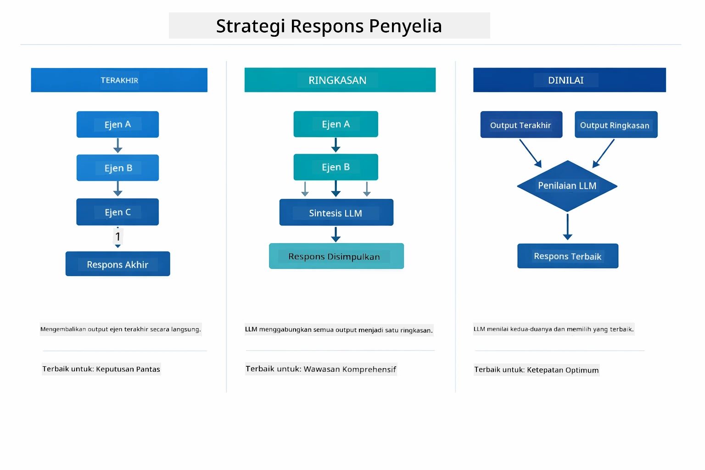

*Tiga strategi bagaimana Supervisor membentuk respons akhirnya — pilih berdasarkan sama ada anda mahu output agen terakhir, ringkasan sintesis, atau pilihan dengan markah terbaik.*

Strategi yang tersedia ialah:

| Strategi  | Penerangan |
|-----------|------------|
| **LAST**  | Supervisor mengembalikan output dari sub-agen atau alat terakhir yang dipanggil. Ini berguna apabila agen terakhir dalam aliran kerja direka khusus untuk menghasilkan jawapan lengkap dan akhir (contoh, "Summary Agent" dalam saluran penyelidikan). |
| **SUMMARY** | Supervisor menggunakan Model Bahasa (LLM) dalaman sendiri untuk mensintesis ringkasan dari seluruh interaksi dan semua output sub-agen, kemudian mengembalikan ringkasan itu sebagai respons akhir. Ini menyediakan jawapan yang bersih dan tersusun kepada pengguna. |
| **SCORED** | Sistem menggunakan LLM dalaman untuk memberi skor kedua-dua respons LAST dan SUMMARY interaksi berbanding permintaan pengguna asal, mengembalikan output yang mendapat skor lebih tinggi. |

Lihat [SupervisorAgentDemo.java](../../../05-mcp/src/main/java/com/example/langchain4j/mcp/SupervisorAgentDemo.java) untuk pelaksanaan lengkap.

> **🤖 Cuba dengan [GitHub Copilot](https://github.com/features/copilot) Chat:** Buka [`SupervisorAgentDemo.java`](../../../05-mcp/src/main/java/com/example/langchain4j/mcp/SupervisorAgentDemo.java) dan tanya:
> - "Bagaimana Supervisor memutuskan agen mana yang hendak dipanggil?"
> - "Apa bezanya corak kerja Supervisor dan Sequential?"
> - "Bagaimana saya boleh sesuaikan tingkah laku perancangan Supervisor?"

#### Memahami Output

Apabila anda menjalankan demo ini, anda akan melihat penerangan berstruktur tentang bagaimana Supervisor mengatur beberapa agen. Berikut maksud setiap bahagian:

```
======================================================================
  FILE → REPORT WORKFLOW DEMO
======================================================================

This demo shows a clear 2-step workflow: read a file, then generate a report.
The Supervisor orchestrates the agents automatically based on the request.
```
  
**Tajuk utama** memperkenalkan konsep aliran kerja: satu saluran fokus dari pembacaan fail ke penjanaan laporan.

```
--- WORKFLOW ---------------------------------------------------------
  ┌─────────────┐      ┌──────────────┐
  │  FileAgent  │ ───▶ │ ReportAgent  │
  │ (MCP tools) │      │  (pure LLM)  │
  └─────────────┘      └──────────────┘
   outputKey:           outputKey:
   'fileContent'        'report'

--- AVAILABLE AGENTS -------------------------------------------------
  [FILE]   FileAgent   - Reads files via MCP → stores in 'fileContent'
  [REPORT] ReportAgent - Generates structured report → stores in 'report'
```
  
**Rajah Aliran Kerja** menunjukkan aliran data antara agen. Setiap agen mempunyai peranan khusus:  
- **FileAgent** membaca fail menggunakan alat MCP dan menyimpan kandungan mentah ke dalam `fileContent`  
- **ReportAgent** menggunakan kandungan itu dan menghasilkan laporan tersusun dalam `report`

```
--- USER REQUEST -----------------------------------------------------
  "Read the file at .../file.txt and generate a report on its contents"
```
  
**Permintaan Pengguna** menunjukkan tugasan. Supervisor menganalisis ini dan memutuskan untuk memanggil FileAgent → ReportAgent.

```
--- SUPERVISOR ORCHESTRATION -----------------------------------------
  The Supervisor decides which agents to invoke and passes data between them...

  +-- STEP 1: Supervisor chose -> FileAgent (reading file via MCP)
  |
  |   Input: .../file.txt
  |
  |   Result: LangChain4j is an open-source, provider-agnostic Java framework for building LLM...
  +-- [OK] FileAgent (reading file via MCP) completed

  +-- STEP 2: Supervisor chose -> ReportAgent (generating structured report)
  |
  |   Input: LangChain4j is an open-source, provider-agnostic Java framew...
  |
  |   Result: Executive Summary...
  +-- [OK] ReportAgent (generating structured report) completed
```
  
**Pengurusan Supervisor** menunjukkan aliran 2 langkah dalam tindakan:  
1. **FileAgent** membaca fail melalui MCP dan menyimpan kandungan  
2. **ReportAgent** menerima kandungan dan menghasilkan laporan tersusun

Supervisor membuat keputusan ini **secara autonomi** berdasarkan permintaan pengguna.

```
--- FINAL RESPONSE ---------------------------------------------------
Executive Summary
...

Key Points
...

Recommendations
...

--- AGENTIC SCOPE (Data Flow) ----------------------------------------
  Each agent stores its output for downstream agents to consume:
  * fileContent: LangChain4j is an open-source, provider-agnostic Java framework...
  * report: Executive Summary...
```
  
#### Penjelasan Ciri Modul Agentic

Contoh ini mempamerkan beberapa ciri maju modul agentic. Mari lihat lebih dekat Agentic Scope dan Agent Listeners.

**Agentic Scope** menunjukkan memori kongsi di mana agen menyimpan hasil mereka dengan menggunakan `@Agent(outputKey="...")`. Ini membolehkan:  
- Agen yang seterusnya mengakses output agen terdahulu  
- Supervisor mensintesis respons akhir  
- Anda memeriksa apa yang dihasilkan setiap agen

Rajah di bawah menunjukkan bagaimana Agentic Scope berfungsi sebagai memori kongsi dalam aliran kerja dari fail ke laporan — FileAgent menulis outputnya di bawah kunci `fileContent`, ReportAgent membacanya dan menulis output sendiri di bawah `report`:

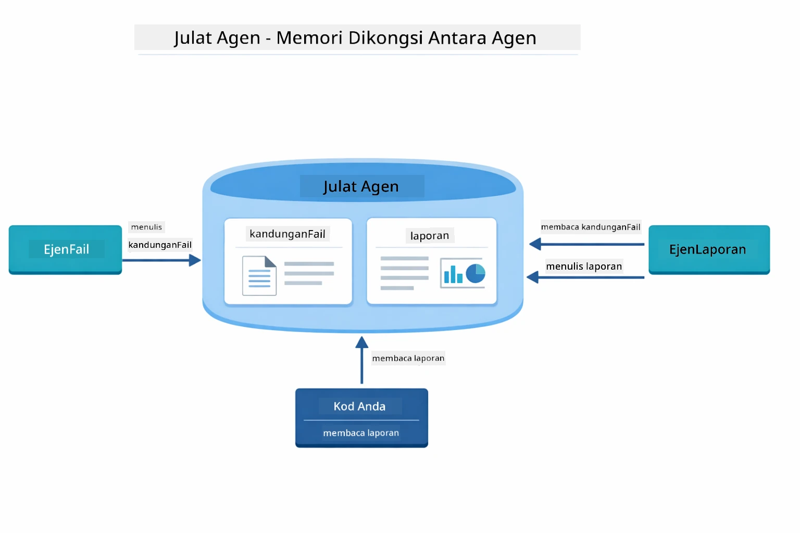

*Agentic Scope bertindak sebagai memori kongsi — FileAgent menulis `fileContent`, ReportAgent membacanya dan menulis `report`, dan kod anda membaca hasil akhir.*

```java
ResultWithAgenticScope<String> result = supervisor.invokeWithAgenticScope(request);
AgenticScope scope = result.agenticScope();
String fileContent = scope.readState("fileContent");  // Data fail mentah dari FileAgent
String report = scope.readState("report");            // Laporan berstruktur dari ReportAgent
```
  
**Agent Listeners** membolehkan pemantauan dan debugging pelaksanaan agen. Output langkah demi langkah yang anda lihat dalam demo datang dari AgentListener yang mengait pada setiap panggilan agen:  
- **beforeAgentInvocation** - Dipanggil apabila Supervisor memilih agen, membolehkan anda lihat agen yang dipilih dan sebabnya  
- **afterAgentInvocation** - Dipanggil apabila agen selesai, menunjukkan hasilnya  
- **inheritedBySubagents** - Jika benar, pendengar memantau semua agen dalam hierarki

Rajah berikut menunjukkan kitar hayat penuh Agent Listener, termasuk bagaimana `onError` mengendalikan kegagalan semasa pelaksanaan agen:

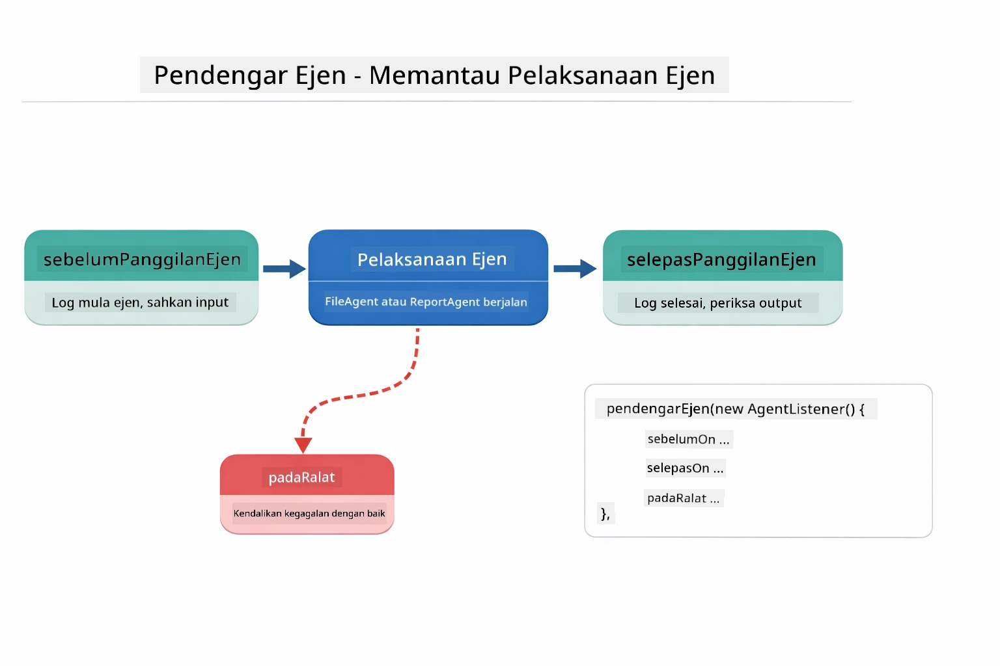

*Agent Listeners mengait ke kitar hayat pelaksanaan — memantau apabila agen bermula, selesai, atau menemui ralat.*

```java
AgentListener monitor = new AgentListener() {
    private int step = 0;
    
    @Override
    public void beforeAgentInvocation(AgentRequest request) {
        step++;
        System.out.println("  +-- STEP " + step + ": " + request.agentName());
    }
    
    @Override
    public void afterAgentInvocation(AgentResponse response) {
        System.out.println("  +-- [OK] " + response.agentName() + " completed");
    }
    
    @Override
    public boolean inheritedBySubagents() {
        return true; // Sebarkan kepada semua ejen bawahan
    }
};
```
  
Selain corak Supervisor, modul `langchain4j-agentic` menyediakan beberapa corak aliran kerja yang kuat. Rajah di bawah menunjukkan semua lima — dari saluran berurutan mudah ke aliran kerja kelulusan manusia-dalam-lingkaran:

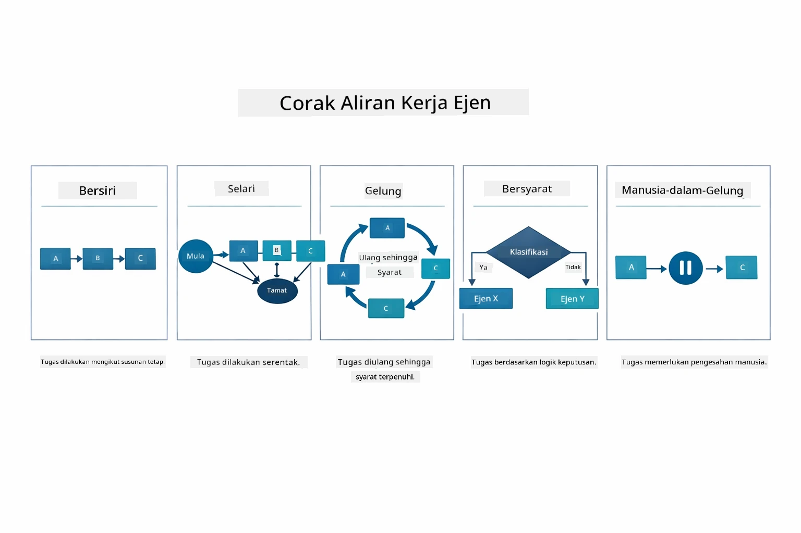

*Lima corak aliran kerja untuk mengatur agen — dari saluran berurutan mudah ke aliran kerja kelulusan manusia-dalam-lingkaran.*

| Corak | Penerangan | Kes Penggunaan |
|-------|------------|----------------|
| **Sequential** | Melaksanakan agen mengikut turutan, output mengalir ke seterusnya | Saluran: penyelidikan → analisis → laporan |
| **Parallel** | Jalankan agen serentak | Tugasan bebas: cuaca + berita + saham |
| **Loop** | Ulang sehingga syarat dipenuhi | Skor kualiti: perhalusi sehingga skor ≥ 0.8 |
| **Conditional** | Hala berdasarkan syarat | Klasifikasi → hantar ke agen pakar |
| **Human-in-the-Loop** | Tambah pemeriksaan manusia | Aliran kerja kelulusan, semakan kandungan |

## Konsep Utama

Sekarang anda telah meneroka MCP dan modul agentic secara praktikal, mari kita ringkaskan bila menggunakan setiap pendekatan.

Salah satu kelebihan besar MCP ialah ekosistemnya yang semakin berkembang. Rajah di bawah menunjukkan bagaimana satu protokol universal menghubungkan aplikasi AI anda ke pelbagai pelayan MCP — dari akses sistem fail dan pangkalan data ke GitHub, emel, web scraping, dan banyak lagi:

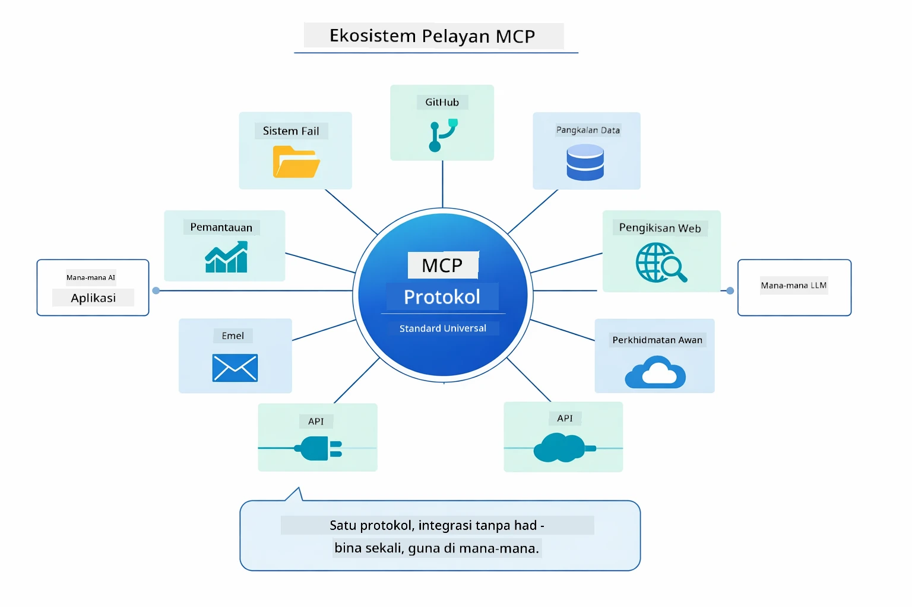

*MCP mencipta ekosistem protokol universal — mana-mana pelayan yang serasi MCP berfungsi dengan mana-mana klien serasi MCP, membolehkan perkongsian alat antara aplikasi.*

**MCP** sesuai apabila anda ingin menggunakan ekosistem alat yang sudah wujud, membina alat yang boleh dikongsi antara beberapa aplikasi, mengintegrasi servis pihak ketiga dengan protokol standard, atau menukar implementasi alat tanpa mengubah kod.

**Modul Agentic** paling sesuai apabila anda mahukan definisi agen deklaratif dengan anotasi `@Agent`, perlu orkestrasi aliran kerja (berurutan, gelung, selari), lebih suka reka bentuk agen berasaskan antara muka berbanding kod imperatif, atau menggabungkan beberapa agen yang berkongsi output melalui `outputKey`.

**Corak Supervisor Agent** menonjol apabila aliran kerja tidak dapat diramalkan terlebih dahulu dan anda mahu LLM membuat keputusan, apabila terdapat beberapa agen khusus yang memerlukan orkestrasi dinamik, apabila membina sistem perbualan yang menghala ke keupayaan berbeza, atau apabila anda mahukan kelakuan agen paling fleksibel dan adaptif.

Untuk membantu anda memilih antara kaedah @Tool khusus dari Modul 04 dan alat MCP dari modul ini, perbandingan berikut menyorot pertukaran utama — alat khusus memberikan sambungan erat dan keselamatan jenis penuh untuk logik khusus aplikasi, manakala alat MCP menawarkan integrasi standard, boleh guna semula:

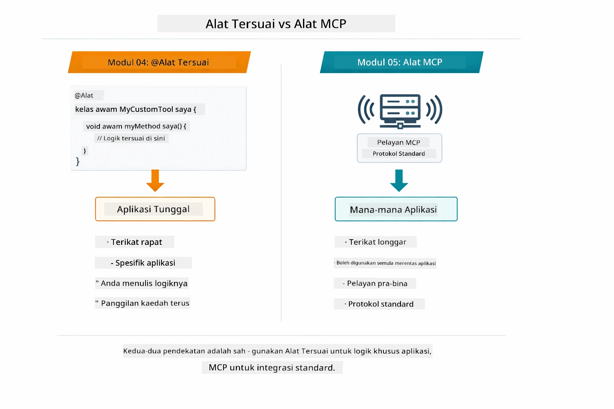

*Bila menggunakan kaedah @Tool khusus berbanding alat MCP — alat khusus untuk logik khusus aplikasi dengan keselamatan jenis penuh, alat MCP untuk integrasi standard yang berfungsi merentas aplikasi.*

## Tahniah!

Anda telah menamatkan kesemua lima modul kursus LangChain4j untuk Pemula! Berikut perjalanan pembelajaran penuh yang telah anda selesaikan — dari sembang asas sehingga sistem agentic dikuasai MCP:

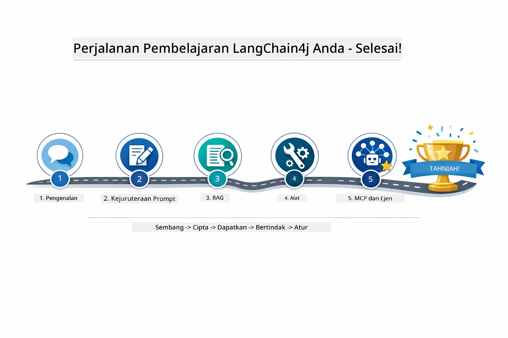

*Perjalanan pembelajaran anda melalui semua lima modul — dari sembang asas ke sistem agentic dikuasai MCP.*

Anda telah menamatkan kursus LangChain4j untuk Pemula. Anda telah belajar:

- Cara membina AI perbualan dengan memori (Modul 01)  
- Corak kejuruteraan prompt untuk tugasan berbeza (Modul 02)  
- Membumikan respons dalam dokumen anda dengan RAG (Modul 03)  
- Mewujudkan agen AI asas (pembantu) dengan alat khusus (Modul 04)  
- Mengintegrasi alat piawai dengan modul LangChain4j MCP dan Agentic (Modul 05)

### Apa Seterusnya?

Selepas menamatkan modul, terokai [Panduan Ujian](../docs/TESTING.md) untuk melihat konsep ujian LangChain4j secara praktikal.

**Sumber Rasmi:**
- [Dokumentasi LangChain4j](https://docs.langchain4j.dev/) - Panduan komprehensif dan rujukan API  
- [LangChain4j GitHub](https://github.com/langchain4j/langchain4j) - Kod sumber dan contoh  
- [Tutorial LangChain4j](https://docs.langchain4j.dev/tutorials/) - Tutorial langkah demi langkah untuk pelbagai kegunaan  

Terima kasih kerana menamatkan kursus ini!

---

**Navigasi:** [← Sebelumnya: Modul 04 - Tools](../04-tools/README.md) | [Kembali ke Utama](../README.md)

---

<!-- CO-OP TRANSLATOR DISCLAIMER START -->
**Penafian**:
Dokumen ini telah diterjemahkan menggunakan perkhidmatan terjemahan AI [Co-op Translator](https://github.com/Azure/co-op-translator). Walaupun kami berusaha untuk ketepatan, harap maklum bahawa terjemahan automatik mungkin mengandungi kesilapan atau ketidaktepatan. Dokumen asal dalam bahasa asalnya harus dianggap sebagai sumber yang sahih. Untuk maklumat penting, terjemahan profesional oleh manusia adalah disyorkan. Kami tidak bertanggungjawab atas sebarang salah faham atau salah tafsir yang timbul daripada penggunaan terjemahan ini.
<!-- CO-OP TRANSLATOR DISCLAIMER END -->