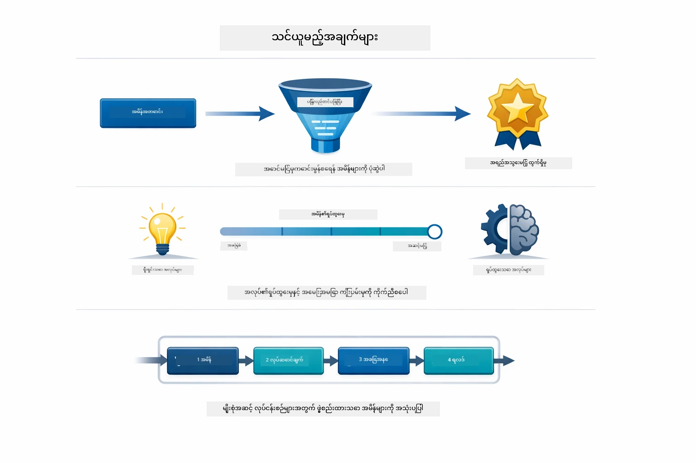
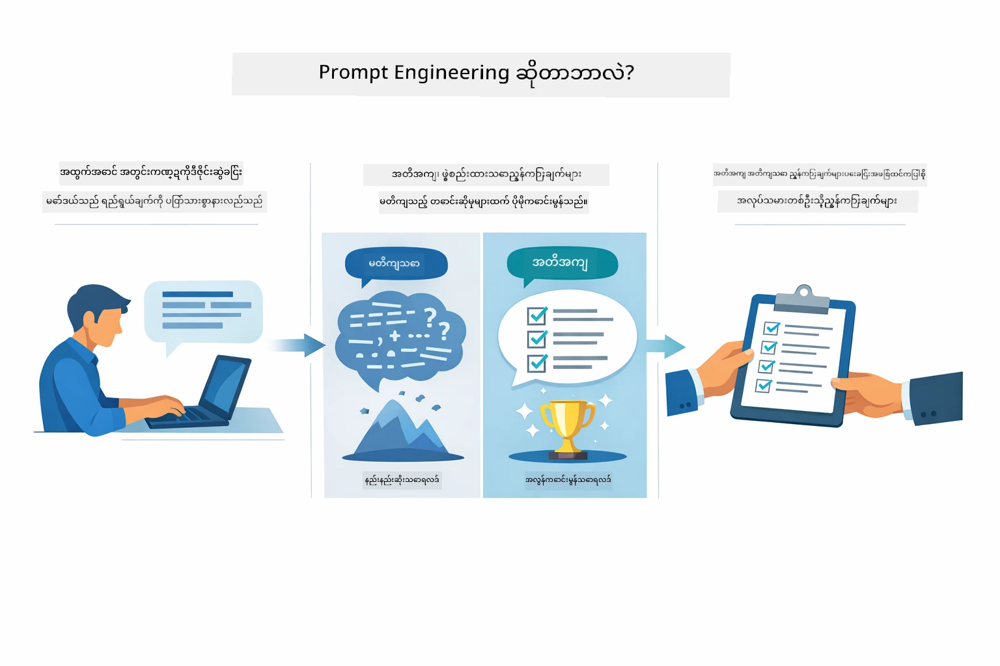
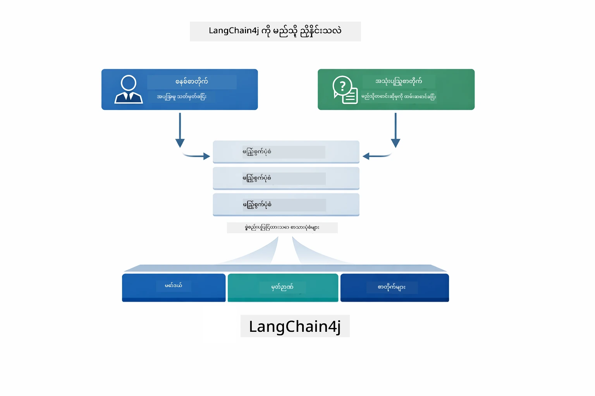
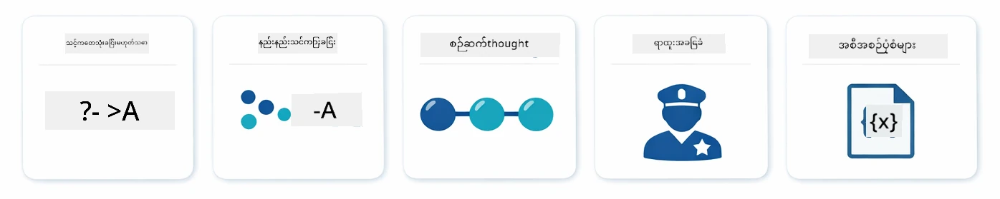
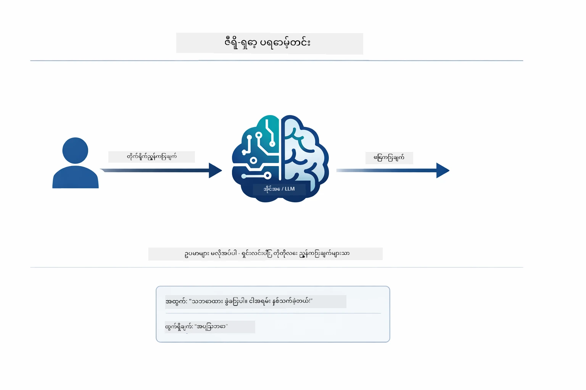
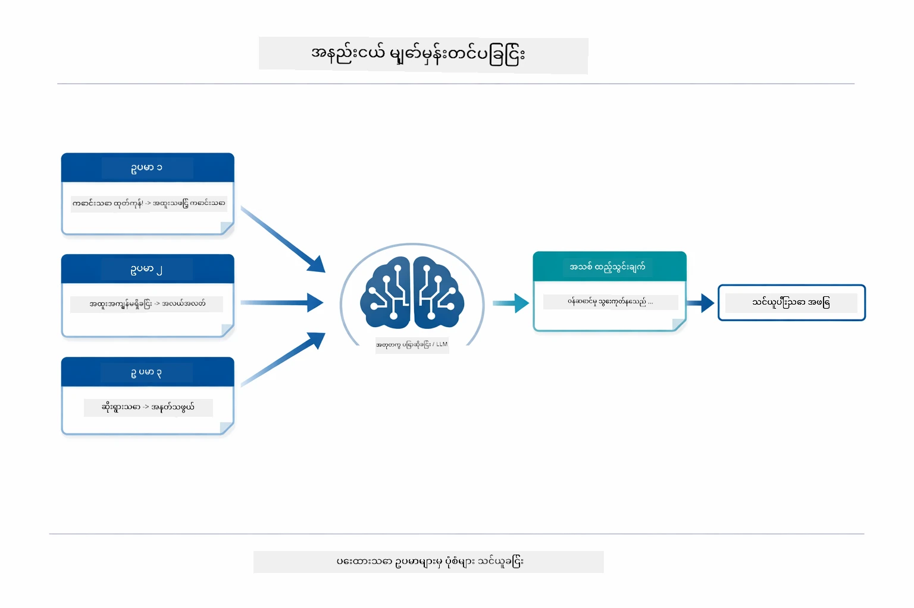
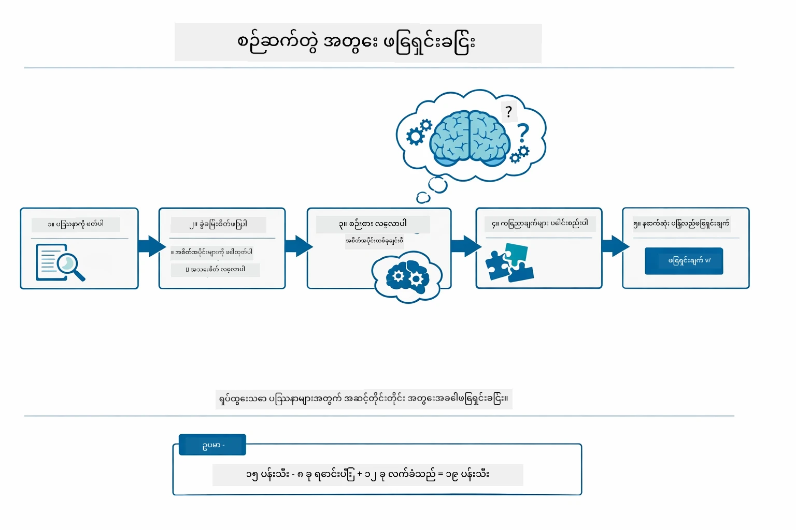
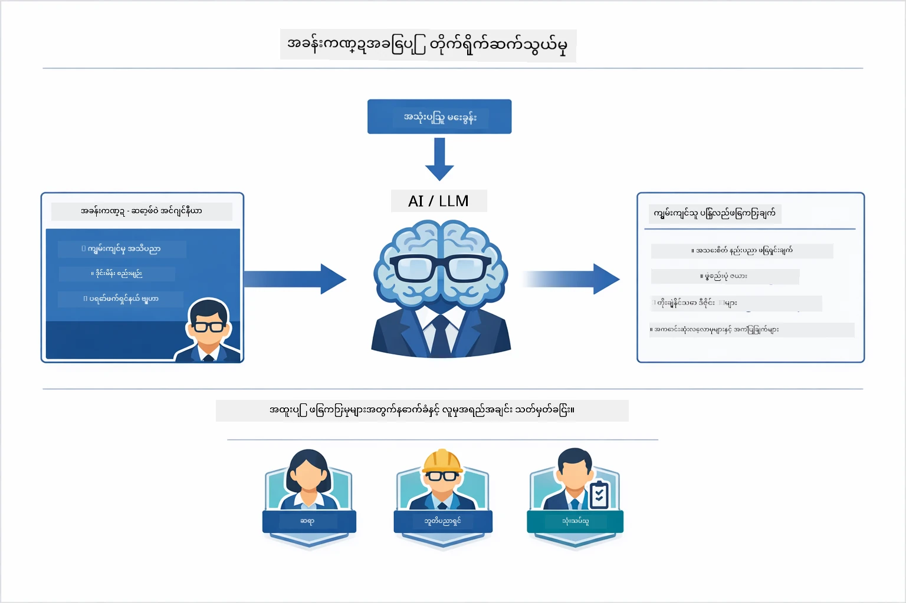
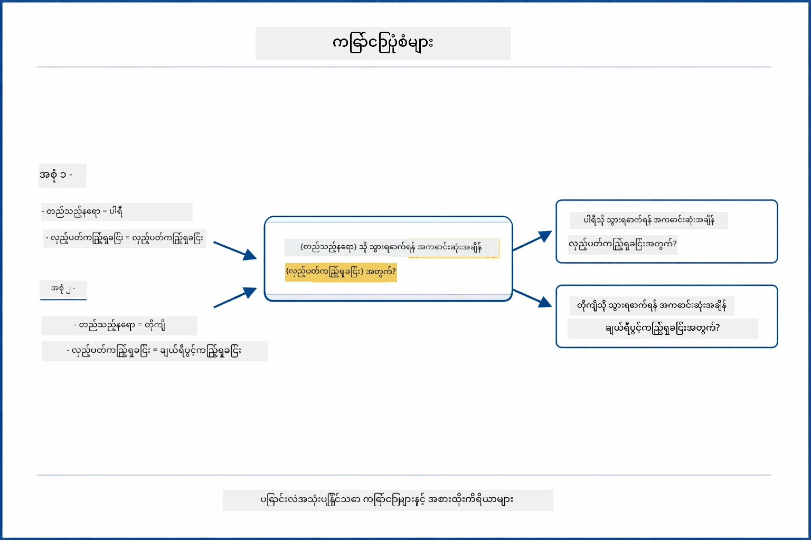
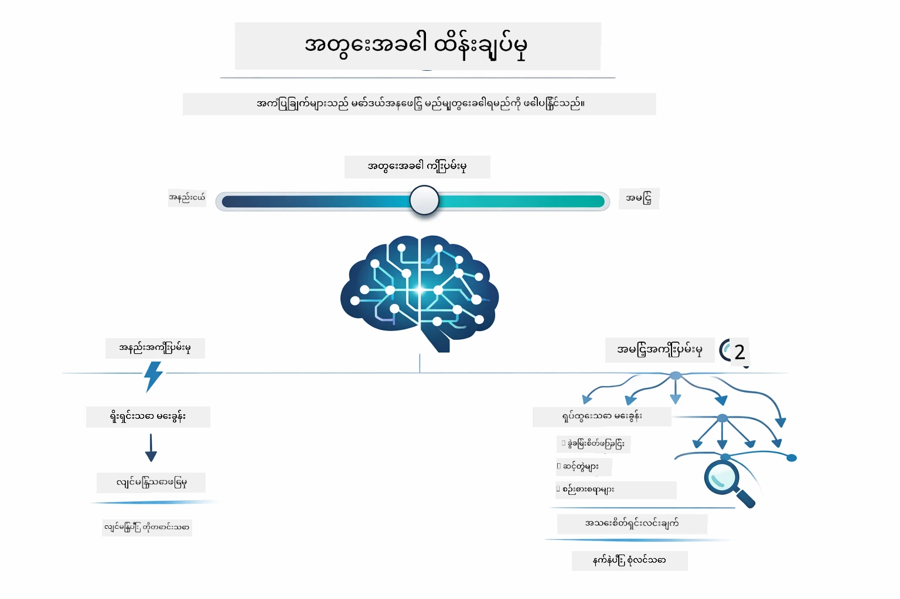

# Module 02: GPT-5.2 ဖြင့် Prompt Engineering

## အကြောင်းအရာ အကျဉ်းချုပ်

- [သင်ယူမည့်အကြောင်းအရာများ](../../../02-prompt-engineering)
- [မလိုအပ်သော အချက်အလက်များ](../../../02-prompt-engineering)
- [Prompt Engineering ကို နားလည်ခြင်း](../../../02-prompt-engineering)
- [Prompt Engineering အခြေခံများ](../../../02-prompt-engineering)
  - [Zero-Shot Prompting](../../../02-prompt-engineering)
  - [Few-Shot Prompting](../../../02-prompt-engineering)
  - [Chain of Thought](../../../02-prompt-engineering)
  - [Role-Based Prompting](../../../02-prompt-engineering)
  - [Prompt Templates](../../../02-prompt-engineering)
- [အဆင့်မြင့်ပုံစံများ](../../../02-prompt-engineering)
- [ရှိပြီးသား Azure အရင်းအမြစ်များကို အသုံးပြုခြင်း](../../../02-prompt-engineering)
- [အက်ပလီကေးရှင်း ရုပ်ပုံများ](../../../02-prompt-engineering)
- [ပုံစံများကို ရှာဖွေခြင်း](../../../02-prompt-engineering)
  - [သိမ်းမြောက်မှု အနည်း - အများ](../../../02-prompt-engineering)
  - [တာဝန်အကောင်အလုပ်လုပ်ခြင်း (Tool Preambles)](../../../02-prompt-engineering)
  - [ကိုယ်တိုင် သုံးသပ်မှုကုဒ်](../../../02-prompt-engineering)
  - [ဖွဲ့စည်းထားသော ခွဲခြမ်းစိတ်ဖြာမှု](../../../02-prompt-engineering)
  - [ပြန်လည်သုံးသပ် ဆက်သွယ်မှု](../../../02-prompt-engineering)
  - [ခြေလှမ်းလိုက် ဉာဏ်ရည်သုံးသပ်မှု](../../../02-prompt-engineering)
  - [ကန့်သတ်ထားသော ထွက်ရှိမှု](../../../02-prompt-engineering)
- [သင်မှန်ကန်စွာသိရှိနေရသောအရာများ](../../../02-prompt-engineering)
- [နောက်တစ်ဆင့်များ](../../../02-prompt-engineering)

## သင်ယူမည့်အကြောင်းအရာများ



ယခင် Module တွင် သင်တွေ့မြင်ခဲ့သည့် အတိုင်း, စကားပြော AI ၏ မှတ်ဉာဏ်တည်ဆောက်ပုံနှင့် GitHub Models ကို အခြေခံဆက်ဆံပုံများအတွက် အသုံးပြုခဲ့သည်။ ယခုမှာ Azure OpenAI ၏ GPT-5.2 ကို အသုံးပြုပြီး မေးခွန်းများမေးရန်၊ တိုက်ရိုက်ပြောဆိုခြင်း (prompts) ပုံစံများကို ဦးတည်သွားပါမည်။ သင့်ဒေတာကို prompt စနစ်တကျ ဖွဲ့စည်းပုံသည် မိမိရယူလိုသော တုံ့ပြန်ချက်များ၏ အရည်အသွေးကို အလွန်အကျွံ ထိရောက်စေသည်။ ပထမဦးဆုံး အခြေခံ prompting နည်းများကို ပြန်လည်ဆန်းစစ်ပြီး နောက်တဖန် GPT-5.2 ၏ လုပ်ဆောင်နိုင်စွမ်းအား အပြည့်အဝ အသုံးပြုပြီး ထူးချွန်သော pattern ရှစ်မျိုးသို့ ရောက်ရှိမှာ ဖြစ်သည်။

GPT-5.2 သည် အာရုံစူးစိုက်မှု ထိန်းညှိနိုင်မှု (reasoning control) ကို ဖြစ်ထွန်းစေပြီး မေးခွန်းကို ဖြေဆိုရန် မည်မျှ စဉ်းစားမှု လုပ်ရန်ဆိုသည်ကို ပုံမှန်အတိုင်း ဦးတည်ရာလုပ်ဆောင်၍ နည်းစနစ်များကို ပိုမိုရှင်းလင်းသေချာစေသည်။ ထို့အပြင် GitHub Models နှင့် ယှဉ်၍ Azure ၏ GPT-5.2 အတွက် အနှောင့်အယှက် ကန့်သတ်ချက်များနည်းပါးခြင်းကိုလည်း အကျိုးယူနိုင်ပါသည်။

## မလိုအပ်သော အချက်အလက်များ

- Module 01 ပြီးစီးထားသည် (Azure OpenAI အရင်းအမြစ်များ စတင်ထားသည်)
- အခြေခံစာမျက်နှာတွင် `.env` ဖိုင် ထည့်သွင်းပြီး Azure အသိအမှတ်ပြုချက်များပါရှိသည် (`azd up` ဖြင့် Module 01 တွင် ဖန်တီးထားသည်)

> **မှတ်ချက်:** Module 01 စတင်ပြီးမဟုတ်သေးပါက၊ ၎င်းမှ ညွှန်ကြားချက်များကို မပြိတ်သွားမီ အရင်လုပ်ဆောင်ပါ။

## Prompt Engineering ကို နားလည်ခြင်း



Prompt engineering သည် အမြဲတမ်းလိုအပ်သည့် ရလဒ်ကို ရရှိစေမည့် input စာသားကို ဒီဇိုင်းဆွဲခြင်း ဖြစ်သည်။ ၎င်းသည် မေးခွန်းများမေးခြင်းအကြောင်းသာမက၊ မော်ဒယ်မှ သင်လိုချင်သော အရာနှင့် ထိုအရာကို မည်သို့ ပို့ဆောင်ရမည်ကို အတိအကျ နားလည်စေမည့် တောင်းဆိုမှုများ ဖွဲ့စည်းပုံအကြောင်း ဖြစ်သည်။

ဤကဲ့သို့ ညွှန်ကြားချက်များအား မိတ်ဖက်တစ်ဦးအား ပေးပို့ခြင်းတစ်ခုအနေဖြင့် မိမိစဉ်းစားပါ။ "အမှားကို ပြင်ပါ" သည် ပြောကြားချက် မကြာရှုထူသည်။ "UserService.java ဖိုင်အတွင်း လမ်းကြောင်း ၄၅ တွင် null pointer exception ကို null စစ်ဆေးမှု ထည့်သွင်းပြီး ပြင်ဆင်ပါ" ဆိုသည်မှာ အတိအကျ ဖြစ်သည်။ ဘာသာစကား မော်ဒယ်များသည် ထိုပုံစံနှင့် ဆင်တူပြီး ရိုက်ချက်နှင့်ဖွဲ့စည်းပုံ၌ အလွန် အရေးကြီးသည်။



LangChain4j သည် ပုံစံချိတ်ဆက်မှုများ၊ မှတ်ဉာဏ်နှင့် သတင်းစကားမျိုးစုံကို ပံ့ပိုးပေးသည့် အဆောက်အဦဖြစ်သည်၊ သို့ရာတွင် prompt ပုံစံများသည် ၎င်းအတိုင်းပို့သည့် သေချာစွာဖွဲ့စည်းထားသော စာသားများသာ ဖြစ်သည်။ အဓိက အဆောက်အဦများမှာ `SystemMessage` (AI ၏ မျိုးစုံပြုမူမှုနှင့် အခန်းကဏ္ဍကို သတ်မှတ်ခြင်း) နှင့် `UserMessage` (သင်၏ တောင်းဆိုချက်ကို သယ်ဆောင်သည်) ဖြစ်သည်။

## Prompt Engineering အခြေခံများ



ယခု module တွင် ထူးချွန်သော ပုံစံများသို့ ကျူးလွန်ရန်မပြုမီ၊ အခြေခံ prompting နည်းလမ်း ၅ မျိုးကို ပြန်လည်ဆန်းစစ်ကြပါစို့။ ၎င်းတို့မှာ prompt အင်ဂျင်နီယာတိုင်း သိရှိထားသင့်သည့် အခြေခံပစ္စည်းများ ဖြစ်သည်။ သင်က [Quick Start module](../00-quick-start/README.md#2-prompt-patterns) ကိုပြီးမြောက်စွာ လေ့လာပြီးပါက ၎င်းတွင် ပါဝင်သော စိတ်ထားအဓိကကို အောက်တွင် မြင်တွေ့နိုင်ပါသည်။

### Zero-Shot Prompting

အလွယ်တကူနည်းလမ်း — နမူနာမပါဘဲ မော်ဒယ်အား တိုက်ရိုက်အမိန့်ပေးခြင်း။ မော်ဒယ်သည် လုံးဝသင်ယူမှုအပေါ် မူတည်ပြီး တာဝန်ကို နားလည်ကာ ဆောင်ရွက်သည်။ ပုံမှန် လိုအပ်ချက်များအတွက် သေချာလွယ်ကူစွာ ပြောဆိုရာတွင် အသုံးပြုကြသည်။



*နမူနာမပါဘဲ တိုက်ရိုက် အမိန့်ပေးခြင်း — မော်ဒယ်သည်အမိန့်မှသာ တာဝန်ကို ခန့်မှန်းသည်*

```java
String prompt = "Classify this sentiment: 'I absolutely loved the movie!'";
String response = model.chat(prompt);
// တုံ့ပြန်ချက်- "အတည်ပြု"
```

**အသုံးပြုရန်:** လွယ်ကူသော သတ်မှတ်ခြင်းများ၊ တိုက်ရိုက်မေးခွန်းများ၊ ဘာသာပြန်ခြင်းများ၊ သို့မဟုတ် မတိတိကျကျ လမ်းညွှန်ချက် မလိုအပ်သော တာဝန်များ။

### Few-Shot Prompting

မော်ဒယ်လိုက်နာသည့် ပုံစံကို ပြသသည့် နမူနာများကို ပေးဆောင်ခြင်း။ မော်ဒယ်သည် သင်ပေးသော နမူနာများမှ တောင်းဆိုရန် ပုံစံကို သင်ယူကာ အသစ်များကို အကျုံးသွားသည်။ ရလဒ်မှာ မြင့်တက်ပြီး ပုံစံအတော်များသော တာဝန်များအတွက် အကောင်းဆုံးဖြစ်သည်။



*နမူနာမှ သင်ယူခြင်း — မော်ဒယ်သည် ပုံစံကို မြင်ရှုကာ အသစ်များဤပုံစံဖြင့် သုံးသည်*

```java
String prompt = """
    Classify the sentiment as positive, negative, or neutral.
    
    Examples:
    Text: "This product exceeded my expectations!" → Positive
    Text: "It's okay, nothing special." → Neutral
    Text: "Waste of money, very disappointed." → Negative
    
    Now classify this:
    Text: "Best purchase I've made all year!"
    """;
String response = model.chat(prompt);
```

**အသုံးပြုရန်:** ကိုယ်ပိုင် သတ်မှတ်ချက်များ၊ ပုံစံတကျ ပြုပြင်မှုများ၊ ထူးခြားသော ဒိုမိန်းဆိုင်ရာ တာဝန်များ၊ သို့မဟုတ် zero-shot ထိရောက်မှု မမြင့်မားသောအခါ။

### Chain of Thought

မော်ဒယ်အား စဉ်းစားချက်များကို လှမ်းခြေလှမ်း ပြပါရန် တောင်းဆိုခြင်း။ ဖြေဆိုတိုင်း၌ တိုက်ရိုက်ဖြေမှုအစား ပြသနာကို အပိုင်းပိုင်း ခွဲခြမ်းရှင်းလင်းခြင်းဖြင့် ဆောင်ရွက်သည်။ သင်္ချာ၊ ယဉ်ကျေးသော ကိရိယာများနှင့် အဆင့်မြင့် စဉ်းစားခန်းများတွင် တိကျမှန်ကန်မှု မြင့်တက်စေသည်။



*ခြေလှမ်းလိုက် စဉ်းစားမှု — ရှုပ်ထွေးသော ပြဿနာများကို နည်းနည်းတိုင်း အပိုင်းပိုင်း ဖြေရှင်းခြင်း*

```java
String prompt = """
    Problem: A store has 15 apples. They sell 8 apples and then 
    receive a shipment of 12 more apples. How many apples do they have now?
    
    Let's solve this step-by-step:
    """;
String response = model.chat(prompt);
// မော်ဒယ်က ပြသတာက 15 - 8 = 7 ဖြစ်ပြီး၊ ထို့နောက် 7 + 12 = 19 ပန်းသီးတွေ ဖြစ်ပါတယ်။
```

**အသုံးပြုရန်:** သင်္ချာပြဿနာများ၊ ယဉ်ကျေးသော ဉာဏ်ကစားများ၊ အမှားရှာဖွေရေး၊ သို့မဟုတ် စဉ်းစားမှုပုံစံ ပြသခြင်းဖြင့် တိကျမှန်ကန်မှု နှင့် ယုံကြည်စိတ်ချမှု မြင့်တက်စေရန်။

### Role-Based Prompting

မေးခွန်းမေးရန် မတိုင်မီ AI အတွက် သူတစ်ပါးဘဝ သို့ ပုံစံ သတ်မှတ် ပေးခြင်း။ ၎င်းသည် ပြန်လည်ဖြေဆိုမှု၏ အသံ၊ နက်နဲမှု နှင့် အာရုံစူးစိုက်မှုကို သတ်မှတ်ပေးသည်။ "software architect" သည် "junior developer" သို့မဟုတ် "security auditor" အတွက် ဆွေးနွေးချက်ကွဲပြားသည်။



*အကြောင်းအရာနှင့်သူတစ်ပါးဘဝသတ်မှတ်ခြင်း — လူတစ်ဦးက နှုတ်ဆိုသည့် မေးခွန်းနှင့် မတူသော ပြန်လည်ဖြေကြားချက်*

```java
String prompt = """
    You are an experienced software architect reviewing code.
    Provide a brief code review for this function:
    
    def calculate_total(items):
        total = 0
        for item in items:
            total = total + item['price']
        return total
    """;
String response = model.chat(prompt);
```

**အသုံးပြုရန်:** ကုဒ်သုံးသပ်ခြင်းများ၊ သင်ကြားမှုများ၊ ဒိုမိန်းဆိုင်ရာ ခွဲခြမ်းခြင်းများ၊ သို့မဟုတ် သီးသန့်ကျွမ်းကျင်မှုအဆင့် သို့မဟုတ် အမြင်ဆိုင်ရာ ဝေဖန်ချက်များ လိုအပ်သည့်အခါ။

### Prompt Templates

ပြောင်းလဲနိုင်သော နေရာများပါဝင်သည့် ပြန်လည်အသုံးပြုနိုင်သည့် prompt များဖန်တီးခြင်း။ တစ်ကြိမ်ပြီးလျှင် အသစ်ရေးသားရန် အစား တမ်းပလိတ်ကို တစ်ကြိမ်ထားပြီး တန်ဖိုးများကို ဖြည့်စွက်သွားသည်။ LangChain4j ၏ `PromptTemplate` အတန်းသည် `{{variable}}` စာကြောင်းပုံစံဖြင့် လွယ်ကူစွာ ဆောင်ရွက်ပေးသည်။



*ပြောင်းလဲနိုင်သော နေရာများ ပါရှိသည့် ပြန်လည်အသုံးပြုနိုင်သော prompt များ*

```java
PromptTemplate template = PromptTemplate.from(
    "What's the best time to visit {{destination}} for {{activity}}?"
);

Prompt prompt = template.apply(Map.of(
    "destination", "Paris",
    "activity", "sightseeing"
));

String response = model.chat(prompt.text());
```

**အသုံးပြုရန်:** ထပ်တလဲလဲ မေးခွန်းများ၊ အစုလိုက်လုပ်ဆောင်မှုများ၊ ပြန်လည်အသုံးပြုနိုင်သည့် AI စနစ်များ တည်ဆောက်မှု၊ သို့မဟုတ် prompt ပုံစံတူပြီး ဒေတာသာကွဲပြားသော မည်သည့် အခြေအနေတို့။

---

ဤ အခြေခံ ၅ မျိုးသည် prompting များအတွက် ကြံ့ကြံ့ခိုင်ခိုင် ကိရိယာများ ဖြစ်သည်။ ယခု module များတွင် GPT-5.2 ၏ reasoning control, ကိုယ်တိုင် သုံးသပ်မှုနှင့် ဖွဲ့စည်းထားသော ထွက်ရှိမှု စသည့် လုပ်ဆောင်ချက်များကို အသုံးပြုသော **ထူးခြားသော pattern ၈ မျိုး** သို လမ်းကြောင်း ရှင်းလင်းပေးသည်။

## အဆင့်မြင့်ပုံစံများ

အခြေခံများ ပြည့်စုံပြီးနောက် module ၏ ထူးခြားမှုဖြစ်သော pattern ရှစ်မျိုးထဲသို့ သွားကြပါစို့။ မူလတန်းပြဿနာတိုင်းသည် တူညီသောနည်းလမ်းမလိုအပ်ပါ။ မေးခွန်းအချို့သည် မြန်ဆန်လွယ်ကူသော ဖြေဆိုချက်များလိုအပ်ပြီး၊ တစ်ခြားသော မေးခွန်းများသည် ဆန်းစစ်စဉ်းစားမှုနက်ရှိုင်းမှုလိုအပ်သည်။ reasoning control သည် မတူညီသော သဘောထားများကို ပိုမို ပြင်ဆင်ဖော်ပြနိုင်စေသည်။


*prompt engineering pattern ၈ မျိုး၏ အကြောင်းအရာနဲ့ အသုံးပြုမှုများ မှတ်ချက်*



*GPT-5.2 ၏ reasoning control ကြောင့် မော်ဒယ်စဉ်းစားမှု အရေအတွက်ကို သတ်မှတ်နိုင်ပြီး မြန်ဆန်၍ တိုက်ရိုက်ဖြေမှုမှ နက်ရှိုင်းစွာ စူးစမ်းဖော်ထုတ်မှုထိ*


*အနည်းငယ် စူးစမ်းရာ (မြန်ဆန် တိုက်ရိုက်) နှင့် နက်ရှိုင်း စူးစမ်းရာ (အသေးစိတ် ရှာဖွေရာ) reasoning နည်းလမ်းများ*

**အနည်းငယ် စူးစမ်းခြင်း (မြန်ဆန် နှင့် အာရုံစူးစိုက်သည်)** - လွယ်ကူ၍ တိုက်ရိုက်ဖြေရှင်းတာဝန်များအတွက်။ မော်ဒယ်သည် reasoning နည်း၍ အနည်းဆုံး ၂ ချက်အထိ ဆောင်ရွက်သည်။ မီတာခန့်ခြေတွက်ခြင်း၊ ရှာဖွေမှု သို့မဟုတ် လက်တွေ့မေးခွန်းများအတွက် အသုံးပြုသည်။

```java
String prompt = """
    <reasoning_effort>low</reasoning_effort>
    <instruction>maximum 2 reasoning steps</instruction>
    
    What is 15% of 200?
    """;

String response = chatModel.chat(prompt);
```

> 💡 **GitHub Copilot ဖြင့် စူးစမ်းကြည့်ပါ:** [`Gpt5PromptService.java`](../../../02-prompt-engineering/src/main/java/com/example/langchain4j/prompts/service/Gpt5PromptService.java) ဖိုင်ကို ဖွင့်ပြီး မေးပါ -
> - "အနည်းငယ် စူးစမ်းမှုနှင့် အများအပြား စူးစမ်းမှု prompting ပုံစံများကွာခြားချက် ဘာလဲ?"
> - "prompt ပုံစံများတွင် XML tag များက AI ပြန်ကြားမှု ဖွဲ့စည်းပုံအား မည်သို့ ကူညီသနည်း?"
> - "ကိုယ်တိုင် သုံးသပ်မှု pattern များကို တိုက်ရိုက်အမိန့်ပေးမှုနည်းလမ်းနှင့် မည့္သို့ ခွဲခြားသုံးစွဲသနည်း?"

**အများအပြား စူးစမ်းခြင်း (နက်ရှိုင်းပြီး အသေးစိတ်)** - နက်ရှိုင်းစွာ သုံးသပ် ပြဿနာများအတွက်။ မော်ဒယ်သည် သေချာရှင်းလင်းစွာ စဉ်းစားကာ အကောင်းဆုံး ဖြေရှင်းချက်များ ပြပါသည်။ စနစ်ဒီဇိုင်း၊ ဖွဲ့စည်းပုံဆုံးဖြတ်ချက်များ၊ သုတေသနများအတွက် အသုံးပြုရန် သင့်တော်သည်။

```java
String prompt = """
    <reasoning_effort>high</reasoning_effort>
    <instruction>explore thoroughly, show detailed reasoning</instruction>
    
    Design a caching strategy for a high-traffic REST API.
    """;

String response = chatModel.chat(prompt);
```

**တာဝန်အကောင်အလုပ်လုပ်ခြင်း (ခြေလှမ်းလိုက် တိုးတက်မှု)** - အဆင့်ပိုင်းစီ workflow များအတွက်။ မော်ဒယ်မှအစီအစဉ်ပြောကြားပြီး၊ တစ်ခြေလှမ်းချင်းစီကို ဖော်ပြကာ အကျဉ်းချုဒေသကို ပေးပါသည်။ သွားရာရွေ့ရာဗီဇ၊ အကောင်အထည်ဖော်ခြင်း သို့မဟုတ် အဆင့်ပေါင်းများစွာလျှင် ထားပါ။

```java
String prompt = """
    <task>Create a REST endpoint for user registration</task>
    <preamble>Provide an upfront plan</preamble>
    <narration>Narrate each step as you work</narration>
    <summary>Summarize what was accomplished</summary>
    """;

String response = chatModel.chat(prompt);
```


Chain-of-Thought prompting သည် မော်ဒယ်အား reasoning လုပ်စဉ်ကို ဖော်ပြရန် တိုက်တွန်းကာ၊ ရှုပ်ထွေးသည့် တာဝန်များအတွက် တိကျမှန်ကန်မှု မြင့်တက်စေသည်။ ခြေလှမ်းလိုက် ခွဲခြမ်းခြင်းသည် လူနှင့် AI နှစ်ဖက်စလုံး အတွေးအခေါ်ကို ရှင်းလင်းစေသည်။

> **🤖 [GitHub Copilot](https://github.com/features/copilot) Chat ဖြင့် စမ်းသပ်ပါ:** ယခုနည်းလမ်းအကြောင်း မေးမြန်းပါ -
> - "တာဝန်အကောင်အလို့င် pattern ကို ရေရှည် ကာလလုပ်ဆောင်ချက်များအတွက် မည်မျှ ပြောင်းလဲဖော်ပြမည်နည်း?"
> - "ထုတ်ကုန်အပလီကေးရှင်းများတွင် tool preambles များ စနစ်တကျ ဖွဲ့စည်းမှုအတွက် အကောင်းဆုံး အကြံပြုချက်များ⁣ဘာတွေလဲ?"
> - "UI တွင် အလတ်တန်း တိုးတက်မှု အချက်အလက်များကို မည်မျှ ဖမ်းယူပြီး ပြသနိုင်မည်နည်း?"


*အစီအစဉ် → လုပ်ဆောင် → အကျဉ်းချုပ် workflow အစဉ်အလာ*

**ကိုယ်တိုင် သုံးသပ်မှုကုဒ်** - ထုတ်ကုန်အရည်အသွေးမြင့် ကုဒ်များ ထုတ်လုပ်ရန်။ မော်ဒယ်သည် ကုဒ်ရေးပြီး အရည်အသွေး လိုက်လျောညီထွေမှု စစ်ဆေးကာ မကောင်းသော အချက်များ တိုးတက်အောင်လုပ်ဆောင်သည်။ အသစ် ဖန်တီးခြင်း သို့မဟုတ် ၀န်ဆောင်မှုများ အတွက် သင့်တော်သည်။

```java
String prompt = """
    <task>Create an email validation service</task>
    <quality_criteria>
    - Correct logic and error handling
    - Best practices (clean code, proper naming)
    - Performance optimization
    - Security considerations
    </quality_criteria>
    <instruction>Generate code, evaluate against criteria, improve iteratively</instruction>
    """;

String response = chatModel.chat(prompt);
```


*ဆက်တိုက်တိုးတက်ပြောင်းလဲမှု စက်ဝိုင်း - ဖန်တီး၊ သုံးသပ်၊ ပြဿနာရှာမိ၊ တိုးတက်၊ ထပ်မံလုပ်ဆောင်*

**ဖွဲ့စည်းထားသော ခွဲခြမ်းစိတ်ဖြာမှု** - တောက်တောက်ပ ထောက်ခံချက်ရှိရန် တစ်မျိုးတည်းသော စံသတ်မှတ်ချက်ဖြင့် မော်ဒယ်က ကုဒ်ကို သုံးသပ်သည် (မှန်ကန်မှု၊ လုပ်ထုံးလုပ်နည်းများ၊ စွမ်းဆောင်ရည်၊ ဘေးကင်းလုံခြုံမှု)။ ကုဒ်တွင် စစ်ဆေးသုံးသပ်မှုများ ၊ အရည်အသွေး အကဲဖြတ်မှုများအတွက် အသုံးပြုသည်။

```java
String prompt = """
    <code>
    public List getUsers() {
        return database.query("SELECT * FROM users");
    }
    </code>
    
    <framework>
    Evaluate using these categories:
    1. Correctness - Logic and functionality
    2. Best Practices - Code quality
    3. Performance - Efficiency concerns
    4. Security - Vulnerabilities
    </framework>
    """;

String response = chatModel.chat(prompt);
```

> **🤖 [GitHub Copilot](https://github.com/features/copilot) Chat ဖြင့် စမ်းပါ:** ဖွဲ့စည်းထားသော ခွဲခြမ်းစိတ်ဖြာမှုအကြောင်း မေးပါ -
> - "ကွဲပြားသော ကုဒ်သုံးသပ်မှုများအတွက် ခွဲခြမ်းစိတ်ဖြာမှု စံတော်ချိန်ပြုလုပ်နည်း ဘယ်လိုပြင်ဆင်ရမလဲ?"
> - "ဖွဲ့စည်းထားသော ထွက်ရှိမှုကို ပရိုဂရမ်အနေဖြင့် မည်မျှ အကောင်းဆုံး ဖော်ပြ ဆောင်ရွက်မလဲ?"
> - "ကွဲပြားသော သုံးသပ်မှု အစည်းအဝေးများတွင် အဆင့်အတင့်များကို မည်သို့ သေချာထိန်းသိမ်းမည်နည်း?"


*Severity အဆင့်များဖွဲ့စည်းထားသော စံတော်ချိန်ဖြင့် တောက်ပအောင် code review လုပ်ခြင်း*

**ပြန်လည်သုံးသပ် ဆက်သွယ်မှု (Multi-Turn Chat)** - အကြောင်းအရာလိုအပ်သော စကားပြောဆွေးနွေးမှုများအတွက်။ မော်ဒယ်သည် ယခင် စကားလုံးများကို မှတ်ထားကာ ထပ်မံတည်ဆောက်သည်။ အင်တာအက်တက် ဒေါင်းလင်း ကူညီမှုများ သို့မဟုတ် ရှုပ်ထွေးသော မေးဖြေရာတွင် သုံးသည်။

```java
ChatMemory memory = MessageWindowChatMemory.withMaxMessages(10);

memory.add(UserMessage.from("What is Spring Boot?"));
AiMessage aiMessage1 = chatModel.chat(memory.messages()).aiMessage();
memory.add(aiMessage1);

memory.add(UserMessage.from("Show me an example"));
AiMessage aiMessage2 = chatModel.chat(memory.messages()).aiMessage();
memory.add(aiMessage2);
```


*စကားပြော ဆက်သွယ်မှုများ တစ်ကြိမ်ချင်းစီ ပေါင်းစည်းမှု Token ကန့်သတ်မှု ထိရှိသည့်အထိ*

**ခြေလှမ်းလိုက် ဉာဏ်ရည်သုံးသပ်မှု** - အသေးစိတ်အောင် မြင်သာအောင် လိုက်နာရမည့် ပြဿနာများအတွက်။ မော်ဒယ်သည် တစ်ခြေလှမ်းချင်းစီ Logic ကို ပွန်းပေါ်ပြသသည်။ သင်္ချာပြဿနာ၊ Logic ယှဉ်ပြိုင်မှုများ သို့မဟုတ် စဉ်းစားပုံကို နားလည်ရန် လိုအပ်သောအခါ အသုံးပြုရန်။

```java
String prompt = """
    <instruction>Show your reasoning step-by-step</instruction>
    
    If a train travels 120 km in 2 hours, then stops for 30 minutes,
    then travels another 90 km in 1.5 hours, what is the average speed
    for the entire journey including the stop?
    """;

String response = chatModel.chat(prompt);
```


*ပြဿနာများကို ရှင်းလင်းသော အနည်းငယ်နှင့် သက်ဆိုင်ရာ Logic အစိတ်အပိုင်းများ ခွဲခြမ်း ဆန်းစစ် သေချာစေရန်*

**ကန့်သတ်ထားသော ထွက်ရှိမှု** - သတ်မှတ်ထားသည့် ပုံစံလိုအပ်ချက်များနှင့်အတူ ပြန်လည်ဖြေဆိုပါသည်။ မော်ဒယ်သည် ပုံစံ၊ အရှည်နှင့် ဖွဲ့စည်းမှု စည်းကမ်းများကို လုံးလုံးဝလုံးနာက်လိုက်နာသည်။ အကျဥ်းချုပ်များ သို့မဟုတ် တိတိကျကျ ထွက်ရှိမှု လိုအပ်သော အခါ အသုံးပြုသည်။

```java
String prompt = """
    <constraints>
    - Exactly 100 words
    - Bullet point format
    - Technical terms only
    </constraints>
    
    Summarize the key concepts of machine learning.
    """;

String response = chatModel.chat(prompt);
```


*သတ်မှတ်ထားသော ပုံစံ၊ အရှည်နှင့် ဖွဲ့စည်းမှုလိုအပ်ချက်များကို တင်းကျပ် စောင့်ရှောက်ခြင်း*

## ရှိပြီးသား Azure အရင်းအမြစ်များကို အသုံးပြုခြင်း

**배포를 확인하세요(Verify deployment):**

မူလစာမျက်နှာတွင် Azure အသိအမှတ်ပြုချက်ရှိ `.env` ဖိုင်တည်ရှိမှုကို သေချာစေပါ (Module 01 တွင် ဖန်တီးခဲ့သည်):
```bash
cat ../.env  # AZURE_OPENAI_ENDPOINT၊ API_KEY၊ DEPLOYMENT တို့ကို ပြသသင့်သည်
```

**အက်ပလီကေးရှင်း စတင်ခြင်း:**

> **မှတ်ချက်:** Module 01 မှ `./start-all.sh` ဖြင့် တစ်လုံးချင်း စတင်ထားပြီးဖြစ်ပါက ယခု module သည် port 8083 တွင် ပြီးပြည့်စုံ မြန်ဆန်စွာ သင့်ကိုယ်ပိုင် server အနေဖြင့် ပိတ်ထားသည်။ ထိုကာလအတွင်း စတင်ကော်မန်းများကို ကျော်လွှားကာ http://localhost:8083 သို့ တိုက်ရိုက် ဝင်ရောက်နိုင်ပါသည်။

**ရွေးချယ်မှု ၁: Spring Boot Dashboard အသုံးပြုခြင်း (VS Code အသုံးပြုသူများအတွက် အကြံပြု)**

Dev container တွင် Spring Boot Dashboard extension ပါဝင်ပြီး သင့်အား Spring Boot applications များအားလုံး စီမံခန့်ခွဲရန် ဗွီဒီယိုဖြင့် interface ပေးသည်။ VS Code တွင် ဘယ်ဘက်ရိုး Activity Bar တွင် (Spring Boot အိုင်ကွန်းကို ရှာပါ) တွင် တွေ့နိုင်ပါသည်။
From the Spring Boot Dashboard, you can:
- အလုပ်ရုံအတွင်းရှိ ရနိုင်သည့် Spring Boot အက်ပ်ပလီကေးရှင်းများအားလုံးကိုကြည့်ရှုနိုင်သည်
- တစ်ချက်နှိပ်ပြီး အက်ပ်ပလီကေးရှင်းများကို စတင်/ရပ်စဲနိုင်သည်
- အက်ပ်ပလီကေးရှင်းလော့ဂ်များကို တိုက်ရိုက်ကြည့်ရှုနိုင်သည်
- အက်ပ်ပလီကေးရှင်းအခြေအနေကို စောင့်ကြည့်နိုင်သည်

"prompt-engineering" ရှိ play ခလုတ်ကို နှိပ်ပြီး ဤ module ကို စတင်လိုက်ပါ၊ ဒါမှမဟုတ် module အားလုံးကို တပြိုင်နက် စတင်ပါ။


**Option 2: Using shell scripts**

web အက်ပ်ပလီကေးရှင်း အားလုံး (modules 01-04) ကို စတင်ပါ။

**Bash:**
```bash
cd ..  # အမြစ်ဖိုင်ဒေါ်း၏နေရာမှ
./start-all.sh
```

**PowerShell:**
```powershell
cd ..  # မူရင်းဖိုင်ယားမှ
.\start-all.ps1
```

ဒါမှမဟုတ် ဤ module သာ စတင်ပါ။

**Bash:**
```bash
cd 02-prompt-engineering
./start.sh
```

**PowerShell:**
```powershell
cd 02-prompt-engineering
.\start.ps1
```

script နှစ်ခုစလုံးသည် root `.env` ဖိုင်မှ environment variables များကို အလိုအလျောက် load ပြီး JAR မရှိလျှင် တည်ဆောက်မည် ဖြစ်ပါသည်။

> **Note:** စတင်ရန်အတွက် module အားလုံးကို manually တည်ဆောက်လိုပါက
>
> **Bash:**
> ```bash
> cd ..  # Go to root directory
> mvn clean package -DskipTests
> ```
>
> **PowerShell:**
> ```powershell
> cd ..  # Go to root directory
> mvn clean package -DskipTests
> ```

သင်၏ browser တွင် http://localhost:8083 ကို ဖွင့်ပါ။

**ရပ်ရန်:**

**Bash:**
```bash
./stop.sh  # ဤမော်ဂျူးသည်သာ
# သို့မဟုတ်
cd .. && ./stop-all.sh  # မော်ဂျူးအားလုံး
```

**PowerShell:**
```powershell
.\stop.ps1  # ဒီမော်ဂျူးတစ်ခုသာ
# သို့မဟုတ်
cd ..; .\stop-all.ps1  # မော်ဂျူးအားလုံး
```

## Application Screenshots


*အဓိက dashboard သည် prompt engineering  pattern ၈ မျိုးအားလုံးကို ၎င်းတို့၏ အင်္ဂါရပ်များနှင့် အသုံးပြုမှုကိစ္စများဖြင့် ပြသသည်*

## Exploring the Patterns

web interface မှ သင်သည် prompting မျိုးစုံအား စမ်းသပ်နိုင်သည်။ pattern တစ်ခုချင်းစီသည် ပြဿနာကွဲပြားချက်များကို ဖြေရှင်းသည် - မည်သည့်နည်းလမ်းက မြင်သာသလဲ စမ်းသပ်ကြည့်ပါ။

### Low vs High Eagerness

Low Eagerness ဖြင့် "200 ရဲ့ 15% ဘာလဲ?" ဆိုပြီး ရိုးရိုးစုံစမ်းမေးမြန်းပါ။ လျင်မြန်ပြီး တိုတိုတစ်ချက်ဖြေမှာရမှာ ဖြစ်သည်။ အခုတော့ High Eagerness ဖြင့် "high-traffic API အတွက် caching နည်းဗျူဟာရေးဆွဲပါ" ဆိုပြီး ရှုပ်ထွေးသော မေးခွန်းတစ်ခု မေးပါ။ မော်ဒယ်သည် နှေးကွေးသွားပြီး အပြည့်အစုံဖြစ်စေသော အကြောင်းပြချက်များ ပေးပါလိမ့်မည်။ မော်ဒယ်တူ၊ မေးခွန်းဖွဲ့စည်းမှုတူပါပဲ - ဒါပေမယ့် prompt က မော်ဒယ်ကို ထောက်လှမ်းတွေးခေါ်မှု အရေအတွက် ပြောပြပေးသည်။


*သေးငယ်ဆုံး စဉ်းစားချက်ဖြင့် မြန်ဆန်သောတွက်ချက်မှု*


*အသေးစိတ် caching နည်းဗျူဟာ (2.8MB)*

### Task Execution (Tool Preambles)

အဆင့်များစွာ workflow များသည် ကြိုတင် အစီအစဉ်နှင့် တိုးတက်မှု ဖော်ပြချက်ကို အသုံးပြုသည့်အခါ အကျိုးရှိသည်။ မော်ဒယ်သည် လုပ်ဆောင်မည့်အရာကို ဖော်ပြပြီး အဆင့်အလိုက် ဖော်ပြ၊ အကျဉ်းချုပ် ပြုလုပ်သည်။


*အဆင့်ဆင့် ဖော်ပြချက်ဖြင့် REST endpoint တည်ဆောက်ခြင်း (3.9MB)*

### Self-Reflecting Code

"အီးမေးလ် စစ်ဆေးမှု ဝန်ဆောင်မှု တည်ဆောက်ပါ" ဟု စမ်းသပ်ကြည့်ပါ။ ဖန်တီးပြီးရပ်ခြင်းမဟုတ်ဘဲ၊ မော်ဒယ်သည် ကိုယ်ပိုင် အရည်အသွေး စံချိန်များနှင့် ယှဉ်ပြိုင် သုံးသပ်၊ အားနည်းချက်များ သတ်မှတ်ပြီး တိုးတက်အောင် ပြုလုပ်သည်။ အရည်အသွေးကို တိုးတက်သည်အထိ iteration ဖြစ်ပေါ်သည်ကို တွေ့ရမည်။


*အီးမေးလ် စစ်ဆေးမှု ဝန်ဆောင်မှု ပြည့်စုံ (5.2MB)*

### Structured Analysis

Code review များသည် သတ်မှတ်ထားသော အကဲဖြတ်မှုပုံစံများ လိုအပ်သည်။ မော်ဒယ်သည် correct, practices, performance, security ဆိုသော fixed category များနှင့် ရုပ်သံအဆင့်များဖြင့် ကိုးကားသုံးသပ်သည်။


* framework အခြေခံ code review *

### Multi-Turn Chat

"Spring Boot ဆိုတာဘာလဲ?" ဟု မေးပြီးနောက် "ဥပမာပြပါ" ဟု ချက်ချင်းဆက်တိုက်မေးပါ။ မော်ဒယ်သည် သင်၏ ပထမမေးခွန်းကို သတိထားပြီး သီးသန့် Spring Boot ဥပမာတစ်ခု ပေးပါသည်။ ဇုန် မရှိဘဲ က ပြီးနောက်မေးခွန်းသည် မရှင်းလင်းနိုင်ပါ။


*မေးခွန်းများအတွင်း ချက်ချင်း စကားပြောဆိုမှု တည်ရှိမှု*

### Step-by-Step Reasoning

ဂဏန်းပြဿနာတစ်ခုရွေးပြီး Step-by-Step Reasoning နှင့် Low Eagerness နှစ်ခုနဲ့စမ်းကြည့်ပါ။ Low eagerness သည် အဖြေကို လျင်မြန်ပေမယ့် တိကျမှုနည်းစွာ ချဉ်းကပ်သည်။ Step-by-step သည် တစ်ချို့်ချို ့ တွက်ချက်ချက်ခြင်းနဲ့ ဆုံးဖြတ်ချက်များကို ပြပေးသည်။


*အသေးစိတ်ခြေလှမ်းများဖြင့် ကိန်းဂဏန်းပြဿနာ*

### Constrained Output

သတ်မှတ်ထားသော ပုံစံ သို့မဟုတ် စာလုံးရေအတိအကျ လိုအပ်သောအခါ ဤ pattern သည် တင်းကျပ်စွာ လိုက်နာချက်ပေးသည်။ တိကျသော စကား ၁၀၀ နဲ့ bullet point ပုံစံအား တင်မြှောက်ပါ။


* format ထိန်းချုပ်ထားသော စက်သင်ယူမှု အကျဉ်းချုပ်*

## What You're Really Learning

**Reasoning Effort Changes Everything**

GPT-5.2 သည် သင်၏ prompt များကနေ အလိုက် အဆင့်အတန်းရှိ ထောက်လှမ်းမှု ဖြစ်စေသည်။ နည်းဆုံး ပမာဏက လျင်မြန်မှုအတွက် သာ ရလဒ် ထုတ်ပေးသည်။ အမြင့်ဆုံး ပမာဏက မော်ဒယ်ကို အတွေးအခေါ် နက်ရှိုင်းစေသည်။ သင်သည် အလုပ်ရှုပ်မှုနှင့် လိုအပ်ချက်များကို ကိုက်ညီစွာ တင်ပါးတတ်သည်၊ ရိုးရှင်းသော မေးခွန်းများ အတွက် အချိန်မကုန်စေ၊ ရှုပ်ထွေးသော ဆုံးဖြတ်ချက်များကိုလည်း မြန်လွယ်စွာ မလုပ်ပါနှင့်။

**Structure Guides Behavior**

prompt များ၏ XML tag များကို သတိပြုပါ။ ၎င်းတို့သည် အလှဆင်မှုမဟုတ်ပါ။ မော်ဒယ်များသည် ဖျတ်ထားသော စာသားထက် ပုံသေရှိသော ဖော်ပြချက်များကို ပိုအားထားသည်။ အဆင့်မြင့် လုပ်ငန်းစဉ်များ သို့မဟုတ် ရှုပ်ထွေးသော လုပ်ဆောင်ချက်များလိုအပ်သောအခါ ဖော်ပြချက်လုပ်ငန်းစဉ်က မော်ဒယ်ကို ပိုမိုကောင်းစွာ ထိန်းချုပ်နိုင်သည်။


* မော်ဒယ်သည် အပိုဒ်အစီအစဉ်များနှင့် XML ပုံစံဖြင့် ဖွဲ့စည်းထားသော prompt ၏ ဖွဲ့စည်းပုံ *

**Quality Through Self-Evaluation**

ကိုယ်တိုင်ဆန်းစစ်ပုံများတွင် အရည်အသွေးစံချိန်များကို ထင်ရှားစွာ ဖော်ပြသည်။ မော်ဒယ်သည် "မှန်ကန်စွာ လုပ်သည်" ဟု မျှော်လင့်ခြင်းမရှိဘဲ "မှန်ကန်ခြင်း" ဆိုသည်မှာ ဘာများပါဝင်သည်ကို သေချာ ဖေါ်ပြသည်။ မော်ဒယ်သည် စီမံချက်ကို ကိုယ်တိုင်သုံးသပ်ပြီး တိုးတက်ရန် ကြိုးစားသည်။ ၎င်းက ကုဒ်ဖန်တီးခြင်းကို ကံစမ်းမဲကစားခြင်းမှ လုပ်ငန်းစဉ်တစ်ခု သို့ ပြောင်းလဲစေသည်။

**Context Is Finite**

Multi-turn စကားပြောဆိုမှုသည် သတင်းအချက်အလက် သမိုင်းနောက်ခံနှင့် တစ်ဦးချင်းတောင်းဆိုမှုတို့ကို တစ်ပြိုင်နက်ထည့်သွင်းပါသည်။ သို့သော် အကန့်အသတ် ရှိသည် - မော်ဒယ်တစ်ခုစီတွင် မက်ဆေ့ချျ token အပြည့်အလျှောက် မရနိုင်ပါ။ စကားပြောစဉ်များ မကြီးသောအခါ သင်သည် ပတ်သက်သော သတင်းအချက်အလက်များကို ထိန်းသိမ်းရန် နည်းလမ်းများလိုအပ်မည်။ ဤ module သည် သင့်အား မemory ဘယ်လို အလုပ်လုပ်သည်ကို ပြသပါသည်။ နောက်ပိုင်းတွင် စုစည်းခြင်း၊ အမှတ်မထင်ခြင်း၊ ပြန်ယူခြင်း စသည့်အခါများကို သင် အတတ်နိုင်ပါလိမ့်မည်။

## Next Steps

**Next Module:** [03-rag - RAG (Retrieval-Augmented Generation)](../03-rag/README.md)

---

**Navigation:** [← Previous: Module 01 - Introduction](../01-introduction/README.md) | [Back to Main](../README.md) | [Next: Module 03 - RAG →](../03-rag/README.md)

---

<!-- CO-OP TRANSLATOR DISCLAIMER START -->
**အရေးကြီး အသိပေးချက်**  
ဤစာရွက်စာတမ်းကို AI ဘာသာပြန်ဝန်ဆောင်မှု [Co-op Translator](https://github.com/Azure/co-op-translator) အသုံးပြု၍ ဘာသာပြန်ထားပါသည်။ ကျွန်ုပ်တို့သည် တိကျမှန်ကန်မှုအတွက် ကြိုးစားသော်လည်း စက်ယန္တရား ဘာသာပြန်ခြင်းများတွင် မှားယွင်းခြင်း သို့မဟုတ် မှားထွက်နိုင်မှုများ ရှိနိုင်ကြောင်း သတိထားပါရန် လိုအပ်ပါသည်။ မူရင်းစာရွက်စာတမ်းကို မူရင်း ဘာသာစကားဖြင့်သာ တရားဝင် အချက်အလက် အဖြစ် သတ်မှတ်ရန်ဖြစ်ပါသည်။ အရေးကြီးသော အချက်အလက်များအတွက် သင့်လျော်သော လူသား အလုပ်အမှုဆောင် ဘာသာပြန်ခြင်းကို အကြံပြုပါသည်။ ဤဘာသာပြန်ချက်အတိုင်း အသုံးပြုမှုကြောင့် ဖြစ်ပေါ်နိုင်သော နားမလည်မှုများ သို့မဟုတ် အမှားဖတ်ခြင်းများအတွက် ကျွန်ုပ်တို့မှာ တာဝန်မယူပါ။
<!-- CO-OP TRANSLATOR DISCLAIMER END -->