# Module 03: RAG (Retrieval-Augmented Generation)

## Table of Contents

- [Video Walkthrough](../../../03-rag)
- [What You'll Learn](../../../03-rag)
- [Prerequisites](../../../03-rag)
- [Understanding RAG](../../../03-rag)
  - [Which RAG Approach Does This Tutorial Use?](../../../03-rag)
- [How It Works](../../../03-rag)
  - [Document Processing](../../../03-rag)
  - [Creating Embeddings](../../../03-rag)
  - [Semantic Search](../../../03-rag)
  - [Answer Generation](../../../03-rag)
- [Run the Application](../../../03-rag)
- [Using the Application](../../../03-rag)
  - [Upload a Document](../../../03-rag)
  - [Ask Questions](../../../03-rag)
  - [Check Source References](../../../03-rag)
  - [Experiment with Questions](../../../03-rag)
- [Key Concepts](../../../03-rag)
  - [Chunking Strategy](../../../03-rag)
  - [Similarity Scores](../../../03-rag)
  - [In-Memory Storage](../../../03-rag)
  - [Context Window Management](../../../03-rag)
- [When RAG Matters](../../../03-rag)
- [Next Steps](../../../03-rag)

## Video Walkthrough

ဒီ module နဲ့အတူ စတင်လုပ်ဆောင်ရန် ရည်ရွယ်ပြီး ရှင်းပြထားတဲ့ live session ကို ကြည့်ပါ: [RAG with LangChain4j - Live Session](https://www.youtube.com/watch?v=_olq75ZH_eY)

## What You'll Learn

ယခင် modules တွင် AI နှင့် စကားပြောဆွေးနွေးခြင်းနှင့် သင့် prompt များကို ထိထိရောက်ရောက်ဖန်တီးနည်းကို သင်ယူထားပါပြီ။ သို့သော် ဘာသာစကားမော်ဒယ်များတွင် များသောအားဖြင့် သင်ကြားလေ့လာခဲ့သည့်အတိုင်းသာ သိရှိနိုင်ပါသည်။ သင့်ကုမ္ပဏီ၏ မူဝါဒများ၊ သင့်ပရောဂျက် စာရွက်စာတမ်းများ သို့မဟုတ် မသင်ကြားရသေးသော အချက်အလက်များအကြောင်း မေးခွန်းများအတွက် မဖြေဆိုနိုင်ပါ။

RAG (Retrieval-Augmented Generation) က ဒီပြဿနာကို ဖြေရှင်းပေးသည်။ မော်ဒယ်ကို သင့်အချက်အလက်များကို သင်ကြားပေးရန် (ဈေးကြီးပြီးမဖြစ်နိုင်သော) ကြိုးစားပြီးသာမက၊ မော်ဒယ်အား သင့်စာရွက်စာတမ်းများကို ရှာဖွေနိုင်စေခြင်းဖြင့် ဖြေရှင်းနိုင်သည်။ မေးခွန်းတစ်ခုမေးလာသောအခါ၊ စနစ်သည် ဆက်စပ်သော အချက်အလက်များကို ရှာဖွေပြီး prompt ထဲသို့ ထည့်သွင်းပေးသည်။ ထို့နောက် မော်ဒယ်သည် အဲဒီရယူထားသော context အပေါ် အခြေခံ၍ ဖြေကြားပေးသည်။

RAG ကို မော်ဒယ်အတွက် ဆိုင်ရာ စာကြည့်တိုက်တစ်ခု ပေးခြင်းဟုစဉ်းစားပါ။ မေးခွန်းတစ်ခုမေးလာသောအခါ၊ စနစ်သည် -

1. **User Query** - သင်မေးခွန်းမေးသည်
2. **Embedding** - မေးခွန်းကို vector သို့ပြောင်းသည်
3. **Vector Search** - ဆင်တူသော စာရွက်စာတမ်း အပိုင်းများ ရှာဖွေသည်
4. **Context Assembly** - ဆက်စပ်သော အပိုင်းများကို prompt ထဲ ထည့်သည်
5. **Response** - LLM သည် context အပေါ်မှအခြေခံပြီး ဖြေဆိုသည်

ဤနည်းလမ်းဖြင့် မော်ဒယ်၏ဖြေဆိုချက်များကို ၎င်း၏သင်ကြားမှု အချက်အလက်အစား သင့်ဒေတာများအပေါ်တွင် အခြေခံစေပါသည်။

## Prerequisites

- အပြီးသတ်ထားသော [Module 00 - Quick Start](../00-quick-start/README.md) (အထက်ဖော်ပြခဲ့သော Easy RAG ဥပမာအတွက်)
- အပြီးသတ်ထားသော [Module 01 - Introduction](../01-introduction/README.md) (Azure OpenAI resource များ တပ်ဆင်ပြီး၊ `text-embedding-3-small` embedding မော်ဒယ်အပါအဝင်)
- Azure အတွက် အတည်ပြုချက်များပါရှိသော `.env` ဖိုင် (Module 01 ထဲရှိ `azd up` ဖြင့် ဖန်တီးထားသည်)

> **မှတ်ချက်။** Module 01 မပြီးစီးသေးပါက ထို module မှ deployment လမ်းညွှန်ချက်များကို အရင်လိုက်နာပါ။ `azd up` က GPT chat မော်ဒယ်နှင့် ဒီ module သုံးမည့် embedding မော်ဒယ် နှစ်ခုလုံးကို တပ်ဆင်ပေးသည်။

## Understanding RAG

အောက်ပါ ပုံကြမ်းသည် အဓိက အယူအဆကို ဖော်ပြသည်။ မော်ဒယ်၏ သင်ကြားမှုဒေတာတစ်ခုအပေါ်ကိုသာ မူတည်စေရန်အစား၊ RAG သည် မည်သည့်ဖြေဆိုချက်ကိုမဆို ထုတ်ပေးခြင်းမပြုမီ သင့်စာရွက်စာတမ်းများကို ကိုးကားအသုံးပြုရန် reference library တစ်ခုဖြင့် ပံ့ပိုးပေးသည်။

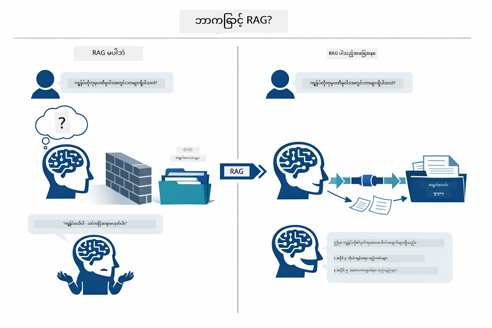

*ဒီပုံကြမ်းမှာ ပုံမှန် LLM (သင်ကြားမှုဒေတာမှ မျှော်လင့်ချက်မကြာခဏပေးသော) နှင့် RAG ဖြင့်တိုးမြှင့်ထားသော LLM (သင့်စာရွက်စာတမ်းများကို အရင်ကြည့်ရှုသော) ကြား ကွာဟချက်ကို ဖော်ပြထားသည်။*

ဒီအစိတ်အပိုင်းများသည် အသုံးပြုသူ၏ မေးခွန်းကို embedding, vector search, context assembly နှင့် answer generation အဆင့်လေးဆင့်ဖြင့် ဆက်သွယ်လျက်ရှိသည်။


*ဒီပုံကြမ်းသည် အဆုံးမှ စတင် RAG pipeline ကို ဖော်ပြထားသည် - အသုံးပြုသူ မေးခွန်းသည် embedding, vector search, context assembly နှင့် answer generation ဖြင့် ဆင်းသက်လျက်ရှိသည်။*

ဒီ module ၏ ဖော်ပြချက်များသည် အဆင့်တိုင်းအား ဖတ်ရှု၍ ပြင်ဆင်နိုင်သည့် ကုဒ်နှင့်အတူ အသေးစိတ်ရှင်းပြပါသည်။

### Which RAG Approach Does This Tutorial Use?

LangChain4j သည် RAG ကို အမျိုးမျိုးသော abstraction အဆင့်ထား သုံးမျိုးဖြင့် လုပ်ဆောင်နိုင်သည်။ အောက်ပါပုံကြမ်းသည် ထိုသုံးမျိုးကို ခြားနားချက်နှင့်အတူ ဖော်ပြထားသည်။

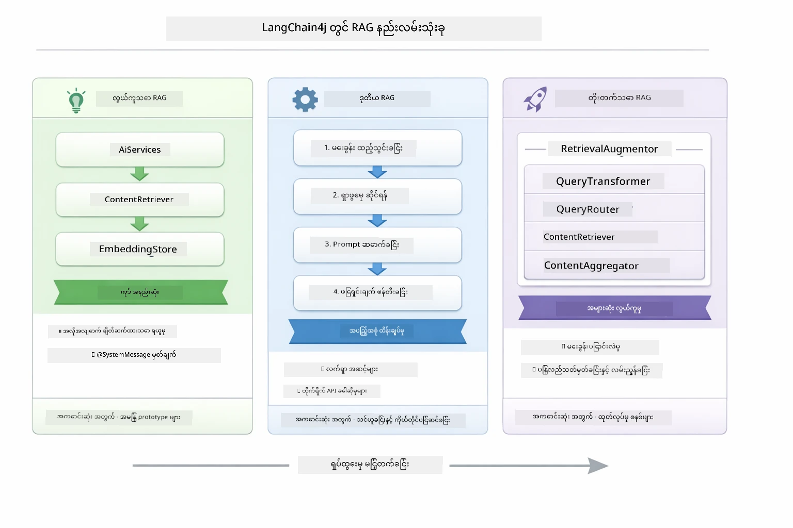

*ဒီပုံကြမ်းသည် LangChain4j တွင်ရှိသော Easy, Native, နှင့် Advanced RAG နည်းလမ်းသုံးမျိုး၏ အဓိကအစိတ်အပိုင်းများနှင့် အသုံးပြုသင့်သောအချိန်များကို နှိုင်းယှဉ်ပြထားသည်။*

| နည်းလမ်း | ၎င်း၏အလုပ်လုပ်ပုံ | ကန့်သတ်ချက် |
|---|---|---|
| **Easy RAG** | `AiServices` နှင့် `ContentRetriever` မှတဆင့် အားလုံးကို အလိုအလျောက် ချိတ်ဆက်ပေးသည်။ interface တစ်ခုကို မှတ်သားပြီး retriever တစ်ခုကို ပူးတွဲ၍ LangChain4j သည် embedding, ရှာဖွေမှု၊ နှင့် prompt ဖွဲ့စည်းမှုကို ကိုင်တွယ်ပေးသည်။ | ကုဒ်နည်းပါးသော်လည်း အဆင့်တိုင်းကို မမြင်ရ။ |
| **Native RAG** | မေးခွန်း embedding ကို ခေါ်ယူ၊ စတိုးကို ရှာ၊ prompt ဖွဲ့စည်း၊ နှင့် ဖြေကြားချက်ကို ကိုယ်တိုင် ထုတ်ပေးမည်။ | ကုဒ်ပိုရေပေမယ့် အဆင့်တိုင်းတွေ့နိုင်ပြီး ပြင်ဆင်နိုင်သည်။ |
| **Advanced RAG** | `RetrievalAugmentor` framework ကို အသုံးပြု၍ query transformers, routers, re-rankers, နှင့် content injectors ကို ပလပ်ဂင်ဖြင့် ထည့်သွင်းနိုင်သော ထုတ်လုပ်မှုအဆင့် pipeline များ။ | အဆင့်မြင့် လွတ်လပ်မှု၊ သို့သော် အလွန်ရှုပ်ထွေးမှု။ |

**ဒီ သင်ခန်းစာသည် Native နည်းလမ်းကို အသုံးပြုသည်။** RAG pipeline ၏ အဆင့်တိုင်း - query embedding, vector စတိုးရှာဖွေခြင်း, context ဖွဲ့စည်းခြင်း, နှင့် ဖြေကြားခြင်းကို `RagService.java` ထဲတွင် အတိအကျရေးသားထားသည်။ ဒီဟာသည် သင်ယူရန် ရည်ရွယ်ချက်ဖြစ်၍ အဆင့်တိုင်းကို မြင်တွေ့လွယ်ကူစေရန် ဖြစ်သည်။ နောက်ပိုင်းတွင် Easy RAG သို့မဟုတ် Advanced RAG အဆင့်သို့ တိုးတက် လေ့လာနိုင်ပါသည်။

> **💡 Easy RAG ကို ကြည့်ခဲ့ပြီလား?** [Quick Start module](../00-quick-start/README.md) တွင် Document Q&A ဥပမာ ([`SimpleReaderDemo.java`](../../../00-quick-start/src/main/java/com/example/langchain4j/quickstart/SimpleReaderDemo.java)) သည် Easy RAG နည်းလမ်းကို အသုံးပြုထားပြီး LangChain4j သည် embedding, ရှာဖွေမှု၊ နှင့် prompt ဖန်တီးမှုကို အလိုအလျောက် ကိုင်တွယ်ပေးသည်။ ဒီ module သည် pipeline ကို ဖွင့်၍ အဆင့်တိုင်းကို ကိုယ်တိုင်ကြည့်ရှု နိုင်စေရန် တိုးတက်ခဲ့သည်။

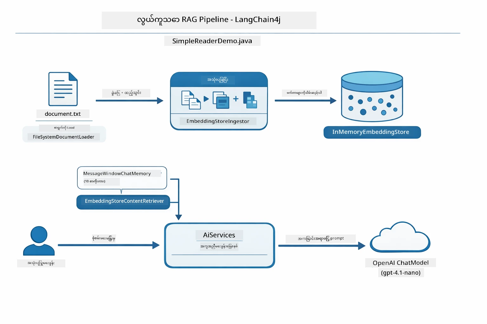

*ဒီပုံကြမ်းသည် `SimpleReaderDemo.java` မှ Easy RAG pipeline ကိုဖော်ပြသည်။ ဒီ module တွင်အသုံးပြုထားသော Native နည်းလမ်းနှင့် နှိုင်းယှဉ်ပါ။ Easy RAG သည် embedding, retrieval နှင့် prompt ဖန်တီးမှုကို `AiServices` နှင့် `ContentRetriever` ရှေ့တွင်ဖုံးကွယ်ထားသည်။ သင်များမှာ စာရွက်တစ်ရွက်ကို ထည့်ပြီး retriever တစ်ခု ချိတ်ဆက်ပြီး ဖြေရှင်းချက်ရရောက်နိုင်သည်။ Native နည်းလမ်းတွင် အဆင့်တိုင်းကို ထုတ်ဖော်၍ ကိုယ်တိုင် အုပ်ချုပ်ပြင်ဆင်နိုင်သည်။*

## How It Works

ဒီ module ၏ RAG pipeline သည် အသုံးပြုသူမေးခွန်းတိုင်းအတွက် အဆင့်လေးဆင့် ကို အဆက်မပြတ် လည်ပတ်သည်။ ပထမ ဦးစွာ စာရွက်စာတမ်းတင်ခဲ့သည်ကို **ခွဲထုတ်ပြီး ခြစ်များ** (chunk) အဖြစ် လုပ်ဆောင်သည်။ ခြစ်များကို **vector embedding** သို့ပြောင်းလဲ၍ သင်္ချာဆန်သော ကွာခြားချက်များဖြင့် ပြိုင်ဘက်စစ်ဆေးနိုင်ရန် သိမ်းဆည်းသည်။ မေးခွန်းတင်သည့်အခါတွင် စနစ်သည် **semantic search** ဖြင့်ဆက်စပ်မှုအမြင့်ဆုံး ခြစ်များ ရှာဖွေပြီး နောက်ဆုံးတွင် LLM ထံ context အဖြစ် ပေးပို့၍ **ဖြေကျိုင်းပေးသည်**။ အောက်တွင် အဆင့်တိုင်း၏ ကုဒ်နှင့် ပုံကြမ်းများဖြင့်ရှင်းပြထားသည်။ ပထမအဆင့်ကို ကြည့်ပါ့စို့။

### Document Processing

[DocumentService.java](../../../03-rag/src/main/java/com/example/langchain4j/rag/service/DocumentService.java)

စာရွက်စာတမ်းတင်လိုက်သည်နှင့် စနစ်သည် ၎င်းကို (PDF သို့မဟုတ် ရိုးရှင်းသော စာသား) စစ်ဆေးပြီး ဖိုင်နာမည် ကဲ့သို့သော metadata တွေ ထည့်သွင်း၍ ခြစ်များသို့ ခွဲထုတ်သည်။ ခြစ်များသည် မော်ဒယ်၏ context window ထဲသို့ အဆင်ပြေစေရန် အရွယ်အစားသေးငယ်ပြီး အနည်းငယ်ထပ်လောင်း၍ ချိတ်ဆက်မှု မပျက်စီးစေပါ။

```java
// တင်ပြထားသောဖိုင်ကိုဗျူဟာချပြီး LangChain4j Document ထဲသို့ထည့်ပါ
Document document = Document.from(content, metadata);

// 300-token အပိုင်းခွဲပြီး 30-token အလွှာတစ်ခုဖြင့်ခွဲထုတ်ပါ
DocumentSplitter splitter = DocumentSplitters
    .recursive(300, 30);

List<TextSegment> segments = splitter.split(document);
```


အောက်ပါ ပုံကြမ်းသည် ၎င်း၏ visual ပြပုံဖြစ်သည်။ ခြစ်တစ်ခုချင်းစီသည် နီးကပ်ရာခြစ်နှင့် token များအား နည်းနည်း မျှဝေလျက်ရှိသည်။ ၃၀ token overlap သည် အရေးပါသော context မပျောက်ဆီးစေရန် သေချာစေသည်။

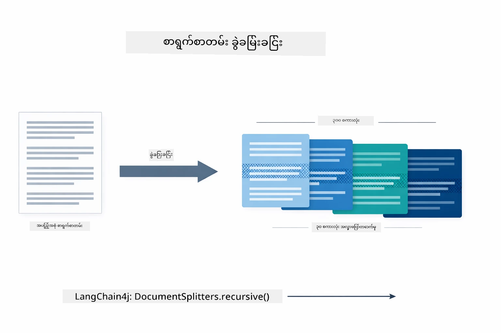

*ဒီပုံကြမ်းသည် စာရွက်စာတမ်းကို ၃၀ token overlap ပါရှိသော ၃၀၀ token ခြစ်များအဖြစ်ခွဲခြားသော ပုံဖြစ်ပြီး ခြစ်များအကြား context မပျောက်စီးစေရန် သေချာသည်။*

> **🤖 [GitHub Copilot](https://github.com/features/copilot) Chat ဖြင့် ကြိုးစားကြည့်ပါ။** [`DocumentService.java`](../../../03-rag/src/main/java/com/example/langchain4j/rag/service/DocumentService.java) ဖိုင်ကို ဖွင့်၍ မေးနိုင်သည် -
> - "LangChain4j သည် စာရွက်စာတမ်းများကို ဘယ်လို ခြစ်ခွဲသနည်း။ overlap ရှိခြင်း၏ အရေးပါတော့မှာ ဘာလဲ?"
> - "မတူညီသောစာရွက်စာတမ်းအမျိုးအစားများအတွက် အကောင်းဆုံး ခြစ်အရွယ်အစား ဘယ်လို သတ်မှတ်ရလဲ၊ အကြောင်းရှင်းပြပါ။"
> - "ဘာသာစကားအမျိုးမျိုး သို့မဟုတ် ဖော်မတ် အထူးပြုထားသော စာရွက်များကို ဘယ်လို ကိုင်တွယ်ရမလဲ?"

### Creating Embeddings

[LangChainRagConfig.java](../../../03-rag/src/main/java/com/example/langchain4j/rag/config/LangChainRagConfig.java)

ခြစ်တစ်ခုချင်းစီကို မျဉ်းကြောင်းနံပါတ်များဖြင့် ဖော်ပြသည့် embedding အဖြစ် ပြောင်းလဲသည်။ embedding မော်ဒယ်သည် chat မော်ဒယ်ကဲ့သို့ ထင်မြင်မှု၊ သဘောထား၊ သို့မဟုတ် မေးခွန်းများကို ဖြေဆိုရန် မရနိုင်သော်လည်း၊ စာသားများကို ဆင်တူသည်များ နီးစပ်ရာ သင်္ချာဆန်သော နေရာတစ်ခုသို့ ထားရှိပေးသည်။ "ကား" သည် "အော်တိုမိုဘိုင်း"ရှေ့ ညီသော အနေဖြင့် သို့မဟုတ် "ပြန်အမ်းမူဝါဒ" နှင့် "ငွေပြန်ပေးပို့မှု" သည် စာတန်းဖြင့် နီးစပ်ရာမျှသာ သွားရာ embedding ဖြစ်သည်။ chat မော်ဒယ်သည် စကားပြောသူတစ်ဦးကဲ့သို့ဖြစ်သည်၊ embedding မော်ဒယ်သည် စနစ်တကျ စီမံခန့်ခွဲမှု စနစ်ကဲ့သို့ဖြစ်သည်။

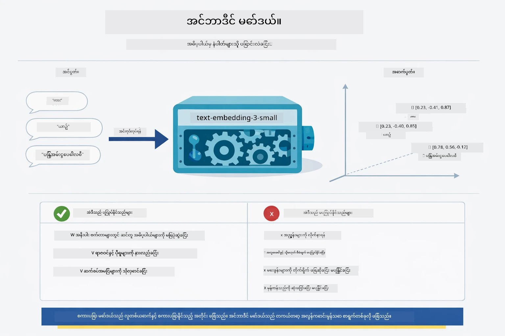

*ဒီပုံကြမ်းတွင် embedding မော်ဒယ်သည် စာသားကို နံပါတ် vector များအဖြစ် ပြောင်းလဲပြီး၊ "ကား" နှင့် "အော်တိုမိုဘိုင်း" ကဲ့သို့ ဆင်တူသော အဓိပ္ပါယ်များကို vector နေရာတွင် နီးစပ်စေသည်။*

```java
@Bean
public EmbeddingModel embeddingModel() {
    return OpenAiOfficialEmbeddingModel.builder()
        .baseUrl(azureOpenAiEndpoint)
        .apiKey(azureOpenAiKey)
        .modelName(azureEmbeddingDeploymentName)
        .build();
}

EmbeddingStore<TextSegment> embeddingStore = 
    new InMemoryEmbeddingStore<>();
```


အောက်ပါ class diagram သည် RAG pipeline တွင် ရှိသော နှစ်မျိုးသော ညွှန်ကြားမှုလမ်းကြောင်းများနှင့် LangChain4j class များကို ဖော်ပြသည်။ **ingestion flow** သည် စာရွက်ကို ခွဲထုတ်၍ ခြစ်များကို embed ပြီး `.addAll()` မှတဆင့် သိမ်းဆည်းခြင်းကို တစ်ကြိမ်သာ လုပ်ဆောင်သည်။ **query flow** သည် အသုံးပြုသူမေးခွန်းတင်တိုင်း embedding ပြုလုပ်၍ `.search()` မှတဆင့် စတိုးကို ရှာ၍ သက်ဆိုင်ရာ context ကို chat မော်ဒယ်သို့ ပေးပို့သည်။ နှစ်ခုစလုံးသည် `EmbeddingStore<TextSegment>` interface တွင် တွယ်ဆက်ကြသည်။

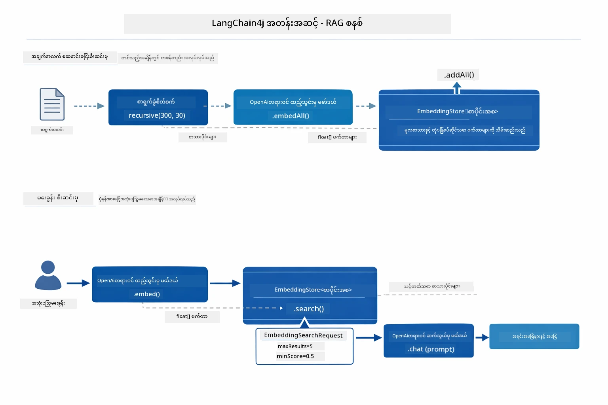

*ဒီပုံကြမ်းသည် RAG pipeline ၏ ingestion နှင့် query လမ်းကြောင်းနှင့် EmbeddingStore ဖြင့် ချိတ်ဆက်မှုကို ဖော်ပြသည်။*

embedding များ သိမ်းဆည်းပြီးလျှင် ဆင်တူသည့် အကြောင်းအရာများသည် ဤ vector နေရာတွင် စုပေါင်း နီးကပ်လာသည်။ အောက်ပါ ရုပ်ပုံသည် ဆက်စပ်ဝေါဟာရများ ပါဝင်သော စာရွက်စာတမ်းများသည် ၃D vector နေရာတွင် နီးစပ်နေသည့် ပုံစံကို ဖော်ပြသည်၊ ၎င်းသည် semantic search လုပ်ခြင်းကို ဖြစ်နိုင်စေသည်။


*ဒီ visualization သည် ဆက်စပ်ခေါင်းစဉ်များဖြင့် သက်ဆိုင်ရာ စာရွက်စာတမ်းများသည် 3D vector နေရာတွင် သီးခြားအုပ်စုများဖွဲ့နေပါသည် (Technical Docs, Business Rules, FAQs)။*

အသုံးပြုသူတစ်ဦး ရှာဖွေရန်လျှင် စနစ်သည် လေးဆင့် အောက်ပါအတိုင်း လုပ်ဆောင်သည် - စာရွက်စာတမ်းများကို တစ်ကြိမ် embed ပြုလုပ်ခြင်း၊ မေးခွန်းကို ရှာဖွေရန် အစဉ်တိုင်း embed ပြုလုပ်ခြင်း၊ cosine similarity ဖြင့် စုစည်းထားသော vectors နှင့် မေးခွန်း vector ကို နှိုင်းယှဉ်ခြင်း၊ အကောင်းဆုံး top-K ခြစ်များကို ပြန်လည်ထုတ်ပေးခြင်း။ အောက်ပါ ပုံကြမ်းသည် အဆင့်တိုင်းနှင့် ပါဝင်တဲ့ LangChain4j class များကို ဖော်ပြထားသည်။

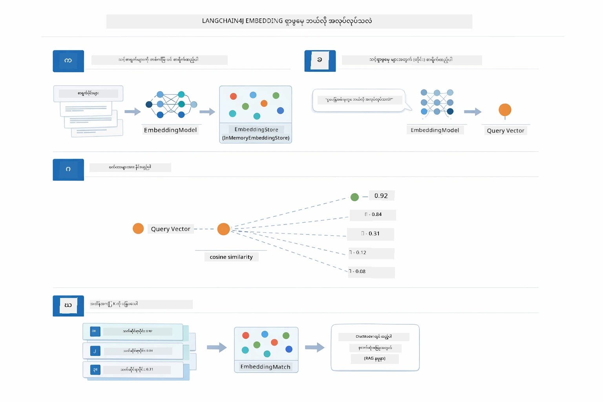

*ဒီပုံကြမ်းသည် embedding ရှာဖွေရေး လုပ်ငန်းစဉ် လေးဆင့်အား ဖော်ပြသည် - စာရွက်ထဲကို embed၊ မေးခွန်းကို embed၊ cosine similarity ဖြင့် နှိုင်းယှဉ်၊ နောက်ဆုံးတွင် top-K ရလဒ်ကို ပြန်ပေးပို့ခြင်း။*

### Semantic Search

[RagService.java](../../../03-rag/src/main/java/com/example/langchain4j/rag/service/RagService.java)

မေးခွန်းတစ်ခုမေးလိုက်သောအခါ မေးခွန်းကိုလည်း embedding အဖြစ် ပြောင်းသည်။ စနစ်သည် မေးခွန်း၏ embedding နှင့် စာရွက်စာတမ်း ခြစ်များ၏ embedding များအားလုံးကို နှိုင်းယှဉ်သည်။ အဓိပ္ပါယ်နှင့် အညီ ဆင်တူသော ခြစ်တွေကို ရှာဖွေသည် - စကားလုံးတူမှု မဟုတ်ပဲ စာဆိုလိုသည်အတိုင်း ဆင်တူမှု။

```java
Embedding queryEmbedding = embeddingModel.embed(question).content();

EmbeddingSearchRequest searchRequest = EmbeddingSearchRequest.builder()
    .queryEmbedding(queryEmbedding)
    .maxResults(5)
    .minScore(0.5)
    .build();

EmbeddingSearchResult<TextSegment> searchResult = embeddingStore.search(searchRequest);
List<EmbeddingMatch<TextSegment>> matches = searchResult.matches();

for (EmbeddingMatch<TextSegment> match : matches) {
    String relevantText = match.embedded().text();
    double score = match.score();
}
```


အောက်ပါ ပုံကြမ်းသည် semantic search နှင့် keyword search ဖြစ်စဉ်ကို နှိုင်းယှဉ်ထားသည်။ "vehicle" ဟူသော keyword ရှာဖွေမှုသည် "cars and trucks" ပါသော ခြစ်တစ်ခုကို မတွေ့ရှိနိုင်သော်လည်း semantic search သည် ၎င်းတို့သည် အဓိပ္ပါယ်တူကြောင်းနားလည်၍ ထို ခြစ်ကို အဆင့်မြင့်စွာ ပြန်လည်ပြထားသည်။

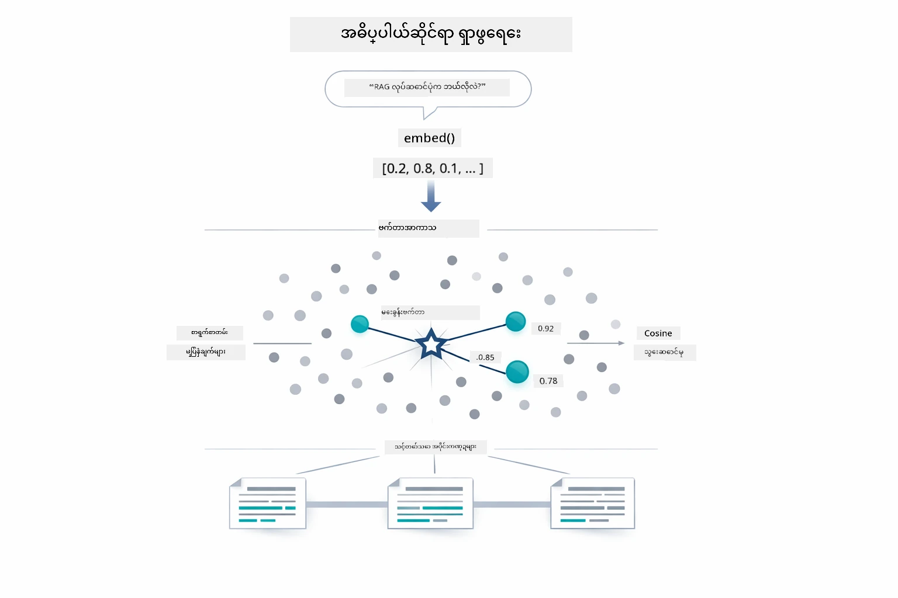

*ဒီပုံကြမ်းသည် keyword आधारित ရှာဖွေမှုနှင့် semantic ရှာဖွေမှုကို နှိုင်းယှဉ်ထားပြီး keyword မတူသော်လည်း အဓိပ္ပါယ်ဆင်တူမှုရှိသော အကြောင်းအရာများကို semantic search က ဆွဲယူပေးသည်။*

တစ်ခြားတည်း cosine similarity ဖြင့် ဆင်တူမှုကို တိုင်းတာသည် - "ဤစဉ်းစားမှုသည် တဆက်တည်း ညီနေသည့် နှစ်ခုသော ဦးဆောင် တွက်ကြားလမ်း နှင့်တူညီသလား?" မျိုးဖြစ်သည်။ နှစ်ခြစ်သည် စကားလုံးကွဲပြားနိုင်သော်လည်း အဓိပ္ပါယ်တူ၍ vector များသည် ညီညွတ်လျှင် ၁.၀ နီးပါး အဆင့်သတ်မှတ်ချက်ရသည်။

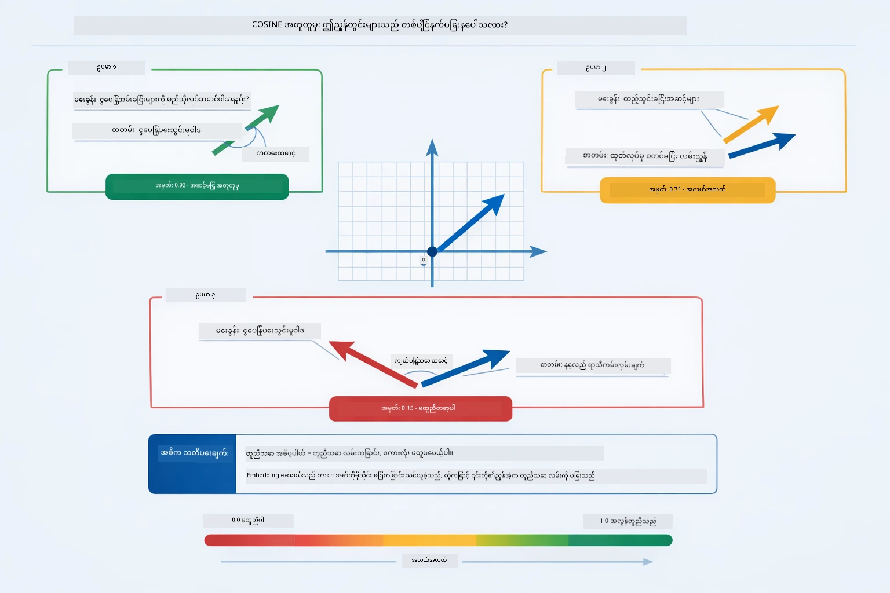

*ဒီပုံကြမ်းသည် embedding vectors အကြား ကွာထွက်ရာထူးသည် cosine similarity သို့ ဆူညံချက်angle အနေဖြင့် အကြောင်းဖော်ပြသည် — vectors များကို မျှတစွာညီညွတ်သည်ဖြင့် အဆင့်သတ်မှတ်ချက် ၁.၀ ခန့်ရသည်၊ semantic similarity များများကြောင်း ပြသသည်။*
> **🤖 [GitHub Copilot](https://github.com/features/copilot) Chat ဖြင့် သုံးကြည့်ပါ:** [`RagService.java`](../../../03-rag/src/main/java/com/example/langchain4j/rag/service/RagService.java) ဖိုင်ကိုဖွင့်ပြီးမေးမြန်းပါ -
> - "Embedding များနှင့် similarity search မည်သို့လုပ်ဆောင်ပြီး score ကို ဘယ်အရာများဆုံးဖြတ်သန့်သလဲ?"
> - "Similarity threshold ကို ဘယ်အတိုင်း သုံးသင့်ပြီး ရလဒ်များကို ဘယ်လိုထိခိုက်စေသလဲ?"
> - "သက်ဆိုင်ရာစာရွက်စာတမ်း မတွေ့ရသောအခါ မည်သို့ကိုင်တွယ်ကြမလဲ?"

### ဖြေကြောင်းထုတ်ပေးခြင်း

[RagService.java](../../../03-rag/src/main/java/com/example/langchain4j/rag/service/RagService.java)

အလွန်ဆက်စပ်သော chunk များကို တိတိကျကျညွှန်ကြားချက်များ၊ ရှာဖွေမှု context နှင့် အသုံးပြုသူ၏မေးခွန်းတို့ ပါဝင်သော ဖွဲ့စည်းထားသော prompt တစ်ခုအဖြစ် စုစည်းတင်ပြသည်။ မော်ဒယ်သည် ထိုတိကျသည့် chunk များကိုသာ ဖတ်၍ အဆိုပါသတင်းအချက်အလက်အပေါ်ကို အခြေခံကာ ပြန်လည်ဖြေကြားပေးသည် — သူ၌ ရှိပြီးသားသာ အသုံးပြုနိုင်၍ hallucination ဖြစ်နှောင့်နှေးခြင်းကိုတားဆီးပေးသည်။

```java
String context = matches.stream()
    .map(match -> match.embedded().text())
    .collect(Collectors.joining("\n\n"));

String prompt = String.format("""
    Answer the question based on the following context.
    If the answer cannot be found in the context, say so.

    Context:
    %s

    Question: %s

    Answer:""", context, request.question());

String answer = chatModel.chat(prompt);
```

အောက်ပါပုံတွင် ဤပစ္စည်းစုပုံကို ပြသထားသည် — ရှာဖွေရေးအဆင့်မှ ထိပ်တန်းအမှတ်ရသော chunk များကို prompt template တွင် ထည့်သွင်းပြီး `OpenAiOfficialChatModel` သည် တည်ငြိမ်သောဖြေကြောင်းတစ်ခု ထုတ်ပေးသည်။

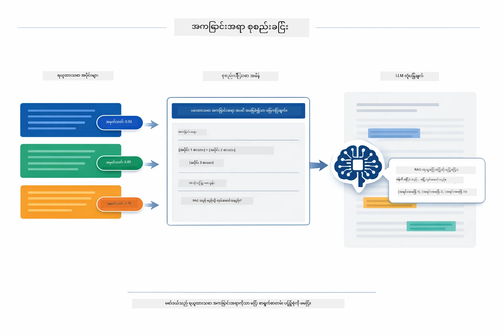

*ဤပုံစံသည် ထိပ်တန်းအမှတ်ရ chunk များကို ဖွဲ့စည်းထားသော prompt သို့ စုပေါင်းပြုလုပ်ခြင်းကို ပုံချုပ်ပြသထားပြီး သင့်ဒေတာမှ မော်ဒယ်အနေဖြင့် တည်ငြိမ်သော ဖြေကြောင်း ထုတ်ပေးနိုင်မှုကို ပြသသည်။*

## အပလီကေးရှင်းကို စတင်ရန်

**တင်သွင်းမှုကို စစ်ဆေးပါ:**

Root directory တွင် `.env` ဖိုင်ရှိပြီး Azure အတည်ပြုချက်များပါရှိမည် (Module 01 အတွင်း ဖန်တီးထားသည်) ကို သေချာစေပါ။

**Bash:**
```bash
cat ../.env  # AZURE_OPENAI_ENDPOINT, API_KEY, DEPLOYMENT ကို ပြသသင့်သည်။
```

**PowerShell:**
```powershell
Get-Content ..\.env  # AZURE_OPENAI_ENDPOINT, API_KEY, DEPLOYMENT ကိုပြရန်လိုသည်
```

**အပလီကေးရှင်း စတင်ခြင်း:**

> **မှတ်ချက်။** Module 01 မှ `./start-all.sh` ဖြင့် အားလုံး စတင်ထားပြီးဖြစ်ပါက ဒီ module သည် port 8081 ပေါ်၌ အလုပ်လုပ်နေပါသည်။ အောက်ပါ စတင်ကမ်းမံချက်များကို ကျော်လွှားပြီး http://localhost:8081 သို့ တိုက်ရိုက် သွားရောက်နိုင်ပါသည်။

**ရွေးချယ်မှု ၁: Spring Boot Dashboard သုံးခြင်း (VS Code အသုံးပြုသူများအတွက် အကြံပြုချက်)**

Dev container တွင် Spring Boot Dashboard extension ပါဝင်ပြီး စမတ်နည်းဖြင့် Spring Boot application များအား စီမံခန့်ခွဲရရှိနိုင်သော မျက်နှာပြင် ပေးသည်။ VS Code ၏ ဘယ်ဘက် Activity Bar တွင် Spring Boot icon ကို ရှာဖွေနိုင်သည်။

Spring Boot Dashboard မှ:
- လက်ရှိ workspace တွင် ရှိသော Spring Boot application များအား စုစည်းကြည့်ရှုနိုင်သည်
- အပလီကေးရှင်းများကို တစ်ချက်နှိပ်၍ စတင်/ပိတ်နိုင်သည်
- အက်ပလီကေးရှင်း log များကို အချိန်နောက်ကျမိတ်ဆက်ကြည့်ရှုနိုင်သည်
- အခြေအနေ များကို ကြည့်ရှု စောင့်ကြည့်နိုင်သည်

"rag" ရှေ့ရှိ play ခလုတ်ကို နှိပ်ပြီး ဒီ module ကို စတင်နိုင်သလို module အားလုံးကို တပြိုင်နက် စတင်နိုင်ပါသည်။


*ဤ screenshot သည် VS Code အတွင်း Spring Boot Dashboard ကို ပြသပြီး အပလီကေးရှင်းများကို စတင်, ပိတ်, စောင့်ကြည့်နိုင်မှုကို မြင်သာစေသည်။*

**ရွေးချယ်မှု ၂: shell script များ သုံးခြင်း**

Web applications အားလုံးစတင်ရန် (module 01 ကနေ 04):

**Bash:**
```bash
cd ..  # အမှတ်တံဆိပ် ဒါရိုက်ထရီမှ
./start-all.sh
```

**PowerShell:**
```powershell
cd ..  # root ဖုိလ္ဒါမွ
.\start-all.ps1
```

ဒါမှမဟုတ် ဒီ module ကို သာ စတင်ရန်:

**Bash:**
```bash
cd 03-rag
./start.sh
```

**PowerShell:**
```powershell
cd 03-rag
.\start.ps1
```

스크립트 နှစ်ခုလုံးတွင် root `.env` ဖိုင်မှ ပတ်ဝန်းကျင်အချက်အလက်များကို မော်တော် မောင်းအားဖြင့် သွင်းယူပြီး JAR ဖိုင် မရှိပါက ဆောက်လုပ်ပေးပါမည်။

> **မှတ်ချက်။** စတင်ခန်းမစတင်မီ module အားလုံးကို လက်ဖြင့် ဆောက်လုပ်လိုပါက:
>
> **Bash:**
> ```bash
> cd ..  # Go to root directory
> mvn clean package -DskipTests
> ```
>
> **PowerShell:**
> ```powershell
> cd ..  # Go to root directory
> mvn clean package -DskipTests
> ```

http://localhost:8081 ကို browser တွင်ဖွင့်ပါ။

**ရပ်ရန်:**

**Bash:**
```bash
./stop.sh  # ဤမော်ဂျူးလ်သာ
# သို့မဟုတ်
cd .. && ./stop-all.sh  # မော်ဂျူးလ်အားလုံး
```

**PowerShell:**
```powershell
.\stop.ps1  # ဒီမော်ဒျူးမတိုင်မှီ
# သို့မဟုတ်
cd ..; .\stop-all.ps1  # မော်ဒျူးအားလုံး
```

## အပလီကေးရှင်းကို သုံးခြင်း

အပလီကေးရှင်းသည် စာရွက်စာတမ်း တင်သွင်းခြင်းနှင့် မေးမြန်းခြင်းအတွက် ဝဘ်မိတ်ဖက်ကို ပေးသည်။

<a href="images/rag-homepage.png"></a>

*ဤ screenshot သည် သင့်အား စာရွက်စာတမ်းများတင်ပြီး မေးခွန်းများမေးနိုင်သည့် RAG application မျက်နှာပြင်ကို ပြသသည်။*

### စာရွက်စာတမ်း တင်ပါ

TXT ဖိုင်များသည် စမ်းသပ်ရန်အတွက် အကောင်းဆုံးဖြစ်သည်။ ဒီ directory တွင် LangChain4j အင်္ဂါရပ်များ၊ RAG အသုံးချခြင်းနှင့် အကောင်းဆုံးနည်းလမ်းများ ပါရှိသော `sample-document.txt` များ ပါဝင်သည်။ စနစ်သည် စာရွက်စာတမ်းကို ခွဲခြမ်းစိတ်ဖြာ၍ တစ်ခုချင်း chunks များ သို့ဖြတ်လိုက်ပြီး chunk တစ်ခုချင်းစီအတွက် embedding များ ဖန်တီးပေးသည်။ သင့်တင်သွင်းခြင်းဖြင့် အလိုအလျောက် ဖြစ်ပေါ်သည်။

### မေးခွန်း မေးပါ

ယခု စာရွက်စာတမ်းအကြောင်း အထူးသတ်မှတ်များ သို့မဟုတ် သတင်းအချက်အလက် တိတိကျကျကို မေးမြန်းကြည့်ပါ။ စနစ်သည် သက်ဆိုင်ရာ chunk များ ရှာဖွေ၍ prompt တွင် ထည့်သွင်းပြီး ဖြေကြောင်းထုတ်ပေးသည်။

### အခြေခံ ဆောင်းပါးများစစ်ဆေးပါ

ဖြေကြောင်းတိုင်းတွင် similarity score နှင့် အရင်းအမြစ်အား ပြထားသော အညွှန်းများ ပါဝင်သည်။ အဆိုပါ score များ (0 မှ 1 အထိ) သည် မေးခွန်းနှင့် နှိုင်းယှဉ်မှုကို ဖော်ပြပြီး score မြင့်သည်နှင့် မေးခွန်းနှင့် အတူညီမှု၊ ဆက်စပ်မှု ကောင်းမွန်ကြောင်း ဆိုလိုသည်။ ဤကိစ္စသည် မေးခွန်း၏ ဖြေကြောင်း အတည်ပြုမှုအတွက် အထောက်အထား ဖြစ်စေသည်။

<a href="images/rag-query-results.png"></a>

*ဤ screenshot သည် မေးခွန်း ရလဒ်များ၊ ထုတ်ပေးသော ဖြေကြောင်း၊ အရင်းအမြစ်များနှင့် ထုတ်ပြန်ထိုက် chunk များအား သက်ဆိုင်ရာ ဆက်စပ်မှုအမှတ်များပါ ပြသသည်။*

### မေးခွန်းများဖြင့် စမ်းသပ်ပါ

မေးခွန်းအမျိုးအစား အမျိုးမျိုးကို စမ်းကြည့်ပါ -
- သီးခြား သတင်းအချက်များ: "အဓိကခေါင်းစဉ်သည် ဘာလဲ?"
- နှိုင်းယှဉ်ချက်များ: "X နှင့် Y ထဲက အနည်းငယ်ကွဲပြားချက် ဘာလဲ?"
- အနှစ်ချုပ်များ: "Z အကြောင်း အချက်အလက်အဓိကများကို အနှစ်ချုပ်ပါ"

မေးခွန်းနှင့် စာရွက်အကြောင်းအရာ ဆက်စပ်မှုအပေါ် မူတည်၍ relevance score များ ပြောင်းလဲမှုကို ကြည့်ရှုနိုင်ပါသည်။

## အဓိက သဘောတရားများ

### Chunking မျိုးစံ

စာရွက်စာတမ်းများကို ၃၀၀ token အလျား chunk များအဖြစ် ခွဲခြားပြီး ၃၀ token အထပ် overlap ပါရှိသည်။ ၎င်းသည် chunk တစ်ခုစီမှာ အဓိက Context ရှိစေနိုင်ပြီး prompt တွင် အများအပြား chunks ထည့်သွင်း ညှိနှိုင်းနိုင်စေရန် မျှတမှု ဖြစ်လာသည်။

### Similarity Score များ

ရရှိသော chunk များအားလုံးသည် 0 မှ 1 အတွင်း similarity score တစ်ခုလည်း ရရှိပြီး မေးခွန်းနှင့် ဘယ်လောက်နီးစပ်သလဲကို ဖော်ပြသည်။ အောက်ပါပုံသည် score အဆင့်များနှင့် စနစ်က ဤအဆင့်များကို မည်သို့ filter ရလဒ်တွင် အသုံးပြုသည်ကို ချိတ်ဆက် ပုံဖော်ထားသည်။

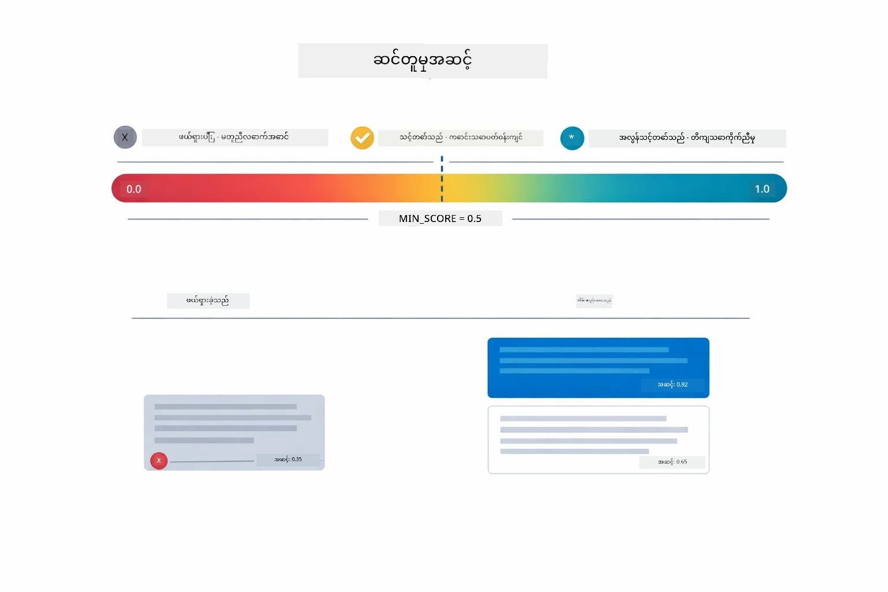

*ဤပုံသည် 0 မှ 1 အတွင်း score များ၊ 0.5 မီနီမမ် threshold ဖြင့် irrelevant chunk များကို ထုတ်ပယ်ထားခြင်းကို ပြသည်။*

Score များအတိုင်း -
- 0.7-1.0: အလွန်ဆက်စပ်ပြီး တိကျသောပုံစံ
- 0.5-0.7: ဆက်စပ်မှုရှိသော၊ Context ကောင်းမွန်သည့်
- 0.5 အောက်: ဖယ်ရှားခြင်း၊ မတူညီသော

စနစ်သည် minimum threshold အထက်ရှိသော chunk များကိုသာ ရှာသတင်းယူသည်မှာ အရည်အသွေးအာမခံပေးခြင်းဖြစ်သည်။

Embedding များသည် အဓိပ္ပါယ် အုပ်စုများကို အလင်းထင်ရှားစေ သော်လည်း ကန့်သတ်ချက်များ ရှိသည်။ အောက်ပါပုံသည် embedding ကျူးလွန်မှု မအောင်မြင်သည့် ရိုးရာတူများကို ဖော်ပြသည်- chunk ကြီးများသည် vector မိုဃ်းထူလာစေခြင်း၊ chunk အသေးများမှာ context မရှိခြင်း၊ ရှုပ်ထွေးသော စကားလုံးများသည် အုပ်စုများစွာကို ပြသည်၊ နှင့် တိတိကျကျ တွေ့ရှိမည့် လုပ်ဆောင်ချက်များ (ID များ၊ ပစ္စည်းနံပါတ်များ) သည် embedding များနှင့် မလည်ပတ်နိုင်။

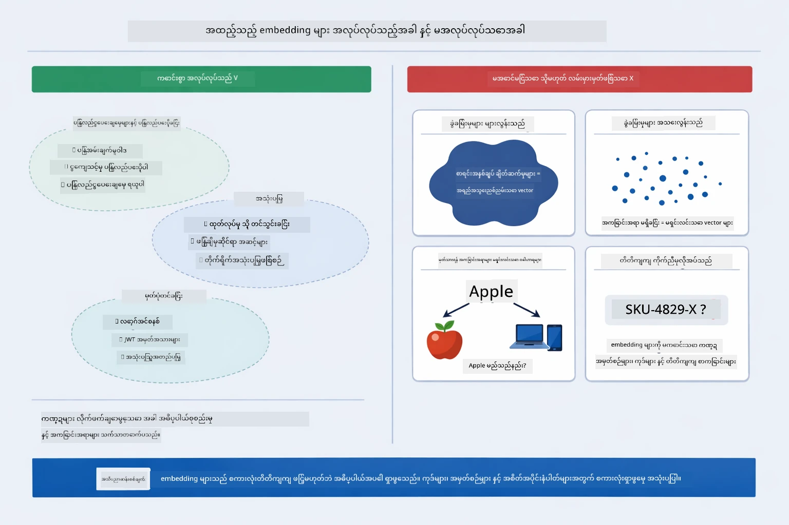

*ဤပုံသည် embedding မအောင်မြင်မှု အချို့ ပုံသဏ္ဌာန်များ ဖြစ်သော chunk ကြီးများ၊ chunk အသေးများ၊ ရှုပ်ထွေးသော စကားလုံးများနှင့် တိတိကျကျ တွေ့ရှိမှု မဟုတ်သော IDများကို ပြသသည်။*

### In-Memory Storage

ဤ module သည် ရိုးရှင်းသော ပြုပြင်မှုအတွက် in-memory storage ကို အသုံးပြုသည်။ အပလီကေးရှင်းကို ပြန်စတင်လိုက်သည့်အခါ၌ တင်ထားသောစာရွက်များ ပျောက်ဆုံးသွားမည်။ ထုတ်လုပ်ရေးတွင် Qdrant သို့မဟုတ် Azure AI Search ကဲ့သို့ persistent vector database များအသုံးပြုသည်။

### Context Window စီမံခန့်ခွဲမှု

မော်ဒယ် တစ်ခုစီတွင် အမြင့်ဆုံး context window ရှိသည်။ ကြီးမားသော စာရွက်မှ အားလုံး chunk များကို ပါဝင်ရန် မဖြစ်နိုင်။ စနစ်သည် အရေးပါတ်ဆုံး top N chunk များ (ပုံမှန် 5 ခု) ကို ရွေးထုတ်၍ ကန့်သတ်ချက်အတွင်းရှိစေနိုင်ပြီး မှန်ကန်သောဖြေကြောင်းများ ဖန်တီးရန် လုံလောက်သော context ပေးသည်။

## RAG အသုံးချသင့်သောအချိန်

RAG သည် အမြဲတမ်းမှန်ကန်သော နည်းလမ်း မဟုတ်ပါ။ အောက်ပါ ဆုံးဖြတ်ချက် ဗြူဟာက RAG ကွိုက်ဝိုက်တန်ဖိုးရှိသည့်အချိန်နှင့် ရိုးရှင်းသော နည်းလမ်းများ (content ကို prompt ထဲတွင် တိုက်ရိုက် ထည့်သောက်ခြင်း သို့မဟုတ် မော်ဒယ်၏ built-in knowledge ကို သုံ့ညပ်ခြင်း) လုံလောက်သည့်အချိန်တို့ကို သတ်မှတ်လိုက်သည်။

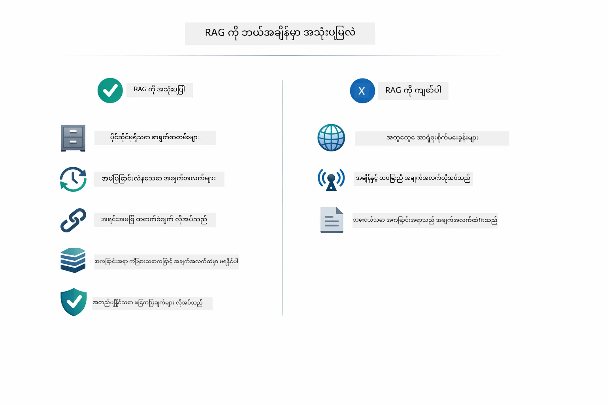

*ဤပုံသည် RAG အသုံးပြုသင့်မှုနှင့် ရိုးရှင်းသော နည်းလမ်းများ လုံလောက်သည့်အချိန်များကို ဆုံးဖြတ်ရန် လမ်းညွှန်ပုံ တစ်ခုကို ပြသသည်။*

**RAG ကို အသုံးပြုပါက:**
- ပိုင်ဆိုင်မှုရှိသော စာရွက်စာတမ်းများဆိုင်ရာ မေးခွန်းများကို ဖြေဆိုရာတွင်
- သတင်းအချက်အလက်များ မကြာခဏ ပြောင်းလဲသည့်အခါ (မူဝါဒများ၊ စျေးနှုန်းများ၊ သတ်မှတ်ချက်များ)
- တိကျမှန်ကန်မှုအတွက် အရင်းအမြစ်ကို သုံးသည့်အခါ
- အကြောင်းအရာ တစ်ခုလုံးကို တစ်ကြိမ်တည်း prompt တွင် ထည့်မရနိုင်သည့်အခါ
- စိစစ်မြင်သာပြီး တည်ငြိမ်သော ဖြေကြောင်းများ လိုအပ်သည့်အခါ

**RAG မသုံးသင့်သည့် အချိန်:**
- မေးခွန်းများသည် မော်ဒယ်အတွင်း သဟဇာတ အထောက်အထားရှိသော အရာများတွင်သာ မေးသည့်အခါ
- အချိန်နှင့်တပြေးညီ ဒေတာလိုအပ်သည် (RAG သည် တင်သွင်းထားသော စာရွက်စာတမ်းပေါ်တွင် အလုပ်လုပ်သည်)
- အကြောင်းအရာများကို prompt ထဲတွင် တိုက်ရိုက် ထည့်သွင်းနိုင်သည့်အတိုင်း ကျဉ်းမြောင်းသောအခါ

## နောက်တစ်ခြား အဆင့်များ

**နောက်ထပ် Module:** [04-tools - AI Agents with Tools](../04-tools/README.md)

---

**လမ်းညွှန်:** [← ယခင် Module 02 - Prompt Engineering](../02-prompt-engineering/README.md) | [အဓိကသို့ ပြန်သွားရန်](../README.md) | [နောက်တတ် Module 04 - Tools →](../04-tools/README.md)

---

<!-- CO-OP TRANSLATOR DISCLAIMER START -->
**အနုတ်လက္ခဏာ**  
ဤစာရွက်စာတမ်းကို AI ဘာသာပြန်ဝန်ဆောင်မှု [Co-op Translator](https://github.com/Azure/co-op-translator) အသုံးပြု၍ ဘာသာပြန်ထားပါသည်။ တိကျမှုအတွက် ကြိုးစားပေမယ့် အလိုအလျောက် ဘာသာပြန်ချက်များတွင် အမှားများ သို့မဟုတ် တိကျမှုမရှိနိုင်မှုများ ရှိနိုင်ပါကြောင်း သိရှိ ဂရုစိုက်ပါ။ မူလစာရွက်စာတမ်းသည် မူရင်းဘာသာဖြင့်သာ ခိုင်မာသော အချက်အလက်အရင်းအမြစ်အဖြစ် သတ်မှတ်သင့်ပါသည်။ အရေးကြီးသော အချက်အလက်များအတွက်တော့ လူ့ဘာသာပြန်ပညာရှင်များ၏ လူကြီးမင်းအတည်ပြု ဘာသာပြန်မှုကို အကြံပြုပါသည်။ ဤဘာသာပြန်ချက်ကို အသုံးပြုမှုကြောင့် ဖြစ်ပေါ်လာသော နားလည်မှုမှားယွင်းခြင်း သို့မဟုတ် မှားထင်မှားယွင်းခြင်းများအတွက် ကျနော်တို့မှ တာဝန်မယူပါ။
<!-- CO-OP TRANSLATOR DISCLAIMER END -->