# Module 04: ကိရိယာများနှင့်အတူ AI ကိုယ်စားလှယ်များ

## အကြောင်းအရာဇယား

- [သင်ဘာတွေ သင်ယူမလဲ](../../../04-tools)
- [လိုအပ်ချက်များ](../../../04-tools)
- [ကိရိယာများနှင့် AI ကိုယ်စားလှယ်များကို နားလည်ခြင်း](../../../04-tools)
- [ကိရိယာခေါ်ယူမှုလုပ်ပုံ](../../../04-tools)
  - [ကိရိယာဖော်ပြချက်များ](../../../04-tools)
  - [ဆုံးဖြတ်ချက်ချခြင်း](../../../04-tools)
  - [အကောင်အထည်ဖော်ခြင်း](../../../04-tools)
  - [တုံ့ပြန်ချက် တောင်းပန်မှု](../../../04-tools)
  - [စိတ်ခြမ်း: Spring Boot အလိုအလျှောက်ချိတ်ဆက်မှု](../../../04-tools)
- [ကိရိယာချိတ်ဆက်မှု](../../../04-tools)
- [လျှောက်ထားမှုကို အလုပ်လုပ်ဆောင်ခြင်း](../../../04-tools)
- [လျှောက်ထားမှုကိုအသုံးပြုခြင်း](../../../04-tools)
  - [လွယ်ကူသောကိရိယာသုံးစွဲမှုကို စမ်းသပ်](../../../04-tools)
  - [ကိရိယာချိတ်ဆက်မှုကို စမ်းသပ်](../../../04-tools)
  - [စကားဝိုင်းလည်ပတ်မှုကို ကြည့်ရှု](../../../04-tools)
  - [အမျိုးမျိုးသော တောင်းဆိုမှုများနှင့် စမ်းသပ်](../../../04-tools)
- [အဓိကအယူအဆများ](../../../04-tools)
  - [ReAct ပုံစံ (အကြောင်းဖွင့်ခြင်းနှင့် ဆောင်ရွက်ခြင်း)](../../../04-tools)
  - [ကိရိယာဖော်ပြချက်များအရေးကြီးခြင်း](../../../04-tools)
  - [အစည်းအဝေး စီမံခန့်ခွဲမှု](../../../04-tools)
  - [အမှားကိုင်တွယ်ရာ](../../../04-tools)
- [ရရှိနိုင်သောကိရိယာများ](../../../04-tools)
- [ကိရိယာအခြေပြု ကိုယ်စားလှယ်များကို ဘယ်အချိန်သုံးမလဲ](../../../04-tools)
- [ကိရိယာများနှင့် RAG](../../../04-tools)
- [နောက်တစ်ဆင့်များ](../../../04-tools)

## သင်ဘာတွေ သင်ယူမလဲ

ယနေ့အထိ သင်သည် AI နှင့် စကားပြောခြင်း၊ prompt များကို ထိရောက်စွာ ဖန်တီးခြင်း၊ နှင့် တုံ့ပြန်ချက်များကို သင်၏စာတမ်းများအပေါ် မူတည်၍ ဖန်တီးနည်းများကို သင်ယူပြီးသားဖြစ်သည်။ သို့သော် နောက်ဆက်တွဲ အကန့်အသတ်တစ်ခုရှိသည် — ဘာသာစကား မော်ဒယ်များသည် စာသားပဲ ဖန်တီးနိုင်သည်။ မိုးလေဝသ သိနိုင်မှု၊ တွက်ချက်ချက် လုပ်ဆောင်ခြင်း၊ ဒေတာဘေ့စ်မေးမြန်းခြင်း သို့မဟုတ် ပြင်ပစနစ်များနှင့် ဆက်သွယ်နိုင်ခြင်း မရှိပါ။

ကိရိယာများက ဒီကိုပြောင်းလဲပေးသည်။ မော်ဒယ်ကို ခေါ်နိုင်သောလုပ်ဆောင်ချက်များ အသုံးပြုခွင့်ပေးခြင်းဖြင့်၊ စာသား ဖန်တီးသူမှ လုပ်ဆောင်မှု လုပ်နိုင်သည့် ကိုယ်စားလှယ်အဖြစ် ပြောင်းလဲစေသည်။ မော်ဒယ်သည် ဘယ်အခါကိရိယာလိုအပ်သည်၊ ဘယ်ကိရိယာအသုံးပြုမည်၊ ဘယ် parameter များပေးရန် ဆုံးဖြတ်ပါသည်။ သင်၏ကုဒ်သည် လုပ်ဆောင်ချက်ကို အကောင်အထည်ဖော်ပြီး ရလဒ်ကို ပြန်ပေးသည်။ မော်ဒယ်သည် ထိုရလဒ်ကို သူ၏တုံ့ပြန်ချက်ထဲသို့ ထည့်သွင်းသည်။

## လိုအပ်ချက်များ

- Module 01 ပြီးစီးပြီးသား (Azure OpenAI အရင်းအမြစ်များ တပ်ဆင်ပြီး)
- root ဒါရိုက်တိုးရီ၌ `.env` ဖိုင်ရှိရန်၊ Azure အတည်ပြုချက်ပါ (Module 01 တွင် `azd up` ဖြင့် ဖန်တီးထားသည့်)

> **မှတ်ချက်:** Module 01 မပြီးမြောက်သေးပါက အဲဒီမှာ ဖော်ပြထားသော တပ်ဆင်ခြင်းညွှန်ကြားချက်ကို အရင်လိုက်နာပါ။

## ကိရိယာများနှင့် AI ကိုယ်စားလှယ်များကို နားလည်ခြင်း

> **📝 မှတ်ချက်:** ဒီ module တွင် "ကိုယ်စားလှယ်များ" ဆိုသည်မှာ ကိရိယာခေါ်ယူနိုင်သော ဆောင်ရွက်မှုဖြင့် တိုးတက်လာသော AI အကူအညီများကို ရည်ညွှန်းသည်။ ၎င်းသည် [Module 05: MCP](../05-mcp/README.md) တွင် ပါရမီ၊ မှတ်မိမှုနှင့် အဆင့်မြောက် သဘောအယူများပါသော **Agentic AI** ပုံစံများနှင့် မတူပါ။

ကိရိယာမရှိသော Language Model သည် ၎င်း၏ လေ့ကျင့်ထားသောဒေတာမှ စာသားပဲ ဖန်တီးနိုင်သည်။ လက်ရှိ မိုးလေဝသကို မေးလျှင် ထိုဟာကို ခန့်မှန်းရမည်ဖြစ်သည်။ ကိရိယာများ ပေးပါက မိုးလေဝသ API ခေါ်ဆိုခြင်း၊ တွက်ချက်မှု လုပ်ခြင်း သို့မဟုတ် ဒေတာဘေ့စ် မေးမြန်းခြင်းများကို ပြုလုပ်၍ ထိုအချက်အလက်များအား သဘာဝ စကားပြော တုံ့ပြန်ချက်ထဲတွင် ထည့်သွင်းနိုင်သည်။

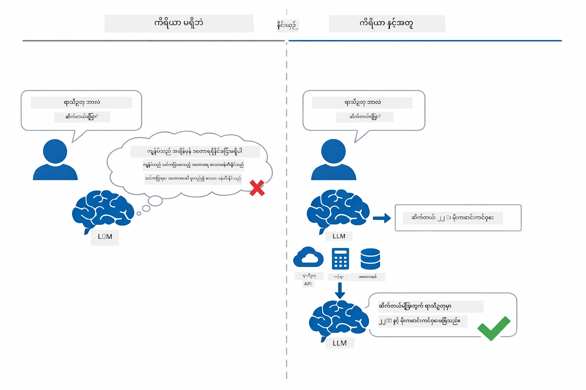

*ကိရိယာမဲ့မှာ  မော်ဒယ်သည် ခန့်မှန်းချက်ပဲ ပြုလုပ်နိုင်ပြီး ကိရိယာဖြင့် API ခေါ်ဆိုခြင်း၊ တွက်ချက်မှုပြုလုပ်ခြင်းနှင့် အချိန်မှန်ဒေတာကို ထုတ်ပေးနိုင်သည်။*

ကိရိယာပါတဲ့ AI ကိုယ်စားလှယ်သည် **Reasoning and Acting (ReAct)** ပုံစံကို လိုက်နာသည်။ မော်ဒယ်သည် တုံ့ပြန်တာမဟုတ်ပဲ — မည်သည့်အရာလိုအပ်သည်ကို ထောက်ခံစဉ်းစားပြီး ကိရိယာကို ခေါ်ယူဆောင်ရွက်၊ ရလဒ်ကို ကြည့်ရှုပြီး နောက်ထပ် ဆောင်ရွက်ရန် သို့မဟုတ် နောက်ဆုံးဖြေဖော်ပြရန် ဆုံးဖြတ်သည်-

1. **အကြောင်းရင်းရှာဖွေခြင်း** — အသုံးပြုသူ၏ မေးခွန်းကို စိစစ်ပြီး မည်သည့်အချက်အလက်လိုအပ်သည်ကို သတ်မှတ်သည်
2. **ဆောင်ရွက်ခြင်း** — မူလက်မှန်ကိရိယာကို ရွေးချယ်၍ မှန်ကန်သော parameter များဖန်တီးပြီး ခေါ်ယူသည်
3. **ကြည့်ရှုခြင်း** — ကိရိယာထုတ်လွှတ်သော ရလဒ်ကို လက်ခံပြီး စိစစ်သည်
4. **ပြန်လည်ဆောင်ရွက်ခြင်း သို့မဟုတ် တုံ့ပြန်ခြင်း** — ပိုမိုအချက်အလက်လိုအပ်ပါက ပြန်တောင်းဆို၊ မဟုတ်လျှင် သဘာဝဘာသာ စကားဖြင့် ဖြစ်စေရန် ဖြေကြားချက် ရေးဆွဲသည်

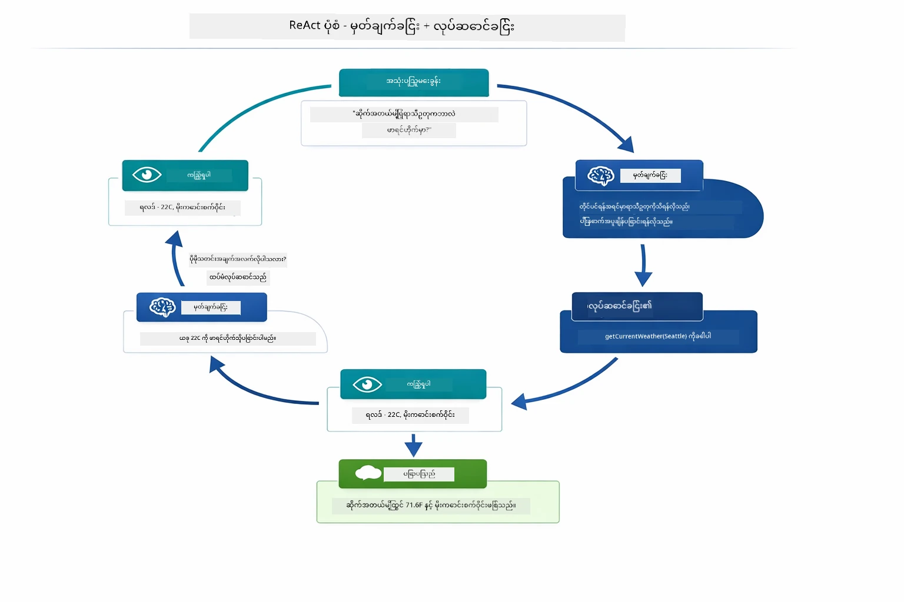

*ReAct လည်ပတ်မှု - ကိုယ်စားလှယ်သည် ပြုလုပ်ရမည့်အရာကို စဉ်းစားပြီး ကိရိယာခေါ်ယူဆောင်ရွက်၊ ရလဒ်ကို ကြည့်ရှုပြီး နောက်တစ်ကြိမ် ဆောင်ရွက်မည်ကိုဆုံးဖြတ်သည်။*

ထိုလုပ်ငန်းစဉ်သည် အလိုအလျောက် ဖြစ်ပေါ်သည်။ သင်ကိရိယာများနှင့် ၎င်း၏ဖော်ပြချက်များကို သတ်မှတ်သည်။ မော်ဒယ်သည် ၎င်းတို့ကို ဘယ်အချိန်၊ မည်သို့အသုံးပြုမည်ကို ဆုံးဖြတ်သည်။

## ကိရိယာခေါ်ယူမှုလုပ်ပုံ

### ကိရိယာဖော်ပြချက်များ

[WeatherTool.java](../../../04-tools/src/main/java/com/example/langchain4j/agents/tools/WeatherTool.java) | [TemperatureTool.java](../../../04-tools/src/main/java/com/example/langchain4j/agents/tools/TemperatureTool.java)

သင်သည် function များကို ပေါ်ပြူလာ ကောလဟာလမပါဘဲ ဖေါ်ပြချက်များနှင့် parameter သတ်မှတ်ချက်များဖြင့် သတ်မှတ်သည်။ မော်ဒယ်သည် ၎င်း၏ system prompt ထဲတွင် ထိုဖော်ပြချက်များကို မြင်ရပြီး ကိရိယာတိုင်း၏ အလုပ်လုပ်ပုံကို နားလည်သည်။

```java
@Component
public class WeatherTool {
    
    @Tool("Get the current weather for a location")
    public String getCurrentWeather(@P("Location name") String location) {
        // သင်၏ရာသီဥတု ရှာဖွေမှု မှတ်ချက်
        return "Weather in " + location + ": 22°C, cloudy";
    }
}

@AiService
public interface Assistant {
    String chat(@MemoryId String sessionId, @UserMessage String message);
}

// အကူအညီပေးသူကို Spring Boot မှ ကိုယ်တိုင် ချိတ်ဆက်ပေးထားပါသည် -
// - ChatModel bean
// - @Component အတန်းများမှ @Tool နည်းလမ်းအားလုံး
// - အစည်းအဝေးစီမံခန့်ခွဲမှုအတွက် ChatMemoryProvider
```

အောက်တွင်ဖော်ပြထားသည့် ဇယားသည် အက္ခရာအချင်းချင်းအားလုံးကို ဖွင့်ပြပြီး AI သည် မည်သည့်အချိန်တွင် ကိရိယာလုပ်ငန်းကို ခေါ်သင့်သည်၊ ဘယ် argument များပေးသင့်သည်ကို နားလည်ရန် ဘယ်လိုအကူဖြစ်သနည်းကို ပြသည်-

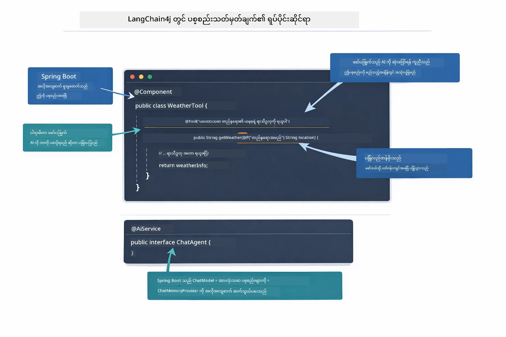

*ကိရိယာဖော်ပြချက်၏ အစိတ်အပိုင်း — @Tool သည် AI ကို ဘယ်အချိန်သုံးရမည်ကို ပြောပြ၊ @P သည် parameter တစ်ခုချင်း ဖော်ပြပြီး @AiService သည် စတိတ်အချိန်တွင် အားလုံးကို ချိတ်ဆက်ပေးသည်။*

> **🤖 [GitHub Copilot](https://github.com/features/copilot) Chat ဖြင့် စမ်းသပ်ပါ:** [`WeatherTool.java`](../../../04-tools/src/main/java/com/example/langchain4j/agents/tools/WeatherTool.java) ဖိုင်ကို ဖွင့်ပြီး မေးမြန်းပါ-
> - "mock data မဟုတ်ဘဲ OpenWeatherMap ကဲ့သို့ စစ်မှန်သော weather API ကို ဘယ်လိုပေါင်းသင်းမလဲ?"
> - "AI သပ်ရပ်စွာ အကောင်အထည်ဖော်ရန် ကောင်းမွန်သော ကိရိယာဖော်ပြချက်란 ဘာလဲ?"
> - "ကိရိယာတွင် API အမှားများနှင့် rate limits များကို ဘယ်သို့ ကိုင်တွယ်မလဲ?"

### ဆုံးဖြတ်ချက်ချခြင်း

အသုံးပြုသူသည် "စိတယ်ရှိအိ(Sitell, Seattle) ၏ မိုးလေဝသ ဘယ်လိုလဲ?" ဟု မေးပြီး မော်ဒယ်သည် ကိရိယာတစ်ခုကို ကျပန်းရွေးခြင်းမပြုပါ။ အသုံးပြုသူ၏ ရည်ရွယ်ချက်ကို ရနိုင်သော ကိရိယာတိုင်း၏ ဖော်ပြချက်နှင့် နှိုင်းယှဉ်ပြီး သင့်လျော်မှုပမာဏ နုတ်ထုတ်၍ အကောင်းဆုံးကို ရွေးချယ်သည်။ ထို့နောက် သတ်မှတ်ထားသော parameters နှင့် function call များတစ်ခုကို တွေရနိုင်သည် — ဤကိစ္စတွင် `location` ကို `"Seattle"` ဟု သတ်မှတ်သည်။

အသုံးပြုသူ တောင်းဆိုချက်နှင့် ကိုက်ညီသော ကိရိယာမရှိလျှင် မော်ဒယ်သည် ဗဟိုဗျူဟာ အရ သိရှိမှုကို ဖြေကြားသည်။ များစွာသော ကိရိယာများကို ကိုက်ညီပါက အပြည့်အစုံပိုင်းကို ရွေးချယ်သည်။

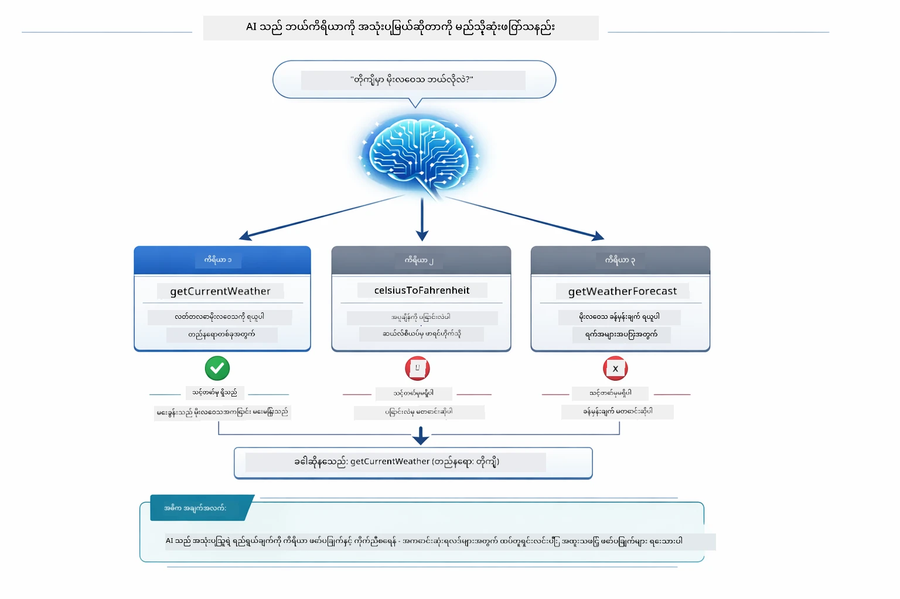

*မော်ဒယ်သည် သုံးစွဲသူရည်ရွယ်ချက်နှင့် ကိုက်ညီသော ကိရိယာအားလုံးကို စိစစ်ပြီး အကောင်းဆုံးကို ရွေးသည် — ထိုကြောင့် ရှင်းလင်းပြီး အသေးစိတ် ဖော်ပြချက်ရေးသားခြင်း အရေးပါသည်။*

### အကောင်အထည်ဖော်ခြင်း

[AgentService.java](../../../04-tools/src/main/java/com/example/langchain4j/agents/service/AgentService.java)

Spring Boot သည် `@AiService` interface ကို အလိုအလျောက် `@Tool` အားလုံးနှင့်ချိတ်ဆက်ပေးပြီး LangChain4j သည် tool ခေါ်ယူမှုကို အလိုအလျောက် ဆောင်ရွက်ပေးသည်။ အန်ဒီစကင်းတွင် အသုံးပြုသူ၏ သဘာဝဘာသာစကားမေးခွန်းမှ နောက်ဆုံး သဘာဝဘာသာစကားဖြေကြားချက်ထိ ဆိုက်ကလေ six ခုမှ တစ်ဆင့် flow မြောက်သည်-

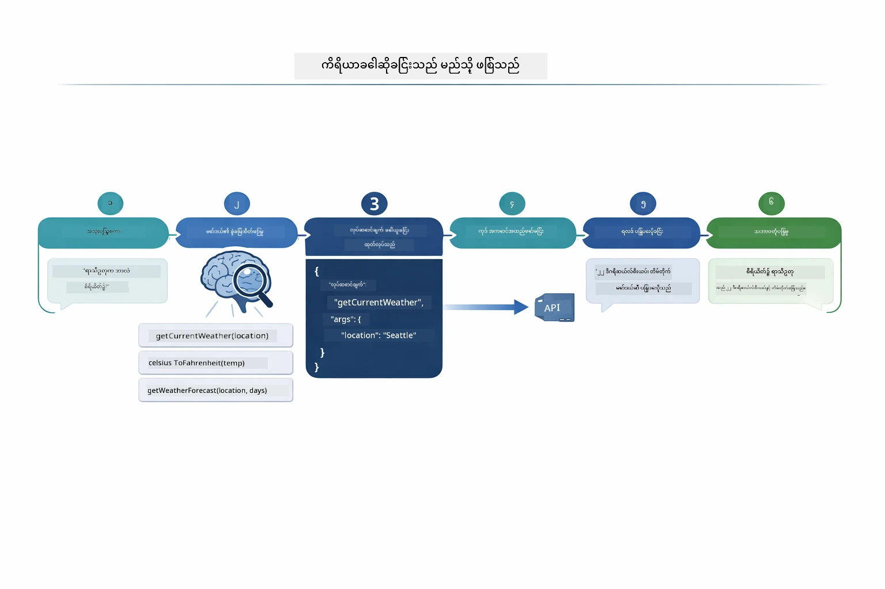

*user မေးခွန်းတောင်းသည်၊ မော်ဒယ်သည် ကိရိယာရွေးချယ်သည်၊ LangChain4j သည် သတ်မှတ်ချက်အတိုင်း လုပ်ဆောင်သည်၊ မော်ဒယ်က ထိုရလဒ်ကို စကားပြောဖြင့် ထည့်သွင်းပေးသည်။*

> **🤖 [GitHub Copilot](https://github.com/features/copilot) Chat ဖြင့် စမ်းသပ်ပါ:** [`AgentService.java`](../../../04-tools/src/main/java/com/example/langchain4j/agents/service/AgentService.java) ဖိုင်ကို ဖွင့်ပြီး မေးပါ-
> - "ReAct ပုံစံသည် မည်သို့လုပ်ဆောင်ပြီး AI ကိုယ်စားလှယ်များအတွက် ဘာကြောင့်ထိရောက်သနည်း?"
> - "ကိုယ်စားလှယ်သည် ဘယ်ကိရိယာကို ဘယ်အဆင့်လိုက်အသုံးပြုမလဲ တွက်ချက်ပုံကို ဘယ်လို ဆုံးဖြတ်သနည်း?"
> - "ကိရိယာအသုံးပြုမှု မှားယွင်းခဲ့လျှင် ဘယ်လို အမှားကို လုံခြုံစွာ ကိုင်တွယ်ရမည်နည်း?"

### တုံ့ပြန်ချက်တည်ဆောက်မှု

မော်ဒယ်သည် မိုးလေဝသဒေတာကို ရရှိပြီး အသုံးပြုသူအတွက် သဘာဝဘာသာစကားဖြင့် တုံ့ပြန်ချက် ရေးဆွဲသည်။

### စိတ်ခြမ်း: Spring Boot အလိုအလျောက်ချိတ်ဆက်မှု

ဤမော်ဒูล်တွင် LangChain4j ၏ Spring Boot ပေါင်းသင်းမှုကို အသုံးပြုပြီး `@AiService` interface များကို သုံးသည်။ စတင်လည်ပတ်ချိန်တွင် Spring Boot သည် `@Tool` method တို့ပါဝင်သည့် `@Component` အားလုံး၊ သင်၏ `ChatModel` bean၊ နှင့် `ChatMemoryProvider` ကို ရှာဖွေပြီး အားလုံးကို `Assistant` interface တစ်ခုတွင် ချိတ်ဆက်ပေးသည်။ ၎င်းစနစ်တွင် မည်သည့် boilerplate code မပါ။

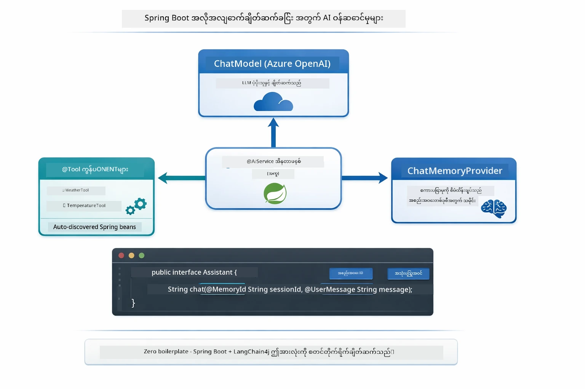

*@AiService interface သည် ChatModel၊ ကိရိယာ component များနှင့် memory provider ကို ချိတ်ဆက်ပေးပြီး၊ Spring Boot သည် မည်သည့်ချိတ်ဆက်မှုကိုမဆို အလိုအလျောက် စီမံပေးသည်။*

ဤနည်းလမ်း၏ အဓိကအားသာချက်များ-

- **Spring Boot auto-wiring** — ChatModel နှင့် ကိရိယာများကို အလိုအလျောက် ထည့်သွင်းပေးသည်
- **@MemoryId ပုံစံ** — စက်ဝိုင်းအခြေခံ မှတ်ဉာဏ် စီမံခြင်းကို အလိုအလျောက် စနစ်တကျ ဆောင်ရွက်ပေးသည်
- **တစ်ခုတည်း instance** — Assistant ကို တစ်ကြိမ် ဖန်တီးပြီး ထိရောက်မှု မြှင့်တင်ရန် ထပ်မံအသုံးပြုသည်
- **အမျိုးအစား လုံခြုံစိတ်ချစွာ အကောင်အထည်ဖော်ခြင်း** — Java method များကို တိုက်ရိုက် ဖိတ်ခေါ်ပြီး အမျိုးအစားပြောင်းခြင်းများကို စီမံသည်
- **တစ်ကြိမ်ထပ် ကြိမ်သုံး orchestration** — ကိရိယာချိတ်ဆက်မှုကို အလိုအလျောက် ဆောင်ရွက်ပေးသည်
- **boilerplate မရှိခြင်း** — `AiServices.builder()` ကို ကိုယ်တိုင် မခေါ်ဘဲ လုပ်ဆောင်သည်

လက်ရာအစွန်းပေးနည်းများ (`AiServices.builder()` ကို ကိုယ်တိုင်သုံးခြင်း) သည် ကုဒ်ပိုများပြီး Spring Boot ပေါင်းစည်းမှု အကျိုးကျေးဇူးများကို လုံးဝ မခံစားရပါ။

## ကိရိယာချိတ်ဆက်မှု

**ကိရိယာချိတ်ဆက်မှု** — တစ်စုတစ်ပိုင်းမဟုတ်ဘဲ မိမိ၏ မေးခွန်းတစ်ခုအတွက် များစွာသော ကိရိယာများ လိုအပ်သော အခါ စစ်မှန်သော ကိုယ်စားလှယ်၏ အာဏာအား ပြသသည်။ "စိတယ်ရှိအိတွင် မိုးလေဝသကို ဖာရင်ဟိုက်မှာ ဘယ်လိုရှိလဲ?" ဟု မေးပါက စက္ကန့်တိုင်း နှစ်ခုသော ကိရိယာများသည် ‌ချိတ်ဆက်၍ အသုံးပြုသည်- ပထမကား `getCurrentWeather` ကို ခေါ်၍ စယ်လ်စီးယပ် (Celsius) အပူချိန်ရသည်၊ ထို့နောက် `celsiusToFahrenheit` မှာ အဲဒီတန်ဖိုးကို လွှဲပြောင်းသည် — အားလုံးကို စကားပြောတစ်ခေါက်သိုက် ျဖစ္စဉ်အတွင်း ပြုလုပ်သည်။

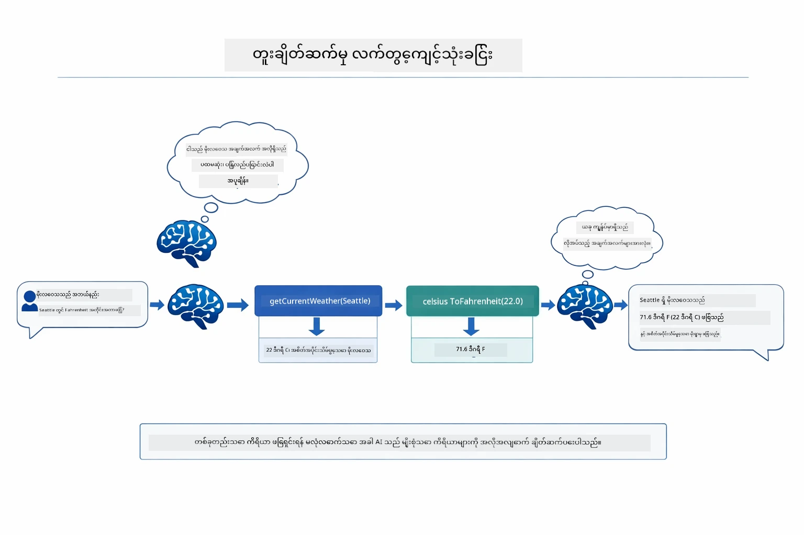

*ကိရိယာချိတ်ဆက်မှု အလုပ်လုပ်ပုံ- ကိုယ်စားလှယ်သည် ပထမတစ်ခု getCurrentWeather ကို ခေါ်ပြီး Celsius ရလဒ်ကို celsiusToFahrenheit ထဲသို့ ပို့ပြီး ပေါင်းစပ်အဖြေ တင်ပြသည်။*

အခုတော့ လည်ပတ်နေသော လျှောက်ထားမှုတွင် ဒီလိုပုံစံ -

<a href="images/tool-chaining.png"></a>

* အမှန်တကယ် လျှောက်ထားမှု ရလဒ် — ကိုယ်စားလှယ်သည် getCurrentWeather → celsiusToFahrenheit ၏ ချိတ်ဆက်မှုကို တစ်ကြိမ်အတွင်း အလိုအလျောက် ဆောင်ရွက်သည်။*

**အမှားများကို ကြင်နာမှုဖြင့် ကိုင်တွယ်ခြင်း** — mock data တွင်မပါသော မြို့အတွက် မိုးလေဝသမေးပါက ကိရိယာသည် အမှားစာသား ပြန်လည်ပို့ပေးပြီး AI က အကူမဖြစ်နိုင်ပါဟု ရှင်းပြသည်။ ကိရိယာများသည် လုံခြုံစွာ မအောင်မြင်ရင်လည်း ထိန်းသိမ်းပေးသည်။

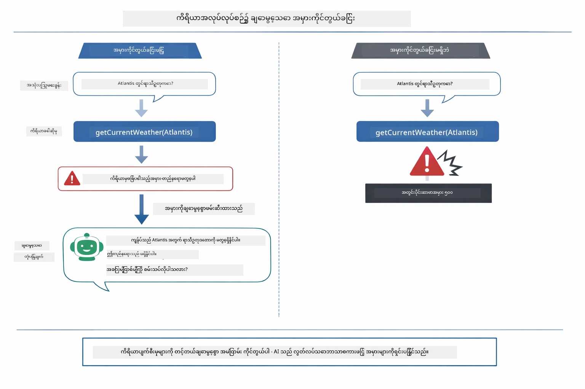

*ကိရိယာ အမှားဖြစ်လျှင် ကိုယ်စားလှယ်သည် အမှားကို ဖမ်းဆီးပြီး ပျက်စီးခြင်းမရှိဘဲ အသုံးပြုသူအား အကူအညီဖြည့် တုံ့ပြန်သည်။*

ဤကိစ္စသည် စကားပြော တစ်ကြိမ်အတွင်း ဖြစ်သည်။ ကိုယ်စားလှယ်သည် ကိရိယာခေါ်ယူမှုများ အလိုအလျောက် စီမံသည်။

## လျှောက်ထားမှုကို အလုပ်လုပ်ဆောင်ခြင်း

**တပ်ဆင်မှု ရှိ/မရှိ စစ်ဆေးပါ-**

Module 01 တွင် ဖန်တီးသော Azure အတည်ပြုချက်ပါရှိသော `.env` ဖိုင်သည် root ဒါရိုက်တိုးရီ၌ ရှိသည်ဟု သေချာပါစေ။
```bash
cat ../.env  # AZURE_OPENAI_ENDPOINT, API_KEY, DEPLOYMENT ကိုပြသသင့်သည်။
```

**လျှောက်ထားမှု စတင်ပါ-**

> **မှတ်ချက်:** ပါသော များအားလုံးကို Module 01 ထဲက `./start-all.sh` ဖြင့် စတင်ထားပြီးလျှင် ဤ module သည် port 8084 တွင် ရှိနေသည်။ အောက်ပါ စတင်အမိန့်များကို ကျော်သွားပြီး http://localhost:8084 သို့ တိုက်ရိုက်သွားနိုင်သည်။

**ရွေးချယ်မှု ၁: Spring Boot Dashboard သုံးခြင်း (VS Code အသုံးပြုသူအတွက် အကြံပြု)**

dev container သည် Spring Boot Dashboard extension ပါဝင်ပြီး Spring Boot အားလုံးကို ကြည့်ရှု စီမံရန် မြင်ကွင်း ဖန်တီးပေးသည်။ VS Code ၏ ဘယ်ဘက် Activity Bar တွင် Spring Boot icon ကို တွေ့နိုင်သည်။

Spring Boot Dashboard အား အသုံးပြုရန်-
- နေရာတစ်ခုတွင် ရရှိနိုင်သော Spring Boot လျှောက်ထားမှုများကို ကြည့်ရှုနိုင်သည်
- single click ဖြင့် စတင်/ရပ်ဆိုင်းနိုင်သည်
- တိုက်ရိုက် အမည်စာရင်းများ ကြည့်ရှုနိုင်သည်
- အလုပ်လုပ်မှု အခြေအနေကို ကြည့်ရှုကြည့်နိုင်သည်

"tools" အနားရှိ play ခလုတ်ကို နှိပ်ပါ သို့မဟုတ် modules အားလုံးကို တစ်ပြိုင်နက် စတင်နိုင်သည်။


**ရွေးချယ်မှု ၂: shell script များ အသုံးပြုခြင်း**

၀က်ဘ် လျှောက်ထားမှုအား အားလုံး စတင်ပါ (modules 01-04):

**Bash:**
```bash
cd ..  # မူလဖိုင်လ်တွင်မှ
./start-all.sh
```

**PowerShell:**
```powershell
cd ..  # အပင် စာမျက်နှာမှ
.\start-all.ps1
```

သို့မဟုတ် ဒီ module တစ်ခုတည်းစတင်လိုပါက-

**Bash:**
```bash
cd 04-tools
./start.sh
```

**PowerShell:**
```powershell
cd 04-tools
.\start.ps1
```

၂ ခုစလုံး script များသည် root `.env` ဖိုင်မှ environment variables များကို အလိုအလျောက် ရယူပြီး JAR ဖိုင် မရှိပါက တည်ဆောက်ပေးသည်။

> **မှတ်ချက်:** စတင်ရန်မတိုင်မီ မော်ဒူများအားလုံးကို ကိုယ်တိုင် တည်ဆောက်လိုပါက-
>
> **Bash:**
> ```bash
> cd ..  # Go to root directory
> mvn clean package -DskipTests
> ```
>
> **PowerShell:**
> ```powershell
> cd ..  # Go to root directory
> mvn clean package -DskipTests
> ```

http://localhost:8084 ကို Browser တွင် ဖွင့်ကြည့်ပါ။

**ရပ်တန့်ရန်:**

**Bash:**
```bash
./stop.sh  # ဒီမොဂျူးလ်တစ်ခုတည်းသာ
# ဒါမှမဟုတ်
cd .. && ./stop-all.sh  # မိမိမော်ဂျူးလ်အားလုံး
```

**PowerShell:**
```powershell
.\stop.ps1  # ဤမော်ဒူးသာ
# သို့မဟုတ်
cd ..; .\stop-all.ps1  # မော်ဒူးအားလုံး
```

## လျှောက်ထားမှုကိုအသုံးပြုခြင်း

ဤလျှောက်ထားမှုသည် မိုးလေဝသနှင့် အပူချိန်ပြောင်းလဲမှုကိရိယာများကို အသုံးပြုနိုင်သော AI ကိုယ်စားလှယ်နှင့် ဆက်သွယ်နိုင်သော ဝက်ဘ်အင်တာဖေ့စ် ပေးဆောင်သည်။

<a href="images/tools-homepage.png"></a>

*AI ကိုယ်စားလှယ် ကိရိယာများ အင်တာဖေ့စ် - ကိရိယာနှင့် စကားပြောဆက်သွယ်ရန် ဦးတည်ချက် နမူနာများ*

### လွယ်ကူသော ကိရိယာ သုံးစွဲမှု စမ်းသပ်ခြင်း
100 ဒီဂရီ Fahrenheit ကို Celsius သို့ပြောင်းပါ။ အေးဂျင့်သည် အပူချိန်ပြောင်းလဲသည့်ကိရိယာလိုအပ်ကြောင်း သိပြီး၊ သင့်တော်သော ပါရာမီတာများဖြင့် ခေါ်ဆိုခြင်းပြီး နောက်ဆုံးရလဒ်ကို ပြန်တင်ပေးသည်။ ဤအရာက သဘာဝကျဆန်၍ သင်ဘယ်ကိရိယာအသုံးပြုမည်နှင့် ဘယ်လိုခေါ်မည်ဆိုတာကို မသတ်မှတ်ပေးဘဲ ဖြစ်သည်ကို တွေ့ရမည်။

### ကိရိယာ ချိတ်ဆက်ခြင်းကို စမ်းသပ်ပါ

အခုတော့ ပိုခက်ခဲသော ရှင်းလင်းချက်တစ်ခုကို စမ်းကြည့်ပါ - "Seattle ၏ရာသီမိုးကောလဟာလကဘာလဲ၊ Celsius မှ Fahrenheit သို့ ပြောင်းလဲပါ။" အေးဂျင့်သည်အဆင့်များအားဖြင့် အလုပ်လုပ်သည်ကို ကြည့်ပါ။ အရင်ဆုံး ရာသီမိုးကို ရယူပြီး (Celsius ဖြင့် ပြန်လာသည်) ပြောင်းလဲရန်လိုအပ်ကြောင်း အသိအမှတ်ပြုကာ ကိရိယာကို ခေါ် ဆောင်ရွက်ပြီး ရလဒ်နှစ်ခုကို ပေါင်းပြီးတစ်ခုတည်းဖြင့် ဖြေပေးသည်။

### ဆက်သွယ်မှု လည်ပတ်မှုကို ကြည့်ရှုပါ

chat အင်တာဖေ့စ်သည် ဆက်သွယ်မှုမှတ်တမ်းကို ထိန်းသိမ်းထားကာ များစွာသော ဆက်တိုက်ပြောဆိုမှုများ လုပ်ဆောင်နိုင်သည်။ မတိုင် မီ မေးခွန်းများနှင့် ဖြေကြားချက်များအားလုံးကို မြင်နိုင်သဖြင့် ဆက်သွယ်မှုအား လိုက်လံခြေရာခံ၍ အေးဂျင့်သည် မကြာခဏ ပြောဆိုမှုများတွင် ဘယ်လိုအခြေအနေတည်ဆောက်သည်ကို နားလည်ရလွယ်ကူစေသည်။

<a href="images/tools-conversation-demo.png"></a>

*ရိုးရိုး ရိုးရှင်းသော ပြောင်းလဲမှုများ၊ ရာသီမိုး ရှာဖွေမှုများနှင့် ကိရိယာ ချိတ်ဆက်မှုများ ပြသသည့် များစွာသော ဆက်သွယ်မှု*

### မတူညီသော တောင်းဆိုမှုများနှင့် စမ်းသပ်ကြည့်ပါ

စမ်းသပ်ကြည့်နိုင်သော ပေါင်းစပ်မှုများမှာ -
- ရာသီမိုး ရှာဖွေမှုများ: "Tokyo ၏ရာသီမိုးဘယ်လိုလဲ?"
- အပူချိန် ပြောင်းလဲမှုများ: "25°C ကို Kelvin ကျော် ပြောင်းပါ"
- ပေါင်းစပ်မေးခွန်းများ: "Paris ၏ရာသီမိုးကိုစစ်ဆေးပြီး 20°C ထက် များလား ပြောပြပါ"

အေးဂျင့်သည် သဘာဝဘာသာစကားကို ဘယ်လို အဓိပ္ပာယ်ဖေါ်ပြပြီး သင့်တော်သော ကိရိယာခေါ်ဆိုချက်များသို့ ပုံစံဖော်သည်ကို သတိပြုပါ။

## အဓိက အတွေးအခေါ်များ

### ReAct ပုံစံ (ဟန်ချက်ညီစဉ်းစားမှုနှင့် လုပ်ဆောင်မှု)

အေးဂျင့်သည် အလှည့်ကျ လုပ်ဆောင်မှု (လုပ်ဆောင်ရန် ဆုံးဖြတ်ရေး) နှင့် အကောင်အထည်ဖော်မှု (ကိရိယာများကို အသုံးပြုခြင်း) ကြား ဆက်လက် လုပ်ဆောင်သည်။ ဤပုံစံသည် လမ်းညွှန်ချက်များအတိုင်း မဖြစ်ဘဲ ကိုယ်တိုင် ပြဿနာများကို ဖြေရှင်းနိုင်စေသည်။

### ကိရိယာ ဖော်ပြချက်များ အရေးကြီးသည်

သင့်ကိရိယာ ဖော်ပြချက်၏ အရည်အသွေးသည် အေးဂျင့်က ဘယ်လို ကိရိယာအသုံးပြုမည်ကို တိုက်ရိုက် သက်ရောက်သည်။ ရိုးရှင်းသ ဖြည့်သွင်းချက်များသည် မော်ဒယ်အား မည်ချိန်၊ မည်လောက် ကိရိယာခေါ်မည်ကို နားလည်စေသည်။

### အစည်းအဝေး စီမံခန့်ခွဲမှု

`@MemoryId` မှတ်ချက်သည် အလိုအလျောက် အစည်းအဝေးအခြေပြု မှတ်ဉာဏ် စီမံခန့်ခွဲမှုကို ခွင့်ပြုသည်။ အစည်းအဝေး ID တစ်ခုစီသည် `ChatMemoryProvider` bean မှ ထိန်းသိမ်းသော သီးသန့် `ChatMemory` အကြောင်းအရာရှိပြီး မည်သူမဆို အေးဂျင့်နှင့် ထိတွေ့မှုများကို ခြားနားစွာ ဆက်သွယ်နိုင်သည်။

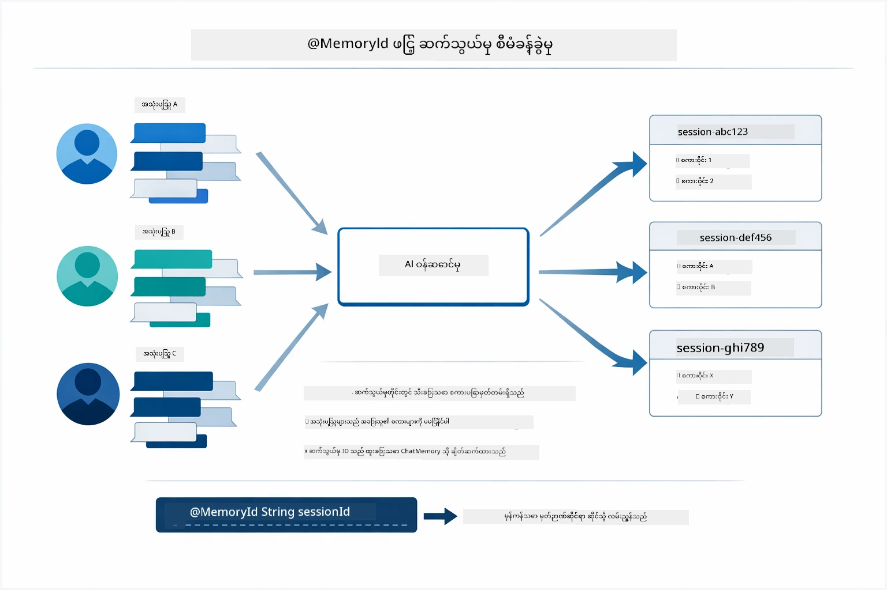

*အစည်းအဝေး ID တစ်ခုစီသည် သီးသန့် စကားပြော မှတ်တမ်းများနှင့် သက်ဆိုင်ပြီး - အသုံးပြုသူများသည် တစ်ဦးနှင့် တစ်ဦး၏ စာမက်သာမကြည့်နိုင်ပါ။*

### အမှားကို ကိုင်တွယ်ခြင်း

ကိရိယာများသည် မအောင်မြင်နိုင် - API များသည် အချိန်ကုန်ဆုံးခြင်း၊ ပါရာမီတာများ မှားယွင်းခြင်း၊ ပြင်ပ ဝန်ဆောင်မှုများ ပျက်စီးခြင်း ဖြစ်နိုင်သည်။ ထုတ်လုပ်မှု အေးဂျင့်များသည် မော်ဒယ်အား ပြဿနာများကို ရှင်းပြရန် သို့မဟုတ် အခြားရွေးချယ်မှုများ စမ်းသပ်ရန် အမှား ကိုင်တွယ်ခြင်း လိုအပ်သည်။ ကိရိယာတစ်ခုမှ exception throw လုပ်သောအခါ LangChain4j သည် ၎င်းကို ဖမ်းဆီးပြီး အမှား စာသားကို မော်ဒယ်ထံ မှပေးပို့ကာ သဘာဝဘာသာဖြင့် ပြဿနာကိုရှင်းပြနိုင်စေသည်။

## အသုံးပြုနိုင်သော ကိရိယာများ

အောက်ပါ ပုံဆွဲတွင် သင့်အား ပိတ်ဆို့နိုင်သော ကိရိယာ ပတ်ဝန်းကျင်ကျယ်ပြန့်မှုကို ပြသထားသည်။ ဤမော်ဂျူးသည် ရာသီမိုးနှင့် အပူချိန် ကိရိယာများကို ပြသသည်၊ သို့သော် `@Tool` ပုံစံသည် Java method မည်မျှမဆို - database query များမှ ဝန်ဆောင်မှု ဗဟိုပြုခြင်း အထိ အသုံးပြုနိုင်သည်။

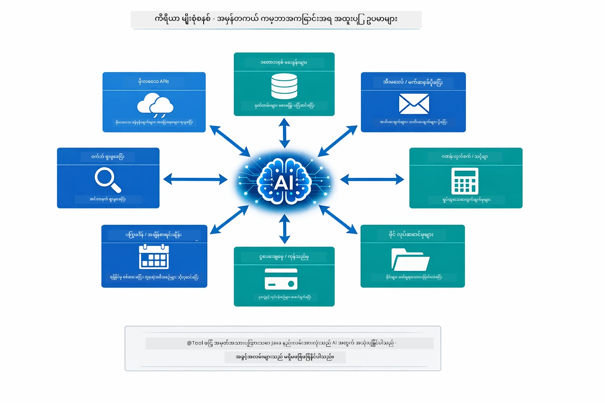

*@Tool ဖြင့် မွမ်းမံထားသော Java method မည်သည်က AI အတွက် အသုံးပြုနိုင်သည် - ပုံစံသည် ဒေတာဘေ့စ်များ၊ API များ၊ အီးမေးလ်၊ ဖိုင်လုပ်ဆောင်မှုများနှင့် အခြားပိုများကို ချဲ့ထွင်သည်။*

## ကိရိယာအခြေပြု အေးဂျင့်များကို ဘယ်အချိန် သုံးရန်

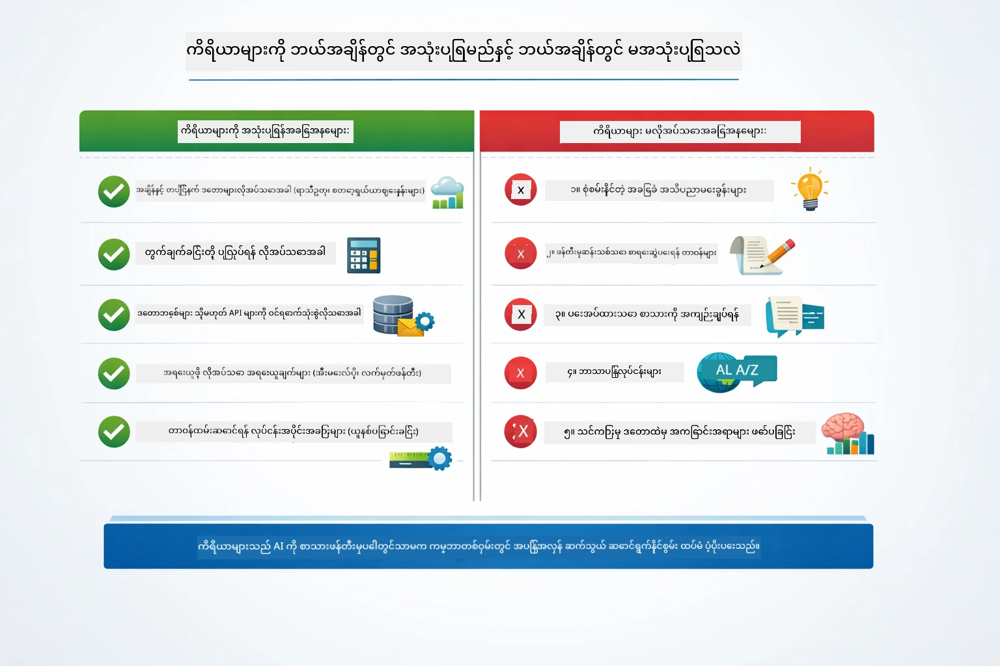

*မြန်ဆန်ဆုံးဆုံးဖြတ်ချက်လမ်းညွှန် - ကိရိယာများသည် အချိန်နှင့် အတူတူ ဒေတာ၊ တွက်ချက်မှုများ၊ လုပ်ဆောင်မှုများ အတွက်ဖြစ်ပြီး၊ ပညာရပ်သိပ္ပံနှင့် ဖန်တီးမှု လုပ်ငန်းများကို မလိုအပ်ပါ။*

**ကိရိယာများကို သုံးသင့်သည် -**
- အဖြေရှာရာတွင် အချိန်နောက်ဆုံး ဒေတာလိုအပ်သောအခါ (ရာသီမိုး၊ အစုလိုက်စျေးနှုန်းများ၊ ရရှိနိုင်မှု)
- ရိုးရိုးသင်္ချာဆက်ခြင်းများ ဝင်ခွင့်ရသည့်အထက် တွက်ချက်မှုများ လုပ်ဆောင်ရန်
- ဒေတာဘေ့စ် သို့ API များသုံးရန်
- လုပ်ဆောင်ချက်များ ပြုလုပ်ရန် (အီးမေးလ်ပို့ခြင်း၊ လက်မှတ် ဖန်တီးခြင်း၊ မှတ်တမ်းများ ပြင်ဆင်ခြင်း)
- ဒေတာရင်းမြစ် အများကြီး ပေါင်းစပ်ရန်

**ကိရိယာများ မသုံးသင့်သောအခါ -**
- မေးခွန်းများကို ယေဘူယျပညာမှ ဖြေရှင်းနိုင်သောအခါ
- ဖြေကြားမှုသည် ရိုးရိုး ပြောဆိုမှုသာဖြစ်သောအခါ
- ကိရိယာလက်ရှိအသုံးပြုမှုက လျင်မြန်မှုကို မှားယွင်းစေနိုင်သည့်အခါ

## ကိရိယာများနှင့် RAG

Module 03 နှင့် 04 တို့သည် AI ၏စွမ်းဆောင်ရည်ကို တိုးချဲ့ပေးသော်လည်း အခြေခံအားဖြင့် မတူညီသော နည်းလမ်းများဖြစ်သည်။ RAG သည် စာရွက်စာတမ်းများကို ရှာဖွေခြင်းဖြင့် မော်ဒယ်အား **အသိပညာ** ပေးသည်။ ကိရိယာများသည် မော်ဒယ်အား တာဝန်များကို လုပ်ဆောင်ရန်လမ်းကြောင်းပေးသည်။

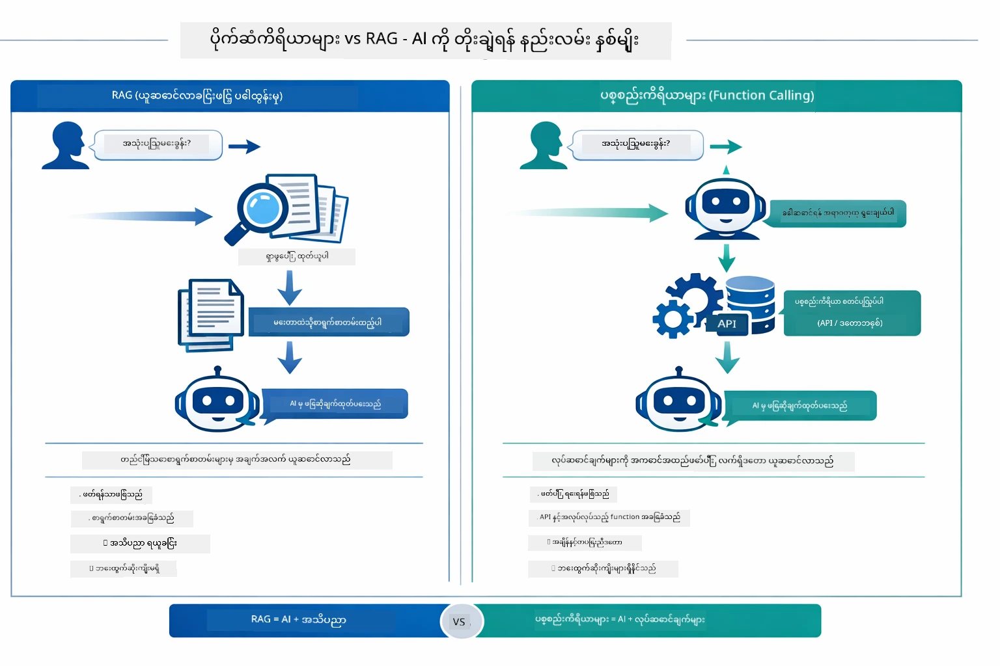

*RAG သည် စာရွက်စာတမ်းမှ စနစ်တကျ သတင်းအချက်အလက် ရှာဖွေခြင်းဖြစ်သည် – ကိရိယာများသည် လုပ်ဆောင်ချက်များကို ဆောင်ရွက်ပြီး လက်ရှိ အချိန်အတိုင်းအတာ သတင်းအချက်အလက်များ ရယူသည်။ ထိုထက်ပို၍ ထုတ်လုပ်မှု စနစ်များသည် နှစ်မျိုးစလုံး ပေါင်းစပ်သုံးစွဲသည်။*

လက်တွေ့တွင် ထုတ်လုပ်မှုစနစ်များသည် နှစ်မျိုးစလုံးကို ပေါင်းစပ်သုံးစွဲသည် - RAG သည် သင့်စာရွက်စာတမ်းများတွင် ဖြေရှင်းချက် အခြေခံရန်၊ ကိရိယာများသည် တိုက်ရိုက် ဒေတာ ရယူခြင်း သို့မဟုတ် လုပ်ဆောင်ချက်များ ပြုလုပ်ခြင်းအတွက် ဖြစ်သည်။

## နောက်တခါတွင် မည်သည်ကို လေ့လာမည်

**နောက်တစ်ပိုင်း မော်ဂျူး:** [05-mcp - Model Context Protocol (MCP)](../05-mcp/README.md)

---

**လမ်းညွှန်များ:** [← ယခင်: Module 03 - RAG](../03-rag/README.md) | [နောက်သို့ အကြောင်းပြန်](../README.md) | [နောက်တစ်ပိုင်း: Module 05 - MCP →](../05-mcp/README.md)

---

<!-- CO-OP TRANSLATOR DISCLAIMER START -->
**အချက်ပေးချက်**  
ဤစာတမ်းကို AI ဘာသာပြန်မှုဝန်ဆောင်မှု [Co-op Translator](https://github.com/Azure/co-op-translator) အသုံးပြု၍ ဘာသာပြန်ထားခြင်းဖြစ်ပါသည်။ ကျွန်ုပ်တို့သည် တိကျမှုကို ကြိုးပမ်းနေသော်လည်း၊ အလိုအလျောက်ဘာသာပြန်ချက်များတွင် အမှားများ သို့မဟုတ် မမှန်ကန်မှုများ ပါဝင်နိုင်ကြောင်း သတိပြုပါရန်။ မူလစာတမ်းကို မူလဘာသာစကားဖြင့်သာ ယခင်အတိုင်း ယုံကြည်ရမည့် အရင်းအမြစ်အဖြစ် သတ်မှတ်ရန်လိုမည်။ အရေးကြီးသောအချက်အလက်များအတွက် သက်ဆိုင်ရာပရော်ဖက်ရှင်နယ် လူသားဘာသာပြန်သူမှ ဘာသာပြန်ပြုလုပ်ရန် အကြံပြုပါသည်။ ဤဘာသာပြန်ချက်ကို အသုံးပြုရာမှ ဖြစ်ပေါ်နိုင်သည့် နားလည်မှုမှားယွင်းခြင်း သို့မဟုတ် ဘာသာဖတ်မှားခြင်းများအတွက် ကျွန်ုပ်တို့မှာ တာဝန်မရှိပါ။
<!-- CO-OP TRANSLATOR DISCLAIMER END -->