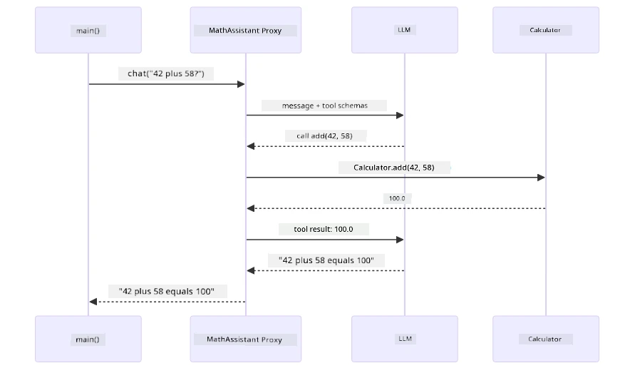
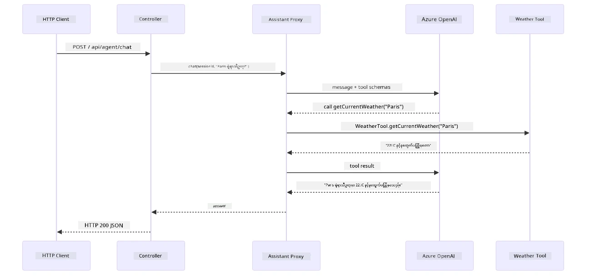

# Module 04: အင်္ဂျင်နီယာများနှင့်ကိရိယာများပါသော AI ပုဂ္ဂိုလ်များ

## အကြောင်းအရာစာရင်း

- [သင်ဘာများ သင်ယူမည်](../../../04-tools)
- [လိုအပ်ချက်များ](../../../04-tools)
- [ကိရိယာများပါသော AI ပုဂ္ဂိုလ်များကို နားလည်ခြင်း](../../../04-tools)
- [ကိရိယာခေါ်သုံးမှု အလုပ်လုပ်ပုံ](../../../04-tools)
  - [ကိရိယာ သတ်မှတ်ချက်များ](../../../04-tools)
  - [ဆုံးဖြတ်ချက်ချခြင်း](../../../04-tools)
  - [အကောင်အထည်ဖော်ခြင်း](../../../04-tools)
  - [တုံ့ပြန်ချက် ထုတ်ပေးခြင်း](../../../04-tools)
  - [အင်ဂျင်နီယာပုံဆွဲမှု: Spring Boot Auto-Wiring](../../../04-tools)
- [ကိရိယာချိတ်ဆက်ခြင်း](../../../04-tools)
- [အပလီကေးရှင်း ပြေးဆွဲခြင်း](../../../04-tools)
- [အပလီကေးရှင်း အသုံးပြုခြင်း](../../../04-tools)
  - [ပုံမှန် ကိရိယာ အသုံးပြုမှု စမ်းသပ်ခြင်း](../../../04-tools)
  - [ကိရိယာ ချိတ်ဆက်မှု စမ်းသပ်ခြင်း](../../../04-tools)
  - [စကားလုံး လည်ပတ်မှုကို ကြည့်ရှုခြင်း](../../../04-tools)
  - [မတူညီသော မေးခွန်းများဖြင့် စမ်းသပ်ခြင်း](../../../04-tools)
- [အဓိက သဘောတရားများ](../../../04-tools)
  - [ReAct ပုံစံ (စဉ်းစားခြင်းနှင့် လုပ်ဆောင်ခြင်း)](../../../04-tools)
  - [ကိရိယာ ဖော်ပြချက်များ အရေးကြီးမှု](../../../04-tools)
  - [အစည်းအဝေး စီမံခန့်ခွဲမှု](../../../04-tools)
  - [အမှား ကိုင်တွယ်ခြင်း](../../../04-tools)
- [ရရှိနိုင်သည့် ကိရိယာများ](../../../04-tools)
- [ကိရိယာအခြေပြု ပုဂ္ဂိုလ်များကို ဘယ်အချိန်အသုံးပြုမလဲ](../../../04-tools)
- [ကိရိယာများ နှင့် RAG တို့၏ ကွာခြားချက်](../../../04-tools)
- [နောက်တလှည့်လုပ်ဆောင်ချက်များ](../../../04-tools)

## သင်ဘာများ သင်ယူမည်

ယခုအထိ သင်သည် AI နှင့် စကားပြောနည်း၊ မြှောက်ပို့စ်များကို ထိရောက်စွာ ဖွဲ့စည်းနည်းနှင့် သင့်စာရွက်စာတမ်းအတွင်းရှိ အကြောင်းအရာနှင့် တုံ့ပြန်ချက်များကို ချိန်ဆက်နည်းကို သင်ယူပြီးဖြစ်သည်။ သို့သော် အခြေခံကန့်သတ်ချက်တစ်ခုရှိသည်မှာ ဘာသာပြန်မော်ဒယ်များသည် စာသား 생성 မှာ သာမက၊ မိုးလေဝသ စစ်ဆေးခြင်း၊ တွက်ချက်မှုများပြုလုပ်ခြင်း၊ ဒေတာဘေ့စ် မေးမြန်းခြင်း သို့မဟုတ် ပြင်ပ စနစ်များနှင့် ဆက်သွယ်မှု မပြုလုပ်နိုင်ပေ။

ကိရိယာများကဤကန့်သတ်ချက်ကို ပြောင်းလဲပေးသည်။ မော်ဒယ်ကို ကိရိယာများသို့ ခေါ်ယူနိုင်သော ဖန်ကွန်းများ အသုံးပြုခွင့် ပေးခြင်းဖြင့်၊ ကိုယ်ပုံသေနာစနစ်မှ လုပ်ဆောင်သူသို့ ပြောင်းလဲပေးသည်။ မော်ဒယ်သည် ဘယ်အချိန်ကိရိယာတစ်ခုလိုအပ်သည်၊ ဘယ်ကိရိယာကို သုံးမည်၊ ဘယ် ပါရာမီတာများ ပါရမည်ကို ဆုံးဖြတ်သည်။ သင့်ကုဒ်သည် ဖန်ကွန်းကို တည်ဆောင်ပြီး ရလဒ်ကို ပြန်ပေးသည်။ မော်ဒယ်က ထိုရလဒ်ကို တုံ့ပြန်ချက်ထဲတွင် ထည့်သွင်းသည်။

## လိုအပ်ချက်များ

- [Module 01 - အခြေခံ မှတ်စု](../01-introduction/README.md) ဖြေဆိုပြီးပါပြီ (Azure OpenAI ရင်းမြစ်များ တပ်ဆင်ပြီး)
- အကြို modules များ ကြံ့ကြံ့ကြံ ဖတ်သင့် (ဤ module တွင် [RAG စာရင်းအင်းများ Module 03](../03-rag/README.md) မှ ရည်ညွှန်းထားပါသည်)
- Azure မှတ်ပုံတင် သတင်းအချက်အလက်များပါ `.env` ဖိုင် ထုတ်ထားပြီး (Module 01 မှ `azd up` ဖြင့် ဖန်တီးထားသည်)

> **မှတ်ချက်:** Module 01 မပြီးစီးသေးပါက မူလ ဦးစွာ ထိုနေရာမှ တပ်ဆင်ရန် လမ်းညွှန်ချက်များအတိုင်း ဆောင်ရွက်ပါ။

## ကိရိယာများပါသော AI ပုဂ္ဂိုလ်များကို နားလည်ခြင်း

> **📝 မှတ်ချက်:** ဤ module အတွင်း "ပုဂ္ဂိုလ်များ" ဟူသော အသုံးအနှုန်းသည် ကိရိယာခေါ်သုံးနိုင်ခြင်းဖြင့် တိုးတက်ကောင်းမွန်သော AI အကူအညီပေး ပုဂ္ဂိုလ်များကို ဆိုလိုသည်။ ၎င်းသည် [Module 05: MCP](../05-mcp/README.md) တွင် ဖော်ပြမည့် **Agentic AI** ပုံစံများ (ကိုယ်တိုင်စီမံခန့်ခွဲမှုပြု၊ မှတ်ဉာဏ်၊ နှင့် နောက်ဆက်တွဲအကြောင်းအရာများပါသော စဉ်းစားမှုများ) ကွဲပြားသည်။

ကိရိယာမပါတဲ့အခါ ဘာသာပြန်မော်ဒယ်သည် လေ့လာသင်ယူထားသော ဒေတာမှ စာသား သာတင်ပြပေးနိုင်သည်။ လက်ရှိမိုးလေဝသ မေးသောအခါ ဒါဟာ ခန့်မှန်းရန်သာ ရှိသည်။ ကိရိယာပေးပြီးနောက် မိုးလေဝသ API ခေါ်နိုင်၊ တွက်ချက်မှုများပြုလုပ်နိုင်၊ ဒေတာဘေ့စ် မေးမြန်းနိုင်ပြီး ထိုအမှန်တရား အချက်အလက်တွေကို တုံ့ပြန်ချက်ထဲ ထည့်သွင်းပေးနိုင်သည်။


*ကိရိယာမရှိရင် မော်ဒယ်က အလွဲခန့်မှန်းပဲ လုပ်တယ် — ကိရိယာတွေက API တွေ ခေါ်လိုက်ရုံနဲ့ တိုက်ရိုက်အချက်အလက်တွေ ပြန်ပေးတယ်။*

ကိရိယာများပါသော AI ပုဂ္ဂိုလ်သည် **စဉ်းစားခြင်းနှင့် လုပ်ဆောင်ခြင်း (ReAct)** ပုံစံကို လိုက်နာသည်။ မော်ဒယ်သည် တုံ့ပြန်ခြင်းသာမက နားလည်မှု၊ ကိရိယာခေါ်ဖြေရှင်းမှုနှင့် ဆုံးဖြတ်ချက်ပြန်လည်ချမှတ်ခြင်းတို့ကို ပြုလုပ်သည်။

၁။ **စဉ်းစားမှု** — အသုံးပြုသူမေးခွန်းအား ခွဲခြား၍ မည်သည့်အချက်အလက်လိုအပ်သည်ကိုနားလည်သည်  
၂။ **လုပ်ဆောင်မှု** — သင့်တော်သောကိရိယာကို ရွေးချယ်ပြီး ပါရာမီတာကို ပြုလုပ်ပြီး ခေါ်သုံးသည်  
၃။ **မြင်ကြည့်မှု** — ကိရိယာထွက်လာတဲ့ ရလဒ်ကို လက်ခံ၍ သုံးသပ်သည်  
၄။ **ထပ်ခေါ်သုံးခြင်း သို့မဟုတ် တုံ့ပြန်ခြင်း** — နောက်ထပ် အချက်အလက်လိုအပ်မယ်ဆို သုံးခေါ်ခြင်း ပြုလုပ်သည်၊ မဟုတ်လျှင် ပုံမှန် စကားလုံး ဖြေကြားချက်များ ပေးသည်


*ReAct စဉ် — ပါရာမီတာများ ထုတ်ပြန်ကိရိယာ ခေါ်သုံးပြီး ရလဒ်ကို စစ်ဆေးကာ နောက်ထပ်အလုပ်လုပ်မလား ဆုံးဖြတ်သည်။*

ဤလုပ်ငန်းစဉ်ကို အလိုအလျောက် ပြုလုပ်ပေးသည်။ သင်ကိရိယာများနှင့် ၎င်းတို့၏ဖော်ပြချက်များကို သတ်မှတ်ကာ မော်ဒယ်ကို ဘယ်အချိန်တွင် မည်သို့အသုံးပြုရမည်ကို ကိုင်တွယ်ပေးသည်။

## ကိရိယာခေါ်သုံးမှု အလုပ်လုပ်ပုံ

### ကိရိယာ သတ်မှတ်ချက်များ

[WeatherTool.java](../../../04-tools/src/main/java/com/example/langchain4j/agents/tools/WeatherTool.java) | [TemperatureTool.java](../../../04-tools/src/main/java/com/example/langchain4j/agents/tools/TemperatureTool.java)

ဖန်တီးနေသောဖန်ကွန်းများကို ဖော်ပြချက်ရှင်းလင်းပြီး ပါရာမီတာများကို သတ်မှတ်ပါသည်။ မော်ဒယ်သည် ထိုဖော်ပြချက်များကို system prompt ထဲမှ ဖတ်ရှုကာ ကိရိယာတွေရဲ့ ရည်ရွယ်ချက်ကို နားလည်သည်။

```java
@Component
public class WeatherTool {
    
    @Tool("Get the current weather for a location")
    public String getCurrentWeather(@P("Location name") String location) {
        // သင်၏မိုးလေဝသ ရှာဖွေမှုအာရုံစူးစိုက်မှု
        return "Weather in " + location + ": 22°C, cloudy";
    }
}

@AiService
public interface Assistant {
    String chat(@MemoryId String sessionId, @UserMessage String message);
}

// ကူညီသူကို Spring Boot မှအလိုအလျောက်ချိတ်ဆက်ထားသည်၊
// - ChatModel bean
// - @Component အသင်းအဖွဲ့များထဲမှအချင်းချင်း@Tool နည်းပညာများ
// - ဆက်သွယ်မှုစီမံခန့်ခွဲမှုအတွက် ChatMemoryProvider
```

အောက်ပါပုံသည် သင့်အား annotation တစ်ခုချင်းစီ၏ ပြည့်စုံသော ဖော်မြူးချက်နှင့် AI အဘယ်ကြောင့် ကိရိယာကို ဘယ်အချိန်တွင် ခေါ်သုံးရမည်နှင့် အချက်အလက်များကို ဘယ်လိုပေးရမည်ကို နားလည်စေသည်ကို ပြသသည်။


*ကိရိယာ သတ်မှတ်ချက်ဖွဲ့စည်းပုံ — @Tool သည် AI အတွက် အသုံးပြုရန် အချိန်ကို ဆိုလိုပေးသည်၊ @P သည် ပါရာမီတာ တစ်ခုချင်းဖော်ပြမှုများဖြစ်ပြီး၊ @AiService သည် စတင်သကဲ့သို့ ပေါင်းစည်းပေးသည်။*

> **🤖 GitHub Copilot ဖြင့် စမ်းသပ်ပါ:** [`WeatherTool.java`](../../../04-tools/src/main/java/com/example/langchain4j/agents/tools/WeatherTool.java)ဖိုင်ကို ဖွင့်ပြီး မေးပါ။  
> - "OpenWeatherMap ကဲ့သို့သော အမှန်တကယ် မိုးလေဝသ API ကို mock data အစား ဘယ်လို ပေါင်းစပ်မလဲ?"  
> - "AI ကောင်းစွာ အသုံးပြုနိုင်ဖို့ ကိရိယာ ဖော်ပြချက်ရဲ့ အရေးပါမှုမှာ ဘာတွေပါသလဲ?"  
> - "API အမှားများနှင့် အချိန်ကန့်သတ်ချက်များကို သတ်မှတ်ချက်များတွင် ဘယ်လို ကိုင်တွယ်ပါသလဲ?"

### ဆုံးဖြတ်ချက်ချခြင်း

အသုံးပြုသူက "Seattle ရဲ့ မိုးလေဝသက ဘယ်လိုရှိနေသလဲ?" ဟု မေးသောအခါ မော်ဒယ်သည် အမှားအယွင်းဖြစ်စေရန် ကိရိယာတစ်ခုကို အဖြစ်မရွေးချယ်ဘဲ၊ အသုံးပြုသူရဲ့ ရည်ရွယ်ချက်နှင့် ကိရိယာအသီးသီး၏ဖော်ပြချက်ကို နှိုင်းယှဉ်ကာ အထောက်အထားအရအကောင်းဆုံးကို ရွေးချယ်သည်။ ထို့နောက် ဖန်တီးချက် calls ဖြင့် သတ်မှတ်ချက်များနှင့်အတူ function ခေါ်တဲ့ နေရာတွင် ဖန်တီးချက်ထားသော parameters တွေကို ထုတ်ပေးသည် — ဥပမာအနေဖြင့် `location` ကို `"Seattle"` သတ်မှတ်သည်။

အသုံးပြုသူရဲ့ တောင်းဆိုမှုနှင့် သင့်တော်သော ကိရိယာမရှိလျှင် မော်ဒယ်သည် အခြေခံသိပ္ပံအရ တုံ့ပြန်တတ်သည်။ အကယ်၍ ကိရိယာများစွာသို့သင့်တော်လျှင် အထူးသေးငယ်ဆုံး ကို ရွေးချယ်သည်။


*မော်ဒယ်သည် အသုံးပြုသူရဲ့ ရည်ရွယ်ချက်နှင့် တိုက်ဆိုင်ပုံပေါ်မူတည်၍ ကိရိယာအားလုံးကို သုံးသပ်ကာအကောင်းဆုံးကို ရွေးချယ်သည် — ထို့ကြောင့် ဖော်ပြချက်ရှင်းလင်းပြီး တိကျမှုရှိဖို့အရေးကြီးသည်။*

### အကောင်အထည်ဖော်ခြင်း

[AgentService.java](../../../04-tools/src/main/java/com/example/langchain4j/agents/service/AgentService.java)

Spring Boot သည် `@AiService` interface ကို လက်မှတ် ခတ်ထားသော ကိရိယာအားလုံးနှင့် အလိုအလျောက် ထည့်သွင်းပေးပြီး LangChain4j က ကိရိယာခေါ်ခြင်းများကို အလိုအလျောက် အကောင်အထည်ဖော်ပေးသည်။ နောက်ခံတွင်၊ ကိရိယာခေါ်ခြင်းသည် အသုံးပြုသူ၏ သဘာဝဘာသာစကား မေးခွန်းမှ စ၍ သဘာဝဘာသာစကား ဖြေချက်ထိ ခြောက်အဆင့်ဖြတ်သန်းသည်။


*စတင်မှဆုံးအထိ လည်ပတ်မှု — အသုံးပြုသူမေးခွန်းထုတ်၊ မော်ဒယ်ကိရိယာ ရွေး၊ LangChain4j က အကောင်အထည်ဖော်၊ မော်ဒယ်က ရလဒ်ကို တုန့်ပြန်မှုထဲ ထည့်သွင်းသည်။*

Module 00 ရဲ့ [ToolIntegrationDemo](../../../00-quick-start/src/main/java/com/example/langchain4j/quickstart/ToolIntegrationDemo.java) စမ်းသပ်မှုတွင် ဤပုံစံကို ထပ်မံမြင်ရပြီး Calculator ကိရိယာများကိုလည်း ထိုနည်းအတိုင်း ခေါ်သုံးသည်။ အောက်ပါ လုပ်ဆောင်မှုဇယားတွင် demo အတွင်း ဖြစ်ပျက်မှု အသေးစိတ် ဖော်ပြထားသည်။



*Quick Start demo ကိရိယာခေါ်သုံးခြင်း ဖြတ်သန်းမှု — `AiServices` မှ သင့်မက်ဆေ့ချ်နှင့် tool schema များကို LLM သို့ ပို့၊ LLM မှ `add(42, 58)` ကဲ့သို့ function call ပြန်လာ၍ LangChain4j က Calculator method ကို မိမိစနစ်တွင် အကောင်အထည်ဖော်ပြီး ရလဒ်ကို ပြန်အပ်ပေးသည်။*

> **🤖 GitHub Copilot ဖြင့် စမ်းသပ်ပါ:** [`AgentService.java`](../../../04-tools/src/main/java/com/example/langchain4j/agents/service/AgentService.java) ကိုဖွင့်ပြီး မေးပါ -  
> - "ReAct ပုံစံစီမံခြင်း လုပ်ငန်းစဉ် ဘယ်လိုဖြစ်ပြီး AI ပုဂ္ဂိုလ်များအတွက် ထိရောက်တာဘာလဲ?"  
> - "ပုဂ္ဂိုလ်သည် ဘယ်ကိရိယာကို ဘယ်အဆင့်တွင် သုံးမလဲ ဟူသော ဆုံးဖြတ်ချက်ကို ဘယ်လိုချမှတ်သလဲ?"  
> - "ကိရိယာအကောင်အထည်ဖော်မှု အတွက် အမှားဖြစ်နိုင်ပါက အမှားများကို ဘယ်လိုမှီမြား ကိုင်တွယ်သင့်သလဲ?"

### တုံ့ပြန်ချက် ထုတ်ပေးခြင်း

မော်ဒယ်သည် မိုးလေဝသ ဒေတာကို လက်ခံပြီး အသုံးပြုသူအတွက် သဘာဝဘာသာဖြင့် ထုတ်ပြန်သည်။

### အင်ဂျင်နီယာပုံဆွဲမှု: Spring Boot Auto-Wiring

ဤ module တွင် LangChain4j ၏ Spring Boot ပေါင်းစည်းမှုကို `@AiService` interface များဖြင့် အသုံးပြုသည်။ စတင်ရန်အချိန်တွင် Spring Boot သည် `@Tool` method များပါသော `@Component` များအားလုံး၊ သင့် ChatModel bean နှင့် ChatMemoryProvider ကို ရှာဖွေကာ တစ်ခုတည်း `Assistant` interface ထဲသို့ ဂန်ဆောင် ပေးသည်။ 


*`@AiService` interface သည် ChatModel, ကိရိယာများ၊ မှတ်ဉာဏ်ထောက်ပံ့သူအားလုံးကို ပေါင်းစပ်ပေးသည် — Spring Boot က အလိုအလျောက် ချိတ်ဆက်ပေးသည်။*

HTTP request မှ controller, service အဆင့်အထိ သွားရာ ခရီးကို sequence diagram အနေဖြင့် ဖော်ပြထားသည်၊ auto-wired proxy မှ ကိရိယာအကောင်အထည်ဖော်ခြင်းသို့ အပြန်အလှန် လည်ပတ်စဉ်ပါ ပါဝင်သည်။



*Spring Boot request lifecycle အပြည့်အစုံ — HTTP request မှ controller, service, auto-wired Assistant proxy မှ တစ်ဆင့် LLM နှင့် ကိရိယာခေါ်ခြင်းများကို အလိုအလျောက် စီမံသည်။*

ဤနည်းလမ်း၏ အဓိက အကျိုးကျေးဇူးများ -

- **Spring Boot auto-wiring** — ChatModel နှင့် ကိရိယာများကို အလိုအလျောက် ထည့်သွင်းပေးသည်  
- **@MemoryId ပုံစံ** — စက်လည်ပတ်မှု အသုံးပြု memory ကို အလိုအလျောက် စီမံခန့်ခွဲပေးသည်  
- **တစ်ခုသော instance** — Assistant ကို တစ်ခါတည်း ဖန်တီး၍ ထပ်မံအသုံးပြုခြင်းဖြင့် ထိရောက်စွာ ဆောင်ရွက်သည်  
- **အမျိုးအစားလုံခြုံသော အကောင်အထည်ဖော်ခြင်း** — Java method များကို တိုက်ရိုက် ဖော်ပြ၍ အမျိုးအစား ပြောင်းလဲပေးခြင်းဖြင့် ခေါ်ယူသည်  
- **စတင်ပြီး အဆက်မပြတ် စီမံခန့်ခွဲမှု** — ကိရိယာချိတ်ဆက်မှုကို အလိုအလျောက် စီမံပေးသည်  
- **boilerplate မရှိခြင်း** — `AiServices.builder()` ခေါ်ခြင်း သို့မဟုတ် memory HashMap ကို မလိုအပ်ခြင်း

လက်ရပ်နည်းလမ်းများဖြစ်သည့် (manual `AiServices.builder()`) တွင် ပိုမိုကုဒ်ရေးရန် လိုအပ်ပြီး Spring Boot ပေါင်းစည်းမှု အကျိုးကျေးဇူးကို လွတ်လပ်စွာ မရနိုင်ပေ။

## ကိရိယာချိတ်ဆက်ခြင်း

**ကိရိယာ ချိတ်ဆက်မှု** — စိတ်ကြိုက် ကိရိယာအခြေပြု ပုဂ္ဂိုလ်၏ အစွမ်းအယောင်အကောင်းဆုံးဖော်ပြမှုမှာ တစ်ခါတည်း မေးခွန်း တစ်ခုအတွက် ကိရိယာများစွာ လိုအပ်သည့်အခါ ဖြစ်သည်။ "Seattle ရဲ့ မိုးလေဝသ Fahrenheit ဖြင့် ဘယ်လိုရှိသည်?" ဟု မေးလျှင် AI ပုဂ္ဂိုလ်သည် ကိရိယာနှစ်ခုချိတ်ဆက်ခေါ်သုံးသည်။ ပထမဆုံး `getCurrentWeather` ကို ခေါ်ကာ ဆယ်လ်စီယပ်စံနှုန်းဖြင့် အပူချိန်ရယူပြီး နောက်တစ်ခုရေး အဲဒီတန်ဖိုးကို `celsiusToFahrenheit` ဆီ ပို့၍ ပြောင်းလဲသည် — ဤစကားပြောဆိုမှုပြောင်းလဲမှုအတွင်း ဖြစ်သည်။


*ကိရိယာချိတ်ဆက်မှု လက်တွေ့ကိစ္စ — ပထမဆုံး getCurrentWeather ကို ခေါ်ကာ ဆယ်လ်စီယပ်ရလဒ်ကို celsiusToFahrenheit သို့ ပို့ပြီး တစ်ကြောင်းအဖြေ ပြန်ပေးသည်။*

**တော်တော် မြန်မြန် အမှားများ ဆောင်ရွက်မှု** — မိုးလေဝသကို မပါသော မြို့သို့ မေးခွန်းမေးလျှင် ကိရိယာမှ အမှားစာသား ပြန်ပေးပြီး AI က မစဉ်းစားဘဲ ကျရှုံးခြင်းမရှိဘဲ ကူညီ၍ တုံ့ပြန်သည်။ ကိရိယာများသည် ဘေးကင်းစွာ ပြဿနာဖြေရှင်းနိုင်သည်။ အောက်ဖော်ပြထားသည့်ပုံသည် ကိရိယာမှားယွင်းခြင်းဖြေရှင်းမှုနှစ်မျိုးကို နှိုင်းယှဉ်ပြသည်။ မှားယွင်းမှုကို မှန်ကန်စွာ ကိုင်တွယ်သည့်အခါ AI ပုဂ္ဂိုလ်က exceptions ကို ဖမ်းပြီး ကူညီတုံ့ပြန်ပေးသော်လည်း၊ အမှားကိုင်တွယ်မှုမရှိပါက အက်ပ်လီကေးရှင်းလုံးဝ ပျက်ကွက်သွားသည်။


*ကိရိယာ အမှားဖြစ်ပါက AI ပုဂ္ဂိုလ်သည် အမှားကို ဖမ်းပြီး ကူညီသော ဖြေရှင်းချက် ပေးသည်၊ ပျက်ကွက်မှု မဖြစ်စေပါ။*

ဤအရာကို တစ်ခန်းတည်း စကားပြောဆိုမှုအတွင်း ပြုလုပ်သည်။ AI ပုဂ္ဂိုလ်သည် ကိရိယာခေါ်သုံးမှု များစွာကို ကိုယ်တိုင် စီမံခန့်ခွဲပေးသည်။

## အပလီကေးရှင်း ပြေးဆွဲခြင်း

**တပ်ဆင်မှုကို အတည်ပြုပါ။**

Module 01 တွင် ဖန်တီးထားသော Azure မှတ်ပုံတင်သည့် `.env` ဖိုင်သည် root directory တွင်ရှိသည်ကို သေချာစေပါ။ module directory (`04-tools/`) လမ်းညွှန်ချက်နေရာမှ အောက်ပါအတိုင်း အလုပ်ဖြေကြပါ:

**Bash:**
```bash
cat ../.env  # AZURE_OPENAI_ENDPOINT, API_KEY, DEPLOYMENT ကို ပြသသင့်သည်။
```

**PowerShell:**
```powershell
Get-Content ..\.env  # AZURE_OPENAI_ENDPOINT, API_KEY, DEPLOYMENT ကိုပြရန်ဖြစ်သည်။
```

**အပလီကေးရှင်း စတင်ပါ။**

> **မှတ်ချက်။** အကယ်၍ root directory မှ `./start-all.sh` အား Module 01 တွင် ဖော်ပြသည့်အတိုင်း လုပ်ပြီးသားဖြစ်ပါက ဒီ module ကို 8084 port တွင် စတင်ပြေးဆွဲနေပါပြီ။ အောက်ပါ စတင်ရေး command များ ကျော်လွှား၍ http://localhost:8084 သို ့ တိုက်ရိုက် သွားရောက်လည်ပတ်နိုင်ပါသည်။

**ရွေးချယ်စရာ ၁: Spring Boot Dashboard အသုံးပြုခြင်း (VS Code အသုံးပြုသူများ အကြံပြု)**

dev container တွင် Spring Boot Dashboard extension ပါဝင်ပြီး၊ ဤ extension သည် Spring Boot applications များအား မျက်နှာပြင်ဖြင့် စီမံခန့်ခွဲခွင့်ပေးသည်။ VS Code ၏ ဘေးဘက် Activity Bar တွင် Spring Boot လိုဂိုကို တွေ့နိုင်ပါသည်။

Spring Boot Dashboard မှ -

- လုပ်ငန်းအများစုအား စစ်ဆေးကြည့်ရှုနိုင်ခြင်း  
- အပလီကေးရှင်းများကို တစ်ချက်နှိပ်ကာ စတင်/ရပ်နိုင်ခြင်း  
- လက်ရှိ အပလီကေးရှင်း မှတ်တမ်းများကို ကြည့်ရှုနိုင်ခြင်း  
- အခြေအနေ စစ်ဆေးနိုင်ခြင်း

"tools" module အနီးရှိ play button ကို နှိပ်ပြီး သို့မဟုတ် အားလုံးကို တပြိုင်နက် စတင်နိုင်ပါသည်။

Spring Boot Dashboard ကို VS Code တွင် ပုံရိပ်ဖြင့် ယင်းအတိုင်း တွေ့မြင်နိုင်ပါသည်-


*VS Code ၏ Spring Boot Dashboard — တစ်နေရာတွင် modules အားလုံး စတင်၊ ရပ်၊ နှင့် စောင့်ကြည့်နိုင်သည်*

**ရွေးချယ်စရာ ၂: shell scripts အသုံးပြုခြင်း**

web application အားလုံး စတင်ရန် (modules 01-04):

**Bash:**
```bash
cd ..  # အမှတ်တံဆိပ် ဖိုင်စနစ်မှတဆင့်
./start-all.sh
```

**PowerShell:**
```powershell
cd ..  # မူလဖိုင်လမ်းကြောင်းမှ
.\start-all.ps1
```

သို့မဟုတ် ဤမော်ဂျူးကိုသာ စတင်ပါ။

**Bash:**
```bash
cd 04-tools
./start.sh
```

**PowerShell:**
```powershell
cd 04-tools
.\start.ps1
```

နှစ်မျိုးစလုံးသော scripts များသည် အလိုအလျောက် root `.env` ဖိုင်မှ ပတ်ဝန်းကျင်အပြောင်းအလဲများကို အလိုအလျောက် load လုပ်ပြီး၊ JAR မရှိလျှင် တည်ဆောက်ပေးပါမည်။

> **မှတ်ချက်။** စတင်မည့်အချိန်မှာ မော်ဂျူးအားလုံးကို လက်ဖြင့်တည်ဆောက်ချင်လျှင် -
>
> **Bash:**
> ```bash
> cd ..  # Go to root directory
> mvn clean package -DskipTests
> ```
>
> **PowerShell:**
> ```powershell
> cd ..  # Go to root directory
> mvn clean package -DskipTests
> ```

သင့် browser မှ http://localhost:8084 ကိုဖွင့်ပါ။

**ရပ်လိုပါက:**

**Bash:**
```bash
./stop.sh  # ဒီမော်ဂျူလ်သာ
# ဒါမှမဟုတ်
cd .. && ./stop-all.sh  # မော်ဂျူလ်အားလုံး
```

**PowerShell:**
```powershell
.\stop.ps1  # ဒီမော်ဂျူးသာ
# ဒါမှမဟုတ်
cd ..; .\stop-all.ps1  # မော်ဂျူးအားလုံး
```

## အပလီကေးရှင်း အသုံးပြုမှု

အဆိုပါအပလီကေးရှင်းသည် ဝက်ဘ်အင်တာဖေ့စ်ကို ပေးသည်၊ ဤနေရာတွင် သင်သည် ရာသီဥတုနှင့် အပူချိန် ပြောင်းလဲရေး ကိရိယာများသုံး၍ ဗဟုသုတ AI ကို ဆက်သွယ်နိုင်ပါသည်။  အင်တာဖေ့စ်သည် ဒီအတိုင်းရှိပြီး — အရေးပေါ်စတင်မှု နမူနာများနှင့် တောင်းဆိုမှုများ ပေးပို့ရန် စကားဝိုင်းပန်နယ် ပါဝင်သည်။

<a href="images/tools-homepage.png"></a>

*AI Agent Tools အင်တာဖေ့စ် - ကိရိယာများနှင့် တွဲဖက် သုံးစွဲနိုင်သော စကားဝိုင်းအင်တာဖေ့စ်အပြင် အလျင်မြန် စတင်နမူနာများ*

### ရိုးရှင်းသော ကိရိယာ အသုံးပြုမှု စမ်းသပ်ခြင်း

ရိုးရှင်းသော တောင်းဆိုမှု "100 ဒီဂရီ ဖာရင်ไဟိုက်ကို စဲလ်စီးယပ်စ်သို့ ပြောင်းပါ" နှင့် စတင်ပါ။ AI သည် အပူချိန်ပြောင်းလဲမှု ကိရိယာကို အသုံးပြုရန် လိုအပ်ကြောင်း သိပြီး မှန်ကန်သော အထောက်အထားများနှင့် ခေါ်သုံးကာ ရလဒ် ပြန်လည်ထုတ်ပေးသည်။ ဒီလို သဘာဝကျကျ ခံစားရမှာကို သတိပြုပါ - သင်က ဘယ်ကိရိယာကိုအသုံးပြုမယ်၊ ဘယ်လိုခေါ်မယ် မသတ်မှတ်ခဲ့ပါ။

### ကိရိယာ တွဲခြင်း စမ်းသပ်ပါ

အခုတော့ ပိုရှုပ်ထွေးသည့် အကြောင်းအရာ "စီအက်လ်တယ်တွင် ရာသီဥတုဘယ်ဟာလဲ၊ ဖာရင်ไဟိုက်သို့ ပြောင်းပါ" အဖြစ် စမ်းသပ်ပါ။ AI က ဒီအဆင့်များဖြင့် လုပ်ဆောင်သည်။ ပထမဦးစွာ ရာသီဥတုကို ခေါ်ယူ (စဲလ်စီးယပ်စ်ဖြင့် ပြန်ထုတ်) ပြီး ဖာရင်ไဟိုက်သို့ ပြောင်းရန်လိုအပ်ကြောင်း သိပြီး ပြောင်းလဲမှု ကိရိယာကို ခေါ်သုံးကာ နှစ်ခုရလဒ် ကို ရောစပ်ထားသော တုံ့ပြန်ချက် တစ်ခု ထုတ်ပေးသည်။

### စကားဝိုင်းစီးဆင်းမှု ကြည့်ရှုပါ

စကားဝိုင်း ပန်နယ်သည် စကားဝိုင်း အကြောင်းအရာများကို သိမ်းဆည်းထားခြင်းဖြင့် အချက်အလက်များ ကို ထပ်မံ ဆက်သွယ်နိုင်သည်။ များစွာသော တောင်းဆိုမှုများနှင့် တုံ့ပြန်ချက်များကို ကြည့်လို့ရပြီး၊ AI သည် စကားပြောတွေ များပြီး တစ်ခါထက်ပိုသော ဆက်သွယ်မှုများဖြင့် ဘယ်လို စနစ်တကျ ဆောက်တည်သည်ကို နားလည်ရန် အဆင်ပြေပါသည်။

<a href="images/tools-conversation-demo.png"></a>

*ရိုးရှင်းသော ပြောင်းလဲမှုများ၊ ရာသီဥတုရှာဖွေမှုနှင့် ကိရိယာတွဲဖက် ခေါ်ဆိုမှုများ ပါဝင်သည့် များစွာသော အဆင့်နှင့် စကားဝိုင်း*

### မတူညီသော တောင်းဆိုမှုများ ဖြင့် စမ်းသပ်ပါ

ကွဲပြားသည့် ပေါင်းစပ်မှုများကို စမ်းသပ်ပါ -
- ရာသီဥတုရှာဖွေမှု: "တိုကျိုရဲ့ ရာသီဥတု ဘာလဲ?"
- အပူချိန် ပြောင်းလဲမှု: "25°C ကို ကဲလ်ဗင် သို့ပြောင်းပါ"
- ပေါင်းစပ် တောင်းဆိုမှုများ: "ပါရီရဲ့ ရာသီဥတုကို စစ်ဆေးပြီး 20°C ထက်အပူကြီးလား ပြောပါ"

AI သည် သဘာဝစကားကို ဘယ်လို မှတ်ယူပြီး အခန်းကဏ္ဍ သတ်မှတ် သွားသည်ကို သတိပြုပါ။

## အဓိက အယူအဆများ

### ReAct ပုံစံ (အကြောင်းပြချက်ပေးခြင်းနှင့် လုပ်ဆောင်ခြင်း)

AI သည် အကြောင်းပြချက်ပေးခြင်း (ဘာလုပ်မလဲ ဆုံးဖြတ်ခြင်း) နှင့် လုပ်ဆောင်ခြင်း (ကိရိယာများ အသုံးပြုခြင်း) အကြား လဲလှယ်လုပ်ဆောင်သည်။ ဒီပုံစံသည် အလိုအလျောက် ပြဿနာဖြေရှင်းမှုအား ဖြည့်ဆည်းပေးပြီး အုပ်ချုပ်ခြင်း အစား ပြန်လည်ဖြေတာ မဟုတ်ပါ။

### ကိရိယာ ဖော်ပြချက်များ အရေးကြီးသည်

သင့် ကိရိယာ ဖော်ပြချက် အရည်အသွေးသည် AI သည် ဘယ်လို အသုံးပြုမည်ကို အထောက်အကူဖြစ်စေပါသည်။ ရှင်းလင်းခံစားရသော ဖော်ပြချက်များသည် မော်ဒယ်ကို နောက်ဆုံးပေါ် သဘော နားလည်မှု ရရှိစေသည်။

### အစည်းအဝေး စီမံခန့်ခွဲမှု

`@MemoryId` annotation သည် အလိုအလျောက် အစည်းအဝေး ပေါ် အခြေခံပြီး မှတ်ဉာဏ် စီမံခန့်ခွဲမှု ပေးသည်။ ပုံစံဖြင့် သတ်မှတ်ထားသော session ID တစ်ခုချင်းစီကို `ChatMemory` instance ကို `ChatMemoryProvider` bean က စီမံခန့်ခွဲလိုက်ပြီး၊ လူအသုံးပြုနေသူများစွာသည် အစုလိုက် စကားပြောများ မေ့လျော့မှုမဖြစ်စေရန် ခွဲခြားထားသော မှတ်ဉာဏ် ဂိုဒေါင်သို့ သွားရောက်နေသည်ကို အောက်ပါ ပုံဆွဲတွင် မြင်ရသည်။


*တစ်ကိုယ်တော် session ID တစ်ခုချင်းစီသည် ခွဲခြားထားသော စကားဝိုင်းမှတ်တမ်းများကို သတ်မှတ်ထားပြီး လူတွေ သုံးသူများ မျှဝေမှု မရှိပါ။*

### အမှား ကိုင်တွယ်မှု

ကိရိယာများသည် မအောင်မြင်နိုင်ပါ - API များသည် အချိန်ကုန်နောက်ကျနိုင်ပြီး၊ ပါရာမီတာများမှားယွင်းနိုင်သည်၊ အပြင်ပိုင်းဝန်ဆောင်မှုများ ချိုးယွင်းနိုင်သည်။ ပေါင်းစပ်အသုံးပြုမှုရှိသော AI များတွင် အမှားကိုင်တွယ်ခြင်း လိုအပ်ပြီး မော်ဒယ်သည် ပြဿနာများရှင်းပြရန် သို့မဟုတ် နည်းလမ်းအသစ်များ စမ်းသပ်ရန် ခွင့်ပြုရပါမည်။ ကိရိယာမှ exception တစ်ခုထုတ်လာလျှင် LangChain4j သည် ထို exception ကို ဖမ်းဆီး၍ အမှားစာသား ကို ပြန်မော်ဒယ်သို့ပေးပို့ပြီး၊ သဘာဝဘာသာဖြင့် ပြဿနာကို ရှင်းပြနိုင်စေသည်။

## အသုံးပြုနိုင်သော ကိရိယာများ

အောက်ပါ ပုံဆွဲသည် သင်တည်ဆောက်နိုင်သော ကိရိယာ အသီးသီး၏ ပတ်ဝန်းကျင် အကျယ်တဝင်ကို ဖော်ပြသည်။ ဤမော်ဂျူးသည် ရာသီဥတုနှင့် အပူချိန် ကိရိယာများကို ဖော်ပြသည်၊ သို့ရာတွင် `@Tool` ပုံစံသည် Java method မည်မျှတွင် မဆို အသုံးပြုနိုင်သည် - ဒေတာဘေ့စ် ရှာဖွေမှု မှ ငွေပေးချေမှု လုပ်ငန်းစဉ်များအထိ။


*Java method မည်သည့်ကိုမျှ `@Tool` ဖြင့် အမှတ်အသားပြုလျှင် AI သုံး အတွက် အသင့်ရှိပါသည် — ဒီပုံစံသည် ဒေတာဘေ့စ်များ၊ API များ၊ အီးမေးလ်၊ ဖိုင် လုပ်ဆောင်မှုများ နှင့် အခြားအရာများကို တိုးချဲ့ပေးသည်။*

## ကိရိယာ အခြေပြု AI ကို ဘယ်အချိန် အသုံးပြုမလဲ

တိုက်ရိုက် တောင်းဆိုမှုအားလုံးအတွက် ကိရိယာ မလိုအပ်ပါ။ ဆုံးဖြတ်ချက်မှာ AI သည် အပြင်ဘက်စနစ်များနှင့် ဆက်သွယ်ဖို့ လိုအပ်သလား ဒါမှမဟုတ် အလိုအလျောက် ကျွမ်းကျင်မှုမှ အဖြေများထုတ်နိုင်သလား အပေါ်တွင် မူတည်သည်။ အောက်ပါ လမ်းညွှန်သည် ကိရိယာများ အသုံးပြုသင့်သည့်အချိန်များနှင့် မလိုအပ်သည့်အချိန်များကို အကျဉ်းချုပ် ဖော်ပြသည်။


*ဆုံးဖြတ်ရန် လွယ်ကူသော လမ်းညွှန်ကား - ကိရိယာများသည် အချက်အလက် တိုက်ရိုက်ယူခြင်း၊ တွက်ချက်ခြင်း၊ လုပ်ဆောင်မှုများအတွက်ဖြစ်ပြီး၊ အခွန်ညီညွတ်မှုနှင့် ဖန်တီးမှု လုပ်ငန်းများအတွက် မလိုအပ်ပါ။*

## ကိရိယာများ နှင့် RAG

မော်ဂျူး 03 နှင့် 04 နှစ်ခုစလုံးမှာ AI တိုးချဲ့မှုပေးထားသော်လည်း နည်းလမ်းပုံစံ အားဖြင့် မတူကြပါ။ RAG သည် မော်ဒယ်ကို အသိပညာ နှင့် စာရွက်စာတမ်းများ ရယူ၍ လက်လှမ်းမီစေသည်။ ကိရိယာများသည် မော်ဒယ်ကို လုပ်ဆောင်နိုင်စွမ်း ပေးပြီး function များ ကို ခေါ်ယူသည်။ အောက်ပါ ပုံဆွဲတွင် နှစ်ခုကို နှိုင်းယှဉ်ထားပြီး၊ workflow များ နှင့် trade-off များကို ဖော်ပြသည်။


*RAG သည် စာရွက်စာတမ်းများမှ သတင်းအချက်အလက် ရယူခဲ့ပြီး၊ ကိရိယာများသည် တုံ့ပြန်မှု လုပ်ဆောင်ချက်များနှင့် စက်ရုံမှန် အချက်အလက် ရယူခြင်းများကို အကောင်အထည်ဖော်သည်။ ထိုပုံစံနှစ်ခုလုံးကို ထုတ်လုပ်မှုစနစ်များ အများကြီး ပေါင်းစပ်အသုံးပြုသည်။*

လက်တွေ့တွင် ထုတ်လုပ်မှုစနစ် အများစုသည် နှစ်ခုလုံးပေါင်းစပ်အသုံးပြုသည် - RAG သည် သင်၏ စာရွက်စာတမ်းများမှ အဖြေများ အတည်ပြုရန်၊ ကိရိယာများ သည် တိုက်ရိုက် အချက်အလက် ရယူရန် သို့မဟုတ် လုပ်ဆောင်ချက်များ ပြုလုပ်ရန် ဖြစ်သည်။

## နောက်ထပ် အဆင့်များ

**နောက်တစ်ခု မော်ဂျူး။** [05-mcp - Model Context Protocol (MCP)](../05-mcp/README.md)

---

**Navigation:** [← ယခင်: Module 03 - RAG](../03-rag/README.md) | [နောက်ကျောသို့](../README.md) | [ရှေ့ဆက်: Module 05 - MCP →](../05-mcp/README.md)

---

<!-- CO-OP TRANSLATOR DISCLAIMER START -->
**ကြေညာချက်**:
ဤစာရွက်စာတမ်းကို AI ဘာသာပြန်ဝန်ဆောင်မှု [Co-op Translator](https://github.com/Azure/co-op-translator) ဖြင့် ဘာသာပြန်ထားပါသည်။ ကျွန်ုပ်တို့သည် တိကျမှုအတွက် ကြိုးစားနေထိုင်သော်လည်း၊ အလိုအလျောက် ဘာသာပြန်ခြင်းသည် မှားယွင်းချက်များ သို့မဟုတ် မမှန်ကန်မှုများ ပါဝင်နိုင်ပါသည်။ မူလစာရွက်စာတမ်းကို မူလဘာသာဖြင့်သာ အတည်ပြုရမည့် အရင်းအမြစ်အဖြစ်ယူဆရန် လိုအပ်ပါသည်။ အရေးကြီးသောသတင်းအချက်အလက်များအတွက် ပရော်ဖက်ရှင်နယ် လူကြီးမင်း၏ ဘာသာပြန်ခြင်းကို အကြံပြုပါသည်။ ဤဘာသာပြန်ချက် အသုံးပြုမှုကြောင့် ဖြစ်ပေါ်လာနိုင်သည့် လွဲမှားနားလည်မှုများအတွက် ကျွန်ုပ်တို့သည် တာဝန်မခံပါ။
<!-- CO-OP TRANSLATOR DISCLAIMER END -->