# Module 05: Model Context Protocol (MCP)

## Table of Contents

- [Video Walkthrough](../../../05-mcp)
- [What You'll Learn](../../../05-mcp)
- [What is MCP?](../../../05-mcp)
- [How MCP Works](../../../05-mcp)
- [The Agentic Module](../../../05-mcp)
- [Running the Examples](../../../05-mcp)
  - [Prerequisites](../../../05-mcp)
- [Quick Start](../../../05-mcp)
  - [File Operations (Stdio)](../../../05-mcp)
  - [Supervisor Agent](../../../05-mcp)
    - [Running the Demo](../../../05-mcp)
    - [How the Supervisor Works](../../../05-mcp)
    - [How FileAgent Discovers MCP Tools at Runtime](../../../05-mcp)
    - [Response Strategies](../../../05-mcp)
    - [Understanding the Output](../../../05-mcp)
    - [Explanation of Agentic Module Features](../../../05-mcp)
- [Key Concepts](../../../05-mcp)
- [Congratulations!](../../../05-mcp)
  - [What's Next?](../../../05-mcp)

## Video Walkthrough

ဤပိုင်းကို စတင်အသုံးပြုနည်းရှင်းပြသော လွတ်လပ်သောအစည်းအဝေးကို ကြည့်ရှုပါ။

<a href="https://www.youtube.com/watch?v=O_J30kZc0rw"></a>

## What You'll Learn

သင်သည် ဆက်သွယ်ပြောဆိုနိုင်သော AI ကို တည်ဆောက်ပြီး၊ prompt များကိုကျွမ်းကျင်စွာ ထိန်သိမ်းသုံးစွဲနိုင်ခဲ့သည်၊ စာရွက်စာတမ်းများတွင် တည်မြဲသောဖြေကြားချက်များပေးနိုင်ခဲ့သည်၊ ပြင်ပကိရိယာများပါရှိသည့် agent များတည်ဆောက်ခဲ့သည်။ သို့သော် အဲဒီကိရိယာများအားလုံးသည် သင့်အထူးသုံးအပ်လီကေးရှင်းအတွက် မူရင်းတည်ဆောက်ထားခြင်းမရှိသေးပါ။ သင်၏ AI ကို မည်သူမဆိုတည်ဆောက်နိုင်ပြီး မျှဝေနိုင်သော စံနမူနာဖြစ်သော ကိရိယာစနစ်တစ်ခုသို့ ဝင်ရောက်စေလိုပါကရော? ဤ module တွင် မော်ဒယ် context protocol (MCP) နှင့် LangChain4j ၏ agentic module ကို အသုံးပြုပြီး ထိုကိရိယာစနစ်ကို မည်သို့ အသုံးပြုရမည်ကို သင်လေ့လာပါမည်။ မူလအနေနှင့် MCP ဖိုင်ဖတ်သူ လွယ်ကူသောตัวอย่างကို ပြသပြီး နောက်တစ်ဆင့်တွင် Supervisor Agent pattern ကိုအသုံးပြုပြီး အဆင့်မြင့် agentic workflow များသို့ စွမ်းဆောင်မှုဖြင့် အလွယ်တကူပေါင်းစပ်နိုင်ခြင်းကို ပြပါမည်။

## What is MCP?

Model Context Protocol (MCP) သည် အဲဒီလိုပုံစံတိကျစွာ - AI အသုံးပြုချက်များအနေဖြင့် ပြင်ပကိရိယာများကို ရှာဖွေရန်နှင့် အသုံးပြုရန် စံနမူနာအမျိုးအစားကို ပေးစွမ်းပါသည်။ တစ်ခုချင်းစီအတွက် custom integration မရေးဘဲ၊ MCP ဆာဗာများအား ချိတ်ဆက်၍ ၎င်းတို့၏စွမ်းအားများကို တစ်ပြိုင်နက်တည်း စနစ်တကျဖော်ပြထားသော ဖောင်မတ်ဖြင့် အသုံးပြုနိုင်သည်။ သင့် AI agent သည် ၎င်းကိရိယာများကို အလိုအလျောက် ရှာဖွေပြီး အသုံးပြုနိုင်သည်။

အောက်ပါ ပုံကြမ်းသည် MCP မပါဘဲရှိသော မတူညီချက်ကို ပြထားသည်။ MCP မပါဘဲဆိုလျှင် ထိုအသုံးပြုမှုများအားလုံးသည် တစ်ဆက်သွယ်မှတစ်ဆက်သွယ် ထိတွေ့မှုများဖြစ်သည်။ MCP ဖြင့်ဆိုလျှင် တစ်ခုတည်းသော ပရိုတိုကောလ်က သင့်လျှောက်လဲမှုကို မည်သည့်ကိရိယာမဆိုချိတ်ဆက်ပေးသည်။


*MCP မရှိသောအခါ - ရှုပ်ထွေးသော ချိတ်ဆက်မှုများ။ MCP ပြီးနောက် - တစ်ခုတည်းသော ပရိုတိုကောလ်ဖြင့် အစွမ်းထက်မှုများစွာ။*

MCP သည် AI ဖွံ့ဖြိုးတိုးတက်မှုတွင် မူလပြဿနာတစ်ခုဖြစ်သော ကိုယ်ပိုင်ချိတ်ဆက်မှုများကို ဖြေရှင်းသည်။ GitHub ကို ဝင်ရောက်လိုပါသလား? ကိုယ်ပိုင်ကုဒ်။ ဖိုင်ဖတ်လိုပါသလား? ကိုယ်ပိုင်ကုဒ်။ ဒေတာဘေ့စ်ရှာဖွေခြင်းလိုအပ်ပါသလား? ကိုယ်ပိုင်ကုဒ်။ ဤချိတ်ဆက်မှုများသည် အခြား AI အထည်အလိမ္မာများနှင့် မသက်ဆိုင်ပါ။

MCP သည် သတ်မှတ်ထားသော စံနမူနာဖြင့် ၎င်းကို စတင်ဖြေရှင်းသည်။ MCP ဆာဗာက ကိရိယာများကိုရှင်းလင်းပြီးဖော်ပြချက်များနှင့် schema များဖြင့် ဖော်ပြလျက် ရှိသည်။ MCP client များသည် ချိတ်ဆက်ကြည့်ရှုနိုင်ပြီး ရနိုင်သည့်ကိရိယာများကို သုံးနိုင်သည်။ တစ်ကြိမ်တည်ဆောက်၍ နေရာတိုင်းတွင် သုံးနိုင်ပါသည်။

အောက်ပါ ပုံတွင် MCP client တစ်ခု (သင့် AI အပ်လီကေးရှင်း) မှ MCP ဆာဗာ အတော်များများသို့ ချိတ်ဆက်ထားပြီး စံပုံစံပရိုတိုကောလ်မှတဆင့် ၎င်းတို့၏ကိရိယာများကို ဖော်ပြထားသည်။


*Model Context Protocol အင်အား - စံနမူနာသတ်မှတ်ထားသော ကိရိယာ ရှာဖွေရေးနှင့် ဆောင်ရွက်မှု*

## How MCP Works

အတွင်းပိုင်းတွင် MCP သည် အလွှာစုံဖွဲ့စည်းမှုအသုံးပြုသည်။ သင့် Java app (MCP client) သည် ရနိုင်သည့် ကိရိယာများကို ရှာဖွေပြီး JSON-RPC မက်ဆေ့ခ်ျများကို Stdio သို့မဟုတ္ HTTP တို့ဖြင့် ပို့ဆောင်သည်။ MCP ဆာဗာသည် လုပ်ဆောင်မှုများကို ပြုလုပ်ပြီး ရလဒ်များကို ပြန်ပေးပို့သည်။ အောက်ပါပုံက ပရိုတိုကောလ်၏ လွှာတစ်ခုချင်းကို ဖော်ပြသည်။

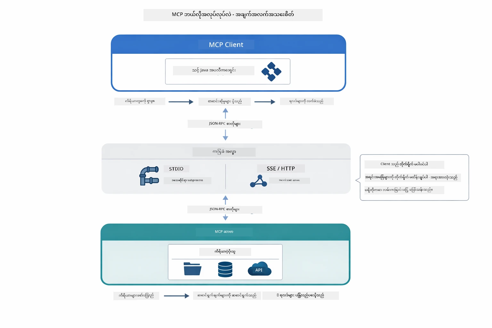

*MCP ၏အတွင်းရေးရာ - client များက ကိရိယာများကို ရှာဖွေပေးပြီး JSON-RPC မက်ဆေ့ချ်များလဲလှယ်ကာ လုပ်ဆောင်ချက်များကို ပို့ဆောင်ခေါ်ယူသည်။*

**ဆာဗာ-ကလိုင်ယက် ဖွဲ့စည်းပုံ**

MCP သည် client-server မော်ဒယ်ကို အသုံးပြုသည်။ ဆာဗာများက ဖိုင်ဖတ်ခြင်း၊ ဒေတာဘေ့စ်စစ်ဆေးခြင်း၊ API ခေါ်ယူခြင်းများအတွက် ကိရိယာများပေးသည်။ Client များ (သင့် AI app) သည် ဆာဗာနှင့် ချိတ်ဆက်ပြီး ကိရိယာများကိုအသုံးပြုသည်။

LangChain4j နှင့် MCP ကို အသုံးပြုရန် Maven dependency ကို ထည့်ပါ။

```xml
<dependency>
    <groupId>dev.langchain4j</groupId>
    <artifactId>langchain4j-mcp</artifactId>
    <version>${langchain4j.version}</version>
</dependency>
```

**ကိရိယာ ရှာဖွေရေး**

Client သည် MCP ဆာဗာနှင့် ချိတ်ဆက်လျှင် "မည်သည့်ကိရိယာများ ရှိပါသလဲ?" ဟု မေးမြန်းသည်။ ဆာဗာသည် လက်ရှိ ရရှိနိုင်သော ကိရိယာစာရင်းကို ဖော်ပြချက်များနှင့် parameter schema များနှင့်အတူ ပြန်ပေးသည်။ သင့် AI agent သည် အသုံးပြုသူလိုအပ်ချက်အရ မည်သည့်ကိရိယာများ သုံးမလဲ သတ်မှတ်နိုင်သည်။ အောက်ဖော်ပြပါပုံတွင် client ၏ `tools/list` request နှင့် ဆာဗာ၏ ကိရိယာများ စာရင်း ပြန်လည်ပို့ဆောင်မှုကို ဖော်ပြထားသည်။

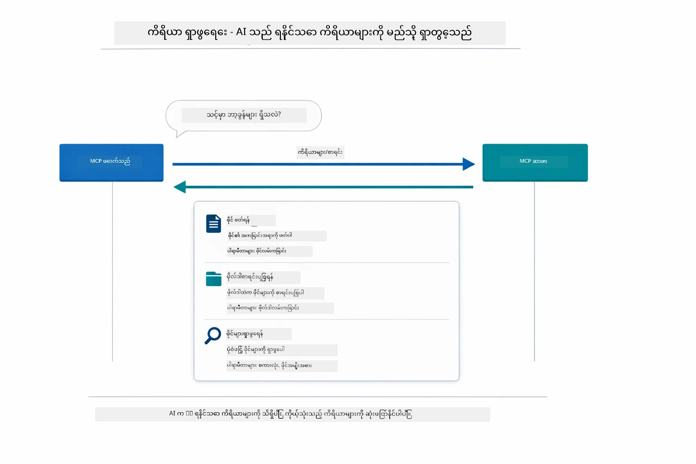

*AI သည် စတင်ချိန်တွင် ရရှိနိုင်သည့် ကိရိယာများကို ရှာဖွေသည်။ ယခုမှာ အင်အားများကို သိရှိပြီး အသုံးပြုရန်ဆုံးဖြတ်နိုင်ပါပြီ။*

**ပို့ဆောင်မှုနည်းလမ်းများ**

MCP သည် တချို့မတူသော ပို့ဆောင်မှုနည်းလမ်းများကို ထောက်ခံသည်။ နှစ်ခုသော ရွေးချယ်စရာမှာ Stdio (ဒေသတွင်း subprocess ဆက်သွယ်မှုအတွက်) နှင့် Streamable HTTP (ဝေးကြားဆာဗာများအတွက်) ဖြစ်သည်။ အဆိုပါ module သည် Stdio transport ကို ပြသပေးပါသည်။


*MCP ပို့ဆောင်မှုနည်းလမ်းများ - ဝေးကြားဆာဗာများက HTTP, ဒေသတွင်းလုပ်ငန်းများအတွက် Stdio*

**Stdio** - [StdioTransportDemo.java](../../../05-mcp/src/main/java/com/example/langchain4j/mcp/StdioTransportDemo.java)

ဒေသတွင်း subprocess များအတွက်။ သင့် application သည် subprocess အဖြစ် ဆာဗာကို spawn လုပ်ပြီး standard input/output သို့ဖြင့် ဆက်သွယ်သည်။ ဖိုင်စနစ်လမ်းကြောင်းအသုံးပြုခြင်း သို့မဟုတ် command-line tools များအတွက် အသုံးဝင်သည်။

```java
McpTransport stdioTransport = new StdioMcpTransport.Builder()
    .command(List.of(
        npmCmd, "exec",
        "@modelcontextprotocol/server-filesystem@2025.12.18",
        resourcesDir
    ))
    .logEvents(false)
    .build();
```

`@modelcontextprotocol/server-filesystem` ဆာဗာသည် သတ်မှတ်ထားသော ဧရိယာများတွင် လက်ခံထားသော ကိရိယာများအား အောက်ပါအတိုင်း ထုတ်ပေးထားသည် -

| ကိရိယာ | ဖော်ပြချက် |
|------|-------------|
| `read_file` | တစ်ခုတည်းသော ဖိုင်အကြောင်းအရာကို ဖတ်ခြင်း |
| `read_multiple_files` | တစ်ခေါက်တွင် ဖိုင်များစွာ ဖတ်ခြင်း |
| `write_file` | ဖိုင်တစ်ခု စတင်ဖန်တီးခြင်း သို့မဟုတ် ကာလာရေးခြင်း |
| `edit_file` | ရည်ရွယ်ချက်ထားရှာဖွေ ပြုပြင်ခြင်း အတွက်ပြောင်းလဲမှုများလုပ်ခြင်း |
| `list_directory` | ကန့်သတ်ရာလမ်းကြောင်းတွင် ဖိုင်နှင့် စာအုပ်စုများ ကို စာရင်းပြုစုခြင်း |
| `search_files` | ပုံစံတစ်ခုနှင့် ကိုက်ညီသော ဖိုင်များကို တစ်လွှားရှာဖွေခြင်း |
| `get_file_info` | ဖိုင်၏ မီတာဒေတာများ (အရွယ်အစား၊ အချိန်မှတ်တမ်းများ၊ ခွင့်ပြုချက်များ) ရယူခြင်း |
| `create_directory` | ဖိုင်စည်းစုတစ်ခု ဖန်တီးခြင်း (မိခင်ဖိုင်စည်းစုများပါ) |
| `move_file` | ဖိုင် သို့မဟုတ် ဖိုင်စည်းစုကို ရွှေ့ဘို့ သို့မဟုတ် အမည်ပြောင်းရန် |

အောက်ပါ ပုံတွင် Stdio transport သည် လည်ပတ်ချိန်တွင် မည်သို့ လည်ပတ်သည်ကို ဖေါ်ပြထားပါသည်။ သင်၏ Java app သည် MCP ဆာဗာကို subprocess အဖြစ် spawn လုပ်ပြီး stdin/stdout စနစ်ဖြင့် ဆက်သွယ်ကြသည်။ network သို့ HTTP မပါသည်။

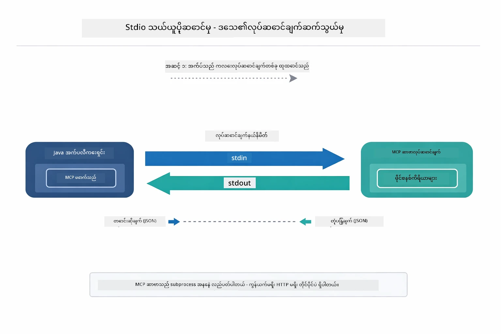

*Stdio transport လေ့လာခြင်း။ သင်၏ app က MCP ဆာဗာကို subprocess အဖြစ် spawn လုပ်ပြီး stdin/stdout တန်ဖိုးဖြင့် ဆက်သွယ်သည်။*

> **🤖 [GitHub Copilot](https://github.com/features/copilot) Chat ဖြင့် စမ်းသပ်ကြည့်ပါ:** [`StdioTransportDemo.java`](../../../05-mcp/src/main/java/com/example/langchain4j/mcp/StdioTransportDemo.java) ဖိုင်ကို ဖွင့်ပြီး မေးမြန်းပါ -
> - "Stdio transport မည်သို့ လည်ပတ်ပြီး အချိန်တန်ဆုံး HTTP အသုံးပြုရနည်းမှာ ဘယ်လိုလဲ?"
> - "LangChain4j သည် MCP ဆာဗာ subprocess များ၏ အသက်တာကို မည်သို့ စီမံခြားနားသလဲ?"
> - "AI ကို ဖိုင်စနစ်ဝင်ရောက်ခွင့် မပေးခဲ့ခြင်း သည် ဘေးကင်းလုံခြုံရေး ဘယ်လို သက်ရောက်မှုရှိသလဲ?"

## The Agentic Module

MCP ပေးသော စံတော်ချိန် ကိရိယာများအပြင် LangChain4j ၏ **agentic module** သည် ထိုကိရိယာများကို စီမံခန့်ခွဲသုံးစွဲသော agent များကို အရေးတော်ပုံအားဖြင့် တည်ဆောက်ရန် နည်းလမ်းမူများပေးသည်။ `@Agent` အမွတ်အသား သို့မဟုတ် `AgenticServices` မှတဆင့် interface များဖြင့် agent နည်းလမ်းများကို သတ်မှတ်နိုင်သည်။

ဤ module တွင် သင်သည် **Supervisor Agent** pattern ကို လေ့လာပါမည်။ ၎င်းသည် အသုံးပြုသူ တောင်းဆိုချက်အပေါ် အခြေခံ၍ sub-agent များကို ဆွဲခေါ်သည့် လွယ်ကူ၍ တိကျသော agentic AI နည်းလမ်းတစ်ခုဖြစ်သည်။ ဤနှစ်ခုကို တွဲစပ်၍ မော်ဂျူးတစ်ခု၌ MCP ထောက်ပံ့သော ဖိုင်ဝင်ရောက်ခြင်း sub-agent ကို ထည့်သွင်းပါမည်။

agentic module ကို အသုံးပြုရန် Maven dependency ကို ထည့်ပါ။

```xml
<dependency>
    <groupId>dev.langchain4j</groupId>
    <artifactId>langchain4j-agentic</artifactId>
    <version>${langchain4j.mcp.version}</version>
</dependency>
```
> **မှတ်ချက်:** `langchain4j-agentic` module သည် အခြား LangChain4j core libraries မတူကွဲပြားသည့် နောက်ဆုံးထုတ် version property (`langchain4j.mcp.version`) ကို အသုံးပြုသည်။

> **⚠️ စမ်းသပ်မှုအဆင့်:** `langchain4j-agentic` module သည် **စမ်းသပ်မှုအဆင့်တွင်ရှိကြောင်း** ဖြစ်ပြီး ပြောင်းလဲမှုများ ဖြစ်နိုင်သည်။ AI အကူအညီများ တည်ဆောက်ရာတွင် Stable နည်းလမ်းမှာ `langchain4j-core` နှင့် သင့်ကိုယ်ပိုင်ကိရိယာများဖြစ်ပြီး (Module 04) ဖြစ်သည်။

## Running the Examples

### Prerequisites

- [Module 04 - Tools](../04-tools/README.md) ကို ပြီးစီးထားခြင်း (ဤ module သည် custom tool ကြောင်းများနှင့် MCP tools နှိုင်းယှဉ်ပြောကြားသည်)
- Root directory တွင် `.env` ဖိုင်ရှိရန် (Module 01 တွင် `azd up` ဖြင့် ဖန်တီးထားသော Azure အရည်အချင်း)
- Java 21+, Maven 3.9+
- Node.js 16+ နှင့် npm (MCP ဆာဗာများအတွက်)

> **မှတ်ချက်:** သင့်ပတ်ဝန်းကျင် environment variables မသတ်မှတ်ရသေးပါက [Module 01 - Introduction](../01-introduction/README.md) တွင် ရှေ့ဆောင်စီမံချက်များ (ဉပမာ `azd up` မှ `.env` ဖိုင် ကို အလိုအလျောက်ဖန်တီးသည်)၊ သို့မဟုတ် `.env.example` ကို root directory တွင် `.env` အဖြစ် ကူးယူပြီး သင့်တန်ဖိုးများ ဖြည့်သွင်းပါ။

## Quick Start

**VS Code အသုံးပြုသူများ:** Explorer မှ တစ်ခုချင်း ပြုလုပ်လိုသော demo ဖိုင်ကို ညာကလစ်နှိပ်ပြီး **"Run Java"** ရွေးချယ်ပါ၊ သို့မဟုတ် Run and Debug panel မှ launch configuration များကို အသုံးပြုနိုင်သည်၊ `.env` ဖိုင် (Azure အရည်အချင်း ဖြည့်ထားသည်) ပါရမည်။

**Maven အသုံးပြုသူများ:** command line ဖြင့် အောက်ပါ ဥပမာများနှင့် ပြေးနိုင်သည်။

### File Operations (Stdio)

ဤအပိုင်းသည် ဒေသတွင်း subprocess အခြေပြု ကိရိယာများကို ပြသသည်။

**✅ မလိုအပ်သော အကြိုကြို တုန့်ပြန်မှု** - MCP ဆာဗာကို အလိုအလျောက် ဖြုတ်ထောင်ပေးပါသည်။

**Start Scripts အသုံးပြုခြင်း (အကြံပြုချက်):**

Start script များသည် root `.env` ဖိုင်မှ environment variables များကို အလိုအလျောက် ထည့်သွင်းပေးသည် -

**Bash:**
```bash
cd 05-mcp
chmod +x start-stdio.sh
./start-stdio.sh
```

**PowerShell:**
```powershell
cd 05-mcp
.\start-stdio.ps1
```

**VS Code အသုံးပြုသူများ:** `StdioTransportDemo.java` ကို ညာကလစ်နှိပ်ပြီး **"Run Java"** ရွေးပါ (`.env` ဖြည့်သွင်းထားရန် သေချာပါစေ)။

application သည် MCP server filesystem ကို subprocess အဖြစ် spawn လုပ်ကာ ဒေသတွင်းဖိုင်တစ်ခု ဖတ်ပါမည်။ subprocess ကို မည်သို့ စီမံရန်ကို သတိပြုပါ။

**မျှော်မှန်းထားသော အထွက်:**
```
Assistant response: The file provides an overview of LangChain4j, an open-source Java library
for integrating Large Language Models (LLMs) into Java applications...
```

### Supervisor Agent

**Supervisor Agent pattern** သည် agentic AI ၏ **ပြောင်းလဲနိုင်သည့်** ပုံစံတစ်ခုဖြစ်သည်။ Supervisor သည် အသုံးပြုသူ တောင်းဆိုချက်အပေါ် မူတည်၍ တိုက်ရိုက် agent များကို ချိန်ညှိခေါ်ယူရန် LLM ကို အသုံးပြုသည်။ နောက်တစ်ဥပမာတွင် MCP ပါသော ဖိုင် ဝင်ရောက်ခွင့်အပြင် LLM Agent ကို တွဲစပ်ပြီး ဖိုင် ဖတ် → အစီရင်ခံဖန်တီး တို့ကို supervised ပုံစံဖြင့် ပြသသည်။

demo တွင် `FileAgent` သည် MCP filesystem ကိရိယာ များဖြင့် ဖိုင်ဖတ်ပြီး `ReportAgent` သည် အုပ်ချုပ်မှုပေါ်လစီ (တစ်ဝေါဟာရ)၊ အချက်အရုံး ၃ ခုနှင့် အကြံပြုချက်များ ပါဝင်သော တိကျစွာ ခွဲခြားပြုစုထားသောအစီရင်ခံစာ တစ်စောင် ဖန်တီးသည်။ Supervisor သည် ဤစီးရီးကို အလိုအလျောက် စီမံလုပ်ဆောင်သည် -

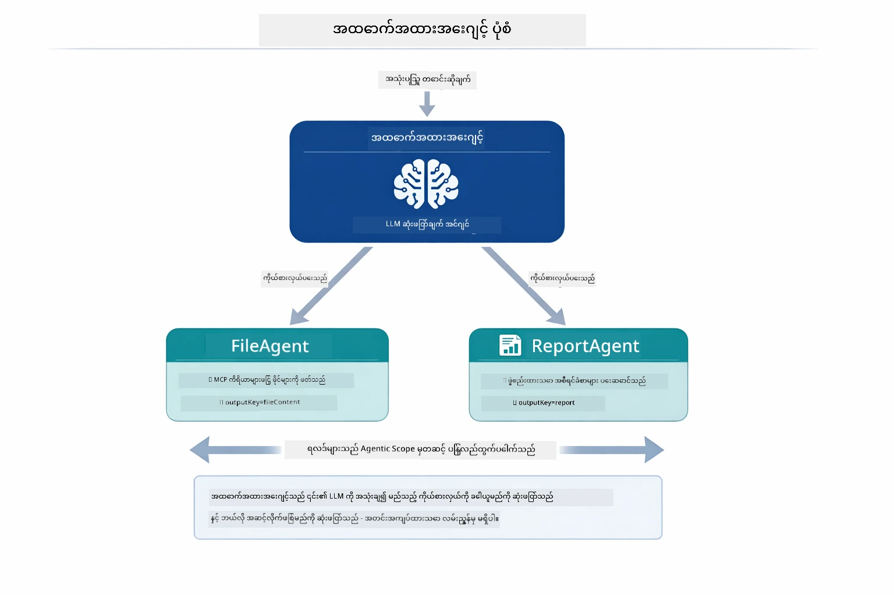

*Supervisor သည် ၎င်း၏ LLM ဖြင့် မည်သည့် agent များခေါ်ယူရမည်နှင့် ဘယ်အစီအစဉ်ဖြင့် ဆောင်ရွက်ရမည်ကို ဆုံးဖြတ်သည် - လမ်းညွှန်မှုစနစ်မလိုအပ်။*

ကြ具体စွာ ဖိုင်မှအစီရင်ခံသို့ သွားသည့် အလုပ်စဉ် -

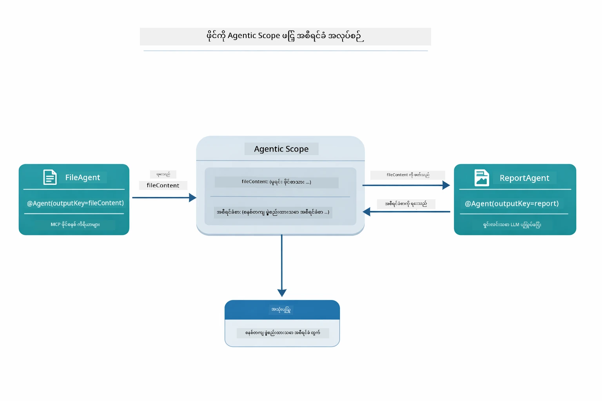

*FileAgent သည် MCP ကိရိယာများမှတဆင့် ဖိုင်ဖတ်ပြီး ReportAgent သည် မတည့်မှီ အစီရင်ခံစာ ဖန်တီးသည်။*

အောက်ပါ စီမံခန့်ခွဲမှုဆက်တိုက် ပုံကို Supervisor ၏ သာမန်လည်ပတ်မှုကို ဖော်ပြသည်။ MCP server spawn မှ စတင်၍ Supervisor ၏ ကိုယ်တိုင် agent ရွေးချယ်ရေး၊ stdio ဖြင့် ကိရိယာခေါ်ယူမှု နှင့် နောက်ဆုံးအစီရင်ခံစာထုတ်ပေးမှုအထိ။

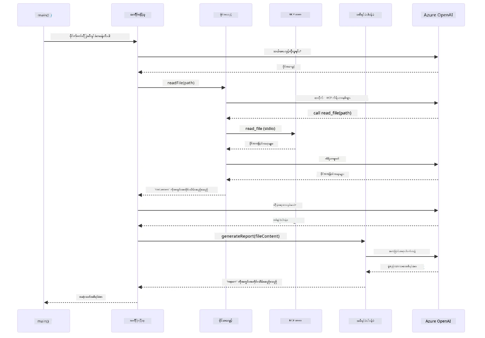

*Supervisor သည် FileAgent ကို ကိုယ်တိုင် ခေါ်ယူပြီး MCP server ကို stdio မှတဆင့် ဖိုင်ဖတ်ခေါ်ယူသည်။ ထို့နောက် ReportAgent ကို ခေါ်ယူကာ တိကျစွာ ဖော်ပြထားသောအစီရင်ခံစာကို ပြန်ပေးသည်။ သာမန်အားဖြင့် မည်သည့် agent က output မဆို shared Agentic Scope တွင် သိမ်းဆည်းသည်။*

Agent တစ်ဦးချင်းစီသည် output ကို **Agentic Scope** (မျှဝေသော မှတ်ဉာဏ်) တွင် သိမ်းဆည်းကာ downstream agent များသည် ယခင် ရလဒ်များကို access ရန် အလွယ်တကူ ဖြစ်စေရသည်။ MCP ကိရိယာများကို agentic workflow များတွင် ဆက်သွယ်သုံးစွဲမှုကို ဤနေရာမှ ကြည့်ရှုနိုင်သည်။ Supervisor သည် file မည်သို့ဖတ်သည်ကို မသိလိုပဲ၊ `FileAgent` သည် စွမ်းဆောင်နိုင်သည်ဆိုတာသာ သိရှိထားသည်။

#### Running the Demo

start script များသည် root `.env` ဖိုင်မှ environment variables များကို အလိုအလျောက် ထည့်သွင်းပေးသည် -

**Bash:**
```bash
cd 05-mcp
chmod +x start-supervisor.sh
./start-supervisor.sh
```

**PowerShell:**
```powershell
cd 05-mcp
.\start-supervisor.ps1
```

**VS Code အသုံးပြုသူများ:** `SupervisorAgentDemo.java` ကို ညာကလစ်နှိပ်ပြီး **"Run Java"** ရွေးပါ (`.env` ဖြည့်သွင်းထားရန် သေချာပါစေ)။

#### How the Supervisor Works

Agent များ တည်ဆောက်ရန်မတိုင်မီ MCP transport ကို client နဲ့ ချိတ်ဆက်ပြီး `ToolProvider` အဖြစ် wrap လုပ်ရန် လိုအပ်သည်။ MCP server ၏ ကိရိယာများသည် ဒီလိုနဲ့ agent များအသုံးပြုနိုင်သည်။

```java
// ပို့ဆောင်ရေးမှ MCP ဖောက်သည်ကိုဖန်တီးပါ
McpClient mcpClient = new DefaultMcpClient.Builder()
        .transport(stdioTransport)
        .build();

// ဖောက်သည်ကို ToolProvider အဖြစ် အထုပ်ဖုံးပါ — ဒါက MCP ကိရိယာတွေကို LangChain4j သို့ ချိတ်ဆက်ပေးတယ်
ToolProvider mcpToolProvider = McpToolProvider.builder()
        .mcpClients(List.of(mcpClient))
        .build();
```

ယခု `mcpToolProvider` ကို MCP ကိရိယာ အသုံးပြုလိုသော agent များတွင် ထည့်သွင်းထားနိုင်သည် -

```java
// အဆင့် ၁: FileAgent သည် MCP ကိရိယာများကို အသုံးပြု၍ ဖိုင်များကို ဖတ်ပါသည်
FileAgent fileAgent = AgenticServices.agentBuilder(FileAgent.class)
        .chatModel(model)
        .toolProvider(mcpToolProvider)  // ဖိုင်ဆိုင်ရာ လုပ်ဆောင်မှုများအတွက် MCP ကိရိယာများ ရှိသည်
        .build();

// အဆင့် ၂: ReportAgent သည် ဖွဲ့စည်းထားသော အစီရင်ခံစာများကို ဖန်တီးပါသည်
ReportAgent reportAgent = AgenticServices.agentBuilder(ReportAgent.class)
        .chatModel(model)
        .build();

// Supervisor သည် ဖိုင် → အစီရင်ခံစာ လုပ်ငန်းစဉ်ကို စီမံခန့်ခွဲသည်
SupervisorAgent supervisor = AgenticServices.supervisorBuilder()
        .chatModel(model)
        .subAgents(fileAgent, reportAgent)
        .responseStrategy(SupervisorResponseStrategy.LAST)  // နောက်ဆုံး အစီရင်ခံစာကို ပြန်လည်ပေးပို့သည်
        .build();

// Supervisor သည် တောင်းဆိုချက်အပေါ် အခြေခံ၍ အေးဂျင့်များကို ခေါ်ယူရန်ဆုံးဖြတ်သည်
String response = supervisor.invoke("Read the file at /path/file.txt and generate a report");
```

#### How FileAgent Discovers MCP Tools at Runtime

သင်တွေးမိနေမည့်အချက်- **FileAgent သည် npm filesystem ကိရိယာ များကို runtime တွင် မည်သို့အသုံးပြုသလဲ?** မတူဘဲ၊ **LLM** သည် tool schema များမှတဆင့် အလုပ်လုပ်သော ပုံစံ ရှာဖွေသည်။
`FileAgent` အင်တာဖေ့စ်ကတော့ **prompt သတ်မှတ်ချက်** တစ်ခုပဲ ဖြစ်ပါတယ်။ အဲဒါမှာ `read_file`, `list_directory` ဒါမှမဟုတ် အခြား MCP ကိရိယာများအကြောင်း ကြောင်းဟာ ကျစ်လစ်ထားမှုမရှိပါဘူး။ ဒီအောက်က အဆုံးသတ် အဆင့်ချင်း ဖြစ်ပေါ်ချိန်တွေကို ဖော်ပြထားပါတယ်-

1. **ဆာဗာစတင်ခြင်း** - `StdioMcpTransport` က `@modelcontextprotocol/server-filesystem` npm package ကို အမျိုးသမီးလုပ်ငန်းအဖြစ် စတင်လှုပ်ရွားစေပါတယ်
2. **ကိရိယာ ရှာဖွေခြင်း** - `McpClient` က ဆာဗာဆီ `tools/list` JSON-RPC တောင်းဆိုချက်တစ်ခု ပို့ပြီး၊ ဆာဗာက ကိရိယာနာမည်များ၊ ဖော်ပြချက်များနဲ့ parameter schema များ (ဥပမာ- `read_file` — *"ဖိုင်တစ်ခုရဲ့ ပြည့်စုံတဲ့အကြောင်းအရာကို ဖတ်ရှုခြင်း"* — `{ path: string }`) ကို တုံ့ပြန်ပါတယ်
3. **Schema ထည့်သွင်းခြင်း** - `McpToolProvider` က ဒီ schema တွေကိုထုပ်ပိုးပြီး LangChain4j အတွက် အသုံးပြုနိုင်အောင်လုပ်ပါတယ်
4. **LLM ဆုံးဖြတ်ချက်** - `FileAgent.readFile(path)` က ခေါ်တဲ့အခါ LangChain4j က system message, user message နှင့် **ကိရိယာ schema များစာရင်း** ကို LLM ကို ပို့ပါတယ်။ LLM က ကိရိယာ ဖော်ပြချက်တွေကို ဖတ်ပြီး ကိရိယာခေါ်ဆိုမှုတစ်ခု ရေးဆွဲပါသည် (ဥပမာ - `read_file(path="/some/file.txt")`)
5. **အကောင်အထည်ဖော်ခြင်း** - LangChain4j က ကိရိယာခေါ်ဆိုမှုကို ဖမ်းယူပြီး MCP client မှတဆင့် Node.js subprocess ကို ပြန်လည် လမ်းညွှန်ပြီး ရလဒ်ကို ရယူကာ LLM ကို ပြန်ထုတ်ပေးသည်

ဒါဟာ အထက်မှာဖော်ပြခဲ့တဲ့ [Tool Discovery](../../../05-mcp) စနစ်နဲ့ တူညီပြီး အထူးသဖြင့် အေးဂျင့် workflow ကို သက်ဆိုင်ရာဖြစ်အောင် လုလုပ်ထားတာပါ။ `@SystemMessage` နှင့် `@UserMessage` annotation တွေက LLM ၏ အပြုအမူကို လမ်းညွှန်ပေးပြီး၊ ထည့်သွင်းထားသော `ToolProvider` ကတော့ **စွမ်းရည်များ** ပေးပြီး LLM ကို runtime မှာ ဆက်သွယ်ပေးပါတယ်။

> **🤖 [GitHub Copilot](https://github.com/features/copilot) Chat နဲ့ ကြိုးစားကြည့်ပါ:** [`FileAgent.java`](../../../05-mcp/src/main/java/com/example/langchain4j/mcp/agents/FileAgent.java) ဖိုင်ကို ဖွင့်ပြီး စုံစမ်းမေးမြန်းနိုင်ပါတယ်။
> - "ဒီ agent က MCP ကိရိယာတစ်ခုကို ဘယ်လိုသိပြီး ခေါ်လဲ?"
> - "Agent builder မှ ToolProvider ကို ဖယ်ရှားခဲ့ရင် ဘာတွေဖြစ်မလဲ?"
> - "Tool schema တွေကို LLM ဆီ ဘယ်လိုပို့ကြလဲ?"

#### တုံ့ပြန်မှု မဟာဗျူဟာများ

`SupervisorAgent` ကို သတ်မှတ်တဲ့အခါ သုံးစွဲသူကို sub-agent တွေ တာဝန်လုပ်ပြီးပြီးဆုံးပြီးနောက်မှာ မည်သို့ အဖြေတစ်ခု ဖော်ဆောင်မယ်ဆိုတာ သတ်မှတ်နိုင်ပါတယ်။ အောက်ပါ ဇယားမှာ ရရှိနိုင်တဲ့ မဟာဗျူဟာ ၃ မျိုးကို ပြထားပြီး- LAST က နောက်ဆုံး agent ရဲ့ ထွက်ရှိမှုကိုတိုက်ရိုက်ပေးပြီး၊ SUMMARY က အားလုံးကို LLM နဲ့ စုပေါင်းချုပ်ဆိုပြီး၊ SCORED က တစ်ခုချင်းစီကို user တောင်းဆိုချက်နဲ့ လိုက်၍ အဆင့်သတ်မှုပေးတဲ့ အမြင့်ဆုံးကို ရွေးချယ်ပါတယ်-

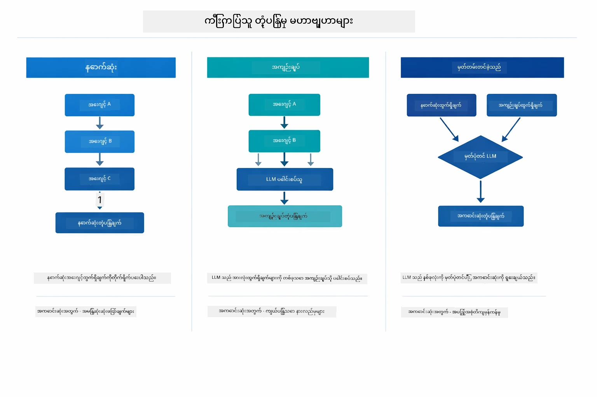

*Supervisor က မည်သို့မဟာဗျူဟာသုံးပြီး အဖြေ ဖော်ဆောင်မလဲဆိုတာ — နောက်ဆုံး agent ထွက်ရှိမှုရှိတာ၊ စုပေါင်းရေးသားချက်တစ်ခု၊ ဒါမှမဟုတ် အကောင်းဆုံး အဆင့်ရတာကို ရွေးချယ်ပါ။*

ရရှိနိုင်သော မဟာဗျူဟာများမှာ -

| မဟာဗျူဟာ | ဖော်ပြချက် |
|--------------|------------|
| **LAST** | Supervisor က နောက်ဆုံး sub-agent ဒါမှမဟုတ် ကိရိယာခေါ်ဆိုမှုရဲ့ ထုတ်ကုန်ကို ပြန်ပေးသည်။ ဒီဟာက workflow ရဲ့ နောက်ဆုံး agent ကို အထူးပုံစံဖြင့် ပြည့်စုံသော နောက်ဆုံးအဖြေ တစ်ခုထုတ်ဖော်ဖို့ အသုံးဝင်ပါတယ် (ဥပမာ - ဂုဏ်သတင်းရ မှတ်တမ်း "Summary Agent")။ |
| **SUMMARY** | Supervisor က မိမိအတွင်းရေးသားထားတဲ့ Language Model (LLM) ကို အသုံးပြုပြီး interaction အားလုံးနဲ့ sub-agent ထုတ်ကုန်တွေ၊ ဖော်ပြချက်များကို စုပေါင်းဖော်ျပပြီး နောက်ဆုံးအဖြေအဖြစ် ပြန်ပေးသည်။ ဒီနည်းဟာ သန့်ရှင်းပြီး စုပေါင်းထားတဲ့ အဖြေတစ်ခုဖြစ်ပါတယ်။ |
| **SCORED** | စနစ်က အတွင်းရေးသား LLM ကိုအသုံးပြုပြီး LAST အဖြေ နဲ့ SUMMARY အဖြေ နှစ်ခုကို မူလ user တောင်းဆိုချက်နှင့် ကိုက်ညီမှုကို အဆင့်သတ်မှုပေးကာ အဆင့်ပိုမြင့်တဲ့ကို ပြန်ပေးပါတယ်။ |

ပြီးပြည့်စုံသော implementation အတွက် [SupervisorAgentDemo.java](../../../05-mcp/src/main/java/com/example/langchain4j/mcp/SupervisorAgentDemo.java) ကို ကြည့်ရှုနိုင်ပါတယ်။

> **🤖 [GitHub Copilot](https://github.com/features/copilot) Chat နဲ့ ကြိုးစားကြည့်ပါ:** [`SupervisorAgentDemo.java`](../../../05-mcp/src/main/java/com/example/langchain4j/mcp/SupervisorAgentDemo.java) ဖိုင်ကို ဖွင့်ပြီး မေးမြန်းကြည့်ပါ-
> - "Supervisor က ဘယ်လို agent တွေကိုခေါ်ရမယ်ဆိုတာဆုံးဖြတ်လဲ?"
> - "Supervisor နဲ့ Sequential workflow များအကြားကွာခြားချက်ဘာလဲ?"
> - "Supervisor ရဲ့ စီမံကိန်းအပြုအမူတွေကို ဘယ်လိုစိတ်ကြိုက်ချိန်ညှိနိုင်မလဲ?"

#### ထွက်ရှိမှုနားလည်ခြင်း

Demo ကို run လုပ်တဲ့အခါ Supervisor က မျှော်မှန်းထားတဲ့ agent အများအပြားကို ဘယ်လို စုပေါင်းလည်ပတ်နေတယ်ဆိုတာ ပြသတဲ့ စနစ်တကျ လမ်းညွှန်ချက်တွေကို တွေ့မြင်ရပါမယ်။ အပိုင်းတွေကို ပို၍ ရှင်းပြရမယ်ဆိုရင်-

```
======================================================================
  FILE → REPORT WORKFLOW DEMO
======================================================================

This demo shows a clear 2-step workflow: read a file, then generate a report.
The Supervisor orchestrates the agents automatically based on the request.
```

**ခေါင်းစဉ်** က workflow မူလတည်နေရာကို မိတ်ဆက်ပါတယ် - ဖိုင်ဖတ်ခြင်းကနေ အစီရင်ခံစာ ရေးဆွဲခြင်းအထိ ဦးတည်ထားတဲ့ pipeline တစ်ခုဖြစ်ပါတယ်။

```
--- WORKFLOW ---------------------------------------------------------
  ┌─────────────┐      ┌──────────────┐
  │  FileAgent  │ ───▶ │ ReportAgent  │
  │ (MCP tools) │      │  (pure LLM)  │
  └─────────────┘      └──────────────┘
   outputKey:           outputKey:
   'fileContent'        'report'

--- AVAILABLE AGENTS -------------------------------------------------
  [FILE]   FileAgent   - Reads files via MCP → stores in 'fileContent'
  [REPORT] ReportAgent - Generates structured report → stores in 'report'
```

**Workflow ပုံစံ** က agent တွေရဲ့ ဒေတာလှိုင်းသွားလာမှုကို ပြသသည်။ agent တစ်ခုချင်းစီမှာ အထူးပါဝင်မှုရှိသည်။
- **FileAgent** က MCP tools သုံးပြီး ဖိုင်ဖတ်ကာ `fileContent` မှာ ထားသည်
- **ReportAgent** က အဲဒီ content ကိုသုံးပြီး `report` အဖြစ် စနစ်တကျ အစီရင်ခံစာ ထုတ်လုပ်သည်

```
--- USER REQUEST -----------------------------------------------------
  "Read the file at .../file.txt and generate a report on its contents"
```

**User Request** က တာဝန်ပေးပို့ထားတဲ့ အခြေအနေကို ပြပါသည်။ Supervisor က ဒီကို ဖတ်ပြီး FileAgent → ReportAgent ကို ခေါ်ဖို့ ဆုံးဖြတ်ထားသည်။

```
--- SUPERVISOR ORCHESTRATION -----------------------------------------
  The Supervisor decides which agents to invoke and passes data between them...

  +-- STEP 1: Supervisor chose -> FileAgent (reading file via MCP)
  |
  |   Input: .../file.txt
  |
  |   Result: LangChain4j is an open-source, provider-agnostic Java framework for building LLM...
  +-- [OK] FileAgent (reading file via MCP) completed

  +-- STEP 2: Supervisor chose -> ReportAgent (generating structured report)
  |
  |   Input: LangChain4j is an open-source, provider-agnostic Java framew...
  |
  |   Result: Executive Summary...
  +-- [OK] ReportAgent (generating structured report) completed
```

**Supervisor အတန်းချုပ်** ၂ အဆင့် လည်ပတ်မှုကို ပြသသည်-
1. **FileAgent** က MCP မှတဆင့် ဖိုင်ဖတ်ကာ ထည့်သွင်းသည်
2. **ReportAgent** က အဲဒီ content ကို လက်ခံပြီး စနစ်တကျ အစီရင်ခံစာ ရေးဆွဲသည်

Supervisor ရဲ႕ ဆုံးဖြတ်ချက်တွေဟာ **သုံးစွဲသူ တောင်းဆိုချက်အပေါ် အလိုအလျောက်** ဖြစ်ပေါ်ခဲ့တာ ဖြစ်ပါတယ်။

```
--- FINAL RESPONSE ---------------------------------------------------
Executive Summary
...

Key Points
...

Recommendations
...

--- AGENTIC SCOPE (Data Flow) ----------------------------------------
  Each agent stores its output for downstream agents to consume:
  * fileContent: LangChain4j is an open-source, provider-agnostic Java framework...
  * report: Executive Summary...
```

#### Agentic Module အင်္ဂါရပ် ရှင်းပြချက်

ဥပမာမှာ agentic module ရဲ့ တိုးတက်သော အင်္ဂါရပ်အချို့ကို ဖော်ပြကြသည်။ Agentic Scope နှင့် Agent Listener တွေကို နည်းနည်းနားလည်ကြည့်ကြမယ်။

**Agentic Scope** က agents တွေအကြားရေရှည်သုံး memory များကို ပြသသည်၊ `@Agent(outputKey="...")` သုံးကာ အစီအစဉ်တစ်ခုလုံးမှာ အချက်အလက်များ တင်သိမ်းသည်။ ဒီဟာကကြောင့် -
- နောက်က agents တွေဟာ ယခင် agents ထုတ်ကုန်တွေကြည့်ရှု လုပ်ဆောင်နိုင်သည်
- Supervisor က နောက်ဆုံးအဖြေ ပြန်လည် စုပေါင်းနိုင်သည်
- သင်က agent တစ်ခုချင်းစီ ထုတ်လုပ်ခဲ့တာကို ကြည့်ရှုနိုင်သည်

အောက်ပါတစ်ပုံဟာ Agentic Scope အလုပ်လုပ်ပုံကို ဖိုင်မှအစီရင်ခံစာ workflow အတွင်း အချင်းချင်း memory ကို ပြသသည် — FileAgent က `fileContent` ဆိုတဲ့ key နဲ့ ထုတ်ကုန်ရေးသားပြီး ReportAgent က ဖတ်ရှုပြီး `report` key နဲ့ ရေးသားသည်-

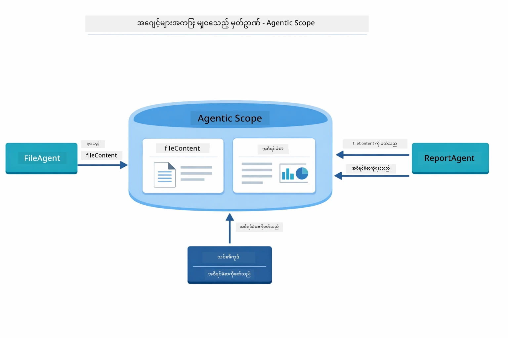

*Agentic Scope က shared memory အတူတူ အသုံးပြုနေခြင်းဖြစ်သလို- FileAgent က `fileContent` ဖော်ပြတယ်, ReportAgent က ဖတ်ပြီး `report` ကို ရေးတယ်၊ ကုဒ်ထဲမှာ နောက်ဆုံးရလဒ်ကို ဖတ်ရှုနိုင်တယ်။*

```java
ResultWithAgenticScope<String> result = supervisor.invokeWithAgenticScope(request);
AgenticScope scope = result.agenticScope();
String fileContent = scope.readState("fileContent");  // FileAgent မှ Raw ဖိုင်ဒေတာ
String report = scope.readState("report");            // ReportAgent မှ ဖွဲ့စည်းထားသောအစီရင်ခံစာ
```

**Agent Listeners** က agent အကောင်အထည်ဖော်မှု့ကို စစ်ဆေးခြင်းနဲ့ debugging အတွက် အသုံးပြုသည်။ Demo မှာ မြင်တွေ့နေတာက AgentListener တစ်ခုက agent တစ်ခုချင်း အခေါ်အဝေါ်မှာ လုပ်ဆောင်မှုပြသခြင်းဖြစ်သည်။
- **beforeAgentInvocation** - Supervisor က agent ကို ရွေးချယ်ချိန်မှာ လုပ်ဆောင်မှု့မပြုမီ ခေါ်သည်၊ ဘယ် agent ရွေးလိုက်တယ်၊ ဘာကြောင့်တယ် ကြည့်ရှုနိုင်
- **afterAgentInvocation** - agent အလုပ်ပြီးဆုံးသည့်အခါ ခေါ်သည်၊ ထွက်ရှိမှုကို ပြသသည်
- **inheritedBySubagents** - true ဖြစ်ရင် hierarchy ရှိ အားလုံး agents ကို စောင့်ကြပ်သည်

အောက်ပါ ပုံက Agent Listener ၏ လည်ပတ်မှုဇယားကို ပြသည်၊ `onError` က agent အလုပ်လုပ်စဉ် အကြောင်းအရာ မအောင်မြင်ချိန်ကို ကိုင်တွယ်သည်။

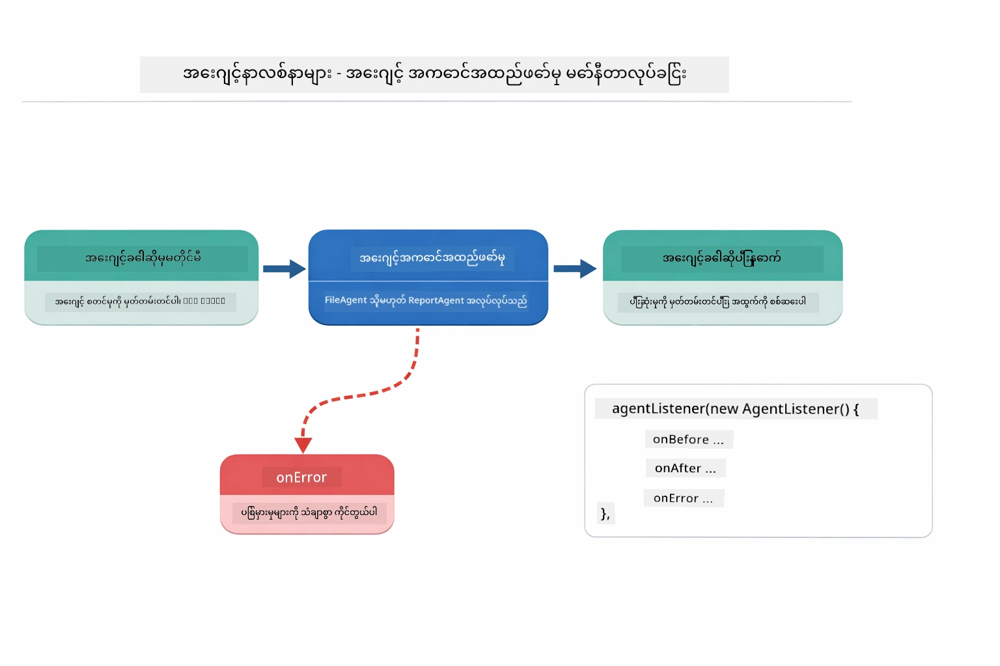

*Agent Listeners က အကောင်အထည်ဖော်မှု့လုပ်ငန်းစဉ်ကို ဟက်စ်ပြီး စောင့်ကြပ်သည်၊ agent စတင်ခြင်း၊ ပြီးဆုံးခြင်း၊ အမှားများ ဖြစ်ပေါ်ချိန်ကို တွေ့မြင်နိုင်သည်။*

```java
AgentListener monitor = new AgentListener() {
    private int step = 0;
    
    @Override
    public void beforeAgentInvocation(AgentRequest request) {
        step++;
        System.out.println("  +-- STEP " + step + ": " + request.agentName());
    }
    
    @Override
    public void afterAgentInvocation(AgentResponse response) {
        System.out.println("  +-- [OK] " + response.agentName() + " completed");
    }
    
    @Override
    public boolean inheritedBySubagents() {
        return true; // အုပ်ချုပ်ရေးဆိုင်ရာအားလုံးထိ ထိုးနှံပေးရန်
    }
};
```

Supervisor pattern မဟုတ်သေးတဲ့အတွက် `langchain4j-agentic` module က workflow patterns သုံးစွဲမှု description မျိုးစုံ ပေးရှိသည်။ ပုံမှာ ၅ မျိုးအားလုံး ရှိပါသည် - ရိုးရှင်းတဲ့ sequential pipeline ကနေ လူကထည့်သုံးရတဲ့ approval workflow အထိ။

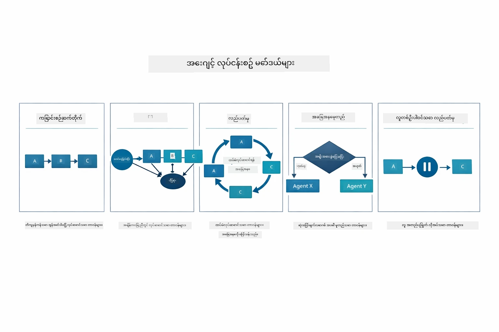

*Agent တွေကို တိုက်ရိုက်ဆောင်ရွက်ပုံ - ရိုးရှင်းတဲ့ pipeline ကနေ လူအာရုံပါရှိ approval workflow တွေအထိ*

| ပုံစံ | ဖော်ပြချက် | အသုံးပြုမှု |
|---------|-------------|------------|
| **Sequential** | Agent တွေကို အစဉ်လိုက် အကောင်အထည်ဖော်သည်၊ ထွက်ရှိမှု နောက် agent သို့ စီးဆင်းသည် | Pipeline များ- သုတေသန → 分석 → အစီရင်ခံစာ |
| **Parallel** | Agent များကို တပြိုင်နက်ထဲ ကောလဟာလပြုလုပ်သည် | လွတ်လပ်သော တာဝန်များ- မိုးလေဝသ + သတင်း + စတော့ရှယ်ယာ |
| **Loop** | သတ်မှတ်ချက်တက်ဖြစ်သည်အထိ ထပ်မံပြုလုပ်သည် | အရည်အသွေးကို အဆင့်သတ်မှုပေးရန်- အဆင့် ≥ 0.8 ရိုက်ထည့်ရာ |
| **Conditional** | သတ်မှတ်ချက်ပေါ် မူတည်၍ လမ်းညွှန်ပေးသည် | ခွဲခြားပြီး → အထူးပြု agent ထံ ပို့ဆောင် |
| **Human-in-the-Loop** | လူ checkpoint များ ထည့်သွင်းသည် | အတည်ပြုမှု workflow များ, အကြောင်းအရာ သုံးသပ်ခြင်း |

## အဓိက မှတ်ချက်များ

MCP နဲ့ agentic module ကို လက်တွေ့အသုံးပြုပြီး ကြည့်တဲ့အခါ ဆုံးဖြတ်ချက်ချရန်အဆင်ပြေအောင် အောက်ပါ အချက်အလက်တွေကို မှတ်သားပါ။

MCP ၏ အရေးကြီးဆုံးအားသာချက်တစ်ခုကတော့ ၎င်း၏ တိုးတက်လာတဲ့ ecosystem ဖြစ်ပါတယ်။ အောက်ပါ ပုံမှာ universal protocol တစ်ခုက သင့် AI app ကို MCP server များအမျိုးမျိုး - filesystem၊ ဒေတာစနစ်၊ GitHub၊ email၊ web scraping စတဲ့အရာတွေနဲ့ ဘယ်လို ချိတ်ဆက်ပေးတာကို ပြထားပါတယ်-

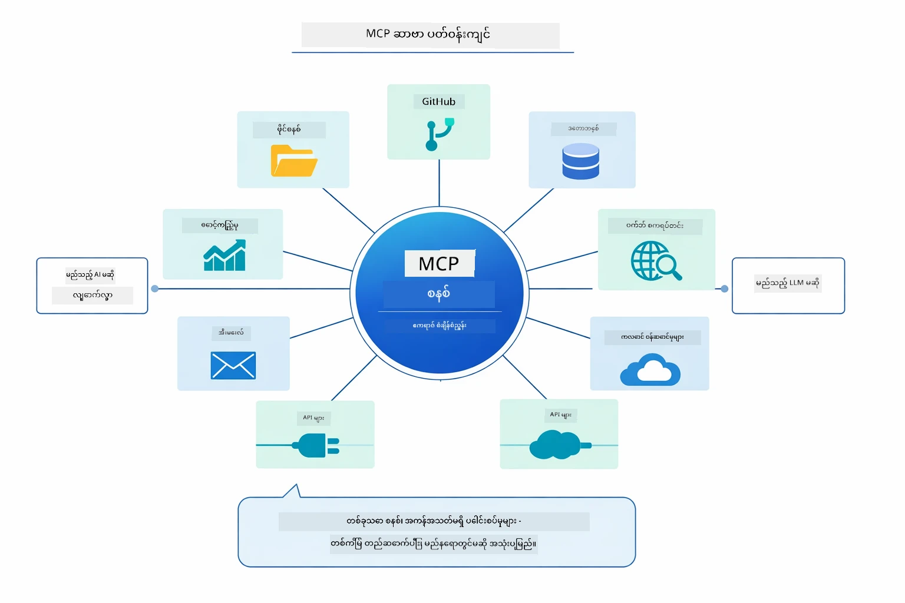

*MCP က universal protocol ecosystem ဆောက်ပေးတာ ဖြစ်ပြီး - MCP-compatible server များ၊ MCP-compatible client များ အချင်းချင်း လုပ်ဆောင်နိုင်၊ ကိရိယာမျှဝေမှု အပေါ် ပံ့ပိုးပေးသည်။*

**MCP** ကို သင် ချိတ်ဆက်ထားသော tool ecosystem များကို အသုံးချချင်တဲ့အခါ၊ တစ်ခါမှ မတူတဲ့ app များနှင့် tool များသုံးချင်တဲ့အခါ၊ third-party ဝန်ဆောင်မှုများနှင့် standard protocol များ ကျင့်သုံးချင်တဲ့အခါ၊ implementation ကို မပြောင်းဘဲ tool swapping လုပ်ချင်တဲ့အခါ အသုံးပြုတတ်ပါတယ်။

**Agentic Module** ဟာ `@Agent` annotation တွေနဲ့ declarative agent ဖန်တီးချင်တဲ့အခါ၊ workflow orchestration (sequential, loop, parallel) လိုချင်တဲ့အခါ၊ interface-based agent ဒီဇိုင်းအပေါ် အခြေခံပြီး imperative code မှာ ဦးတည်မှု နည်းတဲ့အခါ၊ output share လုပ်ဖို့ `outputKey` နဲ့ agents များပေါင်းစပ်ချင်တဲ့အခါ အသုံးဝင်ပါတယ်။

**Supervisor Agent pattern** က workflow ကို ကြိုတင်မသိရှိနိုင်တဲ့ကိစ္စမှာ၊ agents များကို dynamic မဟာဗျူဟာနဲ ့လိုချင်တဲ့အခါ၊ နွယ်နေတဲ့ conversatonal systems တွေမှာ capability မှန်ကန်စွာချိတ်ဆက်ချင်တဲ့အခါ၊ အကောင်းဆုံး၊ အပြောင်းအလဲများ လက်ခံတဲ့ agent အပြုအမူလိုတဲ့အခါ ထူးခြားပါသည်။

Module 04 မှ custom `@Tool` နည်းလမ်းနဲ့ ဒီ module ၏ MCP tools ကြား ဆုံးဖြတ်ဖို့ အောက်ကနားလမ်းကြောင်းက အေသးစိတ်ပြထားပါတယ်- custom tools က app-specific logic တွေကို တွဲဖက်ပြီး အမျိုးအစားလုံခြုံမှုကို ပြည့်စုံပေးသလို MCP tools က standardized, reusable integration များ ပေးသည်။

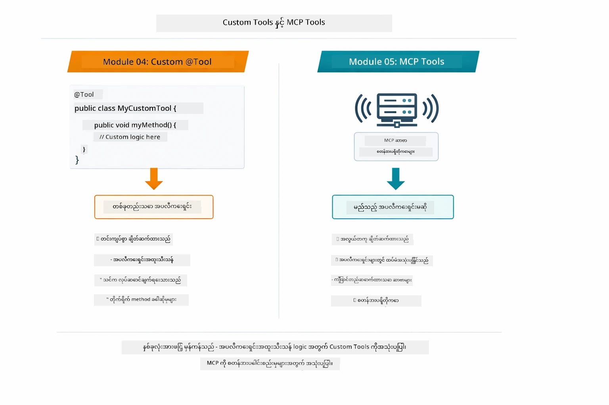

*custom @Tool နဲ့ MCP tools ဘယ်သူ့ကို ဘယ်အချိန်သုံးမလဲ - custom tools ကို app-specific logic နဲ့ အမျိုးအစားလုံခြုံရေးအတွက်၊ MCP tools ကို standardized, applications များပေါ်မှာ အသုံးပြုနိုင်တဲ့ integration အတွက်*

## သင့်ချီးမြှင့်ပါတယ်!

LangChain4j for Beginners ကို လေး module အားလုံး ဖြတ်သန်းပြီးပြီ! သင့်ရဲ့ သင်ယူမှုခရီးလမ်းကို အောက်ပါ ပုံမှတဆင့် တစ်ကြည့်တည်း တွေ့မြင်ပါ-

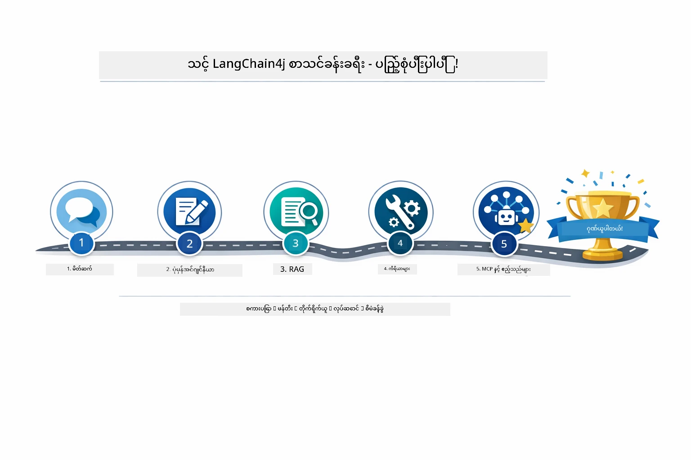

*LangChain4j for Beginners က ဂျာနီ အပြည့်အစုံ - အခြေခံ chat မှ MCP ပါဝင်တဲ့ agentic system ထိ*

သင်ပြီးမြောက်ခဲ့တဲ့အရာများမှာ-

- မှတ်ဉာဏ်ပါ conversational AI တည်ဆောက်နည်း (Module 01)
- မတူညီသော တာဝန်များအတွက် prompt engineering ပုံသဏ္ဍာန်များ (Module 02)
- Document ရှိ အကြောင်းအရာများကို ပြန်လည်ထောက်ခံစေခြင်း (RAG) (Module 03)
- custom tools ဖြင့် အခြေခံ AI agent များဖန်တီးခြင်း (Module 04)
- LangChain4j MCP နှင့် Agentic module များဖြင့် standardized tools integration (Module 05)

### နောက်တစ်ဆင့်?

Modules ပြီးစီးပြီးနောက် LangChain4j [Testing Guide](../docs/TESTING.md) ကို ဖတ်ရှု့ပြီး နားလည်မှု ပိုမိုရှင်းချယ်ပါ။

**တရားဝင် အရင်းအမြစ်များ:**
- [LangChain4j Documentation](https://docs.langchain4j.dev/) - လမ်းညွှန်နှင့် API မှတ်တမ်းများ
- [LangChain4j GitHub](https://github.com/langchain4j/langchain4j) - ကိုဒ်နမူနာများနှင့်
- [LangChain4j Tutorials](https://docs.langchain4j.dev/tutorials/) - အဆင့်ခြေလှမ်းများ မြို့နယ်သုံးသပ်မှု

ဒီသင်တန်းကို ဖြတ်သန်းပေးသည့်အတွက် ကျေးဇူးအထူးတင်ရှိပါတယ်!

---

**Navigation:** [← Previous: Module 04 - Tools](../04-tools/README.md) | [Back to Main](../README.md)

---

<!-- CO-OP TRANSLATOR DISCLAIMER START -->
**အတည်မပြုချက်**  
ဤစာတမ်းကို AI ဘာသာပြန်ဆော့ဖ်ဝဲဖြစ်သော [Co-op Translator](https://github.com/Azure/co-op-translator) မှတဆင့် ဘာသာပြန်ထားပါသည်။ ကျွန်ုပ်တို့သည်တိကျမှုကိုမြှင့်တင်ရန်ကြိုးစားသော်လည်း စက်မှု ပြု၍ ဘာသာပြန်ထားသည့်အတွက် အမှားများ သို့မဟုတ်မှားယွင်းဖြစ်နိုင်မှုရှိနိုင်ပါသည်။ မူလစာတမ်းသည် မူလဘာသာဖြင့် ဖြစ်ပြီး ထိုစာတမ်းကို အထက်တန်းအာမခံချက်အဖြစ် ထည့်သွင်းကိုင်တွယ်သင့်ပါသည်။ အရေးပေါ် အချက်အလက်များအတွက် လူ့ဘာသာပြန်ချက်ကိုသာ အသုံးပြုရန်အကြံပြုပါသည်။ ဤဘာသာပြန်ချက် အသုံးပြုမှုကြောင့် ပေါ်ပေါက်နိုင်သည့် နားလည်မှုလွဲမှားခြင်းများအတွက် ကျွန်ုပ်တို့ထံ တာဝန်မထားရှိပါ။
<!-- CO-OP TRANSLATOR DISCLAIMER END -->