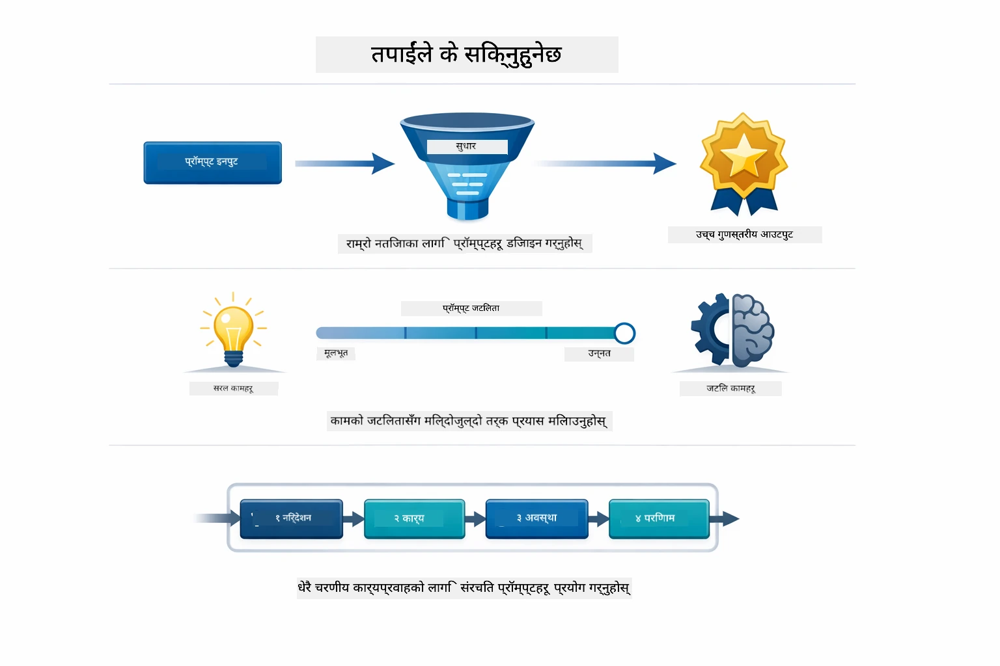
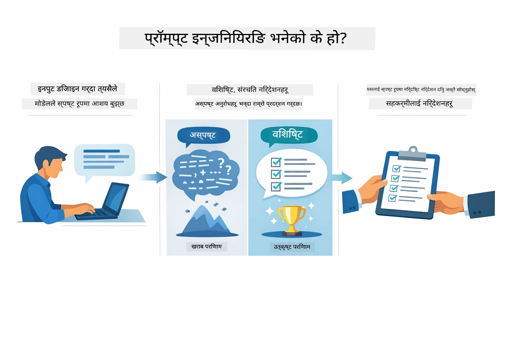
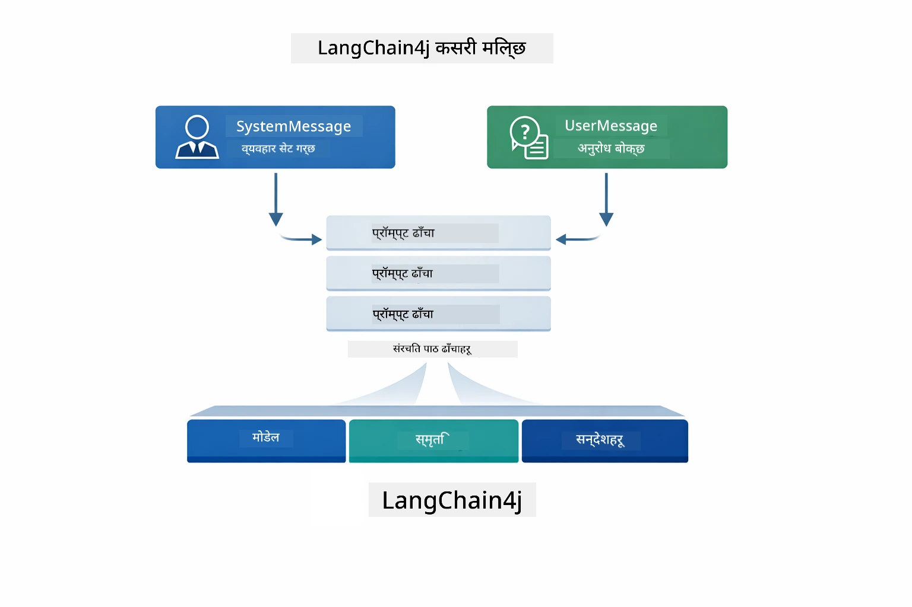
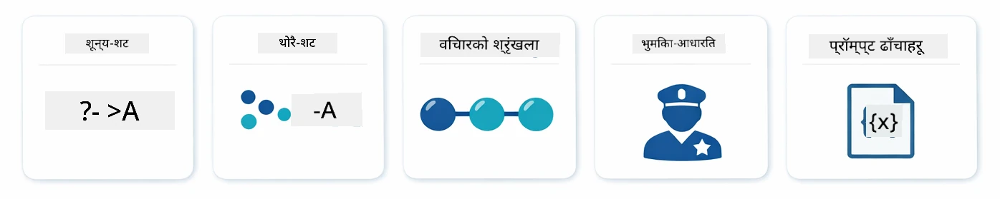
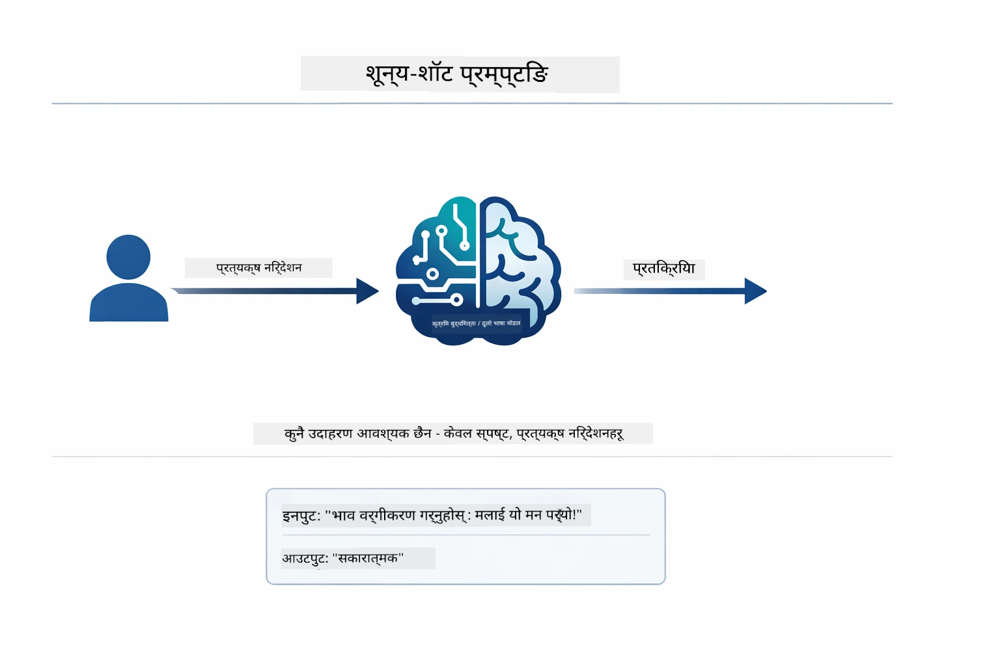
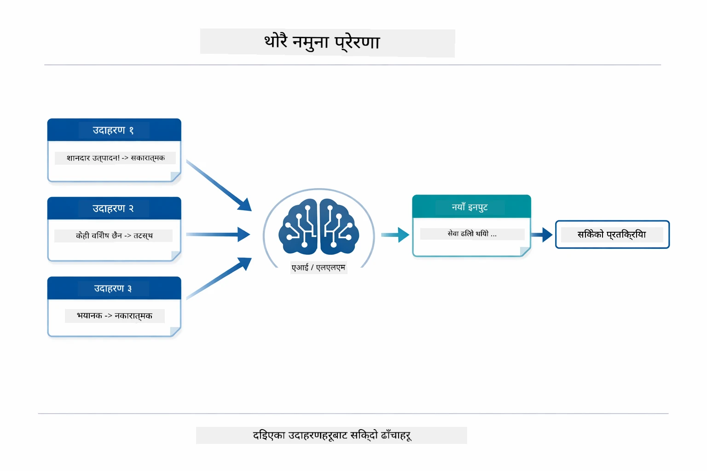
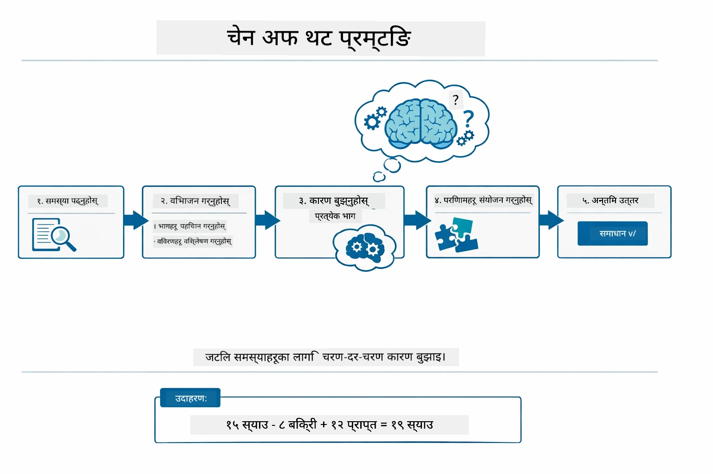
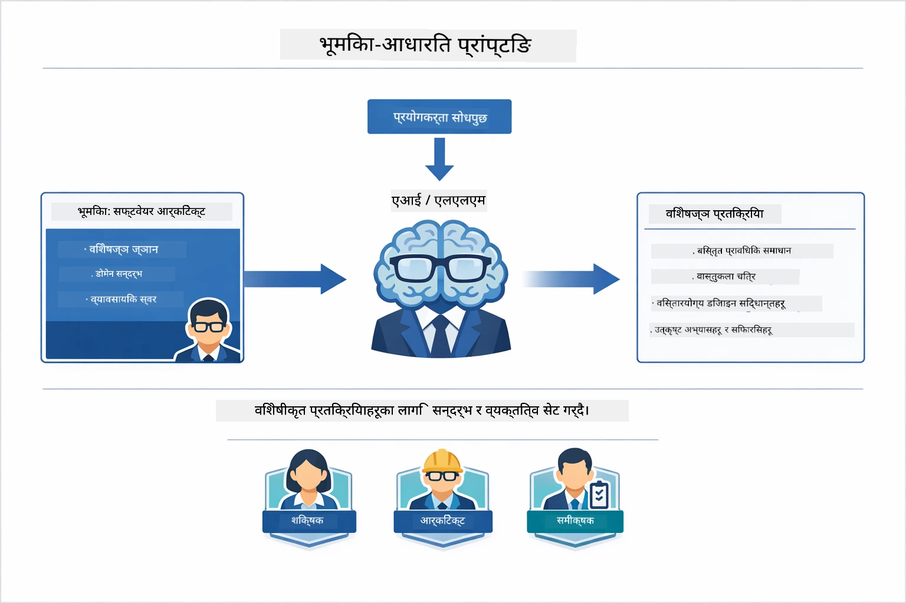
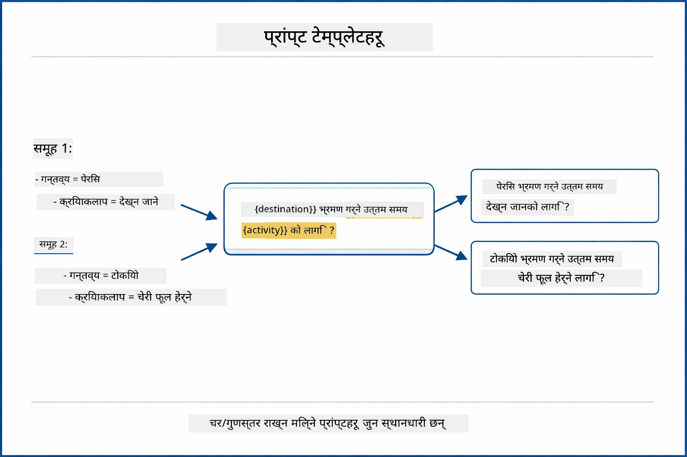
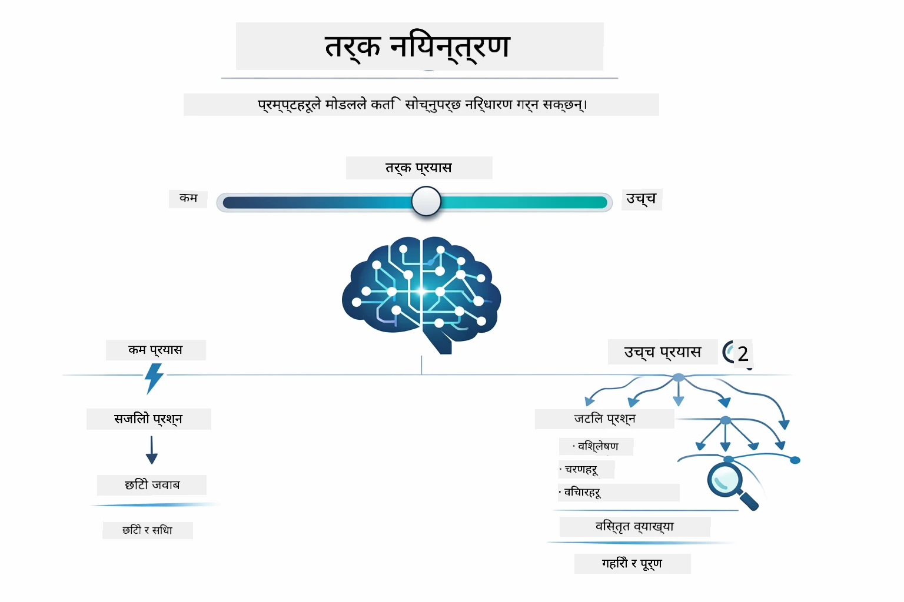

# Module 02: GPT-5.2 सँग प्रॉम्प्ट इन्जिनियरिङ्ग

## सामग्री तालिका

- [तपाईंले के सिक्नुहुनेछ](../../../02-prompt-engineering)
- [पूर्वापेक्षाहरू](../../../02-prompt-engineering)
- [प्रॉम्प्ट इन्जिनियरिङ्को बुझाइ](../../../02-prompt-engineering)
- [प्रॉम्प्ट इन्जिनियरिङ्गका आधारभूत तत्वहरू](../../../02-prompt-engineering)
  - [जीरो-शट प्रॉम्प्टिङ्ग](../../../02-prompt-engineering)
  - [फ्यू-शट प्रॉम्प्टिङ्ग](../../../02-prompt-engineering)
  - [चेन अफ थट](../../../02-prompt-engineering)
  - [भूमिका-आधारित प्रॉम्प्टिङ्ग](../../../02-prompt-engineering)
  - [प्रॉम्प्ट टेम्प्लेटहरू](../../../02-prompt-engineering)
- [उन्नत ढाँचाहरू](../../../02-prompt-engineering)
- [अस्तित्वमा रहेका Azure स्रोतहरू प्रयोग गर्दै](../../../02-prompt-engineering)
- [एप्लिकेसन स्क्रिनसटहरू](../../../02-prompt-engineering)
- [ढाँचाहरू अन्वेषण गर्दै](../../../02-prompt-engineering)
  - [कम बनाम उच्च उत्साह](../../../02-prompt-engineering)
  - [कार्य निष्पादन (टूल प्रिमेबलहरू)](../../../02-prompt-engineering)
  - [आत्म-परावर्तन कोड](../../../02-prompt-engineering)
  - [संरचित विश्लेषण](../../../02-prompt-engineering)
  - [बहु-पटकको संवाद](../../../02-prompt-engineering)
  - [चरण-द्वारा-चरण तर्क](../../../02-prompt-engineering)
  - [प्रतिबन्धित आउटपुट](../../../02-prompt-engineering)
- [तपाईं साँच्चिकै के सिक्दै हुनुहुन्छ](../../../02-prompt-engineering)
- [अर्को चरणहरू](../../../02-prompt-engineering)

## तपाईंले के सिक्नुहुनेछ



अघिल्लो मोड्युलमा, तपाईंले देख्नुभयो कि कसरी मेमोरीले संवादात्मक एआईलाई सक्षम पार्छ र बुनियादी अन्तरक्रियाका लागि GitHub मोडेलहरू प्रयोग गर्नुभयो। अब हामी प्रश्न सोध्ने तरिका — प्रॉम्प्ट स्वयं — Azure OpenAI को GPT-5.2 प्रयोग गरेर केन्द्रित हुनेछौं। तपाईंले आफ्नो प्रॉम्प्ट कसरी संरचना गर्नुहुन्छ भने जवाफहरूको गुणस्तरमा निकै प्रभाव पर्छ। हामी मूल प्रॉम्प्टिङ्ग प्रविधिहरूको समीक्षा गरेर सुरु गर्छौं, त्यसपछि आठवटा उन्नत ढाँचाहरूमा जान्छौं जुन GPT-5.2 को क्षमताको पूर्ण लाभ उठाउँछन्।

हामी GPT-5.2 प्रयोग गर्नेछौं किनभने यसले तर्क नियन्त्रण परिचय गराउँछ - तपाईं मोडेललाई जवाफ दिनुअगाडि कति सोच्न सक्ने भन्ने भन्न सक्नुहुन्छ। यसले भिन्न प्रॉम्प्टिङ्ग रणनीतिहरूलाई स्पष्ट पार्दछ र तपाईंलाई प्रत्येक विधि कहिले प्रयोग गर्ने भन्ने बुझ्न मद्दत गर्दछ। हामीलाई Azure का GPT-5.2 लागि GitHub मोडेलहरू भन्दा कम दर सीमाहरूको पनि लाभ हुनेछ।

## पूर्वापेक्षाहरू

- मोड्युल 01 पूरा भएको (Azure OpenAI स्रोतहरू व्यवस्थापन गरिएको)
- रूट डिरेक्टरीमा `.env` फाइल Azure प्रमाणपत्रसहित (मोड्युल 01 मा `azd up` द्वारा सिर्जना गरिएको)

> **टिप्पणी:** यदि तपाईंले मोड्युल 01 पूरा गर्नुभएको छैन भने, त्यहाँको व्यवस्थापन निर्देशनहरू पहिले पालन गर्नुहोस्।

## प्रॉम्प्ट इन्जिनियरिङ्को बुझाइ



प्रॉम्प्ट इन्जिनियरिङ्ग भनेको त्यसरी इनपुट पाठ डिजाइन गर्नु हो जसले तपाईंलाई आवश्यक नतिजा लगातार दिन्छ। यो केवल प्रश्न सोध्ने कुरा होइन - यो अनुरोधलाई यसरी संरचना गर्ने कुरा हो कि मोडेलले तपाईंको चाहना के हो र कसरी पूरा गर्ने भन्ने कुरालाई पूर्ण रूपमा बुझोस्।

यसलाई सहकर्मीलाई निर्देशन दिनेजस्तै सोच्नुहोस्। "बग ठीक गर्नुहोस्" अस्पष्ट छ। "UserService.java को लाइन 45 मा null pointer exception ठीक गर्नुहोस् null check थपेर" भने विशिष्ट छ। भाषा मोडेलहरूले पनि यस्तै तरिकाले काम गर्छन् - विशिष्टता र संरचनाले महत्व राख्छ।



LangChain4j इन्फ्रास्ट्रक्चर प्रदान गर्छ — मोडेल कनेक्शन, मेमोरी, र सन्देश प्रकारहरू — जबकि प्रॉम्प्ट ढाँचाहरू मात्र त्यो इन्फ्रास्ट्रक्चर मार्फत पठाइने सावधानीपूर्वक संरचित पाठ हुन्। प्रमुख निर्माण भौतिकहरू हुन् `SystemMessage` (जसले AI को व्यवहार र भूमिका निर्धारण गर्छ) र `UserMessage` (जसले तपाईंको वास्तविक अनुरोध बोकेको हुन्छ)।

## प्रॉम्प्ट इन्जिनियरिङ्गका आधारभूत तत्वहरू



यस मोड्युलका उन्नत ढाँचाहरूमा जाने अघि, पाँच मौलिक प्रॉम्प्टिङ्ग प्रविधिहरूको समीक्षा गरौं। यी प्रॉम्प्ट इन्जिनियरिङ्गका सबैले जान्नुपर्ने आधारभूत तत्व हुन्। यदि तपाईंले पहिल्यै [छिटो सुरुवात मोड्युल](../00-quick-start/README.md#2-prompt-patterns) मार्फत काम गर्नुभएको छ भने, यी क्रियाशील देख्नुभएको छ — यहाँ तिनीहरूको वैचारिक फ्रेमवर्क छ।

### जीरो-शट प्रॉम्प्टिङ्ग

सरलतम विधि: मोडेललाई कुनै उदाहरण बिना सिधा निर्देशन दिनु। मोडेलले पूर्ण रूपमा आफ्नो प्रशिक्षणमा निर्भर राखेर कार्य बुझ्छ र कार्यान्वयन गर्छ। यो त्यस्ता सोझा अनुरोधहरूमा राम्रो काम गर्दछ जहाँ अपेक्षित व्यवहार स्पष्ट हुन्छ।



*कुनै उदाहरण बिना सिधा निर्देशन — मोडेल निर्देशनबाट मात्र कार्य अनुमान लगाउँछ*

```java
String prompt = "Classify this sentiment: 'I absolutely loved the movie!'";
String response = model.chat(prompt);
// प्रतिक्रिया: "सकारात्मक"
```
  
**कहिले प्रयोग गर्ने:** सरल वर्गीकरण, सिधा प्रश्नहरू, अनुवादहरू, वा कुनै पनि यस्तो कार्य जहाँ मोडेलले अतिरिक्त मार्गनिर्देशन बिना सम्हाल्न सक्छ।

### फ्यू-शट प्रॉम्प्टिङ्ग

मोडेलले पालना गर्नुपर्ने ढाँचालाई देखाउनका लागि उदाहरणहरू प्रदान गर्ने। मोडेल तपाईंका उदाहरणहरूबाट अपेक्षित इनपुट-आउटपुट ढाँचालाई सिक्छ र नयाँ इनपुटहरूमा लागू गर्छ। यसले त्यस्ता कार्यहरूमा अत्यधिक स्थिरता सुधार गर्छ जहाँ चाहिएको ढाँचा वा व्यवहार स्पष्ट हुँदैन।



*उदाहरणहरूबाट सिक्दै — मोडेल ढाँचालाई पहिचान गरी नयाँ इनपुटहरूमा लागू गर्छ*

```java
String prompt = """
    Classify the sentiment as positive, negative, or neutral.
    
    Examples:
    Text: "This product exceeded my expectations!" → Positive
    Text: "It's okay, nothing special." → Neutral
    Text: "Waste of money, very disappointed." → Negative
    
    Now classify this:
    Text: "Best purchase I've made all year!"
    """;
String response = model.chat(prompt);
```
  
**कहिले प्रयोग गर्ने:** कस्टम वर्गीकरण, स्थिर ढाँचा निर्माण, डोमेन-विशेषित कार्यहरू, वा जब जीरो-शट परिणामहरू अस्थिर हुन्छन्।

### चेन अफ थट

मोडेललाई आफ्नो तर्क प्रक्रिया चरण-द्वारा-चरण देखाउन भन्नुहोस्। सीधा उत्तरमा उफ्रनुको सट्टा, मोडेल समस्यालाई तोड्छ र प्रत्येक भागलाई स्पष्ट रूपमा काम गर्छ। यसले गणित, तर्क, र बहु-चरण तर्क कार्यहरूमा शुद्धता सुधार्छ।



*चरण-द्वारा-चरण तर्क — जटिल समस्यालाई स्पष्ट तार्किक चरणमा तोड्दै*

```java
String prompt = """
    Problem: A store has 15 apples. They sell 8 apples and then 
    receive a shipment of 12 more apples. How many apples do they have now?
    
    Let's solve this step-by-step:
    """;
String response = model.chat(prompt);
// मोडेलले देखाउँछ: १५ - ८ = ७, त्यसपछि ७ + १२ = १९ स्याउहरू
```
  
**कहिले प्रयोग गर्ने:** गणित समस्या, तर्क पहेलिहरू, डिबगिङ्ग, वा जब तर्क प्रक्रियालाई देखाउँदा शुद्धता र विश्वास बढ्छ।

### भूमिका-आधारित प्रॉम्प्टिङ्ग

प्रश्न सोध्नु अघि AI को लागि कुनै पात्र वा भूमिका सेट गर्नुहोस्। यसले जवाफको लय, गहिराई, र केन्द्रितता निर्धारण गर्ने सन्दर्भ दिन्छ। "सफ्टवेयर आर्किटेक्ट" ले "जुनियर डेवलपर" वा "सुरक्षा अडिटर" भन्दा फरक सल्लाह दिन्छ।



*सन्दर्भ र पात्र सेट गर्दै — एउटै प्रश्नमा भूमिका अनुसार फरक प्रतिक्रिया आउँछ*

```java
String prompt = """
    You are an experienced software architect reviewing code.
    Provide a brief code review for this function:
    
    def calculate_total(items):
        total = 0
        for item in items:
            total = total + item['price']
        return total
    """;
String response = model.chat(prompt);
```
  
**कहिले प्रयोग गर्ने:** कोड समीक्षा, ट्युटरिङ्ग, डोमेन-विशेषित विश्लेषण, वा जब तपाईंलाई कुनै विशेष विशेषज्ञता स्तर वा दृष्टिकोणका लागि उत्तरहरू चाहिन्छ।

### प्रॉम्प्ट टेम्प्लेटहरू

परिवर्ती प्लेसहोल्डरहरूसँग पुन: प्रयोग गर्न मिल्ने प्रॉम्प्टहरू बनाउनुहोस्। हरेक पटक नयाँ प्रॉम्प्ट लेख्नुको सट्टा, एक पटक टेम्प्लेट परिभाषित गरेर फरक मानहरू भर्नुहोस्। LangChain4j को `PromptTemplate` वर्गले `{{variable}}` सिन्ट्याक्ससहित यो सरल बनाउँछ।



*परिवर्ती प्लेसहोल्डरहरूसहित पुन: प्रयोग गर्न मिल्ने प्रॉम्प्टहरू — एउटै टेम्प्लेट, थुप्रै प्रयोगहरू*

```java
PromptTemplate template = PromptTemplate.from(
    "What's the best time to visit {{destination}} for {{activity}}?"
);

Prompt prompt = template.apply(Map.of(
    "destination", "Paris",
    "activity", "sightseeing"
));

String response = model.chat(prompt.text());
```
  
**कहिले प्रयोग गर्ने:** फरक इनपुटको साथ पुनः सोधहरू, ब्याच प्रक्रिया, पुन: प्रयोग गर्न मिल्ने AI कार्यप्रवाहहरू निर्माण, वा जतिखेर प्रॉम्प्ट संरचना उस्तै रहन्छ तर डेटा फरक हुन्छ।

---

यी पाँच आधारभूतहरूले तपाईंलाई अधिकांश प्रॉम्प्टिङ्ग कार्यका लागि बलियो उपकरणको सेट दिन्छन्। यस मोड्युलको बाँकी भागले तीमा आधारित रहेर **आठ उन्नत ढाँचाहरू** निर्माण गर्दछ जुन GPT-5.2 को तर्क नियन्त्रण, आत्म-मूल्यांकन, र संरचित आउटपुट क्षमताहरूलाई प्रयोग गर्छ।

## उन्नत ढाँचाहरू

आधारभूतहरू समाप्त भएपछि, यो मोड्युललाई विशिष्ट बनाउने आठ उन्नत ढाँचाहरूमा बढौं। सबै समस्याहरूले एउटै तरिका चाहँदैनन्। कतिपय प्रश्नलाई छिटो उत्तर चाहिन्छ, केहीलाई गहिरो सोच। कतिपयलाई देखिने तर्क चाहिन्छ, केहीलाई मात्र परिणाम। प्रत्येक तलको ढाँचा फरक परिस्थितिका लागि अनुकूलित गरिएको छ — र GPT-5.2 को तर्क नियन्त्रणले यी फरकहरू अझ स्पष्ट बनाउँछ।


*आठ प्रॉम्प्ट इन्जिनियरिङ्ग ढाँचाहरू र तिनका प्रयोग केसहरूको सिंहावलोकन*



*GPT-5.2 को तर्क नियन्त्रणले मोडेलले कति सोच्ने भन्ने तपाईंले निर्दिष्ट गर्न दिन्छ — छिटो सिधा उत्तरदेखि गहिरो अन्वेषणसम्म*


*कम उत्साह (छिटो, सिधा) बनाम उच्च उत्साह (विस्तृत, अन्वेषणात्मक) तर्क विधिहरू*

**कम उत्साह (छिटो र केन्द्रित)** - सरल प्रश्नहरूका लागि जहाँ तपाईं छिटो, सिधा उत्तर चाहनुहुन्छ। मोडेलले न्यूनतम तर्क गर्छ - अधिकतम २ चरण। गणना, खोजी, वा सोझो प्रश्नहरूको लागि प्रयोग गर्नुहोस्।

```java
String prompt = """
    <reasoning_effort>low</reasoning_effort>
    <instruction>maximum 2 reasoning steps</instruction>
    
    What is 15% of 200?
    """;

String response = chatModel.chat(prompt);
```
  
> 💡 **GitHub Copilot सहित अन्वेषण गर्नुहोस्:** [`Gpt5PromptService.java`](../../../02-prompt-engineering/src/main/java/com/example/langchain4j/prompts/service/Gpt5PromptService.java) खोल्नुहोस् र सोध्नुहोस्:  
> - "कम र उच्च उत्साह प्रॉम्प्टिङ्ग ढाँचाहरूमा के फरक छ?"  
> - "प्रॉम्प्टहरूमा XML ट्यागहरूले AI को जवाफको संरचना कसरी मद्दत गर्दछन्?"  
> - "म कहिले आत्म-परावर्तन ढाँचाहरू र कहिले सिधा निर्देशन प्रयोग गर्ने?"

**उच्च उत्साह (गहिरो र पूर्ण)** - जटिल समस्याहरूका लागि जहाँ तपाईंलाई समग्र विश्लेषण चाहिन्छ। मोडेलले पूर्ण रूपमा अन्वेषण गर्छ र विस्तृत तर्क देखाउँछ। सिस्टम डिजाइन, वास्तुकला निर्णयहरू, वा जटिल अनुसन्धानका लागि प्रयोग गर्नुहोस्।

```java
String prompt = """
    <reasoning_effort>high</reasoning_effort>
    <instruction>explore thoroughly, show detailed reasoning</instruction>
    
    Design a caching strategy for a high-traffic REST API.
    """;

String response = chatModel.chat(prompt);
```
  
**कार्य निष्पादन (चरण-द्वारा-चरण प्रगति)** - बहुचरण कार्यप्रवाहका लागि। मोडेलले पहिल्यै योजना दिन्छ, काम गर्ने क्रममा प्रत्येक चरणलाई वर्णन गर्छ, अनि सारांश प्रदान गर्छ। माइग्रेसन, कार्यान्वयन, वा कुनै पनि बहुचरण प्रक्रियाका लागि प्रयोग गर्नुहोस्।

```java
String prompt = """
    <task>Create a REST endpoint for user registration</task>
    <preamble>Provide an upfront plan</preamble>
    <narration>Narrate each step as you work</narration>
    <summary>Summarize what was accomplished</summary>
    """;

String response = chatModel.chat(prompt);
```
  
चेन-अफ-थट प्रॉम्प्टिङ्गले मोडेललाई आफ्नो तर्क प्रक्रियालाई स्पष्ट देखाउन विशेष रूपमा सोध्छ, जसले जटिल कार्यहरूमा शुद्धता सुधार्छ। चरण-द्वारा-चरण टुक्र्याँउले मानिस र AI दुवैलाई तार्किकतालाई बुझ्न मद्दत गर्दछ।

> **🤖 [GitHub Copilot](https://github.com/features/copilot) च्याटसँग प्रयास गर्नुहोस्:** यो ढाँचाबारे सोध्नुहोस्:  
> - "लामो समय लाग्ने अपरेसनहरूका लागि कार्य निष्पादन ढाँचालाई कसरी अनुकूल बनाउने?"  
> - "उत्पादन अनुप्रयोगहरूमा टूल प्रिमेबलहरू संरचनागर्नका लागि सर्वोत्तम अभ्यासहरू के हुन्?"  
> - "यूआईमा अन्तरिम प्रगतिका अद्यावधिकहरू कसरि समात्ने र देखाउने?"


*बहुचरण कार्यहरूको लागि योजना → कार्यान्वयन → सारांश कार्यप्रवाह*

**आत्म-परावर्तन कोड** - उत्पादन-गुणस्तरको कोड बनाउन। मोडेल कोड उत्पादन गर्छ, गुणस्तर मापदण्डहरूसँग तुलना गर्छ, र क्रमिक सुधार गर्छ। नयाँ सुविधाहरू वा सेवा निर्माण गर्दा प्रयोग गर्नुहोस्।

```java
String prompt = """
    <task>Create an email validation service</task>
    <quality_criteria>
    - Correct logic and error handling
    - Best practices (clean code, proper naming)
    - Performance optimization
    - Security considerations
    </quality_criteria>
    <instruction>Generate code, evaluate against criteria, improve iteratively</instruction>
    """;

String response = chatModel.chat(prompt);
```
  


*क्रमिक सुधार चक्र - उत्पादन, मूल्याङ्कन, समस्याहरू पहिचान, सुधार, पुनः दोहोर्याउने*

**संरचित विश्लेषण** - स्थिर मूल्याङ्कनका लागि। मोडेल कोड समीक्षा गर्दछ एक निश्चित फ्रेमवर्क (शुद्धता, अभ्यासहरू, प्रदर्शन, सुरक्षा) प्रयोग गरी। कोड समीक्षा वा गुणस्तर मूल्याङ्कनका लागि प्रयोग गर्नुहोस्।

```java
String prompt = """
    <code>
    public List getUsers() {
        return database.query("SELECT * FROM users");
    }
    </code>
    
    <framework>
    Evaluate using these categories:
    1. Correctness - Logic and functionality
    2. Best Practices - Code quality
    3. Performance - Efficiency concerns
    4. Security - Vulnerabilities
    </framework>
    """;

String response = chatModel.chat(prompt);
```
  
> **🤖 [GitHub Copilot](https://github.com/features/copilot) च्याटसँग प्रयास गर्नुहोस्:** संरचित विश्लेषणबारे सोध्नुहोस्:  
> - "विभिन्न प्रकारका कोड समीक्षा लागि विश्लेषण फ्रेमवर्क कसरी अनुकूल बनाउने?"  
> - "संरचित आउटपुटलाई प्रोग्रामेटिक रूपमा पार्स गर्ने र कार्यान्वयन गर्ने सब भन्दा राम्रो तरिका के हो?"  
> - "पर्याप्त रूपमा विभिन्न समीक्षा सत्रहरूमा स्थिर तीव्रता स्तर कसरी सुनिश्चित गर्ने?"


*तीव्रता स्तरहरूसहित स्थिर कोड समीक्षाका लागि चार-वर्गी फ्रेमवर्क*

**बहु-पटकको संवाद** - सन्दर्भ चाहिने संवादहरूको लागि। मोडेलले अघिल्लो सन्देश सम्झन्छ र तिनमा आधारित हुन्छ। अन्तरक्रियात्मक सहायता सेसन वा जटिल प्रश्नोत्तरका लागि प्रयोग गर्नुहोस्।

```java
ChatMemory memory = MessageWindowChatMemory.withMaxMessages(10);

memory.add(UserMessage.from("What is Spring Boot?"));
AiMessage aiMessage1 = chatModel.chat(memory.messages()).aiMessage();
memory.add(aiMessage1);

memory.add(UserMessage.from("Show me an example"));
AiMessage aiMessage2 = chatModel.chat(memory.messages()).aiMessage();
memory.add(aiMessage2);
```
  


*बहु-पटकको संवादमा कुराकानीको सन्दर्भ कसरी जम्मा हुन्छ र टोकन सीमा पुग्दासम्म*

**चरण-द्वारा-चरण तर्क** - देखिने तार्किकता आवश्यक पर्ने समस्याहरूका लागि। मोडेलले प्रत्येक चरणको स्पष्ट तर्क देखाउँछ। गणित समस्या, तर्क पहेली, वा सोचेको प्रक्रिया बुझ्न आवश्यक हुँदा प्रयोग गर्नुहोस्।

```java
String prompt = """
    <instruction>Show your reasoning step-by-step</instruction>
    
    If a train travels 120 km in 2 hours, then stops for 30 minutes,
    then travels another 90 km in 1.5 hours, what is the average speed
    for the entire journey including the stop?
    """;

String response = chatModel.chat(prompt);
```
  


*समस्याहरूलाई स्पष्ट तार्किक चरणहरूमा तोड्दै*

**प्रतिबन्धित आउटपुट** - विशिष्ट ढाँचा आवश्यकताहरू सहित जवाफहरूको लागि। मोडेलले कडाइका साथ ढाँचा र लम्बाइ नियमहरू पालना गर्छ। सारांश वा ठ्याक्कै आउटपुट संरचना आवश्यक हुँदा प्रयोग गर्नुहोस्।

```java
String prompt = """
    <constraints>
    - Exactly 100 words
    - Bullet point format
    - Technical terms only
    </constraints>
    
    Summarize the key concepts of machine learning.
    """;

String response = chatModel.chat(prompt);
```
  


*विशिष्ट ढाँचा, लम्बाइ, र संरचना आवश्यकताहरूको पालना*

## अस्तित्वमा रहेका Azure स्रोतहरू प्रयोग गर्दै

**व्यवस्थापन जाँच गर्नुहोस्:**

पक्का गर्नुहोस् कि रूट डिरेक्टरीमा `.env` फाइल Azure प्रमाणपत्रहरूसहित छ (मोड्युल 01 को दौरान सिर्जना गरिएको):  
```bash
cat ../.env  # AZURE_OPENAI_ENDPOINT, API_KEY, DEPLOYMENT देखाउनुपर्छ
```
  
**एप्लिकेसन सुरु गर्नुहोस्:**

> **टिप्पणी:** यदि तपाईंले मोड्युल 01 बाट `./start-all.sh` प्रयोग गरेर सबै एप्लिकेसन सुरु गरिसक्नु भएको छ भने, यस मोड्युलले पहिले देखि नै पोर्ट 8083 मा चलिरहेको छ। तपाईं तलका सुरु गर्ने आदेशहरू स्किप गरेर सीधै http://localhost:8083 मा जान सक्नुहुन्छ।

**विकल्प 1: स्प्रिङ बूट ड्यासबोर्ड (VS Code प्रयोगकर्ताहरूका लागि सिफारिस गरिएको)**

डेभ कन्टेनरमा स्प्रिङ बूट ड्यासबोर्ड एक्सटेन्सन समावेश छ, जुन सबै स्प्रिङ बूट एप्लिकेसनहरू व्यवस्थापन गर्न दृश्य इन्टरफेस प्रदान गर्दछ। यसलाई VS Code को Activity Bar को बाँया पट्टि (स्प्रिङ बूट आइकन खोज्नुस्) भेट्टाउन सकिन्छ।
Spring Boot ड्यासबोर्डबाट, तपाईंले:
- कार्यक्षेत्रमा सबै उपलब्ध Spring Boot अनुप्रयोगहरू हेर्न सक्नुहुन्छ
- एक क्लिकमा अनुप्रयोगहरू सुरु/रोक्न सक्नुहुन्छ
- अनुप्रयोगका लगहरू रियल-टाइममा हेर्न सक्नुहुन्छ
- अनुप्रयोगको स्थिति अनुगमन गर्न सक्नुहुन्छ

"prompt-engineering" को छेउमा प्ले बटन क्लिक गरेर यस मोड्युल सुरु गर्नुहोस्, वा सबै मोड्युलहरू एकसाथ सुरु गर्नुहोस्।


**विकल्प २: shell scripts प्रयोग गर्नुहोस्**

सबै वेब अनुप्रयोगहरू (मोड्युल ०१-०४) सुरु गर्नुहोस्:

**Bash:**
```bash
cd ..  # रुट डाइरेक्टरीबाट
./start-all.sh
```

**PowerShell:**
```powershell
cd ..  # रुट डाइरेक्टरीबाट
.\start-all.ps1
```

वा केवल यो मोड्युल सुरु गर्नुहोस्:

**Bash:**
```bash
cd 02-prompt-engineering
./start.sh
```

**PowerShell:**
```powershell
cd 02-prompt-engineering
.\start.ps1
```

दुवै script हरूले स्वत: root `.env` फाइलबाट वातावरण चरहरू लोड गर्छन् र JAR हरू नभए निर्माण गर्छन्।

> **सूचना:** यदि तपाईं सुरु गर्नु अघि सबै मोड्युलहरूलाई म्यानुअली बनाउने चाहनुहुन्छ भने:
>
> **Bash:**
> ```bash
> cd ..  # Go to root directory
> mvn clean package -DskipTests
> ```
>
> **PowerShell:**
> ```powershell
> cd ..  # Go to root directory
> mvn clean package -DskipTests
> ```

तपाईंको ब्राउजरमा http://localhost:8083 खोल्नुहोस्।

**रोक्न:**

**Bash:**
```bash
./stop.sh  # यो मोड्युल मात्र
# वा
cd .. && ./stop-all.sh  # सबै मोड्युलहरू
```

**PowerShell:**
```powershell
.\stop.ps1  # यो मोड्युल मात्र
# वा
cd ..; .\stop-all.ps1  # सबै मोड्युलहरू
```

## अनुप्रयोग स्क्रीनशटहरू


*मुख्य ड्यासबोर्डले सबै ८ prompt engineering ढाँचाहरूको उनीहरूको विशेषताहरू र प्रयोग केसहरू देखाउँछ*

## ढाँचाहरू अन्वेषण गर्दै

वेब इन्टरफेसले तपाईंलाई विभिन्न prompting रणनीतिहरू अन्वेषण गर्न दिन्छ। प्रत्येक ढाँचाले फरक समस्याहरू समाधान गर्छ - प्रयोग गरेर हेर्नुहोस् कहिले कुन तरिका उत्कृष्ट हुन्छ।

### कम बनाम उच्च उत्साह

"200 को १५% कति हुन्छ?" जस्तो सरल प्रश्न कम उत्साहमा सोध्नुहोस्। तपाईंलाई छिटो, सिधा उत्तर प्राप्त हुनेछ। अब "उच्च-ट्राफिक API को लागि क्यासिंग रणनीति डिजाइन गर्नुहोस्" जस्तो जटिल कुरा उच्च उत्साहमा सोध्नुहोस्। मोडेल कस्तो सुस्त हुँदै विस्तृत तर्क प्रदान गर्छ हेर्नुहोस्। एउटै मोडेल, एउटै प्रश्न संरचना - तर prompt ले यसलाई कति सोचना छ भन्छ।


*न्यूनतम तर्कसहित छिटो गणना*


*व्यापक क्यासिंग रणनीति (२.८MB)*

### कार्य निष्पादन (उपकरण प्रारम्भिक सामग्रीहरू)

बहु-चरण वर्कफ्लोहरूले अग्रिम योजना र प्रगति कथनबाट लाभ उठाउँछन्। मोडेलले के गर्ने हो भनेर ढाँचागत रूपमा बताउँछ, प्रत्येक चरण वर्णन गर्दछ, अनि नतिजाहरू सारांश गर्छ।


*चरण-द्वारा-चरण कथन सहित REST endpoint निर्माण (३.९MB)*

### आत्म-प्रतिबिम्बित कोड

"इमेल मान्यता सेवा सिर्जना गर्नुहोस्" प्रयास गर्नुहोस्। केवल कोड निर्माण गरेर रोक्नुभन्दा, मोडेलले निर्माण गर्छ, गुणस्तर मापदण्ड अनुसार मूल्याङ्कन गर्छ, कमजोरीहरू पत्ता लगाउँछ, अनि सुधार गर्छ। तपाईं यसले उत्पादन स्तरसम्म पुग्ने सम्म पुनरावृत्ति गर्दछ देख्नुहुनेछ।


*पूरा इमेल मान्यता सेवा (५.२MB)*

### संरचित विश्लेषण

कोड समीक्षा लागि सुसंगत मूल्याङ्कन ढाँचाहरू आवश्यक हुन्छन्। मोडेलले कोडलाई निश्चित वर्गीकरण (सहीपन, अभ्यासहरू, प्रदर्शन, सुरक्षा) सँग विश्लेषण गर्छ र गम्भीरता स्तरहरू राख्छ।


*ढाँचामा आधारित कोड समीक्षा*

### बहु-मोर्चा कुराकानी

"Spring Boot के हो?" सोध्नुहोस् र तुरुन्त "मलाई एउटा उदाहरण देखाउ" अनुरोध गर्नुहोस्। मोडेलले तपाईंको पहिलो प्रश्न सम्झन्छ र तपाईलाई विशेष रूपमा Spring Boot को उदाहरण दिन्छ। स्मृति बिना, दोस्रो प्रश्न धेरै अस्पष्ट हुन्थ्यो।


*प्रश्नहरू बीच प्रसङ्ग संरक्षण*

### चरण-द्वारा-चरण तर्क

कुनै गणितको समस्या छनोट गरी यसलाई दुवै चरण-द्वारा-चरण तर्क र कम उत्साहमा प्रयास गर्नुहोस्। कम उत्साहले केवल उत्तर दिन्छ - छिटो तर अस्पष्ट। चरण-द्वारा-चरणले प्रत्येक गणना र निर्णय देखाउँछ।


*स्पष्ट चरणहरूसहित गणित समस्या*

### सीमित आउटपुट

जब तपाईलाई निर्दिष्ट ढाँचा वा शब्द गणना आवश्यक हुन्छ, यो ढाँचाले कडा पालना अनिवार्य गर्छ। बिलकुल १०० शब्दको बुलेट पोइन्ट सारांश बनाउन प्रयास गर्नुहोस्।


*ढाँचामा नियन्त्रणसहित मेसिन लर्निङ सारांश*

## तपाईं साँच्चै के सिक्दै हुनुहुन्छ

**तर्क प्रयासले सबै कुरा बदल्छ**

GPT-5.2 ले तपाईंलाई computational प्रयासलाई तपाईंको प्रॉम्प्टहरूले नियन्त्रण गर्न दिन्छ। कम प्रयास भनेको छिटो प्रतिक्रिया र न्यूनतम खोज हो। उच्च प्रयास भनेको मोडेलले गहिरो सोचमा समय लिन्छ। तपाईंले कार्य जटिलता अनुसार प्रयास मिलाउन सिक्दै हुनुहुन्छ - सरल प्रश्नहरूमा समय नबर्बाद गर्नुहोस्, तर जटिल निर्णयहरूमा छिटो नगर्नुहोस्।

**संरचनाले व्यवहारलाई दिशा दिन्छ**

प्रॉम्प्टमा XML ट्यागहरू ध्यान दिनुभयो? ती सजावटका लागि होइनन्। मोडेलहरूले संरचित निर्देशनहरूलाई स्वतन्त्र पाठभन्दा बढी विश्वसनीय रूपमा पछ्याउँछन्। तपाईंले बहु-चरण प्रक्रिया वा जटिल तर्क चाहनुहुन्छ भने, संरचनाले मोडेललाई यसको स्थिति र आगामी के गर्नुछ ट्र्याक गर्न मद्दत गर्छ।


*स्पष्ट खण्ड र XML-शैली संगठनसहित राम्रो संरचित प्रॉम्प्टको संरचना*

**गुणस्तर स्व-मूल्यांकनबाट**

आत्म-प्रतिबिम्बित ढाँचाहरूले गुणस्तर मापदण्डलाई स्पष्ट बनाउँछन्। मोडेलले "सही" के हो थाहा पाउने आशा गर्नुको सट्टा, तपाईंले यसलाई कडाइका साथ बताउनुहुन्छ: सही तर्क, त्रुटि ह्यान्डलिङ, प्रदर्शन, सुरक्षा। त्यसपछि मोडेलले आफ्नै आउटपुट मूल्याङ्कन गर्छ र सुधार गर्छ। यसले कोड सृजनालाई लटरीबाट प्रक्रियामा परिणत गर्छ।

**प्रसङ्ग सीमित छ**

बहु-मोर्चा कुरा गर्नाले प्रत्येक अनुरोधसँग सन्देश इतिहास समावेश हुन्छ। तर सिमाना छ - प्रत्येक मोडेलको अधिकतम टोकन संख्या हुन्छ। कुराकानी बढ्दै गएपछि, तपाईंले सान्दर्भिक प्रसङ्ग राख्ने तर त्यो सीमा नछुने रणनीतिहरू आवश्यक पर्छ। यो मोड्युलले तपाईंलाई स्मृतिले कसरी काम गर्छ देखाउँछ; पछि तपाईंले कहिले सारांश बनाउने, कहिले भुल्ने, र कहिले पुन: प्राप्त गर्ने सिक्नुहुनेछ।

## अर्को कदमहरू

**अर्को मोड्युल:** [03-rag - RAG (Retrieval-Augmented Generation)](../03-rag/README.md)

---

**नेभिगेसन:** [← अघिल्लो: मोड्युल ०१ - परिचय](../01-introduction/README.md) | [मुख्यमा फर्कनुहोस्](../README.md) | [अर्को: मोड्युल ०३ - RAG →](../03-rag/README.md)

---

<!-- CO-OP TRANSLATOR DISCLAIMER START -->
**अस्वीकरण**:
यस दस्तावेजलाई AI अनुवाद सेवा [Co-op Translator](https://github.com/Azure/co-op-translator) को प्रयोग गरी अनुवाद गरिएको हो। हामी शुद्धताको प्रयास गर्छौं, तर कृपया जानकार हुनुहोस् कि स्वचालित अनुवादमा त्रुटिहरू वा अशुद्धता हुनसक्छ। मूल दस्तावेजलाई यसको मौलिक भाषामा आधिकारिक स्रोत मान्नुपर्छ। महत्वपूर्ण जानकारीको लागि व्यावसायिक मानवी अनुवाद सिफारिश गरिन्छ। यस अनुवादको प्रयोगबाट उत्पन्न हुने कुनै पनि गलतफहमी वा गलत व्याख्याहरूको लागि हामी जिम्मेवार छैनौं।
<!-- CO-OP TRANSLATOR DISCLAIMER END -->