# Module 03: RAG (Retrieval-Augmented Generation)

## Table of Contents

- [Video Walkthrough](../../../03-rag)
- [What You'll Learn](../../../03-rag)
- [Prerequisites](../../../03-rag)
- [Understanding RAG](../../../03-rag)
  - [Which RAG Approach Does This Tutorial Use?](../../../03-rag)
- [How It Works](../../../03-rag)
  - [Document Processing](../../../03-rag)
  - [Creating Embeddings](../../../03-rag)
  - [Semantic Search](../../../03-rag)
  - [Answer Generation](../../../03-rag)
- [Run the Application](../../../03-rag)
- [Using the Application](../../../03-rag)
  - [Upload a Document](../../../03-rag)
  - [Ask Questions](../../../03-rag)
  - [Check Source References](../../../03-rag)
  - [Experiment with Questions](../../../03-rag)
- [Key Concepts](../../../03-rag)
  - [Chunking Strategy](../../../03-rag)
  - [Similarity Scores](../../../03-rag)
  - [In-Memory Storage](../../../03-rag)
  - [Context Window Management](../../../03-rag)
- [When RAG Matters](../../../03-rag)
- [Next Steps](../../../03-rag)

## Video Walkthrough

यस मोड्युलसँग कसरी सुरु गर्ने भनेर व्याख्या गर्ने यो प्रत्यक्ष सत्र हेरौं:

<a href="https://www.youtube.com/watch?v=_olq75ZH_eY"></a>

## What You'll Learn

अघिल्ला मोड्युलहरूमा, तपाईंले एआईसँग कुराकानी कसरी गर्ने र आफ्नो प्रॉम्प्टहरूलाई प्रभावकारी रूपमा संरचना गर्ने सिक्नुभयो। तर एउटा मौलिक सीमा छ: भाषा मोडेलहरूले केवल प्रशिक्षणको क्रममा सिकेको कुरा मात्र जान्नेछन्। यी मोडेलहरूले तपाईंको कम्पनीका नीतिहरू, तपाईंको परियोजना कागजातहरू, वा जुनसुकै जानकारीमा तिनीहरूले प्रशिक्षण पाएका थिएनन् त्यस्ता प्रश्नहरूको जवाफ दिन सक्दैनन्।

RAG (Retrieval-Augmented Generation) ले यो समस्या समाधान गर्दछ। मोडेललाई तपाईंको जानकारी सिकाउन प्रयास गर्नुपर्ने सट्टा (जुन महँगो र अप्रयाप्त छ), तपाईंले यसलाई आफ्नो कागजातहरूमा खोजी गर्ने क्षमता दिनुहुन्छ। जब कसैले प्रश्न सोध्छ, प्रणाली सम्बन्धित जानकारी फेला पार्छ र त्यसलाई प्रॉम्प्टमा समावेश गर्दछ। त्यसपछि मोडेलले उठाइएको सन्दर्भको आधारमा जवाफ दिन्छ।

RAG लाई मोडेललाई एउटा सन्दर्भ पुस्तकालय दिने जस्तो सोच्नुहोस्। जब तपाईं प्रश्न सोध्नुहुन्छ, प्रणाली:

1. **प्रयोगकर्ता प्रश्न** - तपाईं प्रश्न सोध्नुहुन्छ
2. **इम्बेडिङ** - तपाईंको प्रश्नलाई भेक्टरमा रूपान्तरण गर्छ
3. **भेक्टर खोज** - मिल्दोजुल्दो कागजात टुक्राहरू फेला पार्छ
4. **सन्दर्भ संयोजन** - सम्बन्धित टुक्राहरू प्रॉम्प्टमा थप्छ
5. **उत्तर** - LLM ले सन्दर्भको आधारमा उत्तर उत्पादन गर्छ

यसले मोडेलका प्रतिक्रियाहरूलाई यसको प्रशिक्षण ज्ञानमा निर्भर नगरी तपाईंको वास्तविक डाटामा आधारित बनाउँछ।

## Prerequisites

- पूरा गरिसकिएको [Module 00 - Quick Start](../00-quick-start/README.md) (यो मोड्युलमा पछि उल्लेख गरिएको Easy RAG को उदाहरणका लागि)
- पूरा गरिसकिएको [Module 01 - Introduction](../01-introduction/README.md) (Azure OpenAI स्रोतहरू तैनाथ गरिएको, जसमा `text-embedding-3-small` इम्बेडिङ मोडेल पनि समावेश छ)
- रूट डाइरेक्टरीमा `.env` फाइल जसमा Azure प्रमाणपत्रहरू छन् (Module 01 मा `azd up` द्वारा सिर्जना गरिएको)

> **Note:** यदि तपाईंले Module 01 पूरा गर्नुभएन भने, पहिले त्यहाँका तैनाथी निर्देशनहरू पालना गर्नुहोस्। `azd up` आदेशले GPT च्याट मोडेल र यस मोड्युलमा प्रयोग गरिएको इम्बेडिङ मोडेल दुवै तैनाथ गर्दछ।

## Understanding RAG

तलको चित्रले मुख्य अवधारणा देखाउँछ: मोडेलको प्रशिक्षण डाटामा मात्र निर्भर नगरी, RAG ले यसलाई प्रत्येक उत्तर उत्पादन गर्नु अघि तपाईंका कागजातहरूको सन्दर्भ पुस्तकालय दिन्छ।

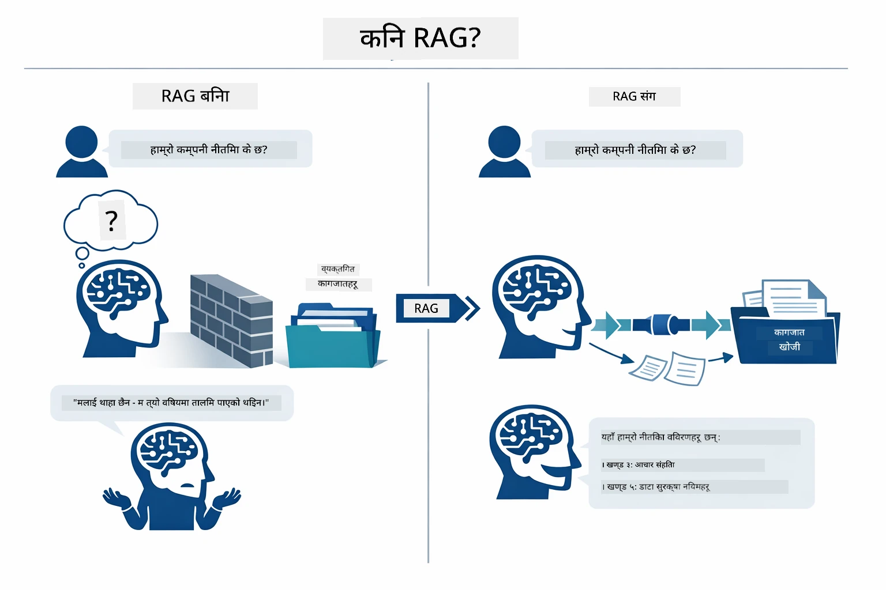

*यो चित्रले पारम्परिक LLM (जसले प्रशिक्षण डाटाबाट अनुमान लगाउँछ) र RAG-संवर्धित LLM (जसले पहिलो तपाईंका कागजातहरू सल्लाह लिन्छ) बीचको भिन्नता देखाउँछ।*

यहाँ टुक्राहरू कसरी अन्त्यदेखि अन्त्यसम्म जडान हुन्छन्। प्रयोगकर्ताको प्रश्न चार चरणमा बग्छ — इम्बेडिङ, भेक्टर खोज, सन्दर्भ संयोजन, र उत्तर उत्पादन — प्रत्येक अघिल्लो चरणमा आधारित:


*यो चित्रले अन्त्यदेखि अन्त्य RAG पाइपलाइन देखाउँछ — प्रयोगकर्ता प्रश्न इम्बेडिङ, भेक्टर खोज, सन्दर्भ संयोजन, र उत्तर उत्पादनबाट बग्छ।*

यो मोड्युलको बाँकी भागले प्रत्येक चरणलाई विवरणसहित, तपाईंले चलाउन र परिमार्जन गर्न सक्ने कोडसहित प्रस्तुत गर्दछ।

### Which RAG Approach Does This Tutorial Use?

LangChain4j ले RAG कार्यान्वयनका तीन तरिका प्रस्ताव गर्दछ, प्रत्येकमा फरक स्तरको अमूर्तता हुन्छ। तलको चित्रले तिनीहरूलाई सँगसँगै तुलना गर्दछ:

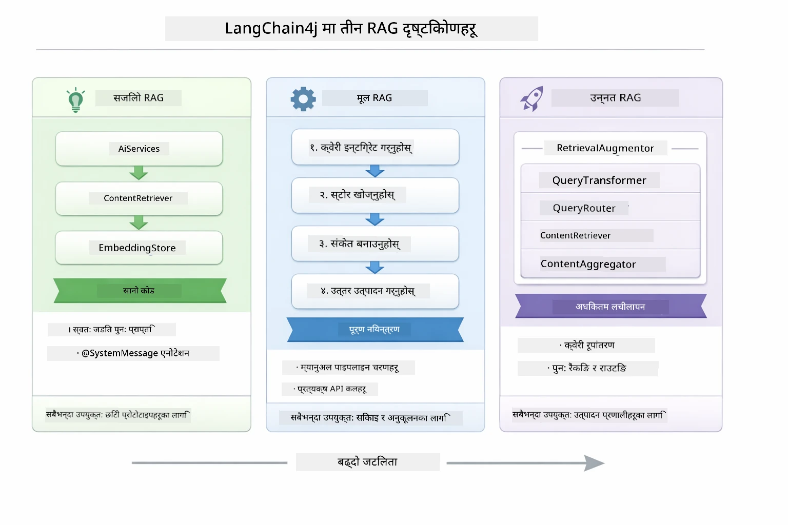

*यो चित्रले तीन LangChain4j RAG दृष्टिकोणहरू — Easy, Native, र Advanced — तुलना गर्दछ, तिनीहरूको मुख्य कम्पोनेन्टहरू र प्रयोग गर्ने बेला देखाउँदै।*

| दृष्टिकोण | के गर्छ | ट्रेड-अफ |
|---|---|---|
| **Easy RAG** | सबै कुरा `AiServices` र `ContentRetriever` मार्फत स्वतः तारिन्छ। तपाईं एउटा इन्टरफेस एनोटेट गर्नुहुन्छ, एक रिट्रीभर जोड्नुहुन्छ, र LangChain4j ले इम्बेडिङ, खोज र प्रॉम्प्ट संयोजन पछाडि ह्यान्डल गर्छ। | न्यूनतम कोड, तर तपाईंले प्रत्येक चरणमा के हुँदैछ त्यो देख्नुहुन्न। |
| **Native RAG** | तपाईं आफैंले इम्बेडिङ मोडेल कल गर्नुहुन्छ, स्टोर खोज्नुहुन्छ, प्रॉम्प्ट निर्माण गर्नुहुन्छ, र जवाफ उत्पन्न गर्नुहुन्छ — एक पटकमा एक स्पष्ट चरण। | बढी कोड, तर प्रत्येक चरण देखिने र परिमार्जन गर्न सकिने। |
| **Advanced RAG** | `RetrievalAugmentor` फ्रेमवर्क प्रयोग गर्छ, जससँग प्लग्गेबल क्वेरी ट्रान्सफर्मरहरू, राउटरहरू, पुनः रैंक गर्ने र कन्टेन्ट इन्जेक्टरहरू छन्, उत्पादन ग्रेड पाइपलाइनहरूको लागि। | अधिकतम लचिलोपन, तर धेरै जटिलता। |

**यस ट्यutorial ले Native दृष्टिकोण प्रयोग गर्दछ।** RAG पाइपलाइनका प्रत्येक चरण — क्वेरी इम्बेडिङ, भेक्टर स्टोर खोज, सन्दर्भ संयोजन, र उत्तर उत्पादन — स्पष्ट रूपमा [`RagService.java`](../../../03-rag/src/main/java/com/example/langchain4j/rag/service/RagService.java) मा लेखिएको छ। यो सचेत रूपमा गरिएको हो: सिक्नका लागि स्रोतको रूपमा, प्रत्येक चरण देख्न र बुझ्नुपर्ने कुराको महत्त्व बढी छ भने कोड कम गर्नु भन्दा। जब तपाईंलाई टुक्राहरू कसरी फिचर हुने सिक्न सहज हुन्छ, तब तपाईं छिटो प्रोटोटाइपहरूका लागि Easy RAG वा उत्पादन प्रणालीहरूको लागि Advanced RAG मा बढ्न सक्नुहुन्छ।

> **💡 पहिले देखि Easy RAG देख्नुभएको छ?** [Quick Start मोड्युल](../00-quick-start/README.md) मा Document Q&A उदाहरण ([`SimpleReaderDemo.java`](../../../00-quick-start/src/main/java/com/example/langchain4j/quickstart/SimpleReaderDemo.java)) छ जसले Easy RAG दृष्टिकोण प्रयोग गर्छ — LangChain4j ले स्वतः इम्बेडिङ, खोज र प्रॉम्प्ट संयोजन ह्यान्डल गर्छ। यो मोड्युलले त्यो पाइपलाइन खुलेर तपाईं आफैंले प्रत्येक चरण नियन्त्रण गर्न सक्ने बनाएर अर्को स्तरमा लैजान्छ।

तलको चित्रले Quick Start उदाहरणबाट Easy RAG पाइपलाइन देखाउँछ। `AiServices` र `EmbeddingStoreContentRetriever` ले सबै जटिलता लुकाएका छन् — तपाईं कागजात लोड गर्नुहुन्छ, रिट्रीभर जोड्नुहुन्छ, र उत्तर प्राप्त गर्नुहुन्छ। यस मोड्युलको Native दृष्टिकोणले ती लुकिएका चरणहरू खोल्छ:

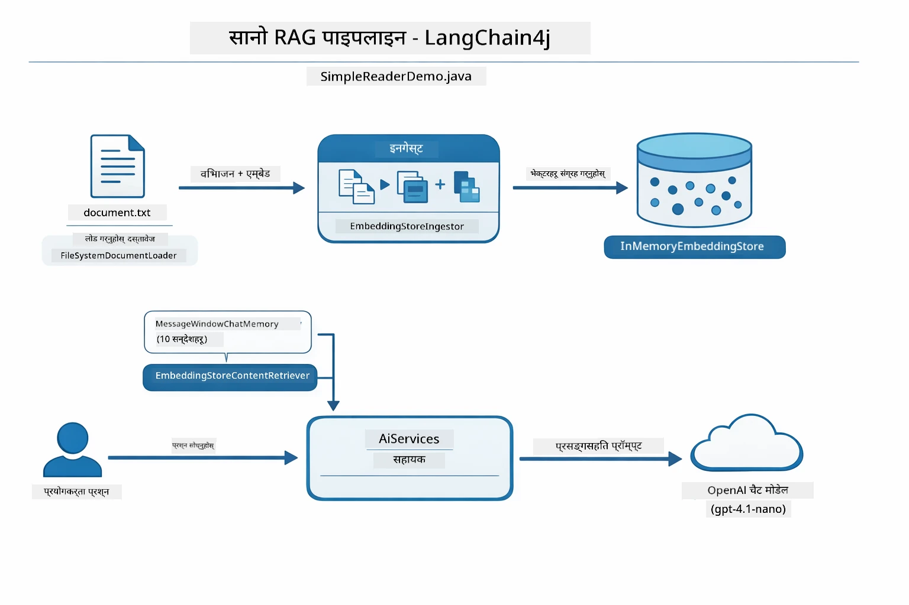

*यो चित्र `SimpleReaderDemo.java` को Easy RAG पाइपलाइन देखाउँछ। यसलाई यस मोड्युलमा प्रयोग भएको Native दृष्टिकोणसँग तुलना गर्नुहोस्: Easy RAG ले `AiServices` र `ContentRetriever` पछाडि इम्बेडिङ, पुनःप्राप्ति र प्रॉम्प्ट संयोजन लुकाउँछ — तपाईं कागजात लोड गर्नुहुन्छ, रिट्रीभर जोड्नुहुन्छ, र उत्तर प्राप्त गर्नुहुन्छ। यो मोड्युलको Native दृष्टिकोणले ती पाइपलाइन खोल्छ र तपाईं आफैंले प्रत्येक चरण (इम्बेड, खोज, सन्दर्भ जोर्नु, उत्तर दिनु) कल गर्नुहुन्छ, यसले पूर्ण दृश्यता र नियन्त्रण दिन्छ।*

## How It Works

यस मोड्युलको RAG पाइपलाइन चार चरणहरूमा विभाजित हुन्छ जुन हरेक पटक प्रयोगकर्ताले प्रश्न सोध्दा क्रमिक रूपमा चल्छ। पहिलो, अपलोड गरिएको कागजातलाई **पार्स र टुक्र्याइन्छ** — व्यवस्थापन योग्य भागहरूमा। ती टुक्राहरूलाई त्यसपछि **भेक्टर इम्बेडिङहरू**मा रूपान्तरण गरिन्छ र भण्डारण गरिन्छ ताकि गणितीय रूपमा तुलना गर्न सकियोस्। जब प्रश्न आउँछ, प्रणाली सबैभन्दा सम्बन्धित टुक्राहरू फेला पार्न **सामान्य अर्थ खोज** गर्छ, र अन्तमा ती टुक्राहरूलाई सन्दर्भका रूपमा LLM लाई पठाइन्छ **उत्तर उत्पादन**का लागि। तलको अनुभागहरूले प्रत्येक चरणलाई वास्तविक कोड र चित्रहरूसहित व्याख्या गर्छ। पहिलो कदम हेरौं।

### Document Processing

[DocumentService.java](../../../03-rag/src/main/java/com/example/langchain4j/rag/service/DocumentService.java)

जब तपाईं कागजात अपलोड गर्नुहुन्छ, प्रणालीले यसलाई (PDF वा साधारण पाठ) पार्स गर्छ, फाइलनाम जस्ता मेटाडेटा जोड्छ, र त्यसपछि टुक्र्याउँछ — सानाठुला भागहरू जसले मोडेलको सन्दर्भ विन्डोमा सहजै फिट हुन्छन्। ती टुक्राहरू सिमानामा सन्दर्भ नहराउने गरी हल्का ओभरल्याप गर्छन्।

```java
// अपलोड गरिएको फाइललाई पार्स गर्नुहोस् र LangChain4j Document मा र्याप गर्नुहोस्
Document document = Document.from(content, metadata);

// ३० टोकन ओभरलैप सहित ३००-टोकन टुक्राहरूमा विभाजन गर्नुहोस्
DocumentSplitter splitter = DocumentSplitters
    .recursive(300, 30);

List<TextSegment> segments = splitter.split(document);
```

तलको चित्रले यसलाई दृश्यात्मक रूपमा देखाउँछ। प्रत्येक टुक्राले आफ्नो छिमेकीसँग केहि टोकन साझा गर्छ — ३०-टोकन ओभरल्यापले कुनै पनि महत्त्वपूर्ण सन्दर्भ छुट्न नदिन्छ:

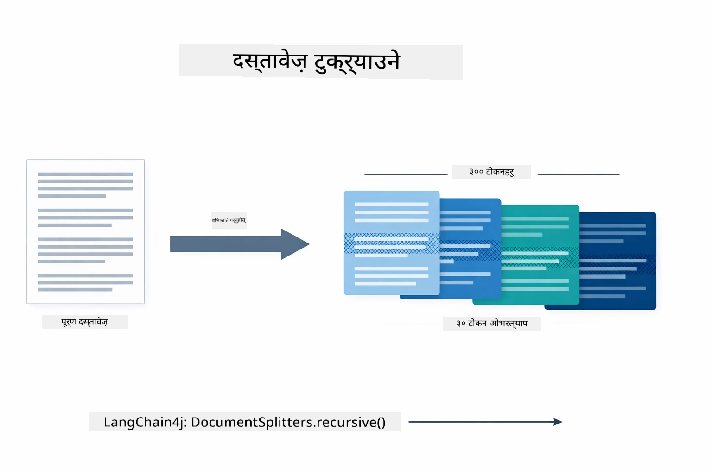

*यो चित्रले एउटा कागजातलाई ३०0-टोकन टुक्राहरूमा ३०-टोकन ओभरल्यापका साथ विभाजित गरिरहेको देखाउँछ, टुक्राको सिमानामा सन्दर्भ संरक्षण गर्दै।*

> **🤖 [GitHub Copilot](https://github.com/features/copilot) Chat संग प्रयास गर्नुहोस्:** [`DocumentService.java`](../../../03-rag/src/main/java/com/example/langchain4j/rag/service/DocumentService.java) खोल्नुहोस् र सोध्नुहोस्:
> - "LangChain4j ले कागजातलाई कसरी टुक्र्याउँछ र किन ओभरल्याप महत्वपूर्ण छ?"
> - "विभिन्न कागजात प्रकारहरूको लागि उत्तम टुक्रा आकार के हो र किन?"
> - "म कसरी बहुभाषिक वा विशेष स्वरूप भएका कागजातहरूलाई व्यवस्थापन गर्न सक्छु?"

### Creating Embeddings

[LangChainRagConfig.java](../../../03-rag/src/main/java/com/example/langchain4j/rag/config/LangChainRagConfig.java)

प्रत्येक टुक्रालाई एउटा संख्यात्मक प्रतिनिधित्वमा रूपान्तरण गरिन्छ जुन इम्बेडिङ भनिन्छ — मूलत: अर्थ-देखि-संख्यामा रूपान्तरण। इम्बेडिङ मोडेल "बुद्धिमान" छैन जस्तो कि च्याट मोडेल हो; यो निर्देशनहरू पालना गर्न, तर्क गर्न, वा प्रश्नहरूको जवाफ दिन सक्दैन। यसले गर्नु पर्ने कार्य भनेको पाठलाई यति एक गणितीय स्थानमा नक्साङ्कन गर्नु हो जहाँ समान अर्थहरू नजिकै हुन्छन् — जस्तै "कार" र "ऑटोमोबाइल" नजिकै हुन्छन्, "रिफन्ड नीति" र "मेरो पैसा फिर्ता" नजिकै हुन्छन्। एक च्याट मोडेललाई तपाईंले कुरा गर्न सक्ने व्यक्तिको रुपमा सोच्नुहोस्; भने इम्बेडिङ मोडेल एउटा अत्यन्त राम्रो फाइलिङ प्रणाली हो।

तलको चित्रले यो अवधारणा कल्पनात्मक रूपमा देखाउँछ — पाठ भित्र जान्छ, संख्यात्मक भेक्टरहरू बाहिर आउँछन्, र समान अर्थ भएका शब्दहरूले नजिकैका भेक्टरहरू उत्पादन गर्छन्:

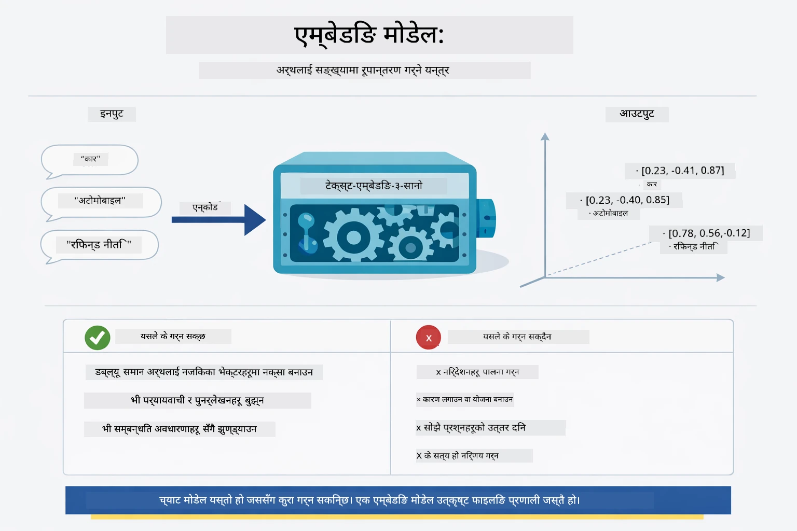

*यो चित्रले कसरी इम्बेडिङ मोडेलले पाठलाई संख्यात्मक भेक्टरमा परिवर्तन गर्छ, र "कार" र "ऑटोमोबाइल" जस्ता समान अर्थलाई नजिकै राख्छ, देखाउँछ।*

```java
@Bean
public EmbeddingModel embeddingModel() {
    return OpenAiOfficialEmbeddingModel.builder()
        .baseUrl(azureOpenAiEndpoint)
        .apiKey(azureOpenAiKey)
        .modelName(azureEmbeddingDeploymentName)
        .build();
}

EmbeddingStore<TextSegment> embeddingStore = 
    new InMemoryEmbeddingStore<>();
```

तलको क्लास चित्रले RAG पाइपलाइनका दुई अलग बग्ने मार्गहरू देखाउँछ र LangChain4j का क्लासहरू जुन तिनीहरूलाई लागू गर्छन्। **इन्टेक प्रवाह** (अपलोड समयमा एक पटक चल्छ) ले कागजात फुटाउँछ, टुक्राहरू इम्बेड गर्छ, र `.addAll()` मार्फत भण्डारण गर्छ। **प्रश्न प्रवाह** (प्रत्येक पटक प्रयोगकर्ताले सोध्दा चल्छ) ले प्रश्न इम्बेड गर्छ, भण्डारणमा `.search()` मार्फत खोजी गर्छ, र मिल्ने सन्दर्भलाई च्याट मोडेलमा पठाउँछ। दुवै प्रवाहहरू साझा `EmbeddingStore<TextSegment>` इन्टरफेसमा जडान हुन्छन्:

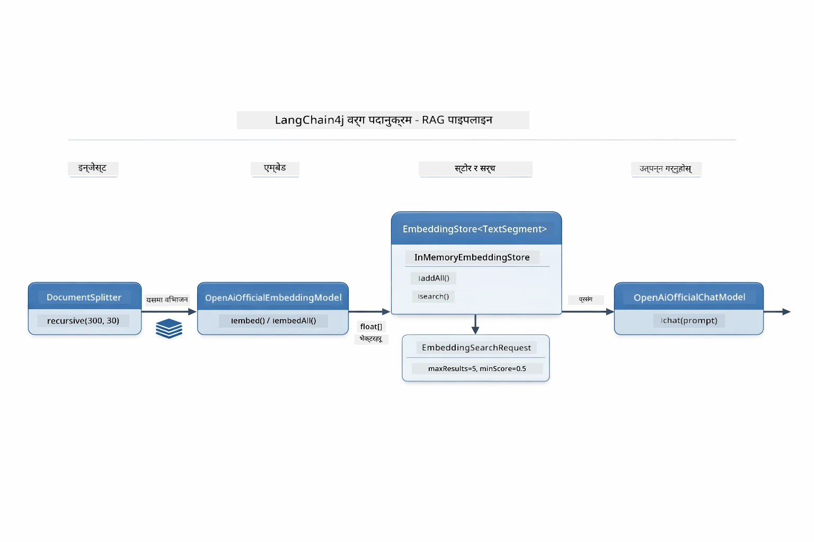

*यो चित्रले RAG पाइपलाइनका दुई प्रवाहहरू — इन्टेक र प्रश्न — र कसरी साझा EmbeddingStore मार्फत जडान हुन्छन् देखाउँछ।*

एक पटक इम्बेडिङहरू भण्डारण भएपछि, समान सामग्री स्वाभाविक रूपमा भेक्टर स्पेसमा समूहबद्ध हुन्छ। तलको दृष्यले देखाउँछ कि सम्बन्धित विषयहरूका कागजातहरू कसरी नजिकैका बिन्दुहरूमा परिणत हुन्छन्, जसले semantic search सम्भव बनाउँछ:


*यो दृष्यले देखाउँछ कसरी प्राविधिक कागजात, व्यवसाय नियमहरू, र FAQs जस्ता विषयहरू 3D भेक्टर स्पेसमा अलग-अलग समूहहरूमा विभाग हुन्छन्।*

जब प्रयोगकर्ताले खोजी गर्छ, प्रणालीले चार चरणहरूमा काम गर्छ: कागजातहरूलाई एक पटक इम्बेड गर्छ, प्रत्येक खोजीमा प्रश्न इम्बेड गर्छ, प्रश्न भेक्टरलाई सबै भण्डारण भेक्टरहरूसँग कोसाइन सादृश्यता प्रयोग गरेर तुलना गर्छ, र शीर्ष-K उच्च स्कोर भएका टुक्राहरू फर्काउँछ। तलको चित्रले प्रत्येक चरण र LangChain4j क्लासहरू देखाउँछ:

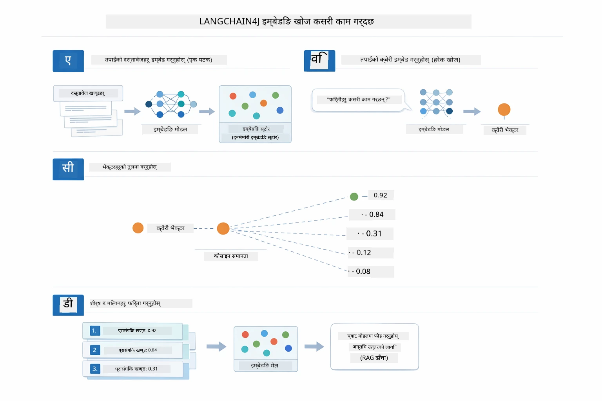

*यो चित्रले चार चरणको इम्बेडिङ खोज प्रक्रियालाई देखाउँछ: कागजातहरू इम्बेड गर्नु, प्रश्न इम्बेड गर्नु, कोसाइन सादृश्यता संग भेक्टरहरू तुलना गर्नु, र शीर्ष-K परिणामहरू फर्काउनु।*

### Semantic Search

[RagService.java](../../../03-rag/src/main/java/com/example/langchain4j/rag/service/RagService.java)

जब तपाईं प्रश्न सोध्नुहुन्छ, तपाईंको प्रश्न पनि इम्बेडिङमा परिणत हुन्छ। प्रणालीले तपाईंको प्रश्नको इम्बेडिङ सबै कागजात टुक्राहरूको इम्बेडिङसँग तुलना गर्छ। यसले सबैभन्दा समान अर्थ भएका टुक्राहरू फेला पार्छ — केवल समान कुञ्जीशब्द मात्र होइन, वास्तविक सान्दर्भिक समानता।

```java
Embedding queryEmbedding = embeddingModel.embed(question).content();

EmbeddingSearchRequest searchRequest = EmbeddingSearchRequest.builder()
    .queryEmbedding(queryEmbedding)
    .maxResults(5)
    .minScore(0.5)
    .build();

EmbeddingSearchResult<TextSegment> searchResult = embeddingStore.search(searchRequest);
List<EmbeddingMatch<TextSegment>> matches = searchResult.matches();

for (EmbeddingMatch<TextSegment> match : matches) {
    String relevantText = match.embedded().text();
    double score = match.score();
}
```

तलको चित्रले semantic search र पारम्परिक कुञ्जीशब्द खोजी विरोधाभास देखाउँछ। "vehicle" शब्दको कुञ्जीशब्द खोजीले "cars and trucks" को एउटा टुक्रा छुटाउँछ, तर semantic search ले बुझ्छ कि तिनीहरू एउटै कुरा हुन् र यसलाई उच्च स्कोर दिने मिल्दोजुल्दो परिणामको रूपमा फर्काउँछ:

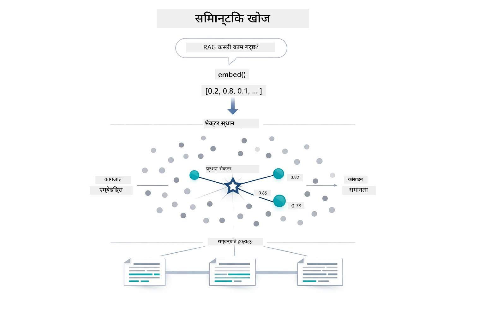

*यो चित्रले कुञ्जीशब्द आधारित खोज र semantic खोजको तुलना गर्दछ, देखाउँदै कि semantic खोजले अवधारणा अनुसार सम्बन्धित सामग्री पुनःप्राप्त गर्दछ भले नै ठ्याक्कै कुञ्जीशब्दहरू फरक किन नहुन्।*
अन्तर्भागमा, समानता कोसाइन समानता प्रयोग गरेर मापन गरिन्छ — सैद्धान्तिक रूपमा सोधिन्छ "के यी दुई तीरहरू एउटै दिशामा संकेत गर्दैछन्?" दुई टुक्राहरूले पूरै फरक शब्दहरू प्रयोग गर्न सक्छन्, तर यदि तिनीहरूको अर्थ एउटै हो भने तिनीहरूको भेक्टरहरू एउटै दिशामा संकेत गर्छन् र स्कोर 1.0 नजिक हुन्छ:

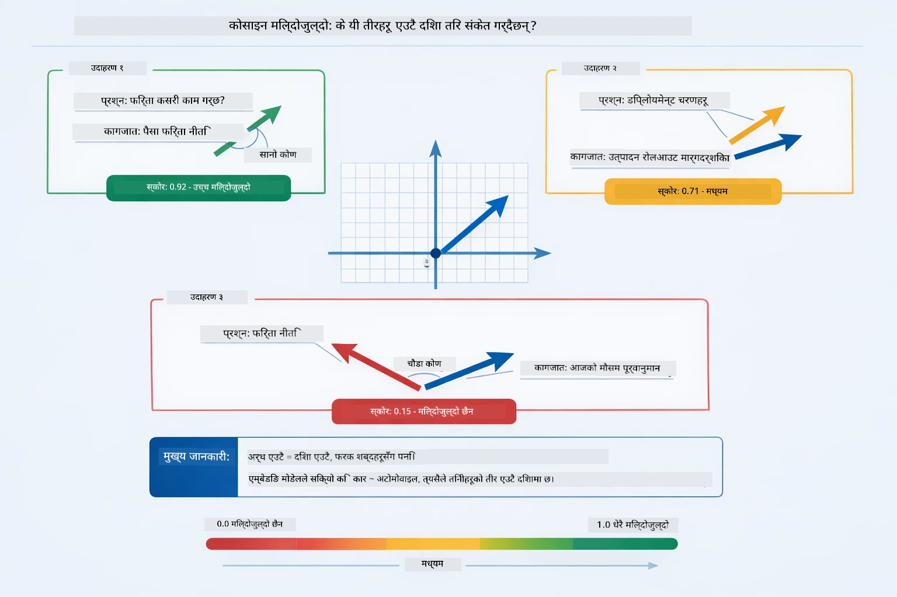

*यो चित्रले एम्बेडिङ भेक्टरहरू बीचको कोणको रूपमा कोसाइन समानता देखाउँछ — अधिक सटिक भएका भेक्टरहरू 1.0 नजिकको स्कोर पाउँछन्, जसले उच्च सेम्यान्टिक समानता जनाउँछ।*

> **🤖 [GitHub Copilot](https://github.com/features/copilot) च्याटसँग प्रयास गर्नुहोस्:** [`RagService.java`](../../../03-rag/src/main/java/com/example/langchain4j/rag/service/RagService.java) खोल्नुस् र सोध्नुस्:
> - "एम्बेडिङ्ससँग समानता खोज कसरी काम गर्छ र स्कोर के निर्धारण गर्छ?"
> - "कस्तो समानता थ्रेसहोल्ड प्रयोग गर्नु पर्छ र यसले नतिजामा कसरी प्रभाव पार्छ?"
> - "जहाँ कुनै सान्दर्भिक कागजात भेटिंदैन, त्यस्ता केसहरू कसरी ह्यान्डल गर्ने?"

### उत्तर निर्माण

[RagService.java](../../../03-rag/src/main/java/com/example/langchain4j/rag/service/RagService.java)

सबैभन्दा सान्दर्भिक टुक्राहरू संरचित प्रॉम्प्टमा सङ्कलन गरिन्छ जसले स्पष्ट निर्देशनहरू, प्राप्त सन्दर्भ, र प्रयोगकर्ताको प्रश्न समावेश गर्दछ। मोडेलले ती विशिष्ट टुक्राहरू पढ्छ र त्यहि जानकारीको आधारमा जवाफ दिन्छ — यो केवल यसको अघि रहेको जानकारी मात्र प्रयोग गर्न सक्छ, जसले भ्रान्तिलाई रोक्छ।

```java
String context = matches.stream()
    .map(match -> match.embedded().text())
    .collect(Collectors.joining("\n\n"));

String prompt = String.format("""
    Answer the question based on the following context.
    If the answer cannot be found in the context, say so.

    Context:
    %s

    Question: %s

    Answer:""", context, request.question());

String answer = chatModel.chat(prompt);
```

तलको चित्रले यस सङ्ग्रह प्रक्रिया देखाउँछ — खोज चरणबाट सबैभन्दा उच्च स्कोर भएका टुक्राहरू प्रॉम्प्ट टेम्प्लेटमा राखिन्छन्, र `OpenAiOfficialChatModel` एक आधारभूत जवाफ तयार गर्छ:

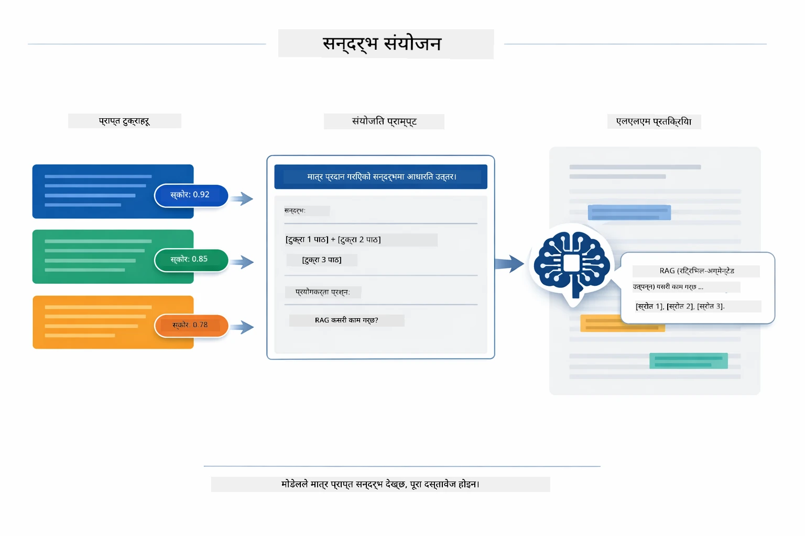

*यो चित्रले देखाउँछ कसरी सबैभन्दा उच्च स्कोर टुक्राहरू संरचित प्रॉम्प्टमा सङ्ग्रह गरिन्छ, जसले मोडेललाई तपाईँको डेटा बाट एक आधारभूत उत्तर उत्पादन गर्न अनुमति दिन्छ।*

## अनुप्रयोग चलाउने

**परिनियोजन सुनिश्चित गर्नुहोस्:**

रुट डाइरेक्टरीमा `.env` फाइल हुनु पर्छ जुन Azure प्रमाणपत्रहरू राख्छ (मोड्युल ०१ मा बनाइयो)। यसलाई मोड्युल डाइरेक्टरी (`03-rag/`) बाट चलाउनुहोस्:

**Bash:**
```bash
cat ../.env  # AZURE_OPENAI_ENDPOINT, API_KEY, DEPLOYMENT देखाउनु पर्छ
```
  
**PowerShell:**
```powershell
Get-Content ..\.env  # AZURE_OPENAI_ENDPOINT, API_KEY, DEPLOYMENT देखाउनु पर्छ
```
  
**अनुप्रयोग सुरु गर्न:**

> **नोट:** यदि तपाईंले पहिले नै `./start-all.sh` प्रयोग गरेर सबै अनुप्रयोगहरू सुरु गरिसक्नुभएको छ भने (जसरी मोड्युल ०१ मा वर्णन गरिएको छ), यो मोड्युल पोर्ट ८०८१ मा पहिले नै चलिरहेको छ। तपाईँ तलका सुरु गर्ने कमाण्डहरू छोडेर सिधा http://localhost:8081 मा जान सक्नुहुन्छ।

**विकल्प १: Spring Boot ड्यासबोर्ड प्रयोग गर्नुहोस् (VS Code प्रयोगकर्ताहरूको लागि सिफारिस गरिएको)**

डेभ कन्टेनरमा Spring Boot Dashboard एक्सटेन्सन समावेश छ, जसले सबै Spring Boot अनुप्रयोगहरू व्यवस्थापन गर्न दृश्यात्मक इन्टरफेस प्रदान गर्दछ। यो VS Code को बाँया छेउको Activity Bar मा पाउन सकिन्छ (Spring Boot आइकन हेर्नुहोस्)।

Spring Boot Dashboard बाट तपाईं:
- कार्यक्षेत्रका सबै उपलब्ध Spring Boot अनुप्रयोगहरू हेर्न सक्नुहुन्छ
- एक क्लिकमा अनुप्रयोग सुरु/रोक्न सक्नुहुन्छ
- अनुप्रयोगको लगहरू वास्तविक समयमा हेर्न सक्नुहुन्छ
- अनुप्रयोगको स्थिति अनुगमन गर्न सक्नुहुन्छ

"rag" को छेउमा प्ले बटन क्लिक गरी यो मोड्युल सुरु गर्नुस्, वा सबै मोड्युलहरू एकै पटक सुरु गर्न सक्नुहुन्छ।


*यो स्क्रिनसटले VS Code मा Spring Boot Dashboard देखाउँछ, जहाँ तपाईं अनुप्रयोगहरू सुरु, रोक्न र अनुगमन गर्न सक्नुहुन्छ।*

**विकल्प २: शेल स्क्रिप्टहरू प्रयोग गर्नुहोस्**

सबै वेब अनुप्रयोगहरू (मोड्युल ०१-०४) सुरु गर्न:

**Bash:**
```bash
cd ..  # रुट डाइरेक्टरीबाट
./start-all.sh
```
  
**PowerShell:**
```powershell
cd ..  # रूट निर्देशिका बाट
.\start-all.ps1
```
  
वा यो मोड्युल मात्र सुरु गर्न:

**Bash:**
```bash
cd 03-rag
./start.sh
```
  
**PowerShell:**
```powershell
cd 03-rag
.\start.ps1
```
  
दुबै स्क्रिप्टहरूले स्वतः रुट `.env` फाइलबाट वातावरण चरहरू लोड गर्छन् र यदि JAR फाइलहरू छैनन् भने तिनीहरू बनाउँछन्।

> **नोट:** यदि तपाईंले सबै मोड्युलहरू म्यान्युअली बिल्ड गर्न चाहनुहुन्छ भने सुरु गर्नु अघि:
>
> **Bash:**
> ```bash
> cd ..  # Go to root directory
> mvn clean package -DskipTests
> ```
>  
> **PowerShell:**
> ```powershell
> cd ..  # Go to root directory
> mvn clean package -DskipTests
> ```
  
ब्राउजरमा http://localhost:8081 खोल्नुस्।

**रोक्न:**

**Bash:**
```bash
./stop.sh  # यो मोड्युल मात्र
# वा
cd .. && ./stop-all.sh  # सबै मोड्युलहरू
```
  
**PowerShell:**
```powershell
.\stop.ps1  # यो मोड्युल मात्र
# वा
cd ..; .\stop-all.ps1  # सबै मोड्युलहरू
```
  
## अनुप्रयोग प्रयोग

अनुप्रयोगले कागजात अपलोड र प्रश्न सोध्नको लागि वेब इन्टरफेस प्रदान गर्छ।

<a href="images/rag-homepage.png"></a>

*यो स्क्रिनसटले RAG अनुप्रयोगको इन्टरफेस देखाउँछ जहाँ तपाईं कागजातहरू अपलोड गरेर प्रश्न सोध्न सक्नुहुन्छ।*

### कागजात अपलोड गर्नुहोस्

एक कागजात अपलोड गरेर सुरु गर्नुहोस् - TXT फाइलहरू परीक्षणका लागि उत्तम हुन्छन्। यस डाइरेक्टरीमा `sample-document.txt` प्रदान गरिएको छ जसमा LangChain4j सुविधाहरू, RAG कार्यान्वयन, र उत्तम अभ्यासहरू सम्बन्धी जानकारी हुन्छ - प्रणाली परीक्षणका लागि उपयुक्त।

प्रणालीले तपाईंको कागजात प्रक्रिया गर्छ, यसलाई टुक्रामा विभाजन गर्छ र प्रत्येक टुक्राको लागि एम्बेडिङ सिर्जना गर्छ। यो स्वचालित रूपमा अपलोड गर्दा हुन्छ।

### प्रश्न सोध्नुहोस्

अब कागजातको सामग्री सम्बन्धी विशिष्ट प्रश्नहरू सोध्नुस्। केही यस्ता तथ्यहरू प्रयास गर्नुहोस् जुन कागजातमा स्पष्ट उल्लेखित छन्। प्रणाली सान्दर्भिक टुक्राहरू खोज्छ, तिनीहरूलाई प्रॉम्प्टमा समावेश गर्छ र उत्तर तयार पार्छ।

### स्रोत सन्दर्भ जाँच गर्नुहोस्

प्रत्येक उत्तरमा समानता स्कोर सहित स्रोत सन्दर्भहरू समावेश हुन्छन्। यी स्कोरहरू (० देखि १ सम्म) देखाउँछन् कस्तो मापनले प्रत्येक टुक्रा तपाईंको प्रश्नसँग सान्दर्भिक थियो। उच्च स्कोरहरू राम्रो मेल भएको जनाउँछन्। यसले तपाईंलाई उत्तरलाई स्रोत सामग्रीसँग जाँच गर्ने अनुमति दिन्छ।

<a href="images/rag-query-results.png"></a>

*यो स्क्रिनसटले प्रश्न नतिजाहरू देखाउँछ जसमा तयार गरिएका उत्तरहरू, स्रोत सन्दर्भहरू, र प्रत्येक पुन: प्राप्त टुक्राको सान्दर्भिकता स्कोरहरू छन्।*

### प्रश्नसँग प्रयोग गरेर प्रयोग गर्नुहोस्

फरक प्रकारका प्रश्नहरू प्रयास गर्नुहोस्:
- विशिष्ट तथ्यहरू: "मुख्य विषय के हो?"
- तुलना: "X र Y बीच के फरक छ?"
- सारांशहरू: "Z का मुख्य बुँदाहरू सारांश गर्नुहोस्"

हेर्नुस् कसरी सान्दर्भिकता स्कोरले तपाईंको प्रश्न कति राम्रोसँग कागजात सामग्रीसँग मेल खान्छ भन्ने आधारमा परिवर्तन हुन्छ।

## मुख्य अवधारणाहरू

### टुक्रा प्रबन्धन रणनीति

कागजातहरू ३० टोकन ओभरलैपसहित ३००-टोकन टुक्रामा विभाजित गरिन्छ। यो सन्तुलनले प्रत्येक टुक्रालाई पर्याप्त सन्दर्भ दिन्छ जुन अर्थपूर्ण हुन्छ र त्यति ठूलो हुँदैन कि प्रॉम्प्टमा धेरै टुक्रा समावेश गर्न सकिंदैन।

### समानता स्कोरहरू

हरेक पुन: प्राप्त टुक्रा ० देखि १ को समानता स्कोरसहित आउँछ जसले देखाउँछ त्यो कति नजिक प्रश्नसँग मेल खान्छ। तलको चित्रले स्कोर दायराहरू देखाउँछ र प्रणाली तिनीहरूलाई कसरी फिल्टरको लागि प्रयोग गर्छ:

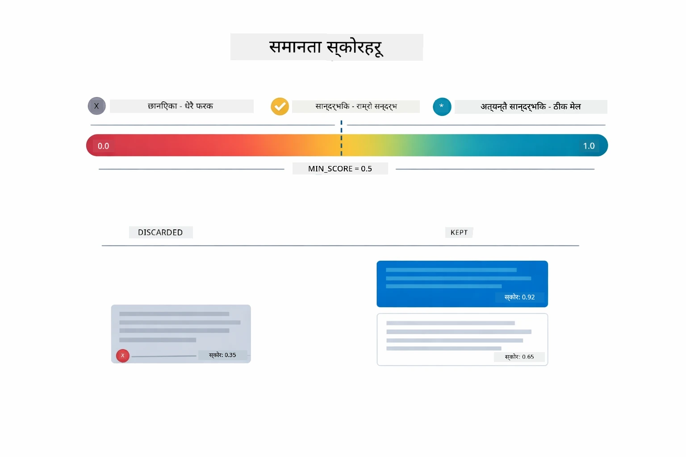

*यो चित्र स्कोर दायराहरू ० देखि १ देखाउँछ, जहाँ न्यूनतम थ्रेसहोल्ड ०.५ छ जसले अप्रासंगिक टुक्राहरूलाई हटाउँछ।*

स्कोर दायराहरू:
- ०.७-१.०: अत्यधिक सान्दर्भिक, पूर्ण मेल
- ०.५-०.७: सान्दर्भिक, राम्रो सन्दर्भ
- ०.५ भन्दा तल: हटाइएका, धेरै भिन्न

प्रणालीले केवल न्यूनतम थ्रेसहोल्ड माथिका टुक्राहरू मात्र निकाल्छ ताकि गुणस्तर सुनिश्चित होस्।

एम्बेडिङहरू तब राम्रो काम गर्छन् जब अर्थ क्लस्टरहरूले सफा विभाजन गर्छन्, तर तिनीहरूसँग सीमितताहरू छन्। तलको चित्रले सामान्य असफलता मोडहरू देखाउँछ — ठूलो टुक्राहरूले धुँधला भेक्टरहरू उत्पादन गर्छन्, साना टुक्राहरूमा सन्दर्भ कम हुन्छ, अस्पष्ट शब्दहरूले विभिन्न क्लस्टरहरूमा संकेत गर्छन्, र ठ्याक्कै मेल लगाउने खोजहरू (आईडीहरू, पार्ट नम्बरहरू) एम्बेडिङ्ससँग काम गर्दैनन्:

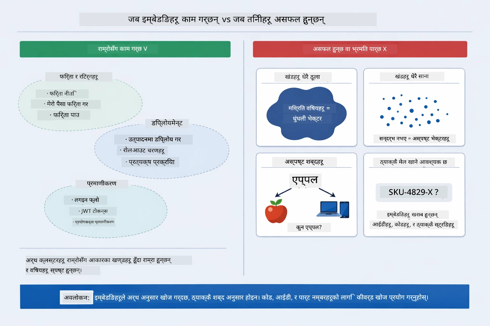

*यो चित्रले सामान्य एम्बेडिङ असफलता मोडहरू देखाउँछ: धेरै ठूलो टुक्राहरू, धेरै साना टुक्राहरू, अस्पष्ट शब्दहरू जो धेरै क्लस्टरहरूमा संकेत गर्छन्, र ठ्याक्कै मेल लगाउने खोजहरू जस्तै आईडीहरू।*

### इन-मेमोरी स्टोरेज

यो मोड्युलले सरलताको लागि इन-मेमोरी स्टोरेज प्रयोग गर्छ। अनुप्रयोग पुन: सुरु गर्दा अपलोड गरिएका कागजातहरू हराइहाल्छन्। उत्पादन प्रणालीहरूले Qdrant वा Azure AI Search जस्ता स्थायी भेक्टर डेटाबेसहरू प्रयोग गर्छन्।

### सन्दर्भ विन्डो व्यवस्थापन

प्रत्येक मोडेलसँग अधिकतम सन्दर्भ विन्डो हुन्छ। तपाईं ठूलो कागजातका सबै टुक्रा समावेश गर्न सक्नुहुन्न। प्रणाली शीर्ष N सबैभन्दा सान्दर्भिक टुक्राहरू (डिफल्ट ५) निकाल्छ ताकि सीमा भित्र रहँदा पनि पर्याप्त सन्दर्भ दिएर सही उत्तर दिन सकियोस्।

## कहिले RAG महत्त्वपूर्ण हुन्छ

RAG सधैँ उपयुक्त तरिका हुँदैन। तलको निर्णय मार्गदर्शकले तपाईंलाई कहिले RAG ले मूल्य थप्छ र कहिले सरल तरिकाहरू — जस्तै सिधै प्रॉम्प्टमा सामग्री समावेश गर्ने वा मोडेलको बिल्ट-इन ज्ञानमा भर पर्ने — पर्याप्त हुन्छ भन्ने निर्णय गर्न मद्दत गर्छ:

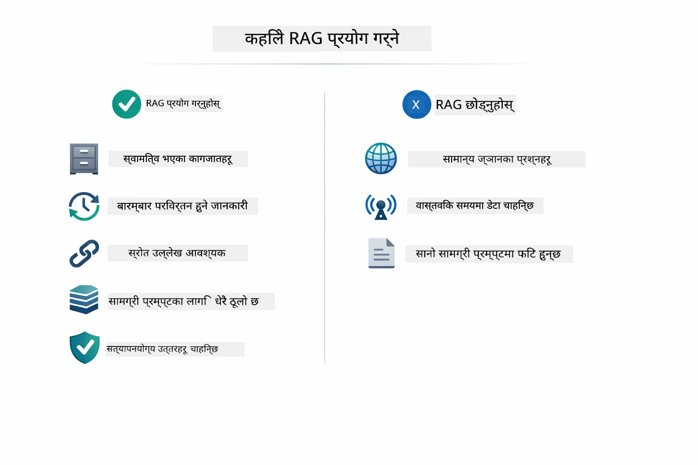

*यो चित्रले निर्णय मार्गदर्शक देखाउँछ कि कहिले RAG ले मूल्य थप्छ र कहिले सरल तरिकाहरू पर्याप्त हुन्छन्।*

## अर्को कदमहरू

**अर्को मोड्युल:** [04-tools - उपकरणहरूसहित AI एजेन्टहरू](../04-tools/README.md)

---

**नेभिगेसन:** [← अघिल्लो: मोड्युल 02 - प्रॉम्प्ट इञ्जिनियरिङ](../02-prompt-engineering/README.md) | [मुख्य पृष्ठमा फर्किनुहोस्](../README.md) | [अर्को: मोड्युल 04 - उपकरणहरू →](../04-tools/README.md)

---

<!-- CO-OP TRANSLATOR DISCLAIMER START -->
**अपवाद**:
यस दस्तावेजलाई AI अनुवाद सेवा [Co-op Translator](https://github.com/Azure/co-op-translator) प्रयोग गरी अनुवाद गरिएको हो। हामी शुद्धताका लागि प्रयासरत छौं भने पनि, कृपया जानकार हुनुहोस् कि स्वचालित अनुवादमा त्रुटि वा असम्बद्धता हुन सक्छ। मूल दस्तावेज यसको मूल भाषामा आधिकारिक स्रोत मानिनुपर्छ। महत्वपूर्ण जानकारीका लागि व्यावसायिक मानव अनुवाद सिफारिस गरिन्छ। यस अनुवादको प्रयोगबाट उत्पन्न कुनै पनि गलतफहमी वा गलत व्याख्याको लागि हामी जिम्मेवार छैनौं।
<!-- CO-OP TRANSLATOR DISCLAIMER END -->