# Module 04: उपकरणहरूसँग AI एजेन्टहरू

## तालिका

- [भिडियो वाकथ्रु](../../../04-tools)
- [तिमीले के सिक्नेछौ](../../../04-tools)
- [पूर्वआवश्यकताहरू](../../../04-tools)
- [उपकरणहरूसँग AI एजेन्टहरू बुझ्नु](../../../04-tools)
- [उपकरण कल गर्ने तरिका](../../../04-tools)
  - [उपकरण परिभाषाहरू](../../../04-tools)
  - [निर्णय लिने प्रक्रिया](../../../04-tools)
  - [कार्यान्वयन](../../../04-tools)
  - [प्रतिक्रिया सिर्जना](../../../04-tools)
  - [आर्किटेक्चर: स्प्रिङ बुट स्वत: वायरिङ](../../../04-tools)
- [उपकरण श्रृंखला](../../../04-tools)
- [एप्लिकेसन चलाउनुहोस्](../../../04-tools)
- [एप्लिकेसन प्रयोग](../../../04-tools)
  - [सरल उपकरण प्रयोग प्रयास गर्नुहोस्](../../../04-tools)
  - [उपकरण श्रृंखला परीक्षण गर्नुहोस्](../../../04-tools)
  - [संवाद प्रवाह हेर्नुहोस्](../../../04-tools)
  - [भिन्न अनुरोधहरू प्रयोग गर्नुहोस्](../../../04-tools)
- [महत्त्वपूर्ण अवधारणाहरू](../../../04-tools)
  - [ReAct ढाँचा (तर्क र क्रियाशीलता)](../../../04-tools)
  - [उपकरण विवरणहरू महत्वपूर्ण छन्](../../../04-tools)
  - [सेसन व्यवस्थापन](../../../04-tools)
  - [त्रुटि ह्यान्डलिङ](../../../04-tools)
- [उपलब्ध उपकरणहरू](../../../04-tools)
- [कहिले उपकरण-आधारित एजेन्टहरू प्रयोग गर्ने](../../../04-tools)
- [उपकरणहरू बनाम RAG](../../../04-tools)
- [अर्को कदमहरू](../../../04-tools)

## भिडियो वाकथ्रु

यस लाइभ सत्रलाई हेर्नुहोस् जुन यो मोड्युलसँग कसरी सुरु गर्ने भनेर व्याख्या गर्दछ:

<a href="https://www.youtube.com/watch?v=O_J30kZc0rw"></a>

## तिमीले के सिक्नेछौ

अहिले सम्म, तिमीले AI सँग संवाद कसरी गर्ने, प्रभावकारी रूपमा प्रॉम्प्ट बनाउन, र तिम्रा दस्तावेजहरूमा आधारित प्रतिक्रिया दिन सिक्यौ। तर एक मौलिक सीमितता अझै छ: भाषा मोडेलहरूले केवल पाठ मात्र उत्पन्न गर्न सक्छन्। तिनीहरूले मौसम जाँच्न, गणना गर्न, डाटाबेस सोध्न, वा बाह्य प्रणालीहरूसँग अन्तरक्रिया गर्न सक्दैनन्।

उपकरणहरूले यो परिवर्तन गर्छन्। मोडेललाई कल गर्न मिल्ने कार्यहरू दिनाले, तिमी यसलाई एउटा एजेन्टमा परिवर्तन गर्‍यौ जुन क्रियाहरू गर्न सक्छ। मोडेलले कहिले उपकरण चाहिन्छ, कुन उपकरण प्रयोग गर्ने, र कुन प्यारामिटरहरू पठाउने निर्णय गर्छ। तिम्रो कोडले त्यो कार्यलाई कार्यान्वयन गर्छ र परिणाम फर्काउँछ। मोडेलले त्यो परिणामलाई आफ्नो प्रतिक्रियामा समावेश गर्छ।

## पूर्वआवश्यकताहरू

- पूर्ण [Module 01 - परिचय](../01-introduction/README.md) (Azure OpenAI स्रोतहरू तैनाथ गरिएको)
- पूर्वका मोड्युलहरू पूरा गरेको सिफारिस गरिएको (यो मोड्युलले [Module 03 बाट RAG अवधारणाहरू](../03-rag/README.md) उपकरणहरू बनाम RAG तुलना मा उल्लेख गरेको छ)
- रूट निर्देशिकामा `.env` फाइल Azure प्रमाणपत्रसहित (Module 01 मा `azd up` द्वारा सिर्जना गरिएको)

> **टिप्पणी:** यदि तिमीले Module 01 पूरा गर्नुभएको छैन भने, पहिले त्यहाँका तैनाथ निर्देशनहरू पालना गर।

## उपकरणहरूसँग AI एजेन्टहरू बुझ्नु

> **📝 नोट:** यस मोड्युलमा "एजेन्टहरू" भन्नाले उपकरण कल गर्ने क्षमताले सुसज्जित AI सहायकहरूलाई जनाउँछ। यो प턴हरूबाट फरक छ जुन हामी [Module 05: MCP](../05-mcp/README.md) मा चर्चा गर्नेछौं, जसमा स्वायत्त एजेन्टहरू छन् जसले योजना, स्मृति, र बहु-चरण तर्क गर्छन्।

उपकरण नहुँदा, भाषा मोडेलले केवल आफ्नो प्रशिक्षित डाटाबाट पाठ उत्पन्न गर्न सक्छ। अहिलेको मौसम सोध्ने हो भने, यसले अनुमान लगाउनै पर्छ। तर उपकरण दिएर, यसले मौसम API कल गर्न सक्छ, गणना गर्न सक्छ, वा डाटाबेस सोध्न सक्छ — र तिन वास्तविक नतिजा आफ्ना प्रतिक्रियामा समेट्न सक्छ।

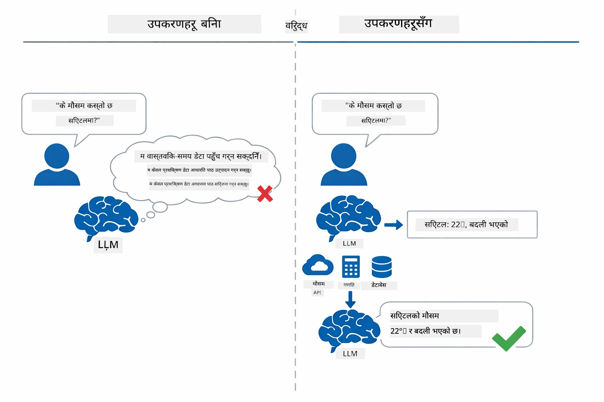

*उपकरण बिना मोडेलले केवल अनुमान लगाउँछ — उपकरणले API कल गर्न, गणना गर्न, र वास्तविक समय डेटा फर्काउन सक्छ।*

उपकरणहरू भएका AI एजेन्टहरूले **Reasoning and Acting (ReAct)** ढाँचा प्रयोग गर्छ। मोडेलले केवल प्रतिक्रिया दिन्छ भनी हुँदैन — यसले के चाहिन्छ सोच्दछ, उपकरण कल गरेर कार्य गर्छ, परिणाम अवलोकन गर्छ, अनि फेरि कार्य गर्ने वा अन्तिम उत्तर दिने निर्णय गर्छ:

1. **विचार गर्नुहोस्** — एजेन्टले प्रयोगकर्ताको प्रश्न विश्लेषण गरी के जानकारी चाहिन्छ निर्धारण गर्छ
2. **कार्य गर्नुहोस्** — एजेन्ट सही उपकरण छान्छ, सही प्यारामिटरहरू उत्पन्न गर्छ, र उपकरण कल गर्छ
3. **परिणाम अवलोकन गर्नुहोस्** — एजेन्टले उपकरणको आउटपुट प्राप्त गरी मूल्याङ्कन गर्छ
4. **दोहोर्याउनुहोस् वा प्रतिक्रिया दिनुहोस्** — यदि थप डाटा चाहिन्छ भने फेरि लूप गर्छ; नभए प्राकृतिक भाषा जवाफ तयार गर्दछ

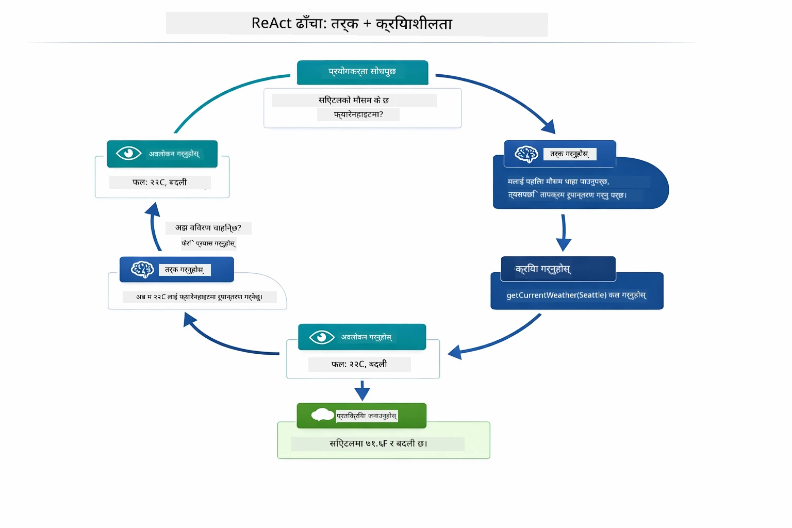

*ReAct चक्र — एजेन्टले के गर्ने भनेर सोच्दछ, उपकरण कल गरेर कार्य गर्छ, परिणाम देख्छ, र अन्तिम उत्तर दिनसम्म लूप गर्दछ।*

यो स्वतः हुन्छ। तिमीले उपकरण र ती विवरणहरू परिभाषित गर्छौ। मोडेलले कहिले र कसरी उपकरण प्रयोग गर्ने निर्णय गर्छ।

## उपकरण कल कसरी काम गर्छ

### उपकरण परिभाषाहरू

[WeatherTool.java](../../../04-tools/src/main/java/com/example/langchain4j/agents/tools/WeatherTool.java) | [TemperatureTool.java](../../../04-tools/src/main/java/com/example/langchain4j/agents/tools/TemperatureTool.java)

तिमीले स्पष्ट विवरण र प्यारामिटर विनिर्देशहरू सहित फङ्क्शनहरू परिभाषित गर्छौ। मोडेलले आफ्नो सिस्टम प्रॉम्प्टमा ती विवरणहरू देख्छ र कुन उपकरण के गर्छ बुझ्छ।

```java
@Component
public class WeatherTool {
    
    @Tool("Get the current weather for a location")
    public String getCurrentWeather(@P("Location name") String location) {
        // तपाइँको मौसम खोजी तर्क
        return "Weather in " + location + ": 22°C, cloudy";
    }
}

@AiService
public interface Assistant {
    String chat(@MemoryId String sessionId, @UserMessage String message);
}

// सहायक Spring Boot द्वारा स्वचालित रूपमा जडित गरिएको छ:
// - ChatModel बीन
// - @Component कक्षाहरूका सबै @Tool विधिहरू
// - सत्र व्यवस्थापनका लागि ChatMemoryProvider
```

तलको चित्रले प्रत्येक एनोटेशन विश्लेषण गरी देखाउँछ कि कसरी AI लाई कहिले उपकरण कल गर्ने र कुन आर्गुमेन्ट्सा पठाउने बुझाउन मद्दत गर्छ:

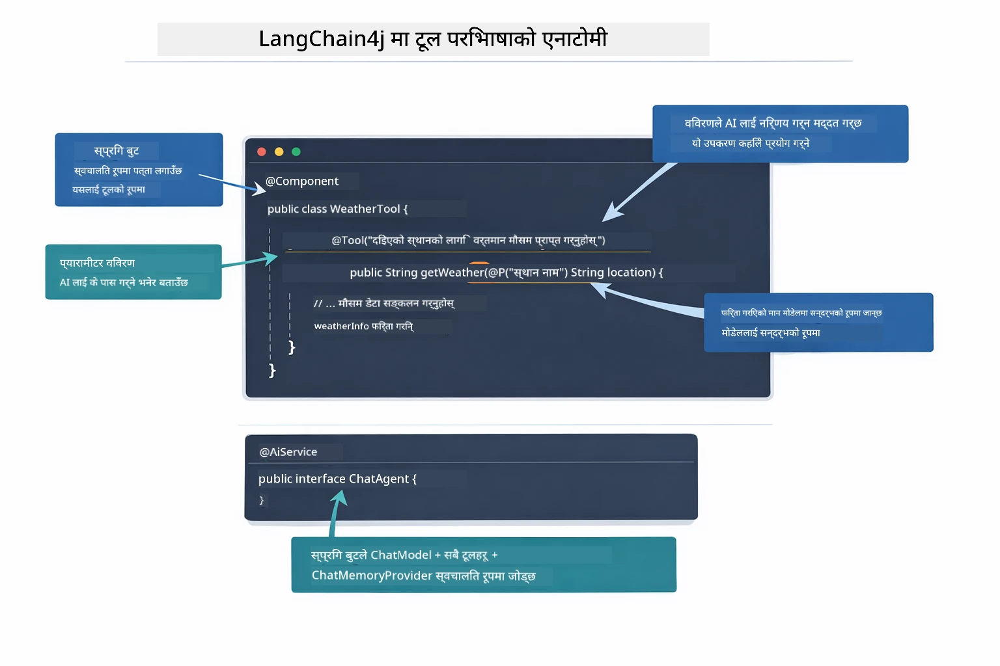

*उपकरण परिभाषाको संरचना — @Tool ले AI लाई कहिले प्रयोग गर्ने भन्छ, @P प्रत्येक प्यारामिटर वर्णन गर्छ, र @AiService सबैलाई सुरूमा जोड्छ।*

> **🤖 [GitHub Copilot](https://github.com/features/copilot) च्याटसँग प्रयास गर्नुहोस्:** [`WeatherTool.java`](../../../04-tools/src/main/java/com/example/langchain4j/agents/tools/WeatherTool.java) खोल्नुहोस् र सोध्नुहोस्:
> - "कसरी वास्तविक मौसम API जस्तै OpenWeatherMap सङ्ग मक्स्य डेटा सट्टा इंटिग्रेट गर्न सकिन्छ?"
> - "के राम्रो उपकरण विवरण हुन्छ जसले AI लाई त्यसलाई ठीक तरिकाले प्रयोग गर्न मद्दत गर्छ?"
> - "API त्रुटि र रेट लिमिटहरूलाई उपकरण लागू गर्दा कसरी ह्यान्डल गर्ने?"

### निर्णय लिने प्रक्रिया

जब प्रयोगकर्ताले सोध्छ "सिएटलको मौसम कस्तो छ?", मोडेलले कुनै उपकरण यादृच्छिक रूपमा छान्दैन। यसले प्रयोगकर्ताको उद्देश्य हरेक उपकरण विवरणसँग तुलना गर्छ, प्रासंगिकता अनुसार स्कोर गर्छ, र सबैभन्दा उपयुक्त चयन गर्छ। त्यसपछि सही प्यारामिटरहरूसहित संरचित फङ्क्शन कल उत्पादन गर्छ — यस केसमा, `location` लाई `"Seattle"` सेट गर्छ।

यदि कुनै उपकरण अनुरोधसँग मेल खाँदैन भने, मोडेल आफ्नो ज्ञानबाट जवाफ दिन्छ। यदि धेरै उपकरण मिल्छन् भने, सबैभन्दा विशिष्ट छान्छ।

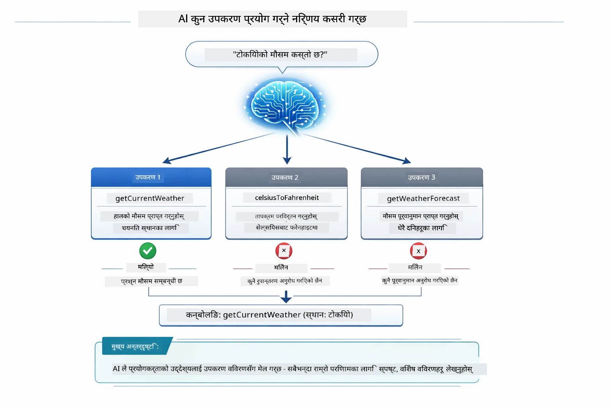

*मोडेलले प्रत्येक उपलब्ध उपकरण प्रयोगकर्ताको उद्देश्य विरुद्ध मूल्याङ्कन गरेर सबैभन्दा उपयुक्त चयन गर्छ — त्यसैले स्पष्ट, विशिष्ट उपकरण विवरण लेख्नु महत्त्वपूर्ण हुन्छ।*

### कार्यान्वयन

[AgentService.java](../../../04-tools/src/main/java/com/example/langchain4j/agents/service/AgentService.java)

स्प्रिङ बुटले `@AiService` इन्टरफेसलाई सबै दर्ता भएका उपकरणहरूसँग स्वतः वायर गर्छ, र LangChain4j ले उपकरण कलहरू स्वचालित रूपमा कार्यान्वयन गर्छ। पृष्ठभूमिमा, उपकरण कल छ चरणबाट पूर्ण रूपमा बहन्छ — प्रयोगकर्ताको प्राकृतिक भाषा प्रश्नदेखि अन्तिम प्राकृतिक भाषा उत्तरसम्म:

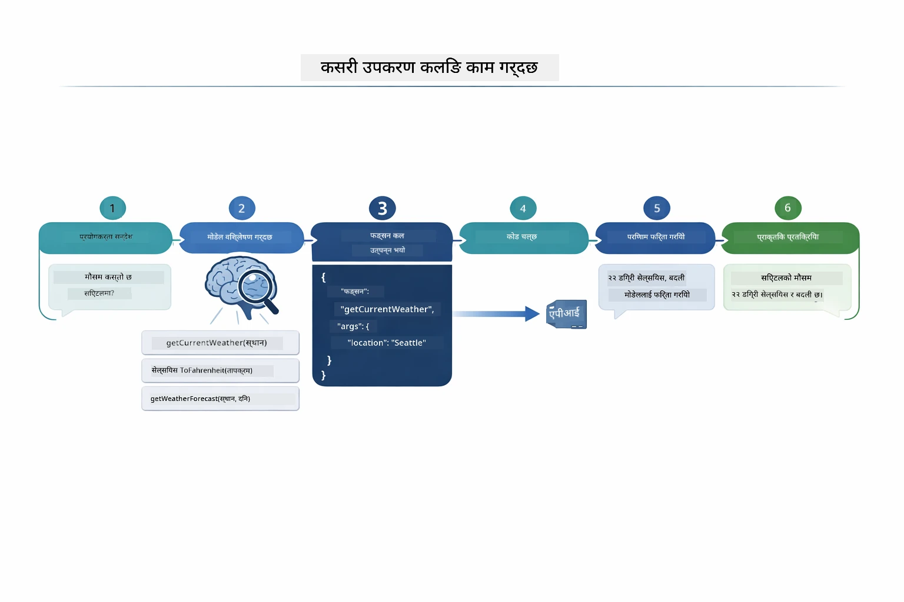

*अन्त-देखि-अन्त प्रवाह — प्रयोगकर्ताले प्रश्न सोध्छ, मोडेलले उपकरण चयन गर्छ, LangChain4j ले कार्यान्वयन गर्छ, र मोडेलले नतिजा प्रतिक्रिया बनाउन समेट्छ।*

यदि तिमीले Module 00 मा [ToolIntegrationDemo](../../../00-quick-start/src/main/java/com/example/langchain4j/quickstart/ToolIntegrationDemo.java) चलाएको छौ भने, यस ढाँचालाई पहिले देखिसकेको छौ — `Calculator` उपकरणहरू पनि यस्तै कल भएका थिए। तलको अनुक्रमिक चित्रले त्यो डेमोको दौरान के भयो देखाउँछ:

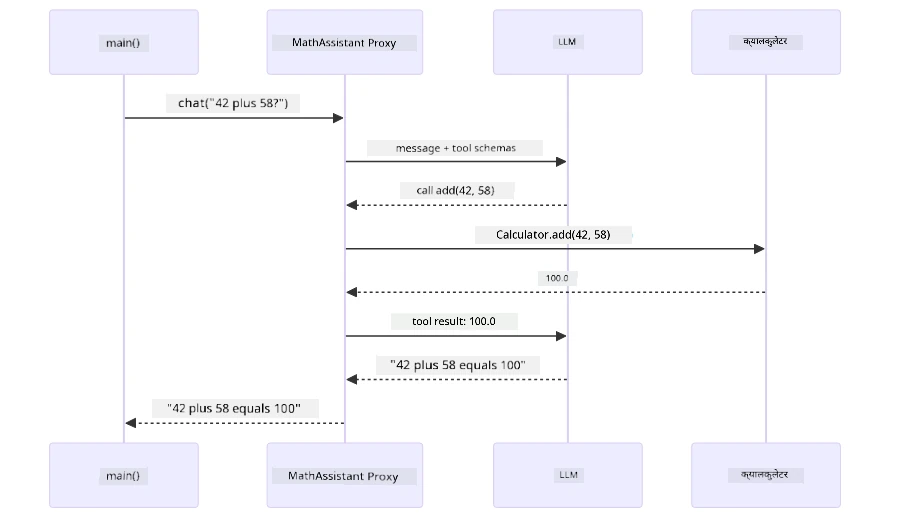

*द्रुत शुरु डेमोबाट उपकरण कल लूप — `AiServices` ले तिमीले दिएको सन्देश र उपकरण स्कीमाहरू LLM लाई पठाउँछ, LLM ले `add(42, 58)` जस्तो फङ्क्शन कल फर्काउँछ, LangChain4j ले स्थानीयरूपमा `Calculator` विधि चलाउँछ, र परिणाम अन्तिम उत्तरका लागि फिर्ता गर्छ।*

> **🤖 [GitHub Copilot](https://github.com/features/copilot) च्याटसँग प्रयास गर्नुहोस्:** [`AgentService.java`](../../../04-tools/src/main/java/com/example/langchain4j/agents/service/AgentService.java) खोल्नुहोस् र सोध्नुहोस्:
> - "ReAct ढाँचाले कसरी काम गर्छ र किन AI एजेन्टहरूका लागि प्रभावकारी छ?"
> - "एजेन्टले कुन उपकरण कसरी र कुन क्रममा प्रयोग गर्ने निर्णय कसरी गर्छ?"
> - "यदि उपकरण कार्यान्वयन असफल भयो भने के हुन्छ - मैले कसरी त्रुटि समस्याहरूसँग मजबुत व्यवहार गर्ने?"

### प्रतिक्रिया सिर्जना

मोडेलले मौसम डाटा प्राप्त गर्छ र प्रयोगकर्ताका लागि प्राकृतिक भाषा प्रतिक्रिया स्वरूप फर्म्याट गर्छ।

### आर्किटेक्चर: स्प्रिङ बुट स्वत: वायरिङ

यस मोड्युलले LangChain4j को स्प्रिङ बुट इंटिग्रेशन प्रयोग गर्छ जुन `@AiService` इण्टरफेसहरू बाक्लो रूपमा प्रयोग हुने उपकरणहरूसँग जोडिन्छन्। स्टार्टअपमा स्प्रिङ बुटले `@Tool` मेथड भएका सबै `@Component` हरू, तिम्रो `ChatModel` बीन र `ChatMemoryProvider` पत्ता लगाएर सबैलाई एउटै `Assistant` इण्टरफेसमा जोड्छ — र बोइलरप्लेट शून्य बनाउँछ।

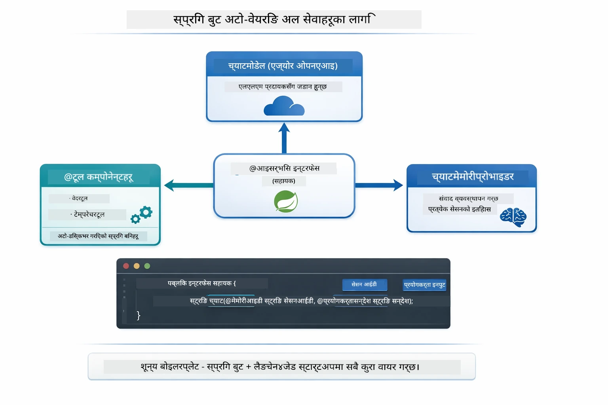

*@AiService इण्टरफेसले ChatModel, उपकरण कम्पोनेन्टहरू, र मेमोरी प्रदायकलाई जोड्छ — स्प्रिङ बुटले सबै वायरिङ स्वतः गर्छ।*

HTTP अनुरोधबाट सुरु गरी कन्ट्रोलर, सेवा, र स्वत: वायर गरिएको प्रोक्सीबाट उपकरण कार्यान्वयनसम्मको पूर्ण अनुरोध जीवनचक्र तल अनुक्रम चित्रमा छ:

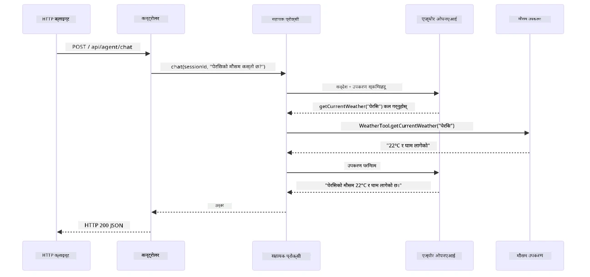

*पूर्ण स्प्रिङ बुट अनुरोध जीवनचक्र — HTTP अनुरोध कन्ट्रोलर र सेवाबाट स्वत: वायर गरिएको सहायक प्रोक्सीसम्म बहन्छ, जसले LLM र उपकरण कलहरू स्वचालित रूपमा समन्वय गर्दछ।*

यस दृष्टिकोणका मुख्य फाइदाहरू:

- **स्प्रिङ बुट स्वत: वायरिङ** — ChatModel र उपकरणहरू स्वचालित रूपमा इन्जेक्ट हुन्छन्
- **@MemoryId ढाँचाले** — स्वचालित सेसन-आधारित मेमोरी व्यवस्थापन गर्छ
- **एकल उदाहरण** — सहायक एक पटक सिर्जना गरिन्छ र राम्रो प्रदर्शनका लागि पुन: प्रयोग गरिन्छ
- **प्रकार-सुरक्षित कार्यान्वयन** — Java विधिहरू प्रत्यक्ष प्रकार रूपान्तरणसहित कल हुन्छन्
- **बहु-पटक समन्वय** — उपकरण श्रृंखला स्वचालित रूपमा व्यवस्थापन गर्छ
- **बोइलरप्लेट शून्य** — कुनै म्यानुअल `AiServices.builder()` कल वा मेमोरी ह्यासम्याप छैन

वैकल्पिक विधिहरू (म्यानुअल `AiServices.builder()`) बढी कोड आवश्यक पर्छ र स्प्रिङ बुट इंटिग्रेशनका फाइदाहरू हराउँछन्।

## उपकरण श्रृंखला

**उपकरण श्रृंखला** — उपकरण-आधारित एजेन्टहरूको वास्तविक शक्ति तब देखिन्छ जब एउटै प्रश्नलाई धेरै उपकरणहरू चाहिन्छ। "सिएटलको मौसम फरनहाइटमा कस्तो छ?" सोध्दा एजेन्टले आफैं दुई उपकरण श्रृंखलाबद्ध गर्छ: पहिले `getCurrentWeather` कल गरेर सेल्सियसमा तापक्रम पाउँछ, त्यसपछि `celsiusToFahrenheit` कलमा सो मान पास गर्छ — यो सबै एउटै संवाद मोडमा हुन्छ।

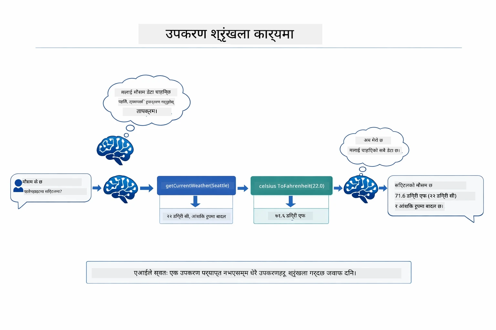

*उपकरण श्रृंखला क्रियामा — एजेन्टले पहिले getCurrentWeather कल गर्छ, त्यसपछि सेल्सियस नतिजा celsiusToFahrenheit मा पठाउँछ, र संयुक्त उत्तर दिन्छ।*

**सुन्तला फेल्योरहरू** — मक्स्य डेटा नभएको शहरको मौसम सोध्दा, उपकरणले त्रुटि सन्देश फर्काउँछ र AI ले भन्न सक्छ कि मद्दत गर्न सक्दैन — भङ्ग हुँदैन। उपकरणहरू सुरक्षित रूपमा असफल हुन्छन्। तलको चित्रले दुई विधिहरू तुलना गर्दछ — उचित त्रुटि ह्यान्डलिङ हुँदा एजेन्टले अपवाद समात्छ र मद्दतपूर्ण जवाफ दिन्छ, नभए पुरै एप्लिकेसन क्र्यास हुन्छ:

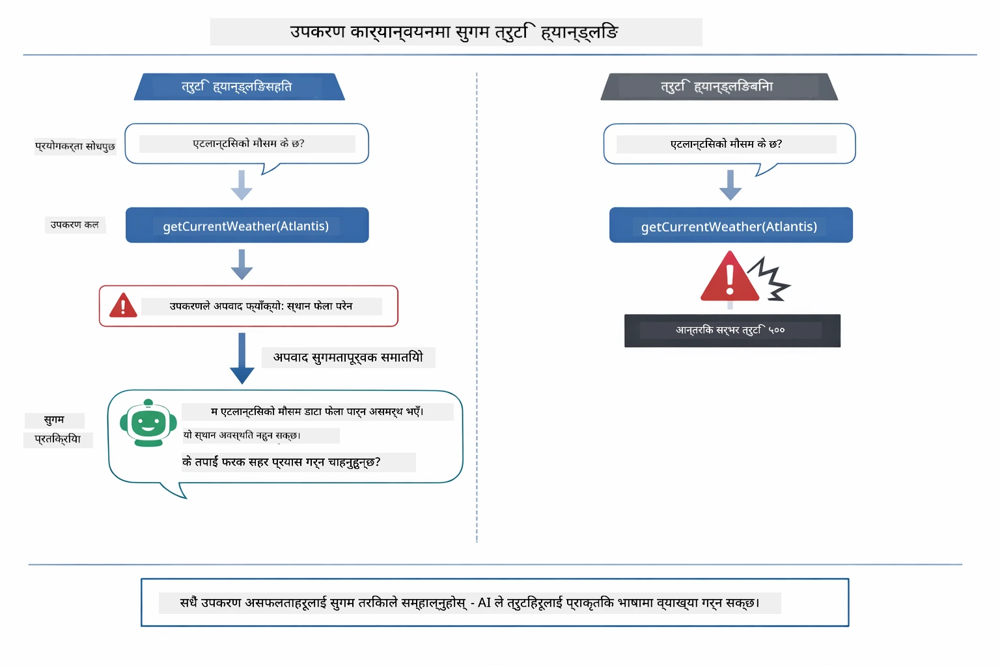

*जब उपकरण असफल हुन्छ, एजेन्टले त्रुटि समात्छ र दुर्घटना नहुने गरी उपयोगी व्याख्या दिन्छ।*

यो सबै एउटै संवाद चरणमा हुन्छ। एजेन्टले धेरै उपकरण कलहरू स्वचालित रूपमा समन्वय गर्छ।

## एप्लिकेसन चलाउनुहोस्

**तैनाथ पुष्टि गर्नुहोस्:**

रूट निर्देशिकामा `.env` फाइल Azure प्रमाणपत्रसहित हुनु पर्छ (Module 01 को समयमा सिर्जना गरिएको)। यो मोड्युलको निर्देशिकाबाट (`04-tools/`) यो चलाउनुहोस्:

**Bash:**
```bash
cat ../.env  # AZURE_OPENAI_ENDPOINT, API_KEY, DEPLOYMENT देखाउनु पर्छ
```

**PowerShell:**
```powershell
Get-Content ..\.env  # AZURE_OPENAI_ENDPOINT, API_KEY, DEPLOYMENT देखाउनुपर्छ
```

**एप्लिकेसन सुरु गर्नुहोस्:**

> **टिप्पणी:** यदि तिमीले पहिले नै रूट निर्देशिकाबाट `./start-all.sh` प्रयोग गरी सबै एप्लिकेसन सुरु गरिसकेको छौं (जस्तै Module 01 मा वर्णन), यो मोड्युल पहिले नै पोर्ट 8084 मा चलिरहेको छ। तिम्रो सुरु आदेशहरू छोडेर सिधै http://localhost:8084 मा जान सकिन्छ।

**विकल्प १: Spring Boot Dashboard प्रयोग (VS Code प्रयोगकर्ताका लागि सिफारिस गरिएको)**

डिभ कन्टेनरमा Spring Boot Dashboard एक्सटेन्सन समावेश छ, जुन सबै Spring Boot एप्लिकेसनहरूलाई व्यवस्थापन गर्न दृश्यात्मक इन्टरफेस प्रदान गर्छ। VS Code को बायाँपट्टि Activity Bar मा Spring Boot आइकन खोज्नुहोस्।

Spring Boot Dashboard बाट तिमीले:
- कार्यक्षेत्रमा सबै उपलब्ध Spring Boot एप्लिकेसनहरू देख्न सक्नेछौ
- एप्लिकेसनहरूलाई एक क्लिकमा सुरु/रोक्न सक्नेछौ
- रियल-टाइम एप्लिकेसन लगहरू हेर्न सक्नेछौ
- एप्लिकेसनको स्थिति ट्रयाक गर्न सक्नेछौ
सिधै "tools" को छेउमा प्ले बटन क्लिक गर्दै यो मोड्युल सुरू गर्नुहोस्, वा सबै मोड्युलहरू एकैपटक सुरू गर्नुहोस्।

VS Code मा Spring Boot Dashboard यस्तो देखिन्छ:


*VS Code मा Spring Boot Dashboard — सबै मोड्युलहरू एकै ठाउँबाट सुरू, रोकथाम र अनुगमन गर्नुहोस्*

**विकल्प २: शेल स्क्रिप्टहरू प्रयोग गर्ने**

संसारभरका सबै वेब अनुप्रयोगहरू (मोड्युल ०१-०४) सुरू गर्नुहोस्:

**Bash:**
```bash
cd ..  # मूल निर्देशिका बाट
./start-all.sh
```

**PowerShell:**
```powershell
cd ..  # रूट निर्देशिका बाट
.\start-all.ps1
```

वा मात्र यो मोड्युल सुरू गर्नुहोस्:

**Bash:**
```bash
cd 04-tools
./start.sh
```

**PowerShell:**
```powershell
cd 04-tools
.\start.ps1
```

दुवै स्क्रिप्टहरूले स्वतः रूपमा बडा `.env` फाइलबाट वातावरण चरहरू लोड गर्छन् र JAR हरु नभएमा निर्माण गर्नेछन्।

> **नोट:** यदि तपाईं सबै मोड्युलहरू म्यानुअली निर्माण गर्न चाहनुहुन्छ भने सुरू गर्नु अघि:
>
> **Bash:**
> ```bash
> cd ..  # Go to root directory
> mvn clean package -DskipTests
> ```
>
> **PowerShell:**
> ```powershell
> cd ..  # Go to root directory
> mvn clean package -DskipTests
> ```

आफ्नो ब्राउजरमा http://localhost:8084 खोल्नुहोस्।

**रोक्न:**

**Bash:**
```bash
./stop.sh  # यो मोड्युल मात्रै
# वा
cd .. && ./stop-all.sh  # सबै मोड्युलहरू
```

**PowerShell:**
```powershell
.\stop.ps1  # यो मोड्युल मात्र
# वा
cd ..; .\stop-all.ps1  # सबै मोड्युलहरू
```

## अनुप्रयोग प्रयोग गर्दै

अनुप्रयोगले वेब इन्टरफेस प्रदान गर्दछ जहाँ तपाईं एउटा AI एजेन्टसँग अन्तरक्रिया गर्न सक्नुहुन्छ जसले मौसम र तापक्रम रूपान्तरण उपकरणहरूमा पहुँच राख्छ। इन्टरफेस यस्तो देखिन्छ — यसमा छिटो सुरू गर्ने उदाहरणहरू र अनुरोधहरू पठाउन च्याट प्यानल समावेश छन्:

<a href="images/tools-homepage.png"></a>

*AI एजेन्ट टुल्स इन्टरफेस - उपकरणहरूसँग अन्तरक्रिया गर्न छिटो उदाहरणहरू र च्याट अन्तरफलक*

### साधारण उपकरण प्रयोग प्रयास गर्नुहोस्

सरल अनुरोधबाट शुरू गर्नुहोस्: "100 डिग्री फेरनहाइटलाई सेल्सियसमा रूपान्तरण गर्नुहोस्"। एजेन्टले यो बुझ्छ कि तापक्रम रूपान्तरण उपकरण चाहिन्छ, सही प्यारामिटरहरू सहित कल गर्छ र परिणाम फर्काउँछ। ध्यान दिनुहोस् कत्तिको प्राकृतिक महसुस हुन्छ - तपाईंले कुन उपकरण प्रयोग गर्ने वा कसरी कल गर्ने निर्दिष्ट गर्नुपर्ने थिएन।

### उपकरण श्रृंखला परीक्षण गर्नुहोस्

अहिले केहि बढी जटिल प्रयास गर्नुहोस्: "सिएटलको मौसम कस्तो छ र यसलाई फेरनहाइटमा रूपान्तरण गर्नुहोस्?" एजेन्टले यसलाई चरणहरूमा काम गर्छ। यसले पहिला मौसम पाउँछ (जसले सेल्सियसमा परिणाम दिन्छ), रूपान्तरण गर्नुपर्ने बुझ्छ, रूपान्तरण उपकरण कल गर्छ, र दुवै परिणामहरूलाई एउटै जवाफमा समेट्छ।

### संवाद प्रवाह हेर्नुहोस्

च्याट इन्टरफेसले संवाद इतिहास कायम राख्छ, जसले तपाईंलाई बहु-चरण अन्तरक्रियाहरू गर्न अनुमति दिन्छ। तपाईंले सबै अघिल्ला प्रश्नहरू र जवाफहरू देख्न सक्नुहुन्छ, जसले संवाद ट्र्याक गर्न र एजेन्टले कसरी धेरै विनिमयहरूमा सन्दर्भ बनाउँछ बुझ्न सजिलो बनाउँछ।

<a href="images/tools-conversation-demo.png"></a>

*साधारण रूपान्तरणहरू, मौसम खोजहरू र उपकरण श्रृंखला देखाउने बहु-चरण संवाद*

### विभिन्न अनुरोधहरू प्रयोग गरेर प्रयास गर्नुहोस्

विभिन्न संयोजनहरू प्रयास गर्नुहोस्:
- मौसम खोजहरू: "टोकियोमा मौसम कस्तो छ?"
- तापक्रम रूपान्तरण: "२५°C कति केल्भिन हो?"
- संयुक्त प्रश्नहरू: "पेरिसमा मौसम जाँच गर्नुहोस् र मलाई बताउनुहोस् कि यो २०°C भन्दा माथि छ कि छैन"

ध्यान दिनुहोस् एजेन्ट कसरी प्राकृतिक भाषालाई बुझ्छ र उपयुक्त उपकरण कलहरूमा नक्सांकन गर्छ।

## मुख्य अवधारणाहरू

### ReAct ढाँचा (तर्क र क्रिया)

एजेन्टले तर्क गर्ने (के गर्ने निर्णय गर्ने) र क्रिया गर्ने (उपकरणहरू प्रयोग गर्ने) बीचमा पालो पालो काम गर्छ। यस ढाँचाले मात्र निर्देशनमा प्रतिक्रिया दिनुभन्दा स्वतन्त्र समस्या समाधान सक्षम बनाउँछ।

### उपकरण विवरणले महत्त्व राख्छ

तपाईंले दिएको उपकरण विवरणको गुणस्तरले एजेन्टले तिनीहरूको उपयोग कत्तिको राम्रो गर्छ निर्धारण गर्छ। स्पष्ट र विशेष विवरणले मोडेललाई जब र कसरी प्रत्येक उपकरण कल गर्ने बुझ्न मद्दत गर्छ।

### सत्र व्यवस्थापन

`@MemoryId` एनोटेशनले स्वतः सत्र-आधारित मेमोरी व्यवस्थापन सक्षम पार्दछ। प्रत्येक सत्र ID लाई यसको आफ्नै `ChatMemory` उदाहरण प्राप्त हुन्छ जुन `ChatMemoryProvider` बीनले व्यवस्थापन गर्छ, जसले गर्दा धेरै प्रयोगकर्ताहरूले एजेन्टसँग एकैसाथ अन्तरक्रिया गर्दा संवादहरु मिसिन हुँदैनन्। तलको चित्रले देखाउँछ कसरी धेरै प्रयोगकर्ताहरूलाई उनीहरूको सत्र ID आधारमा अलग-अलग मेमोरी स्टोरमा पठाइन्छ:

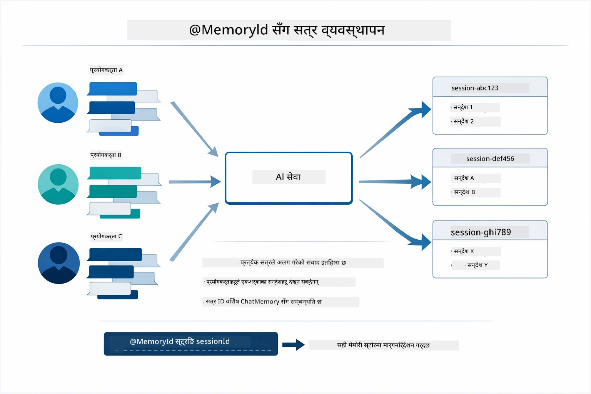

*प्रत्येक सत्र ID ले अलग संवाद इतिहाससँग मेल खान्छ — प्रयोगकर्ताहरूले एकअर्काका सन्देशहरू कहिल्यै देख्दैनन्।*

### त्रुटि व्यवस्थापन

उपकरणहरू असफल हुन सक्छन् — API हरू समयावधि पार हुन सक्छ, प्यारामिटरहरू अमान्य हुन सक्छन्, बाह्य सेवा बन्द हुन सक्छ। उत्पादन एजेन्टहरूले त्रुटि व्यवस्थापन आवश्यक छ जसले मोडेललाई समस्याहरू व्याख्या गर्न वा विकल्पहरू प्रयास गर्न दिन्छ, सम्पूर्ण अनुप्रयोग क्र्यास नगर्न। जब कुनै उपकरणले अपवाद फाल्छ, LangChain4j ले यसलाई समातेर त्रुटि सन्देश मोडेलमा फिर्ता पठाउँछ, जसले त्यसपछि प्राकृतिक भाषामा समस्या व्याख्या गर्न सक्छ।

## उपलब्ध उपकरणहरू

तलको चित्रले तपाईंले निर्माण गर्न सक्ने विभिन्न उपकरणहरूको व्यापक पारिस्थितिकी प्रणाली देखाउँछ। यस मोड्युलले मौसम र तापक्रम उपकरणहरू देखाउँछ, तर उस्तै `@Tool` ढाँचाले कुनै पनि Java मेथडसँग काम गर्छ — डाटाबेस सोधहरूदेखि भुक्तानी प्रक्रिया सम्म।

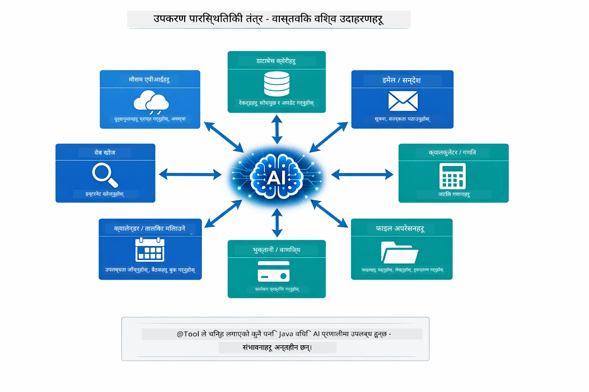

*@Tool एनोटेसन भएका कुनै पनि Java मेथड AI को लागि उपलब्ध हुन्छन् — यस ढाँचाले डाटाबेस, API, इमेल, फाइल अपरेसन र अन्यलाई विस्तार गर्छ।*

## उपकरण-आधारित एजेन्टहरू कहिले प्रयोग गर्ने

सबै अनुरोधहरूलाई उपकरणहरू आवश्यक पर्दैनन्। निर्णय त्योमा निर्भर गर्दछ कि AI ले बाह्य प्रणालीहरूसँग अन्तरक्रिया गर्न आवश्यक छ वा आफ्नै ज्ञानबाट उत्तर दिन सक्छ। तलको मार्गदर्शकले संवाद गर्छ कहिले उपकरणहरूले मूल्य थप्छ र कहिले आवश्यक हुँदैन:

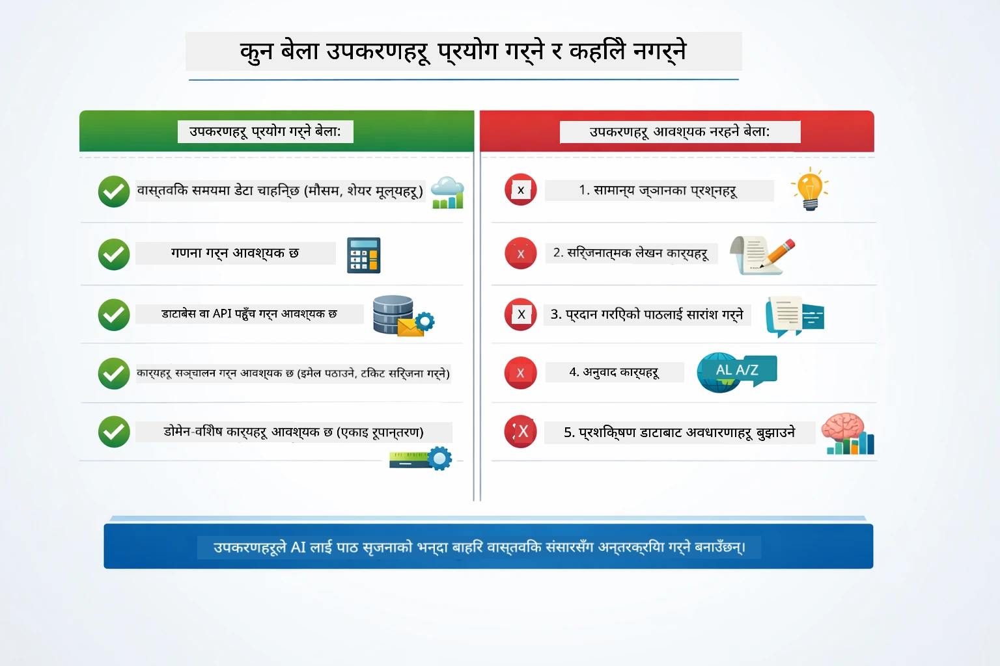

*छिटो निर्णय मार्गदर्शक — उपकरणहरू वास्तविक-समय डेटा, गणना र क्रियाकलापका लागि; सामान्य ज्ञान र सिर्जनात्मक कार्यहरूका लागि आवश्यक छैनन्।*

## उपकरणहरू बनाम RAG

मोड्युल ०३ र ०४ दुबै AI ले के गर्ने क्षमता विस्तार गर्छन्, तर आधारभूत रूपमा फरक तरिकाले। RAG मोडेललाई **ज्ञान** पहुँच दिन्छ कागजातहरू पुन: प्राप्त गरेर। उपकरणहरूले मोडेललाई **क्रियाकलापहरू** गर्न सक्षम बनाउँछन् फंक्शनहरू कल गरेर। तलको चित्रले यी दुई दृष्टिकोणहरू साइड बाई साइड तुलना गर्दछ — कसरी प्रत्येक वर्कफ्लो सञ्चालन गर्छ र तिनीहरूबीचको व्यापारिक पक्षहरू देखाएर:

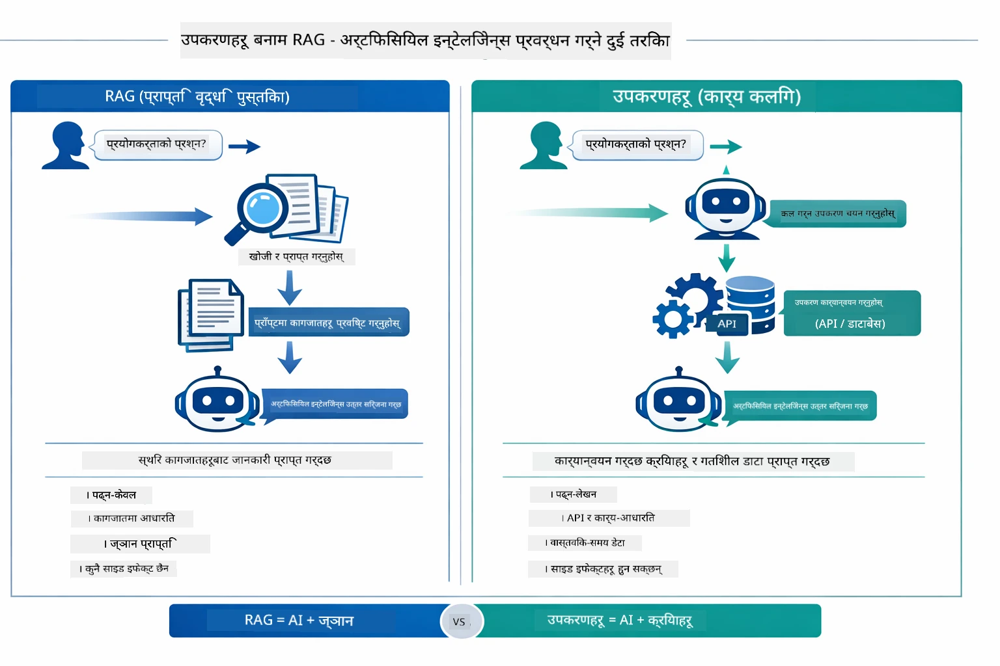

*RAG स्थिर कागजातहरूबाट जानकारी पुन: प्राप्त गर्छ — उपकरणहरूले क्रियाकलापहरू कार्यान्वयन गर्छन् र गतिशील, वास्तविक-समय डेटा ल्याउँछन्। धेरै उत्पादन प्रणालीहरूले दुबै संयोजन गर्छन्।*

व्यावहारिक रूपमा, धेरै उत्पादन प्रणालीहरूले दुबै दृष्टिकोणहरू संयोजन गर्छन्: RAG द्वारा तपाईंको कागजातहरूमा उत्तरहरू आधारित गर्ने, र उपकरणहरू द्वारा प्रत्यक्ष डेटा ल्याउने वा सञ्चालन गर्ने।

## आगामी चरणहरू

**अर्को मोड्युल:** [05-mcp - Model Context Protocol (MCP)](../05-mcp/README.md)

---

**नेभीगेसन:** [← अघिल्लो: मोड्युल ०३ - RAG](../03-rag/README.md) | [मुख्य पृष्ठमा फर्कनुहोस्](../README.md) | [अर्को: मोड्युल ०५ - MCP →](../05-mcp/README.md)

---

<!-- CO-OP TRANSLATOR DISCLAIMER START -->
**अस्वीकरण**:  
यो दस्तावेज् AI अनुवाद सेवा [Co-op Translator](https://github.com/Azure/co-op-translator) प्रयोग गरी अनुवाद गरिएको हो। हामी शुद्धताको लागि प्रयासरत छौं, तर कृपया ध्यान दिनुहोस् कि स्वचालित अनुवादहरूमा त्रुटि वा असत्यता हुन सक्दछ। मूल दस्तावेज आफ्नो मातृ भाषामा नै आधिकारिक स्रोत मान्नुपर्छ। महत्वपूर्ण जानकारीको लागि व्यावसायिक मानव अनुवाद सिफारिस गरिन्छ। यस अनुवादको प्रयोगबाट उत्पन्न कुनै पनि गलतफहमी वा गलत व्याख्या को लागि हाम्रो जिम्मेवारी हुँदैन।
<!-- CO-OP TRANSLATOR DISCLAIMER END -->