# Module 05: Model Context Protocol (MCP)

## Table of Contents

- [के तपाईंले सिक्नुहुनेछ](../../../05-mcp)
- [MCP के हो?](../../../05-mcp)
- [MCP कसरी काम गर्छ](../../../05-mcp)
- [एजेण्टिक मोड्युल](../../../05-mcp)
- [उदाहरणहरू चलाउने तरिका](../../../05-mcp)
  - [पूर्वाधारहरू](../../../05-mcp)
- [छिटो सुरुवात](../../../05-mcp)
  - [फाइल अपरेशनहरू (Stdio)](../../../05-mcp)
  - [सुपरभाइजर एजेण्ट](../../../05-mcp)
    - [डेमो चलाउने तरिका](../../../05-mcp)
    - [सुपरभाइजर कसरी काम गर्छ](../../../05-mcp)
    - [प्रतिक्रिया रणनीतिहरू](../../../05-mcp)
    - [आउटपुट बुझ्ने तरिका](../../../05-mcp)
    - [एजेण्टिक मोड्युलका सुविधाहरूको व्याख्या](../../../05-mcp)
- [मुख्य अवधारणाहरू](../../../05-mcp)
- [बधाई छ!](../../../05-mcp)
  - [अर्को के छ?](../../../05-mcp)

## के तपाईंले सिक्नुहुनेछ

तपाईंले संवादात्मक AI निर्माण गर्नुभयो, प्रॉम्प्टहरू मास्टर गर्नुभयो, प्रतिक्रियाहरूलाई कागजातमा आधारित बनाउनुभयो, र उपकरणहरू सहित एजेन्टहरू सिर्जना गर्नुभयो। तर ती सबै उपकरणहरू तपाईंको विशेष अनुप्रयोगका लागि अनुकूलित थिए। के भए यदि तपाईंले तपाईंको AI लाई यस्तो मानकीकृत उपकरणहरूको पारिस्थितिकी तन्त्रमा पहुँच दिन सक्नुहुन्थ्यो जुन कुनैपनि मानिसले सिर्जना र साझा गर्न सक्छ? यस मोड्युलमा, तपाईंले Model Context Protocol (MCP) र LangChain4j को एजेन्टिक मोड्युलका साथ त्यसै गर्न सिक्नुहुनेछ। हामीले पहिले एक साधारण MCP फाइल रिडर देखाउँछौं र त्यसपछि कसरी यो सजिलै सुपरिवेक्षक एजेण्ट ढाँचाको प्रयोग गरेर उन्नत एजेन्टिक कार्यप्रवाहहरूमा एकीकृत हुन्छ भनेर देखाउँछौं।

## MCP के हो?

Model Context Protocol (MCP) ले त्यसै प्रदान गर्छ - एआई अनुप्रयोगहरूका लागि बाहिरी उपकरणहरू पत्ता लगाउने र प्रयोग गर्ने एक मानक तरिका। प्रत्येक डाटा स्रोत वा सेवाको लागि अनुकूलन गरिएको एकीकरण लेख्ने सट्टा, तपाईं MCP सर्भरहरूसँग जडान हुनुहुन्छ जसले आफ्नो क्षमताहरू मिल्दोजुल्दो ढाँचामा प्रदर्शित गर्छ। तपाईंको AI एजेन्टले तब यी उपकरणहरू स्वचालित रूपमा पत्ता लगाउन र प्रयोग गर्न सक्छ।


*MCP भन्दा पहिले: जटिल बिन्दु-देखि-बिन्दु एकीकरणहरू। MCP पछि: एक प्रोटोकल, अनन्त सम्भावनाहरू।*

MCP एआई विकासमा एउटा मौलिक समस्यालाई समाधान गर्छ: प्रत्येक एकीकरण अनुकूलित हुन्छ। GitHub पहुँच गर्न चाहनुहुन्छ? अनुकूलित कोड। फाइलहरू पढ्न चाहनुहुन्छ? अनुकूलित कोड। डाटाबेस क्वेरी गर्न चाहनुहुन्छ? अनुकूलित कोड। र यी धेरै एकीकरणहरूले अन्य AI अनुप्रयोगसँग काम गर्दैन।

MCP यसलाई मानकीकृत गर्छ। एक MCP सर्भरले स्पष्ट वर्णन र स्कीमाहरू सहित उपकरणहरू सार्वजनिक गर्छ। कुनै पनि MCP ग्राहक जडान गर्न सक्छ, उपलब्ध उपकरणहरू पत्ता लगाउन सक्छ र तिनीहरू प्रयोग गर्न सक्छ। एक पटक निर्माण गर्नुहोस्, जहिले पनि प्रयोग गर्नुहोस्।


*Model Context Protocol वास्तुकला - मानकीकृत उपकरण पत्ता लगाउने र कार्यान्वयन गर्ने प्रणाली*

## MCP कसरी काम गर्छ

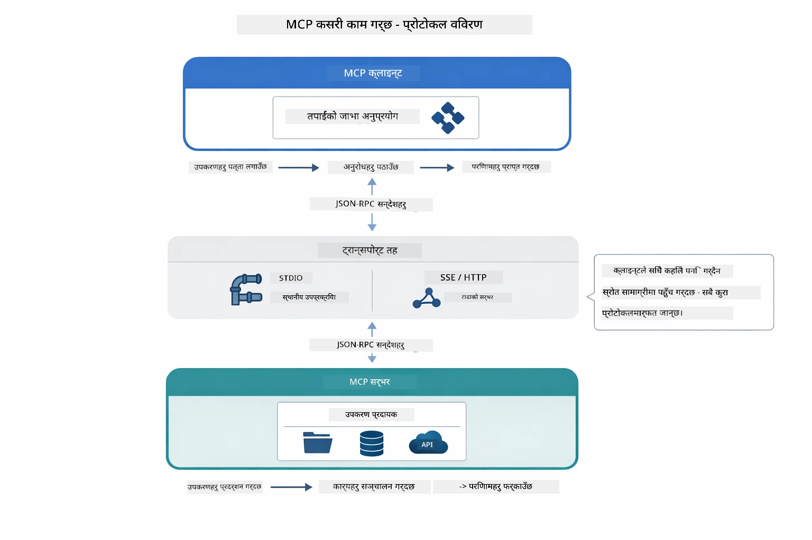

*MCP को कार्यक्षमता — ग्राहकहरूले उपकरणहरू पत्ता लगाउँछन्, JSON-RPC सन्देशहरू साटासाट गर्छन्, र ट्रान्सपोर्ट लेयरको माध्यमबाट अपरेशनहरू कार्यान्वयन गर्छन्।*

**सर्भर-ग्राहक वास्तुकला**

MCP ले ग्राहक-सर्भर मोडेल प्रयोग गर्छ। सर्भरहरू उपकरणहरू प्रदान गर्छन् - फाइलहरू पढ्ने, डाटाबेस क्वेरी गर्ने, API कल गर्ने। ग्राहकहरू (तपाईंको AI अनुप्रयोग) सर्भरहरूसँग जडान हुन्छन् र तिनीहरूको उपकरण प्रयोग गर्छन्।

LangChain4j सँग MCP प्रयोग गर्न, Maven निर्भरता थप्नुहोस्:

```xml
<dependency>
    <groupId>dev.langchain4j</groupId>
    <artifactId>langchain4j-mcp</artifactId>
    <version>${langchain4j.version}</version>
</dependency>
```

**उपकरण पत्ता लगाउने**

जब तपाईंको ग्राहक MCP सर्भरमा जडान हुन्छ, यसले सोध्छ "तपाईंसँग के उपकरणहरू छन्?" सर्भरले उपलब्ध उपकरणहरूको सूची पठाउँछ, प्रत्येकसँग वर्णन र प्यारामिटर स्कीमाहरू सहित। तपाईंको AI एजेन्टले त्यसपछि प्रयोगकर्ताको अनुरोधका आधारमा कुन उपकरणहरू प्रयोग गर्ने निर्णय गर्न सक्छ।

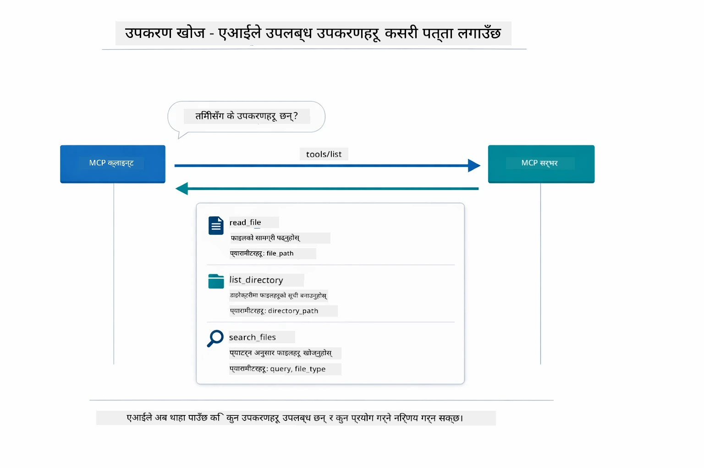

*AI ले प्रर्दशनीमा उपलब्ध उपकरणहरू पत्ता लगाउँछ — अब यसलाई थाहा छ के क्षमताहरू उपलब्ध छन् र कुनहरू प्रयोग गर्ने भनेर निर्णय गर्न सक्छ।*

**ट्रान्सपोर्ट म्याकेन्मिज्म**

MCP ले विभिन्न ट्रान्सपोर्ट म्याकेन्मिज्महरू समर्थन गर्छ। यो मोड्युलले स्थानीय प्रक्रियाहरूको लागि Stdio ट्रान्सपोर्ट प्रदर्शन गर्छ:


*MCP ट्रान्सपोर्ट म्याकेन्मिज्म: रिमोट सर्भरहरूको लागि HTTP, स्थानीय प्रक्रियाहरूको लागि Stdio*

**Stdio** - [StdioTransportDemo.java](../../../05-mcp/src/main/java/com/example/langchain4j/mcp/StdioTransportDemo.java)

स्थानीय प्रक्रियाहरूको लागि। तपाईंको अनुप्रयोगले सर्भरलाई एक subprocess को रूपमा चलाउँछ र मानक इनपुट/आउटपुट मार्फत सञ्चार गर्दछ। फाइल सिस्टम पहुँच वा कमान्ड लाइन उपकरणहरूका लागि उपयोगी।

```java
McpTransport stdioTransport = new StdioMcpTransport.Builder()
    .command(List.of(
        npmCmd, "exec",
        "@modelcontextprotocol/server-filesystem@2025.12.18",
        resourcesDir
    ))
    .logEvents(false)
    .build();
```

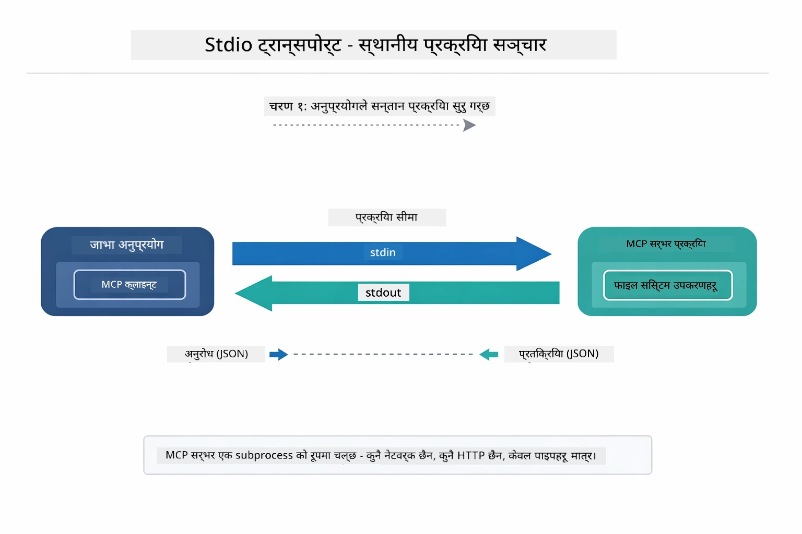

*Stdio ट्रान्सपोर्ट कार्यमा — तपाईंको अनुप्रयोगले MCP सर्भरलाई बच्चा प्रक्रियाको रूपमा चलाउँछ र stdin/stdout पाइपहरू मार्फत सञ्चार गर्छ।*

> **🤖 [GitHub Copilot](https://github.com/features/copilot) च्याटसँग प्रयास गर्नुहोस्:** [`StdioTransportDemo.java`](../../../05-mcp/src/main/java/com/example/langchain4j/mcp/StdioTransportDemo.java) खोल्नुहोस् र सोध्नुहोस्:
> - "Stdio ट्रान्सपोर्ट कसरी काम गर्छ र म कहिले HTTPको सट्टा यसलाई प्रयोग गर्नुपर्छ?"
> - "LangChain4j ले कसरी MCP सर्भर प्रक्रियाहरूको जीवनचक्र व्यवस्थापन गर्छ?"
> - "AIलाई फाइल सिस्टम पहुँच दिनुका सुरक्षा प्रभावहरू के छन्?"

## एजेन्टिक मोड्युल

जबकि MCP ले मानकीकृत उपकरणहरू प्रदान गर्दछ, LangChain4j को **एजेन्टिक मोड्युल** ती उपकरणहरूको संयोजन गरी एजेन्टहरू निर्माण गर्न एक घोषणात्मक तरिका दिन्छ। `@Agent` एनोटेशन र `AgenticServices` ले तपाईंलाई सॉफ़्टवेयर मार्फत होइन, इन्टरफेसहरू मार्फत एजेन्ट व्यवहार परिभाषित गर्न दिन्छ।

यस मोड्युलमा, तपाईंले **सुपरभाइजर एजेण्ट** ढाँचालाई अन्वेषण गर्नुहुनेछ — जुन उन्नत एजेन्टिक AI दृष्टिकोण हो जहाँ "सुपरभाइजर" एजेन्टले प्रयोगकर्ताको अनुरोधका आधारमा कुन उप-एजेन्टहरूलाई बोलाउने निर्णय स्वायत्त रूपमा गर्छ। हामी दुवै अवधारणाहरूलाई संयोजन गरेर एउटा उप-एजेन्टलाई MCP-संचालित फाइल पहुँच क्षमताहरू दिनेछौं।

एजेन्टिक मोड्युल प्रयोग गर्न, Maven निर्भरता थप्नुहोस्:

```xml
<dependency>
    <groupId>dev.langchain4j</groupId>
    <artifactId>langchain4j-agentic</artifactId>
    <version>${langchain4j.mcp.version}</version>
</dependency>
```

> **⚠️ प्रायोगिक:** `langchain4j-agentic` मोड्युल **प्रायोगिक** छ र परिवर्तनको अधीनमा छ। AI सहायकहरू निर्माण गर्न स्थिर तरिका भनेको `langchain4j-core` र अनुकूलन उपकरणहरू हो (Module 04)।

## उदाहरणहरू चलाउने तरिका

### पूर्वाधारहरू

- Java 21+, Maven 3.9+
- Node.js 16+ र npm (MCP सर्भरहरूका लागि)
- `.env` फाइलमा वातावरण चरहरू कन्फिगर गरिएको (रूट डिरेक्टरीबाट):
  - `AZURE_OPENAI_ENDPOINT`, `AZURE_OPENAI_API_KEY`, `AZURE_OPENAI_DEPLOYMENT` (Modules 01-04 जस्तै)

> **सूचना:** यदि तपाईंले अहिलेसम्म तपाईंको वातावरण चर सेट गर्नुभएको छैन भने, [Module 00 - Quick Start](../00-quick-start/README.md) हेर्नुहोस्, वा `.env.example` लाई `.env` मा कपी गरेर तपाईंको मानहरू भर्नुहोस्।

## छिटो सुरुवात

**VS Code प्रयोग गर्दा:** एक्सप्लोररमा कुनैपनि डेमो फाइलमा दायाँ क्लिक गर्नुहोस् र **"Run Java"** चयन गर्नुहोस्, वा रन र डिबग प्यानलबाट लन्च कन्फिगरेसनहरू प्रयोग गर्नुहोस् (पहिले तपाईंले टोकन `.env` फाइलमा थपेको सुनिश्चित गर्नुहोस्)।

**Maven प्रयोग गर्दा:** वैकल्पिक रूपमा, तपाईं कमाण्ड लाइनबाट तलका उदाहरणहरू चलाउन सक्नुहुन्छ।

### फाइल अपरेशनहरू (Stdio)

यो स्थानीय subprocess-आधारित उपकरणहरू प्रदर्शन गर्दछ।

**✅ कुनै पूर्वाधार आवश्यक छैन** - MCP सर्भर स्वचालित रूपमा सुरु हुन्छ।

**स्टार्ट स्क्रिप्टहरू प्रयोग गर्दा (सिफारिस गरिएको):**

स्टार्ट स्क्रिप्टहरूले स्वतः वातावरण चरहरू रूट `.env` फाइलबाट लोड गर्छन्:

**Bash:**
```bash
cd 05-mcp
chmod +x start-stdio.sh
./start-stdio.sh
```

**PowerShell:**
```powershell
cd 05-mcp
.\start-stdio.ps1
```

**VS Code प्रयोग गर्दा:** `StdioTransportDemo.java` मा दायाँ क्लिक गर्नुहोस् र **"Run Java"** चयन गर्नुहोस् (तपाईंको `.env` फाइल कन्फिगर गरिएको छ भनी सुनिश्चित गर्नुहोस्)।

अनुप्रयोगले फाइलसिस्टम MCP सर्भर स्वचालित रूपमा सुरु गर्छ र स्थानीय फाइल पढ्छ। subprocess व्यवस्थापन तपाईंका लागि कसरी गरिएको छ भन्नेसम्म ध्यान दिनुहोस्।

**अपेक्षित आउटपुट:**
```
Assistant response: The file provides an overview of LangChain4j, an open-source Java library
for integrating Large Language Models (LLMs) into Java applications...
```

### सुपरभाइजर एजेण्ट

**सुपरभाइजर एजेण्ट ढाँचा** एक **लचकदार** एजेन्टिक AI रूप हो। सुपरभाइजरले LLM प्रयोग गरेर प्रयोगकर्ताको अनुरोधमा आधारित कुन एजेन्टहरू बोलाउने स्वायत्त रूपमा निर्णय गर्दछ। अर्को उदाहरणमा, हामी MCP-सन्चालित फाइल पहुँचलाई LLM एजेन्टसँग संयोजन गरी सुपरवाइज गरिएको फाइल पढाइ → रिपोर्ट कार्यप्रवाह सिर्जना गर्छौं।

डेमोमा, `FileAgent` ले MCP फाइलसिस्टम उपकरणहरूसँग फाइल पढ्छ, र `ReportAgent` ले एक कार्यकारी सारांश (१ वाक्य), ३ मुख्य बुँदाहरू र सिफारिसहरू सहित संरचित रिपोर्ट बनाउँछ। सुपरभाइजरले यो प्रक्रियाको सञ्चालन स्वचालित रूपमा गर्छ:

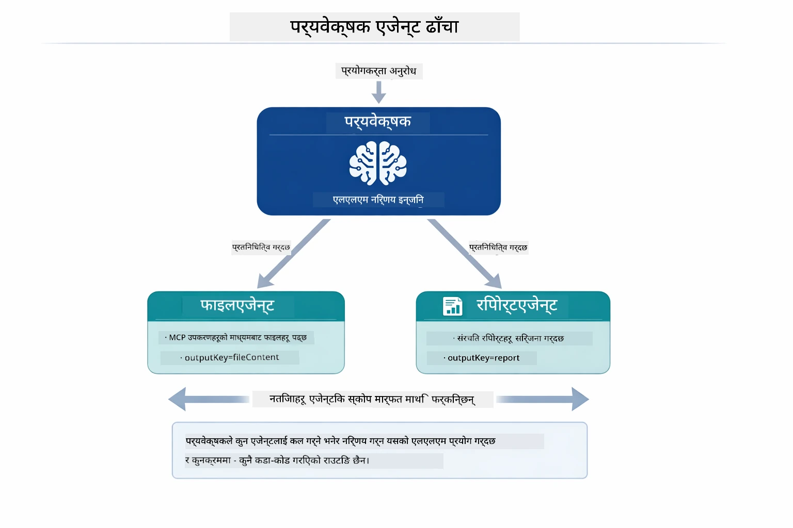

*सुपरभाइजरले आफ्नो LLM प्रयोग गरेर कुन एजेन्टहरू बोलाउने र कुन क्रमले गर्ने निर्णय गर्छ — कुनै हार्डकोड गरिएको मार्गनिर्देशन आवश्यक छैन।*

हामीको फाइल-देखि-रिपोर्ट पाइपलाइनको ठोस कार्यप्रवाह यसरी देखिन्छ:

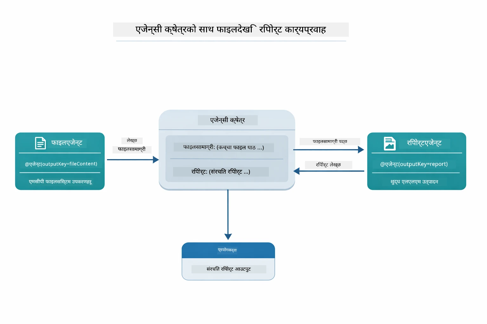

*FileAgent ले MCP उपकरणहरू मार्फत फाइल पढ्छ, त्यसपछि ReportAgent ले कच्चा सामग्रीलाई संरचित रिपोर्टमा रूपान्तरण गर्छ।*

प्रत्येक एजेन्टले आफ्नो आउटपुट **Agentic Scope** (साझा मेमोरी) मा भण्डारण गर्छ, जसले पछि आउने एजेन्टहरूलाई पहिलेका परिणामहरू पहुँच गर्न दिन्छ। यसले देखाउँछ कि कसरी MCP उपकरणहरू एजेन्टिक कार्यप्रवाहहरूमा सहज रूपमा मिलेर काम गर्छ — सुपरभाइजरलाई *कसरी* फाइलहरू पढिन्छ भन्ने थाहा हुन आवश्यक छैन, केवल `FileAgent` ले त्यो गर्न सक्छ भनी थाहा छ।

#### डेमो चलाउने तरिका

स्टार्ट स्क्रिप्टहरूले स्वत: वातावरण चरहरू रूट `.env` फाइलबाट लोड गर्छन्:

**Bash:**
```bash
cd 05-mcp
chmod +x start-supervisor.sh
./start-supervisor.sh
```

**PowerShell:**
```powershell
cd 05-mcp
.\start-supervisor.ps1
```

**VS Code प्रयोग गर्दा:** `SupervisorAgentDemo.java` मा दायाँ क्लिक गरी **"Run Java"** चयन गर्नुहोस् (तपाईंको `.env` कन्फिगर गरिएको छ भनी सुनिश्चित गर्नुहोस्)।

#### सुपरभाइजर कसरी काम गर्छ

```java
// चरण 1: FileAgent ले MCP उपकरणहरू प्रयोग गरेर फाइलहरू पढ्छ
FileAgent fileAgent = AgenticServices.agentBuilder(FileAgent.class)
        .chatModel(model)
        .toolProvider(mcpToolProvider)  // फाइल अपरेशनहरूको लागि MCP उपकरणहरू छन्
        .build();

// चरण 2: ReportAgent ले संरचित रिपोर्टहरू बनाउँछ
ReportAgent reportAgent = AgenticServices.agentBuilder(ReportAgent.class)
        .chatModel(model)
        .build();

// सुपरिवेक्षकले फाइल → रिपोर्ट कार्यप्रवाह समन्वय गर्दछ
SupervisorAgent supervisor = AgenticServices.supervisorBuilder()
        .chatModel(model)
        .subAgents(fileAgent, reportAgent)
        .responseStrategy(SupervisorResponseStrategy.LAST)  // अन्तिम रिपोर्ट फर्काउनुहोस्
        .build();

// अनुरोधको आधारमा सुपरिवेक्षकले कुन एजेन्टहरू कल गर्ने निर्णय गर्छ
String response = supervisor.invoke("Read the file at /path/file.txt and generate a report");
```

#### प्रतिक्रिया रणनीतिहरू

जब तपाईं `SupervisorAgent` कन्फिगर गर्नुहुन्छ, तपाईंले निर्दिष्ट गर्नुहुन्छ कि उप-एजेन्टहरूको कार्य सम्पन्न भएपछि यसले प्रयोगकर्तालाई आफ्नो अन्तिम उत्तर कसरी दिन्छ।

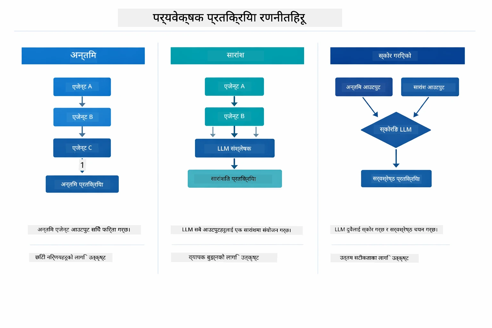

*सुपरभाइजरले अन्तिम प्रतिक्रियालाई कसरी तयार गर्छ भन्ने ३ रणनीतिहरू — तपाईंले चाहनुभएको अनुसार अन्तिम एजेन्टको आउटपुट, संश्लेषित सारांश, वा सबैभन्दा राम्रो स्कोर प्राप्त विकल्प छनोट गर्नुहोस्।*

उपलब्ध रणनीतिहरू:

| रणनीति | विवरण |
|----------|-------------|
| **LAST** | सुपरभाइजरले अन्तिम उप-एजेन्ट वा उपकरणको आउटपुट फर्काउँछ। यो उपयोगी हुन्छ जब कार्यप्रवाहको अन्तिम एजेन्ट विशेष गरी पूर्ण, अन्तिम उत्तर उत्पादन गर्न डिजाइन गरिएको हुन्छ (जस्तै, अनुसन्धान पाइपलाइनमा "Summary Agent")। |
| **SUMMARY** | सुपरभाइजरले आफ्नै आन्तरिक भाषा मोडेल (LLM) प्रयोग गरी सम्पूर्ण अन्तरक्रिया र सबै उप-एजेन्ट आउटपुटहरूको सारांश तयार गर्छ र त्यो सारांश अन्तिम प्रतिक्रिया रूपमा फर्काउँछ। यसले प्रयोगकर्तालाई एक सफा, समेटिएको उत्तर प्रदान गर्दछ। |
| **SCORED** | प्रणालीले आन्तरिक LLM प्रयोग गरी अन्तिम प्रतिक्रिया र अन्तरक्रियाको सारांश दुबैलाई मूल प्रयोगकर्ता अनुरोध विरुद्ध स्कोर गर्छ, र उच्च स्कोर प्राप्त आउटपुट फर्काउँछ। |

पूरा कार्यान्वयनका लागि [SupervisorAgentDemo.java](../../../05-mcp/src/main/java/com/example/langchain4j/mcp/SupervisorAgentDemo.java) हेर्नुहोस्।

> **🤖 [GitHub Copilot](https://github.com/features/copilot) च्याटसँग प्रयास गर्नुहोस्:** [`SupervisorAgentDemo.java`](../../../05-mcp/src/main/java/com/example/langchain4j/mcp/SupervisorAgentDemo.java) खोल्नुहोस् र सोध्नुहोस्:
> - "सुपरभाइजरले कुन एजेन्टहरू बोलाउने निर्णय कसरी गर्छ?"
> - "सुपरभाइजर र क्रमिक कार्यप्रवाह ढाँचाहरू बीच के फरक छ?"
> - "सुपरभाइजरको योजना व्यवहार कसरी अनुकूलन गर्ने?"

#### आउटपुट बुझ्ने तरिका

जब तपाईं डेमो चलाउनुहुन्छ, तपाईंले सुपरभाइजरले कसरी अनेक एजेन्टहरू संयोजन गर्छ भन्ने संरचित मार्गदर्शन देख्नुहुनेछ। यहाँ प्रत्येक खण्डले के अर्थ राख्छ:

```
======================================================================
  FILE → REPORT WORKFLOW DEMO
======================================================================

This demo shows a clear 2-step workflow: read a file, then generate a report.
The Supervisor orchestrates the agents automatically based on the request.
```

**शिर्षक**ले कार्यप्रवाह अवधारणालाई परिचय गराउँछ: फाइल पढाइबाट रिपोर्ट निर्माणसम्म केन्द्रित पाइपलाइन।

```
--- WORKFLOW ---------------------------------------------------------
  ┌─────────────┐      ┌──────────────┐
  │  FileAgent  │ ───▶ │ ReportAgent  │
  │ (MCP tools) │      │  (pure LLM)  │
  └─────────────┘      └──────────────┘
   outputKey:           outputKey:
   'fileContent'        'report'

--- AVAILABLE AGENTS -------------------------------------------------
  [FILE]   FileAgent   - Reads files via MCP → stores in 'fileContent'
  [REPORT] ReportAgent - Generates structured report → stores in 'report'
```

**कार्यप्रवाह आरेख**ले एजेन्टहरू बीच डाटा प्रवाह देखाउँछ। प्रत्येक एजेन्टसँग एक विशेष भूमिका हुन्छ:
- **FileAgent** ले MCP उपकरणहरू प्रयोग गरी फाइलहरू पढ्छ र `fileContent` मा कच्चा सामग्री भण्डारण गर्छ
- **ReportAgent** ले त्यस सामग्रीलाई उपयोग गरी `report` मा संरचित रिपोर्ट बनाउँछ

```
--- USER REQUEST -----------------------------------------------------
  "Read the file at .../file.txt and generate a report on its contents"
```

**प्रयोगकर्ता अनुरोध** ले कार्य देखाउँछ। सुपरभाइजरले यसलाई पार्स गरी FileAgent → ReportAgent बोलाउने निर्णय गर्छ।

```
--- SUPERVISOR ORCHESTRATION -----------------------------------------
  The Supervisor decides which agents to invoke and passes data between them...

  +-- STEP 1: Supervisor chose -> FileAgent (reading file via MCP)
  |
  |   Input: .../file.txt
  |
  |   Result: LangChain4j is an open-source, provider-agnostic Java framework for building LLM...
  +-- [OK] FileAgent (reading file via MCP) completed

  +-- STEP 2: Supervisor chose -> ReportAgent (generating structured report)
  |
  |   Input: LangChain4j is an open-source, provider-agnostic Java framew...
  |
  |   Result: Executive Summary...
  +-- [OK] ReportAgent (generating structured report) completed
```

**सुपरभाइजर सञ्चालन** २-चरणको प्रवाह देखाउँछ:
1. **FileAgent** MCP मार्फत फाइल पढ्छ र सामग्री भण्डारण गर्छ
2. **ReportAgent** सामग्री प्राप्त गरी संरचित रिपोर्ट बनाउँछ

सुपरभाइजरले यी निर्णयहरू प्रयोगकर्ताको अनुरोधको आधारमा **स्वायत्त रूपमा** लियो।

```
--- FINAL RESPONSE ---------------------------------------------------
Executive Summary
...

Key Points
...

Recommendations
...

--- AGENTIC SCOPE (Data Flow) ----------------------------------------
  Each agent stores its output for downstream agents to consume:
  * fileContent: LangChain4j is an open-source, provider-agnostic Java framework...
  * report: Executive Summary...
```

#### एजेन्टिक मोड्युलका सुविधाहरूको व्याख्या

उदाहरणले एजेन्टिक मोड्युलका केही उन्नत सुविधाहरू प्रदर्शन गर्छ। अब Agentic Scope र Agent Listeners नजिकबाट हेरौं।

**Agentic Scope** ले साझा मेमोरी देखाउँछ जहाँ एजेन्टहरूले `@Agent(outputKey="...")` प्रयोग गरी आफ्नो परिणामहरू भण्डारण गर्छन्। यसले निम्न कुरा गर्न सक्छ:
- पछि आउने एजेन्टहरूले पहिलेको एजेन्टहरूको आउटपुट पहुँच गर्न सक्दछन्
- सुपरभाइजरले अन्तिम प्रतिक्रिया संश्लेषण गर्न सक्छ
- तपाईंले हरेक एजेन्टले के उत्पादन गर्यो भनेर निरीक्षण गर्न सक्नुहुन्छ

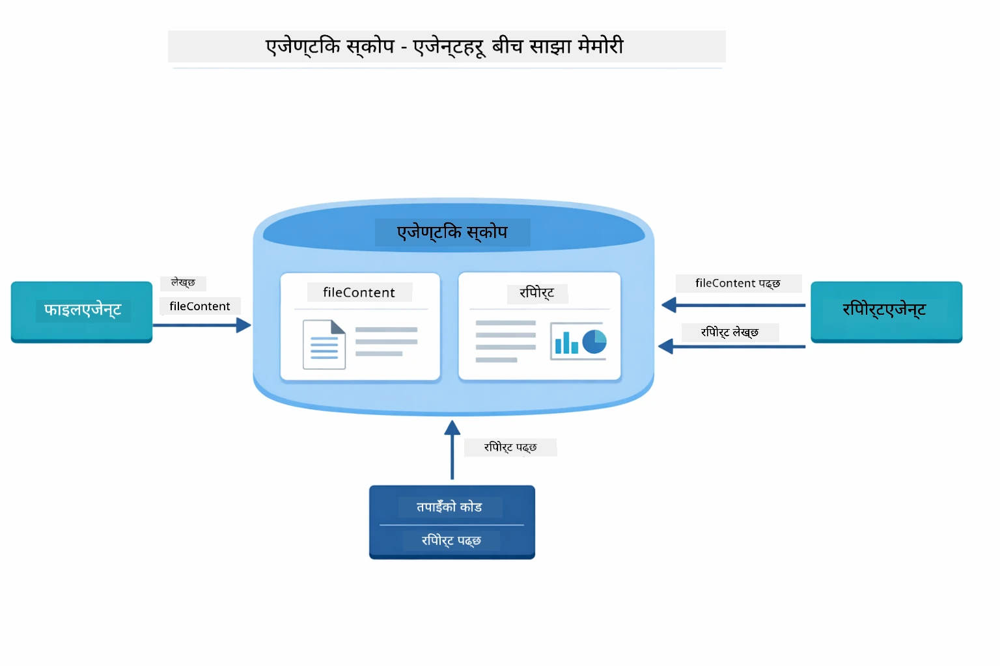

*Agentic Scope साझा मेमोरीको रूपमा काम गर्छ—FileAgent ले `fileContent` लेख्छ, ReportAgent ले यसलाई पढ्छ र `report` लेख्छ, र तपाईंले अन्तिम परिणाम पढ्न सक्नुहुन्छ।*

```java
ResultWithAgenticScope<String> result = supervisor.invokeWithAgenticScope(request);
AgenticScope scope = result.agenticScope();
String fileContent = scope.readState("fileContent");  // FileAgent बाट काँचो फाइल डेटा
String report = scope.readState("report");            // ReportAgent बाट संरचित रिपोर्ट
```

**Agent Listeners** ले एजेन्ट कार्यान्वयनको निगरानी र डिबग गर्ने सुविधा दिन्छ। तपाईंले डेमोमा देख्नुभएको चरण-द्वारा-चरण आउटपुट एजेन्ट कलमा हुक गर्ने AgentListener बाट आएको हो।
- **beforeAgentInvocation** - सुपरवाइजरले एजेन्ट छानेको बेला कल हुन्छ, जसले कुन एजेन्ट छानियो र किन भनेर देखाउँछ
- **afterAgentInvocation** - एजेन्टले काम सकाउँदा कल हुन्छ, यसको नतिजा देखाउँछ
- **inheritedBySubagents** - जब true हुन्छ, लिस्नरले हाइरार्कीमा सबै एजेन्टहरूलाई अनुगमन गर्छ

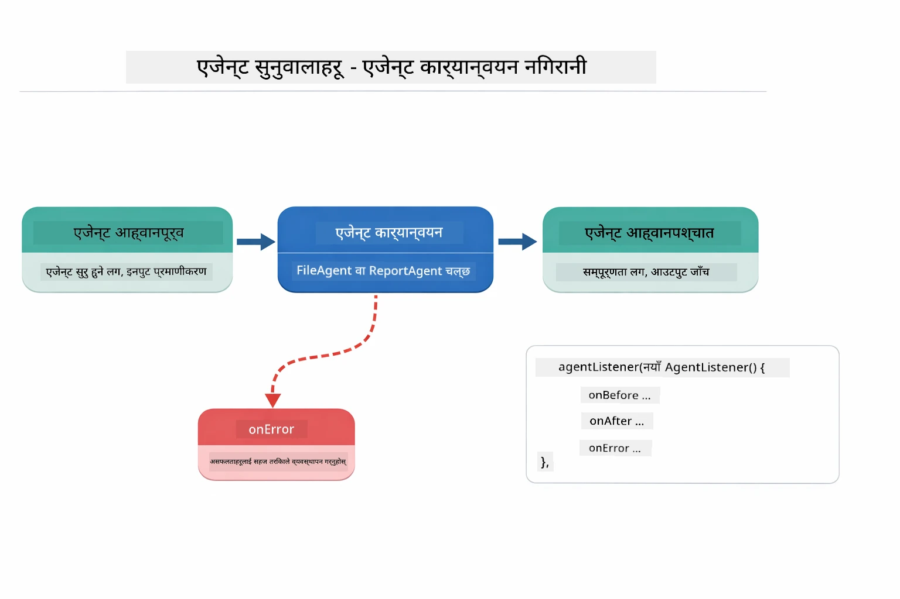

*एजेन्ट लिस्नरहरू कार्यान्वयन जीवनचक्रमा हुक गर्छन् — एजेन्टहरू सुरु हुँदा, सकाउँदा, वा त्रुटिमा पर्ने बेलामा अनुगमन गर्छन्।*

```java
AgentListener monitor = new AgentListener() {
    private int step = 0;
    
    @Override
    public void beforeAgentInvocation(AgentRequest request) {
        step++;
        System.out.println("  +-- STEP " + step + ": " + request.agentName());
    }
    
    @Override
    public void afterAgentInvocation(AgentResponse response) {
        System.out.println("  +-- [OK] " + response.agentName() + " completed");
    }
    
    @Override
    public boolean inheritedBySubagents() {
        return true; // सबै उप-एजेन्टहरूमा प्रसारित गर्नुहोस्
    }
};
```

सुपरवाइजर नमुनाको बाहिर, `langchain4j-agentic` मोड्युलले धेरै शक्तिशाली कार्यप्रवाह नमुनाहरू र विशेषताहरू प्रदान गर्छ:

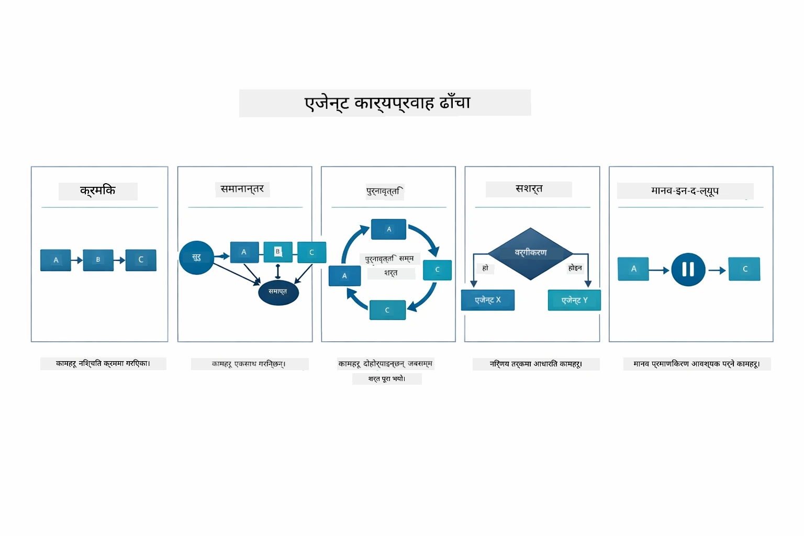

*एजेन्टहरूलाई व्यवस्थापन गर्न पाँच कार्यप्रवाह नमुनाहरू — सरल अनुक्रमिक पाइपलाइनहरूदेखि मानवीय अनुमोदन कार्यप्रवाहसम्म।*

| Pattern | Description | Use Case |
|---------|-------------|----------|
| **Sequential** | एजेन्टहरू क्रमशः सञ्चालन गर्नुहोस्, आउटपुट अर्कोमा बग्छ | पाइपलाइनहरू: अनुसन्धान → विश्लेषण → रिपोर्ट |
| **Parallel** | एजेन्टहरू एकैपटक चलाउनुहोस् | स्वतन्त्र कार्यहरू: मौसम + समाचार + शेयर बजार |
| **Loop** | अवस्था पूरा नभएसम्म पुनरावृत्ति गर्नुहोस् | गुणस्तर स्कोरिङ: स्कोर ≥ 0.8 सम्म सुधार गर्नुहोस् |
| **Conditional** | अवस्थाहरूमा आधारित मार्गनिर्देशन गर्नुहोस् | वर्गीकरण → विशेषज्ञ एजेन्टलाई पठाउनुहोस् |
| **Human-in-the-Loop** | मानव जाँच बिन्दुहरू थप्नुहोस् | अनुमोदन कार्यप्रवाहहरू, सामग्री समीक्षा |

## Key Concepts

अब तपाइँले MCP र एजेन्टिक मोड्युललाई कार्यमा अन्वेषण गर्नुभएको छ, हरेक विधि कहिले प्रयोग गर्ने भन्ने संक्षेप गरौं।

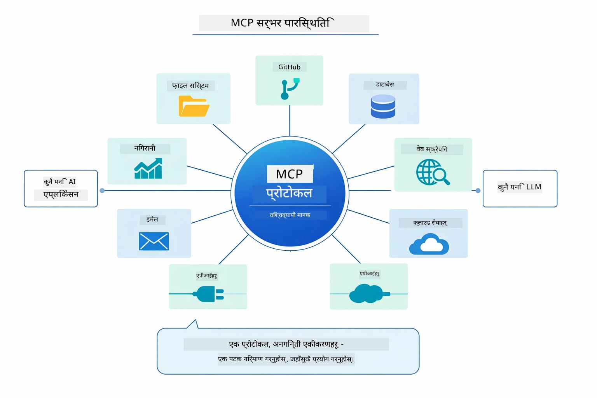

*MCP ले एक विश्वव्यापी प्रोटोकल इकोसिस्टम बनाउँछ — कुनै पनि MCP-समर्थित सर्भर कुनै पनि MCP-समर्थित क्लाइन्टसँग काम गर्छ, अनुप्रयोगहरू बीच उपकरण साझेदारी गर्न सक्षम बनाउँदै।*

**MCP** तब उपयुक्त हुन्छ जब तपाइँ विद्यमान उपकरण इकोसिस्टमहरू उपयोग गर्न चाहनुहुन्छ, त्यस्ता उपकरणहरू बनाउनुहुन्छ जुन धेरै अनुप्रयोगहरूले शेयर गर्न सक्छन्, तेस्रो पक्ष सेवाहरूसँग मानक प्रोटोकलमार्फत एकीकृत गर्नुहुन्छ, वा कोड नबढाई उपकरण कार्यान्वयनहरू परिवर्तन गर्नुहुन्छ।

**एजेन्टिक मोड्युल** तब राम्रो हुन्छ जब तपाइँ घोषणात्मक एजेन्ट परिभाषाहरू चाहते हुनुहुन्छ `@Agent` एनोटेसनहरूसँग, कार्यप्रवाह व्यवस्थापन चाहिन्छ (अनुक्रमिक, लूप, समानान्तर), अन्तर्वार्तात्मक एजेन्ट डिजाइन प्राथमिकता दिनुहुन्छ बजाय अनिवार्य कोडको, वा धेरै एजेन्टहरूलाई मिलाएर जुन `outputKey` मार्फत आउटपुटहरू साझा गर्छन्।

**सुपरवाइजर एजेन्ट नमुना** तब उत्कृष्ट हुन्छ जब कार्यप्रवाह अगाडि अनुमान गर्न सकिँदैन र तपाइँ LLM लाई निर्णय लिन दिनुहुन्छ, जब तपाइँसँग धेरै विशेषज्ञ एजेन्टहरू हुन्छन् जसलाई गतिशील व्यवस्थापन चाहिन्छ, जब संवाद प्रणालीहरू बनाउँदै हुनुहुन्छ जुन विभिन्न क्षमता अनुसार मार्गनिर्देशन गर्छन्, वा जब सबैभन्दा लचकदार, अनुकूली एजेन्ट व्यवहार चाहिन्छ।

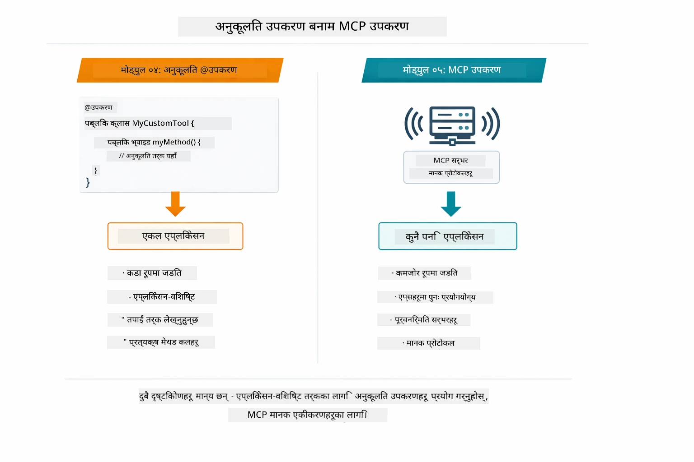

*जब कस्टम @Tool विधिहरू प्रयोग गर्ने र कहिले MCP उपकरणहरू प्रयोग गर्ने — कस्टम उपकरणहरू अनुप्रयोग-विशिष्ट तर्कका लागि पूर्ण प्रकार सुरक्षा सहित, MCP उपकरणहरू मानकीकृत एकीकरणका लागि जुन विभिन्न अनुप्रयोगहरूमा काम गर्छ।*

## Congratulations!

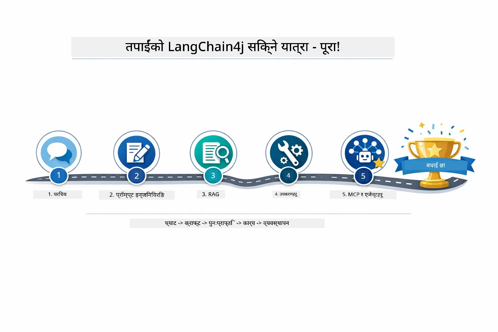

*तपाईँको सिकाइ यात्रा सबै पाँच मोड्युलहरूमा — आधारभूत च्याटदेखि MCP-संचालित एजेन्टिक प्रणालीसम्म।*

तपाईंले LangChain4j for Beginners कोर्स पूरा गर्नुभयो। तपाईंले सिक्नुभयो:

- मेमोरीसहित संवादात्मक AI कसरी बनाउने (मोड्युल 01)
- विभिन्न कार्यको लागि प्रॉम्प्ट इन्जिनियरिङ नमुनाहरू (मोड्युल 02)
- RAG सँग दस्तावेजहरूमा आधारित प्रतिक्रिया कसरी बनाउने (मोड्युल 03)
- कस्टम उपकरणहरूको साथ आधारभूत AI एजेन्टहरू बनाउन (मोड्युल 04)
- LangChain4j MCP र Agentic मोड्युलहरूसँग मानकीकृत उपकरणहरूको एकीकरण (मोड्युल 05)

### What’s Next?

मोड्युलहरू पूरा गरेपछि, [Testing Guide](../docs/TESTING.md) अन्वेषण गर्नुहोस् जसले LangChain4j परीक्षण अवधारणाहरूलाई क्रियाशील बनाउँछ।

**Official Resources:**
- [LangChain4j Documentation](https://docs.langchain4j.dev/) - व्यापक मार्गदर्शनहरू र API सन्दर्भ
- [LangChain4j GitHub](https://github.com/langchain4j/langchain4j) - स्रोत कोड र उदाहरणहरू
- [LangChain4j Tutorials](https://docs.langchain4j.dev/tutorials/) - विभिन्न उपयोग केसहरूको लागि चरण-द्वारा-चरण ट्युटोरियलहरू

यो कोर्स पूरा गरेकोमा धन्यवाद!

---

**Navigation:** [← Previous: Module 04 - Tools](../04-tools/README.md) | [Back to Main](../README.md)

---

<!-- CO-OP TRANSLATOR DISCLAIMER START -->
**अस्वीकरण**:
यो दस्तावेज AI अनुवाद सेवा [Co-op Translator](https://github.com/Azure/co-op-translator) मार्फत अनुवाद गरिएको हो। हामी शुद्धताका लागि प्रयासरत छौं, तर कृपया ध्यान दिनुहोस कि स्वचालित अनुवादमा त्रुटि वा असङ्गतिहरू हुन सक्छन्। मूल दस्तावेज आफ्नो मूल भाषामा नै आधिकारिक स्रोत मानिनु पर्छ। महत्त्वपूर्ण जानकारीका लागि व्यावसायिक मानवीय अनुवाद सिफारिस गरिन्छ। यस अनुवादको प्रयोगबाट उत्पन्न कुनै पनि गलतफहमी वा व्याख्याका लागि हामी जिम्मेवार छैनौं।
<!-- CO-OP TRANSLATOR DISCLAIMER END -->