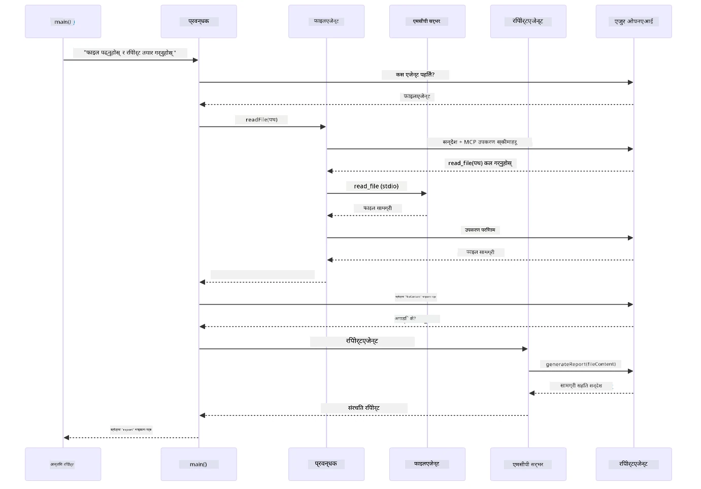

# Module 05: मोडेल सन्दर्भ प्रोटोकल (MCP)

## Table of Contents

- [के तपाई सिक्ने हुनुहुन्छ](../../../05-mcp)
- [MCP के हो?](../../../05-mcp)
- [MCP कसरी काम गर्छ](../../../05-mcp)
- [एजेन्टिक मोड्यूल](../../../05-mcp)
- [उदाहरणहरू चलाउनुहोस्](../../../05-mcp)
  - [पूर्वआवश्यकताहरू](../../../05-mcp)
- [छिटो आरम्भ](../../../05-mcp)
  - [फाइल अपरेसन (Stdio)](../../../05-mcp)
  - [सुपरभाइजर एजेन्ट](../../../05-mcp)
    - [डेमो चलाउने तरिका](../../../05-mcp)
    - [सुपरभाइजर कसरी काम गर्छ](../../../05-mcp)
    - [FileAgent ले रनटाइममा MCP उपकरणहरू कसरी पत्ता लगाउँछ](../../../05-mcp)
    - [प्रतिक्रिया रणनीतिहरू](../../../05-mcp)
    - [आउटपुटको बुझाइ](../../../05-mcp)
    - [एजेन्टिक मोड्यूल सुविधाहरूको व्याख्या](../../../05-mcp)
- [मुख्य अवधारणाहरू](../../../05-mcp)
- [बधाई छ!](../../../05-mcp)
  - [अर्को के छ?](../../../05-mcp)

## के तपाई सिक्ने हुनुहुन्छ

तपाईले वार्तालापात्मक AI निर्माण गर्नुभयो, प्रॉम्प्टहरूमा दक्षता हासिल गर्नुभयो, जवाफहरू कागजातहरूमा आधारित गर्नुभयो, र टुल्स सहित एजेन्टहरू सिर्जना गर्नुभयो। तर ती सबै टुलहरू तपाईको विशिष्ट अनुप्रयोगका लागि अनुकूलित थिए। यदि तपाईले तपाईको AI लाई यस्तो मानकीकृत उपकरणहरूको ecosystem मा पहुँच दिन सक्नुहुन्छ जुन कुनै पनि व्यक्ति सिर्जना गरेर साझा गर्न सक्छ? यस मोड्युलमा, तपाईले Model Context Protocol (MCP) र LangChain4j को एजेन्टिक मोड्यूल प्रयोग गरेर त्यो कसरी गर्ने जान्नुहुनेछ। हामीले पहिले एक सरल MCP फाइल रिडर देखाउँछौं र त्यसपछि यसलाई सुपरवाइजर एजेन्ट ढाँचाको प्रयोग गरी कसरी सजिलै थप एजेन्टिक कार्यप्रणालीमा जोडिने देखाउँछौं।

## MCP के हो?

Model Context Protocol (MCP) ले यो नै प्रदान गर्छ - AI अनुप्रयोगहरूले बाह्य उपकरणहरू पत्ता लगाउन र प्रयोग गर्नको लागि एक मानक तरीका। प्रत्येक डाटा स्रोत वा सेवा को लागि अनुकूलन इन्टेग्रेशन लेख्ने सट्टा, तपाई MCP सर्भरहरूसँग जडान गर्नुहुन्छ जुन आफ्ना क्षमता एउटै स्वरूपमा प्रदर्शन गर्छन्। तपाईको AI एजेन्टले यी उपकरणहरू स्वचालित रूपमा पत्ता लगाएर प्रयोग गर्न सक्छ।

तल्लो चित्रले भन्छ— MCP नहुँदा, प्रत्येक इन्टेग्रेशनले विशिष्ट-प्वाइन्ट-टू-प्वाइन्ट तार जडान चाहिन्छ; MCP सँग, एउटा प्रोटोकलले तपाईको एपलाई कुनै पनि उपकरणसँग जडान गर्छ:


*पहिले MCP: जटिल बिन्दु-बिन्दु इन्टेग्रेशन। पछि MCP: एउटा प्रोटोकल, अनन्त सम्भावना।*

MCP AI विकासमा एउटा आधारभूत समस्या समाधान गर्दछ: प्रत्येक इन्टेग्रेशन अनुकूलित हुन्छ। GitHub पहुँच चाहनुहुन्छ? अनुकूलित कोड। फाइलहरू पढ्न चाहनुहुन्छ? अनुकूलित कोड। डाटाबेस सोध्न? अनुकूलित कोड। र यी मध्ये कुनै पनि इन्टेग्रेशनहरू अन्य AI अनुप्रयोगहरूसँग काम गर्दैनन्।

MCP यसलाई मानकीकृत गर्दछ। एक MCP सर्भर स्पस्ट वर्णन र स्किमाका साथ उपकरणहरू प्रदर्शन गर्छ। कुनै पनि MCP क्लाइन्ट कनेक्ट गरी उपलब्ध उपकरणहरू पत्ता लगाएर प्रयोग गर्न सक्छ। एक पटक निर्माण गर्नुहोस्, सबै ठाउँमा प्रयोग गर्नुहोस्।

तल्लो चित्रले यस वास्तुकला देखाउँछ— एउटै MCP क्लाइन्ट (तपाईको AI अनुप्रयोग) विभिन्न MCP सर्भरहरूमा जडान हुन्छ, प्रत्येकले आफ्ना उपकरणहरू मानक प्रोटोकलमार्फत प्रदर्शन गर्छ:


*Model Context Protocol वास्तुकला - मानकीकृत उपकरण पत्ता लगाउने र सञ्चालन गर्ने तरिका*

## MCP कसरी काम गर्छ

अन्दर MCP ले एउटा तहबद्ध वास्तुकला प्रयोग गर्छ। तपाईको Java अनुप्रयोग (MCP क्लाइन्ट) उपलब्ध उपकरणहरू पत्ता लगाउँछ, JSON-RPC अनुरोधहरू ट्रान्सपोर्ट लेयर (Stdio वा HTTP) मार्फत पठाउँछ, र MCP सर्भर अपरेशनहरू पूरा गरी नतिजा फर्काउँछ। तलको चित्रले यस प्रोटोकलका प्रत्येक तहलाई टुक्र्याउँछ:


*MCP भित्र कसरी काम गर्छ— क्लाइन्टहरूले उपकरणहरू पत्ता लगाउँछन्, JSON-RPC सन्देशहरू आदानप्रदान गर्छन्, ट्रान्सपोर्ट लेयरबाट अपरेशनहरू पूरा गर्छन्।*

**सर्भर-क्लाइन्ट वास्तुकला**

MCP ले क्लाइन्ट-सर्भर मोडेल प्रयोग गर्छ। सर्भरहरूले उपकरणहरू प्रदान गर्छन् - फाइलहरू पढ्ने, डाटा सोध्ने, API कल गर्ने। क्लाइन्टहरू (तपाईको AI अनुप्रयोग) सर्भरहरूमा जडान हुन्छन् र तिनीहरूका उपकरणहरू प्रयोग गर्छन्।

LangChain4j सँग MCP प्रयोग गर्न, यो Maven निर्भरता थप्नुहोस्:

```xml
<dependency>
    <groupId>dev.langchain4j</groupId>
    <artifactId>langchain4j-mcp</artifactId>
    <version>${langchain4j.version}</version>
</dependency>
```


**उपकरण पत्ता लगाउने**

जब तपाईको क्लाइन्टले MCP सर्भरसँग जडान हुन्छ, यसले सोध्छ "तपाईसँग के उपकरणहरू छन्?" सर्भर उपलब्ध उपकरणहरूको सूची फर्काउँछ, प्रत्येकसँग वर्णन र प्यारामिटर स्किमा। तपाईको AI एजेन्टले त्यसपछि प्रयोगकर्ताको अनुरोध अनुसार कुन उपकरण प्रयोग गर्ने निर्णय गर्दछ। तलको चित्रले यो संवाद देखाउँछ— क्लाइन्टले `tools/list` अनुरोध पठाउँछ र सर्भर उपलब्ध उपकरणहरू वर्णन र स्किमासहित फर्काउँछ:


*AI ले सुरुमा उपलब्ध उपकरणहरू पत्ता लगाउँछ — यसले अब थाहा पाउँछ के क्षमता उपलब्ध छ र कुन प्रयोग गर्ने निर्णय गर्न सक्छ।*

**ट्रान्सपोर्ट संयन्त्रहरू**

MCP ले विभिन्न ट्रान्सपोर्ट संयन्त्रहरू समर्थन गर्छ। दुई विकल्पहरू Stdio (स्थानीय subprocess संवादको लागि) र Streamable HTTP (दूरस्थ सर्भरहरूको लागि) हुन्। यस मोड्युलले Stdio ट्रान्सपोर्टलाई देखाउँछ:


*MCP ट्रान्सपोर्ट संयन्त्रहरू: HTTP दूरस्थ सर्भरहरूको लागि, Stdio स्थानीय प्रक्रिया लागि*

**Stdio** - [StdioTransportDemo.java](../../../05-mcp/src/main/java/com/example/langchain4j/mcp/StdioTransportDemo.java)

स्थानीय प्रक्रियाहरूका लागि। तपाईँको अनुप्रयोगले सर्भरलाई एक subprocess रूपमा सुरु गरी मानक इनपुट/आउटपुटबाट संवाद गर्छ। फाइल सिस्टम पहुँच वा कमाण्ड लाइन उपकरणहरूका लागि उपयोगी।

```java
McpTransport stdioTransport = new StdioMcpTransport.Builder()
    .command(List.of(
        npmCmd, "exec",
        "@modelcontextprotocol/server-filesystem@2025.12.18",
        resourcesDir
    ))
    .logEvents(false)
    .build();
```


`@modelcontextprotocol/server-filesystem` सर्भरले तलका उपकरणहरू प्रदर्शन गर्छ, जुन तपाईले निर्दिष्ट गरेको डाइरेक्टरीहरूमा सीमित छन्:

| उपकरण | वर्णन |
|-------|-----------|
| `read_file` | एकल फाइलको सामग्री पढ्नुहोस् |
| `read_multiple_files` | एक पटकमा धेरै फाइलहरू पढ्नुहोस् |
| `write_file` | फाइल सिर्जना वा ओभरराइड गर्नुहोस् |
| `edit_file` | लक्षित खोजी र प्रतिस्थापन सम्पादन गर्नुहोस् |
| `list_directory` | पथमा फाइल र डाइरेक्टरीहरु सूचीबद्ध गर्नुहोस् |
| `search_files` | ढाँचा मिल्ने फाइलहरू पुनरावृत्त रूपमा खोज्नुहोस् |
| `get_file_info` | फाइल मेटाडाटा प्राप्त गर्नुहोस् (आकार, टाइमस्ट्याम्प, अनुमतिहरू) |
| `create_directory` | डाइरेक्टरी सिर्जना गर्नुहोस् (अभिभावक डाइरेक्टरीहरूसहित) |
| `move_file` | फाइल वा डाइरेक्टरी सार्नुहोस् वा नाम परिवर्तन गर्नुहोस् |

तलको चित्रले देखाउँछ Stdio ट्रान्सपोर्ट रनटाइममा कसरी काम गर्छ— तपाईको Java अनुप्रयोगले MCP सर्भरलाई child process रूपमा सुरु गर्छ र stdin/stdout पाइपमार्फत संवाद गर्छ, कुनै नेटवर्क वा HTTP सामेल छैन:


*Stdio ट्रान्सपोर्ट क्रियाशील— तपाईको अनुप्रयोगले MCP सर्भरलाई child process रूपमा सुरु गरी stdin/stdout पाइपमार्फत संवाद गर्दछ।*

> **🤖 [GitHub Copilot](https://github.com/features/copilot) Chat मार्फत प्रयास गर्नुहोस्:** [`StdioTransportDemo.java`](../../../05-mcp/src/main/java/com/example/langchain4j/mcp/StdioTransportDemo.java) खोल्नुहोस् र सोध्नुहोस्:
> - "Stdio ट्रान्सपोर्ट कसरी काम गर्छ र म कहिले HTTP सट्टा यसलाई प्रयोग गर्नुपर्छ?"
> - "LangChain4j ले MCP सर्भर प्रक्रियाहरूको जीवनचक्र कसरी व्यवस्थापन गर्छ?"
> - "AI लाई फाइल सिस्टम पहुँच दिने सुरक्षा सम्बन्धी के के विचारहरू छन्?"

## एजेन्टिक मोड्यूल

जबकि MCP मानकीकृत उपकरणहरू प्रदान गर्दछ, LangChain4j को **एजेन्टिक मोड्यूल** उपकरणहरू व्यवस्थापन गर्न एजेन्टहरू निर्माण गर्ने एक घोषणात्मक तरिका दिन्छ। `@Agent` एनोटेसन र `AgenticServices` ले अनिवार्य कोडको सट्टा इन्टरफेसमार्फत एजेन्ट व्यवहार परिभाषित गर्न दिन्छ।

यस मोड्युलमा, तपाईले **सुपरवाइजर एजेन्ट** ढाँचा अन्वेषण गर्नुहुनेछ— एउटा उन्नत एजेन्टिक AI विधि जहाँ "सुपरवाइजर" एजेन्टले प्रयोगकर्ताको अनुरोध अनुसार सब-एजेन्टहरूलाई गतिशील रूपमा निर्णय गर्छ। हामी दुबै अवधारणालाई संयुक्त पारेर हाम्रो एक सब-एजेन्टलाई MCP-शक्ति फाइल पहुँच क्षमता दिनेछौं।

एजेन्टिक मोड्युल प्रयोग गर्न, यस Maven निर्भरता थप्नुहोस्:

```xml
<dependency>
    <groupId>dev.langchain4j</groupId>
    <artifactId>langchain4j-agentic</artifactId>
    <version>${langchain4j.mcp.version}</version>
</dependency>
```


> **Notice:** `langchain4j-agentic` मोड्युलले `langchain4j.mcp.version` भन्ने अलग भर्सन प्रोपर्टी प्रयोग गर्छ किनकि यो कोर LangChain4j लाइब्रेरीहरू भन्दा फरक तालिका अनुसार रिलिज हुन्छ।

> **⚠️ प्रयोगात्मक:** `langchain4j-agentic` मोड्युल **प्रयोगात्मक** छ र परिवर्तन हुन सक्छ। AI सहायकहरूलाई निर्माण गर्ने स्थिर तरिका `langchain4j-core` संग अनुकूलन उपकरणहरू (Module 04) हो।

## उदाहरणहरू चलाउनुहोस्

### पूर्वआवश्यकताहरू

- सम्पन्न [Module 04 - Tools](../04-tools/README.md) (यो मोड्युल अनुकूलन टुल अवधारणामा आधारित छ र MCP उपकरणहरूसँग तुलना गर्छ)
- मूल डाइरेक्टरीमा Azure क्रेडेन्शियलहरूसहित `.env` फाइल (Module 01 मा `azd up` ले सिर्जना गरेको)
- Java 21+, Maven 3.9+
- Node.js 16+ र npm (MCP सर्भरहरूका लागि)

> **Note:** यदि तपाईले अझै वातावरण चर सेट गर्नुभएको छैन भने, हेर्नुहोस् [Module 01 - Introduction](../01-introduction/README.md) परिनियोजन निर्देशिका (`azd up` ले `.env` फाइल स्वचालित रूपमा बनाउँछ), वा `.env.example` लाई मूल डाइरेक्टरीमा `.env` मा प्रतिलिपि गरेर मानहरू भर्नुहोस्।

## छिटो आरम्भ

**VS Code प्रयोग गर्दा:** Explorer मा कुनै डेमो फाइलमा दायाँ क्लिक गर्नुस् र **"Run Java"** चयन गर्नुहोस्, वा Run and Debug प्यानलबाट लन्च कन्फिगरेसन प्रयोग गर्नुहोस् (पहिले सुनिश्चित गर्नुहोस् कि तपाईको `.env` फाइल Azure क्रेडेन्शियलहरूसँग सेट गरिएको छ)।

**Maven प्रयोग गर्दा:** तलका उदाहरणहरूद्वारा कमाण्ड लाइनबाट पनि चलाउन सक्नुहुन्छ।

### फाइल अपरेसन (Stdio)

यो स्थानीय subprocess-आधारित उपकरणहरू प्रदर्शन गर्दछ।

**✅ कुनै पूर्वआवश्यकता आवश्यक छैन** - MCP सर्भर स्वचालित रूपमा सुरु हुन्छ।

**सरल स्टार्ट स्क्रिप्टहरू (सिफारिस गरिएको):**

स्टार्ट स्क्रिप्टहरूले मूल `.env` फाइलबाट वातावरण चरहरू स्वचालित रूपमा लोड गर्छ:

**Bash:**
```bash
cd 05-mcp
chmod +x start-stdio.sh
./start-stdio.sh
```

**PowerShell:**
```powershell
cd 05-mcp
.\start-stdio.ps1
```

**VS Code प्रयोग गर्दा:** `StdioTransportDemo.java` मा दायाँ क्लिक गरेर **"Run Java"** चयन गर्नुहोस् (तपाईको `.env` फाइल कन्फिगर गरिएको छ भन्ने सुनिश्चित गर्नुहोस्)।

अनुप्रयोगले स्वचालित रूपमा फाइल सिस्टम MCP सर्भर सुरु गरी स्थानीय फाइल पढ्छ। subprocess व्यवस्थापन कसरी गरिन्छ ध्यान दिनुहोस्।

**अपेक्षित आउटपुट:**
```
Assistant response: The file provides an overview of LangChain4j, an open-source Java library
for integrating Large Language Models (LLMs) into Java applications...
```


### सुपरभाइजर एजेन्ट

**सुपरवाइजर एजेन्ट ढाँचा** एक **लचिलो** एजेन्टिक AI फर्म हो। एक सुपरवाइजरले प्रयोगकर्ताको अनुरोध अनुसार कुन एजेन्टहरूलाई बोलाउने निर्णय स्वतन्त्र रूपमा LLM प्रयोग गरेर गर्छ। अर्को उदाहरणमा, हामी MCP-शक्ति फाइल पहुँचलाई LLM एजेन्टसँग मिलाएर व्यवस्थापित फाइल पढ्ने → रिपोर्ट कार्यप्रणाली सिर्जना गर्नेछौं।

डेमोमा, `FileAgent` ले MCP फाइल सिस्टम उपकरणहरू प्रयोग गरी फाइल पढ्छ, र `ReportAgent` ले कार्यकारी सारांश (१ वाक्य), ३ मुख्य बुँदाहरू, र सिफारिशहरू सहित संरचित रिपोर्ट बनाउँछ। सुपरवाइजरले यो प्रवाह स्वचालित रूपमा समन्वय गर्छ:


*सुपरवाइजरले आफ्नो LLM प्रयोग गरी कुन एजेन्ट बोलाउने र के अनुगमन गर्ने निर्णय गर्छ—कठोर रुटिङ आवश्यक छैन।*

फाइलदेखि रिपोर्ट सम्मको हाम्रो कार्यप्रवाह यस्तो देखिन्छ:


*FileAgent ले MCP उपकरणहरू मार्फत फाइल पढ्छ, त्यसपछि ReportAgent कच्चा सामग्रीलाई संरचित रिपोर्टमा रूपान्तरण गर्छ।*

तलको अनुक्रम चित्र सम्पूर्ण सुपरवाइजर समन्वय देखाउँछ— MCP सर्भर सुरु गर्ने देखि सुपरवाइजरको स्वतन्त्र एजेन्ट छनोट हुँदै stdio मार्फत उपकरण कल र अन्तिम रिपोर्टसम्म:



*सुपरवाइजरले स्वतन्त्र रूपमा FileAgent बोलाउँछ (जसले MCP सर्भरलाई stdio द्वारा फाइल पढ्न कल गर्छ), त्यसपछि ReportAgent लाई रिपोर्ट निर्माण गर्न बोलाउँछ— प्रत्येक एजेन्टले आफ्नो आउटपुट Agentic Scope (साझा मेमोरी) मा स्टोर गर्छ।*

हरेक एजेन्टले आफ्नो आउटपुट **Agentic Scope** (साझा मेमोरी) मा स्टोर गर्छ, जसले तलका एजेन्टहरूलाई अघिल्लो नतिजाहरू पहुँच गर्न अनुमति दिन्छ। यसले देखाउँछ कि कसरी MCP उपकरणहरू एजेन्टिक कार्यप्रवाहहरूसँग सहज रूपमा एकीकृत हुन्छन्— सुपरवाइजरलाई थाहा हुने आवश्यक छैन *कसरी* फाइलहरू पढिन्छन्, केवल `FileAgent` ले गर्न सक्ने कुरा।

#### डेमो चलाउने तरिका

स्टार्ट स्क्रिप्टहरूले मूल `.env` फाइलबाट वातावरण चरहरू स्वचालित रूपमा लोड गर्छ:

**Bash:**
```bash
cd 05-mcp
chmod +x start-supervisor.sh
./start-supervisor.sh
```

**PowerShell:**
```powershell
cd 05-mcp
.\start-supervisor.ps1
```

**VS Code प्रयोग गर्दा:** `SupervisorAgentDemo.java` मा दायाँ क्लिक गरी **"Run Java"** चयन गर्नुहोस् (तपाईको `.env` फाइल कन्फिगर गरिएको छ सुनिश्चित गर्नुहोस्)।

#### सुपरवाइजर कसरी काम गर्छ

एजेन्टहरू निर्माण गर्नु अघि, तपाईले MCP ट्रान्सपोर्टलाई क्लाइन्टसँग जडान गर्न र यसलाई `ToolProvider` को रूपमा रैप गर्न आवश्यक छ। यसरी MCP सर्भरका उपकरणहरू तपाईको एजेन्टहरूलाई उपलब्ध हुन्छन्:

```java
// यातायातबाट MCP ग्राहक सिर्जना गर्नुहोस्
McpClient mcpClient = new DefaultMcpClient.Builder()
        .transport(stdioTransport)
        .build();

// ग्राहकलाई ToolProvider को रूपमा ल्याप्नुहोस् — यसले MCP उपकरणहरूलाई LangChain4j मा जोड्छ
ToolProvider mcpToolProvider = McpToolProvider.builder()
        .mcpClients(List.of(mcpClient))
        .build();
```


अब तपाईले `mcpToolProvider` लाई कुनै पनि एजेन्टमा इन्जेक्ट गर्न सक्नुहुन्छ जसले MCP उपकरणहरू आवश्यक पर्छ:

```java
// चरण १: FileAgent ले MCP उपकरणहरू प्रयोग गरेर फाइलहरू पढ्छ
FileAgent fileAgent = AgenticServices.agentBuilder(FileAgent.class)
        .chatModel(model)
        .toolProvider(mcpToolProvider)  // फाइल अपरेसनहरूको लागि MCP उपकरणहरू छन्
        .build();

// चरण २: ReportAgent ले संरचित रिपोर्टहरू उत्पन्न गर्छ
ReportAgent reportAgent = AgenticServices.agentBuilder(ReportAgent.class)
        .chatModel(model)
        .build();

// Supervisor ले फाइल → रिपोर्ट कार्यप्रवाह समन्वय गर्छ
SupervisorAgent supervisor = AgenticServices.supervisorBuilder()
        .chatModel(model)
        .subAgents(fileAgent, reportAgent)
        .responseStrategy(SupervisorResponseStrategy.LAST)  // अन्तिम रिपोर्ट फिर्ता गर्नुहोस्
        .build();

// Supervisor ले अनुरोधको आधारमा कुन एजेन्टहरूलाई बोलाउने निर्णय गर्दछ
String response = supervisor.invoke("Read the file at /path/file.txt and generate a report");
```


#### FileAgent ले रनटाइममा MCP उपकरणहरू कसरी पत्ता लगाउँछ

तपाईलाई लाग्न सक्छ: **`FileAgent` ले कसरी npm फाइल सिस्टम उपकरणहरू प्रयोग गर्ने थाहा पाउँछ?** जवाफ हो कि यसलाई थाहा छैन — **LLM** ले उपकरण स्किमाहरू मार्फत रनटाइममा पत्ता लगाउँछ।

`FileAgent` इन्टरफेस केवल **प्रॉम्प्ट परिभाषा** हो। यसमा `read_file`, `list_directory`, वा कुनै पनि MCP उपकरणको हार्डकोड गरिएको ज्ञान छैन। यसरी अन्त्यदेखि-अन्तसम्म के हुन्छ:
1. **सर्भर स्पावनहरू:** `StdioMcpTransport` ले `@modelcontextprotocol/server-filesystem` npm प्याकेजलाई चाइल्ड प्रोसेसको रूपमा सुरु गर्छ  
2. **टूल डिस्कभरी:** `McpClient` ले सर्भरमा `tools/list` JSON-RPC अनुरोध पठाउँछ, जसले टूल नामहरू, विवरणहरू, र प्यारामिटर स्किमाहरू (जस्तै, `read_file` — *"फाइलको पुरै सामग्री पढ्नुहोस्"* — `{ path: string }`) प्रतिक्रिया दिन्छ  
3. **स्किमा इन्जेक्शन:** `McpToolProvider` ले यी पत्ता लागेको स्किमाहरूलाई र्‍याप गरी LangChain4j लाई उपलब्ध गराउँछ  
4. **एलएलएम निर्णय गर्छ:** जब `FileAgent.readFile(path)` कल गरिन्छ, LangChain4j ले सिस्टम सन्देश, प्रयोगकर्ता सन्देश, **र टूल स्किमाहरूको सूची** LLM तर्फ पठाउँछ। एलएलएमले टूल विवरणहरू पढ्छ र टूल कल उत्पादन गर्दछ (जस्तै, `read_file(path="/some/file.txt")`)  
5. **कार्यसम्पादन:** LangChain4j ले टूल कल अवरुद्ध गरी MCP क्लाइन्टमार्फत Node.js सबप्रोसेसमा रुट गर्छ, परिणाम प्राप्त गर्छ, र यसलाई फेरि LLM मा फिड गर्छ  

यो माथि वर्णन गरिएको [Tool Discovery](../../../05-mcp) प्रणालीसँग एउटै हो, तर विशिष्ट रूपमा एजेन्ट वर्कफ्लोमा लागू गरिएको। `@SystemMessage` र `@UserMessage` एनोटेसनहरूले LLM को व्यवहार मार्गदर्शन गर्छन्, जबकि इन्जेक्ट गरिएको `ToolProvider` ले यसलाई **सक्षमताहरू** दिन्छ — एलएलएमले रनटाइममा दुबैलाई जोड्छ।  

> **🤖 [GitHub Copilot](https://github.com/features/copilot) Chat मा प्रयास गर्नुहोस्:** [`FileAgent.java`](../../../05-mcp/src/main/java/com/example/langchain4j/mcp/agents/FileAgent.java) खोल्नुहोस् र सोध्नुहोस्:  
> - "यो एजेन्टले कुन MCP टूल कल गर्ने थाह पाउँछ?"  
> - "यदि म एजेन्ट बिल्डरबाट ToolProvider हटाएँ भने के हुन्छ?"  
> - "टूल स्किमाहरू कसरी LLM लाई पास गरिन्छ?"  

#### प्रतिक्रिया रणनीतिहरू  

जब तपाईं `SupervisorAgent` कन्फिगर गर्नुहुन्छ, तपाईंले निर्दिष्ट गर्नुहुन्छ कि सब-एजेन्सहरूले आफ्ना कार्यहरू पूरा गरेपछि यसले प्रयोगकर्तालाई अन्तिम उत्तर कसरी दिनेछ। तलको चित्रले तीन उपलब्ध रणनीतिहरू देखाउँछ — LAST ले अन्तिम एजेन्टको आउटपुट सिधै फर्काउँछ, SUMMARY ले सबै आउटपुटहरू LLM मार्फत संश्लेषण गर्छ, र SCORED ले जुनसुकै मूल अनुरोधसँग उच्च स्कोर प्राप्त गर्छ त्यसलाई रोज्छ:  

  

*Supervisor ले आफ्नो अन्तिम प्रतिक्रिया कसरी तयार गर्छ भन्ने तीन रणनीतिहरू — अन्तिम एजेन्टको आउटपुट, संश्लेषित सारांश, वा सबैभन्दा राम्रो स्कोर विकल्पबाट रोज्नुहोस्।*  

उपलब्ध रणनीतिहरू:  

| रणनीति   | वर्णन                                                                                                    |  
|----------|-----------------------------------------------------------------------------------------------------------|  
| **LAST** | सुपरभाइजरले अन्तिम सब-एजेन्ट वा कल गरिएको टूलको आउटपुट फर्काउँछ। यो उपयोगी हुन्छ जब कार्यप्रवाहको अन्तिम एजेन्टले पूर्ण, अन्तिम उत्तर उत्पादन गर्न डिजाइन गरिएको छ (जस्तै, अनुसन्धान पाइपलाइनमा "Summary Agent")। |  
| **SUMMARY** | सुपरभाइजरले आफ्नै आन्तरिक भाषा मोडल (LLM) प्रयोग गरी सम्पूर्ण अन्तरक्रिया र सबै सब-एजेन्ट आउटपुटहरू संश्लेषण गरेर सारांश बनाउँछ र उक्त सारांश अन्तिम प्रतिक्रियाका रूपमा फर्काउँछ। यसले प्रयोगकर्तालाई स्पष्ट, एकीकृत उत्तर प्रदान गर्दछ। |  
| **SCORED** | प्रणालीले आन्तरिक LLM प्रयोग गरी LAST प्रतिक्रिया र अन्तरक्रियाको SUMMARY दुवैलाई मूल प्रयोगकर्ता अनुरोधसँग स्कोर गर्छ र उच्च स्कोर प्राप्त गर्ने प्रतिक्रिया फर्काउँछ। |  

पूर्ण कार्यान्वयनका लागि [SupervisorAgentDemo.java](../../../05-mcp/src/main/java/com/example/langchain4j/mcp/SupervisorAgentDemo.java) हेर्नुहोस्।  

> **🤖 [GitHub Copilot](https://github.com/features/copilot) Chat मा प्रयास गर्नुहोस्:** [`SupervisorAgentDemo.java`](../../../05-mcp/src/main/java/com/example/langchain4j/mcp/SupervisorAgentDemo.java) खोल्नुहोस् र सोध्नुहोस्:  
> - "सुपरभाइजरले कुन एजेन्टहरूलाई कल गर्ने निर्णय कसरी गर्छ?"  
> - "सुपरभाइजर र क्रमिक कार्यप्रवाह ढाँचाहरूमा के फरक छ?"  
> - "सुपरभाइजरको योजना बनाउने व्यवहारलाई म कसरी अनुकूलित गर्न सक्छु?"  

#### आउटपुट बुझ्नुछ  

डेमो चलाउँदा, तपाईंले सुपरभाइजरले कसरी बहु एजेन्टहरूलाई समन्वय गर्छ भन्ने संरचित प्रस्तुति देख्नुहुनेछ। प्रत्येक खण्डमा के अर्थ हुन्छ:  

```
======================================================================
  FILE → REPORT WORKFLOW DEMO
======================================================================

This demo shows a clear 2-step workflow: read a file, then generate a report.
The Supervisor orchestrates the agents automatically based on the request.
```
  
**शीर्षक** ले कार्यप्रवाह अवधारणा प्रस्तुत गर्दछ: फाइल पढ्नदेखि रिपोर्ट निर्माणसम्म केन्द्रित पाइपलाइन।  

```
--- WORKFLOW ---------------------------------------------------------
  ┌─────────────┐      ┌──────────────┐
  │  FileAgent  │ ───▶ │ ReportAgent  │
  │ (MCP tools) │      │  (pure LLM)  │
  └─────────────┘      └──────────────┘
   outputKey:           outputKey:
   'fileContent'        'report'

--- AVAILABLE AGENTS -------------------------------------------------
  [FILE]   FileAgent   - Reads files via MCP → stores in 'fileContent'
  [REPORT] ReportAgent - Generates structured report → stores in 'report'
```
  
**कार्यप्रवाह चित्र** एजेन्टहरू बीच डाटा प्रवाह देखाउँछ। प्रत्येक एजेन्टसँग विशिष्ट भूमिका हुन्छ:  
- **FileAgent** ले MCP टूलहरू प्रयोग गरी फाइलहरू पढ्छ र कच्चा सामग्री `fileContent` मा संग्रह गर्छ  
- **ReportAgent** ले त्यो सामग्री प्रयोग गरी `report` मा संरचित रिपोर्ट उत्पादन गर्छ  

```
--- USER REQUEST -----------------------------------------------------
  "Read the file at .../file.txt and generate a report on its contents"
```
  
**प्रयोगकर्ता अनुरोध** कार्य देखाउँछ। सुपरभाइजरले यसलाई पार्स गरी FileAgent → ReportAgent कल गर्ने निर्णय गर्छ।  

```
--- SUPERVISOR ORCHESTRATION -----------------------------------------
  The Supervisor decides which agents to invoke and passes data between them...

  +-- STEP 1: Supervisor chose -> FileAgent (reading file via MCP)
  |
  |   Input: .../file.txt
  |
  |   Result: LangChain4j is an open-source, provider-agnostic Java framework for building LLM...
  +-- [OK] FileAgent (reading file via MCP) completed

  +-- STEP 2: Supervisor chose -> ReportAgent (generating structured report)
  |
  |   Input: LangChain4j is an open-source, provider-agnostic Java framew...
  |
  |   Result: Executive Summary...
  +-- [OK] ReportAgent (generating structured report) completed
```
  
**सुपरभाइजर व्यवस्थापन** २-चरण प्रवाह चलाउँछ:  
1. **FileAgent** MCP मार्फत फाइल पढ्छ र सामग्री संग्रह गर्छ  
2. **ReportAgent**ले सामग्री प्राप्त गरी संरचित रिपोर्ट बनाउँछ  

सुपरभाइजरले यी निर्णयहरू **स्वतन्त्र रूपमा** प्रयोगकर्ता अनुरोधको आधारमा गर्यो।  

```
--- FINAL RESPONSE ---------------------------------------------------
Executive Summary
...

Key Points
...

Recommendations
...

--- AGENTIC SCOPE (Data Flow) ----------------------------------------
  Each agent stores its output for downstream agents to consume:
  * fileContent: LangChain4j is an open-source, provider-agnostic Java framework...
  * report: Executive Summary...
```
  
#### एजेन्टिक मोड्युल सुविधाहरूको व्याख्या  

उदाहरणले एजेन्टिक मोड्युलका धेरै उन्नत सुविधाहरू देखाउँछ। एजेन्टिक स्कोप र एजेन्ट लिस्नरहरू नजिकबाट हेर्नुहोस्।  

**Agentic Scope** ले साझा मेमोरी देखाउँछ जहाँ एजेन्टहरूले `@Agent(outputKey="...")` प्रयोग गरी आफ्ना परिणामहरू भण्डारण गरे। यसले निम्न कुरालाई अनुमति दिन्छ:  
- पछि एजेन्टहरूले पहिलेका एजेन्टहरूको आउटपुट पहुँच गर्न सक्छन्  
- सुपरभाइजरले अन्तिम प्रतिक्रिया संश्लेषण गर्न सक्छ  
- तपाईंले प्रत्येक एजेन्टले के उत्पादन गर्‍यो भनी निरीक्षण गर्न सक्नुहुन्छ  

तलको चित्रले देखाउँछ कि Agentic Scope कसरी साझा मेमोरीको रूपमा काम गर्छ फाइलदेखि रिपोर्ट कार्यप्रवाहमा — FileAgent ले आफ्नो आउटपुट `fileContent` भन्ने कुञ्जीमा लेख्छ, ReportAgentले त्यो पढ्छ र आफ्नो आउटपुट `report` कुञ्जीमा लेख्छ:  

  

*Agentic Scope साझा मेमोरीझैं काम गर्छ — FileAgent ले `fileContent` लेख्छ, ReportAgent ले पढ्छ र `report` लेख्छ, र तपाईंको कोडले अन्तिम नतिजा पढ्छ।*  

```java
ResultWithAgenticScope<String> result = supervisor.invokeWithAgenticScope(request);
AgenticScope scope = result.agenticScope();
String fileContent = scope.readState("fileContent");  // FileAgent बाट कच्चा फाइल डेटा
String report = scope.readState("report");            // ReportAgent बाट संरचित प्रतिवेदन
```
  
**Agent Listeners** ले एजेन्टको कार्यसम्पादन निगरानी र डिबगिङ सक्षम पार्छ। डेमोमा देखिएको कदम-कदममा आउटपुट एजेन्ट कलमा हुक हुने AgentListener बाट आउँछ:  
- **beforeAgentInvocation** - सुपरभाइजरले एजेन्ट चयन गर्दा कल हुन्छ, तपाईंलाई कुन एजेन्ट किन चयन गरियो भनेर देखाउँछ  
- **afterAgentInvocation** - एजेन्ट सम्पन्न हुँदा कल हुन्छ, यसको परिणाम देखाउने  
- **inheritedBySubagents** - यदि सत्य छ भने, यसले हाइरार्कीका सबै एजेन्टहरूको निगरानी गर्छ  

तलको चित्रले सम्पूर्ण Agent Listener जीवनचक्र देखाउँछ, जसमा `onError` ले एजेन्ट कार्यसम्पादनमा विफलताहरू कसरी सम्हाल्छ भन्ने समावेश छ:  

  

*Agent Listeners ले कार्यसम्पादन जीवनचक्रमा हुक गर्छन् — एजेन्टहरू सुरु हुँदा, सम्पन्न हुँदा, वा त्रुटि आउँदा निगरानी गर्नुहोस्।*  

```java
AgentListener monitor = new AgentListener() {
    private int step = 0;
    
    @Override
    public void beforeAgentInvocation(AgentRequest request) {
        step++;
        System.out.println("  +-- STEP " + step + ": " + request.agentName());
    }
    
    @Override
    public void afterAgentInvocation(AgentResponse response) {
        System.out.println("  +-- [OK] " + response.agentName() + " completed");
    }
    
    @Override
    public boolean inheritedBySubagents() {
        return true; // सबै स्ब-एजेन्टहरूमा प्रचार गर्नुहोस्
    }
};
```
  
सुपरभाइजर ढाँचाबाट पर, `langchain4j-agentic` मोड्युलले धेरै शक्तिशाली कार्यप्रवाह ढाँचाहरू दिन्छ। तलको चित्रले पाँचवटा देखाउँछ — सरल क्रमिक पाइपलाइनदेखि मानव-इन-द-लूप अनुमोदन कार्यप्रवाहसम्म:  

  

*एजेन्टहरू समन्वय गर्न पाँच कार्यप्रवाह ढाँचाहरू — सरल क्रमिक पाइपलाइनदेखि मानव-इन-द-लूप अनुमोदन कार्यप्रवाहसम्म।*  

| ढाँचा         | वर्णन                              | प्रयोग केस                             |  
|---------------|-----------------------------------|--------------------------------------|  
| **Sequential** | एजेन्टहरू क्रमशः कार्यान्वयन, आउटपुट अर्कोमा जान्छ | पाइपलाइन: अनुसन्धान → विश्लेषण → रिपोर्ट |  
| **Parallel**   | एजेन्टहरू एकसाथ चलाउँछ           | स्वतन्त्र कार्यहरू: मौसम + समाचार + स्टक |  
| **Loop**       | आवश्यक सर्त पूरा नभएसम्म दोहोर्याउनु | गुणस्तर मूल्याङ्कन: स्कोर ≥ 0.8 भएरसम्म सुधार |  
| **Conditional**| सर्तहरू आधारमा रुटिङ               | वर्गीकरण → विशेषज्ञ एजेन्टमा रुटिङ |  
| **Human-in-the-Loop** | मानवीय रोकथाम थप्ने             | अनुमोदन कार्यप्रवाह, सामग्री समीक्षित |  

## मुख्य अवधारणाहरू  

अब जब तपाईंले MCP र एजेन्टिक मोड्युललाई कार्यान्वयनमा अन्वेषण गर्नुभयो, हरेक दृष्टिकोण कहिले प्रयोग गर्ने भनेर सारांश गरौं।  

MCP को ठूलो फाइदा यसको बढ्दो इकोसिस्टम हो। तलको चित्रले देखाउँछ कसरी एकल विश्वव्यापी प्रोटोकलले तपाईंको AI एप्लिकेशनलाई विभिन्न MCP सर्भरहरूमा जडान गर्छ — फाइल सिस्टम र डाटाबेस पहुँचदेखि GitHub, इमेल, वेब स्क्र्यापिङ र थपमा:  

  

*MCP ले सार्वभौम प्रोटोकल इकोसिस्टम सिर्जना गर्छ — कुनै पनि MCP-संगत सर्भर कुनै पनि MCP-संगत क्लाइन्टसँग काम गर्छ, एप्लिकेशनहरू बीच टूल साझेदारी सक्षम पार्दै।*  

**MCP** तब उत्तम हुन्छ जब तपाईं पहिले देखि भएका टूल इकोसिस्टमहरूलाई फाइदा लिन चाहनुहुन्छ, धेरै एप्लिकेशनले साझा गर्न सक्ने टूलहरू बनाउनुहुन्छ, तेश्रो पक्ष सेवाहरूलाई मानक प्रोटोकलसँग समायोजन गर्नुहुन्छ, वा कोड परिवर्तन नगरी टूल कार्यान्वयनहरू स्वाप गर्न चाहनुहुन्छ।  

**एजेन्टिक मोड्युल** सबैभन्दा राम्रो हुन्छ जब तपाईं `@Agent` एनोटेसनहरू सहित घोषणात्मक एजेन्ट परिभाषाहरू चाहनुहुन्छ, कार्यप्रवाह व्यवस्थापन (क्रमशः, लूप, समानान्तर) आवश्यक छ, आदेशात्मक कोडको सट्टा अन्तरफेस-आधारित एजेन्ट डिजाइन प्राथमिकता दिनुहुन्छ, वा धेरै एजेन्टहरूलाई `outputKey` मार्फत साझा आउटपुटहरू जोड्न चाहनुहुन्छ।  

**सुपरभाइजर एजेन्ट ढाँचा** तब चम्किन्छ जब कार्यप्रवाह पूर्वानुमान योग्य हुँदैन र तपाईं LLM ले निर्णय गर्न चाहनुहुन्छ, धेरै विशेषज्ञ एजेन्टहरू हुन्छन् जसलाई गतिशील समन्वय आवश्यक छ, संवादात्मक प्रणालीहरू निर्माण गर्नुहुन्छ जुन भिन्न क्षमताहरूमा रुट गर्दछ, वा सबैभन्दा लचिलो र अनुकूलनीय एजेन्ट व्यवहार चाहनुहुन्छ।  

अनुकूलन `@Tool` विधिहरू (मोड्युल 04 बाट) र MCP टूलहरू (यस मोड्युलबाट) बीच निर्णय गर्न तलको तुलना प्रमुख व्यापार-ऑफहरू देखाउँछ — कस्टम टूलहरूले तपाईंलाई एप्लिकेसन-विशिष्ट तर्कका लागि कडा जोडी र पूर्ण प्रकार सुरक्षा दिन्छ, जबकि MCP टूलहरूले मानकीकृत, पुन: प्रयोगयोग्य एकीकरणहरू सुविधा दिन्छन्:  

  

*कहिले कस्टम @Tool विधिहरू र कहिले MCP टूलहरू प्रयोग गर्ने — एप्लिकेशन-विशिष्ट तर्कको लागि पूर्ण प्रकार सुरक्षा सहित कस्टम टूलहरू, एप्लिकेसनहरूमा काम गर्ने मानकीकृत एकीकरणका लागि MCP टूलहरू।*  

## बधाई छ!  

तपाईंले LangChain4j for Beginners को सबै पाँचवटा मोड्युलहरू पूरा गर्नुभयो! यहाँ तपाईंले पुरा गरेको पूर्ण सिकाइ यात्रा छ — आधारभूत च्याटदेखि सुरु गरी MCP-संचालित एजेन्टिक प्रणालीसम्म:  

  

*तपाईंको सिकाइ यात्रा सबै पाँच मोड्युलहरू मार्फत — आधारभूत च्याटदेखि MCP-सञ्चालित एजेन्टिक प्रणालीसम्म।*  

तपाईंले LangChain4j for Beginners कोर्स पूरा गर्नुभयो। तपाईंले सिक्नुभयो:  

- स्मृति सहित संवादात्मक AI कसरी निर्माण गर्ने (मोड्युल 01)  
- विभिन्न कार्यहरूको लागि प्रॉम्प्ट इन्जिनियरिङ ढाँचाहरू (मोड्युल 02)  
- तपाईंका कागजातहरूसँग प्रतिक्रिया ग्राउन्ड गर्ने RAG प्रयोग (मोड्युल 03)  
- कस्टम टूलहरूसँग आधारभूत AI एजेन्टहरू (सहायकहरू) सिर्जना गर्ने (मोड्युल 04)  
- LangChain4j MCP र एजेन्टिक मोड्युलहरूद्वारा मानकीकृत टूलहरू एकीकृत गर्ने (मोड्युल 05)  

### अब के?  

मोड्युलहरू पूरा गरेपछि, LangChain4j परीक्षण अवधारणाहरू कार्यान्वयन गर्दै हेर्न [Testing Guide](../docs/TESTING.md) अन्वेषण गर्नुहोस्।  

**अधिकारिक स्रोतहरू:**  
- [LangChain4j कागजात](https://docs.langchain4j.dev/) - व्यापक मार्गदर्शन र API सन्दर्भ  
- [LangChain4j GitHub](https://github.com/langchain4j/langchain4j) - स्रोत कोड र उदाहरणहरू  
- [LangChain4j ट्युटोरियलहरू](https://docs.langchain4j.dev/tutorials/) - विभिन्न प्रयोग केसहरूको चरण-द्वारा-चरण मार्गदर्शन  

यस कोर्स सम्पन्न गरिदिनुभएकोमा धन्यवाद!  

---  

**नेभिगेसन:** [← अघिल्लो: मोड्युल 04 - Tools](../04-tools/README.md) | [मुख्यमा फर्कनुहोस्](../README.md)

---

<!-- CO-OP TRANSLATOR DISCLAIMER START -->
**अस्वीकरण**:
यो दस्तावेज AI अनुवाद सेवा [Co-op Translator](https://github.com/Azure/co-op-translator) प्रयोग गरी अनुवाद गरिएको हो। हामी शुद्धताका लागि प्रयासरत भए तापनि, कृपया जानकार हुनुहोस् कि स्वचालित अनुवादहरूमा त्रुटि वा असंगतता हुन सक्छ। मूल दस्तावेज यसको स्थानीय भाषामै अधिकारिक स्रोत मानिनेछ। महत्वपूर्ण जानकारीको लागि पेशेवर मानव अनुवाद सिफारिस गरिन्छ। यस अनुवादको प्रयोगबाट उत्पन्न हुन सक्ने कुनै पनि गलतफहमी वा गलत व्याख्याका लागि हामी जिम्मेवार छैनौं।
<!-- CO-OP TRANSLATOR DISCLAIMER END -->