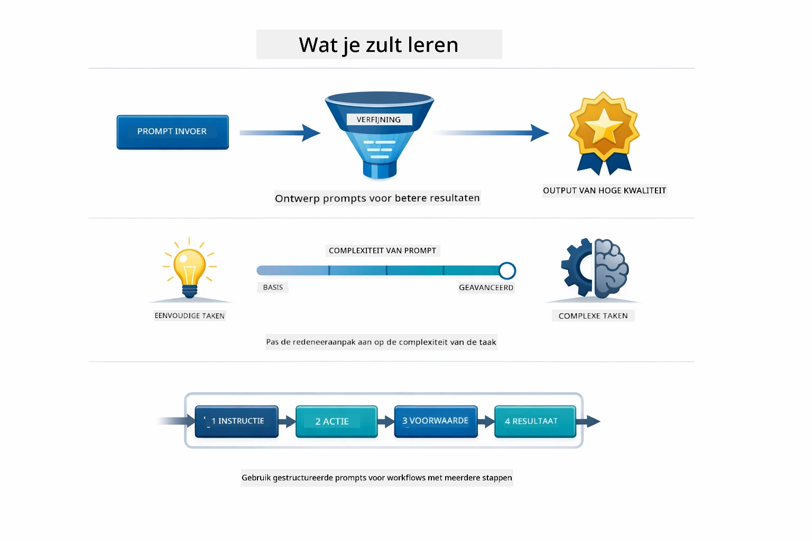
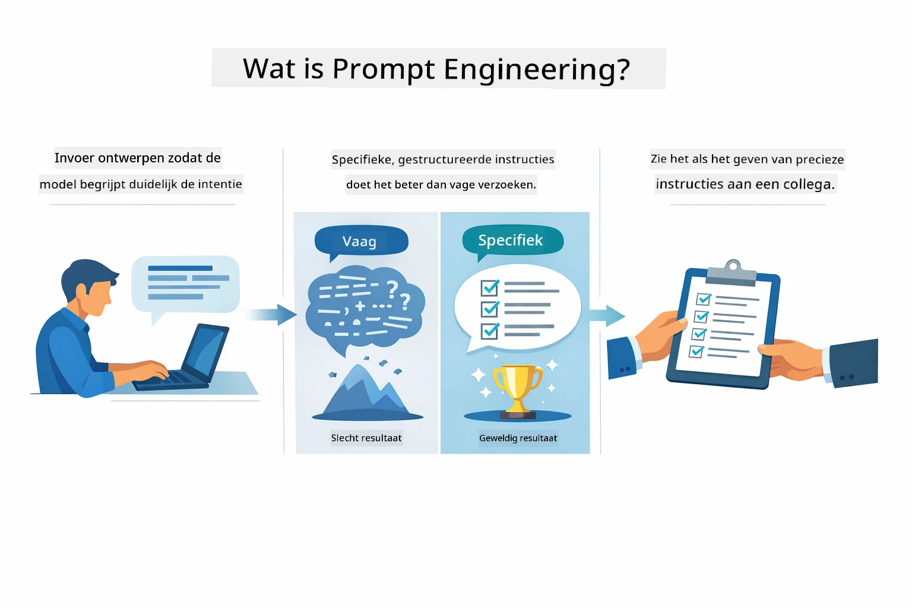
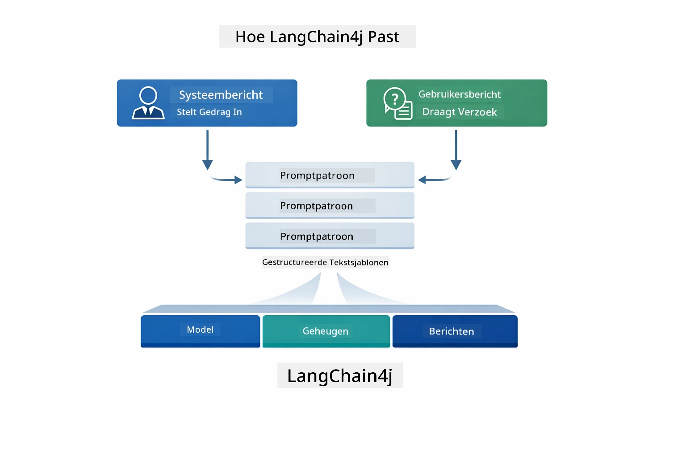
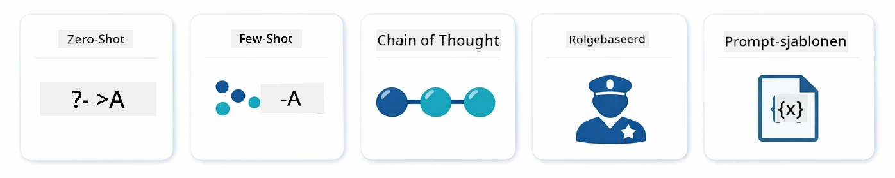
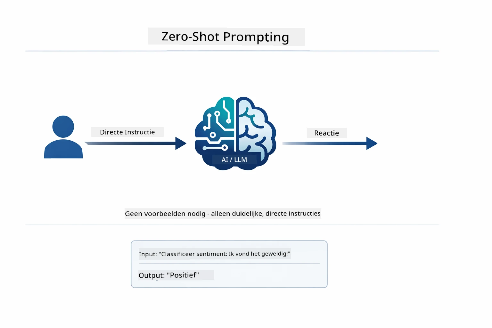
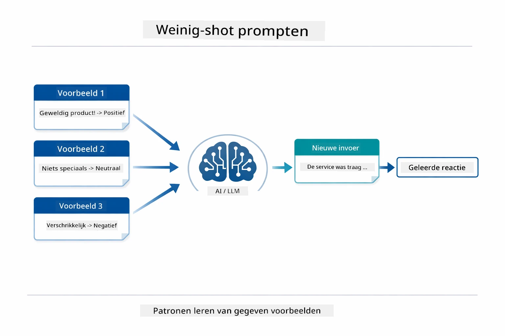
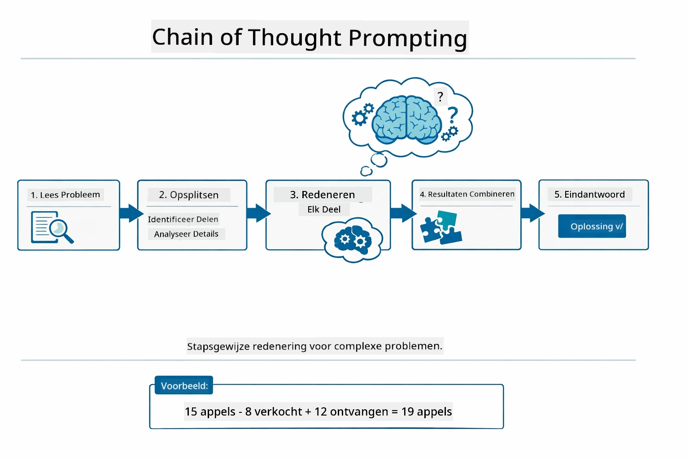
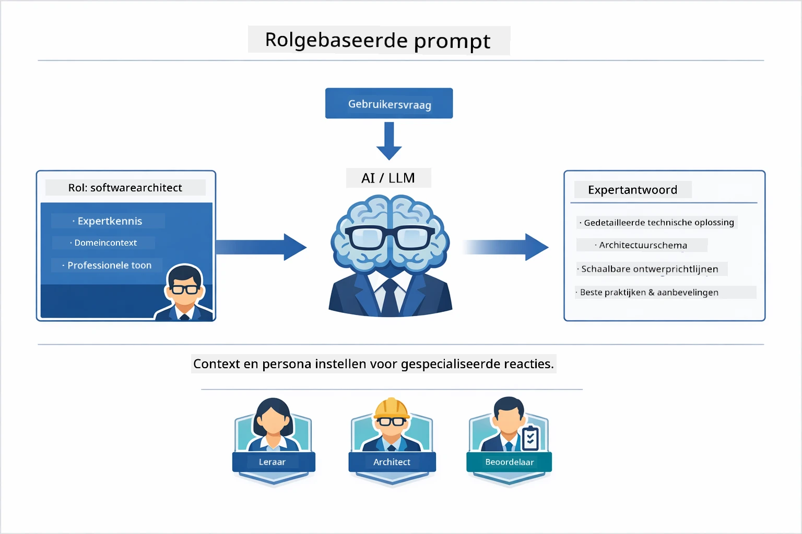
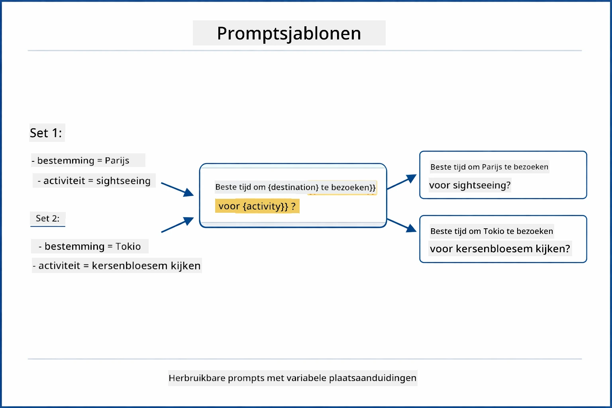
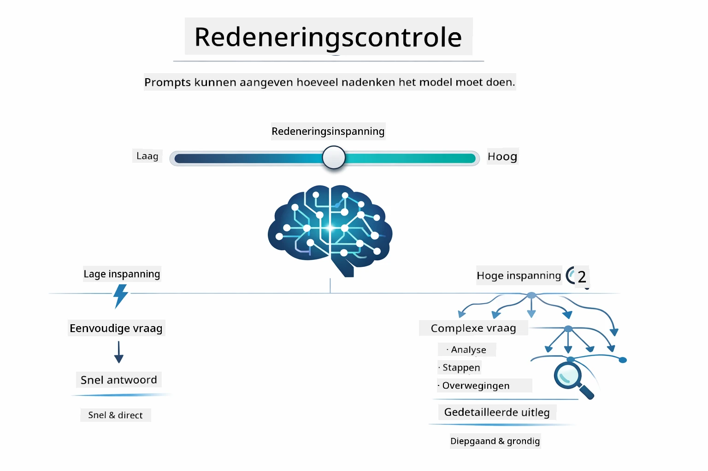

# Module 02: Prompt Engineering met GPT-5.2

## Inhoudsopgave

- [Wat Je Zal Leren](../../../02-prompt-engineering)
- [Vereisten](../../../02-prompt-engineering)
- [Begrijpen van Prompt Engineering](../../../02-prompt-engineering)
- [Basisprincipes van Prompt Engineering](../../../02-prompt-engineering)
  - [Zero-Shot Prompting](../../../02-prompt-engineering)
  - [Few-Shot Prompting](../../../02-prompt-engineering)
  - [Chain of Thought](../../../02-prompt-engineering)
  - [Role-Based Prompting](../../../02-prompt-engineering)
  - [Prompt Templates](../../../02-prompt-engineering)
- [Geavanceerde Patronen](../../../02-prompt-engineering)
- [Gebruik van Bestaande Azure Resources](../../../02-prompt-engineering)
- [Applicatie Screenshots](../../../02-prompt-engineering)
- [Verkennen van de Patronen](../../../02-prompt-engineering)
  - [Lage vs Hoge Bereidheid](../../../02-prompt-engineering)
  - [Taakuitvoering (Tool Preambles)](../../../02-prompt-engineering)
  - [Zelfreflecterende Code](../../../02-prompt-engineering)
  - [Gestructureerde Analyse](../../../02-prompt-engineering)
  - [Multi-Turn Chat](../../../02-prompt-engineering)
  - [Stap-voor-Stap Redeneren](../../../02-prompt-engineering)
  - [Beperkte Output](../../../02-prompt-engineering)
- [Wat Je Echt Leert](../../../02-prompt-engineering)
- [Volgende Stappen](../../../02-prompt-engineering)

## Wat Je Zal Leren



In de vorige module zag je hoe geheugen conversatie-AI mogelijk maakt en gebruikte je GitHub Models voor basisinteracties. Nu richten we ons op hoe je vragen stelt — de prompts zelf — met Azure OpenAI's GPT-5.2. De manier waarop je je prompts structureert beïnvloedt drastisch de kwaliteit van de antwoorden die je krijgt. We beginnen met een overzicht van de fundamentele prompting-technieken, en gaan dan over naar acht geavanceerde patronen die optimaal gebruik maken van de mogelijkheden van GPT-5.2.

We gebruiken GPT-5.2 omdat het redeneervermogen introduceert - je kunt aan het model aangeven hoeveel het moet nadenken voordat het antwoord geeft. Dit maakt verschillende prompting-strategieën duidelijker en helpt je te begrijpen wanneer je welke aanpak moet gebruiken. We profiteren ook van Azure's minder strenge snelheid limieten voor GPT-5.2 vergeleken met GitHub Models.

## Vereisten

- Module 01 voltooid (Azure OpenAI-resources uitgezet)
- `.env` bestand in de hoofdmap met Azure-referenties (gemaakt door `azd up` in Module 01)

> **Opmerking:** Als je Module 01 nog niet hebt voltooid, volg dan eerst de deployment-instructies daar.

## Begrijpen van Prompt Engineering



Prompt engineering gaat over het ontwerpen van invoerteksten die consequent de resultaten opleveren die je nodig hebt. Het gaat niet alleen om het stellen van vragen — het gaat om het structureren van verzoeken zodat het model precies begrijpt wat je wilt en hoe het moet antwoorden.

Denk eraan als instructies geven aan een collega. "Los de bug op" is vaag. "Los de null pointer exception in UserService.java regel 45 op door een null-check toe te voegen" is specifiek. Taalmodellen werken op dezelfde manier — specificiteit en structuur zijn belangrijk.



LangChain4j levert de infrastructuur — modelverbindingen, geheugen, en berichttypes — terwijl prompt-patronen gewoon zorgvuldig gestructureerde teksten zijn die je via die infrastructuur verzendt. De belangrijkste bouwstenen zijn `SystemMessage` (die het gedrag en de rol van de AI instelt) en `UserMessage` (die je daadwerkelijke verzoek bevat).

## Basisprincipes van Prompt Engineering



Voordat we in deze module de geavanceerde patronen induiken, laten we vijf fundamentele prompting-technieken herzien. Dit zijn de bouwstenen die elke prompt engineer zou moeten kennen. Als je de [Quick Start-module](../00-quick-start/README.md#2-prompt-patterns) al hebt doorlopen, heb je deze al in actie gezien — hier is het conceptuele kader erachter.

### Zero-Shot Prompting

De eenvoudigste aanpak: geef het model een directe instructie zonder voorbeelden. Het model vertrouwt volledig op zijn training om de taak te begrijpen en uit te voeren. Dit werkt goed voor eenvoudige verzoeken waarbij het verwachte gedrag duidelijk is.



*Directe instructie zonder voorbeelden — het model leidt de taak af uit alleen de opdracht*

```java
String prompt = "Classify this sentiment: 'I absolutely loved the movie!'";
String response = model.chat(prompt);
// Reactie: "Positief"
```

**Wanneer gebruiken:** Eenvoudige classificaties, directe vragen, vertalingen, of elke taak die het model zonder extra begeleiding kan aan.

### Few-Shot Prompting

Geef voorbeelden die het patroon demonstreren dat je wilt dat het model volgt. Het model leert het verwachte input-output formaat van jouw voorbeelden en past dat toe op nieuwe invoer. Dit verbetert de consistentie enorm bij taken waarbij het gewenste formaat of gedrag niet vanzelfsprekend is.



*Leren van voorbeelden — het model herkent het patroon en past het toe op nieuwe inputs*

```java
String prompt = """
    Classify the sentiment as positive, negative, or neutral.
    
    Examples:
    Text: "This product exceeded my expectations!" → Positive
    Text: "It's okay, nothing special." → Neutral
    Text: "Waste of money, very disappointed." → Negative
    
    Now classify this:
    Text: "Best purchase I've made all year!"
    """;
String response = model.chat(prompt);
```

**Wanneer gebruiken:** Aangepaste classificaties, consistente opmaak, domeinspecifieke taken, of wanneer zero-shot resultaten inconsistent zijn.

### Chain of Thought

Vraag het model om zijn redenering stap voor stap te tonen. In plaats van direct met een antwoord te komen, breekt het model het probleem op en doorloopt elke stap expliciet. Dit verbetert de nauwkeurigheid bij wiskundige, logische en multi-stap redeneertaken.



*Stap-voor-stap redenering — complexe problemen opdelen in expliciete logische stappen*

```java
String prompt = """
    Problem: A store has 15 apples. They sell 8 apples and then 
    receive a shipment of 12 more apples. How many apples do they have now?
    
    Let's solve this step-by-step:
    """;
String response = model.chat(prompt);
// Het model toont: 15 - 8 = 7, daarna 7 + 12 = 19 appels
```

**Wanneer gebruiken:** Wiskundeproblemen, logische puzzels, debugging, of elke taak waarbij het tonen van het redeneerproces accuratesse en vertrouwen verhoogt.

### Role-Based Prompting

Stel een persoon of rol in voor de AI voor je je vraag stelt. Dit geeft context die toon, diepgang en focus van het antwoord bepaalt. Een "software architect" geeft ander advies dan een "junior developer" of een "security auditor".



*Context en persona instellen — dezelfde vraag krijgt een ander antwoord afhankelijk van de toegewezen rol*

```java
String prompt = """
    You are an experienced software architect reviewing code.
    Provide a brief code review for this function:
    
    def calculate_total(items):
        total = 0
        for item in items:
            total = total + item['price']
        return total
    """;
String response = model.chat(prompt);
```

**Wanneer gebruiken:** Code reviews, tutoring, domeinspecifieke analyse, of wanneer je antwoorden wilt die zijn afgestemd op een bepaald expertise niveau of perspectief.

### Prompt Templates

Maak herbruikbare prompts met variabele placeholders. In plaats van elke keer een nieuwe prompt te schrijven, definieer je één template en vul je deze met verschillende waarden. De `PromptTemplate` klasse van LangChain4j maakt dit makkelijk met de `{{variable}}` syntax.



*Herbruikbare prompts met variabele placeholders — één template, vele toepassingen*

```java
PromptTemplate template = PromptTemplate.from(
    "What's the best time to visit {{destination}} for {{activity}}?"
);

Prompt prompt = template.apply(Map.of(
    "destination", "Paris",
    "activity", "sightseeing"
));

String response = model.chat(prompt.text());
```

**Wanneer gebruiken:** Herhaalde queries met verschillende inputs, batchverwerking, het bouwen van herbruikbare AI-workflows, of elk scenario waarbij de promptstructuur hetzelfde blijft maar de data verandert.

---

Deze vijf fundamenten geven je een solide toolkit voor de meeste prompting-taken. De rest van deze module bouwt hierop voort met **acht geavanceerde patronen** die gebruikmaken van GPT-5.2’s redeneercontrole, zelfevaluatie en gestructureerde outputmogelijkheden.

## Geavanceerde Patronen

Met de basisprincipes behandeld, gaan we naar de acht geavanceerde patronen die deze module uniek maken. Niet alle problemen vragen dezelfde aanpak. Sommige vragen hebben snelle antwoorden nodig, andere diepgaand nadenken. Sommige vragen vereisen zichtbare redenering, andere alleen resultaten. Elk patroon hieronder is geoptimaliseerd voor een ander scenario — en GPT-5.2’s redeneercontrole maakt de verschillen nog duidelijker.


*Overzicht van de acht prompt engineering patronen en hun gebruiksscenario's*



*GPT-5.2's redeneercontrole laat je specificeren hoeveel het model moet nadenken — van snelle directe antwoorden tot diepgaande verkenning*


*Lage bereidheid (snel, direct) vs Hoge bereidheid (grondig, exploratief) redeneerbenaderingen*

**Lage Bereidheid (Snel & Gefocust)** - Voor eenvoudige vragen waarbij je snelle, directe antwoorden wilt. Het model voert minimale redenering uit - maximaal 2 stappen. Gebruik dit voor berekeningen, opzoeken, of eenvoudige vragen.

```java
String prompt = """
    <reasoning_effort>low</reasoning_effort>
    <instruction>maximum 2 reasoning steps</instruction>
    
    What is 15% of 200?
    """;

String response = chatModel.chat(prompt);
```

> 💡 **Verken met GitHub Copilot:** Open [`Gpt5PromptService.java`](../../../02-prompt-engineering/src/main/java/com/example/langchain4j/prompts/service/Gpt5PromptService.java) en vraag:
> - "Wat is het verschil tussen lage en hoge bereidheid prompting patronen?"
> - "Hoe helpen de XML-tags in prompts de AI-respons te structureren?"
> - "Wanneer gebruik ik zelfreflectie-patronen versus directe instructie?"

**Hoge Bereidheid (Diep & Grondig)** - Voor complexe problemen waarbij je een grondige analyse wilt. Het model verkent uitgebreid en toont gedetailleerde redenering. Gebruik dit voor systeemontwerp, architectuurbeslissingen, of complex onderzoek.

```java
String prompt = """
    <reasoning_effort>high</reasoning_effort>
    <instruction>explore thoroughly, show detailed reasoning</instruction>
    
    Design a caching strategy for a high-traffic REST API.
    """;

String response = chatModel.chat(prompt);
```

**Taakuitvoering (Stap-voor-stap voortgang)** - Voor workflows met meerdere stappen. Het model geeft een plan vooraf, vertelt elke stap terwijl het werkt, en geeft daarna een samenvatting. Gebruik dit voor migraties, implementaties, of elk multi-step proces.

```java
String prompt = """
    <task>Create a REST endpoint for user registration</task>
    <preamble>Provide an upfront plan</preamble>
    <narration>Narrate each step as you work</narration>
    <summary>Summarize what was accomplished</summary>
    """;

String response = chatModel.chat(prompt);
```

Chain-of-Thought prompting vraagt expliciet aan het model om het redeneerproces te tonen, wat de nauwkeurigheid bij complexe taken verbetert. De stap-voor-stap opsplitsing helpt zowel mensen als AI het logische proces te begrijpen.

> **🤖 Probeer met [GitHub Copilot](https://github.com/features/copilot) Chat:** Vraag over dit patroon:
> - "Hoe zou ik het taakuitvoeringspatroon aanpassen voor langdurige operaties?"
> - "Wat zijn best practices voor het structureren van tool preambles in productieapplicaties?"
> - "Hoe kan ik tussentijdse voortgangsupdates vastleggen en weergeven in een UI?"


*Plan → Uitvoeren → Samenvatten workflow voor multi-step taken*

**Zelfreflecterende Code** - Voor het genereren van productieklare code. Het model genereert code, controleert op kwaliteitscriteria, en verbetert deze iteratief. Gebruik dit bij het bouwen van nieuwe features of services.

```java
String prompt = """
    <task>Create an email validation service</task>
    <quality_criteria>
    - Correct logic and error handling
    - Best practices (clean code, proper naming)
    - Performance optimization
    - Security considerations
    </quality_criteria>
    <instruction>Generate code, evaluate against criteria, improve iteratively</instruction>
    """;

String response = chatModel.chat(prompt);
```


*Iteratieve verbetercyclus - genereren, evalueren, problemen identificeren, verbeteren, herhalen*

**Gestructureerde Analyse** - Voor consistente evaluaties. Het model beoordeelt code met een vast kader (correctheid, gebruikspraktijken, prestaties, veiligheid). Gebruik dit voor code reviews of kwaliteitsbeoordelingen.

```java
String prompt = """
    <code>
    public List getUsers() {
        return database.query("SELECT * FROM users");
    }
    </code>
    
    <framework>
    Evaluate using these categories:
    1. Correctness - Logic and functionality
    2. Best Practices - Code quality
    3. Performance - Efficiency concerns
    4. Security - Vulnerabilities
    </framework>
    """;

String response = chatModel.chat(prompt);
```

> **🤖 Probeer met [GitHub Copilot](https://github.com/features/copilot) Chat:** Vraag over gestructureerde analyse:
> - "Hoe kan ik het analyseframework aanpassen voor verschillende soorten code reviews?"
> - "Wat is de beste manier om gestructureerde output programmatisch te parsen en te gebruiken?"
> - "Hoe zorg ik voor consistente ernstniveaus in verschillende beoordelingssessies?"


*Vier-categorie kader voor consistente code reviews met ernstniveaus*

**Multi-Turn Chat** - Voor gesprekken die context nodig hebben. Het model onthoudt voorgaande berichten en bouwt daarop voort. Gebruik dit voor interactieve hulpsessies of complexe Q&A.

```java
ChatMemory memory = MessageWindowChatMemory.withMaxMessages(10);

memory.add(UserMessage.from("What is Spring Boot?"));
AiMessage aiMessage1 = chatModel.chat(memory.messages()).aiMessage();
memory.add(aiMessage1);

memory.add(UserMessage.from("Show me an example"));
AiMessage aiMessage2 = chatModel.chat(memory.messages()).aiMessage();
memory.add(aiMessage2);
```


*Hoe gesprekcontext zich opbouwt over meerdere beurten tot aan het tokenlimiet*

**Stap-voor-Stap Redeneren** - Voor problemen die zichtbare logica vereisen. Het model toont expliciete redenering voor elke stap. Gebruik dit voor wiskundevragen, logische puzzels, of als je het denkproces wilt begrijpen.

```java
String prompt = """
    <instruction>Show your reasoning step-by-step</instruction>
    
    If a train travels 120 km in 2 hours, then stops for 30 minutes,
    then travels another 90 km in 1.5 hours, what is the average speed
    for the entire journey including the stop?
    """;

String response = chatModel.chat(prompt);
```


*Complexe problemen opdelen in expliciete logische stappen*

**Beperkte Output** - Voor antwoorden met specifieke formaatvereisten. Het model volgt strikt format- en lengteregels. Gebruik dit voor samenvattingen of wanneer je precieze outputstructuur nodig hebt.

```java
String prompt = """
    <constraints>
    - Exactly 100 words
    - Bullet point format
    - Technical terms only
    </constraints>
    
    Summarize the key concepts of machine learning.
    """;

String response = chatModel.chat(prompt);
```


*Handhaven van specifieke formaat-, lengte- en structuurvereisten*

## Gebruik van Bestaande Azure Resources

**Controleer de deployment:**

Zorg dat het `.env` bestand in de hoofdmap bestaat met Azure-referenties (gemaakt tijdens Module 01):
```bash
cat ../.env  # Moet AZURE_OPENAI_ENDPOINT, API_KEY, DEPLOYMENT tonen
```

**Start de applicatie:**

> **Opmerking:** Als je alle applicaties al hebt gestart met `./start-all.sh` uit Module 01, draait deze module al op poort 8083. Je kunt de startcommando’s hieronder overslaan en direct naar http://localhost:8083 gaan.

**Optie 1: Gebruik Spring Boot Dashboard (Aanbevolen voor VS Code gebruikers)**

De dev container bevat de Spring Boot Dashboard-extensie, die een visuele interface biedt om alle Spring Boot-applicaties te beheren. Je vindt deze in de Activity Bar aan de linkerkant van VS Code (zoek naar het Spring Boot-icoon).
Vanaf het Spring Boot Dashboard kun je:
- Alle beschikbare Spring Boot-toepassingen in de workspace zien
- Applicaties met één klik starten/stoppen
- Applicatielogs in realtime bekijken
- Applicatiestatus monitoren

Klik eenvoudig op de afspeelknop naast "prompt-engineering" om deze module te starten, of start alle modules tegelijk.


**Optie 2: Gebruik maken van shell scripts**

Start alle webapplicaties (modules 01-04):

**Bash:**
```bash
cd ..  # Vanuit de rootdirectory
./start-all.sh
```

**PowerShell:**
```powershell
cd ..  # Vanuit de hoofdmap
.\start-all.ps1
```

Of start alleen deze module:

**Bash:**
```bash
cd 02-prompt-engineering
./start.sh
```

**PowerShell:**
```powershell
cd 02-prompt-engineering
.\start.ps1
```

Beide scripts laden automatisch omgevingsvariabelen vanuit het root `.env`-bestand en bouwen de JARs als deze nog niet bestaan.

> **Let op:** Als je de modules liever handmatig bouwt voordat je ze start:
>
> **Bash:**
> ```bash
> cd ..  # Go to root directory
> mvn clean package -DskipTests
> ```
>
> **PowerShell:**
> ```powershell
> cd ..  # Go to root directory
> mvn clean package -DskipTests
> ```

Open http://localhost:8083 in je browser.

**Om te stoppen:**

**Bash:**
```bash
./stop.sh  # Alleen deze module
# Of
cd .. && ./stop-all.sh  # Alle modules
```

**PowerShell:**
```powershell
.\stop.ps1  # Alleen deze module
# Of
cd ..; .\stop-all.ps1  # Alle modules
```

## Applicatie Screenshots


*Het hoofd dashboard toont alle 8 prompt engineering patronen met hun kenmerken en gebruiksscenario's*

## Verkenning van de Patronen

De webinterface laat je experimenteren met verschillende prompting strategieën. Elk patroon lost andere problemen op - probeer ze om te zien wanneer elke aanpak uitblinkt.

### Lage vs Hoge Bereidwilligheid

Stel een eenvoudige vraag zoals "Wat is 15% van 200?" met Lage Bereidwilligheid. Je krijgt een direct, meteen antwoord. Vraag nu iets complexers zoals "Ontwerp een cachingstrategie voor een API met veel verkeer" met Hoge Bereidwilligheid. Kijk hoe het model vertraagt en gedetailleerde redeneringen geeft. Zelfde model, zelfde vraagstructuur - maar de prompt vertelt hoeveel denkwerk het moet doen.


*Snel berekenen met minimale redenering*


*Uitgebreide cachingstrategie (2.8MB)*

### Taakuitvoering (Tool Preambles)

Meerstaps workflows profiteren van vooraf plannen en voortgangsnarratie. Het model schetst wat het gaat doen, vertelt elke stap, en vat daarna de resultaten samen.


*Een REST endpoint maken met stapsgewijze narratie (3.9MB)*

### Zelfreflecterende Code

Probeer "Maak een e-mail validatieservice". In plaats van alleen code te genereren en te stoppen, genereert het model, evalueert het aan kwaliteitscriteria, identificeert zwaktes en verbetert. Je ziet het itereren tot de code aan productienormen voldoet.


*Volledige e-mail validatieservice (5.2MB)*

### Gestructureerde Analyse

Code reviews hebben consistente beoordelingskaders nodig. Het model analyseert code met vaste categorieën (correctheid, praktijken, prestaties, beveiliging) met ernstniveaus.


*Kader-gebaseerde code review*

### Multi-Turn Chat

Vraag "Wat is Spring Boot?" en volg direct op met "Laat me een voorbeeld zien". Het model onthoudt je eerste vraag en geeft een specifiek Spring Boot voorbeeld. Zonder geheugen zou die tweede vraag te vaag zijn.


*Contextbehoud tussen vragen*

### Stapsgewijze Redenering

Kies een wiskunde probleem en probeer het met zowel Stapsgewijze Redenering als Lage Bereidwilligheid. Lage bereidwilligheid geeft alleen het antwoord - snel maar ondoorzichtig. Stapsgewijs toont elke berekening en beslissing.


*Wiskunde probleem met expliciete stappen*

### Beperkte Output

Als je specifieke formaten of woordenaantallen nodig hebt, zorgt dit patroon voor strikte naleving. Probeer een samenvatting te genereren met precies 100 woorden in bulletpoint formaat.


*Samenvatting machine learning met formatcontrole*

## Wat Je Echt Leren

**Redeneerinspanning Verandert Alles**

GPT-5.2 laat je de computationele inspanning beheersen via je prompts. Lage inspanning betekent snelle reacties met minimale exploratie. Hoge inspanning betekent dat het model de tijd neemt om diep na te denken. Je leert de inspanning af te stemmen op de taakcomplexiteit - verspil geen tijd aan simpele vragen, maar haast je ook niet bij complexe beslissingen.

**Structuur Stuurt Gedrag**

Merk je de XML-tags in de prompts? Ze zijn niet decoratief. Modellen volgen gestructureerde instructies betrouwbaarder dan vrije tekst. Als je meerslag processen of complexe logica nodig hebt, helpt structuur het model bijhouden waar het is en wat volgt.


*Anatomie van een goed gestructureerde prompt met duidelijke secties en XML-stijl organisatie*

**Kwaliteit Door Zelfevaluatie**

De zelfreflecterende patronen werken door kwaliteitscriteria expliciet te maken. In plaats van te hopen dat het model "het goed doet", vertel je precies wat "goed" betekent: correcte logica, foutafhandeling, prestaties, beveiliging. Het model kan dan zijn eigen output evalueren en verbeteren. Dit verandert codegeneratie van een loterij naar een proces.

**Context Is Beperkt**

Multi-turn gesprekken werken door berichtgeschiedenis bij elke aanvraag te voegen. Maar er is een limiet - elk model heeft een maximum aantal tokens. Naarmate gesprekken groeien, heb je strategieën nodig om relevante context te behouden zonder de limiet te bereiken. Deze module laat je zien hoe geheugen werkt; later leer je wanneer samenvatten, vergeten en ophalen verstandig is.

## Volgende Stappen

**Volgende Module:** [03-rag - RAG (Retrieval-Augmented Generation)](../03-rag/README.md)

---

**Navigatie:** [← Vorige: Module 01 - Introductie](../01-introduction/README.md) | [Terug naar Hoofdmenu](../README.md) | [Volgende: Module 03 - RAG →](../03-rag/README.md)

---

<!-- CO-OP TRANSLATOR DISCLAIMER START -->
**Disclaimer**:  
Dit document is vertaald met behulp van de AI-vertalingsdienst [Co-op Translator](https://github.com/Azure/co-op-translator). Hoewel we streven naar nauwkeurigheid, dient u er rekening mee te houden dat automatische vertalingen fouten of onnauwkeurigheden kunnen bevatten. Het originele document in de oorspronkelijke taal dient als de gezaghebbende bron te worden beschouwd. Voor cruciale informatie wordt aanbevolen een professionele menselijke vertaling te laten uitvoeren. Wij zijn niet aansprakelijk voor enige misverstanden of verkeerde interpretaties die voortvloeien uit het gebruik van deze vertaling.
<!-- CO-OP TRANSLATOR DISCLAIMER END -->