# Module 03: RAG (Retrieval-Augmented Generation)

## Inhoudsopgave

- [Video Walkthrough](../../../03-rag)
- [Wat Je Zal Leren](../../../03-rag)
- [Vereisten](../../../03-rag)
- [RAG Begrijpen](../../../03-rag)
  - [Welke RAG Benadering Gebruikt Deze Tutorial?](../../../03-rag)
- [Hoe Het Werkt](../../../03-rag)
  - [Documentverwerking](../../../03-rag)
  - [Embeddings Maken](../../../03-rag)
  - [Semantisch Zoeken](../../../03-rag)
  - [Antwoordgeneratie](../../../03-rag)
- [De Applicatie Uitvoeren](../../../03-rag)
- [De Applicatie Gebruiken](../../../03-rag)
  - [Een Document Uploaden](../../../03-rag)
  - [Vragen Stellen](../../../03-rag)
  - [Bronvermeldingen Controleren](../../../03-rag)
  - [Experimenteren met Vragen](../../../03-rag)
- [Belangrijke Concepten](../../../03-rag)
  - [Chunkingsstrategie](../../../03-rag)
  - [Gelijkenisscores](../../../03-rag)
  - [In-Memory Opslag](../../../03-rag)
  - [Contextvensterbeheer](../../../03-rag)
- [Wanneer RAG Belangrijk Is](../../../03-rag)
- [Volgende Stappen](../../../03-rag)

## Video Walkthrough

Bekijk deze live sessie die uitlegt hoe je aan de slag gaat met deze module: [RAG with LangChain4j - Live Session](https://www.youtube.com/watch?v=_olq75ZH_eY)

## Wat Je Zal Leren

In de vorige modules heb je geleerd hoe je gesprekken voert met AI en hoe je je prompts effectief structureert. Maar er is een fundamentele beperking: taalmodellen kennen alleen wat ze tijdens de training hebben geleerd. Ze kunnen geen vragen beantwoorden over het beleid van jouw bedrijf, je projectdocumentatie, of welke informatie dan ook waarop ze niet getraind zijn.

RAG (Retrieval-Augmented Generation) lost dit probleem op. In plaats van het model te proberen jouw informatie te leren (wat duur en onpraktisch is), geef je het de mogelijkheid om door je documenten te zoeken. Wanneer iemand een vraag stelt, vindt het systeem relevante informatie en voegt die toe aan de prompt. Het model antwoordt dan op basis van die opgehaalde context.

Zie RAG als het geven van een referentiebibliotheek aan het model. Wanneer je een vraag stelt, doet het systeem het volgende:

1. **Gebruikersvraag** - Je stelt een vraag
2. **Embedding** - Zet je vraag om in een vector
3. **Vectorzoektocht** - Vindt vergelijkbare documentstukken
4. **Contextsamenstelling** - Voegt relevante stukken toe aan de prompt
5. **Antwoord** - Het LLM genereert een antwoord op basis van de context

Dit zorgt ervoor dat de antwoorden van het model gebaseerd zijn op jouw eigen gegevens in plaats van alleen op de training of het verzinnen van antwoorden.

## Vereisten

- Voltooide [Module 00 - Quick Start](../00-quick-start/README.md) (voor het Easy RAG voorbeeld genoemd hierboven)
- Voltooide [Module 01 - Introduction](../01-introduction/README.md) (Azure OpenAI resources gedeployd, inclusief het `text-embedding-3-small` embedding model)
- `.env` bestand in de hoofdmap met Azure credentials (gemaakt door `azd up` in Module 01)

> **Opmerking:** Als je Module 01 nog niet hebt voltooid, volg dan eerst de deploy-instructies daar. Het `azd up` commando deployt zowel het GPT chatmodel als het embeddingmodel dat deze module gebruikt.

## RAG Begrijpen

De onderstaande afbeelding illustreert het kernconcept: in plaats van alleen te vertrouwen op de trainingsdata van het model, geeft RAG het een referentiebibliotheek van jouw documenten om te raadplegen voordat het elk antwoord genereert.

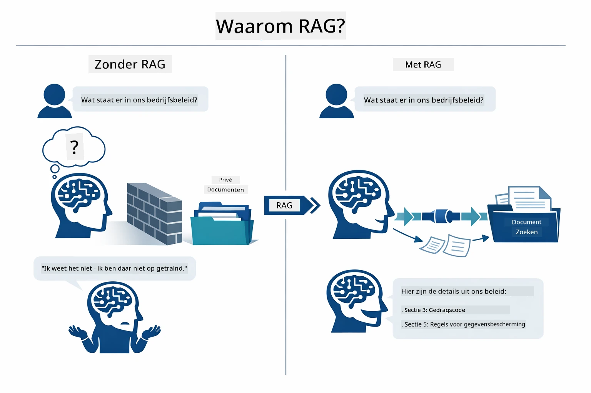

*Dit diagram toont het verschil tussen een standaard LLM (die gokt vanuit trainingsdata) en een RAG-verbeterd LLM (die eerst jouw documenten raadpleegt).*

Zo verbinden de onderdelen zich van begin tot eind. Een gebruiker stelt een vraag die door vier stadia stroomt — embedding, vectorzoektocht, contextsamenstelling en antwoordgeneratie — waarbij elk stadium voortbouwt op het vorige:


*Dit diagram toont de end-to-end RAG-pijplijn — een gebruikersvraag stroomt door embedding, vectorzoektocht, contextsamenstelling en antwoordgeneratie.*

De rest van deze module bespreekt elk stadium in detail, met code die je kunt uitvoeren en aanpassen.

### Welke RAG Benadering Gebruikt Deze Tutorial?

LangChain4j biedt drie manieren om RAG te implementeren, elk met een verschillend abstractieniveau. Hieronder een vergelijking van de drie:

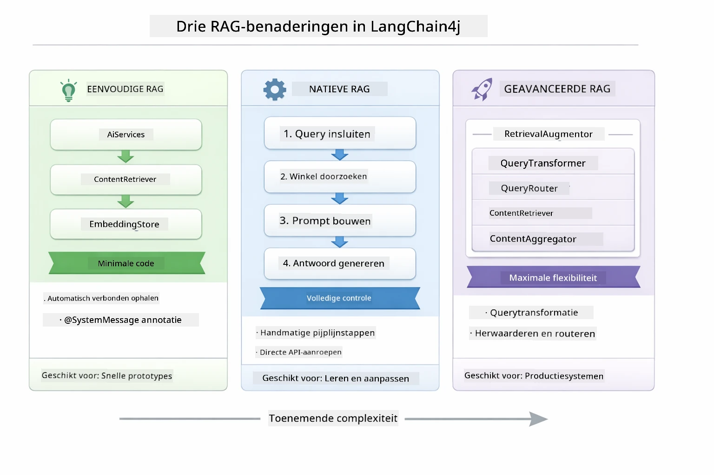

*Dit diagram vergelijkt de drie LangChain4j RAG-benaderingen — Easy, Native en Advanced — met hun kerncomponenten en wanneer je welke gebruikt.*

| Benadering | Wat Het Doet | Afweging |
|---|---|---|
| **Easy RAG** | Verbindt alles automatisch via `AiServices` en `ContentRetriever`. Je annoteert een interface, koppelt een retriever, en LangChain4j regelt embedding, zoeken en prompt-assemblage achter de schermen. | Minimale code, maar je ziet niet wat er bij elke stap gebeurt. |
| **Native RAG** | Je roept zelf het embeddingmodel aan, zoekt in de opslag, bouwt de prompt en genereert het antwoord — stap voor stap expliciet. | Meer code, maar elk stadium is zichtbaar en aanpasbaar. |
| **Advanced RAG** | Gebruikt het `RetrievalAugmentor` framework met inplugbare querytransformators, routers, herschikkers en contentinjectoren voor productieklare pijplijnen. | Maximale flexibiliteit, maar aanzienlijk complexer. |

**Deze tutorial gebruikt de Native benadering.** Elke stap van de RAG-pijplijn — het embedden van de query, zoeken in de vectoropslag, het samenstellen van de context en het genereren van het antwoord — staat expliciet beschreven in [`RagService.java`](../../../03-rag/src/main/java/com/example/langchain4j/rag/service/RagService.java). Dit is bewust zo: als leermiddel is het belangrijker dat je elke stap ziet en begrijpt dan dat de code minimaal is. Zodra je vertrouwd bent met hoe de onderdelen samenwerken, kun je overstappen naar Easy RAG voor snelle prototypes of Advanced RAG voor productiesystemen.

> **💡 Al Easy RAG in actie gezien?** De [Quick Start module](../00-quick-start/README.md) bevat een Document Q&A voorbeeld ([`SimpleReaderDemo.java`](../../../00-quick-start/src/main/java/com/example/langchain4j/quickstart/SimpleReaderDemo.java)) dat de Easy RAG benadering gebruikt — LangChain4j verzorgt automatisch embedding, zoeken en prompt-assemblage. Deze module neemt de volgende stap door die pijplijn open te breken zodat je elk stadium zelf kunt zien en aansturen.

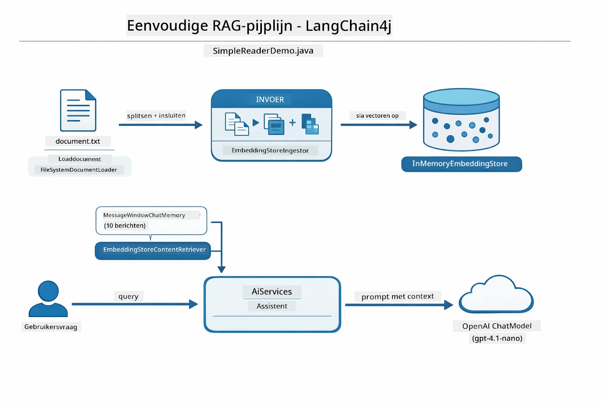

*Dit diagram toont de Easy RAG pijplijn uit `SimpleReaderDemo.java`. Vergelijk dit met de Native benadering in deze module: Easy RAG verbergt embedding, terugvinden en prompt-assemblage achter `AiServices` en `ContentRetriever` — je laadt een document, koppelt een retriever, en krijgt antwoorden. De Native benadering in deze module breekt die pijplijn open zodat jij elk stadium (embedden, zoeken, context samenstellen, genereren) zelf aanroept, waardoor je volledige zichtbaarheid en controle hebt.*

## Hoe Het Werkt

De RAG-pijplijn in deze module bestaat uit vier stadia die achter elkaar draaien bij elke gebruikersvraag. Eerst wordt een geüpload document **geparsed en in stukken verdeeld** die beheersbaar zijn. Die stukken worden omgezet in **vectorembeddings** en opgeslagen zodat ze wiskundig vergeleken kunnen worden. Als er een zoekvraag binnenkomt, wordt er een **semantische zoekactie** uitgevoerd om de meest relevante stukken te vinden, en tenslotte worden die als context aan het LLM doorgegeven voor **antwoordgeneratie**. Hieronder wordt elk stadium met code en diagrammen besproken. Laten we bij de eerste stap beginnen.

### Documentverwerking

[DocumentService.java](../../../03-rag/src/main/java/com/example/langchain4j/rag/service/DocumentService.java)

Wanneer je een document uploadt, parseert het systeem het (PDF of platte tekst), voegt metadata toe zoals de bestandsnaam, en splitst het vervolgens in stukken — kleinere fragmenten die comfortabel in het contextvenster van het model passen. Deze stukken overlappen een beetje zodat je geen context verliest bij de grenzen.

```java
// Parse het geüploade bestand en wikkel het in een LangChain4j Document
Document document = Document.from(content, metadata);

// Verdeel in stukken van 300 tokens met een overlap van 30 tokens
DocumentSplitter splitter = DocumentSplitters
    .recursive(300, 30);

List<TextSegment> segments = splitter.split(document);
```

Het onderstaande diagram toont dit visueel. Let op hoe elk stuk een aantal tokens deelt met zijn buren — de overlap van 30 tokens zorgt ervoor dat er geen belangrijke context verloren gaat:

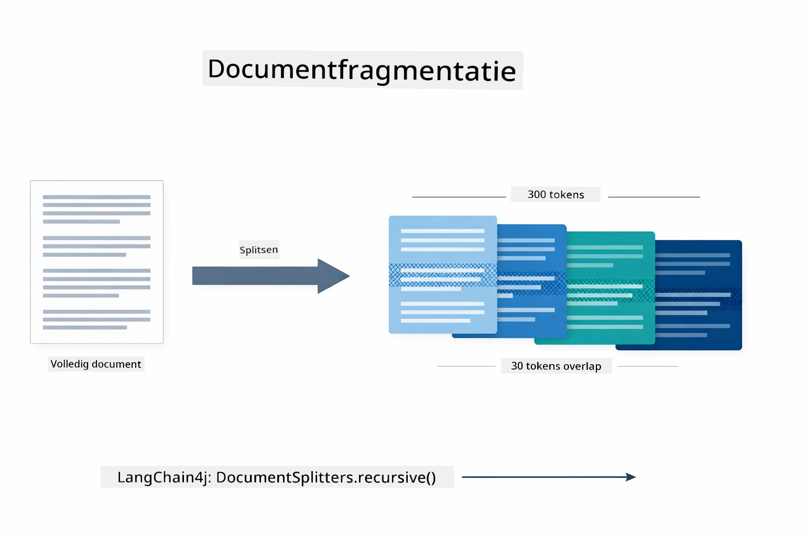

*Dit diagram toont een document dat wordt gesplitst in stukken van 300 tokens met een overlap van 30 tokens, zodat context bij de stukken behouden blijft.*

> **🤖 Probeer met [GitHub Copilot](https://github.com/features/copilot) Chat:** Open [`DocumentService.java`](../../../03-rag/src/main/java/com/example/langchain4j/rag/service/DocumentService.java) en vraag:
> - "Hoe splitst LangChain4j documenten in stukken en waarom is overlap belangrijk?"
> - "Wat is de optimale grootte voor stukken bij verschillende documenttypes en waarom?"
> - "Hoe ga ik om met documenten in meerdere talen of met speciale opmaak?"

### Embeddings Maken

[LangChainRagConfig.java](../../../03-rag/src/main/java/com/example/langchain4j/rag/config/LangChainRagConfig.java)

Elk stuk wordt omgezet in een numerieke representatie, een embedding — in feite een betekenis-naar-getallen-omzetter. Het embeddingmodel is niet “intelligent” zoals een chatmodel; het kan geen instructies volgen, redeneren of vragen beantwoorden. Wat het wel kan, is tekst mappen in een wiskundige ruimte waar vergelijkbare betekenissen dicht bij elkaar liggen — "auto" dicht bij "automobiel", "terugbetalingsbeleid" dicht bij "mijn geld terug." Zie een chatmodel als een persoon met wie je kunt praten; een embeddingmodel is een ultra-goed archiefsysteem.

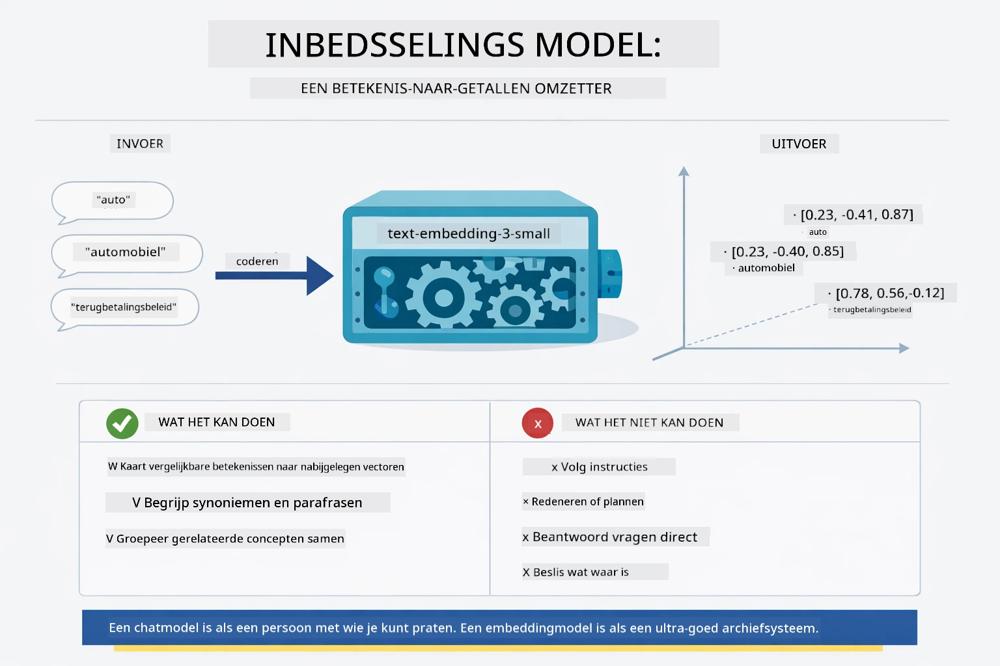

*Dit diagram toont hoe een embeddingmodel tekst omzet in numerieke vectoren, waarbij vergelijkbare betekenissen — zoals "auto" en "automobiel" — dicht bij elkaar in vectorruimte worden geplaatst.*

```java
@Bean
public EmbeddingModel embeddingModel() {
    return OpenAiOfficialEmbeddingModel.builder()
        .baseUrl(azureOpenAiEndpoint)
        .apiKey(azureOpenAiKey)
        .modelName(azureEmbeddingDeploymentName)
        .build();
}

EmbeddingStore<TextSegment> embeddingStore = 
    new InMemoryEmbeddingStore<>();
```

Het klassendiagram hieronder toont de twee afzonderlijke stromen in een RAG-pijplijn en de LangChain4j klassen die ze implementeren. De **ingestflow** (draait één keer bij upload) splitst het document, embedt de stukken en slaat ze op via `.addAll()`. De **queryflow** (draait bij elke vraag) embedt de vraag, zoekt de opslag via `.search()` en geeft de passende context door aan het chatmodel. Beide flows komen samen bij de gedeelde interface `EmbeddingStore<TextSegment>`:

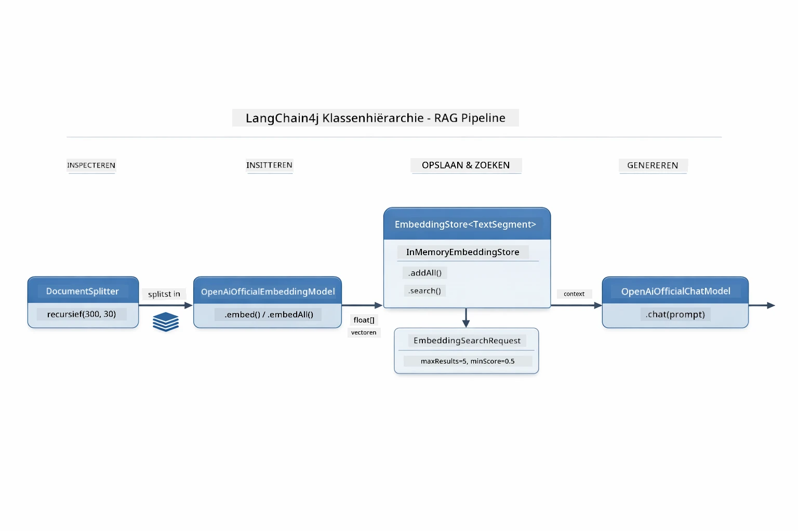

*Dit diagram toont de twee stromen in een RAG-pijplijn — ingest en query — en hoe ze verbonden zijn via een gedeelde EmbeddingStore.*

Zodra embeddings zijn opgeslagen, clustert vergelijkbare inhoud vanzelf in vectorruimte. De onderstaande visualisatie toont hoe documenten over gerelateerde onderwerpen als dichtbije punten eindigen, wat semantisch zoeken mogelijk maakt:


*Deze visualisatie toont hoe gerelateerde documenten in 3D-vectorruimte samen clusteren, waarbij onderwerpen zoals Technische Documentatie, Bedrijfsregels en FAQ’s aparte groepen vormen.*

Wanneer een gebruiker zoekt, volgt het systeem vier stappen: embed de documenten één keer, embed de zoekvraag bij elke zoekactie, vergelijk de queryvector met alle opgeslagen vectoren met behulp van cosine similarity, en retourneer de top-K hoogst scorende stukken. Het onderstaande diagram leidt je door elke stap en de betrokken LangChain4j klassen:

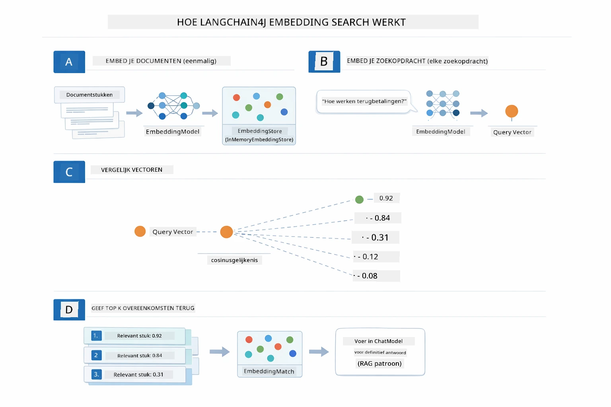

*Dit diagram toont het vierstappenproces van embeddingzoektocht: documenten embedden, de query embedden, vectoren vergelijken met cosine similarity en de top-K resultaten teruggeven.*

### Semantisch Zoeken

[RagService.java](../../../03-rag/src/main/java/com/example/langchain4j/rag/service/RagService.java)

Wanneer je een vraag stelt, wordt je vraag ook een embedding. Het systeem vergelijkt de embedding van je vraag met alle embeddings van de documentstukken. Het vindt de stukken met de meest vergelijkbare betekenissen — niet alleen matching keywords, maar daadwerkelijke semantische gelijkenis.

```java
Embedding queryEmbedding = embeddingModel.embed(question).content();

EmbeddingSearchRequest searchRequest = EmbeddingSearchRequest.builder()
    .queryEmbedding(queryEmbedding)
    .maxResults(5)
    .minScore(0.5)
    .build();

EmbeddingSearchResult<TextSegment> searchResult = embeddingStore.search(searchRequest);
List<EmbeddingMatch<TextSegment>> matches = searchResult.matches();

for (EmbeddingMatch<TextSegment> match : matches) {
    String relevantText = match.embedded().text();
    double score = match.score();
}
```

Het onderstaande diagram toont het verschil tussen semantisch zoeken en traditionele keyword-zoektochten. Een keyword-zoektocht op "voertuig" mist een stuk over "auto’s en vrachtwagens", maar semantisch zoeken begrijpt dat ze hetzelfde betekenen en geeft dat stuk hoog terug:

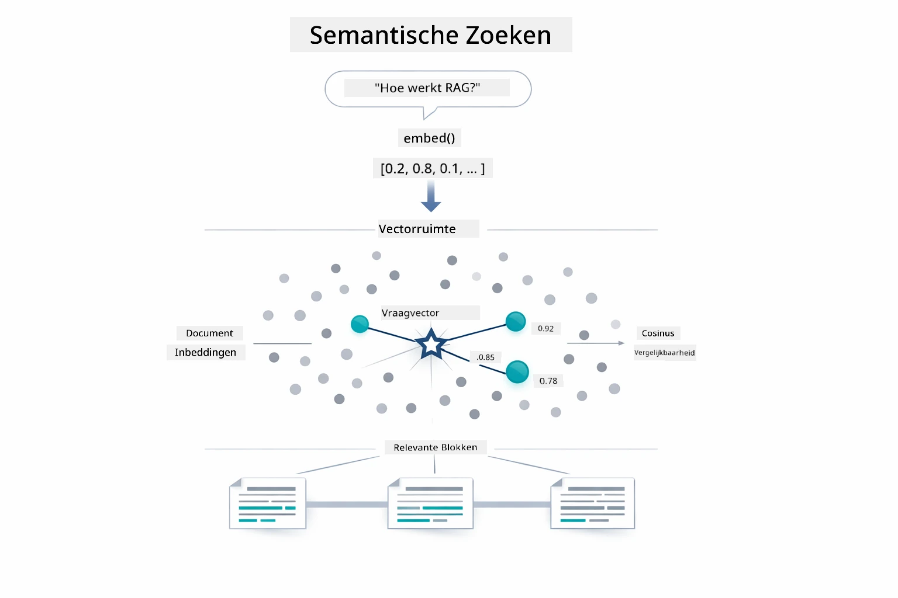

*Dit diagram vergelijkt keyword-zoektocht met semantisch zoeken, en toont hoe semantisch zoeken conceptueel gerelateerde inhoud ophaalt, ook als exacte zoekwoorden verschillen.*

Onder de motorkap wordt gelijkenis gemeten met cosine similarity — in feite de vraag "wijzen deze twee pijlen dezelfde kant op?" Twee stukken kunnen compleet verschillende woorden gebruiken, maar als ze hetzelfde betekenen wijzen hun vectoren dezelfde kant op en scoren ze dichtbij de 1.0:

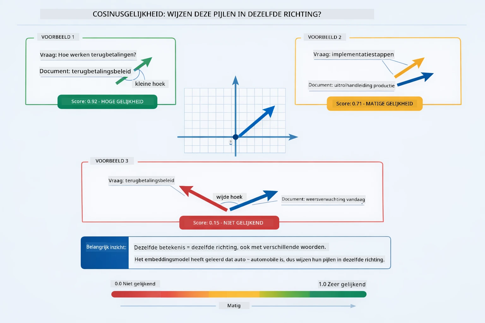

*Dit diagram illustreert cosine similarity als de hoek tussen embeddingvectoren — vectoren die meer op elkaar zijn afgestemd scoren dichter bij 1.0, wat hogere semantische gelijkenis aangeeft.*
> **🤖 Probeer met [GitHub Copilot](https://github.com/features/copilot) Chat:** Open [`RagService.java`](../../../03-rag/src/main/java/com/example/langchain4j/rag/service/RagService.java) en vraag:
> - "Hoe werkt similarity search met embeddings en wat bepaalt de score?"
> - "Welke similarity threshold moet ik gebruiken en hoe beïnvloedt dat de resultaten?"
> - "Hoe ga ik om met gevallen waarin geen relevante documenten worden gevonden?"

### Antwoordgeneratie

[RagService.java](../../../03-rag/src/main/java/com/example/langchain4j/rag/service/RagService.java)

De meest relevante stukken worden samengevoegd tot een gestructureerde prompt die expliciete instructies, de opgehaalde context en de vraag van de gebruiker bevat. Het model leest die specifieke stukken en beantwoordt op basis van die informatie — het kan alleen gebruiken wat voor zich ligt, wat hallucinaties voorkomt.

```java
String context = matches.stream()
    .map(match -> match.embedded().text())
    .collect(Collectors.joining("\n\n"));

String prompt = String.format("""
    Answer the question based on the following context.
    If the answer cannot be found in the context, say so.

    Context:
    %s

    Question: %s

    Answer:""", context, request.question());

String answer = chatModel.chat(prompt);
```

Het onderstaande diagram toont deze samenstelling in actie — de best scorende stukken uit de zoekfase worden in de prompttemplate geïnjecteerd, en het `OpenAiOfficialChatModel` genereert een gefundeerd antwoord:

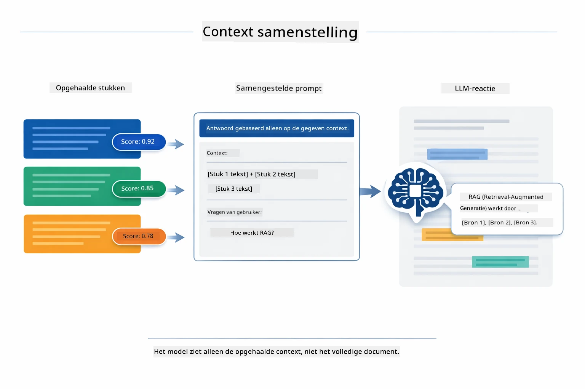

*Dit diagram toont hoe de best scorende stukken worden samengevoegd tot een gestructureerde prompt, waardoor het model een gefundeerd antwoord uit uw data kan genereren.*

## De Applicatie Uitvoeren

**Controleer de deployment:**

Zorg ervoor dat het `.env`-bestand in de root directory bestaat met Azure-gegevens (gemaakt tijdens Module 01):

**Bash:**
```bash
cat ../.env  # Moet AZURE_OPENAI_ENDPOINT, API_KEY, DEPLOYMENT tonen
```

**PowerShell:**
```powershell
Get-Content ..\.env  # Moet AZURE_OPENAI_ENDPOINT, API_KEY, DEPLOYMENT weergeven
```

**Start de applicatie:**

> **Opmerking:** Als je alle applicaties al gestart hebt met `./start-all.sh` uit Module 01, draait deze module al op poort 8081. Je kunt de onderstaande startcommando's overslaan en rechtstreeks naar http://localhost:8081 gaan.

**Optie 1: Met Spring Boot Dashboard (Aanbevolen voor VS Code gebruikers)**

De dev-container bevat de Spring Boot Dashboard extensie, die een visuele interface biedt om alle Spring Boot applicaties te beheren. Je vindt deze in de Activiteitenbalk aan de linkerkant van VS Code (zoek naar het Spring Boot icoon).

Vanaf het Spring Boot Dashboard kun je:
- Alle beschikbare Spring Boot applicaties in de workspace zien
- Applicaties met één klik starten/stoppen
- Applicatielogs in realtime bekijken
- Applicatiestatus monitoren

Klik simpelweg op de afspeelknop naast "rag" om deze module te starten, of start alle modules tegelijk.


*Deze screenshot toont het Spring Boot Dashboard in VS Code, waar je applicaties visueel kunt starten, stoppen en monitoren.*

**Optie 2: Met shell scripts**

Start alle webapplicaties (modules 01-04):

**Bash:**
```bash
cd ..  # Vanaf de hoofdmap
./start-all.sh
```

**PowerShell:**
```powershell
cd ..  # Vanuit de hoofdmap
.\start-all.ps1
```

Of start alleen deze module:

**Bash:**
```bash
cd 03-rag
./start.sh
```

**PowerShell:**
```powershell
cd 03-rag
.\start.ps1
```

Beide scripts laden automatisch omgevingsvariabelen uit het root `.env`-bestand en bouwen de JAR's als die nog niet bestaan.

> **Opmerking:** Als je alle modules handmatig wilt bouwen voordat je start:
>
> **Bash:**
> ```bash
> cd ..  # Go to root directory
> mvn clean package -DskipTests
> ```
>
> **PowerShell:**
> ```powershell
> cd ..  # Go to root directory
> mvn clean package -DskipTests
> ```

Open http://localhost:8081 in je browser.

**Om te stoppen:**

**Bash:**
```bash
./stop.sh  # Alleen deze module
# Of
cd .. && ./stop-all.sh  # Alle modules
```

**PowerShell:**
```powershell
.\stop.ps1  # Alleen deze module
# Of
cd ..; .\stop-all.ps1  # Alle modules
```

## De Applicatie Gebruiken

De applicatie biedt een webinterface voor documentupload en het stellen van vragen.

<a href="images/rag-homepage.png"></a>

*Deze screenshot toont de RAG applicatie-interface waar je documenten uploadt en vragen stelt.*

### Upload een Document

Begin met het uploaden van een document - TXT-bestanden werken het beste voor testen. Er is een `sample-document.txt` beschikbaar in deze map met informatie over LangChain4j functies, RAG-implementatie en best practices - perfect om het systeem mee te testen.

Het systeem verwerkt je document, splitst het in stukken en maakt embeddings aan voor elk stuk. Dit gebeurt automatisch bij het uploaden.

### Stel Vragen

Stel nu specifieke vragen over de inhoud van het document. Probeer iets feitelijks dat duidelijk in het document staat. Het systeem zoekt relevante stukken, voegt die toe aan de prompt en genereert een antwoord.

### Controleer Bronnen

Let op dat elk antwoord bronverwijzingen bevat met similarity scores. Deze scores (0 tot 1) tonen hoe relevant elk stuk was voor je vraag. Hoe hoger de score, hoe beter de overeenkomst. Dit maakt het mogelijk om het antwoord te verifiëren aan de hand van het bronmateriaal.

<a href="images/rag-query-results.png"></a>

*Deze screenshot toont queryresultaten met het gegenereerde antwoord, bronverwijzingen en relevantiescores voor elk opgehaald stuk.*

### Experimenteer met Vragen

Probeer verschillende soorten vragen:
- Specifieke feiten: "Wat is het hoofdonderwerp?"
- Vergelijkingen: "Wat is het verschil tussen X en Y?"
- Samenvattingen: "Vat de belangrijkste punten over Z samen"

Let op hoe de relevantiescores veranderen, afhankelijk van hoe goed je vraag overeenkomt met de inhoud van het document.

## Belangrijke Concepten

### Chunking Strategie

Documenten worden gesplitst in stukken van 300 tokens met 30 tokens overlap. Deze balans zorgt ervoor dat elk stuk genoeg context heeft om betekenisvol te zijn, terwijl ze klein genoeg blijven om meerdere stukken tegelijk in een prompt te passen.

### Similarity Scores

Elk opgehaald stuk krijgt een similarity score tussen 0 en 1 die aangeeft hoe goed het aansluit bij de vraag van de gebruiker. Het onderstaande diagram visualiseert de score-bereiken en hoe het systeem ze gebruikt om resultaten te filteren:

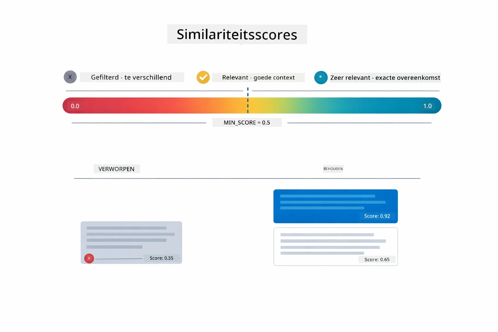

*Dit diagram toont score-bereiken van 0 tot 1, met een minimumdrempel van 0.5 die irrelevante stukken wegfiltert.*

Scores lopen van 0 tot 1:
- 0.7-1.0: Zeer relevant, exacte match
- 0.5-0.7: Relevant, goede context
- Onder 0.5: Gefilterd, te verschillend

Het systeem haalt alleen stukken op boven de minimumdrempel om kwaliteit te waarborgen.

Embeddings werken goed als betekenissen duidelijk clusteren, maar ze hebben zwakke plekken. Het onderstaande diagram toont veelvoorkomende faalpatronen — stukken die te groot zijn produceren vage vectoren, stukken die te klein zijn missen context, ambiguïteiten wijzen naar meerdere clusters, en exacte zoekopdrachten (IDs, artikelnummers) werken helemaal niet met embeddings:

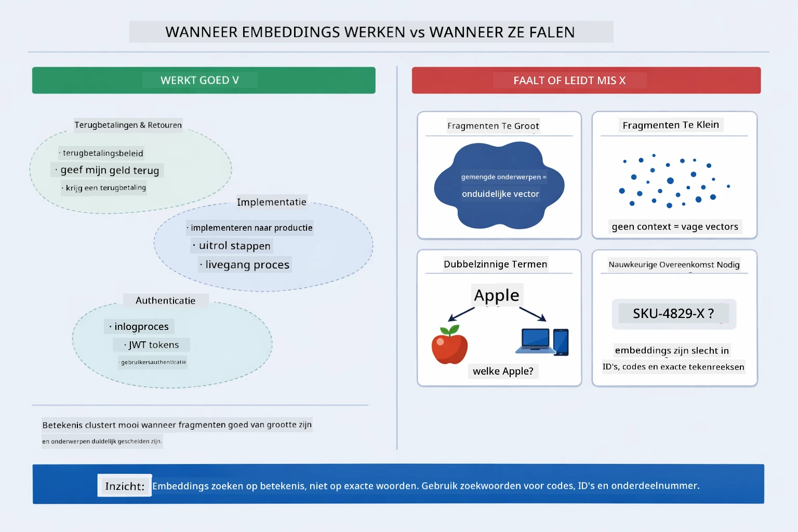

*Dit diagram toont veelvoorkomende embedding-fouten: stukken te groot, stukken te klein, ambigue termen die naar meerdere clusters wijzen en exact-zoekopdrachten zoals IDs.*

### In-Memory Opslag

Deze module gebruikt in-memory opslag voor eenvoud. Als je de applicatie herstart, gaan geüploade documenten verloren. Productiesystemen gebruiken persistente vectordatabases zoals Qdrant of Azure AI Search.

### Context Window Management

Elk model heeft een maximale contextgrootte. Je kunt niet elk stuk uit een groot document meenemen. Het systeem haalt de top N meest relevante stukken op (standaard 5) om binnen de limieten te blijven en toch genoeg context te bieden voor accurate antwoorden.

## Wanneer RAG Belangrijk Is

RAG is niet altijd de juiste aanpak. De onderstaande beslisgids helpt je bepalen wanneer RAG waarde toevoegt versus wanneer simpelere methodes — zoals inhoud direct in de prompt opnemen of vertrouwen op ingebouwde modelkennis — voldoende zijn:

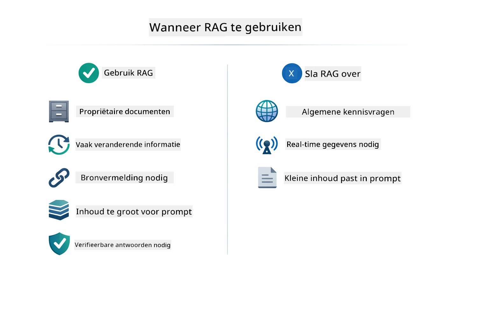

*Dit diagram toont een beslisgids voor wanneer RAG waarde toevoegt versus wanneer simpelere aanpakken genoeg zijn.*

**Gebruik RAG wanneer:**
- Je vragen beantwoordt over propriëtaire documenten
- Informatie vaak verandert (beleid, prijzen, specificaties)
- Nauwkeurigheid bronvermelding vereist
- Inhoud te groot is voor één enkele prompt
- Je verifieerbare, gefundeerde antwoorden nodig hebt

**Gebruik RAG niet wanneer:**
- Vragen algemene kennis vereisen die het model al heeft
- Realtime data nodig is (RAG werkt met geüploade documenten)
- Inhoud klein genoeg is om direct in prompts op te nemen

## Volgende Stappen

**Volgende Module:** [04-tools - AI Agents met Tools](../04-tools/README.md)

---

**Navigatie:** [← Vorige: Module 02 - Prompt Engineering](../02-prompt-engineering/README.md) | [Terug naar Hoofdmap](../README.md) | [Volgende: Module 04 - Tools →](../04-tools/README.md)

---

<!-- CO-OP TRANSLATOR DISCLAIMER START -->
**Disclaimer**:  
Dit document is vertaald met behulp van de AI-vertalingsdienst [Co-op Translator](https://github.com/Azure/co-op-translator). Hoewel we streven naar nauwkeurigheid, dient u er rekening mee te houden dat geautomatiseerde vertalingen fouten of onnauwkeurigheden kunnen bevatten. Het originele document in de oorspronkelijke taal geldt als de gezaghebbende bron. Voor kritieke informatie wordt professionele menselijke vertaling aanbevolen. Wij zijn niet aansprakelijk voor enige misverstanden of verkeerde interpretaties voortvloeiend uit het gebruik van deze vertaling.
<!-- CO-OP TRANSLATOR DISCLAIMER END -->